# 数据结构与算法

## 前言

### 目标

数据结构与算法的特点、应用场景、JS 实现、时间/空间复杂度。

### 简介

数据结构：计算机存储、组织数据的方式，

算法：一系列解决问题的清晰指令。

#### 数据结构与算法关系

程序 = 数据结构 + 算法

数据结构为算法提供服务，算法围绕数据结构操作。

#### 需要学习的数据结构

* 栈、队列、链表
* 集合、字典
* 树、堆、图

#### 需要学习的算法

* 链表：遍历链表、删除链表节点
* 树、图：深度/广度优先遍历
* 数组：冒泡/选择/插入/归并/快速排序、顺序/二分搜索

### 刷题

刷题网站：推荐使用 LeetCode

刷题顺序：推荐按照类型刷题，集中训练

重点关注：通用套路、时间/空间复杂度分析和优化

#### LeetCode

LeetCode 是一个专注于程序员技术成长和企业技术人才服务的品牌。

功能：题库、社区、竞赛、模拟面试等。

### 实战

* 前端与数据结构/算法的结合点
* 在工作中与数据结构/算法打交道

## 时间复杂度/空间复杂度

### 时间复杂度

一个函数，用大O表示，比如 O(1)、O(n)、O(logN)...

定性描述该算法的运行时间。


#### O(1)

```js
let i = 0;
i += 1;
```

#### O(n)

```js
for (let i = 0; i < n; i += 1) {
  console.log(i);
}
```

```js
let i = 0;
i += 1;

for (let i = 0; i < n; i += 1) {
  console.log(i);
}
```

O(1) + O(n) = O(n)

#### O(n^2)

```js
for (let i = 0; i < n; i += 1) {
  for (let j = 0; j < n; j += 1) {
  	console.log(i, j);
  }
}
```

#### O(logN)

```js
let i = 1;

while (i < n) {
  console.log(i);
  i *= 2;
}
```

### 空间复杂度

一个函数，用大O表示，比如 O(1)、O(n)、O(n^2)...

算法在运行过程中临时占用存储空间大小的量度。

#### O(1)

```js
let i = 0;
i += 1;
```

#### O(n)

```js
const list = [];

for (let i = 0; i < n; i+= 1) {
  list.push(i);
}
```

#### O(n^2)

矩阵。存储了 n^2 个变量。

```js
const matrix = [];

for (let i = 0; i < n; i += 1) {
  matrix.push([]);
  
  for (let j = 0; j < n; j += 1) {
    matrix[i].push(j);
  }
}
```

## 一、栈

### 栈是什么

一个后进先出的数据结构。比如堆放杂物，后面的肯定在上面，先拿出来。

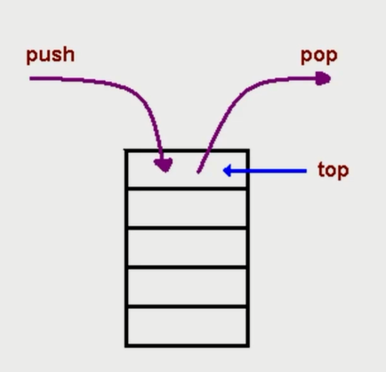

JavaScript 中没有栈，但可以是用 Array 实现栈的所有功能。

```js
const stack = [];

stack.push(1);
stack.push(2);

const item1 = stack.pop();
const item2 = stack.pop();
```

### 栈的应用场景

所有需要后进先出的场景，都可以使用栈。

比如：十进制转二进制、判断字符串的括号是否有效、函数调用堆栈等。

#### 十进制转二进制

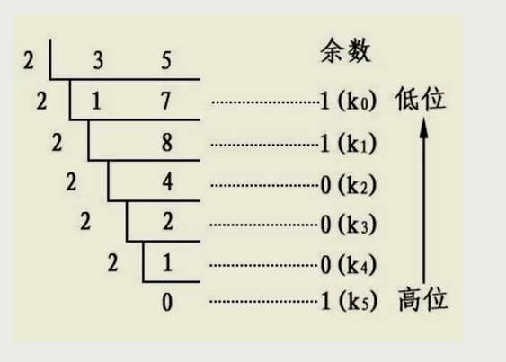

后出来的余数要排到前面。

把余数依次入栈，然后再出栈，就可以实现余数倒序输出。

#### 有效的括号


越靠后的左括号，对应的右括号越靠前。

左括号入栈，右括号出栈，最后栈空了就是合法的。

#### 函数调用堆栈

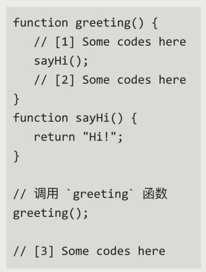

最后被调用的函数，最先执行完。

JS 解释器使用栈来控制函数的调用顺序。

### leetcode 20：有效的括号

给定一个只包括 '('，')'，'{'，'}'，'['，']' 的字符串，判断字符串是否有效。

有效字符串需满足：

左括号必须用相同类型的右括号闭合。
左括号必须以正确的顺序闭合。
注意空字符串可被认为是有效字符串。

#### 示例

**示例 1:**

```html
输入: "()"
输出: true
```

**示例 2:**

```html
输入: "()[]{}"
输出: true
```

**示例 3:**

```html
输入: "(]"
输出: false
```

**示例 4:**

```html
输入: "([)]"
输出: false
```

**示例 5:**

```html
输入: "{[]}"
输出: true
```

#### 解题思路

对于没有闭合的左括号而言，越靠后的左括号，对应的右括号越靠前。

满足后进先出，考虑用栈。

#### 解题步骤

<div></div>

1. 新建一个栈。

2. 遍历字符串，遇到左括号入栈，遇到和栈顶括号类型匹配的右括号就出栈，类型不匹配直接判断为不合法。

3. 最后栈空了就合法，否则不合法。

#### 代码实现

**第一种解法**

```js
/**
 * @description 检测有序的序号
 * @param {string} s 
 * @return {boolean}
 */
var isValid = function (s) {
  if (s.length % 2 === 1) return false;

  const stack = [];

  for (let i = 0; i < s.length; i++) {
    const c = s[i];

    if (c === '(' || c === '{' || c === '[') {
      stack.push(c);
    } else {
      const t = stack[stack.length - 1];

      if (
        (t === '(' && c === ')') || 
        (t === '{' && c === '}') || 
        (t === '[' && c === ']')
      ) {
        stack.pop();
      } else {
        return false;
      }
    }
  }

  return stack.length === 0;
};
```

时间复杂度 O(n)、空间复杂度O(n) 。

**第二种解法**

```js
/**
 * @description 检测有序的序号
 * @param {string} s 
 * @return {boolean}
 */
var isValid = function (s) {
  if (s.length % 2 === 1) return false;

  const map = new Map([
    ['{', '}'],
    ['[', ']'],
    ['(', ')']
  ])

  const stack = [];

  for (let i = 0; i < s.length; i++) {
    const c = s[i];

    if (map.has(c)) {
      stack.push(map.get(c));
    } else {
      if (stack.pop() !== c) {
        return false;
      }
    }
  }

  return stack.length === 0;
};
```

时间复杂度 O(n)、空间复杂度O(n) 。

### 前端与栈：JS中的函数调用栈

```js
const func1 = () => {
  func2();
};
const func2 = () => {
  func3();
};
const func3 = () => {};

func1();
```


### leetcode 144：二叉树的前序遍历

给你二叉树的根节点 `root` ，返回它节点值的 **前序** 遍历。

#### 示例

**示例一**

<div></div>

```html
输入：root = [1,null,2,3]
输出：[1,2,3]
```

**示例二**

```html
输入：root = []
输出：[]
```

**示例三**

```html
输入：root = [1]
输出：[1]
```

**示例四**

<div></div>

```html
输入：root = [1,2]
输出：[1,2]
```

**示例五**

<div></div>

```html
输入：root = [1,null,2]
输出：[1,2]
```

#### 解题思路

模拟函数调用堆栈的过程。使用迭代算法完成。

#### 解题步骤

1. 创建一个 res  数组，存在最终返回的数据。

2. 创建一个 stack，首先将根节点推入栈中。

3. 取出栈顶的元素，向 res 中添加当前节点的值。

   如果当前节点的右子节点存在，推入栈中；

   如果当前节点的左子节点存在，推入栈中；

4. 重复 3 过程，直至栈中没有数据，返回 res。

#### 代码实现

```js
/**
 * Definition for a binary tree node.
 * function TreeNode(val, left, right) {
 *     this.val = (val===undefined ? 0 : val)
 *     this.left = (left===undefined ? null : left)
 *     this.right = (right===undefined ? null : right)
 * }
 */
/**
 * @param {TreeNode} root
 * @return {number[]}
 */
var preorderTraversal = function (root) {
  const res = [];
  const stack = [];

  if (root) stack.push(root);

  while (stack.length) {
    const n = stack.pop();

    res.push(n.val);

    if (n.right) stack.push(n.right);
    if (n.left) stack.push(n.left);
  }

  return res;
};
```

时间复杂度 O(n)、空间复杂度O(n) 。

### 总结

栈是一个后进先出的数据结构。

JavaScript 中没有栈，但可以使用 Array 实现栈的所有功能。

栈常用操作：push、pop、statck[stack.length - 1]。

## 二、队列

### 队列是什么

一个先进先出的数据结构。


JavaScript 中没有队列，但可以是用 Array 实现队列的所有功能。

### 队列的应用场景

所有需要先进先出的场景，都可以使用队列。

比如：食堂排队打饭、JS 异步中的任务队列、计算最近请求次数等。

#### 食堂排队打饭

先进先出，保持有序。

#### JS 异步中的任务队列

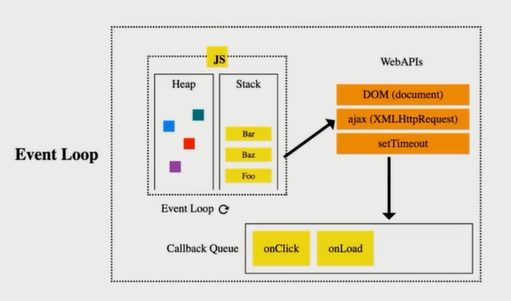

JS 是单线程的，无法同时处理异步中的并发任务。

使用任务队列先后处理异步任务。

####  计算最近请求次数

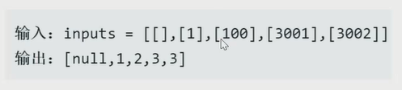

新建队列，有新请求入队，3000 ms 前发出的请求出队。

队列的长度就是最新的请求次数。

### leetcode 933：最新的请求次数

写一个 `RecentCounter` 类来计算特定时间范围内最近的请求。

请你实现 `RecentCounter` 类：

- `RecentCounter()` 初始化计数器，请求数为 0 。
- `int ping(int t)` 在时间 `t` 添加一个新请求，其中 `t` 表示以毫秒为单位的某个时间，并返回过去 `3000` 毫秒内发生的所有请求数（包括新请求）。确切地说，返回在 `[t-3000, t]` 内发生的请求数。

**保证** 每次对 `ping` 的调用都使用比之前更大的 `t` 值。

#### 示例

输入：

```js
["RecentCounter", "ping", "ping", "ping", "ping"]
[[], [1], [100], [3001], [3002]]
```

输出：

```js
[null, 1, 2, 3, 3]
```

解释：
RecentCounter recentCounter = new RecentCounter();
recentCounter.ping(1);     // requests = [1]，范围是 [-2999,1]，返回 1
recentCounter.ping(100);   // requests = [1, 100]，范围是 [-2900,100]，返回 2
recentCounter.ping(3001);  // requests = [1, 100, 3001]，范围是 [1,3001]，返回 3
recentCounter.ping(3002);  // requests = [1, 100, 3001, 3002]，范围是 [2,3002]，返回 3

#### 解题思路

越早发出的请求越早不在最新 3000ms 的请求里。

满足先进先出，考虑使用队列。

#### 解题步骤

1. 新建队列；
2. 有新请求就入队，3000ms 前发出的请求入队；
3. 队列的长度就是最近请求次数；

#### 代码实现

```js
var RecentCounter = function () {
  this.queue = [];
};

/** 
 * @param {number} t
 * @return {number}
 */
RecentCounter.prototype.ping = function (t) {
  this.queue.push(t);

  while (this.queue[0] < t - 3000) {
    this.queue.shift();
  }
  
  return this.queue.length;
};

/**
 * Your RecentCounter object will be instantiated and called as such:
 * var obj = new RecentCounter()
 * var param_1 = obj.ping(t)
 */
```

时间复杂度 O(n)、空间复杂度O(n) 。

### 前端与队列：JS 异步中的任务队列

```js
setTimeout(() => console.log(1), 0);
console.log(2);
// 2 1
```


### 总结

队列是一个先进先出的数据结构。

JavaScript 中没有队列，但可以用 Array 实现队列的所有功能。

队列常用操作：push、shift、queue[0]

## 三、链表

### 链表是什么

多个元素组成的列表。

元素存储不连续，用 next 指针连在一起。

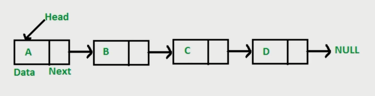

#### 数据 VS 链表

数组：增删非首尾元素时需要移动元素。

链表：增删非首尾元素，不需要移动元素，只需要更改 next 的指向即可。

#### JS 中的链表

JavaScript 中没有链表。可以用 Object 模拟链表。

```js
const a = { val: 'a' };
const b = { val: 'b' };
const c = { val: 'c' };
const d = { val: 'd' };

a.next = b;
b.next = c;
c.next = d;

// 遍历链表
let p = a;

while (p) {
  console.log(p.val);
  p = p.next;
}

// 插入
const e = { val: 'e' };
c.next = e;
e.next = d;

// 删除
c.next = d;
```

### leetcode 234：删除链表中的节点

请编写一个函数，使其可以删除某个链表中给定的（非末尾）节点。传入函数的唯一参数为 要被删除的节点 。

现有一个链表 -- head = [4,5,1,9]，它可以表示为:


#### 示例

**示例 1:**

输入：head = [4,5,1,9], node = 5
输出：[4,1,9]
解释：给定你链表中值为 5 的第二个节点，那么在调用了你的函数之后，该链表应变为 4 -> 1 -> 9.

**示例 1:**

```html
输入：head = [4,5,1,9], node = 5
输出：[4,1,9]
解释：给定你链表中值为 5 的第二个节点，那么在调用了你的函数之后，该链表应变为 4 -> 1 -> 9.
```

**示例 2:**

```html
输入：head = [4,5,1,9], node = 1
输出：[4,5,9]
解释：给定你链表中值为 1 的第三个节点，那么在调用了你的函数之后，该链表应变为 4 -> 5 -> 9.
```

#### 解题思路

无法直接获取被删除节点的上个节点。

将被删除节点转移到下个节点。

#### 解题步骤

1. 将被删节点的值改为下个节点的值。
2. 删除下个节点。

#### 代码实现

```js
/**
 * Definition for singly-linked list.
 * function ListNode(val) {
 *     this.val = val;
 *     this.next = null;
 * }
 */
/**
 * @param {ListNode} node
 * @return {void} Do not return anything, modify node in-place instead.
 */
var deleteNode = function (node) {
  node.val = node.next.val;
  node.next = node.next.next;
};
```

时间复杂度 O(1)、空间复杂度O(1) 。

### leetcode 206：反转链表

反转一个单链表。

#### 示例

```html
输入: 1->2->3->4->5->NULL
输出: 5->4->3->2->1->NULL
```

#### 解题思路

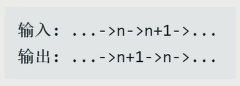

反转两个节点：将 n + 1 的 next 指向 n。

反转多个节点：双指针遍历链表，重复上述操作。

#### 解题步骤

1. 双指针一前一后遍历链表；
2. 反转双指针；

#### 代码实现

```js
/**
 * Definition for singly-linked list.
 * function ListNode(val) {
 *     this.val = val;
 *     this.next = null;
 * }
 */
/**
 * @param {ListNode} head
 * @return {ListNode}
 */
var reverseList = function (head) {
  let p1 = head,
      p2 = null;

  while (p1) {
    const tmp = p1.next;
    p1.next = p2;
    p2 = p1;
    p1 = tmp;
  }

  return p2;
};
```

时间复杂度 O(n)、空间复杂度O(1) 。

### leetcode 2：两数相加

给你两个 非空 的链表，表示两个非负的整数。它们每位数字都是按照 逆序 的方式存储的，并且每个节点只能存储 一位 数字。

请你将两个数相加，并以相同形式返回一个表示和的链表。

你可以假设除了数字 0 之外，这两个数都不会以 0 开头。

#### 示例

**示例 1:**


```html
输入：l1 = [2,4,3], l2 = [5,6,4]
输出：[7,0,8]
解释：342 + 465 = 807.
```

**示例 2:**

```html
输入：l1 = [0], l2 = [0]
输出：[0]
```

**示例 3:**

```html
输入：l1 = [9,9,9,9,9,9,9], l2 = [9,9,9,9]
输出：[8,9,9,9,0,0,0,1]
```

#### 解题思路

需要遍历链表，模拟相加操作。

#### 解题步骤

1. 新建一个空链表；
2. 遍历被相加的两个链表，模拟相加操作，将个位数追加到新链表上，将十位数留到下一位去相加。

#### 代码实现

```js
/**
 * Definition for singly-linked list.
 * function ListNode(val, next) {
 *     this.val = (val===undefined ? 0 : val)
 *     this.next = (next===undefined ? null : next)
 * }
 */
/**
 * @param {ListNode} l1
 * @param {ListNode} l2
 * @return {ListNode}
 */
var addTwoNumbers = function (l1, l2) {
  const l3 = new ListNode(0);

  let p1 = l1,
      p2 = l2, 
      p3 = l3;

  let carry = 0;

  while (p1 || p2) {
    const v1 = p1 ? p1.val : 0,
          v2 = p2 ? p2.val : 0;
    const val = v1 + v2 + carry;

    carry = Math.floor(val / 10);
    p3.next = new ListNode(val % 10);

    if (p1) p1 = p1.next;
    if (p2) p2 = p2.next;
    p3 = p3.next;
  }

  if (carry) {
    p3.next = new ListNode(carry);
  }

  return l3.next;
};
```

时间复杂度 O(n)、空间复杂度O(n) 。

### leetcode 83：删除排序链表中的重复元素

给定一个排序链表，删除所有重复的元素，使得每个元素只出现一次。

#### 示例

**示例 1:**

```html
输入: 1->1->2
输出: 1->2
```

**示例 2:**

```html
输入: 1->1->2->3->3
输出: 1->2->3
```

#### 解题思路

因为链表是有序的，所以重复元素一定相邻。

遍历链表，如果发现当前元素和下个元素值相同，就删除下个元素值。

#### 解题步骤

1. 遍历链表，如果发现当前元素和下个元素值相同，就删除下个元素值。
2. 遍历结束后，返回原链表的头部。

#### 代码实现

```js
/**
 * Definition for singly-linked list.
 * function ListNode(val, next) {
 *     this.val = (val===undefined ? 0 : val)
 *     this.next = (next===undefined ? null : next)
 * }
 */
/**
 * @param {ListNode} head
 * @return {ListNode}
 */
var deleteDuplicates = function (head) {
  let p = head;

  while (p && p.next) {
    if (p.val === p.next.val) {
      p.next = p.next.next;
    } else {
      p = p.next;
    }
  }

  return head;
};
```

时间复杂度 O(n)、空间复杂度O(1) 。

### leetcode 141：环形链表

给定一个链表，判断链表中是否有环。

如果链表中有某个节点，可以通过连续跟踪 next 指针再次到达，则链表中存在环。 为了表示给定链表中的环，我们使用整数 pos 来表示链表尾连接到链表中的位置（索引从 0 开始）。 如果 pos 是 -1，则在该链表中没有环。注意：pos 不作为参数进行传递，仅仅是为了标识链表的实际情况。

如果链表中存在环，则返回 true 。 否则，返回 false 。

#### 示例

**示例 1：**


```html
输入：head = [3,2,0,-4], pos = 1
输出：true
解释：链表中有一个环，其尾部连接到第二个节点。
```

**示例 2：**


```html
输入：head = [1,2], pos = 0
输出：true
解释：链表中有一个环，其尾部连接到第一个节点。
```

**示例 3：**


```html
输入：head = [1], pos = -1
输出：false
解释：链表中没有环。
```

#### 解题思路

两个人在圆形操场上的起点同时起跑，速度快的人一定会超过速度慢的人一圈。

可以使用一快一慢两个指针遍历链表，如果指针能够相逢，那么链表就有环。

#### 解题步骤

1. 用一快一慢两个指针遍历链表，如果指针能够相逢，就返回 true；
2. 遍历结束后，如果两个指针还没有相逢就返回 false；

#### 代码实现

```js
/**
 * Definition for singly-linked list.
 * function ListNode(val) {
 *     this.val = val;
 *     this.next = null;
 * }
 */

/**
 * @param {ListNode} head
 * @return {boolean}
 */
var hasCycle = function (head) {
  let p1 = head,
      p2 = head;

  while (p1 && p2 && p2.next) {
    p1 = p1.next;
    p2 = p2.next.next;

    if (p1 === p2) {
      return true;
    }
  }

  return false;
};
```

时间复杂度 O(n)、空间复杂度O(1) 。

### 前端与链表：JS 中的原型链

原型链的本质是链表。

原型链上的节点是各种原型对象，比如 ```Function.prototype``` 、``` Object.prototype ``` 。。。

原型链通过 ```__proto__``` 属性连接各种原型对象。

#### 原型链长什么样

```js
obj -> Object.prototype
```

```js
func -> Function.prototype -> Object.prototype
```

```js
arr -> Array.prototype -> Object.prototype
```

```js
const obj = {};
const func = () => {};
const arr = [];
```

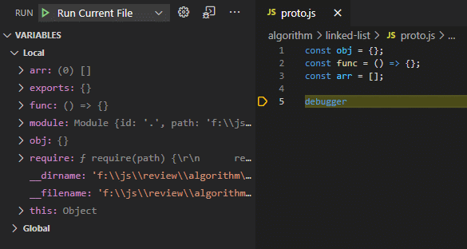

#### 原型链考点

##### 相关知识点

* 如果 A 沿着原型链能找到 B.prototype，那么 A instanceof B 为 true。

  ```js
  arr instanceof Array // true
  arr instanceof Object // ture
  ```

*  如果在 A 对象上没有找到 x 属性，那么会沿着原型链找 x 属性。

  ```js
  const obj = {};
  Object.prototype.x = 'x';
  console.log(obj.x); // 'x'
  ```

****

##### 面试题

**instanceOf 的原理，并由代码实现。**

```js
/**
 * @description 判断 A 是否是 B 的实例
 * @param {object} A 
 * @param {object} B 
 * @returns {boolean}
 */
const instanceOf = (A, B) => {
  let p = A;

  while (p) {
    if (p === B.prototype) {
      return true;
    }

    p = p.__proto__;
  }

  return false;
}
```

**判断打印值**

```js
var foo = {},
    F = function () {};

Object.prototype.a = 'value a';
Function.prototype.b = 'value b';

console.log(foo.a);
console.log(foo.b);

console.log(F.a);
console.log(F.b);
```

```js
// value a
// undefined

// value a
// value b
```

### 前端与链表：使用链表指针获取 JSON 的节点值

```js
const json = {
  a: { b: { c: 1 } },
  d: { e: 2 }
}

const path = ['a', 'b', 'c'];
```

```js
let p = json;

path.forEach(k => {
  p = p[k];
})

console.log(p);
```

```js
const v = path.reduce((prev, k) => prev[k], json);
console.log(v);
```

### 总结

链表里的元素存储不是连续的，之间通过 next 连接。

JavaScript 中没有链表，但可以用 Object 模拟链表。

链表常用操作：修改 next、遍历链表。

JS 中的原型链也是一个链表。

使用链表指针可以获取 JSON 的节点值。

## 四、集合

### 集合是什么

集合是一种无需且唯一的数据结构。

ES6 中有集合，名为 Set。

集合的常用操作：去重、判断元素是否在集合中、求交集。。。

### 集合的应用场景

#### 数组去重

```js
const arr = [1, 1, 2, 2];
const arr2 = [...new Set(arr)];
```

#### 判断元素是否在集合中

```js
const set = new Set(arr);
const has = set.has(1);
```

#### 求交集

```js
const set2 = new Set([2, 3]);
const set3 = new Set([...set2].filter(item => set.has(item)));
```

### leetcode 349：两个数组的交集

给定两个数组，编写一个函数来计算它们的交集。

#### 示例

**示例 1：**

```html
输入：nums1 = [1,2,2,1], nums2 = [2,2]
输出：[2]
```

**示例 2：**

```html
输入：nums1 = [4,9,5], nums2 = [9,4,9,8,4]
输出：[9,4]
```

#### 解题思路

求交集且无序唯一。

使用集合。

#### 解题步骤

1. 用集合对 nums1 进行去重；
2. 遍历 nums1，筛选出 nums2 中也包含的值。

#### 代码实现

```js
/**
 * @param {number[]} nums1
 * @param {number[]} nums2
 * @return {number[]}
 */
var intersection = function (nums1, nums2) {
  return [...new Set(nums1)].filter(num => nums2.includes(num));
};
```

时间复杂度 O(m*n)、空间复杂度O(m) 。

### 前端与集合：使用 ES6 中的 Set

```js
const set = new Set();
```

#### 使用 Set 对象

```js
// 添加元素
set.add(1);
set.add(5);
set.add(5);
set.add('some text');

const obj = { a: 1, b: 2 };
set.add(obj);

// 判断元素是否存在
const has = set.has(5);

// 删除元素
set.delete(5);

// 获取集合数量
const size = set.size();
```

#### 迭代 Set

```js
// for of 
for (let item of set) {
  console.log(item);
}

// keys
for (let item of set.keys()) {
  console.log(item);
}

// values
for (let item of set.values()) {
  console.log(item);
}

// entries
for (let item of set.entries()) {
  console.log(item);
}
```

#### Set、Array 转化

```js
// Set 转为 Array
[...set];
Array.from(set);

// Array 转 Set
new Set([1, 2, 3]);
```

#### 求交集和差集

```js
// 交集
const intersection = new Set([...set].filter(x => set2.has(x)));

// 差集
const difference = new Set([...set].filter(x => !set2.has(x)));
```

### 总结

集合是一种无序且唯一的数据结构。

ES6中有集合，名为 Set。

集合的常用操作：去重、判断某元素是否在集合中、求交集。。。

## 五、字典

### 字典是什么

与集合类似，字典也是一种存储唯一值的数据结构，但它是以键值对的形式来存储。

ES6 中有字典，名为 Map。

字典的常用操作：键值对的增删改查。

```js
const map = new Map();

// 增加
map.set('a', 'aa');
map.set('b', 'bb');

// 修改
map.set('a', 'aaa');

// 查找
const item = map.get('b');

// 删除
map.delete('b');
map.clear();
```

### leetcode 349：两个数组的交集

给定两个数组，编写一个函数来计算它们的交集。

#### 示例

**示例 1：**

```html
输入：nums1 = [1,2,2,1], nums2 = [2,2]
输出：[2]
```

**示例 2：**

```html
输入：nums1 = [4,9,5], nums2 = [9,4,9,8,4]
输出：[9,4]
```

#### 解题思路

求 nums1 和 nums2 都有的值。

用字典建立一个映射关系，记录 nums1 里有的值。

遍历 nums2，找出 nums1 里也有的值。

#### 解题步骤

1. 新建一个字典，遍历 nums1，填充字典；
2. 遍历 nums 2，遇到字典里的值就选出，并从字典里删除；

#### 代码实现

```js
/**
 * @param {number[]} nums1
 * @param {number[]} nums2
 * @return {number[]}
 */
var intersection = function (nums1, nums2) {
  const map = new Map();

  nums1.forEach(n => map.set(n, true));

  const res = [];

  nums2.forEach(n => {
    if (map.get(n)) {
      res.push(n);
      map.delete(n);
    }
  });

  return res;
};
```

时间复杂度 O(m+n)、空间复杂度O(m) 。

### leetcode 1：两数之和

给定一个整数数组 nums 和一个整数目标值 target，请你在该数组中找出 和为目标值 的那 两个 整数，并返回它们的数组下标。

你可以假设每种输入只会对应一个答案。但是，数组中同一个元素不能使用两遍。你可以按任意顺序返回答案。

#### 示例

**示例 1：**

```html
输入：nums = [2,7,11,15], target = 9
输出：[0,1]
解释：因为 nums[0] + nums[1] == 9 ，返回 [0, 1] 。
```

**示例 2：**

```html
输入：nums = [3,2,4], target = 6
输出：[1,2]
```

**示例 3：**

```html
输入：nums = [3,3], target = 6
输出：[0,1]
```

#### 解题思路

把 nums 想象成相亲者。

把 target 想象成匹配条件。

用字典建立一个婚姻介绍所，存储相亲者的数字和下标。

#### 解题步骤

1. 新建一个字典作为婚姻介绍所；
2. 遍历 nums 数组，逐个来介绍所找对象，没有合适的就先登记，有合适的就牵手成功；

#### 代码实现

```js
/**
 * @param {number[]} nums
 * @param {number} target
 * @return {number[]}
 */
var twoSum = function (nums, target) {
  const map = new Map();

  for (let i = 0; i < nums.length; i++) {
    const n = nums[i];
    const n2  = target - n;

    if (map.has(n2)) {
      return [map.get(n2), i];
    } else {
      map.set(n, i);
    }
  }

  return [];
};
```

时间复杂度 O(n)、空间复杂度O(n) 。

### leetcode 3：无重复字符的最长字串

给定一个字符串，请你找出其中不含有重复字符的 **最长子串** 的长度。

#### 示例

**示例 1:**

```html
输入: s = "abcabcbb"
输出: 3 
解释: 因为无重复字符的最长子串是 "abc"，所以其长度为 3。
```

**示例 2:**

```html
输入: s = "bbbbb"
输出: 1
解释: 因为无重复字符的最长子串是 "b"，所以其长度为 1。
```

**示例 3:**

```html
输入: s = "pwwkew"
输出: 3
解释: 因为无重复字符的最长子串是 "wke"，所以其长度为 3。
     请注意，你的答案必须是 子串 的长度，"pwke" 是一个子序列，不是子串。
```

**示例 4:**

```
输入: s = ""
输出: 0
```

#### 解题思路

先找出所有的不包含重复字符的字串。

找出长度最大的那个字串，返回其长度即可。

#### 解题步骤

1. 用双指针维护一个滑动窗口，用来剪切字串；
2. 不断移动右指针，遇到重复字符，就把左指针移动到重复字符的下一位；
3. 过程中，记录所有窗口的长度，并返回最大值；

#### 代码实现

```js
/**
 * @param {string} s
 * @return {number}
 */
var lengthOfLongestSubstring = function (s) {
  const map = new Map();

  let leftIdx = 0,
      max = 0;

  for (let i = 0; i < s.length; i++) {
    if (map.has(s[i]) && map.get(s[i]) >= leftIdx) {
      leftIdx = map.get(s[i]) + 1;
    }
    max = Math.max(max, i - leftIdx + 1);
    map.set(s[i], i);
  }

  return max;
};
```

时间复杂度 O(n)、空间复杂度O(m) 。m 为字符串中不重复字符的个数。

### leetcode 76：最小覆盖字串

给你一个字符串 s 、一个字符串 t 。返回 s 中涵盖 t 所有字符的最小子串。

如果 s 中不存在涵盖 t 所有字符的子串，则返回空字符串 "" 。

注意：如果 s 中存在这样的子串，我们保证它是唯一的答案。

#### 示例

**示例 1：**

```html
输入：s = "ADOBECODEBANC", t = "ABC"
输出："BANC"
```

**示例 2：**

```html
输入：s = "a", t = "a"
输出："a"
```

#### 解题思路

先找出所有包含 t 的字符串。

找出长度最小的那个字串，返回即可。

#### 解题步骤

1. 用双指针维护一个滑动窗口；
2. 移动右指针，找到包含 t 的字符串，移动左指针，尽量减少包含 t 的字串的长度；
3. 循环上述过程，找出包含 t 的最小字串；

#### 代码实现

```js
/**
 * @param {string} s
 * @param {string} t
 * @return {string}
 */
var minWindow = function (s, t) {
  let leftIdx = 0,
      rightIdx = 0;

  const need = new Map();

  for (let c of t) {
    need.set(c, need.has(c) ? need.get(c) + 1 : 1);
  }

  let needType = need.size;
  let res = '';

  while (rightIdx < s.length) {
    const c = s[rightIdx];

    if (need.has(c)) {
      need.set(c, need.get(c) - 1);
      if (need.get(c) === 0) needType -= 1;
    }

    while (needType === 0) {
      const newRes = s.substring(leftIdx, rightIdx + 1);

      if (!res || newRes.length < res.length) res = newRes;

      const c2 = s[leftIdx];
      if (need.has(c2)) {
        need.set(c2, need.get(c2) + 1);
        if (need.get(c2) === 1) needType += 1;
      }
      leftIdx += 1;
    }

    rightIdx += 1;
  }

  return res;
};
```

时间复杂度 O(m+n)，m 是 t 的长度，n 是 s 的长度。

空间复杂度O(m) ，m 是中不重复字符的个数。

###  总结

字段与集合类似，字典也是一种存储唯一值的数据结构，但它是以**键值对**的形式来存储。

ES6 中有字典，名为 Map。

字典的常用操作：键值对的增删改查。

## 六、树

### 树是什么

一种**分层数据**的抽象模型。

前端工作中常见的树包括：DOM 树、级联选择、树形控件。。。

JS 中没有树，但是可以用 Object 和 Array 构建树。

```js
{
  value: 'zhejiang',
  label: 'zhejiang',
  children: [
    {
      value: 'hangzhou',
      label: 'hangzhou',
      children: [
        {
          value: 'xihu',
          label: 'xihu',
        }
      ]
    }
  ]
}
```

树的常用操作：深度/广度优先遍历、先/中/后序遍历。

### 深度与广度优先遍历

#### 什么是深度与广度优先遍历

深度优先遍历：尽可能深的搜索树的分支。

<div></div>

广度优先遍历：先访问离根节点最近的节点。

<div></div>

#### tree 模拟数据

```js
const tree = {
  val: 'a',
  children: [
    {
      val: 'b',
      children: [
        {
          val: 'd',
          children: []
        },
        {
          val: 'e',
          children: []
        }
      ]
    },
    {
      val: 'c',
      children: [
        {
          val: 'f',
          children: []
        },
        {
          val: 'g',
          children: []
        }
      ]
    }
  ]
};
```

#### 深度优先遍历

1. 访问根节点；
2. 对根节点的 children 挨个进行深度优先遍历；

```js
const dfs = (root) => {
  console.log(root.val);
  root.children.forEach(dfs);
}

dfs(tree);
```

#### 广度优先遍历

1. 新建一个队列，把根节点入队；
2. 把队头出队并访问；
3. 把队头的 children 挨个入队；
4. 重复 2，3 步，直到队列为空；

```js
const bfs = (root) => {
  const queue = [root];

  while (queue.length) {
    const n = queue.shift();

    console.log(n.val);

    n.children.forEach(child => {
      queue.push(child);
    });
  }
}

bfs(tree);
```

### 二叉树的先中后序遍历（递归）

#### 二叉树是什么

树中每个节点最多只能有两个子节点。


在 JS 中通常用 Object 来模拟二叉树。

```js
const binaryTree = {
  val: 1,
  left: {
    val: 2,
    left: null,
    right: null
  },
  right: {
    val: 3,
    left: null,
    right: null
  }
};
```

#### binaryTree 模拟数据

```js
const binaryTree = {
  val: 1,
  left: {
    val: 2,
    left: {
      val: 4,
      left: null,
      right: null
    },
    right: {
      val: 5,
      left: null,
      right: null
    }
  },
  right: {
    val: 3,
    left: {
      val: 6,
      left: null,
      right: null
    },
    right: {
      val: 7,
      left: null,
      right: null
    }
  }
};
```

#### 先序遍历

1. 访问根节点；
2. 对根节点的左子树进行先序遍历；
3. 对根节点的右子树进行先序遍历;

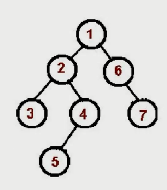

```js
const preorder = (root) => {
  if (!root) return;

  console.log(root.val);

  preorder(root.left);
  preorder(root.right);
}

preorder(binaryTree);
```

#### 中序遍历

1. 对根节点的左子树进行中序遍历；
2. 访问根节点；
3. 对根节点的右子树进行中序遍历；


```js
const inorder = (root) => {
  if (!root) return;

  inorder(root.left);
  console.log(root.val);
  inorder(root.right);
}

inorder(binaryTree);
```

#### 后序遍历

1. 对根节点的左子树进行后序遍历；
2. 对根节点的右子树进行后序遍历；
3. 访问根节点；

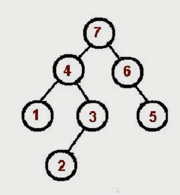

```js
const postorder = (root) => {
  if (!root) return;

  postorder(root.left);
  postorder(root.right);
  console.log(root.val);
}

postorder(binaryTree);
```

#### 总结

先序遍历：根 - 左 - 右。

中序遍历：左 - 根 - 右。

后序遍历：左 - 右 - 根。

### 二叉树的先中后序遍历（非递归）

#### 先序遍历


```js
const preorder = (root) => {
  if (!root) return;

  const stack = [root];

  while (stack.length) {
    const n = stack.pop();

    console.log(n.val);

    if (n.right) stack.push(n.right);
    if (n.left) stack.push(n.left);
  }
}

preorder(binaryTree);
```

#### 中序遍历


```js
const inorder = (root) => {
  if (!root) return;

  const stack = [];

  let p = root;

  while (stack.length || p) {
    while (p) {
      stack.push(p);
      p = p.left;
    }
  
    const n = stack.pop();
    console.log(n.val);
  
    p = n.right;
  }
}

inorder(binaryTree);
```

#### 后序遍历


```js
const postorder = (root) => {
  if (!root) return;

  const outputStack = [];
  const stack = [root];
  
  while (stack.length) {
    const n = stack.pop();

    outputStack.push(n);

    if (n.left) stack.push(n.left);
    if (n.right) stack.push(n.right);
  }

  while (outputStack.length) {
    const n = outputStack.pop();
    console.log(n.val);
  }
}

postorder(binaryTree);
```

### leetcode 104：二叉树的最大深度

给定一个二叉树，找出其最大深度。

二叉树的深度为根节点到最远叶子节点的最长路径上的节点数。

**说明:** 叶子节点是指没有子节点的节点。

#### 示例

给定二叉树 `[3,9,20,null,null,15,7]`，

```html
    3
   / \
  9  20
    /  \
   15   7
```

#### 解题思路

求最大深度，考虑使用深度优先遍历。

深度优先遍历过程中，记录每个节点所在的层级，找出最大的层级即可。

#### 解题步骤

1. 新建一个变量，记录最大深度；
2. 深度优先遍历整棵树，并记录每个节点的层级，同时不断刷新最大深度这个变量；
3. 遍历结束返回最大深度这个变量；

#### 代码实现

```js
/**
 * Definition for a binary tree node.
 * function TreeNode(val, left, right) {
 *     this.val = (val===undefined ? 0 : val)
 *     this.left = (left===undefined ? null : left)
 *     this.right = (right===undefined ? null : right)
 * }
 */
/**
 * @param {TreeNode} root
 * @return {number}
 */
var maxDepth = function(root) {
  let total = 0;

  const dfs = (n, l) => {
    if (!n) return;

    if (!n.left && !n.right) {
      total = Math.max(total, l);
    }

    dfs(n.left, l + 1);
    dfs(n.right, l + 1);
  }

  dfs(root, 1);

  return total;
};
```

时间复杂度 O(n)、空间复杂度最好的情况下为 O(logN)，最差情况下为 O(n) 。

### leetcode 111：二叉树的最小深度

给定一个二叉树，找出其最小深度。

最小深度是从根节点到最近叶子节点的最短路径上的节点数量。

**说明：**叶子节点是指没有子节点的节点。

#### 示例

**示例 1：**


```html
输入：root = [3,9,20,null,null,15,7]
输出：2
```

**示例 2：**

```html
输入：root = [2,null,3,null,4,null,5,null,6]
输出：5
```

#### 解题思路

求最小深度，考虑使用广度优先遍历。

在广度优先遍历过程中，遇到叶子节点，停止遍历，返回节点层级。

#### 解题步骤

1. 广度优先遍历整棵树，并记录每个节点的层级；
2. 遇到叶子节点，返回节点层级，停止遍历；

#### 代码实现

```js
/**
 * Definition for a binary tree node.
 * function TreeNode(val, left, right) {
 *     this.val = (val===undefined ? 0 : val)
 *     this.left = (left===undefined ? null : left)
 *     this.right = (right===undefined ? null : right)
 * }
 */
/**
 * @param {TreeNode} root
 * @return {number}
 */
var minDepth = function(root) {
  if (!root) return 0;

  const queue = [[root, 1]]; 

  while (queue.length) {
    const [n, l] = queue.shift();

    if (!n.left && !n.right) {
      return l;
    }

    if (n.left) queue.push([n.left, l + 1]);
    if (n.right) queue.push([n.right, l + 1]);
  }
};
```

时间复杂度 O(n)、空间复杂度 O(n) 。

### leetcode 102：二叉树的层序遍历

给你一个二叉树，请你返回其按 **层序遍历** 得到的节点值。 （即逐层地，从左到右访问所有节点）。

#### 示例

二叉树：[3,9,20,null,null,15,7]。

```html
    3
   / \
  9  20
    /  \
   15   7
```

返回其层序遍历结果：

```html
[
  [3],
  [9,20],
  [15,7]
]
```

#### 解题思路

层序遍历就是广度优先遍历。

在遍历时候需要记录当前节点所处的层级，方便将其添加到不同的数组中。

#### 解题步骤

1. 广度优先遍历二叉树；
2. 遍历过程中，记录每个节点的层级，并将其添加到不同的数组中；

#### 代码实现

```js
/**
 * Definition for a binary tree node.
 * function TreeNode(val) {
 *     this.val = val;
 *     this.left = this.right = null;
 * }
 */
/**
 * @param {TreeNode} root
 * @return {number[][]}
 */
var levelOrder = function(root) {
  if (!root) return [];

  const queue = [[root, 0]];
  const res = [];

  while (queue.length) {
    const [n, l] = queue.shift();

    if (!res[l]) {
      res[l] = [n.val];
    } else {
      res[l].push(n.val);
    }

    if (n.left) queue.push([n.left, l + 1]);
    if (n.right) queue.push([n.right, l + 1]);
  }

  return res;
};
```

```js
/**
 * Definition for a binary tree node.
 * function TreeNode(val) {
 *     this.val = val;
 *     this.left = this.right = null;
 * }
 */
/**
 * @param {TreeNode} root
 * @return {number[][]}
 */
var levelOrder = function(root) {
  if (!root) return [];

  const queue = [root];
  const res = [];

  while (queue.length) {
    let len = queue.length;

    res.push([]);

    while (len--) {
      const n = queue.shift();
      res[res.length - 1].push(n.val);
      if (n.left) queue.push(n.left);
      if (n.right) queue.push(n.right);
    }
  }

  return res;
};
```

时间复杂度 O(n)、空间复杂度 O(n) 。

### leetcode 94：二叉树的中序遍历

给定一个二叉树的根节点 `root` ，返回它的 **中序** 遍历。

#### 示例

**示例 1：**


```html
输入：root = [1,null,2,3]
输出：[1,3,2]
```

**示例 2：**

```html
输入：root = []
输出：[]
```

**示例 3：**

```html
输入：root = [1]
输出：[1]
```

**示例 4：**


```html
输入：root = [1,2]
输出：[2,1]
```

**示例 5：**


```html
输入：root = [1,null,2]
输出：[1,2]
```

#### 解题思路

中序遍历，将元素添加到数组中。

#### 解题步骤

中序遍历，将元素添加到数组中。

#### 代码实现

```js
/**
 * Definition for a binary tree node.
 * function TreeNode(val, left, right) {
 *     this.val = (val===undefined ? 0 : val)
 *     this.left = (left===undefined ? null : left)
 *     this.right = (right===undefined ? null : right)
 * }
 */
/**
 * @param {TreeNode} root
 * @return {number[]}
 */
var inorderTraversal = function(root) {
  const res = [];

  const inorder = (n) => {
    if (!n) return [];

    inorder(n.left);
    res.push(n.val);
    inorder(n.right);
  }

  inorder(root);

  return res;
};
```

```js
/**
 * Definition for a binary tree node.
 * function TreeNode(val, left, right) {
 *     this.val = (val===undefined ? 0 : val)
 *     this.left = (left===undefined ? null : left)
 *     this.right = (right===undefined ? null : right)
 * }
 */
/**
 * @param {TreeNode} root
 * @return {number[]}
 */
var inorderTraversal = function(root) {
  const stack = [];
  const res = [];

  let p = root;

  while (stack.length || p) {
    while (p) {
      stack.push(p);
      p = p.left;
    }

    const n = stack.pop();
    res.push(n.val);
    p = n.right;
  }

  return res;
};
```

时间复杂度 O(n)、空间复杂度 O(n) 。

### leetcode 112：路径总和

给你二叉树的根节点 root 和一个表示目标和的整数 targetSum ，判断该树中是否存在 根节点到叶子节点 的路径，这条路径上所有节点值相加等于目标和 targetSum 。

叶子节点 是指没有子节点的节点。

#### 示例

**示例 1：**


```html
输入：root = [5,4,8,11,null,13,4,7,2,null,null,null,1], targetSum = 22
输出：true
```

**示例 2：**


```html
输入：root = [1,2,3], targetSum = 5
输出：false
```

**示例 3：**

```html
输入：root = [1,2], targetSum = 0
输出：false
```

#### 解题思路

深度优先遍历的过程中，记录当前路径的节点值的和。

在叶子节点处，判断当前路径的节点值的和是否等于目标值。

#### 解题步骤

1. 深度优先遍历二叉树，在叶子节点处，判断当前路径的节点值和是否等于目标值，是就返回 true；
2. 遍历结束，如果没有匹配到，就返回 false；

#### 代码实现

```js
/**
 * Definition for a binary tree node.
 * function TreeNode(val, left, right) {
 *     this.val = (val===undefined ? 0 : val)
 *     this.left = (left===undefined ? null : left)
 *     this.right = (right===undefined ? null : right)
 * }
 */
/**
 * @param {TreeNode} root
 * @param {number} targetSum
 * @return {boolean}
 */
var hasPathSum = function(root, targetSum) {
  if (!root) return false;

  let res = false;

  const dfs = (n, val) => {
    if (!n.left && !n.right && val === targetSum) {
      res = true;
    }

    if (n.left) dfs(n.left, val + n.left.val);
    if (n.right) dfs(n.right, val + n.right.val);
  }

  dfs(root, root.val);

  return res;
};
```

时间复杂度 O(n)，因为使用递归，产生函数调用堆栈，所以空间复杂度为 O(n) 或 O(logN)。

### 前端与树：遍历 JSON 的所有节点值

```js
const json = {
  a: { b: { c: 1 } },
  d: [3, 4]
}

const dfs = (n, path) => {  
  console.log(n, path);
  
  Object.keys(n).forEach(k => {
    dfs(n[k], path.concat(k));
  });
}

dfs(json, []);
```

### 前端与树：渲染 Antd 的树组件

在线编辑器：[codepen](https://codepen.io/pen/)

```js
const json = [
  {
    title: "一",
    key: "1",
    children: [{ title: "三", key: "3", children: [] }]
  },
 {
    title: "二",
    key: "2",
    children: [{ title: "四", key: "4", children: [] }]
  },
];
```

```js
class Demo extends React.Component {
  dfs = (n) => {
    return (
      <TreeNode title={n.title} key={n.key}>
        { n.children.map(this.dfs) }
      </TreeNode>
    );
  }

  render () {
    return (
      <Tree>
        { json.map(this.dfs) }
      </Tree>
    )
  }
}
```

### 总结

树是一种**分层**数据的抽象模型，在前端广泛应用。

树的常用操作：深度/广度优先遍历、先中后序遍历。。。

深度优先遍历是最重要的。

## 七、图

### 图是什么

图是**网络结构**的抽象模型，是一组由**边**连接的**节点**。

图可以表示任何二元关系，比如道路、航班。。。

JS 中没有图，但是可以用 Object 和 Array 构建图。

图的表示法：邻接矩阵、邻接表、关联矩阵。。。

#### 邻接矩阵


#### 邻接表

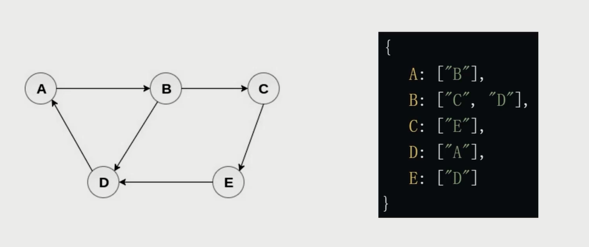

#### 图的常用操作

深度优先遍历。

广度优先遍历。

### 图的深度广度优先遍历

#### 什么是深度/广度优先遍历

深度优先遍历：尽可能深的搜索图的分支。

广度优先遍历：先访问离根节点最近的节点。

#### graph 模拟数据

```js
const graph = {
  0: [1, 2],
  1: [2],
  2: [0, 3],
  3: [3]
};
```


#### 深度优先遍历

访问根节点。

对根节点**没访问过的相邻节点**挨个进行深度优先遍历；

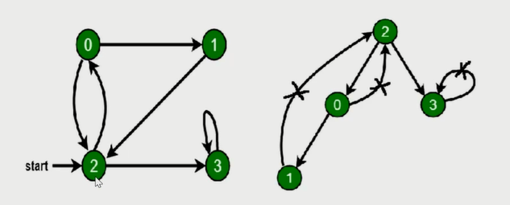

```js
const visited = new Set();

const dfs = (n) => {
  console.log(n);

  visited.add(n);

  graph[n].forEach(c => {
    if (!visited.has(c)) {
      dfs(c);
    }
  });
}

dfs(2);
```

#### 广度优先遍历

新建一个队列，把根节点入队。

把队头出队并访问。

把队头的**没访问过相邻节点**入队。

重复二、三步，直到队列为空。


```js
const bfs = (root) => {
  const visited = new Set();
  const queue = [root];

  visited.add(root);

  while (queue.length) {
    const n = queue.shift();

    console.log(n);

    graph[n].forEach(c => {
      if (!visited.has(c)) {
        queue.push(c);
        visited.add(c);
      }
    });
  }
}

bfs(2);
```

### leetcode 417：太平洋大西洋水流问题

给定一个 m x n 的非负整数矩阵来表示一片大陆上各个单元格的高度。“太平洋”处于大陆的左边界和上边界，而“大西洋”处于大陆的右边界和下边界。

规定水流只能按照上、下、左、右四个方向流动，且只能从高到低或者在同等高度上流动。

请找出那些水流既可以流动到“太平洋”，又能流动到“大西洋”的陆地单元的坐标。

#### 示例

给定下面的 5x5 矩阵:

```html
太平洋 ~   ~   ~   ~   ~ 
   ~  1   2   2   3  (5) *
   ~  3   2   3  (4) (4) *
   ~  2   4  (5)  3   1  *
   ~ (6) (7)  1   4   5  *
   ~ (5)  1   1   2   4  *
      *   *   *   *   * 大西洋
```

返回:

```js
[[0, 4], [1, 3], [1, 4], [2, 2], [3, 0], [3, 1], [4, 0]] (上图中带括号的单元).
```

#### 解题思路

把矩阵想象成图。

从海岸线逆流而上遍历图，所到之处就是可以流到某个大洋的坐标。

#### 解题步骤

1. 新建两个矩阵，分别记录能留到两个大洋的坐标；
2. 从海岸线，多管齐下，同时深度优先遍历图，过程中填充上述矩阵；
3. 遍历两个矩阵，找出能流到两个大洋的坐标。

#### 代码实现

```js
/**
 * @param {number[][]} matrix
 * @return {number[][]}
 */
var pacificAtlantic = function(matrix) {
  if (!matrix || !matrix[0]) return [];

  const m = matrix.length,
        n = matrix[0].length;

  const flow1 = Array.from({ length: m }, () => new Array(n).fill(false));
  const flow2 = Array.from({ length: m }, () => new Array(n).fill(false));

  const dfs = (r, c, flow) => {
    flow[r][c] = true;

    [[r - 1, c], [r + 1, c], [r, c - 1], [r, c + 1]].forEach(([nr, nc]) => {
      if (
        // 保证节点在矩阵中
        nr >= 0 && nr < m &&nc >= 0 && nc < n &&
        // 保证节点没有访问过（防止死循环）
        !flow[nr][nc] && 
        // 保证逆流而上
        matrix[nr][nc] >= matrix[r][c]
      ) {
        dfs(nr, nc, flow);
      }
    });
  }

  // 沾着海岸线逆流而上
  for (let r = 0; r < m; r += 1) {
    dfs(r, 0, flow1);
    dfs(r, n - 1, flow2);
  }
  for (let c = 0; c < n; c += 1) {
    dfs(0, c, flow1);
    dfs(m - 1, c, flow2);
  }

  // 收集能流到两个大洋里的坐标
  const res = [];

  for (let r = 0; r < m; r += 1) {
    for (let c = 0; c < n; c += 1) {
      if (flow1[r][c] && flow2[r][c]) {
        res.push([r, c]);
      }
    }
  }

  return res;
};
```

时间复杂度 ```O(m*n)```，空间复杂度 ```O(m*n)```。

### leetcode 133：克隆图

给你无向 **连通** 图中一个节点的引用，请你返回该图的 **深拷贝（克隆）**。

图中的每个节点都包含它的值 val（int） 和其邻居的列表（list[Node]）。

```js
class Node {
    public int val;
    public List<Node> neighbors;
}
```

试用例格式：

简单起见，每个节点的值都和它的索引相同。例如，第一个节点值为 1（val = 1），第二个节点值为 2（val = 2），以此类推。

该图在测试用例中使用邻接列表表示。

**邻接列表** 是用于表示有限图的无序列表的集合。每个列表都描述了图中节点的邻居集。

给定节点将始终是图中的第一个节点（值为 1）。你必须将 **给定节点的拷贝** 作为对克隆图的引用返回。

#### 示例

**示例 1：**


```html
输入：adjList = [[2,4],[1,3],[2,4],[1,3]]
输出：[[2,4],[1,3],[2,4],[1,3]]
解释：
图中有 4 个节点。
节点 1 的值是 1，它有两个邻居：节点 2 和 4 。
节点 2 的值是 2，它有两个邻居：节点 1 和 3 。
节点 3 的值是 3，它有两个邻居：节点 2 和 4 。
节点 4 的值是 4，它有两个邻居：节点 1 和 3 。
```

**示例 2：**


```html
输入：adjList = [[]]
输出：[[]]
解释：输入包含一个空列表。该图仅仅只有一个值为 1 的节点，它没有任何邻居。
```

**示例 3：**

```html
输入：adjList = []
输出：[]
解释：这个图是空的，它不含任何节点。
```

**示例 4：**


```html
输入：adjList = [[2],[1]]
输出：[[2],[1]]
```

#### 解题思路

拷贝所有节点。

拷贝所有的边。

#### 解题步骤

1. 深度或广度优先遍历所有的节点；
2. 拷贝所有的节点，存储起来；
3. 将拷贝的节点，按照原图的连接方法进行连接；

#### 代码实现

**广度优先遍历**

```js
/**
 * // Definition for a Node.
 * function Node(val, neighbors) {
 *    this.val = val === undefined ? 0 : val;
 *    this.neighbors = neighbors === undefined ? [] : neighbors;
 * };
 */

/**
 * @param {Node} node
 * @return {Node}
 */
var cloneGraph = function(node) {
  if (!node) return;

  const visited = new Map();

  const dfs = (n) => {
    const nCopy = new Node(n.val);
    
    visited.set(n, nCopy);

    (n.neighbors || []).forEach(ne => {
      if (!visited.has(ne)) {
        dfs(ne);
      }
      nCopy.neighbors.push(visited.get(ne));
    });
  }

  dfs(node);

  return visited.get(node);
};
```

时间复杂度 O(n)，空间复杂度 O(n)。

**广度优先遍历**

```js
/**
 * // Definition for a Node.
 * function Node(val, neighbors) {
 *    this.val = val === undefined ? 0 : val;
 *    this.neighbors = neighbors === undefined ? [] : neighbors;
 * };
 */

/**
 * @param {Node} node
 * @return {Node}
 */
var cloneGraph = function(node) {
  if (!node) return;

  const visited = new Map();
  const q = [node];
  
  visited.set(node, new Node(node.val));

  while (q.length) {
    const n = q.shift();

    (n.neighbors || []).forEach(ne => {
      if (!visited.has(ne)) {
        q.push(ne);
        visited.set(ne, new Node(ne.val));
      }
      visited.get(n).neighbors.push(visited.get(ne));
    });
  }

  return visited.get(node);
};
```

时间复杂度 O(n)，空间复杂度 O(n)。

### 总结

图是 **网络结构** 的抽象模型，是一组由 **边** 连接的 **节点**。

图可以表示任何二元关系，比如道路、航班。。。

JS 中没有图，但是可以用 Object 和 Array 构建图。

图的表示法：邻接矩阵、邻接表。。。

图的常用操作：深度/广度优先遍历。

## 八、堆

### 堆是什么

堆是一种特殊的**完全二叉树**。

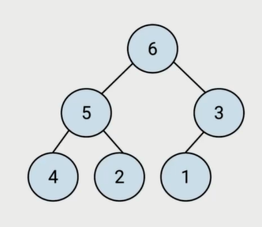

>  堆是一种每层都填满的二叉树，最后一层就算不填满，只会缺少右边的若干节点。

所有的节点都大于等于（最大堆）或小于等于（最小堆）它的子节点。

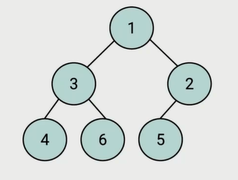

#### JS 中的堆

JS 中通常用数组表示堆。


左侧子节点的位置是 2 * index + 1。

右侧子节点的位置是 2 * index + 2。

父节点的位置是 （index - 1）/ 2 的商。

#### 堆的应用场景

堆能高效、快速地找出最大值和最小值，时间复杂度为O(1)。

找出第 K 个最大（小）元素。

#### 第 K 个最大元素


1. 构建一个最小堆，并将元素依次插入堆中；
2. 当堆的容量超过 K，就删除堆顶；
3. 插入结束后，堆顶就是第 K 个最大元素；

### JS 实现：最小堆类

在类里，声明一个数组，用来装元素；

主要方法：插入、删除堆顶、获取堆顶、获取堆大小。

```js
class MinHeap {
  constructor () {
    this.heap = [];
  }
}
```

#### 插入

将值插入堆的尾部，即数组尾部。

然后上移：将这个值和它的父节点进行交换，直到父节点小于等于这个插入的值。

对于大小为 k 的堆中插入元素的时间复杂度为 O(logK)。

```js
swap (i1, i2) {
  const temp = this.heap[i1];
  this.heap[i1] = this.heap[i2];
  this.heap[i2] = temp;
}

getParentIndex (i) {
  return (i - 1) >> 1;
}

shiftUp (curIdx) {
  if (curIdx == 0) return;

  const parentIdx = this.getParentIndex(curIdx);

  if (this.heap[parentIdx] > this.heap[curIdx]) {
    this.swap(parentIdx, curIdx);
    this.shiftUp(parentIdx);
  }
}

insert (val) {
  this.heap.push(val);
  this.shiftUp(this.heap.length - 1);
}
```

#### 删除堆顶

用数组尾部元素替换堆顶（直接删除堆顶会破坏堆结构）。

然后下移：将新堆顶和它的子节点进行交换，直到子节点大于等于这个新堆顶。

大小为 k 的堆中删除堆顶的时间复杂度为 O(logK)。

```js
swap (i1, i2) {
  const temp = this.heap[i1];
  this.heap[i1] = this.heap[i2];
  this.heap[i2] = temp;
}

getLeftIndex (i) {
  return i * 2 + 1;
}

getRightIndex (i) {
  return i * 2 + 2;
}

shiftDown (curIdx) {
  const leftIdx = this.getLeftIndex(curIdx),
        rightIdx = this.getRightIndex(curIdx);

  if (this.heap[leftIdx] < this.heap[curIdx]) {
    this.swap(leftIdx, curIdx);
    this.shiftDown(leftIdx);
  }
  if (this.heap[rightIdx] < this.heap[curIdx]) {
    this.swap(rightIdx, curIdx);
    this.shiftDown(rightIdx);
  }
}

pop () {
  this.heap[0] = this.heap.pop();
  this.shiftDown(0);
}
```

#### 获取堆顶和堆的大小

获取堆顶：返回数组的头部。

获取堆大小：返回数组的长度。

```js
peek () {
  return this.heap[0];
}

size () {
  return this.heap.length;
}
```

**代码整合**

```js
class MinHeap {
  constructor () {
    this.heap = [];
  }

  swap (i1, i2) {
    const temp = this.heap[i1];
    this.heap[i1] = this.heap[i2];
    this.heap[i2] = temp;
  }

  getParentIndex (i) {
    return (i - 1) >> 1;
  }

  getLeftIndex (i) {
    return i * 2 + 1;
  }

  getRightIndex (i) {
    return i * 2 + 2;
  }

  shiftUp (curIdx) {
    if (curIdx == 0) return;

    const parentIdx = this.getParentIndex(curIdx);

    if (this.heap[parentIdx] > this.heap[curIdx]) {
      this.swap(parentIdx, curIdx);
      this.shiftUp(parentIdx);
    }
  }

  shiftDown (curIdx) {
    const leftIdx = this.getLeftIndex(curIdx),
          rightIdx = this.getRightIndex(curIdx);

    if (this.heap[leftIdx] < this.heap[curIdx]) {
      this.swap(leftIdx, curIdx);
      this.shiftDown(leftIdx);
    }
    if (this.heap[rightIdx] < this.heap[curIdx]) {
      this.swap(rightIdx, curIdx);
      this.shiftDown(rightIdx);
    }
  }

  insert (val) {
    this.heap.push(val);
    this.shiftUp(this.heap.length - 1);
  }

  pop () {
    this.heap[0] = this.heap.pop();
    this.shiftDown(0);
  }

  peek () {
    return this.heap[0];
  }

  size () {
    return this.heap.length;
  }
}
```

### leetcode 215：数组中的第 K 个最大元素

在未排序的数组中找到第 **k** 个最大的元素。请注意，你需要找的是数组排序后的第 k 个最大的元素，而不是第 k 个不同的元素。

#### 示例

**示例 1:**

```html
输入: [3,2,1,5,6,4] 和 k = 2
输出: 5
```

**示例 2:**

```html
输入: [3,2,3,1,2,4,5,5,6] 和 k = 4
输出: 4
```

#### 解题思路

看到 “第K个最大元素”。

考虑选择使用最小堆。

#### 解题步骤

1. 构建一个最小堆，并依次把数组的值插入堆中；
2. 当堆的容量超过 K，就删除堆顶。
3. 插入结束后，堆顶就是第 K 个最大元素；

#### 代码实现

```js
class MinHeap {
  constructor () {
    this.heap = [];
  }

  swap (i1, i2) {
    const temp = this.heap[i1];
    this.heap[i1] = this.heap[i2];
    this.heap[i2] = temp;
  }

  getParentIndex (i) {
    return (i - 1) >> 1;
  }

  getLeftIndex (i) {
    return i * 2 + 1;
  }

  getRightIndex (i) {
    return i * 2 + 2;
  }

  shiftUp (curIdx) {
    if (curIdx == 0) return;

    const parentIdx = this.getParentIndex(curIdx);

    if (this.heap[parentIdx] > this.heap[curIdx]) {
      this.swap(parentIdx, curIdx);
      this.shiftUp(parentIdx);
    }
  }

  shiftDown (curIdx) {
    const leftIdx = this.getLeftIndex(curIdx),
          rightIdx = this.getRightIndex(curIdx);

    if (this.heap[leftIdx] < this.heap[curIdx]) {
      this.swap(leftIdx, curIdx);
      this.shiftDown(leftIdx);
    }
    if (this.heap[rightIdx] < this.heap[curIdx]) {
      this.swap(rightIdx, curIdx);
      this.shiftDown(rightIdx);
    }
  }

  insert (val) {
    this.heap.push(val);
    this.shiftUp(this.heap.length - 1);
  }

  pop () {
    this.heap[0] = this.heap.pop();
    this.shiftDown(0);
  }

  peek () {
    return this.heap[0];
  }

  size () {
    return this.heap.length;
  }
}

/**
 * @param {number[]} nums
 * @param {number} k
 * @return {number}
 */
var findKthLargest = function(nums, k) {
  const h = new MinHeap();

  nums.forEach(n => {
    h.insert(n);

    if (h.size() > k) {
      h.pop();
    }
  });

  return h.peek();
};
```

时间复杂度 O(n*logK)，空间复杂度 O(k)。

### leetcode 347：前 K 个高频元素

给定一个非空的整数数组，返回其中出现频率前 **k** 高的元素。

#### 示例

**示例 1:**

```html
输入: nums = [1,1,1,2,2,3], k = 2
输出: [1,2]
```

**示例 2:**

```html
输入: nums = [1], k = 1
输出: [1]
```

#### 解题思路

因为题目要求算法的时间复杂度**必须**优于 O(*n* log *n*) , *n* 是数组的大小，所以考虑使用最小堆。

#### 解题步骤

1. 构建一个最小堆；
2. 把元素和频率插入到堆里面，并按频率进行排序；

#### 代码实现

```js
class MinHeap {
  constructor () {
    this.heap = [];
  }

  swap (i1, i2) {
    const temp = this.heap[i1];
    this.heap[i1] = this.heap[i2];
    this.heap[i2] = temp;
  }

  getParentIndex (i) {
    return (i - 1) >> 1;
  }

  getLeftIndex (i) {
    return i * 2 + 1;
  }

  getRightIndex (i) {
    return i * 2 + 2;
  }

  shiftUp (curIdx) {
    if (curIdx == 0) return;

    const parentIdx = this.getParentIndex(curIdx);

    if (this.heap[parentIdx] && this.heap[parentIdx].value > this.heap[curIdx].value) {
      this.swap(parentIdx, curIdx);
      this.shiftUp(parentIdx);
    }
  }

  shiftDown (curIdx) {
    const leftIdx = this.getLeftIndex(curIdx),
          rightIdx = this.getRightIndex(curIdx);

    if (this.heap[leftIdx] && this.heap[leftIdx].value < this.heap[curIdx].value) {
      this.swap(leftIdx, curIdx);
      this.shiftDown(leftIdx);
    }
    if (this.heap[rightIdx] && this.heap[rightIdx].value < this.heap[curIdx].value) {
      this.swap(rightIdx, curIdx);
      this.shiftDown(rightIdx);
    }
  }

  insert (val) {
    this.heap.push(val);
    this.shiftUp(this.heap.length - 1);
  }

  pop () {
    this.heap[0] = this.heap.pop();
    this.shiftDown(0);
  }

  peek () {
    return this.heap[0];
  }

  size () {
    return this.heap.length;
  }
}

/**
 * @param {number[]} nums
 * @param {number} k
 * @return {number[]}
 */
var topKFrequent = function(nums, k) {
  const map = new Map();

  nums.forEach(n => {
    map.set(n, map.has(n) ? map.get(n) + 1 : 1);
  });

  const h = new MinHeap();

  map.forEach((value, key) => {
    h.insert({ value, key });

    if (h.size() > k) {
      h.pop();
    }
  });

  return h.heap.map(a => a.key);
};
```

时间复杂度 O(n*logK)，空间复杂度 O(n)。

### leetcode 23：合并 k 个排序链表

给你一个链表数组，每个链表都已经按升序排列。

请你将所有链表合并到一个升序链表中，返回合并后的链表。

#### 示例

**示例 1：**

```html
输入：lists = [[1,4,5],[1,3,4],[2,6]]
输出：[1,1,2,3,4,4,5,6]
解释：链表数组如下：
[
  1->4->5,
  1->3->4,
  2->6
]
将它们合并到一个有序链表中得到。
1->1->2->3->4->4->5->6
```

**示例 2：**

```html
输入：lists = []
输出：[]
```

**示例 3：**

```html
输入：lists = [[]]
输出：[]
```

#### 解题思路

新链表的下一个节点一定是 k 个链表头中的最小节点。

考虑选择使用最小堆。

#### 解题步骤

1. 构建一个最小堆，并依次把链表头插入到堆中；
2. 弹出堆顶接到输入链表，并将堆顶所在链表的新链表头插入到堆中；
3. 等堆元素全部弹出，合并工作就完成了；

#### 代码实现

```js
class MinHeap {
  constructor () {
    this.heap = [];
  }

  swap (i1, i2) {
    const temp = this.heap[i1];
    this.heap[i1] = this.heap[i2];
    this.heap[i2] = temp;
  }

  getParentIndex (i) {
    return (i - 1) >> 1;
  }

  getLeftIndex (i) {
    return i * 2 + 1;
  }

  getRightIndex (i) {
    return i * 2 + 2;
  }

  shiftUp (curIdx) {
    if (curIdx == 0) return;

    const parentIdx = this.getParentIndex(curIdx);

    if (this.heap[parentIdx] && this.heap[parentIdx].val > this.heap[curIdx].val) {
      this.swap(parentIdx, curIdx);
      this.shiftUp(parentIdx);
    }
  }

  shiftDown (curIdx) {
    const leftIdx = this.getLeftIndex(curIdx),
          rightIdx = this.getRightIndex(curIdx);

    if (this.heap[leftIdx] && this.heap[leftIdx].val < this.heap[curIdx].val) {
      this.swap(leftIdx, curIdx);
      this.shiftDown(leftIdx);
    }
    if (this.heap[rightIdx] && this.heap[rightIdx].val < this.heap[curIdx].val) {
      this.swap(rightIdx, curIdx);
      this.shiftDown(rightIdx);
    }
  }

  insert (val) {
    this.heap.push(val);
    this.shiftUp(this.heap.length - 1);
  }

  pop () {
    if (this.size() === 1) {
      return this.heap.shift();
    }
    const top = this.heap[0];
    this.heap[0] = this.heap.pop();
    this.shiftDown(0);
    return top;
  }

  peek () {
    return this.heap[0];
  }

  size () {
    return this.heap.length;
  }
}

/**
 * Definition for singly-linked list.
 * function ListNode(val, next) {
 *     this.val = (val===undefined ? 0 : val)
 *     this.next = (next===undefined ? null : next)
 * }
 */
/**
 * @param {ListNode[]} lists
 * @return {ListNode}
 */
var mergeKLists = function(lists) {
  const dummy = new ListNode(0);

  let p = dummy;
  
  const h = new MinHeap();

  lists.forEach(l => {
    l && h.insert(l);
  });

  while (h.size()) {
    const n = h.pop();

    p.next = n;
    p = p.next;

    if (n.next) {
      h.insert(n.next)
    };
  }

  return dummy.next;
};
```

时间复杂度 O(n*logK)，空间复杂度 O(k)。

### 堆总结

堆是一种特殊的**完全二叉树**。

所有的节点都大于等于（最大堆）或小于等于（最小堆）它的子节点。

JS 中通常用数组表示堆。

堆能高效、快速地找出最大值和最小值，时间复杂度：O(1)。

堆可以找出第 K 个最大（小）元素。

## 九、排序和搜索

### 排序和搜索是什么

排序：把某个乱序的数据变成升序或者降序的数组。

搜索：找出数据中某个元素的下标。

[排序动画网站](https://visualgo.net/zh)

### JS 中的排序和搜索

JS 中的排序：数组的 sort 方法。

JS 中的搜索：数组的 indexOf 方法。

### 排序算法、搜索算法

#### 排序算法

* 冒泡排序
* 选择排序
* 插入排序
* 归并排序
* 快速排序

#### 搜索算法

* 顺序搜索

* 二分查找

### JS 实现：冒泡排序

性能较差，相对比较简单。

#### 思路

比较所有相邻元素，如果第一个比第二个大，则交换它们。

一轮下来，可以保证最后一个数是最大的。

执行 n - 1轮，就可以完成排序。

#### 动画演示

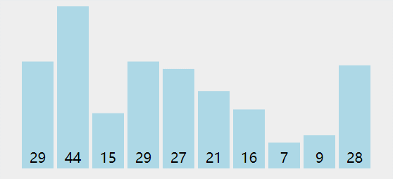

#### 代码实现

```js
Array.prototype.bubbleSort = function () {
  const arr = this;

  for (let i = 0; i < arr.length - 1; i++) {
    for (let j = 0; j < arr.length - 1 - i; j++) {
      if (arr[j] > arr[j + 1]) {
        const temp = arr[j];
        arr[j] = arr[j + 1];
        arr[j + 1] = temp;
      }
    }
  }
}

const arr = [5, 4, 3, 2, 1];

arr.bubbleSort();

console.log(arr);
```

时间复杂度 O(n^2)。

### JS 实现：选择排序

性能较差，相对比较简单。

#### 思路

找到数组中的最小值，选中它并将其放置到第一位。

接着找到第二小的值，选中它并将其放置在第二位。

以此类推，执行 n - 1 轮。

#### 动画演示


#### 代码实现

```js
Array.prototype.selectionSort = function () {
  const arr = this;

  for (let i = 0; i < arr.length - 1; i++) {
    let minIdx = i;

    for (let j = i; j < arr.length; j++) {
      if (arr[j] < arr[minIdx]) {
        minIdx = j;
      }
    }

    if (minIdx !== i) {
      const temp = arr[i];
      arr[i] = arr[minIdx];
      arr[minIdx] = temp;
    }
  }
}

const arr = [5, 4, 3, 2, 1];

arr.selectionSort();

console.log(arr);
```

时间复杂度 O(n^2)。

### JS 实现：插入排序

插入排序的时间复杂度也是 O(n^2)，但是在排序小型数组的时比冒泡排序和选择排序的性能都要好。

#### 思路

从第二个数开始往前比。

比他大就往后排。

以此类推进行到最后一个数。

#### 动画演示


#### 代码实现

```js
Array.prototype.insertionSort = function () {
  const arr = this;
  
  for (var i = 1; i < arr.length; i++) {
    const temp = arr[i];
    let j = i;
  
    while (j > 0) {
      if (arr[j - 1] > temp) {
        arr[j] = arr[j - 1];
      } else {
        break;
      }
      j--;
    }
  
    arr[j] = temp;
  }
}

const arr = [5, 4, 3, 2, 1];

arr.insertionSort();

console.log(arr);
```

时间复杂度 O(n^2)。

### JS 实现：归并排序

时间复杂度O(n*logN)。

火狐浏览器的 sort 使用的就是归并排序这个算法。

#### 思路

分：把数组分成两半，再递归地对子数组进行 ”分“ 操作，直到分成一个个单独的数。

合：把两个数合并为有序数组，再对有序数组进行合并，直到所有子数组合并为一个完整数组。


新建一个空数组 res，用于存放最终排序后的数组。

比较两个有序数组的头部，较小者出队并推入 res 中。

如果两个数组还有值，就重复第二步。

#### 动画演示

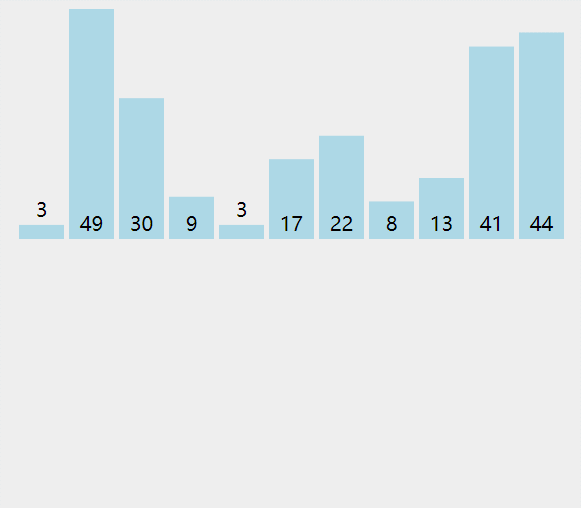

#### 代码实现

```js
Array.prototype.mergeSort = function () {
  const rec = (arr) => {
    if (arr.length === 1) {
      return arr;
    }

    const mid = Math.floor(arr.length / 2);

    const left = arr.slice(0, mid),
          right = arr.slice(mid, arr.length);

    const orderLeft = rec(left);
    const orderRight = rec(right);

    const res = [];

    while (orderLeft.length || orderRight.length) {
      if (orderLeft.length && orderRight.length) {
        res.push(
          orderLeft[0] < orderRight[0] ? orderLeft.shift()
                                       : orderRight.shift()
        );
      } else if (orderLeft.length) {
        res.push(orderLeft.shift());
      } else if (orderRight.length) {
        res.push(orderRight.shift());
      }
    }

    return res;
  };

  rec(this).forEach((n, i) => {
    this[i] = n;
  });
}

const arr = [5, 4, 3, 2, 1];

arr.mergeSort();

console.log(arr);
```

分的时间复杂度O(logN)，合的时间复杂度是O(n)。总体的时间复杂度为 O(n*logN)。

### JS 实现：快速排序

#### 思路

分区：从数组中任意选择一个元素作为 ”基准“，所有比基准小的元素放到基准前面，比基准大的元素放到基准的后面。

递归：递归地对基准前后的子数组进行分区。

#### 动画演示


#### 代码实现

```js
Array.prototype.quickSort = function () {
  const rec = (arr) => {
    if (arr.length <= 1) {
      return arr;
    }

    const left = [],
          right = [];

    const mid = arr[0];

    for (let i = 1; i < arr.length; i++) {
      if (arr[i] < mid) {
        left.push(arr[i]);
      } else {
        right.push(arr[i]);
      }
    }

    return [...rec(left), mid, ...rec(right)]
  };

  rec(this).forEach((n, i) => {
    this[i] = n;
  });
}

const arr = [5, 4, 3, 2, 1];

arr.quickSort();

console.log(arr);
```

递归的时间复杂度是O(logN)，分区操作的时间复杂度是O(n)。总体的时间复杂度为 O(n*logN)。

### JS 实现：顺序搜索

#### 思路

遍历数组。

找到跟目标值相等的元素，就返回它的下标。

遍历结束后，如果没有搜索到目标值，就返回 -1。

#### 代码实现

```js
Array.prototype.sequmentialSearch = function (target) {
  for (let i = 0; i < this.length; i++) {
    if (this[i] === target) {
      return i;
    }
  }
  return -1;
};

const res = [1, 2, 3, 4, 5].sequmentialSearch(3);

console.log(res);
```

时间复杂度O(n)。

### JS 实现：二分搜索

有序数组搜索。

#### 思路

从数组的中间元素开始，如果中间元素正好是目标值，则搜索结束。

如果目标值大于或小于中间元素，则在大于或小于中间元素的那一半数组中搜索。

#### 代码实现

```js
Array.prototype.binarySearch = function (item) {
  let low = 0,
      high = this.length - 1;

  while (low <= high) {
    const mid = Math.floor((low + high) / 2);
    const elem = this[mid];

    if (elem < item) {
      low = mid + 1;
    } else if (elem > item) {
      high = mid - 1;
    } else {
      return mid;
    }
  }

  return -1;
}

const res = [1, 2, 3, 4, 5].binarySearch(3);

console.log(res);
```

时间复杂度O(logN)。

### leetcdoe 21：合并两个有序链表

将两个升序链表合并为一个新的 **升序** 链表并返回。新链表是通过拼接给定的两个链表的所有节点组成的。

#### 示例 

**示例 1：**


```html
输入：l1 = [1,2,4], l2 = [1,3,4]
输出：[1,1,2,3,4,4]
```

**示例 2：**

```html
输入：l1 = [], l2 = []
输出：[]
```

**示例 3：**

```html
输入：l1 = [], l2 = [0]
输出：[0]
```

####  解题思路

与归并排序中的合并两个有序数组很相似。

将数组替换成链表就能解此题。

#### 解题步骤

1. 新建一个新链表，作为返回结果；
2. 用指针遍历两个有序链表，并比较两个链表的当前节点较小者先接入新链表，并将指针后移一步；
3. 链表遍历结束，返回新链表；

#### 代码实现

```js
/**
 * Definition for singly-linked list.
 * function ListNode(val, next) {
 *     this.val = (val===undefined ? 0 : val)
 *     this.next = (next===undefined ? null : next)
 * }
 */
/**
 * @param {ListNode} l1
 * @param {ListNode} l2
 * @return {ListNode}
 */
var mergeTwoLists = function(l1, l2) {
  const dummy = new ListNode(0);

  let p = dummy,
      p1 = l1,
      p2 = l2;

  while (p1 && p2) {
    if (p1.val < p2.val) {
      p.next = p1;
      p1 = p1.next;
    } else {
      p.next = p2;
      p2 = p2.next;
    }

    p = p.next;
  }

  if (p1) {
    p.next = p1;
  }
  if (p2) {
    p.next = p2;
  }

  return dummy.next;
};
```

时间复杂度O(n)，空间复杂度O(1)。

### leetcode 374：猜数字大小

猜数字游戏的规则如下：

每轮游戏，我都会从 1 到 n 随机选择一个数字。 请你猜选出的是哪个数字。
如果你猜错了，我会告诉你，你猜测的数字比我选出的数字是大了还是小了。
你可以通过调用一个预先定义好的接口 int guess(int num) 来获取猜测结果，返回值一共有 3 种可能的情况（-1，1 或 0）：

* -1：我选出的数字比你猜的数字小 pick < num
* 1：我选出的数字比你猜的数字大 pick > num
* 0：我选出的数字和你猜的数字一样。恭喜！你猜对了！pick == num 返回我选出的数字。

#### 示例

**示例 1：**

```html
输入：n = 10, pick = 6
输出：6
```

**示例 2：**

```html
输入：n = 1, pick = 1
输出：1
```

**示例 3：**

```html
输入：n = 2, pick = 1
输出：1
```

**示例 4：**

```html
输入：n = 2, pick = 2
输出：2
```

#### 解题思路

二分搜索。

调用 guess 函数，判断中间元素是否是目标值。

#### 解题步骤

1. 从数组的中间元素开始，如果中间元素正好是目标值，则搜索过程结束；
2. 如果目标值大于或者小于中间元素，则在数组大于或小于中间元素的那一半中查找；

#### 代码实现

```js
/** 
 * Forward declaration of guess API.
 * @param {number} num   your guess
 * @return 	            -1 if num is lower than the guess number
 *			             1 if num is higher than the guess number
 *                       otherwise return 0
 * var guess = function(num) {}
 */

/**
 * @param {number} n
 * @return {number}
 */
var guessNumber = function(n) {
  let low = 1,
      high = n;

  while (low <= high) {
    const mid = Math.floor((low + high) / 2);

    const res = guess(mid);

    if (res === 0) {
      return mid;
    } else if (res === 1) {
      low = mid + 1;
    } else {
      high = mid - 1;
    }
  }

  return -1;
};
```

时间复杂度O(logN)，空间复杂度O(1)。

### 总结

排序：把某个乱序的数组变成升序或者降序的数组。

搜索：找出数组中某个元素的下标。

JS 中的排序：数组的 sort 方法。

JS 中的搜索：数组的 indexOf 方法。

排序算法：

* 冒泡排序、选择排序、插入排序。
* 归并排序、快速排序。

搜索算法：

* 顺序搜索
* 二分搜索

## 十、分而治之

### 分而治之是什么

分而治之是**算法设计**中的一种方法。

它将一个问题**分**为多个和原问题相似的小问题，**递归解决**小问题，再将结果**合**并以解决原来的问题。

### 应用场景

#### 归并排序

分：把数组从中间一分为二。

解：递归地对两个子数组进行归并排序。

合：合并有序子数组。

#### 快速排序

分：选基准，按基准把数组分成两个子数组。

解：递归地对两个子数组进行快速排序。

合：对两个子数组进行合并。

### leetcode 374：猜数字大小

猜数字游戏的规则如下：

每轮游戏，我都会从 1 到 n 随机选择一个数字。 请你猜选出的是哪个数字。
如果你猜错了，我会告诉你，你猜测的数字比我选出的数字是大了还是小了。
你可以通过调用一个预先定义好的接口 int guess(int num) 来获取猜测结果，返回值一共有 3 种可能的情况（-1，1 或 0）：

* -1：我选出的数字比你猜的数字小 pick < num
* 1：我选出的数字比你猜的数字大 pick > num
* 0：我选出的数字和你猜的数字一样。恭喜！你猜对了！pick == num 返回我选出的数字。

#### 示例

**示例 1：**

```html
输入：n = 10, pick = 6
输出：6
```

**示例 2：**

```html
输入：n = 1, pick = 1
输出：1
```

**示例 3：**

```html
输入：n = 2, pick = 1
输出：1
```

**示例 4：**

```html
输入：n = 2, pick = 2
输出：2
```

#### 解题思路

二分搜索，同样具备 “**分、解、合**” 的特性。

考虑选择分而治之。

#### 解题步骤

1. 分：计算中间元素，分割数组;
2. 解：递归地在较大或者较小字数组进行二分搜索；
3. 合：不需要此步，因为在子数组中搜索结果就可以返回了；

#### 代码实现

```js
/** 
 * Forward declaration of guess API.
 * @param {number} num   your guess
 * @return 	            -1 if num is lower than the guess number
 *			             1 if num is higher than the guess number
 *                       otherwise return 0
 * var guess = function(num) {}
 */

/**
 * @param {number} n
 * @return {number}
 */
var guessNumber = function(n) {
  const rec = (low, high) => {
    if (low > high) return;

    const mid = Math.floor((low + high) / 2);
    const res = guess(mid);

    if (res === 0) {
      return mid;
    }
    
    if (res === 1) {
      return rec(mid + 1, high);
    }
    
    if (res === -1) {
      return rec(low, mid - 1);
    }
  };

  return rec(1, n);
};
```

时间复杂度O(logN)，空间复杂度O(logN)。

二分搜索场景，不建议使用递归。

### leetcode 226：反转二叉树

翻转一棵二叉树。

#### 示例

输入：

```html
     4
   /   \
  2     7
 / \   / \
1   3 6   9
```

输出：

```html
     4
   /   \
  7     2
 / \   / \
9   6 3   1
```

#### 解题思路

先翻转左右子树，再将子树换个位置。

符合 “**分、解、合**” 特性。

考虑使用分而治之。

#### 解题步骤

1. 分：获取左右子树；
2. 解：递归的反转左右子树；
3. 合：将翻转后的左右子节点换个位置放到根节点上；

#### 代码实现

```js
/**
 * Definition for a binary tree node.
 * function TreeNode(val, left, right) {
 *     this.val = (val===undefined ? 0 : val)
 *     this.left = (left===undefined ? null : left)
 *     this.right = (right===undefined ? null : right)
 * }
 */
/**
 * @param {TreeNode} root
 * @return {TreeNode}
 */
var invertTree = function(root) {
  if (!root) return null;

  return {
    val: root.val,
    left: invertTree(root.right),
    right: invertTree(root.left)
  }
};
```

时间复杂度为O(n)，即二叉树的节点数量。

空间复杂度O(h)，即二叉树的高度，在最坏的情况下，树的高度等于树的节点数量，即O(n)。

### leetcode 100：相同的树

给定两个二叉树，编写一个函数来检验它们是否相同。

如果两个树在结构上相同，并且节点具有相同的值，则认为它们是相同的。

#### 示例

**示例1**

输入：	

       1         1
      / \       / \
     2   3     2   3
    
    [1,2,3],   [1,2,3]

输出：`true`

**示例2**

输入：

```js
   1          1
  /            \
 2              2

[1,2],     [1,null,2]
```

输出：`false`

**示例3**

```html
   1         1
  / \       / \
 2   1     1   2

[1,2,1],   [1,1,2]
```

输出：`false`

#### 解题思路

两个树：根节点的值相同，左子树相同，右子树相同。

符合 “分、解、合” 特性。

考虑选择分而治之。

#### 解题步骤

1. 分：获取两个树的左子树和左子树；
2. 解：递归地判断两个树的左子树是否相同，右子树是否相同；
3. 合：将上述结果合并，如果根节点的值也相同，树就相同；

#### 代码实现

```js
/**
 * Definition for a binary tree node.
 * function TreeNode(val, left, right) {
 *     this.val = (val===undefined ? 0 : val)
 *     this.left = (left===undefined ? null : left)
 *     this.right = (right===undefined ? null : right)
 * }
 */
/**
 * @param {TreeNode} p
 * @param {TreeNode} q
 * @return {boolean}
 */
var isSameTree = function(p, q) {
  if (!p && !q) return true;

  if (
    p && q && p.val === q.val &&
    isSameTree(p.left, q.left) && isSameTree(p.right, q.right)
  ) {
    return true;    
  } 

  return false;
};
```

时间复杂度为O(n)，即二叉树的节点数量。

空间复杂度O(h)，即二叉树的高度，在最坏的情况下，树的高度等于树的节点数量，即O(n)。

### leetcode 101：对称二叉树

给定一个二叉树，检查它是否是镜像对称的。

#### 示例

例如，二叉树 `[1,2,2,3,4,4,3]` 是对称的。

```html
    1
   / \
  2   2
 / \ / \
3  4 4  3
```

但是下面这个 `[1,2,2,null,3,null,3]` 则不是镜像对称的:

```js
    1
   / \
  2   2
   \   \
   3    3
```

#### 解题思路

镜像对称 -> 左右子树是否是镜像。

树 1 的左子树和树 2 的右子树是否是镜像的，树 1 的右子树和树 2 的左子树是否是镜像。

#### 解题步骤

1. 分：获取两个树的左子树和右子树；
2. 解：递归地判断树 1 的左子树和树 2 的右子树是否镜像，树 1 的右子树和树 2 的左子树是否镜像；
3. 合：如果上述都成立，且根节点值也相同，两个树就镜像；

#### 代码实现

```js
/**
 * Definition for a binary tree node.
 * function TreeNode(val, left, right) {
 *     this.val = (val===undefined ? 0 : val)
 *     this.left = (left===undefined ? null : left)
 *     this.right = (right===undefined ? null : right)
 * }
 */
/**
 * @param {TreeNode} root
 * @return {boolean}
 */
var isSymmetric = function(root) {
  if (!root) return true;

  const isMirror = (l, r) => {
    if (!l && !r) return true;

    if (
      l && r && l.val === r.val &&
      isMirror(l.left, r.right) && isMirror(l.right, r.left)
    ) {
      return true;
    }

    return false;
  };

  return isMirror(root.left, root.right)
};
```

时间复杂度为O(n)，即二叉树的节点数量。

空间复杂度在最坏的情况下，树的高度等于树的节点数量，即O(n)。

### 总结

分而治之是**算法设计（算法设计思想）**中的一种方法。

它将一个问题**分**成多个和原问题相似的小问题，**递归解决**小问题，再将结果**合**并以解决原来的问题。

应用场景：归并排序、快速排序、二分搜索、反转二叉树。。。

## 十一、动态规划

### 动态规划是什么

动态规划是**算法设计**中的一种方法。

它将一个问题分解为**相互重叠**的子问题，通过反复求解子问题，来解决原来的问题。

### 应用场景

#### 斐波那契数列

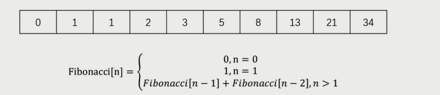

定义子问题：Fn(n) = Fn(n - 1) + Fn(n - 2)。

反复执行：从2循环到n，执行上述公式。

### 动态规划 VS 分而治之

最大区别是子问题是否是独立的。

### leetcode 70：爬楼梯

假设你正在爬楼梯。需要 *n* 阶你才能到达楼顶。

每次你可以爬 1 或 2 个台阶。你有多少种不同的方法可以爬到楼顶呢？

**注意：**给定 *n* 是一个正整数。

#### 示例

```html
输入： 2
输出： 2
解释： 有两种方法可以爬到楼顶。
1.  1 阶 + 1 阶
2.  2 阶
```

```html
输入： 3
输出： 3
解释： 有三种方法可以爬到楼顶。
1.  1 阶 + 1 阶 + 1 阶
2.  1 阶 + 2 阶
3.  2 阶 + 1 阶
```

#### 解题思路

爬到第 n 阶可以在第 n-1 阶爬 1 个台阶，或者在第 n-2 阶爬 2 个台阶。

F(n) = F(n - 1) + Fn(n - 2)。考虑使用动态规划。

#### 解题步骤

1. 定义子问题：F(n) = F(n - 1) + Fn(n - 2)；
2. 反复执行：从 2 循环到 n，执行上述公式；

#### 代码实现

```js
/**
 * @description 爬楼梯
 * @param {number} n
 * @return {number}
 */
var climbStairs = function (n) {
  if (n < 2) {
    return 1;
  }
  const dp = [1, 1];

  for (let i = 2; i <= n; i++) {
    dp[i] = dp[i - 1] + dp[i - 2];
  }

  return dp[n];
};
```

时间复杂度 O(n)，空间复杂度 O(n)。

```js
/**
 * @description 爬楼梯
 * @param {number} n
 * @return {number}
 */
var climbStairs = function (n) {
  if (n < 2) {
    return 1;
  }
  let dp0 = 1;
  let dp1 = 1;

  for (let i = 2; i <= n; i++) {
    const temp = dp0;
    dp0 = dp1;
    dp1 = dp1 + temp;
  }

  return dp1;
};
```

时间复杂度 O(n)，空间复杂度 O(1)。

### letcode 198：打家劫舍

你是一个专业的小偷，计划偷窃沿街的房屋。每间房内都藏有一定的现金，影响你偷窃的唯一制约因素就是相邻的房屋装有相互连通的防盗系统，如果**两间相邻的房屋在同一晚上被小偷闯入，系统会自动报警**。

给定一个代表每个房屋存放金额的非负整数数组，计算你**不触动警报装置的情况**下 ，一夜之内能够偷窃到的最高金额。

#### 示例

**示例 1**

```html
输入：[1,2,3,1]
输出：4
解释：偷窃 1 号房屋 (金额 = 1) ，然后偷窃 3 号房屋 (金额 = 3)。
     偷窃到的最高金额 = 1 + 3 = 4 。
```

**示例 2**

```html
输入：[2,7,9,3,1]
输出：12
解释：偷窃 1 号房屋 (金额 = 2), 偷窃 3 号房屋 (金额 = 9)，接着偷窃 5 号房屋 (金额 = 1)。
     偷窃到的最高金额 = 2 + 9 + 1 = 12 。
```

#### 解题思路

f(k) = 从前 k 个房屋中能偷窃到的最大数额。

Ak = 第 k 个房屋的钱数。

f(k) = max(f(k - 2) + Ak, f(k - 1))。

考虑使用动态规划。

#### 解题步骤

1. 定义子问题 f(k) = max(f(k - 2) + Ak, f(k - 1))；
2. 反复执行：从 2 循环到 n，执行上述公式；

#### 代码实现

```js
/**
 * @param {number[]} nums
 * @return {number}
 */
var rob = function(nums) {
  if (nums.length === 0) return 0;

  const dp = [0, nums[0]];

  for (let i = 2; i <= nums.length; i++) {
    dp[i] = Math.max(dp[i - 2] + nums[i - 1], dp[i - 1]);
  }

  return dp.pop();
};
```

时间复杂度 O(n)，空间复杂度 O(n)。

```js
/**
 * @param {number[]} nums
 * @return {number}
 */
var rob = function(nums) {
  if (nums.length === 0) return 0;

  let dp0 = 0,
      dp1 = nums[0];

  for (let i = 2; i <= nums.length; i++) {
    const temp = Math.max(dp0 + nums[i - 1], dp1);
    dp0 = dp1;
    dp1 = temp;
  }

  return dp1;
};
```

时间复杂度 O(n)，空间复杂度 O(1)。

### 总结

动态规划是**算法设计**中的一种方法。

它将一个问题分解为**相互重叠**的子问题，通过反复求解子问题，来解决原来的问题。

动态规划步骤：定义子问题、反复执行。

## 十二、贪心算法

### 贪心算法是什么

贪心算法是**算法设计**中的一种方法。

期盼通过每个阶段的**局部最优**选择，从而达到全局的最优。

结果并**不一定是最优**。

### 应用场景

#### 零钱兑换

<div></div>

这种情况使用贪心算法可以得到最优解。

<div></div>

这种情况使用贪心算法并不能得到最优解。

### leetcode 455：分饼干

假设你是一位很棒的家长，想要给你的孩子们一些小饼干。但是，每个孩子最多只能给一块饼干。

对每个孩子 i，都有一个胃口值 g[i]，这是能让孩子们满足胃口的饼干的最小尺寸；
并且每块饼干 j，都有一个尺寸 s[j] 。如果 s[j] >= g[i]，我们可以将这个饼干 j 分配给孩子 i ，这个孩子会得到满足。
你的目标是尽可能满足越多数量的孩子，并输出这个最大数值。

#### 示例

**示例 1**

```html
输入: g = [1,2,3], s = [1,1]
输出: 1
解释: 
你有三个孩子和两块小饼干，3个孩子的胃口值分别是：1,2,3。
虽然你有两块小饼干，由于他们的尺寸都是1，你只能让胃口值是1的孩子满足。
所以你应该输出1。
```

**示例 2**

```html
输入: g = [1,2], s = [1,2,3]
输出: 2
解释: 
你有两个孩子和三块小饼干，2个孩子的胃口值分别是1,2。
你拥有的饼干数量和尺寸都足以让所有孩子满足。
所以你应该输出2.
```

#### 解题思路

局部最优：既能满足孩子，还消耗最少。

先将 “较小的饼干” 分给 “胃口最小” 的孩子。

#### 解题步骤

1. 对饼干数组和胃口数组升序排序；
2. 遍历饼干数组，找到能满足第一个孩子的饼干；
3. 然后继续遍历饼干数组，找到满足第二、三、...、n 个孩子的饼干；

#### 代码实现

```js
/**
 * @param {number[]} g
 * @param {number[]} s
 * @return {number}
 */
var findContentChildren = function(g, s) {
  const sortFunc = function (a, b) {
    return a - b;
  }

  g.sort(sortFunc);
  s.sort(sortFunc);

  let i = 0;

  s.forEach(n => {
    if (n >= g[i]) {
      i++;
    }
  });

  return i;
};
```

时间复杂度 O(n*logN)，空间复杂度 O(1)。

### leetcode 122：买卖股票的最佳时机 Ⅱ

给定一个数组，它的第 i 个元素是一支给定股票第 i 天的价格。

设计一个算法来计算你所能获取的最大利润。你可以尽可能地完成更多的交易（多次买卖一支股票）。

注意：你不能同时参与多笔交易（你必须在再次购买前出售掉之前的股票）。

#### 示例

**示例 1**

```html
输入: [7,1,5,3,6,4]
输出: 7
解释: 在第 2 天（股票价格 = 1）的时候买入，在第 3 天（股票价格 = 5）的时候卖出, 这笔交易所能获得利润 = 5-1 = 4 。
     随后，在第 4 天（股票价格 = 3）的时候买入，在第 5 天（股票价格 = 6）的时候卖出, 这笔交易所能获得利润 = 6-3 = 3 。
```

**示例 2**

```html
输入: [1,2,3,4,5]
输出: 4
解释: 在第 1 天（股票价格 = 1）的时候买入，在第 5 天 （股票价格 = 5）的时候卖出, 这笔交易所能获得利润 = 5-1 = 4 。
     注意你不能在第 1 天和第 2 天接连购买股票，之后再将它们卖出。
     因为这样属于同时参与了多笔交易，你必须在再次购买前出售掉之前的股票。
```

**示例 3**

```js
输入: [7,6,4,3,1]
输出: 0
解释: 在这种情况下, 没有交易完成, 所以最大利润为 0。
```

#### 解题思路

前提：上帝视角，知道未来的价格。

局部最优：见好就收，见差就不动，不做任何长远打算。

#### 解题步骤

1. 新建一个变量，用来统计总利润；
2. 遍历价格数组，如果当前价格比昨天高，就在昨天买，今天卖，否则就不交易；
3. 遍历结束后，返回所有利润之和；

#### 代码实现

```js
/**
 * @param {number[]} prices
 * @return {number}
 */
var maxProfit = function(prices) {
  let profit = 0;

  for (let i = 1; i < prices.length; i++) {
    if (prices[i] > prices[i - 1]) {
      profit += prices[i] - prices[i - 1];
    }
  }

  return profit;
};
```

时间复杂度 O(n)，空间复杂度 O(1)。

### 总结

贪心算法是**算法设计**中的一种方法。

期盼通过每个阶段的**局部最优**选择，从而达到全局的最优。

结果并**不一定是最优**。

## 十三、回溯算法

### 回溯算法是什么

回溯算法是**算法设计**中的一种方法。

回溯算法是一种**渐进式**的寻找并构建问题解决方式的策略。

回溯算法会先从一个可能的动作开始解决问题，如果不行，就回溯并选择另一个动作，直到将问题解决。

### 应用场景

有很多路。

这些路里，**有死路**，也有**出路**。

通常需要递归来模拟所有的路。

#### 全排列

<div></div>

1. 用递归模拟出所有情况；

2. 遇到包含重复元素的情况，就回溯；

3. 搜集所有的到达递归重点的情况，并返回；

### leetcode 46：全排列

给定一个 **没有重复** 数字的序列，返回其所有可能的全排列。

#### 示例

```html
输入: [1,2,3]
输出:
[
  [1,2,3],
  [1,3,2],
  [2,1,3],
  [2,3,1],
  [3,1,2],
  [3,2,1]
]
```

#### 解题思路

要求；1、所有排列情况；2、没有重复元素。

有出路、有死路。

考虑使用回溯算法。

#### 解题步骤

1. 用递归模拟出所有情况；
2. 遇到包含重复元素的情况，就回溯；
3. 收集所有到达递归终点的情况，并返回；

#### 代码实现

```js
/**
 * @param {number[]} nums
 * @return {number[][]}
 */
var permute = function(nums) {
  const res = [];

  const backtrack = (path) => {
    if (path.length === nums.length) {
      res.push(path);
      return;
    }

    nums.forEach(n => {
      if (path.includes(n)) return;
      backtrack(path.concat(n))
    });
  };

  backtrack([]);

  return res;
};
```

时间复杂度 O(n!)。

> n! = 1 * 2 * 3 * ... * (n-1) * n

空间复杂度 O(n)。

> n 为递归层数。

### leetcode 78：子集

给你一个整数数组 `nums` ，数组中的元素 **互不相同** 。返回该数组所有可能的子集（幂集）。

解集 **不能** 包含重复的子集。你可以按 **任意顺序** 返回解集。

#### 示例

**示例 1**

```html
输入：nums = [1,2,3]
输出：[[],[1],[2],[1,2],[3],[1,3],[2,3],[1,2,3]]
```

**示例 2**

```html
输入：nums = [0]
输出：[[],[0]]
```

#### 解题思路

要求：1、所有子集；2、没有重复元素。

有出路、有死路。

考虑使用回溯算法。

#### 解题步骤

1. 用递归模拟出所有的情况；
2. 保证接的数字都是后面的数字；
3. 收集所有到达递归终点的情况，并返回；

#### 代码实现

```js
/**
 * @param {number[]} nums
 * @return {number[][]}
 */
var subsets = function(nums) {
  const res = [];

  const backtrack = (path, l, start) => {
    if (path.length === l) {
      res.push(path);
      return;
    }

    for (let i = start; i < nums.length; i++) {
      backtrack(path.concat(nums[i]), l, i + 1);
    }
  };

  for (let i = 0; i <= nums.length; i++) {
    backtrack([], i, 0);
  }

  return res;
};
```

时间复杂度 O(2^n)，因为每个元素都有两种可能（存在或者不存在）。

空间复杂度 O(n)。n 为递归层数。

### 总结

回溯算法是**算法设计**中的一种方法。

回溯算法是一种**渐进式**寻找并构建问题解决方式的策略。

回溯算法会先从一个可能的动作开始解决问题，如果不行，就回溯并选择另一个动作，直到将问题解决。

有很多路。这些路里，有**死路**，也有**出路**。通常需要递归来模拟所有的路。

全排列、子集。。。

## 十四、回顾与总结

### 课程回顾

数据结构：栈、队列、链表、集合、字典、树、图、堆。

算法：链表/树/图的遍历、数组的排序和搜索。。。

算法设计思想：分而治之、动态规划、贪心、回溯。

### 重点、难点

数据结构：所有的数据结构都很重要，跟前端最相关的链表和树。

算法：链表/树/图的遍历、数组的排序和搜索。。。

设计思想：分而治之、动态规划较常考，贪心、回溯次之。

### 经验心得


搞清楚数据结构与算法的**特点**和**应用场景**。

用 **JS 实现 **一遍，最好用第二第三语言再实现一遍。

学会分析**时间/空间复杂度**。

提炼前端和算法的结合点，用于**工作实战**。

### 拓展建议

多**刷题**，最好能保证 300 道以上。

多**总结**各种套路、模板。

多**阅读源码**，比如 React、Lodash、V8 。。

多**实战**，将数据结构与算法用于工作。