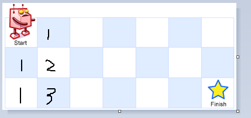

### 不同路径

一个机器人位于一个 m x n 网格的左上角 （起始点在下图中标记为“Start” ）。
机器人每次只能向下或者向右移动一步。机器人试图达到网格的右下角（在下图中标记为“Finish”）。
问总共有多少条不同的路径？


例如，上图是一个7 x 3 的网格。有多少可能的路径？

#### 1. 示例

输入: m = 3, n = 2
输出: 3
解释:
从左上角开始，总共有 3 条路径可以到达右下角。
1. 向右 -> 向右 -> 向下
2. 向右 -> 向下 -> 向右
3. 向下 -> 向右 -> 向右

输入: m = 7, n = 3
输出: 28

提示
1 <= m, n <= 100
题目数据保证答案小于等于 2 * 10 ^ 9

#### 2. 解题思路



  1. 首先初始化第一列和第一行为1，受题目限制，都只有一条路径；
  2. 循环计算右下角格子等于上方格子和左边格子的和；
  3. 返回结果；

#### 3. 代码实现

```js
/**
 * @description 不同路径（动态规划）
 * @param {number} m
 * @param {number} n
 * @return {number}
 */
var uniquePaths = function (m, n) {
  const memo = [];

  for (let i = 0; i < n; i ++) {
    memo.push([]);
  }

  for (let row = 0; row < n; row++) {
    memo[row][0] = 1;
  }
  for (let col = 0; col < n; col++) {
    memo[0][col] = 1;
  }

  for (let row = 1; row < n; row++) {
    for (let col = 1; col < m; col ++) {
      memo[row][col] = memo[row - 1][col]  + memo[row][col - 1];
    }
  }

  return memo[n - 1][m - 1];
};
```
