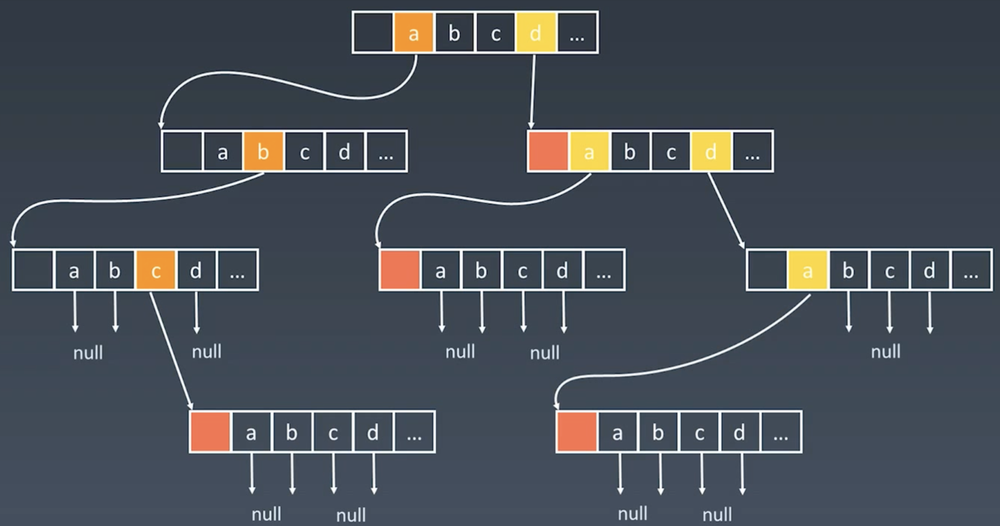
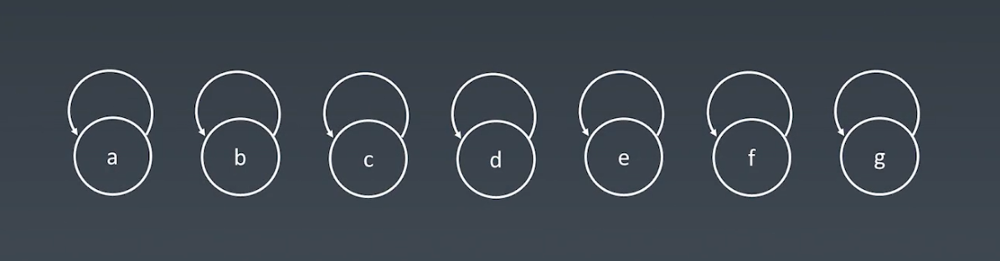
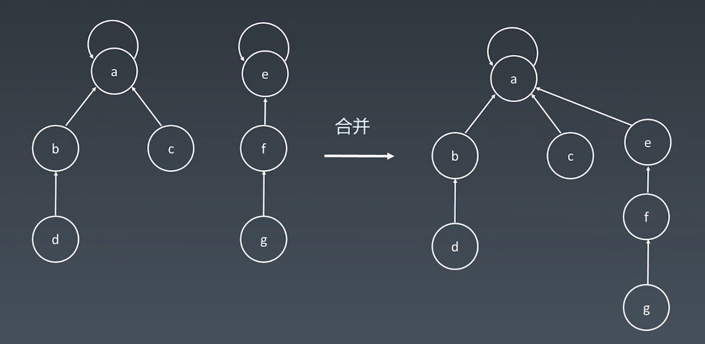
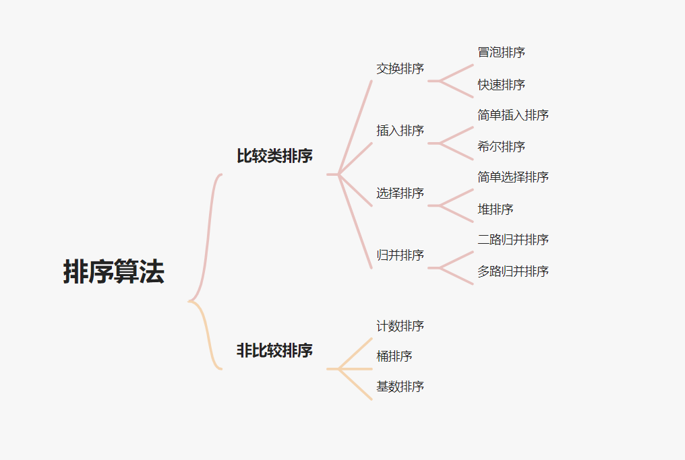

# 算法训练营


## 概述

### 学习方法

改变学习习惯（不要死磕）。多写多练，但不是每次花很多时间。看高票代码和高质量题解。

#### Chunk it up 庖丁解牛

* 数据结构分类
  * 一维
    * 基础：数组 array、链表 linked lis
    * 高级：栈 stack、队列 queue、双端队列 deque、集合 set、map（hash or map）、etc
  * 二维
    * 基础：树 tree、graph 图
    * 高级：二叉搜索树 binary search tree（red-black tree、AV）L、堆 heap、并查集 disjoint set、字典树 Trie、etc
  * 特殊
    * 位运算 Bitwise、布隆过滤器 BloomFilter
    * LRU Cache
* 算法
  * if-else、switch -> branch
  * for，while loop -> iteration
  * 递归 Recursion（Divide & Conquer，Backtrace ）
  * 搜索 Search：深度优先搜索 Depth first search，广度优先搜索 Breadth first search，A*，etc
  * 动态规划 Dynamic Programing
  * 二分查找 Binary Search
  * 贪心 Greedy
  * 数学 Math，几何 Geometry

#### Deliberate Practicing 刻意练习

* 分解和反复练习，过遍数，最少刷五遍
* 练习缺陷、弱点

#### Feedback 反馈

* 及时反馈
* 主动型反馈
  * 高手代码（Github，Leetcode，etc）
  * 第一视角直播
* 被动式反馈
  * code review

### 五步刷题法

**第一遍**

5 - 10分钟：读题和思考。

没有思路，直接看解法，比较解法优劣。

背诵、默写最好的解法。 

**第二遍**

自己写代码，LeetCode 提交验证。

对多种解法比较、体会 -> 优化。

**第三遍**

过一天，重复做题。

根据不同解法的熟练程度进行专项联系。

**第四遍**

过一周之后，反复回来练习相同题目。

**第 5 遍**

面试前一周或者多周恢复性训练。

### 环境配置

Google 浏览器。

VSCode 配合 LeetCode 插件。

https://leetcode-cn.com、https://leetcode.com 。

leetcode-cn.com 和 题解、leetcode.com 和 Discuss board。

> 中文网站和英文网站的题目除了 `-cn`，其他都一致。尽量在中文站做完题，再去看国际站的讨论区。

## 时间复杂度和空间复杂度

### Big O notation

[如何理解算法时间复杂度的表示法](http://www.zhihu.com/question/21387264)

#### 常见的时间复杂度

O(1)：Constant Complexity 常数复杂度

O(log n)：Logarithmic Complexity 对数复杂度

O(n)：Linear Complexity 线性时间复杂度

O(n^2)：N square Complexity  平方

O(n^3)：N cubic Complexity  立方

O(2^n)：Exponential Growth 指数

O(n!)：Factorial 阶乘

>  注意：只需要看最高复杂度的运算，不考虑前面的系数。

```js
// O(1)

const n = 100;

console.log(n);
```

```js
// O(1)

const n = 100;

console.log(n);
console.log(n);
console.log(n);
```

```js
// O(n) 

for (let i = 0; i <= n; i++) {
  console.log(i);
}
```

```js
// O(n) 

for (let i = 0; i <= n; i++) {
  console.log(i);
}

for (let j = 0; j <= n; j++) {
  console.log(i, j);
}
```

```js
// O(n^2)	

for (let i = 0; i <= n; i++) {
  for (let j = 0; j <= n; j++) {
    console.log(i, j);
  }
}
```

```js
// O(log(n))

for (let i = 1; i < n; i = i * 2) {
	console.log(i);
}
```

```js
// O(k^n)

function fib (n) {
  if (n < 2) return n;
  
  return fib(n - 1) + fib(n - 2);
}
```


写程序的时候一定要对自己程序的时间和空间复杂度有所了解，写完程序可以下意识的分析时间和空间复杂度。

能够用最简洁的时间和空间复杂度完成程序。

#### 累加案例

计算 1+ 2 +  3 + 4 + ...n 。

```js
// 方法1：循环累加

y = 0;

for i = 1 to n
	y += i
```

```js
// 方法2：求和公式 sum = n(n + 1) / 2

y = n * (n + 1) / 2
```

#### 递归的时间复杂度

将递归代码转化为递归树。


Fib: 0, 1, 2, 3, 5, 8, 13, 21 ...

F(n) = F(n - 1) + F(n - 2)

```js
// 最简单递归写法

function fib (n) {
  if (n < 2) return n;
  
  return fib(n - 1) + fib(n -2);
}
```


每一层的节点数也就是执行次数，是按照指数级递增的，当下到最后一层，就变成 2 的 n 次方。就是总的执行次数就是指数级。

其次我们可以观察到重复的节点。

面试中不要这么写上述的代码，可以采用加缓存处理或者用循环的写法。

### Master Theorem

用来解决如何计算递归函数的时间复杂度。

[Master theorem](http://en.wikipedia.org/wiki/Master_theorem_(analysis_of_algorithms))、[主定理](http://zh.wikipedia.org/wiki/主定理)


> Binary Search	二分查找
>
> Binary tree traversal	二叉树
>
> Optimal Sorted Martrix Search	排好序的二维矩阵
>
> Merge Sort	归并排序


**二叉树的遍历 - 前序、中序、后序：时间复杂度是多少？**

O(n)，n 代表二叉树里面的树的节点总数。

不管是前序、中序、后序遍历二叉树的时候，每个节点会访问一次仅访问一次。

所以它的时间复杂度就是线性于二叉树的节点总数，也就是 O(n) 的时间复杂度。

**图的遍历：时间复杂度是多少？**

图里面的每个节点访问一次且仅访问一次，所以它的时间复杂度为 O(n)。n 指图里面的节点总数。

**搜索算法：DFS，BFS 时间复杂度是多少？**

访问的节点只访问一次，所以时间复杂度都为 O(n)。n 指搜索空间的节点总数。

**二分查找：时间复杂度是多少？**

O(log n)。


### 空间复杂度

空间复杂度其实和时间复杂度的情况类似，但它更加简单。


如果代码中存在数组，那么数组的长度基本是就是空间复杂度。

如果开辟一个一维数组，长度为传入的元素的个数，一般来说，空间复杂度就是 O(n)。

如果开辟一个二维数组，它的长度数组的长度为 n 平方，空间复杂度基本上就是 n 平方。


如果存在递归，那么它递归的深度，就是空间复杂度的最大值。


如果又是递归又是开辟新数组，那么两者之间的最大值就是空间复杂度。


**爬楼梯问题**

本身就是斐波那契数列求值，F(n) = F(n-1) + F(n-2)。

https://leetcode-cn.com/problems/climbing-stairs/

```js
// 暴力法，递归解法且没有任何缓存，存在大量的重复计算
// 时间复杂度：O(2^n)，树形递归的大小为 2^n。
// 空间复杂度：O(n)，递归树的深度可以达到 n。

/**
 * @param {number} n
 * @return {number}
 */
var climbStairs = function(n) {
  const _climbStairs = (i, n) => {
    if (i > n) {
      return 0;
    }

    if (i == n) {
      return 1;
    }

    return _climbStairs(i + 1, n) + _climbStairs(i + 2, n);
  }

  return _climbStairs(0, n);
};
```

```js
// 记忆化递归，通过 memo 数组，我们可以得到一个修复的递归树，其大小减少到 n。
// 时间复杂度：O(n)，树形递归的大小可以达到 n
// 空间复杂度：O(n)，递归树的深度可以达到 n。

/**
 * @param {number} n
 * @return {number}
 */
var climbStairs = function(n) {
  const memo = [];

  const _climbStairs = (i, n, memo) => {
    if (i > n) {
      return 0;
    }

    if (i == n) {
      return 1;
    }

    if (memo[i] > 0) {
      return memo[i];
    }

    return memo[i] = _climbStairs(i + 1, n, memo) + _climbStairs(i + 2, n, memo);
  }

  return _climbStairs(0, n, memo);
};
```

```js
// 动态规划
// 时间复杂度：O(n)
// 空间复杂度：O(n)

/**
 * @param {number} n
 * @return {number}
 */
var climbStairs = function(n) {
  if (n == 1) {
    return 1;
  }

  const dp = [];

  dp[1] = 1;
  dp[2] = 2;

  for (let i = 3; i <= n; i++) {
    dp[i] = dp[i - 1] + dp[i - 2];
  }

  return dp[n];
};
```

```js
// 斐波那契树
// 上述方法，我们使用 dp 数组，但其实我们并不需要存储所有的状态，只需要存储 n-1 和 n-2 就可以。
// 时间复杂度：O(n)
// 空间复杂度：O(1)，常量级时间

/**
 * @param {number} n
 * @return {number}
 */
 var climbStairs = function(n) {
  if (n == 1) {
    return 1;
  }

  let first = 1;
  let second = 2;

  for (let i = 3; i <= n; i++) {
    let thrid = first + second;

    first = second;
    second = thrid;
  }

  return second;
};
```

## 数组、链表、跳表

### 数组 ArrayList

高级编程语言，对于数组里的元素的类型没有严格的要求，相对来说比较多样化。
在语言上，有一个标准的叫法叫做泛型。也就是说任何一个单元类型，都可以放进数组。

数组底层的硬件存在一个内存管理器，每当你申请数组，计算机实际上是在内存中开辟一段连续的地址。
每一个地址可以直接通过内存管理器进行访问。数组访问任何元素，都是常数时间 O(1)。

数组可以随机访问任何一个元素，它的访问速度非常快。

数组增加、删除数组元素都是 O(n) 的时间复杂度。最好的情况为 O(1)，最坏的情况为 O(n)。
修改、添加、删除比较频繁的情况下，数组其实并不好用。

 [Java 源码分析（ArrayList）](http://developer.classpath.org/doc/java/util/ArrayList-source.html)


**ArrayList 的时间复杂度**

prepend O(1)
append O(1)
lookup O(1)
insert O(n)
delete O(n)

正常情况下数组的 prepend 操作的时间复杂度是 O(n)，但是可以进行特殊优化到 O(1)。采用的方式是申请稍大一些的内存空间，然后在数组最开始预留一部分空间，然后 prepend 的操作则是把头下标前移一个位置即可。


[盛最多水的容器](https://leetcode-cn.com/problems/container-with-most-water/)（腾讯、百度、字节跳动在近半年内面试常考）

[移动零](https://leetcode-cn.com/problems/move-zeroes/)（华为、字节跳动在近半年内面试常考）

[爬楼梯](https://leetcode-cn.com/problems/climbing-stairs/)（阿里巴巴、腾讯、字节跳动在半年内面试常考）

[三数之和](https://leetcode-cn.com/problems/3sum/)（国内、国际大厂历年面试高频老题）


```js
// 移动零，一维数组的坐标变换

// 思路1：循环遍历数组，每次走的时候统计 0 的个数，非 0 元素前移，0 元素后移
// 思路2：重新开一个新数组，遇到 0 往后放，非 0 前面放，内存空间多。新开了数组，不符合必须原数组操作
// 思路3：操作数组中 index 操作

/**
 * @param {number[]} nums
 * @return {void} Do not return anything, modify nums in-place instead.
 */
var moveZeroes = function(nums) {
  let j = 0; // 记录下一个非 0 元素

  for (let i = 0; i < nums.length; i++) {
    if (nums[i] != 0) {
      nums[j] = nums[i];

      if (i !== j) {
        nums[i] = 0;
      }

      j++;
    }
  }
};
```

```js
// 盛最多水的容器

// 思路1：枚举，left bar、right bar，(x - y) * height_diff、O(n^2)

/**
 * @param {number[]} height
 * @return {number}
 */
 var maxArea = function(height) {
  const _getArea = (i, j) => {
    return (j - i) * Math.min(height[i], height[j]);
  }

  let max = 0;

  for (let i = 0; i < height.length; i++) {
    for (let j = i + 1; j < height.length; j++) {
      max = Math.max(_getArea(i, j), max);
    }
  }

  return max;
};


// 思路2：双指针（左右夹逼），左右边界向中间收敛，只需要关心下标比它高的，计算最大面积、O(n)

/**
 * @param {number[]} height
 * @return {number}
 */
 var maxArea = function(height) {
  let max = 0;

  for (let i = 0, j = height.length - 1; i < j; ) {
    const minHeight = height[i] < height[j] ? height[i++] : height[j--];
    const area = (j - i + 1) * minHeight;

    max = Math.max(max, area);
  }

  return max;
};

/**
 * @param {number[]} height
 * @return {number}
 */
var maxArea = function(height) {
  let sum = 0;

  let i = 0,
      j = height.length - 1;

  while (i < j) {
    const minHeight = height[i] < height[j] ? height[i++] : height[j--];
    const area = (j - i + 1) * minHeight;

    sum = Math.max(sum, area);
  }

  return sum;
};
```

```js
// 爬楼梯问题

// 思路1：寻找最近重复子问题
// 1: 1
// 2: 2
// 3: f(1) + f(2)
// 4: f(3) + f(2)
// n: f(n - 1) + f(n - 2)

/**
 * @param {number} n
 * @return {number}
 */
var climbStairs = function(n) {
  if (n <= 2) return n;

  let f1 = 1,
      f2 = 2;

  for (let i = 3; i <= n; i++) {
    const temp = f1 + f2;

    f1 = f2;
    f2 = temp;
  }

  return f2;
};
```

```js
// 两数之和 https://leetcode-cn.com/problems/two-sum/
// a + b == target

// 思路1：两层循环，枚举下标
// 思路2：hash 表处理
// 思路3：一次 hash 表
```


```js
// 三数之和（高频老题）
// a + b = -c

// 思路1：暴力求解 三层循环
// 思路2：两重暴力 + hash，O(n^2)、仍然需要判重
// 思路3：排序之后，双指针（夹逼），结果可能重复

/**
 * @param {number[]} nums
 * @return {number[][]}
 */
var threeSum = function(nums) {
  let result = [];

  nums.sort((a, b) => a - b);

  for (let k = 0; k < nums.length - 2; k++) {
    if (nums[k] > 0) break;
    if (k > 0 && nums[k] === nums[k - 1]) continue;

    let i = k + 1,
        j = nums.length - 1;

    while (i < j) {
      const sum = nums[k] + nums[i] + nums[j];

      if (sum < 0) {
        while (i < j && nums[i] === nums[++i]);
      } else if (sum > 0) {
        while (i < j && nums[j] === nums[--j]);
      } else {
        result.push([ nums[k], nums[i], nums[j] ]);

        while (i < j && nums[i] === nums[++i]);
        while (i < j && nums[j] === nums[--j]);
      }
    }
  }

  return result;
};
```

### 链表 LinkedList

如果只存在一个 next 指针，叫做单链表。

如果还存在先前指针叫做 prev 或者是 previous，这个链表就叫做双向链表。
头指针一般用 head 来表示，尾指针用 tail 来表示。最后一个元素，它的 next 指针指向空。

如果 tail 指针的 next 指回到 head，那么这个链表就叫做循环链表。

```java
// 最简单 LinkedList 实现

class LinkedList {
  Node Head;
  
  class Node {
    int data;
    Node next;
    
    Node (int d) {
      data = d;
    }
  }
}
```

[Linked List 的标准实现代码](http://www.geeksforgeeks.org/implementing-a-linked-list-in-java-using-class/)

[Linked List 示例代码](http://www.cs.cmu.edu/~adamchik/15-121/lectures/Linked Lists/code/LinkedList.java)

[Java 源码分析（LinkedList）](http://developer.classpath.org/doc/java/util/LinkedList-source.html)

Java 中的 LinkedList 是一个很标准的双向链表结构。


链表增加和删除任何节点，不会引起整个链表的群移操作，也不需要复制元素、挪动一半的元素、挪动多个元素到新的位置。
链表的移动和修改的效率非常高，都为 O(1)。

但是也因为这样的结构，访问链表中任何一个位置，操作其实并不简单。
如果访问头节点和尾节点，都是 O(1)。但是如果想访问中间节点，必须从头节点一步一步往后移动。线性 n 的，O(n) 的算法。

**LinkedList 的时间复杂度**

prepend O(1)
append O(1)
lookup O(n)
insert O(1)
delete O(1)


[反转链表](https://leetcode-cn.com/problems/reverse-linked-list/)（字节跳动、亚马逊在半年内面试常考）

[两两交换链表中的节点](https://leetcode-cn.com/problems/swap-nodes-in-pairs)（阿里巴巴、字节跳动在半年内面试常考）

[环形链表](https://leetcode-cn.com/problems/linked-list-cycle)（阿里巴巴、字节跳动、腾讯在半年内面试常考）

[环形链表 II](https://leetcode-cn.com/problems/linked-list-cycle-ii)

[K 个一组翻转链表](https://leetcode-cn.com/problems/reverse-nodes-in-k-group/)（字节跳动、猿辅导在半年内面试常考）


```js
// 翻转链表

// 思路1：迭代法
/**
 * Definition for singly-linked list.
 * function ListNode(val, next) {
 *     this.val = (val===undefined ? 0 : val)
 *     this.next = (next===undefined ? null : next)
 * }
 */
/**
 * @param {ListNode} head
 * @return {ListNode}
 */
var reverseList = function(head) {
  let prev = null,
      curr = head;

  while (curr) {
    const next = curr.next;

    curr.next = prev;
    prev = curr;
    curr = next;
  }

  return prev;
};


// 思路2：尾递归法
/**
 * Definition for singly-linked list.
 * function ListNode(val, next) {
 *     this.val = (val===undefined ? 0 : val)
 *     this.next = (next===undefined ? null : next)
 * }
 */
/**
 * @param {ListNode} head
 * @return {ListNode}
 */
var reverseList = function(head) {
  if (head == null || head.next == null) {
    return head;
  }

  const newHead = reverseList(head.next);

  head.next.next = head;
  head.next = null;

  return newHead;
};
```

```js
// 两两交换链表中的节点

/**
 * Definition for singly-linked list.
 * function ListNode(val, next) {
 *     this.val = (val===undefined ? 0 : val)
 *     this.next = (next===undefined ? null : next)
 * }
 */
/**
 * @param {ListNode} head
 * @return {ListNode}
 */
var swapPairs = function(head) {
  const dummy = new ListNode(0, head);

  let curr = dummy;

  while (curr.next && curr.next.next) {
    let n1 = curr.next,
        n2 = curr.next.next;

    curr.next = n2;
    n1.next = n2.next;
    n2.next = n1;
    curr = n1;
  }

  return dummy.next;
};
```

```js
// 环形链表

// 思路1：遍历链表，set 记录所有访问的结点，看后续元素是否出现再 set 中
// 思路2：快慢指针 O(1) 内存，也是双指针解法

/**
 * @param {ListNode} head
 * @return {boolean}
 */
var hasCycle = function(head) {
  const set = new Set();
  
  while (head) {
    if (set.has(head)) return true;
    
    set.add(head);
    
    head = head.next;
  }
  
  return false;
};


/**
 * @param {ListNode} head
 * @return {boolean}
 */
var hasCycle = function(head) {
  let slow = head,
      fast = head;
  
  while (fast && fast.next) {
    slow = slow.next;
    fast = fast.next.next;
    
    if (slow === fast) return true;
  }
  
  return false;
};
```

```js
// 环形链表II

// 思路1：遍历链表，set 记录所有访问的结点，看后续元素是否出现再 set 中
// 思路2：快慢指针 O(1) 内存，也是双指针解法

/**
 * @param {ListNode} head
 * @return {ListNode}
 */
var detectCycle = function(head) {
  const set = new Set();
  
  while (head) {
    if (set.has(head)) return head;
    
    set.add(head);
    
    head = head.next;
  }
  
  return null;
};

/**
 * @param {ListNode} head
 * @return {ListNode}
 */
var detectCycle = function(head) {
  let slow = head,
      fast = head;
  
  while (fast && fast.next) {
    slow = slow.next;
    fast = fast.next.next;
    
    if (slow === fast) {
      fast = head;
      
      while (fast !== slow) {
        fast = fast.next;
        slow = slow.next;
      }
      
      return slow;
    }
  }
  
  return null;
};
```

```js
// K个一组翻转链表

// 思路，定义反转函数，根据 k 对链表进行拆分

/**
 * @param {ListNode} head
 * @param {number} k
 * @return {ListNode}
 */
var reverseKGroup = function(head, k) {
  if (head === null) return null;

  let start = head,
      end = head;

  for (let i = 0; i < k; i++) {
    if (end == null) return head;

    end = end.next;
  }

  const newHead = reverse(start, end);

  start.next = reverseKGroup(end, k);

  return newHead;
};

function reverse (start, end) {
  let prev = null,
      curr = start;

  while (curr !== end) {
    const next = curr.next;

    curr.next = prev;
    prev = curr;
    curr = next;
  }

  return prev;
}
```

### 跳表 Skip List

数组中有序的时候，二分查找可以很快的查到目标元素位置。
链表元素有序的时候，如何快速的查询到目标位置？

跳表的使用只能用于链表里的元素有序的情况。跳表里的元素始终必须是有序的，不然没办法使用。
跳表（skip list）对标的是平衡二叉树（AVL Tree）和二分查找，是一种插入、删除、搜索都是 O(log n) 的数据结构。1989 年出现。
其他的 “树” 都是在 1960、196 几年出现，跳表比它们晚了接近 30 年，最后才出现。

它最大的优势是原理简单、容易实现、方便扩展、效率更高。因此在一些热门的项目里用来替代平衡树，如 Redis、LevelDB 等。
LevelDB 是 Goole 用来取代 BigTable 的，同时是 Google 的工程师 Jeff Dean 这个人发明的。


如何给有序的链表加速？

时间复杂度：查询 O(n)
简单优化：添加头尾指针

一维数据结构加速，经常采用的方式就是**升维**。这样就会存在更加的附加信息，**空间换时间**。
可以为链表增加一级索引，指向 next + 1。还可以增加多级索引。


跳表查询的时间复杂度分析

n/2、n/4、n/8，第 k 级索引结点的个数就是 n/(2^k)。
假设索引有 h 级，最高级的索引有 2 个结点。n/(2^h) = 2，从而可以求得 h = log2(n) - 1。

在跳表中查询任意数据的时间复杂度就是 O(logn)。

现实中使用跳表时，会由于元素的增加和删除，导致它的索引并不是完全工整的。
经过多次改动之后，有些地方会少跨或者只跨两步。
维护成本相对比较高。增加元素时，要把索引更新一遍，删除元素时，也需要把索引更新一遍。
增加和删除的时候的时间复杂度就变成 logn。


跳表的空间复杂度分析

原始链表大小为 n，每 2 个结点抽一个，每层索引的节点数：
n/2，n/4，n/8，...，8，4，2
原始链表大小为 n，没 3 个结点抽一个，每层索引的节点数：
n/3，n/9，n/27，...，9，3，1
空间复杂度是 O(n)。


不管是 java，还是现在的 c++，Go，js 中，都提供了很多封装好的数据结构。

LRU Cache - Linked list：[ LRU 缓存机制](http://leetcode-cn.com/problems/lru-cache)

Redis - Skip List：[跳跃表](http://redisbook.readthedocs.io/en/latest/internal-datastruct/skiplist.html)、[为啥 Redis 使用跳表（Skip List）而不是使用 Red-Black？](http://www.zhihu.com/question/20202931)

### 相关题目

[删除有序数组中的重复项](https://leetcode-cn.com/problems/remove-duplicates-from-sorted-array/)

[轮转数组](https://leetcode-cn.com/problems/rotate-array/)

[合并两个有序链表](https://leetcode-cn.com/problems/merge-two-sorted-lists/)

[合并两个有序数组](https://leetcode-cn.com/problems/merge-sorted-array/)

[两数之和](https://leetcode-cn.com/problems/two-sum/)

[移动零](https://leetcode-cn.com/problems/move-zeroes/)

[加一](https://leetcode-cn.com/problems/plus-one/)


```js
// 删除有序数组中的重复项

// 思路：双指针解法，一个指针数组长度，一个指针迭代数据

/**
 * @param {number[]} nums
 * @return {number}
 */
var removeDuplicates = function(nums) {
  if (!nums.length) return 0;
  
  let i = 0;

  for (let j = 1; j < nums.length; j++) {
    if (nums[j] !== nums[i]) {
      nums[++i] = nums[j];
    }
  }

  return ++i;
};
```

```js
// 轮转数组

// 思路1：使用额外数组
/**
 * @param {number[]} nums
 * @param {number} k
 * @return {void} Do not return anything, modify nums in-place instead.
 */
var rotate = function(nums, k) {
  const len = nums.length;
  const arr = [];

  for (let i = 0; i < len; i++) {
    arr[(i + k) % len] = nums[i];
  }

  for (let i = 0; i < len; i++) {
    nums[i] = arr[i];
  }
};

// 思路2：翻转数据，根据 k 进行分割，然后旋转

/**
 * @param {number[]} nums
 * @param {number} k
 * @return {void} Do not return anything, modify nums in-place instead.
 */
var rotate = function(nums, k) {
  k %= nums.length;

  reverse(nums, 0, nums.length - 1);
  reverse(nums, 0, k - 1);
  reverse(nums, k, nums.length - 1);
};

function reverse (nums, start, end) {
  while (start < end) {
    [nums[start++], nums[end--]] = [nums[end], nums[start]];
  }
}
```
```js
// 合并两个有序链表
 
// 思路1：迭代方法，时间复杂度 O(m + n), 空间复杂度 O(1)
/**
 * @param {ListNode} list1
 * @param {ListNode} list2
 * @return {ListNode}
 */
var mergeTwoLists = function(list1, list2) {
  const dummy = new ListNode();

  let curr = dummy;

  while (list1 && list2) {
    if (list1.val <= list2.val) {
      curr.next = list1;
      list1 = list1.next;
    } else {
      curr.next = list2;
      list2 = list2.next;
    }

    curr = curr.next;
  }

  curr.next = list1 || list2;

  return dummy.next;
};

// 思路2：递归解法，时间复杂度和空间复杂度都为 O(m + n)
/**
 * @param {ListNode} list1
 * @param {ListNode} list2
 * @return {ListNode}
 */
var mergeTwoLists = function(list1, list2) {
  if (list1 === null) return list2;
  if (list2 === null) return list1;

  if (list1.val < list2.val) {
    list1.next = mergeTwoLists(list1.next, list2);
    return list1;
  }

  list2.next = mergeTwoLists(list2.next, list1);
  return list2;
}
```

```js
// 合并两个有序数组

// 思路1：合并然后进行排序，时间复杂度 O((m+n)log(m+n))，空间复杂度 O(log⁡(m+n))。
/**
 * @param {number[]} nums1
 * @param {number} m
 * @param {number[]} nums2
 * @param {number} n
 * @return {void} Do not return anything, modify nums1 in-place instead.
 */
var merge = function(nums1, m, nums2, n) {
  nums1.splice(m, nums1.length - m, ...nums2);
  nums1.sort((a, b) => a - b);
};


// 思路2：双指针，时间复杂度：O(m+n)，空间复杂度 O(1)。
/**
 * @param {number[]} nums1
 * @param {number} m
 * @param {number[]} nums2
 * @param {number} n
 * @return {void} Do not return anything, modify nums1 in-place instead.
 */
var merge = function(nums1, m, nums2, n) {
  let p1 = m - 1,
      p2 = n - 1;

  let tail = m + n - 1;
  let cur;

  while (p1 >= 0 || p2 >= 0) {
    if (p1 === -1) {
      cur = nums2[p2--];
    } else if (p2 === -1) {
      cur = nums1[p1--];
    } else if (nums1[p1] > nums2[p2]) {
      cur = nums1[p1--];
    } else {
      cur = nums2[p2--];
    }

    nums1[tail--] = cur;
  }
};
```

```js
// 两数之和

// 思路1：使用 Map 存储，时间复杂度和空间复杂度都为 O(n)。
/**
 * @param {number[]} nums
 * @param {number} target
 * @return {number[]}
 */
var twoSum = function(nums, target) {
  const map = new Map();

  let curr;

  for (let i = 0; i < nums.length; i++) {
    curr = target - nums[i];
    
    if (map.has(curr)) {
      return [map.get(curr), i];
    }

    map.set(nums[i], i);
  }

  return [];
};
```

```js
// 移动零，一维数组的坐标变换

// 思路1：循环遍历数组，每次走的时候统计 0 的个数，非 0 元素前移，0 元素后移
// 思路2：重新开一个新数组，遇到 0 往后放，非 0 前面放，内存空间多。新开了数组，不符合必须原数组操作
// 思路3：操作数组中 index 操作

/**
 * @param {number[]} nums
 * @return {void} Do not return anything, modify nums in-place instead.
 */
var moveZeroes = function(nums) {
  let j = 0; // 记录下一个非 0 元素

  for (let i = 0; i < nums.length; i++) {
    if (nums[i] != 0) {
      nums[j] = nums[i];

      if (i !== j) {
        nums[i] = 0;
      }

      j++;
    }
  }
};
```

```js
// 加一

/**
 * @description 加一
 * @param {number[]} digits
 * @return {number[]}
 */
var plusOne = function (digits) {
  for (let i = digits.length - 1; i >= 0; i--) {
    if (digits[i] != 9) {
      digits[i]++;
      return digits;
    } else {
      digits[i] = 0; 
    }
  }

  return [1].concat(digits);
};
```

## 栈、队列

栈(Stack)，先进后出。Fast In - Last Out、FILO。添加、删除都是 O(1)、查询为 O(n)，元素是无序的。 

队列(Queue)，先进先出。Fast In - First Out、FIFO。 添加、删除都是 O(1)、查询为 O(n)，元素是无序的。 

双端队列(Deque、Double-End Queue)，queue 和 stack 的结合体。插入和删除都是 O(1) 操作。


[Java 的 Stack 源码](http://developer.classpath.org/doc/java/util/Stack-source.html)

[Java 的 Queue 源码](http://fuseyism.com/classpath/doc/java/util/Queue-source.html)

[Python 的 heapq](http://docs.python.org/2/library/heapq.html)

[高性能的 container 库](http://docs.python.org/2/library/collections.html)

优先队列(Priority Queue)。
插入操作 O(1)，取出操作 O(log n)，可以按照元素的优先级取出。
底层具体实现的数据结构较为多样和复杂，可以由 heap、bst、avl 等实现。

[Java 的 PriorityQueue 文档](http://docs.oracle.com/javase/10/docs/api/java/util/PriorityQueue.html)


https://www.bigocheatsheet.com/


[有效的括号](https://leetcode-cn.com/problems/valid-parentheses/)（亚马逊、JPMorgan 在半年内面试常考）
[最小栈](https://leetcode-cn.com/problems/min-stack/)（亚马逊在半年内面试常考）
[柱状图中最大的矩形](https://leetcode-cn.com/problems/largest-rectangle-in-histogram)（亚马逊、微软、字节跳动在半年内面试中考过）
[滑动窗口最大值](https://leetcode-cn.com/problems/sliding-window-maximum)（亚马逊在半年内面试常考）

[设计循环双端队列](https://leetcode-cn.com/problems/design-circular-deque)（Facebook 在 1 年内面试中考过）
[接雨水](https://leetcode-cn.com/problems/trapping-rain-water/)（亚马逊、字节跳动、高盛集团、Facebook     在半年内面试常考）


```js
// 有效的括号
// 如果一个题目具有最近相关性，它就可以用栈来解决。

// 思路1：暴力求解，不断 replace 匹配括号，O(n^2)
// 思路2：Stack

/**
 * @param {string} s
 * @return {boolean}
 */
var isValid = function(s) {
  if (s.length % 2 === 1) return false;

  const map = new Map([
    ['{', '}'],
    ['[', ']'],
    ['(', ')']
  ]);

  const stack = [];

  let c;

  for (let i = 0; i < s.length; i++) {
    c = s[i];

    if (map.get(c)) {
      stack.push(map.get(c));
    } else {
      if (stack.pop() !== c) {
        return false;
      }
    }
  }

  return stack.length === 0;
};
```

```js
// 最小栈

// 思路：使用辅助栈
// 后续如果遇到用栈来实现队列，都可以考虑使用两个栈来解决

var MinStack = function() {
  this.stack = [];
  this.minStack = [Infinity];
};

/** 
 * @param {number} val
 * @return {void}
 */
MinStack.prototype.push = function(val) {
  this.stack.push(val);
  this.minStack.push(
    Math.min(this.minStack[this.minStack.length - 1], val)
  );
};

/**
 * @return {void}
 */
MinStack.prototype.pop = function() {
  this.stack.pop();
  this.minStack.pop();
};

/**
 * @return {number}
 */
MinStack.prototype.top = function() {
  return this.stack[this.stack.length - 1];
};

/**
 * @return {number}
 */
MinStack.prototype.getMin = function() {
  return this.minStack[this.minStack.length - 1]
};
```

```js
// 柱状图中最大的矩形（★★★）

// 思路1：暴力求解 O(n^3)
// 思路2：暴力求解，枚举柱子高度，寻找左右边界 
// 思路3：stack，单调递增栈

/**
 * @param {number[]} heights
 * @return {number}
 */
var largestRectangleArea = function(heights) {
  let maxArea = 0;

  const stack = [];

  heights = [0, ...heights, 0];

  for (let i = 0; i < heights.length; i++) {
    while (heights[i] < heights[stack[stack.length - 1]]) {
      maxArea = Math.max(
        maxArea,
        heights[stack.pop()] * (i - stack[stack.length - 1] - 1)
      );
    }

    stack.push(i);
  }
  
  return maxArea;
};
```

```js
// 滑动窗口最大值（★★★）
// 所有的滑动窗口的题目，都可以考虑使用队列解决

// 思路1：暴力求解 O(n*k)
// 思路2：单调队列 O(n+k) -> O(n)

/**
 * @param {number[]} nums
 * @param {number} k
 * @return {number[]}
 */
var maxSlidingWindow = function(nums, k) {
  const queue = [], result = [];

  for (let i = 0; i < nums.length; i++) {
    while (queue.length && nums[i] >= nums[queue[queue.length - 1]]) {
      queue.pop();
    }

    queue.push(i);

    while (queue[0] <= i - k) {
      queue.shift();
    }

    if (i >= k - 1) result.push(nums[queue[0]]);
  }

  return result;
};
```

```js
// 设计循环双端队列（★★☆）

// 思路：数组实现双端队列，数组其实就是一个双端队列，只不过不存在限制

/**
 * @param {number} k
 */
var MyCircularDeque = function(k) {
  this.queue = [];
  this.maxSize = k;
};

MyCircularDeque.prototype.size = function () {
  return this.queue.length;
}

/** 
 * @param {number} value
 * @return {boolean}
 */
MyCircularDeque.prototype.insertFront = function(value) {
  if (this.size() < this.maxSize) {
    this.queue.unshift(value);
    return true;
  }
  return false;
};

/** 
 * @param {number} value
 * @return {boolean}
 */
MyCircularDeque.prototype.insertLast = function(value) {
  if (this.size() < this.maxSize) {
    this.queue.push(value);
    return true;
  }
  return false;
};

/**
 * @return {boolean}
 */
MyCircularDeque.prototype.deleteFront = function() {
  if (this.size()) {
    this.queue.shift();
    return true;
  }
  return false;
};

/**
 * @return {boolean}
 */
MyCircularDeque.prototype.deleteLast = function() {
  if (this.size()) {
    this.queue.pop();
    return true;
  }
  return false;
};

/**
 * @return {number}
 */
MyCircularDeque.prototype.getFront = function() {
  if (this.size()) {
    return this.queue[0];
  }
  return -1;
};

/**
 * @return {number}
 */
MyCircularDeque.prototype.getRear = function() {
  if (this.size()) {
    return this.queue[this.size() - 1];
  }
  return -1;
};

/**
 * @return {boolean}
 */
MyCircularDeque.prototype.isEmpty = function() {
  return this.size() == 0;
};

/**
 * @return {boolean}
 */
MyCircularDeque.prototype.isFull = function() {
  return this.size() === this.maxSize;
};
```

```js
// 接雨水（★★★）

// 思路1：单调栈
// 思路2：双指针解法

/**
 * @param {number[]} height
 * @return {number}
 */
var trap = function(height) {
  const stack = [];
  
  let maxArea = 0;

  for (let i = 0; i < height.length; i++) {
    while (stack.length && height[i] > height[stack[stack.length - 1]]) {
      const top = stack.pop();

      if (!stack.length) break;

      const left = stack[stack.length - 1];
      const currWidth = i - left - 1;
      const currHeight = Math.min(height[left], height[i]) - height[top];

      maxArea += currWidth * currHeight;
    }

    stack.push(i);
  }

  return maxArea;
};


/**
 * @param {number[]} height
 * @return {number}
 */
var trap = function(height) {
  let maxArea = 0;

  let left = 0,
      right = height.length - 1;

  let leftMax = 0,
      rightMax = 0;

  while (left < right) {
    leftMax = Math.max(leftMax, height[left]);
    rightMax = Math.max(rightMax, height[right]);

    if (leftMax < rightMax) {
      maxArea += leftMax - height[left++];
    } else {
      maxArea += rightMax - height[right--];
    }
  }

  return maxArea;
};
```

## 哈希表、映射、集合

哈希表（Hash table），也叫散列表，是根据关键码值（key value）而直接进行访问的数据结构。
它通过把关键代码映射到表中一个位置来访问记录，以加快查找的速度
这个映射函数叫做散列函数（Hash Function），存放记录的数据组叫做哈希表（散列表）。

应用场景：

* 电话簿
* 用户信息表
* 缓存（LRU Cache）
* 键值对存储（Redis）

不同的值通过散列函数得到的值相同的现象，叫做哈希碰撞（Hash Collisions）。

这种情况可以通过链表的方式解决。如果很多的元素堆积，会导致链表的长度增加，如果链表很长，查询效率会退化，从 O(1) 退化到 O(n) 。所以需要设计好的哈希函数，这样会使发生哈希碰撞的概率很小，这样，在平均时刻的查询时间就是 O(1)。

工业级应用中，通常使用 Map 和 Set，它们是从哈希表基础上抽象出来的。


[Java Set 文档](http://docs.oracle.com/en/java/javase/12/docs/api/java.base/java/util/Set.html)
[Java Map 文档](http://docs.oracle.com/en/java/javase/12/docs/api/java.base/java/util/Map.html)

HashSet 在 Java 中实际上就是使用的 HashMap。
HashMap 实现比较复杂，Node 分为 HashNode 和 TreeNode 两种，可以研究一下 put（putVal） 和 get（getNode） 方法。

HashMap 的复杂度可以看图中的 Hash Table。
TreeMap 和 TreeSet 复杂度可以看图中的 Red-Black Tree。高级语言的 TreeMap 和 TreeSet 都是通过红黑树来实现的。


[有效的字母异位词](https://leetcode-cn.com/problems/valid-anagram/description/)（亚马逊、Facebook、谷歌在半年内面试中考过）
[字母异位词分组](https://leetcode-cn.com/problems/group-anagrams/)（亚马逊在半年内面试中常考）
[两数之和](https://leetcode-cn.com/problems/two-sum/description/)（亚马逊、字节跳动、谷歌、Facebook、苹果、微软、腾讯在半年内面试中常考）


```js
// 有效的字母异位词
// 异位词：字母出现的次数一致，但是顺序不同

// 思路1：暴力，sort 排序，比较 sorted_str 是否相等，O(nlogn)
// 思路2：hash 表，map 统计字符频次，判断两个字符串出现频次一致

/**
 * @param {string} s
 * @param {string} t
 * @return {boolean}
 */
var isAnagram = function(s, t) {
  if (s.length != t.length) return false;

  const s1 = s.split('');
  const t1 = t.split('');

  s1.sort();
  t1.sort();

  return s1.join() === t1.join();
};

/**
 * @param {string} s
 * @param {string} t
 * @return {boolean}
 */
var isAnagram = function(s, t) {
  if (s.length != t.length) return false;

  const letters = new Array(26).fill(0);

  const base = 'a'.charCodeAt();

  for (const i of s) {
    letters[i.charCodeAt() - base]++;
  }
  for (const i of t) {
    if (!letters[i.charCodeAt() - base]) return false;
    letters[i.charCodeAt() - base]--;
  }

  return true;
};
```

```js
// 字母异位词分组

// 思路1：排序做法
// 思路2：计数

/**
 * @param {string[]} strs
 * @return {string[][]}
 */
var groupAnagrams = function(strs) {
  const map = new Map();

  for (const str of strs) {
    const key = str.split('').sort().join();

    map.has(key) ? map.get(key).push(str) : map.set(key, [str]);
  }

  return Array.from(map.values());
};

/**
 * @param {string[]} strs
 * @return {string[][]}
 */
var groupAnagrams = function(strs) {
  const map = new Map();

  const base = 'a'.charCodeAt();

  for (const str of strs) {
    const letters = new Array(26).fill(0);

    for (const s of str) {
      letters[s.charCodeAt() - base]++;
    }

    const key = letters.join();

    map.has(key) ? map.get(key).push(str) : map.set(key, [str]);
  }

  return Array.from(map.values());
};

/**
 * @param {string[]} strs
 * @return {string[][]}
 */
var groupAnagrams = function(strs) {
  const cache = {};
  const base = 'a'.charCodeAt();

  for (const str of strs) {
    const letters = new Array(26).fill(0);

    for (const s of str) {
      letters[s.charCodeAt() - base]++;
    }

    // 对象存储时，会调用 toString 方法作为 key，但是执行效率好像也不高
    cache[letters] ? cache[letters].push(str) : cache[letters] = [str];
  }

  return Object.values(cache);
};
```

```js
// 两数之和
// target - a 是否在 map 中

/**
 * @param {number[]} nums
 * @param {number} target
 * @return {number[]}
 */
var twoSum = function(nums, target) {
  const map = new Map();

  let curr;

  for (let i = 0; i < nums.length; i++) {
    curr = target - nums[i]

    if (map.has(curr)) {
      return [map.get(curr), i];
    }
    map.set(nums[i], i);
  }

  return [];
};
```

## 树、二叉树、二叉搜索树

树和图最大的差别就是看有没有环。

Linked List 是特殊化的 Tree，Tree 是特殊化的 Graph。


二叉树遍历 Pre-order/In-order/Post-order。

* 前序（Pre-order）：根-左-右
* 中序（In-order）：左-根-右
* 后序（Post-order）：左-右-根

> 二叉树遍历可以使用递归或者栈的方式解决。


```js
// 前序遍历

const preorder = (root) => {
  if (!root) return;

  console.log(root.val);

  preorder(root.left);
  preorder(root.right);
}

const preorder = (root) => {
  if (!root) return;

  const stack = [root];

  while (stack.length) {
    const n = stack.pop();

    console.log(n.val);

    if (n.right) stack.push(n.right);
    if (n.left) stack.push(n.left);
  }
}
```

```js
// 中序遍历

const inorder = (root) => {
  if (!root) return;

  inorder(root.left);
  console.log(root.val);
  inorder(root.right);
}

const inorder = (root) => {
  if (!root) return;

  const stack = [];

  let p = root;

  while (stack.length || p) {
    while (p) {
      stack.push(p);
      p = p.left;
    }
  
    const n = stack.pop();
    console.log(n.val);
  
    p = n.right;
  }
}
```

```js
// 后序遍历

const postorder = (root) => {
  if (!root) return;

  postorder(root.left);
  postorder(root.right);
  console.log(root.val);
}

const postorder = (root) => {
  if (!root) return;

  const outputStack = [];
  const stack = [root];
  
  while (stack.length) {
    const n = stack.pop();

    outputStack.push(n);

    if (n.left) stack.push(n.left);
    if (n.right) stack.push(n.right);
  }

  while (outputStack.length) {
    const n = outputStack.pop();
    console.log(n.val);
  }
}
```


普通的树遍历的话都是  O(n) 的时间复杂度，和链表没有太大区别。

二叉搜索树（Binary Search Tree），也称二叉排序树、有序二叉树（Ordered Binary Tree）、排序二叉树（Sorted Binary Tree），是指一棵空树或者具有下列性质的二叉树。

* 左子树上所有结点的值均小于它的根结点的值
* 右子树上所有结点的值均大于它的根结点的值
* 以此类推：左、右子树也分别为二叉查找树

>  中序遍历：升序排列


二叉搜索树的时间复杂度是 O(log n)，极端情况下会退化到 O(n)。

二叉搜索树查询、插入、删除  Demo 演示：  https://visualgo.net/zh/bst


[二叉树的中序遍历](https://leetcode-cn.com/problems/binary-tree-inorder-traversal/)（亚马逊、微软、字节跳动在半年内面试中考过）

[二叉树的前序遍历](https://leetcode-cn.com/problems/binary-tree-preorder-traversal/)（谷歌、微软、字节跳动在半年内面试中考过）

[N 叉树的后序遍历](https://leetcode-cn.com/problems/n-ary-tree-postorder-traversal/)（亚马逊在半年内面试中考过）

[N 叉树的前序遍历](https://leetcode-cn.com/problems/n-ary-tree-preorder-traversal/description/)（亚马逊在半年内面试中考过）

[N 叉树的层序遍历](https://leetcode-cn.com/problems/n-ary-tree-level-order-traversal/)


```js
// 二叉树的中序遍历

// 思路1：递归解法，复杂度 O(n)
// 思路2：迭代解法，维护一个栈，复杂度 O(n)

/**
 * @param {TreeNode} root
 * @return {number[]}
 */
var inorderTraversal = function(root) {
  if (!root) return [];

  const res = [];

  const inorder = (root) => {
    root.left && inorder(root.left); 
    res.push(root.val);
    root.right && inorder(root.right); 
  }

  inorder(root);

  return res;
};

/**
 * @param {TreeNode} root
 * @return {number[]}
 */
var inorderTraversal = function(root) {
  const res = [];
  const stack = [];

  while (root || stack.length) {
    while (root) {
      stack.push(root);
      root = root.left;
    }

    root = stack.pop();
    res.push(root.val);
    root = root.right;
  }

  return res;
};
```

```js
// 二叉树的前序遍历

/**
 * @param {TreeNode} root
 * @return {number[]}
 */
var preorderTraversal = function(root) {
  if (!root) return [];

  const res = [];

  const preorder = (root) => {
    res.push(root.val);
    root.left && preorder(root.left);
    root.right && preorder(root.right);
  }

  preorder(root);

  return res;
};

/**
 * @param {TreeNode} root
 * @return {number[]}
 */
var preorderTraversal = function(root) {
  if (!root) return [];
  
  const stack = [root];
  const res = [];

  while (stack.length) {
    const curr = stack.pop();

    res.push(curr.val);

    curr.right && stack.push(curr.right);
    curr.left && stack.push(curr.left);
  }

  return res;
};
```

```js
// N 叉树的后序遍历

/**
 * @param {Node|null} root
 * @return {number[]}
 */
var postorder = function(root) {
  if (!root) return [];

  const res = [];

  const _postorder = (root) => {
    root.children && root.children.forEach(_postorder);
    res.push(root.val);
  }

  _postorder(root);

  return res;
};

/**
 * @param {Node|null} root
 * @return {number[]}
 */
var postorder = function(root) {
  if (!root) return [];

  const res = [];
  const stack = [root];

  while (stack.length) {
    const curr = stack.pop();

    res.push(curr.val);

    curr.children && stack.push(...curr.children);
  }

  return res.reverse();
};
```

```js
// N 叉树的前序遍历

/**
 * @param {Node|null} root
 * @return {number[]}
 */
var preorder = function(root) {
  if (!root) return [];

  const res = [];

  const _preorder = (root) => {
    res.push(root.val);
    root.children && root.children.forEach(_preorder);
  }

  _preorder(root);

  return res;
};

/**
 * @param {Node|null} root
 * @return {number[]}
 */
var preorder = function(root) {
  if (!root) return [];

  const res = [];
  const stack = [root];

  while (stack.length) {
    const curr = stack.pop();

    res.push(curr.val);
    curr.children && stack.push(...curr.children.reverse());    
  }

  return res;
};
```

```js
// N 叉树的层序遍历

/**
 * @param {Node|null} root
 * @return {number[][]}
 */
var levelOrder = function(root) {
  if (!root) return [];

  const res = [];

  const _levelorder = (root, level) => {
    res[level] ? res[level].push(root.val) : res[level] = [root.val];
    root.children && root.children.forEach(curr => _levelorder(curr, level + 1));
  }

  _levelorder(root, 0);

  return res;
};

/**
 * @param {Node|null} root
 * @return {number[][]}
 */
var levelOrder = function(root) {
  if (!root) return [];

  const res = [];
  const queue = [root];

  while (queue.length) {
    const len = queue.length;
    const level = [];

    for (let i = 0; i < len; i++) {
      const curr = queue.shift();

      level.push(curr.val);

      queue.push(...curr.children);
    }

    res.push(level);
  }
  
  return res;
};
```

## 堆、二叉堆

### 定义

堆（Heap）：可以迅速找到一堆数中的最大或者最小值的数据结构。

将根节点最大的堆叫做大顶堆，根节点最小的堆叫做小顶堆。常见的堆有二叉堆、斐波那契堆等。

以大顶堆为例，常见操作：

* find-max：O(1)
* delete-max：O(log n)
* insert(create)：O(log n) or O(1)

不同实现的比较：https://en.wikipedia.org/wiki/Heap_(data_structure)

堆有很多实现方式，二叉堆是堆的一种常见且简单的实现，但不是最优的实现。

### 二叉堆性质

通过完全二叉树来实现（注意：不是二叉搜索树）；二叉搜索树的查询最小元素是 O(n) 的。

> 完全二叉树：除叶子结点之外，其他都是满的。

二叉堆（大顶）满足以下性质：

* 是一颗完全树
* 树中任意节点的值总是等于等于其子节点的值

### 二叉堆实现细节

二叉堆一般都是通过 ”数组“ 来实现。

假设 ”第一个元素“ 在数组中的索引为 0，则父节点和子节点的位置关系如下：

* 索引为 i 的左子结点索引：2 * i + 1
* 索引为 i 的右子结点索引：2 * i + 2
* 索引为 i 的父结点索引：Math.floor((i - 1) / 2)

#### 插入操作

新元素一律先插入堆的尾部；
依次向上调整整个堆的结构（一直到根）；

HeapifyUp，O(log n)。

#### 删除堆顶操作

将堆尾元素替换到顶部（即对顶被替代的删除掉）；
依次从根部向下调整整个堆的结构（一直到堆尾即可）；

HeapifyDown，O(logn)。

### 代码实现

```js
class BinaryHeap {
  constructor (compare) {
    this.data = [];
    this.compare = compare;
  }

  swap (i1, i2) {
    [this.data[i1], this.data[i2]] = [this.data[i2], this.data[i1]];
  }

  getParentIndex (i) {
    return (i - 1) >> 1;
  }

  getLeftIndex (i) {
    return i * 2 + 1;
  }
  
  getRightIndex (i) {
    return i * 2 + 2;
  }

  heapifyUp (curIdx) {
    if (curIdx == 0) return;

    const parentIdx = this.getParentIndex(curIdx);

    if (this.data[parentIdx] && this.compare(this.data[curIdx], this.data[parentIdx]) < 0) {
      this.swap(parentIdx, curIdx);
      this.heapifyUp(parentIdx);
    }
  }

  heapifyDown (curIdx) {
    const leftIdx = this.getLeftIndex(curIdx),
          rightIdx = this.getRightIndex(curIdx);

    if (this.data[leftIdx] && this.compare(this.data[leftIdx], this.data[curIdx]) < 0) {
      this.swap(leftIdx, curIdx);
      this.heapifyDown(leftIdx);
    }
    if (this.data[rightIdx] && this.compare(this.data[rightIdx], this.data[curIdx]) < 0) {
      this.swap(rightIdx, curIdx);
      this.heapifyDown(rightIdx);
    }
  }

  insert (val) {
    this.data.push(val);
    this.heapifyUp(this.size() - 1);
  }

  pop () {
    this.data[0] = this.data.pop();
    this.heapifyDown(0);
    return this.data[0];
  }

  peek () {
    return this.data[0];
  }

  size () {
    return this.data.length;
  }
}
```

堆排序：https://www.geeksforgeeks.org/heap-sort/

### 相关题目

[最小的 k 个数](https://leetcode-cn.com/problems/zui-xiao-de-kge-shu-lcof/)（字节跳动在半年内面试中考过）

[滑动窗口最大值](https://leetcode-cn.com/problems/sliding-window-maximum/)（亚马逊在半年内面试中常考）

[前 K 个高频元素](https://leetcode-cn.com/problems/top-k-frequent-elements/)（亚马逊在半年内面试中常考）

[丑数](https://leetcode-cn.com/problems/chou-shu-lcof/)（字节跳动在半年内面试中考过）

```js
// 最小的 k 个数

// 思路1：sort，O(nlogn)
// 思路2：heap，添加 O(nlogk)
// 思路3：快速排序

/**
 * @param {number[]} arr
 * @param {number} k
 * @return {number[]}
 */
var getLeastNumbers = function(arr, k) {
  if (k == 0) return [];

  const heap = new BinaryHeap((a, b) => b - a);

  for (let i = 0; i < arr.length; i++) {
    heap.insert(arr[i]);

    if (heap.size() > k) heap.pop();
  }

  return heap.data;
};
```

```js
// 滑动窗口最大值

// 思路1：大顶堆实现（超出时间限制，自定义的二叉堆需要优化）
/**
 * @param {number[]} nums
 * @param {number} k
 * @return {number[]}
 */
var maxSlidingWindow = function(nums, k) {
  const heap = new BinaryHeap((a, b) => b[0] - a[0]);

  for (let i = 0; i < k - 1; i++) {
    heap.insert([nums[i], i]);
  }

  const res = [];

  for (let i = k -1; i < nums.length; i++) {
    heap.insert([nums[i], i]);

    while (heap.peek()[1] <= i - k) heap.pop();

    res.push(heap.peek()[0]);
  }

  return res;
};

// 思路2：双端队列实现
/**
 * @param {number[]} nums
 * @param {number} k
 * @return {number[]}
 */
var maxSlidingWindow = function(nums, k) {
  const queue = [],
        result = [];

  for (let i = 0; i < nums.length; i++) {
    while (queue.length && nums[i] >= nums[queue[queue.length - 1]]) {
      queue.pop();
    }

    queue.push(i);

    while (queue[0] <= i - k) {
      queue.shift();
    }

    if (i >= k - 1) result.push(nums[queue[0]]);
  }

  return result;
};
```

```js
// 前 k 个高频元素

// 思路：小顶堆实现，时间复杂度 O(nlogk)、空间复杂度 O(n)

/**
 * @param {number[]} nums
 * @param {number} k
 * @return {number[]}
 */
var topKFrequent = function(nums, k) {
  const map = new Map();

  for(const num of nums) {
    map.set(num, (map.get(num) || 0) + 1);
  }

  const heap = new BinaryHeap((a, b) => a[1] - b[1]);

  for (const entry of map.entries()) {
    heap.insert(entry);

    if (heap.size() > k) heap.pop();
  }

  return heap.data.map(item => item[0]);
};
```

```js
// 丑数

// 思路：小顶堆，时间复杂度 O(nlogn)、空间复杂度 O(n)

/**
 * @param {number} n
 * @return {number}
 */
var nthUglyNumber = function(n) {
  const heap = new BinaryHeap((a, b) => a - b);
  const factors = [2, 3, 5];
  const set = new Set();

  set.add(1);
  heap.insert(1);

  let ugly = 0;

  for (let i = 0; i < n; i++) {
    ugly = heap.pop();

    for (const factor of factors) {
      const next = ugly * factor;

      if (!set.has(next)) {
        set.add(next);
        heap.insert(next);
      }
    }
  }

  return ugly;
};
```

## 图的实现和特性

> 面试中较少出现。

Graph(V, E)

V - vertex：点

* 度 - 入度和出度
* 点与点之间：连通与否

E - edge：边

* 有向和无向（单行线）
* 权重（边长）
  

表示方法：连接矩阵、邻接表，都是二维的数据结构。

无向无权图：矩阵是对称的矩阵，以中间的主对角线进行对称。

有向无权图：矩阵不再是对称的矩阵

无向有权图：矩阵是对阵的矩阵，值为权重


递归写法：BFS、DFS

```js
// BFS

const bfs = (root) => {
  const visited = new Set();
  const queue = [root];

  visited.add(root);

  while (queue.length) {
    const n = queue.shift();

    console.log(n);

    graph[n].forEach(c => {
      if (!visited.has(c)) {
        queue.push(c);
        visited.add(c);
      }
    });
  }
}
```

```js
// DFS

const dfs = (n) => {
  console.log(n);

  visited.add(n);

  graph[n].forEach(c => {
    if (!visited.has(c)) {
      dfs(c);
    }
  });
}
```


**图的高级算法**

连通图个数：[ https://leetcode-cn.com/problems/number-of-islands/](https://leetcode-cn.com/problems/number-of-islands/)

```js
// 连接图个数

/**
 * @param {character[][]} grid
 * @return {number}
 */
var numIslands = function(grid) {
  let count = 0;

  for (let i = 0; i < grid.length; i++) {
    for (let j = 0; j < grid[0].length; j++) {
      if (grid[i][j] === '1') {
        count++;
        trunZero(i, j, grid);
      }
    }
  }

  return count;
};

// 访问过的结点置为 0
function trunZero (i, j, grid) {
  if (
    i < 0 || i >= grid.length ||
    j < 0 || j >= grid[0].length || 
    grid[i][j] === '0'
  ) return;

  grid[i][j] = '0';

  trunZero(i, j + 1, grid);
  trunZero(i, j - 1, grid);
  trunZero(i + 1, j, grid);
  trunZero(i - 1, j, grid);
}
```

拓扑排序（Topological Sorting）：[ https://zhuanlan.zhihu.com/p/34871092](https://zhuanlan.zhihu.com/p/34871092)

最短路径（Shortest Path）：Dijkstra https://www.bilibili.com/video/av25829980?from=search&seid=13391343514095937158

最小生成树（Minimum Spanning Tree）：[ https://www.bilibili.com/video/av84820276?from=search&seid=17476598104352152051](https://www.bilibili.com/video/av84820276?from=search&seid=17476598104352152051)

## 递归的实现和特性

树的面试题解法一般都是递归。主要原因如下：

* 节点的定义，本身就是以递归的方式进行的
*  树、二叉树、搜索二叉树，存在重复性。

递归（Recursion），本质就是通过函数体来进行的循环。


递归模板

```js
function recursion (level, param1, param2, ...) {
	// 1. recursion terminator	递归终结条件
  if (level > MAX_LEVEL) {
  	process_result
    return
  }
               
  // 2. process logic in current level	处理当前层逻辑
  process(level, data...);

  // 3. drill down	下探到下一层
  recursion(level + 1, p1, ...);
                 
  // 4. reverse the current level staus if needed	清理当前层
}
```


注意点：

* 不要人肉递归（画递归树）
* 找到最近最简方法，将其拆解成可重复解决的问题（最近重复子问题）
* 数学归纳法思维


[爬楼梯](https://leetcode-cn.com/problems/climbing-stairs/)（阿里巴巴、腾讯、字节跳动在半年内面试常考）

[括号生成](https://leetcode-cn.com/problems/generate-parentheses/) (字节跳动在半年内面试中考过)

[翻转二叉树](https://leetcode-cn.com/problems/invert-binary-tree/description/) (谷歌、字节跳动、Facebook 在半年内面试中考过)

[验证二叉搜索树](https://leetcode-cn.com/problems/validate-binary-search-tree)（亚马逊、微软、Facebook 在半年内面试中考过）

[二叉树的最大深度](https://leetcode-cn.com/problems/maximum-depth-of-binary-tree)（亚马逊、微软、字节跳动在半年内面试中考过）

[二叉树的最小深度](https://leetcode-cn.com/problems/minimum-depth-of-binary-tree)（Facebook、字节跳动、谷歌在半年内面试中考过）

[二叉树的序列化与反序列化](https://leetcode-cn.com/problems/serialize-and-deserialize-binary-tree/)（Facebook、亚马逊在半年内面试常考）


```js
// 爬楼梯 

// f(n) = f(n - 1) + f(n - 2)，mutual exclusive、complete exhaustive

/**
 * @param {number} n
 * @return {number}
 */
var climbStairs = function(n) {
  if (n <= 2) return n;

  let n1 = 1,
      n2 = 2;
    
  for (let i = 2; i < n; i++) {
    const n3 = n1 + n2;

    n1 = n2;
    n2 = n3;
  }

  return n2;
};
```

```js
// 括号生成

/**
 * @param {number} n
 * @return {string[]}
 */
var generateParenthesis = function(n) {
  const ret = [];

  function _generate (left, right, n, s) {
    if (left === n && right === n) {
      ret.push(s);
      return;
    }

    if (left < n) {
      _generate(left + 1, right, n, s + '(');
    }
    if (left > right) {
      _generate(left, right + 1, n, s + ')');
    }
  }

  _generate (0, 0, n, '');

  return ret;
};
```

```js
// 翻转二叉树

/**
 * @param {TreeNode} root
 * @return {TreeNode}
 */
var invertTree = function(root) {
  let curr;

  const preorder = (root) => {
    if (!root) return;

    curr = root.left;
    root.left = root.right;
    root.right = curr;

    preorder(root.left);
    preorder(root.right);
  }

  preorder(root);

  curr = null;

  return root;
};
```

```js
// 验证二叉搜索树

// BST - 中序遍历是递增的，有序的

/**
 * @param {TreeNode} root
 * @return {boolean}
 */
var isValidBST = function(root) {
  const inorder = (root, min = -Infinity, max = Infinity) => {
    if (!root) return true;

    if (root.val <= min || root.val >= max) return false;

    return (
      inorder(root.left, min, root.val) && 
      inorder(root.right, root.val, max)
    )
  }

  return inorder(root);
};
```

```js
// 二叉树的最大深度

/**
 * @param {TreeNode} root
 * @return {number}
 */
var maxDepth = function(root) {
  if (!root) return 0;

  let deep = 0;

  const queue = [[root, 1]];

  while (queue.length) {
    const [ root, l ] = queue.shift();

    deep = Math.max(deep, l);

    root.left && queue.push([ root.left, l + 1 ]);
    root.right && queue.push([ root.right, l + 1 ]);
  }

  return deep;
};

/**
 * @param {TreeNode} root
 * @return {number}
 */
var maxDepth = function(root) {
  if (!root) return 0;

  let deep = 1;

  const dfs = (root, l) => {
    if (!root) return;

    deep = Math.max(l, deep);

    root.left && dfs(root.left, l + 1);
    root.right && dfs(root.right, l + 1);
  }

  dfs(root, 1);

  return deep;
};
```

```js
// 二叉树的最小深度

/**
 * @param {TreeNode} root
 * @return {number}
 */
var minDepth = function(root) {
  if (!root) return 0;

  const queue = [[ root, 1 ]];

  while (queue.length) {
    const [root, l] = queue.shift();

    if (!root.left && !root.right) {
      return l;
    }

    root.left && queue.push([ root.left, l + 1 ]);
    root.right && queue.push([ root.right, l + 1 ]);
  }
};

/**
 * @param {TreeNode} root
 * @return {number}
 */
var minDepth = function(root) {
  if (!root) return 0;

  let deep = 0;

  const dfs = (root, l) => {
    if (!root.left && !root.right) {
      // 首次赋值，必须是真实深度，不能给 deep 赋值默认值
      deep = deep ? Math.min(deep, l) : l;
    }

    root.left && dfs(root.left, l + 1);
    root.right && dfs(root.right, l + 1);
  }

  dfs(root, 1);

  return deep;
};
```

```js
// 二叉树的序列化和反序列化

// 深度优先遍历
/**
 * Encodes a tree to a single string.
 *
 * @param {TreeNode} root
 * @return {string}
 */
var serialize = function(root) {
  const dfs = (root) => {
    if (!root) return '*';

    const left = dfs(root.left),
          right = dfs(root.right);
    
    return `${ root.val },${ left },${ right }`;
  }

  return dfs(root);
};
/**
 * Decodes your encoded data to tree.
 *
 * @param {string} data
 * @return {TreeNode}
 */
var deserialize = function(data) {
  const list = data.split(',');

  const dfs = (list) => {
    const rootVal = list.shift();

    if (rootVal == '*') {
      return null;
    }

    const root = new TreeNode(rootVal);

    root.left = dfs(list);
    root.right = dfs(list);

    return root;
  }

  return dfs(list);
};


// 广度优先遍历
/**
 * Encodes a tree to a single string.
 *
 * @param {TreeNode} root
 * @return {string}
 */
var serialize = function(root) {
  const queue = [root];

  const ret = [];

  while (queue.length) {
    const root = queue.shift();

    if (root) {
      ret.push(root.val);
      queue.push(root.left);
      queue.push(root.right);
    } else {
      ret.push('*')
    }
  }

  return ret.join(',');
};

/**
 * Decodes your encoded data to tree.
 *
 * @param {string} data
 * @return {TreeNode}
 */
var deserialize = function(data) {
  if (data == '*') return null;

  const list = data.split(',');

  const root = new TreeNode(list[0]);
  const queue = [root];

  let cursor = 1;

  while (cursor < list.length) {
    const root = queue.shift();

    const leftVal = list[cursor],
          rightVal = list[cursor + 1];

    if (leftVal != '*') {
      const leftNode = new TreeNode(leftVal);

      root.left = leftNode;

      queue.push(leftNode);
    }
    if (rightVal != '*') {
      const rightNode = new TreeNode(rightVal);

      root.right = rightNode;

      queue.push(rightNode);
    }

    cursor += 2;
  }

  return root;
};
```


[二叉树的最近公共祖先](https://leetcode-cn.com/problems/lowest-common-ancestor-of-a-binary-tree/)（Facebook 在半年内面试常考）

[从前序与中序遍历序列构造二叉树](https://leetcode-cn.com/problems/construct-binary-tree-from-preorder-and-inorder-traversal)（字节跳动、亚马逊、微软在半年内面试中考过）

[组合](https://leetcode-cn.com/problems/combinations/)（微软、亚马逊、谷歌在半年内面试中考过）

[全排列](https://leetcode-cn.com/problems/permutations/)（字节跳动在半年内面试常考）

[全排列 II ](https://leetcode-cn.com/problems/permutations-ii/)（亚马逊、字节跳动、Facebook 在半年内面试中考过）


```js
// 二叉树的最近公共祖先

/**
 * @param {TreeNode} root
 * @param {TreeNode} p
 * @param {TreeNode} q
 * @return {TreeNode}
 */
var lowestCommonAncestor = function(root, p, q) {
  const dfs = (root, p, q) => {
    if (!root || root == p || root == q) return root;

    const left = dfs(root.left, p, q),
          right = dfs(root.right, p, q);

    if (!left) return right;
    if (!right) return left;

    return root;
  }

  return dfs(root, p, q);
};
```

```js
// 前序遍历与中序遍历序列构造二叉树

/**
 * @param {number[]} preorder
 * @param {number[]} inorder
 * @return {TreeNode}
 */
var buildTree = function(preorder, inorder) {
  const map = new Map();

  for (let i = 0; i < inorder.length; i++) {
    map.set(inorder[i], i);
  }

  return buildTreeHelper(preorder, 0, preorder.length, inorder, 0, inorder.length, map);
};

function buildTreeHelper (preorder, p_start, p_end, inorder, i_start, i_end, map) {
  if (p_start == p_end) {
    return null;
  }

  const root_val = preorder[p_start],
        root_idx = map.get(root_val),
        left_idx = root_idx - i_start;

  const root = new TreeNode(root_val);

  root.left = buildTreeHelper(preorder, p_start + 1, p_start + left_idx + 1, inorder, i_start, root_idx, map);
  root.right = buildTreeHelper(preorder, p_start + left_idx + 1, p_end, inorder, root_idx + 1, i_end, map);

  return root;
}
```

```js
// 组合

/**
 * @param {number} n
 * @param {number} k
 * @return {number[][]}
 */
var combine = function(n, k) {
  const ret = [];

  const dfs = (cur, n, k, temp) => {
    if (temp.length + (n - cur + 1) < k) return;

    if (temp.length == k) {
      return ret.push(temp);
    }

    dfs(cur + 1, n, k, [...temp, cur]);
    dfs(cur + 1, n, k, temp);
  }

  dfs(1, n, k, []);

  return ret;
};
```

```js
// 全排列

/**
 * @param {number[]} nums
 * @return {number[][]}
 */
var permute = function(nums) {
  const ret = [];

  const backtrack = (path) => {
    if (path.length === nums.length) {
      return ret.push(path);
    }

    nums.forEach(n => {
      if (path.includes(n)) return;
      backtrack(path.concat(n));
    });
  }

  backtrack([]);

  return ret;
};
```

```js
// 全排列 II

/**
 * @param {number[]} nums
 * @return {number[][]}
 */
var permuteUnique = function(nums) {
  const ret = [];

  const visited = new Array(nums.length).fill(false);

  const backtrack = (idx, path) => {
    if (path.length === nums.length) {
      return ret.push(path.slice());
    }

    for (let i = 0; i < nums.length; i++) {
      if (visited[i] || (i > 0 && nums[i] === nums[i - 1] && !visited[i - 1])) continue;

      path.push(nums[i]);

      visited[i] = true;

      backtrack(idx + 1, path);

      visited[i] = false;

      path.pop();
    }
  }

  nums.sort((x, y) => x - y);

  backtrack(0, []);

  return ret;
};
```

## 分治、回溯的实现和特性

分治、回溯本质上就是一种特殊的递归，它是递归的一个细分类。

遇见题目要找重复性，重复性分为最近重复性和最优重复性。
最优重复性就是动态规划，最近重复性根据重复性如何构造，以及如何分解，就分为分治、回溯等各种办法。

### 分治 Divide & Conquer

分治针对递归状态树，可以将一个问题化解为多个子问题。

**代码模板**

```js
function divide_conquer (problem, param1, params2, ... ){
  // recursion terminator
  if (!problem) {
    process_result
    return
  };
  
  // prepare data
  data = prepare_data(problem);
  subprobems = split_problem(problem, data);
  
  // conquer subproblems
  subresult1 = divide_conquer(subprobems[0], p1, ...);
  subresult2 = divide_conquer(subprobems[1], p1, ...);
  subresult3 = divide_conquer(subprobems[2], p1, ...);
  ...
                              
  // process and generate the final result
  result = process_result(subresult1, subresult2, subresult3, ...);
  
  // revert the current level states
}
```

### 回溯 Backtracking

回溯法采用试错的思想，尝试分步解决一个问题。在分步解决问题的过程中，如果发现现有的分步答案不能得到有效的正确解答，它将取消上一步甚至是上几步的计算，再通过其他的可能的分步解答再次尝试寻找问题的答案。

回溯法通常用最简单的递归方法来实现，在反复重复上述的步骤后可能出现两种情况：

* 找到一个可能存在的正确答案；
* 尝试了所有可能的分布方法后宣告该问题没有答案。

最坏情况下，回溯法会导致一次复杂度为指数时间的计算。

### 相关题目

[Pow(x, n) ](https://leetcode-cn.com/problems/powx-n/)（Facebook 在半年内面试常考）

[子集](https://leetcode-cn.com/problems/subsets/)（Facebook、字节跳动、亚马逊在半年内面试中考过）

参考链接：

[牛顿迭代法原理](http://www.matrix67.com/blog/archives/361)

[牛顿迭代法代码](http://www.voidcn.com/article/p-eudisdmk-zm.html)


```js
// Pow(x, n)

// 思路1：暴力法，循环 n 次，O(n)

// 思路2：分治 O(log n)
// 	pow(x, n)
// 		subproblem: subresult = pow(x, n / 2)
//  merge：
//		n % 2 == 1，result = subresult * subresult * x
// 		else，subresult * subresult

/**
 * @param {number} x
 * @param {number} n
 * @return {number}
 */
var myPow = function (x, n) {
  if (n === 0) return 1;

  if (n < 0) return 1 / myPow(x, -n);

  const mul = myPow(x * x, (n / 2) >> 0);

  return n % 2 ? x * mul : mul;
}
```

```js
// 子集

/**
 * @param {number[]} nums
 * @return {number[][]}
 */
var subsets = function(nums) {
  const ans = [];

  const backtrack = (path, l, start) => {
    if (path.length === l) {
      ans.push(path);
      return;
    }

    for (let i = start; i < nums.length; i++) {
      backtrack(path.concat(nums[i]), l, i + 1);
    }
  }

  for (let i = 0; i <= nums.length; i++) {
    backtrack([], i, 0);
  }

  return ans;
};


/**
 * @param {number[]} nums
 * @return {number[][]}
 */
var subsets = function(nums) {
  const ans = [];

  if (!nums) return ans;

  const dfs = (nums, list, index) => {
    if (index === nums.length) {
      ans.push(list);
      return;
    }

    dfs(nums, list.slice(), index + 1);

    list.push(nums[index]);
    
    dfs(nums, list.slice(), index + 1);
  };

  dfs(nums, [], 0);

  return ans;
};
```


[多数元素](https://leetcode-cn.com/problems/majority-element/description/) （亚马逊、字节跳动、Facebook 在半年内面试中考过）

 [电话号码的字母组合](https://leetcode-cn.com/problems/letter-combinations-of-a-phone-number/)（亚马逊在半年内面试常考）


```js
// 多数元素

// 思路1: hashTable
// 思路2: 排序取中间值
// 思路3：抵消（栈方法降维）
// 思路4：分治

/**
 * 抵消（栈方法降维）
 * @param {number[]} nums
 * @return {number}
 */
var majorityElement = function(nums) {
  let x = 0,
      m = 0;

  for (let n of nums) {
    if(m === 0) x = n;
    m += x === n ? 1 : -1;
  }

  return x;
};

/**
 * 分治
 * @param {number[]} nums
 * @return {number}
 */
var majorityElement = function(nums) {
  return getMode(nums, 0, nums.length - 1);
};

function getMode (nums, left, right) {
  if (left === right) return nums[left];

  const mid = left + ((right - left) >> 1);

  const low = getMode(nums, left, mid),
        high = getMode(nums, mid + 1, right);

  if (low == high) return low;

  const lowCount = getCount(nums, low, left, right),
        highCount = getCount(nums, high, left, right);

  return lowCount > highCount ? low : high;
}

function getCount (nums, target, left, right) {
  let count = 0;

  for (let i = left; i <= right; i++) {
    if (nums[i] === target) count++;
  }

  return count;
}
```

```js
// 电话号码的字母组合

/**
 * dfs
 * @param {string} digits
 * @return {string[]}
 */
var letterCombinations = function(digits) {
  if (digits.length === 0) return [];

  const ans = [];

  const map = new Map([
    ['2', 'abc'],
    ['3', 'def'],
    ['4', 'ghi'],
    ['5', 'jkl'],
    ['6', 'mno'],
    ['7', 'pqrs'],
    ['8', 'tuv'],
    ['9', 'wxyz']
  ]);

  const dfs = (cur, i) => {
    if (i > digits.length - 1) {
      ans.push(cur);
      return;
    }

    const letters = map.get(digits[i]);

    for (const letter of letters) {
      dfs(cur + letter, i + 1);
    }
  }

  dfs('', 0);

  return ans;
};


/**
 * bfs
 * @param {string} digits
 * @return {string[]}
 */
var letterCombinations = function(digits) {
  if (digits.length === 0) return [];

  const map = new Map([
    ['2', 'abc'],
    ['3', 'def'],
    ['4', 'ghi'],
    ['5', 'jkl'],
    ['6', 'mno'],
    ['7', 'pqrs'],
    ['8', 'tuv'],
    ['9', 'wxyz']
  ]);

  const queue = [''];

  for (let i = 0; i < digits.length; i++) {
    let size = queue.length;

    for (let j = 0; j < size; j++) {
      const cur = queue.shift();
      const letters = map.get(digits[i]);

      for (const l of letters) {
        queue.push(cur + l);
      }
    }
  }

  return queue;
};
```


[N 皇后](https://leetcode-cn.com/problems/n-queens/)（字节跳动、苹果、谷歌在半年内面试中考过）

[二叉树的层次遍历](http://leetcode-cn.com/problems/binary-tree-level-order-traversal/#/description)

```js
// N 皇后（困难）

/**
 * @param {number} n
 * @return {string[][]}
 */
var solveNQueens = function (n) {
  function isValid(row, col, chessBoard, n) {

    for (let i = 0; i < row; i++) {
      if (chessBoard[i][col] === 'Q') {
        return false
      }
    }

    for (let i = row - 1, j = col - 1; i >= 0 && j >= 0; i--, j--) {
      if (chessBoard[i][j] === 'Q') {
        return false
      }
    }

    for (let i = row - 1, j = col + 1; i >= 0 && j < n; i--, j++) {
      if (chessBoard[i][j] === 'Q') {
        return false
      }
    }
    return true
  }

  function transformChessBoard(chessBoard) {
    let chessBoardBack = []
    chessBoard.forEach(row => {
      let rowStr = ''
      row.forEach(value => {
        rowStr += value
      })
      chessBoardBack.push(rowStr)
    })

    return chessBoardBack
  }

  const result = [];

  function backtracing(row, chessBoard) {
    if (row === n) {
      result.push(transformChessBoard(chessBoard))
      return
    }
    for (let col = 0; col < n; col++) {
      if (isValid(row, col, chessBoard, n)) {
        chessBoard[row][col] = 'Q'
        backtracing(row + 1, chessBoard)
        chessBoard[row][col] = '.'
      }
    }
  }

  const chessBoard = new Array(n).fill([]).map(() => new Array(n).fill('.'));

  backtracing(0, chessBoard);

  return result
};
```

```js
// 二叉树的层次遍历

/**
 * @param {TreeNode} root
 * @return {number[][]}
 */
var levelOrder = function(root) {
  if (!root) return [];

  const ans = [];

  const queue = [root];

  while (queue.length) {
    let len = queue.length;

    ans.push([]);

    while (len--) {
      const n =  queue.shift();

      ans[ans.length - 1].push(n.val);

      n.left && queue.push(n.left);
      n.right && queue.push(n.right);
    }
  }

  return ans;
};
```

## 深度/广度 优先搜索的实现和特性

在树（图/状态集）中寻找特定结点。

* 每个节点都会访问一次
* 每个节点仅仅要访问一次
* 对于节点的访问顺序不限
  * 深度优先：depth first search
  * 广度优先：breadth first search


### 深度优先搜索

```js
function dfs () {
  if (visited.has(node)) {
    // already visited
    return;
  }
  
  visted.add(node);
  
  // process current node
  dfs(node.left);
  dfs(node.right);
}
```

```js
function dfs () {
  visted.add(node);
  // # process current node here.
	
  for (next_node in node.children()) {
    if (!visited.has(next_node)) {
      dfs(next_node, visited);
    }
  }
}
```

```js
function dfs (tree) {
  if (!tree) return;
  
  visited, stack = [], [tree.root];
  
  while (stack.length) {
    node = stack.pop();
    
    visited.add(node);
    
    process(node);
    
    nodes = generate_related_nodes(node);
    
    stack.push(nodes);
  }
}
```

### 广度优先搜索

```js
function bfs (graph, start, end) {
  queue = [[start]];
  visted.add(start);
  
  while (queue.length) {
    node  = queue.shift();
    
    visited.add(node);
    
    process(data);
    
    nodes = generate_related_nodes(node);
    
    queue.push(...nodes);
  }
}
```

### 相关题目

```js
const dfs = (root) => {
  console.log(root.val);
  root.children.forEach(dfs);
}
```

```js
const bfs = (root) => {
  const queue = [root];

  while (queue.length) {
    const n = queue.shift();

    console.log(n.val);

    n.children.forEach(child => {
      queue.push(child);
    });
  }
}
```


[二叉树的层序遍历](https://leetcode-cn.com/problems/binary-tree-level-order-traversal/#/description)（字节跳动、亚马逊、微软在半年内面试中考过）

[最小基因变化](https://leetcode-cn.com/problems/minimum-genetic-mutation/#/description)

[括号生成](https://leetcode-cn.com/problems/generate-parentheses/#/description)（字节跳动、亚马逊、Facebook     在半年内面试中考过）

[在每个树行中找最大值](https://leetcode-cn.com/problems/find-largest-value-in-each-tree-row/#/description)（微软、亚马逊、Facebook 在半年内面试中考过）


```js
// 二叉树的层序遍历

// 1. bfs 
// 2. dfs

/**
 * bfs
 * @param {TreeNode} root
 * @return {number[][]}
 */
var levelOrder = function(root) {
  if (!root) return [];

  const ans = [];

  const queue = [root];

  while (queue.length) {
    let len = queue.length;

    ans.push([]);

    while (len--) {
      const n =  queue.shift();

      ans[ans.length - 1].push(n.val);

      n.left && queue.push(n.left);
      n.right && queue.push(n.right);
    }
  }

  return ans;
};

/**
 * dfs
 * @param {TreeNode} root
 * @return {number[][]}
 */
var levelOrder = function(root) {
  const ans = [];

  const dfs = (root, l) => {
    if (!root) return;

    if (!ans[l]) ans[l] = [];

    ans[l].push(root.val);

    dfs(root.left, l + 1);
    dfs(root.right, l + 1);
  }

  dfs(root, 0);

  return ans;
};
```

```js
// 最小基因变化

/**
 * @param {string} start
 * @param {string} end
 * @param {string[]} bank
 * @return {number}
 */
var minMutation = function(start, end, bank) {
  const bankSet = new Set(bank);

  if (!bankSet.has(end)) return -1;

  const dna = ['A', 'C', 'G', 'T'];
  
  const queue = [[start, 0]];

  while (queue.length) {
    const [node, count] = queue.shift();

    if (node === end) return count;

    for (let i = 0; i < node.length; i++) {
      for (let j = 0; j < dna.length; j++) {
        const d = node.slice(0, i) + dna[j] + node.slice(i + 1);

        if (bankSet.has(d)) {
          queue.push([d, count + 1]);
          bankSet.delete(d);
        }
      }
    }
  }

  return -1;
};
```

```js
// 括号生成

/**
 * @param {number} n
 * @return {string[]}
 */
var generateParenthesis = function(n) {
  const ans = [];

  function helper (left, right, n, s) {
    if (left === n && right === n) {
      ans.push(s);
      return;
    }

    if (left < n) {
      helper(left + 1, right, n, s + '(');
    }
    if (left > right) {
      helper(left, right + 1, n, s + ')');
    }
  }

  helper(0, 0, n, '');

  return ans;
};
```

```js
// 在每个树行中找最大值

/**
 * 广度优先遍历
 * @param {TreeNode} root
 * @return {number[]}
 */
var largestValues = function(root) {
  if (!root) return [];

  const queue = [root];
  const ans = [];

  while (queue.length) {
    let len = queue.length;

    ans.push(-Infinity);

    while (len--) {
      const n = queue.shift();
      const previous = ans[ans.length - 1];

      ans[ans.length - 1] = Math.max(previous, n.val);
      
      n.left && queue.push(n.left);
      n.right && queue.push(n.right);
    }
  }


  return ans;
};
```


[单词接龙](https://leetcode-cn.com/problems/word-ladder/description/)（亚马逊在半年内面试常考）

[单词接龙 II ](https://leetcode-cn.com/problems/word-ladder-ii/description/)（微软、亚马逊、Facebook 在半年内面试中考过）

[岛屿数量](https://leetcode-cn.com/problems/number-of-islands/)（近半年内，亚马逊在面试中考查此题达到 350 次）

[扫雷游戏](https://leetcode-cn.com/problems/minesweeper/description/)（亚马逊、Facebook 在半年内面试中考过）


```js
// 单词接龙

/**
 * 广度优先搜索
 * @param {string} beginWord
 * @param {string} endWord
 * @param {string[]} wordList
 * @return {number}
 */
const ladderLength = (beginWord, endWord, wordList) => {
  const words = new Set(wordList);
  const queue = [];

  queue.push([beginWord, 1]);

  while (queue.length) {
    const [word, level] = queue.shift();
    
    if (word == endWord) return level;

    for (let i = 0; i < word.length; i++) {
      for (let c = 97; c <= 122; c++) {
        const newWord = word.slice(0, i) + String.fromCharCode(c) + word.slice(i + 1);
        
        if (words.has(newWord)) {
          queue.push([newWord, level + 1]);
          words.delete(newWord);
        }
      }
    }
  }

  return 0;
};
```

```js
// 岛屿数量

/**
 * 深度优先搜索
 * @param {character[][]} grid
 * @return {number}
 */
var numIslands = function(grid) {
  let count = 0;

  for (let i = 0; i < grid.length; i++) {
    for (let j = 0; j < grid[0].length; j++) {
      if (grid[i][j] === '1') {
        count++;
        trunZero(i, j, grid);
      }
    }
  }

  return count;
};

function trunZero (i, j, grid) {
  if (
    i < 0 || i >= grid.length ||
    j < 0 || j >= grid[0].length || grid[i][j] === '0'
  ) return;

  grid[i][j] = '0';

  trunZero(i, j + 1, grid);
  trunZero(i, j - 1, grid);
  trunZero(i + 1, j, grid);
  trunZero(i - 1, j, grid);
}


/**
 * 广度优先搜索
 * @param {character[][]} grid
 * @return {number}
 */
const numIslands = (grid) => {
  const queue = [];
  
  let count = 0;

  for (let i = 0; i < grid.length; i++) {
    for (let j = 0; j < grid[0].length; j++) {
      if (grid[i][j] === '1') {
        count++;
        grid[i][j] = '0';
        queue.push([i, j]);
        turnZero(queue, grid);
      }
    }
  }

  return count;
}

function turnZero (queue, grid) {
  const dirs = [[0, 1], [1, 0], [0, -1], [-1, 0]];

  while (queue.length) {
    const cur = queue.shift();

    for (const dir of dirs) {
      const x = cur[0] + dir[0];
      const y = cur[1] + dir[1];

      if (
        x < 0 || x >= grid.length ||
        y < 0 || y >= grid[0].length ||
        grid[x][y] !== '1'
      ) continue;

      grid[x][y] = '0';

      queue.push([x, y]);
    }
  }
}
```

## 贪心算法的实现和特性

贪心算法 Greedy。

贪心算法是一种在每一步选择中都采取在当前状态下最好或者最优选择，从而希望达到整体最优。

贪心算法与动态规划的不同在于它对每个子问题的解决方案都做出选择，不能回退。
[动态规划](https://zh.wikipedia.org/wiki/动态规划) 则会保存之前的运算结果，并根据之前的结果对当前结果进行选择，有回退功能。

> 贪心：局部最优判断
> 回溯：能够回退
> 动态规划：最优判断 + 回退 


贪心算法可以解决一些最优化处理，如：求图中的最小生成树、求哈夫曼编码等。
对于工程和生活中的问题，贪心法一般不能得到我们所要求的答案。

一旦一个问题可以通过贪心算法解决，那么贪心算法一般是解决这个问题的最好办法。贪心算法由于其高效性以及其所求得的答案比较接近最优解，贪心法也可以用作辅助算法或者直接解决一些要求结果不特别精确的问题。


适用于贪心算法的场景：

> 简单概括，问题能够分解成子问题来解决，子问题的最优解能递推到最终问题的最优解。这种子问题最优解称为最优子结构。


[coin change 题目](https://leetcode-cn.com/problems/coin-change/)

```js
// coin change
// 思路：动态规划

/**
 * @param {number[]} coins
 * @param {number} amount
 * @return {number}
 */
var coinChange = function(coins, amount) {
  if (!amount) return 0;

  const dp = new Array(amount + 1).fill(Infinity);

  dp[0] = 0;

  for (let i = 0; i < coins.length; i++) {
    for (let j = coins[i]; j <= amount; j++) {
      dp[j] = Math.min(dp[j - coins[i]] + 1, dp[j]);
    }
  }

  return dp[amount] = Infinity ? -1: dp[amount];
};
```


[柠檬水找零](https://leetcode-cn.com/problems/lemonade-change/description/)（亚马逊在半年内面试中考过）

[买卖股票的最佳时机 II ](https://leetcode-cn.com/problems/best-time-to-buy-and-sell-stock-ii/description/)（亚马逊、字节跳动、微软在半年内面试中考过）

[分发饼干](https://leetcode-cn.com/problems/assign-cookies/description/)（亚马逊在半年内面试中考过）

[跳跃游戏](https://leetcode-cn.com/problems/jump-game/) （亚马逊、华为、Facebook 在半年内面试中考过）

[跳跃游戏 II ](https://leetcode-cn.com/problems/jump-game-ii/)（亚马逊、华为、字节跳动在半年内面试中考过）


```js
// 柠檬水找零
// (●'◡'●) 没错，就是官方题解，没有更简单方法

var lemonadeChange = function(bills) {
  let five = 0,
      ten = 0;

  for (const bill of bills) {
    if (bill === 5) {
      five += 1;
    } else if (bill === 10) {
      if (five === 0) {
        return false;
      }
      five -= 1;
      ten += 1;
    } else {
      if (five > 0 && ten > 0) {
        five -= 1;
        ten -= 1;
      } else if (five >= 3) {
        five -= 3;
      } else {
        return false;
      }
    }
  }

  return true;
};
```

```js
// 买卖股票的最佳时机 II

/**
 * @param {number[]} prices
 * @return {number}
 */
var maxProfit = function(prices) {
  let sum = 0;

  for (let i = 0; i < prices.length; i++) {
    const num = prices[i + 1] - prices[i];

    num > 0 && (sum += num);
  }

  return sum;
};
```

```js
// 分发饼干问题

/**
 * @param {number[]} g
 * @param {number[]} s
 * @return {number}
 */
var findContentChildren = function(g, s) {
  const sortFn = (a, b) => a - b;

  g.sort(sortFn);
  s.sort(sortFn);

  let count = 0;

  s.forEach(item => {
    if (item >= g[count]) {
      count++;
    }
  });

  return count;
};
```

```js
// 跳跃游戏

/**
 * @param {number[]} nums
 * @return {boolean}
 */
var canJump = function(nums) {
  if (!nums) return false;

  let endReachable = nums.length - 1;

  for (let i = nums.length - 1; i >= 0; i--) {
    if (nums[i] + i >= endReachable) {
      endReachable = i;
    }
  }

  return endReachable === 0;
};
```

```js
// 跳跃游戏 II

/**
 * @param {number[]} nums
 * @return {number}
 */
var jump = function(nums) {
  let farthest = 0,
      curr = 0;

  let steps = 0;

  for (let i = 0; i < nums.length - 1; i++) {
    farthest = Math.max(farthest, nums[i] + i);

    if (curr == i) {
      curr = farthest;
      steps++;
    }
  }

  return steps;
};
```

## 二分查找的实现和特性

二分查找前提

* 目标函数单调性（单调递增或者单调递减）
* 存在上下界（bounded）
* 能够通过索引访问（index accessible）
  

[Fast InvSqrt() 扩展阅读](https://www.beyond3d.com/content/articles/8/)


代码实现

```js
function binarySearch (nums) {
  let left = 0,
      right = nums.length - 1;
  
  while (left <= right) {
    const mid = left + ((right - left) >> 1);
    const num = nums[mid];

    if (num === target) {
      return mid;
    }
    
    if (num > target) {
      right = mid - 1;
    } else {
      left = mid + 1;
    }
  }

  return -1;
}
```


[x 的平方根](https://leetcode-cn.com/problems/sqrtx/)（字节跳动、微软、亚马逊在半年内面试中考过）

[有效的完全平方数](https://leetcode-cn.com/problems/valid-perfect-square/)（亚马逊在半年内面试中考过）

```js
// x 的平方根

/**
 * 二分查找
 * y = x ^ 2，(x > 0)：抛物线，在 y 轴右侧单调递增；存在上下界
 * @param {number} x
 * @return {number}
 */
var mySqrt = function(x) {
  if (x == 0 || x == 1) return x;

  let left = 1,
      right = x;

  let mid = 1;

  while (left <= right) {
    mid = left + ((right - left) >> 1);
    
    if (mid * mid > x) {
      right = mid - 1;
    } else {
      left = mid + 1;
    }
  }

  return right;
};


/**
 * 牛顿迭代法
 * @param {number} x
 * @return {number}
 */
var mySqrt = function(x) {
  let r = x;

  while (r * r > x) {
    r = ((r + x / r) / 2) | 0;
  }

  return r;
};
```

```js
// 有效的完全平方数

/**
 * 二分查找
 * @param {number} num
 * @return {boolean}
 */
var isPerfectSquare = function(num) {
  let left = 0,
      right = num;

  let mid = 0,
      square = 0;

  while (left <= right) {
    mid = left + ((right - left) >> 1);
    square = mid * mid;
    
    if (square > num) {
      right = mid - 1;
    } else if (square < num) {
      left = mid + 1;
    } else {
      return true;
    }
  }

  return false;
};
```


[搜索旋转排序数组](https://leetcode-cn.com/problems/search-in-rotated-sorted-array/)（Facebook、字节跳动、亚马逊在半年内面试常考）

[搜索二维矩阵](https://leetcode-cn.com/problems/search-a-2d-matrix/)（亚马逊、微软、Facebook 在半年内面试中考过）

[寻找旋转排序数组中的最小值](https://leetcode-cn.com/problems/find-minimum-in-rotated-sorted-array/)（亚马逊、微软、字节跳动在半年内面试中

```js
// 搜索旋转排序数组

/**
 * 将数组二分，比对有序数组，无序数组继续拆分
 * @param {number[]} nums
 * @param {number} target
 * @return {number}
 */
var search = function(nums, target) {
  let start = 0,
      end = nums.length - 1;

  let mid = 0;

  while (start <= end) {
    mid = start + ((end - start) >> 1);

    if (nums[mid] === target) return mid;

    if (nums[start] <= nums[mid]) {
      if (nums[start] < target && target < nums[mid]) {
        end = mid - 1;
      } else if (nums[start] === target) {
        return start;
      } else {
        start = mid + 1;
      }
    } else {
      if (nums[mid] < target && target < nums[end]) {
        start = mid + 1;
      } else if (nums[end] === target) {
        return end;
      } else {
        end = mid - 1;
      }
    }
  }

  return -1;
};
```

```js
// 搜索二维矩阵

/**
 * @param {number[][]} matrix
 * @param {number} target
 * @return {boolean}
 */
var searchMatrix = function(matrix, target) {
  const m = matrix.length,
        n = matrix[0].length;

  let left = 0,
      right = m * n - 1;

  let mid = 0;

  while (left <= right) {
    mid = left + ((right - left) >> 1);

    const x = matrix[Math.floor(mid / n)][mid % n];

    if (x < target) {
      left = mid + 1;
    } else if (x > target) {
      right = mid - 1;
    } else {
      return true;
    }
  }

  return false;
};
```

```js
// 寻找旋转排序数组中的最小值

/**
 * @param {number[]} nums
 * @return {number}
 */
var findMin = function(nums) {
  let left = 0,
      right = nums.length - 1;

  let mid = 0;

  while (left < right) {
    mid = left + ((right - left) >> 1);

    if (nums[mid] < nums[right]) {
      right = mid;
    } else {
      left = mid + 1;
    }
  }

  return nums[left];
};
```

## 动态规划的实现和特性

### 递归和分治

 递归代码模板

```js
function recur (level, param) {
	// terminator
  if (level > MAX_LEVEL) {
    // process result
    return;
  }
  
  // process current logic
  process(level, param);
  
  // drill down
  recur(level + 1, newParam);
  
  // restore current status
}
```


分治代码模板

```js
function divide_conquer (problem, param1, param2, ...) {
	// recursion terminator
  if (!problem) {
    // process result
    return;
  }
  
  // prepare data
  data = prepare_date(problem);
  subproblems = split_problem(problem, data);
  
  // conquer subproblems
  subresult1 = divide_conquer(subproblems[0], p1, ...);
  subresult2 = divide_conquer(subproblems[1], p2, ...);
  subresult3 = divide_conquer(subproblems[2], p3, ...);
  
  // process and generate the final result
  result = process_result(subresult1, subresult2, subresult3, ...);
  
  // revert current level status
}
```

**人肉递归低效、很累；**

**找到最近最简方法，将其拆解为可重复解决的问题；**

**数学归纳法思维（抵制人肉递归诱惑）**


> 本质：寻找重复性 => 计算机指令集只会 if else、for、recur

### 动态规划

动态规划 Dynamic Programming。

Divide & Conquer + Optimal substructure，分治 + 最优子结构。

[动态规划定义](https://en.wikipedia.org/wiki/Dynamic_programming) https://en.wikipedia.org/wiki/Dynamic_programming

```js
"Simplifying a Complicated problem by breaking it down into simpler sub-problems" (in a recursive manner).
```

#### 关键点

**动态规划** 和 **递归** 或者 **分治** 没有根本的区别（关键看有无最优子结构）。

共性：找到重复子问题。
差异性：最优子结构、中途可以**淘汰**次优解。

#### 斐波那契数列

```js
// 斐波那契数列是指数级的 2^n，不是 n^2

// 无优化
function fib (n) {
  if (n <= 2) return n;
  
  return fib(n - 1) + fib(n - 2);
};

// 记忆化搜索
function fib (n, memo = {}) {
  if (n <= 2) return n;
  
  if (!memo[n]) {
    memo[n] = fib(n - 1, memo) + fib(n - 2, memo);
  }
  return memo[n];
};

// 迭代
function fib (n) {
  if (n <= 1) {
    return n;
  }

  let first = 1;
  let second = 2;

  for (let i = 3; i <= n; i++) {
    let thrid = first + second;

    first = second;
    second = thrid;
  }

  return second;
};
```

#### 路径计算问题（二维）

```js
// opt[i, j] = opt[i + 1, j] + opt[i, j + 1]

// 递推伪代码，状态转移方程（DP 方程、动态规划方程）
if (a[i, j] === 'blank') {
  opt[i, j] = opt[i + 1, j] + opt[i, j + 1]
} else {
  opt[j, j] = 0;
}
```

#### 总结

* 打破思维习惯，形成机器思维
* 理解复杂逻辑的关键

[MIT 动态规划课程最短路径算法](https://www.bilibili.com/video/av53233912?from=search&seid=2847395688604491997)

**动态规划关键点**

* 最优子结构：  `opt[n] = best_of(opt[n - 1], opt[n - 2], ...)`
* 存储中间状态： `opt[i]`
* 递推公式（状态转移方程或 DP 方程）
  * Fib：`opt[i] = opt[n - 1] + opt[n - 2]`
  * 二维路径：`opt[i, j] = opt[i + 1, j] + opt[i, j + 1] `

### 相关题目

[不同路径](https://leetcode-cn.com/problems/unique-paths/) （Facebook、亚马逊、微软在半年内面试中考过）

[不同路径 II ](https://leetcode-cn.com/problems/unique-paths-ii/)（谷歌、美团、微软在半年内面试中考过）

[最长公共子序列](https://leetcode-cn.com/problems/longest-common-subsequence/)（字节跳动、谷歌、亚马逊在半年内面试中考过）


```js
// 不同路径

/**
 * 自底向上
 * @param {number} m
 * @param {number} n
 * @return {number}
 */
var uniquePaths = function(m, n) {
  const dp = new Array(m).fill(0).map(() => new Array(n).fill(0));

  for (let i = m - 1; i >= 0; i--) {
    for (let j = n - 1; j >= 0; j--) {
      if (i == m - 1 || j == n - 1) {
        dp[i][j] = 1;
      } else {
        dp[i][j] = dp[i + 1][j] + dp[i][j + 1];
      }
    }
  }

  return dp[0][0];
};

/**
 * 自顶向下
 * @param {number} m
 * @param {number} n
 * @return {number}
 */
var uniquePaths = function(m, n) {
  const dp = new Array(m).fill(0).map(() => new Array(n).fill(0));

  for (let i = 0; i < m; i++) {
    for (let j = 0; j < n; j++) {
      if (i == 0 || j == 0) {
        dp[i][j] = 1;
      } else {
        dp[i][j] = dp[i - 1][j] + dp[i][j - 1];
      }
    }
  }

  return dp[m - 1][n - 1];
};


/**
 * 算法优化
 * @param {number} m
 * @param {number} n
 * @return {number}
 */
var uniquePaths = function(m, n) {
  const dp = new Array(m).fill(0).map(() => new Array(n).fill(0));

  for (let i = 0; i < m; i++) {
    dp[i][0] = 1;
  }
  for (let i = 0; i < n; i++) {
    dp[0][i] = 1;
  }
  for (let i = 1; i < m; i++) {
    for (let j = 1; j < n; j++) {
      dp[i][j] = dp[i - 1][j] + dp[i][j - 1];
    }
  }

  return dp[m - 1][n - 1];
};
```

```js
// 不同路径Ⅱ

/**
 * @param {number[][]} obstacleGrid
 * @return {number}
 */
var uniquePathsWithObstacles = function(obstacleGrid) {
  const m = obstacleGrid.length,
        n = obstacleGrid[0].length;
        
  const dp = new Array(m).fill(0).map(() => new Array(n).fill(0));

  for (let i = 0; i < m && obstacleGrid[i][0] === 0; i++) {
    dp[i][0] = 1;
  }
  for (let i = 0; i < n && obstacleGrid[0][i] === 0; i++) {
    dp[0][i] = 1;
  }
  for (let i = 1; i < m; i++) {
    for (let j = 1; j < n; j++) {
      if (obstacleGrid[i][j] == 1) {
        dp[i][j] = 0;
      } else {
        dp[i][j] = dp[i][j] = dp[i - 1][j] + dp[i][j - 1];
      }
    }
  }

  return dp[m - 1][n - 1];
};
```

```js
// 最长公共子序列

// s1  s2
// if (s1[length - 1] != s2[s2.length - 1]) lcs[s1, s2] = max(lcs[s1 - 1, s2], lcs[s1, s2 - 1]);
// 	lcs[s1, s2] = max(lcs[s1 - 1, s2], lcs[s1, s2 - 1], lcs[s1 - 1, s2 - 1])
// if (s1[length - 1] == s2[s2.length - 1]) lcs[s1, s2] = lcs[s1 - 1, s2 - 1] + 1
//  lcs[s1, s2] = max(lcs[s1 - 1, s2], lcs[s1, s2 - 1], lcs[s1 - 1, s2 - 1], lcs[s1 -1, s2 - 1] + 1)

=>

// if (s1[length - 1] != s2[s2.length - 1]) lcs[s1, s2] = max(lcs[s1 - 1, s2], lcs[s1, s2 - 1]);
// if (s1[length - 1] == s2[s2.length - 1]) lcs[s1, s2] = lcs[s1 - 1, s2 - 1] + 1

/**
 * @param {string} text1
 * @param {string} text2
 * @return {number}
 */
var longestCommonSubsequence = function(text1, text2) {
  const m = text1.length,
        n = text2.length;
  
  const dp = new Array(m + 1).fill(0).map(() => new Array(n + 1).fill(0));

  for (let i = 1; i <= m; i++) {
    const c1 = text1[i - 1];

    for (let j = 1; j <= n; j++) {
      const c2 = text2[j - 1];

      if (c1 == c2) {
        dp[i][j] = dp[i - 1][j - 1] + 1;
      } else {
        dp[i][j] = Math.max(dp[i - 1][j], dp[i][j - 1]);
      }
    }
  }

  return dp[m][n];
};
```


[爬楼梯](https://leetcode-cn.com/problems/climbing-stairs/description/)（阿里巴巴、腾讯、字节跳动在半年内面试常考）

[三角形最小路径和](https://leetcode-cn.com/problems/triangle/description/)（亚马逊、苹果、字节跳动在半年内面试考过）

[最大子序和](https://leetcode-cn.com/problems/maximum-subarray/)（亚马逊、字节跳动在半年内面试常考）

[乘积最大子数组](https://leetcode-cn.com/problems/maximum-product-subarray/description/)（亚马逊、字节跳动、谷歌在半年内面试中考过）

[零钱兑换](https://leetcode-cn.com/problems/coin-change/description/)（亚马逊在半年内面试中常考）


[打家劫舍](https://leetcode-cn.com/problems/house-robber/)（字节跳动、谷歌、亚马逊在半年内面试中考过）

[打家劫舍 II ](https://leetcode-cn.com/problems/house-robber-ii/description/)（字节跳动在半年内面试中考过）

[买卖股票的最佳时机](https://leetcode-cn.com/problems/best-time-to-buy-and-sell-stock/#/description)（亚马逊、字节跳动、Facebook 在半年内面试中常考）

[买卖股票的最佳时机 II ](https://leetcode-cn.com/problems/best-time-to-buy-and-sell-stock-ii/)（亚马逊、字节跳动、微软在半年内面试中考过）

[买卖股票的最佳时机 III ](https://leetcode-cn.com/problems/best-time-to-buy-and-sell-stock-iii/)（字节跳动在半年内面试中考过）

[最佳买卖股票时机含冷冻期](https://leetcode-cn.com/problems/best-time-to-buy-and-sell-stock-with-cooldown/)（谷歌、亚马逊在半年内面试中考过）

[买卖股票的最佳时机 IV ](https://leetcode-cn.com/problems/best-time-to-buy-and-sell-stock-iv/)（谷歌、亚马逊、字节跳动在半年内面试中考过）

[买卖股票的最佳时机含手续费](https://leetcode-cn.com/problems/best-time-to-buy-and-sell-stock-with-transaction-fee/)

[股票问题系列通解](https://leetcode-cn.com/circle/article/qiAgHn/)https://leetcode-cn.com/circle/article/qiAgHn/


高级 DP 题目

[完全平方数](https://leetcode-cn.com/problems/perfect-squares/)（亚马逊、谷歌在半年内面试中考过）

[编辑距离](https://leetcode-cn.com/problems/edit-distance/) **（重点）**

[跳跃游戏](https://leetcode-cn.com/problems/jump-game/)（亚马逊在半年内面试中考过）

[跳跃游戏 II ](https://leetcode-cn.com/problems/jump-game-ii/)（亚马逊、华为字节跳动在半年内面试中考过）

[不同路径](https://leetcode-cn.com/problems/unique-paths/)（Facebook、亚马逊、微软在半年内面试中考过）

[不同路径 II ](https://leetcode-cn.com/problems/unique-paths-ii/)（谷歌、美团、微软在半年内面试中考过）

[不同路径      III ](https://leetcode-cn.com/problems/unique-paths-iii/)（谷歌在半年内面试中考过）

[零钱兑换](https://leetcode-cn.com/problems/coin-change/)（亚马逊在半年内面试中常考）

[零钱兑换 II ](https://leetcode-cn.com/problems/coin-change-2/)（亚马逊、字节跳动在半年内面试中考过）

## Trie 树的基本实现和特性

### 树和二叉搜索树

**树 Tree**


**二叉搜索树**

二叉搜索树任何一个结点，它的左子树的所有结点都要小于这个根结点，它的右子树的所有结点都要大于根结点。

二叉树搜索树中序遍历是一个升序的序列。

二叉搜索树查找的效率更高。


### Trie 树

#### 基本结构

字典树，即 Trie 树，又称单词查找树或键树，是一种树形结构。
典型应用是用于统计和排序大量的字符串（不仅限于字符串），所以经常被搜索引擎系统用于文本词频统计。

> Trie 树不是一颗二叉树，是多叉树。

优点：最大限度地减少无谓的字符串比较，查找效率比哈希表高。


#### 基本性质

* 结点本身不存完整单词；
* 从根结点到某一结点，路径上经过的字符连接起来，为该结点对应的字符串；
* 每个结点的所有子结点路径代表的字符都不相同。

#### 核心思想

Trie 树的核心思想就是空间换时间。

利用字符串的公共前缀来降低查询时间的开销以达到提高效率的目的。

#### 字典树结构





### 相关题目

[二叉树的层次遍历](https://leetcode-cn.com/problems/binary-tree-level-order-traversal/)

[实现 Trie (前缀树)](https://leetcode-cn.com/problems/implement-trie-prefix-tree/#/description)（亚马逊、微软、谷歌在半年内面试中考过）

[单词搜索 II ](https://leetcode-cn.com/problems/word-search-ii/)（亚马逊、微软、苹果在半年内面试中考过）

```js
// 二叉树的层次遍历

/**
 * 广度优先搜索
 * @param {TreeNode} root
 * @return {number[][]}
 */
var levelOrder = function(root) {
  if (!root) return [];

  const ans = [];

  const queue = [root];

  while (queue.length) {
    let len = queue.length;

    ans.push([]);

    while (len--) {
      const n =  queue.shift();

      ans[ans.length - 1].push(n.val);

      n.left && queue.push(n.left);
      n.right && queue.push(n.right);
    }
  }

  return ans;
};
```

```js
// 实现 Trie (前缀树)

var Trie = function() {
  this.children = {};
};

/** 
 * @param {string} word
 * @return {void}
 */
Trie.prototype.insert = function(word) {
  let nodes = this.children;

  for (const ch of word) {
    if (!nodes[ch]) {
      nodes[ch] = {};
    }
    nodes = nodes[ch];
  }

  nodes.isEnd = true;
};

Trie.prototype.searchPrefix = function(word) {
  let nodes = this.children;

  for (const ch of word) {
    if (!nodes[ch]) {
      return false;
    }
    nodes = nodes[ch];
  }

  return nodes;
};

/** 
 * @param {string} word
 * @return {boolean}
 */
Trie.prototype.search = function(word) {
  const nodes = this.searchPrefix(word);

  return nodes != undefined && nodes.isEnd !== undefined;
};

/** 
 * @param {string} prefix
 * @return {boolean}
 */
Trie.prototype.startsWith = function(prefix) {
  return this.searchPrefix(prefix);
};

/**
 * Your Trie object will be instantiated and called as such:
 * var obj = new Trie()
 * obj.insert(word)
 * var param_2 = obj.search(word)
 * var param_3 = obj.startsWith(prefix)
 */
```

## 并查集的基本实现和特性

并查集 Disjoint Set。

并查集用来解决组团、配对问题。

### 基本操作

makeSet(s)：建立一个新的并查集，其中包含 s 个单元素集合；

unionSet(x, y)：把元素 x 和元素 y 所在的集合合并，要求 x 和 y 所在的集合不相交，如果相交则不合并；

find(x)：找到元素 x 所在的集合的代表，该操作也可以用于判断两个元素是否位于同一个集合，只要将它们各自的代表比较一下就可以。

### 并查集结构

#### 初始化





每一个元素拥有一个 parent 数组指向自己，表示它自己的集合。

#### 查询、合并





查询：对任何一个元素，向上寻找 parent，直到它的 parent 等于它自己，说明找到领头元素，即集合的代表元素。
合并：找出集合的领头元素，讲 parent[e] 指向 a，或者将 parent[a] 指向 e。

#### 路径压缩


关系和原来一致，查询时间会快很多。

#### 代码实现

```js
class UnionFind {
  constructor (n) {
    this.count = n;
    this.parent = new Array(n);

    for (let i = 0; i < n; i++) {
      this.parent[i] = i;
    }
  }

  find (p) {
    let root = p;

    while (this.parent[root] != root) {
      root = this.parent[root];
    }

    while (this.parent[p] != p) {
      let x = p;
      p = this.parent[p];
      this.parent[x] = root;
    }

    return root;
  }

  union (p, q) {
    let rootP = this.find(p);
    let rootQ = this.find(q);

    if (rootP === rootQ) return;

    this.parent[rootP] = rootQ;

    this.count--;
  }
}
```

### 相关题目

[朋友圈](https://leetcode-cn.com/problems/friend-circles)（亚马逊、Facebook、字节跳动在半年内面试中考过）

[岛屿数量](https://leetcode-cn.com/problems/number-of-islands/)（近半年内，亚马逊在面试中考查此题达到 361 次）

[被围绕的区域](https://leetcode-cn.com/problems/surrounded-regions/)（亚马逊、eBay、谷歌在半年内面试中考过）


```java
// 朋友圈
// 解法1：DFS、BFS 类似岛屿问题

// DFS Java
class Solution {
  public int findCircleNum (int[][] M) {
    boolean[] visited = new boolen[M.length];
    
    int ret = 0;
    	
    // 使用 visited 数组，依次判断每个节点
    // 如果未访问，朋友圈数加 1 并对该节点进行 dfs 搜索标记所有访问到的节点
    for (int i = 0; i < M.length; i++) {
      if (!visted[i]) {
        dfs(M, visited, i);
        ret++;
      }
    }
    
    return ret;
  }
  
  private void dfs (int[][] m, boolean[] visited, int i) {
    for (int j = 0; j < m.length; j++) {
      if (m[i][j] == 1 && !visited[j]) {
        visited[j] = true;
        dfs(m, visited, j);
      }
    }
  } 
}
```

```python
# 朋友圈
# 解法2：并查集

# 并查集 Python
class Solution (object):
	def findCricleNum(self, M)
  	  if not M: return 0
    
      n = len(M)
      p = [i for i in range(n)]
      
      for i in range(n):
        	for j in range(n):
            if M[i][j] == 1:
              	self._union(p, i, j)
                
      return len(set[self._parent(p, i) for i in range(n)])
    
    def _union(self, p, i, j):
      p1 = self._parent(p, i)
      p2 = self._parent(p, j)
      p[p2] = p1
      
    def _parent(self, p, i)
    	root = i
      while p[root] != root:
        root = p[root]
      while p[i] != i:
        x = i; i = p[i]; p[x] = root
      return root
```


```js
// 岛屿数量

/**
 * 深度优先搜索
 * @param {character[][]} grid
 * @return {number}
 */
var numIslands = function(grid) {
  let count = 0;

  for (let i = 0; i < grid.length; i++) {
    for (let j = 0; j < grid[0].length; j++) {
      if (grid[i][j] === '1') {
        count++;
        trunZero(i, j, grid);
      }
    }
  }

  return count;
};

function trunZero (i, j, grid) {
  if (
    i < 0 || i >= grid.length ||
    j < 0 || j >= grid[0].length || grid[i][j] === '0'
  ) return;

  grid[i][j] = '0';

  trunZero(i, j + 1, grid);
  trunZero(i, j - 1, grid);
  trunZero(i + 1, j, grid);
  trunZero(i - 1, j, grid);
}


/**
 * 广度优先搜索
 * @param {character[][]} grid
 * @return {number}
 */
const numIslands = (grid) => {
  const queue = [];
  
  let count = 0;

  for (let i = 0; i < grid.length; i++) {
    for (let j = 0; j < grid[0].length; j++) {
      if (grid[i][j] === '1') {
        count++;
        grid[i][j] = '0';
        queue.push([i, j]);
        turnZero(queue, grid);
      }
    }
  }

  return count;
}

function turnZero (queue, grid) {
  const dirs = [[0, 1], [1, 0], [0, -1], [-1, 0]];

  while (queue.length) {
    const cur = queue.shift();

    for (const dir of dirs) {
      const x = cur[0] + dir[0];
      const y = cur[1] + dir[1];

      if (
        x < 0 || x >= grid.length ||
        y < 0 || y >= grid[0].length ||
        grid[x][y] !== '1'
      ) continue;

      grid[x][y] = '0';

      queue.push([x, y]);
    }
  }
}
```

## 剪枝的实现和特性

### 初级搜索

优化方式：不重复（fibonacci）、剪枝（生成括号问题）

搜索方向：

* DFS：深度优先搜索
* BFS：广度优先搜索

双向搜索、启发式搜索（优先级搜索）

### 剪枝

状态树进行搜索的时候，如果发现这个分支已经处理过，我们可以把它暂存在缓存里面，整个分支就可以剪掉，不需要手动进行计算。

有些时候分支不够好，是比较差的分支或者次优的分支，我们也可以把它剪掉。

[AlphaZero Explained](https://nikcheerla.github.io/deeplearningschool/2018/01/01/AlphaZero-Explained/)

[棋类复杂度](https://en.wikipedia.org/wiki/Game_complexity)

### 回溯法

回溯法采用试错的思想，尝试分布的去解决一个问题。在分布解决问题的过程中，当它通过尝试发现现有的分布答案不能得到有效的正确的解答的时候，它讲取消上一步甚至是上几步的计算，再通过其它的可能的分布解答再次尝试寻找问题的答案。

回溯法通常用最简单的递归方法来实现，在反复重复上述的步骤后可能出现两种情况：

* 找到一个可能存在的正确的答案
* 在尝试了所有可能的分布方法后宣告该问题没有答案

在最坏的情况下，回溯法会导致一次复杂度为指数时间的计算。

### 相关题目

[爬楼梯](https://leetcode-cn.com/problems/climbing-stairs/)（阿里巴巴、腾讯、字节跳动在半年内面试常考）

[括号生成](https://leetcode-cn.com/problems/generate-parentheses/)（亚马逊、Facebook、字节跳动在半年内面试中考过）

[N 皇后](https://leetcode-cn.com/problems/n-queens/)（亚马逊、苹果、字节跳动在半年内面试中考过）

[有效的数独](https://leetcode-cn.com/problems/valid-sudoku/description/)（亚马逊、苹果、微软在半年内面试中考过）

[解数独](https://leetcode-cn.com/problems/sudoku-solver/#/description)（亚马逊、华为、微软在半年内面试中考过）


```js
// 有效的数独

/**
 * @param {character[][]} board
 * @return {boolean}
 */
var isValidSudoku = function(board) {
  const rows = new Array(9).fill(0).map(() => new Array(9).fill(0));
  const columns = new Array(9).fill(0).map(() => new Array(9).fill(0));
  const subboxes = new Array(3).fill(0).map(() => new Array(3).fill(0).map(() => new Array(9).fill(0)));
  
  for (let i = 0; i < 9; i++) {
    for (let j = 0; j < 9; j++) {
      const c = board[i][j];

      if (c !== '.') {
        const index = c.charCodeAt() - '0'.charCodeAt() - 1;

        rows[i][index]++;
        columns[j][index]++;
        subboxes[Math.floor(i / 3)][Math.floor(j / 3)][index]++;

        if (
          rows[i][index] > 1 ||
          columns[j][index] > 1 ||
          subboxes[Math.floor(i / 3)][Math.floor(j / 3)][index] > 1
        ) {
          return false;
        }
      }
    }
  }
  return true;
};
```

```js
// 解数独

/**
 * @param {character[][]} board
 * @return {void} Do not return anything, modify board in-place instead.
 */
var solveSudoku = function(board) {
  backTracking(board);
  return board;
    
};

function backTracking(board) {
  for(let i = 0; i < board.length; i++) {
    for(let j = 0; j < board[0].length; j++) {
      if(board[i][j] !== '.') continue;

      for(let val = 1; val <= 9; val++) {
        if(isValid(i, j, `${val}`, board)) {
          board[i][j] = `${val}`
          if (backTracking(board)) {
              return true;
          }
          
          board[i][j] = `.`;
        }
      }
      return false;
    }
  }
  return true;
}

function isValid(row, col, val, board) {
  let len = board.length;
  
  for(let i = 0; i < len; i++) {
    if(board[row][i] === val) {
      return false;
    }
  }

  for(let i = 0; i < len; i++) {
    if(board[i][col] === val) {
      return false;
    }
  }
  let startRow = Math.floor(row / 3) * 3;
  let startCol = Math.floor(col / 3) * 3;

  for(let i = startRow; i < startRow + 3; i++) {
    for(let j = startCol; j < startCol + 3; j++) {
      if(board[i][j] === val) {
        return false;
      }
    }
  }

  return true;
}
```

## 位运算

### 为什么需要位运算

机器里的数字表示方式和存储格式就是二进制。
计算机大部分都是高电位和低电位，它本身任何一个整型或者十进制的数，在计算机里面的数字表示方式和存储形式都是二进制

```js
4(d)：0100
8(d)：01000
5(d)：0101
6(d)：0110
```


**十进制转二进制：余数短除法除以二**

一直往下除，直到商为 0 为止。把每个新的商数除以二，然后把余数写在被除数的右边。直到商数为 0 为止。

### 位运算符

| 含义                                                 | 运算符 | 示例                 |
| ---------------------------------------------------- | ------ | -------------------- |
| 左移                                                 | <<     | 0011 =>  0110        |
| 右移                                                 | >>     | 0110  => 0011        |
| 按位或：只要一个二进制为1，与出来就是1               | \|     | 0011 \| 1011 => 1011 |
| 按位与：只要一个二进制为0，与出来就是0               | &      | 0011 & 1011 => 0011  |
| 按位取反                                             | ~      | 0011 =>  1100        |
| 按位异或（相同为零不同为一）：相异就是 1，相同就是 0 | ^      | 0011 ^ 1011 =>  1000 |

### 异或

异或：相同为 0，不同为 1。也可用 “不进位加法” 来理解。

异或操作的特点：

```js
x ^ 0    =>  x
x ^ 1s   =>  ~x   // 1s = ~0
x ^ (~x) => 1s
x ^ x    => 0
c = a ^ b =>  a ^ c = b,b ^ c = a          // 交换两个数
a ^ b ^ c = a ^ (b ^ c) = (a ^ b) ^ c  // associative
```

### 指定位置的位运算

* 将 x 最右边的 n 位清零：`x & (~0 << n)`
* 获取 x 的第 n 位值（0 或者 1）：`(x >> n) & 1`
* 获取 x 的第 n 位的幂值：`x & (1 << n)`
* 仅将第 n 位置为 1：`x | (1 << n)`
* 仅将第 n 位置为 0：`x & (~(1 << n))`
* 将 x 最高位至第 n 位（含）清零：`x & ((1 << n) - 1)`

### 位运算要点

* 判断奇偶
  * `x % 2 == 1`  =>  `x & 1 == 1`
  * `x % 2 ==  0`  => `x & 1 == 0`
* x >> 1  =>  x / 2
  * `x = x / 2` => `x = x >> 1`
  * `mid = (left + right) / 2` => `mid = (left + right) >> 1`
* x = x & (x - 1)  清零最低位的 1
* x & -x  => 得到最低位的 1
* x & ~x  => 0
* !!~(x) 判断下标是否存在
  * !!~“xx”.indexOf(x)

### 相关题目

[位1的个数](https://leetcode-cn.com/problems/number-of-1-bits/)

[2的幂](https://leetcode-cn.com/problems/power-of-two/)	

[颠倒二进制位](https://leetcode-cn.com/problems/reverse-bits/)

[N 皇后](https://leetcode-cn.com/problems/n-queens/)

[N皇后 II](https://leetcode-cn.com/problems/n-queens-ii/)


```js
// 位1的个数

/**
 * @param {number} n - a positive integer
 * @return {number}
 */
var hammingWeight = function(n) {
  let sum = 0;

  while (n != 0) {
    sum++;
    n &= (n - 1);
  }

  return sum;
};
```

```js
// 2的幂
// 这个数的表示形式，有且仅有二进制位是 1

/**
 * @param {number} n
 * @return {boolean}
 */
var isPowerOfTwo = function(n) {
  return n > 0 && (n & (n - 1)) == 0;
};
```

```js
// 颠倒二进制位

/**
 * @param {number} n - a positive integer
 * @return {number} - a positive integer
 */
var reverseBits = function(n) {
  let ans = 0;

  for (let i = 0; i < 32; i++) {
    ans = (ans << 1) + (n & 1);
    n >>= 1;
  }

  return ans >>> 0;
};
```


[比特位计数](https://leetcode-cn.com/problems/counting-bits/)

```js
// 比特位计数
// 位运算 + DP

/**
 * @param {number} n
 * @return {number[]}
 */
var countBits = function(n) {
  const ans = new Array(n + 1).fill(0);

  for (let i = 1; i <= n; i++) {
    ans[i] = ans[i & (i - 1)] + 1;
  }
  
  return ans;
};
```

## 布隆过滤器、LRU Cache

### 布隆过滤器（Bloom Filter）

#### 布隆过滤器 VS HashTable

布隆过滤器和哈希表类似。

哈希表：HashTable + 拉链存储重复元素。

对于哈希表，不仅存在哈希函数来得到 index 值，还要把整个元素全部放到哈希表中。哈希表是一种没有误差的数据结构，且有多少元素，每个元素有多大，所以的元素需要占用的内容空间，在哈希表中都要找相应的内存大小给存起来。

很多时候，在工业级应用中，我们并不需要存所有的元素本身，只需要存储这个元素在表中是否存在。这种情况下，如果只想查询有还是没有，这时我们需要一种更高效的数据结构。

布隆过滤器是一个很长的二进制向量和一系列随机映射函数。布隆过滤器可以用于家检索一个元素是否在一个集合中。

布隆过滤器优点是空间效率和查询时间都远远超过一般的算法，缺点是有一定的误识别率、删除困难。

#### 示意图


如果一个元素它所对应的二进制位只要一个为 0，就说明这个元素不在布隆过滤器的索引中。
但是当一个元素刚好分配的三个二进制都为 1 时，我们不能肯定说元素存在于布隆过滤器的索引中，只能说是可能存在。

在布隆过滤器中查询元素，如果查不到，说明肯定不在，如果元素在布隆过滤器中二进制位都是 1，只能说它可能存在。

布隆过滤器，只适合在外面当缓存使用，进行快速判断。当元素查到，就会继续在数据库中去查。布隆过滤器可以节省访问数据库时间。

#### 案例

* 比特币网络
* 分布式系统（Map-Reduce）- Hadoop、search engine
* Redis 缓存
* 垃圾邮件、评论过滤等

#### 实现

* Python
  * https://www.geeksforgeeks.org/bloom-filters-introduction-and-python-implementation/
  * https://github.com/jhgg/pybloof
* Java
  * https://github.com/lovasoa/bloomfilter/blob/master/src/main/java/BloomFilter.java
  * https://github.com/Baqend/Orestes-Bloomfilter

### LRU Cache

* 两个要素：大小、替换策略
* Hash Table + Double LinkedList
* O(1) 查询、O(1) 修改、更新

LRU:  least recent use 最近最少使用

#### 工作示例


#### 替换策略

* LFU - least frequently used
  *  统计每个元素被使用的频次最少的，放到最下面，最先被淘汰掉
* LRU - least recently used
  * 最先淘汰不常使用的

替换算法总览：https://en.wikipedia.org/wiki/Cache_replacement_policies

#### 相关题目

[LRU 缓存](https://leetcode-cn.com/problems/lru-cache/)


```js
// LRU 缓存
// 双向链表 + HashTable

/**
 * @param {number} capacity
 */
var LRUCache = function(capacity) {
  this.capacity = capacity;

  this.hash = {};
  this.count = 0;

  this.dummyHead = new ListNode();
  this.dummyTail = new ListNode();
  this.dummyHead.next = this.dummyTail;
  this.dummyTail.prev = this.dummyHead;
};

/** 
 * @param {number} key
 * @return {number}
 */
LRUCache.prototype.get = function(key) {
  const node = this.hash[key];

  if (node == null) return -1;

  this.moveToHead(node);

  return node.value;
};

/** 
 * @param {number} key 
 * @param {number} value
 * @return {void}
 */
LRUCache.prototype.put = function(key, value) {
  const node = this.hash[key];

  if (node == null) {
    if (this.count == this.capacity) {
      this.remove();
    }

    const newNode = new ListNode(key, value);

    this.hash[key] = newNode;
    this.unshift(newNode);
    this.count++;
  } else {
    node.value = value;
    this.moveToHead(node);
  }
};

/**
 * Your LRUCache object will be instantiated and called as such:
 * var obj = new LRUCache(capacity)
 * var param_1 = obj.get(key)
 * obj.put(key,value)
 */

 function ListNode (key, value) {
  this.key = key;
  this.value = value;
  this.prev = null;
  this.next = null;
}

LRUCache.prototype.swap = function (node) {
  const temp1 = node.prev,
        temp2 = node.next;

  temp1.next = temp2;
  temp2.prev = temp1;
}

LRUCache.prototype.unshift = function (node) {
  node.prev = this.dummyHead;
  node.next = this.dummyHead.next;

  this.dummyHead.next.prev = node;
  this.dummyHead.next = node;
}

LRUCache.prototype.moveToHead = function (node) {
  this.swap(node);
  this.unshift(node);
}

LRUCache.prototype.remove = function () {
  const tail = this.pop();

  delete this.hash[tail.key];

  this.count--;
}

LRUCache.prototype.pop = function () {
  const tail = this.dummyTail.prev;

  this.swap(tail);

  return tail;
}
```

## 排序算法

### 排序算法分类

#### 比较类排序

通过比较来决定元素间的相对次序，由于其时间复杂度不能突破 O(nlogn)，因此也称为非线性时间比较类排序。

#### 非比较类排序

不通过比较来决定元素间的相对次序，它可以突破基于比较排序的时间下界，以线性时间运行，因此也称为线性时间非比较类排序。





> 重点看堆排序、快速排序、归并排序，面试通常会考 O(nlogn) 的排序。

#### 排序动画

* https://www.cnblogs.com/onepixel/p/7674659.html
* https://www.bilibili.com/video/av25136272
* https://www.bilibili.com/video/av63851336

### 初级排序 O(n^2)

#### 选择排序（Selection Sort）

每次选最小值，然后放到待排序数组的起始位置。

```js
function selectionSort (arr) {
  const len = arr.length;
  let minIdx, temp;
  
  for (let i = 0; i < len - 1; i++) {
    minIdx = i;
    
    for (let j = i + 1; j < len; j++) {
      if (arr[j] < arr[minIdx]) {
        minIdx = j;
      }
    }
    
    temp = arr[i];
    arr[i] = arr[minIdx];
    arr[minIdx] = temp;
  }
  
  return arr;
}
```

#### 插入排序（Insertion Sort）

从前到后逐步构建有序序列，对于未排序数据，在已排序序列中从后向前扫描，找到相应位置并插入。

```js
function insertionSort (arr) {
  const len = arr.length;
  let preIdx, current;

  for (let i = 1; i < len; i++) {
    preIdx = i - 1;
    current = arr[i];

    while (preIdx >= 0 && arr[preIdx] > current) {
      arr[preIdx + 1] = arr[preIdx];
      preIdx--;
    }

    arr[preIdx + 1] = current;
  }

  return arr;
}
```

#### 冒泡排序（Bubble Sort）

嵌套循环，每次查看相邻的元素如果逆序，则交换。

```js
function bubbleSort (arr) {
  const len = arr.length;

  let temp, finish;

  for (let i = 0; i < len - 1; i++) {
    finish = true;

    for (let j = 0; j < len - 1 - i; j++) {
      if (arr[j] > arr[j + 1]) {
        temp = arr[j + 1];
        arr[j + 1] = arr[j];
        arr[j] = temp;

        finish = false;
      }
    }

    if (finish) break;
  }

  return arr;
}
```

### 高级排序 O(N*LogN)

#### 快速排序（Quick Sort）

数组取标杆 pivot，将小元素放到 pivot 左边，大元素放右侧，然后依次对左边和右边的子数组继续快排。以达到整个序列有序。

> pivot 可以选在任意位置，左边、中间、右边。

```js
function partition (arr, start, end) {
  const pivot = end;

  let counter = start;

  for (let i = start; i < end; i++) {
    if (arr[i] < arr[pivot]) {
      if (counter == i) {
        counter++;
      } else {
        const temp = arr[counter];
        arr[counter] = arr[i];
        arr[i] = temp;
        counter++;
      }
    }
  }

  const temp = arr[pivot];
  arr[pivot] = arr[counter];
  arr[counter] = temp;

  return counter;
}

function quickSort (arr, begin, end) {
  if (end < begin) return;

  const pivot = partition(arr, begin, end);

  quickSort(arr, begin, pivot - 1);
  quickSort(arr, pivot + 1, end);
}
```

#### 归并排序（Merge Sort）

* 把长度为 n 的输入序列分成两个长度为 n / 2 的子序列；
* 对这两个子序列分别采用归并排序；
* 将两个排序好的子序列合并成一个最终的排序序列。

```js
function merge (arr, left, mid, right) {
  const temp = new Array(right - left + 1);

  let i = left,
      j = mid + 1,
      k = 0;

  while (i <= mid && j <= right) {
    temp[k++] = arr[i] <= arr[j] ? arr[i++] : arr[j++];
  }

  while (i <= mid) temp[k++] = arr[i++];
  while (j <= right) temp[k++] = arr[j++];

  for (i = 0; i < temp.length; i++) {
    arr[left + i] = temp[i];
  }
}

function mergeSort (arr, left, right) {
  if (right <= left) return;

  const mid = (left + right) >> 1;

  mergeSort(arr, left, mid);
  mergeSort(arr, mid + 1, right);

  merge(arr, left, mid, right);
}
```

#### 堆排序（Heap Sort）

堆插入 O(logN)，取最大值/最小值 O(1)。

* 数组元素依次建立小顶堆
* 依次取堆顶元素，并删除

```js
class Heap {
  constructor (arr) {
    this.len = arr.length;
    
    for (let i = Math.floor(this.len / 2); i >= 0; i--) {
      this.heapify(arr, i);
    }
  }

  heapify (arr, i) {
    let left = 2 * i + 1,
        right = 2 * i + 2,
        largest = i;

    if (left < this.len && arr[left] > arr[largest]) {
      largest = left;
    }
    if (right < this.len && arr[right] > arr[largest]) {
      largest = right;
    }

    if (largest != i) {
      this.swap(arr, i, largest);
      this.heapify(arr, largest);
    }
  }

  swap (arr, i, j) {
    const temp = arr[i];
    arr[i] = arr[j];
    arr[j] = temp;
  }
}


function heapSort (arr) {
  const heap = new Heap(arr);

  for (let i = arr.length - 1; i > 0; i--) {
    heap.swap(arr, 0, i);
    heap.len--;
    heap.heapify(arr, 0);
  }
}
```

#### 总结

归并和快排具有相似性，但步骤顺序相反。

归并排序：先排序左右子数组，然后合并两个有序子数组；
快速排序：先调配出左右子数组，然后对于左右子数组进行排序；

### 特殊排序 O(n)

#### 计数排序（Counting Sort）

计数排序要求输入的数组必须是有确定范围的整数。
将输入的数据值转化为键存储在额外开辟的数组空间中，然后依次把计数大于 1 的填充回原数组。

```js
function countingSort (arr, maxVal) {
  const bucket = new Array(maxVal + 1);

  let sortedIndex = 0,
      arrLen = arr.length,
      bucketLen = bucket.length;

  for (let i = 0; i < arrLen; i++) {
    if (!bucket[arr[i]]) {
      bucket[arr[i]] = 0;
    }
    bucket[arr[i]]++;
  }

  for (let j = 0; j < bucketLen; j++) {
    while (bucket[j] > 0) {
      arr[sortedIndex++] = j;
      bucket[j]--;
    }
  }
}
```

#### 桶排序（Bucket Sort）

桶排序的工作原理：假设输入数据均匀分布，将数据分到有限的桶里，每个桶再分别排序（可能使用别的排序算法或者以递归方式继续使用桶排序）。

```js
function insertionSort (arr) {
  const len = arr.length;
  let preIdx, current;

  for (let i = 1; i < len; i++) {
    preIdx = i - 1;
    current = arr[i];

    while (preIdx >= 0 && arr[preIdx] > current) {
      arr[preIdx + 1] = arr[preIdx];
      preIdx--;
    }

    arr[preIdx + 1] = current;
  }

  return arr;
}

function bucketSort (arr, bucketSize) {
  if (arr.length === 0) return [];

  let i,
      minVal = arr[0],
      maxVal = arr[0];

  for (i = 1; i < arr.length; i++) {
    if (arr[i] < minVal) {
      minVal = arr[i];
    } else if (arr[i] > maxVal) {
      maxVal = arr[i];
    }
  }


  // 初始化桶
  bucketSize = bucketSize || 5;

  const bucketCount = Math.floor((maxVal - minVal) / bucketSize) + 1,
        buckets = new Array(bucketCount);

  for (i = 0; i < buckets.length; i++) {
    buckets[i] = [];
  }


  // 利用映射函数分配数据
  for (i = 0; i < arr.length; i++) {
    buckets[Math.floor((arr[i] - minVal) / bucketSize)].push(arr[i]);
  }


  arr.length = 0;
  
  for (i = 0; i < buckets.length; i++) {
    insertionSort(buckets[i]); // 桶排序，使用插入排序

    for (let j = 0; j < buckets[i].length; j++) {
      arr.push(buckets[i][j]);
    }
  }
}
```

#### 基数排序（Radix Sort）

基数排序是按照低位先排序，然后收集；再按照高位排序，然后再收集；依次类推，直到最高位。有时候有些属性是有优先级顺序的，先按低优先级排序，再按高优先级排序。

```js
function radixSort (arr, maxDigit) {
  const counter = [];

  let mod = 10,
      dev = 1;

  for (let i = 0; i < maxDigit; i++, dev *= 10, mod *= 10) {
    for (let j = 0; j < arr.length; j++) {
      const bucket = parseInt((arr[j] % mod) / dev);

      if (counter[bucket] == null) counter[bucket] = [];

      counter[bucket].push(arr[j]);
    }

    let pos = 0;

    for (let j = 0; j < counter.length; j++) {
      let val = null;

      if (counter[j]) {
        while ((val = counter[j].shift()) != null) {
          arr[pos++] = val;
        }
      }
    }
  }
}
```

### 相关题目

[数组的相对排序](https://leetcode-cn.com/problems/relative-sort-array/)

[有效的字母异位词](https://leetcode-cn.com/problems/valid-anagram/)

[合并区间](https://leetcode-cn.com/problems/merge-intervals/)

[翻转对](https://leetcode-cn.com/problems/reverse-pairs/)


```js
// 数组的相对排序

// 计数排序
/**
 * @param {number[]} arr1
 * @param {number[]} arr2
 * @return {number[]}
 */
var relativeSortArray = function (arr1, arr2) {
  const counts = new Array(1001).fill(0);

  for (const n of arr1) {
    counts[n]++;
  }

  const ans = [];

  for (const n of arr2) {
    while (counts[n] > 0) {
      ans.push(n);
      counts[n]--;
    }
  }

  for (let i = 0; i < counts.length; i++) {
    while (counts[i] > 0) {
      ans.push(i);
      counts[i]--;
    }
  }

  return ans;
};
```

```js
// 有效的字母异位词，可以使用快排和计数排序

/**
 * @param {string} s
 * @param {string} t
 * @return {boolean}
 */
var isAnagram = function(s, t) {
  if (s.length != t.length) return false;

  const map = new Map();

  for (const i of s) {
    map.set(i, s);
  }
  for (const i of t) {
    if (!map.has(i)) return false;
    map.delete(i);
  }

  return true;
};
```

```js
// 合并区间

/**
 * @param {number[][]} intervals
 * @return {number[][]}
 */
var merge = function(intervals) {
  intervals.sort((a, b) => a[0] - b[0]);

  const ans = [];

  for (let i = 0; i < intervals.length; i++) {
    const start = intervals[i][0];
    
    let cur = intervals[i][1];

    while(i < intervals.length-1 && cur >= intervals[i+1][0]) {
      cur = Math.max(intervals[i+1][1], cur);
      i++;
    }

    ans.push([start, cur]);
  }

  return ans;
};
```

```js
// 翻转对

var reversePairs = function(nums) {
  if (nums.length === 0) return 0;
  return reversePairsRecursive(nums, 0, nums.length - 1);
};

const reversePairsRecursive = (nums, left, right) => {
  if (left === right) return 0;

  const mid = Math.floor((left + right) / 2),
        n1 = reversePairsRecursive(nums, left, mid),
        n2 = reversePairsRecursive(nums, mid + 1, right);

  let ret = n1 + n2,
      i = left,
      j = mid + 1;

  while (i <= mid) {
    while (j <= right && nums[i] > 2 * nums[j]) j++;

    ret += j - mid - 1;
    i++;
  }

  const sorted = new Array(right - left + 1);

  let p1 = left,
      p2 = mid + 1,
      p = 0;

  while (p1 <= mid || p2 <= right) {
    if (p1 > mid) {
      sorted[p++] = nums[p2++];
    } else if (p2 > right) {
      sorted[p++] = nums[p1++];
    } else {
      if (nums[p1] < nums[p2]) {
        sorted[p++] = nums[p1++];
      } else {
        sorted[p++] = nums[p2++];
      }
    }
  }

  for (let k = 0; k < sorted.length; k++) {
    nums[left + k] = sorted[k];
  }

  return ret;
}
```

## 字符串算法

### 基础字符串算法

#### 遍历字符串

```js
const str = 'hello world';

for (let i = 0; i < str.length; i++) {
  console.log(str[i]);
}

for (const k of str) {
  console.log(k);
}

for (const k in str) {
  console.log(str[k]);
}
```

> Java 中字符串是不可变的，字符串比较使用 equals、equalsIgnoreCase 方法。

#### 基础问题

[转换成小写字母](https://leetcode-cn.com/problems/to-lower-case/)

[最后一个单词的长度](https://leetcode-cn.com/problems/length-of-last-word/)

[宝石与石头](https://leetcode-cn.com/problems/jewels-and-stones/)

[字符串中的第一个唯一字符](https://leetcode-cn.com/problems/first-unique-character-in-a-string/)

[字符串转换整数 (atoi)](https://leetcode-cn.com/problems/string-to-integer-atoi/)

#### 字符串操作问题

[最长公共前缀](https://leetcode-cn.com/problems/longest-common-prefix/)

[反转字符串](https://leetcode-cn.com/problems/reverse-string/)

[反转字符串 II](https://leetcode-cn.com/problems/reverse-string-ii/)

[翻转字符串里的单词](https://leetcode-cn.com/problems/reverse-words-in-a-string/)

[反转字符串中的单词 III](https://leetcode-cn.com/problems/reverse-words-in-a-string-iii/)

[仅仅反转字母](https://leetcode-cn.com/problems/reverse-only-letters/)

#### Anagram 异位词问题

[有效的字母异位词](https://leetcode-cn.com/problems/valid-anagram/)

[字母异位词分组](https://leetcode-cn.com/problems/group-anagrams/)

[找到字符串中所有字母异位词](https://leetcode-cn.com/problems/find-all-anagrams-in-a-string/)

#### 回文串问题

[验证回文串](https://leetcode-cn.com/problems/valid-palindrome/)

[验证回文字符串 Ⅱ](https://leetcode-cn.com/problems/valid-palindrome-ii/)

[最长回文子串](https://leetcode-cn.com/problems/longest-palindromic-substring/)

### 高级字符串算法

动态规划和字符串相结合。

#### 公共子串、子序列

[编辑距离](https://leetcode-cn.com/problems/edit-distance/)

[最长公共子序列](https://leetcode-cn.com/problems/longest-common-subsequence/)

最长公共子串

[最长回文子串](https://leetcode-cn.com/problems/longest-palindromic-substring/)

#### 字符串 + 递归/DP

[正则表达式匹配](https://leetcode-cn.com/problems/regular-expression-matching/)

[通配符匹配](https://leetcode-cn.com/problems/wildcard-matching/)

[不同的子序列](https://leetcode-cn.com/problems/distinct-subsequences/)

### 字符串匹配算法

* 暴力法（brute force）O(MN)
* Rabin-Karp 算法
* KMP 算法
  

[Boye-Moore算法](https://www.ruanyifeng.com/blog/2013/05/boyer-moore_string_search_algorithm.html)

[Sunday算法](https://blog.csdn.net/u012505432/article/details/52210975)

#### 暴力法

```js
function forceSearch (text, pattern) {
  const M = text.length,
        N = pattern.length;

  for (let i = 0; i < M - N + 1; i++) {
    let matched = true;

    for (let j = 0; j < N; j++) {
      if (text[i + j] !== pattern[j]) {
        matched = false;
        break;
      }
    }

    if (matched) return i;
  }

  return -1;
}
```

#### Rabin-Karp 算法

* 朴素算法中，我们需要挨个比较所有字符，才知道目标字符串是否包含子串。
* 为了避免挨个字符对目标字符串和子串进行比较，我们可以尝试一次性判断两者是否相等。因此，我们需要一个好的哈希函数（hash function）。通过哈希函数，我们可以算出子串的哈希值，然后将它和目标字符串的子串的哈希值进行比较。这个新方法在速度上比暴力法有显著提升。
  

**算法思想**

1. 假设子串的长度为 M（Pat），目标字符串的长度为 N（txt）
2. 计算子串的 hash 值 hash_pat
3. 计算目标字符串 txt 中的每个长度为 M 的子串的 hash 值（总共需要计算 N-M+1 次）
4. 比较 hash 值，如果 hash 值不同，字符串必然不匹配，如果 hash 值相同，还需要使用朴素算法再次判断


```js
function rabinKarpSearch (text, pattern) {
  const D = 256,
    Q = 9997;

  let N = text.length,
    M = pattern.length;

  let patHash = 0,
    txtHash = 0;

  for (let i = 0; i < M; i++) {
    patHash = (D * patHash + pattern[i].codePointAt(0)) % Q;
    txtHash = (D * txtHash + text[i].codePointAt(0)) % Q;
  }

  let highestPow = 1; // 256 ** (M - 1);
  for (let i = 0; i < M - 1; i++) {
    highestPow = (highestPow * D) % Q;
  }

  let i, j;
  for (i = 0; i < N - M + 1; i++) {
    if (patHash === txtHash) {
      for (j = 0; j < M; j++) {
        if (pattern[j] !== text[i + j]) break;
      }
      if (j === M) return i;
    }
    if (i < N - M) {
      txtHash = (D * (txtHash - text[i].codePointAt(0) * highestPow) + text[i + M].codePointAt(0)) % Q;
      if (txtHash < 0) {
        txtHash += Q;
      }
    }
  }
  return -1;
}
```


#### KMP 算法

KMP 算法（Knuth-Morris-Pratt）的思想就是，当子串与目标字符串不匹配时，其实已经知道前面已经匹配成功的那一部分字符（包括子串与目标字符串）。KMP 算法会设法利用这个已知信息，不要把 "搜索位置" 移回已经比较过的位置，继续把它向后移，这样就会提高效率。

[KMP 字符串匹配算法视频](https://www.bilibili.com/video/av11866460?from=search&seid=17425875345653862171)

[字符串匹配的 KMP 算法](http://www.ruanyifeng.com/blog/2013/05/Knuth–Morris–Pratt_algorithm.html)

