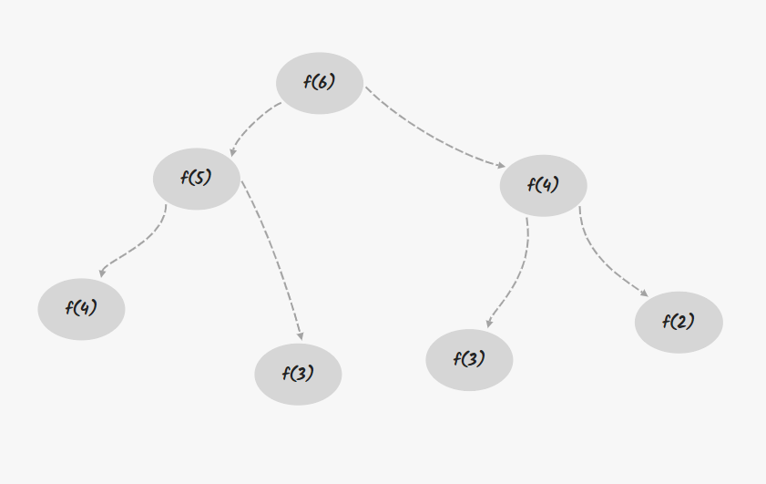
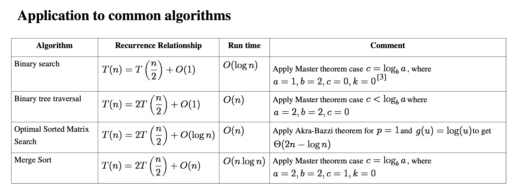

# 算法训练营


## 概述

### 学习方法

改变学习习惯（不要死磕）。多写多练，但不是每次花很多时间。看高票代码和高质量题解。

#### Chunk it up 庖丁解牛

* 数据结构分类
  * 一维
    * 基础：数组 array、链表 linked lis
    * 高级：栈 stack、队列 queue、双端队列 deque、集合 set、map（hash or map）、etc
  * 二维
    * 基础：树 tree、graph 图
    * 高级：二叉搜索树 binary search tree（red-black tree、AV）L、堆 heap、并查集 disjoint set、字典树 Trie、etc
  * 特殊
    * 位运算 Bitwise、布隆过滤器 BloomFilter
    * LRU Cache
* 算法
  * if-else、switch -> branch
  * for，while loop -> iteration
  * 递归 Recursion（Divide & Conquer，Backtrace ）
  * 搜索 Search：深度优先搜索 Depth first search，广度优先搜索 Breadth first search，A*，etc
  * 动态规划 Dynamic Programing
  * 二分查找 Binary Search
  * 贪心 Greedy
  * 数学 Math，几何 Geometry

#### Deliberate Practicing 刻意练习

* 分解和反复练习，过遍数，最少刷五遍
* 练习缺陷、弱点

#### Feedback 反馈

* 及时反馈
* 主动型反馈
  * 高手代码（Github，Leetcode，etc）
  * 第一视角直播
* 被动式反馈
  * code review

### 五步刷题法

**第一遍**

5 - 10分钟：读题和思考。

没有思路，直接看解法，比较解法优劣。

背诵、默写最好的解法。 

**第二遍**

自己写代码，LeetCode 提交验证。

对多种解法比较、体会 -> 优化。

**第三遍**

过一天，重复做题。

根据不同解法的熟练程度进行专项联系。

**第四遍**

过一周之后，反复回来练习相同题目。

**第 5 遍**

面试前一周或者多周恢复性训练。

### 环境配置

Google 浏览器。

VSCode 配合 LeetCode 插件。

https://leetcode-cn.com、https://leetcode.com 。

leetcode-cn.com 和 题解、leetcode.com 和 Discuss board。

> 中文网站和英文网站的题目除了 `-cn`，其他都一致。尽量在中文站做完题，再去看国际站的讨论区。

## 时间复杂度和空间复杂度

### Big O notation

[如何理解算法时间复杂度的表示法](http://www.zhihu.com/question/21387264)

#### 常见的时间复杂度

O(1)：Constant Complexity 常数复杂度

O(log n)：Logarithmic Complexity 对数复杂度

O(n)：Linear Complexity 线性时间复杂度

O(n^2)：N square Complexity  平方

O(n^3)：N cubic Complexity  立方

O(2^n)：Exponential Growth 指数

O(n!)：Factorial 阶乘

>  注意：只需要看最高复杂度的运算，不考虑前面的系数。

```js
// O(1)

const n = 100;

console.log(n);
```

```js
// O(1)

const n = 100;

console.log(n);
console.log(n);
console.log(n);
```

```js
// O(n) 

for (let i = 0; i <= n; i++) {
  console.log(i);
}
```

```js
// O(n) 

for (let i = 0; i <= n; i++) {
  console.log(i);
}

for (let j = 0; j <= n; j++) {
  console.log(i, j);
}
```

```js
// O(n^2)	

for (let i = 0; i <= n; i++) {
  for (let j = 0; j <= n; j++) {
    console.log(i, j);
  }
}
```

```js
// O(log(n))

for (let i = 1; i < n; i = i * 2) {
	console.log(i);
}
```

```js
// O(k^n)

function fib (n) {
  if (n < 2) return n;
  
  return fib(n - 1) + fib(n - 2);
}
```


写程序的时候一定要对自己程序的时间和空间复杂度有所了解，写完程序可以下意识的分析时间和空间复杂度。

能够用最简洁的时间和空间复杂度完成程序。

#### 累加案例

计算 1+ 2 +  3 + 4 + ...n 。

```js
// 方法1：循环累加

y = 0;

for i = 1 to n
	y += i
```

```js
// 方法2：求和公式 sum = n(n + 1) / 2

y = n * (n + 1) / 2
```

#### 递归的时间复杂度

将递归代码转化为递归树。


Fib: 0, 1, 2, 3, 5, 8, 13, 21 ...

F(n) = F(n - 1) + F(n - 2)

```js
// 最简单递归写法

function fib (n) {
  if (n < 2) return n;
  
  return fib(n - 1) + fib(n -2);
}
```





每一层的节点数也就是执行次数，是按照指数级递增的，当下到最后一层，就变成 2 的 n 次方。就是总的执行次数就是指数级。

其次我们可以观察到重复的节点。

面试中不要这么写上述的代码，可以采用加缓存处理或者用循环的写法。

### Master Theorem

用来解决如何计算递归函数的时间复杂度。

[Master theorem](http://en.wikipedia.org/wiki/Master_theorem_(analysis_of_algorithms))、[主定理](http://zh.wikipedia.org/wiki/主定理)




> Binary Search	二分查找
>
> Binary tree traversal	二叉树
>
> Optimal Sorted Martrix Search	排好序的二维矩阵
>
> Merge Sort	归并排序


**二叉树的遍历 - 前序、中序、后序：时间复杂度是多少？**

O(n)，n 代表二叉树里面的树的节点总数。

不管是前序、中序、后序遍历二叉树的时候，每个节点会访问一次仅访问一次。

所以它的时间复杂度就是线性于二叉树的节点总数，也就是 O(n) 的时间复杂度。

**图的遍历：时间复杂度是多少？**

图里面的每个节点访问一次且仅访问一次，所以它的时间复杂度为 O(n)。n 指图里面的节点总数。

**搜索算法：DFS，BFS 时间复杂度是多少？**

访问的节点只访问一次，所以时间复杂度都为 O(n)。n 指搜索空间的节点总数。

**二分查找：时间复杂度是多少？**

O(log n)。


### 空间复杂度

空间复杂度其实和时间复杂度的情况类似，但它更加简单。


如果代码中存在数组，那么数组的长度基本是就是空间复杂度。

如果开辟一个一维数组，长度为传入的元素的个数，一般来说，空间复杂度就是 O(n)。

如果开辟一个二维数组，它的长度数组的长度为 n 平方，空间复杂度基本上就是 n 平方。


如果存在递归，那么它递归的深度，就是空间复杂度的最大值。


如果又是递归又是开辟新数组，那么两者之间的最大值就是空间复杂度。


**爬楼梯问题**

本身就是斐波那契数列求值，F(n) = F(n-1) + F(n-2)。

https://leetcode-cn.com/problems/climbing-stairs/

```js
// 暴力法，递归解法且没有任何缓存，存在大量的重复计算
// 时间复杂度：O(2^n)，树形递归的大小为 2^n。
// 空间复杂度：O(n)，递归树的深度可以达到 n。

/**
 * @param {number} n
 * @return {number}
 */
var climbStairs = function(n) {
  const _climbStairs = (i, n) => {
    if (i > n) {
      return 0;
    }

    if (i == n) {
      return 1;
    }

    return _climbStairs(i + 1, n) + _climbStairs(i + 2, n);
  }

  return _climbStairs(0, n);
};
```

```js
// 记忆化递归，通过 memo 数组，我们可以得到一个修复的递归树，其大小减少到 n。
// 时间复杂度：O(n)，树形递归的大小可以达到 n
// 空间复杂度：O(n)，递归树的深度可以达到 n。

/**
 * @param {number} n
 * @return {number}
 */
var climbStairs = function(n) {
  const memo = [];

  const _climbStairs = (i, n, memo) => {
    if (i > n) {
      return 0;
    }

    if (i == n) {
      return 1;
    }

    if (memo[i] > 0) {
      return memo[i];
    }

    return memo[i] = _climbStairs(i + 1, n, memo) + _climbStairs(i + 2, n, memo);
  }

  return _climbStairs(0, n, memo);
};
```

```js
// 动态规划
// 时间复杂度：O(n)
// 空间复杂度：O(n)

/**
 * @param {number} n
 * @return {number}
 */
var climbStairs = function(n) {
  if (n == 1) {
    return 1;
  }

  const dp = [];

  dp[1] = 1;
  dp[2] = 2;

  for (let i = 3; i <= n; i++) {
    dp[i] = dp[i - 1] + dp[i - 2];
  }

  return dp[n];
};
```

```js
// 斐波那契树
// 上述方法，我们使用 dp 数组，但其实我们并不需要存储所有的状态，只需要存储 n-1 和 n-2 就可以。
// 时间复杂度：O(n)
// 空间复杂度：O(1)，常量级时间

/**
 * @param {number} n
 * @return {number}
 */
 var climbStairs = function(n) {
  if (n == 1) {
    return 1;
  }

  let first = 1;
  let second = 2;

  for (let i = 3; i <= n; i++) {
    let thrid = first + second;

    first = second;
    second = thrid;
  }

  return second;
};
```

## 数组、链表、跳表

### 数组 ArrayList

高级编程语言，对于数组里的元素的类型没有严格的要求，相对来说比较多样化。
在语言上，有一个标准的叫法叫做泛型。也就是说任何一个单元类型，都可以放进数组。

数组底层的硬件存在一个内存管理器，每当你申请数组，计算机实际上是在内存中开辟一段连续的地址。
每一个地址可以直接通过内存管理器进行访问。数组访问任何元素，都是常数时间 O(1)。

数组可以随机访问任何一个元素，它的访问速度非常快。

数组增加、删除数组元素都是 O(n) 的时间复杂度。最好的情况为 O(1)，最坏的情况为 O(n)。
修改、添加、删除比较频繁的情况下，数组其实并不好用。

 [Java 源码分析（ArrayList）](http://developer.classpath.org/doc/java/util/ArrayList-source.html)


**ArrayList 的时间复杂度**

prepend O(1)
append O(1)
lookup O(1)
insert O(n)
delete O(n)

正常情况下数组的 prepend 操作的时间复杂度是 O(n)，但是可以进行特殊优化到 O(1)。采用的方式是申请稍大一些的内存空间，然后在数组最开始预留一部分空间，然后 prepend 的操作则是把头下标前移一个位置即可。


[盛最多水的容器](https://leetcode.com/problems/container-with-most-water/)（腾讯、百度、字节跳动在近半年内面试常考）

[移动零](https://leetcode.com/problems/move-zeroes/)（华为、字节跳动在近半年内面试常考）

[爬楼梯](https://leetcode.com/problems/climbing-stairs/)（阿里巴巴、腾讯、字节跳动在半年内面试常考）

[三数之和](https://leetcode.com/problems/3sum/)（国内、国际大厂历年面试高频老题）


```js
// 移动零，一维数组的坐标变换

// 思路1：循环遍历数组，每次走的时候统计 0 的个数，非 0 元素前移，0 元素后移
// 思路2：重新开一个新数组，遇到 0 往后放，非 0 前面放，内存空间多。新开了数组，不符合必须原数组操作
// 思路3：操作数组中 index 操作

/**
 * @param {number[]} nums
 * @return {void} Do not return anything, modify nums in-place instead.
 */
var moveZeroes = function(nums) {
  let j = 0; // 记录下一个非 0 元素

  for (let i = 0; i < nums.length; i++) {
    if (nums[i] != 0) {
      nums[j] = nums[i];

      if (i !== j) {
        nums[i] = 0;
      }

      j++;
    }
  }
};
```

```js
// 盛最多水的容器

// 思路1：枚举，left bar、right bar，(x - y) * height_diff、O(n^2)

/**
 * @param {number[]} height
 * @return {number}
 */
 var maxArea = function(height) {
  const _getArea = (i, j) => {
    return (j - i) * Math.min(height[i], height[j]);
  }

  let max = 0;

  for (let i = 0; i < height.length; i++) {
    for (let j = i + 1; j < height.length; j++) {
      max = Math.max(_getArea(i, j), max);
    }
  }

  return max;
};


// 思路2：双指针（左右夹逼），左右边界向中间收敛，只需要关心下标比它高的，计算最大面积、O(n)

/**
 * @param {number[]} height
 * @return {number}
 */
 var maxArea = function(height) {
  let max = 0;

  for (let i = 0, j = height.length - 1; i < j; ) {
    const minHeight = height[i] < height[j] ? height[i++] : height[j--];
    const area = (j - i + 1) * minHeight;

    max = Math.max(max, area);
  }

  return max;
};

/**
 * @param {number[]} height
 * @return {number}
 */
var maxArea = function(height) {
  let sum = 0;

  let i = 0,
      j = height.length - 1;

  while (i < j) {
    const minHeight = height[i] < height[j] ? height[i++] : height[j--];
    const area = (j - i + 1) * minHeight;

    sum = Math.max(sum, area);
  }

  return sum;
};
```

```js
// 爬楼梯问题

// 思路1：寻找最近重复子问题
// 1: 1
// 2: 2
// 3: f(1) + f(2)
// 4: f(3) + f(2)
// n: f(n - 1) + f(n - 2)

/**
 * @param {number} n
 * @return {number}
 */
var climbStairs = function(n) {
  if (n <= 2) return n;

  let f1 = 1,
      f2 = 2;

  for (let i = 3; i <= n; i++) {
    const temp = f1 + f2;

    f1 = f2;
    f2 = temp;
  }

  return f2;
};
```

```js
// 两数之和 https://leetcode.com/problems/two-sum/
// a + b == target

// 思路1：两层循环，枚举下标
// 思路2：hash 表处理
// 思路3：一次 hash 表
```


```js
// 三数之和（高频老题）
// a + b = -c

// 思路1：暴力求解 三层循环
// 思路2：两重暴力 + hash，O(n^2)、仍然需要判重
// 思路3：排序之后，双指针（夹逼），结果可能重复

/**
 * @param {number[]} nums
 * @return {number[][]}
 */
var threeSum = function(nums) {
  let result = [];

  nums.sort((a, b) => a - b);

  for (let k = 0; k < nums.length - 2; k++) {
    if (nums[k] > 0) break;
    if (k > 0 && nums[k] === nums[k - 1]) continue;

    let i = k + 1,
        j = nums.length - 1;

    while (i < j) {
      const sum = nums[k] + nums[i] + nums[j];

      if (sum < 0) {
        while (i < j && nums[i] === nums[++i]);
      } else if (sum > 0) {
        while (i < j && nums[j] === nums[--j]);
      } else {
        result.push([ nums[k], nums[i], nums[j] ]);

        while (i < j && nums[i] === nums[++i]);
        while (i < j && nums[j] === nums[--j]);
      }
    }
  }

  return result;
};
```

### 链表 LinkedList

如果只存在一个 next 指针，叫做单链表。

如果还存在先前指针叫做 prev 或者是 previous，这个链表就叫做双向链表。
头指针一般用 head 来表示，尾指针用 tail 来表示。最后一个元素，它的 next 指针指向空。

如果 tail 指针的 next 指回到 head，那么这个链表就叫做循环链表。

```java
// 最简单 LinkedList 实现

class LinkedList {
  Node Head;
  
  class Node {
    int data;
    Node next;
    
    Node (int d) {
      data = d;
    }
  }
}
```

[Linked List 的标准实现代码](http://www.geeksforgeeks.org/implementing-a-linked-list-in-java-using-class/)

[Linked List 示例代码](http://www.cs.cmu.edu/~adamchik/15-121/lectures/Linked Lists/code/LinkedList.java)

[Java 源码分析（LinkedList）](http://developer.classpath.org/doc/java/util/LinkedList-source.html)

Java 中的 LinkedList 是一个很标准的双向链表结构。


链表增加和删除任何节点，不会引起整个链表的群移操作，也不需要复制元素、挪动一半的元素、挪动多个元素到新的位置。
链表的移动和修改的效率非常高，都为 O(1)。

但是也因为这样的结构，访问链表中任何一个位置，操作其实并不简单。
如果访问头节点和尾节点，都是 O(1)。但是如果想访问中间节点，必须从头节点一步一步往后移动。线性 n 的，O(n) 的算法。

**LinkedList 的时间复杂度**

prepend O(1)
append O(1)
lookup O(n)
insert O(1)
delete O(1)


[反转链表](https://leetcode.com/problems/reverse-linked-list/)（字节跳动、亚马逊在半年内面试常考）

[两两交换链表中的节点](https://leetcode.com/problems/swap-nodes-in-pairs)（阿里巴巴、字节跳动在半年内面试常考）

[环形链表](https://leetcode.com/problems/linked-list-cycle)（阿里巴巴、字节跳动、腾讯在半年内面试常考）

[环形链表 II](https://leetcode.com/problems/linked-list-cycle-ii)

[K 个一组翻转链表](https://leetcode.com/problems/reverse-nodes-in-k-group/)（字节跳动、猿辅导在半年内面试常考）


```js
// 翻转链表

// 思路1：迭代法
/**
 * Definition for singly-linked list.
 * function ListNode(val, next) {
 *     this.val = (val===undefined ? 0 : val)
 *     this.next = (next===undefined ? null : next)
 * }
 */
/**
 * @param {ListNode} head
 * @return {ListNode}
 */
var reverseList = function(head) {
  let prev = null,
      curr = head;

  while (curr) {
    const next = curr.next;

    curr.next = prev;
    prev = curr;
    curr = next;
  }

  return prev;
};


// 思路2：尾递归法
/**
 * Definition for singly-linked list.
 * function ListNode(val, next) {
 *     this.val = (val===undefined ? 0 : val)
 *     this.next = (next===undefined ? null : next)
 * }
 */
/**
 * @param {ListNode} head
 * @return {ListNode}
 */
var reverseList = function(head) {
  if (head == null || head.next == null) {
    return head;
  }

  const newHead = reverseList(head.next);

  head.next.next = head;
  head.next = null;

  return newHead;
};
```

```js
// 两两交换链表中的节点

/**
 * Definition for singly-linked list.
 * function ListNode(val, next) {
 *     this.val = (val===undefined ? 0 : val)
 *     this.next = (next===undefined ? null : next)
 * }
 */
/**
 * @param {ListNode} head
 * @return {ListNode}
 */
var swapPairs = function(head) {
  const dummy = new ListNode(0, head);

  let curr = dummy;

  while (curr.next && curr.next.next) {
    let n1 = curr.next,
        n2 = curr.next.next;

    curr.next = n2;
    n1.next = n2.next;
    n2.next = n1;
    curr = n1;
  }

  return dummy.next;
};
```

```js
// 环形链表

// 思路1：遍历链表，set 记录所有访问的结点，看后续元素是否出现再 set 中
// 思路2：快慢指针 O(1) 内存，也是双指针解法

/**
 * @param {ListNode} head
 * @return {boolean}
 */
var hasCycle = function(head) {
  const set = new Set();
  
  while (head) {
    if (set.has(head)) return true;
    
    set.add(head);
    
    head = head.next;
  }
  
  return false;
};


/**
 * @param {ListNode} head
 * @return {boolean}
 */
var hasCycle = function(head) {
  let slow = head,
      fast = head;
  
  while (fast && fast.next) {
    slow = slow.next;
    fast = fast.next.next;
    
    if (slow === fast) return true;
  }
  
  return false;
};
```

```js
// 环形链表II

// 思路1：遍历链表，set 记录所有访问的结点，看后续元素是否出现再 set 中
// 思路2：快慢指针 O(1) 内存，也是双指针解法

/**
 * @param {ListNode} head
 * @return {ListNode}
 */
var detectCycle = function(head) {
  const set = new Set();
  
  while (head) {
    if (set.has(head)) return head;
    
    set.add(head);
    
    head = head.next;
  }
  
  return null;
};

/**
 * @param {ListNode} head
 * @return {ListNode}
 */
var detectCycle = function(head) {
  let slow = head,
      fast = head;
  
  while (fast && fast.next) {
    slow = slow.next;
    fast = fast.next.next;
    
    if (slow === fast) {
      fast = head;
      
      while (fast !== slow) {
        fast = fast.next;
        slow = slow.next;
      }
      
      return slow;
    }
  }
  
  return null;
};
```

```js
// K个一组翻转链表

// 思路，定义反转函数，根据 k 对链表进行拆分

/**
 * @param {ListNode} head
 * @param {number} k
 * @return {ListNode}
 */
var reverseKGroup = function(head, k) {
  if (head === null) return null;

  let start = head,
      end = head;

  for (let i = 0; i < k; i++) {
    if (end == null) return head;

    end = end.next;
  }

  const newHead = reverse(start, end);

  start.next = reverseKGroup(end, k);

  return newHead;
};

function reverse (start, end) {
  let prev = null,
      curr = start;

  while (curr !== end) {
    const next = curr.next;

    curr.next = prev;
    prev = curr;
    curr = next;
  }

  return prev;
}
```

### 跳表 Skip List

数组中有序的时候，二分查找可以很快的查到目标元素位置。
链表元素有序的时候，如何快速的查询到目标位置？

跳表的使用只能用于链表里的元素有序的情况。跳表里的元素始终必须是有序的，不然没办法使用。
跳表（skip list）对标的是平衡二叉树（AVL Tree）和二分查找，是一种插入、删除、搜索都是 O(log n) 的数据结构。1989 年出现。
其他的 “树” 都是在 1960、196 几年出现，跳表比它们晚了接近 30 年，最后才出现。

它最大的优势是原理简单、容易实现、方便扩展、效率更高。因此在一些热门的项目里用来替代平衡树，如 Redis、LevelDB 等。
LevelDB 是 Goole 用来取代 BigTable 的，同时是 Google 的工程师 Jeff Dean 这个人发明的。


如何给有序的链表加速？

时间复杂度：查询 O(n)
简单优化：添加头尾指针

一维数据结构加速，经常采用的方式就是**升维**。这样就会存在更加的附加信息，**空间换时间**。
可以为链表增加一级索引，指向 next + 1。还可以增加多级索引。


跳表查询的时间复杂度分析

n/2、n/4、n/8，第 k 级索引结点的个数就是 n/(2^k)。
假设索引有 h 级，最高级的索引有 2 个结点。n/(2^h) = 2，从而可以求得 h = log2(n) - 1。

在跳表中查询任意数据的时间复杂度就是 O(logn)。

现实中使用跳表时，会由于元素的增加和删除，导致它的索引并不是完全工整的。
经过多次改动之后，有些地方会少跨或者只跨两步。
维护成本相对比较高。增加元素时，要把索引更新一遍，删除元素时，也需要把索引更新一遍。
增加和删除的时候的时间复杂度就变成 logn。


跳表的空间复杂度分析

原始链表大小为 n，每 2 个结点抽一个，每层索引的节点数：
n/2，n/4，n/8，...，8，4，2
原始链表大小为 n，没 3 个结点抽一个，每层索引的节点数：
n/3，n/9，n/27，...，9，3，1
空间复杂度是 O(n)。


不管是 java，还是现在的 c++，Go，js 中，都提供了很多封装好的数据结构。

LRU Cache - Linked list：[ LRU 缓存机制](http://leetcode-cn.com/problems/lru-cache)

Redis - Skip List：[跳跃表](http://redisbook.readthedocs.io/en/latest/internal-datastruct/skiplist.html)、[为啥 Redis 使用跳表（Skip List）而不是使用 Red-Black？](http://www.zhihu.com/question/20202931)

### 相关题目

[删除有序数组中的重复项](https://leetcode.com/problems/remove-duplicates-from-sorted-array/)

[轮转数组](https://leetcode.com/problems/rotate-array/)

[合并两个有序链表](https://leetcode.com/problems/merge-two-sorted-lists/)

[合并两个有序数组](https://leetcode.com/problems/merge-sorted-array/)

[两数之和](https://leetcode.com/problems/two-sum/)

[移动零](https://leetcode.com/problems/move-zeroes/)

[加一](https://leetcode.com/problems/plus-one/)


```js
// 删除有序数组中的重复项

// 思路：双指针解法，一个指针数组长度，一个指针迭代数据

/**
 * @param {number[]} nums
 * @return {number}
 */
var removeDuplicates = function(nums) {
  if (!nums.length) return 0;
  
  let i = 0;

  for (let j = 1; j < nums.length; j++) {
    if (nums[j] !== nums[i]) {
      nums[++i] = nums[j];
    }
  }

  return ++i;
};
```

```js
// 轮转数组


```


## 栈、队列

