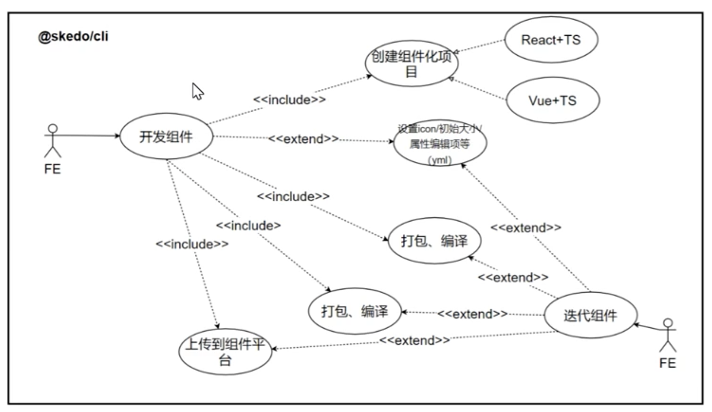

## 用例分析

### 主要内容

* 什么是用例？
* 用例的组成
* 举例：@skedo 的用例图
* 用例的收集和整理

### 为什么要学用例

* 看需求文档
* 做技术 Leader
* 做技术项目
* 更好的做业务
* 将来老板

用例就是找用户需求的过程，此时系统设计就已经开始了。

### 什么是用例

完整性：拿起手机打王者，这是一个完整的用例，但是 “拿起手机” 并不是一个用例。

独立性：一个用例已经完成某个明确的目标。

例如：我是张三，我是程序员，我要开发系统，

我是**{什么角色}**，我可以**{做什么}**，我会{**获得什么收益、完成什么工作}**。

### 用例的组成

#### 参与者

参与者，即谁与系统交互。参与者可以是人，也可以是系统。比如 B 系统收到 A 系统的报警后，启动应急方案，自动切换流量。

#### 用例

表示完成什么目标，通常是动词短语，比如 “做 xx”，“登录” 等等。用椭圆表示。

#### 边界

代表系统。比如用户在支付系统下单，在系统账户登录，这是两个不同的边界（boundary）。

**边界对系统设计意义非凡。**例如，系统的耦合在经过长期迭代系统间的边界模式（解决方案：防腐层、重构...）。再比如，系统的设计偏离了最初的定位--边界不明确。

好的产品界限分明，好的系统架构界限分明，好的类型设计界限分明。**boundary（边界）**。

技术扩展：在 Boundary 间，系统对象的共同的认知是 Context。比如 React 多个组件（Boundary）共享数据的一种方式是用 Context。用户在支付系统、营销系统、门店和商品系统中获得优惠券，背后需要一个跨系统的 Context。

**Context 是多个边界之间的共同认知。**

#### 关系

描述用例与用例之间、参与者用例之间的关系。

**关联关系**

关联关系描述一种驱动做事的关系。

* 比如用户登录，从用户指向登录；
* 比如系统报警，从监控系统（参与者）指向报警（用例）；
* 比如消息推送，从消息推送（用例）指向用户（参与者）。

**包含关系**

一个用例包含其他用例。父用例完成，子用例必须完成。

* 用户注册 includes 手机号验证。

**扩展关系**

代表一个用例完成过程中可能会完成的用例。父用例完成，子用例不一定完成。

* 用户登录 extend 用户注册
* 购买产品 extend 退款

**泛化关系（Generalization）**

泛化（Generalization）是一种一般到特殊的抽象技巧。

编程领域有泛型，比如  `Iterator<T>` 代表可以迭代的事物。如果 A 是 `Iterator<T>` ，那么 A 可以被：

```js
for (let x of A) {
  // ...
}
```

`Iterator<T>` 是 `Iterator<number>` 的泛化；动物是哺乳类，鸟类等的泛化（统称）。

泛化关系由特殊指向泛化。

**用例到用例的泛化**

用户支付是 “用支付宝支付”，“用微信支持”，“用银行卡支付” 的泛化。

**参与者到参与者的泛化**

例如在开课吧，用户是讲师、学生、运营人员的泛化。

@skedo/cli 的例子



## 前端架构图

## Coding：Dot 语言

