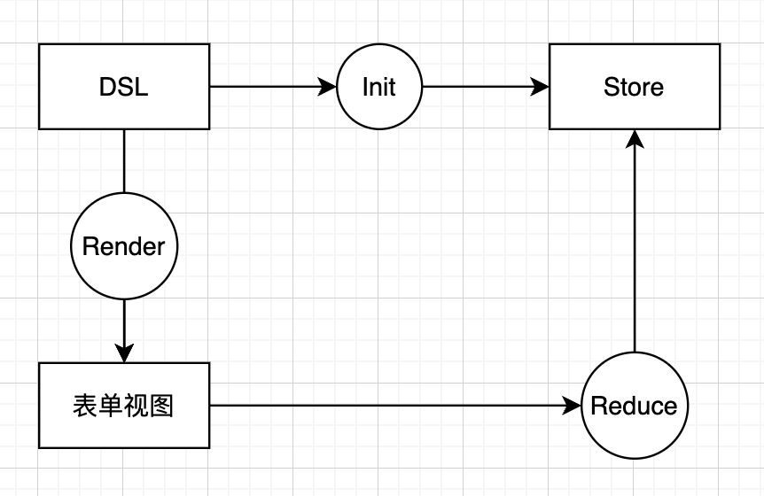

# 三、基本工具链和功能

## 实现 call 和 aplly

```typescript
function add(x: number, y: number) {
  return this.z + x + y
}

add._call({ z: 100 }, 1, 2) // 103
add._apply({ z: 100 }, [1, 2]) // 103
```

```tsx
function foo() {
  console.log('foo')
}

Function.prototype._call = function (thisArgs: any, args: Array<any>) {
  const symbol = Symbol('call') // 不会覆盖原有属性
  thisArgs[symbol] = foo
  const ans = thisArgs[symbol](...args)
  delete thisArgs[symbol]
  return ans
}

foo._call({ x: 1 })
```

## 表单设计

表单的作用是收集用户的输入，在前端领域非常常见。特别是用 DSL 的方式设计表单，这是一个通用的技巧。

### 什么是 DSL

DSL（领域专有语言）。DSL 的表单设计，就是用专门设计表单的语言，来设计表单。

什么是专门设计表单的语言？

### 表单的通用设计

作为标准的表单设计，可以考虑下面的模型。



* DSL（Domain Specific Language），领域专有语言负责
  * 描述表单
  * 初始化表单数据的存储
* Render 负责根据 DSL 渲染表单
* Store 负责存储表单数据
* 用户在表单视图发生输入时触发 reducer，触发表单数据的变化

单向更新，不需要 store 再更新视图，由用户控制表单项数据，只是做存储功能。

简单案例如下：

```tsx
// meta.config.ts DSL

export default {
  form: {
    items: [{ type: 'input', path: ['user', 'name'] }]
  }
}
```

```tsx
// FormDSL.ts

import { Map as ImmutableMap } from 'immutable'
import { Store, Meta } from './dsl.types'

class FormDSL {
  private store: Store = ImmutableMap()
  private meta: Meta

  constructor(meta: Meta) {
    this.meta = meta
  }

  initStore() {}
}
```

```tsx
// Render.tsx

import { Meta } from './dsl.types'

export default (meta: Meta) => {}
```

```typescript
// dsl.types.d.ts

import { Map as ImmutableMap } from 'immutable'

export type Store = ImmutableMap<string, Store>

export type FormItem = {
  type: string
  path: Array<string | number>
}

export type Meta = {
  form: {
    items: Array<FormItem>
  }
}
```

## 表单组件

### 表单组件的分类设计

表单组件按照功能可以分成几类：

* 基础组件：负责具体的输入工作，比如图片上传、地区选择、姓名输入等；
* 布局组件：负责布局，比如 Row/Column/Group/Tabs 等等；
* 组合组件：支持在基础组件上的随意组合，例如 Group、List 等。

在每个表单组件的 DLS 中都需要有两个最基本的属性：

* 类型
* 数据路径（对应 store 中哪个数据进行操作）

还可以设计一些自定义属性，比如说：

* 样式
* 选项（仅 Select）

注意区分实例数据和元数据：

类型、数据路径、样式是所有表单组件公共的属性，是元数据（描述表单元素的数据）。

在设计数据结构的时候，不能将元数据和实例数据混合，举个**反例**：

```typescript
{
  type: 'input',
  path: ['user', 'name'],
  value: null,
  dirty: false
}
```

推荐的实现：

```typescript
{
  meta: Metas.InputMeta,
  value: null,
  dirty: false
}
```

元数据变更意味着所有 Input 组件变更，`value`、`dirty` 是 Input 元素单独的内容。

### 受控组件和非受控组件设计

> 在性能影响范围不大的前提下，不要编写影响阅读效率的代码，保证代码易读。

设计具体表单组件的时候，需要考虑组件中数据是否受控。

设计思想如下：

尽量优先考虑非受控组件

* 最小知识原则（组件状态 !== 表单数据）
* 最小交互原则（减少数据流）
* 单一职责原则（让组件自己承担自己应该承担的部分）
* 性能考虑

