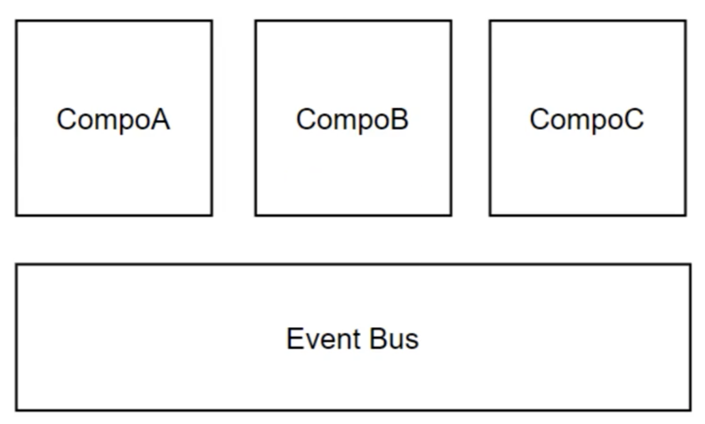
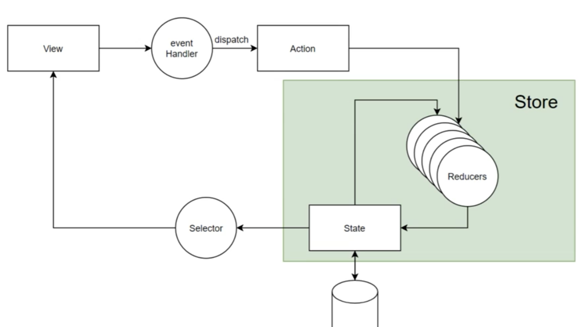
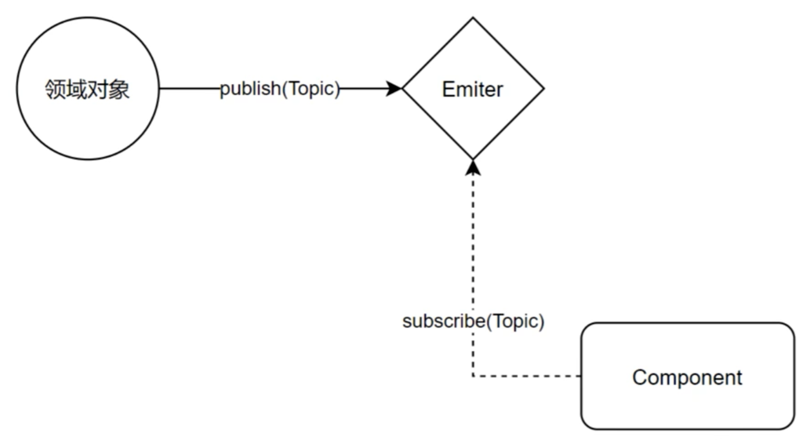

# 设计模式

## 设计模式

设计模式是解决方案，是对软件设计方案中普遍存在的问题提出的解决方案。


**算法是不是设计模式？**

算法不是设计模式。
算法解决的是计算问题，不是解决设计上的问题。设计模式通常讨论的是对象间的关系、程序的组织形式等设计问题。

**面向对象是不是设计模式？**

面向对象是设计模式。

**函数式编程是不是设计模式？**

函数式编程是设计模式。


面向对象和函数式概念包含的范围很大，不大适合做太具体的设计模式探讨。
或者说，OOP 和 FP 是两类设计模式的集合，是编程范式。

## 前端设计模式

对前端普遍问题的解法。

前端中会用到传统的设计模式：

* 工厂（Factory）
* 单例（Signleton）
* 观察者（Observer）
* 构造器（Builder）
* 代理模式（Proxy）
* 外观模式（Facade）
* 适配器（Adapter）
* 装饰器（Decorator）
* 迭代器（Generator）

还有一些偏前端的：

* 组件化（Component）
* Restful
* 单项数据流
* Immutable
* 插件
* DSL（元数据）

## 单例（singleton）

确保一个类只有一个实例。例如 `document.window` 。

常见用法：

```tsx
class ComponentsLoader {
  private static inst: ComponentsLoader = new ComponentsLoader()

  static get() {
    return ComponentsLoader.inst
  }
}

class IDGen {
  private constructor() {}
  
  static inst = new IDGen()
  
  get() { return inst }
}
```

隐含单例的逻辑：

```typescript
const editor = useContext(RednerContext)
```

设计模式关注的是设计目标，并不是对设计实现的强制约束。闭包也可以实现单例，例如：

```typescript
const singleton = () => {
  const obj = new ...
  return () => {
    ...
  }
}
```

**理解设计模式，灵活使用设计模式。**

总结：

* 可以用于配置类、组件上下文中共用的类等；
* 用于对繁重资源的管理（例如数据库连接池）。

## 工厂（Factory）

将类型的构造函数隐藏在创建类型的方法之下。

```typescript
export class Rect {
  static of(left: number, top: number, width: number, height: number) {
    return new Rect(left, top, width, height)
  }
} 
```

例如 `React.crateElement`，它也相当于一个工厂方法。

```typescript
export default class Project {
  public static async create() {
    const crateor = new ProjectCreator()
    return await crateor.create()
  }
}
```

例如 ORM 框架 Sequelize 对于不同 dialect 的实现，也是工厂模式的一种。

适用场景：

* 隐藏被创建的类型；
* 构造函数较复杂；
* 构造函数较多。

## 观察者（Observer）

对象状态改变时通知其他对象。

```typescript
Vue.use(Vuex)

const store = new Vuex.store({
  state: {
    count: 0
  },
  mutations: {
    increment(state) {
      state.count++
    }
  }
})

new Vue({
  el: '#app',
  store
})

methods: {
  increment() {
    this.$store.commit('increment')
    console.log(this.$store.state.count)
  }
}
```

场景：

* 实现发布、订阅之间 1 对多的消息通知；
* 实现 Reactive Programming。

主动的、响应的：Proactive vs Reactive

命令式的程序有什么缺点？

* 组件间依赖比较强；
* 需要借助很多第三方代码去实现功能。

**每个组件都应该知道自己应该做什么。**

## 构造器（Builder）

将类型的创建构成抽象成各个部分。

例如，造车：

```
造车() {
	造发动机()
	造轮子()
	造内饰()
	...
}
```

例如 JSX 编写组件：

```tsx
<Page>
  <TitleBar />
  <Tabs>
  	<Tab title="首页" icon="">...</Tab>
    <Tab title="发现" icon="">...</Tab>
    <Tab title="个人中心" icon="">...</Tab>
  </Tabs>
</Page>
```

## 代理模式（Proxy）

将代理类作为原类的接口。通常代理类会在原类型的基础上做一些特别的事情。

例如 `vue reactivity` 实现。

```typescript
function createReactiveObject(
	target: Target,
  // ...
) {
	const proxy = new Proxy(
  	target,
    targetType === TargetType.COLLECTION ? collectionHandlers : baseHandlers
  ) 
}

// get track
// set trigger
```

**什么时候适合用代理模式？**

如果你想在原有的类型上增加一些功能和变通处理，但是又不希望用户意识到，这时就可以使用代理模式。

## 适配器模式（Adapter）

通过一层包装，让接口不同的类型拥有相同的用法。因此也称为包装模式（wrapper）。

让不同的组件拥有相同的设计接口，**抹平差异**，简化用户操作。用户不需要去理解多个概念，减少心智负担。

例如 `ant-design`  中的：

* onChange：
* defaultValue

例如 React SyntheticEvent。

[https://reactjs.org/docs/events.html#gatsby-focus-wrapper](https://reactjs.org/docs/events.html#gatsby-focus-wrapper)

## 外观模式（Facade）

将**多个复杂的功能**隐藏在统一的调用接口中。

例如 `vite dev`、`vite build` 。

内部功能实现很复杂，我们可以将内部功能按照用户的需要分类，做成门面，让用户使用，不需要关心内部实现逻辑。

例如 react 的 `useState`、`useEffect`、`useRef`、`useContext`  也算是外观模式的实现，开箱即用。

外观模式优点：

* 整合资源；
* 降低使用复杂度（开箱即用）。

## 状态机（StateMachine）

将行为绑定在对象内部状态变化之上。

例如 redux。

场景：

* 组件/管理交互设计；
* 在 DOM 之上抽象用户交互。

## 装饰器（Decorator）

在不改变对象、函数结构的情况下为它添加功能或说明。

例如 `@deprecated`：

```typescript
interface UIInfo {
  /** @deprecated use box instead */
  width: number
  /** @deprecated use box instead */
  height: number

  box: BoxDescriptor
}
```

例如之前的 React 代码：

```typescript
@fetchProductList()
class List extends ReactComponent {
  render() {
    const productList = this.props.productList
    return <...></,,,>
  }
}

function fetchProductList(Target) {
  return () => {
    class ProxyClass extends React.Component {
      fetch() {
        ...fetch logic
      }
      render () {
        const list = this.state.list
        return <Target productList={list} />
      }
    }
    return ProxyClass
  }
}
```

目前写法：

```typescript
const List = () => {
  const productList = useFetchProductList()
  return <...></...>
}
```

**前端还需要使用装饰器嘛？**

作为高阶组件的装饰器暂时不使用了，但是它只有其他用途，例如 typescript 官网的一个例子。

```typescript
 class Point {
  private _x: number
  private _y: number

  constructor(x: number, y: number) {
    this._x = x
    this._y = y
  }

  @configurable(false)
  get x() {
    return this._x
  }

  @configurable(false)
  get y() {
    return this._y
  }
}

function configurable(value: boolean) {
  return function(target: any, propertyKey: string, descriptor: PropertyDescriptor) {
    descriptor.configurable = value
  }
}
```

> 装饰器不是切面（aop），但是切面是装饰器。

主要作用：

* 替换原有实现；
* 修改元数据。

## 迭代器（Iterator）

用 Iterator 来遍历容器内的元素（隐藏容器内部数据结构）。

例如 JavaScript 的 `Set`、`Array`、`HashMap` 等。

例如使用 Generator，用来简化 Iterator 的构造。

# 前端常见设计模式

## 组件化

用组件来搭建界面，组件是最小的界面元素。

按照最新的前端对组件理解，在组件化当中，一个组件包括：

* 视图（View）
* 数据（Data）：props、state 等
* 视图到数据的映射（view = f(data)）
* 组件的作用（effect）：根据数据渲染视图（view = f(data)）之外的程序
  * 这里的作用可以理解为副作用

### 组件特性

**组件可以被：**

* 映射、变换
  * view = f(data)
  * view = f.g(data)
  * view = data => data.map(...).map(...).filter(...)...
* 组合（Composition）
* 记忆（Memorization）
  * 记忆是一种作用
  * 参考 useMemo
* 列表（List）

**组件具有这些性质：**

* 密闭性（sealed）
  * 组件专注、完整
* 可预测性
  * view = f(data) width effects(...)
* 连续性（continuations）
  * 参考 a + b + c + d = a + (b + c + d)。
    * 如果组件的渲染先后顺序不影响组件渲染的结果
    * -- 组件和并发渲染
    * -- 组件可以和控制流（if/while/for等）无缝结合
  * 每个组件是一个函数调用，是一个任务，它们没有**特殊性**。参考 Rect Fiber。
  * 每个组件的渲染是一次函数的执行，可以和 if/else/while/for 等无缝结合。

> react: cuncurent Render - VritualDOM（最优化策略）- renderDOM

### 组件的粒度

组件应该具有最小粒度。

按照最新的组件化理解我们可以将组件分成：

* 基础组件（用于实现交互）
  * Draggable
  * Selectable
  * Button
  * ......
* 组合组件（基础组件上组合实现更复杂的交互）
* 业务组件 = （基础组件｜组合组件）+ useXXX

例如 Swiper = SlidePanel + useSlide(...) 。

### 组件间通信模型

#### EventBus 模型



组件可以：

* 单播
* 广播

常见案例：

* Iframe 中多个 APP 间通信；
* Iframe 中多个 APP 和 Frame 通信；
* Native 和 HybridApp 间 postMessage 通信。

#### 单项数据流 + 状态机模型



场景举例：

* UI 交互制作；
* 全部事件通知（例如加购物车、用户消息等）。

#### 领域模型 + Emiter



组件仅仅负责渲染等简单工作，背后的业务逻辑由复杂的领域模型完成。

## Restful

Restful 是一套前端 + 后端协作标准。

* 前端无状态，前端有（Representation）
* 服务端有状态
* 用户通过 transfer 改变服务端状态
* 用名词性 + HTTP Method 描述 transfer

架构师三要素：

* Coding 能力
* 架构原理性知识
* 项目重构，大量练习

## 单项数据流

传递数据的通道总是单向的，为每个方向的数据传递建立一个单向的通道。例如父组件到子组件的传参（props）。

我们不能将父组件的 state 给子组件用，会存在耦合，子组件会依赖父组件，不能单独使用。可能会存在循环依赖问题。

**双向依赖：双向依赖的组件或者节点没办法给多方使用，没办法提纯。**

```typescript
// 无限循环的场景

class A {
  b: B,
  this.b.on("X", () => {
    this.emit("Y")
  }
}
            
class B {
	a: A
  this.a.on("Y", () => {
    this.emit("X")
  })
}
```

**单向数据流的场景：受控组件和非受控组件**

> 所有的 hooks 都是一个模型，即 per instance + per location。
> 每一个 hook 都有背后关联的 dom 节点，每一个 hook 都有自己的位置，不会混淆。
>
> 受控组件即所有数据都是外部传入，组件本身没有状态。非受控组件内部存在自己的状态。

```tsx
// 典型 受控组件
function Foo(props) {
  // virtualDOM instance
  return <Input onChange={props.onChange} value={props.value} />
}

// 典型 非受控组件
function Foo(props) {
  const [val, setVal] = useState(props.initialValue)
  
  useEffect(() => {
    (debounce(() => {
      if (val !== props.initialValue) 
        props.onChange(val)
    }))()
  }, [val])
  
  return <Input onChange={setVal} value={val} />
}
// or
{
  props: {
  	initialState: ...
  },
  setup(props) {
    const val = ref(props.initialState)
    
    watchEffects(() => {
      if (val.value === props.initialState) {
        props.onChange(val)
      }
    })
    
    return () => {
      return <Input onChange={e => val.value = e.target.value} value={val.value}  />
    }
  }
}
```

**表单解耦：**

```tsx
<Form>
	<Subform1>
  	<SubForm3></SubForm3>
  </Subform1>
  <Subform2></Subform2>
</Form>
```

深度嵌套表单使用属性传参，很容易传错。我们可以使用 “领域模型 + Emiter” 去实现会比较合理。

 每个表单项决定自己的数据去哪更新，而不是将数据传递过来。

```tsx
class FormItem = ({ store, onChange, path }) => {
  // const value = store.getByPath(['person', 'address'])
  const value = store.getByPath(path)
 		
  // 更新的时候也不是通过 Form 驱动所有表单更新，而是通过监听更新
  // store.subscribe(['person', 'address'])
  store.subscribe(path)
  
  // onChange(['person', 'address'], newValue)
  onChange(path, newValue)
  
  return <Input onChange={() => onChange(path, e.target.value)} />
}
```

单项数据流的核心是 “依赖项” 要减少，依赖减少并不是说依赖到单项数据流为止，依赖可以一直减少，系统做的越好，系统模块之间依赖就会越少。或者只存在一份公共依赖。

## Immutable

不可变数据集合：数据不可以被改变，若改变就创建新的集合。

```tsx
const { Map, List } = require('immutable')

const x = Map({ a: 1 })

x.set('a', 2) // 返回新 map
```

 思考这样一个例子（非受控组件）：

```tsx
function SomeForm(props) {
  const formData = reactive(props.initialFormData)
  
  watchEffect(() => {
    store.update(formData)
    // store 无法判断 formData 是否完成更新，因为 formData 作为一个对象并没有发生变化
  })
}
```

这是我们可以使用 immutable 来解决这个问题，或者使用浅拷贝的方式去处理。

**Immutable 的优势：**

* 可以帮助保留变更历史（且体积小）；
* 速度快（性能好）；
* 没有副作用。

## 插件模式

将扩展能力抽象为可以无序执行、各自处理不同问题的一个个插件。

**开闭原则：对修改关闭，对扩展开放。**

例如 babel 插件，rollup 插件，webpack loader。

Babel 插件提供了一套遍历抽象语法树的方法，需要自己定义遍历哪些抽象语法树。

## 领域专有语言：DSL

基于元数据对页面、系统进行描述，让系统基于描述工作。

* HTML + CSS 是对页面的 DSL；
* skedo 中的 Node 是对组件树的 DSL，组件的 yml 是对组件行为的 DSL。

例如虚拟 DOM，Virtual DOM（Node） 可以用来描述 Canvas、App、Web。虚拟 DOM 是对 UI 结构的描述 。

例如活动配置到表单实例。即业务规则（DSL）生成表单 ，然后通过表单可以用来创建活动。

## 设计原则

设计模式非常多，每解决一个问题都会形成设计模式。随着系统的迭代，系统的设计模式也在迭代。

实际项目中，我们并不会第一时间将所有东西都用到位，更不能为了使用模式而用模式。那么我们应该如何去思考？

接下来我们讨论几个思考软件设计时的通用原则。

### 密闭性和单一职责

为什么 Antd 中的 Select 和 Option 是分开的？Tab 和 Panel 是分开的？

```tsx
const Option = Select.Option
const TabPanel = Tab.Panel
```

* 每件事情应该有独立的模块处理；
* 每个独立的模块要把事情做好、做完整。

**关注点分离原则**

例如 Vue3 的  [Composition API proposal](https://github.com/vuejs/rfcs/blob/master/active-rfcs/0013-composition-api.md)。

作为一个类的设计应该满足密闭性和单一职责，作为很多类的设计，应该满足关注点分离原则。

### 单项依赖原则

