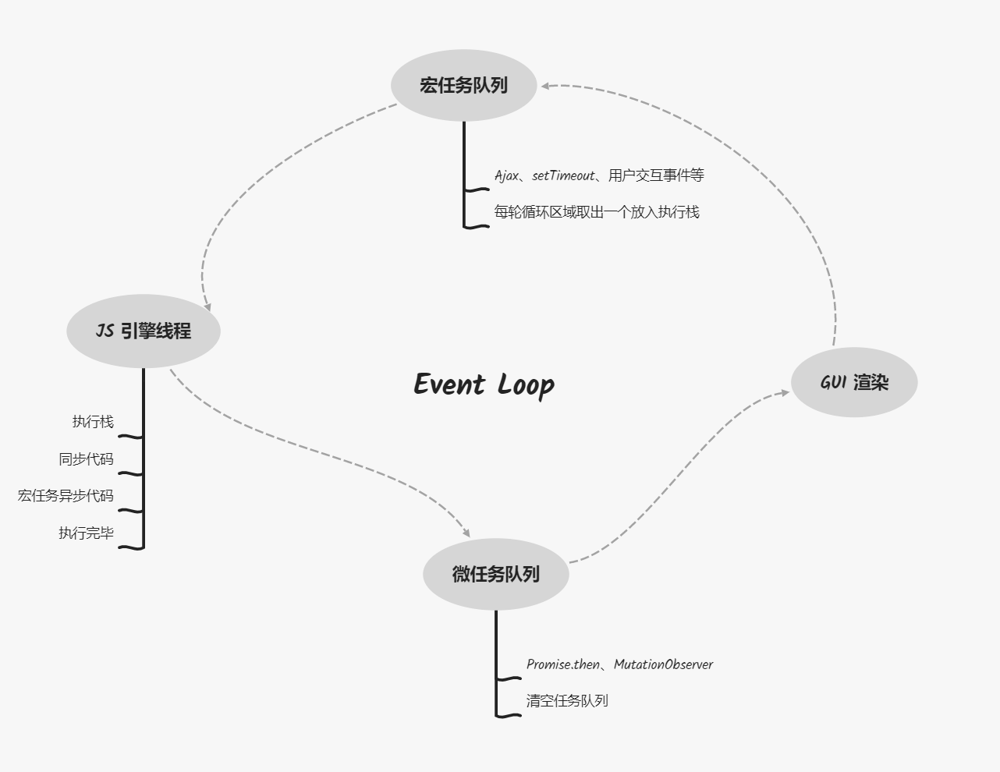

# BOM

## 一、DOM/CSS/渲染树、解析与加载、回流与重绘

  HTML CSS JavaScript

  页面绘制大概分为两个部分：解析、加载

  解析的过程伴随着加载的开始，加载的开始和解析的快慢没有任何关系的。有了解析才会有加载。
  先有解析再有加载，解析和加载是异步的过程。

### 1. 解析、 加载

#### 1.1 domTree -> DOM树

  浏览器引擎会把HTML页面形成DOM结构，再用树型方式排列起来，我们称之为DOM树。
  DOM树构建其实就是HTML元素节点的解析的过程， 满足深度优先解析原则。
  例如同时存在div、ul同级，先解析div及其子元素，然后再解析ul元素。

  DOM树的形成不管内部资源的问题，涉及到资源问题与解析过程无关。
  例如存在img标签，img标签仅仅是把节点挂载到DOMTree上，真正图片的加载不在解析过程中，
  图片的加载不会影响DOMTree的构建，加载在当前节点解析完成之后，解析完毕并不说明页面加载完毕。

  构建DOM树时，不会管样式部分，动态创建的元素和display:none的元素也会被挂载到DOM树上。                                
  ```html
   <div>                                     html
    <h1></h1>                        head           body
  </div>                           meta  title    div    ul
  <ul>                                            h1     li  
    <li>                                             span i em
      <span></span>
      <i></i>
      <em></em>
    </li>
  </ul>
  ```

#### 1.2 cssTree -> CSS树（样式结构体）

CSS样式也会渲染成树形结构。会查看、对比DOM元素，构建CSS树。
浏览器引擎不会直接把CSS和HTML结合在一起，形成CSSTree时会查看DOM之间关系，形成CSS树。

CSS构建时，会自动忽略浏览器不能识别的样式。

```css
i {
  font-style: normal;
}

em {
  font-weight: bold;
}
```

#### 1.3 渲染树（renderTree ） 

渲染树是domTree和cssTree形成的新的树，浏览器会根据渲染树绘制页面，真正看到页面时已经形成渲染树。

含有影响布局（layout）的属性的元素节点是包含在渲染树中的。

* 渲染树每个节点都有自己的样式
* 渲染树不包含隐藏节点，如display: none、hidden之类不需要绘制的节点
* visibility: hidden 相对应的节点是包含在渲染树上的
* 渲染树上的每一个节点都会被当作一个盒子（box），具有内容填充、边距、边框、位置等样式。

```js
display: none;  // 渲染树不包括含有此属性的元素
visibility: hidden; // 渲染树包括含有此属性的元素
```

renderTree构建完毕之后，浏览器会根据它绘制页面。

### 2. 回流、重绘

当 JS 对页面的节点操作时，就会产生回流（reflow）或者重绘（repaint），回流也叫重排。

* 回流：因为节点的尺寸（大小、宽高）、布局（位置）、显示（display）这一些改变的时候， 渲染树中的一部分或者全部需要重新构建，这种重新构建的现			象就是回流。

* 重绘：回流完成后，浏览器会根据新的渲染树重新绘制回流影响的部分或全部节点，这个重新绘制的过程就是重绘。

一个页面至少存在一次回流，只要构建renderTree必定会引起回流。
回流时，浏览器会重新构建受影响部分的渲染树，只要渲染树被改变或重新构建，一定会引起重绘。
除开回流相关的操作，比如更改字体颜色、背景颜色等也会产生重绘。
回流一定会引起重绘，重绘不一定是回流产生的后续反应。

#### 2.1 引起页面回流的因素：

* DOM节点增加或删除
* DOM节点位置变化，比如margin操作
* 元素的尺寸、边距、填充、边框、宽高被改变
* DOM节点display的显示与否，不包含visibility:hidden
* 页面的渲染初始化
* 浏览器窗口尺寸变化，例如resize属性更改
* 向浏览器请求某些样式信息，例如offset、scroll、client相关的属性的获取、width/height属性的获取、请求getComputedStyle、currentStyle获取样式。

除开这些因素之外，会引起重绘，不会引起回流。

回流操作可以有，但是应该尽可能减少回流，DOM操作是最消耗性能的，原因就是回流。
DOM操作优化时，一切都是以避免回流、减少回流次数为依据来进行优化的。

```js
var oBoxStyle = document.getElementsByClassName('box')[0].style;

// 5次回流、7次重绘
oBoxStyle.width = '200px'; // 回流 + 重绘
oBoxStyle.height = '200px'; // 回流 + 重绘
oBoxStyle.margin = '20px'; // 回流 + 重绘
oBoxStyle.backgroundColor = 'green'; // 重绘
oBoxStyle.border = '5px solid orange'; // 回流 + 重绘
oBoxStyle.color = '#fff'; // 重绘
oBoxStyle.fontSize = '30px'; // 回流 + 重绘

// 回流和重绘
var h1 = document.createElement('h1');
h1.innerHTML = '我是一个标题';
document.body.appendChild(h1);
```

在body元素后面增加元素节点，会形成一次回流和重绘，页面元素不会全部绘制。
如果在body元素最前面增加元素，整个body里面的所有元素全部都会重新绘制，产生回流，引起重绘。
如果在某个元素前插入元素，这个元素后的所有元素都会重新绘制，产生回流，引起重绘。
在已有要求前提下，尽量避免在元素前插入元素。

回流比重绘的代价高，回流产生的性能问题比重绘产生的性能问题大得多。
回流产生的性能问题与渲染树有多少节点、需要重新构建有关。

* 回流次数会影响性能
* 渲染树重新构建的规模大小（回流涉及到的节点树）

#### 2.2 浏览器针对回流的策略（IE8以后）

浏览器引擎里设置一个队列，专门来处理操作。
只要页面加载，浏览器会查看页面存在多少引起回流和重绘的操作，按照顺序放入队列中。
队列中达到一定数量（数量限制与性能相关）或达到一定时间间隔，对队列中操作进行批量处理。

***批处理只引起一次回流和重绘。***

如果使用请求样式的方法（getComputedStyle）或者读写样式属性，
会把队列中操作清空还原，再进行获取操作，每一次获取样式时，会引起回流。

#### 2.3 如何减少回流次数及影响规模

* 参数固定可以使用增加类名的方式，类名变化只会引起一次回流、一次重绘。

  ```js
  this.className += ' active';
  ```

* 参数不固定可以使用cssText属性增加行内样式，只会引起一次回流、一次重绘。

  ```js
  this.style.cssText = '\
    width: ' + width + 'px; \
    height: ' + height + 'px; \
    background-color: ' + backgroundColor + '; \
    border: ' + border + '; \
  ';
  ```

* 使用文档碎片（DocumentFragment），文档碎片不在DOM树中，是虚拟节点。只会引起一次回流、一次重绘。

  ```js
  var oFragment = document.createDocumentFragment();

  for (var i = 0; i < 10; i++) {
    var oDiv = document.createElement('div');
    oDiv.className = 'box';
    oFragment.appendChild(oDiv);
  }

  document.body.appendChild(oFragment);
  ```

* display:none; 元素隐藏后不在渲染树中，只会引起两次回流、两次重绘。

  ```js
  this.style.display = 'none'; // 回流 + 重绘
  this.style.width = '200px';
  this.style.height = '200px';
  this.style.backgroundColor = 'green';
  this.style.border = "5px solid orange";
  this.style.display = 'block'; // 回流 + 重绘
  ```

* 使用offset、client、scroll、width、height、getComputedStyle、currentStyle等属性时，尽量缓存一下。

  ```js
  var oLeft = div.offsetLeft; // 回流 + 重绘
  div.style.left = oLeft + 10 + '10px';
  ```

  如果重复多次获取元素属性，可以使用getComputedStyle，性能比直接获取offset*好。

* 使用动画的元素一定要绝对定位，不要直接操纵marginLeft属性

  绝对定位脱离文档流，新建定位层，所有的重绘和回流不会影响到父级。

* 不要用table布局，table回流的代价很大，table第一次首次加载回流性能很差。

  table具有弹性性质，不是简单的块级元素，table具有自己的内边距（cell padding），
  内边距对回流的影响很大，所以尽可能不用table布局。

## 二、时间线、解析与渲染、封装文档解析完毕函数

document.write 向文档写入，默认不会覆盖body中存在的元素，在onload的事件处理函数中执行，会覆盖body存在元素。

待解决问题：

* document.write() 产生的现象原理是什么?
* 时间线问题

直接执行document.write时，文档还没有开始渲染，正常追加；
window.onload之后，文档已经解析构建完毕，执行document.write时，直接替换body标签内容；

CSSOM（CSS树） DOM（DOM树）

### 1. 时间线

浏览器从加载页面开始那一刻，到整个页面加载完毕，整个过程中按顺序发生的总流程，就叫做时间线。

***排序不代表顺序，有些是同时发生的。***

* 生成document对象 #document

  从生成document对象开始，JS开始起作用，DOM的功能体开始起作用。

* 解析文档，构建DOM树、CSS树
      
  ```js
  document.readyState = 'loading';
  ```

    * 从html代码的第一行开始，浏览器从第一行阅读到最后一行，从传统浏览器来说,这个过程实际上是不做任何事情的，只是在阅   读。解析文档的同时，浏览器构建DOM树。

    * 遇到link标签，开新的线程异步加载CSS外部文件，阅读style标签，共同生成CSSOM（CSS树）。DOM树和CSS树是同时构建的。

    * 没有设置异步加载的SCRIPT，阻塞文档解析

      只要遇到没有设置异步（async、defer）的script标签或动态设置的script标签，会阻塞文档解析。
      构建DOM和CSS树也会停止，等待JS脚本加载并且执行完成后，继续解析文档。

    * 设置异步加载的SCRIPT，异步加载JS脚本并且执行（async），不阻塞解析文档（不能使用document.write）

      异步脚本中，不能使用document.write()，使用则会报错。
      如果必须使用，可以在脚本中，写在window.onload的事件处理函数中。

    * 解析文档时，遇到img标签，先解析节点，遇到src，创建加载线程，异步加载图片资源，不阻塞解析文档。

* 文档解析完成

    ```js
    document.readyState = 'interactive' 可以进行交互
    ```

    * 设置异步的（defer ）script，JS脚本开始按照顺序执行。
      设置async的标签，异步加载完毕直接执行。
      设置defer的标签，异步加载完毕，等待文档解析完毕后，开始执行脚本。

    * 触发DOMContentLoaded事件，代表文档解析完成。

      文档解析完成，不代表文档加载完成，如果存在图片，图片还在异步加载。
      解析完成，代表DOM结构已经生成，渲染树已经生成。
      程序从同步的脚本执行阶段向事件驱动阶段演化，用户交互在文档解析完成之后。

* 文档加载完成及异步资源加载完毕

  ```js
  document.readyState = 'complete' 文档加载完成
  ```

  async scipt加载并执行完毕，img等资源加载完毕，window.onload事件触发。 
  

async的script标签，可能在文档解析完成后才开始加载。
  async和defer不一定谁先加载，都是异步执行。

  所有的异步都执行完毕，window.onload被触发，一直在阻塞中。

### 2. 页面加载的3个阶段

  * 解析文档、构建DOM树开始  

    ```js
    document.readyState = 'loading'; // 加载中
    ```

  * 文档解析完成  

    ```js
    document.readyState = 'interactive'; // 解析完成
    ```

  * window.onload触发，文档加载完成及资源加载完毕

    ```js
    document.readyState = 'complete' 文档加载完成
    ```

  文档状态改变触发该事件，监听的过程是由JS引擎完成的，不是用户，不能算是事件驱动阶段中一种。

  ```js
console.log(document.readyState); // loading
document.onreadystatechange = function () {
    console.log(document.readyState); 
    // interactive
    // complete
}
document.addEventListener('DOMContentLoaded', function () {
    console.log('DOMContentLoaded'); // 文档解析完成之后立即触发
}, false);

// loading
// interactive
// DOMContentLoaded
// complete
  ```

### 3. window.onload 和 DOMContentLoaded 区别？

DOMContentLoaded是文档解析完成后触发。
window.onload是文档解析完成，并且异步资源加载完成后触发，浪费时间。

异步script不能有依赖其他脚本的操作，不能有需要触发的操作（比如监听文档解析完成），
可以执行网络检查、网络请求等操作。异步操作实际在项目中使用较少。

#### 3.1 现代浏览器的布局和渲染

现在浏览器为了更好的用户体验，渲染引擎尝试尽快的的渲染到屏幕上，
先解析的部分先构建CSS树、DOM树和渲染树，即读到哪一部分，就开始渲染哪一部分。
现在浏览器是在解析的过程中就在执行渲染，一边解析一边渲染。
所以script标签应该放在底部，否则会浪费解析script文档的时间。

first paint（初次绘制），只要解析到html中需要渲染的东西，一边解析一边构建一边渲染。
如果把script放在顶部，初次渲染的时间就被延迟，所以可能存在页面留白的情况。不利于用户体验。

DOMContentLoaded：当renderTree全部渲染完毕之后，触发此事件。

#### 3.2 jQuery 渲染完成

```js
$(document).ready(function () { });
$(function () { });
$(document).on('ready', function () { })
```

jQuery种这3种写法是一样的，这3种方法其实代表的就是文档解析完毕（DOMContentLoaded）。

这3种方法相比较window.onlcoad，其实就是DOMContentLoaded和window.onload的区别。

### 4. 封装文档解析完毕函数 domReady

```js
function domReady (fn) {
  if (document.addEventListener) {
    document.addEventListener('DOMContentLoaded', function () {
      document.removeEventListener('DOMContentLoaded', arguments.callee, false);
      fn();
    }, false);
  } else if (document.attachEvent) {
    document.attachEvent('onreadystatechange', function () {
      if (this.readyState === 'complete') {
        document.detachEvent('onreadystatechange', arguments.callee);
        fn();
      }
    })
  } 

  // 判断不在iframe中、兼容IE67
  if (document.documentElement.doScroll && 
        typeof(window.frameElement) === 'undefined') {
          
    try {
      document.documentElement.doScroll('left');
    } catch (e) {
      return setTimeout(arguments.callee, 20);
    }

    fn();
  }
}
```

## 三、渲染引擎、声明HTML、渲染模式

### 1. 浏览器请求一个网页的流程

1. DNS解析获取IP地址

2. TCP/IP三次握手，建立TCP连接，发起HTTP请求

3. 浏览器得到HTML代码

4. 解析页面（JS代码解析、HTML，CSS样式解析），请求下载HTML中的静态资源

5. 四次挥手，中断连接请求，渲染页面

### 2. 浏览器与页面渲染

浏览器组成部分：大体划分为7个部分。

* 用户界面：用户看到的浏览器的样子
* 浏览器引擎：浏览器运行的程序接口集合，主要是查询和操作渲染引擎
* 渲染引擎：解析HTML/CSS，将解析的结果渲染到页面的程序
* 网络：进行网络请求的程序
* UI后端：绘制组合选择框及对话框等基本组件的程序
* JS解释器：解析执行JS代码的程序
* 数据存储：浏览器存储相关的程序 cookie/storage


    用户界面（用户能看到的浏览器界面）                       
    	|                     
    浏览器引擎（查询和操作渲染引擎）   ---->  数据存储
    	|                             （浏览器中的一个轻量级数据库）   
    渲染引擎（负责解析、渲染请求的内容）
    	|          |           |  
       网络     JS解释器        UI后端
    （负责网络） （解析执行JS） （负责绘制）

用户界面也可以直接作用于UI后端。现在浏览器存在JS引擎，作为解释器，是单独部分。

### 3. 渲染到底是什么？

* 渲染：用一个特定的软件将模型（一个程序）转换为用户所能看到的图像的过程。
* 渲染引擎：内部具备一套绘制图像方法集合，渲染引擎可以让特定的方法执行（把HTML/CSS代码解析成图像显示在浏览器窗口中）。

页面的渲染过程：

                      DOM（JS生成）
                          |
    HTML -> 解析HTML -> 生成DOM树      布局
                          |            |
                        附着合成  -> 生成渲染树 -> 绘制 -> 显示
                          |
    CSS样式 -> 解析CSS -> 生成CSS规则树
    
        DOM + CSSOM -> Render Tree

#### 3.1 渲染模式：

* IE盒子模型：IE盒子模型包含border、padding

  width 100、height 100、padding 50、border 50，实际高度和宽度为200

* 标准盒子模型：宽高不受padding、border影响

  width 100、height 100、padding 50、border 50，实际高度和宽度为100

### 4. 谈谈IE6以前的浏览器兼容性

* 百分比高度被准确应用
  IE：即设置百分比，是按照外层实际盒子大小来应用值。
  现在百分比，是按照外层内容高度来判断的。
* 内联元素设置宽高影响尺寸
* table单元格的图片的vertial-align默认值是bottom
* 某些元素的字体样式不继承body的设置，特别是font-size
  如果在body设置font-size大小，其他子元素的大小是不受影响得
* overflow:hidden在某些情况下不生效
        
### 5. 谈谈IE6开始以后浏览器兼容性

* 问题：在各浏览器都有自己渲染标准的背景下，造成了网页开发设计的发展迟缓，甚至阻碍了整个互联网技术的发展。
* 解决方案：标准渲染模式（标准模式）的诞生（W3C标准解析渲染）

* 问题：之前建设的网站不支持标准模式
* 解决方案：保留以前解析渲染的标准（混杂/怪异模式 -> 浏览器向后兼容）        
### 6. 浏览器模式（compatMode）

```js
document.compatMode;

// BackCompat 怪异模式
// CSS1Compat 标准模式
```

很多浏览器已经取消怪异模式的兼容，IE6本身存在此模式。

### 7. DTD文档类型

DTD：文档类型定义（Document Type Definition）          
种类：严格版本（Strict）、过渡版本（Transitional）、框架版本（Framest）

Strict DTD：文档结构与表现形式实现了更高的分离，页面的外观用CSS来控制
Transitional DTD：包含了HTML4.01版本的全部标记，从HTML的使用过渡到XHTML
Frameset DTD：使用\<frameset\>以框架的形式将网页分为多个文档

* html5声明文档的模式，DOCTYPE不区分大小写，对大小写不敏感。

  ```js
  <!DOCTYPE html>  
  ```

* 其他版本

  ```js
  <!DOCTYPE HTML PUBLIC "-//W3C//DTD HTML 4.01//EN" "http://www.w3.org/TR/html4/strict.dtd">
  <!DOCTYPE HTML PUBLIC "-//W3C//DTD XHTML 1.0 Strict//EN" "http://www.w3.org/TR/xhtml1/DTD/xhtml1-strict.dtd">
  ```
  
## 四、剖析JavaScript的执行机制

### 1. 进程、线程

* 单进程：计算机中的程序关于某数据集合上的一次运行活动，是系统进行资源分配和调度的基本单元
  早期，电脑是单核CPU，通过轮转时间片的算法（非常快的时间内进行分段切片），可以模拟出多进程的效果。

* 多进程：启动多个进程，多个进程可以一块来执行多个任务

* 单线程：进程内一个相对独立的，可调度的执行单元，于同属的一个进程共享进程中的资源（同一时间，只能做一件事情）

  setInterval、ajax请求都是调用同一个进程中的不同线程，通过线程完成任务。

* 多线程：启动一个进程，在一个进程内部启动多个线程，这样，多个线程也可以一块执行多个任务
 （也是通过调度实现的，如多进程能做多个任务一样，多线程也能做多任务）

eg：

- 工厂的资源 -> 系统分配的内存（独立的一块内存）
- 工厂之间的相互独立 -> 进程之间相互独立
- 工厂内有一个或多个工人 -> 一个进程由一个或多个线程组成
- 多个工人协作完成任务 -> 多个线程在进程中协作完成任务

### 2. 浏览器是多进程的

基本所有的浏览器都是多进程的，可以打开任务管理器查看。

#### 2.1 常驻进程：

* browser进程：新开窗口、编辑工具、设置喜好等
* 第三方插件进程：安装一系列插件
* GPU进程：GPU硬件加速，通过GPU硬件加速调用GPU进程来启动硬件加速功能，3D建模渲染，运动
* 浏览器渲染引擎进程（浏览器内核）：webkit、blink等
* ...

#### 2.2 浏览器渲染引擎进程（浏览器内核）是多线程的：

  常驻线程：

  * JS引擎线程（单线程）
  * GUI线程（互斥）
  * http网络请求线程
  * 定时器触发线程
  * 浏览器事件处理线程
  * ...

  JS引擎线程用来解析和执行JavaScript代码，常见V8引擎。
  GUI线程用来绘制用户界面，执行渲染操作。
  JS引擎线程和GUI线程是互斥的，例如JS引擎阻塞，会导致GUI线程阻塞，不能同时进行。
  异步事件以网络请求为主，所以有人把3、4、5线程统一叫做WebAPIs。

### 3. 为什么JS引擎设计之初就是单线程的？

JS引擎是为用户交互设计，用户交互必然会操作DOM，多线程操作DOM会导致DOM冲突。

#### 3.1 JS引擎是单线程的，如果数据量大怎么办（大量计算、大量渲染）？

两种类型的解决方案，SSR、webworkder，不是唯一的解决方案。

* SSR（服务端渲染技术）是vue和node结合用来处理数据计算的技术，后台处理数据，计算交给后端，前端用来渲染。
* webworkder，H5中新增的API，向JS引擎申请开子线程，归属于JS引擎下的子线程，由浏览器开辟，完全不能访问DOM。
  

SSR和webworker的出现是为了解决大量计算的问题 。

#### 3.2 计算量不是很大？webworker不划算，ssr感觉没必要？

单线程的解决方案，异步操作。

JavaScript的运行原理：JS引擎线程是单线程的，同时可以执行异步操作（基于事件驱动）。

JS是通过事件驱动的方式来模拟异步操作，我们把它认为可以执行异步。
JS引擎异步的机制是依赖不同的线程，线程本身是由浏览器提供的，意味着环境发生变化，
哪怕JS引擎不变，对应的异步的方式会发生变化。
NodeJS本质是JavaScript V8引擎，但是执行环境不同（不是浏览器），不是浏览器提供的事件处理线程，
对应的基于JS引擎的异步处理方式发生变化。

不同的环境，基于异步的事件驱动模型可能会不同。

### 4. 事件驱动模型

所有的JavaScipt代码都是在执行栈中执行的，先进后出。


                        任务进入执行栈
    
                      同步任务还是异步任务
    
        同步                                        异步
    
        主线程                                      Event Table -> 可以理解为webAPIs
                                                    注册回调函数，当事件被触发，对应的回调函数会放到事件队列中
    任务全部执行完毕                                Event Quenue  
                                                    事件队列会根据Event Loop进入主线程中
                  读取任务队列中的结束，进行主线程执行 

  


                JS                    ->            webAPIs           
    
    Memory Heap     Call Stack                   DOM（document）
                                                  AJAX（XMLHttpRequest）
                                                  Timeout（setTimeout）
    
                                                      |
    
                                    Event Loop <- Callback Queue
                                                onclick onload onDone 
    
    并不是所有的回调函数都是异步代码（例如sort函数），异步是以回调的方式出现的（ES6以前）。
    
    setTimeout、setTimeout调用的是定时器触发线程、ajax请求调用的是网络请求线程、
    onclick、addEventListener使用浏览器事件处理线程，这些都属于异步操作。

#### 4.1 setTimeout函数执行

处理异步函数，函数执行添加到调用栈中（Call Stack），发现是定时器，会调用相应异步线程，注册回调函数，
注册到当前的webAPIs中，把当前函数挂起，等待事件被触发。函数执行完毕，函数从执行栈中移除。
注册的回调函数等待事件被触发后，推入到事件队列（CallbackQuenue | EventQuenue | TaskQueue）中。
事件循环（Event Loop）在事件队列中获取回调函数，添加到调用栈中，执行回调函数。

回调队列（CallbackQuenue）又叫做事件队列（EventQuenue）或者任务队列（TaskQueue）。

##### 事件循环（事件轮询）

看当前的调用栈（主线程中）中同步任务有没有执行完，如果执行完毕，会查看事件队列中有没有任务，
如果存在任务，会将当前队列中的首位推入到当前的主进程中，然后执行代码。

队列（queue）先进先出，栈（stack）先进后出。

```js
setTimeout(function () {}， 0);
```

HTML5规定最小间隔为4ms，0其实是0.004s。
人眼视觉极限，大概是30ms，即0.03s，做动画时，通常给30ms的值。

延时器（setTimeout）设置的时间并不是实际时间，异步代码一定会存在阻塞线程，
存在等待同步代码或者上一个异步代码执行的过程。如设置1000ms，因为同步代码或者
异步代码的阻塞，可能会超过1000ms。

回调地狱的解决方案是Promise，Promise解决不了的问题，引出async/await。

## 五、深入了解BOM是何种存在

### 1. JavaScript组成部分

                JavaScript
    ECMAScript      DOM        BOM
      JS基础       文档操作   浏览器操作

浏览器是传统前端开发的宿主。

### 2. 什么是BOM？

* BOM：Browser Object Model（浏览器对象模型）
* DOM：Document Object Model（文档对象模型）

BOM是针对浏览器相关交互的方法和接口的合集。
BOM可以让JS和浏览器对话，用来获取浏览器信息和操作浏览器。
某种意义来说，BOM是包含DOM的。

#### 2.1 BOM 的三大问题？

* 处理什么？

  窗口（window）和框架（frame）

* 提供什么？

  浏览器交互的方法和接口

* 解决什么？

  浏览器窗口的访问与操作 

BOM主要是用作解决窗口问题。

#### 2.2 BOM的核心

BOM的核心是window对象。

* window对象表示浏览器窗口

* 所有JS全局对象、函数、变量都是window的对象成员

```js
window.username === var username;
window.obj = {} === var obj = {};
window.test = function () {} === var test = function() {} === function test () {};
```

网页中定义的任何对象、变量、函数，都是window下的属性（包含document）。
window上存在document对象，还存在location/history/screen/navigator等BOM相关的对象。

#### 2.3 BOM的规范

ECMAScript：通过ECMA-262标准化的脚本程序设计语言
DOM：W3C规范
BOM：没有规范（浏览器厂商对其功能定义不同，兼容性非常不好）

window大管家

                      window
    
    document  <- DOM          BOM ->  frames[]
                                      history
                                      location
                                      navigator
                                      screen

#### 2.4 BOM的组成：

* window：window对象上直接定义的属性和方法
* Navigator：浏览器的信息
* History：浏览器当前窗口访问的历史纪录
* Location：获取当前页面的地址信息、页面重定向等
* Screen：浏览器屏幕的相关信息，兼容性较差
* frames：框架相关的信息获取和操作

## 六、window对象的属性和方法

close window下的属性，值为true时，关闭状态，反之，打开状态。
close window下的方法。

应用场景：窗口一打开，发起ajax请求；窗口关闭，发起关闭请求。

```js
window.open(url, name, style, true | false);

// 第3个参数是窗口特征，fullscreen=yes（全屏），height|width、top|left（坐标位置）。
// 第4个参数为true时，会把主窗口的历史纪录替换为新窗口的历史记录，为false时，会新增一条记录。
```

* window.alert 提示框，不建议使用，会阻塞程序进行。
* window.confirm 会返回点击事件的布尔值，使用较少。
* window.prompt 可输入的对话框，返回填写内容（字符串类型）

#### 针对window.open打开的窗口

* resizeBy：以设置的属性动态增加或减小宽高
* resizeTo：动态设置window框的宽高
* moveBy：动态的根据设置元素位置
* moveTo：移动到指定的位置

#### window.print 打印当前页面

```js
window.name // 关于嵌套页面（iframe）
```

parent、top、self

```js
window.self.name === window.name // 自己的名称
window.parent.name // 父级页面名称
window.top.name // 获取顶级页面名称
```

```js
window.parent.location = 'http://www.baidu.com'; // 操作父级窗口
window.top.location = 'http://www.taobao.com'; // 操作顶级窗口
```

可以访问父级或顶级对象属性的方法

```js
window.parent.obj // 可以访问父级对象属性
window.top.test() // 可以访问顶级方法
```

## 七、navigator与history对象的属性和方法

### 1. navigator

* appCodeName 返回浏览器的代码名
* appName 返回浏览器的名称
* appVersion 返回浏览器的平台和版本信息
* onLine 是否处于脱机模式（true | false）
* platform 返回浏览器的操作系统平台
* userAgent 返回由客户机发送服务器的user-agent头部的值
* ...

### 2. userAgent

userAgent：

​	Mozilla/5.0 (Windows NT 10.0; Win64; x64) AppleWebKit/537.36 (KHTML, like Gecko) Chrome/72.0.3610.2 Safari/537.36
​	Mozilla 浏览器代码名        
​	5.0 代表浏览器版本
​	Windows NT 10.0; Win64; x64 操作系统
​	AppleWebkit 代表内核是AppleWebkit，也可以称之为blink。
​	537.36 代表内核版本
​	(KHTML, like Gecko) KHTML是Safari浏览器前加的前缀
​	Chrome/72.0.3610.2 当前浏览器及内部版本号
​	Safari/537.36 Safari及默认版本号

最早浏览器叫马赛克（mosaik），最初的浏览器，可以显示图片。
mozilla也是一种浏览器，据说是mosaik + killer，mozilla性能也比较好。
mosaik感觉不满，于是mozilla更名为netscape（网景）。

出现一种新网页模式frame框架，可以自由组成拼合成新页面。
在其他厂商都不支持mozilla的情况下，mozilla率先支持frame框架。

在请求头信息的userAgent中，如果是mozilla，发送frame形式，如果userAgent不是mozilla，发送website。

IE、mosaik后续都支持frame后，userAgent中的设置已经成为习惯，用户代理的头信息最开始都是Mozilla。

* 判断浏览器版本（浏览器嗅探）
  浏览器嗅探，了解当前浏览器使用信息。

* 检测当前网络类型（移动端使用）

  navigator.connection.effectiveType  webkit内核基本都有这个属性
  检测当前网络环境，最好移动端使用，PC端部分浏览器不支持该属性。

### 3. history

* history.length 记录当前窗口浏览的历史记录
* history.back() 返回上一级
* history.forward() 前进操作
* history.go() 跳转到某个页面
  参数是number类型，如0为当前页面，可以用来刷新页面。

## 八、screen与location对象的属性和方法

### 1. screen

​	screen大部分属性基本支持IE浏览器。

* availHeight 可用高度
* availWidth  可用宽度（不包括应用栏）
* width 屏幕宽度
* height 屏幕高度
* orientation 移动端使用的属性
* orientation.type 屏幕方向（portrait-primary 竖屏、landscape-primary 横屏）
* ...


### 2. location 定位

url（uniform resource locator 统一资源定位器）

```js
https://ke.qq.com/user/index/index.html#/plan/cid=334138&term_id=100396581

// 协议 https://  
// 域名 ke.qq.com 
// 端口号 http默认端口号80、https默认端口号443
// 地址路径 /user/index/index.html#/plan 
// 参数 /cid=334138&term_id=100396581 
// 哈希值 #hash 
```

发送给服务器的信息，用于请求页面信息。
* location.hostname 返回web主机的域名
* location.pathname 返回当前页面的路径和文件名
* location.port 返回web主机的端口（80或443）
* location.prototal 返回所使用的web协议（http://或https://）
* location.search 返回请求参数
* location.hash 返回hash，可设置hash，不会跳转页面
* location.href 返回跳转路径，可以实现跳转
* ...

可以使用hash结合锚点（#）做单页面应用（SPA Single-page Appliction）。

建立DOM元素快捷命令： 

```js
div#demo5${demo$}*5
````

id值与href的属性值一致，即可进行跳转  

```js
window.onhashchange = function () { } 
```
hash值改变可以触发该事件处理函数，获取当前hash值，更改当前元素属性值。
也可以点击某个事件，获取自定义属性，手动设置location.hash值。

## 九、事件环 Event Loop 

### 进程与线程

CPU 正在进行的一个任务的运行过程的调度单位；
浏览器是一个多进程的应用程序；
进程是计算机调度的基本单位。

进程包括线程，线程在进程中运行，每个进程里包含多个线程运行。

> tab 独立进程运行，页面的状态不会受到干扰。


任务管理器（mac 活动监视器）查看 chrome 的进程情况。浏览器有一个主进程（用户界面），每一个 tab 都会开启进程。
每一个 tab （非同源）各自有独立的渲染进程（浏览器内核 Render，渲染引擎）、网络进程（网络请求）、GPU 进程（动画与 3D 绘制）、插件进程（devtool）；

### 渲染进程

渲染进程包括 GUI 渲染线程（渲染页面）、JS 引擎线程。GUI 渲染与 JS 引擎线程运行互斥。

#### GUI 渲染线程

* 解析 HTML、CSS
* 构建 DOM/Render 树
* 初始布局与绘制
* 重绘与回流

#### JS 引擎线程

主线程与多个辅助线程配合。

浏览器只有一个 JS 引擎，用来解析 JS 脚本、运行 JS  代码。

#### 渲染与脚本解析执行

JS 引擎运行脚本与 GUI 渲染互斥。JS 引擎任务空闲时，进行 GUI 渲染更新。


```html
<div>Front of you</div>
<script>while (true) { }</script>
<div>End of you</div>
```

脚本和渲染是互斥的。


```html
<div>Front of you</div>
<script>
	setTimeout(() => {
  	document.getElementsByTagName('div')[0].innerText = 'Front of me';
  }, 1000);
</script>
<div>End of you</div>
```

正常运行。

#### 事件

事件触发线程：Event Loop 线程，事件环

事件线程：用户交互事件、setTimeout、Ajax

#### 宏任务与微任务

创建线程的目的是为了实现异步的执行条件。


宏任务：

* 宿主提供的异步方法和任务
* sript、setTimeout、UI 渲染等

微任务：

* 语言标准（ECMA262）提供的 API 运行
* Promise、MutationObserver

引入微任务：为了处理优先级问题，微任务在当前任务队列执行结束前，会清空微任务。





### 案例分析

#### 案例1

```js
document.body.style.backgroundColor = 'orange';
console.log('1');

setTimeout(() => {
	document.body.style.backgroundColor = 'green';
  console.log('2');
}, 100);

Promise.resolve(3).then(num => {
  document.body.style.backgroundColor = 'purple';
  console.log(num);
});

console.log(4);

// 1 4 purple 3 green 2
```

#### 案例2

```js
Promise.resolve().then(() => {
  console.log('p1');
  
  setTimeout(() => {
    console.log('s2');
  }, 0);
});

setTimeout(() => {
	console.log('s1');
  
  Promise.resolve().then(() => {
  	console.log('p2');
  });
});

// 第一轮：p1
// 第二轮：s1 p2
// 第三轮：s2
```

```js
Promise.resolve().then(() => {
  console.log('p1');
  
  setTimeout(() => {
    console.log('s2');
  }, 0);
  setTimeout(() => {
    console.log('s3');
  }, 0);
});

setTimeout(() => {
	console.log('s1');
  
  Promise.resolve()
    .then(() => {
      console.log('p2-1');
    })
  	.then(() => {
    	console.log('p2-2');
  	});
});

// 第一轮：p1
// 第二轮：s1 p2-1 p2-2
// 第三轮：s2
// 第四轮：s3
```

#### 案例3

```js
console.log(1);

setTimeout(() => {
	console.log(2);
}, 10);

new Promise((resolve) => {
  console.log(3);
  resolve('');
  console.log(4);
}).then(res => {
  console.log(5);
});

console.log(6);

// 1 3 4 6
// 5
// 2
```

```js
console.log(1);

setTimeout(() => {
	console.log(2);
}, 10);

new Promise((resolve) => {
  console.log(3);
  console.log(4);
}).then(res => {
  console.log(5);
});

console.log(6);

// 1 3 4 6
// 2
```

```js
console.log(1);

setTimeout(() => {
	console.log(2);
}, 10);

new Promise((resolve) => {
  console.log(3);
  reject('');
  console.log(4);
}).then(res => {
  console.log(5);
});

console.log(6);

// 1 3 4 6
// Uncaught (in promise)
// 2

// 同步代码 =》微任务代码 => UI 渲染 => 宏任务
```

#### 案例4

```js
// async/await 其实是 generator + co 的语法糖

// async 默认会返回一个 promise 实例，await 必须存在于 async 函数中
// await test() => test().then(res => {});

let res = function () {
  console.log(1);
  return new Promise((resolve) => {
  	console.log(2);
    resolve(4);
  });
}

new Promise(async () => {
  console.log(3);
  let test = await res();
  console.log(test);
});

console.log(5);

new Promise(() => {
	console.log(6);
});

console.log(7);

// 同步任务：3 1 2 5 6 7
// 微任务：4
```

```js
let res = function () {
  console.log(1);
  return new Promise((resolve) => {
    setTimeout(() => {
   		new Promise((resolve) => {
        console.log(2);
        
        setTimeout(() => {
          console.log(3);
        }, 0);
      });
    }, 	0);
    resolve(5);
  });
}

new Promise(async () => {
  setTimeout(() => {
    Promise.resolve().then(() => {
      console.log(4);
    });
  }, 0);
  let test = await res();
  console.log(test);
});

setTimeout(() => {
	console.log(6);
}, 0);	

new Promise(() => {
	setTimeout(() => {
    console.log(7);
  }, 0);
});

console.log(8);

// 1 8
// 5
// 4
// 2
// 6
// 7
// 3
```

#### 案例5

```js
const oBtn = document.getElementById('btn');

oBtn.addEventListener('click', () => {
  console.log('1');
  
  Promise.resolve('m1').then(str => {
    console.log(str);
  });
}, false);

oBtn.addEventListener('click', () => {
  console.log('2');
  
  Promise.resolve('m2').then(str => {
    console.log(str);
  });
});

oBtn.click();

// 1 2
// m1 m2
```

```js
const handler1 = () => {
  console.log('1');
  
  Promise.resolve('m1').then(str => {
    console.log(str);
  });
}

const handler2 = () => {
  console.log('2');
  
  Promise.resolve('m2').then(str => {
    console.log(str);
  });
}


handler1();
handler2();

// 1 2
// m1 m2
```

```js
const oBtn = document.getElementById('btn');

oBtn.addEventListener('click', () => {
  console.log('1');
  
  Promise.resolve('m1').then(str => {
    console.log(str);
  });
}, false);

oBtn.addEventListener('click', () => {
  console.log('2');
  
  Promise.resolve('m2').then(str => {
    console.log(str);
  });
});

// 特殊情况 ☆
// 用户点击按钮触发会执行两次事件循环
// JS 程序触发只会执行一次事件循环，相当于同步执行两个回调函数，添加微任务

// 1 m1
// 2 m2

// 执行栈
//  script
//  addEvent1 cb -> 1
//	m1Promise.then cb -> m1
//  addEvent2 cb -> 2
//  m2Promise.then cb -> m2

// 宏任务
// 	addEvent1
//	  addEvent1 cb
//  addEvent2
//	  addEvent2 cb
// 微任务
// 	m1Promise
//		m1Promise.then cb
//  m2Promise
//    m2Promise.then cb
```

```js
const oBtn = document.getElementById('btn');

oBtn.addEventListener('click', () => {
  setTimeout(() => {
  	console.log('1');
  }, 0);
  
  Promise.resolve('m1').then(str => {
    console.log(str);
  });
}, false);

oBtn.addEventListener('click', () => {
  setTimeout(() => {
  	console.log('2');
  }, 0);
  
  Promise.resolve('m2').then(str => {
    console.log(str);
  });
});

// m1 m2
// 1 2

// 执行栈
// 	script
//  addEvent1 cb => 
//	m1Promise.then cb => m1
//  addEvent2 cb
//  m2Promise.then cb => m2
//  setTimeout1
//  setTimeout2
// 宏任务
//  addEvent1
// 		addEvent1 cb
// 	addEvent2
//		addEvent2 cb
//  setTimeout1
//		setTimeout1 cb
//  setTimeout2
//		setTimeout2 cb
// 微任务
//  m1Promise
//		m1Promise.then cb
//	m2Promise
//  	m2Promise.then cb
```

#### 案例6

```js
console.log('start');

const interval = setInterval(() => {
	console.log('setInterval');
}, 0);

// setTimout1
setTimeout(() => {
	console.log('setTimeout1');
  Promise.resolve()
  	// promise3
  	.then(() => {
    	console.log('promise 3');
  	})
    // promise4
  	.then(() => {
    	console.log('promise 4');
  	})
  	// promise5
  	.then(() => {
    	// setTimout2
    	setTimeout(() => {
      	console.log('setTimeout2');
        // promise6
        Promise.resolve()
        	.then(() => {
          	console.log('promise 5');
        	})
        	// promise7
        	.then(() => {
          	console.log('promise 6');
        	})
        	// promise8
        	.then(() => {
          	clearInterval(interval);
        	})
      }, 0);
  	})
}, 0);

Promise.resolve()
	// promise1
	.then(() => {
  	console.log('promise 1');
	})
	// promise2
	.then(() => {
  	console.log('promise 2');
	});

// 执行栈
//  script
//  start
//  promise1
//  promise2
//	setInterval cb => setInterval
//  setTimeout1 cb => setTimeout1
//  promise3 cb => promise3
//  promise4 cb => promise4
//  setInterval cb => setInterval
//  setTimeout2 cb => setTimeout2
//  promise6 cb => promise5
//  promise7 cb => promise7
//  promise8 cb => cleartInterval

// 宏任务
//	setInterval
//		setInterval cb
// 	setTimeout1
//		setTimeout1 cb
//	setInterval
//		setInterval cb
//  setTimeout2
//		setTimeout2 cb
//	setInterval
//		setInterval cb
// 	

// 微任务
//	promise1
//  	promise1.then cb
//  promise2
//		promise2.then cb
//  promise3
//		promise3.then cb
//  promise4
//		promise4.then cb
//  promise5
//		promise5.then cb
//  promise6
//		promise6.then cb
//  promise7
//		promise7.then cb
//  promise8
//		promise8.then cb
```

#### 案例7

```js
setTimeout(() => {
	console.log('setTimeout1');
  setTimeout(() => {
  	console.log('setTimeout3');
  }, 1000);
  Promise.resolve().then(() => {
  	console.log('then3');
  });
}, 1000);
Promise.resolve().then(() => {
	console.log('then1');
  console.log('then4');
  Promise.resolve().then(() => console.log('then6'));
});
Promise.resolve().then(() => {
	console.log('then2');
  console.log('then5');
  setTimeout(() => {
  	console.log('setTimeout2');
  }, 1000);
});

// then1 then4 then2 then5 then6 本轮循环产生的微任务都会在本次循环清空
// setTimeout1 then3
// setTimeout2
// setTimeout3
```

#### 案例8

```js
setTimeout(() => {
  console.log(1);
}, 0);

new Promise((resolve) => {
  console.log(2);
  resolve();
}).then(() => {
  console.log(3);
}).then(() => {
  console.log(4);
});

console.log(6);

// new Promise 内部的代码相当于同步执行，Promise.then 才会产生微任务
// 2 6 3 4
// 1
```

#### 案例9

```js
console.log('1');
setTimeout(() => {
	console.log('2');
  new Promise((resolve) => {
    console.log('3');
    resolve();
  }).then(() => {
  	console.log('4');
  });
});
new Promise((resolve) => {
	console.log('5');
  resolve();
}).then(() => {
  console.log('6');
})
setTimeout(() => {
  console.log('7');
});
setTimeout(() => {
  console.log('8');
  new Promise((resolve) => {
  	console.log('9');
    resolve();
  }).then(() => {
  	console.log('10');
  });
});
new Promise((resolve) => {
  console.log('11');
  resolve();
}).then(() => {
  console.log('12');
});
console.log('13');

// 1 5 11 13 6 12
// 2 3 4
// 7 
// 8 9 10
```

#### 案例10

```js
async function async1 () {
  console.log('a1 start');
  await async2();
  console.log('a1 end');
}

async function async2 () {
  console.log('async2');
}

console.log('script start');

setTimeout(() => {
  console.log('setTimeout');
}, 0);

async1();

new Promise((resolve) => {
	console.log('promise1');
  resolve();
}).then(() => {
  console.log('promise2');
});

console.log('script end');

// script start、a1 start、async2、promise1、script end
// a1 end、promise2
// setTimeout
```

```js
async function async1 () {
  console.log('a1 start');
  await async2();
  console.log('a1 end');
}

async function async2 () {
	new Promise((resolve) => {
    console.log('promise1');
    resolve();
  }).then(() => {
    console.log('promise2');
  });
}

console.log('script start');

setTimeout(() => {
  console.log('setTimeout');
}, 0);

async1();

new Promise((resolve) => {
	console.log('promise3');
  resolve();
}).then(() => {
  console.log('promise4');
});

console.log('script end');

// script start、a1 start、promise1、promise3、script end
// promise2、a1 end、promise4 // 微任务的添加顺序和执行顺序有关，a1 end 添加顺序晚于 promise2
// setTimeout
```

```js
async function async1 () {
  console.log('a1 start');
  await async2();
  /**
   * awaitPromsie
   * async2().then(() => {
   * 	setTimeout(() => {
   *   console.log('setTimeout1');
   *  })
   * }) 
   */
  setTimeout(() => {
    console.log('setTimeout1');
  })
}

async function async2 () {
  setTimeout(() => {
    console.log('setTimeout2');
  }, 0);
}

console.log('script start');

setTimeout(() => {
  console.log('setTimeout3');
}, 0);

async1();

new Promise((resolve) => {
	console.log('promise1');
  resolve();
}).then(() => {
  console.log('promise2');
});

console.log('script end');

// 执行栈
// script start
// a1 start
// promise1
// script end
// // awaitPromsie.then cb
// promsie2.then -> promise2
// setTimeout3
// setTimeout2
// setTimeout1

// 宏任务
//	setTimeout3
//		setTimeout3 cb
//  setTimeout2
//		setTimeout2 cb
//  setTimeout1
//		setTimeout1 cb
//  
// 微任务
//	awaitPromsie
//  promsie2
//	  promsie2.then cb
```

#### 案例11

```js
var promise = new Promise((resolve) => {
  console.log(1);
  resolve();
});

setTimeout(() => {
  console.log(2);
});

promise.then(() => {
  console.log(3);
});

var promise2 = getPromise();

async function getPromise () {
  console.log(5);
  await promise;
  console.log(6);
}

console.log(8);

// 1 5 8 // promise 变量是已经执行过的变量，不会反复执行
// 3 6
// 2
```

#### 案例12

链式操作

```js
const LazyMan = function (name) {
  console.log(`Hi i am ${ name }`);
  
  function _eat (food) {
    console.log(`I am eating ${ food }`);
  }
  
  const callbacks = [];
  
  class F {
    sleep (timeout) {
      setTimeout(() => {
        console.log(`等待了${ timeout }秒...`);
        callbacks.forEach(cb => cb());
      }, timeout * 1000);
      return this;
    }
    
    eat (food) {
      callbacks.push(_eat.bind(null, food));
      return this;
    }
  }
  
  return new F();
}

LazyMan('Tony').sleep(5).eat('lunch').eat('fish');
// Hi i am Tony
// 等待了5秒...
// I am eating lunch
// I am eating finsh
```

### 宏任务与微任务

新版 nodejs，11 及以上版本与浏览器事件环的执行结果是一致的，但也存在很多不同点。


**宏任务 MacroTask**

* script /  ui render
* setTimeout
* setInternal
* setImmediate
  * IE 新版本浏览器 edge
  * NodeJS 0.10+ 版本
* messageChannel / requestAnimationFrame 
* 用户交互事件
* ajax

**微任务 MicroTask**

* promise.then
* mutationObserver
* process.nextTick
  * node 环境下的方法
  * vuejs 存在 $nextTick 方法，存在其内部实现


vue，nextTick 实现


```js
/* @flow */
/* globals MutationObserver */

import { noop } from 'shared/util'
import { handleError } from './error'
import { isIE, isIOS, isNative } from './env'

export let isUsingMicroTask = false // 是否使用微任务

const callbacks = []
let pending = false

function flushCallbacks () {
  pending = false
  const copies = callbacks.slice(0)
  callbacks.length = 0
  for (let i = 0; i < copies.length; i++) {
    copies[i]()
  }
}

// Here we have async deferring wrappers using microtasks.
// In 2.5 we used (macro) tasks (in combination with microtasks).
// However, it has subtle problems when state is changed right before repaint
// (e.g. #6813, out-in transitions).
// Also, using (macro) tasks in event handler would cause some weird behaviors
// that cannot be circumvented (e.g. #7109, #7153, #7546, #7834, #8109).
// So we now use microtasks everywhere, again.
// A major drawback of this tradeoff is that there are some scenarios
// where microtasks have too high a priority and fire in between supposedly
// sequential events (e.g. #4521, #6690, which have workarounds)
// or even between bubbling of the same event (#6566).
let timerFunc

// The nextTick behavior leverages the microtask queue, which can be accessed
// via either native Promise.then or MutationObserver.
// MutationObserver has wider support, however it is seriously bugged in
// UIWebView in iOS >= 9.3.3 when triggered in touch event handlers. It
// completely stops working after triggering a few times... so, if native
// Promise is available, we will use it:
/* istanbul ignore next, $flow-disable-line */
if (typeof Promise !== 'undefined' && isNative(Promise)) {
  const p = Promise.resolve()
  timerFunc = () => {
    p.then(flushCallbacks)
    // In problematic UIWebViews, Promise.then doesn't completely break, but
    // it can get stuck in a weird state where callbacks are pushed into the
    // microtask queue but the queue isn't being flushed, until the browser
    // needs to do some other work, e.g. handle a timer. Therefore we can
    // "force" the microtask queue to be flushed by adding an empty timer.
    if (isIOS) setTimeout(noop)
  }
  isUsingMicroTask = true
} else if (!isIE && typeof MutationObserver !== 'undefined' && (
  isNative(MutationObserver) ||
  // PhantomJS and iOS 7.x
  MutationObserver.toString() === '[object MutationObserverConstructor]'
)) {
  // Use MutationObserver where native Promise is not available,
  // e.g. PhantomJS, iOS7, Android 4.4
  // (#6466 MutationObserver is unreliable in IE11)
  let counter = 1
  const observer = new MutationObserver(flushCallbacks)
  const textNode = document.createTextNode(String(counter))
  observer.observe(textNode, {
    characterData: true
  })
  timerFunc = () => {
    counter = (counter + 1) % 2
    textNode.data = String(counter)
  }
  isUsingMicroTask = true
} else if (typeof setImmediate !== 'undefined' && isNative(setImmediate)) {
  // Fallback to setImmediate.
  // Technically it leverages the (macro) task queue,
  // but it is still a better choice than setTimeout.
  timerFunc = () => {
    setImmediate(flushCallbacks)
  }
} else {
  // Fallback to setTimeout.
  timerFunc = () => {
    setTimeout(flushCallbacks, 0)
  }
}

export function nextTick (cb?: Function, ctx?: Object) {
  let _resolve
  callbacks.push(() => {
    if (cb) {
      try {
        cb.call(ctx)
      } catch (e) {
        handleError(e, ctx, 'nextTick')
      }
    } else if (_resolve) {
      _resolve(ctx)
    }
  })
  if (!pending) {
    pending = true
    timerFunc()
  }
  // $flow-disable-line
  if (!cb && typeof Promise !== 'undefined') {
    return new Promise(resolve => {
      _resolve = resolve
    })
  }
}
```

> Promise > MutationObserver > setImmediate > setTimeout

> vue 1.0 版本还用到 MessageChannel，当前版本使用 MutationObsever。

### setImmediate 和 setTimeout

#### setImmediate

该特性是非标准的，尽量不要在生产环境使用它。

该方法用来把一些需要长时间运行的操作放到一个回调函数中，在浏览器完成后面的其他语句后，就立刻执行这个回调函数。

> 该方法可能不会成为标准，目前只有最新版本的 Internet Explorer 和 Node.js 0.10+ 实现了该方法。


```js
setImmediate(() => {
	console.log('over'); 
  console.log('over'); 
  console.log('over'); 
  console.log('over'); 
});

console.log('starting');

// starting
// over
// over
// over
```


```js
const immediateId = setImmediate(func, [ param1, param2, ... ]);
                                        
// Immediate {
//   _idleNext: null,
//   _idlePrev: null,
//   _onImmediate: [Function (anonymous)],
//   _argv: undefined,
//   _destroyed: false,
//   [Symbol(refed)]: true,
//   [Symbol(asyncId)]: 2,
//   [Symbol(triggerId)]: 1
// }
```

immediateId 是 setImmediate 方法设置的唯一 ID，可以作为 window.clearImmediate 的参数。

该方法可以替代 setTimeout(fn, 0) 执行繁重的操作。

#### setTimeout

```js
const timeoutId = setTimeout(function[, delay, arg1, arg2, ...]);
```

delay 延迟的毫秒数，函数的调用会在延迟之后发生。默认为 0，尽快执行。

> setTimeout 实际延迟比设定值更久，最小延迟 >= 4ms。浏览器中，setTimeout / setInternal 的最小间隔是 4 ms。
> 通常是由于函数嵌套导致，或者是由于已经执行的 setInternal 的回调函数阻塞导致。

未被激活的 tabs 的定时最小延迟 >= 1000 ms。1000 ms 的间隔值可以通过 dom.min_background_timeout_value 改变。

Firefox 从 version 5 开始采用这种机制，chrome 从 version 11 开始采用。

Android 版本的 firefox 对未被激活的后台 tabs 使用 15 min 的最小延迟间隔时间，并且这些 tabs 也能完全不被加载。

> 当 Web Audio API AudioContext 正在播放音频时，Firefox 50 不会再限制后台 tabs 的加载。后续的 Firefox 51 版本，即使在没有音频播放的时候，也不再限制后台 tabs 的加载。

#### 两者对比

https://nodejs.org/en/docs/guides/event-loop-timers-and-nexttick/#setimmediate-vs-settimeout

```js
setTimeout(() => {
  console.log('setTimeout');
}, 0);
setImmediate(() => {
  console.log('setImmediate');
});

// setImmediate
// setTimeout
```

```js
setImmediate(() => {
  console.log('setImmediate');
});
setTimeout(() => {
  console.log('setTimeout');
}, 0);

// setTimeout
// setImmediate
```

setImmediate 和 setTimeout 是相似的

* setImmediate 在本次的 poll 阶段完成时执行
* setTimeout 在设置时间结束时执行

它们的执行顺序依赖于 context，如果它们都存在于主模块，它们的执行时机被进程性能影响。
所以上述代码的执行顺序其实是不能够被确定的，它们会被进程性能所影响。

setImmediate 相对于 setTimeout 的优势是，如果当前执行在 I/O 循环，setImmediate 会在所有 timers 执行之前执行。

```js
const fs = require('fs');

fs.readFile(__filename, () => {
  setTimeout(() => {
    console.log('timeout');
  }, 0);
  setImmediate(() => {
    console.log('immediate');
  });
});
```

此时执行顺序是固定的，setImmediate 会优先于 setTimeout。

### MessageChannel 与 postMessage

Channel Messaging API 的 MessageChannel 接口允许我们创建一个新的消息通道，并通过它的两个 MessagePort 属性发送数据。

> 此特性在 Web Worker 中可用。

```js
const channel = new MessageChannel();

console.log(channel);

// MessageChannel {
//   port1: MessagePort [EventTarget] {
//     active: true,
//     refed: false,
//     [Symbol(kEvents)]: SafeMap(2) [Map] {
//       'newListener' => [Object],
//       'removeListener' => [Object]
//     },
//     [Symbol(events.maxEventTargetListeners)]: 10,
//     [Symbol(events.maxEventTargetListenersWarned)]: false,
//     [Symbol(kNewListener)]: [Function (anonymous)],
//     [Symbol(kRemoveListener)]: [Function (anonymous)],
//     [Symbol(nodejs.internal.kCurrentlyReceivingPorts)]: undefined
//   },
//   port2: MessagePort [EventTarget] {
//     active: true,
//     refed: false,
//     [Symbol(kEvents)]: SafeMap(2) [Map] {
//       'newListener' => [Object],
//       'removeListener' => [Object]
//     },
//     [Symbol(events.maxEventTargetListeners)]: 10,
//     [Symbol(events.maxEventTargetListenersWarned)]: false,
//     [Symbol(kNewListener)]: [Function (anonymous)],
//     [Symbol(kRemoveListener)]: [Function (anonymous)],
//     [Symbol(nodejs.internal.kCurrentlyReceivingPorts)]: undefined
//   }
// }

const { port1, port2 } = channel;

console.log(port1);
console.log(port2);

// MessagePort {onmessage: null, onmessageerror: null}
// MessagePort {onmessage: null, onmessageerror: null}
```

MessageChannel 继承于 MessagePort 构造函数。MessagePort 原型上存在 postMessage 方法。

```html
<div id="J-msg1">No Message</div>
<button id="J-btn1">Send Message</button>

<div id="J-msg2">No Message</div>
<button id="J-btn2">Send Message</button>


<script>
  const oMsg1 = document.querySelector('#J-msg1'),
        oMsg2 = document.querySelector('#J-msg2'),
        oBtn1 = document.querySelector('#J-btn1'),
        oBtn2 = document.querySelector('#J-btn2');


  const channel = new MessageChannel();
  const { port1, port2 } = channel;

  oBtn1.addEventListener('click', sendMessage1, false);
  oBtn2.addEventListener('click', sendMessage2, false);

  port1.onmessage = getMessage1;
  port2.onmessage = getMessage2;

  function sendMessage1 () {
    port1.postMessage('I am PORT-1');
  }
  function sendMessage2 () {
    port2.postMessage('I am PORT-2');
  }

  function getMessage1 (e) {
    oMsg1.textContent = e.data;
  }
  function getMessage2 (e) {
    oMsg2.textContent = e.data;
  }
</script>
```


模块化案例

```js
// demo.js

const channel = new MessageChannel();

const { port1, port2 } = channel;

const oTitle = document.querySelector('h1');


port1.onmessage = (e) => {
  oTitle.textContent = e.data;
  
  console.log('dom rendering');

  port1.postMessage('dom rendered');
}

export default port2;
```

```js
// index.js

import port2 from './demo.js';

;(() => {
  port2.postMessage('This is new title');

  port2.onmessage = (e) => {
    console.log(e.data);
  }
})();
```

```html
<h1>Title</h1>

<script type="module" src="./index.js"></script>
```

### requestAnimationFrame 与 setInterval

`window.requestAnimationFrame() `要求浏览器在下次重绘之前调用指定的回调函数更新动画。该方法需要传入一个回调函数作为参数，该回调函数会在浏览器下一次重绘之前执行。

> 如果你想在浏览器下一次重绘之前继续更新下一帧动画，那么回调函数自身必须再次调用 window.requestAnimationFrame()。


```html
<div id="box" style="width: 100px; height: 100px; background-color: red;"></div>

<script type="module" src="./index.js"></script>
```

```js
// index.js

const oElem = document.getElementById('box');

let start;

function step (timestamp) {
  if (start === undefined) start = timestamp;
    
  const elapsed = timestamp - start;

  oElem.style.transform = `translateX(${ Math.min(0.1 * elapsed, 200) }px)`;

  if (elapsed < 2000) {
    window.requestAnimationFrame(step);
  }
}

window.requestAnimationFrame(step);
```


回调函数会被传入 `DOMHighResTimeStamp`  参数，`DOMHighResTimeStamp`  指示当前 `requestAnimationFrame()`  排序的回调函数被触发的时间。在同一帧中的多个回调函数，它们每一个都会接收到一个相同的时间戳，即使在计算上一个回调函数的工作负载期间已经消耗了一些时间。该时间戳是一个十进制数，单位毫秒，最小精度为 1ms。

```js
// setTimeout 版本实现

const oElem = document.getElementById('box');

let px = 0;
let t = null

function step () {
  px++;

  oElem.style.transform = `translateX(${ px }px)`;

  if (px >= 200) {
    clearInterval(t);
  }
}

t = setInterval(step, 1000 / 60);
```


requestAnimationFrame VS setInterval

* 布局绘制逻辑不同
  * setInterval：回调逻辑存在多次 DOM 操作，就会进行多次计算、绘制
  * requestAnimationFrame：把所有DOM 操作集中起来，一次性进行统一计算、统一绘制，性能较好
* 窗口最小化时，运行情况不同
  * setInterval：一直执行回调函数
  * requestAnimationFrame：最小化时，暂停程序执行；页面打开时，从暂停的位置重新开始
* 是否导致无意义的回调执行，重绘重排（计时间隔小于刷新率）
  * setInterval(step, 0)：导致多次无意义的回调执行，
  * requestAnimationFrame：只会在下次重绘时执行

### MutationObserver 与 nextTick

`MutationObserver` 接口提供了监视对 DOM 树所做更改的能力。

它被设计为旧的 MutationEvents 功能的替代品，该功能是 DOM3 Events 规范的一部分。

* MutationObserver 构造函数
  * 创建并返回一个新的 MutationObserver，它会在指定的 DOM 发生变化时被调用。
* disconnect
  * 阻止 MutationObserver 实例继续接收通知，直到再次调用 observe 方法，该观察者对象包含的回调函数都不会再被调用。 
* observe
  * 配置 MutationObserver 在 DOM 更改匹配给定选项时，通过其回调函数开始接收通知。
* takeRecords
  * 从 MutationObserver 的通知队列中删除所有待处理的通知，并将它们返回到 MutationRecord 对象的新 Array 中。


mutate v，mutation 变化。
observe v，observer n. 观察者。

object => ob => 相反的，对面的
oppsite => 相反的 => ob op => 对面的，相反的
ject => 物体，object => 对面的物体 => 对象，物件
ob serve/keep=> 看对面的东西，observe 观察


MutationObserver 使用案例

```html
<div id="app">
  <h1>Loading...</h1>
</div>

<script type="module" src="./index.js"></script>
```

```js
function callback (target) {
  console.log(target);
}

function cb (mutationList, observer) {
  mutationList.forEach(mutation => {
    callback(mutation.target);
  });
}

const oTarget = document.getElementById('app');
const oTitle = oTarget.querySelector('h1');

const observer = new MutationObserver(cb);

observer.observe(oTarget, {
  attributes: true, // 监视元素属性变更
  childList: true, // 监视目标节点添加或删新的子节点
  subtree: true, // 将监视范围扩展至目标节点整个节点树中的所有节点
});

oTitle.innerText = 'This is a title';
oTitle.className = 'title';

const oParent = document.createElement('p');

oParent.innerText = 'This is content';

oTarget.appendChild(oParent);
```


```js
Promise.resolve().then(() => {
  console.log('Promise');
});

setTimeout(() => {
  console.log('setTimeout');
}, 0);

process.nextTick(() => {
  console.log('nextTick');
});

// nextTick
// Promise
// setTimeout
```

```js
process.nextTick(() => {
  console.log('nextTick1');
});

Promise.resolve().then(() => {
  console.log('Promise');
});

process.nextTick(() => {
  console.log('nextTick2');
});

setTimeout(() => {
  console.log('setTimeout');
}, 0);

process.nextTick(() => {
  console.log('nextTick3');
});

// nextTick1
// nextTick2
// nextTick3
// Promise
// setTimeout
```

node 中的 nextTick 作为微任务优先于 promise 执行。

process.nextTick 同一阶段立即执行，微任务。setImmediate 在一个 event 完成或者下一个 tick 执行。

nextTickQueue 在当前事件环每一个步骤结束都会执行一次。

### NodeJS 基本认知

* 基于 Chrome V8 引擎的 JS 运行环境

* JS 可以运行在服务端

* Node 运行环境只包含 JS 中的 ES 部分、Node 模块和 Node API

* 事件驱动（事件完成通知，异步）

* 非阻塞式 I/O （异步的输入输出）

* 外部依赖包与模块管理器 npm

* 主线程交替处理任务

  * 常见服务端：多线程同步模型的高并发能力（高性能处理线程池）
  * NodeJS 可以开辟子进程。child_process，cluster

  

> NodeJS 不是一种语言，而是通过 Chrome V8 引擎提供的 JS 运行环境，提供 API 支持服务端运行。


**事件驱动**

ES Module  import、export

CommonJs requrie、module.exports

```js
function test (a, b, cb) {
  const res = a + b;
  cb && cb(res);
}

test(1, 2, function (res) {
  console.log(res);
});

// 事件驱动，通过回调函数的方式通知。事件驱动一般都是异步的。
// 事件驱动：别人做一件事情，完成之后通过一种方式通知你，你可以做下一件事情
```

**非阻塞式 IO**

纯函数是标准 IO，一个特定的输入存在相同的输出。

### NodeJS 擅长做什么

擅长：I/O 操作，文件、网络、数据库操作

不擅长：CPU 密集型操作，高性能逻辑运算、解压缩、数据分析等操作


具体可以做什么：

* 前后端分离解决跨域
  * 作为中间层代理转发
* 服务端渲染
  * 组装 HTML，直接返回 HTML
* 前端工程化服务与工具
  * webpack 基于 node 实现打包功能
  * 文件读取、分析源码、编译源码、编译压缩、打包文件

### JS 单线程与多线程对比

JS 主线程是单线程。单线程可以防止多个线程造成 DOM 操作与渲染的任务冲突。
Node 中沿用主线程为单线程的方式。

> NodeJS 不存在微任务队列，存在空闲时间，直接把微任务清空。
> NodeJS 中宏任务是有分类的，存在不同阶段。


多线程要频繁切换任务上下文处理多个问题，单线程不需要存在任务上下文切换问题。
多线程在处理多个问题时可能需要管锁机制，单线程不需要管锁机制。

```js
// 文件读取就是一个事件

readFile('./demo.json', function (res) {
  console.log(res);
});
```

### 同步与异步、阻塞与非阻塞

同步：按照顺序往下执行

异步：和顺序无关，和是否执行完、是否得到结果相关

```js
console.log(1);

new Promise(resolve => {
  console.log(2);
  resolve();
}).then(() => {
  console.log(3);
});

console.log(4);

// 1 2 4 3
```

阻塞是一种现象，同步异步是一种方式。

NodeJS 是异步非阻塞，文件读取过程中可以做其他任务。


**同步阻塞**

```js
// 1.txt

this is my first text.
```

```js
// 2.txt

this is my second text.
```

```js
// index.js

const { readFileSync } = require('fs');

console.log(readFileSync('1.txt', 'utf-8'));
console.log(readFileSync('2.txt', 'utf-8'));
```

