# Vue.js 设计与实现

## 一、框架设计概览

### 权衡的艺术

#### 命令式和声明式

视图层框架通常分为命令式和声明式，它们各有优缺点。


**命令式框架关注过程，比如早期的 jquery。**

```js
$('#app') // 获取 div
	.text('hello world') // 设置文本内容
  .on('click', () => { alert('ok') }); // 绑定点击事件 
```

自然语言描述可以与代码产生一一对应关系，代码本身的描述就是“做事的过程”。


**声明式框关注结果，以 vue.js 为例。**

```vue
<div @click="() => alert('ok')">hello world</div>
```

代码实现的功能与前段代码一致，但是我们只关心结果，不需要关心过程如何实现。
vue.js 帮我们封装了过程，vue.js 的内部实现是命令式的，暴露给用户的则是声明式。

声明式代码的性能不优于命令式代码的性能。使用命令式代码可以做到极致的性能优化，声明式代码不一定做到这一点。

```js
<!-- 之前 -->
div.textContent = 'hello world';

<!-- 之后 -->
div.textContent = 'hello vue3';
```

```vue
<!-- 之前 -->
<div @click="() => alert('ok')">hello world</div>

<!-- 之后 -->
<div @click="() => alert('ok')">hello vue3</div>
```

对于框架来说，它需要找到前后的差异并只更新变化的地方，使得编译后的代码更接近于原生 js，实现最优的性能。

声明式代码会把命令式代码多出很多性能消耗（compiler、diff），框架本身就是封装了命令式代码实现了面向用户的声明式。


#### 为什么 vue.js 要选择声明式的设计方案？

声明式代码的可维护性更强。

> 命令式代码开发时，我们需要维护实现目标的整个过程，包括 DOM 元素创建、更新、删除等；
> 声明式代码只需要关心我们想要的结果，中间过程不需要我们关心。
>
> 我们在做框架设计时也要考虑可维护性和性能之间的权衡。
> 采用声明式提升可维护性的同时，势必会损失一定性能。
> 作为框架设计者要做的就是，在保持可维护性的同时让性能损失最小化。

#### 虚拟 DOM 的性能到底如何？

采用虚拟 DOM 的更新技术的性能理论上不可能比原生 js 操作 DOM 更高。

大部分情况，我们很难写出绝对优化的命令式代码。尤其是应用程序规模很大，需要付出很多精力来做到极致优化。虚拟 DOM 解决的问题就是我们不用写大量声明式代码的前提下，能够保证应用程序的性能下限，让应用程序的性能不会太差，甚至接近于命令式代码性能。

#### 运行时和编译时

设计框架，我们有三种选择，纯运行时、运行时 + 编译时、编译时。


假设我们设计了一个框架，提供一个 Render 函数，需要提供树形结构的数据对象。

```js
const obj = {
  tag: 'div',
  children: [
    { tag: 'span', children: 'hello world' }
  ]
}
```

```js
function Render(obj, root) {
  const el = document.createElement(obj.tag);
  
  if (typeof obj.children === 'string') {
    const text = document.createTextNode(obj.children);
    el.appendChild(text);
  } else if (obj.children) {
    obj.children.forEach((child) => Render(child, el));
  }
  
  root.appendChild(el);
};

Render(obj, document.body);
```

上述代码就是一个纯 **运行时** 的框架，提供树形结构的数据对象渲染内容，不涉及任何额外步骤，用户不需要学习额外知识。

树形结构的数据对象太麻烦，而且不直观。
如果我们想用 HTML 标签的方式描述树形结构对象时，这时可以引入编译的手段，实现一个 Compiler。

```js
const hmtl = `
  <div>
    <span>hello world</span>
  </div>
`;

const obj = Compiler(hmtl);

Render(obj, document.body);
```

这时我们的框架就变成一个 **运行时 + 编译时** 的框架。既支持提供数据对象直接渲染，也可以提供 HTML 字符串编译后渲染。


**为什么不将 html 字符串直接编译成命令式代码？**

```html
<div>
	<span>hello world</span>
</div>
```

```js
const div = document.createElement('div');
const span = document.createElement('span');

span.innerText = 'hello world'
div.appendChild(span);

document.body.appendChild(div);
```

将 html 字符串编译成命令式代码，我们只需要一个 Compiler 函数就可以。这样其实就变成一个纯编译时的框架，我们不支持任何运行时内容，用户的代码通过编译器编译后才能运行。

纯运行时的框架，没有编译的过程，因此也没办法分析用户提供的内容；
运行时 + 编译时的框架，由于加入编译步骤，我们可以分析用户提供的内容，提取信息再传给 Render 函数，可以做进一步的优化；
纯编译时框架，也可以分析用户内容，可以直接将代码编译成可执行代码，因此性能可能会更好，但是不够灵活。

这三个方向业内都有探索，Svelte 就是纯编译时框架，它的真实性能可能达不到理论高度。vue.js 保持运行时 + 编译时的架构，在保持灵活性的基础上尽可能去优化。


#### 总结

命令式更加关注过程，声明式更加关注结果。
命令式理论上可以做到极致优化，但是用户要承担巨大的心智负担，
声明式能够减轻用户的心智负担，但是性能有一定牺牲，框架设计者需要想办法使性能损耗最小化。

声明式更新性能损耗 = 找出差异的性能消耗 + 直接修改的性能消耗。虚拟 DOM 的意义在于使找出差异的性能消耗最小化。

vue.js 是一个编译时 + 运行时的框架，它在保持灵活性的基础上，能够通过编译手段分析用户提供的内容，从而进一步提升更新性能。

### 框架设计的核心要素

框架设计远比想象复杂，并不是把功能开发完就算大功告成。

还需要考虑框架应该给用户提供哪些构建产物？产物的模块格式如何？用户以错误的方式使用框架，如何打印合适的警告信息，让用户快速定位问题？开发版本的构建和生产版本构建有何区别？热更新需要框架层面的支持，我们是否应该支持？你的框架提供多个功能，用户只需要其中几个功能，用户能否可以走到按需使用，从而减少资源打包体积？这都应该是我们在设计框架的过程中应该考虑的。


#### 提升用户开发体验

框架设计和开发过程中，提供友好的警告信息至关重要。
友好的警告信息不仅能够帮助用户快速定位问题，还能够让框架收获良好的口碑，让用户任何框架的专业性。

vue.js 源码 warn 函数

```js
warn(
	'Failed to moune app: mount target selector "${ container }" returned null.'
)
```

warn 函数，最终调用了 `console.warn` 函数。


除了提供必要警告信息，还有很多其他方面可以作为切入口，进一步提升用户开发体验。

```js
const count = ref(0);
console.log(count);
```

直接打印 count，我们会看到一个对象，而不是 `count.value` 的值。

vue.js 3 的源码中，可以搜到 `initCustomFormatter`  的函数，该函数用来在开发环境初始化自定义 formatter。

浏览器允许我们编写自定义的 formatter，以 Chrome 为例，我们可以打开 DevTools，勾选 Console => Enable custom formatters 选项。刷新浏览器再查看，就可以直接看到 `count.value`  的值。

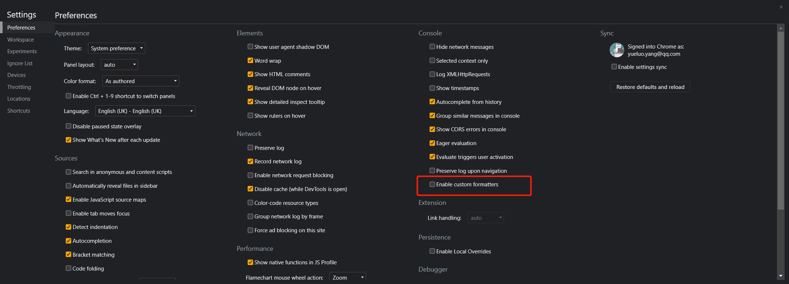

#### 控制代码体积

框架的大小也是衡量框架的标准之一。
实现同样功能的前提下，编写的代码越少越好，这样体积就会越小，浏览器加载资源的时间也越少。

vue.js 源码，每一个 warn 函数的调用都会配置 `_DEV_` 常量的检查：

```js
if (__DEV__ && !res) {
  warn(
    'Failed to moune app: mount target selector "${ container }" returned null.'
  )
}
```

 vue.js 使用 rollup.js 对项目进行构建，这里的 `_DEV_`  是通过 rollup.js 的插件配置来预定义的，功能类似于 webpack 中的 DefinePlugin 插件。生产环境中，这段代码不会出现在最终产物中，在构建资源的时候就会被移除。

这样我们就可以做到开发环境中为用户提供友好的警告信息的同时，不会增加生产环境代码的体积。

#### 良好的 Tree-Shaking

vue.js 内置了很多组件，我们的项目并没有使用这么多组件，还有前面提到的变量的打印，生产环境不需要这些代码出现。

Tree-Shaking 就是消除那些永远都不会执行的代码，也就是排除 dead code，无论是 rollup.js 和 webpack，都支持 Tree-Shaking。

要想实现 Tree-Shaking，必须满足一个条件，模块必须要 ESM（ES Module），Tree-Shaking 依赖 ESM 的静态结果。

以 rollup.js 为例

```js
|- demo
|  - package.json
|  - input.js
|  - utils.js
```

```js
yarn add rollup -D
```

```js
// input.js
import { foo } from './utils.js';

foo();
```

```js
// utils.js
export function foo (obj) {
  obj && obj.foo;
}
export function bar (obj) {
  obj && obj.bar;
}
```

上述代码我们在 utils.js 中导出了两个函数，在 input.js 中我们只是用到 foo 函数。

```js
npx rollup input.js -f esm -o dist/bundle.js // rollup 构建
```

```js
// dist/bundle.js

function foo (obj) {
  obj && obj.foo;
}

foo();
```

编译后代码不包括 bar 函数，Tree-Shaking 起到了作用。但是还存在问题，我们只是读取了 foo 函数，并没有调用，为什么 rollup.js 为什么不把 `obj && obj.foo` 作为 dead code 移除？

这其实是 Tree-Shaking 的另一个关键点 - 副作用。

副作用就是当调用函数时会对外部产生影响。你可能会说，上面代码只是读取值，怎么会产生副作用？其实有这样一种场景，如果 obj 对象是一个通过 Proxy 创建的代理对象，当我们读取对象的值，就会触发代理对象的 get trap，get trap 中可能存在副作用。

JavaScript 作为一门动态预览，想要静态分析代码很困难，所以 rollup.js 这类工具都会提供一种机制，你可以很明确地告诉 rollup.js，这段代码不会产生副作用，可以移除它。

```js
// input.js

import { foo } from './utils.js';

/*#__PURE__*/ foo();
```

如果你搜索 vue.js 3 的源码，会发现它大量使用了该注释。

```js
export const isHtmlTag = /*#__PURE__*/ makeMap(HTML_TAGS);
```

通常产生副作用的代码都是模块内函数的顶级调用。

```js
foo(); // 顶级调用

function bar () {
  foo(); // 函数内调用
}
```

对于顶级调用，可能会产生副作用；对于函数调用来说，只要函数 bar 没有被调用，那么就不会产生副作用。

在 vue.js 3 的源码中，基本都是在一些顶级调用的函数中使用 `/*__PURE__*/` 注释。该注释不仅可以作用于函数，还可以作用于任何语句。该注释也可以被 webpack 及 terser 识别。

#### 如何输出构建产物

vue.js 会为开发环境和生产环境输出不同的包。
vue.global.js 用于开发环境，它包含必要的警告信息；vue.gobal.prod.js 用于生产环境，不包含警告信息。
vue.js 构建产物不仅仅存在环境上的区分，还会根据使用场景的不同输出其他形式的产物。

不同类型的产物一定有对应的需求背景。

当用户希望可以直接在 HTML 页面中使用 `<script>` 标签引入框架并使用。
我们需要输出一种 `IIFE` 格式的资源。`IIFE`  的全称是 `Immediately Invoked Function Expression` ，即 "立即调用函数"。

```js
(function () {
  // ...
}());
```

vue.global.js 文件就是 `IIFE` 形式的资源。

```js
var Vue = (function (exports) {
  // ...
  exports.createApp = createApp;
  // ...
}({}));
```

在 rollup.js 中，我们可以配置 `format: 'iife'` 来输出这种形式的资源。

```js
// rollup.config.js

const config = {
  input: 'input.js',
  output: {
    file: 'output.js',
    format: 'iife'
  }
};

export default config;
```

目前主流浏览器基础都支持 ESM，所以用户还可以引入 ESM 格式的资源。

vue.js 3 的 vue.esm-browser.js 文件，可以使用 `<script type="module">` 标签引入。

```html
<script type="module" src="/vue.esm-browser.js"></script>
```

除了 vue.esm-browser.js 文件，vue.js 还会输出 vue.esm-bundler.js 文件。

vue.esm-bundler.js 是提供给 rollup.js 或 webpack 等打包工具使用的，通常配置在 `package.json` 中的 `module` 字段。

```js
{
  "main": "index.js",
  "module": "dist/vue.runtime.esm-bundler.js"
}
```

它们之间有何区别？

例如上文中提到的 `__DEV__`  常量，当构建用于 `<script>` ESM 资源时，开发环境 `__DEV__` 为 true，生产环境 `__DEV__` 为 false。

当打包提供给打包工具的 ESM 资源时，需要使用 `(process.env.NODE_ENV !== 'production')`  替换 `__DEV__` 常量。

```js
// browser.js

if (__DEV__) {
  warn('useCssModule() is not supported in the global build.');
}
```

```JS
// -bundler.js

if ((process.env.NODE_ENV !== 'production')) {
	warn('useCssModule() is not supported in the global build.');
}
```

用户可以通过 webpack 配置自行决定构建资源的目标环境，最终效果一致，这段代码也只会出现在开发环境中。

用户可能还希望在 Node.js 中通过 require 语句引用资源。

```js
const Vue = require('vue');
```

当进行服务端渲染时，vue.js 的代码是在 Node.js 环境中运行的。这时就需要输出 CommonJS 的资源格式，简称 cjs。

```js
// rollup.config.js

const config = {
  input: 'input.js',
  output: {
    file: 'output.js',
    format: 'cjs'
  }
};

export default config;
```

#### 特性开关

设计框架时，框架还会提供诸多特性（功能），假设我们提供 A、B、C 三个特性给用户，同时还提供 a、b、c 三个对应的特性开关。

* 对于用户关闭的特性，我们可以利用 Tree-Shaking 机制让其不包含在最终的资源中；
* 该机制为可以让框架设计更加灵活，可以通过特性开关为框架添加新的特性，不用担心资源体积变大。当框架升级时，我们也可以通过特性开关支持遗留 API，而新用户可以选择不使用遗留 API，使最终打包的资源体积最小化。

特性开关和上文提供的 `__DEV__` 常量一样，可以利用 rollup.js 的预定义常量插件来实现。

```js
{
  __FEATURE_OPTIONS_API__: isBundlerESMBuild ? '__VUE_OPTIONS_API' : true,
}
```

`__FEATURE_OPTIONS_API__` 类似于 `__DEV__`，vue.js 3 的源码中，有很多类似与如下代码的判断分支。

```js
// support for 2.x options
if (__FEATURE_OPTIONS_API__) {
  currentInstance = instance;
  pauseTracking();
  applyOptions(instance, Component);
  resetTreacking();
  currentInstance = null;
}
```

vue.js 构建资源时，如果构建服务于打包工具的资源（带有 _bundler 字样的资源），上述代码就会变成：

```js
// support for 2.x options
if (__VUE_OPTIONS_API__) {
  currentInstance = instance;
  pauseTracking();
  applyOptions(instance, Component);
  resetTreacking();
  currentInstance = null;
}
```

`__VUE_OPTIONS_API__` 就是一个特性开关，用户可以通过设置 `__VUE_OPTIONS_API__` 预定义常量的值控制是否包含这段代码。

```js
// webpack.DefinePlugin 插件配置
new webpack.DefinePlugin({
  __VUE_OPTIONS_API__: JSON.stringify(true) // 开启特性
})
```

我们可以通过配置 `__VUE_OPTIONS_API__` 特性开关决定是否可以使用选项 API 的方式编写代码。如果明确知道自己不会使用选项 API，可以关闭此特性，这样在打包的时候 vue.js 的这部分代码就不会包含在最终资源中，减小打包体积。

#### 错误处理

错误处理是框架开发过程中非常重要的环节。框架错误处理机制的好坏直接决定用户应用程序的健壮性，决定用户开发体验的好坏。

```js
// utils.js
export default {
  foo (fn) {
    fn && fn();
  }
}
```

该模块导出一个对象。如果用户在使用 foo 函数 过程中传入的毁掉函数执行出错，要怎么办？

第一个办法是用户自行处理，需要用户执行 try...catch。

```js
import utils from 'utils.js';

utils.foo(() => {
  try {
    // ...
  } catch (e) {
    // ...
  }
});
```

但是这会增加用户负担。如果 utils.js 提供了很多函数，用户都需要逐一添加错误处理程序。

第二个办法是我们代替用户统一处理错误。

```js
// utils.js
export default {
  foo (fn) {
    try {
      fn && fn();
    } catch (error) { }
  },
  bar (fn) {
    try {
      barfn && bar();
    } catch (error) { }
  }
}
```

每个函数都增加 try...catch，我们还可以优化下。

```js
export default {
  foo (fn) {
    callWithErrorHandling(fn);
  },
  bar (fn) {
    callWithErrorHandling(fn);
  }
}

function callWithErrorHandling (fn) {[
  try {
    fn && fn();
  } catch (error) {
    console.log(error);
  }
]}
```

代码变的简洁很多。但简洁不是目的，这样做的好处是我们可以为用户提供统一的错误处理接口。

```js
let handleError = null;

export default {
  foo (fn) {
    callWithErrorHandling(fn);
  },
  bar (fn) {
    callWithErrorHandling(fn);
  },
  // 用户注册错误处理函数
  registerErrorHandler (fn) {
    handleError = fn;
  }
}

function callWithErrorHandling (fn) {[
  try {
    fn && fn();
  } catch (error) {
    // 抛出错误
    handleError && handleError(error);
  }
]}
```

我们提供 registerErrorHandler 函数，用户可以使用它注册错误处理程序。这时错误处理的能力交由用户控制，即可以选择忽略错误，也可以调用上报程序将错误上报给监控系统。

其实这就是 vue.js 错误处理的原理，你可以在源码中搜索到 callWithErrorHandling 函数。
另外，在 vue.js 中，我们也可以注册统一的错误处理函数。

```js
import App from 'App.vue';

const app = createApp(App);

app.config.errorHandler = () => {
  // 错误处理程序
}
```

#### typescript 支持

ts，它是 js 的超集，能够为 js 提供类型支持。使用 ts 的好处有很多，如编译器自动提示、一定程度避免低级 bug、代码的可维护强。因此对 ts 的支持是否完善也是评价一个框架的重要指标。

如何衡量一个框架对 ts 类型的支持水平？并不是只要是使用 ts 编写框架，就等价于对 ts 类型支持友好。

```js
function foo (val: any) {
  return val;
}
```

这个函数很简单，接收参数 val 并返回该参数，返回值的类型是由参数决定的。上述代码显然不能满足我们的要求，正确的做法如下。

```js
function foo<T extends any>(val: T) {
  return val;
}
```

编写大型框架时，想要做到完善的 ts 类型支持很不容易，vue.js 源码中的 `runtime-core/src/apiDefineComponent.ts`文件，整个文件真正会在浏览器中中运行的代码其实只有 3 行，但是全部代码接近 200 行，这些代码都是在为类型支持服务。

#### 总结

框架设计中开发体验时衡量一个框架的重要指标之一。提供友好的警告信息又处于开发者快速定位维提，大多数情况下 "框架" 要比开发者更清楚问题出在哪里，因此在框架层面抛出有意义的警告信息是非常有必要的。

为了框架体积不受警告信息的影响（提供警告信息越详细，框架体积越大），我们需要利用 Tree-Shaking 机制，配置构建工具预定义变量的能力，从而实现仅在开发环境中打印警告信息，生产环境中则不包含这些用于提升开发体验的代码，实现线上代码的可控性。

框架不同类型的输出产物用于满足不同需求。我们需要结合实际使用情况，可以针对性输出构建产物。

框架会提供多种能力。有时会出于兼容性和灵活性考虑，对于同样的任务，框架会提供多种解决方案。vue.js 中就可以使用选项对象式 API 和组合式 API两种方法完成页面开发。从框架设计来看，这完全是基于兼容性考虑的。如果用户只想使用组合式 API，这时就可以通过特性开关关闭对应的特性。

框架的错误处理决定了用户应用程序的健壮性，也决定了用户开发应用时处理错误的负担。框架需要为用户提供统一的错误处理接口，用户可以通过注册自定义的错误处理函数来处理全部的框架异常。

框架对于 ts 的支持程序也是考量框架的重要指标。
有时候为了让框架提供更加友好的类型支持，甚至会花费比实现框架更多的时间和精力。

### vue.js 3 的设计思路

从全局视角了解 vue.js 3 的设计思路、工作机制及其重要的组成部分。

#### 声明式 UI

vue.js 是一个声明式的 UI 框架，用户在使用 vue.js 3 开发页面时是声明式地描述  UI 的。

* 使用与 html 标签一致的方式描述 DOM 元素，例如描述一个 div 标签时可以使用 `<div></div>` ；
* 使用与 html 标签一致的方式来描述属性，例如 `<div :id="app"></div>` ；
* 使用 `:` 或 `v-bind` 描述动态绑定的属性，例如 `<div :id="dynamicId"></div>` ；
* 使用 `@` 或 `v-on` 描述事件，例如点击事件 `<div @click="handler"></div>` ；
* 使用与 html 标签一致的方式来描述层级结果，例如一个具有 `span` 子结点的 `div` 标签 `<div><span></span></div>` 。

除了使用模板来声明式地描述 UI 之外，还可以使用 JavaScript 对象来描述。

```js
const title = {
  tag: 'h1',
  props: {
    onClick: handler
  },
  children: [
    { tag: 'span' }
  ]
}
```

对应到 vue.js 模板

```html
<h1 @click="handler">
  <span></span>
</h1>
```

两种方式对比，使用 JavaScript 对象描述 UI 更加灵活。比如我们要表示一个标题，根据标题级别不同，采用 `h1~h6` 这几个标签。

```js
const level = 3;
const title = {
  tag: `h${ level }`
}
```

```vue
<h1  v-if="level == 1"></h1>
<h2  v-else-if="level == 2"></h2>
<h3  v-else-if="level == 3"></h3>
<h4  v-else-if="level == 4"></h4>
<h5  v-else-if="level == 5"></h5>
<h6  v-else-if="level == 6"></h6>
```

使用 JavaScript 对象描述 UI 的方式，其实就是所谓的虚拟 DOM。

vue.js 3 除了支持使用模板描述 UI 外，还支持使用虚拟 DOM 描述 UI。

```vue
import { h } from 'vue';

export default {
	render() {
		return h('h1', { onCllick: handler })
	}
}
```

h 函数的返回值就是一个对象，它的作用是让我们编写虚拟 DOM 更加轻松。h 函数就是一个辅助创建虚拟 DOM 的工具函数。

#### 渲染器

虚拟 DOM 就是用 JavaScript 对象描述真实 DOM 结构，然后再通过渲染器将虚拟 DOM 渲染到页面。

渲染器的作用就是把虚拟 DOM 渲染为真实 DOM。假设我们有以下虚拟 DOM。

```js
const vnode = {
  tag: 'div',
	props: {
    onClick: () => alert('hello')
  },
  children: 'click me'
};
```

我们可以实现一个渲染器，将上面这段虚拟 DOM 渲染为真实 DOM。

```js
const vnode = {
  tag: 'div',
	props: {
    onClick: () => alert('hello')
  },
  children: 'click me'
};

function renderer (vnode, container) {
  const el = document.createElement(vnode.tag);

  for (const key in vnode.props) {
    if (/^on/.test(key)) {
      el.addEventListener(
        key.substr(2).toLowerCase(),
        vnode.props[key]
      )
    }
  }

  if (typeof vnode.children === 'string') {
    el.appendChild(document.createTextNode(vnode.children));
  } else if (Array.isArray(vnode.children)) {
    vnode.children.forEach(child => renderer(child, el));
  }

  container.appendChild(el);
}

renderer(vnode, document.body);
```

简单说下渲染器的实现思路：

* 创建元素：以 `vnode.tag` 作为标签名称来创建 DOM 元素；
* 为元素添加属性和事件；
* 处理 children；

我们现在处理的仅仅是创建节点，渲染器的精髓都在更新节点的阶段，

```js
const vnode = {
  tag: 'div',
	props: {
    onClick: () => alert('hello')
  },
  children: 'click again' // click me 改成 click again
};
```

对于渲染器来说，需要精确找到 `vnode` 对象的变更点并且只更新变更的内容。

#### 组件的本质

虚拟 DOM 除了可以描述真实 DOM 之外，还可以描述组件。组件本质上就是一组 DOM 元素的封装，这组 DOM 元素就是组件要渲染的内容，因此我们可以定义一个函数代表组件，函数的返回值就代表组件要渲染的内容。

```js
const MyComponent = function () {
  return {
    tag: 'div',
    props: {
      onClick: () => alert('hello')
    },
    children: 'click me'
  }
};
```

组件的返回值也是虚拟 DOM，它代表组件要渲染的内容。我们可以让虚拟 DOM 对象中的 tag 属性来存储组件函数。

```js
const vnode = {
  tag: MyComponent
};
```

`tag: myComponent` 用户描述组件。为了能够渲染组件，我们还需要修改 renderer 函数。

```js
function renderer (vnode, container) {
  if (typeof vnode.children === 'string') {
    mountElement(vnode, container);
  } else if (typeof vnode.tag === 'function') {
    mountComponent(vnode, container);
  }
}

function mountElement (vnode, container) {
  const el = document.createElement(vnode.tag);

  for (const key in vnode.props) {
    if (/^on/.test(key)) {
      el.addEventListener(
        key.substr(2).toLowerCase(),
        vnode.props[key]
      )
    }
  }

  if (typeof vnode.children === 'string') {
    el.appendChild(document.createTextNode(vnode.children));
  } else if (Array.isArray(vnode.children)) {
    vnode.children.forEach(child => renderer(child, el));
  }

  container.appendChild(el);
}

function mountComponent (vnode, container) {
  const subtree = vnode.tag(); 
  renderer(subtree, container);
}

renderer(vnode, document.body);
```

组件一定是函数吗？我们完全可以使用 JavaScript 对象来表达组件。

```js
const MyComponent = {
  render () {
    return {
      tag: 'div',
      props: {
        onClick: () => alert('hello')
      },
      children: 'click me'
    }
  }
}
```

为此，我们还需要修改 renderer 方法和 mountComponent 方法。

```js
function renderer (vnode, container) {
  if (typeof vnode.children === 'string') {
    mountElement(vnode, container);
  } else if (typeof vnode.tag === 'object') {
    mountComponent(vnode, container);
  }
}

function mountComponent (vnode, container) {
  const subtree = vnode.tag.render(); 
  renderer(subtree, container);
}
```

vue.js 的有状态组件就是使用对象结构来表达的。

#### 模板工作原理

无论是手写虚拟 DOM（渲染函数）还是使用模板，都属于声明式地描述 UI，vue.js 同时支持这两种描述 UI 的方式。

我们已经知道虚拟 DOM 如何渲染成真实 DOM，那模板是如何工作的，这就要提高 vue.js 另一个重要组成部分，编译器。

编译器的作用就是将模板编译为渲染函数。

```vue
<div @click="handler">
  click me
</div>
```

```js
render () {
  return h('div', { onClick: handler }, 'click me')
}
```

对于编译器来说，模板就是一个普通的字符串它会分析该字符串并生成一个功能与之相同的渲染函数。

以 `.vue` 文件为例，一个 `.vue` 文件就是一个组件。

```vue
<template>
	<div @click="handler">
    click me
  </div>
</template>

<script>
export default {
  data() {},
  methods: {
    handler: () => {}
  }
}
</script>
```

template 标签里的内容就是模板内容，编译器会把模板内容编译成渲染函数并添加到 `<script>` 标签块的组件对象上。

```vue
<script>
export default {
  data() {},
  methods: {
    handler: () => {}
  },
  render () {
    return h('div', { onClick: handler }, 'click me')
  }
}
</script>
```

无论是使用模板还是直接手写渲染函数，对于一个组件来说，它要渲染内容最终都是通过渲染函数产生的，渲染器再把渲染函数返回的虚拟 DOM 渲染为真实 DOM，这就是模板的工作原理，也是 vue.js 渲染页面的流程。

#### 模块组成的有机整体

组件的实现依赖于渲染器，模板的编译依赖于编译器，编译后生成的代码是根据渲染器和虚拟 DOM 的设计决定的。

vue.js 各个模块之间是互相关联、互相制约的，共同构成一个有机整体。

下面以编译器和渲染器这两个模块为例，看一下它们是如何配合工作，实现性能提升的。

```vue
<div id="foo" :class-"cls"></div>
```

首先，编译器会把这段代码编译成渲染函数

```js
render() {
	// return h('div', { id: 'foo', class: cls })
	return {
		tag: 'div',
    props: {
      id: 'foo',
      class: cls
    }
	}
}
```

cls 是一个变量，它可能会发生变化。

渲染器的作用之一就是寻找并且只更新变化的内容，当变量 cls 发生变化时，渲染器会自行寻找变更点。vue.js 的模板是有特点的，`id="foo"` 是永远不会变化的，而 `:class="cls"`  是一个 v-bind 绑定，它是可能发生变化的。编译器能识别出哪些是静态属性，哪些是动态属性，生成代码的时候可以附带这些信息。

```js
render() {
	return {
		tag: 'div',
    props: {
      id: 'foo',
      class: cls
    },
    patchPlags: 1 // 假设数字 1 代表 class 是动态的
	}
}
```

假设数字 1 代表 “class 是动态的”，渲染器看到这个标志就知道 class 属性会发生改变。对于渲染器来说，相当于省去寻找变更点的工作量，这样就会提升性能。

编译器和渲染器之间互相配合可能让性能进一步提升，它们借助于虚拟 DOM 对象进行配合，虚拟 DOM 对象中会包含多种数据字段，每个字段都代表一定的含义。

#### 总结

vue.js 是一个声明式的框架，它直接描述结果，用户不需要关注过程。vue.js 采用模板的方式来描述 UI，它同样支持使用虚拟 DOM 来描述 UI。虚拟 DOM 要比模板更加灵活，模板要比虚拟 DOM 更加直观。

渲染器的作用就是把虚拟 DOM 对象渲染为真实 DOM 元素。它递归地遍历虚拟 DOM 对象，调用原生 DOM API 来完成真实 DOM 的创建。渲染器的精髓在于后续更新，它会通过 diff 算法找出变更点，并且只会更新需要更新的内容。

组件其实就是一组虚拟 DOM 元素的集合，它可以是一个返回虚拟 DOM 的函数，也可以是一个对象。

vue.js 的模板会编译器编译为渲染函数。编译器和渲染器都是 vue.js 的核心组成部分，它们共同构成一个有机整体，不同模板之间互相配合，可以进一步提升框架性能。

## 二、响应系统

### 响应系统的作用与实现

响应系统是 vue.js 的重要组成部分。

#### 响应式数据与副作用函数

副作用函数指的是会产生副作用的函数。

```js
function effect () {
  document.body.innerText = 'hello vuew';
}
```

当函数执行时，会设置 body 的文本内容，除了 effect 函数之外的任何函数都可以读取或设计 body 的文本内容。

effect 函数的执行会直接或间接影响其他函数的执行，effect 函数产生了副作用。

一个函数修改全局变量，也是一个副作用。

```js
let val = 1;

function effect () {
  val = 2;
}
```

下面再来说一下响应式数据。

```js
const obj = { text: 'hello world' };

function effect () {
  document.body.innerText = obj.text;
}
```

副作用函数 effect 会设置 body 元素的 innerText 属性，当 obj.text 的值发生变化时，我们希望副作用函数 effect 会重新执行。

```js
obj.text = 'hello vue3';
```

目前 obj 是一个普通对象，当我们修改它的值时，除了值本身发生变化之外，不会有任何其他反应。

#### 响应式数据的基本实现

如何让 obj 变成响应式数据？

* 当副作用函数 effect 执行时，会触发字段 obj.text 的读取操作；
* 当修改 obj.text，会触发字段 obj.text 设置操作。

我们可以拦截一个对象的读取和设置操作，当读取字段 obj.text 时，我们可以把副作用函数 effect 存储到  “桶” 里。当设置 obj.text 时，再把副作用函数 effect 从 “桶” 中取出并执行。

如何拦截一个对象属性的读取和设置操作？

ES2015 之前，只能通过 Object.defineProperty 函数实现，这也是 vue.js 2 采用的方式。
ES2015+ 中，我们可以使用代理对象 Proxy 来实现，这是 vue.js 3 所采用的方式。

```js
const bucket = new Set();

const data = { text: 'hello world' };

const obj = new Proxy(data, {
  get (target, key) {
    bucket.add(effect);
    return target[key];
  },
  set (target, key, newVal) {
    target[key] = newVal;
    bucket.forEach(fn => fn());
    return true;
  }
});


function effect () {
  document.body.innerText = obj.text;
}

effect();

setTimeout(() => {
  obj.text = 'hello vue3';
}, 1000);

```

目前这种实现还存在很多缺陷，例如我们直接通过名字（effect）来获取副作用函数，这种硬编码的方式很不灵活。
副作用函数的名字可以任意取，我们可以把副作用函数命令为 myEffect，甚至是一个匿名函数，我们要想办法去掉这种硬编码机制。

#### 设计一个完善的响应系统

一个响应系统的工作流程如下：

* 读取操作发生时，将副作用函数收集到 “桶” 中；
* 设置操作发生时，从 “桶” 中取出副作用函数并执行。

基于之前的案例，我们希望无论副作用什么是什么形式，都能够被正确地收集到 "桶" 中。我们需要提供一个用来注册副作用的函数。

```js
let activeEffect;

function effect (fn) {
  activeEffect = fn;
  fn();
}
```

我们定义一个全局变量 activeEffect，它的作用是存储被注册的副作用函数。重新定义了 effect 函数，作用是用来注册副作用函数的函数，effect 接收一个参数 fn，即要注册的副作用函数。

```js
effect(() => {
  document.body.innerText = obj.text;
});
```

我们使用一个匿名的副作用函数作为 effect 函数的参数。
当 effect 函数执行时，首先会把匿名的副作用函数 fn 赋值给全局变量 activeEffect。接着执行被注册的匿名副作用函数 fn，这将会触发响应式数据 obj.text 的读取操作，进行触发代理对象 Proxy 的 get 拦截操作。

```js
const obj = new Proxy(data, {
  get (target, key) {
    if (activeEffect) {
      bucket.add(activeEffect);
    }
    return target[key];
  },
  set (target, key, newVal) {
    target[key] = newVal;
    bucket.forEach(fn => fn());
    return true;
  }
});
```

副作用函数已经存储到 activeEffect 中，在 get 拦截函数内需要把 activeEffect 收集到 “桶” 中。响应系统也不再依赖副作用函数的名字。

```js
let activeEffect;

function effect (fn) {
  activeEffect = fn;
  fn();
}

const bucket = new Set();

const data = { text: 'hello world' };

const obj = new Proxy(data, {
  get (target, key) {
    if (activeEffect) {
      bucket.add(activeEffect);
    }
    return target[key];
  },
  set (target, key, newVal) {
    target[key] = newVal;
    bucket.forEach(fn => fn());
    return true;
  }
});

effect(() => {
  document.body.innerText = obj.text;
});

setTimeout(() => {
  obj.text = 'hello vue3';
}, 1000);
```

当我们在响应式数据 obj 上设置一个不存在的属性时：

```js
effect(() => {
  console.log('effect run');
  document.body.innerText = obj.text;
});

setTimeout(() => {
  obj.notExist = 'hello vue3';
}, 1000);

// effect run
// effect run
```

执行上述代码，effect 函数会被打印两次。
理想情况，effect 只会被执行一次，匿名副作用函数只会与字段 obj.text 之间建立关系，不应该和 obj.notExist 建立响应关系。
定时器内语句的执行不应该触发匿名副作用函数重新执行，但是定时器到时候，匿名副作用函数确重新执行了。

为了解决这个问题，我们需要重新设计 “桶” 的数据结构。

之前我们使用一个 Set 数据结构作为存在副作用函数的 “桶”。导致该问题的根本原因是，我们没有在副作用函数与被操作的目标字段之间建立明确的联系。例如当读取属性时，无论读取哪个属性，都会收集副作用函数到 “桶” 中；同样，无论设置哪个属性，也都会执行 “桶” 中的副作用函数。副作用函数与被炒作的字段之间没有明确的联系。解决方案其实也很简单，只需要在副作用函数与被操作的字段之间建立联系即可，我们不能简单地使用一个 Set 类型的数据作为 “桶”。

```js
effect(function effectFn() {
  document.body.innerText = obj.text;
});
```

上面代码中存在三个角色：

* 被操作（读取）的代理对象 obj；
* 被操作（读取）的字段名 text；
* 使用 effect 函数注册的副作用函数 effectFn。

如果用 `target` 来表示一个代理对象所代理的原理对象，用 `key` 来表示被操作的字段名，用 `effectFn` 来表示被注册的副作用函数，

```js
target
	- key
		- effectFn
```

这是一种树形结构，我们可以通过例子对其进行补充说明。

如果有两个副作用函数同时读取同一个对象的属性值：

```js
effect(function effectFn1() {
  obj.text;
});
effect(function effectFn2() {
  obj.text;
});
```

```js
target
	- text
		-	effectFn1
   	- effectFn2
```

如果一个副作用函数读取了同一个对象的两个不同的属性

```js
effect(function effectFn() {
  obj.text1;
  obj.text2;
});
```

```js
target
	-	text1
		- effectFn
	- test2
		- effectFn
```

如果在不同的副作用函数中读取了两个不同对象的不同属性

```js
effect(function effectFn1() {
  obj1.text1;
});
effect(function effectFn1() {
  obj2.text2;
});
```

```js
target1
	- text1
			- effectFn1
target2
	-	text2
			- effectFn2
```

上面形成的关系其实就是一个树型数据结构。这个联系建立起来之后，就可以解决前文提到的问题。

```js
let activeEffect;

function effect (fn) {
  activeEffect = fn;
  fn();
}

const data = { text: 'hello world' };

const bucket = new WeakMap();

const obj = new Proxy(data, {
  get (target, key) {
    if (!activeEffect) return;

    // 使用 target 在 bucket 中获取 depsMap，key -> effects
    let depsMap = bucket.get(target);

    // 如果不存在 depsMap，新建 map 与 target 关联
    if (!depsMap) {
      bucket.set(target, (depsMap = new Map()));
    }

    // 使用 key 在 depsMap 中获取 deps，deps 是一个 set 类型
    let deps = depsMap.get(key);

    // 如果 deps 不存在，新建 set 与 key 关联
    if (!deps) {
      depsMap.set(key, (deps = new Set()));
    }

    // 将激活的副作用函数添加到 deps 中
    deps.add(activeEffect);

    return target[key];
  },
  set (target, key, newVal) {
    target[key] = newVal;

    // 使用 target 从 bucket 中获取 depsMap，key -> effects
    const depsMap = bucket.get(target);

    if (!depsMap) return;

    // 根据 key 从 depsMap 中获取 effects
    const effects = depsMap.get(key);

    effects && effects.forEach(fn => fn());
  }
});


effect(() => {
  console.log('effect run');
  document.body.innerText = obj.text;
});

setTimeout(() => {
  obj.notExist = 'hello vue3';
}, 1000);
```

从这段代码我们就可以看出构建数据结构的方式，我们分别使用了 WeakMap、Map、Set。

* WeakMap 由 target => map 构成；
* Map 由 key => Set 构成。


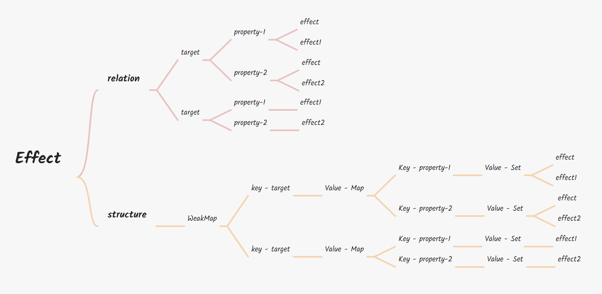


我们把图中的 Set 数据结构所存储的副作用函数集合称为 key 的依赖集合。

这里解释一下为什么要使用 WeakMap。

```js
const map = new Map();
const weakmap = new WeakMap();

(function () {
  const foo = { foo: 1 };
  const bar = { bar: 2 };
  
  map.set(foo, 1);
  weakmap.set(bar, 2);
})();
```

定义了一个立即执行函数（IIFE），在函数表达式内部定义了两个对象：foo 和 bar，这两个对象分别最为 map 和 weakmap 的 key。

当该函数执行完毕后，对于对象 foo 来说，它仍然作为 map 的 key 被引用着，因此垃圾回收器（garbage collector）不会把它从内存中移除，我们仍然可以通过 map.keys 打印出对象 foo。对于对象 bar 来说，由于 WeakMap 的 key 是弱引用，它不影响垃圾回收期的工作，所以一旦表达式执行完毕，垃圾回收期就会把对象 bar 从内存中移除，并且我们无法获取 weakmap 的 key 值，也无法通过 weakmap 取得对象 bar。

WeakMap 对 key 是弱引用，不影响垃圾回收器的工作。一旦 key 被垃圾回收器回收，那么对应的键和值就访问不到了。所以 WeakMap 经常用于存储哪些只有当 key 所引用的对象存在是（没有被回收）才有价值的信息。例如上面的场景中，如果 target 对象没有任何引用，说明用户不在需要它，这时垃圾回收器会完成回收任务。但是如果使用 Map 来替代 WeakMap，即使用户对 target 没用引用，target 也不会被回收，最终可能会导致内存溢出。

最后，我们对以上代码做一下封装处理。我们可以把 get 拦截函数里依赖收集的路基封装到 track 函数中。同理，我们也可以把触发副作用的函数封装到 trigger 函数中。

```js
let activeEffect;

function effect (fn) {
  activeEffect = fn;
  fn();
}

const bucket = new WeakMap();

function track (target, key) {
  if (!activeEffect) return;

  // 使用 target 在 bucket 中获取 depsMap，key -> effects
  let depsMap = bucket.get(target);

  // 如果不存在 depsMap，新建 map 与 target 关联
  if (!depsMap) {
    bucket.set(target, (depsMap = new Map()));
  }

  // 使用 key 在 depsMap 中获取 deps，deps 是一个 set 类型
  let deps = depsMap.get(key);

  // 如果 deps 不存在，新建 set 与 key 关联
  if (!deps) {
    depsMap.set(key, (deps = new Set()));
  }

  // 将激活的副作用函数添加到 deps 中
  deps.add(activeEffect);
}

function trigger (target, key) {
 // 使用 target 从 bucket 中获取 depsMap，key -> effects
 const depsMap = bucket.get(target);

 if (!depsMap) return;

 // 根据 key 从 depsMap 中获取 effects
 const effects = depsMap.get(key);

 effects && effects.forEach(fn => fn());
}

const data = { text: 'hello world' };

const obj = new Proxy(data, {
  get (target, key) {
    track(target, key);
    return target[key];
  },
  set (target, key, newVal) {
    target[key] = newVal;
    trigger(target, key);
  }
});


effect(() => {
  console.log('effect run');
  document.body.innerText = obj.text;
});

setTimeout(() => {
  obj.notExist = 'hello vue3';
}, 1000);
```

#### 分支切换与 cleanup

首先，我们需要明确分支切换的定义

```js
const data = { ok: true, text: 'hello world' };
const obj = new Proxy(data, {});

effect(function effectFn () {
	document.body.innerText = obj.ok ? obj.text : 'not';
});
```

effect 函数内部存在一个三元表达式，根据 `obj.ok` 的值不同会执行不同的代码分支。
当字段 `obj.ok` 的值发生变化时，代码执行的分支会跟着变化，这就是所谓的分支切换。

分支切换可能会产生遗留的副作用函数。

```js
data
	-	ok
		- effectFn
	- text
		-	effectFn
```

副作用函数 `effectFn` 分别被字段 `data.ok` 和字段 `data.text` 所依赖集合收集。当字段 `obj.ok` 的值修改为 false，并触发副作用函数重新执行后，字段 `obj.text` 不会被读取，只会触发字段 `obj.ok` 的读取操作，理想情况下副作用函数 `effectFn` 不应该被字段 `obj.text` 所对应的依赖集合收集。

```js
data
	-	ok
		- effectFn
	- text
```

我们之前的实现还做不到这一点，当字段修改为 false，并触发副作用函数重新执行之后，会产生遗留的副作用函数。

遗留的副作用函数会导致不必要的更新。

解决这个问题的思路很简单，每次副作用函数执行时，我们可以先把它所有与之关联的依赖删除。当副作用函数执行完毕后，会重新建立联系，但在新的联系中不会包含遗留的副作用函数。

要将一个副作用函数从所有与之关联的依赖集合中移除，就需要明确知道哪些依赖集合中包含他，因此我们需要重新设计副作用函数。

```js
let activeEffect;

function effect (fn) {
  // effectFn 执行时，将其设置为当前激活的副作用函数
  const effectFn = () => {
    activeEffect = effectFn;
    fn();
  }

  // activeEffect.deps 用来存储所有与该副作用函数相关联的依赖集合
  effectFn.deps = [];

  // 执行副作用函数
  effectFn();
}

const bucket = new WeakMap();

function track (target, key) {
  if (!activeEffect) return;

  // 使用 target 在 bucket 中获取 depsMap，key -> effects
  let depsMap = bucket.get(target);

  // 如果不存在 depsMap，新建 map 与 target 关联
  if (!depsMap) {
    bucket.set(target, (depsMap = new Map()));
  }

  // 使用 key 在 depsMap 中获取 deps，deps 是一个 set 类型
  let deps = depsMap.get(key);

  // 如果 deps 不存在，新建 set 与 key 关联
  if (!deps) {
    depsMap.set(key, (deps = new Set()));
  }

  // 将激活的副作用函数添加到 deps 中
  deps.add(activeEffect);

  // 将依赖添加到 activeEffect.deps 数组中
  activeEffect.deps.push(deps);
}
```

在 track 函数中我们将当前执行的副作用函数 activeEffect 添加到依赖收集 deps 中，deps 是一个与当前副作用函数存在联系的依赖集合，于是我们也把它添加到 `activeEffect.deps` 数组中，这样就完成对依赖集合的收集。


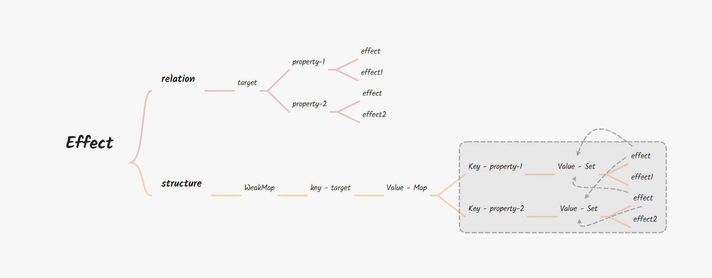


有了联系后，我们可以在副作用函数执行时，根据 `effect.deps` 获取所有相关的依赖集合，将副作用函数从依赖集合中删除。

```js
let activeEffect;

function effect (fn) {
  // effectFn 执行时，将其设置为当前激活的副作用函数
  const effectFn = () => {
    cleanup(effectFn); // 依赖清理
    activeEffect = effectFn;
    fn();
  }

  // activeEffect.deps 用来存储所有与该副作用函数相关联的依赖集合
  effectFn.deps = [];

  // 执行副作用函数
  effectFn();
}

function cleanup (effectFn) {
  for (let i = 0; i < effectFn.deps.length; i++) {
    // deps 是依赖集合
    const deps = effectFn.deps[i];
    // 将 effectFn 从依赖集合中移除
    deps.delete(effectFn);
  }
  // 重置 effectFn.deps 数组
  effectFn.deps.length = 0;
}
```

cleanup 函数接收副作用函数作为参数，遍历副作用函数的 `effectFn.deps` 数组，该数组的每一项都是一个依赖集合，然后将该副作用函数从依赖集合中移除，最后重置 `effectFn.deps` 数组。

至此，我们的响应系统已经可以避免副作用函数产生遗留。但是目前的实现会导致死循环。问题出在 trigger 函数中。

```js
function trigger (target, key) {
 // 使用 target 从 bucket 中获取 depsMap，key -> effects
 const depsMap = bucket.get(target);

 if (!depsMap) return;

 // 根据 key 从 depsMap 中获取 effects
 const effects = depsMap.get(key);

 effects && effects.forEach(fn => fn()); // ?
}
```

trigger 内部，遍历 effects 集合，它是 set 集合，里面存储副作用函数。当副作用函数执行时，会调用 cleanup 进行清除，但是副作用函数的执行会导致其重新被收集到集合中，此时对 effects 集合的遍历仍在进行。

我们可以重新构造一个集合并遍历它。

```js
function trigger (target, key) {
 // 使用 target 从 bucket 中获取 depsMap，key -> effects
 const depsMap = bucket.get(target);

 if (!depsMap) return;

 // 根据 key 从 depsMap 中获取 effects
 const effects = depsMap.get(key);

 //  effects && effects.forEach(fn => fn()); 避免与 cleanup 产生死循环
 const effectsToRun = new Set(effects);
 effectsToRun.forEach(effectFn => effectFn());
}
```

#### 嵌套的 effect 与 effect 栈

effect 是可以发生嵌套的。

```js
effect(function effectFn1 () {
  effect(function effectFn2 () { });
}};
```

上述代码，`effetFn1` 内部嵌套了 `effectFn2`，`effectFn1` 的执行会导致 `effectFn2` 的执行。

vue.js 的渲染函数就是在一个 effect 中执行的，如果组件发生嵌套，这时就发生了 effect 嵌套。

```js
const Bar = {
  render() {}
}

const Foo = {
  render() { return <Bar /> }
}
```

```js
effect(() => {
  Foo.render();
  effect(() => {
    Bar.render();
  })
})
```

如果 effect 不支持嵌套会发生什么？我们实现的响应系统并不支持 effect 嵌套，我们可以测试一下。

```js
const data = { foo: true, bar: true };
const obj = new Proxy(data, {
  get (target, key) {
    track(target, key);
    return target[key];
  },
  set (target, key, newVal) {
    target[key] = newVal;
    trigger(target, key);
  }
});

let temp1, temp2;

effect(function effectFn1() {
  console.log('effectFn1 process');
  
  effect(function effectFn2() {
    console.log('effectFn2 process');
    temp2 = obj.bar;
  });
  
  temp1 = obj.foo;
});
```

理想情况下，我们希望副作用函数与对象属性之间的关系如下：

```js
data
	- foo
		- effectFn1
	- bar
		- effectFn2
```

我们希望当修改 `data.foo` 时会触发 `effectFn1` 执行。
由于 `effectFn2` 嵌套在 `effectFn1` 里，所以会间接触发 `effectFn2` 执行。当修改 `obj.bar` 时，只会触发 `effectFn2` 执行。

```js
obj.foo = false;

// effectFn1 process
// effectFn2 process
// effectFn2 process
```

我们修改 `obj.foo` 的值，会发现第三行打印不符合我们预期，`effectFn1` 并没有重新执行，反而 `effectFn2` 重新执行。

问题出在我们实现 effect 函数与 activeEffect 上。

```js
let activeEffect;

function effect (fn) {
  // effectFn 执行时，将其设置为当前激活的副作用函数
  const effectFn = () => {
    // 依赖清理
    cleanup(effectFn);
    // 当调用 effect 注册副作用函数时，将副作用函数复制给 activeEffect
    activeEffect = effectFn;
    fn();
  }

  // activeEffect.deps 用来存储所有与该副作用函数相关联的依赖集合
  effectFn.deps = [];

  // 执行副作用函数
  effectFn();
}
```

我们使用全局变量 activeEffect 来存储通过 effect 函数注册的副作用函数，同一时间 activeEffect 所存储的副作用函数只能有一个。当副作用函数发生嵌套时，内层副作用函数执行会覆盖 activeEffect 的值，并且永远不会恢复到原来的值。这时如果再有响应式数据进行依赖收集，即使这个响应式数据是在外层副作用函数中读取的，它们收集到的副作用函数也都是内层副作用函数。

我们可以使用副作用函数栈 `effectStack`，在副作用函数执行时，将当前副作用函数压入栈中，副作用函数执行完毕后将其从栈中弹出，始终让 activeEffect 指向栈顶的副作用函数。

```js
let activeEffect;

const effectStack = [];

function effect (fn) {
  // effectFn 执行时，将其设置为当前激活的副作用函数
  const effectFn = () => {
    // 依赖清理
    cleanup(effectFn);
    // 当调用 effect 注册副作用函数时，将副作用函数复制给 activeEffect
    activeEffect = effectFn;
    // 将当前副作用函数压入栈中
    effectStack.push(effectFn);
    // 执行函数
    fn();
    // 将当前副作用函数弹出栈，并还原 activeEffect
    effectStack.pop();
    activeEffect = effectStack[effectStack.length - 1];
  }

  // activeEffect.deps 用来存储所有与该副作用函数相关联的依赖集合
  effectFn.deps = [];

  // 执行副作用函数
  effectFn();
}
```

通过定义 `effectStack` 数组，用它模拟栈， 使 activeEffect 始终指向正在执行的副作用函数，响应式数据只会收集直接读取其值的副作用函数作为依赖，从而避免产生错误。

#### 避免无限递归循环

实现一个完善的响应系统要考虑很多细节。

```js
const data = { foo: 1 };
const obj = new Proxy(data, {
  get (target, key) {
    track(target, key);
    return target[key];
  },
  set (target, key, newVal) {
    target[key] = newVal;
    trigger(target, key);
  }
});

effect(() => {
  obj.foo++;
});
```

如果在 effect 注册的副作用函数内存在一个自增操作，该操作会引起栈溢出。

```e
obj.foo => obj.foo + 1
```

在这个语句中，既会读取 `obj.foo` 的值，也会设置 `obj.foo` 的值，这就是导致问题出现的根本原因。

代码执行流程如下：

首先读取 `obj.foo` 的值，会触发 track 操作，将副作用函数收集到 “桶” 中，接着将其加 1 后再赋值给 `obj.foo`，此时会触发 trigger 操作，即把 “桶” 中副作用函数取出并执行。但是该副作用函数正在执行中，还没有执行完毕，就要开始下一次的执行。这样会导致无限递归地调用自己，于是就产生了栈溢出。

```js
function trigger (target, key) {
 // 使用 target 从 bucket 中获取 depsMap，key -> effects
 const depsMap = bucket.get(target);

 if (!depsMap) return;

 // 根据 key 从 depsMap 中获取 effects
 const effects = depsMap.get(key);

 //  effects && effects.forEach(fn => fn()); 避免与 cleanup 产生死循环
 const effectsToRun = new Set(effects);
 effectsToRun.forEach(effectFn => effectFn());
}
```

解决方法并不难，由于读取和设置操作是在同一个副作用函数执行的。无论是 track 收集的副作用函数，还是 trigger 出发执行的副作用函数，都是 activeEffect。我们可以在 trigger 动作发生时增加守卫条件：如果 trigger 触发执行的副作用函数与当前正在执行的副作用函数相同，则不触发执行。

```js
function trigger (target, key) {
 // 使用 target 从 bucket 中获取 depsMap，key -> effects
 const depsMap = bucket.get(target);

 if (!depsMap) return;

 // 根据 key 从 depsMap 中获取 effects
 const effects = depsMap.get(key);

 const effectsToRun = new Set();
  
 effects && effects.forEach(effectFn => {
   // 触发执行的副作用函数与当前正在执行的副作用函数相同，则不触发执行
   if (effectFn !== activeEffect) {
     effectsToRun.add(effectFn);
   }
 })
 
 //  effects && effects.forEach(fn => fn()); 避免与 cleanup 产生死循环
 effectsToRun.forEach(effectFn => effectFn());
}
```

#### 调度执行

可调度性是响应系统非常重要的特性。所谓可调度性，指的是当 trigger 动作触发副作用重新执行时，有能力决定副作用函数执行的时机、次数以及方式。

先来看一下如何决定副作用函数的执行方式。

```js
const data = { foo: 1 };
const obj = new Proxy(data, {
  get (target, key) {
    track(target, key);
    return target[key];
  },
  set (target, key, newVal) {
    target[key] = newVal;
    trigger(target, key);
  }
});

effect(() => {
  console.log(obj.foo);
});

obj.foo++;

console.log('end');
```

上面这段代码的输出结果如下：

```js
// 1
// 2
// end
```

如果我们需要调整输出顺序为：

```js
// 1
// end
// 2
```

这时我们很容易想到对策，把语句 `obj.foo++` 和 `console.log('end')` 位置互换即可。那么是否还有其他方法在不调整代码的情况下实现需求？这时就需要响应系统支持调度。

我们可以为 effect 函数设计一个选项参数 options，允许用户指定调度器：

```js
effect(() => {
  console.log(obj.foo)
}, {
  scheduler (fn) {
    // ...
  }
})
```

用户在调用 effect 函数注册副作用函数时，可以传递第二个参数 options。它是一个对象，允许指定 scheduler 调度函数，同时在 effect 函数内部我们需要把 options 选项挂载到对应的副作用函数上。

```js
function effect (fn, options = {}) {
  // effectFn 执行时，将其设置为当前激活的副作用函数
  const effectFn = () => {
    // 依赖清理
    cleanup(effectFn);
    // 当调用 effect 注册副作用函数时，将副作用函数复制给 activeEffect
    activeEffect = effectFn;
    // 将当前副作用函数压入栈中
    effectStack.push(effectFn);
    // 执行函数
    fn();
    // 将当前副作用函数弹出栈，并还原 activeEffect
    effectStack.pop();
    activeEffect = effectStack[effectStack.length - 1];
  }

  // 挂载 options
  effectFn.options = options;
  // activeEffect.deps 用来存储所有与该副作用函数相关联的依赖集合
  effectFn.deps = [];

  // 执行副作用函数
  effectFn();
}
```

有了调度函数，我们在 trigger 函数中触发副作用函数重新执行时，就可以直接调用用户传递的调度器函数，从而把控制权交给用户。

```js
function trigger (target, key) {
 // 使用 target 从 bucket 中获取 depsMap，key -> effects
 const depsMap = bucket.get(target);

 if (!depsMap) return;

 // 根据 key 从 depsMap 中获取 effects
 const effects = depsMap.get(key);

 const effectsToRun = new Set();
  
 effects && effects.forEach(effectFn => {
   // 触发执行的副作用函数与当前正在执行的副作用函数相同，则不触发执行
   if (effectFn !== activeEffect) {
     effectsToRun.add(effectFn);
   }
 })
 
 //  effects && effects.forEach(fn => fn()); 避免与 cleanup 产生死循环
 effectsToRun.forEach(effectFn => {
   // 如果存在调度器，则调用该调度器，并将副作用函数作为参数传递
   if (effectFn.options.scheduler) {
      effectFn.options.scheduler(effectFn);
   } else {
    effectFn();
   }
 });
}
```

现在我们就可以实现前文的需求了。

```js
const data = { foo: 1 };
const obj = new Proxy(data, {
  get (target, key) {
    track(target, key);
    return target[key];
  },
  set (target, key, newVal) {
    target[key] = newVal;
    trigger(target, key);
  }
});

effect(() => {
  console.log(obj.foo);
}, {
  scheduler (fn) {
    setTimeout(fn);
  }
});

obj.foo++;

console.log('end');
```

我们使用 `setTimeout` 开启一个宏任务来执行副作用函数 fn，这样就可以实现期望的打印顺序。

除了控制副作用函数的执行顺序，通过调度器我们还可以控制它的执行次数。

```js
const data = { foo: 1 };
const obj = new Proxy(data, {
  get (target, key) {
    track(target, key);
    return target[key];
  },
  set (target, key, newVal) {
    target[key] = newVal;
    trigger(target, key);
  }
});

effect(() => {
  console.log(obj.foo);
});

obj.foo++;
obj.foo++;
```

这段代码的打印结果如下：

```js
// 1
// 2
// 3
```

如果我们只关心结果而不关心过程，我们期望的打印结果是：

```js
// 1
// 3
```

基于调度器，我们可以很容易地实现此功能。

```js
/** task queue start */
const jobQueue = new Set();
const p = Promise.resolve();

let isFlushing = false;

function flushJob () {
  if (isFlushing) return;

  isFlushing = true;

  p.then(() => {
    jobQueue.forEach(job => job());
  }).finally(() => {
    isFlushing = false;
  });
}
/** task queue end */

const data = { foo: 1 };
const obj = new Proxy(data, {
  get (target, key) {
    track(target, key);
    return target[key];
  },
  set (target, key, newVal) {
    target[key] = newVal;
    trigger(target, key);
  }
});

effect(() => {
  console.log(obj.foo);
}, {
  scheduler (fn) {
    jobQueue.add(fn);
    flushJob();
  }
});

obj.foo++;
obj.foo++;
```

这个功能类似于 vue.js 连续多次修改响应式数据但只会触发一次更新，vue.js 内部实现了一个更加完善的调度器。

#### 计算属性 computed 与 lazy

之前介绍了 effect 函数，它用来注册副作用函数，它允许指定一些选项参数 options。例如指定 scheduler 调度器来控制副作用函数的执行时机和方式。还介绍了用来追踪和收集依赖的 track 函数，以及用来触发副作用函数重新执行的 trigger 函数。实际上，综合这些内容，我们就可以实现 vue.js 中一个非常重要并且非常有特色的能力 - 计算属性。

```js
effect(() => {
  console.log(obj.foo);
});
```

我们实现的 effect 函数会立即执行传递给它的副作用函数。但有些场景下，我们并不希望它立即执行，而是希望它在需要的时候才执行，例如计算属性。我们通过在 options 中添加 lazy 属性来达到目的。

```js
effect(() => {
  console.log(obj.foo);
}, {
  lazy: true
});
```

lazy 选项和 scheduler 一样，可以通过 options 选项对象指定。当 `options.lazy` 为 true 时，不立即执行副作用函数。

```js
function effect (fn, options = {}) {
  // effectFn 执行时，将其设置为当前激活的副作用函数
  const effectFn = () => {
    // 依赖清理
    cleanup(effectFn);
    // 当调用 effect 注册副作用函数时，将副作用函数复制给 activeEffect
    activeEffect = effectFn;
    // 将当前副作用函数压入栈中
    effectStack.push(effectFn);
    // 执行函数
    fn();
    // 将当前副作用函数弹出栈，并还原 activeEffect
    effectStack.pop();
    activeEffect = effectStack[effectStack.length - 1];
  }

  // 挂载 options
  effectFn.options = options;
  // activeEffect.deps 用来存储所有与该副作用函数相关联的依赖集合
  effectFn.deps = [];

  // 非 lazy 属性才执行
  if (!options.lazy) {
    effectFn();
  }
	
  // 返回 effectFn
  return effectFn;
}
```

通过这个判断，副作用函数不会立即执行。我们将副作用函数 effectFn 作为 effect 函数的返回值，我们可以手动执行该副作用函数。

```js
const effectFn = effect(() => {
  console.log(obj.foo);
}, {
  lazy: true
});

obj.foo++;

effectFn();
```

如果仅能够手动执行副作用函数，意义并不大。如果我们把传递给 effect 函数看做一个 getter，那么这个 getter 函数可以返回任何值。

```js
const effectFn = effect(
  () => obj.foo + obj.bar, {
  lazy: true
});
```

手动执行副作用函数时，就可以拿到其返回值。

```js
const value = effectFn();
```

我们还需要对 effect 函数做一些修改。

```js
function effect (fn, options = {}) {
  // effectFn 执行时，将其设置为当前激活的副作用函数
  const effectFn = () => {
 		// ...
    // 执行函数
    const ans = fn();
    // 将当前副作用函数弹出栈，并还原 activeEffect
    effectStack.pop();
    activeEffect = effectStack[effectStack.length - 1];
    // 返回结果
    return ans;
  }

 	// ...

  // 非 lazy 属性才执行
  if (!options.lazy) {
    effectFn();
  }

  // 返回 effectFn
  return effectFn;
}
```

现在我们就可以实现懒执行的副作用函数，并且可以拿到副作用函数的执行结果，接下就可以实现计算属性。

```js
function computed (getter) {
  const effectFn = effect(getter, { lazy: true });

  const obj = {
    get value () {
      return effectFn();
    }
  }

  return obj;
}
```

我们定义一个 computed 函数，它接收一个 getter 函数作为参数，我们把 getter 函数作为副作用函数，用它创建一个 lazy 的 effect。computed 函数的执行会返回一个对象，该对象的 value 属性是一个访问器属性，只有读取 value 的值时，才会执行 effectFn 并将其结果作为返回值返回。

```js
const data = { foo: 1, bar: 2 };

const obj = new Proxy(data, {
  get (target, key) {
    track(target, key);
    return target[key];
  },
  set (target, key, newVal) {
    target[key] = newVal;
    trigger(target, key);
  }
});

const ans = computed(() => obj.foo + obj.bar);

console.log(ans.value);
```

可以看到 computed 函数可以正确工作。不过我们实现的计算属性只做到了懒计算，只有当你读取 `ans.value` 的值，它才会计算并得到值。但是并没有做到对值进行缓存，如果我们访问 `ans.value` 的值，会导致 effectFn 多次计算，即使 `obj.foo` 和 `obj.bar` 的值本身没有变化。

我们在实现 computed 函数时，可以添加对值进行缓存的功能。

```js
function computed (getter) {
  // 缓存上一次的值
  let value;
  // 标识是否需要重新计算值，true 意味要重新计算
  let dirty = true;

  const effectFn = effect(
    getter,
    {
      lazy: true,
      // 添加调度器，调度器中重置 dirty
      scheduler () {
        dirty = true;
      }
    }
  );

  const obj = {
    get value () {
      if (dirty) {
        value = effectFn();
        dirty = false;
      }
      return value;
    }
  }

  return obj;
}
```

新增两个变量 value 和 dirty，value 用来缓存值，dirty 用于标识是否需要重新计算，只会 dirty 为 true 的时候才会调用 effectFn 重新取值。同时增加 scheduler 调度器函数，它会在 getter 函数中所依赖的响应式数据变化时执行，将 dirty 设置为 true。

```js
const data = { foo: 1, bar: 2 };

const obj = new Proxy(data, {
  get (target, key) {
    track(target, key);
    return target[key];
  },
  set (target, key, newVal) {
    target[key] = newVal;
    trigger(target, key);
  }
});

const ans = computed(() => obj.foo + obj.bar);

console.log(ans.value);

obj.bar++;

console.log(ans.value);
```

现在我们设计的计算属性已经趋于完美，但它还存在一个缺陷，体现在当我们在另外一个 effect 中读取计算属性值时。

```js
const ans = computed(() => obj.foo + obj.bar);

effect(() => {
  console.log(ans.value);
});

obj.bar++;
```

ans 是一个计算属性，我们在 effect 函数中读取了 `ans.value` 的值。如果此时修改 `obj.bar` 的值，我们期望副作用函数重新执行，但是上述代码并不会触发副作用函数的渲染，这是一个缺陷。

从本质上来看，这是一个典型的 effect 嵌套。一个计算属性内部拥有自己的 effect，并且它是懒执行的，只有当真正地读取计算属性的值时才会执行。对于计算属性的 getter 函数来说，它里面访问的响应式数据只会把 computed 内部的 effect 收集为依赖。当把计算属性用于另外一个 effect 时，就会发生 effect 嵌套，外层的 effect 不会被内层 effect 中的响应式数据收集。

解决方法很简单，当读取计算属性的值时，我们可以手动调用 track 函数进行追踪；当计算属性依赖的响应式数据发生变化时，我们可以手动调用 trigger 函数触发响应。

```js
function computed (getter) {
  // 缓存上一次的值
  let value;
  // 标识是否需要重新计算值，true 意味要重新计算
  let dirty = true;

  const effectFn = effect(
    getter,
    {
      lazy: true,
      // 添加调度器，调度器中重置 dirty
      scheduler () {
        dirty = true;
        // 计算属性依赖的响应式数据发生变化时，手动调用 trigger 函数触发响应
        trigger(obj, 'value');
      }
    }
  );

  const obj = {
    get value () {
      if (dirty) {
        value = effectFn();
        dirty = false;
      }
      // 读取 value 时，手动调用 track 函数进行追踪
      track(obj, 'value');
      return value;
    }
  }

  return obj;
}
```

如上代码所示，当读取一个计算属性的 value 值时，我们可以手动调用 track 函数，把计算属性返回的对象 obj 作为 target，同时作为第一个参数传递给 track 函数。当计算属性所依赖的响应式数据发生变化时，会执行调度器函数，在调度器函数内部手动调用 trigger 函数触发响应即可。

```js
effect(() => {
  console.log(ans.value);
});
```

它会建立这样的联系。

```js
compute(obj)
	- value
		- effectFn
```

#### watch 的实现原理

watch 本质就是观测一个响应式数据，当数据发生变化时通知并执行相应的回调函数。

```js
watch(obj, () => {
  console.log('data change');
});

obj.foo++;
```

watch 的实现本质是就是利用了 effect 以及 `options.scheduler` 选项。下面是最简单的 watch 实现。

```js
function watch (soure, cb) {
  effect(
  	() => source.foo,
    {
      scheduler () {
        cb()
      }
    }
  )
}
```

```js
const data = { foo: 1, bar: 2 };

const obj = new Proxy(data, {
  get (target, key) {
    track(target, key);
    return target[key];
  },
  set (target, key, newVal) {
    target[key] = newVal;
    trigger(target, key);
  }
});

watch(obj, () => {
  console.log('data change');
});

obj.foo++;
obj.bar++;
```

上面这段代码可以正常工作，但是在实现 watch 函数，硬编码了对 `source.foo` 的读取操作。我们需要封装一个通用的读取操作。

```js
function traverse (value, seen = new Set()) {
  if (typeof value !== 'object' || value === null || seen.has(value)) return;

  seen.add(value);

  // 假设 value 是一个对象，不考虑数组等其他结构
  for (const k in value) {
    traverse(value[k], seen);
  }

  return value;
}

function watch (source, cb) {
  effect(
  	() => traverse(source),
    {
      scheduler () {
        cb()
      }
    }
  )
}
```

在 watch 内部的 effect 中调用 traverse 函数进行递归读取操作，这样就能读取一个对象上的任意属性，从而当任意属性发生变化时都能触发回调函数执行。

watch 函数除了可以观测响应式数据，还可以接收一个 getter 函数。

```js
watch(
  () => obj.foo,
  () => {
    console.log('data change');
  }
);
```

传递给 watch 函数的第一个参数不再是一个响应属性，而是一个 getter 函数。getter 函数内部，用户可以指定 watch 依赖哪些响应式数据，只有当这些数据变化时，才会触发回调函数执行。

```js
function traverse (value, seen = new Set()) {
  if (typeof value !== 'object' || value === null || seen.has(value)) return;

  seen.add(value);

  // 假设 value 是一个对象，不考虑数组等其他结构
  for (const k in value) {
    traverse(value[k], seen);
  }

  return value;
}

function watch (source, cb) {
  let getter;

  if (typeof source === 'function') {
    getter = source;
  } else {
    getter = () => traverse(source);
  }

  effect(
  	() => getter(),
    {
      scheduler () {
        cb()
      }
    }
  )
}
```

我们可以判断 source 类型，如果用户传递函数，直接使用用户的 getter 函数；如果用户没有传递函数，自定义一个函数调用 traverse 方法。这样就实现了自定义 getter 的功能。

目前 watch 还缺少一个重要的能力，就是在回调函数中拿不到旧值和新值。

```js
watch(
  () => obj.foo,
  (newVal, oldVal) => {
    console.log('data change', newVal, oldVal);
  }
);

obj.foo++;
```

我们可以利用 effect 函数的 lazy 现象，获取新值与旧值。

```js
function traverse (value, seen = new Set()) {
  if (typeof value !== 'object' || value === null || seen.has(value)) return;

  seen.add(value);

  // 假设 value 是一个对象，不考虑数组等其他结构
  for (const k in value) {
    traverse(value[k], seen);
  }

  return value;
}

function watch (source, cb) {
  let getter;

  if (typeof source === 'function') {
    getter = source;
  } else {
    getter = () => traverse(source);
  }

  let oldValue, newValue;

  const effectFn = effect(
  	() => getter(),
    {
      lazy: true,
      scheduler () {
        newValue = effectFn();
        cb(newValue, oldValue);
        oldValue = newValue;
      }
    }
  );

  oldValue = effectFn();
}
```

我们手动调用 effectFn 函数得到的返回值就是旧值，即第一次执行得到得知。当变化发生并处罚 scheduler 调度函数执行时，会重新调用 effectFn 函数并得到新值，这样我们就可以拿到旧值与新值，接着把它们作为参数传递给回调函数就可以了。

#### 立即执行的 watch 与回调执行时机

watch 的本质其实是对 effect 的二次封装。关于 watch 还有两个特性：一个是立即执行的回调函数，另一个时回调函数的执行时机。

首先来看下立即执行的回调函数。默认情况下，一个 watch 的回调只会在响应式数据发生变化时才执行。

```js
watch(obj, () => {
  console.log('data change');
});
```

vue.js 中可以通过选项参数 immediate 指定回调是否需要立即执行。

```js
watch(obj, () => {
  console.log('data change');
}, {
  immediate: true
});
```

当 immediate 选项存在并且为 true 时，回调函数会在该 watch 创建时立即执行一次。

回调函数的立即执行与后续执行本质是没有任何差别，我们可以把 scheduler 调度函数封装为一个函数，分别在初始化和变更时执行它。

```js
function traverse (value, seen = new Set()) {
  if (typeof value !== 'object' || value === null || seen.has(value)) return;

  seen.add(value);

  // 假设 value 是一个对象，不考虑数组等其他结构
  for (const k in value) {
    traverse(value[k], seen);
  }

  return value;
}

function watch (source, cb, options = {}) {
  let getter;

  if (typeof source === 'function') {
    getter = source;
  } else {
    getter = () => traverse(source);
  }

  let oldValue, newValue;

  // 提取 scheduler 调度函数为一个独立的 job 函数
  const job = () => {
    newValue = effectFn();
    cb(newValue, oldValue);
    oldValue = newValue;
  }

  const effectFn = effect(
  	() => getter(),
    {
      lazy: true,
      scheduler: job
    }
  );

  if (options.immediate) {
    job();
  } else {
    oldValue = effectFn();
  }
}
```

```js
const data = { foo: 1, bar: 2 };

const obj = new Proxy(data, {
  get (target, key) {
    track(target, key);
    return target[key];
  },
  set (target, key, newVal) {
    target[key] = newVal;
    trigger(target, key);
  }
});

watch(
  () => obj.foo,
  (newVal, oldVal) => {
    console.log('data change', newVal, oldVal);
  },
  {
    immediate: true
  }
);

obj.foo++;
obj.foo++;
```

这样就实现了回调函数的立即执行功能。除了指定回调函数为立即执行之外，还可以通过其他选项参数来指定回调函数的执行时机，例如 vue.js 3 中使用 flush 选项。

```js
watch(
  obj,
  () => {
    console.log('data change');
  },
  {
    // 回调函数会在 watch 创建时立即执行一次
    flush: 'pre'
  }
);
```

flush 选项可以指定为 `pre`，`post` 或者 `sync`。flush 本质是在指定调度函数的执行时机。

当 flush 的值为 `post` 时，代表调度函数需要将副作用函数放到一个微任务队列中，并等待 DOM 更新结束后执行。

我们可以用以下代码模拟 `post` 的效果。

```js
function traverse (value, seen = new Set()) {
  if (typeof value !== 'object' || value === null || seen.has(value)) return;

  seen.add(value);

  // 假设 value 是一个对象，不考虑数组等其他结构
  for (const k in value) {
    traverse(value[k], seen);
  }

  return value;
}

function watch (source, cb, options = {}) {
  let getter;

	// ...
  
  const effectFn = effect(
  	() => getter(),
    {
      lazy: true,
      scheduler: () => {
        if (options.flush === 'post') {
          const p = Promise.resolve();
          p.then(job);
        } else {
          job();
        }
      }
    }
  );
	
  // ...
}
```

我们修改了调度器函数 scheduler 的实现方式，当 `options.flush` 的值为 `post` 时，将 job 函数放到微任务队列中，从而实现异步延迟执行。否则执行执行 job 函数，这本质是相当于 `sync` 的实现机制，及同步执行。对于 `pre` 的情况，我们暂时没有办法模拟，这涉及组件的更新时机，其中 `pre` 和 `post` 原本的语义指的就是组件更新前和更新后。

#### 过期的副作用

竞态问题通常在多进程或多线程编程中被提及，我们在编程中也会遇见这种问题。

```js
let finalData;

watch(obj, async () => {
  const res = await fetch('/path/request');
  finalData = res;
})
```

我们使用 watch 观测 obj 对象的变化，当 obj 对象发生变化都会发送网络请求，等数据请求成功之后，将结果赋值给 `finalData` 变量。

这段代码会发生竞态问题，当 obj 对象发生多次修改，发起多个网络请求，你无法确定哪一个请求会先返回。

假设我们有两个请求，第一次修改 obj，发出请求 A，第二次修改 obj，发出请求 B。我们认为请求 B 返回的数据才是最新的，而请求 A 则应该被视为过期的。我们希望 `finalData` 存储的值应该请求 B 返回的结果。

我们需要一个让副作用过期的手段。为了让问题更加清晰，我们可以用 watch 函数复现场景。

在 vue.js 中，watch 函数的回调函数接收第三个参数 `onInvalidate`，它是一个函数，类似于事件监听器，我们可以使用 `onInvalidate` 函数注册一个回调，这个回调会在当前副作用函数过期时执行。

```js
let finalData;

watch(obj, async (newVal, oldVal, onInvalidate) => {
  let expired = false;

  onInvalidate(() => {
    expired = true;
  });

  const res = await fetch('https://service.yueluo.club/');
  const data = await res.json();

  if (!expired) {
    console.log(data); // 只打印一次结果
    finalData = data;
  }
})

obj.foo++;
obj.foo++;
```

在 watch 内部每次检查到变更后，有副作用函数重新执行之前，会先调用我们通过 `onInvalidate` 函数注册的过期回调。

```js
function traverse (value, seen = new Set()) {
  if (typeof value !== 'object' || value === null || seen.has(value)) return;

  seen.add(value);

  // 假设 value 是一个对象，不考虑数组等其他结构
  for (const k in value) {
    traverse(value[k], seen);
  }

  return value;
}

function watch (source, cb, options = {}) {
  let getter;

  if (typeof source === 'function') {
    getter = source;
  } else {
    getter = () => traverse(source);
  }

  let oldValue, newValue;

  // cleanup 存储用户注册的过期回调
  let cleanup;

  function onInvalidate (fn) {
    cleanup = fn;
  }

  // 提取 scheduler 调度函数为一个独立的 job 函数
  const job = () => {
    newValue = effectFn();
    // 调用回调函数前，先调用过期回调
    if (cleanup) {
      cleanup();
    }
    // 返回第三个参数
    cb(newValue, oldValue, onInvalidate);
    oldValue = newValue;
  }

  const effectFn = effect(
  	() => getter(),
    {
      lazy: true,
      scheduler: () => {
        if (options.flush === 'post') {
          const p = Promise.resolve();

          p.then(job);
        } else {
          job();
        }
      }
    }
  );

  if (options.immediate) {
    job();
  } else {
    oldValue = effectFn();
  }
}
```

#### 总结

一个响应式数据最基本的实现依赖于对 “读取” 和 ”设置“ 操作的拦截，从而在副作用函数与响应式数据之间建立关系。当 ”读取“ 操作发生时，我们将当前执行的副作用函数存储到 ”桶中“；当 ”设置“ 操作发生时，再将副作用函数从 ”桶“ 里去除并执行。这就是响应系统的实现原理。

我们实现了一个相对完善的响应系统。使用 WeakMap 配合 Map 构建新的 ”桶“ 结构，从而能够在响应式数据与副作用函数建立更加精确的联系。我们还介绍了 WeakMap 与 Map 这两个数据结构之间的区别。WeakMap 是弱引用的，它不影响垃圾回收器的工作。当用户代码对一个对象没有用引用关系时，WeakMap 不会阻止垃圾回收器回收该对象。

我们还讨论了分支切换导致的冗余副作用问题，这个问题会导致副作用函数进行不必要的更新。为了解决这个问题，我们需要在每次副作用函数重新执行之前，清除上一次建立的响应联系，当副作用函数重新执行后，会再次建立新的响应联系，新的响应联系不存在冗余副作用。在此过程中，我们遇到了遍历 set 数据结构导致无限循环的新问题，该问题产生的原因可以从 ECMA 规范中得知，即 ”调用 forEach 遍历 Set 集合时，如果一个值已经被访问过，但这个值被删除并重新添加到集合，如果此时 forEach 遍历没有结束，那么这个值会被重新访问“。解决访问是建立一个新的 Set 集合用来遍历。

然后，我们讨论了关于嵌套的副作用函数的问题。它发生在组件嵌套的场景中，及父子组件关系。这时为了避免在响应式数据与副作用函数之间建立的响应关系发生错乱，我们需要使用使用副作用函数栈来存储不同的副作用函数。当一个副作用函数执行完毕后，将其从栈中弹出。当读取响应式数据时，被读取的响应式数据只会与当前栈顶的副作用函数建立联系，从而解决问题。我们还遇到副作用函数死循环，导致栈溢出的问题。该问题的根本原因在于，对响应式数据的读取和设置操作发生在同一个副作用函数内。解决方法很简单，如果 trigger 触发执行的副作用函数与当前正在执行的副作用函数相同，则不触发执行。

随后，我们讨论了响应系统的可调度性。可调度指的是当 trigger 动作触发副作用函数重新执行后，有能力决定副作用函数的时机、次数以及方式。为了实现调度能力，我们为 effect 函数增加了第二个选项参数，可以通过 scheduler 选项指定调用器，这样用户可以通过调度器自行完成任务的调度。我们还讲解了如果通过调度器实现任务去重，即通过一个微任务队列对任务进行缓存，从而实现去重。

我们讲解了计算属性，即 computed。计算属性实际上是一个懒执行的副作用函数，我们通过 lazy 选项使得副作用函数可以懒执行。被标记为懒执行的副作用函数可以通过手动方式让其执行。利用这个特点，我们设计了计算属性，当读取计算属性的值时，只需要手动执行副作用函数即可。当计算属性依赖的响应式数据发生变化时，会通过 scheduler 将 dirty 标记设置为 true。这样下次读取计算属性的值时，我们会重新计算真正的值。

我们还讨论了 watch 的实现原理。它本质上利用了副作用函数重新执行时的可调度性。一个 watch 本身会创建一个 effect，当这个 effect 依赖的响应式数据发生变化时，会执行该 effect 的调度器函数，即 scheduler 可以理解为 “回调”，所以我们只需要在 scheduler 中执行用户通过 watch 函数注册的回调函数即可。此外，我们还讲解了立即执行回调的 watch，通过添加新的 immediate 选项来实现，还讨论了如何控制回调函数的执行时机，通过 flush 选项来指定回调函数具体的执行时机，本质是利用了调用器和异步的微任务队列。

最后，我们讨论了过期的副作用函数，它会导致竞态问题。为了解决这个问题，vue.js 为 watch 的回调函数设计了第三个参数，及 `onInvalidate` 。它是一个函数，用来注册过期回调。每当 watch 的回调函数执行之前，会优先执行用户通过 `onInvalidate` 注册的过期回调。这样，用户就有机会在过期回调中将上一次的副作用标记为 “过期”，从而解决竞态问题。

### 非原始值的响应式方案

#### 理解 Proxy 和 Reflect

vue.js 3 的响应式数据是基于 Proxy 实现的，因此我们也有必要了解 Proxy 以及与之关联的 Reflect。

使用 Proxy 创建一个对象，可以实现对其他对象的代理。Proxy 只能代理对象，无法代理非对象值，例如字符串、布尔值等。

所以代理，指的是对一个对象基本语义的代理。它允许我们拦截并重新定义对一个对象的基本操作。

类似读取、设置属性值的操作，就属于基本语义的操作，即基本操作。

```js
let obj = { foo: 1 };

obj.foo; // 读取属性 foo 的值
obj.foo++; // 读取和设置属性 foo 的值
```

既然是基本操作，就可以使用 Proxy 拦截。

```js
const p = new Proxy(obj, {
  get () {},
  set () {}
})
```

Proxy 构造函数接收两个参数。第一个参数是被代理的对象，第二个参数也是一个对象，这个对象是一组夹子（trap）。其中 get 函数用来拦截读取操作，set 函数用来拦截设置操作。

在 JavaScript 世界里，万物皆对象。例如一个函数也是一个对象，所以调用函数也是对一个对象的基本操作。因此，我们可以用 Proxy 拦截函数的调用操作，这里我们使用 apply 拦截函数的调用。

```js
const fn = name => { console.log('我是: ', name); }

const p2 = new Proxy(fn, {
  apply (target, thisArg, argArray) {
    target.call(thisArg, ...argArray);
  }
});

p2('heora'); // 我是:  heora
```

Proxy 只能够拦截对一个对象的基本操作。调用对象下的方法属于非基本操作，我们叫它复合操作。

```js
obj.fn();
```

调用一个对象下的方法， 是由两个基本语义组成的。第一个基本语义是 get，即先通过 get 操作得到 `obj.fn` 属性。第二个语义是函数调用，即通过 get 得到 `obj.fn` 的值后在调用它，也就是我们上面说到的 apply。理解 Proxy 只能代理对象的基本语义很重要。当我们实现对数组或 Map、Set 等数据类型的代理时，都利用了 Proxy 的这个特点。

了解了 Proxy，我们再来讨论 Reflect。Reflect 是一个全局对象，它有很多方法。

```js
Reflect.get();
Reflect.set();
Reflect.apply();
// ...
```

Reflect 下的方法与 Proxy 拦截器方法名字相同，任何在 Proxy 的拦截器中找到的方法， 都可以在 Reflect 中找到同名函数，那么这些函数的作用是什么？以 `Reflect.get` 函数来说，它的功能就是提供访问一个对象属性的默认行为。

```js
const obj = { foo: 1 };

console.log(obj.foo); // 直接读取
console.log(Reflect.get(obj, 'foo')); // 通过 Reflect.get 读取
```

`Refelct.*` 方法与响应式数据的实现密切相关。

```js
const data = { foo: 1 };

const obj = new Proxy(data, {
  get (target, key) {
    track(target, key);
    return target[key];
  },
  set (target, key, newVal) {
    target[key] = newVal;
    trigger(target, key);
  }
});
```

这是我们实现响应式数据最基本的代码。在 get 和 set 拦截函数中直接使用原始对象 target 来完成对属性的读取和设置操作。

这段代码其实还有问题。

```js
const data = {
  foo: 1,
  get bar () {
    return this.foo
  }
};

// ...

effect(() => {
  console.log(obj.bar);
});

obj.foo++;
```

bar 属性是一个访问器属性，它返回了 `this.foo` 属性的值。我们在 effect 副作用函数中通过代理对象 p 访问 bar 属性。

当 effect 注册的副作用函数执行时，会读取 `obj.bar` 属性值，它发现 `obj.bar` 是一个访问器属性，因此会执行 getter 函数。由于在 getter 函数中通过 `this.foo` 读取了 foo 属性值，因此我们认为副作用函数与属性 foo 之间也会建立联系。当我们修改 `obj.foo` 时应该能够触发响应，使得副作用函数重新执行。实际并非如此，当我们修改 `obj.foo` 值时，副作用函数并不会重新执行。

问题出在 bar 属性的访问起函数 getter 里。

```js
const data = {
  foo: 1,
  get bar () {
    return this.foo
  }
};
```

在 get 拦截函数内，通过 `target[key]` 返回属性值。其中 target 是原始值 `data`，key 就是字符串 `bar`，所以 `target[key]` 相当于 `data.bar`。因此当我们使用 `obj.bar` 访问 bar 属性时，它的 getter 函数内的 this 指向的其实是原始对象 `data`，这说明最终访问的其实是 `data.foo`。在副作用函数内通过原始对象访问它的某个属性是不会建立响应联系的。

```js
effect(() => {
  data.foo; // data 是原始数据，不是代理对象，不能建立响应联系
});
```

我们可以使用 `Reflect.get` 函数解决这个问题。

```js
const data = {
  foo: 1,
  get bar () {
    return this.foo
  }
};

const obj = new Proxy(data, {
  get (target, key, receiver) {
    track(target, key);
    return Reflect.get(target, key, receiver);
  },
  set (target, key, newVal) {
    target[key] = newVal;
    trigger(target, key);
  }
});

effect(() => {
  console.log(obj.bar);
});

obj.foo++;
```

> receiver 用来处理定义在 prototype 上的 getter 。

我们在代理对象的 get 拦截函数接收第三个参数 receiver，它代表谁在读取属性。

```js
obj.bar
```

当我们使用代理对象 obj 访问 bar 属性时，那么 receiver 就是 obj，你可以简单地理解为函数调用中的 this。我们使用 `Reflect.get(target, key, receiver)` 代替之前的 `target[key]`，这里的关键点就是第三个参数。它会使访问器属性中 bar 的 getter 函数内的 this 指向代理对象 obj。

```js
const data = {
  foo: 1,
  get bar () {
    // this 为 obj 对象
    return this.foo
  }
};
```

this 由原始对象 data 变成代理对象 obj。这会在副作用函数与响应式数据之间建立响应联系，从而达到依赖收集的效果。如果此时再对 `obj.foo` 进行自增操作，会发现已经可以触发副作用函数重新执行了。

#### 对象及 Proxy 的工作原理

我们经常听说 “JavaScript 中一切皆对象”，那么到底什么是对象那？

根据 ECMAScript  规范，在 JavaScript 中有两种对象，一种叫做常规对象（ordinary object），另一种叫做异质对象（exotic object）。这两种对象包含了 JavaScript 世界中的所有对象，任何不属于常规对象的对象都是异质对象。

我们知道，在 JavaScript 中，函数其实也是对象。假设给出一个对象 obj，如何区分它是普通对象还是函数呢？实际上，在 JavaScript 中，对象的实际语义是由对象的内部方法（internal method）指定的。所谓内部方法，指的是当我们对一个对象进行操作时在引擎内部调用的方法，这些方法对于 JavaScript 使用者来说是不可见的。当我们访问对象属性时：

```js
obj.foo
```

引擎内部会调用 `[[Get]]` 这个内部方法来读取属性值。在 ECMAScript 规范中使用 `[[xxx]]` 来代表内部方法或内部槽。当然，一个对象不仅部署了 `[[Get]]` 这个内部方法。

##### 对象必要的内部方法

> https://tc39.es/ecma262/#sec-invariants-of-the-essential-internal-methods

| 内部方法                | 签名                                             | 描述                                                         |
| ----------------------- | ------------------------------------------------ | ------------------------------------------------------------ |
| `[[GetPrototypeOf]]`    | () => Object \| Null                             | 查明为该对象提供继承属性的对象，null 代表没有继承属性        |
| `[[SetPrototypeOf]]`    | (Object \|Null) => Boolean                       | 将该对象与提供继承属性的另一个对象相关联。传递 null 表示没有继承属性，返回 true 表示操作成功完成，返回 false 表示操作失败 |
| `[[IsExtensible]]`      | () => Boolean                                    | 查明是否允许向该对象添加其他属性                             |
| `[[PreventExtensions]]` | () => Boolean                                    | 控制能否向该对象添加新属性。如果操作成功则返回 true，操作失败则返回 false |
| `[[GetOwnProperty]]`    | (propertyKey) => Undefined \| PropertyDescriptor | 返回该对象自身属性的描述符，其键为 propertyKey，如果不存在这样的属性，则返回 undefined |
| `[[DefineOwnProperty]]` | (propertyKey, PropertyDescriptor) => Boolean     | 创建或更改自己的属性，其键为 propertyKey，以具有由 PropertyDescriptor 描述的状态。如果该属性已创建或更新，则返回 true；如果无法创建或更新该属性，则返回 false |
| `[[HasProperty]]`       | (propertyKey) => Boolean                         | 返回一个布尔值，指示该对象是否已经拥有键为 propertyKey 的自己的或继承的属性 |
| `[[Get]]`               | (propertyKey, Receiver) => any                   | 从该对象返回键为 propertyKey 的属性的至。如果必须运行 ECMAScript 代码来检索属性值，则在运行代码时使用 Receiver 作为 this 值 |
| `[[Set]]`               | (propertyKey, value, Receiver) => Boolean        | 将键值为 propertyKey 的属性的值设置为 value。如果必须运行 ECMAScript 代码来设置属性值，则在运行代码时使用 Receiver 作为 this 值。如果成功设置了属性值，则返回 true；如果无法设置，则返回 false |
| `[[Delete]]`            | (propertyKey) => Boolean                         | 从该对象删除属于自身的键为 propertyKey 的属性。如果该属性未被删除并且仍然存在，则返回 false；如果该属性已被删除或不存在，则返回 true |
| `[[OwnPropertyKeys]]`   | () => List of propertyKey                        | 返回一个 List，其元素都是对象自身的属性值                    |                                         

包括 `[[Get]]` 在内，一个对象必须部署 11 种必要的内部方法。除了上面的内部方法之外，还有两个额外的必要内部方法。

##### 额外的必要内部方法

| 内部方法        | 签名                              | 描述                                                         |
| --------------- | --------------------------------- | ------------------------------------------------------------ |
| `[[Call]]`      | (any, a list of any) => any       | 将运行的代码与 this 对象关联。由函数调用触发。该内部方法的参数是一个 this 值和参数列表 |
| `[[Construct]]` | (a list of any, Object) => Object | 创建一个对象。通过 new 运算符或 super 调用触发。该内部方法的第一个参数是一个 List，该 List 的元素是构造函数调用或 Super 调用的参数，第二个参数是最初应用 new 运算符的对象。实现该内部方法的对象称为构造函数 |

如果一个对象需要作为函数调用，那么这个对象就必须部署内部方法 `[[call]]`。我们可以通过内部方法和内部槽来区分对象，例如函数对象会部署内部方法 `[[Call]]` ，而普通对象不会。

内部方法具有多态性。不同类型的对象可能部署了相同的内部方法，但是具有不同的逻辑。例如，普通对象和 Proxy 对象都部署了 `[[Get]]` 这个内部方法，但它们的逻辑是不同的，普通对象部署的 `[[Get]]` 内部方法的逻辑是由 ECMA 规范的 10.1.8 节定义的，而 Proxy 对象部署的 `[[Get]]` 内部方法的逻辑在 ECMA 规范的 10.5.8 节定义。

https://tc39.es/ecma262/#sec-ordinary-object-internal-methods-and-internal-slots-get-p-receiver

https://tc39.es/ecma262/#sec-proxy-object-internal-methods-and-internal-slots-get-p-receiver

了解内部方法后，就可以解释什么是常规对象，什么是异质对象。

* 对于对象必要的内部方法，必须使用 ECMA 规范 `10.1.x ` 节给出的定义实现；
* 对于内部方法 `[[Call]]`，必须使用 ECMA 规范 10.2.1 节给出的定义实现；
* 对于内部方法 `[[Construct]]` ，必须使用 ECMA 规范 10.2.2 节给出的定义实现。

所有不符合这三点要求的对象都是异质对象。例如，由于 Proxy 对象的内部方法 `[[Get]]` 没有使用 ECMA 规范 10.1.8 节给出的定义实现，所以 Proxy 是一个异质对象。

Proxy 是一个对象，它本身部署了上述必要的内部方法，当我们通过代理对象访问属性值时：

```js
const p = new Proxy(obj, { /** ... */ });
p.foo
```

引擎会调用部署在在对象 p 上的内部方法 `[[Get]]` 。代理对象和普通对象没有太大区别。它们的区别在于对于内部方法 `[[Get]]` 的实现，这里就体现了内部方法的多态性，即不同的对象部署相同的内部方法，但它们的行为可能不同。具体体现在，如果在创建代理对象时没有指定对应的拦截函数，例如没有指定 `get()` 拦截函数，那么当我们通过代理对象访问属性值时，代理对象的内部方法 `[[Get]]` 会调用原始对象的内部方法 `[[Get]]` 来获取属性值，这其实就是代理透明性质。

创建代理对象时指定的拦截函数，实际上是用来自定义代理对象本身的内部方法和行为，而不是用来指定被代理对象的内部方法和行为的。下面列出了 Proxy 对象部署的所有内部方法以及用来自定义内部方法和行为的拦截函数名字。

##### Proxy 对象部署的内部方法

Proxy 对象部署的所有内部方法。

| 内部方法                | 处理器函数               |
| ----------------------- | ------------------------ |
| `[[GetPrototypeOf]]`    | getPrototyeOf            |
| `[[SetPrototypeOf]]`    | setPrototypeOf           |
| `[[IsExtensible]]`      | isExtensible             |
| `[[PreventExtensions]]` | preventExtensions        |
| `[[GetOwnProperty]]`    | getOwnPropertyDescriptor |
| `[[DefineOwnProperty]]` | defineProperty           |
| `[[HasProperty]]`       | has                      |
| `[[Get]]`               | get                      |
| `[[Set]]`               | set                      |
| `[[Delete]]`            | deleteProperty           |
| `[[OwnPropertyKeys]]`   | ownKeys                  |
| `[[Call]]`              | apply                    |
| `[[Construct]]`         | construct                |

其中 `[[Call]]` 和 `[[Construct]]` 这两个内部方法只有当被代理的对象是函数和构造函数时才会部署。

我们要拦截删除属性操作时，可以使用 deleteProperty 拦截函数实现。

```js
const data = { foo: 1 };

const obj = new Proxy(data, {
  deleteProperty (target, key) {
    return Reflect.deleteProperty(target, key);
  }
});

console.log(obj.foo);
delete obj.foo;
console.log(obj.foo);
```

deleteProperty 实现的是大力对象 obj 的内部方法和行为，所以为了删除被代理对象上的属性值，我们需要使用 `Reflect.deleteProperty(target, key)` 来完成。

#### 如何代理对象

之前我们使用 get 拦截函数去拦截对属性的读取操作。在响应系统中，“读取” 是一个很宽泛的概念，例如使用 in 操作符检查对象上是否具有给定的 key 也属于 “读取” 操作。

```js
effect(() => {[
  'foo' on obj
]});
```

这本质是也是在进行 “读取” 操作。响应系统应该拦截一切读取操作，以便当数据变化时能够正确地触发响应。

* 访问属性：`obj.foo`
* 判断对象或原型上是否存在给定的 key：`key in obj`
* 使用 `for ... in` 循环遍历对象: `for (const key in obj) {}`

接下来，我们逐步讨论如何拦截这些读取操作。对于属性的读取，例如 `obj.foo`，我们可以使用 get 拦截函数实现。

```js
const obj = { foo: 1 };

const p = new Proxy(obj, {
  get (target, key, receiver) {
    track(target, key);
    return Reflect.get(target, key, receiver);
  },
  set (target, key, newVal) {
    target[key] = newVal;
    trigger(target, key);
  },
});
```

对于 in 操作符，应该如何拦截？在 ECMA-262 规范的 13.10.1 节中，明确定义了 in 操作符的运行时逻辑。

https://tc39.es/ecma262/#sec-relational-operators-runtime-semantics-evaluation

```js
RelationalExpression : RelationalExpression in ShiftExpression
1. Let lref be the result of evaluating RelationalExpression.
2. Let lval be ? GetValue(lref).
3. Let rref be the result of evaluating ShiftExpression.
4. Let rval be ? GetValue(rref).
5. If Type(rval) is not Object, throw a TypeError exception.
6. Return ? HasProperty(rval, ? ToPropertyKey(lval)).
```

1. 让 `lref` 的值为 `RelationalExpression` 的执行结果；
2. 让 `lval` 的值为 `? GetValue(lref)` ;
3. 让 `rref` 的值为 `ShiftExpression` 的执行结果；
4. 让 `rval` 的值为 `? GetValue(rref)` ;
5. 如果 `Type(rval)` 不是对象，则抛出异常；
6. 返回 `? HasProperty(rval, ? ToPropertyKey(lval))`.

关键点在第 6 步，可以发现，in 操作符的运算结果是通过调用一个叫做 `HasProperty` 的抽象方法得到的。

`HasProperty` 抽象方法，可以在 ECMA-262 规范中的 7.3.12 找到。

https://tc39.es/ecma262/#sec-hasproperty

```js
1. Return ? O.[[HasProperty]](P).
```

 `HasProperty` 抽象方法的返回值是通过调用对象的内部方法 `[[HasProperty]]` 得到的。`[[HasProperty]]` 是对象必要的内部方法，它对应的拦截函数叫 has，因此我们可以通过 has 拦截函数实现对 in 操作符的处理。

```js
const obj = { foo: 1 };

const p = new Proxy(obj, {
  get (target, key, receiver) {
    track(target, key);
    return Reflect.get(target, key, receiver);
  },
  has (target, key) {
    track(target, key);
    return Reflect.has(target, key);
  },
  set (target, key, newVal) {
    target[key] = newVal;
    trigger(target, key);
  },
});
```

这样我们在副作用函数中通过 in 操作符操作响应式数据时，就能够建立依赖关系。

接着来看如何拦截 `for...in` 循环。我们所有能够拦截的方法有 13 种，它们是一个对象的所有基本语义方法，也就是说，任何操作其实都是由这些基本语义方法及其组合实现的，`for...in` 循环也不例外。

https://tc39.es/ecma262/#sec-runtime-semantics-forinofheadevaluation

```js
6. If iterationKind is enumerate, then
	a. If exprValue is undefined or null, then
		i. Return Completion Record { [[Type]]: break, [[Value]]: empty, [[Target]]: empty }.
	b. Let obj be ! ToObject(exprValue).
	c. Let iterator be EnumerateObjectProperties(obj).
	d. Let nextMethod be ! GetV(iterator, "next").
	e. Return the Iterator Record { [[Iterator]]: iterator, [[NextMethod]]: nextMethod, [[Done]]: false }.
```

在 ECMA 262 规范的 14.7.5.6 节中定义了 `for...in` 头部的执行规则。

6. 如果 `iterationKind` 是枚举（enumerate），则
   1. 如果 `exprValue` 是 undefined 或 null，返回 `Completion Record { [[Type]]: break, [[Value]]: empty, [[Target]]: empty }`
   2. 让 `obj` 的值为 `! ToObject(exprValue)`
   3. 让 `iterator` 的值为 `EnumerateObjectProperties(obj)`
   4. 让 `nextMethod` 的值为 `! GetV(iterator, "next")`
   5. 返回 ` Iterator Record { [[Iterator]]: iterator, [[NextMethod]]: nextMethod, [[Done]]: false }`

仔细观察这一子步骤：

```js
让 iterator 的值为 EnumerateObjectProperties(obj)
```

其中的关键点在于 `EnumerateObjectProperties(obj)` 。这里的 `EnumerateObjectProperties` 是一个抽象方法，该方法返回一个迭代器对象，规范中的 14.7.5.9 给出了满足该抽象方法的示例实现。

https://tc39.es/ecma262/#sec-enumerate-object-properties

```js
function* EnumerateObjectProperties(obj) {
  const visited = new Set();
  for (const key of Reflect.ownKeys(obj)) {
    if (typeof key === "symbol") continue;
    const desc = Reflect.getOwnPropertyDescriptor(obj, key);
    if (desc) {
      visited.add(key);
      if (desc.enumerable) yield key;
    }
  }
  const proto = Reflect.getPrototypeOf(obj);
  if (proto === null) return;
  for (const protoKey of EnumerateObjectProperties(proto)) {
    if (!visited.has(protoKey)) yield protoKey;
  }
}
```

可以看到，该方法是一个 generator 函数，接收一个参数 obj。实际上，obj 就是被 `for...in` 循环遍历的对象，其关键点在于使用 `Reflect.ownKeys(obj)` 来获取只属于对象自身拥有的键。我们可以使用 `ownKeys` 拦截函数来拦截 `Reflect.ownKeys` 操作。

```js
const obj = { foo: 1 };
const ITERATE_KEY = Symbol();

const p = new Proxy(obj, {
	// ...
  ownKeys (target) {
    track(target, ITERATE_KEY);
    return Reflect.ownKeys(target);
  }
});
```

拦截 `ownKeys` 操作即可间接拦截 `for...in` 循环。但是我们为什么要使用 `ITERATE_KEY` 作为追踪的 key？

`ownKeys` 拦截函数与 `get/set` 拦截函数不同，在 `get/set` 中，我们可以得到具体操作的 `key`，但是在 `ownKeys` 中，我们只能拿到目标对象 `target`。在读写属性值时，可以明确地知道当前正在操作哪一个属性，所以只需要在该属性与副作用函数之间建立联系即可。`ownKeys` 用来获取一个对象的所有属于自己的键值，这个操作明显不与任何具体的键进行绑定，因此我们只能构造唯一的 `key` 作为标识，即 `ITERATE_KEY`。

既然追踪的是 `ITERATE_KEY`，在触发响应的时候也应该触发它才行：

```js
trigger(target, ITERATE_KEY);
```

我们用一段代码来说明。假设副作用函数内有一段 `for...in` 循环。

```js
const obj = { foo: 1 };
const ITERATE_KEY = Symbol();

const p = new Proxy(obj, {
  get (target, key, receiver) {
    track(target, key);
    return Reflect.get(target, key, receiver);
  },
  set (target, key, newVal) {
    target[key] = newVal;
    trigger(target, key);
  },
  ownKeys (target) {
    track(target, ITERATE_KEY);
    return Reflect.ownKeys(target);
  }
});

effect(() => {
  for (const key in p) {
    console.log(key);
  }
});

p.bar = 2;
```

由于对象 p 原本只有 foo 属性，因此 for...in 循环只会执行一次。现在为它添加了新的属性 bar，所以 for...in 循环就会由执行一次变成执行两次。也就是说，当为对象添加新属性时，会对 for...in 循环产生影响，所以需要触发与 `ITERATE_KEY` 相关联的副作用函数重新执行。但我们之前的 effect 实现还做不到这一点。

```js
const p = new Proxy(obj, {
  get (target, key, receiver) {
    track(target, key);
    return Reflect.get(target, key, receiver);
  },
  set (target, key, newVal) {
    const res = Reflect.set(target, key, newVal);
    trigger(target, key);
    return res;
  },
  ownKeys (target) {
    track(target, ITERATE_KEY);
    return Reflect.ownKeys(target);
  }
});
```

当为对象 p 添加新的 bar 属性时，会触发 set 拦截函数执行。此时 set 拦截函数接收到的 key 就是字符串 'bar'，因此最终调用 trigger 函数时也只是触发与 'bar' 相关联的副作用函数重新执行。但根据前文的介绍，我们知道 for...in 循环是在副作用函数与 `ITERATE_KEY` 之间建立联系，这和 'bar' 一点关系都没有，因此当我们尝试执行 `p.bar = 2` 操作时，并不会正确地触发响应。

弄清楚问题在哪，我们就可以解决这个问题了。当添加属性时，我们将那些与 `ITERATE_KEY` 相关联的副作用函数也取出来执行。

```js
function trigger (target, key) {
 // 使用 target 从 bucket 中获取 depsMap，key -> effects
 const depsMap = bucket.get(target);

 if (!depsMap) return;

 // 根据 key 从 depsMap 中获取 effects
 const effects = depsMap.get(key);
 // 获取与 ITERATE_KEY 相关联的副作用函数（☆☆☆）
 const iterateEffects = depsMap.get(ITERATE_KEY);

 const effectsToRun = new Set();

 // 将与 key 相关联的副作用函数添加到 effctesToRun
 effects && effects.forEach(effectFn => {
   // 触发执行的副作用函数与当前正在执行的副作用函数相同，则不触发执行
   if (effectFn !== activeEffect) {
     effectsToRun.add(effectFn);
   }
 })
 // 将与 ITERATE_KEY 相关联的副作用函数也添加到 effectsToRun（☆☆☆）
 iterateEffects && iterateEffects.forEach(effectFn => {
  if (effectFn !== activeEffect) {
    effectsToRun.add(effectFn);
  }
 });
 
 //  effects && effects.forEach(fn => fn()); 避免与 cleanup 产生死循环
 effectsToRun.forEach(effectFn => {
   // 如果存在调度器，则调用该调度器，并将副作用函数作为参数传递
   if (effectFn.options.scheduler) {
      effectFn.options.scheduler(effectFn);
   } else {
    effectFn();
   }
 });
}
```

当 trigger 函数执行时，除了把那些直接与具体操作的 key 相关联的副作用取出来执行外，还要把那些与 `ITERATE_KEY` 相关联的副作用函数取出来执行。

```js
const obj = { foo: 1 };

const p = new Proxy(obj, {
  get (target, key, receiver) {
    track(target, key);
    return Reflect.get(target, key, receiver);
  },
  set (target, key, newVal) {
    const res = Reflect.set(target, key, newVal);
    trigger(target, key);
    return res;
  },
  ownKeys (target) {
    track(target, ITERATE_KEY);
    return Reflect.ownKeys(target);
  }
});

effect(() => {
  for (const key in p) {
    console.log(key);
  }
});

p.bar = 2;
```

对于添加新的属性来说，这么做没有什么问题，但如果仅仅修改已有属性的值，就会存在问题。

```js
p.foo = 2;
```

与添加属性不同，修改属性不会对 `for...in` 循环产生影响。因为无论怎么修改一个属性的值，对于 `for...in` 玄幻来说都只会循环一次。所以在这种情况下，我们不需要触发副作用函数重新执行，否则会造成不必要的性能开销。然而无论是添加新属性，还是修改已有的属性值，其基本语义都是 `[[Set]]`，我们都是通过 set 拦截函数来实现拦截的。

```js
const p = new Proxy(obj, {
	// ...
  set (target, key, newVal) {
    const res = Reflect.set(target, key, newVal);
    trigger(target, key);
    return res;
  },
	// ...
});
```

所以如果相解决上述问题，当设置属性操作发生时，就需要我们在 set 拦截函数内能够区分操作的类型，区分出是添加新属性还是设置已有属性。

```js
const obj = { foo: 1 };

const hasOwnProperty = (target, key) => Object.prototype.hasOwnProperty.call(target, key);

const p = new Proxy(obj, {
  get (target, key, receiver) {
    track(target, key);
    return Reflect.get(target, key, receiver);
  },
  ownKeys (target) {
    track(target, ITERATE_KEY);
    return Reflect.ownKeys(target);
  },
  set (target, key, newVal, receiver) {
    const type = hasOwnProperty(target, key) ? 'SET' : 'ADD';
    const res = Reflect.set(target, key, newVal, receiver);
    trigger(target, key, type);
    return res;
  },
});
```

我们优先使用 `Object.prototype.hasOwnProperty` 检查当前操作的属性是否已经存在于目标对象上，如果存在，则说明当前操作类型为 'SET'，即修改属性值；否则认为当前操作类型为 'ADD'，即添加新属性。我们把类型作为第三个参数传递给 trigger 函数。

在 trigger 函数内就可以通过类型 type 来区分当前的操作类型，并且只有当操作类型 type 为 'ADD' 时，才会触发 `ITERATE_KEY` 相关联的副作用函数重新执行，这样就避免了不需要的性能损耗。

```js
function trigger (target, key, type) {
  // 使用 target 从 bucket 中获取 depsMap，key -> effects
  const depsMap = bucket.get(target);

  if (!depsMap) return;

  // 根据 key 从 depsMap 中获取 effects
  const effects = depsMap.get(key);

  const effectsToRun = new Set();

  // 将与 key 相关联的副作用函数添加到 effctesToRun
  effects && effects.forEach(effectFn => {
    // 触发执行的副作用函数与当前正在执行的副作用函数相同，则不触发执行
    if (effectFn !== activeEffect) {
      effectsToRun.add(effectFn);
    }
  })

  if (type === 'ADD') {
    // 获取与 ITERATE_KEY 相关联的副作用函数
    const iterateEffects = depsMap.get(ITERATE_KEY);
    
    // 将与 ITERATE_KEY 相关联的副作用函数也添加到 effectsToRun
    iterateEffects && iterateEffects.forEach(effectFn => {
      if (effectFn !== activeEffect) {
        effectsToRun.add(effectFn);
      }
    });
  }
  
  //  effects && effects.forEach(fn => fn()); 避免与 cleanup 产生死循环
  effectsToRun.forEach(effectFn => {
    // 如果存在调度器，则调用该调度器，并将副作用函数作为参数传递
    if (effectFn.options.scheduler) {
        effectFn.options.scheduler(effectFn);
    } else {
      effectFn();
    }
  });
}
```

通常我们会将操作类型封装为一个枚举值。

```js
const TRIGGER_TYPE = {
  SET: 'SET',
  ADD: 'ADD'
};
```

这样无论是对后期代码维护，还是对代码的清晰度，都是非常有帮助的。

关于对象的代理，还剩下最后一部分，就是删除属性操作的代理。

```js
delete p.foo;
```

如何代理 delete 操作符呢？规范的 13.5.1.2 节中明确定义了 delete 操作符的行为。

```js
13.5.1.2 Runtime Semantics: Evaluation
UnaryExpression : delete UnaryExpression
	1. Let ref be the result of evaluating UnaryExpression.
	2. ReturnIfAbrupt(ref).
	3. If ref is not a Reference Record, return true.
	4. If IsUnresolvableReference(ref) is true, then
		a. Assert: ref.[[Strict]] is false.
		b. Return true.
	5. If IsPropertyReference(ref) is true, then
		a. Assert: IsPrivateReference(ref) is false.
		b. If IsSuperReference(ref) is true, throw a ReferenceError exception.
		c. Let baseObj be ? ToObject(ref.[[Base]]).
		d. Let deleteStatus be ? baseObj.[[Delete]](ref.[[ReferencedName]]).
		e. If deleteStatus is false and ref.[[Strict]] is true, throw a TypeError exception.
		f. Return deleteStatus.
	6. Else,
		a. Let base be ref.[[Base]].
		b. Assert: base is an Environment Record.
		c. Return ? base.DeleteBinding(ref.[[ReferencedName]]).
```

5. 如果 `IsPropertyReference(ref)` 是 true，那么
   1. 断言：`IsPrivateReference(ref)` 是 false
   2. 如果 `IsSuperReference(ref)` 也是 true，则抛出 `ReferenceError` 异常
   3. 让 `baseObj`  的值为 `? ToObject(ref.[[Base]])`
   4. 让 `deleteStatus` 的值为 `? baseObj.[[Delete]](ref.[[ReferencedName]])`
   5. 如果 `deleteStatus` 的值为 false 并且 `ref.[[Strict]]` 的值是 true，则抛出 `TypeError` 异常
   6. 返回 `deleteStatus`

由第 5 步的 d 子步骤可知，delete 操作符的行为依赖 `[[Delete]]` 内部方法。该内部方法可以使用 `deleteProperty` 拦截。

```js
const TRIGGER_TYPE = {
  SET: 'SET',
  ADD: 'ADD',
  DELETE: 'DELETE'
};
```

```js
const p = new Proxy(obj, {
	// ...
  deleteProperty (target, key) {
    // 检查被操作的属性是否是对象自己的属性
    const hadKey = Object.prototype.hasOwnProperty.call(target, key);
    // 使用 Reflect.deleteProperty 删除属性
    const res = Reflect.deleteProperty(target, key);

    if (res && hadKey) {
      // 只有当被删除属性时对象自身属性并且删除成功时，才出发更新
      trigger(target, key, TRIGGER_TYPE.DELETE);
    }

    return res;
  }
});
```

在调用 trigger 函数时，我们传递了新的操作类型 ‘DELETE’。由于删除操作会使得对象的建变少，它会影响 `for...in` 循环的次数，因此当操作类型为 'DELETE' 时，我们也应该触发那些与 `ITERATE_KEY` 相关联的副作用函数重新执行。

```js
function trigger (target, key, type) {
  // 使用 target 从 bucket 中获取 depsMap，key -> effects
  const depsMap = bucket.get(target);

  if (!depsMap) return;

  // 根据 key 从 depsMap 中获取 effects
  const effects = depsMap.get(key);

  const effectsToRun = new Set();

  // 将与 key 相关联的副作用函数添加到 effctesToRun
  effects && effects.forEach(effectFn => {
    // 触发执行的副作用函数与当前正在执行的副作用函数相同，则不触发执行
    if (effectFn !== activeEffect) {
      effectsToRun.add(effectFn);
    }
  })

  // 操作类型为 ADD 或 DELETE 时，需要触发与 ITERATE_KEY 相关联的副作用函数执行
  if (type === TRIGGER_TYPE.ADD || type === TRIGGER_TYPE.DELETE) {
    // 获取与 ITERATE_KEY 相关联的副作用函数
    const iterateEffects = depsMap.get(ITERATE_KEY);
    
    // 将与 ITERATE_KEY 相关联的副作用函数也添加到 effectsToRun
    iterateEffects && iterateEffects.forEach(effectFn => {
      if (effectFn !== activeEffect) {
        effectsToRun.add(effectFn);
      }
    });
  }
  
  //  effects && effects.forEach(fn => fn()); 避免与 cleanup 产生死循环
  effectsToRun.forEach(effectFn => {
    // 如果存在调度器，则调用该调度器，并将副作用函数作为参数传递
    if (effectFn.options.scheduler) {
        effectFn.options.scheduler(effectFn);
    } else {
      effectFn();
    }
  });
}
```

在这段代码中，我们添加 `type === 'DELETE'` 判断，使得删除属性操作能够触发与 `ITERATE_KEY` 相关联的副作用函数重新执行。

```js
const {
  effect, track, trigger,
  ITERATE_KEY, TRIGGER_TYPE
} = require('../shared/effect');

const obj = { foo: 1 };

const p = new Proxy(obj, {
  get (target, key, receiver) {
    track(target, key);
    return Reflect.get(target, key, receiver);
  },
  set (target, key, newVal, receiver) {
    const type = Object.prototype.hasOwnProperty.call(target, key) ? TRIGGER_TYPE.SET : TRIGGER_TYPE.ADD;
    const res = Reflect.set(target, key, newVal, receiver);
    trigger(target, key, type);
    return res;
  },
  ownKeys (target) {
    track(target, ITERATE_KEY);
    return Reflect.ownKeys(target);
  },
  deleteProperty (target, key) {
    const hadKey = Object.prototype.hasOwnProperty.call(target, key);
    const res = Reflect.deleteProperty(target, key);

    if (res && hadKey) {
      trigger(target, key, TRIGGER_TYPE.DELETE);
    }

    return res;
  }
});

effect(() => {
  for (const key in p) {
    console.log(key);
  }
});

// p.bar = 2;
// p.foo = 2;
delete p.foo;
```

#### 合理地触发响应

我们从规范的角度介绍了如何代理对象，这个过程中，我们处理了很多边界条件。例如，我们需要明确知道操作的类型是 ‘ADD’ 还是 'SET'，或者是其他操作类型，从而正确地触发响应。但想要合理地触发响应，还有许多工作要做。

下面我们来看第一个问题，即当值没有发生变化时，不需要触发影响。

```js
const obj = { foo: 1 };

const p = new Proxy(obj, { /* ... */ });

effect(() => {
  console.log(p.foo);
});

p.foo = 1;
```

`p.foo` 的初始值为 1，当为 `p.foo` 设置新的值时，如果值没有发生变化，则不需要触发响应。为了满足需求，我们需要修改 set 拦截函数的代码，在调用 trigger 函数触发响应之前，需要检查值是否真的发生了变化。

```js
const p = new Proxy(obj, {
	// ...
  set (target, key, newVal, receiver) {
    const oldVal = target[key];

    const type = Object.prototype.hasOwnProperty.call(target, key) ? TRIGGER_TYPE.SET : TRIGGER_TYPE.ADD;
    const res = Reflect.set(target, key, newVal, receiver);

    if (oldVal !== newVal) {
      trigger(target, key, type);
    }

    return res;
  },
	// ...
});
```

我们在 set 拦截函数内首先获取旧值 `oldVal`，接着比较新值与旧值，只有当它们不全等的时候才触发响应。

但是仅仅进行全等比较是有缺陷的，体现在对 `NaN` 的处理上 。`NaN` 与 `NaN` 进行全等比较总会得到 false。

```js
const obj = { foo: NaN };

effect(() => {
  console.log(p.foo);
});

p.foo = NaN;

// NaN
// NaN
```

为了解决这个问题，我们需要再加一个条件，新值和旧值不全等的情况下，保证它们都不是 `NaN`。这样就解决了 `NaN` 的问题。

```js
const p = new Proxy(obj, {
	// ...
  set (target, key, newVal, receiver) {
    const oldVal = target[key];

    const type = Object.prototype.hasOwnProperty.call(target, key) ? TRIGGER_TYPE.SET : TRIGGER_TYPE.ADD;
    const res = Reflect.set(target, key, newVal, receiver);
			
    // 不全等且都不是 NaN
    if (oldVal !== newVal && (oldVal === oldVal || newVal === newVal)) {
      trigger(target, key, type);
    }

    return res;
  },
	// ...
});
```

接下来，我们讨论一种从原型上继承属性的情况。为了讲解方便，我们需要封装一个  reactive 函数，该函数接收一个对象作为参数，并返回为其创建的响应式数据。

```js
const {
  track, trigger,
  ITERATE_KEY, TRIGGER_TYPE
} = require('../shared/effect');

function reactive (obj) {
  return new Proxy(obj, {
    get (target, key, receiver) {
      track(target, key);
      return Reflect.get(target, key, receiver);
    },
    set (target, key, newVal, receiver) {
      const oldVal = target[key];
  
      const type = Object.prototype.hasOwnProperty.call(target, key) ? TRIGGER_TYPE.SET : TRIGGER_TYPE.ADD;
      const res = Reflect.set(target, key, newVal, receiver);
  
      if (oldVal !== newVal && (oldVal === oldVal || newVal === newVal)) {
        trigger(target, key, type);
      }
  
      return res;
    },
    ownKeys (target) {
      track(target, ITERATE_KEY);
      return Reflect.ownKeys(target);
    },
    deleteProperty (target, key) {
      const hadKey = Object.prototype.hasOwnProperty.call(target, key);
      const res = Reflect.deleteProperty(target, key);
  
      if (res && hadKey) {
        trigger(target, key, TRIGGER_TYPE.DELETE);
      }
      return res;
    }
  });
}
```

reactive 函数只是对 Proxy 进行了一层封装。我们可以基于 reactive 创建一个例子。

```js
const obj = {};
const proto = { bar: 1 };

const child = reactive(obj);
const parent = reactive(proto);

Object.setPrototypeOf(child, parent);

effect(() => {
  console.log(child.bar);
});

child.bar = 2; // 会导致副作用函数重新执行两次 1 2 2
```

我们定义了空对象 obj 和对象 `proto`，分别为两者创建了对应的响应式数据 child 和 parent，并且使用 `Object.setProtypeOf` 方法将 parent 设置为 child 的原型。我们在副作用函数内访问 `child.bar` 的值。child 本身并没有 bar 属性，因此当访问 `child.bar` 时，值是从原型上继承而来的。但既然 child 是响应式数据，那么它与副作用函数之间就会建立联系，因此当我们执行 `child.bar = 2` 时，副作用函数会重新触发。但是执行代码你会发现，副作用函数不仅执行了，还执行了两次。

 当在副作用函数中读取 `child.bar` 的值时，会触发 child 代理对象的 get 拦截函数。在拦截函数内使用 `Reflect.get(target, key, receiver)` 来得到最终结果。

```js
Reflect.get(obj, 'bar', receiver);
```

这其实是实现通过 `obj.bar` 来访问属性值的默认行为。引擎内部是通过调用 obj 对象所部署的 `[[Get]]` 内部方法来得到最终结果的，因此我们有必要查看规范 10.1.8.1 节来了解 `[[Get]]` 内部方法的执行流程。

```js
1. Let desc be ? O.[[GetOwnProperty]](P).
2. If desc is undefined, then
	a. Let parent be ? O.[[GetPrototypeOf]]().
	b. If parent is null, return undefined.
	c. Return ? parent.[[Get]](P, Receiver).
3. If IsDataDescriptor(desc) is true, return desc.[[Value]].
4. Assert: IsAccessorDescriptor(desc) is true.
5. Let getter be desc.[[Get]].
6. If getter is undefined, return undefined.
7. Return ? Call(getter, Receiver).
```

3. 如果 `desc` 是 undefined，那么
   1. 让 parent 的值为 `? O.[[GetPrototypeOf]]()`
   2. 如果 parent 是 null，则返回 `undefined`
   3. 返回 `? parent.[[Get]](P, Receiver)`

如果对象自身不存在该属性，那么会获取对象的原型，并调用原型的 `[[Get]]` 方法得到最终结果。也就是说，当读取 `child.bar` 属性值时，由于 child 代理的对象 obj 自身没有 bar 属性，因此会获取对象 obj 的原型，也就是 parent 对象，所以最终得到的实际上 `parent.bar` 的值。parent 本身也是响应式对象，因此在副作用函数中访问 `parent.bar` 的值时，会导致副作用函数被收集，从而建立响应联系。`child.bar` 和 `parent.bar` 都与副作用函数建立了响应联系。

我们还需要看看设置操作发生时的具体执行流程。当执行 `child.bar = 2` 时，会调用 child 代理对象的 set 拦截函数。同样，在 set 拦截函数中，我们用 `Reflect.set(target, key, newVal, receiver)` 来完成默认的设置行为，即引擎会调用 obj 对象部署的 `[[Set]]` 内部方法，根据规范 10.1.9.2 节可知 `[[Set]]` 内部方法的执行流程。

```js
1. If ownDesc is undefined, then
	a. Let parent be ? O.[[GetPrototypeOf]]().
	b. If parent is not null, then
		i. Return ? parent.[[Set]](P, V, Receiver).
	c. Else,
		i. Set ownDesc to the PropertyDescriptor { [[Value]]: undefined, [[Writable]]: true, [[Enumerable]]: true, [[Configurable]]: true }.
```

1. 如果 `ownDesc` 是 undefined，那么
   1. 让 parent 的值为 `O.[[GetPrototypeOf]]()`
   2. 如果 parent 不是 null，则
      1. 返回 `? parent.[[Set]](P, V, Receiver)`
   3. 否则
      1. 将 `ownDesc` 设置为 `{ [[Value]]: undefined, [[Writable]]: true, [[Enumerable]]: true, [[Configurable]]: true }`

如果设置的属性不存在于对象上，那么会取得其原型，并调用原型的 `[[Set]]` 方法，也就是 parent 的 `[[Set]]` 内部方法。由于 parent 是代理对象，所以这就相当于执行它的 set 拦截函数。换句话说，虽然我们操作的是 `child.bar`，但这也会导致 parent 代理对象 set 拦截函数被执行。当读取 `child.bar` 的值时，副作用函数不仅会被 `child.bar` 收集，也会被 `parent.bar` 收集。所以当 parent    代理对象的 set 拦截函数执行时，就会触发副作用函数重新执行，那就是为什么修改 `child.bar` 的值会导致副作用函数重新执行两次。

其实解决思路也很简单，既然执行两次，那么只要屏蔽其中一次就可以。我们可以把由 `parent.bar` 触发的那次副作用函数的重新执行屏蔽。两次更新是由于 set 拦截函数被触发两次导致的，所以只要我们能够在 set 拦截函数内区分这两次更新就可以了。当我们设置 `child.bar` 的值时，会执行 child 代理对象的 set 拦截函数。

```js
// child 的 set 拦截函数
set (target, key, value, receiver) {
  // target 是原始对象 obj
  // receiver 是代理对象 child
}
```

此时的 target 是原始对象 obj，receiver 是代理对象 child，我们发现 receiver 其实就是 target 的代理对象。

但由于 obj 上不存在 bar 属性，所以会取得 obj 的原型 parent，并执行 parent 代理对象的 set 拦截函数：

```js
// parent 的 set 拦截函数
set (target, key, value, receiver) {
  // target 是原始对象 proto
  // receiver 仍然是代理对象 child
}
```

当 parent 代理对象的 set 拦截函数执行时，此时 target 是原始对象 `proto`，而 `receiver` 仍然是代理对象 `child`，而不再是 `target` 的代理对象。通过这个特点，我们可以看到 target 和 receiver 的区别。由于我们设置的是 `child.bar` 的值，所以无论是在什么情况下，receiver 都是 child，而 target 则是变化的。根据这个区别，我们很容易就可以想到解决办法，只需要判断 receiver 是否是 target 的代理对象即可。只有当 receiver 是 target 的代理对象时才触发更新，这样就能够屏蔽由原型引起的更新了。

所以接下来的问题就变成如何确定 receiver 是不是 target 的代理对象，这需要我们为 get 拦截函数添加一个能力。

```js
function reactive (obj) {
  return new Proxy(obj, {
    get (target, key, receiver) {
      if (key === 'raw') {
        return target;
      }

      track(target, key);
      return Reflect.get(target, key, receiver);
    }
  });
}
```

我们增加了一段代码，它可以让代理对象通过 raw 属性读取原始数据。

```js
console.log(child.raw === obj); // true
console.log(parent.raw === proto); // true
```

有了它，我们就能够在 set 拦截函数中判断 receiver 是不是 target 的代理对象。

```js
function reactive (obj) {
  return new Proxy(obj, {
    get (target, key, receiver) {
      if (key === 'raw') {
        return target;
      }

      track(target, key);
      return Reflect.get(target, key, receiver);
    },
    set (target, key, newVal, receiver) {
      const oldVal = target[key];
      const type = Object.prototype.hasOwnProperty.call(target, key) ? TRIGGER_TYPE.SET : TRIGGER_TYPE.ADD;
      const res = Reflect.set(target, key, newVal, receiver);

      // taget === receiver.raw 说明 receiver 是 target 的代理对象
      if (target === receiver.raw) {
        if (oldVal !== newVal && (oldVal === oldVal || newVal === newVal)) {
          trigger(target, key, type);
        }
      }
  
      return res;
    }
  });
}
```

我们新增了一个判断条件，只有当 receiver 是 target 的代理对象时才触发更新，这样就能屏蔽由原型引起的更新，从而避免不必要的更新操作。

#### 浅响应与深响应

这一节我们介绍 reactive 与 shallowReactive 的区别，即深响应和浅响应的区别。实际上，我们目前所实现的 reactive 是浅响应的。

```js
const obj = reactive({ foo: { bar: 1 } });

effect(() => {
  console.log(obj.foo.bar);
});

obj.foo.bar = 2; // 修改 obj.foo.bar 的值，并不能触发响应
```

我们创建 obj 代理对象，该对象的 foo 属性值也是一个对象，即 `{ bar: 1 }` 。在副作用函数内访问 `obj.foo.bar` 的值时，会发现后续对 `obj.foo.bar` 的修改不能触发副作用函数重新执行。

```js

function reactive (obj) {
  return new Proxy(obj, {
    get (target, key, receiver) {
      if (key === 'raw') {
        return target;
      }

      track(target, key);
      return Reflect.get(target, key, receiver);
    }
  });
}
```

我们读取 `obj.foo.bar` 时，首先要读取 `obj.foo` 的值。这里我们直接用 `Reflect.get` 函数返回 `obj.foo` 的结果。由于通过 `Reflect.get`  得到 `obj.foo` 的结果是一个普通对象，即 `{ bar: 1 }`，它并不是一个响应式对象，所以在副作用函数中访问 `obj.foo.bar`  时，是不能建立响应联系的。要解决这个问题，我们需要对 `Reflect.get` 返回的结果做一层包装：

```js
const isPlainObject = (data) => typeof data === 'object' && data !== null;

function reactive (obj) {
  return new Proxy(obj, {
    get (target, key, receiver) {
      if (key === 'raw') {
        return target;
      }

      track(target, key);
       
      const res = Reflect.get(target, key, receiver);
      if (isPlainObject(res)) {
        return reactive(res);
      }
      return res;
    },
  });
}
```

当读取属性值时，我们首先检测该值是否是对象，如果是对象，则递归地调用 reactive 函数将其包装成响应式数据并返回。这样当使用  `obj.foo` 读取 foo 属性值时，得到的就会是一个响应式数据，因此再通过 `obj.foo.bar` 读取 bar 属性值时，自然就会建立响应联系。这样，当修改 `obj.foo.bar` 的值时，就能够触发副作用函数重新执行了。

但是，并非所有情况下我们都希望深响应，这就催生了 shallowReactive，即浅响应。所谓浅响应，指的是只有对象的第一层属性是响应的。

```js
const obj = shallowReactive({ foo: { bar: 1 } });

effect(() => {
  console.log(obj.foo.bar);
});

obj.foo = { bar: 2 }; // 响应的，可以触发副作用函数并执行
obj.foo.bar = 3; // 不是响应的，不能触发副作用函数重新执行
```

我们使用 shallowReactive 函数创建了一个浅响应的代理对象 obj。可以发现，只有对象的第一层属性是响应的，第二层及更深层次的属性则不是响应的。

```js
function crateReactive (obj, isShallow = false) {
  return new Proxy(obj, {
    get (target, key, receiver) {
      if (key === 'raw') {
        return target;
      }

      track(target, key);
       
      const res = Reflect.get(target, key, receiver);

      if (isShallow) {
        return res;
      }

      if (isPlainObject(res)) {
        return reactive(res);
      }

      return res;
    }
  });
}
```

```js
function reactive (obj) {
  return crateReactive(obj);
}

function shallowReactive (obj) {
  return crateReactive(obj, true);
}
```

我们可以把对象创建的工作封装到一个新的函数  `createReactive`  中。该函数除了接收原始对象 obj 之外，还接收参数 `isShallow`，代表是否创建浅响应对象。默认情况下，`isShallow` 的值为 false，代表创建深响应对象。当读取属性操作发生时，在 get 拦截函数内如果发现是浅响应的，那么直接返回原始数据即可。

#### 只读和浅只读

我们希望一些数据是只读的，当用户尝试修改只读数据时，会收到警告信息。这样就可以实现对数据的保护，例如组件接收到的 props 对象应该是一个只读数据。这时就需要接下来要讨论的 readonly 函数，它能够将一个数据变成只读的。

```js
const obj = readonly({ foo: 1 });

obj.foo = 2;
```

只读本质上也是对数据对象的代理，我们同样可以使用 `createReactive`  函数来实现。我们可以为 `createReactive`  函数增加第三个参数 `isReadonly` 。

```js
function crateReactive (obj, isShallow = false, isReadonly = false) {
  return new Proxy(obj, {
		// ...
    set (target, key, newVal, receiver) {
      if (isReadonly) {
        console.warn(`属性 ${ key } 是只读的`);
        return true;
      }

      const oldVal = target[key];
      const type = Object.prototype.hasOwnProperty.call(target, key) ? TRIGGER_TYPE.SET : TRIGGER_TYPE.ADD;
      const res = Reflect.set(target, key, newVal, receiver);

      if (target === receiver.raw) {
        if (oldVal !== newVal && (oldVal === oldVal || newVal === newVal)) {
          trigger(target, key, type);
        }
      }
  
      return res;
    },
  	// ...
    deleteProperty (target, key) {
      if (isReadonly) {
        console.warn(`属性 ${ key } 是只读的`);
        return true;
      }

      const hadKey = Object.prototype.hasOwnProperty.call(target, key);
      const res = Reflect.deleteProperty(target, key);
  
      if (res && hadKey) {
        trigger(target, key, TRIGGER_TYPE.DELETE);
      }
      return res;
    }
  });
}
```

```js
function readonly (obj) {
  return crateReactive(obj, false, true);
}
```

我们使用 `createReactive`  创建代理对象时，可以通过第三个参数指定是否创建一个只读的代理对象。同时，我们还修改了 get 拦截函数和 deleteProperty 拦截函数的实现，对于一个对象来说，只读意味着既不可以设置对象的属性值，也不可以删除对象的属性。在这个两个拦截函数中，我们分别添加了是否是只读的判断，一旦数据是只读的，则当这些操作发生时，会打印警告信息，提示用户这是一个非法操作。

其次，如果一个数据是只读的，那就意味着任何方式都无法修改它。因此，没有必要为制度数据建立响应联系。处于这个原因，当在副作用函数中读取一个只读属性的值时，不需要调用 track 函数追踪响应。

```js
const obj = readonly({ foo: 1 });

effect(() => {
  console.log(obj.foo); // 可以读取值，但是不需要在副作用函数与数据之间建立响应关系
});

obj.foo = 2;
```

为了实现这个功能，我们需要修改 get 拦截函数的实现。

```js
function crateReactive (obj, isShallow = false, isReadonly = false) {
  return new Proxy(obj, {
    get (target, key, receiver) {
      if (key === 'raw') {
        return target;
      }

      // 非只读才需要建立响应关系
      if (!isReadonly) {
        track(target, key);
      }
       
      const res = Reflect.get(target, key, receiver);

      if (isShallow) {
        return res;
      }

      if (isPlainObject(res)) {
        return reactive(res);
      }

      return res;
    },
		// ...
  });
}

```

在 get 拦截函数内检测 `isReadonly` 变量的值，判断是否是只读的，只有在非只读的情况下才会调用 track 函数建立响应关系。

我们目前实现的 readonly 函数更应该叫做 `shallowReadonly` ，因为它没有做到深只读。

```js
const obj = readonly({ foo: { bar: 1 } });

effect(() => {
  console.log(obj.foo.bar);
});

obj.foo.bar = 2;

// 1
// 2
```

为了实现深只读，我们还应该在 get 函数内地递归地调用 readonly 将数据包装成只读的代理对象，并将其作为返回值返回。

```js
function crateReactive (obj, isShallow = false, isReadonly = false) {
  return new Proxy(obj, {
    get (target, key, receiver) {
      if (key === 'raw') {
        return target;
      }

      if (!isReadonly) {
        track(target, key);
      }
       
      const res = Reflect.get(target, key, receiver);

      if (isShallow) {
        return res;
      }

      if (isPlainObject(res)) {
        return isReadonly ? readonly(res) : reactive(res);
      }

      return res;
    },
  });
}
```

如上面的代码所示，我们在返回属性值之前，判断它是否是只读的，如果是只读的，则调用 readonly 函数对值进行包装，并把包装后的只读对象返回。

对于 `shallowReadonly` ，我们只需要修改 `createReactive` 的第二个参数即可。

```js
function readonly (obj) {
  return crateReactive(obj, false, true);
}

function shallowReadonly (obj) {
  return crateReactive(obj, true, true);
}
```

在 `shallowReadonly` 函数内调用 `createReactive` 函数创建代理对象时，将第二个参数 `isShallow` 设置为 true，这样就可以创建一个浅只读的代理对象了。

####　代理数组

在 JavaScript 中，数据只是一个特殊的对象，因此想要更好地实现对数组的代理，就有必要了解相比普通对象，数组到底有有何特殊之处。

我们知道 JavaScript 有两种对象，分别是常规对象和异质对象。数组就是一个异质对象，因为数组对象的 `[[DefineOwnProperty]]`  内部方法与常规对象不同。换句话说，数组对象处理 `[[DefineOwnProperty]]` 这个内部方法之外，其他内部方法的逻辑都与常规对象相同。因此，当实现对数组的代理时，用于代理普通对象的大部分代码都可以继续使用。

```js
const { effect } = require('../shared/effect');
const { reactive } = require('../shared/reactive');

const arr = reactive(['foo']);

effect(() => {
  console.log(arr[0]);
});

arr[0] = 'bar';

// foo
// bar
```

上面这段代理能够按预期工作。实际上，当我们通过索引或设置数组元素的值时，代理对象的 get/set 拦截函数也会执行，因此我们不需要做任何额外的工作，就能够让数组索引的读取和设置操作是响应式。

对数组操作与普通对象的操作仍然存在不同，下面总结了所有对数组元素或属性的 “读取” 操作：

* 通过索引访问数组元素值：`arr[0]`
* 访问数组的长度：`arr.length`
* 把数组作为对象，使用 `for...in` 循环遍历
* 使用 `for...of` 迭代遍历数组
* 数组的原型方法，如 `concat/join/every/some/find/findIndex/includes` 等，以及其他不改变原数组的原型方法

对数组的操作要比普通对象丰富得多。下面来看下对数组元素或属性 的设置操作有哪些。

* 通过索引修改数组元素值：`arr[1] = 3`
* 修改数组长度：`arr.length = 0`
* 数组的栈方法：`push/pop/shift/unshift`
* 修改原数组的原型方法：`splice/fill/sort`

除了通过数组索引修改数据元素值这种基本操作之外，数组本身还有很多会修改原数组的原型方法。调用这些方法也属于对数组的操作，有些方法的操作语义是 "读取"，有些方法的操作语义是 “设置”。因此，当这些操作发生时，也应该正确地建立响应联系或触发响应。

似乎代理数组的难度要比代理普通对象的难度大很多。但事实并非如此，因为数组本身也是对象，只不过它是异质对象，它与常规对象的差异并不大。因此，大部分用来代理常规对象的代码对于数组也是生效的。

##### 数组的索引与 length

通过数组的索引访问元素的值时，已经可以建立响应联系。

```js
const arr = reactive(['foo']);

effect(() => {
  console.log(arr[0]);
});

arr[0] = 'bar';
```

但通过索引设置数组的元素值与设置对象的属性值从根本上是不同的，这是因为数组部署的内部 `DefineOwnProperty` 不同于常规对象。实际上，当我们通过索引设置数组元素的值时，会执行数组对象所部署的内部方法 `[[Set]]` ，这一步与设置常规对象的属性值一样。根据规范可知，内部方法 `[[Set]]` 其实依赖于 `[[DefineOwnProperty]]`  ，到了这里就体现出了差异。

数组对象所部署的内部方法 `[[DefineOwnProperty]]` 的逻辑定义在规范的 10.4.2.1 节。

https://tc39.es/ecma262/#sec-array-exotic-objects-defineownproperty-p-desc

```js
1. If P is "length", then
	a. Return ? ArraySetLength(A, Desc).
2. Else if P is an array index, then
	a. Let oldLenDesc be OrdinaryGetOwnProperty(A, "length").
	b. Assert: IsDataDescriptor(oldLenDesc) is true.
	c. Assert: oldLenDesc.[[Configurable]] is false.
	d. Let oldLen be oldLenDesc.[[Value]].
	e. Assert: oldLen is a non-negative integral Number.
	f. Let index be ! ToUint32(P).
	g. If index ≥ oldLen and oldLenDesc.[[Writable]] is false, return false.
	h. Let succeeded be ! OrdinaryDefineOwnProperty(A, P, Desc).
	i. If succeeded is false, return false.
	j. If index ≥ oldLen, then
		i. Set oldLenDesc.[[Value]] to index + 1𝔽.
		ii. Set succeeded to ! OrdinaryDefineOwnProperty(A, "length", oldLenDesc).
		iii. Assert: succeeded is true.
	k. Return true.
3. Return ? OrdinaryDefineOwnProperty(A, P, Desc).
```

第 2 步的 j 子步骤描述的内容如下：

1. 如果 `index >= oldLen` ,  那么
   1. 将 `oldLenDesc.[[Value]]` 设置为 `index + 1`
   2. 让 succeeded 的值为 `OrdinaryDefineOwnProperty(A, 'length', oldLenDesc)`
   3. 断言：succeeded 是 true

可以看到，规范中明确说明，如果设置的索引值大于数组当前的长度，那么要更新数组的 length 数组。所以当通过索引设置元素值时，可能会隐式地修改 length 的属性值。因此在触发响应响应时，也应该触发与 length 属性相关联的副作用函数重新执行。

```js
const arr = reactive(['foo']);

effect(() => {
	console.log(arr.length); // 1
});

// 设置索引为 1 的值，会导致数组的长度变为 2
arr[1] = 'bar';
```

数据的原长度为 1，并且在副作用函数中访问了 length 属性。然后设置数组索引为 1 的元素值，这会导致数组的长度变为 2，因此应该触发副作用函数重新执行。但目前的实现还做不到这一点，为了实现目标，我们需要修改 set 拦截函数。

```js

function crateReactive (obj, isShallow = false, isReadonly = false) {
  return new Proxy(obj, {
  	// ...
    set (target, key, newVal, receiver) {
      if (isReadonly) {
        console.warn(`属性 ${ key } 是只读的`);
        return true;
      }

      const oldVal = target[key];
      const type = Array.isArray(target) 
        // 如果代理目标是数组，则检测被设置的索引值是否小于数组长度，如果是，视为 SET 操作，否则是 ADD 操作
        ? Number(key) < target.length ? TRIGGER_TYPE.SET : TRIGGER_TYPE.ADD
        : Object.prototype.hasOwnProperty.call(target, key) ? TRIGGER_TYPE.SET : TRIGGER_TYPE.ADD;

      const res = Reflect.set(target, key, newVal, receiver);

      if (target === receiver.raw) {
        if (oldVal !== newVal && (oldVal === oldVal || newVal === newVal)) {
          trigger(target, key, type);
        }
      }
  
      return res;
    },
   	// ...
  });
}
```

我们在判断操作类型时，新增了对数组类型的校验。如果代理的目标对象是数组，那么对于操作类型的判断会有所区别。即被设置的索引值如果小于数组长度，就视做 SET 操作，因为它不会改变数组长度；如果设置的索引值大于数组的当前长度，则视为 ADD 操作，因为这汇隐式地修改数组的 length 属性值。有了这些信息，我们就可以在 trigger 函数中正确地触发与数组对象的 length 属性相关联的副作用函数重新执行了。

```js
function trigger (target, key, type) {
	// ...
  
  // 操作类型为 ADD 并且目标对象是数组时，应该取出并执行那些与 length 属性相关联的副作用函数 
  if (type === TRIGGER_TYPE.ADD && Array.isArray(target)) {
    // 取出与 length 相关联的副作用函数
    const lengthEffects = depsMap.get('length');

    // 将这些副作用函数添加到 effectsToRun 中，待执行
    lengthEffects && lengthEffects.forEach((effectFn => {
      if (effectFn !== activeEffect) {
        effectsToRun.add(effectFn);
      }
    }));
  }
  
  //  effects && effects.forEach(fn => fn()); 避免与 cleanup 产生死循环
  effectsToRun.forEach(effectFn => {
    // 如果存在调度器，则调用该调度器，并将副作用函数作为参数传递
    if (effectFn.options.scheduler) {
        effectFn.options.scheduler(effectFn);
    } else {
      effectFn();
    }
  });
}
```

反过来思考，其实修改数组的 length 属性也会隐式地影响数组元素。

```js
const arr = reactive(['foo']);

effect(() => {
  console.log(arr[0]);
});

// 将数组的长度修改为 0，导致第 0 个元素被删除，因此应该触发响应
arr.length = 0;
```

在副作用函数内访问了数组的第 0 个元素，接着将数组的 length 属性修改为 0。这会隐式地影响数组元素，即所有元素都被删除，所以应该触发副作用函数重新执行。然后并非所有对 length 属性的修改都会影响数组中的已有元素。拿上面例子来说，如果我们将 length 属性设置为 100，这并不会影响第 0 个元素，所以也就不需要触发副作用函数重新执行。当修改 length 属性值时，只有那些索引值大于或等于新的 length 属性值的元素才需要触发响应。但无论如何，目前的实现还做不到这一点，为了实现目标，我们需要修改 set 拦截函数。在调用 trigger 函数触发响应时，应该把新的属性值传递过去。

```js
function crateReactive (obj, isShallow = false, isReadonly = false) {
  return new Proxy(obj, {
  	// ... 	
    set (target, key, newVal, receiver) {
      if (isReadonly) {
        console.warn(`属性 ${ key } 是只读的`);
        return true;
      }

      const oldVal = target[key];
      const type = Array.isArray(target) 
        // 如果代理目标是数组，则检测被设置的索引值是否小于数组长度，如果是，视为 SET 操作，否则是 ADD 操作
        ? Number(key) < target.length ? TRIGGER_TYPE.SET : TRIGGER_TYPE.ADD
        : Object.prototype.hasOwnProperty.call(target, key) ? TRIGGER_TYPE.SET : TRIGGER_TYPE.ADD;

      const res = Reflect.set(target, key, newVal, receiver);

      if (target === receiver.raw) {
        if (oldVal !== newVal && (oldVal === oldVal || newVal === newVal)) {
          // 增加第四个参数，即触发响应的新值
          trigger(target, key, type, newVal);
        }
      }
  
      return res;
    },
   	// ...
  });
}
```

接下来，我们还需要修改 trigger 函数。

```js
function trigger (target, key, type, newVal) {
	// ...

  // 操作类型为 ADD 并且目标对象是数组时，应该取出并执行那些与 length 属性相关联的副作用函数 
  if (type === TRIGGER_TYPE.ADD && Array.isArray(target)) {
    // 取出与 length 相关联的副作用函数
    const lengthEffects = depsMap.get('length');

    // 将这些副作用函数添加到 effectsToRun 中，待执行
    lengthEffects && lengthEffects.forEach((effectFn => {
      if (effectFn !== activeEffect) {
        effectsToRun.add(effectFn);
      }
    }));
  }

  // 如果操作目标是数组，并且修改了数组的 length 属性
  if (Array.isArray(target) && key === 'length') {
    // 对于索引大于或等于新的 length 值的元素
    // 需要把所有相关联的副作用函数取出并添加到 effectsToRun 函数中
    depsMap.forEach((effects, key) => {
      if (key >= newVal) {
        effects.forEach(effectFn => {
          if (effectFn !== activeEffect) {
            effectsToRun.add(effectFn);
          }
        });
      }
    });
  }
  
  //  effects && effects.forEach(fn => fn()); 避免与 cleanup 产生死循环
  effectsToRun.forEach(effectFn => {
    // 如果存在调度器，则调用该调度器，并将副作用函数作为参数传递
    if (effectFn.options.scheduler) {
        effectFn.options.scheduler(effectFn);
    } else {
      effectFn();
    }
  });
}
```

如上面的代码所示，为 trigger 函数增加了第四个参数，即触发响应时的新值。这里的新值指的是新的 length 属性值，它代表新的数组长度。接着，我们判断操作的目标是否是数组，如果是，则需要找到所有索引值大于或等于新的 length 值的元素，然后把它与它们相关联的副作用函数取出并执行。

##### 遍历数组

数组也是对象，这意味着同样可以使用 `for...in` 循环遍历：

```js
const arr = reactive(['foo']);

effect(() => {
  for (const key in arr) {
    console.log(key); // 0
  }
});
```

我们应该尽量避免使用  `for...in`  循环遍历数组。不过既然在语法上是可行的，我们当然也要考虑这个问题。数据对象和常规对象的不同体现在 `[[DefineOwnProperty]]` 这个内部方法上，也就是说，使用 `for...in` 循环遍历数组与遍历常规对象并无差异，因此同样可以使用 `ownKeys` 拦截函数进行拦截。

```js
function crateReactive (obj, isShallow = false, isReadonly = false) {
  return new Proxy(obj, {
		// ...
    ownKeys (target) {
      track(target, ITERATE_KEY);
      return Reflect.ownKeys(target);
    },
    // ...
  });
}
```

当初我们为了追踪对普通对象的 `for...in` 操作，创建了 `ITERATE_KEY` 作为追踪的 key。但这是为了代理普通对象而考虑的，对于一个普通对象来说，只有当添加或删除属性值才会影响 `for...in` 循环的结果。所以当添加或删除属性操作发生时，我们需要取出与 `ITERATE_KEY` 相关联的副作用函数重新执行。不过，对于数组来说情况有所不同，我们需要看看哪些操作会影响 `for...in`  循环对数组的遍历。

* 添加新元素：`arr[100] = bar`
* 修改数组长度：`arr.length = 0`

无论是为数组添加新元素，还是直接修改数组的长度，本质上都是因为修改了数组的 `length` 属性。一旦数组的 `length` 属性被修改，那么 `for...in` 循环对数组的遍历结果就会改变，所以在这种情况下我们应该触发响应。我们可以在 `ownKeys` 拦截函数内，判断当前操作目标 `target` 是否是数组，如果是数组，则使用 `length` 作为 key 去建立响应联系。

```js
function crateReactive (obj, isShallow = false, isReadonly = false) {
  return new Proxy(obj, {
		// ...
    ownKeys (target) {
      // 如果操作目标 target 是数组，使用 length 属性作为 key 建立响应联系
      track(target, Array.isArray(target) ? 'length' : ITERATE_KEY);
      return Reflect.ownKeys(target);
    },
    // ...
  });
}
```

这样无论是为数组添加新元素，还是直接修改 `length` 属性，都能够正确触发响应。

```js
const arr = reactive(['foo']);

effect(() => {
  for (const key in arr) {
    console.log(key); // 0
  }
});

arr[1] = 'bar';
arr.length = 0;
```

接下来我们再看看使用 `for...of` 遍历数组的情况。与 `for...in` 不同，`for...of` 是用来遍历 `可迭代对象（iterable object）` 的，因此我们需要先搞清楚什么是可迭代对象。ES2015 为 JavaScript 定义了 `迭代协议（iteration protocol）` ，它不是新的语法，而是一种协议。具体来i说，一个对象是否能够被迭代，取决于该对象或者该对象的原型是否实现了 `@@iterator` 方法。这里的 `@@[name]` 标志在 ECMAScript 规范里用来代指 JavaScript 内建的 symbols 值，例如 `@@iterator` 指的就是 `Symbol.iterator` 这个值。如果一个对象实现了 `Symbol.iterator`  方法，那么这个对象就是可迭代的。

```js
const obj = {
  value: 0,
  [Symbol.iterator]() {
    return {
      next () {
        return {
          value: obj.value++,
          done: obj.value > 10 ? true : false
        }
      }
    }
  }
};

for (const value of obj) {
  console.log(value); // 0 1 2 3 4 5 6 7 8 9
}
```

数组内建了 `Symbol.iterator` 方法的实现。

```js
const arr = [1, 2, 3, 4, 5];
const itr = arr[Symbol.iterator]();

console.log(itr.next()); // { value: 1, done: false }
console.log(itr.next()); // { value: 1, done: false }
console.log(itr.next()); // { value: 1, done: false }
console.log(itr.next()); // { value: 1, done: false }
console.log(itr.next()); // { value: 1, done: false }
console.log(itr.next()); // { value: undefined, done: true }
```

可以看到，我们能够通过 `Symbol.iterator` 作为键，获取数组内建的迭代器方法。然后手动执行迭代器的 next 函数，这样也可以得到期望的结果。这也是默认情况下数据可以使用 `for...of` 遍历的原因。

```js
const arr = [1, 2, 3, 4, 5];

for (const val of arr) {
  console.log(val); // 1 2 3 4 5
}
```

实际上，想要实现对数组进行 `for...of` 遍历的拦截，关键点就在于找到 `for...of` 操作依赖的基本语义。在规范的 23.1.5.1 节中定义了数组迭代器的执行流程。

https://tc39.es/ecma262/#sec-createarrayiterator

```js
1. Let closure be a new Abstract Closure with no parameters that captures kind and array and performs the following steps when called:
	a. Let index be 0.
	b. Repeat,
		i. If array has a [[TypedArrayName]] internal slot, then
			1. If IsDetachedBuffer(array.[[ViewedArrayBuffer]]) is true, throw a TypeError exception.
			2. Let len be array.[[ArrayLength]].
		ii. Else,
			1. Let len be ? LengthOfArrayLike(array).
		iii. If index ≥ len, return undefined.
		iv. If kind is key, perform ? GeneratorYield(CreateIterResultObject(𝔽(index), false)).
		v. Else,
			1. Let elementKey be ! ToString(𝔽(index)).
			2. Let elementValue be ? Get(array, elementKey).
			3. If kind is value, perform ? GeneratorYield(CreateIterResultObject(elementValue, false)).
			4. Else,
				a. Assert: kind is key+value.
				b. Let result be CreateArrayFromList(« 𝔽(index), elementValue »).
				c. Perform ? GeneratorYield(CreateIterResultObject(result, false)).
		vi. Set index to index + 1.
2. Return CreateIteratorFromClosure(closure, "%ArrayIteratorPrototype%", %ArrayIteratorPrototype%).
```

第 1 步的 b 子步骤所描述的内容如下：

- 重复以下步骤
  - 如果 array 有 `[[TypedArrayName]]` 内部槽，那么
    - 如果 `IsDetachedBuffer(array.[[ViewedArrayBuffer]])` 是 true，则抛出 `TypeError` 异常
    - 让 `len` 的值为 `array.[[ArrayLength]]`
  - 否则
    - 让 `len` 的值为 `LengthOfArrayLike(array)`
  - 如果 `index >= len`，则返回 `undefined`
  - 如果 `kind` 是 `key`，则执行 `? GeneratorYield(CreateIterResultObject(𝔽(index), false))`
  - 否则
    - 让 `elementKey` 的值为 `! ToString(𝔽(index))`
    - 让 `elementValue` 的值为 `? Get(array, elementKey)`
    - 如果 `kind` 是 `value`，执行 `? GeneratorYield(CreateIterResultObject(elementValue, false))`
    - 否则
      - 断言：`kind` 是 `key + value`
      - 让结果是 `CreateArrayFromList(« 𝔽(index), elementValue »)`
      - 执行：`? GeneratorYield(CreateIterResultObject(result, false)).`
  - 将 index 设置为 `index + 1 `

可以看到，数组迭代器的执行回去读数组的 `length` 属性。如果迭代的是数组元素值，还会读取数组的索引。其实我们可以给出一个数组迭代器的模拟实现。

```js

const arr = [1, 2, 3, 4, 5];

arr[Symbol.iterator] = function () {
  const target = this;
  const len = target.length;
  let index = 0;

  return {
    next () {
      return {
        value: index < len ? target[index] : undefined,
        done: index++ >= len
      }
    }
  }
}

for (const val of arr) {
  console.log(val); // 1 2 3 4 5
}
```

这个例子表明，迭代数组时，只需要在副作用函数与数组的长度和索引之间建立响应联系，就能够实现响应式的 `for...of` 迭代。

```js
const arr = reactive([1, 2, 3, 4, 5]);

effect(() => {
  for (const val in arr) {
    console.log(val);
  }
});

arr['1'] = 'bar';
arr.length = 0; 
```

可以看到，不需要增加任何代理就能够使其正确地工作。这是因为只要数组的长度和元素值发生改变，副作用函数自然会重新执行。

```js
TypeError: Cannot convert a Symbol value to a number
```

无论是使用 `for...of` 循环，还是调用 `values` 等方法，它们都会去读数组的 `Symbol.iterator` 属性。该属性是一个 symbol 值，为了避免发生意外的错误，以及性能上的考虑，我们不应该在副作用函数与 `Symbol.iterator` 值之间建立响应联系，因此需要修改 `get` 拦截函数。

```js
function crateReactive (obj, isShallow = false, isReadonly = false) {
  return new Proxy(obj, {
    get (target, key, receiver) {
      if (key === 'raw') {
        return target;
      }

      if (!isReadonly && typeof key !== 'symbol') {
        track(target, key);
      }
      
      const res = Reflect.get(target, key, receiver);

      if (isShallow) {
        return res;
      }

      if (isPlainObject(res)) {
        return isReadonly ? readonly(res) : reactive(res);
      }

      return res;
    },
    // ...
    ownKeys (target) {
      // 如果操作目标 target 是数组，使用 length 属性作为 key 建立响应联系
      track(target, Array.isArray(target) ? 'length' : ITERATE_KEY);
      return Reflect.ownKeys(target);
    },
   	// ...
  });
}
```

在调用 track 函数进行追踪之前，需要添加一个判断条件，即只有当 key 的类型不是 symbol 时才进行追踪，这样就避免了上述问题。

数组的 values 方法的返回值实际上就是数组内建的迭代器，我们可以验证这一点。

```js
console.log(Array.prototype.values === Array.prototype[Symbol.iterator]); // true
```

在不增加任何代码的情况下，我们也能够让数组的迭代器方法正确地工作。

```js
const arr = reactive([1, 2, 3, 4, 5]);

effect(() => {
  for (const val of arr.values()) {
    console.log(val);
  }
});

arr['1'] = 'bar';
arr.length = 0; 
```

##### 数组的查找方法

数据的方法内部其实都依赖了对象的基本语义。所以大多数情况下，我们不需要做特殊处理即可让这些方法按预期工作。

```js
const arr = reactive([1, 2]);

effect(() => {
  console.log(arr.includes(1));
});

arr[0] = 3;
```

比如上面这个例子，includes 为了找到给定的值，它内部会访问数组的 `length` 属性以及数组的索引，因此当我们修改某个索引指向的元值后能够触发响应。

但是 includes 也不总是按照预期工作。

```js
const obj = {};
const arr = reactive([ obj ]);

console.log(arr.includes(arr[0])) // false
```

如上面代码所示。我们首先定一个对象 obj，并将其作为数组的第一个元素，然后调用 reactive 函数为其创建一个响应式对象，接着尝试调用 includes 方法在数组中进行查找，看看其中是否包含第一个元素。很显然，这个操作应该返回 true，但如果你尝试运行这段代码，会发现它返回了 false。

语言规范 23.1.3.14 节给出了 includes 方法的执行流程。

https://tc39.es/ecma262/#sec-array.prototype.includes

```js
1. Let O be ? ToObject(this value).
2. Let len be ? LengthOfArrayLike(O).
3. If len is 0, return false.
4. Let n be ? ToIntegerOrInfinity(fromIndex).
5. Assert: If fromIndex is undefined, then n is 0.
6. If n is +∞, return false.
7. Else if n is -∞, set n to 0.
8. If n ≥ 0, then
			a. Let k be n.
9. Else,
			a. Let k be len + n.
			b. If k < 0, set k to 0.
10. Repeat, while k < len,
			a. Let elementK be ? Get(O, ! ToString(𝔽(k))).
			b. If SameValueZero(searchElement, elementK) is true, return true.
			c. Set k to k + 1.
11. Return false.
```

上面是数组的 includes 方法的执行流程，我们重点关注第 1 步和第 10 步。其中，第 1 步所描述的内容如下。

* 让 `O` 的值为 `? ToObject(this value)`

第 10 步的描述如下。

* 重复，while 循环（条件 `k < len`）
  * 让 `elementK` 的值为 `? Get(O, ! ToString(𝔽(k)))`
  * 如果 `SameValueZero(searchElement, elementK)`  是 true，则返回 true
  * 将 k 设置为 `k + 1`

第 1 步，让  `O` 的值为 `? ToObject(this value)`，这里的 this 是谁？在  `arr.includes(arr[0])`  语句中，arr 是代理对象，所以 includes 函数执行时的 this 指向的就是代理对象，即 arr。接着我们看第  `10.a`  步，可以看到 includes 方法会通过索引读取数组元素的值，但是这里的 `O` 是代理对象 arr。我们知道，通过代理对象来访问元素值时，如果值仍然是可以被代理的，那么得到的值就是新的代理对象而非原始对象。下面这段 get 拦截函数内的代码可以证明这一点。

```js
const isPlainObject = (data) => typeof data === 'object' && data !== null;

if (isPlainObject(res)) {
  return isReadonly ? readonly(res) : reactive(res);
}
```

知道这些后，我们再回头看这句代码：`arr.includes(arr[0])` 。其中，`arr[0]` 得到的是一个代理对象，而在 includes 方法内部也会通过 arr 访问数组元素，从而得到一个代理对象，问题是这两个代理对象是不同的。这是因为每次调用 reactive 函数时都会创建一个新的代理对象。

```js
function reactive (obj) {
  return crateReactive(obj);
}
```

即使参数 obj 相同的，每次调用 reactive 函数时，都会创建新的代理对象。这个问题的解决方案如下所示。

```js
// 定义一个 Map 实例，存储原始对象到代理对象的映射
const reactiveMap = new Map();

function reactive (obj) {
  // 优先通过原始对象 obj 寻找之前创建的代理对象，如果找到了，直接返回已有的代理对象
  const existionProxy = reactiveMap.get(obj);

  if (existionProxy) return existionProxy;

  const proxy = crateReactive(obj);

  reactiveMap.set(obj, proxy);

  return proxy;
}
```

在上面这段代码中，我们定义了 `reactiveMap` ，用来存储原始对象到代理对象的映射。每次调用 reactive 函数创建代理对象之前，优先检查是否已经存在相应的代理对象。如果存在，则直接返回已有的代理对象，这样就避免了为同一个原始对象多次创建代理对象的我呢提。

```js
const obj = {};
const arr = reactive([ obj ]);

console.log(arr.includes(arr[0])) // true
```

现在输出的结果已经符合我们预期。然而还不能高兴的太早，再来看下面的代码。

```js
const obj = {};
const arr = reactive([ obj ]);

console.log(arr.includes(obj)) // false
```

在上面的代码中，我们直接把原始对象作为参数传递给 includes 方法，这是很符合直觉的行为。而从用户的角度来看，自己明明把 obj 作为数组的第一个元素了，为什么在数组中却仍然找不到 obj 对象？其实原因很简单，因为 includes 内部的 this 指向的是代理对象 arr，并且在获取数组元素时得到的值也是代理对象，所以拿原始对象 obj 去查找肯定查不到，因此返回 false。为此，我们需要重写数组的 includes 方法并实现自定义的行为，才能解决这个问题，首先，我们来看如何重写 includes 方法。

```js
const arrayInstrumentations = {
  includes: function () {}
}

function crateReactive (obj, isShallow = false, isReadonly = false) {
  return new Proxy(obj, {
    get (target, key, receiver) {
      if (key === 'raw') {
        return target;
      }

      // 如果操作的目标对象是数组，并且 key 存在于 arrayInstrumentations 上
      // 那么返回定义在 arrayInstrumentations 上的值
      if (Array.isArray(target) && arrayInstrumentations.hasOwnProperty(key)) {
        return Reflect.get(arrayInstrumentations, key, receiver);
      }

      if (!isReadonly && typeof key !== 'symbol') {
        track(target, key);
      }
      
      const res = Reflect.get(target, key, receiver);

      if (isShallow) {
        return res;
      }

      if (isPlainObject(res)) {
        return isReadonly ? readonly(res) : reactive(res);
      }

      return res;
    },
		// ...
  });
}
```

上段代码中，我们修改了 get 拦截函数，目的是重写数组的 includes 方法。`arr.includes` 可以理解为读取代理对象 arr 的 includes 属性，这就会触发 get 拦截函数，在该函数内检查 target 是否是数组，如果是数组并且读取的键值存在于 `arrayInstrumentations` 上，则返回定义在 `arrayInstrumentations` 对象上相应的值。也就是说，当执行 `arr.includes` 时，实际执行的是定义在 `arrayInstrumentations` 上的 `includes` 函数，这样就实现了重写。

```js
const originMethod = Array.prototype.includes;
const arrayInstrumentations = {
  includes: function (...args) {
    // this 是代理对象，现在代理对象中查找，将结果存储到 res 中
    let res = originMethod.apply(this, args);

    if (res === false) {
      // res 为 false 说明没找到，通过 this.raw 拿到原始数组，再去其中查找并更新 res 值
      res = originMethod.apply(this.raw, args);
    }

    return res;
  }
}
```

如上面这段代码所示，其中 includes 方法内的 this 指向的是代理对象，我们现在代理对象中进行查找，这其实是实现了 `arr.includes(obj)` 的默认行为。如果找不到，通过 `this.raw` 拿到原始数组，再去其中查找，最后返回结果，这样就解决了上述问题。

```js
const obj = {};
const arr = reactive([ obj ]);

console.log(arr.includes(obj)) // true
```

现在代码的行为已经符合预期。除了 includes 方法之外，还需要做类似处理的方法有 `indexOf` 和 `lastIndexOf` ，因为它们都属于根据给定的值返回查找结果的方法。

```js
const arrayInstrumentations = {};

;['includes', 'indexOf', 'lastIndexOf'].forEach(method => {
  const originMethod = Array.prototype[method];
  arrayInstrumentations[method] =  function (...args) {
    // this 是代理对象，现在代理对象中查找，将结果存储到 res 中
    let res = originMethod.apply(this, args);

    if (res === false) {
      // res 为 false 说明没找到，通过 this.raw 拿到原始数组，再去其中查找并更新 res 值
      res = originMethod.apply(this.raw, args);
    }

    return res;
  }
});
```

##### 隐式修改数组长度的原型方法

这一节我们讲解如何处理那些因是修改数组长度的方法，主要指的是数组的栈方法，例如 `push/pop/shift/unshift` 。除此之外，`splice` 方法也会隐式地修改数组长度，我们可以查阅规范来证实这一点。以 `push` 方法为例，规范 23.1.3.21 节定义了 push 方法的执行流程。

https://tc39.es/ecma262/#sec-array.prototype.push

```js
1. Let O be ? ToObject(this value).
2. Let len be ? LengthOfArrayLike(O).
3. Let argCount be the number of elements in items.
4. If len + argCount > 2^53 - 1, throw a TypeError exception.
5. For each element E of items, do
			a. Perform ? Set(O, ! ToString(𝔽(len)), E, true).
			b. Set len to len + 1.
6. Perform ? Set(O, "length", 𝔽(len), true).
7. Return 𝔽(len).
```

当调用 push 方法并传递 0 个或多个参数时，会执行以下步骤。

* 让 `O` 的值为 `? ToObject(this value)`
* 让 `len` 的值为 `? LengthOfArrayLike(O)`
* 让 `argCount` 的值为 `items` 的元素数组
* 如果 `len + argCount > 2^53 - 1 ` ，抛出 `TypeError` 异常
* 对于 items 中的每一个元素 `E`
  * 执行 `? Set(O, ! ToString(𝔽(len)), E, true)`
  * 将 `len`  设置为 `len + 1`
* 执行 `? Set(O, "length", 𝔽(len), true)` 
* 返回 `𝔽(len)`

由第 2 步和第 6 步可知，当调用数组的 push 方法向数组中添加元素时，既会读取数组的 `length` 属性值，也会设置数组的 `length` 属性值。这会导致两个独立的副作用函数互相影响。	

```js
const arr = reactive([]);

effect(() => {
  arr.push(1);
});

effect(() => {
  arr.push(1);
});
```

如果你尝试运行上面这段代码，会得到栈溢出的错误（Maximum call stack size exceeded）。为什么会这样呢?

* 第一个副作用函数执行。在该函数内，调用 `arr.push` 方法向数组中添加一个元素。我们知道，调用函数的 push 方法会间接读取数组的 length 属性。所以，当第一个副作用函数执行完毕后，会与 length 属性建立响应联系；
* 接着，第二个副作用函数执行。同样，它也会与 length 属性建立响应关系。但不要忘记，调用 `arr.push` 方法不仅会间接读取数组的 length 属性，还会间接设置 length 属性的值；
* 第二个函数内的 `arr.push` 方法的调用设置了数组的 length 属性值。于是，响应系统尝试把与 length 属性相关联的副作用函数全部取出并执行，其中就包括第一个副作用函数。问题就在这里，可以发现，第二个副作用函数还未执行完毕，就要再次执行第一个副作用函数了；
* 第一个副作用函数再次执行。同样，这样间接设置数组的 length 数组。于是，响应系统又要尝试把所有与 length 属性相关联的副作用函数取出并执行，其中就包含第二个副作用函数；
* 如此循环往复，最终导致调用栈溢出。

问题的原因是 push 方法的调用会间接读取 length 属性。所以，只要我们 “屏蔽” 对 length 属性的读取，从而避免在它与副作用函数之间建立响应联系，问题就可以解决。这个思路是正确的，因为数组的 push 方法在语义上是修改操作，而非读取操作，所以避免建立响应联系并不会产生其他副作用。这需要重写数组的 push 方法。

```js
// 一个标记变量，代表是否进行追踪。默认值是 true，即允许追踪
let shouldTrack = true;

;['push'].forEach(method => {
  const originMethod = Array.prototype[method];
  arrayInstrumentations[method] = function (...args) {
    // 调用原始方法之前禁止追踪
    shouldTrack = false;
    // push 方法的默认行为
    let res = originMethod.call(this, args);
    // 调用原始方法之后，恢复原来的行为，即允许追踪
    shouldTrack = true;
    return res;
  }
});
```

在这段代码中，我们定义了一个标记变量 `shouldTrack`，它是一个布尔值，代表是否允许追踪。接着，我们重写了数组的 push 方法，利用前文介绍的 `arrayInstrumentations` 对象。重写后的 push 方法保留了默认行为，只不过在执行默认行为之前，先将标记变量 `shouldTrack` 的值设置为 false，即禁止追踪。当 push 方法的默认行为执行完毕后，再将标记变量 `shouldTrack` 的值还原为 true，代表允许追踪。最后，我们还需要修改 track 函数。

```js
function track (target, key) {
  // 禁止追踪时，直接返回
  if (!activeEffect || !shouldTrack) return;
	
  // ...
}
```

可以看到，当标记为 `shouldTrack` 的值为 false 时，即禁止追踪时，track 函数会直接返回。这样，当 push 方法间接读取 length 属性值时，由于此时是禁止追踪的状态，所以 length 属性与副作用函数之间不会建立响应联系。这样就实现了前文给出的方案。我们再次尝试运行下面这段测试代码。

```js
const arr = reactive([]);

effect(() => {
  arr.push(1);
});

effect(() => {
  arr.push(1);
});
```

会发现它能够正常地工作，并且不会导致调用栈溢出。

除了 `push` 方法之外，`pop`、`shift`、`unshfit`、`splice` 方法都需要做类似的处理。

```js
// 一个标记变量，代表是否进行追踪。默认值是 true，即允许追踪
let shouldTrack = true;

;['push', 'pop', 'shift', 'unshfit', 'splice'].forEach(method => {
  const originMethod = Array.prototype[method];
  arrayInstrumentations[method] = function (...args) {
    // 调用原始方法之前禁止追踪
    shouldTrack = false;
    // push 方法的默认行为
    let res = originMethod.call(this, args);
    // 调用原始方法之后，恢复原来的行为，即允许追踪
    shouldTrack = true;
    return res;
  }
});
```

#### 代理 Set 和 Map

下面将介绍集合类型数据的响应式方案。集合类型包括 `Map/Set` 以及 `WeakMap/WeakSet`。使用 Proxy 代理集合类型的数据不同于代理普通对象，因为集合类型数据的操作与普通对象存在很大的不通。下面使 Set 和 Map 这两个数据类型的原型属性和方法。

Set 类型的原型属性和方法：

1. `size`：返回集合中元素的数量；
2. `add(value)`：向集合中添加给定的值；
3. `clear()`：清空集合；
4. `delete(value)`：从集合中删除给定的值；
5. `has(value)`：判断集合中是否存在给定的值；
6. `keys()`：返回一个迭代器对象。可以用于 for...of 循环，迭代器对象产生的值为集合中的元素值；
7. `values()`：对于 Set 集合类型来说，keys() 和 values() 等价；
8. `entries()`：返回一个迭代器对象。迭代过程中为集合中的每一个元素产生一个数组值 [value, value]；
9. `forEach(callback[, thisArg])`：forEach 函数会遍历集合中的所有元素，并对每一个元素调用 callback 函数。forEach 函数接收可选的第二个参数 `thisArg`，用于执行 callback 函数执行时的 this 值。

Map 类型的原型属性和方法：

1. `size`：返回 Map 数据中的键值对数量；；
2. `clear()`：清空 Map；
3. `delete(key)`：删除指定 key 的键值对；
4. `has(key)`：判断 Map 中是否存在指定 key 的键值对；
5. `get(key)`：读取指定 key 对应的值；
6. `set(key, value)`：为 Map 设置新的键值对；
7. `keys()`：返回一个迭代器对象。迭代过程中会产生键值对的 key 值；
8. `values()`：返回一个迭代器对象。迭代过程中会产生键值对的 value 值；
9. `entries()`：返回一个迭代器对象。迭代过程中会产生由 `[key, value]` 组成数组值；
10. `forEach(callback[, thisArg])`：forEach 函数会遍历集合中的所有键值对，并对每一个元素调用 callback 函数。forEach 函数接收可选的第二个参数 `thisArg`，用于执行 callback 函数执行时的 this 值。

Map 和 Set 这两个数据类型的操作方法相似。它们之间最大的不同体现在，Set 类型使用 `add(value)` 方法添加严肃，Map 类型使用 `set(key, value)` 方法设置键值对，并且 Map 类型可以使用 `get(key)` 方法读取相应的值。这意味着我们可以用相同的处理方法来实现对它们的代理。

#### 如何代理 Set 和 Map

Set 和 Map 类型的数据有特定的属性和方法用来操作自身。这一点与普通对象不同。

```js
// 普通对象的读取和设置操作
const obj = { foo: 1 };
obj.foo;
obj.foo = 2;

// 用 get/set 方法操作 map 数据
const map = new Map();
map.set('key', 1);
map.get('key');
```

正是因为有这些差异的存在，我们不能像代理普通对象那样代理 Set 和 Map 类型的数据。但整体思路不变，即当读取操作发生时，调用 track 函数建立响应关系；当设置操作发生时，调用 trigger 函数触发响应。

```js
const proxy = reactive(new Map([['key', 1]]));

effect(() => {
  console.log(proxy.get('key'));
});

proxy.set('key', 2);
```

这段代码展示的效果是我们最终要实现的目标。实现之前，我们需要先了解使用 Proxy 代理 Set 或 Map 类型数据的注意事项。

```js
const s = new Set([1, 2, 3]);
const p = new Proxy(s, {});

console.log(p.size); // Method get Set.prototype.size called on incompatible receiver #<Set>
```

这段代码中，我们定义了一个 Set 类型的数据 s，接着为它创建一个代理对象 p。由于代理的目标对象是 Set 类型，因此我们可以通过读取它的 `p.size` 属性获取元素的数量。但是，执行代码时我们会得到一个错误。错误信息的大意是 “在不兼容的 `receiver` 上调用了 `get Set.prototype.size`方法”。size 属性应该是一个访问器属性，所以它作为方法被调用了。

https://tc39.es/ecma262/#sec-get-set.prototype.size

```js
24.2.3.9 get Set.prototype.size

Set.prototype.size is an accessor property whose set accessor function is undefined. Its get accessor function performs the following steps:

1. Let S be the this value.
2. Perform ? RequireInternalSlot(S, [[SetData]]).
3. Let entries be the List that is S.[[SetData]].
4. Let count be 0.
5. For each element e of entries, do
			a. If e is not empty, set count to count + 1.
6. Return 𝔽(count).
```

`Set.prototype.size` 是一个访问器属性，它的 set 访问器函数是 `undefined`，它的 get 访问器函数会执行以下步骤。

1. 让 S 的值为 this；
2. 执行 `? RequireInternalSlot(S, [[SetData]])`
3. 让 entries 的值为 List，即 `S.[[SetData]]`
4. 让 count 的值为 0
5. 对于 entries 中的每个元素 e，执行：
   1. 如何 e 不是空的，则将 count 设置为 count + 1
6. ` 𝔽(count)`

由此可知，`Set.prototype.size` 是一个访问器属性。关键点在第 1 步和第 2 步。根据第 1 步的描述：让 S 的值为 this。这里的 this 是代理对象 p，因为我们是通过代理对象 p 来访问 size 属性的。在第 2 步中，调用抽象方法 `RequireInternalSlot(S. [[SetData]])` 来检查 S 是否存在内部槽 `[[SetData]]` 。很显然，代理对象 S 不存在 `[SetData]` 这个内部槽，于是会抛出错误。

为了修复这个问题，我们需要修正访问器属性的 getter 函数执行的 this 指向。

```js
const s = new Set([1, 2, 3]);
const p = new Proxy(s, {
  get (target, key, receiver) {
    if (key === 'size') {
      // 如果读取的时 size 属性
      // 通过指定第三个参数 receiver 为原始对象 target 从而修复问题 
      return Reflect.get(target, key, target);
    }
    // 读取其他属性的默认行为
    return Reflect.get(target, key, receiver);
  }
});

console.log(p.size);
```

我们在创建代理对象时增加了 get 拦截函数。然后检查读取的属性名称是不是 size，如果是，则在调用 `Reflect.get` 函数时指定第三个参数为原始 Set 对象，这样访问器属性 size 的 getter 函数在执行时，其 this 指向的就是原始 Set 对象而非代理对象。由于原始 Set 对象上存在 `[[SetData]]` 内部槽，因此程序得以正确运行。

接着，我们再来尝试从 Set 中删除数据。

```js
const s = new Set([1, 2, 3]);
const p = new Proxy(s, {
  get (target, key, receiver) {
    if (key === 'size') {
      return Reflect.get(target, key, target);
    }
    return Reflect.get(target, key, receiver);
  }
});
p.delete(1); //  Method Set.prototype.delete called on incompatible receiver #<Set>
```

可以看到，调用 `p.delete` 方法时会得到一个错误，这个错误与前文讲解的访问 `p.size` 属性发生的错误相似。

访问 `p.size` 与访问 `p.delete` 是不同的。因为 size 是属性，是一个访问器属性，而 delete 是一个方法。当访问 `p.size` 时，访问器的 getter 函数会立即执行，此时我们可以通过修改 receiver 来改变 getter 函数的 this 指向。而当访问 `p.delete` 时，`delete` 方法并没有执行，真正使其执行的语句是 `p.delete(1)`  这句函数调用。因此，无论如何修改 receiver，delete 方法执行时的 this 都会指向代理对象 p，而不会指向原始 Set 对象。想要修复这个问题也不难，只需要把 delete 方法与原始数据对象绑定即可。

```js
const s = new Set([1, 2, 3]);
const p = new Proxy(s, {
  get (target, key, receiver) {
    if (key === 'size') {
      return Reflect.get(target, key, target);
    }
    // 将方法与原始数据对象 target 绑定后返回
    return target[key].bind(target);
  }
});
p.delete(1);
```

上面这段代码中，我们使用 `target[key].bind(target)` 代替了 `Reflect.get(target, key, receiver)` 。可以看到，我们使用 bind 函数将用于操作数据的方法与原始数据对i选哪个 target 做了绑定。这样当 `p.delete` 语句执行时，delete 函数的 this 总是指向原始数据对象而非代理对象，于是代码可以正确执行。

```js
const isPlainSet = (obj) => Object.prototype.toString.call(obj) === '[object Set]';
const isPlainMap = (obj) => Object.prototype.toString.call(obj) === '[object Map]';

function crateReactive (obj, isShallow = false, isReadonly = false) {
  return new Proxy(obj, {
    get (target, key, receiver) {
      // 针对 Set，Map 特殊处理
      if (isPlainMap(obj) || isPlainSet(obj)) {
        if (key === 'size') {
          return Reflect.get(target, key, target);
        }
        return target[key].bind(target);
      }

      if (key === 'raw') {
        return target;
      }

      if (Array.isArray(target) && arrayInstrumentations.hasOwnProperty(key)) {
        return Reflect.get(arrayInstrumentations, key, receiver);
      }

      if (!isReadonly && typeof key !== 'symbol') {
        track(target, key);
      }
      
      const res = Reflect.get(target, key, receiver);

      if (isShallow) {
        return res;
      }

      if (isPlainObject(res)) {
        return isReadonly ? readonly(res) : reactive(res);
      }

      return res;
    }
  });
}
```

这样，我们就饿可以很简单地创建代理数据。

```js
const p = reactive(new Set([1, 2, 3]));

console.log(p.size);
p.delete(1);
console.log(p.size);
```

#### 建立响应关系

了解如何为 Set 和 Map 类型数据创建代理后，我们就可以着手实现 Set 类型数据的响应式方案了了。

```js
const p = reactive(new Set([1, 2, 3]));

effect(() => {
  console.log(p.size);
});

p.add(1);
```

首先，在副作用函数内访问了 `p.size` 属性；接着，调用 `p.add` 函数想集合中添加数据。由于这个行为会间接改变集合中的 size 属性值，我们我们期望副作用函数会重新执行。我们需要在访问 size 属性时调用 track 函数进行依赖追踪，然后在 add 方法执行时调用 trigger 函数触发响应。

```js
const isPlainSet = (obj) => Object.prototype.toString.call(obj) === '[object Set]';
const isPlainMap = (obj) => Object.prototype.toString.call(obj) === '[object Map]';

function crateReactive (obj, isShallow = false, isReadonly = false) {
  return new Proxy(obj, {
    get (target, key, receiver) {
      // 针对 Set，Map 特殊处理
      if (isPlainMap(obj) || isPlainSet(obj)) {
        if (key === 'size') {
          // 调用 track 函数建立响应关系
          track(target, ITERATE_KEY);
          return Reflect.get(target, key, target);
        }
        return target[key].bind(target);
      }
			
      // ...

      return res;
    }
  });
}
```

当读取 size 属性是，只需要调用 track 函数建立响应关系即可。这里需要注意，响应联系需要建立在 `ITERATE_KEY` 与副作用函数之间，这是因为任何新增、删除操作都会影响 size 属性。接下来，我们来看如何触发响应。当调用 add 方法向集中添加新元素时，应该怎么触发响应呢？我们需要实现一个自定义 add 方法。

```js
const mutableInstrumentations = {};

const mutableInstrumentations = {
  add () {}
};

function crateReactive (obj, isShallow = false, isReadonly = false) {
  return new Proxy(obj, {
    get (target, key, receiver) {
      if (key === 'raw') {
        return target;
      }

      // Set,Map 特殊处理
      if (isPlainMap(obj) || isPlainSet(obj)) {
        if (key === 'size') {
          // 调用 track 函数建立响应关系
          track(target, ITERATE_KEY);
          return Reflect.get(target, key, target);
        }
        
        // return target[key].bind(target);
        // 返回定义在 mutableInstrumentations 对象下的方法
        return mutableInstrumentations[key];
      }

      // 如果操作的目标对象是数组，并且 key 存在于 arrayInstrumentations 上
      // 那么返回定义在 arrayInstrumentations 上的值
      if (Array.isArray(target) && arrayInstrumentations.hasOwnProperty(key)) {
        return Reflect.get(arrayInstrumentations, key, receiver);
      }

      if (!isReadonly && typeof key !== 'symbol') {
        track(target, key);
      }
      
      const res = Reflect.get(target, key, receiver);

      if (isShallow) {
        return res;
      }

      if (isPlainObject(res)) {
        return isReadonly ? readonly(res) : reactive(res);
      }

      return res;
    }
  });
}
```

首先，定义一个对象 `mutableInstrumentations` , 我们会将所有自定义实现的方法都定义到该对象下。例如 `mutableInstrumentations.add` 方法，然后，在 get 拦截函数内返回定义在 `mutableInstrumentations` 对象中的方法。这样，当通过 `p.add` 获取方法时，得到的就是我们自定义的 `mutableInstrumentations.add` 方法。

```js
const mutableInstrumentations = {
  add (key) {
    // this 仍然指向的是代理对象，通过 raw 属性获取原始数据对象
    const target = this.raw;
    // 通过原始对象对象执行 add 方法删除具体的值
    // 这里不再徐亚 .bind 了，因为是直接通过 target 调用并执行的
    const res = target.add(key);
    // 调用 trigger 函数触发响应，并指定操作类型为 ADD
    trigger(target, key, TRIGGER_TYPE.ADD);
    // 返回操作结果
    return res;
  }
};
```

自定义的 add 函数内 this 仍然指向代理对象，所以需要通过 `this.raw` 获取获取数据对象。有了原始数据对象后，就可以通过它调用 `target.add` 方法，这样就不再需要 `.bind` 绑定了。代添加操作完成后，调用 trigger 函数触发响应。需要注意的时，我们指定了操作类型为 ADD，这一点很重要。

```js
function trigger (target, key, type, newVal) {
  // 使用 target 从 bucket 中获取 depsMap，key -> effects
  const depsMap = bucket.get(target);

  if (!depsMap) return;

  // 根据 key 从 depsMap 中获取 effects
  const effects = depsMap.get(key);

  const effectsToRun = new Set();

	// ...

  // 操作类型为 ADD 或 DELETE 时，需要触发与 ITERATE_KEY 相关联的副作用函数执行
  if (type === TRIGGER_TYPE.ADD || type === TRIGGER_TYPE.DELETE) {
    // 获取与 ITERATE_KEY 相关联的副作用函数
    const iterateEffects = depsMap.get(ITERATE_KEY);

    // 将与 ITERATE_KEY 相关联的副作用函数也添加到 effectsToRun
    iterateEffects && iterateEffects.forEach(effectFn => {
      if (effectFn !== activeEffect) {
        effectsToRun.add(effectFn);
      }
    });
  }
		
  // ...
  
  //  effects && effects.forEach(fn => fn()); 避免与 cleanup 产生死循环
  effectsToRun.forEach(effectFn => {
    // 如果存在调度器，则调用该调度器，并将副作用函数作为参数传递
    if (effectFn.options.scheduler) {
        effectFn.options.scheduler(effectFn);
    } else {
      effectFn();
    }
  });
}
```

当操作类型是 `ADD` 或 `DELETE` ，会取出与 `ITERATE_KEY` 相关联的副作用函数并执行，这样就可以通过访问 size 属性所收集的副作用函数来执行了。

当然，如果调用 add 方法添加的元素已经存在于 set 集合中，就不再需要触发响应，这样做对性能更加友好。

```js
const mutableInstrumentations = {
  add (key) {
    // this 仍然指向的是代理对象，通过 raw 属性获取原始数据对象
    const target = this.raw;
    // 先判断值是否已经存在
    const hadKey = target.has(key);
    // 只有再值不存在情况下，才需要触发响应
    if (!hadKey) {
      // 通过原始对象对象执行 add 方法删除具体的值
      // 这里不再徐亚 .bind 了，因为是直接通过 target 调用并执行的
      const res = target.add(key);
      // 调用 trigger 函数触发响应，并指定操作类型为 ADD
      trigger(target, key, TRIGGER_TYPE.ADD);
      // 返回操作结果
      return res;
    }
    return target;
  }
};
```

这段代码中，我们先调用 `target.has` 方法判断值是否已经存在，只有在值不存在的情况下才需要触发响应。

在此基础上，我们可以按照类似的思路轻松地实现 delete 方法。

```js

const mutableInstrumentations = {
  add (key) {
    // this 仍然指向的是代理对象，通过 raw 属性获取原始数据对象
    const target = this.raw;
    // 先判断值是否已经存在
    const hadKey = target.has(key);
    // 只有再值不存在情况下，才需要触发响应
    if (!hadKey) {
      // 通过原始对象对象执行 add 方法删除具体的值
      // 这里不再徐亚 .bind 了，因为是直接通过 target 调用并执行的
      const res = target.add(key);
      // 调用 trigger 函数触发响应，并指定操作类型为 ADD
      trigger(target, key, TRIGGER_TYPE.ADD);
      // 返回操作结果
      return res;
    }
    return target;
  },
  delete (key) {
    const target = this.raw;
    const hadKey = target.has(key);
    const res = target.delete(key);
    if (hadKey) {
      trigger(target, key, TRIGGER_TYPE.DELETE);
    }
    return res;
  }
};
```

```js
const p = reactive(new Set([1, 2, 3]));

effect(() => {
  console.log(p.size, p);
});

p.add(1); 
p.add(4); // 4 Set(4) { 1, 2, 3, 4 }
p.delete(5);
p.delete(2); // 3 Set(3) { 1, 3, 4 }
```

如上面的代码所示，与 add 方法的区别在于，delete 方法只有在要删除的元素确实在集合中存在时，才需要触发响应，这一点恰好与 add 方法相反。

#### 避免污染原始数据

这一节中，我们借助 Map 类型数据的 set 和 get 来讲解什么是 “避免污染原始数据” 及其原因。

Map 数据类型拥有 get 和 set 这两个方法，当调用 get 方法读取数据时，需要调用 track 函数追踪依赖建立响应关系；当调用 set 方法设置数据时，需要调用 trigger 方法触发响应。

```js
const p = reactive(new Map([['key', 1]]));

effect(() => {
  console.log(p.get('key'));
});

p.set('key', 2);
```

其实想要实现上面这段代码所展示的功能并不难，因为我们已经有了实现 add、delete 等方法的经验。

```js
const mutableInstrumentations = {
	// ...
  get (key) {
    // 获取原始对象
    const target = this.raw;
    // 判断读取的 key 是否存在
    const hadKey = target.has(key);
    // 追踪依赖，建立响应联系
    track(target, key);
    // 如果存在，则返回结果。如果得到的结果 res 仍然是可代理的数据，则要返回使用 reactive 包装后的响应式数据
    if (hadKey) {
      const res = target.get(key);
      return isPlainObject(res) ? reactive(res) : res;
    }
  }
};
```

在非浅响应的情况下，如果得到的数据仍然可以被代理，那么要调用 `reactive(res)` 将数据转换成响应式数据后返回。在浅响应模式下，就不需要这一步了。我们可以在 `crateReactive` get 函数中定义 `this.isShallow` 属性，在 `mutableInstrumentations` 中获取 `isShallow` 属性进行判断。

接着，我们来讨论 set 方法的实现。简单来说，当 set 方法被调用后，需要调用 trigger 方法触发响应。只不过在触发响应的时候，需要区分操作的类型时 SET 还是 ADD。

```js
const mutableInstrumentations = {
  add (key) {
    // this 仍然指向的是代理对象，通过 raw 属性获取原始数据对象
    const target = this.raw;
    // 先判断值是否已经存在
    const hadKey = target.has(key);
    // 只有再值不存在情况下，才需要触发响应
    if (!hadKey) {
      // 通过原始对象对象执行 add 方法删除具体的值
      // 这里不再徐亚 .bind 了，因为是直接通过 target 调用并执行的
      const res = target.add(key);
      // 调用 trigger 函数触发响应，并指定操作类型为 ADD
      trigger(target, key, TRIGGER_TYPE.ADD);
      // 返回操作结果
      return res;
    }
    return target;
  },
  delete (key) {
    const target = this.raw;
    const hadKey = target.has(key);
    const res = target.delete(key);
    if (hadKey) {
      trigger(target, key, TRIGGER_TYPE.DELETE);
    }
    return res;
  },
  get (key) {
    // 获取原始对象
    const target = this.raw;
    // 判断读取的 key 是否存在
    const hadKey = target.has(key);
    // 追踪依赖，建立响应联系
    track(target, key);
    // 如果存在，则返回结果。如果得到的结果 res 仍然是可代理的数据，则要返回使用 reactive 包装后的响应式数据
    if (hadKey) {
      const res = target.get(key);
      return isPlainObject(res) ? reactive(res) : res;
    }
  },
  set (key, value) {
    const target = this.raw;
    const hadKey = target.has(key);
    // 获取旧值
    const oldVal = target.get(key);
    // 设置新值
    target.set(key, value);
    // 如果不存在，则说明是 ADD 类型的操作
    if (!hadKey) {
      trigger(target, key, TRIGGER_TYPE.ADD);
    } else if (oldVal !== value && (oldVal === oldVal || value === value)) {
      // 如果存在，并且值变化，则是 SET 操作
      trigger(target, key, TRIGGER_TYPE.SET);
    }
  }
};
```

这段代码的关键点在于，我们需要判断设置的 key 是否存在，以便区分不同的操作类型。我们知道，对于 SET 类型和 ADD 类型的操作来说，它们最终触发的副作用函数是不同的。因为 ADD 类型的操作会对数据的 size 属性产生影响，所以依赖 size 属性的副作用函数都需要在 ADD 类型的操作发生时重新执行。

上面给出的 set 函数实现可以正常工作，但它仍然存在问题，set 方法会污染原始数据。

```js
const m = new Map();

const p1 = reactive(m);
const p2 = reactive(new Map());

p1.set('p2', p2);

effect(() => {
  console.log(m.get('p2').size, m.get('p2'));
});

m.get('p2').set('foo', 1);
```

这段代码中我们创建了一个原始 Map 对象 m，`p1` 是对象 m 的代理对象，接着创建另外一个代理对象 `p2`，并将其作为值设置给 `p1`，即 `p1.set('p2', p2)`。接下来问题出现了，在副作用函数中，我们通过原始数据 m 来读取数据值，然后又通过原始数据 m 来设置数据值，此时发现副作用函数重新执行了。这其实并不符合我们的预期，因为原始数据不应该具有响应式数据据的能力，否则就意味着用户既可以操作原始数据，又能够操作响应式数据，这样一来代码就乱套了。

导致问题出现的原因就是我们实现的 set 方法。

```js
const mutableInstrumentations = {
	// ...
  set (key, value) {
    const target = this.raw;
    const hadKey = target.has(key);
    // 获取旧值
    const oldVal = target.get(key);
    // 设置新值
    target.set(key, value);
    // 如果不存在，则说明是 ADD 类型的操作
    if (!hadKey) {
      trigger(target, key, TRIGGER_TYPE.ADD);
    } else if (oldVal !== value && (oldVal === oldVal || value === value)) {
      // 如果存在，并且值变化，则是 SET 操作
      trigger(target, key, TRIGGER_TYPE.SET);
    }
  }
};
```

在 set 方法内，我们把 value 设置到了原始数据 target 上。如果 value 是响应式数据，就意味着设置到原始对象上的也是响应式数据，我们把响应式数据设置到原始数据上的行为称为**数据污染**。

要解决数据污染也不难，只需要在调用 `target.set` 函数设置值之前对值进行检查即可：只要发现即将要设置的值是响应式数据，那么就通过 raw 属性获取原始数据，再把原始数据设置到 target 上。

```js
const mutableInstrumentations = {
	// ...
  set (key, value) {
    const target = this.raw;
    const hadKey = target.has(key);

    // 获取旧值
    const oldVal = target.get(key);
    // 获取原始数据据，由于 value 本身可能已经是原始数据，所以此时 value.raw 不存在，则直接使用 value
    const rawValue = value.raw || value;
    // 设置新值
    target.set(key, rawValue);

    // 如果不存在，则说明是 ADD 类型的操作
    if (!hadKey) {
      trigger(target, key, TRIGGER_TYPE.ADD);
    } else if (oldVal !== value && (oldVal === oldVal || value === value)) {
      // 如果存在，并且值变化，则是 SET 操作
      trigger(target, key, TRIGGER_TYPE.SET);
    }
  }
};
```

现在的实现已经不会造成数据污染了。不过，观察上面的代码，会发现新的问题。我们一直使用 raw 属性来访问原始数据是由缺陷的，因为它可能与用户自定义的 raw 属性冲突，错译在一个严谨的实现中，我们需要使用唯一的标识来作为原始数据的键，例如使用 Symbol 类型来代替。

除了 set 方法需要避免污染原始数据之外，Set 类型的 add 方法、普通对象的写值操作，还有为数组添加元素的方法等，都需要做类似的处理。

#### 处理 forEach

集合类型的 forEach 方法类似于数组的 forEach 方法。

```js
const m = new Map([
  [{ key: 1 }, { value: 1 }]
]);

effect(() => {
  m.forEach((value, key, m) => {
    console.log(value); // { value: 1 }
    console.log(key); // key: 1 }
  })
});
```

以 Map 为例，forEach 方法接收一个回调函数作为参数，该回调函数会在 Map 的每个键值对上被调用。回调函数接收三个参数，分别是值、键以及原始对象。

遍历操作与键值对的数量有关，因此会修改 Map 对象键值对数量的操作都应该触发副作用函数重新执行，例如 delete 和 add 方法等。所以当 forEach 函数被停用时，我们应该让副作用函数与 `ITERATE_KEY` 建立响应联系。

```js
const mutableInstrumentations = {
	// ...
  forEach (callback) {
    // 取得原始数据对象
    const target = this.raw;
    // 与 ITERATE_KEY 建立响应关系
    track(target, ITERATE_KEY);
    // 通过原始数据对象调用 forEach 方法，并把 callback 传递过去
    target.forEach(callback);
  }
};
```

```js
const m = reactive(new Map([
  [{ key: 1 }, { value: 1 }]
]));

effect(() => {
  m.forEach((value, key, m) => {
    console.log(value);
    console.log(key);
  })
});

m.set({ key: 2 }, { value: 2 });
```

上述代码可以按照预期工作，但是给出的 forEach 函数仍然存在缺陷，我们在自定义实现的 forEach 方法内，通过原始数据对象调用了原生的 forEach 方法。

```js
// 通过原始数据对象调用 forEach 方法，并把 callback 传递过去
target.forEach(callback);
```

这意味着，传递给 callback 回调函数的参数都是非响应式数据。

```js
const key = { key: 1 };
const value = new Set([1, 2, 3]);
const p = reactive(new Map([
  [key, value]
]));

effect(() => {
  p.forEach((value, key) => {
    console.log(value.size);
  })
});

p.get(key).delete(1);
```

在上面这段代码中，响应式数据 p 有一个键值对，其中键是普通对象 `{ key: 1 }`，值是 Set 类型的原始数据 `new Set([1, 2, 3])` 。接着，我们在副作用函数中使用 forEach 方法遍历 p，并在回调函数中访问 `value.size `。最后，我们尝试删除 Set 类型数据中为 1 的元素，会发现不能触发副作用函数执行。导致问题的原因就是上面提到的，当通过 `value.size` 访问 `size` 属性时，这里的 value 是原始数据对象，即 `new Set([1, 2, 3])` ，而非响应式数据对象，因此无法建立响应联系。但这其实并不符合我们的直觉，因为 `reactive` 本身是深响应，`forEach` 方法的回调函数所接收到的参数也应该是响应式数据才对。为了解决这个问题，我们需要修改一下实现。

```js
const mutableInstrumentations = {
	// ...
  forEach (callback) {
    // wrap 函数用来把可代理的值转换为响应式数据
    const wrap = (val) => typeof val === 'object' ? reactive(val) : val;
    // 取得原始数据对象
    const target = this.raw;
    // 与 ITERATE_KEY 建立响应关系
    track(target, ITERATE_KEY);
    // 通过原始数据对象调用 forEach 方法，并把 callback 传递过去
    target.forEach((v, k) => {
      // 手动调用 callback，用 wrap 函数包裹 vlaue 和 key 再传给 callback，这样就实现了深响应
      callback(wrap(v), wrap(k), this);
    });
  }
};
```

思路很简单，既然 callback 函数的参数不是响应式的，那就将它转换成响应式的。所以在上面的代码中，我们又对 callback 函数的参数做了一层包装，即把传递给 callback 函数的参数包装成响应式的。此时，如果再次尝试运行前文的例子，会发现它能够按预期工作。

出于严谨性，我们还需要做一些补充。因为 forEach 函数除了接收 callback 作为参数，还可以接收第二个参数，该参数可以用来指定 callback 函数执行时的 this 值。

```js
const mutableInstrumentations = {
	// ...
  forEach (callback, thisArg) {
    // wrap 函数用来把可代理的值转换为响应式数据
    const wrap = (val) => typeof val === 'object' ? reactive(val) : val;
    // 取得原始数据对象
    const target = this.raw;
    // 与 ITERATE_KEY 建立响应关系
    track(target, ITERATE_KEY);
    // 通过原始数据对象调用 forEach 方法，并把 callback 传递过去
    target.forEach((v, k) => {
      // 手动调用 callback，用 wrap 函数包裹 vlaue 和 key 再传给 callback，这样就实现了深响应
      callback.call(thisArg, wrap(v), wrap(k), this);
    });
  }
};
```

解决上述问题之后，我们的工作还没有完成。无论是使用 `for...in` 循环遍历一个对象，还是使用 `forEach` 循环遍历一个集合，它们的响应联系都是建立在 `ITERATE_KEY` 与副作用函数之间的。然而，使用 `for...in` 来遍历对象与使用 `forEach` 遍历集合之间存在本质的不同。具体体现在，当使用 `for...in` 循环遍历对象时，它只关心对象的键，而不关心对象的值。

```js
effect(() => {
  for (const key in obj) {
    console.log(key);
  }
});
```

只有当新增、删除对象的 key 时，才需要重新执行副作用函数。所以我们在 trigger 函数内判断操作类型是否是 `ADD` 或 `DELETE` ，进而知道是否需要触发那些与 `ITERATE_KEY` 相关联的副作用函数重新执行。对于 `SET` 类型的操作来说，因为它不会改变一个对象的键的数量，所以当 `SET` 类型的操作发生时，不需要触发副作用函数重新执行。

但这个规则不适用与 Map 类型的 `forEach` 遍历。

```js
const m = reactive(new Map([
  ['key', 1]
]));

effect(() => {
  m.forEach((value, key) => {
    // forEach 循环不仅关心集合的键，还关心集合的值
    console.log(value);
  })
});

m.set('key', 2);
```

当使用 `forEach` 遍历 `Map` 类型的数据时，它既关心键，又关心值。这意味着，当调用 `p.set('key', 2)` 修改值的时候，也应该触发副作用函数重新执行，即使它的操作类型是 `SET` 。因此，我们应该修改 trigger 函数的代码来弥补这个缺陷。

```js
function track (target, key) {
  // 禁止追踪时，直接返回
  if (!activeEffect || !shouldTrack) return;

  // 使用 target 在 bucket 中获取 depsMap，key -> effects
  let depsMap = bucket.get(target);

  // 如果不存在 depsMap，新建 map 与 target 关联
  if (!depsMap) {
    bucket.set(target, (depsMap = new Map()));
  }

  // 使用 key 在 depsMap 中获取 deps，deps 是一个 set 类型
  let deps = depsMap.get(key);

  // 如果 deps 不存在，新建 set 与 key 关联
  if (!deps) {
    depsMap.set(key, (deps = new Set()));
  }

  // 将激活的副作用函数添加到 deps 中
  deps.add(activeEffect);

  // 将依赖添加到 activeEffect.deps 数组中
  activeEffect.deps.push(deps);
}

function trigger (target, key, type, newVal) {
  // 使用 target 从 bucket 中获取 depsMap，key -> effects
  const depsMap = bucket.get(target);

  if (!depsMap) return;

  // 根据 key 从 depsMap 中获取 effects
  const effects = depsMap.get(key);

  const effectsToRun = new Set();

  // 将与 key 相关联的副作用函数添加到 effctesToRun
  effects && effects.forEach(effectFn => {
    // 触发执行的副作用函数与当前正在执行的副作用函数相同，则不触发执行
    if (effectFn !== activeEffect) {
      effectsToRun.add(effectFn);
    }
  })
  
  // 操作类型为 ADD 或 DELETE 时，需要触发与 ITERATE_KEY 相关联的副作用函数执行
  // 如果操作类型是 Set，并且目标对象是 Map 类型的数据，也应该触发那些与 ITERATE_KEY 相关联的函数执行
  if (
    type === TRIGGER_TYPE.ADD ||
    type === TRIGGER_TYPE.DELETE || 
    (type === TRIGGER_TYPE.SET || isPlainMap(target))
  ) {
    // 获取与 ITERATE_KEY 相关联的副作用函数
    const iterateEffects = depsMap.get(ITERATE_KEY);

    // 将与 ITERATE_KEY 相关联的副作用函数也添加到 effectsToRun
    iterateEffects && iterateEffects.forEach(effectFn => {
      if (effectFn !== activeEffect) {
        effectsToRun.add(effectFn);
      }
    });
  }
	
  // ...
  
  //  effects && effects.forEach(fn => fn()); 避免与 cleanup 产生死循环
  effectsToRun.forEach(effectFn => {
    // 如果存在调度器，则调用该调度器，并将副作用函数作为参数传递
    if (effectFn.options.scheduler) {
        effectFn.options.scheduler(effectFn);
    } else {
      effectFn();
    }
  });
}
```

我们增加了一个判断条件：如果操作的目标对象是 Map 类型的，则 SET 类型的操作也应该触发那些与 `ITERATE_KEY` 相关联的副作用函数重新执行。

#### 迭代器方法

接下来，我们讨论关于集合类型的迭代器方法。集合类型有三个迭代器方法：

* entries
* keys
* value

调用这些方法会得到相应的迭代器，并且可以使用 `for...of` 进行循环迭代。

```js
const m = new Map([
  ['key1', 'value1'],
  ['key2', 'value2']
]);

for (const [key, value] of m.entries()) {
  console.log(key, value);
}

// key1 value1
// key2 value2
```

我们也可以调用迭代器函数取得迭代器对象后，手动调用迭代器对象的 next 方法获取对应的值：

```js
const itr = m[Symbol.iterator]();
console.log(itr.next()); // { value: [ 'key1', 'value1' ], done: false }
console.log(itr.next()); // { value: [ 'key2', 'value2' ], done: false }
console.log(itr.next()); // { value: undefined, done: true }
```

`m[Symbol.iterator]()` 与 `m.entries` 是等价的：

```js
console.log(m[Symbol.iterator] === m.entries); // true
```

理解了这些内容后，我们就可以尝试实现对迭代器方法的代理。在此之前，不妨多做些尝试，看看会发生什么。

```js
const p = reactive(new Map([
  ['key1', 'value1'],
  ['key2', 'value2']
]));

effect(() => {
  // TypeError: p is not iterable
  for (const [key, value] of p) {
    console.log(key, value);
  }
});

p.set('key3', 'value3');
```

在这段代码中，我们首先创建一个代理对象 p，接着尝试使用 `for...of` 循环遍历它，会得到一个错误：“p 是不可迭代的”。一个对象能否迭代，取决于该对象是否实现了迭代协议，如果一个对象正确地实现了 `Symbol.iterator` 方法，那么它就是可迭代的。很显然，代理对象 p 没有实现 `Symbol.iterator` 方法，因此我们得到了上面的错误。

实际上，当我们使用 `for...of` 循环迭代一个代理对象时，内部会试图从代理对象 p 上读取 `p[Symbol.iterator]` 属性，这个操作会触发 get 拦截函数，所以我们仍然可以把 `Symbol.iterator` 方法的实现放到 `mutableInstrumentations` 中。

```js
const mutableInstrumentations = {
	// ...
  [Symbol.iterator] () {
    // 获取原始数据对象 target
    const target = this.raw;
    // 获取原始迭代器方法
    const itr = target[Symbol.iterator]();
    // 将其返回
    return itr;
  }
};
```

实现很简单，不过是把原始的迭代器对象返回，这样就能够使用 `for...of` 循环迭代代理对象 p。但是事情不可能这么简单，之前我们在讲解 `forEach` 方法时提到过，传递给 callback 的参数时包装后的响应式数据。

```js
p.forEach((value, key) => {
  // value 和 key 如果可以被代理，那么它们就是代理对象，即响应式数据
});
```

同时，使用 `for...of` 循环迭代集合时，如果迭代产生的值也是可以被代理的，那么也应该将其包装成响应式数据。

```js
for (const [key, value] of p) {
  // 期望 key 和 value 是响应式数据
}
```

因此，我们需要修改代码：

```js
const mutableInstrumentations = {
	// ...
  [Symbol.iterator] () {
    // 获取原始数据对象 target
    const target = this.raw;
    // 获取原始迭代器方法
    const itr = target[Symbol.iterator]();

    const wrap = (val) => isPlainObject(val) ? reactive(val) : val;

    // 返回自定义迭代器
    return {
      next () {
        // 调用原始迭代器的 next 方法获取 value 和 done
        const { value, done } = itr.next();

        return {
          // 如果 value 不是 undefined，对其进行包裹
          value: value ? [wrap(value[0]), wrap(value[1])] : value,
          done
        }
      }
    };
  }
};
```

为了实现对 key 和 value 的包装，我们需要自定义实现的迭代器，在其中调用原始迭代器获取值 value 以及代表是否结束的 done。如果值 value 不为 undefined，则对其进行包装，最后返回包装后的代理对象，这样当使用 `for...of` 循环迭代时，得到的值就会是响应式数据了。

最后，为了追踪 `for...of` 对数据的迭代操作，我们还需要调用 track 函数，让副作用与 `ITERATE_KEY` 建立联系。

```js
const isPlainObject = (data) => typeof data === 'object' && data !== null;

const mutableInstrumentations = {
	// ...
  [Symbol.iterator] () {
    // 获取原始数据对象 target
    const target = this.raw;
    // 获取原始迭代器方法
    const itr = target[Symbol.iterator]();

    const wrap = (val) => isPlainObject(val) ? reactive(val) : val;
    
    // 调用 track 函数建立响应联系
    track(target, ITERATE_KEY);

    // 返回自定义迭代器
    return {
      next () {
        // 调用原始迭代器的 next 方法获取 value 和 done
        const { value, done } = itr.next();

        return {
          // 如果 value 不是 undefined，对其进行包裹
          value: value ? [wrap(value[0]), wrap(value[1])] : value,
          done
        }
      }
    };
  }
};
```

由于迭代操作与集合中中元素的数量有关，所以只要集合的 size 发生变化，就应该触发迭代操作重新执行。因此，我们在调用 track 函数时让 `ITERATE_KEY`  与副作用函数建立联系。完成这一步后，集合的响应式数据功能就相对完整了。

```js
const p = reactive(new Map([
  ['key1', 'value1'],
  ['key2', 'value2']
]));

effect(() => {
  // TypeError: p is not iterable
  for (const [key, value] of p) {
    console.log(key, value);
  }
});

p.set('key3', 'value3'); // 能够触发响应
```

由于 `p.entries` 与 `p[Symbol.iterator]` 等价，所以我们可以使用同样的代码来实现对 `p.entries` 函数的拦截。

```js
const mutableInstrumentations = {
	// ...
  [Symbol.iterator]: iterationMethod,
  entries: iterationMethod
};

// 抽离为独立的函数，便于复用
function iterationMethod () {
  // 获取原始数据对象 target
  const target = this.raw;
    // 获取原始迭代器方法
  const itr = target[Symbol.iterator]();

  const wrap = (val) => isPlainObject(val) ? reactive(val) : val;

  // 调用 track 函数建立响应联系
  track(target, ITERATE_KEY);

  // 返回自定义迭代器
  return {
    next () {
      // 调用原始迭代器的 next 方法获取 value 和 done
      const { value, done } = itr.next();

      return {
        // 如果 value 不是 undefined，对其进行包裹
        value: value ? [wrap(value[0]), wrap(value[1])] : value,
        done
      }
    }
  };
}
```

但当你尝试运行代码使用 `for...of` 进行迭代时，会得到一个错误。

```js
// TypeError: p.entries is not a function or its return value is not iterable
for (const [key, value] of p.entries()) {
  console.log(key, value);
}
```

错误的大意是 `p.entries` 的返回值不是一个可迭代对象。很显然，`p.entries` 函数的返回值是一个对象，该对象带有 next 方法，但不具有 `Symbol.iterator` 方法，因此它确实不是一个可迭代对象。这也是经常出错的地方，可迭代协议与迭代器协议并不一致。可迭代协议指的是一个对象实现了 `Symbol.iterator` 方法，而迭代器协议指的是一个对象实现了 `next` 方法，单一个对象可以同时实现可迭代协议和迭代器协议。

```js
const obj = {
  // 迭代器协议
  next () {},
  // 可迭代协议
  [Symbol.iterator] () {
    return this;
  }
}
```

所以我们可以这样修改代码。

```js

// 抽离为独立的函数，便于复用
function iterationMethod () {
  // 获取原始数据对象 target
  const target = this.raw;
    // 获取原始迭代器方法
  const itr = target[Symbol.iterator]();

  const wrap = (val) => isPlainObject(val) ? reactive(val) : val;

  // 调用 track 函数建立响应联系
  track(target, ITERATE_KEY);

  // 返回自定义迭代器
  return {
    next () {
      // 调用原始迭代器的 next 方法获取 value 和 done
      const { value, done } = itr.next();

      return {
        // 如果 value 不是 undefined，对其进行包裹
        value: value ? [wrap(value[0]), wrap(value[1])] : value,
        done
      }
    },
    [Symbol.iterator] () {
      return this;
    }
  };
}
```

现在一切就可以正常工作了。

#### values 和 keys 方法

values 方法的实现与 entries 方法类似，不同的是，当使用 `for...of` 迭代 values 时，得到的仅仅是 Map 数据的值，而非键值对。

```js
const p = reactive(new Map([
  ['key1', 'value1'],
  ['key2', 'value2']
]));

for (const value of p.values()) {
  console.log(value);
}
```

values 方法的实现如下：

```js
const mutableInstrumentations = {
	// ...
  [Symbol.iterator]: iterationMethod,
  entries: iterationMethod,
  values: valuesIterationMethod
};

function valuesIterationMethod () {
  // 获取原始数据对象 target
  const target = this.raw;
  // 通过 target.values 获取原始迭代器方法
  const itr = target.values();

  const wrap = (val) => isPlainObject(val) ? reactive(val) : val;

  // 调用 track 函数建立响应联系
  track(target, ITERATE_KEY);

  // 返回自定义迭代器
  return {
    next () {
      // 调用原始迭代器的 next 方法获取 value 和 done
      const { value, done } = itr.next();

      return {
        // value 是值，而非键值对，所以只需要包裹 value 即可
        value: wrap(value),
        done
      }
    },
    [Symbol.iterator] () {
      return this;
    }
  };
}
```

其中，`valuesIterationMethod` 和 `iterationMethod` 这两个方法有两点区别：

* `iterationMethod` 通过 `target[Symbol.iterator]` 获取迭代器对象，而 `valuesIterationMethod` 通过 `target.values` 获取迭代器对象；
* `iterationMethod` 处理的是键值对，即 `[wrap(value[0]), wrap(value[1])]`， 而 `valuesIterationMethod` 只处理值，即 `wrap(value)`；

由于它们的大部分逻辑相同，所以我们还可以将它们封装到一个可复用的函数中。

keys 方法与 values 方法非常类似，不同点在于，前者处理的是键而非值。因此，我们需要修改 `valuesIterationMethod` 方法中的一行代码，即可实现对 keys 方法的代理。

```js
const itr = target.values();

// => 

const itr = target.keys();
```

```js
const p = reactive(new Map([
  ['key1', 'value1'],
  ['key2', 'value2']
]));

for (const value of p.keys()) {
  console.log(value);
}
```

这么做确实可以得到目的，但如果运行如下代码用例，就会发现存在缺陷。

```js
const p = reactive(new Map([
  ['key1', 'value1'],
  ['key2', 'value2']
]));

effect(() => {
  for (const value of p.keys()) {
    console.log(value);
  }
});

p.set('key2', 'value3');
```

在这段代码中，我们使用 `for...of` 循环来遍历 `p.keys`，然后调用 `p.set('key2', 'value3')` 修改键为 `key2` 的值。在这个过程中，Map 类型数据的所有键都没有发生变化，仍然是 `key1`  和 `key2`，所以在理想情况下，副作用函数不应该执行。但是如果你运行上例，会发现副作用函数仍然重新执行。

这时因为，我们对 Map 类型的数据进行了特殊处理。即使操作类型为 `SET` ，也会触发那些与 `ITERATE_KEY` 相关联的副作用函数执行。

```js
function trigger (target, key, type, newVal) {
  // 使用 target 从 bucket 中获取 depsMap，key -> effects
  const depsMap = bucket.get(target);

  if (!depsMap) return;

  // 根据 key 从 depsMap 中获取 effects
  const effects = depsMap.get(key);

  const effectsToRun = new Set();

	// ...

  // 操作类型为 ADD 或 DELETE 时，需要触发与 ITERATE_KEY 相关联的副作用函数执行
  // 如果操作类型是 Set，并且目标对象是 Map 类型的数据，也应该触发那些与 ITERATE_KEY 相关联的函数执行
  if (
    type === TRIGGER_TYPE.ADD ||
    type === TRIGGER_TYPE.DELETE || 
    (type === TRIGGER_TYPE.SET || isPlainMap(target))
  ) {
    // 获取与 ITERATE_KEY 相关联的副作用函数
    const iterateEffects = depsMap.get(ITERATE_KEY);

    // 将与 ITERATE_KEY 相关联的副作用函数也添加到 effectsToRun
    iterateEffects && iterateEffects.forEach(effectFn => {
      if (effectFn !== activeEffect) {
        effectsToRun.add(effectFn);
      }
    });
  }
	
  // ...
}
```

这对于 values 或 entries 等方法来说是必需的，但对于 keys 方法来说则没有必要，因为 keys 方法只关心 Map 类型数据的键的变化，不需要关心值的变化。

解决方法很简单，代码如下：

```js
const MAP_KEY_ITERATE_KEY = Symbol();

function keysIterationMethod () {
  // 获取原始数据对象 target
  const target = this.raw;
  // 通过 target.keys 获取原始迭代器方法
  const itr = target.keys();

  const wrap = (val) => isPlainObject(val) ? reactive(val) : val;

  // 调用 track 函数建立响应联系，在副作用函数与 MAP_KEY_ITERATE_KEY 之间建立响应联系
  track(target, MAP_KEY_ITERATE_KEY);

  // 返回自定义迭代器
  return {
    next () {
      // 调用原始迭代器的 next 方法获取 value 和 done
      const { value, done } = itr.next();

      return {
        // value 是值，而非键值对，所以只需要包裹 value 即可
        value: wrap(value),
        done
      }
    },
    [Symbol.iterator] () {
      return this;
    }
  };
}
```

当调用 track 函数追踪依赖时，我们使用 `MAP_KEY_ITERATE_KEY` 代替 `ITERATE_KEY`。其中 `MAP_KEY_ITERATE_KEY` 与 `ITERATE_KEY` 类似，是一个新的 Symbol 类型，用来作为抽象的键。这样就实现了依赖收集的分析，即 values 和 entries 等方法依然依赖于 `ITERATE_KEY`，而 keys 方法依赖 `MAP_KEY_ITERATE_KEY` 。当 set 类型的操作只会触发与 `ITERATE_KEY` 相关联的副作用函数重新执行时，不会触发 `MAP_KEY_ITERATE_KEY` 相关联的副作用函数。但是当 ADD 和 DELETE 类型的操作发生时，除了触发与 `ITERATE_KEY` 相关联的副作用函数执行，还需要触发与 `MAP_KEY_ITERATE_KEY` 相关联的副作用函数重新执行，因此我们需要修改 `trigger` 函数的代码。

```js
function trigger (target, key, type, newVal) {
  // 使用 target 从 bucket 中获取 depsMap，key -> effects
  const depsMap = bucket.get(target);

  if (!depsMap) return;

  // 根据 key 从 depsMap 中获取 effects
  const effects = depsMap.get(key);

  const effectsToRun = new Set();

	// ...

  // 操作类型为 ADD 或 DELETE 时，需要触发与 ITERATE_KEY 相关联的副作用函数执行
  // 如果操作类型是 Set，并且目标对象是 Map 类型的数据，也应该触发那些与 ITERATE_KEY 相关联的函数执行
  if (
    type === TRIGGER_TYPE.ADD ||
    type === TRIGGER_TYPE.DELETE || 
    (type === TRIGGER_TYPE.SET || isPlainMap(target))
  ) {
    // 获取与 ITERATE_KEY 相关联的副作用函数
    const iterateEffects = depsMap.get(ITERATE_KEY);

    // 将与 ITERATE_KEY 相关联的副作用函数也添加到 effectsToRun
    iterateEffects && iterateEffects.forEach(effectFn => {
      if (effectFn !== activeEffect) {
        effectsToRun.add(effectFn);
      }
    });
  }
  // 操作类型为 ADD 或 DELETE 时，需要触发与 MAP_KEY_ITERATE_KEY 相关联的副作用函数执行
  if (
    (type === TRIGGER_TYPE.ADD || type === TRIGGER_TYPE.DELETE) && isPlainMap(target)
  ) {
     // 获取与 ITERATE_KEY 相关联的副作用函数
     const iterateEffects = depsMap.get(MAP_KEY_ITERATE_KEY);

     // 将与 ITERATE_KEY 相关联的副作用函数也添加到 effectsToRun
     iterateEffects && iterateEffects.forEach(effectFn => {
       if (effectFn !== activeEffect) {
         effectsToRun.add(effectFn);
       }
     });
  }
	
  // ...
}
```

这样就可以避免不必要的更新了。

```js
const p = reactive(new Map([
  ['key1', 'value1'],
  ['key2', 'value2']
]));

effect(() => {
  for (const value of p.keys()) {
    console.log(value);
  }
});

p.set('key2', 'value3'); // 不会触发响应
p.set('key3', 'value3'); // 能够触发响应
```

#### 总结

本章中，我们首先介绍了 Proxy 与 Reflect。Vue.js 3 的响应式数据是基于 Proxy 实现的，Proxy 可以为其他对象创建一个代理对象。所谓代理，指的是对一个对象的基本语义的代理。它允许我们拦截并重新定义对一个对象的基本操作。在实现代理的过程中，我们遇到了访问器属性的 this 指向问题，这需要使用 `Refelct.*` 方法并指定正确的 receiver 来解决。

我们详细讨论了 JavaScript 中对象的概念，以及 Proxy 的工作原理。在 ECMAScript 规范中，JavaScript 有两种对象，其中一种叫做常规对象，另一种叫做异质对象。一个对象是函数还是其他对象，是由部署在该对象上的内部方法和内部槽决定的。

我们讨论了关于对象 Object 的代理。代理对象的本质，就是查阅规范并找到可拦截的基本操作的方法。有一些操作并不是基本操作，而是复合操作，这需要我们查询规范了解它们都依赖哪些基本操作，从而通过基本操作的拦截方法间接地处理复合操作。我们还详细分析了添加、 修改、删除属性对 `for...in` 操作的影响，其中添加和删除属性都会影响 `for...in` 循环的执行次数，所以当这些操作发生时，需要触发与对 `ITERATE_KEY` 相关联的副作用函数重新执行。而修改属性值则不影响 `for...in` 循环的执行次数，因此无需处理。我们还讨论了如何合理地触发副作用函数重新执行，包括对 `NaN` 的处理，以及访问原型链上的属性导致的副作用函数重新执行两次的问题。对于 `NaN` ，我们主要注意的时 `NaN === NaN` 用于等于 false。对于原型链属性问题，需要我们查阅规范定位问题的原因。由此可见，想要基于 Proxy 实现一个相对完善的响应系统，免不了去了解 ECMAScript 规范。

我们讨论了深响应和浅响应，以及深只读和浅只读。这里的深和浅指的是对象的层级，浅响应代表仅代理一个对象的第一层属性，即只有对象的第一层属性值是响应的。深响应则恰恰相反，为了实现深响应，我们需要在返回属性值之前，对值做一层包装，将其包装为响应式数据后再返回。

我们讨论了关于数组的代理。数组是一个异质对象，因为数组对象部署的内部方法 `[[DefineOwnProperty]]` 不同于常规对象。通过索引为数组设置新的元素，可能会隐式地改变数组 length 属性的值。对应地，修改数组 length 数组的值，也可能会间接数组中的已有元素。所以在触发响应的时候需要额外注意。我们还讨论了如何拦截 `for...in` 和 `for...of` 对数组的遍历操作。使用 `for...of` 循环遍历数组与遍历普通对象区别不大，唯一需要注意的是，当追踪 `for...in` 操作时，应该使用数组的 length 作为追踪的 key。`for...of` 基于迭代协议工作，数组内建了 `Symbol.iterator` 方法。数组迭代器执行时，会读取数组的 length 属性或数组的索引。因此，我们不需要做额外的处理，就能够实现对 `for...of` 迭代的响应式支持。

我们讨论了数组的查找方法，如 `includes`、`indexOf` 以及 `lastIndexof` 等。对于数组元素的查找，需要注意的一点是，用户既可能使用代理对象进行查找，也可能使用原始对象进行查找。为了支持这两种形式，我们需要重写数组的查找方法。原理很简单，当用户使用这些方法查找元素时，我们可以先去代理对象中查找，如果找不到，再去原始数组中查找。

我们介绍了会隐式修改数组长度的原型方法，即 `push`、`pop`、`shift`、`unshift` 以及 `splice` 等方法。调用这些方法会间接地读取和设置数组的 length 属性，因此，在不同的副作用函数内对同一个数组执行上述方法，会导致多个副作用函数之间循环调用，最终导致调用栈溢出。为了解决这个问题，我们使用一个标记标量 `shouldTrack` 来代表是否允许进行追踪，然后重写了上述这些方法，目的是，当这些方法间接读取 length 属性值时，我们会先将 `shouldTrack`  的值设置为 false，即禁止追踪。这样就可以断开 length 属性与副作用函数之间的响应联系，从而避免循环调用导致的栈溢出。

最后，我们讨论了关于集合类型数据的响应式方案。集合类型指 `Set`，`Map`，`WeakSet`，`WeakMap`。我们讨论了使用 Proxy 为集合类型创建代理对象的一些注意事项。集合类型不同于普通对象，它有特定的数据操作方法。当使用 Proxy 代理集合类型的数据时要格外注意。例如，集合类型的 size 属性是一个访问器属性，当通过代理对象访问 size 属性时，由于代理对象本身并没有部署 `[[SetData]]` 这样的内部槽，所以会发生错误。另外，通过代理对象执行集合类型的操作方法时，要注意这些方法执行时的 this 指向，我们需要在 get 拦截函数内通过 `.bind` 函数为这些方法绑定正确的 this 值。我们还讨论了集合类型响应式数据的实现。需要通过 “重写” 集合方法的方式来实现自定义的能力，当 Set 集合 add 方法执行时，需要调用 trigger 函数触发响应。我们还讨论了关于 “数据污染” 的问题。数据污染指的是不小心将响应式数据添加到原始数组中，它导致用户可以通过原始数据执行响应式相关操作，这不是我们所期望的。为了避免这类问题发生，我们通过响应数据对象的 `raw` 属性来访问对应的原始数据对象，后续操作使用原始数据对象就可以了。我们还讨论了关于集合类型的遍历，即 `forEach` 方法。集合中的 `forEach` 方法与对象的 `for...in` 遍历类似，最大的不同体现在，当使用 `for...in` 遍历对象时，我们只关心对象的键是否变化，而不关心值；但当使用 `forEach` 遍历集合时，我们即关心键的变化，也关心值的的变化。

### 原始值的响应式方案

之前，我们讨论了非原始值的响应式方案，这次我们将讨论原始值的响应式方案。原始值指的是 `Boolean`，`Number`，`BigInt`，`String`，`Symbol` ，`undefined`，`null` 等类型的值。在 JavaScript 中，原始值是按值传递的，而非引用传递。这意味着，如果一个函数接收原始值作为参数，那么形参和实参之间没有引用关系，它们是两个完全独立的值，对形参的修改不会影响实参。另外，JavaScript 中的 Proxy 无法提供对原始值的代理，因此要想将原始值变成响应式数据，就必须对其做一层包裹，也就是我们要介绍的 ref。

#### 引入 ref 的概念

由于 Proxy 的代理目标必须是非原始值，所以我们没有任何手段拦截对原始值的操作，例如：

```js
let str = 'vue';
// 无法拦截对值的修改
str = 'vue3';
```

对于这个问题，我们能够想到的唯一办法是，使用一个非原始值去 “包裹” 原始值，例如使用一个对象包裹原始值。

```js
const { reactive } = require('../vue/reactive');

const wrapper = {
  value: 'vue'
};

// 可以使用 Proxy 代理 wrap，间接实现对原始值的拦截
const name = reactive(wrapper);
// 修改值可以触发响应
name.value = 'vue3';
```

但这样做会导致两个问题：

* 用户为了一个创建响应式的原始值，不得不顺带创建一个包裹对象；
* 包裹对象由用户定义，这意味着不规范。用户可以随意命名，例如 `wrapper.value` ，`wrapper.val` 都是可以的。

为了解决这两个问题，我们可以封装一个函数，将包裹对象的创建工作都封装到该函数中。

```js
const { reactive } = require('./reactive');

function ref (val) {
  // 在 ref 函数内部创建包裹对象
  const wrapper = {
    value: val
  };
  // 将包裹对象变成响应式数据
  return reactive(wrapper);
}
```

我们把创建 wrapper对象的工作封装到 ref 函数内部，然后使用 `reactive` 函数将包裹对象编程响应式数据并返回。这样我们就解决了上述两个问题。

```js
const { effect } = require('../vue/effect');
const { ref } = require('../vue/ref');

const refVal = ref(1);

effect(() => {
  // 在副作用该函数内通过 value 属性读取原始值
  console.log(refVal.value);
});

refVal.value = 2;
```

上面这段代码可以正常工作，但并不完美。接下来我们面临的第一个问题是，如果区分 `refVal` 到底是原始值的包裹对象，还是一个非原始值的响应式数据，如以下代码所示：

```js
const refVal1 = ref(1);
const refVal2 = reactive({ value: 2 });
```

这段代码中的 `refVal1` 和 `refVal2` 从我们的实现来看，并没有任何区别。但是我们有必要区分一个数据到底是不是 ref，因为涉及到后面的自动脱 ref 能力。

想要区分一个数据是否是 ref 很简单。

```js
function ref (val) {
  // 在 ref 函数内部创建包裹对象
  const wrapper = {
    value: val
  };
  // 使用 Object.defineProperty 在 wrapper 对象上定义一个不可枚举属性
  Object.defineProperty(wrapper, '_v_isRef', {
    value: true    
  });
  // 将包裹对象变成响应式数据
  return reactive(wrapper);
}
```

我们使用 `Object.defineProperty` 为包裹对象 `wrapper` 定义了一个不可枚举且不可写的属性 `_v_isRef`，它的值为 true，代表这个对象是一个 `ref`，而非普通对象。这样我们就可以通过检查 `_v_isRef` 属性来判断一个数据是否是 ref 了。

#### 响应丢失问题

ref 除了能够用于原始值的响应式方案之外，还能用来解决响应丢失问题。首先，我们来看什么是响应丢失问题。在编写 Vue.js 组件时，我们通过要把数据暴露在模板中使用，例如：

```js
export default {
	setup () {
    const obj = reactive({ foo: 1, bar: 2 });

    setTimeout(() => {
      obj.foo = 100;
    }, 1000);

    return {
      ...obj
    };
	}
}
```

我们可以在模板中访问 setup 中暴露出的数据：

```vue
<template>
  <p>{{ foo }}/{{ var }} </p>
</template>
```

但是这样做，会导致响应丢失。表现是当我们修改响应式数据的值时，不会触发重新渲染。这是由展开远算符（...）导致的。

```js
return {
  ...obj
};

// =>

return {
  foo: 1,
  bar: 2
};
```

可以发现，这其实就是返回了一个普通对象，它不具有任何响应式能力。把一个普通对象暴露到模板中使用，是不会在渲染函数与响应式数据之间建立响应联系的。所以当我们尝试在一个定时器修改 `obj.foo` 的值时，不会触发重新渲染。我们可以使用另一种方式解决响应丢失问题。

```js
const obj = reactive({ foo: 1, bar: 2 });
const newObj = { ...obj };

effect(() => {
  console.log(newObj.foo);
});

obj.foo = 100; // 不会触发响应
```

如果解决上述问题呢？换句话说，有没有办法能够帮助我们实现：在副作用函数内，即使通过普通对象 `newObj` 来访问属性值，也能建立响应联系？

```js
// obj 是响应式数据
const obj = reactive({ foo: 1, bar: 2 });
// newObject 对象下具有 与 obj 对象同名的属性，并且每个属性值都是一个对象
// 该对象具有一个访问器属性 value，当读取 value 的值时，其实读取的时 obj 对象下响应的属性值
const newObj = {
  foo: {
    get value() {
      return obj.foo;
    }
  },
  bar: {
    get value() {
      return obj.bar;
    }
  }
}

effect(() => {
  console.log(newObj.foo.value);
});

obj.foo = 100;
```

在上面这段代码中，我们修改了 `newObj` 对象的实现方式。可以看到，在现在的 `newObj` 对象下，具有与 obj 对象同名的属性，而且每个属性得值都是一个对象，例如 foo 属性的值是否：

```js
{
  get value () {
    return obj.foo;
  }
}
```

该对象有一个访问器属性 value，当读取 value 的值时，最终读取的是响应式数据 obj 下的同名属性值。也就是说，当在副作用函数内读取 `newObj.foo` 时，等价于间接读取了 `obj.foo` 的值。这样响应式数据自然能够与副作用函数建立响应联系。于是，当我们修改 `obj.foo` 的值时，能够触发副作用函数重新执行。

在 `newObj` 对象中，foo 和 bar 这两个属性值的结构非常像，我们可以把这种结构抽象出来并封装成函数。

```js
function toRef (obj, key) {
  const wrapper = {
    get value () {
      return obj[key];
    }
  }
  return wrapper;
}
```

`toRef` 接收两个参数，第一个参数 obj 是一个响应式数据，第二个参数是 obj 对象的一个键。该函数会返回一个类似于 ref 结构的 wrapper 对象。有了 `toRef` 函数后，我们就可以重新实现 `newObj` 对象了。

```js
const obj = reactive({ foo: 1, bar: 2 });

const newObj = {
  foo: toRef(obj, 'foo'),
  bar: toRef(obj, 'bar')
}

effect(() => {
  console.log(newObj.foo.value);
});

obj.foo = 100;
```

可以看到，代码变得非常简洁。但如果响应式数据 obj 的键非常多，我们还是要花费很大力气做转换。为此我们可以封装 `toRefs` 函数，批量地完成转换。

```js
function toRefs (obj) {
  const ans = {};
  for (const key in obj) {
    ans[key] = toRef(obj, key);
  }
  return ans;
}

const obj = reactive({ foo: 1, bar: 2 });
const newObj = { ...toRefs(obj) };

effect(() => {
  console.log(newObj.foo.value);
});

obj.foo = 100;
```

现在，响应丢失问题就被我们彻底解决了。解决问题的思路是，将响应式数据转换成类似于 ref 结构的数据。为了概念上的统一，我们将通过 `toRef` 或 `toRefs` 转换后得到的结果视为真的 ref 数据，为此我们需要为 `toRef` 增加一段代码。

```js
function toRef (obj, key) {
  const wrapper = {
    get value () {
      return obj[key];
    }
  }

  Object.defineProperty(wrapper, '__v_isRef', {
    value: true    
  });

  return wrapper;
}
```

可以看到，我们使用 `Object.defineProperty` 函数为 `wrapper` 对象定义了 `_v_isRef` 属性。这样，`toRef` 函数的返回值就是真正意义上的 ref 了。ref 的作用不仅仅是实现原始值的响应式方案，还用来解决响应丢失问题。

不过上文实现的 `toRef` 函数还存在缺陷，即通过 `toRef` 函数创建的 ref 是只读的。

```js
const obj = reactive({ foo: 1, bar: 2 });
const refFoo = toRef(obj, 'foo');

refFoo.value = 100;

console.log(refFoo.value); // 1
```

这是因为 `toRef` 返回的 `wrapper` 对象的 value 属性只有 `getter`，没有 `setter` 。为了功能的完整性，我们应该为它加上 `setter` 函数。

```js

function toRef (obj, key) {
  const wrapper = {
    get value () {
      return obj[key];
    },
    set value (val) {
      obj[key] = val;
    }
  }

  Object.defineProperty(wrapper, '__v_isRef', {
    value: true    
  });

  return wrapper;
}
```

```js
const obj = reactive({ foo: 1, bar: 2 });
const refFoo = toRef(obj, 'foo');

refFoo.value = 100;

console.log(refFoo.value); // 100
```

可以看到，当设置 value 属性的值时，最终设置的时响应式数据的同名属性的值，这样就能正确地触发响应了。

#### 自动脱 ref

`toRefs` 函数的确解决了响应丢失问题，但同时也带来了新的问题。由于 `toRefs` 会把响应式数据的第一层属性值的转换为 ref，因此必须通过 value 属性访问值。

```js
const obj = reactive({ foo: 1, bar: 2 });
const newObj = { ...toRefs(obj) };

console.log(newObj.foo.value); // 1
console.log(newObj.bar.value); // 2
```

这其实增加了用户的心智负担，因为通常情况下用户是在模板中访问数据的。

```vue
<p>{{ foo }} / {{ bar }}</p>
```

用户肯定不希望这样编写代码。

```vue
<p>{{ foo.value }} / {{ bar.value }}</p>
```

因此，我们需要自动脱 ref 的能力。所以自动脱 ref，指的是属性的访问行为，即如果读取的属性是一个 ref，则直接将该 ref 对应的 value 属性值返回。

```js
newObj.foo; // 1
```

即使 `newObj.foo` 是一个 ref，也无需通过 `newObj.foo.value` 来访问它的值。要实现此功能，需要使用 `Proxy` 为 `newObj` 创建一个代理对象，通过代理来实现最终目标，这时需要用到 ref 标识，`__v_isRef` 属性。

```js
function proxyRefs (target) {
  return new Proxy(target, {
    get (target, key, receiver) {
      const value = Reflect.get(target, key, receiver);
      return value.__v_isRef ? value.value : value;
    }
  })
}

const obj = reactive({ foo: 1, bar: 2 });

const newObj = { ...toRefs(obj) };
console.log(newObj.foo.value); // 1
console.log(newObj.bar.value); // 2

const newObj2 = proxyRefs(newObj);
console.log(newObj2.foo); // 1
console.log(newObj2.bar); // 2
```

我们定义了 `proxyRefs` 函数，该函数接收一个对象作为参数，并返回该对象的代理对象。代理对象的作用是拦截 get 操作，当读取的属性是一个 `ref` 时，则直接返回该 ref 的 value 属性值，这样就实现了自动脱 ref。

我们在编写 vue.js 组件时，组件中的 setup 函数所返回的数据会传递给 `proxyRefs` 函数进行处理。

```js
const myComponent = {
	setup () {
		const count = ref(0);
		// 返回的这个对象会传递给 proxyRefs
		return { count };
	}
}
```

这也是为什么我们可以在模板中直接访问一个 ref 的值，而无需通过 value 属性来访问。

```html
<p>
  {{ count }}
</p>
```

既然读取属性的值有自动脱 ref 的能力，相应地，设置属性的值也应该有自动为 ref 设置值的能力。

```js
newObj.foo = 100;
```

实现此功能很简单，只需要添加对应的 set 拦截函数即可。

```js
function proxyRefs (target) {
  return new Proxy(target, {
    get (target, key, receiver) {
      const value = Reflect.get(target, key, receiver);
      return value.__v_isRef ? value.value : value;
    },
    set (target, key, newValue, receiver) {
      const value = target[key];
      if (value.__v_isRef) {
        value.value = newValue;
        return true;
      }
      return Reflect.set(target, key, newValue, receiver);
    }
  })
}
```

```js
const obj = reactive({ foo: 1, bar: 2 });

const newObj = proxyRefs({ ...toRefs(obj) });
console.log(newObj.foo); // 1
console.log(newObj.bar); // 2

newObj.foo = 100;

console.log(obj); // { foo: 100, bar: 2 }
```

我们为 `proxyRefs` 函数返回的代理对象添加了 set 拦截函数。如果设置的属性是一个 ref，则间接设置该 ref 的 value 属性的值即可。

实际上，自动脱 ref 不仅存在于上述场景。在 vue.js 中，reactive 函数也有自动脱 ref 的能力。

```js
// 我们实现的 reactive 不具备自动脱 ref 的功能

const count = ref(0);
const obj = reactive({ count });

console.log(obj.count); // 0
```

可以看到，`obj.count` 应该是一个 ref，但由于自动脱 ref 能力的存在，使得我们无需通过 value 属性即可读取 ref 的值。这么设计旨在减轻用户的心智负担，因为在大部分情况下，用户并不知道一个值是不是 ref。有了自动脱 ref 的能力后，用户在模板中使用响应式数据时，将不再关心哪些是 ref，哪些不是 ref。

#### 总结

ref 本质是一个 “包裹对象”。因为 JavaScript 无法提供对原始值的代理，所以我们需要使用一层对象作为包裹，间接实现原始值的响应式方案。由于 “包裹对象” 本质上与普通对象没有任何区别，因此为了区分 ref 与普通响应式对象，我们还为 “包裹对象” 定义了一个值为 true 的属性，即 `__v_isRef` ，用它作为 ref 的标识。

ref 除了能够用于原始值的响应式方案之外，还能用来解决响应丢失问题。为了解决该问题，我们实现了 `toRef` 以及 `toRefs` 这两个函数。它们本质是对于响应式数据做了一层包装，或者叫做 “访问代理”。

最后，我们讲解了自动脱 ref 的能力。为了减轻用户的心智负担，我们自动对暴露在模板中的响应式数据进行脱 ref 处理。这样，用户在模板中使用响应式数据时，就无须关心一个值是不是 ref 了。

## 三、渲染器

### 渲染器的设计

渲染器是 vue.js 中非常重要的一部分。在 vue.js 中，很多功能依赖渲染器实现，例如 `Transition` 组件、`Teloport` 组件、`Suspense` 组件，以及 `template ref` 和自定义指令等。

渲染器是框架性能的核心，需要合理的架构设计来保证可维护性，不过它的实现思路并不复杂。

#### 渲染器与响应系统的结合

顾名思义，渲染器是用来执行渲染任务的。在浏览器平台上，用它来渲染其中的真实 DOM 元素。渲染器不仅能够渲染真实 DOM 匀速，它还是框架跨平台能力的关键。因此，在设计渲染器的时候一定要考虑好可自定义的能力。

我们暂时将渲染器限定在 DOM 平台。既然渲染器用来渲染真实 DOM 元素，那么严格来说，下面的函数就是一个合格的渲染器。

```js
function renderer (domString, container) {
  container.innerHTML = domString;
}
```

我们可以这样使用它：

```js
renderer('<h1>hello</h1>', document.getElementById('app'));
```

如果页面中存在 id 为 `app` 的 DOM 元素，那么上面的代码就会将 `<h1>hello</h1>` 插入到该 DOM 元素中。

当然，我们不仅可以渲染静态字符串，还可以渲染动态拼接的 HTML 内容。

```js
let count = 1;

renderer(`<h1>${ count }</h1>`, document.getElementById('app'));
```

这样，最终渲染出来的内容将会是 `<h1>1</h1>` 。但是如果上面这段代码中的变量 count 是一个响应式数据，会怎么样？

利用响应系统，我们可以让整个渲染函数过程自动化。

```js
const count = ref(1);

effect(() => {
  renderer(`<h1>${ count.value }</h1>`, document.getElementById('app'));
});

count.value++;
```

这段代码中，我们首先定义了一个响应式数据 count，它是一个 ref，然后在副作用函数内调用 renderer 函数执行渲染。副作用函数执行完毕后，会与响应式数据建立响应联系。当我们修改 `count.value` 的值时，副作用函数会重新执行，完成重新渲染。

这就是相应系统和渲染器之间的关系。我们利用响应系统的能力，自动调用渲染器完成页面的渲染和更新。这个过程与渲染器的具体首先无关，在上面给出的渲染器的实现中，仅仅设置了元素的 `innerHTML` 内容。

我们将使用 `@vue/reactivity` 包提供的响应式 API 进行讲解。`@vue/reactivity` 提供了 `IIFE` 模块格式，因此我们可以直接通过 `<script>` 标签引用到页面中使用。

```html
<!DOCTYPE html>
<html lang="en">
<head>
  <meta charset="UTF-8">
  <meta http-equiv="X-UA-Compatible" content="IE=edge">
  <meta name="viewport" content="width=device-width, initial-scale=1.0">
  <title>Renderer</title>
</head>
<body>

  <div id="app"></div>
  
  <script src="https://unpkg.com/@vue/reactivity@3.2.31/dist/reactivity.global.js"></script>

  <script src="./index01.js"></script>

</body>
</html>
```

它暴露的全局 API 叫做 `VueReactivity`。

```js
const { effect, ref } = VueReactivity;

function renderer (domString, container) {
  container.innerHTML = domString;
}

const count = ref(1);

effect(() => {
  renderer(`<h1>${ count.value }</h1>`, document.getElementById('app'));
});

count.value++;
```

可以看到，我们通过 `VueReactivity` 得到了 `effect` 和 `ref` 这两个 API。

#### 渲染器的基本概念

理解渲染器所涉及的基本概念，有利于理解后续内容。

我们通常使用英文 `renderer` 来表达 “渲染器”。`renderer` 和 `render` 含义并不相同，前者代表渲染器，后者是动词，表示 `渲染`。渲染器的作用是把虚拟 DOM 渲染为特定平台上的真实元素。在浏览器平台上，渲染器会把虚拟 DOM 渲染为真实 DOM 元素。

虚拟 DOM 通常用英文 `virtual DOM` 来表达，可以简写为 `vdom`。虚拟 DOM 和真实 DOM 的结构一样，都是由一个个节点组成的树形结构。所以，我们经常能听到 “虚拟节点” 这样的词，即 `vritual node`，可以简写为 `vnode`。虚拟 DOM 是树型结构，这棵树中的任何一个 `vnode` 节点都可以是一颗子树，因此 `vnode` 和 `vdom` 有时可以替换使用。本篇文章中将统一使用 `vnode`。

浏览器把虚拟 DOM 节点渲染为真实 DOM 节点的过程叫做挂载，通常用英文 `mount` 来表达。例如 `vue.js` 组件中的 `mounted` 钩子就会在挂载完成时触发。这就意味着，在 `mounted` 钩子中可以访问真实 DOM 元素。理解这些名词有助于我们更好地理解框架的 API 设计。

渲染器会把真实 DOM 挂载到哪里呢？其实渲染器并不知道应该把真实 DOM 挂载到哪里。因此，渲染器通常要接收一个挂载点作为参数，用来指定具体的挂载位置。这里的 `挂载点` 其实是一个 DOM 元素，渲染器会把该 DOM 元素作为容器元素，并把内容渲染到其中。我们通常使用英文 `container` 来表达容器。

```js
function createRenderer () {
  function render (vnode, container) {
    // ...
  }
  return render;
}
```

其中 `createRenderer` 函数用来创建一个渲染器。调用 `createRenderer` 函数会得到一个 `render` 函数，该 `render` 函数会以 `container` 为挂载点，将 `vnode` 渲染为真实 DOM 并添加到该挂载点下。

你可能会对这段代码产生疑惑，为什么需要 `createRenderer` 函数？直接定义 `render` 不就好了吗？
渲染器与渲染是不同的。渲染器是更加宽泛的概念，它包含渲染。渲染器不仅可以用来渲染，还可以用来激活已有的 DOM 元素，这个过程通常发生在通过渲染的情况下。例如下面的代码。

```js
function createRenderer () {
  function render (vnode, container) {
    // ...
  }

  function hydrate (vnode, container) {
    // ...
  }

  return {
    render,
    hydrate
  };
}
```

当 `createRenderer` 函数创建渲染器时，渲染器不仅包含 `render` 函数，还包含 `hydrate` 函数。`hydraye` 函数与服务端渲染相关。

渲染器的内容非常广泛，用来把 `vnode` 渲染为真实 `DOM` 的 `render` 函数只是其中一部分。实际上，在 vue.js 3 中，甚至连创建应用的 `createApp` 函数也是渲染器的一部分。

有了渲染器，我们就可以用它来执行渲染任务了。

```js
const renderer = createRenderer();

// 首次渲染
renderer.render(vnode, document.querySelector('#app'));
```

在上面这段代码中，我们首先调用 `createRenderer` 函数创建一个渲染器，接着调用渲染器的 `renderer.render` 函数执行渲染。当首次调用 `renderer.render` 函数时，只需要创建新的 `DOM` 元素即可，这个过程只涉及挂载。

而当多次在同一个 `container` 上调用 `renderer.render` 函数进行渲染时，渲染器除了要执行挂载动作外，还要执行更新动作。

```js
const renderer = createRenderer();

// 首次渲染
renderer.render(oldVnode, document.querySelector('#app'));
// 第二次渲染
renderer.render(newVnode, document.querySelector('#app'));
```

如上面的代码所示，由于首次渲染时已经把 `oldVnode` 渲染到 `container` 内，所以当再次调用 `renderer.render` 函数并尝试渲染 `newVnode` 时，就不能简单地执行挂载动作了。在这种情况下，渲染器会使用 `newVnode` 与上一次渲染的 `oldVnode` 进行比较。试图找到并更新变更点。这个过程叫做 “打补丁”（更新），英文通常用 patch 来表达。实际上，挂载工作本身也可以看作一种特殊的打补丁，它的特殊之处在于旧的 `vnode` 是不存在的。所以我们不必过于纠结 “挂载” 和 “打补丁” 这两个概念。

```js
function createRenderer () {
  function render (vnode, container) {
    if (vnode) {
      // 新 node 存在，将其与旧 vnode 一起传递给 patch 函数，进行打补丁
      patch(container._vnode, vnode, container);
    } else {
      if (container._vnode) {
        // 旧 vnode 存在且新 vnode 不存在，说明是卸载（unmount）操作
        // 只需要将 container 内的 DOM 清空即可
        container.innerHTML = '';
      }
    }
    // 把 vnode 存在到 container._vnode 下，这里就是后续渲染中的旧 vnode
    container._vnode = vnode;
  }

  function hydrate (vnode, container) {
    // ...
  }

  return {
    render,
    hydrate
  };
}
```

上面是 render 函数的基本实现。我们可以配合下面的代码分析其执行流程，从而更改地理解 render 函数的实现思路。假设我们连续三次调用 `renderer.render` 函数来执行渲染。

```js
const renderer = createRenderer();

// 首次渲染
renderer.render(vnode1, document.querySelector('#app'));
// 第二次渲染
renderer.render(vnode2, document.querySelector('#app'));
// 第三次渲染
renderer.render(null, document.querySelector('#app'));
```

* 首次渲染时，渲染器会将 `vnode1` 渲染为真实 DOM。渲染完成后，`vnod1` 会存储到容器元素的 `container._vnode` 属性中，它会在后续渲染中作为旧 `vnode` 使用；
* 第二次渲染时，旧 `vnode` 存在，此时渲染器会把 `vnode2` 作为新 `vnode`，并将新旧 `vnode` 一同传递给 patch 函数打补丁；
* 第三次渲染时，新 `vnode` 的值为 null，即什么都渲染。但此时容器中渲染的是 `vnode2` 所描述的内容，所以渲染器需要清空容器。从上面的代码中可以看出，我们使用 `container.innerHTML = ''` 来清空容器。需要注意的是，这样清空容器是有问题的，我们暂时使用它达到目的。

另外，在上面给出的代码中，我们注意 patch 函数的签名。

```js
patch(container._vnode, vnode, container);
```

patch 函数是整个渲染器的核心入口，它承载了最重要的渲染逻辑，我们会花费大量时间会详细讲解它，这里对它做一些初步的解释。patch 函数至少接收三个参数。

```js
function patch (n1, n2, container) { }
```

* n1：旧 vnode；
* n2：新 vnode；
* container：容器。

首次渲染时，容器元素的 `container._vnode` 属性是不存在的，即 `undefined`。这意味着，在首次渲染时传递给 `patch` 函数的第一个参数 `n1` 也是 `undefiend`。这时，`patch` 函数会执行挂载动作，它会忽略 `n1`，并直接将 `n2` 所描述的内容挂载到容器中。从这一点可以看出，`patch` 函数不仅可以用来打补丁，也可以用来执行挂载。

#### 自定义渲染器

渲染器不仅能够把虚拟 DOM 渲染为浏览器平台上的真实 DOM，还可以渲染到任意目标平台上，这需要我们把渲染器设计为可配置的 “通用” 渲染器。本节我们将以浏览器作为渲染的目标平台，编写一个渲染器，在这个过程中，通过抽象，将浏览器特定的 API 抽离，这样就可以使得渲染器的核心不依赖于浏览器。在此基础上，我们再为那些被抽离的 API 提供可配置的接口，即可实现渲染器的跨平台能力。

我们从渲染一个普通的 `<h1>` 标签开始。

```js
const vnode = {
  type: 'h1',
  children: 'hello'
};
```

观察上面的 `vnode` 对象。我们使用 type 属性来描述一个 `vnode` 的类型，不同类型的 `type` 属性值可以描述多种类型的 `vnode`。当 `type` 属性是字符串类型值时，可以认为它描述的时普通标签，并使用该 type 属性的字符串作为标签的名称。对于这样一个 `vnode`，我们可以使用 `render` 函数渲染它。

```js
const vnode = {
  type: 'h1',
  children: 'hello'
};

// 创建渲染器
const renderer = createRenderer();
// 调用 render 函数渲染该 vnode
renderer.render(vnode, document.querySelector('#app'));
```

```js
function createRenderer () {
  function patch (n1, n2, container) {
    if (!n1) {
      // 如果 n1 不存在，意味着挂载，则调用 mountElement 函数完成挂载
      mountElement(n2, container);
    } else {
      // n1 存在，意外着打补丁 TODO
    }
  }

  function render (vnode, container) {
    if (vnode) {
      // 新 node 存在，将其与旧 vnode 一起传递给 patch 函数，进行打补丁
      patch(container._vnode, vnode, container);
    } else {
      if (container._vnode) {
        // 旧 vnode 存在且新 vnode 不存在，说明是卸载（unmount）操作
        // 只需要将 container 内的 DOM 清空即可
        container.innerHTML = '';
      }
    }
    // 把 vnode 存在到 container._vnode 下，这里就是后续渲染中的旧 vnode
    container._vnode = vnode;
  }


  function hydrate (vnode, container) { }

  return {
    render,
    hydrate
  };
}
```

我们在 `createRenderer` 函数内部定义了 `patch` 函数。第一个参数 `n1` 代表旧 `vnode`，第二个参数 `n2` 代表新 `vnode`。当 `n1` 不存在时，意味着没有旧 `vnode`，此时只需要执行挂载即可。我们使用 `mountElement` 完成挂载。

```js
function mountElement (vnode, container) {
  // 创建 DOM 元素
  const el = document.createElement(vnode.type);
  // 处理子节点，如果子节点是字符串，代表元素具有文本节点
  if (typeof vnode.children === 'string') {
    // 此时只需要设置元素的 textContent 属性即可
    el.textContent = vnode.children;
  }
  // 将元素添加到容器中
  container.appendChild(el);
}
```

首先调用 `document.createElement` 函数，以 `vnode.type` 的值作为标签名称创建新的 `DOM` 元素。接着处理 `vnode.children`，如果它的值是字符串类型，则代表该元素具有文本子节点，这时只需要设置元素的 `textContent` 即可。最后调用 `appendChild` 函数将新创建的 DOM 元素添加到容器元素内。这样，我们就完成了 `vnode` 的挂载。

挂载一个普通元素的工作已经完成。接下来，我们分析这段代码存在的问题。我们的目的是设计一个不依赖于浏览器平台的通用渲染器，但很明显，`mountElement` 函数内调用了大量依赖于浏览器的 API，例如 `document.createElement、el.textContent` 以及 `appendChild` 等。想要设计通用渲染器，第一步要做的就是将这些浏览器特有的 API 抽离。我们可以将这些操作 DOM 的 API 作为配置项，该配置项可以作为 `createRenderer` 函数的参数。

```js
// 创建渲染器
const renderer = createRenderer({
  // 创建元素
  creatElement (tag) {
    return document.creatElement(tag);
  },
  // 设置元素的文本节点
  setElementText (el, text) {
    el.textContent = text;
  },
  // 给指定的 parent 下添加指定元素
  insert (el, parent, anchor = null) {
    parent.insertBefore(el, anchor);
  }
});
```

我们把用于操作 DOM 的 API 封装为一个对象，并把它传递给 `createRenderer` 函数。这样，在 `mountElement` 等函数内就可以通过配置项来获取操作 DOM 的 API 了。

```js
function createRenderer (options) {
  const { createElement, insert, setElementText } = options;

  function mountElement (vnode, container) {
    // 调用 createElement 创建 DOM 元素
    const el = createElement(vnode.type);
    // 处理子节点，如果子节点是字符串，代表元素具有文本节点
    if (typeof vnode.children === 'string') {
      // 调用 setElementText 设置元素的文本节点
      setElementText(el, vnode.children)
    }
    // 调用 insert 函数将元素插入到容器内
    insert(el, container);
  }
	
  // ...

  return {
    render,
    hydrate
  };
}
```

重构后的 `mountElement` 函数在功能上没有任何变化。不同的时，它不再直接依赖于浏览器的特有 API。这意味着，只要传入不同的配置项，就能够完成非浏览器环境下的渲染工作。我们可以实现一个用来打印渲染器操作流程的自定义渲染器。

```js
const vnode = {
  type: 'h1',
  children: 'hello'
};
const container = { type: 'root' };

// 创建渲染器
const renderer = createRenderer({
  createElement (tag) {
    console.log(`创建元素 ${ tag }`);
    return { tag };
  },
  setElementText (el, text) {
    console.log(`设置 ${ JSON.stringify(el) } 的文本内容：${ text }`);
    el.text = text;
  },
  insert (el, parent, anchor = null) {
    console.log(`将 ${ JSON.stringify(el) } 添加到 ${ JSON.stringify(parent) } 下`);
    parent.children = el;
  }
});

renderer.render(vnode, container);

// 创建元素 h1
// 设置 {"tag":"h1"} 的文本内容：hello
// 将 {"tag":"h1","text":"hello"} 添加到 {"type":"root"} 下
```

在调用 `createRenderer` 函数创建 `renderer` 时，传入了不同的配置项。在 `createElement` 内，我们不再调用浏览器的 API，而是仅仅返回一个对象 `{ tag }` ，并将其作为创建出来的 "DOM 元素"。同样，在 `setElementText` 以及 `insert` 函数内，我们也没有调用浏览器相关 `API` ，而是自定义了一些逻辑，并打印信息到控制台。

上面的自定义渲染器不依赖于浏览器特有的 `API` ，所以这段代码不仅可以在浏览器中运行，还可以在 `	Node.js` 中运行。

自定义渲染器并不是 ”黑魔法“ ，它只是通过抽象的手段，让核心代码不再依赖于平台特有的 API ，再通过支持个性化配置的能力来实现跨平台。

#### 总结

我们首先介绍了渲染器与响应系统的关系。利用响应系统的能力，我们可以做到，当响应式数据变化时自动完成页面更新（重新渲染）。同时，这与渲染器的具体内容无关。我们实现了一个极简的渲染器，它只能利用 `innerHTML` 属性将给定的 `HTML` 字符串内容设置到容器中。

我们讨论了与渲染器相关的基本名词和概念。渲染器的作用是把虚拟 DOM 渲染为特定平台上的真实元素，我们用英文 `renderer` 来表达渲染器。虚拟 DOM 通常用英文 `virtual DOM` 来表达，可以简写成 `vdom` 或 `vnode`。浏览器会执行挂载和打补丁操作，对于新的元素，渲染器会将它挂载到容器内；对于新旧 `vnode` 都存在的情况，渲染器则会执行打补丁操作，即对比新旧 `vnode` ，只更新变化的内容。

最后，我们讨论了自定义渲染器的实现。在浏览器平台上，渲染器可以利用 DOM API 完成 DOM 元素的创建、修改和删除。为了让渲染器不直接依赖浏览器平台特有的 API，我们将这些用来创建、修改和删除元素的操作抽象成可配置的对象。用户可以在调用 `createRenderer` 函数创建渲染器的时候指定自定义的配置对象，从而实现自定义的行为。我们实现了一个用来打印渲染操作流程的自定义渲染器，它不仅可以在浏览器中运行，还可以在 `Node.js` 中运行。

### 挂载与更新

之前我们介绍过渲染器的基本概念和整体架构。接下来，我们将讲解渲染器的核心功能：挂载与更新。

#### 挂载子节点与元素属性

当 `vnode.children` 的值是字符串类型时，会把它设置为元素的文本内容。一个元素除了具有文本节点外，还可以包含其他元素子节点，并且子节点可以是很多个。没了描述元素的子节点，我们需要将 `vnode.children` 定义为数组。

```js
const vnode = {
  type: 'div',
  children: [
    {
      type: 'p',
      children: 'hello'
    }
  ]
}
```

上面这段代码描述的是 “一个 div 标签具有一个子节点，且子节点是 p 标签”。可以看到，`vnode.children` 是一个数组，它的每一个元素都是独立的虚拟节点对象。这样就形成了树形结构，即虚拟 DOM 树。

为了完成子节点的渲染，我们需要修改 `mouneElement` 函数。

```diff
function mountElement (vnode, container) {
  const el = createElement(vnode.type);

  if (typeof vnode.children === 'string') {
    setElementText(el, vnode.children)
- }
+ } else if (Array.isArray(vnode.children)) {
+   vnode.children.forEach(child => patch(null, child, el))
+ }

  insert(el, container);
}
```

在上面这段代码中，我们增加了新的判断分支。使用 `Array.isArray` 函数判断 `vnode.children` 是否始数组，如果是数字，则循环遍历它，并调用 patch 函数挂载组件中的虚拟节点。在挂载子节点时，需要注意以下两点。

* 传递给 patch 函数的第一个参数是 null。因为是挂载阶段，没有旧 vnode，所以只需要传递 null 即可。这样，当 patch 函数执行时，就会递归地调用 `mountElement` 函数完成挂载。
* 传递给 patch 函数的第三个参数是挂载点。由于我们正在挂载的子元素是 div 标签的子节点，所以需要把刚刚创建的 div 元素作为挂载点，这样才能保证这些子节点挂载到正确位置。

完成子节点的挂载后，我们再来看看如何用 vnode 描述一个标签的属性，以及如何渲染这些属性。我们知道，HTML 标签有很多属性，其中有些属性是通用的，例如 id、class 等，而有些属性是特定元素才有的，例如 form 元素的 action 属性。实际上，渲染一个元素的属性比想象中更复杂，不过我们仍然秉承一切从简的原则，先来看下最基本的属性处理。

为了描述元素的属性，我们需要未虚拟 DOM 定义新的 `vnode.props` 字段：

```js
const vnode = {
  type: 'div',
  props: {
    id: 
  },
  children: [
    {
      type: 'p',
      children: 'hello'
    }
  ]
}
```

`vnode.props` 是一个对象，它的键代表元素的属性名称，它的值代表对应属性的值。这样，我们就可以通过遍历 `props` 对象的方式，把这些属性渲染到对应的元素上：

```diff
function mountElement (vnode, container) {
  const el = createElement(vnode.type);

  if (typeof vnode.children === 'string') {
    setElementText(el, vnode.children)
  } else if (Array.isArray(vnode.children)) {
    vnode.children.forEach(child => patch(null, child, el))
  }

+  if (vnode.props) {
+    for (const key in vnode.props) {
+      el.setAttribute(key, vnode.props[key]);
+    }
+  }

  insert(el, container);
}
```

这段代码中，我们首先检查了 `vnode.props` 字段是否存在，如果存在则遍历它，并调用 `setAttribute` 函数将属性设置到元素上。实际上，除了使用 `setAttribute` 函数为元素设置属性外，还可以通过 DOM 对象直接设置。

```diff
function mountElement (vnode, container) {
  const el = createElement(vnode.type);

  if (typeof vnode.children === 'string') {
    setElementText(el, vnode.children)
  } else if (Array.isArray(vnode.children)) {
    vnode.children.forEach(child => patch(null, child, el))
  }

  if (vnode.props) {
    for (const key in vnode.props) {
-     el.setAttribute(key, vnode.props[key]);
+     el[key] = vnode.props[key];
    }
  }

  insert(el, container);
}
```

在这段代码中，我们没有选择使用 `setAttribute` 函数，而是直接将属性设置到 DOM 对象上，即 `el[key] = vnode.props[key]`。实际上，无论是使用 `setAttribute` 函数，还是直接操作 DOM 对象，都存在缺陷。为元素设置属性比想象中要复杂得多。不过，在讨论具体有哪些缺陷之前，我们有必要先搞清楚两个重要的概念：`HTML Attributes` 和 `DOM Properties`。

#### HTML Attributes 与 DOM Properties

理解 `HTML Attributes` 和 `DOM Properties` 之间的差异和关联非常重要，这能够帮助我们合理地设计虚拟节点的结构，更是正确地为元素设置属性的关键。

我们从最基本的 HTML 说起。

```html
<input id="J-input" type="text" value="foo" />
```

HTML Attributes 指的是定义在 HTML 标签上的属性，这里指的事 `id="J-input"` ，`type="text"` 和 `value="foo"` 。当浏览器解析这段 HTML 代码后，会创建一个与之相符的 DOM 元素对象，我们可以通过 JavaScript 代码来读取该 DOM 对象。

```js
const el = document.querySelector('#j-input');
```

这个 DOM 对象会包含很多属性（properties）。这些属性就是 DOM Properties。很多 HTML Attributes 在 DOM 对象上与之同名的 DOM Properties。例如 `id="J-input"` 对象 `el.id`，`type="text"` 对应 `el.type`，`value="foo"` 对应 `el.value` 等。但 DOM Properties 与 HTML Attributes 的名字不总是一模一样的。例如：

```html
<div class="foo"></div>
```

`class="foo"` 对应的 DOM Properties 则是 `el.className` 。另外，并不是所有 HTML Attributes 都有与之对应的 DOM Properties。

```html
<div aria-valuenoe="75"></div>
```

`aria-*` 类的 HTML Attributes 就没有与之对应的 DOM Properties。

类似地，也不是所有的 DOM Properties 都有与之对应的 HTML Attributes，例如可以用 `el.textContent` 来设置元素的文本内容，但并没有与之对应的 HTML Attributes 来完成同样的工作。

HTML Attributes 的值与 DOM Properties 的值是由有关联的，例如下面的 HTML 片段：

```html
<div id="foo"></div>
```

这个片段描述了一个具有 id 属性的 div 标签。其中，`id="foo"` 对应的 DOM Properties 是 `el.id`，并且值为字符串 `"foo"` 。我们把这种 HTML Attributes 与 DOM Properties 具有相同名称（即 id）的属性看作直接映射。但并不是所有 HTML Attributes 与 DOM Properties 之间都是直接映射的关系，例如：

```html
<input value="foo" />
```

这是一个具有 value 属性的 input 标签。如果用户没有修改文本框的内容，那么通过 `el.value` 读取对应的 DOM Properties 的值就是字符串 `"foo"` 。而如果用户修改了文本框的值，那么 `el.value` 的值就是当前文本框的值。例如，用户将文本框的内容修改为 `"bar"` ，那么：

```js
console.log(el.value); // "bar"
```

但如果运行下面的代码，会发生 ”奇怪“ 的现象：

```js
console.log(el.getAttribute('value')); // 仍然是 "foo"
console.log(el.value); // "bar"
```

可以发现，用户对文本框内容的修改并不会影响 `el.getAttribute('value')` 的返回值，这个现象蕴含着 HTML Attributes 所代表的意义。HTML Attributes 的作用是设置与之对应的 DOM Properties 的初始值。一旦值改变，那么 DOM Properties 始终存储着当前值，而通过 `getAttribute` 函数得到的仍然是初始值。

但我们仍然可以通过 `el.defaultValue` 来访问初始值，如下面的代码所示：

```js
el.getAttribute('value'); // 仍然是 'foo'
el.value // 'bar'
el.defaultValue // 'foo'
```

这说明一个 HTML Attributes 可以能关联多个 DOM Properties。例如在上例中，`value="foo"` 与 `el.value` 和 `el.defaultValue` 都有关联。

虽然我们可以认为 HTML Attributes 是用来设置与之对应 DOM Properties 的初始值的，但有些值是受限制的，就好像浏览器内部做了默认值校验。如果你通过 HTML Attributes 提供的默认值不合法，那么浏览器会使用内建的合法值作为对应 `DOM Properties` 的默认值，例如：

```html
<input type="foo" />
```

我们知道，为 `<input />` 标签的 type 属性指定字符串 `'foo'` 是不合法的，因此浏览器会矫正这个不合法的值。所以当我们尝试读取 `el.type` 时，得到的其实时矫正后的值，即字符串 `'text'`，而非字符串 `'foo'`：

```js
console.log(el.type); // 'text'
```

从上述分析来看，HTML Attributes 与 DOM Properties 之间的关系很复杂，但其实我们只需要记住一个核心原则即可：HTML Attributes 的作用是设置与之对应的 DOM Properties 的初始值。

#### 正确地设置元素属性

我们详细讨论了 HTML Attributes 和 DOM Properties 相关的内容，因为 HTML Attributes 和 DOM Properties 会影响 DOM 属性的添加方式。对于普通的 HTML 文件来说，当浏览器解析 HTML 代码后，会自动分析 HTML Attributes 并设置合适的 DOM Properties。但用户写在 Vue.js 单文件组件中的模板不会被浏览器系解析，这意味着，原本需要浏览器来完成的工作，现在需要框架来完成。

我们以禁用的按钮为例：

```html
<button disabled>Button</button>
```

浏览器在解析这段 HTML 代码时，发现这个按钮存在一个叫做 `disabled` 的 HTML Attributes，于是浏览器会将该按钮设置为禁用状态，并将它的 `el.disabled` 这个 DOM Properties 的值设置为 true，这一切都是浏览器帮我们处理好的。但是同样的代码如果出现在 Vue.js 的模板中，情况会有所不同。首先，这个 HTML 模板会被编译成 vnode，它等价于：

```js
const buuton = {
  type: 'button',
  props: {
    disabled: ''
  }
}
```

注意，这里的 `props.disabled` 的值时空字符串，如果在渲染器中调用 `setAttribute` 函数设置属性，相当于：

```js
el.setAttribute('disabled', '');
```

这样做的确没问题，浏览器会将按钮禁用。但考虑如下模板：

```html
<button :disabled="false">Button</button>
```

它对应的 vnode 为：

```js
const buuton = {
  type: 'button',
  props: {
    disabled: false
  }
}
```

用户的本意是 “不禁用” 按钮，但如果渲染器仍然使用 `setAttribute` 函数设置属性值，则按钮会被禁用：

```js
el.setAttribute('disabled', false);
```

这是因为使用 `setAttribute` 函数设置的值总是会被字符串化，所以上面这段代码等价于：

```js
el.setAttribute('disabled', 'false');
```

对于按钮来说，它的 `el.disabled` 属性值是布尔类型，并且它不关心具体的 HTML Attributes 的值是什么，只要 disabled 属性存在，按钮就会被禁用。所以我们可以发现，渲染器不应该总是使用 `setAttribute` 函数将 `vnode.props` 对象中的属性设置到元素上。那么应该怎么办？一个很自然的思路是，我们可以优先设置 DOM Properties，例如：

```js
el.disabled = false;
```

这样是可以正确工作的，但是也存在新的问题。

```html
<button disabled>Button</button>
```

这段代码对应的 vnode 是：

```js
const buuton = {
  type: 'button',
  props: {
    disabled: ''
  }
}
```

我们注意到，在模板经过编译后得到的 vnode 对象中，`props.disabled` 的值是一个空字符串。如果直接用它设置元素的 DOM Properties，就相当于：

```js
el.disabled = '';
```

由于 `el.disabled` 是布尔类型的值，所以当我们尝试将它设置为空字符串时，浏览器会将它的值矫正为布尔类型的值，即 false。所以上面这句代码的执行结果等价于：

```js
el.disabled = false;
```

这违背了用户的本意，因为用户希望禁用按钮，而 `el.disabled = false` 则是不禁用。

这样看来，无论使用 `setAttribute` 函数，还是直接设置元素的 DOM Properties，都存在缺陷。要彻底解决这个问题，我们只能做特殊处理，即有限设置元素的 DOM Properties，但当值为空字符串时，要手动将值矫正为 true。只有这样，才能保证代码的行为符合预期。

```diff
function mountElement (vnode, container) {
  const el = createElement(vnode.type);

  if (typeof vnode.children === 'string') {
    setElementText(el, vnode.children)
  } else if (Array.isArray(vnode.children)) {
    vnode.children.forEach(child => patch(null, child, el))
  }

  if (vnode.props) {
    for (const key in vnode.props) {
-     el[key] = vnode.props[key];
+     if (key in el) {
+       const type = typeof el[key];
+       const values = vnode.props[key];
+       if (type === 'boolean' && value === '') {
+         el[key] = true;
+       } else {
+         el[key] = value;
+       }
+     } else {
+       // 如果要设置的属性没有对应的 DOM Properties，则使用 setAttribute 函数设置属性
+       el.setAttribute(key, vnode.props[key]);
+     }
    }
  }

  insert(el, container);
}
```

如代码所示，我们检查每一个 `vnode.props` 中的属性，看看是否存在对应的 DOM Properties，如果存在，则优先设置 DOM Properties。同时，我们对布尔类型的 DOM Properties 做了值得矫正，即当要设置得值为空字符串时，将其矫正为布尔值 true。当然，如果 `vnode.props` 中得属性不具有对应的 DOM Properties，则仍然使用 `setAttribute` 函数完成属性的设置。

不过上面给出的实现仍然存在问题，因为有一些 DOM Properties 是只读的。

```html
<form id="form1"></form>
<input form="form1" />
```

在这段代码中，我们为 `<input />` 标签设置了 form 属性（HTML Attributes）。它对应的 DOM Properties 是 `el.form`，但 `el.form` 是只读的，因为我们只能通过 `setAttribute` 函数来设置它。我们需要修改现有逻辑。

```diff
+function sholdSetAsProps (el, key, value) } {
+  if (key === 'form' && el.tagName === 'INPUT') return false
+  return key in el;
+}

function mountElement (vnode, container) {
  const el = createElement(vnode.type);

  if (typeof vnode.children === 'string') {
    setElementText(el, vnode.children)
  } else if (Array.isArray(vnode.children)) {
    vnode.children.forEach(child => patch(null, child, el))
  }

  if (vnode.props) {
    for (const key in vnode.props) {
-    // if (key in el) {
+    if (sholdSetAsProps(el, key, value)) {
        const type = typeof el[key];
        const values = vnode.props[key];

        if (type === 'boolean' && value === '') {
          el[key] = true;
        } else {
          el[key] = value;
        }
      } else {
        el.setAttribute(key, vnode.props[key]);
      }
    }
  }

  insert(el, container);
}
```

如代码所示，为了代码的可读性，我们提取了 `shouldSetAsProps` 函数。该函数会返回一个布尔值，代表属性是否应该作为 DOM Properties 被设置。如果返回 true，则代表应该作为 DOM Properties 被设置，否则应该使用 `setAttribute` 函数来设置。在 `shouldSetAsProps` 函数内，我们对 `<input form="xxx" />` 进行特殊处理，即 `<input />` 标签的 form 属性必须使用 `setAttribute` 函数来设置。实际上，不仅仅是 `<input />` 标签，所有表单元素都具有 `form` 属性，它们都应该作为 `HTML Attributes` 被设置。

当然，`<input form="xxx" />` 是一个特殊的例子，还有一些其他类似于这种需要特殊处理的情况。我们不需要列表所有情况一一讲解，因为掌握处理问题的思路更加重要。另外，我们也不可能把所有需要特殊处理的地方都记住，更何况有时我们根本不知道在什么情况下才需要特殊处理。所以，上述解决方案本质上都是经验之谈。不要惧怕写出不完美的代码，只要在后续迭代过程中 “见招拆招” ，代码就会变得越来越完善，框架也会变得越来越健壮。

最后，我们需要把属性的设置也变成与平台无关，因此需要把属性设置相关操作也提取到渲染器选项中。

```js
const renderer = createRenderer({
  createElement (tag) {
    console.log(`创建元素 ${ tag }`);
    return { tag };
  },
  setElementText (el, text) {
    console.log(`设置 ${ JSON.stringify(el) } 的文本内容：${ text }`);
    el.text = text;
  },
  insert (el, parent, anchor = null) {
    console.log(`将 ${ JSON.stringify(el) } 添加到 ${ JSON.stringify(parent) } 下`);
    parent.children = el;
  },
  patchProps (el, key, preValue, nextValue) {
    if (sholdSetAsProps(el, key, nextValue)) {
      const type = typeof el[key];
      if (type === 'boolean' && nextValue === '') {
        el[key] = true;
      } else {
        el[key] = nextValue;
      }
    } else {
      el.setAttribute(key, nextValue);
    }
  }
});
```

在 `mountElement` 函数中，只需要调用 `patchProps` 函数，并为其传递相关参数即可：

```js
function mountElement (vnode, container) {
  const el = createElement(vnode.type);

  if (typeof vnode.children === 'string') {
    setElementText(el, vnode.children)
  } else if (Array.isArray(vnode.children)) {
    vnode.children.forEach(child => patch(null, child, el))
  }

  if (vnode.props) {
    for (const key in vnode.props) {
      patchProps(el, key, null, vnode.props[key]);
    }
  }

  insert(el, container);
}
```

这样我们就把属性相关的渲染逻辑从渲染器的核心中抽离了出来。

完整代码如下：

```js
// renderer.js
function createRenderer (options) {
  const { createElement, insert, setElementText, patchProps } = options;

  function mountElement (vnode, container) {
    const el = createElement(vnode.type);

    if (typeof vnode.children === 'string') {
      setElementText(el, vnode.children)
    } else if (Array.isArray(vnode.children)) {
      vnode.children.forEach(child => patch(null, child, el))
    }

    if (vnode.props) {
      for (const key in vnode.props) {
        patchProps(el, key, null, vnode.props[key]);
      }
    }

    insert(el, container);
  }

 	// ...

  return {
    render,
    hydrate
  };
}

// index.js
const vnode = {
  type: 'button',
  props: {
    disabled: ''
  }
}
const container = { type: 'root' };

function sholdSetAsProps (el, key, value) {
  if (key === 'form' && el.tagName === 'INPUT') return false
  return key in el;
}

const renderer = createRenderer({
  createElement (tag) {
    console.log(`创建元素 ${ tag }`);

    const elem = { tag };

    elem.setAttribute = (key, value) => {
      console.log(tag, key, value);
    };

    return elem;
  },
	// ...
  patchProps (el, key, preValue, nextValue) {
    if (sholdSetAsProps(el, key, nextValue)) {
      const type = typeof el[key];
      if (type === 'boolean' && nextValue === '') {
        el[key] = true;
      } else {
        el[key] = nextValue;
      }
    } else {
      el.setAttribute(key, nextValue);
    }
  }
});

renderer.render(vnode, container);
```

#### class 的处理

我们已经讲解了如何正确地把 `vnode.props` 中定义的属性设置到 DOM 元素上。但在 Vue.js 中，仍然有一些属性需要特殊处理，比如 class 属性。为什么需要对 class 属性进行特殊处理那？这是因为 Vue.js 对 class 做了增强。在 Vue.js 中为元素设置类型有以下几种方式。

**方式一：指定 class 为字符串值**

```html
<p class="foo bar"></p>
```

这段模板对应的 vnode 是：

```js
const vnode = {
  type: 'p',
  props: {
    class: 'foo bar'
  }
}
```

**方式二：指定 class 为一个对象值**

```html
<p :class="cls"></p>
```

假设对象 `cls` 的内容如下：

```js
const cls = { foo: true, bar: false };
```

那么，这段模板对应的 vnode 是：

```js
const vnode = {
  type: 'p',
  props: {
    class: { foo: true, bar: false }
  }
}
```

**方式三：class 是包含上述两种类型的数组**

```html
<p :class="arr"></p>
```

这个数组可以是字符串值和对象值的组合：

```js
const arr = [
  'foo bar',
  {
    baz: true
  }
]
```

那么，这段模板对应的 vnode 是：

```js
const vnode = {
  type: 'p',
  props: {
    class: [
      'foo bar',
      { baz: true }
    ]
  }
}
```

可以看到，因为 class 的值可以是多种类型，所以我们必须在设置元素的 class 之前将值归一化为统一的字符串形式，再把该字符串作为元素的 class 值去设置。因此，我们需要封装 `normalizeClass` 函数，用它来将不同类型的 class 值正常化为字符串，例如：

```js
const vnode = {
  type: 'p',
  props: {
    class: normalizeClass([
      'foo bar',
      {
        baz: true
      }
    ])
  }
}
```

最后的结果等价于：

```js
const vnode = {
  type: 'p',
  props: {
    class: 'foo bar baz'
  }
}
```

至于 `normalizeClass` 函数的实现，这里就不作详细讲解，因为它本质上就是一个数据转换的小算法，实现起来并不复杂。

假设现在我们已经能够对 class 值进行正常化。接下来，我们将讨论如何将正常化后的 class 值设置到元素上。其实，我们目前实现的渲染器已经能够完成 class 的渲染。因为 class 属性对应的 DOM Properties 是 `el.className` ，所以表达式 `class in el` 的值将会是 false，因此，`patchProps` 函数会使用 `setAttribute` 函数来完成 class 的设置。但是我们知道，在浏览器中为一个元素设置 class 有三种方式，即使用 `setAttribute` ，`el.className` 或 `el.classList`。那么哪一种方法的性能更好呢？


> https://measurethat.net/Benchmarks/Show/54/0/classname-vs-setattribute-vs-classlist

可以看到，`el.classname` 的性能最优。因此，我们需要调整 `patchProps` 函数的实现。

```js
patchProps (el, key, preValue, nextValue) {
  if (key === 'class') {
    el.className = nextValue || '';
  } else if (sholdSetAsProps(el, key, nextValue)) {
    const type = typeof el[key];
    if (type === 'boolean' && nextValue === '') {
      el[key] = true;
    } else {
      el[key] = nextValue;
    }
  } else {
    el.setAttribute(key, nextValue);
  }
}
```

从代码中可以看到，我们对 class 进行了特殊处理，即使用 `el.className` 代替 `setAttribute` 函数。其实除了 class 属性之外，Vue.js 还对 style 属性做了增强，所以我们也需要对 style 做类似的处理。

通过对 class 的处理，我们可以知道，`vnode.props` 对象中定义的属性值的类型并不总是与 DOM 元素属性的数据结构保持一致，这取决于上层 API 的设计。Vue.js 允许对象类型的值作为 class 是为了方便开发者，在底层的是线上，必然需要对值进行正常化后再使用。另外，正常化的过程是由代价的，如果需要进行大量的正常化操作，则会消耗更多性能。

#### 卸载操作

前文主要讨论了挂载操作。接下来，我们将会讨论卸载操作。卸载操作发生在更新阶段，更新指的是，在初次挂载完成之后，后续渲染会触发更新。

```js
// 初次挂载
renderer.render(vnode, document.querySelector('#app'));
// 再次挂载新的 vnode，将触发更新操作
renderer.render(newVnode, document.querySelector('#app'));
```

更新的情况有几种，我们逐个来看。当后续调用 render 函数渲染空内容（即 null）时，如下面的代码所示：

```js
// 初次挂载
renderer.render(vnode, document.querySelector('#app'));
// 新 vnode 为 null，意味着卸载之前渲染的内容
renderer.render(null, document.querySelector('#app'));
```

首次挂载完成后，后续渲染时如果传递了 null 作为新 vnode，则意味着什么都不渲染，这时我们需要卸载之前渲染的内容。回顾前文实现的 render 函数，如下：

```js
function render (vnode, container) {
  if (vnode) {
    patch(container._vnode, vnode, container);
  } else {
    if (container._vnode) {
      container.innerHTML = '';
    }
  }
  container._vnode = vnode;
}
```

可以看到，当 vnode 为 null，并且容器元素的 `container._vnode` 属性存在时，我们直接通过 `innerHTML` 清空容器。但这么做时不严谨的，原因有三点。

* 容器的内容可能时某个或多个组件渲染的，当卸载操作发生时，应该正确地的调用这些组件的 `beforeUnmount`，`unmounted` 等声明周期函数；
* 即使内容不是由组件渲染的，有的元素存在自定义指令，我们应该在卸载操作发生时正确执行对应的指令钩子函数；
* 使用 `innerHTML`  清空容器元素内容的另一个缺陷是，它不会移除绑定在 DOM 元素上的事件处理函数。

正如上述三点原因，我们不能简单地使用 `innerHTML` 来完成卸载操作。正确的卸载方式是，根据 `vnode` 对象获取与其相关联的真实 DOM 元素，然后再使用原生 DOM 操作方法将该 DOM 元素移除。为此，我们需要再 vnode 与真实 DOM 元素之间建立联系，修改 `mountElement` 函数，如下面的代码所示：

```diff
function mountElement (vnode, container) {
  // 让 vnode.el 引用真实 DOM 元素
-	const el = createElement(vnode.type);
+ const el = vnode.el = createElement(vnode.type);

  if (typeof vnode.children === 'string') {
    setElementText(el, vnode.children)
  } else if (Array.isArray(vnode.children)) {
    vnode.children.forEach(child => patch(null, child, el))
  }

  if (vnode.props) {
    for (const key in vnode.props) {
      patchProps(el, key, null, vnode.props[key]);
    }
  }

  insert(el, container);
}
```

可以看到，当我们调用 `createElement` 函数创建真实 DOM 元素时，会把真实 DOM 元素赋值给 `vnode.el` 属性。这样，再 vnode 与真实 DOM 元素之间就建立了联系，我们可以通过 `vnode.el` 来获取该虚拟节点对应的真实 DOM 元素。有了这些，当卸载操作发生的时候，只需要根据虚拟节点对象 `vnode.el` 取得真实 DOM 元素，再将其从父元素中移除即可。

```diff
function render (vnode, container) {
  if (vnode) {
    patch(container._vnode, vnode, container);
  } else {
    if (container._vnode) {
+    // 根据 vnode 获取要卸载的真实 DOM 元素
+    const el = container._vnode.el;
+    // 获取 el 的父元素
+    const parent = el.parentNode;
+    // 调用 removeChild 移除元素
+    if (parent) parent.removeChild(el);
-    container.innerHTML = '';
    }
  }
  container._vnode = vnode;
}
```

如上面的代码所示，其中 `container._vnode` 代表旧 vnode，即要被卸载的 vnode。然后通过 `container._vnode.el` 取得真实 DOM 元素，并调用 `removeChild` 函数将其从父元素中移除即可。

由于卸载操作时比较常见且基本的操作，所以我们可以将它封装到 `unmount` 函数中，以便后续代码可以复用它，如下面的代码所示：

```js
function unmount (vnode) {
  const parent = vnode.el.parentNode;
  if (parent) {
    parent.removeChild(vnode.el);
  }
}
```

unmount 函数接收一个虚拟节点作为参数，并将该虚拟节点对应的真实 DOM 元素从父元素中移除。现在 `unmount` 函数的代码还比较简单，后续我们可以慢慢充实它，使之变得更加完善。有了 unmount 函数后，就可以直接在 `render` 函数中调用它来完成卸载任务。

```js
function unmount (vnode) {
  const parent = vnode.el.parentNode;
  if (parent) {
    parent.removeChild(vnode.el);
  }
}

function render (vnode, container) {
  if (vnode) {
    patch(container._vnode, vnode, container);
  } else {
    if (container._vnode) {
      // 调用 unmount 函数卸载 vnode
      unmount(container._vnode);
    }
  }
  container._vnode = vnode;
}
```

将卸载操作封装到 unmount 函数中，还可以带来两点额外的好处：

* 在 unmount 函数内，我们有机会调用绑定在 DOM 元素上的指令钩子函数，例如 `beforeUnmount` 、`unmounted` 等。
* 在 unmount 函数执行时，我们有机会检测虚拟节点 vnode 的类型。如果该虚拟节点描述的是组件，我们有机会调用组件相关的生命周期函数。

#### 区分 vnode 的类型

前面我们了解到，当后续调用 render 函数渲染空内容（即 null）时，会执行卸载操作。如果后续渲染时，传递新的 vnode，则会把新旧 vnode 都传递给 patch 函数进行打补丁操作。

```js
function patch (n1, n2, container) {
  if (!n1) {
    mountElement(n2, container);
  } else {
    // 更新
  }
}
```

上面这段代码时我们之前实现的 patch 函数。其中，patch 函数的两个参数 `n1` 和 `n2` 分别代表旧 vnode 与新 vnode。如果旧 vnode 存在，则需要在新旧 vnode 之间打补丁。但在具体执行打补丁操作之前，我们需要保证新旧 vnode 所描述的内容相同。

举个例子，假设初次渲染的 vnode 时一个 p 元素：

```js
const vnode = { type: 'p' };
renderer.render(vnode, document.querySelector('#app'));
```

后续又渲染了一个 input 元素：

```js
const vnode = { type: 'input' };
renderer.render(vnode, document.querySelector('#app'));
```

这就会造成新旧 vnode 所描述的内容不同，即 `vnode.type` 属性的值不同。对于上例来说，p 元素和 input 元素之间不需要打补丁，因为对于不同的元素来说，每个元素都有特有的属性，例如：

```html
<p id="foo" />

<!-- type 属性是 input 标签特有的，p 标签则没有该属性 -->
<input type="submit" />
```

在这种情况下，正确的更新操作是，先将 p 元素卸载，再将 input 元素挂载到容器中。因此我们需要调整 patch 函数的代码：

```js
function patch (n1, n2, container) {
  // 如果 n1 存在，对比 n1 和 n2 类型
  if (n1 && n1.type !== n2.type) {
    // 如果新旧 vnode 的类型不同，直接将旧 vnode 卸载
    unmount(n1);
    n1 = null;
  }
  if (!n1) {
    mountElement(n2, container);
  } else {
  }
}
```

如上面的代码所示，在真正执行更新操作之前，我们优先检查新旧 vnode 所描述的内容是否相同，如果不同，则直接调用 unmount 函数将旧 vnode 卸载。这里需要注意的是，卸载完成后，我们应该将参数 `n1` 的值重置为 null，这样才能保证后续挂载操作正确执行。

即使新旧 vnode 描述的内容相同，我们仍然需要进一步确认它们的类型是否相同。我们知道，一个 vnode 可以用来描述普通标签，也可以用来描述组件，还可以用来描述 `Fragment` 等。对于不同类型的 vnode，我们需要提供不同的挂载或打补丁的处理方式。所以，我们需要继续修改 patch 函数的代码以满足需求，如下面的代码所示：

```js
function patch (n1, n2, container) {
  // 如果 n1 存在，对比 n1 和 n2 类型
  if (n1 && n1.type !== n2.type) {
    // 如果新旧 vnode 的类型不同，直接将旧 vnode 卸载
    unmount(n1);
    n1 = null;
  }

  // n1 和 n2 所描述的内容相同
  const { type } = n2;

  if (typeof type === 'string') {
    if (!n1) {
      mountElement(n2, container);
    } else {
      patchElement(n1, n2);
    }
  } else if (typeof type === 'object') {
    // 如果 n2.type 值的类型是对象，则描述的是组件
  } else if (type === 'xxx') {
    // 处理其他类型的 vnode
  }
}
```

实际上，在前文的讲解中，我们都一直假设 vnode 的类型是普通元素标签。但严谨的做法是根据 `vnode.type` 进一步确认它们的类型是什么，从而使用相应的处理函数进行处理。如果 `vnode.type` 的值的类型是字符串类型，它描述的就是普通标签元素，这时我们会调用 `mouneElement` 或 `patchElement` 完成挂载和更新操作。如果 `vnode.type` 的值的类型是对象，则它描述的是组件，这时我们会调用与组件相关的挂载和更新方法。

#### 事件的处理

本小节我们讨论如何处理事件，包括如何在虚拟节点中描述事件，如果和事件添加到 DOM 元素上，以及如何更新事件。

首先，我们先来解决第一个问题，如何在虚拟节点中描述事件。事件可以视作一种特殊的属性，因此我们可以约定，在 `vnode.props` 对象中，凡是以字符串 `on` 开头的属性都视作事件，例如：

```js
const vnode = {
  type: 'p',
  props: {
    onClick: () => {
      alert('clicked');
    }
  },
  children: 'text'
}
```

解决了事件在虚拟节点层面的描述问题后，我们再来看看如何将事件添加到 DOM 元素上。这非常简单，只需要在 `patchProps` 中调用 `addEventListener` 函数来绑定事件即可，如下面的代码所示：

```js
patchProps (el, key, preValue, nextValue) {
  if (/^on/.test(key)) {
    // 根据属性名称得到对应的事件名称
    const name = key.slice(2).toLowerCase();
    // 绑定事件，nextValue 为事件处理函数
    el.addEventListener(name, nextValue);
  } else if (key === 'class') {
    el.className = nextValue || '';
  } else if (sholdSetAsProps(el, key, nextValue)) {
		// ...
  } else {
    el.setAttribute(key, nextValue);
  }
}
```

那么，更新事件要如何处理呢？按照一般的思路，我们需要先移除之前添加的事件处理函数，然后再将新的事件处理函数绑定到 DOM 元素上，如下面的代码所示：

```js
patchProps (el, key, preValue, nextValue) {
  if (/^on/.test(key)) {
    // 根据属性名称得到对应的事件名称
    const name = key.slice(2).toLowerCase();
    // 移除上一次绑定的事件处理函数
    preValue && el.removeEventListener(name, preValue);
    // 绑定事件，nextValue 为事件处理函数
    el.addEventListener(name, nextValue);
  } else if (key === 'class') {
    el.className = nextValue || '';
  } else if (sholdSetAsProps(el, key, nextValue)) {
		// ...
  } else {
    el.setAttribute(key, nextValue);
  }
}
```

这样做代码能够按照预期工作，但其实还有一种性能更优的方式来完成事件更新。在绑定事件时，我们可以绑定一个伪造的事件处理函数 invoker ，然后把真正的事件处理函数设置为 `invoker.value` 属性的值。这样当更新事件的时候，我们将不再需要调用 `removeEventListener` 函数来移除上一次绑定的事件，只需要更新 `invoke.value` 的值即可，如下面的代码所示：

```js
patchProps (el, key, preValue, nextValue) {
  if (/^on/.test(key)) {
    // 获取为该元素伪造的事件处理函数 invoker
    const invoker = el._vei;
    const name = key.slice(2).toLowerCase();

    if (nextValue) {
      if (!invoker) {
        // 如果没有 invoker，则将一个伪造的 invoker 缓存到 el._vei 中
        // vei 是 vue event invoker 的首字母缩写
        invoker = el._vei = (e) => {
          // 当伪造的事件处理函数执行时，会执行真正的事件处理函数
          invoker.value(e);
        }
        // 将真正的事件处理函数赋值给 invoker.value
        invoker.value = nextValue;
        // 绑定 invoker 作为事件处理函数
        el.addEventListener(name, invoker);
      } else {
        // 如果 invoker 存在，意味着更新，只需要更新 invoker.value 的值即可
        invoker.value = nextValue;
      }
    } else if (invoker) {
      // 新事件绑定函数不存在，且之前绑定的 invoker 存在，移除绑定
      el.removeEventListener(name, invoker);   
    }
  } else if (key === 'class') {
    el.className = nextValue || '';
  }
  // ...
}
```

观察上面的代码，事件绑定主要分为两个步骤：

* 先从 `el._vei` 中读取对应的 `invoker`，如果 `invoker` 不存在，则将伪造的 `invoker` 作为事件处理函数，并将它缓存到 `el._vei` 属性中。
* 把真正的事件处理函数赋值给 `invoker.value` 属性，然后把伪造的 `invoker` 函数作为事件处理函数绑定到元素上。可以看到，当事件被触发时，实际上执行的是伪造的事件处理函数，在其内部间接执行了真正的事件处理函数 `invoker.value(e)`。

当更新事件时，由于 `el._vei` 已经存在了，所以我们只需要将 `invoker.value` 的值修改为新的事件处理函数即可。这样，在更新事件时可以避免一次 `removeEventListener` 函数的调用，从而提升性能。实际上，伪造的事件处理函数的作用不仅于此，它还能解决冒泡与事件更新之间相互影响的问题。

目前的实现仍然存在问题。我们将事件处理函数缓存在 `el._vei` 属性中，问题是，在同一时刻只能缓存一个事件处理函数。这意味着，如果一个元素同时绑定了多种事件，将会出现事件覆盖的现象。例如同时给元素绑定 `click` 和 `contextmenu` 事件。

```js
const vnode = {
  type: 'p',
  props: {
    onClick: () => {
      alert('clicked')
    },
    onContextmenu: () => {
      alert('contextmeny')
    }
  },
  children: 'text'
}

renderer.render(vnode, document.querySelector('#app'))
```

当渲染器尝试渲染上面这段代码时，会先绑定 `click` 事件，然后再绑定 `contextmenu` 事件。后绑定的 `contextmenu` 事件处理函数会覆盖先绑定的 `click` 的事件处理函数。为了解决事件覆盖的问题，我们需要重新设计 `el._vei` 的数据结构。我们应该将 `el._vei` 设计为一个对象，它的键是事件名称，它的值则是对应的事件处理函数，这样就不会发生事件覆盖的现象。

```js
patchProps (el, key, preValue, nextValue) {
  if (/^on/.test(key)) {
    // 定义 el._vei，存储事件名称到事件处理函数的映射
    const invokers = el._vei || (el._vei = {});
    const name = key.slice(2).toLowerCase();

    // 根据事件名称获取 invoker
    let invoker = in][key];

    if (nextValue) {
      if (!invoker) {
        // 将事件处理函数缓存到 el._vei[key] 下，避免覆盖
        invoker = el._vei[key] = (e) => {
          invoker.value(e);
        }
        invoker.value = nextValue;
        el.addEventListener(name, invoker);
      } else {
        invoker.value = nextValue;
      }
    } else if (invoker) {
      el.removeEventListener(name, invoker);   
    }
  } else if (key === 'class') {
    el.className = nextValue || '';
  } else if (sholdSetAsProps(el, key, nextValue)) {
		// ...
  } else {
    el.setAttribute(key, nextValue);
  }
}
```

另外，一个元素不仅可以绑定多种类型的事件，对于同一类型的事件而言，还可以绑定多个事件处理函数。在元素 DOM 编程中，当多次调用 `addEventListener` 函数为元素绑定同一类型的事件时，多个事件处理函数可以共存，例如：

```js
el.addEventListener('click', fn1)
el.addEventListener('click', fn2)
```

当点击元素时，事件处理函数 `fn` 和 `fn2` 都会执行。因此，为了描述同一事件的多个事件处理函数，我们需要调整 `vnode.props` 对象中事件的数据结构，如下面的代码所示：

```js
const vnode = {
  type: 'p',
  props: {
    onClick: [
      () => {
        alert('clicked 1')
      },
      () => {
        alert('clicked 2')
      }
    ]
  },
  children: 'text'
}

renderer.render(vnode, document.querySelector('#app'))
```

在上面这段代码中，我们使用一个数组来描述事件，数组中的每个元素都是一个独立的事件处理函数，并且这些事件处理函数都能够正确地绑定到对应元素上。为了事件此功能，我们需要继续修改 `patchProps` 函数中事件处理函数相关的代码。

```js
patchProps (el, key, preValue, nextValue) {
  if (/^on/.test(key)) {
    // 定义 el._vei，存储事件名称到事件处理函数的映射
    const invokers = el._vei || (el._vei = {});
    const name = key.slice(2).toLowerCase();

    // 根据事件名称获取 invoker
    let invoker = in][key];

    if (nextValue) {
      if (!invoker) {
        // 将事件处理函数缓存到 el._vei[key] 下，避免覆盖
        invoker = el._vei[key] = (e) => {
          if (Array.isArray(invoker.value)) {
            // invoker.value 是数组，遍历并逐个调用事件处理函数
            invoker.value.forEach(fn => fn(e))
          } else {
            // 直接作为函数调用
            invoker.value(e);
          }
        }
        invoker.value = nextValue;
        el.addEventListener(name, invoker);
      } else {
        invoker.value = nextValue;
      }
    } else if (invoker) {
      el.removeEventListener(name, invoker);   
    }
  } else if (key === 'class') {
    el.className = nextValue || '';
  } else if (sholdSetAsProps(el, key, nextValue)) {
		// ...
  } else {
    el.setAttribute(key, nextValue);
  }
}
```

上面这段代码中，我们修改了 `invoker` 函数的实现。当 `invoker` 函数执行，调用真正的事件处理之前，要先检查 `invoker.value` 的数据结构是否是数组，如果是数组则遍历它，并逐个调用定义在数组中的事件处理函数。

#### 事件冒泡与更新时机问题

上一节中，我们介绍了基本的事件处理。本小节我们将讨论事件冒泡与更新时机相结合所导致的问题。为了更清晰地的描述问题，我们需要构造一个小例子。

```js
```

### 简易 Diff 算法

简单来说，当新旧 vnode 的字节点都是一组节点时，为了以最小的性能开销完成更新操作，需要比较两组子节点，用于比较的算法就叫做 Diff 算法。我们知道，操作 DOM 的性能开销通常比较大，而渲染器的核心 Diff 算法就是为了解决这个问题而诞生的。

#### 减少 DOM 操作性能开销

核心 Diff 只关心新旧虚拟节点都存在一组子节点的情况。如果我们针对两组子节点的更新，只采用卸载全部，再挂载全部新子节点。这么做确实可以完成更新，单由于没有复用任何 DOM 元素，会产生极大的性能开销。

以下面的新旧虚拟节点为例：

```js
const oldVNode = {
  type: 'div',
  children: [
    { type: 'p', children: '1' },
    { type: 'p', children: '2' },
    { type: 'p', children: '3' }
  ]
}

const newVNode = {
  type: 'div',
  children: [
    { type: 'p', children: '4' },
    { type: 'p', children: '5' },
    { type: 'p', children: '6' }
  ]
}
```

如果我们采用卸载全部，再挂载全部新子节点的方法，需要执行 6 次 DOM 操作：

* 卸载所有旧子节点，需要 3 次 DOM 删除操作；
* 挂载所有新子节点，需要 3 次 DOM 添加操作。

但是，通过观察上面新旧 vnode 的子节点，可以发现：

* 更新前后的所有子节点都是 p 标签，即便签元素不变；
* 只有 p 标签的子节点（文本节点）会发生变化。

例如，`oldVNode` 的第一个子节点是一个 p 标签，且该 p 标签的子节点类型是文本节点，内容是 “1”。而 `newVNode` 的第一个子节点也是一个 p 标签，它的子节点的类型也是文本节点，内容是 "4"。可以发现，更新前后改变的只有 `p` 标签文本节点的内容。所以，最理想的更新方式是，直接更新这个 p 标签的文本节点的内容。这样只需要一次 DOM 操作，即可完成一个 p 标签更新。新旧虚拟节点都有 3 个 p 标签作为子节点，所以一共只需要 3 次 DOM 操作就可以完成全部节点的更新。相比原来需要执行 6 次 DOM 操作才能完成更新的方式，性能提升了一倍。

按照这个思路，我们可以重新实现两组子节点的更新逻辑，如下面 `patchChildren` 函数的代码所示：

```js
function patchChildren (n1, n2, container) {
  if (typeof n2.children === 'string') {
    // ...
  } else if (Array.isArray(n2.children)) {
    // 新旧 children
    const oldChildren = n1.children
    const newChildren = n2.children
    // 遍历旧 children
    for (let i = 0; i < oldChildren.length; i++) {
      patch(oldChildren[i], newChildren[i])
    }
  } else {
    // ...
  }
}
```

在前端代码中，`oldChildren` 和 `newChildren` 分别是旧的一组子节点和新的一组子节点。我们遍历前者，并将两者中对应位置的节点分别传递给 patch 函数进行更新。patch 函数在执行更新时，如果发现新旧子节点只有文本内容不同，只会更新其文本节点的内容。这样，我们就可以将 6 次 DOM 操作减少为 3 次。下图是整个更新过程的示意图。

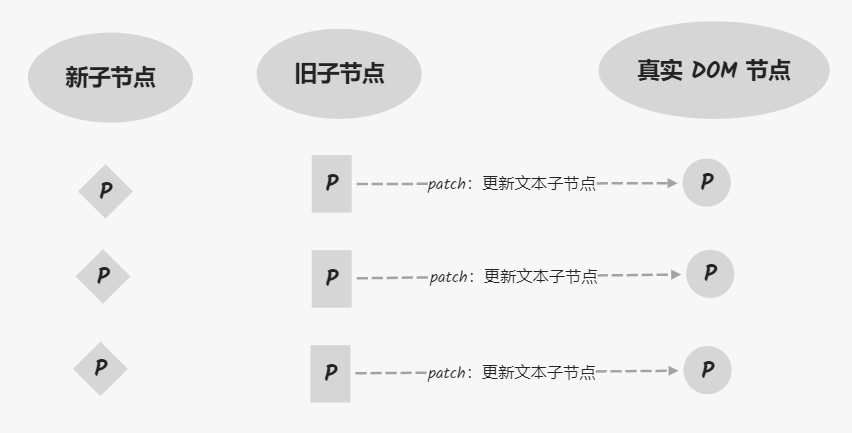

这种做法虽然能够减少 DOM 操作次数，但问题也很明显。我们通过遍历旧的一组子节点，并假设新的一组子节点的数量与之相同，只有在这种情况下，这段代码才能正确地工作。但是，新旧两组子节点的数量未必相同。当新的一组子节点的数量少于旧的一组子节点的数量时，意味着有些节点在更新后应该被卸载。


当旧的一组子节点一共有 4 个 p 标签，而新的一组子节点中只有 3 个 p 标签。这说明，在更新过程中，需要将不存在的 p 标签卸载。类似地，新的一组子节点的数量也可能比旧的一组子节点的数量多。

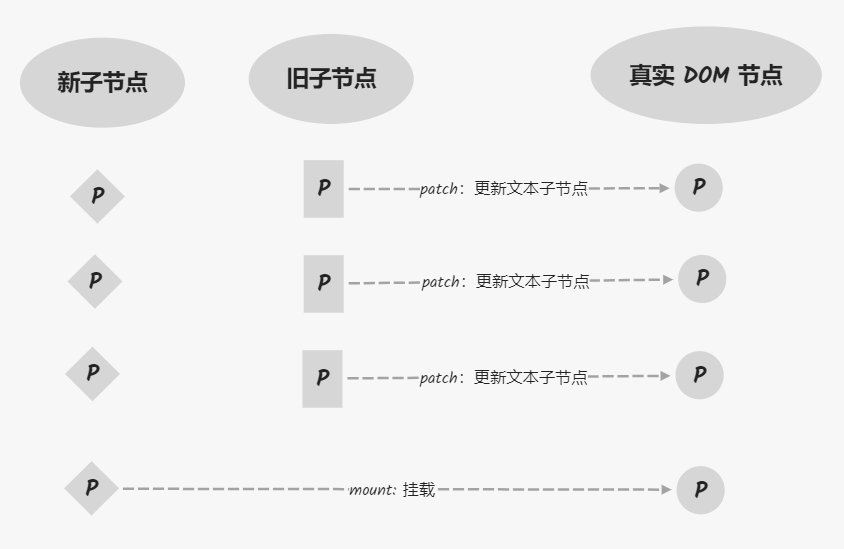

当新的一组子节点比旧的一组子节点多了一个 p 标签。在这种情况下，我们应该挂载新增节点。

通过上面的分析我们意识到，在进行新旧两组子节点的更新时，不应该总是遍历旧的一组子节点或遍历新的一组子节点，而是应该遍历其中长度较短的那一组。这样，我们才能够尽可能多地调用 patch 函数进行更新。接着，再对比新旧两组子节点的长度，如果新的一组子节点更长，则说明有新子节点需要挂载，否则说明有旧子节点需要卸载。

```js
function patchChildren (n1, n2, container) {
  if (typeof n2.children === 'string') {
    // ...
  } else if (Array.isArray(n2.children)) {
    const oldChildren = n1.children
    const newChildren = n2.children
    
    const oldLen = oldChildren.length
    const newLen = newChildren.length

    const commonLength = Math.min(oldLen, newLen)

    for (let i = 0; i < commonLength; i++) {
      patch(oldChildren[i], newChildren[i])
    }

    if (newLen > oldLen) {
      for (let i = commonLength; i < newLen; i++) {
        patch(null, newChildren[i], container)
      }
    } else {
      for (let i = commonLength; i < oldLen; i++) {
        unmount(oldChildren[i])
      }
    }
  } else {
    // ...
  }
}
```

这样，无论新旧两组子节点的数量关系如何，我们都可以正确地挂载或卸载它们。

#### DOM 复用与 key 的作用

我们可以通过减少 DOM 操作的次数，提升更新性能。但这种方式仍存在可优化的空间。举个例子，假设新旧两组子节点的内容如下：

```js
[
  { type: 'p' },
  { type: 'div' },
  { type: 'span' }
]

[
  { type: 'span' },
  { type: 'p' },
  { type: 'div' }
]
```

如果使用上面介绍的算法来完成上述两组子节点的更新，则需要 6 次 DOM 操作。

但是，观察新旧两组子节点，很容易发现，二者只是顺序不同。所以最优的处理方式是，通过 DOM 的移动来完成子节点的更新，这要比不断地执行子节点的卸载和挂载性能更好。但是，想要通过 DOM 的移动来完成更新，必须要保证一个前提：新旧两组子节点中的确存在可复用的节点。这个很好理解，如果新的子节点没有在旧的一组子节点中出现，就无法通过移动节点的方式完成更新。所以现在问题就变成：应该如何确定新的子节点是否出现在旧的一组子节点中。拿上面的例子来说，如果确定新的一组子节点中第 1 个子节点 `{ type: 'sppan' }` 与旧子节点中的第 3 个子节点相同呢？一种解决方案是，通过 `vnode.type` 来判断，只要 `vnode.type` 的值相同，我们就认为两者是相同的节点。但这种方式并不可靠。

```js
[
  { type: 'p', children: '1' },
  { type: 'p', children: '2' },
  { type: 'p', children: '3' }
]

[
  { type: 'p', children: '3' },
  { type: 'p': children: '1' },
  { type: 'p', children: '2' }
]
```

观察上面两组子节点，我们发现，这个案例可以通过移动 DOM 的方式来完成更新，但是所有节点的 `vnode.type` 属性值都相同，这导致我们无法确定新旧两组子节点中节点的对应关系，也就无法得知应该进行怎样的 DOM 移动才能完成更新。这时，我们就需要引入额外的 key 来作为 vnode 的标识，如下面的代码所示：

```js
[
  { type: 'p', children: '1', key: 1 },
  { type: 'p', children: '2', key: 2 },
  { type: 'p', children: '3', key: 3 }
]

[
  { type: 'p', children: '3', key: 3 },
  { type: 'p': children: '1', key: 1 },
  { type: 'p', children: '2', key: 2 }
]
```

key 属性就像虚拟节点的 “身份证” 号，只要两个虚拟节点的 type 属性值和 key 属性值都相同，那么我们就认为它们是相同的，即可以进行 DOM 的复用。下图展示了有 key 和无 key 时新旧两组子节点的映射情况。

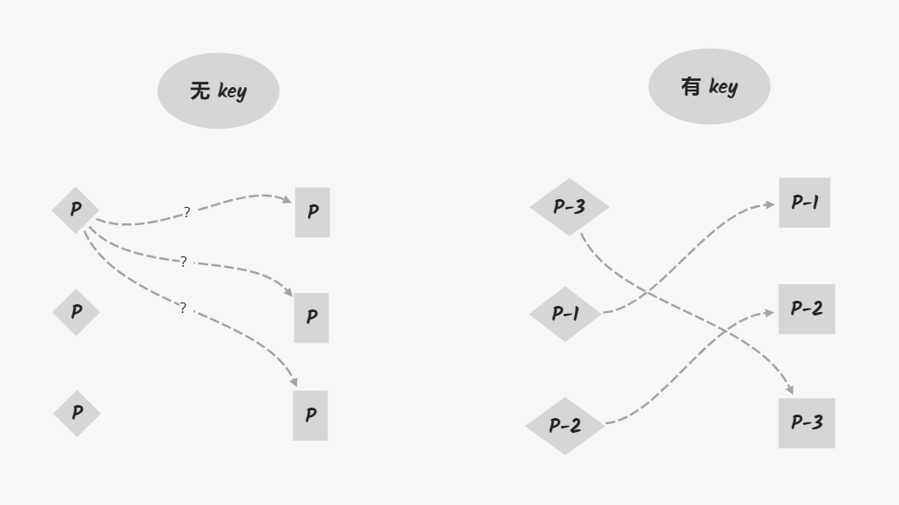

如果没有 key，我们无法知道新子节点与旧子节点间的映射关系，也就无法知道应该如何移动节点。有 key 的话情况则不同，我们根据子节点的 key 属性，能够明确知道新子节点在旧子节点中的位置，这样就可以进行相应的 DOM 移动操作了。

有必要强调一点是，DOM 可复用并不意味着不需要更新，如果下面的两个虚拟节点所示：

```js
const oldVNode = { type: 'p', key: 1, children: 'text 1' }
const newVNode = { type: 'p', key: 1, children: 'text 2' }
```

这两个虚拟节点拥有相同的 key 值和 `vnode.type` 属性值。这意味着，在更新时可以复用 DOM 元素，即只需要通过移动操作来完成更新。但仍需要对这两个虚拟节点进行打补丁操作，因为新的虚拟节点（`newVNode`）的文本子节点的内容已经改变了。因此，在讨论如何移动 DOM 之前，我们需要先完成打补丁操作。

```js
function patchChildren (n1, n2, container) {
  if (typeof n2.children === 'string') {
    // ...
  } else if (Array.isArray(n2.children)) {
    const oldChildren = n1.children
    const newChildren = n2.children

    const oldLen = oldChildren.length
    const newLen = newChildren.length

    // 判断是否可以复用
    for (let i = 0; i < newChildren.length; i++) {
      const newVNode = newChildren[i]
      for (let j = 0; j < oldChildren.length; j++) {
        const oldVNode = oldChildren[j]
        // 如果找到具有相同 key 值的节点，说明可以复用，但是仍需要调用 patch 函数更新
        if (newVNode.key === oldVNode.key) {
          patchChildren(oldVNode, newVNode, container)
          break;
        }
      }
    }

		// ...
  } else {
    // ...
  }
}
```

在上面这段代码中，我们重新实现了新旧两组子节点的更新逻辑。可以看到，我们使用了两层 for 循环，外层循环用于遍历新的一组子节点，内层循环则遍历旧的一组子节点。在内层循环中，我们逐个对比新旧子节点的 key 值，试图在旧的子节点中找到可复用的节点。一旦找到，则调用 patch 函数进行打补丁。经过这一步操作后，我们能保证所有可复用的节点本身都经过更新完毕。

```js
const oldVNode = {
  type: 'div',
  children: [
    { type: 'p', children: '1', key: 1 },
    { type: 'p', children: '2', key: 2 },
    { type: 'p', children: 'hello', key: 3 }
  ]
}

const newVNode = {
  type: 'div',
  children: [
    { type: 'p', children: 'world', key: 3 },
    { type: 'p', children: '1', key: 1 },
    { type: 'p', children: '2', key: 2 },
  ]
}

renderer.renderer(oldVNode, document.querySelector('#app'))
setTimeout(() => {
  renderer.renderer(newVNode, document.querySelector('#app'))
}, 1000)
```

运行上面这段代码，1 秒后，key 值为 3 的子节点对应的真实 DOM 的文本内容会由 “hello” 更新为字符串 “world”。

更新操作具体过程分析如下：

* 第一步，取新的一组子节点中的第一个子节点，即 key 值为 3 的节点。尝试在旧的一组子节点中寻找具有相同 key 值的节点。我们发现，旧的子节点 `oldVNode[2]` 的 key 值为 3，于是调用 patch 函数进行打补丁。在这一步操作完成之后，渲染器会把 key 值为 3 的虚拟节点所对应的真实 DOM 的文本内容由字符串 “hello” 更新为字符串 “world”。
* 第二步，取新的一组子节点中的第二个子节点，即 key 值为 1 的节点。尝试在旧的一组子节点寻找具有相同 key 值的节点。我们发现，旧的子节点 `oldVNode[0]` 的 key 值为 1，于是调用 patch 函数进行打补丁。由于 key 值等于 1 的新旧子节点没有任何差异，所以什么都不会做。
* 第三步，取新的一组子节点中的最后一个子节点，即 key 值为 2 的节点，最终结果与第二步相同。

经过上述更新操作，所有节点对应的真实 DOM 元素都更新完毕了。但真实 DOM 仍然保持旧的一组子节点的顺序，即 key 值为 3 的节点对应的真实 DOM 仍然是最后一个子节点。由于在新的一组子节点中，key 值为 3 的节点已经变为第一个子节点了，因此我们还需要通过移动节点来完成真实 DOM 顺序的更新。

#### 找到需要移动的元素

现在，我们已经能够通过 key 值找到可复用的节点了。接下来需要思考的时候，如何判断一个节点是否需要移动，以及如何移动。对于第一个问题，我们可以采用逆向思维的方式，先想一想在什么情况下节点不需要移动？答案很简单，当新旧两组子节点的节点顺序不变时，就不需要额外的移动操作。


当新旧两组子节点的顺序没有发生变化：

* key 值为 1 的节点在旧 children 数组中的索引为 0；
* key 值为 2 的节点在旧 children 数组中的索引为 1；
* key 值为 3 的节点在旧 children 数组中的索引为 2。

接着，我们对新旧两组子节点采用上一节介绍的更新算法，看看新旧两组子节点的顺序没有发生变化时，更新算法具有怎么的特点。

* 第一步：取新的一组子节点中的第一个节点 `p-1` ，它的 key 为 1。尝试在旧的一组子节点中找到具有相同 key 值的可复用节点，发现能够找到，并且该节点在旧的一组子节点中的索引为 0；
* 第二步：取新的一组子节点中的第二个节点 `p-2`，它的 key 为 2。尝试在旧的一组子节点中找到具有相同 key 值的可复用节点，发现能够找到，并且该节点在旧的一组子节点中的索引为 1；
* 第三步：取新的一组子节点中的第二个节点 `p-3`，它的 key 为 3。尝试在旧的一组子节点中找到具有相同 key 值的可复用节点，发现能够找到，并且该节点在旧的一组子节点中的索引为 2。

在这个过程中，第一次寻找可复用的节点时，都会记录该可复用节点在旧的一组子节点中的位置索引。如果把这些位置索引值按照先后顺序排列，则可以得到一个序列：0、1、2。这是一个递增的序列，在这种情况下不需要移动任何节点。

我们再来看另外一个例子。

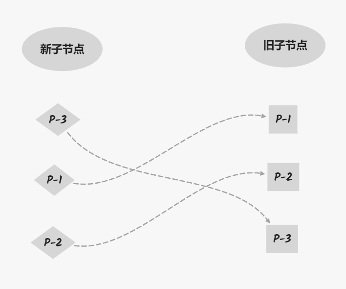

同样，我们根据图中的例子再次执行更新算法。

* 第一步：取新的一组子节点中的第一个节点 `p-3` ，它的 key 为 3。尝试在旧的一组子节点中找到具有相同 key 值的可复用节点，发现能够找到，并且该节点在旧的一组子节点中的索引为 2；
* 第一步：取新的一组子节点中的第一个节点 `p-1` ，它的 key 为 1。尝试在旧的一组子节点中找到具有相同 key 值的可复用节点，发现能够找到，并且该节点在旧的一组子节点中的索引为 0。节点 `p-1` 对应的真实 DOM 需要移动。
* 第一步：取新的一组子节点中的第一个节点 `p-2` ，它的 key 为 2。尝试在旧的一组子节点中找到具有相同 key 值的可复用节点，发现能够找到，并且该节点在旧的一组子节点中的索引为 1。节点 `p-2` 对应的真实 DOM 需要移动。

以上就是 Diff 算法在执行更新的过程中，判断节点是否需要移动的方式。在上面的例子中，我们可以得出节点 `p-1` 和节点 `p-2` 需要移动的结论。这是因为在旧的 children 中的索引要小于节点 `p-3` 在旧 children 中的索引。如果我们按照先后顺序记录在寻找节点过程中所遇到的位置索引，将会得到序列：2、0、1。可以发现，这个序列不具有递增的趋势。

其实我们可以将节点 `p-3` 在旧 children 中的索引定义为：在旧 children 中寻找具有相同 key 值节点的过程中，遇到的最大索引值。如果在后续寻找的过程中，存在索引值比当前遇到的最大索引值还要小的节点，则意味着该节点需要移动。

我们可以用 `lastIndex` 变量存储整个寻找过程中遇到的最大索引值，如下面的代码所示：

```js
function patchChildren (n1, n2, container) {
  if (typeof n2.children === 'string') {
    // ...
  } else if (Array.isArray(n2.children)) {
    const oldChildren = n1.children
    const newChildren = n2.children

    const oldLen = oldChildren.length
    const newLen = newChildren.length

    // 存储寻找过程中遇到的最大索引值
    let lastIndex = 0

    for (let i = 0; i < newChildren.length; i++) {
      const newVNode = newChildren[i]
      for (let j = 0; j < oldChildren.length; j++) {
        const oldVNode = oldChildren[j]

        // 如果找到具有相同 key 值的节点，说明可以复用，但是仍需要调用 patch 函数更新
        if (newVNode.key === oldVNode.key) {
          patchChildren(oldVNode, newVNode, container)

          if (j < lastIndex) {
            // 如果当前找到的节点在旧 children 中的索引小于最大索引值 lastIndex
            // 说明该节点对应的真实 DOM 需要移动
          } else {
            // 如果当前找到的节点在旧 children 中的索引小于最大索引值
            // 则更新 lastIndex 的值
            lastIndex = j
          }
          break;
        }
      }
    }
  } else {
    // ...
  }
}
```

如以上代码及注释所示，如果新旧节点的 key 值相同，说明我们在旧 children 中找到了可复用的 DOM 的节点。此时我们用该节点在旧 children 中的索引 j 与 `lastIndex` 进行比较，如果 j 小于 `lastIndex` ，说明当前 `oldVnode` 对应的真实 DOM 需要移动，否则说明不需要移动。但此时应该将变量 j 的值赋值给变量 `lastIndex` ，以保证寻找节点的过程中，变量 `lastIndex` 始终存储着当前遇到的最大索引值。

现在，我们已经找到了需要移动的节点，下面我们将讨论如何移动节点，从而完成节点顺序的更新。

#### 如何移动元素

我们讨论了如何判断节点是否需要移动。移动节点指的是，移动一个虚拟节点所对应的真实 DOM 节点，并不是移动虚拟节点本身。既然移动的时真实 DOM 节点，那么就需要取得对它的引用。我们知道，当一个虚拟节点被挂载后，其对应的真实 DOM 节点会存在它的 `vnode.el` 属性中。


因此，在代码中，我们可以通过旧子节点的 `vnode.el` 属性取得它对应的真实 DOM 节点。

当更新操作发生时，渲染器会调用 `patchElement` 函数在新旧虚拟节点之间进行打补丁。

```js
function patchElement (n1, n2) {
  // 新的 vnode 也引用了真实 DOM 元素
  const el = n2.el = n1.el
  // ...
}
```

可以看到，`patchElement` 函数首先将旧节点的 `n1.el` 属性赋值给新节点的 `n2.el` 属性。这个赋值语句其实就是 DOM 元素的复用。在复用 DOM 元素之后，新节点也将持有对真实 DOM 的引用。

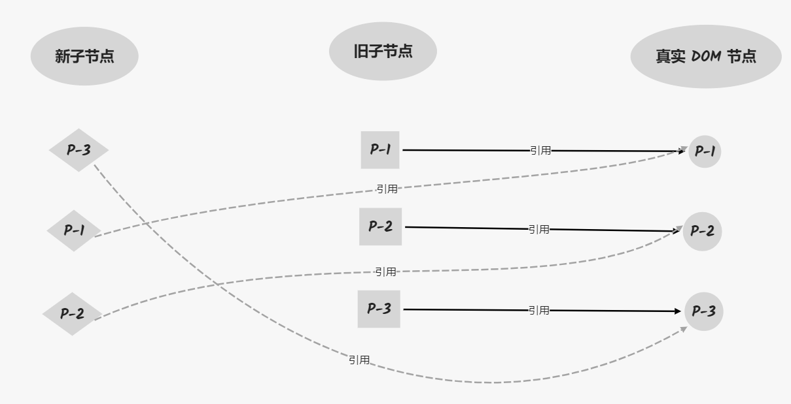

可以看到，无论是新子节点还是旧子节点，都存在对真实 DOM 的引用，在此基础上，我们就可以进行 DOM 移动操作了。

```js
const oldVNode = {
  type: 'div',
  children: [
    { type: 'p', children: '1', key: 1 },
    { type: 'p', children: '2', key: 2 },
    { type: 'p', children: 'hello', key: 3 }
  ]
}

const newVNode = {
  type: 'div',
  children: [
    { type: 'p', children: 'world', key: 3 },
    { type: 'p', children: '1', key: 1 },
    { type: 'p', children: '2', key: 2 },
  ]
}
```


以图示为例， 它的更新步骤如下：

* 第一步：取新的一组子节点中第一个节点 p-3，它的 key 为 3，尝试在旧的一组子节点中找到具有相同 key 值的可复用节点。发现可以找到，并且该节点在旧的一组子节点中的索引为 2。此时变量 `lastIndex` 的值为 0，索引 2 不小于 0，所以节点 p-3 对应的真实 DOM 不需要移动，但需要更新变量 `lastIndex`　的值为　２.

* 第二步：取新的一组子节点中第二个节点 p-1，它的 key 为 1，尝试在旧的一组子节点中找到具有相同 key 值的可复用节点。发现可以找到，并且该节点在旧的一组子节点中的索引为 0。此时变量 `lastIndex` 的值为 2，索引 0 小于 2，所以节点 p-1 对应的真实 DOM 需要移动。

  我们发现，节点 p-1 对应的真实 DOM 需要移动，但是应该移动到哪？我们知道，新 children 的顺序其实就是更新后真实 DOM 节点应有的顺序。所以节点 p-1 在新 children 中的位置就代表真实 DOM 更新后的位置。由于节点 p-1 在新 children 中排在节点 p-3 后面，所以我们应该把节点 p-1 所对应的真实 DOM 移动导节点 p-3 所对应的真实 DOM 后面。

  这样操作后，此时真实 DOM 的顺序为 p-2、p-3、p-1。

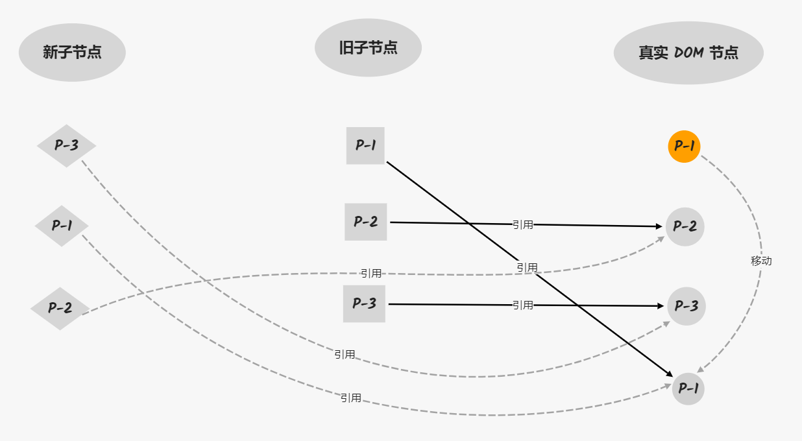

* 第三步：取新的一组子节点中第二个节点 p-2 ，它的 key 为 2，尝试在旧的一组子节点中找到具有相同 key 值的可复用节点。发现可以找到，并且该节点在旧的一组子节点中的索引为 1。此时变量 `lastIndex` 的值为 2，索引 1 小于 2，所以节点 p-2 对应的真实 DOM 需要移动。

  第三步和第二步类似，节点 p-2 对应的真实 DOM 也需要移动。同样，由于节点 p-2 在新 children 中排在节点 p-1 后面，所以我们应该把节点 p-2 对应的真实 DOM 移动到节点 p-1 对应的真实 DOM 后面。


经过这一步移动操作之后，我们发现，真实 DOM 的顺序与新的一组子节点的顺序想通了。至此，更新操作完成。

```js
function patchChildren (n1, n2, container) {
  if (typeof n2.children === 'string') {
    // ...
  } else if (Array.isArray(n2.children)) {
    const oldChildren = n1.children
    const newChildren = n2.children

    const oldLen = oldChildren.length
    const newLen = newChildren.length

    // 存储寻找过程中遇到的最大索引值
    let lastIndex = 0

    for (let i = 0; i < newChildren.length; i++) {
      const newVNode = newChildren[i]
      let j = 0;
      for (j; j < oldChildren.length; j++) {
        const oldVNode = oldChildren[j]

        // 如果找到具有相同 key 值的节点，说明可以复用，但是仍需要调用 patch 函数更新
        if (newVNode.key === oldVNode.key) {
          patch(oldVNode, newVNode, container)

          if (j < lastIndex) {
            // 如果当前找到的节点在旧 children 中的索引小于最大索引值 lastIndex
            // 说明该节点对应的真实 DOM 需要移动
            // 获取 newVNode 的前一个 vnode，即 prevVNode
            const prevVNode = newChildren[i - 1]
            // 如果 prevVnode 不存在，说明当前 newVNode 是第一个节点，不需要移动
            if (prevVNode) {
              // 由于我们要将 newVnode 对应的真实 DOM 移动到 prevVNode 所对应真实 DOM 后面
              // 所以我们需要获取 prevVNode 所对应真实 DOM 的下一个兄弟节点，并将其作为锚点
              const anchor = prevVNode.el.nextSibling
              // 调用 insert 方法将 newVNode 对应的真实 DOM 插入到锚点元素前面
              // 也就是 prevVNode 对应的真实 DOM 后面
              insert(newVnode.el, container, anchor)
            }
          } else {
            // 如果当前找到的节点在旧 children 中的索引小于最大索引值
            // 则更新 lastIndex 的值
            lastIndex = j
          }
          break;
        }
      }
    }
  } else {
    // ...
  }
}
```

在这段代码中，如果条件 `j < lastIndex` 成立，则说明当前 `newVNode` 所对应的真实 DOM 需要移动。根据前文的分析可知，我们需要获取当前 `newVNode` 节点的前一个虚拟节点，即 `newChildren[i - 1]` ，然后使用 insert 函数完成节点的移动，其中 insert 函数依赖浏览器原生的 `insertBefore` 函数。

```js
const renderer = createRenderer({
  insert (el, parent, anchor = null) {
    // insertBefore 需要描点元素 anchor
    parent.insertBefore(el, anchor)
  }
})
```

#### 添加新元素

本小节我们将讨论添加新节点的情况。


从图中可知，在新的一组子节点中，多出来一个节点 p-4，它的 key 值为 4，该节点在旧的一组子节点不存在，因此应该将其视为新增节点。对于新增节点，在更新时我们应该正确地将它挂载，这主要分为两步：

* 找到新增节点；
* 将新增节点挂载到正确位置。

首先，我们来看一下如何找到新增节点。为了搞清楚这个问题，我们需要根据图中给出的例子模拟执行下逻辑。在此之前，我们需要弄清楚新旧两组子节点与真实 DOM 元素的当前状态。


接着，我们开始模拟更新逻辑。

* 第一步：取新的一组子节点中第一个节点  p-3，它的 key 值为 3，尝试在旧的一组子节点中寻找可复用的节点。发现能够找到，并且该节点在旧的一组子节点中的索引值为 2。此时，变量 `lastIndex` 的值为 0，索引值 2 不小于 `lastIndex` 的值 0，所以节点 p-3 对应的真实 DOM 不需要移动，但是需要将变量 `lastIndex` 的值更新为 2。
* 第二步：取新的一组子节点中第一个节点  p-1，它的 key 值为 1，尝试在旧的一组子节点中寻找可复用的节点。发现能够找到，并且该节点在旧的一组子节点中的索引值为 0。此时，变量 `lastIndex` 的值为 2，索引值 0 小于 `lastIndex` 的值 2，所以节点 p-1 对应的真实 DOM 需要移动，并且应该移动到节点 p-3 对应的真实 DOM 后面。经过这一步的移动操作后，真实 DOM 的顺序为 p-2、p-3、p-1。
* \kl;
* 第三步：取新的一组子节点中第一个节点  p-4，它的 key 值为 4，尝试在旧的一组子节点中寻找可复用的节点。由于在旧的一组子节点中，没有 key 值为 4 的节点，因此渲染器会把节点 p-4 看作新增节点并挂载它。但是，应该将挂载到哪里呢？为了搞清楚这个问题，我们需要观察节点 p-4 在新的一组子节点中的位置。由于节点 p-4 出现在节点 p-1 后面，我们我们应该把节点 p-4 挂载到节点 p- 1 所对应的真实 DOM 后面。经过这一步操作后，此时真实 DOM 的顺序是：p-2、p-3、p-1、p-4，其中 p-4 是刚刚挂载的。
* 第四步：取新的一组子节点中第一个节点  p-2，它的 key 值为 2，尝试在旧的一组子节点中寻找可复用的节点。发现能够找到，并且该节点在旧的一组子节点中的索引值为 1。此时，变量 `lastIndex` 的值为 2，索引值 1 小于 `lastIndex` 的值 2，所以节点 p-2 对应的真实 DOM 需要移动，并且应该移动到节点 p-4 对应的真实 DOM 后面。经过这一步的移动操作后，真实 DOM 的顺序为 p-3、p-1、p-4、p-2。至此，真实 DOM 顺序已经与新的一组子节点的顺序相同，更新完成。

接着，我们来实现代码。

```js
function patchChildren (n1, n2, container) {
  if (typeof n2.children === 'string') {
    // ...
  } else if (Array.isArray(n2.children)) {
    const oldChildren = n1.children
    const newChildren = n2.children

    const oldLen = oldChildren.length
    const newLen = newChildren.length

    // 存储寻找过程中遇到的最大索引值
    let lastIndex = 0

    for (let i = 0; i < newChildren.length; i++) {
      const newVNode = newChildren[i]
      let j = 0;

      // 第一层循环中定义变量 find，代表是否在旧的一组子节点中找到可复用的节点，
      // 初始值为 false，代表没找到
      let find = false

      for (j; j < oldChildren.length; j++) {
        const oldVNode = oldChildren[j]

        // 如果找到具有相同 key 值的节点，说明可以复用，但是仍需要调用 patch 函数更新
        if (newVNode.key === oldVNode.key) {
          // 找到可复用的节点，将变量 find 的值设置为 true
          find = true

          patch(oldVNode, newVNode, container)

          if (j < lastIndex) {
            // 如果当前找到的节点在旧 children 中的索引小于最大索引值 lastIndex
            // 说明该节点对应的真实 DOM 需要移动
            // 获取 newVNode 的前一个 vnode，即 prevVNode
            const prevVNode = newChildren[i - 1]
            // 如果 prevVnode 不存在，说明当前 newVNode 是第一个节点，不需要移动
            if (prevVNode) {
              // 由于我们要将 newVnode 对应的真实 DOM 移动到 prevVNode 所对应真实 DOM 后面
              // 所以我们需要获取 prevVNode 所对应真实 DOM 的下一个兄弟节点，并将其作为锚点
              const anchor = prevVNode.el.nextSibling
              // 调用 insert 方法将 newVNode 对应的真实 DOM 插入到锚点元素前面
              // 也就是 prevVNode 对应的真实 DOM 后面
              insert(newVnode.el, container, anchor)
            }
          } else {
            // 如果当前找到的节点在旧 children 中的索引小于最大索引值
            // 则更新 lastIndex 的值
            lastIndex = j
          }
          break;
        }
      }

      // 如果代码运行到这里，find 仍然是 false
      // 说明当前 newVNode 没有在旧的一组子节点中找到可复用的节点
      // 也就是说，当前 newVNode 是新增节点，需要挂载
      if (!find) {
        // 为了将节点挂载到正确位置，我们需要先获取锚点元素
        // 首先获取当前 newVNode 的前一个 vnode 节点
        const parentVNode = newChildren[i - 1]
        
        let anchor = null

        if (prevVNode) {
          // 如果存在前一个 vnode 节点，则使用它的下一个兄弟节点作为锚点元素
          anchor = prevVNode.el.nextSibling
        } else {
          // 如果没有前一个 vnode 节点，说明即将挂载的新节点是第一个子节点
          // 这时我们使用容器元素的 fristChild 作为锚点
          anchor = container.firstChild
        }

        // 挂载 newVNode
        patch(null, newVnode, container, anchor)
      }
    }
  } else {
    // ...
  }
}
```

观察上面这段代码。首先，我们在外层循环中定义了名为 find 的变量，它代表渲染器能否在旧的一组子节点中找到可复用的节点。变量 find 的初始值为 false，一旦寻找到可复用的节点，则将变量 find 的值设置为 true。如果内层循环结束后，变量 find 的值仍然为 false，则说明 `newVNode` 是一个全新的节点，需要挂载它。为了将节点挂载到正确位置，我们需要先获取锚点元素：找到 `newVNode` 的前一个虚拟节点，即 `preVNode`，如果存在，则使用它对应的真实 DOM 的下一个兄弟节点作为锚点元素；如果不存在，则说明即将挂载的 `newVNode` 节点是容器元素的第一个子节点，此时应该使用容器元素的 `container.firstChild` 作为锚点元素。最后，将锚点元素 anchor 作为 patch 函数的第四个参数，调用 patch 函数完成节点的挂载。

```js
function patch (n1, n2, container, anchor) {
  // ...
  if (typeof type === 'string') {
    if (!n1) {
      // 挂载时将锚点元素作为第三个参数传递给 mountElement 函数
      mountElement(n2, container, anchor)
    } else {
      patchElement(n1, n2)
    }
  } else if (type === Text) {
    // ...
  } else if (type === Fragment) {
    // ...
  }
}

function mountElement (vnode, container, anchor) {
  // ...

  // 插入节点时，将锚点元素透传给 insert 函数
  insert(el, container, anchor)
}
```

#### 移动不存在的元素

在更新子节点时，不仅会遇到新增元素，还会出现元素被删除的情况。


在新的一组节点中，节点 p-2 已经不存在了，这说明该节点被删除了。渲染器应该能找到那些需要删除的节点并正确地将其删除。

首先我们来讨论如何找到需要删除的节点。


现在我们开始模拟执行更新的过程。

* 第一步：取新的一组子节点中的第一个节点 p-3，它的 key 值为 3。尝试在旧的一组子节点中寻找可复用的节点。发现能够找到，并且该节点在旧的一组子节点中的索引值为 2 。此时变量 `lastIndex` 的值 为 0，索引 2 不小于 `lastIndex` 的值 0，所以节点 p-3 对应的真实 DOM 不需要移动，但需要更新变量 `lastIndex` 的值为 2。
* 第二步：取新的一组子节点中的第一个节点 p-1，它的 key 值为 1。尝试在旧的一组子节点中寻找可复用的节点。发现能够找到，并且该节点在旧的一组子节点中的索引值为 0 。此时变量 `lastIndex` 的值 为 2，索引 0 小于 `lastIndex` 的值 2，所以节点 p-1 对应的真实 DOM 需要移动，并且应该移动到节点 p-3 对应的真实 DOM 后面。经过这一步的移动操作后，真实 DOM 的状态如下：


至此，更新结束。不过我们会发现，节点 p-2 对应的真实 DOM 仍然存在，所以需要增加额外的逻辑来删除遗留节点。思路很简单，当基本的更新结束时，我们需要遍历旧的一组子节点，然后取新的一组子结点中寻找具有相同 key 值得节点。如果找不到，则说明应该删除该节点。

```js
function patchChildren (n1, n2, container) {
  if (typeof n2.children === 'string') {
    // ...
  } else if (Array.isArray(n2.children)) {
    const oldChildren = n1.children
    const newChildren = n2.children

    const oldLen = oldChildren.length
    const newLen = newChildren.length

    // 存储寻找过程中遇到的最大索引值
    let lastIndex = 0
    for (let i = 0; i < newChildren.length; i++) {
      const newVNode = newChildren[i]
      let j = 0;

      // 第一层循环中定义变量 find，代表是否在旧的一组子节点中找到可复用的节点，
      // 初始值为 false，代表没找到
      let find = false

      for (j; j < oldChildren.length; j++) {
        const oldVNode = oldChildren[j]

        // 如果找到具有相同 key 值的节点，说明可以复用，但是仍需要调用 patch 函数更新
        if (newVNode.key === oldVNode.key) {
          // 找到可复用的节点，将变量 find 的值设置为 true
          find = true

          patch(oldVNode, newVNode, container)

          if (j < lastIndex) {
            // 如果当前找到的节点在旧 children 中的索引小于最大索引值 lastIndex
            // 说明该节点对应的真实 DOM 需要移动
            // 获取 newVNode 的前一个 vnode，即 prevVNode
            const prevVNode = newChildren[i - 1]
            // 如果 prevVnode 不存在，说明当前 newVNode 是第一个节点，不需要移动
            if (prevVNode) {
              // 由于我们要将 newVNode 对应的真实 DOM 移动到 prevVNode 所对应真实 DOM 后面
              // 所以我们需要获取 prevVNode 所对应真实 DOM 的下一个兄弟节点，并将其作为锚点
              const anchor = prevVNode.el.nextSibling
              // 调用 insert 方法将 newVNode 对应的真实 DOM 插入到锚点元素前面
              // 也就是 prevVNode 对应的真实 DOM 后面
              insert(newVNode.el, container, anchor)
            }
          } else {
            // 如果当前找到的节点在旧 children 中的索引小于最大索引值
            // 则更新 lastIndex 的值
            lastIndex = j
          }
          break;
        }
      }

      // 如果代码运行到这里，find 仍然是 false
      // 说明当前 newVNode 没有在旧的一组子节点中找到可复用的节点
      // 也就是说，当前 newVNode 是新增节点，需要挂载
      if (!find) {
        // 为了将节点挂载到正确位置，我们需要先获取锚点元素
        // 首先获取当前 newVNode 的前一个 vnode 节点
        const parentVNode = newChildren[i - 1]
        
        let anchor = null

        if (prevVNode) {
          // 如果存在前一个 vnode 节点，则使用它的下一个兄弟节点作为锚点元素
          anchor = prevVNode.el.nextSibling
        } else {
          // 如果没有前一个 vnode 节点，说明即将挂载的新节点是第一个子节点
          // 这时我们使用容器元素的 fristChild 作为锚点
          anchor = container.firstChild
        }

        // 挂载 newVNode
        patch(null, newVNode, container, anchor)
      }
    }

    // 上一步得更新操作完成后
    // 遍历旧的一组子节点
    for (let i = 0; i < oldChildren.length; i++) {
      const oldVNode = oldChildren[i]
      // 拿旧子节点 oldVNode 去新的一组子节点中寻找具有相同 key 值得节点
      const has = newChildren.find(vnode => vnode.key === oldVNode.key)
      if (!has) {
        // 如果没有找到具有相同 key 值得节点，则说明需要删除该节点
        // 调用 unmount 函数将其卸载
        unmount(oldVNode)
      }
    }
  } else {
    // ...
  }
}
```

如以上代码注释所示，在上一步得更新操作完成后，我们还需要遍历旧得一组子节点，目的是检查旧子节点在新的一组子节点中是否仍然存在，如果已经不存在，则调用 unmount 函数将其卸载。

#### 总结

本篇文章，我们首先讨论了 Diff 算法的作用。Diff 算法用来计算两组子节点的差异，并试图最大程度地复用 DOM 元素。通过遍历新旧两组子节点中数量多的那一组，逐个调用 patch 函数进行打补丁，然后比较新旧两组子节点的数量，如果新的一组子节点数量更多，说明新子节点需要挂载。否则说明在旧的一组子节点中，有节点需要卸载。

然后，我们讨论子虚拟节点中 key 属性的作用。在更新时，渲染器通过 key 属性找到可复用的节点，然后尽可能地通过 DOM 移动操作来完成更新，避免过多地对 DOM 元素进行销毁和重建。

接着，我们讨论了简单 Diff 算法时如何寻找要移动的节点的。简单 Diff 算法的核心逻辑时，拿新的一组子节点中的节点去旧的一组子节点中寻找可复用的节点。如果找到，则记录该节点的位置索引。然后我们把逐个位置索引称为最大索引。在整个更新过程中，如果一个节点的索引值小于最大索引，则说明该节点对应的真实 DOM 元素需要移动。

最后，我们通过几个例子讲解了渲染器是如何移动、添加、删除虚拟节点所对应的 DOM 元素的。

### 双端 Diff 算法

我们已经介绍过简易 Diff 算法的实现原理。简易 Diff 算法利用虚拟节点的 key 属性，尽可能复用 DOM 元素，并通过移动 DOM 的方式来完成更新，从而减少不断创建和销毁 DOM 元素带来的性能开销。但是，简易 Diff 算法仍然存在很多缺陷，这些缺陷可以通过双端 Diff 算法解决。

#### 双端比较的原理

简易 Diff 算法的问题在于，它对 DOM 的移动操作并不是最优的。

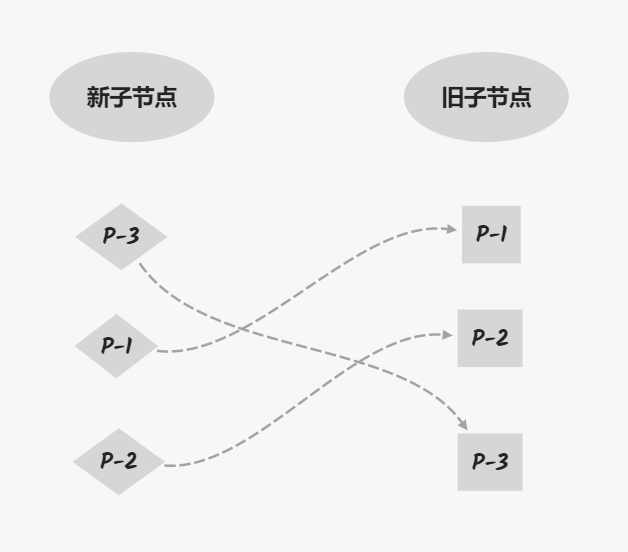

以图中的例子来看，如果使用简单 Diff 算法来更新它，会发生两次 DOM 移动操作。

第一次 DOM 移动操作会将真实 DOM 节点 p-1 移动到真实 DOM 节点 p-3 后面。第二次移动操作会将真实 DOM 节点 p-2 移动到真实 DOM 节点 p-1 后面。最终真实 DOM 节点的顺序和新的一组子节点顺序一致：p-3、p-1、p-2。

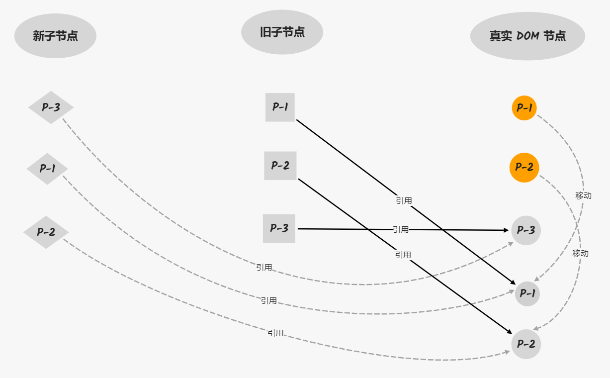

但是，上述更新过程并非最优解。在这个例子中，其实只需要通过一步 DOM 节点的移动操作就可以完成更新，只需要把真实 DOM 节点 p-3 移动到真实 DOM 节点 p-1 前面。

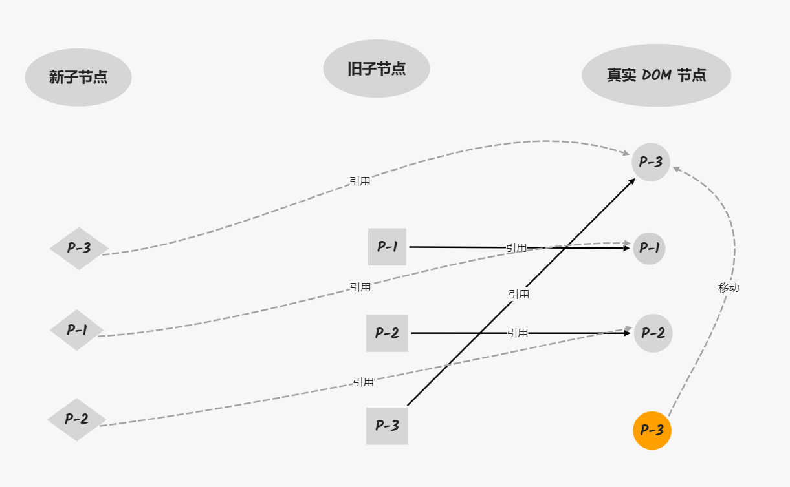

可以看到，理论上我们只需要一次 DOM 移动操作即可完成更新。但简单 Diff 算法做不到这一点。这就需要我们使用双端 Diff 算法。

顾名思义，双端 Diff 算法是一种对新旧两组子节点的两个端点进行比较的算法。因此，我们需要四个索引值，分别指向新旧两组子节点的端点。


用代码来表达四个端点，如下面的 `patchChildren` 和 `patchKeyedChildren` 函数：

```js
function patchChildren (n1, n2, container) {
  if (typeof n2.children === 'string') {
    // ...
  } else if (Array.isArray(n2.children)) {
    // 封装 patchKeyedChild 函数处理两组子节点
    patchKeyedChildren(n1, n2, container)
  } else {
    // ...
  }
}

function patchKeyedChildren (n1, n2, container) {
  const oldChildren = n1.children
  const newChildren = n2.children

  let oldStartIdx = 0
  let oldEndIdx = oldChildren.length - 1
  let newStartIdx = 0
  let newEndIdx = newChildren.length - 1
}
```

上面这段代码中，我们将两组子节点的打补丁工作封装到了 `patchKeyedChildren` 函数中。在该函数内，首先获取新旧两组子节点 `oldChildren` 和 `newChildren` ，接着创建四个索引值，分别指向新旧两组子节点的头和尾，即 `oldStartIdx`、`oldEndIdx`、`newStartIdx` 和 `newEndIdx` 。有了索引后，就可以找到它所指向的虚拟节点了。

```js
function patchKeyedChildren (n1, n2, container) {
  const oldChildren = n1.children
  const newChildren = n2.children

  let oldStartIdx = 0
  let oldEndIdx = oldChildren.length - 1
  let newStartIdx = 0
  let newEndIdx = newChildren.length - 1

  let oldStartVNode = oldChildren[oldStartIdx]
  let oldEndVNodoe = oldChildren[oldEndIdx]
  let newStartVNode = newChildren[newStartIdx]
  let newEndVNODE = newChildren[newEndIdx]
}
```

其中，`oldStartVNode` 和 `oldEndVNode` 是旧的一组子节点中的第一个和最后一个节点，`newStartVNode` 和 `newEndVNode` 则是新的一组子节点中的第一个节点和最后一个节点。有了这些信息后，我们就可以进行双端比较了。


在双端比较中，每一轮比较都分为四个步骤。

* 第一步：比较旧的一组子节点中的第一个子节点 p-1 与新的一组子节点中的第一个子节点 p-4，看看它们是否相同。由于两者的 key 值不同，因此不相同，不可复用，于是怎么都不做。
* 第二步：比较旧的一组子节点中的最后一个子节点 p-4 与新的一组子节点中的最后一个子节点 p-3 ，看看它们是否相同。由于两者的 key 值不同，因此不相同，不可复用，于是什么都不做。
* 第三步：比较旧的一组子节点中的第一个子节点 p-1 与新的一组子节点中的最后一个子节点 p-3，看看它们是否相同。由于两者的 key 值不同，因此不相同，不可复用，于是什么都不做。
* 第四步：比较旧的一组子节点中的最后一个子节点 p-4 与新的一组子节点中的第一个子节点 p-4。由于它们的 key 值相同，因此可以进行 DOM 复用。

可以看到，我们在第四步时找到了相同的节点，这说明它们对应的真实 DOM 节点可以复用。对于可复用的 DOM 节点，我们只需要通过 DOM 移动操作完成更新即可。那么应该如何移动 DOM 元素呢？

第四步是比较旧的一组子节点的最后一个子节点与新的一组子节点的第一个子节点。换句话来说，节点 p-4 在更新之后应该是第一个子节点。对应到程序的逻辑，可以将其翻译为：将索引 `oldEndIdx` 指向的虚拟节点所对应的真实 DOM 移动到索引 `oldStartIdx` 指向的虚拟节点所对应的真实 DOM 前面。

```js
function patchKeyedChildren (n1, n2, container) {
  const oldChildren = n1.children
  const newChildren = n2.children

  let oldStartIdx = 0
  let oldEndIdx = oldChildren.length - 1
  let newStartIdx = 0
  let newEndIdx = newChildren.length - 1

  let oldStartVNode = oldChildren[oldStartIdx]
  let oldEndVNode = oldChildren[oldEndIdx]
  let newStartVNode = newChildren[newStartIdx]
  let newEndVNode = newChildren[newEndIdx]

  if (oldStartVNode.key === newStartVNode.key) {
    // 第一步：oldStartVNode 和 newStartVNode 比较
  } else if (oldEndVNode.key === newEndVNode.key) {
    // 第二步：oldEndVNode 和 newEndVNode 比较
  } else if (oldStartVNode.key === newEndVNode.key) {
    // 第三步：oldStartVNode 和 newEndVNode 比较
  } else if (oldEndVNode.key === newStartVNode.key) {
    // 第四步：oldEndVNode 和 newStartVNode 比较

    // 仍然需要调用 patch 函数进行打补丁
    patch(oldEndVNode, newStartVNode, container)
    // 移动 DOM 操作
    // oldEndVNode.el 移动到 oldStartVNode.el 前面
    insert(oldEndVNode.el, container, oldStartVNode.el)
    // 移动 DOM 完成后，更新索引值，并指向下一个位置
    oldEndVNode = oldChildren[--oldEndIdx]
    newStartVNode = newChildren[++newStartIdx]
  }
}
```

在这段代码中，我们增加了一系列的 `if...else if ...` 语句，用来实现四个索引指向的虚拟节点之间的比较。当我们在第四步中找到具有相同 key 值的节点。这说明，原来处于尾部的节点在新的顺序中应该处于头部。于是，我们只需要以头部元素 `oldStartVNode.el` 作为锚点，将尾部元素 `oldEndVNode.el` 移动到锚点前面即可。但需要注意的是，在进行 DOM 的移动操作之前，仍然需要调用 `patch` 函数在新旧虚拟节点之间打补丁。

这一步 DOM 的移动操作完成会，接下来就是比较关键的步骤，即更新索引值，由于第四步涉及的两个索引分别是 `oldEnIdx` 和 `newStartIdx`，所以我们需要更新两者的值，让它们各自朝正确的方向前进一步，并指向下一个节点。


此时，真实 DOM 节点顺序为 p-4、p-1、p-2、p-3，这与新的一组子节点顺序不一致。这时因为 Diff 算法还没有结束，还需要进行下一轮更新。因此，我们需要将更新逻辑封装到一个 while 循环中。

```js

function patchKeyedChildren (n1, n2, container) {
  const oldChildren = n1.children
  const newChildren = n2.children

  let oldStartIdx = 0
  let oldEndIdx = oldChildren.length - 1
  let newStartIdx = 0
  let newEndIdx = newChildren.length - 1

  let oldStartVNode = oldChildren[oldStartIdx]
  let oldEndVNode = oldChildren[oldEndIdx]
  let newStartVNode = newChildren[newStartIdx]
  let newEndVNode = newChildren[newEndIdx]

  while (oldStartIdx <= oldEndIdx && newStartIdx <= newEndIdx) {
    if (oldStartVNode.key === newStartVNode.key) {
      // 第一步：oldStartVNode 和 newStartVNode 比较
    } else if (oldEndVNode.key === newEndVNode.key) {
      // 第二步：oldEndVNode 和 newEndVNode 比较
    } else if (oldStartVNode.key === newEndVNode.key) {
      // 第三步：oldStartVNode 和 newEndVNode 比较
    } else if (oldEndVNode.key === newStartVNode.key) {
      // 第四步：oldEndVNode 和 newStartVNode 比较

      // 仍然需要调用 patch 函数进行打补丁
      patch(oldEndVNode, newStartVNode, container)
      // 移动 DOM 操作
      // oldEndVNode.el 移动到 oldStartVNode.el 前面
      insert(oldEndVNode.el, container, oldStartVNode.el)
      // 移动 DOM 完成后，更新索引值，并指向下一个位置
      oldEndVNode = oldChildren[--oldEndIdx]
      newStartVNode = newChildren[++newStartIdx]
    }
  }
}
```

由于在每一轮更新完成之后，紧接着都会更新四个索引中与当前更新轮次相关联的索引，所以整个 while 循环执行的条件是：头部索引值要小于等于尾部索引值。

在第一轮更新结束后循环条件仍然成立，因此需要进行下一轮的比较。

* 第一步：比较旧得一组子节点中得头部节点 p-1 与新得一组子节点中得头部节点 p-2，看看它们是否相同。由于两者的 key 值不同，不可复用，所以什么都不做。

  这里我们使用了新的名词：头部节点。它指的是头部索引 `oldStartIdx` 和 `newStartIdx` 所指向的节点。

* 第二步：比较旧的一组子节点中的尾部节点 p-3 与新的一组子节点中的尾部节点 p-3，两者的 key 值相同，可以复用。另外，由于两者都处于尾部，因此不需要对真实 DOM 进行移动操作。

```js
function patchKeyedChildren (n1, n2, container) {
	// ...
  
  while (oldStartIdx <= oldEndIdx && newStartIdx <= newEndIdx) {
    if (oldStartVNode.key === newStartVNode.key) {
      // 第一步：oldStartVNode 和 newStartVNode 比较
    } else if (oldEndVNode.key === newEndVNode.key) {
      // 第二步：oldEndVNode 和 newEndVNode 比较

      // 节点在新的顺序中仍然处于尾部，不需要移动，但仍需要打补丁
      patch(oldEndVNode, newEndVNode, container)
      // 更新索引和头尾部的节点变量
      oldEndVNode = oldChildren[--oldEndIdx]
      newEndVNode = newChildren[--newEndIdx]
    } else if (oldStartVNode.key === newEndVNode.key) {
      // 第三步：oldStartVNode 和 newEndVNode 比较
      
    } else if (oldEndVNode.key === newStartVNode.key) {
      // 第四步：oldEndVNode 和 newStartVNode 比较

      // 仍然需要调用 patch 函数进行打补丁
      patch(oldEndVNode, newStartVNode, container)
      // 移动 DOM 操作
      // oldEndVNode.el 移动到 oldStartVNode.el 前面
      insert(oldEndVNode.el, container, oldStartVNode.el)
      // 移动 DOM 完成后，更新索引值，并指向下一个位置
      oldEndVNode = oldChildren[--oldEndIdx]
      newStartVNode = newChildren[++newStartIdx]
    }
  }
}

```

这一轮更新完成之后，新旧两组子节点与真实 DOM 节点的状态如下：

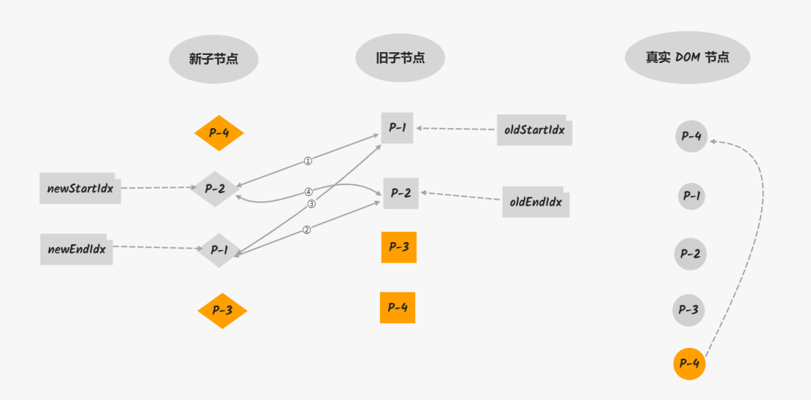

真实 DOM 的顺序相比上一轮没有变化，因为在这一轮的比较重没有对 DOM 节点进行移动，只是对 p-3 节点打补丁。

接下来，我们再根据图中所示的状态执行下一轮的比较：

* 第一步：比较旧的一组子节点中的头部节点 p-1 与新的一组子节点中的头部节点 p-2，看看它们是否相同。由于两者的 key 值不同，不可复用，因此什么都不做。
* 第二步：比较旧的一组子节点中的尾部节点 p-2 与新的一组子节点中的尾部节点 p-1，看看它们是否相同。由于两者的 key 值不同，不可复用，因此什么都不做。
* 第三步：比较旧的一组子节点中的头部节点 p-1 与新的一组子节点中的尾部节点 p-1 。两者的 key 值相同，可以复用。

在第三步的比较中，我们找到了相同的节点，这说明：节点 p-1 原本是头部节点，但在新的顺序中，它变成了尾部节点。因此，我们需要将节点 p-1 对应的真实 DOM 移动到旧的一组子节点的尾部节点 p-2 所对应的真实 DOM 后面，同时还需要更新相应的索引到下一个位置。

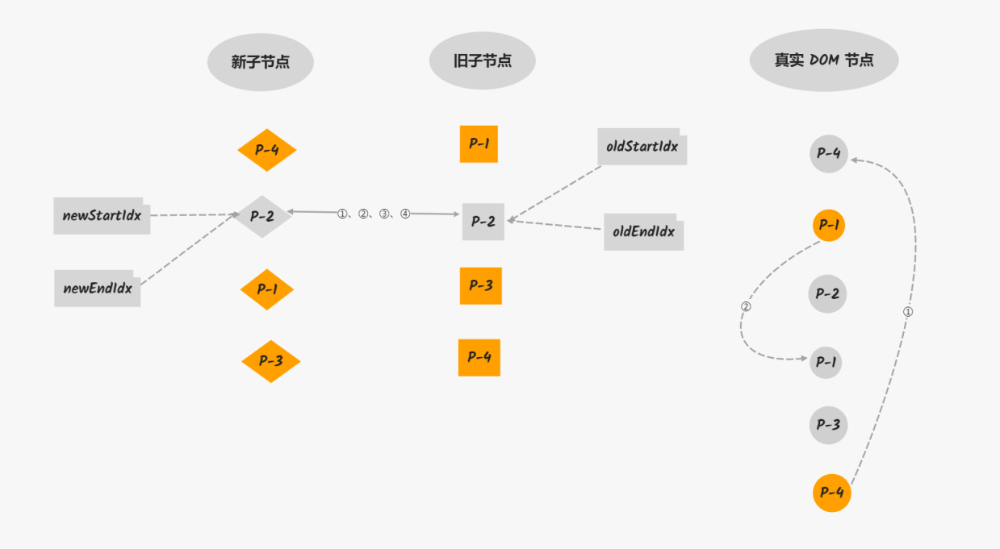

这一步的代码如下：

```js
function patchKeyedChildren (n1, n2, container) {
	// ...

  while (oldStartIdx <= oldEndIdx && newStartIdx <= newEndIdx) {
    if (oldStartVNode.key === newStartVNode.key) {
      // 第一步：oldStartVNode 和 newStartVNode 比较
    } else if (oldEndVNode.key === newEndVNode.key) {
      // 第二步：oldEndVNode 和 newEndVNode 比较

      // 节点在新的顺序中仍然处于尾部，不需要移动，但仍需要打补丁
      patch(oldEndVNode, newEndVNode, container)
      // 更新索引和头尾部的节点变量
      oldEndVNode = oldChildren[--oldEndIdx]
      newEndVNode = newChildren[--newEndIdx]
    } else if (oldStartVNode.key === newEndVNode.key) {
      // 第三步：oldStartVNode 和 newEndVNode 比较

      // 调用 patch 函数在 oldStartVNode 和 newEndVNode 之间打补丁
      patch(oldStartVNode, newEndVNode, container)
      // 将旧的一组子节点的头部节点对应的真实 DOM 节点 oldStartVNode.el 移动到
      // 旧的一组子节点的尾部节点对应的真实 DOM 节点后面
      insert(oldStartVNode.el, container, oldEndVNode.el.nextSibling)
      // 更新索引
      oldStartVNode = oldChildren[++oldStartIdx]
      newEndVNode = newChildren[--newEndIdx]
    } else if (oldEndVNode.key === newStartVNode.key) {
      // 第四步：oldEndVNode 和 newStartVNode 比较

      // 仍然需要调用 patch 函数进行打补丁
      patch(oldEndVNode, newStartVNode, container)
      // 移动 DOM 操作
      // oldEndVNode.el 移动到 oldStartVNode.el 前面
      insert(oldEndVNode.el, container, oldStartVNode.el)
      // 移动 DOM 完成后，更新索引值，并指向下一个位置
      oldEndVNode = oldChildren[--oldEndIdx]
      newStartVNode = newChildren[++newStartIdx]
    }
  }
}
```

如上面的代码所示，如果旧的一组子节点的头部节点与新的一组子节点的尾部节点匹配，则说明该旧节点所对应的真实 DOM 节点需要移动到尾部。因此，我们需要获取当前尾部节点的下一个兄弟节点作为锚点，即 `oldEndVNode.el.nextSibling` 。最后，更新相关索引到下一个位置。

通过上图可以看到，此时，新旧两组子节点的头部索引和尾部索引发生重合，但仍然满足遵循的条件，所以还会进行下一轮的更新。

* 第一步：比较旧的一组子节点的头部节点 p-2 与新的一组子节点中的头部节点 p-2。发现两者 key 值相同，可以复用。但两者在新旧两组子节点中都是头部节点，因此不需要移动，只需要调用 patch 函数进行打补丁即可。

```js
function patchKeyedChildren (n1, n2, container) {
	// ...

  while (oldStartIdx <= oldEndIdx && newStartIdx <= newEndIdx) {
    if (oldStartVNode.key === newStartVNode.key) {
      // 第一步：oldStartVNode 和 newStartVNode 比较

      // 调用 patch 函数在 oldStartVNode 与 newStartVNode 之间打补丁
      patch(oldStartVNode, newStartVNode, container)
      // 更新索引
      oldStartVNode = oldChildren[++oldStartIdx]
      newStartVNode = newChildren[++newStartIdx]
    } else if (oldEndVNode.key === newEndVNode.key) {
      // 第二步：oldEndVNode 和 newEndVNode 比较

      // 节点在新的顺序中仍然处于尾部，不需要移动，但仍需要打补丁
      patch(oldEndVNode, newEndVNode, container)
      // 更新索引和头尾部的节点变量
      oldEndVNode = oldChildren[--oldEndIdx]
      newEndVNode = newChildren[--newEndIdx]
    } else if (oldStartVNode.key === newEndVNode.key) {
      // 第三步：oldStartVNode 和 newEndVNode 比较

      // 调用 patch 函数在 oldStartVNode 和 newEndVNode 之间打补丁
      patch(oldStartVNode, newEndVNode, container)
      // 将旧的一组子节点的头部节点对应的真实 DOM 节点 oldStartVNode.el 移动到
      // 旧的一组子节点的尾部节点对应的真实 DOM 节点后面
      insert(oldStartVNode.el, container, oldEndVNode.el.nextSibling)
      // 更新索引
      oldStartVNode = oldChildren[++oldStartIdx]
      newEndVNode = newChildren[--newEndIdx]
    } else if (oldEndVNode.key === newStartVNode.key) {
      // 第四步：oldEndVNode 和 newStartVNode 比较

      // 仍然需要调用 patch 函数进行打补丁
      patch(oldEndVNode, newStartVNode, container)
      // 移动 DOM 操作
      // oldEndVNode.el 移动到 oldStartVNode.el 前面
      insert(oldEndVNode.el, container, oldStartVNode.el)
      // 移动 DOM 完成后，更新索引值，并指向下一个位置
      oldEndVNode = oldChildren[--oldEndIdx]
      newStartVNode = newChildren[++newStartIdx]
    }
  }
}
```

这一轮更新之后，真实 DOM 节点的顺序与新的一组子节点的顺序已经相同了。另外，更新完成后，索引 `newStartIdx` 和索引 `oldStartIdx` 的值分别大于 `newEndIdx` 和 `oldEndIdx` ，所以循环终止，双端 Diff 算法也执行完毕。

#### 双端比较的优势

理解双端比较的原理之后，我们来看看与简单 Diff 算法相比，双端 Diff 算法具有怎样的优势。我们以下面的例子来看。


当使用简单 Diff 算法对示例进行更新时，会发生两次 DOM 移动。图中给出了新旧两组子节点的节点顺序。

* 遍历新节点
  * 如果找到，对节点进行复用（根据索引值进行对比）
  * 如果找不到，挂载新节点
* 遍历旧节点，寻找旧节点存在，但是新节点不存在的情况，将其卸载


如果使用双端 Diff 算法对这个例子进行更新，会有怎样的表现？接下来，我们以双端比较的思路来完成此例的更新，看一看双端 Diff 算法能否减少 DOM 移动操作次数。

下图出了算法执行之前新旧两组子节点与真实 DOM 节点的状态。

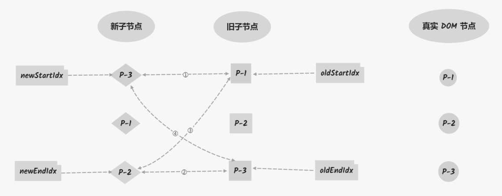

接下来，我们按照双端比较的步骤执行更新：

* 第一步：比较旧的一组子节点中的头部节点 p-1 与新的一组子节点中的头部节点 p-3，两者 key 值不同，不可复用。
* 第二步：比较旧的一组子节点中的尾部节点 p-3 与新的一组子节点中的尾部节点 p-2，两者 key 值不同，不可复用。
* 第三步：比较旧的一组子节点中的头部节点 p-1 与新的一组子节点中的尾部节点 p-2，两者 key 值不同，不可复用。
* 第四步：比较旧的一组子节点中的尾部节点 p-3 与新的一组子节点中的头部节点 p-3，发现可以复用。

可以看到，在第四步的比较中，我们找到了可复用的节点 p-3。该节点原本处于所有子节点的尾部，但在新的一组子节点中它处于头部。因此，只需要让节点 p-3 对应的真实 DOM 变成新的头部节点即可。在这一步操作之后，新旧两组子节点以及真实 DOM 节点的状态如下：

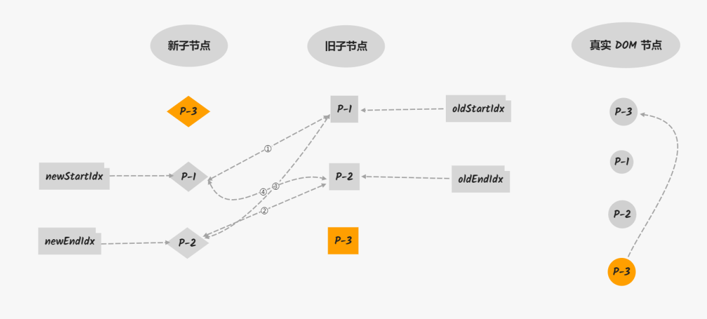

在这一轮比较过后，真实 DOM 节点的顺序已经与新的一组子节点顺序一致了。我们已经完成了更新，不过算法仍然会进行执行。

* 第一步比较旧的一组子节点中的头部节点 p-1 与新的一组子节点中的头部节点 p-1，两者的 key 值相同，可以复用。但由于两者都处于头部，因此不需要移动，只需要打补丁即可。

这一轮比较过后，新旧两组子节点与真实 DOM 节点的状态如下：


此时，双端 Diff 算法仍然没有停止，开始新一轮的比较。

* 第一步：比较旧的一组子节点中的头部节点 p-2 与新的一组子节点中的头部节点 p-2，两种的 key 值相同，可以复用。但由于两者都处于头部，因此不需要移动，只需要打补丁。

在这一轮比较过后，新旧两组子节点与真实 DOM 节点的状态如下：


到这一步后，索引 `newStartIdx` 和 `oldStartIdx` 的值比索引 `newEndIdx` 和 `oldEndIdx` 的值大，于是更新结束。可以看到，对于相同的例子，采用简单 Diff 算法需要两次 DOM 移动操作才能完成更新，而使用双端 Diff 算法只需要一次 DOM 移动操作即可完成更新。

#### 非理想状况的处理方式

上一小节，我们用到了一个比较理想的例子。我们知道，双端 Diff 算法的每一轮比较的过程都分为四个步骤。在上一小节的例子中，每一轮比较都会命中四个步骤中的一个，这是非常理想的情况。但实际上，并非所有情况都这么理想。

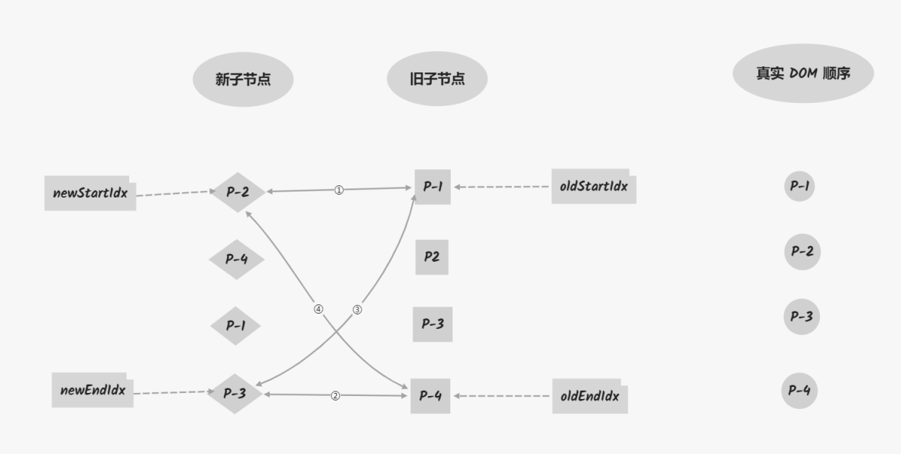

在这个例子中，新旧两组子节点的顺序如下：

* 旧的一组子节点：p-1、p-2、p-3、p-4。
* 新的一组子节点：p-2、p-4、p-1、p-3。

当我们尝试按照双端 Diff 算法的思路进行第一轮比较时，会发现无法命中四个步骤中的任何一步。

* 第一步：比较旧的一组子节点的头部节点 p-1 与新的一组子节点中的头部节点 p-2，不可复用。
* 第二步：比较旧的一组子节点的尾部节点 p-4 与新的一组子节点中的尾部节点 p-3，不可复用。
* 第二步：比较旧的一组子节点的头部节点 p-1 与新的一组子节点中的尾部节点 p-3，不可复用。
* 第二步：比较旧的一组子节点的尾部节点 p-4 与新的一组子节点中的头部节点 p-2，不可复用。

在这四个步骤的比较过程中，都无法找到可复用的节点。这时，我们只能通过增加额外的处理步骤来处理这种非理想情况。既然两个头部和两个尾部的四个节点中都没有可复用的节点，那么我们久长时看看非头部、非尾部的节点能否复用。具体做法是，拿新的一组子节点中的头部节点去旧的一组子节点中寻找。

```js
function patchKeyedChildren (n1, n2, container) {
  const oldChildren = n1.children
  const newChildren = n2.children

  let oldStartIdx = 0
  let oldEndIdx = oldChildren.length - 1
  let newStartIdx = 0
  let newEndIdx = newChildren.length - 1

  let oldStartVNode = oldChildren[oldStartIdx]
  let oldEndVNode = oldChildren[oldEndIdx]
  let newStartVNode = newChildren[newStartIdx]
  let newEndVNode = newChildren[newEndIdx]

  while (oldStartIdx <= oldEndIdx && newStartIdx <= newEndIdx) {
    if (oldStartVNode.key === newStartVNode.key) {
      // 第一步：oldStartVNode 和 newStartVNode 比较
    } else if (oldEndVNode.key === newEndVNode.key) {
      // 第二步：oldEndVNode 和 newEndVNode 比较
    } else if (oldStartVNode.key === newEndVNode.key) {
      // 第三步：oldStartVNode 和 newEndVNode 比较
    } else if (oldEndVNode.key === newStartVNode.key) {
      // 第四步：oldEndVNode 和 newStartVNode 比较
    } else {
      // 乱序比较

      // 遍历旧的一组子节点，寻找与 newStartVNode 拥有相同 key 值的节点
      // idxInOld 就是新的一组子节点的头部节点在旧的一组子节点中的索引
      const idxInOld = oldChildren.findIndex(node => node.key === newStartVNode.key)
    }
  }
}
```

在上面这段代码中，我们遍历旧的一组子节点，尝试在其中寻找与新的一组子节点的头部节点具有相同 key 值的节点，并将该节点在旧的一组子节点中的索引存在到变量 `idxInOld` 中。不过这么做的目的是什么呢？想要搞清楚这个问题，本质上需要我们先搞清楚：在旧的一组子节点中，找到与新的一组子节点中的头部节点具有相同 key 值的节点意味着什么？

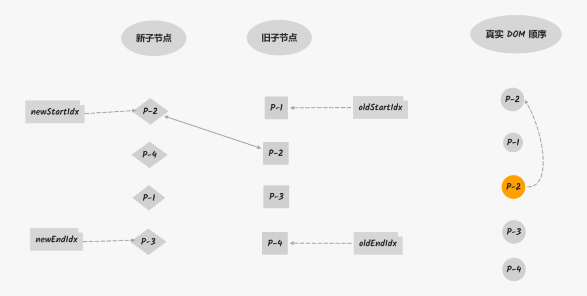

当我们拿新的一组子节点的头部节点 p-2 去旧的一组子节点中查找时，会在索引为 1 的位置找到可复用的节点。这意味着，节点 p-2 原本不是头部节点，但在更新之后，它应该变成头部节点。所以我们需要将节点 p-2 对应的真实 DOM 节点移动到当前旧的一组子节点的头部节点 p-1 所对应的真实 DOM 节点之前。具体实现如下：

```js
function patchKeyedChildren (n1, n2, container) {
  const oldChildren = n1.children
  const newChildren = n2.children

  let oldStartIdx = 0
  let oldEndIdx = oldChildren.length - 1
  let newStartIdx = 0
  let newEndIdx = newChildren.length - 1

  let oldStartVNode = oldChildren[oldStartIdx]
  let oldEndVNode = oldChildren[oldEndIdx]
  let newStartVNode = newChildren[newStartIdx]
  let newEndVNode = newChildren[newEndIdx]

  while (oldStartIdx <= oldEndIdx && newStartIdx <= newEndIdx) {
    if (oldStartVNode.key === newStartVNode.key) {
      // 第一步：oldStartVNode 和 newStartVNode 比较
    } else if (oldEndVNode.key === newEndVNode.key) {
      // 第二步：oldEndVNode 和 newEndVNode 比较
    } else if (oldStartVNode.key === newEndVNode.key) {
      // 第三步：oldStartVNode 和 newEndVNode 比较
    } else if (oldEndVNode.key === newStartVNode.key) {
      // 第四步：oldEndVNode 和 newStartVNode 比较
    } else {
      // 乱序比较

      // 遍历旧的一组子节点，寻找与 newStartVNode 拥有相同 key 值的节点
      // idxInOld 就是新的一组子节点的头部节点在旧的一组子节点中的索引
      const idxInOld = oldChildren.findIndex(node => node.key === newStartVNode.key)
      // idxInOld 大于 0，说明找到了可复用的节点，并且需要将其对应的真实 DOM 移动到头部
      if (idxInOld) {
        // idxInOld 位置对应的 vnode 就是需要移动的节点
        const vnodeToMove = oldChildren[idxInOld]
        // 打补丁操作
        patch(vnodeToMove, newStartVNode, container)
        // 将 vnodeToMove.el 移动到头部节点 oldStartVNode.el 之前，因此使用后者作为锚点
        insert(vnodeToMove.el, container, oldStartVNode.el)
        // 由于位置 idxInOld 处的节点所对应的真实 DOM 已经移动到别处，因此将其设置为 undefined
        oldChildren[idxInOld] = undefined
        // 更新 newStartIdx 到下一个位置
        newStartVNode = newChildren[++newStartIdx]
      }
    }
  }
}
```

在上面这段代码中，首先判断 `idxInOld` 是否大于 0。如果条件成立，则说明找到可复用的节点，然后将该节点对应的真实 DOM 移动到头部。为此，我们先要获取需要移动的节点，这里的 `oldChildren[idxInOld]` 所指向的节点就是需要移动的节点。在移动节点之前，不要忘记调用 patch 函数进行打补丁。接着，调用 insert 函数，并以现在的头部节点对应的真实 DOM 节点 `oldStartVNode.el` 作为锚点参数来完成节点的移动操作。当节点移动完成后，还有两步工作需要做。

* 由于处理 `idxInOld` 处的节点已经处理过（对应的真实 DOM 移动到别处），因此我们应该将 `oldChildren[idxInOld]` 设置为 undefined。
* 新的一组子节点中的头部节点已经处理完毕，因此将 `newStartIdx` 前进到下一个位置。

经过上述两个步骤的操作之后，新旧两组节点以及真实 DOM 节点的状态如下：

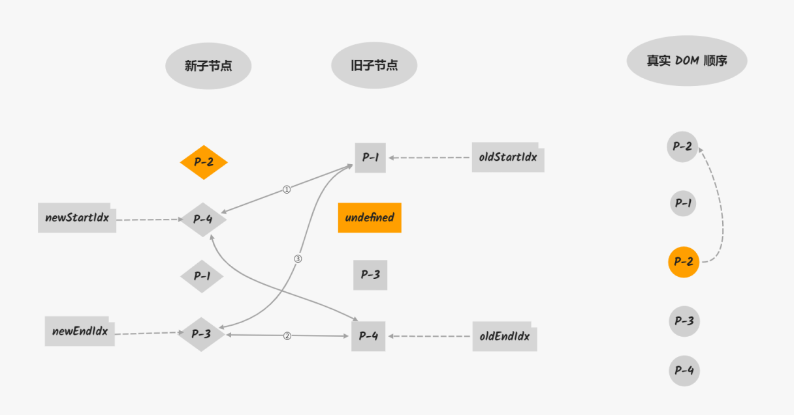

接着，双端 Diff 算法会继续进行。

* 第一步：比较旧的一组子节点中的头部节点 p-1 与新的一组子节点中的头部节点 p-4，两者 key 值不同，不可复用。
* 第二步：比较旧的一组子节点中的尾部节点 p-4 与新的一组子节点中的尾部节点 p-3，两者 key 值不同，不可复用。
* 第三步：比较旧的一组子节点中的头部节点 p-1 与新的一组子节点中的尾部节点 p-3，两者 key 值不同，不可复用。
* 第四步：比较旧的一组子节点中的尾部节点 p-4 与新的一组子节点中的头部节点 p-4，两者 key 值相同，可以复用。

在这一轮的比较中，我们找到了可以复用的节点。因此，按照双端 Diff 算法的逻辑移动真实 DOM，即把 p-4 对应的真实 DOM 移动到旧的一组子节点中头部节点 p-1 所对应的真实 DOM 前面。


此时，真实 DOM 节点的顺序是：p-2、p-4、p-1、p-3。接着，开始下一轮的比较。

* 第一步：比较旧的一组子节点中的头部节点 p-1 与新的一组子节点中的头部节点 p-1，两者 key 值相同，可以复用。

在这一轮比较中，第一步就找到了可复用的节点。由于两者都处于头部，所以不需要对真实 DOM 进行移动，只需要打补丁即可。在这一步操作过后，新旧两组子节点与真实 DOM 节点的状态如下：


此时，真实 DOM 的节点顺序是：p-2、p-4、p-1、p-3。接着，进行下一轮比较。因为此时旧的一组子节点的头部节点是 undefined。这说明该节点已经被处理过，因此我们不需要在处理它，直接跳过即可。为此，我们需要补充这部分代码逻辑。

```js
function patchKeyedChildren (n1, n2, container) {
	// ...

  while (oldStartIdx <= oldEndIdx && newStartIdx <= newEndIdx) {
    // 增加两个判断分支，如果头尾部节点为 undefined，说明该节点已经被处理过，直接跳到下一个位置
    if (!oldStartVNode) {
      oldStartVNode = oldChildren[++oldStartIdx]
    } else if (!oldEndVNode) {
      oldEndVNode = newChildren[--oldEndIdx]
    } else if (oldStartVNode.key === newStartVNode.key) {
      // 第一步：oldStartVNode 和 newStartVNode 比较
    } else if (oldEndVNode.key === newEndVNode.key) {
      // 第二步：oldEndVNode 和 newEndVNode 比较
    } else if (oldStartVNode.key === newEndVNode.key) {
      // 第三步：oldStartVNode 和 newEndVNode 比较
    } else if (oldEndVNode.key === newStartVNode.key) {
      // 第四步：oldEndVNode 和 newStartVNode 比较
    } else {
      // 乱序比较
    }
  }
}
```

在循环开始时，我们优先判断头部节点和尾部节点是否存在。如果不存在，则说明它们已经被处理过，直接跳到下一个位置即可。在这一轮比较过后，新旧两组子节点与真实 DOM 节点的状态如图所示：


现在，四个步骤又重合了，接着进行最后一轮的比较：

* 第一步：比较旧的一组子节点中的头部节点 p-3 与新的一组子节点中的头部节点 p-3，两者 key 值相同，可以复用。

在第一步中找到了可复用的节点。由于两者都是头部节点，因此不需要进行 DOM 移动操作，直接打补丁即可。


这一轮比较过后，最终状态如上图所示。这时，满足循环停止的条件，于是更新完成。最终，真实 DOM 节点的顺序与新的一组子节点的顺序一致，都是：p-2、p-4、p-1、P-3.

#### 添加新元素

我们已经讲解了非理想情况的处理，即在新一轮比较过程中，不会命中四个步骤中的任何一步。这时，我们会拿到新的一组子节点中的头部节点去旧的一组子节点中中寻找可复用的节点，然而并非总能找得到。


在这个例子中，新旧两组子节点的顺序如下：

* 旧的一组子节点：p-1、p-2、p-3
* 新的一组子节点：p-4、p-1、p-3、p-2

首先，我们尝试进行第一轮比较，发现在四个步骤中的比较重都找到不到可复用的节点。于是我们尝试拿新的一组子节点的头部节点 p-4 去旧的一组子节点中寻找具有相同 key 值的节点，但在旧的一组子节点中根本就没有 p-4 节点。

这说明节点 p-4 是一个新增节点，我们应该将它挂载到正确的位置。那么应该挂载到哪里呢？很简单，因为节点 p-4 是新的一组子节点中的头部节点，所以只需要将它挂载到当前头部节点之前即可。“当前” 头部节点指的是，旧的一组子节点中的头部节点所对应的真实 DOM 节点 p-1。


```js
function patchKeyedChildren (n1, n2, container) {
	// ...

  while (oldStartIdx <= oldEndIdx && newStartIdx <= newEndIdx) {
    // 增加两个判断分支，如果头尾部节点为 undefined，说明该节点已经被处理过，直接跳到下一个位置
    if (!oldStartVNode) {
      oldStartVNode = oldChildren[++oldStartIdx]
    } else if (!oldEndVNode) {
      oldEndVNode = newChildren[--oldEndIdx]
    } else if (oldStartVNode.key === newStartVNode.key) {
      // 第一步：oldStartVNode 和 newStartVNode 比较
    } else if (oldEndVNode.key === newEndVNode.key) {
      // 第二步：oldEndVNode 和 newEndVNode 比较
    } else if (oldStartVNode.key === newEndVNode.key) {
      // 第三步：oldStartVNode 和 newEndVNode 比较
    } else if (oldEndVNode.key === newStartVNode.key) {
      // 第四步：oldEndVNode 和 newStartVNode 比较
    } else {
      // 乱序比较

      // 遍历旧的一组子节点，寻找与 newStartVNode 拥有相同 key 值的节点
      // idxInOld 就是新的一组子节点的头部节点在旧的一组子节点中的索引
      const idxInOld = oldChildren.findIndex(node => node.key === newStartVNode.key)

      // idxInOld 大于 0，说明找到了可复用的节点，并且需要将其对应的真实 DOM 移动到头部
      if (idxInOld > 0) {
        // idxInOld 位置对应的 vnode 就是需要移动的节点
        const vnodeToMove = oldChildren[idxInOld]
        // 打补丁操作
        patch(vnodeToMove, newStartVNode, container)
        // 将 vnodeToMove.el 移动到头部节点 oldStartVNode.el 之前，因此使用后者作为锚点
        insert(vnodeToMove.el, container, oldStartVNode.el)
        // 由于位置 idxInOld 处的节点所对应的真实 DOM 已经移动到别处，因此将其设置为 undefined
        oldChildren[idxInOld] = undefined
      } else {
        // 将 newStartVNode 作为新节点挂载到头部，使用当前头部节点 oldStartVNode.el 作为锚点
        patch(null, newStartVNode, container, oldStartVNode.el)
      } 
         
      // 更新 newStartIdx 到下一个位置
      newStartVNode = newChildren[++newStartIdx]
    }
  }
}
```

如上面的代码所示，当条件 `idxInOld > 0` 不成立时，说明 `newStartVNode` 节点是全新的节点。又由于 `newStartVNode` 节点是头部节点，因此我们应该将其作为新的头部节点进行挂载。所以，在调用 patch 函数挂载节点时，我们使用 `oldStartVNode.el` 作为锚点。

当新节点 p-4 挂载完成后，会进行后续的更新，知道全部更新完成为止。但是这样并不完美，我们再来看另外一个例子。

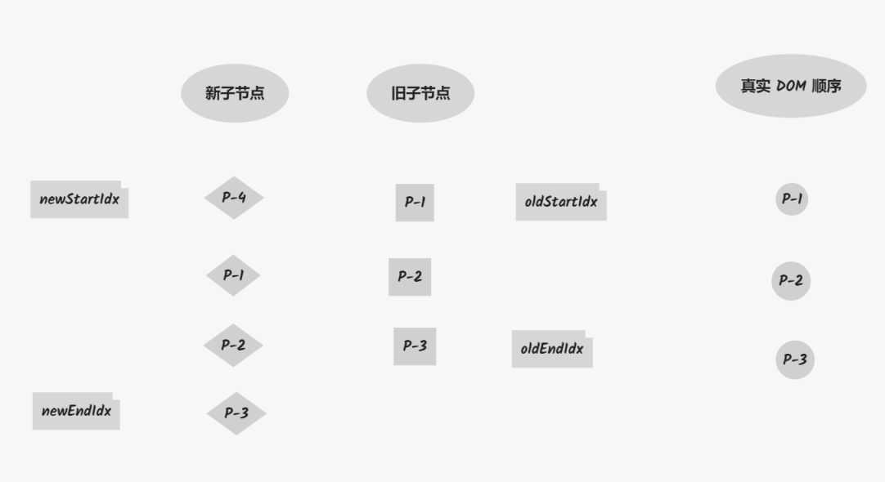

这个例子与上一个例子的不同之处在于，我们调整了新的一组子节点的顺序：p-4、p-1、p-2、p-3 。下面我们按照双端 Diff 算法的思路来执行更新。

* 第一步：比较旧的一组子节点中的头部节点 p-1 与新的一组子节点中的头部节点 p-4，两者 key 值不同，不可以复用。
* 第二步：比较旧的一组子节点中的尾部节点 p-3 与新的一组子节点中的尾部节点 p-3，两者 key 值相同，可以复用。

在第二步找到了可复用的节点，因此进行更新。更新后的新旧两组子节点以及真实 DOM 节点的状态如图所示。

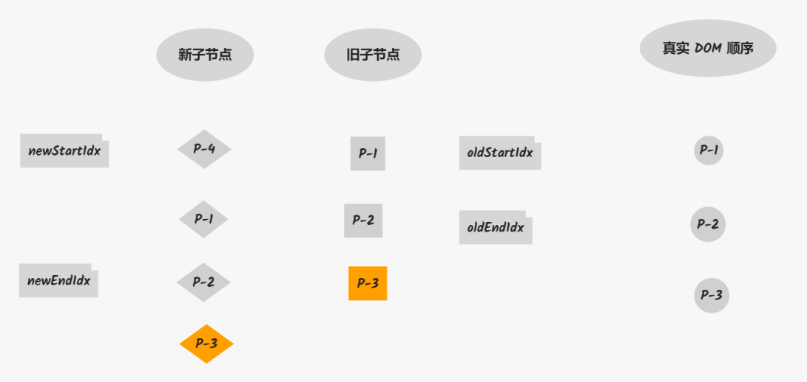

接着进行下一轮的比较。

* 第一步：比较旧的一组子节点中的头部节点 p-1 与新的一组子节点中的头部节点 p-4，两者 key 值不同，不可以复用。
* 第二步：比较旧的一组子节点中的尾部节点 p-2 与新的一组子节点中的尾部节点 p-2，两者 key 值相同，可以复用。

我们在第二步又找到了可以复用的节点，于是再次进行更新。更新后的新旧两个子节点以及真实 DOM 节点的状态如图所示。

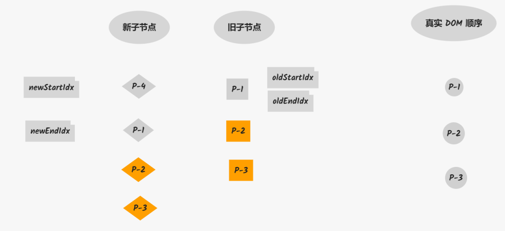

接着，进行下一轮的更新。

* 第一步：比较旧的一组子节点中的头部节点 p-1 与新的一组子节点中的头部节点 p-4，两者 key 值不同，不可以复用。
* 第二步：比较旧的一组子节点中的尾部节点 p-1 与新的一组子节点中的尾部节点 p-1，两者 key 值相同，可以复用。

还是在第二步找到了可复用的节点，再次进行更新。更新后的新旧两组子节点以及真实 DOM 节点的状态如图所示。

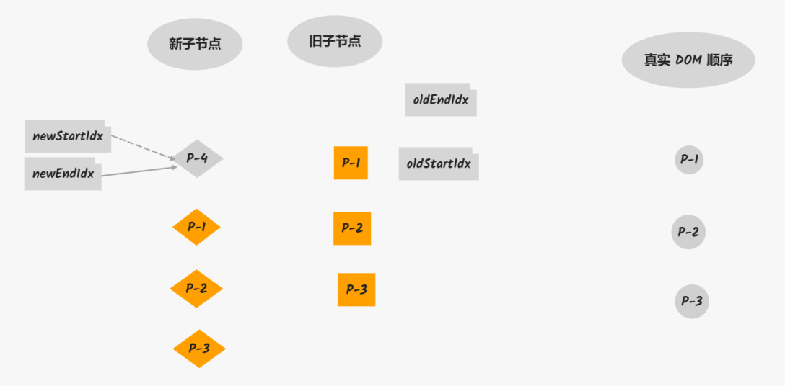

当这一轮更新完毕后，由于变量 `oldStarIdx` 的值大于 `oldEndIdx` 的值，更新停止。但通过观察可知，节点 p-4 在整个更新过程中被遗漏了，这说明我们的算法是有缺陷的。为了弥补这个缺陷，我们需要添加额外的处理代码。

```js
function patchKeyedChildren (n1, n2, container) {
	// ...

  while (oldStartIdx <= oldEndIdx && newStartIdx <= newEndIdx) {
		// ...
  }
  
  // 循环结束检查索引值的情况
  if (oldEndIdx < oldStartIdx && newStartIdx <= newEndIdx) {
    // 如果满足条件，则说明有新的节点遗漏，需要挂载它们
    for (let i = newStartIdx; i <= newEndIdx; i++) {
      patch(null, newChildren[i], container, oldStartVNode.el)
    }
  }
}
```

我们在 while 循环结束后增加了一个 if 条件语句，检查四个索引值的情况。如果条件 `oldEndIdx < oldStartIdx && setStartIdx <= newEndIdx` 成立，说明新的一组子节点中有遗留的节点需要作为新节点挂载。哪些节点是新节点呢？索引值位于 `newStartIdx`  和 `newEndIdx` 这个区间内的都是新节点。于是我们开启一个 for 循环来遍历这个区间内的节点并逐一挂载。挂载时的锚点仍然使用当前的头部节点 `oldStartVNode.el`，这样就完成了对新增元素的处理。

#### 移除不存在的元素

解决了新增节点的问题后，我们再来讨论关于移除元素的情况。


在这个例子中，新旧两组子节点的顺序如下：

* 旧的一组子节点：p-1、p-2、p-3
* 新的一组子节点：p-1、p-3

可以看到，在新的一组子节点中 p-2 节点已经不存在了。为了搞清楚应该如何处理节点被移除的情况，我们还是按照双端 Diff 算法的思路执行更新。 

* 第一步：比较旧的一组子节点的头部节点 p-1 与新的一组子节点中的头部节点 p-1，两者的 key 值相同，可以复用。

在第一步的比较重找到可复用的节点，于是执行更新。在这一轮比较过后，新旧两组子节点以及真实 DOM 节点的状态如下：


接着，执行下一轮更新。

* 第一步：比较旧的一组子节点中的头部节点 p-2 与新的一组子节点中的头部节点 p-3，两者的 key 值不同，不可以复用。
* 第二步：比较旧的一组子节点中的尾部节点 p-3 与新的一组子节点中的尾部节点 p-3，两者的 key 值相同，可以复用。

在第二步找到了可复用的节点，于是进行更新。更新后的新旧两组子节点以及真实 DOM 节点的状态如下：


此时变量 `newStartIdx` 的值大于变量 `newEndIdx` 的值，满足更新停止的条件，于是更新结束。但是观察上图可知，旧的一组子节点中存在未被处理的节点，应该将其移除。因此，我们需要增加额外的代码来处理它。

```js
function patchKeyedChildren (n1, n2, container) {
	// ...

  while (oldStartIdx <= oldEndIdx && newStartIdx <= newEndIdx) {
		// ...
  }
  
  // 循环结束检查索引值的情况
  if (oldEndIdx < oldStartIdx && newStartIdx <= newEndIdx) {
    // 如果满足条件，则说明有新的节点遗漏，需要挂载它们
    for (let i = newStartIdx; i <= newEndIdx; i++) {
      patch(null, newChildren[i], container, oldStartVNode.el)
    }
  } else if (newEndIdx < newStartIdx && oldStartIdx <= oldEndIdx) {
    // 移除操作
    for (let i = oldStartIdx; i <= oldEndIdx; i++) {
      unmount(oldChildren[i])
    }
  }
}
```

与处理新增节点类似，我们在 while 结束后有增加了一个 `else...if` 分支，由于卸载已经不存在的节点。由上图可知，索引值位于 `oldStartIdx` 和 `oldEndIdx` 这个区间内的节点都应该被卸载，于是我们开启一个 for 循环将它们逐一卸载。

#### 总结

本篇文章我们介绍了双端 Diff 算法的原理及其优势。顾名思义，双端 Diff 算法指的是，在新旧两组子节点的四个断点分别进行比较，并试图找到可复用的节点。相比简单 Diff 算法，双端 Diff 算法的优势在于，对于同样的场景，执行的 DOM 移动次数更少。

### 快速 Diff 算法

本篇文章我们将讨论第三种用于比较新旧两组子节点的方式：快速 Diff 算法。该算法的实测速度非常快，最早应用与 `ivi` 和 `inferno` 这两个框架，vue.js 3 借鉴并扩展了它。

关于框架对比可以查看下面这个网站。

* 网站：[https://krausest.github.io/js-framework-benchmark/current.html](https://krausest.github.io/js-framework-benchmark/current.html)。

* github：[https://github.com/krausest/js-framework-benchmark](https://github.com/krausest/js-framework-benchmark)

在 DOM 操作的各个方面，`ivi` 和 `inferno` 所采用的快速 Diff 算法的性能都要优于 vue.js 2 所采用的双端 Diff 算法。既然快速 Diff 算法如此高效，我们就有必要了解它的思路。接下来，我们就着重讨论快速 Diff 算法的实现原理。

#### 相同的前置元素和后置元素

不同于简单 Diff 算法和双端 Diff 算法，快速 Diff 算法包含预处理步骤，这其实是借鉴了纯文本 Diff 算法的思路。在纯文本 Diff 算法中，存在对两段文本进行预处理的过程。例如，在对两段文本进行 Diff 之前，可以先对它进行全等比较。

```js
if (text1 === text2) return
```

这也称为快捷路径。如果两端文本全等，那么就无需进入核心 Diff 算法的步骤了。除此之外，预处理过程还会处理两端文本相同的前缀和后缀。假设有如下两端文本：

```js
TEXT1: I use vue for app development
TEXT2: I use react for app development
```

通过肉眼可以很容易发现，这两段文本的头部和尾部分别一段相同的内容。对于内容相同的问题，是不需要进行核心 Diff 操作的。因此，对于 `TEXT1` 和 `TEXT2` 来说，真正需要进行 Diff 操作的部分是：

```js
TEXT1: vue
TEXT2: react
```

 这实际上是简化问题的一种方式。这么做的好处是，在特定情况下我们能够轻松地判断文本的插入和删除。例如下面这两个字符串：

```js
TEXT1: I like you
TEXT2: I like you too
```

经过预处理，去掉这两段文本相同的前缀内容和后缀内容之后，它将变成：

```js
TEXT1: 
TEXT2: too
```

可以看到，经过预处理，`TEXT1` 的内容为空。这说明 `TEXT2` 在 `TEXT1` 的基础上增加了字符串 too。相反，我们还可以将这两段文本的位置互换：

```js
TEXT1: I like you too
TEXT2: I like you
```

这两端文本降火预处理后讲变成：

```js
TEXT1: too
TEXT2: 
```

由此可知，`TEXT2` 是在 `TEXT1` 的基础上删除了字符串 `too`。

快速 Diff 算法借鉴了纯文本 Diff 算法中预处理的步骤。以下图为例：

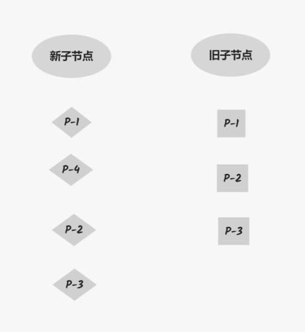

对于相同的前置节点和后置节点，由于它们在新旧两组子节点中的相对位置不变，所以我们无须移动它们，但仍然需要在它们之前打补丁。

对于前置节点，我们可以建议索引 j，其初始值为 0，用来指向两组子节点的开头。

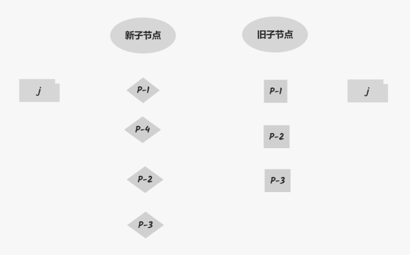

然后开启一个 while 循环，让索引 j 递增，直到遇到不相同的节点为止。

```js
function patchKeyedChildren (n1, n2, container) {
  const newChildren = n2.children
  const oldChildren = n1.children
  
  // 处理相同的前置节点
  // 索引 j 指向新旧两组子节点的开头
  let j = 0
  let oldVNode = oldChildren[j]
  let newVNode = newChildren[j]
  // while 循环向后遍历，直到遇到拥有不同 key 值的节点为止
  while (oldVNode.key === newVNode.key) {
    // 调用 patch 函数进行更新
    patch(oldVNode, newVNode, container)
    // 更新索引 j，让其递增
    j++
    oldVNode = oldChildren[j]
    newVNode = newChildren[j]
  }
}
```

在上面这段代码中，我们使用 while 循环查找所有相同的前置节点，并调用 patch 函数进行打补丁，直到遇到 key 值不同的节点为止。这样，我们就完成了对前置节点的更新。在这一步更新操作后，新旧两组子节点的状态如图所示：

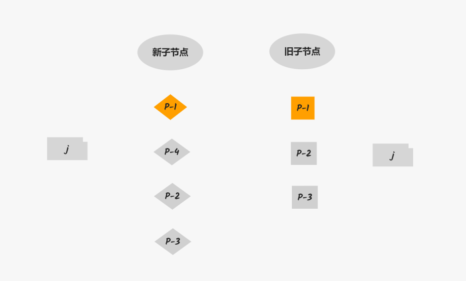

这里需要注意的是，当 while 循环终止时，索引 j 的值为 1。接下来，我们需要处理相同的后置节点。由于两组新旧子节点的数量可能不同，所以我们需要两个索引 `newEnd` 和 `oldEnd`，分别指向新旧两组子节点中的最后一个节点。

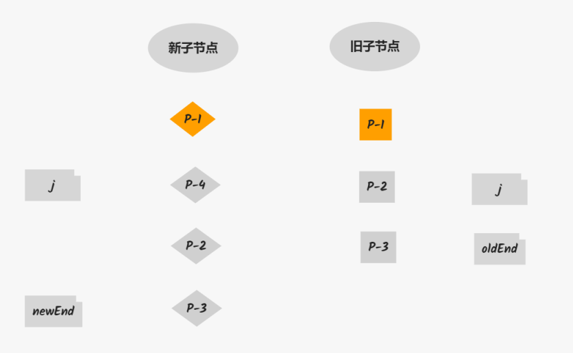

然后，在开启一个 while 循环，并从后向前遍历这两组子节点，知道遇到 key 值不同的节点为止。

```js
function patchKeyedChildren (n1, n2, container) {
  const newChildren = n2.children
  const oldChildren = n1.children
  
  // 更新相同的前置节点
  // 索引 j 指向新旧两组子节点的开头
  let j = 0
  let oldVNode = oldChildren[j]
  let newVNode = newChildren[j]
  // while 循环向后遍历，直到遇到拥有不同 key 值的节点为止
  while (oldVNode.key === newVNode.key) {
    // 调用 patch 函数进行更新
    patch(oldVNode, newVNode, container)
    // 更新索引 j，让其递增
    j++
    oldVNode = oldChildren[j]
    newVNode = newChildren[j]
  }

  // 更新相同的后置节点
  // 索引 oldEnd 指向旧的一组子节点的最后一个节点
  let oldEnd = oldChildren.length - 1
  // 索引 newEnd 指向新的一组子节点的最后一个节点
  let newEnd = newChildren.length - 1

  oldVNode = oldChildren[oldEnd]
  newVNode = newChildren[newEnd]

  // while 循环从后向前遍历，直到遇到拥有不同的 key 值的节点为止
  while (oldVNode.key === newVNode.key) {
    // 调用 patch 函数进行更新
    patch(oldVNode, newVNode, container)
    // 递减 oldEnd 和 newEnd
    oldEnd--
    newEnd--
    oldVNode = oldChildren[oldEnd]
    newVNode = newChildren[newEnd]
  }
}
```

与处理相同的前置节点一样，在 while 循环内，需要调用 patch 函数进行打补丁，然后递减两个索引 `oldEnd`、`newEnd` 的值。在这一步更新操作之后，新旧两组子节点的状态如图所示：


由图可知，当相同的前置节点和后置节点被处理完毕后，旧的一组子节点已经全部被处理了，而在新的一组子节点中，还遗留了一个未被处理的节点 p-4。节点 p-4 是一个新增节点。

* 条件一：`oldEnd < j` 成立，说明在预处理过程中，所有旧节点都处理完毕了；
* 条件二：`newEnd >= j` 成立，说明在预处理过程中，在新的一组子节点中，仍然有未被处理的节点，而这些遗留的节点都被视作新增节点。

我们需要把这些遗留的节点挂载到正确的位置。

在新的一组子节点中，索引值处于 j 和 `newEnd` 之间的任何节点都需要作为新的子节点进行挂载。那么，应该怎样将这些节点挂载到正确位置呢？这就要求我们必须找到正确的锚点元素。观察图中新的一组子节点可知，新增节点应该挂载到节点 `p-2` 所对应的真实 DOM 前面。所以，节点 `p-2` 对应的真实 DOM 节点就是挂载操作的锚点元素。有了这些信息，我们就可以给出具体的代码实现。

```js
function patchKeyedChildren (n1, n2, container) {
  const newChildren = n2.children
  const oldChildren = n1.children
  
  // 更新相同的前置节点
	// ...

  // 更新相同的后置节点
	// ...
  
  // 预处理完毕后，如果满足如下条件，则说明 j --> nextEnd 之间的节点应作为新节点插入
  if (j > oldEnd && j <= newEnd) {
    // 锚点的索引
    const anchorIndex = newEnd + 1
    // 锚点元素
    const anchor = anchorIndex < newChildren.length ? newChildren[anchorIndex].el : null
    // 采用 while 循环，调用 patch 函数逐个挂载新增节点
    while (j <= newEnd) {
      patch(null, newChildren[j++], container, anchor)
    }
  }
}
```

上面的案例展示了新增节点的情况，我们再来看删除节点的情况。


在这个例子中：新旧两组子节点的顺序如下：

* 旧的一组子节点：p-1、p-2、p-3
* 新的一组子节点：p-1、p-3

我们同样使用索引 j、`oldEnd` 和 `newEnd` 进行标记。


接着，对相同的前置节点进行预处理，处理后的状态如图所示：


然后，对相同的后置节点进行预处理，处理后的状态如图所示：


由上图可知，当相同的前置节点和后置节点全部都被处理完毕后，新的一组子节点已经全部被处理完毕了，而旧的一组子节点中遗留了一个节点 p-2。这说明，应该卸载 p-2。实际上，遗留的节点可能有多个。

索引 `j` 和索引 `oldEnd` 之间的任何节点都应该被卸载。

```js
function patchKeyedChildren (n1, n2, container) {
  const newChildren = n2.children
  const oldChildren = n1.children
  
  // 更新相同的前置节点
	// ...

  // 更新相同的后置节点
	// ...

  if (j > oldEnd && j <= newEnd) {
    // 预处理完毕后，如果满足如下条件，则说明 j --> nextEnd 之间的节点应作为新节点插入
    // 锚点的索引
    const anchorIndex = newEnd + 1
    // 锚点元素
    const anchor = anchorIndex < newChildren.length ? newChildren[anchorIndex].el : null
    // 采用 while 循环，调用 patch 函数逐个挂载新增节点
    while (j <= newEnd) {
      patch(null, newChildren[j++], container, anchor)
    }
  } else if (j > newEnd && j <= oldEnd) {
    // j --> oldEnd 之间的节点应该被卸载
    while (j <= oldEnd) {
      unmount(oldChildren[j++])
    }
  }
}
```

在上面这段代码中，我们新增了一个 `else...if` 分支。当满足条件 `j > newEnd && j <= oldEnd` 时，则开启一个 `while` 循环，并调用 `unmount` 函数逐个卸载这些遗留节点。

#### 判断是否需要移动 DOM 

上一节中，我们讲解了快速 Diff 算法的预处理过程，即处理相同的前置节点和后置节点。但是，上一节给出的例子比较理想化，当处理完相同的前置节点或后置节点后，新旧两组子节点中总会有一组子节点全部被处理完毕。在这种情况下，只需要简单地挂载、卸载节点即可。但有时情况会比较复杂。

 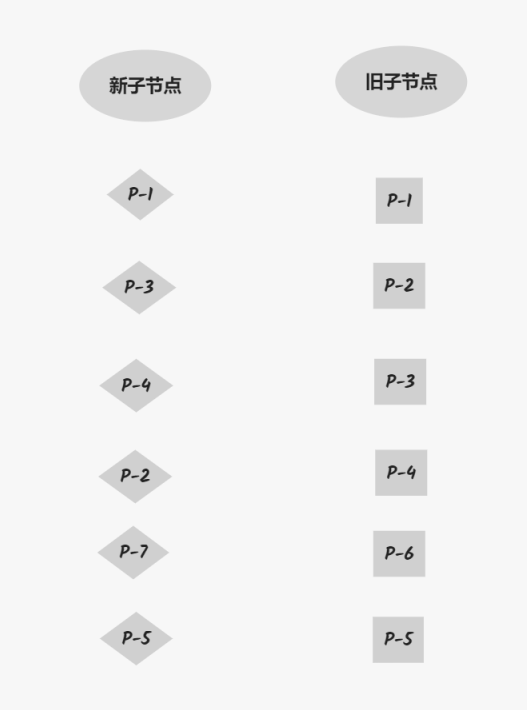

从上图可以看到，与旧的一组子节点相比，新的一组节点多出了一个新节点 p-7，少了一个节点 p-6。这个例子并不向上一节给出的例子那样理想化，我们无法简单地通过与处理过程完成更新。在这个例子中，相同的前置节点只有 p-1，相同的后置节点只有 p-5。

下面是预处理后两组子节点的状态。

 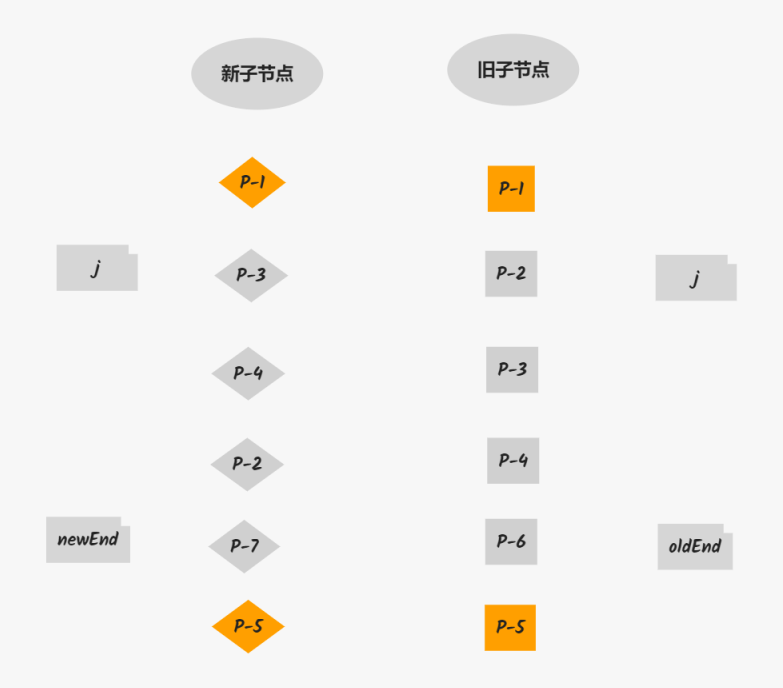

可以看到，经过预处理后，无论是新的一组子节点，还是旧的一组子节点，都有部分节点未经处理。这时就需要我们进一步处理。
无论是简单 Diff 算法，还是双端 Diff 算法，或者这次介绍的快速 Diff 算法，它们都遵循同样的处理规则：

* 判断是否有节点需要移动，以及应该如何移动；
* 找出那些需要被添加或移除的节点。

所以接下来我们的任务就是，判断哪些节点需要移动，以及应该如何移动。观察上图可知，在这种非理想的情况下，当相同的前置节点和后置节点被处理完毕后，索引 j、`newEnd` 和 `oldEnd` 不满足下面两个条件中的任何一个：

* `j > oldEnd && j <= newEnd`
* `j > newEnd && j <= oldEnd`

因此，我们需要增加新的 else 分支来处理图中的情况。

```js
function patchKeyedChildren (n1, n2, container) {
  const newChildren = n2.children
  const oldChildren = n1.children
  
  // 更新相同的前置节点
	// ...

  // 更新相同的后置节点
	// ...
  
  if (j > oldEnd && j <= newEnd) {
		// ...
  } else if (j > newEnd && j <= oldEnd) {
    // ...
  } else {
    // else 分支处理非理想情况
  }
}
```

后续的处理逻辑我们将会编写在这个 else 分支内。我们需要构造一个数组 source，它的长度等于新的一组子节点中在经过预处理之后剩余未处理节点的数量，并且 source 中每个元素的初始值都是 -1。

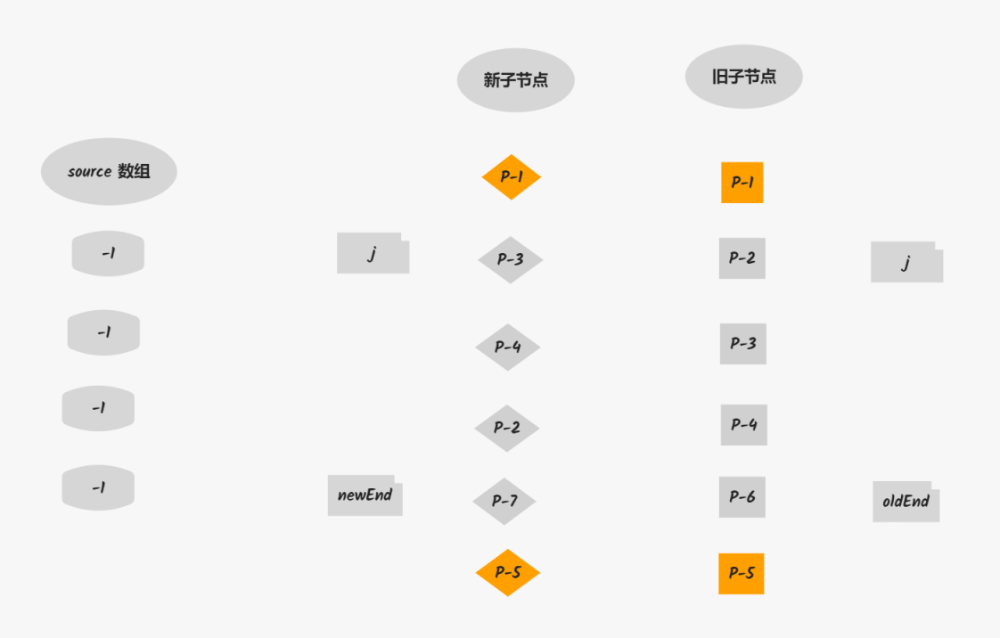

我们可以通过下面的代码完成对 source 数组的改造。

```js
function patchKeyedChildren (n1, n2, container) {
  const newChildren = n2.children
  const oldChildren = n1.children
  
  // 更新相同的前置节点
	// ...

  // 更新相同的后置节点
	// ...
  
  if (j > oldEnd && j <= newEnd) {
		// ...
  } else if (j > newEnd && j <= oldEnd) {
    // ...
  } else {
    // else 分支处理非理想情况
    // 新的一组子节点中剩余未处理节点的数量
    const count = newEnd - j + 1
    const source = new Array(count)
    source.fill(-1)
  }
}
```

如代码所示。首先，我们需要计算新的一组子节点中剩余未处理节点的数量，即 `newEnd - j + 1`，然后创建一个长度与之相同的数组 `source` ，最后使用 `fill` 函数完成数组填充。**数组 source 用来存储新的一组子节点中的节点在旧的一组子节点中的位置索引，后面将会使用它计算出一个最长递增子序列，并用于辅助完成 DOM 移动的操作。**


上图展示了填充数组的过程。由于 source 数组存储的是新子节点在旧的一组子节点中的位置索引，所以：

* 新的一组子节点中的节点 p-3 在旧的一组子节点中的索引为 2，因此 source 数组的第一个元素值为 2；
* 新的一组子节点中的节点 p-4 在旧的一组子节点中的索引为 3，因此 source 数组的第一个元素值为 3；
* 新的一组子节点中的节点 p-2 在旧的一组子节点中的索引为 1，因此 source 数组的第一个元素值为 1;
* 新的一组子节点中的节点 p-7 比较特殊，因为在旧的一组子节点中没有与其 key 值相等的节点，所以 source 数组的第四个元素值保留原来的 -1。

我们可以通过两层 for 循环来完成 source 数组的填充工作，外层循环用于遍历旧的一组节点，内层循环用于遍历新的一组子节点。

```js
function patchKeyedChildren (n1, n2, container) {
  const newChildren = n2.children
  const oldChildren = n1.children
  
  // 更新相同的前置节点
	// ...

  // 更新相同的后置节点
	// ...
  
  if (j > oldEnd && j <= newEnd) {
		// ...
  } else if (j > newEnd && j <= oldEnd) {
    // ...
  } else {
    // else 分支处理非理想情况
    // 新的一组子节点中剩余未处理节点的数量
    const count = newEnd - j + 1
    const source = new Array(count)
    source.fill(-1)

    // oldStart 和 newStart 分别为起始索引，即 j
    const oldStart = j
    const newStart = j
    // 遍历旧的一组子节点
  	for (let i = oldStart; i <= oldEnd; i++) {
      const oldVNode = oldChildren[i]
      // 遍历新的一组子节点
      for (let k = newStart; k <= newEnd; k++) {
        const newVNode = newChildren[k]
        // 找到拥有相同 key 值的可复用节点
        if (oldVNode.key === newVNode.key) {
          // 调用 patch 进行更新
          patch(oldVNode, newVNode, container)
          // 最后填充 source 数组
          source[k - newStart] = i
        }
      }
    }
  }
}
```

这里需要注意的是，由于数组 source 的索引是从 0 开始的，而未处理节点的索引未必从 0 开始，所以在填充数组时需要使用表达式 `k - newStart` 的值作为数组的索引值。外层循环的变量 i 就是当前节点在旧的一组子节点中的位置索引，因此直接将变量 i 的值赋值给 `souce[k - newStart]` 即可。

现在，source 数组已经填充完毕，我们后面会用到它。在进一步讲解前，我们需要思考一下上面那段用于填充 source 数组的代码存在怎样的问题。这段代码中我们采用了两层嵌套的循环，其时间复杂度为 `O(n1 * n2)`，其中 `n1` 和 `n2` 为新旧两组子节点的数量，我们也可以使用 `O(n^2)` 来表示。当新旧两组子节点的数量较多时，两层嵌套的循环就会带来性能问题。出于优化的目的，我们可以为新的一组子节点构建一张索引表，用来存储节点的 key 和节点位置索引之间的映射。

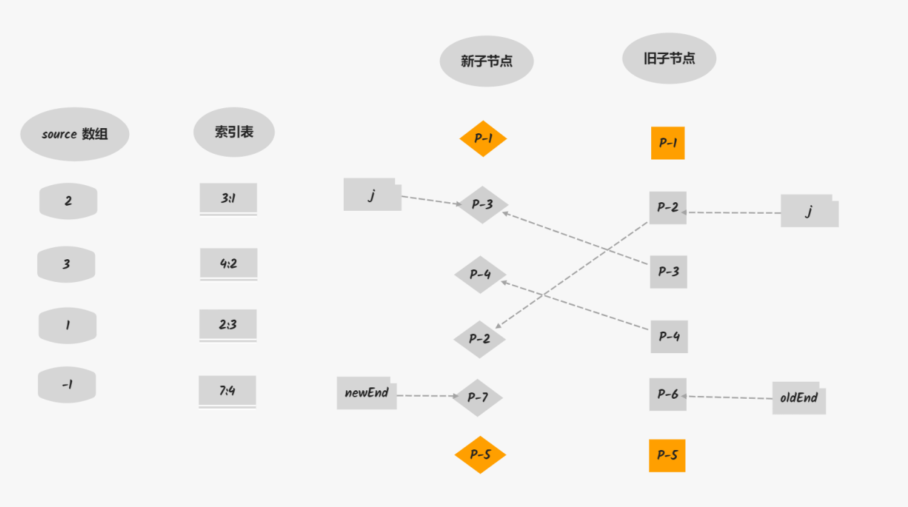

有了索引表，我们就可以利用它快速地填充 source 数组。

```js
function patchKeyedChildren (n1, n2, container) {
  const newChildren = n2.children
  const oldChildren = n1.children
  
  // 更新相同的前置节点
	// ...

  // 更新相同的后置节点
	// ...
  
  if (j > oldEnd && j <= newEnd) {
		// ...
  } else if (j > newEnd && j <= oldEnd) {
    // ...
  } else {
    // else 分支处理非理想情况
    // 新的一组子节点中剩余未处理节点的数量
    const count = newEnd - j + 1
    const source = new Array(count)
    source.fill(-1)
   
    // oldStart 和 newStart 分别为起始索引，即 j
    const oldStart = j
    const newStart = j
    // 构建索引表
    const keyIndx = {}
    for (let i = newStart; i <= newEnd; i++) {
      keyIndx[newChildren[i].key] = i
    }
    // 遍历旧的一组子节点剩余未处理的节点为止
    for (let i = oldStart; i <= oldEnd; i++) {
      const oldVNode = oldChildren[i]

      // 通过索引表快速找到新的一组子节点中具有相同 key 值的节点位置
      const k = keyIndx[oldVNode.key]

      if (typeof k !== 'undefined') {
        newVNode = newChildren[k]
        // 调用 patch 进行更新
        patch(oldVNode, newVNode, container)
        // 最后填充 source 数组
        source[k - newStart] = i
      } else {
        // 没找到
        unmount(oldVNode)
      }
    }
  }
}
```

在上面这段代码中，同样使用了两个 for 循环，不过它们不再是嵌套的关系，所以能够将代码的时间复杂度降至 `O(n)` 。其中，第一个 for 循环用来构建索引表，**索引表存储的是节点的 key 值与节点在新的一组子节点中位置索引之间的映射**，第二个 for 循环用来遍历旧的一组子节点。可以看到，我们拿旧子节点的 key 值去索引表 `keyIndex` 中查找该节点在新的一组子节点中的位置，并将查找结果存储到变量 k 中。如果 k 存在，说明该节点是可复用的，所以我们调用 patch 函数进行打补丁，并填充 source 数组。否则说明该节点已经不存在与新的一组子节点中，这时我们需要调用 unmount 函数卸载它。

上述流程执行完毕后，source 数组已经填充完毕了。接下来我们应该思考的是，如果判断节点是否需要移动。实际上，快速 Diff 算法判断节点是否需要移动的方法与简单 Diff 算法类似。

```js
function patchKeyedChildren (n1, n2, container) {
  const newChildren = n2.children
  const oldChildren = n1.children
  
  // 更新相同的前置节点
	// ...

  // 更新相同的后置节点
	// ...
  
  if (j > oldEnd && j <= newEnd) {
		// ...
  } else if (j > newEnd && j <= oldEnd) {
    // ...
  } else {
    // else 分支处理非理想情况
    // 新的一组子节点中剩余未处理节点的数量
    const count = newEnd - j + 1
    const source = new Array(count)
    source.fill(-1)
    
    // oldStart 和 newStart 分别为起始索引，即 j
    const oldStart = j
    const newStart = j
    // 新增两个变量，moved 和 pos
    let moved = false
    let pos = 0
    // 构建索引表
    const keyIndx = {}
    for (let i = newStart; i <= newEnd; i++) {
      keyIndx[newChildren[i].key] = i
    }
    // 遍历旧的一组子节点剩余未处理的节点为止
    for (let i = oldStart; i <= oldEnd; i++) {
      const oldVNode = oldChildren[i]

      // 通过索引表快速找到新的一组子节点中具有相同 key 值的节点位置
      const k = keyIndx[oldVNode.key]

      if (typeof k !== 'undefined') {
        newVNode = newChildren[k]
        // 调用 patch 进行更新
        patch(oldVNode, newVNode, container)
        // 最后填充 source 数组
        source[k - newStart] = i
        // 判断节点是否需要移动
        if (k < pos) {
          moved = true
        } else {
          pos = k
        }
      } else {
        // 没找到
        unmount(oldVNode)
      }
    }
  }
}
```

我们新增了两个变量 `moved` 和 `pos`。前者的初始值为 false，代表是否需要移动节点，后者的初始值为 0，代表遍历旧的一组子节点中的过程中遇到的最大索引值 k。我们在编写简单 diff 算法时提到，如果在遍历过程中遇到的索引值呈现递增趋势，则说明不需要移动节点，反之则需要。所以在第二个 for 循环内，我们通过比较变量 k 与变量 `pos` 的值来判断是否需要移动节点。

除此之外，我们还需要一个数量标识，代表已经更新过的节点数量。我们知道，已经更新过的节点数量应该小于新的一组子节点中需要更新的节点数量。一旦前者超过后者，则说明有多余的节点，我们应该将它们卸载。

```js
function patchKeyedChildren (n1, n2, container) {
  const newChildren = n2.children
  const oldChildren = n1.children
  
  // 更新相同的前置节点
	// ...

  // 更新相同的后置节点
	// ...
  
  if (j > oldEnd && j <= newEnd) {
		// ...
  } else if (j > newEnd && j <= oldEnd) {
    // ...
  } else {
    // else 分支处理非理想情况
    // 新的一组子节点中剩余未处理节点的数量
    const count = newEnd - j + 1
    const source = new Array(count)
    source.fill(-1)
    
    // oldStart 和 newStart 分别为起始索引，即 j
    const oldStart = j
    const newStart = j
    // 新增两个变量，moved 和 pos
    let moved = false
    let pos = 0
    // 构建索引表
    const keyIndx = {}
    for (let i = newStart; i <= newEnd; i++) {
      keyIndx[newChildren[i].key] = i
    }
    // 新增 patched 变量，代表更新过的节点数量
    let patched = 0
    // 遍历旧的一组子节点剩余未处理的节点为止
    for (let i = oldStart; i <= oldEnd; i++) {
      const oldVNode = oldChildren[i]

      if (patched <= count) {
        // 通过索引表快速找到新的一组子节点中具有相同 key 值的节点位置
        const k = keyIndx[oldVNode.key]

        if (typeof k !== 'undefined') {
          newVNode = newChildren[k]
          // 调用 patch 进行更新
          patch(oldVNode, newVNode, container)
          // 每更新一个节点，将 patched 变量 +1
          patched++
          // 最后填充 source 数组
          source[k - newStart] = i
          // 判断节点是否需要移动
          if (k < pos) {
            moved = true
          } else {
            pos = k
          }
        } else {
          // 没找到
          unmount(oldVNode)
        }
      } else {
        // 如果更新过的节点数量大于需要更新的节点数量，卸载多余的节点
        unmount(oldVNode)
      }
    }
  }
}
```

这上面这段代码中，我们增加了 `patched` 变量，其初始值为 0，代表更新过的节点数量。接着，在第二个 for 循环中增加了判断 `patched < count`，如果此条件成立，则正常执行更新，并且每次更新后都让变量 `patched` 自增；否则说明剩余的节点都是多余的，于是调用 `unmount` 函数将它们卸载。

现在，我们通过判断变量 `moved` 的值，已经能够知道是否需要移动节点，同时也处理了很多边界条件。接下来我们讨论如何移动节点。

#### 如何移动元素

我们已经实现了两个目标：

* 判断是否需要进行 DOM 移动操作。我们创建了变量 moved 作为标识，当它的值为 true 时，说明需要进行 DOM 移动操作。
* 构建 source 数组。该数组的长度等于新的的一组子节点去掉相同的前置/后置节点后，升序未处理节点的数量。source 数组中存在这新的一组子节点中的节点在旧的一组子节点中的位置。后面，我们会根据 source 数组计算出一个最长递增子序列，用于 DOM 移动操作。

接下来，我们讨论如何进行 DOM 移动操作。

```js
function patchKeyedChildren (n1, n2, container) {
  const newChildren = n2.children
  const oldChildren = n1.children
  
  // 更新相同的前置节点
	// ...

  // 更新相同的后置节点
	// ...
  
  if (j > oldEnd && j <= newEnd) {
		// ...
  } else if (j > newEnd && j <= oldEnd) {
    // ...
  } else {
    // ...
    
    if (moved) {
      // 如果 moved 为真，需要进行 DOM 移动操作
    }
  }
}
```

我们在 for 循环后增加了一个 if 判断分支。如果变量 moved 的值为 true，则说明需要进行 DOM 移动操作，所以用于 DOM 移动操作的逻辑将编写在该 if 语句块内。

为了进行 DOM 移动操作，我们首先要根据 source 数组计算出它的最长递增子序列。source 数组仍然取用之前的例子。


这个例子中，我们计算出 source 数组为 `[2, 3, 1, -1]`。那么，该数组的最长递增子序列是什么呢？

**简单来说，给定一个数值序列，找到它的一个子序列，并且该子序列中的值是递增的，子序列中的元素在元序列中不一定连续。一个序列可能有多个递增子序列，其中最长的哪一个就称为最长递增子序列。**

举个例子，假设给定数值序列 `[0, 8, 4, 12]`，那么它的最长递增子序列就是 `[0, 8, 12]`。当然，对于同一个数值序列来说，它的最长递增子序列可能有多个，例如 `[0, 4, 12]` 也是答案之一。

理解什么是最长递增子序列后，接下来我们就可以求解 source 数组的最长递增子序列。

```js
if (moved) {
  // 如果 moved 为真，需要进行 DOM 移动操作
  // 计算最长递增子序列
  const seq = lis(source) // [0, 1]
}
```

在这段代码中，我们使用 `lis` 函数计算一个数组的最长递增子序列。`lis` 函数接收 `source` 数组作为参数，并返回 `source` 数组的最长递增子序列。

> `lis` 函数返回结果是最长递增子序列中的元素在 `source` 数组中的位置索引。

因为 `source` 数组的最长递增子序列是 `[2, 3]`，其中元素 2 在该数组中的索引为 0，而数组 3 在该数组中的索引为 1，所以最终结果为 `[0, 1]`。

有了最长递增子序列的索引信息后，下一步要重新对节点进行编号。

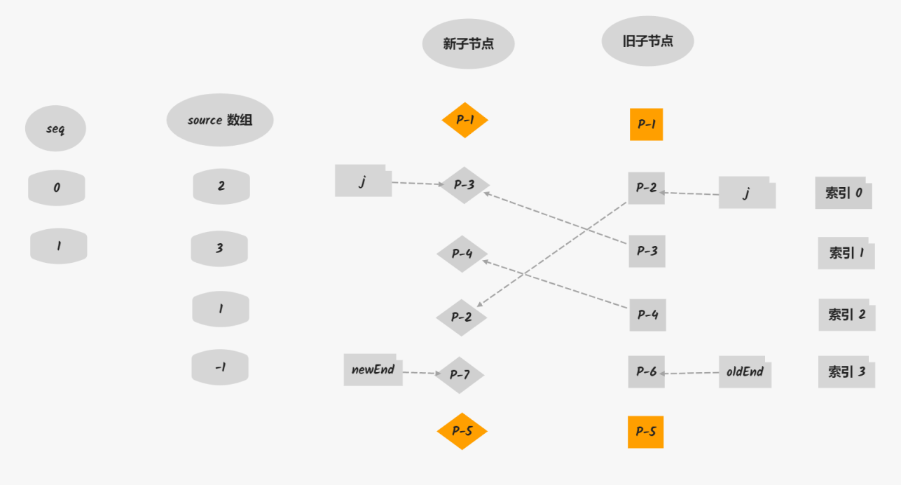

观察上图，在编号时，我们忽略了经过预处理的节点 `p-1` 和 `p-5`。所以，索引为 0 的节点是 `p-2`，而索引为 1 的节点时 `p-3`。重新编号是为了让子序列 `seq` 与新的索引值产生对应关系。以上例来说，子序列 `seq` 的值为 `[0, 1]` ，它的含义是：**在新的一组子节点中，重新编号后索引值为 0 和 1 的这两个节点在更新前后顺序没有发生变化。**换句话说，重新编号后，索引值为 0 和 1 的节点不需要移动。在新的一组子节点中，节点 `p-3` 索引为 0，节点 `p-4` 的索引为 1，所以节点 `p-3` 和 `p-4` 所对应的真实 DOM 不需要移动。只有 `p-2` 和 `p-7` 可能需要移动。

为了完成节点移动，我们还需要创建两个索引值 i 和 s。

* 用索引 i 指向新的一组子节点中的最后一个节点；
* 用索引 s 指向最长递增子序列中的最后一个元素。

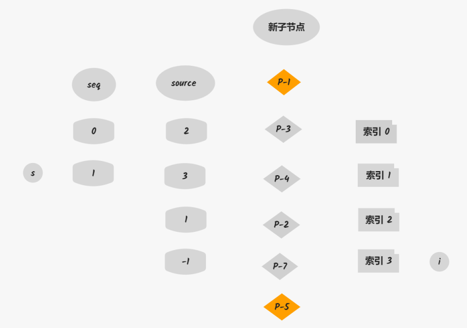

为了简化图示，我们去掉了旧的一组子节点以及无关的线条和变量。

```js
if (moved) {
  // 如果 moved 为真，需要进行 DOM 移动操作
  // 计算最长递增子序列
  const seq = lis(source) // [0, 1]

  // s 指向最长递增子序列的最后一个元素
  let s = seq.length - 1
  // i 指向新的一组子节点中的最后一个元素
  let i = count - 1
  // for 循环使 i 递减
  for (i; i >= 0; i--) {
    if (i != seq[s]) {
      // 如果节点的索引 i 不等于 seq[s] 的值，说明该节点需要移动
    } else {
      // i === seq[s] 时，说明该位置的节点不需要移动
      // 只需要让 s 指向下一个位置
      s--
    }
  }
}
```

其中，for 循环从后向前遍历，可以逐个访问新的一组子节点中的节点，这里的变量 i 就是节点的索引。在 `for` 循环内，判断条件 `i !== seq[s]`，如果节点的索引 i 不等于 `seq[s]` 的值，则说明该节点对应的真实 DOM 需要移动，否则说明当前访问的节点不需要移动，这时需要递减 s。

接下来我们就按照上述思路执行更新。初始时索引指向节点 p-7。由于 p-7 对应的 source 数组中相同位置的元素值为 -1，所以我们应该将节点 p-7 作为全新的节点进行挂载。

```js
// oldStart 和 newStart 分别为起始索引，即 j
const oldStart = j
const newStart = j

if (moved) {
  // 如果 moved 为真，需要进行 DOM 移动操作
  // 计算最长递增子序列
  const seq = lis(source) // [0, 1]

  // s 指向最长递增子序列的最后一个元素
  let s = seq.length - 1
  // i 指向新的一组子节点中的最后一个元素
  let i = count - 1
  // for 循环使 i 递减
  for (i; i >= 0; i--) {
    if (source[i] === -1) {
      // 说明索引为 i 的节点是全新的节点，执行挂载操作
      // 该节点在新 children 中的真实位置索引
      const pos = i + newStart
      const newVNode = newChildren[pos]
      // 该节点的下一个节点的位置索引
      const nextPos = pos + 1
      // 锚点
      const anchor = nextPos < newChildren.length
        ? newChildren[nextPos].el
        : null
      // 挂载
      patch(null, newVNode, container, anchor)
    } else if (i !== seq[s]) {
      // 如果节点的索引 i 不等于 seq[s] 的值，说明该节点需要移动
    } else {
      // i === seq[s] 时，说明该位置的节点不需要移动
      // 只需要让 s 指向下一个位置
      s--
    }
  }
}
```

如果 `source[i]` 的值为 -1，则说明索引为 i 的节点是全新的节点，于是我们调用 patch 将其挂载到容器中。这里需要注意的是，由于索引 i 是重新编号后的，因此为了得到真实索引值，我们需要计算表达式 `i + newStart` 的值。

新节点创建完毕后，for 循环已经执行一次，此时索引 i 向上移动一步，指向节点 p-2。

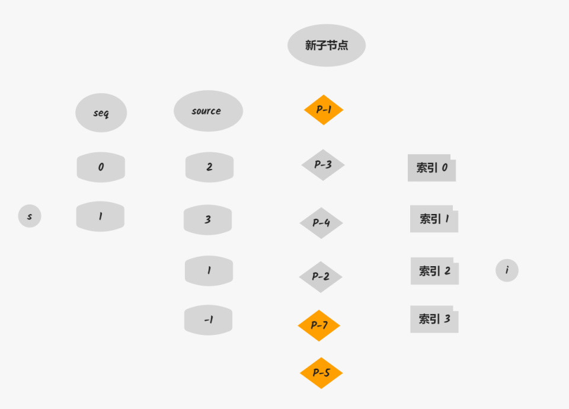

接着，进行下一轮 for 循环。

* 第一步：判断 `source[i]` 是否等于 `-1` ？很明显，此时索引 i 的值为 2，`source[i]` 的值等于 1，因此节点 p-2 不是全新的节点，不需要挂载它，进行下一步的判断。
* 第二步：判断 `i !== seq[s]`  是否成立 ？此时索引 i 的值 为 2，索引 s 的值为 1。` 2 != seq[1]` ，因此节点 p-2 所对应的真实 DOM 需要移动。

第二步中，我们知道节点 p-2 所对应的真实 DOM 需要移动。

```js
if (moved) {
    // 如果 moved 为真，需要进行 DOM 移动操作
    // 计算最长递增子序列
    const seq = lis(source) // [0, 1]

    // s 指向最长递增子序列的最后一个元素
    let s = seq.length - 1
    // i 指向新的一组子节点中的最后一个元素
    let i = count - 1
    // for 循环使 i 递减
    for (i; i >= 0; i--) {
      if (source[i] === -1) {
        // 说明索引为 i 的节点是全新的节点，执行挂载操作
        // 该节点在新的一组子节点中的真实位置索引
        const pos = i + newStart
        const newVNode = newChildren[pos]
        // 该节点的下一个节点的位置索引
        const nextPos = pos + 1
        // 锚点
        const anchor = nextPos < newChildren.length
          ? newChildren[nextPos].el
          : null
        // 挂载
        patch(null, newVNode, container, anchor)
      } else if (i !== seq[s]) {
        // 如果节点的索引 i 不等于 seq[s] 的值，说明该节点需要移动
        // 该节点在新的一组子节点中的真实位置索引
        const pos = i + newStart
        const newVNode = newChildren[pos]
        // 该节点的下一个节点的位置索引
        const nextPos = pos + 1
        // 锚点
        const anchor = nextPos < newChildren.length
          ? newChildren[nextPos].el
          : null
        // 挂载
        insert(newVNode.el, container, anchor)
      } else {
        // i === seq[s] 时，说明该位置的节点不需要移动
        // 只需要让 s 指向下一个位置
        s--
      }
    }
  }
```

移动节点的实现思路类似于挂载全新的节点。不同点在于，移动节点是通过 `insert` 函数来完成的。

接着进行下一轮的循环。此时索引 i 指向节点 p-4。


更新过程仍然分为三个步骤。

* 第一步：判断表达式 `source[i]` 的值是否等于 -1 ? 很明显，此时索引 i 的值为 1，表达式 `source[1]` 的值为 3，条件不成立。所以，节点 p-4 不是全新节点，不需要挂载。
* 第二步：判断表达式 `i !== seq[s]` 是否成立？此时索引 i 的值为 1，索引 s 的值为 1，条件不成立。
* 第三步：由于第一步和第二步中的条件都不成立，所以代码会执行最重的 else 分支。这意味着，节点 p-4 所对应的真实 DOM 不需要移动，但我们仍然需要让索引 s 的值递减，即 `s--`。

节点 p-4 不需要移动，进行下一轮循环。

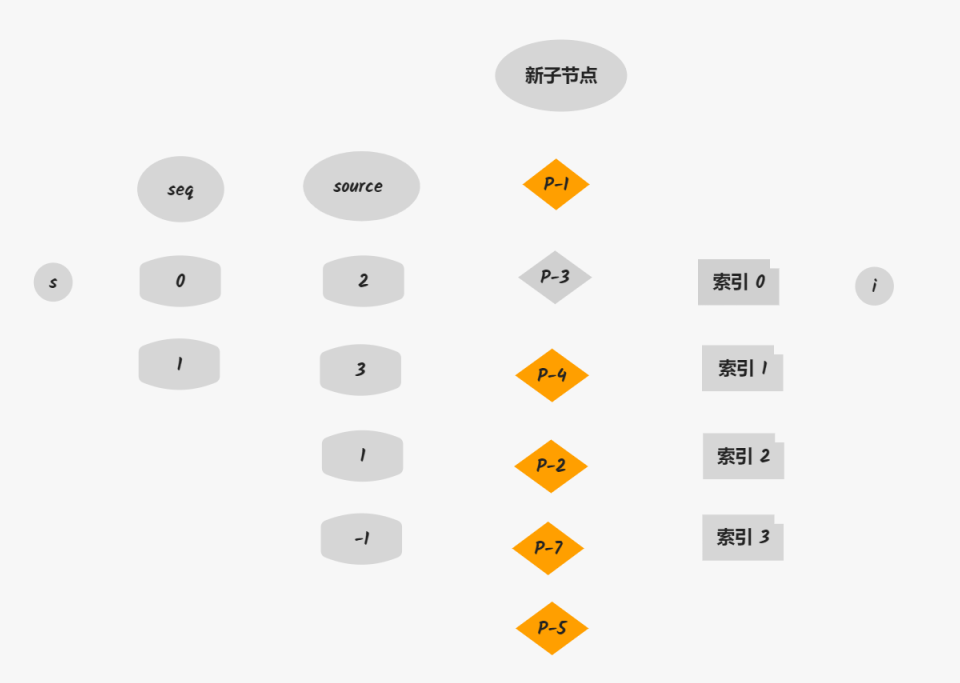

由上图可知，此时索引 i 指向节点 p-3。我们继续进行三个步骤的判断。

* 第一步：判断表达式 `source[i]` 的值是否等于 -1 ? 很明显，此时索引 i 的值为 0，表达式 `source[1]` 的值为 2，条件不成立。所以，节点 p-3 不是全新节点，不需要挂载。
* 第二步：判断表达式 `i !== seq[s]` 是否成立？此时索引 i 的值为 0，索引 s 的值为 1\0，条件不成立。
* 第三步：到了这里，这意味着节点 p-3 所对应的真实 DOM 也不需要移动。在这一轮更新完成之后，循环将会终止，更新完成。

以下是 Vue.js 3 求解给定序列的最长递增子序列的代码。

```js
// https://github.com/yw0525/core/blob/main/packages/runtime-core/src/renderer.ts
// https://en.wikipedia.org/wiki/Longest_increasing_subsequence
function getSequence(arr: number[]): number[] {
  const p = arr.slice()
  const result = [0]
  let i, j, u, v, c
  const len = arr.length
  for (i = 0; i < len; i++) {
    const arrI = arr[i]
    if (arrI !== 0) {
      j = result[result.length - 1]
      if (arr[j] < arrI) {
        p[i] = j
        result.push(i)
        continue
      }
      u = 0
      v = result.length - 1
      while (u < v) {
        c = (u + v) >> 1
        if (arr[result[c]] < arrI) {
          u = c + 1
        } else {
          v = c
        }
      }
      if (arrI < arr[result[u]]) {
        if (u > 0) {
          p[i] = result[u - 1]
        }
        result[u] = i
      }
    }
  }
  u = result.length
  v = result[u - 1]
  while (u-- > 0) {
    result[u] = v
    v = p[v]
  }
  return result
}
```

#### 总结

快速 Diff 算法在实测中性能最优。它借鉴了文本 Diff 的预处理思路，先处理新旧两组子节点中相同的前置节点和相同的后置节点。当前置节点和后置节点全部处理完毕后，如果无法简单地通过挂载新节点或者卸载已经不存在的节点来完成更新，则需要根据节点的索引关系，构造出一个最长递增子序列。最长递增子序列所指向的节点即为不需要移动的节点。

如果你想调试本节案例，可以查看 notes 仓库中
