# 浏览器工作原理与实践

## JavaScript 执行机制

### 变量提升

首先来看一段代码，你觉得这段代码会输出什么结果？

```js
showName()
console.log(myname)
var myname = 'heora'
function showName() {
  console.log('函数showName被执行')
}
```

来看一下实际结果：

```
函数showName被执行
undefined
```

如果我们移除 `myname` 定义，会发生什么？

```js
showName()
console.log(myname)
function showName() {
  console.log('函数showName被执行')
}
```

执行这段代码时，JavaScript 引擎就会报错:

```
ReferenceError: myname is not defined
```

从上面两段代码的执行结果来看，我们可以得出三个结论：

* 执行过程中，若使用未定义变量，那么 JavaScript 执行会报错；
* 在一个变量定义之前使用它，不会报错，但是该变量的值为 undefined，而不是定义的值；
* 在一个函数定义之前使用它，不会报错，函数可以正常执行。

你可能会对第二个和第三个结论感到迷惑。

* 变量和函数为什么能够在其定义之前使用？

* 同样的方式，为什么变量和函数的处理结果不同？

  提前使用的 `showName` 函数可以正常执行，但是提前使用的 `myname` 变量却是 `undefined`。

#### 变量提升（Hoisting）

要解释这两个问题，就需要先了解什么是变量提升。

介绍变量提升之前，我们先通过下面这段代码，来看下什么是 JavaScript 的声明和赋值。

```js
var myname = 'heora'
```

这段代码可以被分解为两行代码：

```js
var myname			 // 声明
myname = 'heora' // 赋值
```

如下图所示：


上面是函数变量的声明和赋值，接下来我们再来看函数的声明和赋值。

```js
function foo() {
  console.log('foo')
}

var bar = function() {
  console.log('bar')
}
```

第一个函数是一个完整的函数声明，没有涉及到赋值操作；第二个函数事先声明变量 bar，然后再赋值函数。


理解声明和赋值操作之后，接下来我们就可以聊聊什么是变量提升了。

**所谓的变量提升，就是指在 JavaScript 代码执行过程中，JavaScript 引擎会把变量的声明部分和函数的生命分布提升到代码开头的 ”行为“。变量被提升后，会给变量设置默认值，默认值为 undefined**

下面我们来模拟实现：

```js
// 源代码

showName()
console.log(myname)
var myname = 'heora'
function showName() {
  console.log('函数showName被执行')
}
```

```js
// 模拟实现代码

// 变量提升部分
var myname = undefined
function showName() {
	console.log('函数showName被执行')
}

// 可执行代码部分
showName()
console.log(myname)
myname = 'heora'
```

我们主要对原来的代码做了两处调整：

* 第一处是把声明部分都提升到代码开头，如变量 `myname` 和函数 `showName`，并给变量设置默认值 undefined；
* 第二处是移除原本的声明和函数，如 `var myname = 'heora'`，移除了 var 声明和 `showName` 的函数声明。

通过这段模拟的变量提升代码，相信你已经明白在定义之前使用变量或函数的原因 -    **函数和变量在执行之前都提升到代码开头**。

#### JavaScript 代码的执行流程

从字面意义来看，”变量提升“ 意味着变量和函数的声明会在物理层面移动到代码的最前面，正如我们所模拟的那样。但是，这并不准确。

**实际上变量和声明在代码里的位置是不会改变的，只是在编译阶段被 JavaScript 引擎放入到内存中** 。一段 JavaScript 代码在执行之前需要被 JavaScript 引擎编译，编译完成之后，才会进入执行阶段。


##### 编译阶段

那么编译阶段和变量提升存在什么关系呢？

为了搞清楚这个问题，我们还是回过头来看上面那段模拟变量提升的代码。我们可以把这段代码分成两部分。

**1. 变量提升部分的代码**

```js
var myname = undefined
function showName() {
	console.log('函数showName被执行');
}
```

**2. 执行部分的代码**

```js
showName()
console.log(myname)
myname = 'heora'
```

我们可以把 JavaScript 的执行流程细化。


从图中可以看出，输入一段代码，经过编译后，会生成两部分内容：执行上下文（Execution context）和可执行代码。

执行上下文是 JavaScript 执行一段代码时的运行环境，比如调用一个函数，就会进入这个函数的执行上下文，确定该函数在执行期间用到的诸如 this、变量、对象以及函数等。

关于执行上下文的细节，我们后面再做详细介绍，现在你只需知道，在执行上下文中存在一个变量环境的对象（`Viriable Environment`），该对象保存了变量提升的内容，比如上面代码中的变量 `myname` 和函数 `showName`，都保存在该对象中。

你可以简单地把变量环境对象看成是如下结构：

```js
VariableEnvironment:
     myname -> undefined, 
     showName ->function : {console.log(myname)
```

了解完变量环境对象的结构后，接下来，我们再结合下面这段代码来分析如何生成变量环境对象。

```js
showName()
console.log(myname)
var myname = 'heora'
function showName() {
  console.log('函数showName被执行')
}
```

我们可以一行行分析上述代码：

* 第 1 行和第 2 行，由于这两行代码不是申明操作，所以 JavaScript 引擎不会做任何处理；
* 第 3 行，由于这行是讲过 var 声明的，因此 JavaScript 引擎将在环境对象中创建一个名为 `myname` 的属性，并使用 undefined 对其初始化；
* 第 4 行，JavaScript 引擎发现一个通过 function 定义的函数，所以它将函数定义存储到堆（Heap）中，并在环境对象中创建一个 `showName` 的属性，然后将该属性值指向堆中函数的位置。

这样就生成了变量环境对象。接下来 JavaScript 引擎会把声明以外的代码编译为字节码。字节码细节我们后面再详细介绍，你可以类比如下的模拟代码：

```js
showName()
console.log(myname)
myname = 'heora'
```

##### 执行阶段

JavaScript 引擎开始执行 ”可执行代码“，按照顺序一行一行地执行。

* 当执行到 `showName` 函数时，JavaScript  引擎便开始在变量环境对象中查找该函数，由于变量环境对象中存在该函数的引用，所以 JavaScript 引擎便开始执行该函数，并输出 ”函数 `showName` 被执行“ 结果。
* 接下来打印 ”`myname`“ 信息，JavaScript 引擎继续在变量环境对象中查找该对象，由于变量环境存在 `myname` 变量，并且其值为 undefined，所以这时候就输出 undefined。
* 接下来执行第 3 行，把 ”`heora`“ 赋给 `myname` 变量，赋值后变量环境中的 `myname` 属性值改变为 ”`heora`"，变量环境如下所示：

```js
VariableEnvironment:
     myname -> "heora", 
     showName ->function : {console.log(myname)
```

以上就是一段代码的编译和执行流程。实际上，编译阶段和执行阶段都是非常复杂的，包括词法分析、语法解析、代码优化、代码生成等。

#### 代码中相同变量或者函数

现在你已经知道，在执行一段 JavaScript 代码之前，会变编译代码，并将代码中的函数和变量保存到执行上下文的变量环境中，那么如果代码中出现重名的函数或者变量，JavaScript 引擎会如何处理？

我们来看下这样一段代码：

```js
function showName() {
  console.log('heora')
}
showName()
function showName() {
  console.log('yueluo')
}
showName()
```

在上面代码中，我们先定义了一个 `showName` 的函数，该函数打印出来 “`heora`”；然后调用 `showName`，并定义了一个 `showName` 函数，该函数打印出 “`yueluo`” ；最后接着调用 `showName`。那么你能分析出这两次调用打印出来的值什么吗？

下面我们来分析其完成流程：

* 首先是编译阶段。遇到第一个 `showName` 函数，会将该函数体存放到变量环境中。接下来是第二个 `showName` 函数，继续存放至变量环境中，但是变量环境中已经存在一个 `showName` 函数。此时，第二个 `showName` 函数会将第一个 `showName` 函数覆盖掉。这样变量环境中就只存在第二个 `showName` 函数。
* 接下来是执行阶段。先执行第一个 `showName` 函数，但由于是从变量环境中查找 `showName` 函数，而变量环境中只保存了第二个 `showName` 函数，所以最终调用的是第二个函数，打印的内容是 “`yueluo`”。第二次执行 `showName` 函数也是走同样的流程，所以输出的结果也是 “`yueluo`”。

综上所述，一段代码如果定义了两个不相同名字的函数，那么最终生效的是最后一个函数。

#### 总结

* JavaScript 代码执行过程中，需要先做变量提升，而之所以需要实现变量提升，因为 JavaScript 代码再在执行之前需要先编译；
* 在编译阶段，变量和函数会被存放到变量环境中，变量的默认值会被设置为 undefined；在代码执行阶段，JavaScript 引擎会从变量环境中去查找自定义的变量和函数。
* 如果在编译阶段，存在两个相同的函数，那么最终存放在变量环境中的是最后定义的那个，后定义的会覆盖掉之前定义的。

学习这些内容并不是为了掌握 JavaScript 小技巧，主要目的是为了搞清楚 JavaScript 的执行机制：**先编译，再执行**。

#### 技术拓展

**ES6 后不用 var，所以可否理解 Hoisting 为“权宜之计/设计失误”呢？**

可以理解为涉及失误，因为设计之初的目的就是想让网页动起来，JavaScript 创造者 `Brendan Eich` 并没有打算把语言设计太复杂。 所以只引入了函数级作用域和全局作用域，一些块级作用域都被忽略掉。 

这样如果变量或者函数在 `if` 块，`while` 块里面，因为他们没有作用域，所以在编译阶段，就干脆把这些变量和函数提升到开头，这样设计语言的复杂性就大大降低了，但是这也埋下了混乱的种子。

随着JavaScript的流行，人们发现问题越来越多，中间的历史就展开了，最终推出了es6，在语言层面做了非常大的调整，但是为了保持想下兼容，就必须新的规则和旧的规则都同时支持，这样也导致了语言层面不必要的复杂性。

虽然JavaScript语言本身问题很多，但是它已经是整个开发生态中的不可或缺的一环，因此，不要因为它的问题多就不想去学它，个人认为判断要学不学习一门语言要看所能产生的价值，JavaScript 就这样一门存在很多缺陷却是非常有价值的语言。

### 调用栈

之前我们讲到，当一段代码被执行时，JavaScript 引擎先会对其进行编译，并创建执行上下文。但是当时并没有明确说明到底什么样的代码才算符合规范。

接下来我们就来明确下，哪些情况下代码才算是 “一段” 代码，才会在执行之前就进行编译并创建上下文。一般来说，有这么三种情况：

* 当 JavaScript 执行全局代码的时候，会编译全局代码并创建全局执行上下文，而且在整个页面的生存周期内，全局执行上下文只有一份。
* 当调用一个函数的时候，函数体内部的代码会被编译，并创建函数执行上下文，一般情况下，函数执行结束之后，创建的函数执行上下文会被销毁。
* 当使用 `eval` 函数的时候，`eval` 的代码也会被编译，并创建执行上下文。

本篇文章，我们就在此基础之上继续深入，一起聊聊调用栈。学习调用栈至少有以下三点好处：

* 可以帮助你了解 JavaScript 引擎背后的工作原理；
* 让你具备调试 JavaScript 代码的能力；
* 帮助你搞定面试，面试中，调用栈也是出镜率非常高的题目。

比如在编写 JavaScript 代码的时候，有时候我们会遇到栈溢出的错误。这就涉及调用栈的内容。在 JavaScript 中有很多函数，经常会出现在一个函数中调用另外一个函数的情况，调用栈就是用来管理函数调用关系的一种数据结构。因此要搞清楚调用栈，还需要先弄明白 **函数调用** 和 **栈结构**。

#### 什么是函数调用

函数调用就是运行一个函数。

```js
var a = 2
function add() {
  var b = 10
  return a + b
}
add()
```

这段代码很简单，显示创建一个 add 函数，接着又调用该函数。

下面我们就利用这段简单代码来解释下函数调用的过程。

在执行到函数 add 之前，JavaScript 引擎会为这段代码创建全局执行上下文，包括声明的函数和变量。

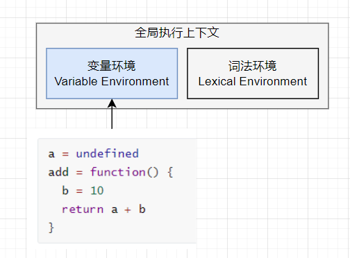

从图中可以看出，代码中全局变量和函数都保存在全局上下文的变量环境中。

执行上下文准备好之后，便开始执行全局代码，当执行到 add 函数，JavaScript 判断这是一个函数调用，将执行以下操作：

* 首先，从全局执行上下文中，取出 add 函数；
* 其次，对 add 函数的这段代码进行编译，并创建该函数的执行上下文和可执行代码。
* 最后，执行代码，输出结果。


当执行到 add 函数的时候，我们就有了两个执行上下文，全局执行上下文和 add 函数的执行上下文。

也就是说在执行 JavaScript 时，可能会存在多个执行上下文。JavaScript 引擎是通过一种栈数据结构来管理这些执行上下文。

#### 什么是 JavaScript 的调用栈

JavaScript 引擎利用栈来管理执行上下文。在执行上下文创建好后，JavaScript 引擎会将执行上下文压入栈中，通常把这种用来管理执行上下文的栈成为执行上下文站，又称调用栈。

为了便于你更好地理解调用栈，我们来看一段稍微复杂的示例代码。

```js
var a = 2
function add(b, c){
  return b + c
}
function addAll(b, c){
  var d = 10
  result = add(b, c)
  return  a + result + d
}
addAll(3, 6)
```

在上面这段代码中，你可以看到它是在 `addAll` 函数中调用了 add 函数，那在整个代码的执行过程中，调用栈是如何变化的呢？

下面我们就一步步地分析在代码的执行过程中，调用栈的状态变化情况。

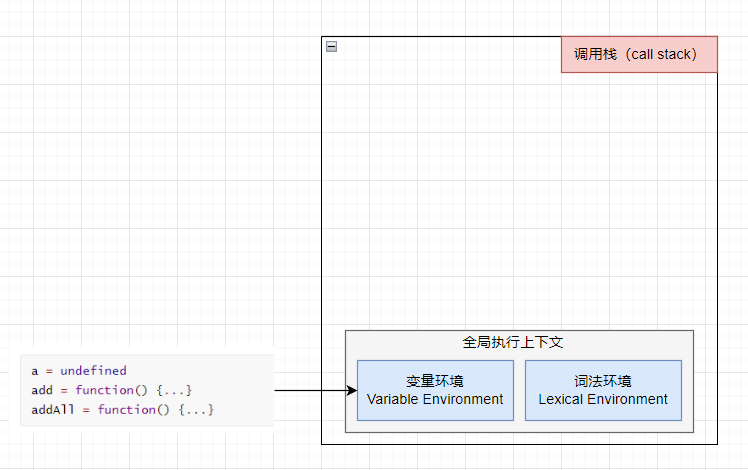

从图中可以看出，变量 a、函数 add 和 addAll 都保存在全局上下文的变量环境对象中。

全局执行上下文压入到调用栈后，JavaScript 引擎便开始执行全局代码了。首先会执行 `a = 2` 的赋值操作，执行该数据会将全局上下文变量环境中 a 的值设置为 2。设置后的全局上下文状态如下图所示：


接下来，第二步是调用 `addAll` 函数。当调用该函数时，JavaScript 引擎编译该函数，并为其创建一个执行上下文，最后还将该函数的执行上下文压入栈中。

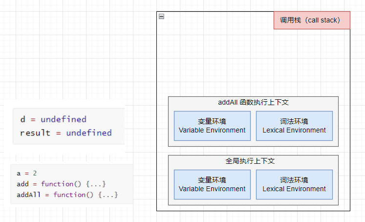

addAll 函数的执行上下文创建好之后，便进入函数代码的执行阶段，这里先执行的是 `d = 10` 的赋值操作，执行语句会将 addAll 函数执行上下文中的由 undefined 变成 10。然后接着往下执行。

第三步，当执行到 add 函数调用语句时，同样会为其创建执行上下文，并将其压入调用栈。


当 add 函数返回时，该函数的执行上下文就会从栈顶弹出，并将 result 的值设置为 add 函数的返回值，也就是 9 。

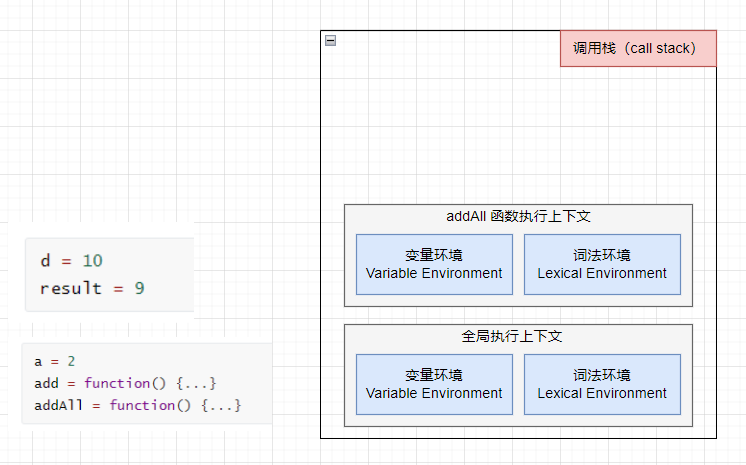

紧接着 `addAll` 执行最后一个相加操作后并返回，`addAll` 的执行上下文也会从栈顶弹出，此时调用栈中就只剩下全局上下文。


至此，整个 JavaScript 流程执行就结束了。

现在你应该知道调用栈是 JavaScript 引擎追踪函数执行的一个机制，当一次有多个函数被调用时，通过调用栈能够追踪到哪个函数正在被执行以及各函数之间的调用关系。

#### 如何利用好调用栈

##### 例如用浏览器查看栈信息

当执行一段复杂的代码时，你可能很难从代码文件中分析其调用关系，这时候你可以在你想要查看的函数中加入断点，当执行到该函数时，就可以查看该函数的调用栈了。

我们拿上面那段代码做演示，你可以打开 “开发者工具”，点击 “source” 标签，选择 JavaScript 代码的页面，然后在 add 函数中加上断点，并刷新页面。你可以看到在执行到 add 函数时，程序就暂停了，这时你可以通过右边 “call stack” 来查看当前的调用栈的情况。

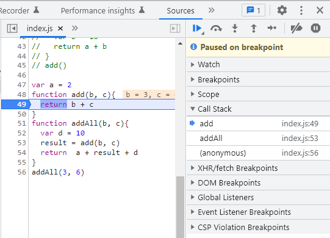

从图中可以看出，右边的 "call stack" 下面显示出了函数的调用关系：栈的最底部是 anonymous，也就是全局的函数入口；中间是 `addAll` 函数；顶部是 add 函数。这就清晰地反映了函数的调用关系，所以在分析复杂结构代码，或者检查 Bug 时，调用栈都是非常有用的。

除了通过断点来查询调用栈，你还可以使用 `console.trace()` 来输出当前的函数调用关系，比如在示例代码中的 add 函数里添加 `console.trace()` ，你就可以看到控制台输出的结果。

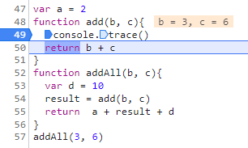


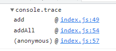

##### 栈溢出（Stack Overflow）

现在你已经知道调用栈是一种用来管理执行上下文的数据结构，符合先进后出的规则。不过还有一点需要注意，调用栈是有大小的，当入栈的执行上下文超过一定数目，JavaScript 引擎就会报错，我们把这种错误叫做栈溢出。

在写递归代码的时候，就很容易出现栈溢出的情况。

```js
function division(a, b) {
  return division(a, b)
}
division(1, 2)
```

这段代码执行时，就会抛出栈溢出错误。


从上图你可以看到，抛出的错误信息为：超出最大栈调用大小（`Maximun call stack size excedded`）。

JavaScript 引擎开始执行这段代码时，它首先调用函数 division，并创建执行上下文，压入栈中。但是，这个函数是递归的，并且没有任何终止条件，所以它会一直创建新的函数执行上下文，并反复将其压入栈中，但栈是有容量限制的，超过最大数量后就会出现栈溢出的错误。

理解栈溢出原因后，就可以使用一些方法来避免或者解决栈溢出的问题，比如把递归调用的形式改造成其他形式，或者使用加入定时器的方法把当前任务拆分为其他很多小任务。

#### 总结

* 每调用一个函数，JavaScript 引擎都会为其创建执行上下文，并把该执行上下文压入调用栈，然后 JavaScript 引擎开始执行函数代码；
* 如果在一个函数 A 中调用了另一个函数 B，那么 JavaScript 引擎会为 B 函数创建执行上下文，并将 B 函数的执行上下文压入栈顶；
* 当前函数执行完毕后，JavaScript 引擎会将该函数的执行上下文弹出栈；
* 当分配的调用栈空间被占满时，会引发 “堆栈溢出” 问题。

栈是一种非常重要的数据结构，不仅应用在 JavaScript 中。在其他的编程语言，例如 C/C++、Java、Python 等，在其执行过程中也都使用了栈来管理函数之间的调用关系。所以栈是非常基础且重要的知识点，我们必须要掌握。

### 块级作用域

我们已经了解了 JavaScript 中变量提升的相关内容，正是由于 JavaScript 存在变量提升这种特性，从而导致了很多与直觉不符的代码，这也是 JavaScript 的一个重要设计缺陷。

虽然 ES6 已经通过引入块级作用域并配合 let、const 关键字，来避免这种设计缺陷，但是由于 JavaScript 需要保持向下兼容，所以变量提升在相当长一段时间还会继续存在，这也加大了理解概念的难度，因为既要理解新的机制，又要理解变量提升这套机制，关键是这两套机制还是运行在 “一套” 系统中。

如果抛开 JavaScript 的底层去理解这些，大概率很难深入其概念。所以为了便于更好地理解和学习，今天我们就来分析为什么在 JavaScript 中存在变量提升，以及变量提升所带来的问题。然后介绍如何通过 **块级作用域配合 let 和 const 关键字** 来修复这种缺陷。

#### 作用域（scope）

为什么 JavaScript 会存在变量提升这个特性，而其他语言似乎都没有这个特性？要想搞清楚这个问题，我们就得先从作用域讲起。

**作用域是指在程序中定义变量的区域，该位置决定了变量的生命周期。通俗地理解，作用域就是变量与函数的可访问范围，即作用域控制着变量和函数的可见性和生命周期。**

在 ES6 之前，ES 的作用域只有两种：全局作用域和函数作用域。

* 全局作用域中对象在代码中的任何地方都能访问，其生命周期伴随着页面的生命周期。
* 函数作用域就是在函数内部定义的变量或者函数，并且定义的变量或者函数只能在函数内部被访问。函数执行结束之后，函数内部定义的变量会被销毁。

在 ES6 之前，JavaScript 只支持这两种作用域。ES6 之前是不支持块级作用域的，因为设计这门语言的时候，并没有想过 JavaScript 会火起来，所以只是按照最简单的方式来设计。没有了块级作用域，再把作用域内部的变量统一无疑是最快速、最简单的设计，不过这也导致了函数中的变量无论是在哪声明的，在编译阶段都会被提取到执行上下文的变量环境中，所以这些变量在整个函数体内部的任何地方都是能被访问的，这也就是 JavaScript 中的变量提升。

#### 变量提升带来的问题

由于变量提升，使用 JavaScript 来编写和其他语言相同逻辑的代码，都有可能导致不一样的执行结果。

##### 变量覆盖

比如下面这段代码：

```js
var myname = 'heora'
function showName() {
  console.log(myname)
  if (0) {
    var myname = 'yueluo'
  }
  console.log(myname)
}
showName()
```

执行上述代码，打印出来的都是 undefined。

当函数执行到 `showName` 函数调用时，执行上下文和调用栈的状态如下图所示：

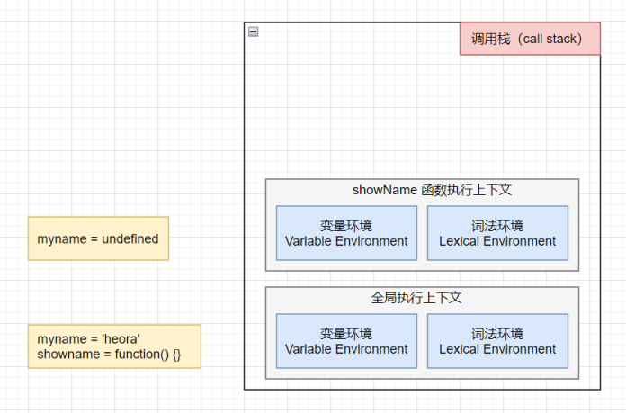

`showName` 函数的执行上下文创建后，JavaScript 引擎便开始执行 `showName`  函数内部的代码。首先执行：

```js
console.log(myname)
```

执行这段代码需要使用变量 `myname`，结合上面的调用栈状态图，你可以看到这里有两个 `myname` 变量：一个在全局上下文中，值为 `heora` ，一个在 `showName` 函数的执行上下文中，其值是 `undefiend`。

在函数执行过程中，JavaScript 会优先从当前的执行上下文中查找变量，由于变量提升，当前的执行上下文中包含了变量 `myname`，其值是 `undefined`，所以获取到的 `myname` 的值就是 `undefiend`。

##### 未被销毁的变量

接下来我们再来看这段让人误解更大的代码：

```js
function foo() {
  for (var i = 0; i < 7; i++) {}
  console.log(i)
}
foo()
```

执行上述代码打印出来的结果是 7，这也是由变量提升所导致的，在创建执行上下文阶段，变量 i 就已经被提升了，所以当 for 循环结束后，变量 i 并没有被销毁。

#### 解决变量提升缺陷

为了解决上述问题，ES6 中引入了 let 和 const 关键字，从而使 JavaScript 也能像其他语言一样拥有块级作用域。

关于 let 和 const 的用法，可以参考下面代码：

```js
let x = 5
const y = 6
x = 7
y = 9 // TypeError: Assignment to constant variable.
```

从这段代码可以看出，两者之间的区别是，使用 let 关键字声明的变量是可以被改变的，使用 const 声明的变量其值是不可以被改变的。但不管怎样，两者都可以生成块级作用域。

下面我们就通过实际的例子来分析下，ES6 是如何通过块级作用域来解决上面的问题。

```js
function varTest() {
  var x = 1
  if (true) {
    var x = 2
    console.log(x) // 2
  }
  console.log(x) // 2
}
```

这这段代码中，有两个地方都定义了变量 x，第一个地方在函数块的顶部，第二个地方在 if 块的内部，由于 var 的作用范围是整个函数，所以在编译阶段，会生成如下的执行上下文。


从执行上下文的变量环境中可以看出，最终只生成一个变量 x，函数体内所有对 x 的赋值操作都会直接改变变量环境中的 x 值。

所以上述代码最后通过 `console.log(x)` 输出的是 2。

既然支持块级作用域的不支持块级作用域的代码执行逻辑是不一样的，那么接下来我们就改造上述代码，使其支持块级作用域。

```js
function varTest() {
  var x = 1
  if (true) {
    let x = 2
    console.log(x) // 2
  }
  console.log(x) // 1
}
```

执行这段代码，其输出结果就和我们的预期是一致的。这是因为 let 关键字是支持块级作用域的，所以在编译阶段，JavaScript 引擎并不会把 if 块中通过 let 声明的变量存放到变量环境中，这也意味着 if 块通过 let 声明的关键字，并不会提升到全函数可见。所以在 if 块内打印出来的是 2，跳出语块之后，打印出来的值就是 1 了。这种表现就非常符合我们的编程习惯：作用域块内的变量不影响外面的变量。

#### 如何支持块级作用域

现在你已经知道 ES6 可以通过 let 或者 const 关键字来实现块级作用域，不过你是否有过疑问：“在同一段代码中，ES6 是如何做到既要支持变量提升的特性，又要支持块级作用域的？”

接下来，我们就站在执行上下文的角度来揭开答案。

JavaScript 引擎是通过变量环境实现函数级作用域的，那么 ES6 又是如何在函数作用域的基础上，实现对块级作用域的支持呢？

```js
function foo(){
  var a = 1
  let b = 2
  {
    let b = 3
    var c = 4
    let d = 5
    console.log(a) // 1
    console.log(b) // 3
  }
  console.log(b) // 2
  console.log(c) // 4
}   
foo()
```

当执行上面这段代码的时候，JavaScript 引擎会先对其进行编译并创建执行上下文，然后再按照顺序执行代码，关于如何创建执行上下文我们已经在前面的文章中分析过了，但是现在的情况有点不同，我们引入了 let 关键字，let 关键字会创建块级作用域，那么 let 关键字是如何影响执行上下文的的？

接下来我们就来一步步分析上面这段代码的执行流程。

**第一步是编译并创建执行上下文**，如下图所示。


通过上图，我们可以得出结论：

* 函数内部通过 var 声明的变量，在编译阶段全都被存放到变量环境里面了。
* 通过 let 声明的变量，在编译阶段会被存放到 **词法环境（Lexical Environment）**中。
* 在函数的作用域块内部，通过 let 声明的变量并没有被存放在词法环境中。

接下来继续执行代码，当执行到块里面时，变量环境 a 的值已经被设置成 1，词法环境中 b 的值已经被设置成 2，这时候函数的执行上下文如下图所示：

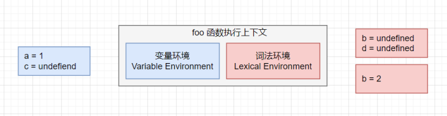

从图中可以看出，当进入函数的作用域块，作用域块中通过 let 声明的变量，会被存放在词法环境中的一个单独的区域中，这个个区域内的变量并不影响作用域块外面的变量，比如在作用域块外面声明了变量 b，在该作用域块内部也声明了变量 b，当执行到作用域内部时，它们都是独立的存在。

在 词法环境内部，维护了一个小型栈结构，栈底是函数最外层的变量，进入作用域块后，会把该作用域的变量压到栈顶。当作用域执行完成之后，该作用域的信息就会从栈顶弹出，这就是词法环境的结构。这里的变量指得是通过 let 或者 const 声明的变量。

接下来，当执行到作用域块中的 `console.log(a)` 这行代码时，就需要在词法环境和变量环境中查找变量 a 的值，具体查找方式是：沿着词法环境的栈顶向下查询，如果在词法环境中的某个块中查到，就直接返回给 JavaScript 引擎，如果没有查找到，继续在变量环境中查找。这里其实涉及到作用域链的概念，这个我们后面在做详细介绍。

当作用域块执行结束后，其内部定义的变量就会从词法环境的栈顶弹出，最终执行上下文如下图所示。


通过上面的分析，相比你已经理解词法环境的结构和工作机制，块级作用域就是通过词法环境的栈结构来实现的，而变量提升是通过变量环境来实现的，通过这两者的结合，JavaScript 引擎也就同时支持变量提升和块级作用域了。

#### 总结

由于 JavaScript 的变量提升存在变量覆盖、变量污染等设计缺陷，所以 ES6 引入块级作用域关键字来解决这些问题。

之后我们还通过对变量环境和词法环境的介绍，分析了 JavaScript 引擎是如何同时支持变量提升和块级作用域的。

既然聊到作用域，最后我们再来简单聊下编程语言。经常有人争论什么编程语言是世界上最好的语言，但如果站在语言本身来说，这种争议其实并没有意义，因为语言是工具，而工具是用来创造价值的，至于能否创造价值或创造多少价值不完全由语言本身的特定决定。即使一门设计不那么好的语言，它有可能拥有很好的生态，比如有完善的框架、非常多的落地应用，又或者能够给开发者带来更多的回报，这些都是评判因素。

如果站在语言层面来谈，每种语言其实都是在相互借鉴对方的优势，协同进化。比如 JavaScript 引入块级作用域、迭代器和协程，其底层虚拟机的本质实现和 Java、Python 又非常相似，也就是说你理解了 JavaScript 协程和 JavaScript 中的虚拟机，其实你也就理解了 Java、Python 中的协程和虚拟机的实现机制。

所以说，语言本身好坏并不重要，重要的是能为开发者创造价值。

#### 技术拓展

你可以通过分析词法环境，得出最终的打印结果吗？

```js
let myname= 'heora'
{
  console.log(myname) 
  let myname= 'yueluo'
}
```

打印结果：

```
ReferenceError: Cannot access 'myname' before initialization
```

原因是在块作用域内，let 声明的变量被提升，但变量只是创建被提升，初始化并没有被提升，在初始化之前使用变量，就会形成一个暂时性死区。

> var 的创建和初始化被提升，赋值不会被提升。 
> let 的创建被提升，初始化和赋值不会被提升。 
> function 的创建、初始化和赋值均会被提升。

### 作用域链和闭包

我们已经知道什么是作用域，以及 ES6 是如何通过变量环境和词法环境同时支持变量提升和块级作用域，在最后我们也提到了如何通过词法环境和变量环境来查找变量，这其中就涉及作用域链的概念。

今天我们就来聊一聊什么是作用域链，并通过作用域链再来讲讲什么是闭包。

首先我们来看下面这段代码。

```js
function bar() {
  console.log(myName)
}
function foo() {
  var myName = 'heora'
  bar()
}
var myName = 'yueluo'
foo()
```

你觉得这段代码中的 `bar` 函数和 `foo` 函数打印出来的内容是什么？让我们分析一下这两段代码的执行流程。

当代码执行到 bar 函数内部是，其调用栈状态如下所示。


从图中可以看到，全局执行上下文和 `foo` 函数的执行上下文都包含变量 `myName` ，那么 bar 函数里面 `myName` 的值到底该选哪个呢？

也许你的第一反应是按照调用栈的顺序来查找变量，查找方式如下：

* 先查找栈顶是否存在 `myName` 变量，如果没有，接着往下查找 `foo` 函数中的变量；
* 在 `foo` 函数中可以找到 `myName` 变量，这时候就要使用 `foo` 函数中的 `myName`。

如果按照这种思路来查找变量， 那么最终打印结果应该是 `heora`。但实际并非如此，上述代码实际会打印 `yueluo`。要想解析清楚这个问题，那么你就需要搞清楚作用域链。

#### 作用域链

关于作用域链，很多人会感到费解，如如果你理解了调用栈、执行上下文、词法环境、变量环境等概念，那么你理解起来作用域链会更加容易。

其实在每个执行上下文的变量环境中，都包含一个外部引用，用来指向外部的执行上下文，我们把这个外部引用称为 **outer**。

当一段代码使用一个变量时，JavaScript 引擎首先会在 "当前的执行上下文" 中查找该变量。比如上面这段代码在查找 `myName` 变量时，如果在当前的变量环境中没有查找到，那么 JavaScript 引擎会继续在 `outer` 所指向的执行上下文中查找。


从图中可以看出，`bar` 函数和 `foo` 函数的 outer 都是指向全局上下文的，这也就意味着如果在 `bar` 函数或者 `foo` 函数中使用外部变量，那么 JavaScript 引擎回去全局执行上下文中查找。我们把这个查找的链条就叫做作用域链。

现在你知道变量是通过作用域链来查找的，不过还有一个疑问没有解开，`foo` 函数调用的 `bar` 函数，那为什么 `bar` 函数的外部引用是全局执行上下文，而不是 `foo` 函数的执行上下文？

要回答这个问题，你还需要知道什么是 **词法作用域**。在 JavaScript 执行过程中，其作用域链是由词法作用域决定的。

#### 词法作用域

**词法作用域就是指作用域是由代码中函数声明的位置来决定的，所以词法作用域是静态的作用域，通过它就能预测代码在执行过程中如何查找标识符。**

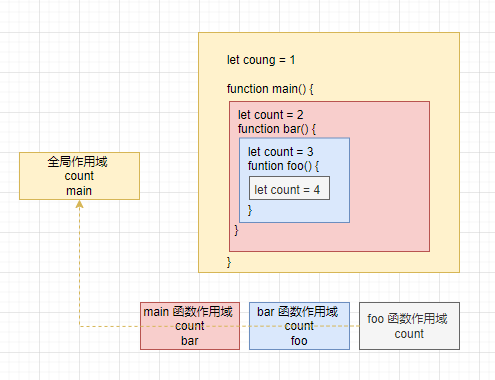

从图中可以看出，词法作用域是根据代码的位置来决定的，其中 `main` 函数包含了 `bar` 函数，`bar` 函数包括了 `foo` 函数，因为 JavaScript 作用域链是由词法作用域决定的，所以整个语法的词法作用域链顺序是：`foo` 函数作用域 - `bar` 函数作用域 - `main` 函数作用域 - 全局作用域。

了解词法作用域以及 JavaScript 中的作用域链，我们再回头看这个问题。

```js
function bar() {
  console.log(myName)
}
function foo() {
  var myName = 'heora'
  bar()
}
var myName = 'yueluo'
foo()
```

在这段代码中。`foo` 和 `bar` 的上级作用域都是全局作用域，所以如果 `foo` 或者 `bar` 函数使用了一个它们没有定义的变量，它们就会到全局作用域中去查找。也也就是说，**词法作用域是代码编译阶段就决定好的，与函数调用无关。**

#### 块级作用域中的变量查找

前面我们通过全局作用域和函数作用域分析了作用域链，接下来我们再来看看块级作用域中变量是如何查找的。

在编写代码的时候，如果你使用了一个在当前作用域中不存在的变量，这时 JavaScript 引擎就需要按照作用域链在其他作用域中查找该变量，如果你不了解该过程，很大概率会写出不稳定的代码。

我们先来看下面这段代码。

```js
function bar() {
  var myName = 'heora'
  let test1 = 100
  if (1) {
    let myName = 'chrome browser'
    console.log(test)
  }
}
function foo() {
  var myName = 'yueluo'
  let test = 2
  {
    let test = 3
    bar()
  }
}
var myName = '月落'
let myAge = 10
let test = 1
foo()
```

你可以自己分析下这段代码的执行流程，看看是否分析出来执行结果。

要想得出其执行结果，我们还是需要站在作用域链和词法环境的角度来分析其执行过程。

ES6 是支持块级作用域的，当执行到代码块时，如果代码块中有 let 或者 const 声明的变量，那么变量就会存放到函数的词法环境中。对于上面这段代码，当执行到 bar 函数内部的 if 语句块时，其调用栈的情况如图所示：

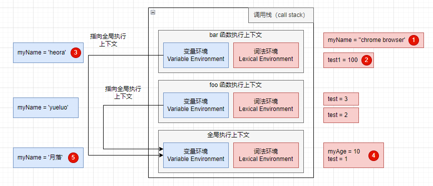

执行到 bar 函数的 if 语句块内，需要打印出变量 test，那么就需要查找到 test 变量的值，其查找过程已经在图中使用序号标出。

下面就来解释一下这个过程。首先是在 bar 函数的执行上下文中查找，但因为 bar 函数的执行上下文中没有定义 test 变量，所以根据词法作用域的规则，下一次就在 bar 函数的外部作用域中查找，也就是全局作用域。

#### 闭包

了解了作用域链，接着我们就可以来聊聊闭包了。理解了变量环境、词法环境和作用域链等概念，接下来再理解什么是闭包就容易多了。

这里你可以结合下面这段代码来理解什么闭包。

```js
function foo() {
  let myName = 'heora'
  let test1 = 1
  let test2 = 2
  var innerBar = {
    getName: function() {
      console.log(test1)
      return myName
    },
    setName: function(newName) {
      myName = newName
    }
  }
  return innerBar
}
var bar = foo()
bar.setName('yueluo')
bar.getName()
console.log(bar.getName())
```

首先我们看看执行到 `foo` 函数内部的 `return innerBar` 这行代码时调用栈的情况，

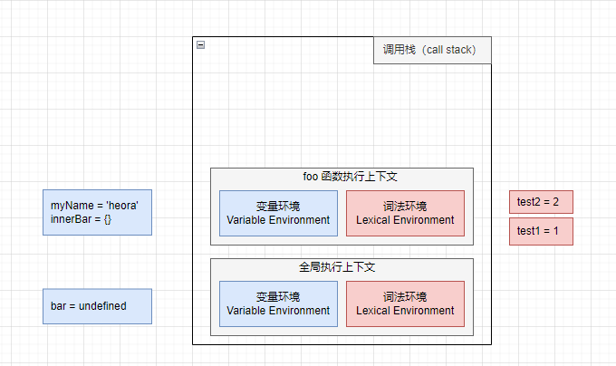

从上面的代码中可以看出，`innerBar` 是一个对象，包含了 `getName` 和 `setName` 的两个方法。你可以看到，这两个方法都是在 `foo` 函数内部定义的，并且这两个方法内部都使用了 `myName` 和 `test1` 变量。

根据词法作用域的规则，内部函数 `getName` 和 `setName` 总是可以访问它们的外部函数 `foo` 中的变量，所以当 `innerBar` 对象返回给全局变量 `bar` 时，虽然 `foo` 函数已经执行结束，但是 `getName` 和 `setName` 函数依然可以使用 `foo` 函数中的变量 `myName` 和 `test1`。所以当 `foo` 函数执行完成之后，其整个调用栈的状态如下图所示：


从上图可以看出，`foo` 函数执行完成之后，其执行上下文已经从栈顶弹出，但是由于返回的 `setName` 和 `getName` 方法中使用了 `foo` 函数内部的变量 `myName` 和 `test1`，所以这两个变量依然保存在内存中。这非常像 `setName` 和 `getName` 方法背的一个专属背包，无论是在哪调用 `setName` 和 `getName` 方法，它们都会背着这个 `foo` 函数的专属背包。

之所以是专属背包，是因为除了 `setName` 和 `getName` 函数之外，其他任何地方都是无法访问该背包的，我们就可以把这个背包称为 `foo` 函数的闭包。

现在我们可以给闭包一个正式的定义了。**在 JavaScript 中，根据词法作用域的规则，内部函数总是可以访问其外部函数中声明的变量，当通过调用一个外部函数返回一个内部函数后，即使该外部函数已经执行结束，但是内部函数引用外部函数的变量依然保存在内存中，我们就把这些变量的集合称为闭包。**比如外部函数是 `foo`，那么这些变量的集合就称为 `foo` 函数的闭包。

> [MDN 闭包定义](https://developer.mozilla.org/zh-CN/docs/Web/JavaScript/Closures)
>
> 一个函数和对其周围状态（**lexical environment，词法环境**）的引用捆绑在一起（或者说函数被引用包围），这样的组合就是**闭包**（**closure**）。也就是说，闭包让你可以在一个内层函数中访问到其外层函数的作用域。在 JavaScript 中，每当创建一个函数，闭包就会在函数创建的同时被创建出来。

那这些闭包是如何使用呢？当执行到 `bar.setName` 方法中的 `myName = 'yueluo'`  这句代码时，JavaScript 会沿着 “当前执行上下文 - foo 函数闭包 - 全局执行上下文” 的顺序来查找 `myName` 变量。

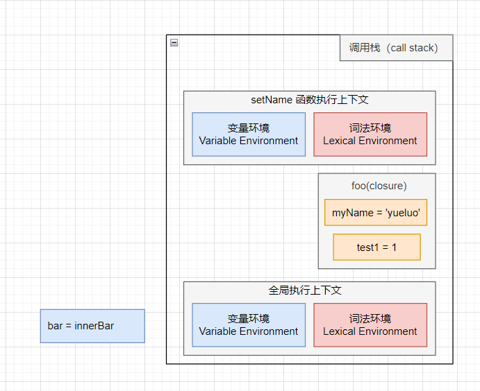

从图中可以看出，`setName` 的执行上下文没有 `myName` 变量，`foo` 函数的闭包中包含变量 `myName`，所以调用 `setName` 时，会修改 `foo` 闭包中的 `myName` 变量的值。

同样的流程，当调用 `bar.getName` 函数的时候，所访问的变量 `myName` 也是位于 `foo` 函数闭包中的。

你也可以通过 “开发者工具” 来看看闭包的情况，打开 chrome 的 “开发者工具”，在 `innerBar` 函数任意地方打上断点，然后页面，就可以看到如下内容：

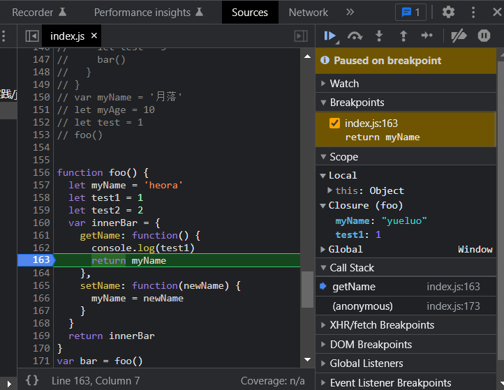

从图中可以看到，当调用 `bar.getName` 函数时，右边 `Scope` 项就体现出作用域链的情况：Local 就是当前的 `getName` 函数的作用域，Closure(foo) 是指 foo 函数的闭包，最下面的 Global 就是指全局作用域，从”Local - Closure(foo) - Global“ 就是一个完整的作用域链。

#### 闭包是如何回收的

理解什么是闭包之后，接下来我们再来简单聊一聊闭包是什么时候销毁的。如果闭包使用不正确，很容易造成内存泄露，明白闭包如何回收能让你正确的使用闭包。

通常，如果引用闭包的函数是一个全局变量，那么闭包会一直存在知道页面关闭。但如果这个闭包以后不再使用的话，就会造成内存泄漏。

如果引用闭包的函数是个局部变量，等函数销毁后，在下次 JavaScript 引擎执行垃圾回收时，判断闭包这块内容如果已经不再使用了，那么 JavaScript 引擎的垃圾回收器就会回收这块内存。

所以在使用闭包的时候，应该尽量注意一个原则：**如果该闭包会一直使用，那么它可以作为全局变量而存在。但如果使用频率不高，而且占用内存又比较大，那就尽量让它成为一个局部变量。**

这里对闭包回收的问题做了一个简单的介绍，其实闭包如何回收还牵涉到 JavaScript 的垃圾回收机制，关于垃圾回收，我们后面再来详细介绍。

#### 总结

* 首先，介绍了什么是作用域链，我们把通过作用域查找变量的链条称为作用域链；作用域链是通过词法作用域来确定的，而词法作用域反映代码结构。词法作用域是代码编译阶段就决定好的，与函数调用无关。
* 其次，介绍了在块级作用域中是如何通过作用域链来查找变量的。
* 最后，又基于作用域链和词法环境介绍了什么是闭包。

### this

我们已经讲了词法作用域、作用域链以及闭包。首先，我们来看一段代码：

```js
var bar = {
  myName:"www.yueluo.club",
  printName: function () {
    console.log(myName)
  }    
}
function foo() {
  let myName = "heora"
  return bar.printName
}
let myName = "yueluo"
let _printName = foo()
_printName()
bar.printName()
```

在 `printName` 函数里面使用的变量 `myName`  是属于全局作用域下面的，所以最终打印出来的值都是 `yueluo` 。这是因为 JavaScript 语言的作用域链是由词法作用域决定的，而词法作用域是由代码结构来确定的。

如果我们想在 `bar.printName` 中使用对象中的属性，我们可以通过 `this` 来访问。

```js
var bar = {
  myName:"www.yueluo.club",
  printName: function () {
    console.log(this.myName)
  }    
}
```

接下来我们就展开介绍 this，不过在讲解之前，希望你可以区分清除 **作用域链** 和 **this** 是两套不同的系统，它们之间基本没有太多联系。

#### this 是什么

关于 this，我们还是需要从上下文说起。在之前几篇文章中，我们提到执行上下文中包含了变量环境、词法环境、外部环境(outer)，但其实还存在一个 this 没有提及。


从图中可以看出，this 是和执行上下文绑定的，也就是说每个执行上下文都有一个 this。执行上下文主要分为三种：全局执行上下文、函数执行上下文和 `eval` 执行上下文，所以对应的 this 也只有三种：全局执行上下文中的 this、函数中的 this 和 `eval` 中的 this。

关于更多 this 内容可以查看 [这篇文章](https://segmentfault.com/a/1190000009048715)。

我们使用 `eval` 的场景并不多，使用 `eval` 存在很大的风险，不推荐使用。

> [MDN evel()](https://developer.mozilla.org/en-US/docs/Web/JavaScript/Reference/Global_Objects/eval)

接下来我们重点讲解 **全局执行上下文中的 this** 和 **函数执行上下文中的 this**。

#### 全局执行上下文的 this

首先我们来看看全部执行上下文中的 this 是什么。

你可以在控制台输入 `console.log(this)`  来打印出全局执行上下文中的 this，最终输出的是 `window` 对象。所以我们可以得出这样一个结论：全局执行上下文中的 this 是指向 window 对象的。这也是 this 和作用域链的唯一交点，作用域链的最底端包含了 window 对象，全局执行上下文中的 this 也是指向 window 对象。

#### 函数执行上下文的 this

现在你已经知道全局对象中的 this 是指向 window 对象，那么接下来，我们就来重点分析函数执行上下文中的 this。

```js
function foo() {
  console.log(this)
}
foo()
```

我们在 `foo` 函数中打印 `this` 值，执行这段代码，打印出来的也是 window 对象，这说明在默认情况下调用一个函数，其执行上下文中的 this 也是指向 window 对象的。我们还可以通过其他方法设置执行上下文中的 this 值。

##### 通过函数的 call 方法设置

你可以通过函数的 `call` 方法来设置函数执行上下文的 this 指向，比如下面这段代码，我们就没有直接调用 `foo` 函数，而是调用了 `foo` 的 `call` 方法，并把 `bar` 对象作为 `call` 方法的参数。

```js
let bar = {
  myName: 'heora',
  test1: 1
}
function foo() {
  this.myName = 'yueluo'
}
foo.call(bar)
console.log(bar) // { myName: 'yueluo', test1: 1 }
console.log(myName) // ReferenceError: myName is not defined
```

指定这段代码，观察输出结果，你就能发现 `foo` 函数内部的 this 已经指向 `bar` 对象，通过打印 `bar` 对象，可以看出 `bar` 的 `myName` 属性已经由 `heora` 变为 `yueluo` ，同时在全局执行上下文中打印 `myName` ，JavaScript 引擎会提示该变量未定义。

除了 **call** 方法之外，还可以使用 **bind** 和 **apply** 方法来设置函数执行上下文中的 this。它们在使用上存在一些区别，你可以自行搜索去学习它们的使用方法。

##### 通过对象调用方法设置

要改变函数执行上下文的 this 指向，除了通过函数的 `call` 方法来实现外，还可以通过对象调用的方式。

```js
var myObj = {
  name: 'heora',
  showThis: function() {
    console.log(this)
  }
}
myObj.showThis()
```

在这段代码中，我们定义了一个 `myObj` 对象，该对象是由一个 `name` 属性和一个 `showThis` 方法组成的，然后再通过 `myObj` 对象来调用 `showThis` 方法。执行这段代码，你可以看到，最终输出的 `this` 值是指向 `myObj` 的。

所以，我们可以得出这样一个结论：**使用对象来调用其内部的一个方法，该方法的 this 指向对象本身。**

其实，你也可以认为 JavaScript 引擎在执行 `myObject.showThis()` 时，将其转换为：

```js
myObj.showThis.call(myObj)
```

接下来，我们稍微改变下调用方式，将 `showThis` 赋给一个全局对象，然后再调用该对象。

```js
var myObj = {
  name: 'heora',
  showThis: function() {
    this.name = 'yueluo'
    console.log(this)
  }
}
var foo = myObj.showThis
foo()
```

执行这段代码，你会发现 this 又指向全局 window 对象。

所以通过以上两个例子的对比，你可以得出下面这样两个结论：

* 全局环境下中调用一个函数，函数内部的 this 指向是全局变量 window；
* 通过一个对象来调用其内部的一个方法，该方法的执行上下文中的 this 指向对象本身。

##### 通过构造函数设置

你可以像这样设置构造函数中的 this。

```js
function CreateObj() {
  this.name = 'heora'
}
var myObj = new CreateObj()
```

在这段代码中，我们使用 new 创建对象 `myObj` ，那你知道此时的构造函数中的 this 指向谁？

当执行到 `new CreateObj()` 的时候，JavaScript 引擎做了以下四件事：

* 创建一个空的简单 JavaScript 对象（即`{}`）；
* 为步骤 1 新创建的对象添加属性 `__proto__`，将该属性链接至构造函数的原型对象 ；
* 将步骤 1 新创建的对象作为 `this` 的上下文 ；
* 如果该函数没有返回对象，则返回 `this`。

关于 new 的具体细节你可以参考 [这篇文章](https://developer.mozilla.org/zh-CN/docs/Web/JavaScript/Reference/Operators/new)。

#### this 的设计缺陷及应对方案

> this 的缺陷并不是浏览器实现机制导致的，而是浏览器按照标准来实现的。
> 其实浏览器说我可以实现得更好，但是标准摆在这儿，大家都只认标准！

##### 嵌套 this 不会从外层函数继承

```js
var myObj = {
  name : "heora", 
  showThis: function() {
    console.log(this)
    function bar() {
      console.log(this)
    }
    bar()
  }
}
myObj.showThis()
```

我们在这段代码的 `showThis` 方法里添加了一个 bar 方法，然后接着在 `showThis` 函数中调用了 `bar` 函数。
当执行这段代码，你会发现函数 `bar` 中的 this 指向的是全局 window 对象，而函数 `showThis` 中的 this 指向的是 `myObj` 对象。

这就是 JavaScript 中非常容易让人迷惑的地方之一，也是很多问题的源头。你可以通过一个小技巧来解决这个问题，比如在 `showThis` 函数中，声明一个变量 `self` 用来保存 this，然后在 `bar` 函数中使用 `self` 。

```js
var myObj = {
  name : "heora", 
  showThis: function() {
    console.log(this)
    var that = this
    function bar() {
      console.log(that)
      that.name = 'yueluo'
    }
    bar()
  }
}
myObj.showThis()
console.log(myObj.name)
```

执行这段代码，你可以看到它输出了我们想要的结果，最终 `myObj` 中的 `name` 属性值变成了 "`yueluo`"。这种做法的本质是把 this 体系转换为作用域的体系。

其实，你也可以使用 ES6 箭头函数来解决这个问题。

```js
var myObj = {
  name : "heora", 
  showThis: function() {
    console.log(this)
    var bar = () => {
      this.name = 'yueluo'
      console.log(this)
    }
    bar()
  }
}
myObj.showThis()
console.log(myObj.name)
```

执行这段代码，你会发现它也输出了我们想要的结果，也就是箭头函数 bar 里面的 this 是指向 `myObj` 对象的。这是因为 ES6 的箭头函数并不会创建自己的执行上下文，所以箭头函数的 this 取决于它的外部函数。

通过上面的讲解，你应该已经知道 this 没有作用域的限制，这点和变量不同，所以嵌套函数不会从调用它的函数中继承 this，这样会造成很多不符合直觉的代码。要想解决这个问题，有两种思路：

* 第一种是缓存一个 that 变量，利用变量的作用域机制传递给嵌套函数；
* 第二种是利用箭头函数没有自己的执行上下文的特性，所以当我们使用 this 时，它会继承调用函数中的 this。

##### 普通函数中的 this 默认指向 window

在默认情况下调用一个函数，其执行上下文中的 this 是默认指向全局 window 的。

其实这个设计也算是一种缺陷，因为在实际工作中，我们并不希望函数执行上下文的 this 默认指向全部对象，因为这样会打破数据的边界，造成一些误操作。如果要让函数执行上下文中的 this 指向某个对象，最好的方式是通过 call 方法来显式调用。

这个问题可以通过设置 JavaScript 的 “[严格模式](https://developer.mozilla.org/zh-CN/docs/Web/JavaScript/Reference/Strict_mode)” 来解决。在 [严格模式](https://developer.mozilla.org/zh-CN/docs/Web/JavaScript/Reference/Strict_mode) 下，默认执行一个函数，其函数的执行上下文中的 this 值是 undefined。

#### 总结

使用 this 时，为了避坑，我们要谨记以下三点：

* 当函数作为对象的方法调用时，函数的 this 就是该对象；
* 当函数被正常调用时，严格模式下，this 值是 undefined，非严格模式下 this 指向是全局对象 window；
* 嵌套函数的 this 不会继承外层函数的 this 值。

我们还提到了箭头函数，因为箭头函数没有自己的执行上下文，所以箭头函数的 this 就是它外层函数的 this。

## JavaScript 内存机制

对于前端开发者来说，JavaScript 的内存机制是一个不被经常提及的概念，因此很容易被忽视。
但是如果你想成为行业专家，并打造高性能前端应用，那么你就必须搞清楚 JavaScript 的内存机制了。

### 数据是如何存储的

#### 让人疑惑的代码

首先，我们来看下面这两段代码。

```js
function foo() {
  var a = 1
  var b = a
  a = 2
  console.log(a)
  console.log(b)
}
foo()
```

```js
function foo() {
  var a = { name: 'heora' }
  var b = a
  a.name = 'yueluo'
  console.log(a)
  console.log(b)
}
foo()
```

执行第一段代码，打印出来的 a 的值是 2，b 的值是 1。
执行第二段代码，你会发现，仅仅改变 a 中 name 的属性值，最终 a 和 b 打印出来的值都是 `{ name: 'yueluo' }`。

为什么执行第二段代码，改变 a 的内容，b 的内容也会被改变？这需要理解 JavaScript 运行过程中的数据是如何存储的。

#### JavaScript 数据类型

JavaScript 是一种弱类型的、动态的语言。

* 弱类型：意味着你不需要告诉 JavaScript 引擎变量是什么类型，JavaScript 引擎在运行代码时会自己计算出来。
* 动态：意味着你可以使用同一个变量来保存不同类型的数据。

JavaScript 有 8 种数据类型，它们分别是：

| 类型      | 描述                                                         |
| --------- | ------------------------------------------------------------ |
| Boolean   | 只有 true 和 false 两个值                                    |
| Null      | 只有一个值 null                                              |
| Undefined | 一个没有被赋值的变量的默认值是 undefined，变量提升时的默认值也是 undefined |
| Number    | 根据 ECMAScript 标准，JavaScript 种只有一种数字类型：基于 IEEE 754 标准的双精度 64 位二进制格式的值 |
| BigInt    | JavaScript 中一个新的数字类型，可以用任意精度表示整数。使用 BigInt，即使超出 Number 的安全整数范围，也可以安全地存储和操作 |
| String    | 用于表示文本数据                                             |
| Symbol    | 符号类型是唯一的并且是不可修改的，通常用来作为 Object 的 key |
| Object    | 在 JavaScript 中，对象可以被看作是一组属性的集合             |

> [JavaScript 数据类型和数据结构](https://developer.mozilla.org/en-US/docs/Web/JavaScript/Data_structures)

了解这些类型之后，还有三点需要你注意：

* 使用 `typeof ` 检测 `Null` 类型时，返回的是 `Object`。这是当初 JavaScript 语言的一个 BUG，保留至今，之所以一直没有修改，主要是为了兼容历史代码。
  * 在 JavaScript 中二进制前三位都为 0 的话会被判断为 object 类型，null 的二进制表示全0，因此执行 `typeof null` 时返回 object -《你不知道的JavaScript上卷》
* Object 类型比较特殊，它是由上述 7 种类型组成的一个包含 `key-value` 键值对的数据类型。
* 我们把前 7 种数据类型称为 **原始类型**，把最后一个对象类型称为 **引用类型**，之所以把它们区分为两种不同类型，是因为它们在内存中存放的位置不同。

#### 内存空间

要理解 JavaScript 在运行过程中数据是如何存储的，首先你需要先搞清楚其存储空间的种类。关于 JavaScript 的内存模型，你可以参考下图：

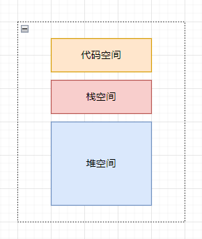

从图中可以看出，在 JavaScript 中的执行过程中，主要有三种类型的内存空间，分别是 **代码空间**、**栈空间** 和 **堆空间**。
其中代码空间主要用来存储可执行代码，后面我们再详细介绍，我们先来说说栈空间和堆空间。

#### 栈空间和堆空间

这里的栈空间就是我们之前反复提及的调用栈，是用来存储执行上下文的。为了搞清楚栈空间是如何存储数据的，我们还是先来看一段代码。

```js
function foo() {
  var a = 'heora'
  var b = a
  var c = { name: 'yueluo' }
  var d = c
}
foo()
```

前面我们已经讲过，当执行一段代码，需要先编译，并创建执行上下文然后再按照顺序执行代码。下面是执行到第 3 行代码时，调用栈的状态图。

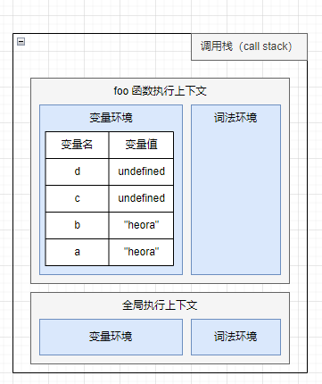

从图中可以看出，当执行到第 3 行时，变量 a 和 变量 b 的值都被保存在执行上下文中，而执行上下文又被压入栈中，所以你也可以认为变量 a 和变量 b 的值都是存放在栈中。

接下来继续执行第 4 行代码，由于 JavaScript 引擎判断右边的值是一个引用类型，这时候处理的情况就不一样了，JavaScript 引擎并不是直接将该对象存放到变量环境中，而是会将它分配到堆空间中，分配后该对象会有一个在 "堆中" 的地址，然后再将该数据的地址写进 c 的变量值。


从上图你可以清晰地观察到，对象类型是存放到堆空间的，在栈空间只是保留了对象的引用地址，当 JavaScript 需要访问该数据的时候，是通过栈中的引用地址来访问的。

现在你已经知道 **原始类型的数据值都是直接保存在 "栈" 中的，引用类型的值是存放在 "堆" 中 的**。但是为什么一定要分 "堆" 和 "栈" 两个存储空间呢？所有数据直接存放在 "栈" 中不久可以了吗？

> “原始类型的数据是存放在栈中，引用类型的数据是存放在堆中的” 实际上是不对的，至少 v8 不是这样。除了小的整数之外(Smi), 其他类型，包括string，都是在Heap上。另外像数字类型，很多时候也是在 Heap 上。
>
> 具体参考:
>
> https://v8.dev/blog/react-cliff 。
> "For small integers in the 31-bit signed integer range, V8 uses a special representation called Smi. Anything that is not a Smi is represented as a HeapObject, which is the address of some entity in memory. " 。
>
> https://hashnode.com/post/does-javascript-use-stack-or-heap-for-memory-allocation-or-both-cj5jl90xl01nh1twuv8ug0bjk

> v8 的文档里面也有讲： https://developer.chrome.com/docs/devtools/memory-problems/memory-101/#javascript_object_representation。
>
> 字符串不是存在栈中，字符串是根据 hash 值区分的，例如 @9527 和 @9528 这样的。

这是因为 JavaScript 引擎需要用栈来维护程序执行期间上下文的状态，如果栈空间太大，所有的数据都存放在栈空间里面，会影响上下文切换的效率，进而又影响整个程序的执行效率。比如文中的 `foo` 函数执行结束之后，JavaScript 引擎需要离开当前的上下文，只需要将指针下移到上个执行上下文的地址就可以了，然后将 `foo` 函数执行上下文栈区空间全部回收。

所以通常情况下，栈空间都不会设置太大，主要用来存放一些原始类型的小数据。而引用类型的数据占用的空间都比较大，所以这一类数据会被存放到堆中，堆空间很大，能存放很多大的数据，不过缺点是分配内存和回收内存都会占用一定的时间。

解释了程序在执行过程中为什么需要堆和栈两种数据结构后，我们继续看刚才的示例代码，看看它最后一步将变量 c 赋值给变量 d 是怎么执行的。

在 JavaScript 中，赋值操作和其他语言有很大不同，原始类型的赋值会完整复制变量值，而引用类型的赋值是复制引用地址。所以将变量 c 赋值给变量 d 就是把 c 的引用地址赋值给 d。

> "原始类型的赋值会完整复制变量值，而引用类型的赋值是复制引用地址。" 其实也是错的。
>
> 因为 string interning 的存在，string literals 都存在 constant pool 里，`const a = 'foo'; const b = foo` 这里内存里面不会有两个字符串 `foo`,  被复制不是 string 的值，而是 constant pool pointer. 
>
> 在 v8 的 design doc 里面有讲：https://docs.google.com/document/d/11T2CRex9hXxoJwbYqVQ32yIPMh0uouUZLdyrtmMoL44/edit#。


从图中你可以看到，变量 c 和变量 d 都指向同一个堆中的对象，所以这很好地解释了文章开头的那个问题，通过 c 修改 name 的值，变量 d 的值也会改变。

#### 再谈闭包

现在你已经知道作用域内的原始类型数据会被存储到栈空间，引用类型会被存储到堆空间，基于这两点认知，我们再深入一步，探讨下闭包的内存模型。

以下面这段代码为例：

```js
function foo() {
  var myName = "heora"
  var test1 = 1
  var test2 = 2
  var innerBar = { 
    setName:function(newName){
      myName = newName
    },
    getName:function(){
      console.log(test1)
      return myName
    }
  }
  return innerBar
}
var bar = foo()
bar.setName("yueluo")
bar.getName()
console.log(bar.getName())
```

当 `foo` 函数执行完毕后，理论上调用栈中 `foo` 函数的执行上下文会被销毁，其内部变量 `myName`、`test1`、`test2` 也应该被一同销毁。实际上，当 `foo` 函数的执行上下文销毁时，由于 `foo` 函数产生了闭包，所以变量 `myName` 和  `test1` 并没有被销毁，而是保存在内存中，那么应该如何解释这个现象呢？

要解释这个现象，我们就要站在内存模型的角度来分析这段代码的执行流程。

* 当 JavaScript 引擎执行到 `foo` 函数，首先会编译，并创建一个空执行上下文；
* 在编译过程中，遇到内部函数 `setName`，JavaScript 引擎还要对内部函数做一次快速的词法扫描，发现该内部函数引用了 `foo` 函数中的 `myName` 变量，由于是内部函数引用外部函数的变量，所以 JavaScript 引擎判断这是一个闭包，于是在堆空间创建一个 "`closure(foo)`" 的对象（这是一个内部对象，JavaScript 是无法访问的），用来保存 `myName` 变量；
* 接着继续扫描到 `getName` 方法时，发现该函数内部还引用变量 `test1`，于是 JavaScript 引擎又将 `test1` 添加到 "`closure(foo)`" 对象中。这时候堆中的 "`closure(foo)`" 对象中就包含 `myName` 和 `test1` 两个变量了；
* 由于 `test2` 并没有被内部函数引用，所以 `test2` 仍然保存在调用栈中。

通过上面的分析，我们可以画出执行到 `foo` 函数中的 `return innerBar` 语句时的调用栈状态，如下图所示：


从上图可以清晰地看出，当执行到 `foo` 函数时，闭包就产生了；当 `foo` 函数执行结束之后，返回的 `getName` 和 `setName` 方法都引用 "`closure(foo)`" 对象，所以即使 `foo` 函数退出，"`closure(foo)`" 仍然会被内部的 `getName` 和 `setName` 方法引用。所以在下次调用 `bar.setName` 或者 `bar.getName` 时，创建的执行上下文就包含 "`closure(foo)`" 。

总的来说，产生闭包的核心有两步：第一步是需要预扫描内部函数，第二步是把内部函数引用的外部变量保存到堆中。

### 垃圾数据是如何回收的

有些数据被使用之后，可能就不再需要了，我们把这种数据称为垃圾数据。如果这些垃圾数据一直保存在内存中，那么内存会越用越多，所以我们需要对这些垃圾数据进行回收，以释放有限的内存空间。

#### 调用栈中的数据是如何回收的

首先是调用栈中的数据，我们还是通过一段示例代码的执行流程来分析其回收机制。

```js
function foo() {
  var a = 1
  var b = { name: 'heora' }
  function showName() {
    var c = 2
    var d = { name: 'yueluo' }
  }
  showName()
}
foo()
```

当执行到第 6 行时，其调用栈和堆空间状态图如下所示：


从图中可以看出，原始类型的数据被分配到栈中，引用类型数据被分配到堆中。当 foo 函数执行结束后，foo 函数的执行上下文会从堆中被销毁掉，那么它是如何被销毁的呢？

当函数执行到 `showName` 函数时，JavaScript 会创建 `showName` 函数的执行上下文，并将 `showName` 函数的执行上下文压入到调用栈中，最终执行到 `showName` 函数时，其调用栈就如上图所示。与此同时，还有一个 **记录当前执行状态的指针（称为 ESP）** ，指向调用栈中 `showName` 函数的执行上下文，表示当前正在执行 `showName` 函数。

接着，当 `showName` 函数执行完毕，函数执行流程就进入到 `foo` 函数，这时就需要销毁 `showName` 函数的执行上下文。JavaScript 会将 ESP 下移到 foo 函数的执行上下文，这个下移操作就是销毁 `showName` 函数执行上下文的过程。

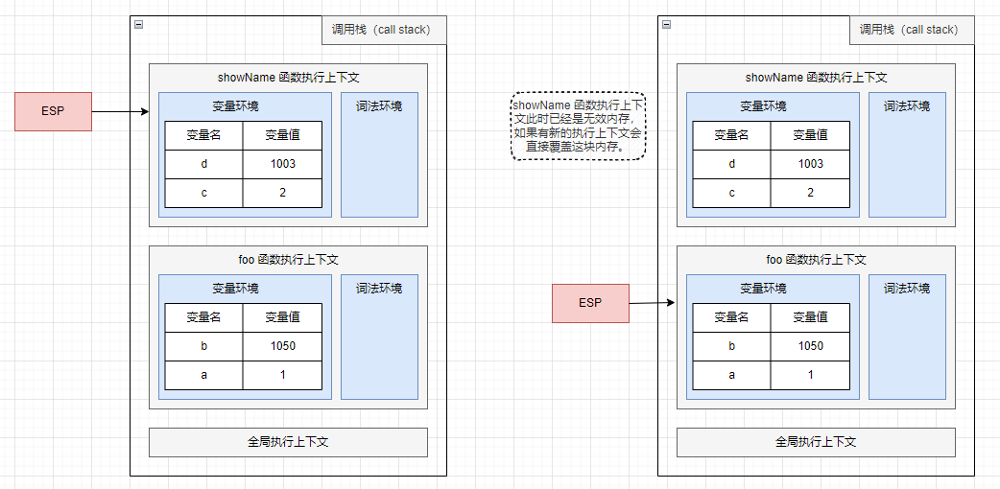

当 `showName` 函数执行结束之后，ESP 向下移动到 foo 函数的执行上下文中，虽然此时 `showName` 的执行上下文仍保存在内容中，但是已经是无效内存。当 foo 函数再次调用另外一个函数时，这块内存会被直接覆盖掉，用来存放另外一个函数的执行上下文。

所以说，当一个函数执行结束之后，JavaScript 引擎会通过向下移动 ESP 来销毁该函数保存在栈中的执行上下文。

#### 堆中的数据是如何回收的

通过上面的讲解，你应该已经知道，当上面那段代码执行结束之后，ESP 应该是指向全局执行上下文的，这样的话，`showName` 和 `foo` 函数的执行上下文就处于无效状态了，不过保存在堆中的两个对象仍然占用着空间。

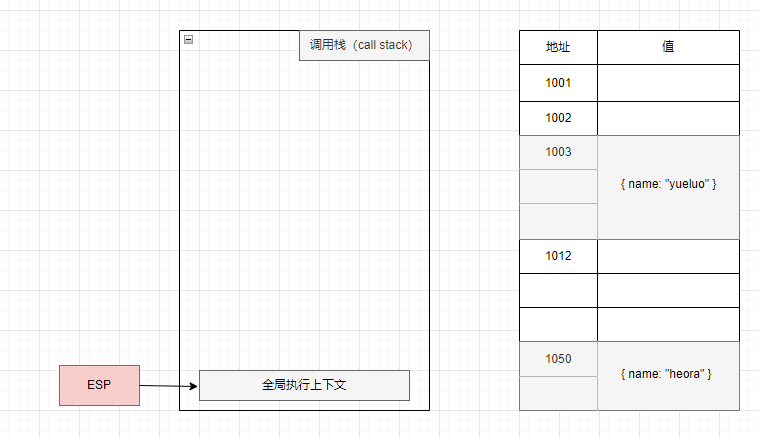

从图中可以看出，1003 和 1050 这两块内存仍然被占用。要回收堆中的垃圾数据，就需要用到 JavaScript 中的垃圾回收器了。

所以接下来，我们就来通过 Chrome 的 JavaScript 引擎 V8 来分析下堆中的垃圾数据是如何回收的。

##### 代际假说和分代收集

**代际假说（The Generational Hypothesis）** 是垃圾回收领域中的一个重要术语，后续垃圾回收的策略都是建立在该假说的基础之上。

代际假说有两个特点：

* 大部分对象在内存中存在的时间很短，简单来说，就是很多对象一经分配内存，很快就变得不可访问。
* 不死得对象，对象存活时间很久。

这两个特点不仅仅适用于 JavaScript，同样适用于大多数得动态语言，比如 Java、Python 等。

有了代际假说的基础，我们就可以来探讨 V8 是如何实现垃圾回收的了。

通常，垃圾回收算法有很多种，但是没有哪一种能胜任所有的场景，你需要权限各种场景，根据对象的生存周期的不同而使用不同的算法，以便达到最好的效果。

所以，在 V8 中会把堆分为新生代和老生代两个区域，新生代中存放的是生存时间短的对象，老生代中存放的是生存时间久的对象。

新生区通常只支持 1~8 M的容量，老生区支持的容量就大很多了。对于这两块区域，V8 分别使用两个不同的垃圾回收器，以便更高效地实施垃圾回收。

* 副垃圾回收器，主要负责新生代的垃圾回收。
* 主垃圾回收器，主要负责老生代的垃圾回收。

##### 垃圾回收器的工作流程

现在你已经知道 V8 把堆分成两个区域 - 新生代和老生代，并分别使用两个不同的垃圾回收器。其实不管什么类型的垃圾回收器，它们都有一套共同的执行流程。

* 第一步：标记空间中活动对象和非活动对象。所谓活动对象就是还在使用的对象，非活动对象就是可以进行垃圾回收的对象。
* 第二步：回收非活动对象所占据的内存。其实就是在所有的标记完成之后，统一清理内存中所有被标记为可回收的对象。
* 第三步：内存整理。一般来说，频繁回收对象后，内存中就会存在大量不连续空间，我们把这些不连续的内存空间称为**内存碎片**。当内存中出现大量的内存碎片之后，如果需要分配较大内存的时候，就有可能出现内存不足的情况。所以最后一步需要整理这些内存碎片，但这步是可选的，因为有的垃圾回收器不会产生内存碎片，比如接下来我们要介绍的副垃圾回收器。

接下来，我们就按照这个流程来分析新生代垃圾回收器（副垃圾回收器）和老生代垃圾回收器（主垃圾回收器）是如何处理垃圾回收的。

##### 副垃圾回收器

副垃圾回收器主要负责新生区的垃圾回收。通常情况下，大多数小的对象都会被分配到新生区，所以这个区域虽然不大，但是垃圾回收还是比较频繁的。

新生代中用 **Scavenge 算法** 来处理。所谓 Scavenge 算法，就是把新生代空间对半划分为两个区域，一半是对象区域，一半是空闲区域。

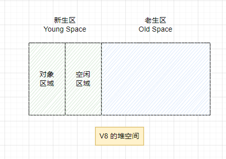

新加入的对象都会存放到对象区域，当对象区域快写满时，就需要执行一次垃圾清理操作。

在垃圾回收过程中，首先要对对象区域中的垃圾做标记；标记完成后，就进入垃圾清理阶段，副垃圾回收器会把这些存活的对象复制到空闲区域中，同时它还会把这些对象有序地排列起来，所以这个复制过程，就相当于完成了内存整理操作，复制后空闲区域就没有内存碎片了。

完成复制之后，对象区域与空闲区域进行角色翻转，也就是原来的对象区域变成空闲区域，原来的空闲区域变成对象区域。这样就完成了垃圾对象的回收操作，同时这种 **角色翻转的操作还能让新生代的这两块区域无限重复使用下去。**

由于新生代中采用 Scavenge 算法，所以每次执行清理操作时，都需要将存活的对象从对象区域复制到空闲区域。但复制操作需要时间成本，如果新生区空间设置太大，那么每次清理的时间就会很久，所以为了执行效率，一般新生区的空间会被设置的比较小。

也正是因为新生区的空间不大，所以很容易被存活的对象装满整个区域。为了解决这个问题，JavaScript 引擎采用了 **对象晋升策略**，即经过两次垃圾回收仍然存活的对象，会被移动到老生区。

##### 主垃圾回收器

主垃圾回收器主要负责老生区中的垃圾回收。除了新生区中晋升的对象，一些大的对象直直接被分配到老生区。因此老生区中的对象有两个特点，一个是对象占用空间大，一个是对象存活时间长。

由于老生区的对象比较大，若要在老生区使用 Scavenge 算法进行垃圾回收，复制这些大的对象将会花费比较多的时间，从而导致回收效率不高，同时还会浪费一半的空间。因此，主垃圾回收器是采用 **标记-清除（Mark-Sweep）** 算法进行垃圾回收的。

首先是标记过程阶段。标记阶段就是从一组根元素开始，递归遍历这组根元素，在这个遍历过程中，能到达的元素称为 **活动对象**，没有到达的元素就可以判断为 **垃圾数据**。

> 通过遍历调用栈，看里面是否有对这个对象的引用来判断。

比如最开始的那段代码，当 `showName` 函数执行退出之后，这段代码的栈和堆空间如下图所示：


从上图你可以大致看到垃圾数据的标记过程，当 `showName` 函数执行结束之后，ESP 向下移动，指向 foo 函数的执行上下文，这时候如果遍历调用栈，不会找到引用 1003 地址的变量，也就意味着 1003 这块数据是垃圾数据（图中红色标记区域）。由于 1050 这块数据被变量 b 引用，所以这块数据会被标记为活动对象。这就是大致的标记过程。

接下来就是垃圾的清除过程。它和副垃圾回收器的垃圾清除过程完全不同，你可以理解为这个过程是清除掉红色标记数据的过程，可以参考下图大致理解其清除过程。


上面的标记过程和清除过程就是标记 - 清除算法，不过对一块内存多次执行标记 - 清除算法后，会产生大量的不连续的内存碎片。而内存碎片过多会导致大对象无法分配到足够的连续内存，于是又产生了另外一种算法 - **标记 - 整理（Mark-Compact）**，这个标记过程仍然与标记 - 清除算法里的是一样的，但后续步骤不是直接对可回收对象进行清理，而是让所有存活的对象都向一端移动，然后直接清理掉边界之外的内存。

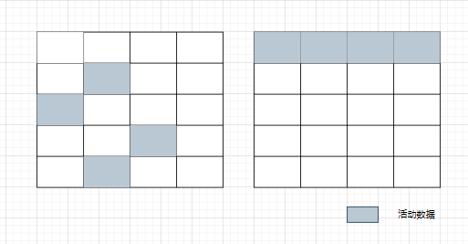

##### 全停顿

现在你已经知道 V8 是使用副垃圾回收器和主垃圾回收器处理垃圾回收的，不过由于 JavaScript 是运行在主线程之上的，一旦执行垃圾回收算法，就需要将 JavaScript 脚本暂停下来，待垃圾回收完毕后再恢复脚本执行。我们把这种行为叫做 **全停顿（Stop-The-World）**。

比如堆中的数据有 1.5 GB，V8 实现一次完整的垃圾回收需要 1 秒以上的时间，这也是由于垃圾回收而引起的 JavaScript 线程暂停执行的时间，若是这样的时间花销，那么应用的性能和响应能力都会直线下降。主垃圾回收器执行一次完整的垃圾回收流程如下图所示：

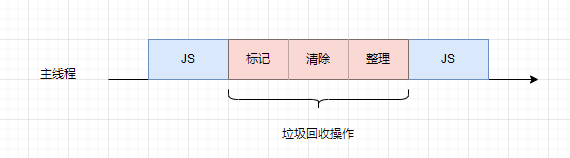

在 V8 新生代的垃圾回收中，因其空间较小，且存活对象较少，所以全停顿的影响不大，但老生代就不一样了。如果在执行垃圾回收过程中，占用主线程时间过久，在这期间主线程是不能做任何事情的。比如页面正在执行一个 JavaScript 动画，因为垃圾回收器在工作，就会导致这个动画延迟，造成页面卡顿的现象。

