# JavaScript 逆向

## 抓包工具 Charles

### 概述

* HTTP 抓包工具
* 支持 Windows、Linux、Mac
* 功能
  * 截获请求
  * 过滤请求
  * 重发请求
  * 设置断点
  * 端口转发
  * 反向代理

### 截获请求

测试地址：[https://httpbin.org/#/](https://httpbin.org/#/)


我们可以使用 [get 请求](https://httpbin.org/get) 进行测试，

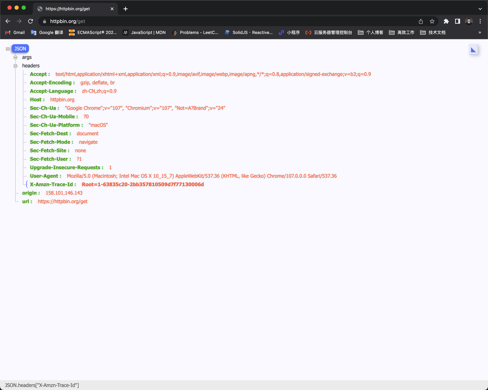


### 过滤请求

左下角直接输入域名过滤请求或者在请求域名上面右键选择 Focus 选项。


Focus 选中后只显示当前域名，其他域名会被放到 Other Hosts 分组下。


### 重发请求

选中请求点击刷新按钮即可。

另外我们可以点击笔的图标进行修改模式，对请求进行修改。


### 设置断点

Proxy - Breakpoints Settings


配置好后，刷新页面就会进入断点调试页面，可以对请求进行编辑。


### 模拟网速

Proxy - Throttle Settings

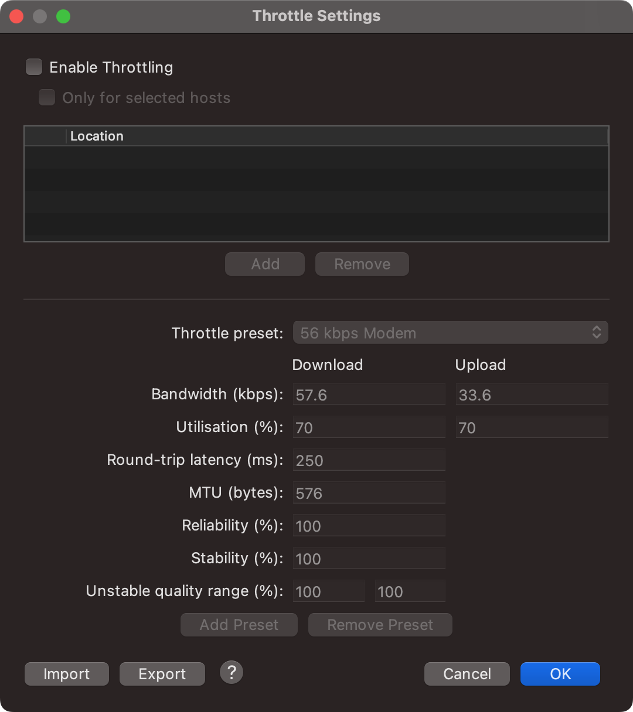


### 反向代理

反向代理相当于在我们发起请求的时候会经过我们配置的代理拿到响应之后再把响应转发给我们的客户端。

 Proxy - Reverse Proxies Settings


这样配置好之后当我们访问本地的 localhost:55619，就会帮我们代理到 httpbin.org，实现本地访问的效果。


除了上述演示效果，还有另外一种反向代理的实现，即在请求链接上右键选择 Map Remote 或者 Map Local，即将请求地址转发到远程地址或者本地地址，实现代理效果。

这样我们就可以篡改浏览器实际的请求，返回我们想返回的内容。


## Chrome 插件 - EditThisCookie

### 概述

Cookie 常见操作

* 查看 Cookies
* 编辑 Cookies（编辑内容或者有效期）
* 删除 Cookies，实现页面退出
* 添加 Cookie，未登录状态下添加某个 Cookie 绕过登录
* 导出导入 Cookie，持久化存储到电脑上

上述需求都可以使用浏览器插件 EditThisCookie 来完成，实现整个 Cookie 的管理。

 ### 安装

[官网地址](https://www.editthiscookie.com/) 

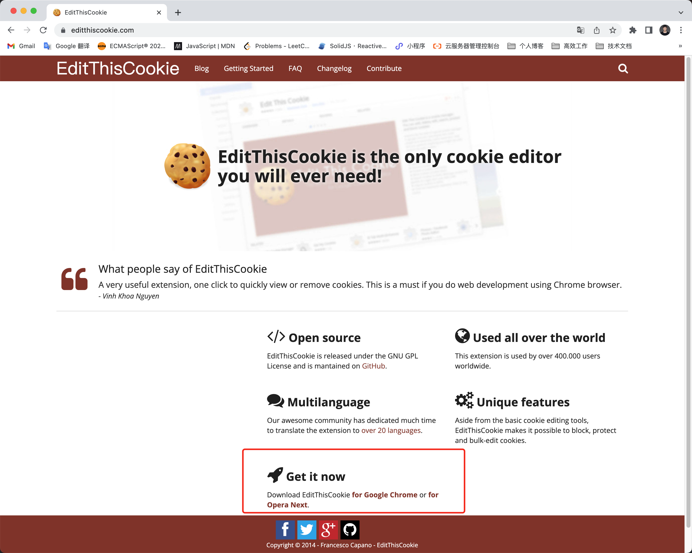

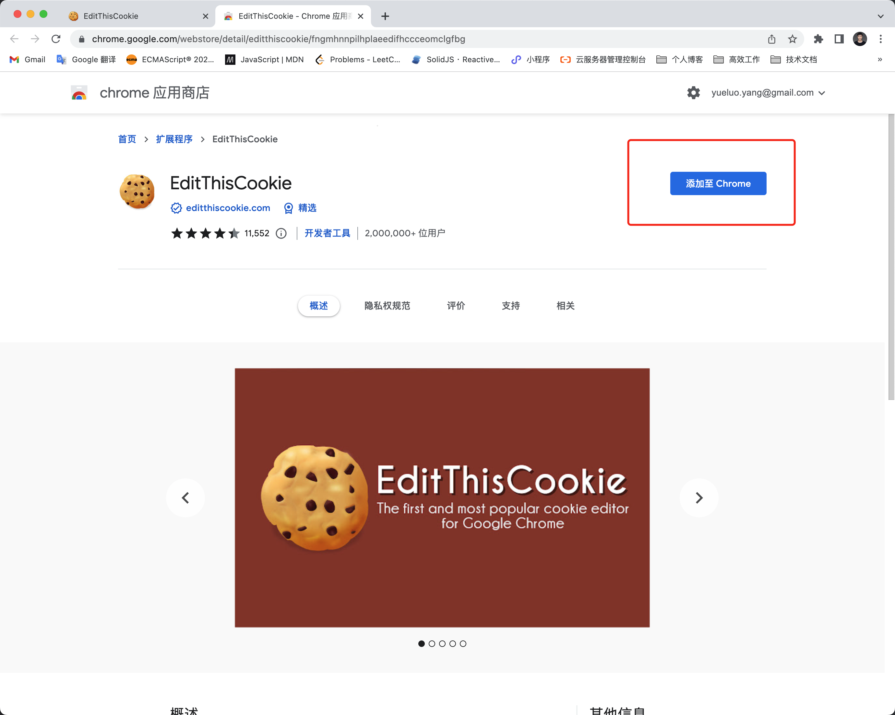

### 基本使用

可以使用插件弹窗的形式，也可以在开发者工具面板中找到。


Chrome 其实也自带 Cookie 管理面板，位于 Application - Storage - Cookies。


我们修改 Cookie 的 HttpOnly 属性，这样我们就可以使用 `document.cookie` 获取到所有的 Cookie。


控制台的面板相对于插件弹窗功能要少一些，使用弹窗使用同时操作所有 Cookie，例如删除所有，导入导出，新增 Cookie 等。


## Chrome 插件 - Toggle JavaScript

提供开启和关闭 JavaScript 功能的操作，使我们可以查看没有 JavaScript 代码执行时的页面效果。

## Chrome 插件 - Tampermonkey

### 概述

在浏览器自定义执行 JavaScript 脚本，完成如自动抢票、自动刷单等操作。

### 安装

chrome 浏览器直接搜索 tampermonkey 就可以找到该扩展程序。

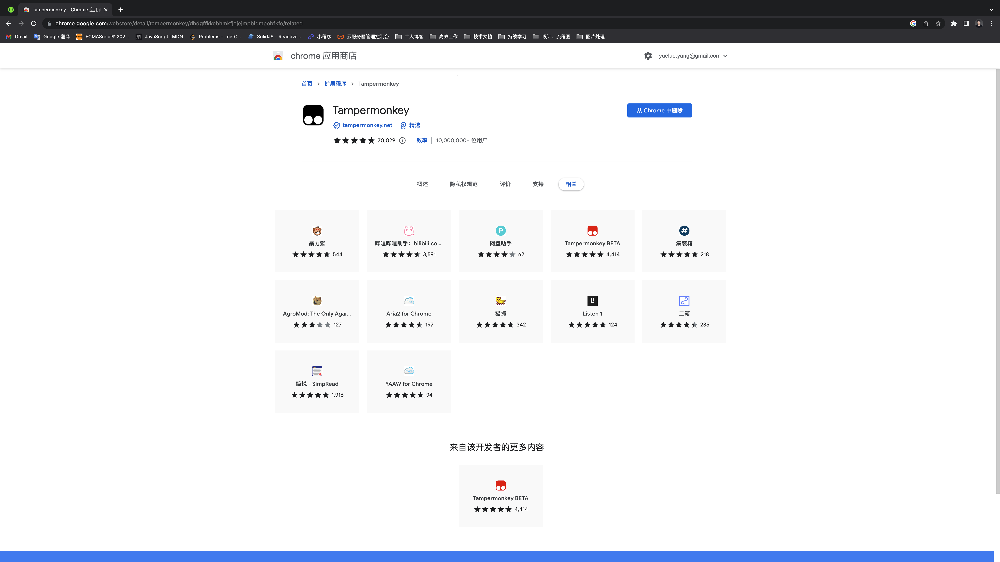

管理面板


### 自定义脚本

[脚本编写文档](https://www.tampermonkey.net/documentation.php?ext=dhdg#Q102)

新建脚本


 ```js
 // ==UserScript==
 // @name         test
 // @namespace    https://www.baidu.com/
 // @version      0.1
 // @description  test
 // @author       heora
 // @match        https://www.baidu.com/
 // @grant        none
 // ==/UserScript==
 
 (function() {
     'use strict';
 
     console.log('hello world')
 })();
 ```

保存后效果如下：


这样一个最简单的脚本就已经编写完成。打开百度就可以看到我们脚本并且会在控制台执行我们编写的函数被执行。

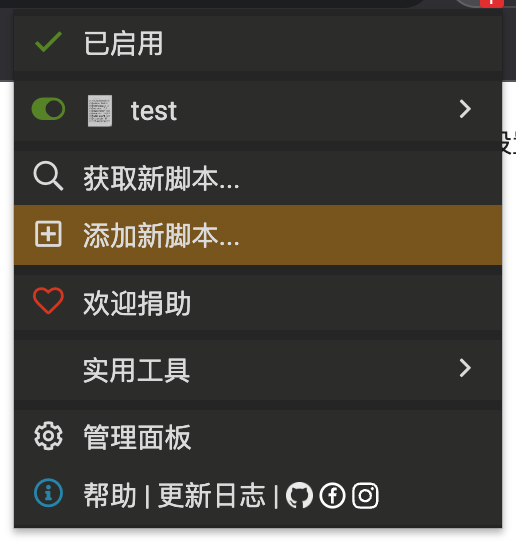

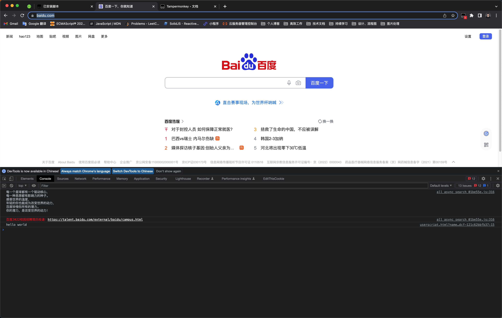

我们也可以在控制台看到我们编写的脚本源文件。


### JavaScript 逆向应用

Hook 技术。将原本执行的函数替换成我们自定义的函数，自定义函数会保持原有函数的功能，并为其附加新功能。不改变程序执行效果的前提下，实现自定义的效果。

```js
// ==UserScript==
// @name         HookBase64
// @namespace    http://xxx.com
// @version      0.1
// @description  Hook Base64 encode function
// @author       heora
// @match        http://xxx.com/login
// @grant        none
// ==/UserScript==

(function() {
    'use strict';

    function hook(object, attr) {
      const func = object[attr]

      object[attr] = function() {
        console.log('hooked', object, attr)
        const ret = func.apply(object, arguments)
        debugger
        return ret
      }
    }

    hook(window, 'btoa')
})();
```

原理就是代理方法，对方法进行重写，调试。例如上述代理的 btoa 方法，用于 base64 编码。

## 无限 debugger

### 概述

什么情况下会碰到 debugger

* 分析网络请求、查看元素的事件监听器、跟踪 js 等需求第一步就要打开浏览器的开发者工具，只要打开开发者工具就可能会碰到无限 debugger 死循环，或者在调试过程中也可能会出现无限 debugger 的死循环。

为什么反爬虫会用到无限 debugger

* 分析代码逻辑、调试跟踪代码是 js 破解的必要手段，分析调试主要就是使用开发者工具，使用无限 debugger 属于精准防控手段。

debugger 反爬虫的优势在哪里

* 实现比较简单，不必写复杂的反人类的反爬虫代码，写无限 debugger 应该是基本操作
*  效果比较明显，如果破解不了，不能进行下一步
* 一定程序可以提高代码逻辑的安全性，因为它可以阻止我们调试分析代码逻辑

###  作用

反调试：阻止调试和分析目标代码的运行逻辑

### 实现

debugger 关键字的应用

* Function/eval "debugger"
* function debugger

### 解决方案

测试代码

```js
const startDebug = () => {
  debugger
}

let i = 0
while (i < 10) {
  startDebug()
  console.log(`i ${i++}`)
}
```

#### 禁用所有断点

上述代码需要中断 10 次才能正常进行调试。解决方案也很简单，就是禁用所有断点。


禁用所有断点后，重新刷新页面代码可以正常执行。

#### 禁用某处断点

上述代码的关键就是 debugger，我们可以在行号前设置 Never pause here。


 #### 条件断点

我们可以在行号前设置  Add conditional breakpoint。


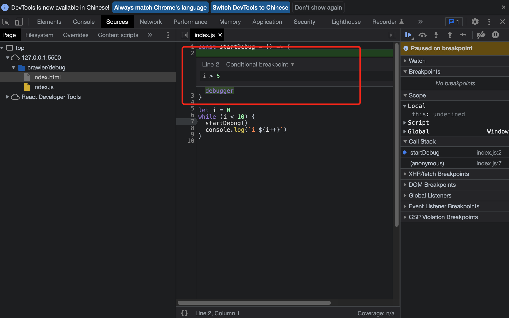

当 i > 5 时，才会执行 debugger，暂停程序执行。

#### 中间人工具替换特征字符串

在我们的案例中，特征字符串就是 debugger 关键字。我们可以利用 fiddler、charles 等工具将 debugger 关键字换成 "debugger" 或者替换为空。


#### reres 替换本地修改过的文件

reres 是一个浏览器插件，当它监控到目标文件时，就不进行网络请求，直接返回本地修改过的文件进行返回。其实也是篡改响应接口的一种方式。

#### 重写关键函数

这种方式算是比较稳妥，使用比较多的一种方式。需要在函数声明之后打断点，然后再重写目标函数。

对于 function 关键字声明或 var 声明的函数是有效的，不过对于 const 关键字声明的箭头函数是无效的，函数不能被重写。

重写关键函数可以指定方法名，或者使用 `Function.prototype.constructor = function() {}` ，这种方法只有在 `(function(){}).constructor === Function` 时才会生效。

```js
// 重写 eval 案例

 console.log(eval + '')
// 'function eval() { [native code] }'

// 重写 eval
window._origin_eval = window.eval

function $eval(src) {
  console.log(
    `==== eveal begin: length=${src.length}, caller=~${$eval.caller && $eval.caller.name} ====`
  )
  console.log(`injected ${document.location}`)
  console.log(src)
  console.log(`==== eval end ====`)

  return window._origin_eval(src)
}

Object.defineProperty(window, 'eval', { value: $eval })

console.log(eval + '')
// 'function $eval(src) {\n  console.log(\n    `==== eveal begin: length=${src.length}, caller=~${$eval.caller && $eval.caller.name} ====`\n  )\n  console.log(`injected ${document.location}`)\n  console.log(src)\n  console.log(`==== eval end ====`)\n\n  return window._origin_eval(src)\n}'

$eval.toString = function () {
  return 'function eval() { [native code] }'
}

console.log(eval + '')
// 'function eval() { [native code] }'
```

## 快速定位关键代码点

### 概述

* 快速定位 - 搜索
* 快速定位 - 断点
* 快速定位 - hook
* 快速定位 - 分析

### 快速定位 - 搜索

这里仅介绍比较常用的两个搜索：

#### 中间人的全局搜索

例如 fiddler 有放大镜按钮，就是全局搜索功能，支持关键字符串在请求和响应中的搜索

#### 开发者工具的全局搜索

开发者工具搜索分为两个搜索：

**Elements 面板搜索：基于 html 文本搜索（command + f）**


**全局搜索（command + option + f）**


两者的区别主要是 elements 面板搜索只能搜索 html 文本内容，不能搜索页面引入的 js 中的内容，而全局搜索支持搜索 js 文件。

所以当我们发现接口请求存在加密参数时，第一步就可以全局搜索一下加密参数，看看能否找到使用痕迹，如果发现踪迹，我们就可以去打断点调试 js 代码，进行分析。

如果全局搜索搜索不到内容，这时我们就需要分析调用栈，分析触发来源。

**网络过滤**

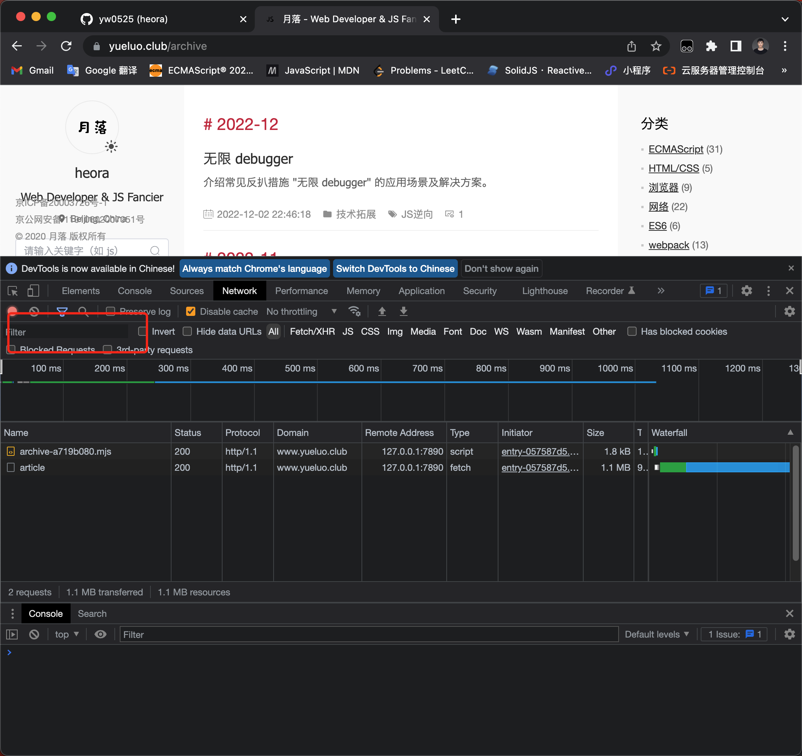

### 快速定位 - 断点

#### xhr

例如下面这个例子，这里的断点就是监听请求链接中是否存在 formSite 字段，如果命中。


#### dom


Break on 有三个，分别是子树、属性和节点移除，当触发这三个事件时，就会中断程序运行。


应用场景，某网站会采集用户鼠标事件、鼠标移动事件、鼠标左键单击事件、鼠标右键单击事件，还有键盘事件等，然后在触发事件时，会有一个隐藏的 input 标签记录操作行为， 当你点击登陆按钮时，会把属性值提交给后端，记录用户这段时间到底做了什么事情。

#### event

event，即事件监听器。

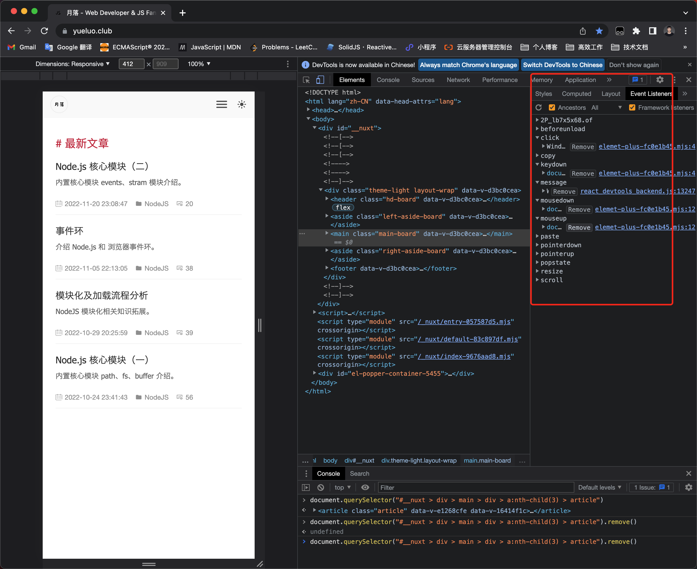

在上图中，我们可以看到，在 Elements 面板的 Event Listeners 中看到所有事件，如果我们有需求就可以对单独事件进行 debugger。

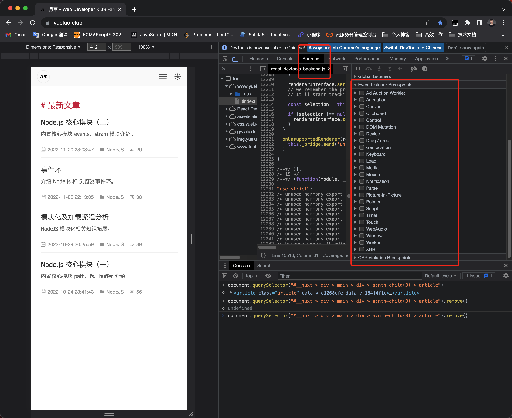

#### 自定义

自定义断点即用户自己打的断点。

### 快速定位 - hook

#### json

```js
const origin_stringify = JSON.stringify
JSON.stringify = function (params) {
  console.log('stringify', params)
  return origin_stringify(params)
}

const origin_parse = JSON.parse
JSON.parse = function (params) {
  console.log('parse', params)
  return origin_parse(params)
}
```

#### cookie

```js
 let origin_cookie = document.cookie
Object.defineProperty(document, 'cookie', {
  get() {
    console.log('getter cookie')
    return origin_cookie
  },
  set(value) {
    console.log('setter cookie', value)

    const cookie = value.split(';')[0]
    const cookieArr = cookie.split('=')

    let flag = false
    let cache = origin_cookie.split('; ')

    cache = cache.map(item => {
      if (item.split('=')[0] === cookieArr[0]) {
        flag = true
        return cookie
      }
      return item
    })

    origin_cookie = cache.join('; ')
    if (!flag) {
      origin_cookie += cookie + '; '
    }
    this._value = value

    return origin_cookie
  }
})
```

#### window attr

比如我们有一个加密参数是 window 属性，我们需要找到属性谁在哪里被赋值的。

```js
function hook(key) {
  const origin_window = window

  Object.defineProperty(window, key, {
    get() {
      console.log('getter window', key)
      return origin_window[key]
    },
    set(value) {
      console.log('setter window', value)
      origin_window.value = value
    }
  })
}
```

#### eval/Function

```js
// eval

const origin_eval = window.eval
function $eval(src) {
  console.log(
    `==== eveal begin: length=${src.length}, caller=~${$eval.caller && $eval.caller.name} ====`
  )
  console.log(`injected ${document.location}`)
  console.log(src)
  console.log(`==== eval end ====`)

  return origin_eval(src)
}

$eval.toString = () => 'function eval() { [native code] }'
Object.defineProperty(window, 'eval', { value: $eval })
```

```js
// Function

const origin_function = window.Function
function $func() {
  const args = [].slice.call(arguments, 0, -1).join(',')
  const src = [].slice.call(arguments).at(-1)

  console.log('function start')
  console.log(src)
  console.log('function end')

  return origin_function.apply(this, arguments)
}

$func.toString = () => origin_function + ''
Object.defineProperty(window, 'Function', { value: $func })
```

#### websocket

```js
const origin_ws = WebSocket.prototype.send
WebSocket.prototype.send = function (data) {
  console.log('websocket', data)
  return origin_ws(data)
}

```

#### and so on

只要我们可以想到的都可以去重写，感兴趣可以自己去尝试一下。

### 快速定位 - 分析

#### Elements Event Listeners

elements event listeners 之间我们已经说过很多次，这里就不再赘述。

#### Network type initator

当鼠标悬停于 initator 上时，就可以看到其调用栈，我们就可以根据调用栈一层一层的点进去，然后我们就可以对此进行分析。 


#### Console Log XMLHttpRequests

这个其实就是查看控制台信息，可以自主去查看开发者工具的其他功能。

## 代码混淆与加密

### 为什么加密或混淆

* JavaScript 代码运行于客户端
* JavaScript 代码是公开透明的

### 如何对 JavaScript 进行保护

* 代码压缩：去除空格、换行等
* 代码加密：eval、emscripten、WebAssembly 等
* 代码混淆：变量混淆、常量混淆、控制流扁平化、调试保护等

### JavaScript 加密实现

#### eval 加密

利用 eval 函数将 JavaScrpt 代码变成参数， eval 方法就是 JavaScript 代码的一个执行器，它可以把其中的参数按照 JavaScript 语法进行解析并执行。

这种加密方式其实就是把 JavaScript 代码变成 eval 方法的字符串参数，其中的一些字符都会被按照特定的格式编码。


这种加密方式并不复杂，将代码在控制台执行运行就可以得到结果。或者将 eval 包裹去掉，我们也可以得到一个函数。

#### Emscripten

* 核心：C/C++
* 编译：Emscripten
* 结果：asm.js
* 调用：JavaScript

#### WebAssembly

* 核心：C/C++
* 结果：wasm 文件
* 调用：JavaScript

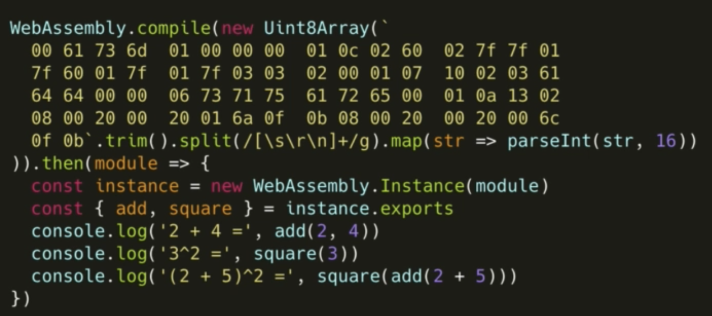

基本和 Emscripten 一致，不过它使用的是二进制编码，运行速度会更快，体积也会更小。

性能相对其他加密方式会好一些，但是涉及 C/C++ 代码改写，还需要进行编译，整体成本还是比较高的，这里仅做一下介绍。

### JavaScript 混淆技术

#### 相关技术

* 变量混淆
  * 源代码变量名基本都具有语义，例如 count 代表计数器等。
  * 变量混淆之后将变量变成一些无意义的、看起来比较乱的一些字符串，例如 16 进制的字符串，降低代码可读性。
* 字符串混淆
  * 将字符串进行 md5 加密、base64 编码、RC4，确保代码不会通过搜索的功能查到原始字符串，降低通过字符串寻找入口的风险。
* 属性加密
  * javascript 存在对象类型，可能是 key-value 的键值对，所以我们可以把 javascript 中的对象进行加密转化，将 key- value 映射关系混淆掉，变的更加难以寻找其中逻辑。 
* 控制流平坦化
  * 打乱原有代码的执行流程和函数调用关系。
  * 例如之前我们存在一些逻辑区块，它是由 A 到 B 到 C。 我们可以给它的控制流加上一个前置的控制流，前置的控制流中再加上一些条件判断，由前置的控制流进行分流。这样我们就可以把执行的逻辑变得更加复杂，难读。
* 僵尸代码注入
  * 将一些无用代码、不可能被执行到的代码注入到当前的代码里面，实现一些认为的扰乱。
* 代码压缩
  * 去除一些空格，回车，调试语句等代码，使文件变得更小，由多行代码变为一行代码，压缩代码体积，使代码更难读。
* 反调试
  * 基于浏览器的一些特性，对当前环境进行检验，加上 debugger 语句，例如无限 debugger，定时器 debugger，用一些断点进行干扰。
* 多态变异
  * JavaScript 代码被调用时，一旦代码被调用，代码就会立刻发生变化，变成和原来完全不同的代码，但是依旧可以保持功能完全，只是代码形式发生变化。 避免代码被动态分析、调试。
* 锁定域名
  * 对域名进行检测，JavaScript 代码必须运行在特定的域名下。
* 反格式化
  * 将代码格式化后，会有一些机制使得代码在运行的时候无法正常工作。
* 特殊编码
  * 将 JavaScript 代码编码成一些特别难读的代码，例如中括号，叹号等等，编译成一些表情，符号等等，不易读。

#### 开源项目

* UglifyJS：[https://github.com/mishoo/UglifyJS2](https://github.com/mishoo/UglifyJS2)
  * 抽象语法树，然后进行代码压缩或变异
* terser：[https://github.com/terser/terser](https://github.com/terser/terser)
  * 和 UglifyJS 功能类似，增加 ES6 支持
* javascript-obfuscator：[https://github.com/javascript-obfuscator/javascript-obfuscator](https://github.com/javascript-obfuscator/javascript-obfuscator)
  * 可以用来实现几乎所有的混淆效果，比如变量混淆、字符串混淆、属性加密、平展控制流、僵尸代码注入、反调试、反格式化等等。
* jsfuck：[https://github.com/aemkei/jsfuck](https://github.com/aemkei/jsfuck)
  * 将一些变量或者定义统一替换成有中括号等等的一些表示，代码代码体积也会变得很大
* AAEncode：[https://github.com/bprayudha/jquery.aaencode](https://github.com/bprayudha/jquery.aaencode)
* JJEncode：[https://github.com/ay86/jEncrypt](https://github.com/ay86/jEncrypt)

#### 在线工具

* [https://obfuscator.io/](https://obfuscator.io/)
* [http://www.freejsobfuscator.com/](http://www.freejsobfuscator.com/)
* [https://www.daftlogic.com/projects-online-javascript-obfuscator.htm](https://www.daftlogic.com/projects-online-javascript-obfuscator.htm)
* [https://beautifytools.com/javascript-obfuscator.php](https://beautifytools.com/javascript-obfuscator.php)
* [https://www.sojson.com/jscodeconfusion.html](https://www.sojson.com/jscodeconfusion.html)
* [http://www.jshaman.com/#free](http://www.jshaman.com/#free)

#### 商业服务

* [https://javascriptobfuscator.com/](https://javascriptobfuscator.com/)
* [https://jscrambler.com/](https://jscrambler.com/)
* [http://stunnix.com/](http://stunnix.com/)

### JavaScript 混淆实现

基于 javascript-obfuscator 演示、使用多种混淆技术、依赖 Node.js。

```js
pnpm init
```

```js
pnpm i javascript-obfuscator --save-dev
```

#### 基础案例

```js
// demo01.js

const obfuscator = require('javascript-obfuscator')

const code = `
  const x  = 'l' + 1
  console.log('x', x)
`

const options = {
  compact: false, // 是否压缩成一行
  controlFlowFlattening: true // 控制流平坦化
}

const obfuscate = (code, options) => obfuscator.obfuscate(code, options).getObfuscatedCode()
console.log(obfuscate(code, options))

// const _0x319a8e = _0x17c8;
// (function (_0x52f8e7, _0x57164d) {
//     const _0x46023b = _0x17c8, _0x430115 = _0x52f8e7();
//     while (!![]) {
//         try {
//             const _0x139205 = parseInt(_0x46023b(0x1c2)) / 0x1 + -parseInt(_0x46023b(0x1c0)) / 0x2 + -parseInt(_0x46023b(0x1c4)) / 0x3 + parseInt(_0x46023b(0x1be)) / 0x4 * (-parseInt(_0x46023b(0x1bc)) / 0x5) + -parseInt(_0x46023b(0x1ba)) / 0x6 + -parseInt(_0x46023b(0x1bb)) / 0x7 * (-parseInt(_0x46023b(0x1bd)) / 0x8) + -parseInt(_0x46023b(0x1c1)) / 0x9 * (-parseInt(_0x46023b(0x1c3)) / 0xa);
//             if (_0x139205 === _0x57164d)
//                 break;
//             else
// heora@yueluodeMBP obfuscator % node demo01.js
// function _0x37c2(_0x15e667, _0x179462) {
//     const _0x3fc284 = _0x3fc2();
//     return _0x37c2 = function (_0x37c288, _0x365673) {
//         _0x37c288 = _0x37c288 - 0x149;
//         let _0x3bb96b = _0x3fc284[_0x37c288];
//         return _0x3bb96b;
//     }, _0x37c2(_0x15e667, _0x179462);
// }
// const _0x41fee7 = _0x37c2;
// function _0x3fc2() {
//     const _0xff6162 = [
//         '2180445LYHBNw',
//         '6PoXlVC',
//         '1062245HPVdof',
//         '4962699JsvSZR',
//         '2037424UwkIQW',
//         '2wCqcbN',
//         '22550990HHAjbJ',
//         'log',
//         '181064EFBbAW',
//         '744311jBDKbx',
//         '153fCiFKW'
//     ];
//     _0x3fc2 = function () {
//         return _0xff6162;
//     };
//     return _0x3fc2();
// }
// (function (_0x44b360, _0x36241e) {
//     const _0x352cf1 = _0x37c2, _0x59526 = _0x44b360();
//     while (!![]) {
//         try {
//             const _0x546e33 = -parseInt(_0x352cf1(0x153)) / 0x1 + parseInt(_0x352cf1(0x14f)) / 0x2 * (parseInt(_0x352cf1(0x14a)) / 0x3) + -parseInt(_0x352cf1(0x14e)) / 0x4 + -parseInt(_0x352cf1(0x14c)) / 0x5 * (parseInt(_0x352cf1(0x14b)) / 0x6) + -parseInt(_0x352cf1(0x14d)) / 0x7 + parseInt(_0x352cf1(0x152)) / 0x8 * (-parseInt(_0x352cf1(0x149)) / 0x9) + parseInt(_0x352cf1(0x150)) / 0xa;
//             if (_0x546e33 === _0x36241e)
//                 break;
//             else
//                 _0x59526['push'](_0x59526['shift']());
//         } catch (_0x479a3c) {
//             _0x59526['push'](_0x59526['shift']());
//         }
//     }
// }(_0x3fc2, 0x670c0));
// const x = 'l' + 0x1;
// console[_0x41fee7(0x151)]('x', x);
```

整体来看，混淆之后可读性变得非常差。

#### 代码压缩

启用 compact 配置可以进行代码压缩，将多行代码压缩为一行。

```js
const obfuscator = require('javascript-obfuscator')

const code = `
  const x  = 'l' + 1
  console.log('x', x)
`

const options = {
  compact: true, // 是否压缩成一行
  controlFlowFlattening: true // 控制流平坦化
}

const obfuscate = (code, options) => obfuscator.obfuscate(code, options).getObfuscatedCode()
console.log(obfuscate(code, options))

// function _0x1ed0(){const _0x11ff60=['1696072pCxUdw','9081JMWsXK','58LluwlY','log','2552oFOSUn','1122qjQuAv','25537SpbjXH','711552eXkfAf','4202505CboVKg','8669610XfCMvT','29701fxdBiQ'];_0x1ed0=function(){return _0x11ff60;};return _0x1ed0();}const _0x34263e=_0x2ad4;(function(_0x51afa7,_0x14bd8d){const _0x11aac9=_0x2ad4,_0x4255eb=_0x51afa7();while(!![]){try{const _0x2f7cdd=parseInt(_0x11aac9(0x1a4))/0x1*(parseInt(_0x11aac9(0x1a0))/0x2)+-parseInt(_0x11aac9(0x19a))/0x3+-parseInt(_0x11aac9(0x19e))/0x4+-parseInt(_0x11aac9(0x19b))/0x5+parseInt(_0x11aac9(0x1a3))/0x6*(parseInt(_0x11aac9(0x19d))/0x7)+parseInt(_0x11aac9(0x1a2))/0x8*(-parseInt(_0x11aac9(0x19f))/0x9)+parseInt(_0x11aac9(0x19c))/0xa;if(_0x2f7cdd===_0x14bd8d)break;else _0x4255eb['push'](_0x4255eb['shift']());}catch(_0x12ce85){_0x4255eb['push'](_0x4255eb['shift']());}}}(_0x1ed0,0x8cf79));const x='l'+0x1;function _0x2ad4(_0x3170d9,_0x25c3ba){const _0x1ed02b=_0x1ed0();return _0x2ad4=function(_0x2ad40e,_0x2457e3){_0x2ad40e=_0x2ad40e-0x19a;let _0xf8cd45=_0x1ed02b[_0x2ad40e];return _0xf8cd45;},_0x2ad4(_0x3170d9,_0x25c3ba);}console[_0x34263e(0x1a1)]('x',x);
```

#### 变量名混淆

controlFlowFlattening 配置为 true，使用的是 16 进制混淆。我们还可以使用 identifierNameGenerator 属性， 设置其值为 `mangled`，即普通混淆。

```js
const obfuscator = require('javascript-obfuscator')

const code = `
  const x  = 'l' + 1
  console.log('x', x)
`

const options = {
  compact: true, // 是否压缩成一行
  // controlFlowFlattening: true // 控制流平坦化
  identifierNamesGenerator: 'mangled'
}

const obfuscate = (code, options) => obfuscator.obfuscate(code, options).getObfuscatedCode()
console.log(obfuscate(code, options))

// function a(){const i=['1402511atPvUm','226fjmYht','1084160Vfcblk','6748XotdGE','6ldcOls','374521DOItpE','587862aDEfQq','56gRDPSI','307471KdMVmp','5862OyJEBp','215otlhqL'];a=function(){return i;};return a();}(function(c,d){const h=b,e=c();while(!![]){try{const f=-parseInt(h(0x184))/0x1+parseInt(h(0x188))/0x2*(parseInt(h(0x185))/0x3)+parseInt(h(0x17f))/0x4*(parseInt(h(0x186))/0x5)+-parseInt(h(0x180))/0x6*(-parseInt(h(0x181))/0x7)+parseInt(h(0x183))/0x8*(parseInt(h(0x182))/0x9)+-parseInt(h(0x189))/0xa+-parseInt(h(0x187))/0xb;if(f===d)break;else e['push'](e['shift']());}catch(g){e['push'](e['shift']());}}}(a,0x3fa4c));function b(c,d){const e=a();return b=function(f,g){f=f-0x17f;let h=e[f];return h;},b(c,d);}const x='l'+0x1;console['log']('x',x);
```

#### 字符串混淆

```js
const options = {
  stringArray: true,
  rotateStringArray: true,
  stringArrayEncoding: ['base64'], // none, base64, rc4
  stringArrayThreshold: 1
}

const obfuscate = (code, options) => obfuscator.obfuscate(code, options).getObfuscatedCode()
console.log(obfuscate(code, options))

// const _0x58c2e4=_0x30f4;(function(_0x3dd5c3,_0x43cf03){const _0x50015b=_0x30f4,_0x175929=_0x3dd5c3();while(!![]){try{const _0x179e3e=parseInt(_0x50015b(0x13b))/0x1+-parseInt(_0x50015b(0x13d))/0x2+parseInt(_0x50015b(0x13e))/0x3+-parseInt(_0x50015b(0x13a))/0x4*(parseInt(_0x50015b(0x13f))/0x5)+-parseInt(_0x50015b(0x143))/0x6+-parseInt(_0x50015b(0x141))/0x7+-parseInt(_0x50015b(0x140))/0x8*(-parseInt(_0x50015b(0x13c))/0x9);if(_0x179e3e===_0x43cf03)break;else _0x175929['push'](_0x175929['shift']());}catch(_0x541ffd){_0x175929['push'](_0x175929['shift']());}}}(_0x1ccc,0xe0350));function _0x30f4(_0x4eb79e,_0x329d01){const _0x1ccc2c=_0x1ccc();return _0x30f4=function(_0x30f48d,_0x5a5d5e){_0x30f48d=_0x30f48d-0x13a;let _0x2d532d=_0x1ccc2c[_0x30f48d];if(_0x30f4['xjhYfs']===undefined){var _0x41f5fe=function(_0x56b76d){const _0x53a9ee='abcdefghijklmnopqrstuvwxyzABCDEFGHIJKLMNOPQRSTUVWXYZ0123456789+/=';let _0x1528e0='',_0x57a8e8='';for(let _0x170a79=0x0,_0xdbd185,_0x647290,_0x1847b2=0x0;_0x647290=_0x56b76d['charAt'](_0x1847b2++);~_0x647290&&(_0xdbd185=_0x170a79%0x4?_0xdbd185*0x40+_0x647290:_0x647290,_0x170a79++%0x4)?_0x1528e0+=String['fromCharCode'](0xff&_0xdbd185>>(-0x2*_0x170a79&0x6)):0x0){_0x647290=_0x53a9ee['indexOf'](_0x647290);}for(let _0x7c52f0=0x0,_0x13a433=_0x1528e0['length'];_0x7c52f0<_0x13a433;_0x7c52f0++){_0x57a8e8+='%'+('00'+_0x1528e0['charCodeAt'](_0x7c52f0)['toString'](0x10))['slice'](-0x2);}return decodeURIComponent(_0x57a8e8);};_0x30f4['BApANM']=_0x41f5fe,_0x4eb79e=arguments,_0x30f4['xjhYfs']=!![];}const _0x37ec4a=_0x1ccc2c[0x0],_0x52ca06=_0x30f48d+_0x37ec4a,_0x44eed0=_0x4eb79e[_0x52ca06];return!_0x44eed0?(_0x2d532d=_0x30f4['BApANM'](_0x2d532d),_0x4eb79e[_0x52ca06]=_0x2d532d):_0x2d532d=_0x44eed0,_0x2d532d;},_0x30f4(_0x4eb79e,_0x329d01);}function _0x1ccc(){const _0x1e5d0c=['mZzTuuDct0C','mtm4ntG1m1vnshvUAa','mJu4mdq4mdLSuwnuAvq','mJa0mZKWnfbqtgvWBa','ndyXotm2n0jjuNzfCa','nti3ndKWBgX6yxr5','ofHbvfvTua','mteXnJy2mtb6yw9mBhG','Bg9N','nZG0nJK2mLfeu0zSsG'];_0x1ccc=function(){return _0x1e5d0c;};return _0x1ccc();}const x='l'+0x1;console[_0x58c2e4(0x142)]('x',x);
```

```js
const options = {
  compact: false,
  unicodeEscaoeSequence: true
}

const obfuscate = (code, options) => obfuscator.obfuscate(code, options).getObfuscatedCode()
console.log(obfuscate(code, options))

// function _0x26ba(_0x36c780, _0x53d9ad) {
//   const _0x395a7c = _0x395a();
//   return _0x26ba = function (_0x26ba1b, _0x50e0f8) {
//       _0x26ba1b = _0x26ba1b - 0xf6;
//       let _0x673a36 = _0x395a7c[_0x26ba1b];
//       return _0x673a36;
//   }, _0x26ba(_0x36c780, _0x53d9ad);
// }
// const _0x4a8483 = _0x26ba;
// (function (_0x4f6148, _0x62c41e) {
//   const _0x12fd5b = _0x26ba, _0x1cdb96 = _0x4f6148();
//   while (!![]) {
//       try {
//           const _0x425692 = -parseInt(_0x12fd5b(0xff)) / 0x1 * (-parseInt(_0x12fd5b(0xfc)) / 0x2) + -parseInt(_0x12fd5b(0xf7)) / 0x3 + parseInt(_0x12fd5b(0xfb)) / 0x4 * (-parseInt(_0x12fd5b(0xfd)) / 0x5) + -parseInt(_0x12fd5b(0xfe)) / 0x6 * (-parseInt(_0x12fd5b(0xf9)) / 0x7) + -parseInt(_0x12fd5b(0xf6)) / 0x8 + -parseInt(_0x12fd5b(0xfa)) / 0x9 + parseInt(_0x12fd5b(0xf8)) / 0xa;
//           if (_0x425692 === _0x62c41e)
//               break;
//           else
//               _0x1cdb96['push'](_0x1cdb96['shift']());
//       } catch (_0x52d520) {
//           _0x1cdb96['push'](_0x1cdb96['shift']());
//       }
//   }
// }(_0x395a, 0xe5bec));
// function _0x395a() {
//   const _0x396de0 = [
//       '11wNEArv',
//       'log',
//       '3704680AnmDYz',
//       '4713714utvsgx',
//       '34268930dvIjTj',
//       '53137GzFDpL',
//       '8750070qAxqEg',
//       '260292YHShGR',
//       '138466fDpVBL',
//       '85BHgFkg',
//       '684wMjWNk'
//   ];
//   _0x395a = function () {
//       return _0x396de0;
//   };
//   return _0x395a();
// }
// const x = 'l' + 0x1;
// console[_0x4a8483(0x100)]('x', x);
```

#### 自我保护

代码混淆后，如果格式化运行，会将浏览器直接卡死。

原理：申请一些空间、新建一些对象、无限的新建一些 DOM 节点，或者有一些其他操作，它会疯狂占用浏览器和本机内存，将浏览器直接卡死，无法运行。

```js
const options = {
  selfDefending: true
}

const obfuscate = (code, options) => obfuscator.obfuscate(code, options).getObfuscatedCode()
console.log(obfuscate(code, options))

// function _0x6a5a(_0x57ebb1,_0x288f15){const _0x57a170=_0x3833();return _0x6a5a=function(_0x2482c9,_0x25f644){_0x2482c9=_0x2482c9-0x1ef;let _0x3833aa=_0x57a170[_0x2482c9];return _0x3833aa;},_0x6a5a(_0x57ebb1,_0x288f15);}const _0x252268=_0x6a5a;(function(_0x385891,_0x470326){const _0x193ce5=_0x6a5a,_0x3015bf=_0x385891();while(!![]){try{const _0x49f914=-parseInt(_0x193ce5(0x1fb))/0x1+-parseInt(_0x193ce5(0x1fc))/0x2*(parseInt(_0x193ce5(0x1ef))/0x3)+parseInt(_0x193ce5(0x1f3))/0x4+parseInt(_0x193ce5(0x1f2))/0x5*(parseInt(_0x193ce5(0x1f4))/0x6)+-parseInt(_0x193ce5(0x1f1))/0x7+parseInt(_0x193ce5(0x1f9))/0x8+-parseInt(_0x193ce5(0x1f0))/0x9*(parseInt(_0x193ce5(0x1f7))/0xa);if(_0x49f914===_0x470326)break;else _0x3015bf['push'](_0x3015bf['shift']());}catch(_0x5897ea){_0x3015bf['push'](_0x3015bf['shift']());}}}(_0x3833,0x86bac));const _0x25f644=(function(){let _0x8e8490=!![];return function(_0x19b5dc,_0x146e4a){const _0x16be9a=_0x8e8490?function(){const _0x556212=_0x6a5a;if(_0x146e4a){const _0x495ee9=_0x146e4a[_0x556212(0x1f5)](_0x19b5dc,arguments);return _0x146e4a=null,_0x495ee9;}}:function(){};return _0x8e8490=![],_0x16be9a;};}()),_0x2482c9=_0x25f644(this,function(){const _0x35d7d9=_0x6a5a;return _0x2482c9['toString']()[_0x35d7d9(0x1fa)](_0x35d7d9(0x1f6))[_0x35d7d9(0x1fd)]()[_0x35d7d9(0x1fe)](_0x2482c9)[_0x35d7d9(0x1fa)](_0x35d7d9(0x1f6));});_0x2482c9();function _0x3833(){const _0x3304a8=['5oGONaW','2118072PoiGNm','6069912QkkLzC','apply','(((.+)+)+)+$','236020nALghG','log','8703416GbJlym','search','697721FGPyIP','41456DmSEci','toString','constructor','51yNMskw','144UZjKrD','4546612XUZMRy'];_0x3833=function(){return _0x3304a8;};return _0x3833();}const x='l'+0x1;console[_0x252268(0x1f8)]('x',x);
```

#### 控制流平坦化

逻辑处理块统一加上前驱逻辑块，提高逻辑流程复杂度。

```js
 const options = {
  compact: false,
  controlFLowFlattening: true
}

const obfuscate = (code, options) => obfuscator.obfuscate(code, options).getObfuscatedCode()
console.log(obfuscate(code, options))

// const _0x5dc750 = _0x5706;
// (function (_0x3705ad, _0x1ab8ab) {
//     const _0x1cd39c = _0x5706, _0x35c863 = _0x3705ad();
//     while (!![]) {
//         try {
//             const _0x1b977e = parseInt(_0x1cd39c(0xb7)) / 0x1 * (-parseInt(_0x1cd39c(0xbc)) / 0x2) + -parseInt(_0x1cd39c(0xbf)) / 0x3 * (-parseInt(_0x1cd39c(0xba)) / 0x4) + -parseInt(_0x1cd39c(0xbe)) / 0x5 * (parseInt(_0x1cd39c(0xb6)) / 0x6) + parseInt(_0x1cd39c(0xc2)) / 0x7 + -parseInt(_0x1cd39c(0xb9)) / 0x8 + parseInt(_0x1cd39c(0xbb)) / 0x9 * (-parseInt(_0x1cd39c(0xc1)) / 0xa) + -parseInt(_0x1cd39c(0xb8)) / 0xb * (-parseInt(_0x1cd39c(0xc0)) / 0xc);
//             if (_0x1b977e === _0x1ab8ab)
//                 break;
//             else
//                 _0x35c863['push'](_0x35c863['shift']());
//         } catch (_0x40471c) {
//             _0x35c863['push'](_0x35c863['shift']());
//         }
//     }
// }(_0x3311, 0x2e4d1));
// const x = 'l' + 0x1;
// function _0x5706(_0x5eb3cb, _0x2fe232) {
// heora@yueluodeMBP obfuscator % node index.js
// function _0x5e0a(_0x3c930e, _0xf6aecd) {
//     const _0xb7c1fd = _0xb7c1();
//     return _0x5e0a = function (_0x5e0a43, _0x2da791) {
//         _0x5e0a43 = _0x5e0a43 - 0x91;
//         let _0x5bad25 = _0xb7c1fd[_0x5e0a43];
//         return _0x5bad25;
//     }, _0x5e0a(_0x3c930e, _0xf6aecd);
// }
// (function (_0x5cc324, _0x3698c3) {
//     const _0x118339 = _0x5e0a, _0x5a6295 = _0x5cc324();
//     while (!![]) {
//         try {
//             const _0x2d006b = parseInt(_0x118339(0x9a)) / 0x1 * (-parseInt(_0x118339(0x97)) / 0x2) + parseInt(_0x118339(0x94)) / 0x3 + parseInt(_0x118339(0x98)) / 0x4 * (-parseInt(_0x118339(0x95)) / 0x5) + parseInt(_0x118339(0x91)) / 0x6 * (parseInt(_0x118339(0x99)) / 0x7) + parseInt(_0x118339(0x93)) / 0x8 + -parseInt(_0x118339(0x92)) / 0x9 * (parseInt(_0x118339(0x9b)) / 0xa) + parseInt(_0x118339(0x96)) / 0xb;
//             if (_0x2d006b === _0x3698c3)
//                 break;
//             else
//                 _0x5a6295['push'](_0x5a6295['shift']());
//         } catch (_0x610e47) {
//             _0x5a6295['push'](_0x5a6295['shift']());
//         }
//     }
// }(_0xb7c1, 0xe2a91));
// const x = 'l' + 0x1;
// console['log']('x', x);
// function _0xb7c1() {
//     const _0x1b686a = [
//         '13309008LblyTk',
//         '4726668qrEbyA',
//         '24065OkOLaS',
//         '849354IMMUmk',
//         '727178NkDDmz',
//         '956iVWkFu',
//         '12497821clefPv',
//         '5WaaQvM',
//         '20kFAjWw',
//         '6FgSNaA',
//         '5423157YBbrFb'
//     ];
//     _0xb7c1 = function () {
//         return _0x1b686a;
//     };
//     return _0xb7c1();
// }
```

#### 僵尸代码注入

僵尸代码：不会被执行的代码或对上下文没有任何影响的代码，注入后可以对现有的 JavaScript 代码阅读形成干扰。

#### 对象键名替换

对 Object 对象键名替换

```js
const options = {
  compact: true,
  transformObjectKeys: true
}
```

#### 禁用控制台输出

将控制台方法置空

* debug
* info
* error
* exception
* trace

```js
const options = {
  disableConsoleOutput: true
}
```

#### 调试保护

无限 debug、定时 debug、debugger 关键字

```js
const options = {
  debugProtection: true
}
```

#### 域名锁定

只允许在特定域名下运行、降低被模拟风险

```js
const options = {
  domainLock: ['yueluo.club']
}
```

#### 其他实现

JSFuck

* 将变量进行逻辑替换，例如 false 会直接等于 `![]` ，然后把逻辑进行分析， 对代码进行混淆，可读性会变的非常差，体积也会变得很大。

AAEncode

* 将代码转换成表情符号的形式

JJEncode

* 将代码转换成 `$`、`+`、`:` 的形式

 上述这几种方式放到浏览器是可以直接运行的，也可以通过一些简单的方式对代码进行还原处理，看起来很复杂，但是非常容易破解。

## 处理代码混淆

### 加密分析流程总结

* 查看关键包 - 分析哪些参数是加密的
* 寻找加密位置
  * 搜索参数
    * 参数名 = / 参数名 = / 参数名: / 参数名: 
    * 参数名
  * 查看网络面板的 Initiator（发起）
  * xhr 断点调试
  * hook 相关逻辑
* 分析加密逻辑
* 补全加密逻辑

### 混淆代码处理

#### 样例 1

将 JavaScript 代码转换成颜文字网络表情的编码以达到混淆的目的。

原理：这类混淆通常都是使用构造函数将字符串作为代码运行。

例如：

```js
const sum = new Function('a', 'b', 'return a + b')
console.log(sum(2, 6))
```

解决方法：

* 直接将混淆后的代码粘贴至控制台通过 VM 查看源代码
* 

> 复制混淆后的代码新开页面，在控制台面板直接运行，通过直接执行或删减相关字段，使用报错信息查看虚拟空间或控制台中已解密代码。
> 或者手动将混淆后代码包裹，`().toString` 进行打印，原则就是利用 chrome 控制台自身功能实现代码解密。

#### 样例 2

Function 构造函数创建一个新的 Function 对象，我们直接调用构造函数就可以动态创建函数。

就像下面这段代码：

```js
const sum = new Function('a', 'b', 'return a + b')
console.log(sum(2, 6))
```

传递给 Function 的所有参数按照传递顺序被视作函数的xingc你，最后一个函数传入函数体，调用执行的时候就会创建一个计算两数之和的函数。

```js
$ = 'constructor'
$$ = 'console.log(1)'
$_ = ~[] // 0 按位取反即 -1

$_[$][$]($$)()

// =>
;(0)['constructor']['constructor']('console.log(1)')()
// =>
Function('console.log(1)')()
```

上述代码混淆的原理都是通过 `(0)['constructor']['constructor'](code)()` 来执行代码，这串代码等价于 `Function(code)()` 。

解决方法：

* 直接将混淆后的代码粘贴至控制台通过 VM 查看源代码
* 删除代码结尾的 "('_')" 替换为 "toString()" 或将修改后的代码粘贴至控制台运行

#### 样例 3

将 JavaScript 代码转换成只有 6 种字符 `([, ], (, ), !, +)` 的编码，以达到混淆的目的。

例如：

```js 
[+[]] // 0
[+!+[]] // 1
[!+[]+!+[]] // 2
(false+'') // a
(Function('return{}')()+'')[2] // b
([]['filter']+'')[3] // c
```

解决方法：

* 直接将混淆后的代码粘贴至控制台通过 VM 查看源代码
* 删除代码结尾的 "('_')" 替换为 "toString()" 或将修改后的代码粘贴至控制台运行
* 将代码结尾最后一堆的 "()" 包含的代码抽离出来单独运行

#### 样例 4

 
