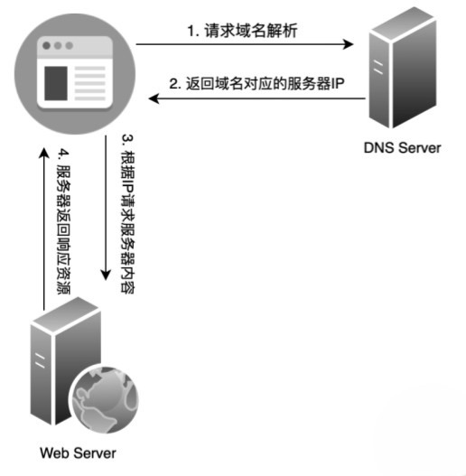

# 前端性能优化

## 一、Web 性能指标

### 什么是 Web 性能

简单来说就是网站够不够快。

* 打开速度
* 动画效果
* 表单提交
* 列表滚动
* 页面切换
* ...

MDN 上的 Web 性能定义：Web 性能是网站或应用程序的客观度量和可感知的用户体验。

* 减少整体加载时间：减小文件体积、减少 HTTP 请求、使用预加载
* 网站尽快可用：仅加载首屏内容，其他内容根据需要进行懒加载
* 平滑和可交互性：使用 CSS 替代 JS 动画、减少 UI 重绘
* 感知表现：页面可能不能做的更快，但是可以让用户感觉更快。耗时操作要给用户反馈，比如加载动画、进度条、骨架屏等提示信息
* 性能测定：性能指标、性能测试、性能监控持续优化

### 为什么关注 Web 性能

* 用户留存
* 网站的转化率
* 体验与传播
* 搜索排名
* 客户投诉
* 提升工作绩效
* ...

### 如何进行 Web 性能优化

首先需要了解性能指标，多块才算快？

使用专业的工具可量化地评估网站或应用的性能表现；

立足于网站页面响应的生命周期，分析出造成较差性能表现的原因；

技术改造、可行性分析等具体的优化实施，迭代优化；

#### 性能指标

* RAIL 性能模型
* 基于用户体验的核心指标
* 新一代性能指标：Web Vitals

#### 性能测量

* 浏览器 DevTools 调试工具
  * 网站监控分析
  * 性能监控分析
  * ...
* 灯塔（Lighthouse）
  * 网站整体质量评估，并给出优化建议
* WebPageTest
  * 多测试地点
  * 全面的优化报告
* ...

#### 生命周期

网站页面的生命周期，通俗地讲就是从我们在浏览器的地址栏中输入一个 URL 后，到整个页面渲染出来的过程。整个过程包括域名解析，建立 TCP 连接，前后端通过 HTTP 进行会话，压缩与解压缩，以及前端的关键渲染路径，把这些阶段拆解开来看，不仅能容易地获得优化性能的启发，而且也能为今后的前端工程师之路构建出完整的知识框架。

[从输入 URL 到页面展示发生了什么？](https://www.yuque.com/yyne87/bpfdka/dx063g)

#### 优化方案

* 发出请求到收到响应的优化，比如 DNS 查询、HTTP 长连接、HTTP 2、HTTP 压缩、HTTP 缓存等。
* 关键渲染路径优化，比如是否存在必要的重绘和回流。
* 加载过程的优化，比如延迟加载，是否有不需要再首屏展示的非关键信息，占用页面加载时间。
* 资源优化，比如图片、视频等不同的格式类型会有不同的使用场景，在使用的过程中是否恰当。
* 构建优化，比如压缩合并、基于 webpack 构建优化方案等.
* ...

### Web 性能指标

我们已经知道性能的重要性，但当我们讨论性能的时候，让一个网页变得很快，具体是指哪些?

实际上性能是相对的：

* 对于一个用户来说而言，一个站点可能速度很快（在具有功能强大的设备的快速网络上），而对于另一用户而言，一个站点可能会较慢（在具有低端设备的慢速网络上）。
* 两个站点可能会在完全相同的时间内完成加载，但一个站点似乎加载速度更快（如果它逐步加载内容，而不是等到最后显示任何内容）。
* 一个网站可能会出现快速加载但后来（在全部或没有）慢慢地响应用户的交互。

所以在讨论性能的时候，精确的、可量化的指标很重要。

但是，仅仅因为一个度量标准是基于客观标准并且可以定量地度量的，并不意味着这些度量是有用的。对于 Web 开发人员来说，如何衡量一个 Web  页面的性能一直是一个难题。

最初我们可以使用 Time To First Byte、DOMContentLoaded 和 Load 这些衡量文档加载速度的指标，但它们不能直接反应用户视觉体验。

为了能衡量用户视觉体验，Web 标准中定义了一些性能指标，这些性能指标被各大浏览器标准化实现，例如 First Paint 和 First Contentful Paint。还有一些由 Web 孵化器社区组（WICG）提出的性能指标，如 Largest Contentful Paint、Time to Interactive、First Input Delay、First CPU Idle。另外还有 Google 提出的 First Meaningful Paint、Speed Index，百度提出的 First Screen Paint。

这些指标之间并不是毫无关联，而是在以用户为中心的目标中不断演进出来的，有的已经不再建议使用、有的被各种测试工具实现、有的则可以作为通用标准有各大浏览器提供的可用于在生产环境测量的 API。

### RAIL 性能模型

RAIL 是 Response，Animation，Idle 和 Load 的首字母缩写，是一种由 Google Chrome 团队于 2015 年提出的性能模型，用于浏览器内的用户体验和性能。

RAIL 模型的理念是以用户为中心， 最终目标不是让您的网站在任何特定设备上都能运行很快，而是使用户满意。

* 响应（Response）：应该尽可能快速的响应用户，应该在 100ms 以内响应用户输入；
* 动画（Animation）：展示动画的时候，每一帧应该以 16ms 进行渲染，这样可以保持动画效果的一致性，并且避免卡顿；
* 空闲（Idle）：当使用 JavaScript 主线程的时候，应该把任务划分到执行时间小于 50ms 的片段中去，这样可以释放线程以进行用户交互；
* 加载（Load）：应该在小于 1s 的时间内加载完成你的网站，并可以进行用户交互。

> 根据网络条件和硬件的不同，用户对性能的理解也有所不同。例如，通过快速地 Wi-Fi 连接在功能强大的台式机上加载站点通常在 1 秒内完成，用户对此已经习以为常。在 3G 连接速度较慢的移动设备上加载网站需要花费更多的时间，因此移动用户通常更有耐心，在移动设备上加载 5S 是一个更现实的目标。

#### 响应

指标：应该尽可能快速的响应用户，应该在 100ms 以内响应用户输入。

网站性能对于响应的方面的要求是，在用户感知延迟之前接收操作的反馈。比如用户进行文本输入、按钮单击、表单切换及启动动画等操作后，必须在 100ms 内收到反馈，如果超过 100ms 的时间窗口，用户就会感知延迟。

看似很基本的用户操作背后，可能会隐藏着复杂的业务逻辑处理及网络请求与数据计算。对此我们应当谨慎，将较大开销的工作放在后台异步执行，而即便后台处理要数百毫秒才能完成的操作，也应当给用户提供及时的阶段性反馈。

比如在单击按钮向后台发起某项业务处理请求时，首先反馈给用户开始处理的提示，然后在处理完成的回调后给予反馈提示。

#### 动画

指标：展示动画的时候，每一帧应该以 10 ms 进行渲染，这样可以保证动画效果的一致性，避免卡顿。

前端所涉及的动画不仅需要酷炫的 UI 动效，还包括滚动和触摸拖动等交互效果，而这一方面的性能要求就是流畅。人眼具有视觉暂留特性，就是当光对视网膜所产生的视觉在光停止作用后，仍能保留一段时间。

研究表明这是由于视神经存在反应速度造成的，其值是 1/24 s，即当我们所见的物体移除后，该物体在我们眼中并不会立即消失，而会延续 1/24 s 的时间。对动画来说，无论动画帧率有多高，最后我们仅能分辨其中的 30 帧，但越高的帧率会带来更好的流畅体验，因此动画要尽力达到 60fps 的帧率。

目前大多数设备的屏幕刷新率为 60 次/秒，那么浏览器渲染动画或页面的每一帧的速率也需要跟设备屏幕的刷新率保持一致。所以根据 60 fps 帧率的计算，每一帧画面的生成都需要经过若干步骤，一帧图像的生成预算为 10ms （100ms / 60 ≈ 16.66ms），除去浏览器绘制新帧的时间，留给执行代码的时间仅为 10ms 左右。如果无法符合此预算，帧率会下降，并且内容会在屏幕上抖动。这个现象通常称为卡顿，会对用户体验产生负面影响。具体的优化策略，后面再详细介绍。

https://googlechrome.github.io/devtools-samples/jank/。

#### 空闲

指标：当使用 JavaScript 主线程的时候，应该把任务划分到执行时间小于 50 ms 的片段中去，这样可以释放线程以进行用户交互。

要使网站响应迅速、动画流畅，通常都需要较长的处理时间，但以用户为中心来看待性能问题，就会发现并非所有的工作都需要在响应和加载阶段完成，我们完全可以利用浏览器的空闲时间处理可延迟的任务，只要让用户感觉不到延迟即可。利用空闲时间处理延迟，可减少预加载的数据大小，以保证网站或应用快速完成加载。

为了更加合理地利用浏览器的空闲时间，最好将处理任务按 50 ms 为单位分组。
这么做就是保证用户在发生操作后的 100ms 内给出响应。

#### 加载

指标：首次加载应该在小于 5s 的时间内加载完成，并可以进行用户交互。对于后续加载，则是建议在 2 秒内完成。

用户感知要求我们尽量在 5s 内完成页面加载，如果没有完成，用户的注意力就会分散到其他事情上，并对当前处理的任务产生中断感。需要注意的是，这里的 5s 内完成加载并渲染出页面的要求，并非要完成所有页面资源的加载，从用户感知体验的角度来说，只要关键渲染路径完成，用户就会认为全部加载已完成。

对于其他非关键资源的加载，延迟到浏览器空闲时段在进行，是比较常见的渐进式优化策略。比如图片懒加载、代码拆分等优化手段。

### 基于用户体验的性能指标

基于用户体验的性能指标是 Google 在 web.dev 提出的。其中包括以下几个比较重要的性能指标：

* FCP
* LCP
* FID
* TTI
* TBT
* CLS

#### First Contentful Pant（FCP）

FCP（First Contentful Paint）首次内容绘制，浏览器首次绘制来自 DOM 的内容的时间，内容必须是文本、图片（包括背景图）、非白色的 canvas 和 SVG，也包括带有正在加载中的 Web 字体的文本。

即首屏第一次开始看到页面内容，但仅仅有内容，并不意味着是有用的内容，也不意味着有用户要消费的内容。


速度指标

| FCP 时间（以秒为单位） | 颜色编码     | FCP 分数（HTTP 存档百分位数） |
| ---------------------- | ------------ | ----------------------------- |
| 0-2                    | 绿色（快速） | 75-100                        |
| 2-4                    | 橙色（中等） | 50-74                         |
| 超过4                  | 红色（慢）   | 0-49                          |

优化方案：

https://web.dev/fcp/#how-to-improve-fcp

#### Largest Contentful Paint（LCP）

LCP（Largest Contentful Paint）最大内容绘制，可视区域最大的内容元素呈现在屏幕上的时间，用以估算页面的主要内容对用户可见时间。


LCP 考虑的元素：

* `` 元素
* `<image>` 元素内的 `<svg>` 元素
* `<video>` 元素（封面图）
* 通过 `url()` 函数加载背景图片的元素
* 包含文本节点或其他内联级文本元素子级的块级元素

为了提供良好的用户体验，网站应力争使用 2.5 秒或更短的 “最大内容绘制”。为确保您达到大多数用户的这一目标，衡量移动设备和台式机设备的页面加载量的第 75 个百分位数是一个很好的衡量标准。


速度指标

| LCP 时间（以秒为单位） | 颜色编码     |
| ---------------------- | ------------ |
| 0-2.5                  | 绿色（快速） |
| 2.5-4                  | 橙色（中等） |
| 超过4                  | 红色（慢）   |

优化方案：

https://web.dev/optimize-lcp/

#### First Input Delay（FID）

FID（First Input Delay）首次输入延迟，从用户第一次与页面交互（例如点击链接、点击按钮等）到浏览器实际能够响应该交互的时间。

输入延迟是因为浏览器的主线程正忙于做其他事情，所以不能响应用户。发生这种情况的一个常见原因是浏览器正忙于解析和执行应用程序加载的大量计算的 JavaScript。

第一次输入延迟通常发生在第一次内容绘制（FCP）和可持续交互时间（TTI）之间，因为页面已经呈现了一些内容，但还不能可靠地交互。


速度指标

| FID 时间（以毫秒为单位） | 颜色编码     |
| ------------------------ | ------------ |
| 0-100                    | 绿色（快速） |
| 100-300                  | 橙色（中等） |
| >300                     | 红色（慢）   |


优化方案：

https://web.dev/fid/#how-to-improve-fid

https://web.dev/optimize-fid

#### Time to Interactive（TTI）

表示网页第一次 **完全达到可交互状态** 的时间点，浏览器已经可以持续地响应用户的输入。完全达到可交互状态的时间点是在最后一个长任务（Long Task）完成的时间，并且在随后的 5 秒内网络和主线程是空闲的。从定义上来看，也可以被叫做可持续交互时间或可流畅交互时间。

> 长任务指需要 50 ms 以上才能完成的任务。

速度指标

| TTI 时间（以秒为单位） | 颜色编码     |
| ---------------------- | ------------ |
| 0-3.8                  | 绿色（快速） |
| 3.9-7.3                | 橙色（中等） |
| 7.3 以上               | 红色（慢）   |

优化方案：

https://web.dev/tti/#how-to-improve-tti

#### Total Block Time（TBT）

Total Block Time（TBT）总阻塞时间，度量 FCP 和 TTI 之间的总时间，在该时间范围内，主线程被阻塞足够长的时间导致输入无响应。

只要存在长任务，该线程就会被视为 "阻塞"，该任务在主线程上运行超过 50 ms，用户很可能注意到延迟并感觉页面缓慢或超时。


速度指标

| TTI 时间（以毫秒为单位） | 颜色编码     |
| ------------------------ | ------------ |
| 0-300                    | 绿色（快速） |
| 300-600                  | 橙色（中等） |
| >600                     | 红色（慢）   |

优化方案：

https://web.dev/tbt/#how-to-improve-tbt

#### Cumulative Layout Shift（CLS）

Curmulative Layout Shift（CLS）累计布局偏倚，CLS 会测量在页面整个生命周期中发生的每个意外的布局移位的所有单独布局移位分数的总和，它是一种保证页面的视觉稳定性从而提升用户体验的指标方案。


速度指标

| CLS 时间（以毫秒为单位） | 颜色编码     |
| ------------------------ | ------------ |
| 0-0.1                    | 绿色（快速） |
| 0.1-0.25                 | 橙色（中等） |
| >0.25                    | 红色（慢）   |

优化方案：

https://web.dev/cls/#how-to-improve-cls

https://web.dev/optimize-cls

### Web Vitals

Google 开发了很多实用指标和工具，帮助衡量用户体验和质量，从而发掘优化点。
Web Vitals 计划降低了学习成本，为网站体验提供了一组统一的质量衡量指标 - Core Web Vitals，其中包括加载体验、交互性和页面内容的视觉稳定性。

有很多方法可以优化网站的用户体验。如果可以预先了解最佳的优化衡量方案，可以大大节省时间和成本。

Google 在 2020 年 5 月 5 日提出新的用户体验量化方式 Web Vitals 来衡量网站的用户体验，并将这些衡量结果用作排名算法的一部分。

#### Core Web Vitals 与 Web Vitals

Core Web Vitals 是应用于所有 Web 页面的 Web Vitals 的子集，是其最重要的核心。

* 加载性能（LCP）- 显示最大内容元素所需时间
* 交互性（FID）- 首次输入延迟时间
* 视觉稳定性（CLS）- 累积布局配置偏移

#### 测试 Web Vitals

性能测试工具，比如 Lighthouse

实用 web-vitals 库

实用浏览器插件 Web Vitals

#### 参考链接

https://web.dev/vitals

## 二、Web 性能测试

### 性能测试概述

性能测试作为性能优化过程中的一环，目的通常是给后续优化工作提供指导方向、参考基线及前后对比的依据。性能检测并不是一次性执行结束后就完成的工作，它会在检测、记录和改进的迭代过程中不断重复，来协助网站的性能优化不断接近期望的效果。


* 不要通过单一指标衡量网站的性能体验
  * 如果完全站在用户感知的角度上产生的认知，只会存在主观上的好与差，很难给出切实可行的优化建议。因此我们应当从更多维度、更多具体的指标角度来度量网站应用的性能表现，比如页面的首屏渲染时间，不同类型资源的加载次数与速度，缓存的命中率等。
* 不要一次检测就能得到网站性能表现的客观结果。
  * 网站应用实际性能表现通常是高度可变的，因为它受许多因素的影响，比如用户使用的设备状况、当前网络的连接速度等，因此若想通过性能检测来得到较为客观的优化指导，就不能仅依赖一次检测的数据，而需要在不同环境下收集尽量多的数据，然后以此进行性能分析。
* 不要仅在开发环境中模拟性能检测。
  * 开发环境中模拟进行的性能检测具有许多优势：比如可以很方便地制定当前检测的设备状况与网络速度，可以对检测结果进行进行重复调试，但因其所能覆盖的场景有限，会很容易陷入 "幸存者偏差"，即所发现的问题可能并非实际的性能瓶颈。


我们若是想通过检测来进行有效的性能优化改进，就需要从尽可能多的角度对网站进行考量，同时保证检测环境的客观多样，能够让分析得出的结果更加贴近真实的性能瓶颈，这会花费大量的时间与精力，所以在进行性能优化之前我们还需要考虑所能投入的优化成本。

### 常见的检测工具

* LightHouse

* WebPageTest

* 浏览器 DevTools

  * 浏览器任务管理器
  * Network 面板
  * Coverage 面板
  * Memory 面板
  * Performance 面板
  * Performance monitor 面板

* 性能监控 API

* 持续的性能优化监控方案

### 顶塔 Lighthouse 测试性能

## 三、请求和响应优化

目的：更快的内容到达时间。

### 核心思路

* 更好的连接传输效率；
* 更少的请求数量；
* 更小的资源大小；
* 合适的缓存策略；

### 最佳实践

* 减少 DNS 查找：每次主机名的解析都需要一次网络往返，从而增加请求的延迟时间，同时还会阻塞后续请求
* 重用 TCP 连接：尽可能的使用持久连接，以消除 TCP 握手和慢启动导致的延迟
* 减少 HTTP 重定向：HTTP 重定向需要额外的 DNS 查询、TCP 握手等非常耗时，最佳的重定向次数为 0
* 压缩传输资源：Gzip、图片压缩
* 使用缓存：HTTP 缓存、CDN 缓存、Service Worker 缓存
* 使用 CDN（内容分发网络）：把数据放在离用户地理位置更近的地方，可以明显地减少每次 TCP 连接的网络延迟，增大吞吐量
* 删除没有必要的请求的资源
* 客户端缓存资源：缓存必要的应用资源，避免每次都重复请求相同的内容，例如多图片下载可以考虑使用缓存
* 内容在传输前先压缩：传输数据之前应该先压缩应用资源，把要传输的字节减少到最小，在压缩的时候确保对每种不同的资源采用最好的压缩手段
* 消除没有必要的请求开销：减少请求的 HTTP 首部数据（比如 HTTP Cookie）
* 并行处理请求和响应：请求和响应的排队都会导致延迟，可以尝试并行的处理请求和响应（利用多个 HTTP 1.1 连接实现并行下载，在可能的情况下使用 HTTP 管道计数）
* 针对协议版本采取优化措施：升级到 HTTP 2.0
* 根据需要采用服务端渲染方式：可以解决 SPA 应用首屏渲染慢的问题
* 采用预渲染的方式快速加载静态页面：页面渲染的极致性能，比如适合静态页面

### DNS 解析优化

当浏览器从（第三方）服务器请求资源时，必须先将该跨域域名解析为 IP 地址，然后浏览器才能发出请求，这个过程称为 DNS 解析。

DNS 作为互联网的基础协议，其解析速度似乎很容易被网站优化人员忽视。现在大多数新浏览器已经针对 DNS 解析进行优化，比如 DNS 缓存。典型的一次 DNS 解析需要耗费 20-120 毫秒，所花费的时间几乎可以忽略不计，但是当网站使用的资源依赖于多个不同的域时，时间就会成倍的增加，从而增加网站加载时间。比如在某些图片较多的页面中，在发起图片加载请求之前预先把域名解析好将会有 5% 的图片加载速度提升。

一般来说，前端优化中与 DNS 有关的有两点：

* 减少 DNS 的请求次数
* DNS 预获取：DNS Prefetch

#### 减少 DNS 查找

域名系统（DNS）将主机名映射到 IP 地址。在浏览器中输入 `www.yueluo.club` ，浏览器联系的 DNS 解析器将返回该服务器的 IP 地址。DNS 通常需要 20-120 毫秒来查找给定主机名的 IP 地址。在 DNS 查找完成之前，浏览器无法从该主机名下载任何内容。

缓存 DNS 查找以提高性能。这种缓存可以由用户的 `ISP` 或局域网维护的特殊缓存服务器上进行，但是在个别用户的计算机上也会发生缓存。DNS 信息保留操作系统的 DNS 缓存中（Microsoft Windows 上的 “DNS 客户端服务”）。大多数浏览器都有自己的缓存，与操作系统的缓存分开。只要浏览器将 DNS 记录保留在自己的缓存中，它就不会对操作系统发出记录请求进行打扰。

默认情况下，Internet Explorer 会缓存 30 分钟的 DNS 查找，这是由 `DnsCacheTimeout` 注册表指定的。Firefox 在 `network.dnsCacheExpiration` 配置的控制下缓存 DNS 查找 1 分钟。Chrome 也是 1 分钟。

当客户端的 DNS 缓存为空（对于浏览器和操作系统）时，DNS 查找的次数等于网页中唯一主机名的数目。这包括在页面的 URL，图像，脚本文件，样式表，Flash 对象等中使用的主机名。减少唯一主机名的数量将减少 DNS 查找的数量。

> 阿里云域名解析配置，可以配置 TTL，TTL 指域名对应的 DNS 解析记录缓存过期时间。
> 默认值是 10 分钟，可以根据自己需要设置 10 分钟 - 1 小时。

减少域名的数量有可能减少页面中并行下载的数量。避免 DNS 查找会减少响应时间，但是减少响应并行下载可能会增加响应时间。
**建议将资源划分为至少两个但不超过四个域名。这将减少 DNS 查找和允许高度并行下载之间取得良好的折衷。**

> chrome 浏览器中每个域名的并发数是 6 个。

#### dns-prefetch

DNS-prefetch（DNS 预获取）是尝试在请求资源之前解析域名。这可能是后面要加载的文件，也可能是用户尝试打开的链接目标。域名解析和内容载入是串行的网络操作，所以这个方式能够减少用户等待时间，提升用户体验。

dns-prefetch 可以帮助开发人员掩盖 DNS 解析延迟。HTML `link` 元素通过 `dns-prefetch`  的 `rel` 属性值提供此功能。在 `href` 属性值指定要跨域的域名。

```html
<link rel=”dns-prefetch“ href="https://data.yueluo.club">
```

下面是我的个人博客对 `dns-prefetch` 的使用。

```html
<link rel="dns-prefetch" href="https://data.yueluo.club">
<link rel="dns-prefetch" href="https://at.alicdn.com">
```

还可以通过 HTTP Link 字段将 `dns-prefetch` （以及其他资源提示）指定为 HTTP 标头：

```http
Link: <https://at.alicdn.com/>; rel=dns-prefetch
```

每当站点引用跨域域上的资源时，都应在 `<head>` 元素中放置 `dns-prefetch` 提示，但是要记住一些注意事项：

* `dns-prefetch` 仅对跨域域上的 DNS 查询有效，因此避免使用它来指向您的站点或域。因为浏览器看到提示时，您站点域背后的 IP 已经被解析；
* `dns-prefetch` 慎用，多页面重复 DNS 预解析会增加 DNS 查询次数；
* 默认情况下浏览器会对页面中和当前域名不再同一个域的域名进行预获取，并且缓存结果，这就是隐式的 DNS Prefetch（高版本浏览器支持隐式预解析）。如果想对页面中没有出现的域进行预获取，那么就要使用 `dns-prefetch` 了；
* 虽然使用 DNS Prefetch 能够加快页面解析速度，但也不能滥用，有开发者指出禁用 DNS 预读能节省每月 100 亿的 DNS 查询（大型网站）。

```html
<meta http-equiv="x-dns-prefetch-control" content="off">
```

#### 更多 DNS 解析优化

* 延长 DNS 缓存时间；
* 尽可能使用 A 或 `AAAA` 记录代替 `CNAME`；
* 使用 CDN 加速域名；
* 自己搭建 DNS 服务。

#### 清除 DNS 缓存

**清除浏览器 DNS 缓存**

* 请求 DNS 缓存：`chrome://net-internals/#dns`，clear host cache
* 有时候也需要同时请求套接字缓存池：`chrome://net-internals/#sockets` ，flush socket pools

**清除系统 DNS 缓存**

```bash
# windows 中查看 DNS 缓存记录
ipconfig /displaydns

# windows 中清除 DNS 缓存记录
ipconfig /flushdns

# MacOS 中请求 DNS 缓存记录
sudo killall -HUP mDNSResponder
```

#### 参考链接

* [https://developer.mozilla.org/zh-CN/docs/Web/Performance/dns-prefetch](https://developer.mozilla.org/zh-CN/docs/Web/Performance/dns-prefetch)
* [https://developer.mozilla.org/zh-CN/docs/Web/HTTP/Headers/X-DNS-Prefetch-Control](https://developer.mozilla.org/zh-CN/docs/Web/HTTP/Headers/X-DNS-Prefetch-Control)
* [https://ashu.online/blogs/optimize-dns-resolution-for-fast-website](https://ashu.online/blogs/optimize-dns-resolution-for-fast-website)

### HTTP 长连接

[透视 HTTP 协议](https://www.yuque.com/yyne87/mw1l9v)

#### 短链接

HTTP 协议的初始版本，每进行一次 HTTP 通信就要断开一次 TCP 连接。

以早期的通信情况来说，因为都是容量很小的文本传输，所以即使这样也没有多大问题。随着 HTTP 的大量普及，文档中包含大量富文本（图片、视频等资源）的情况多起来。

比如，使用浏览器浏览一个包含多张图片的 HTML 页面时，在发送请求访问 HTML 页面资源的同时，也会请求该 HTML 页面包含的其他资源。因此，每次的请求都会造成无谓的 TCP 连接建立和断开，增加通信录的开销。

为了解决这个问题，有些浏览器在请求时，用了一个非标准的 Connection 字段。

```http
Connection: keep-alive
```

这个字段要求服务器不要关闭 TCP 连接，以便其他请求复用。服务器同样回应这个字段。

```http
Connection: keep-alive
```

一个复用的 TCP 连接就建立了，直到客户端或服务器主动关闭连接。但是，这不是标准字段，不同实现的行为可能不一致，因此不是根本的解决方法。

#### 长连接

1997 年 1 月，HTTP/1.1 版本发布，只比 1.0 版本晚了半年。它进一步完善了 HTTP 协议，直到现在还是流行的版本。

HTTP 1.1 版本的最大变化，就是引入了持久连接（HTTP Persistent Connections），即 TCP 连接默认不关闭，可以被多个请求复用，不用声明 `Connection: keep-alive`。

持久连接的好处在于减少了 TCP 连接的重复建立和断开所造成的额外开销，减轻了服务器的负载。另外，减少开销的那部分时间，使 HTTP 请求和响应能够更早的结束，这样 Web 页面的显示速度也就相应提高了。

客户端和服务器发现对方一段时间没有活动，就可以主动关闭连接。不过，规范的做法是，客户端在最后一个请求时，发送 `Connection: close` ，明确要求服务器关闭 TCP 连接

```http
Connection: close
```

目前，对于同一个域名，大多数浏览器允许建立 6 个持久连接。

#### 管道机制

HTTP 1.1 版本还引入了管道机制（pipelining），即在同一个 TCP 连接里面，客户端可以同时发送多个请求，进一步改进了 HTTP 协议的传输效率。

管线化技术出现后，不用等待响应即可直接发送下一个请求。这样就能够做到同时并发多个请求，而不需要一个接一个的等待响应，与挨个连接相比，持久连接可以让请求更快结束。管线化技术比持久连接还要快。请求数越多，时间差就越明显。

举例来说，客户端要请求两个资源。以前的做法是，在同一个 TCP 连接里面，先发送 A 请求，然后等待服务器做出回应，收到后再发出 B 请求。管道机制则是允许浏览器同时发出 A 请求和 B 请求，但是服务器还是按照顺序，先回应 A 请求，完成后再回应 B 请求。

#### Content-Length 字段

一个 TCP 连接可以传送多个回应，所以必须有一种机制，区分数据包属于哪一个回应。这就是 `Content-length` 字段的作用，声明本次回应的数据长度。

```http
Content-Length: 3495
```

上面代码告诉浏览器，本次回应的长度是 3495 个字节，后面的字节就属于下一个回应了。

在 1.0 版本中，`Content-Length` 字段不是必需的，因为浏览器发现服务器关闭了 TCP 连接，就表明收到的数据包已经全了。

> 在长连接中的一个重要问题是如何正确地区分多个报文的开始和结束，所以最好总使用 “Content-Length” 头明确响应实体的长度，正确标记报文结束。如果是流式传输，body 长度不能立即确定，就必须用分块传输编码。

#### 分块传输编码

使用 `Content-Length` 字段的前提是，服务器发送回应之前，必须知道回应的数据长度。

对于一些很耗时的动态操作来说，服务器要等到所有操作完成，才能发送数据，显然这样的效率不高。更好的处理方法是，产生一块数据，就发送一块，采用 ”流模式“ （stream）取代 ”缓存模式“（buffer）。

因此，1.1 版本规定不适用 `Content-Length` 字段，使用 "分块传输编码"（chunked transfer encoding）。只要请求或回应的头信息有 `Transfer-Encoding` 字段，就表明回应将由数量未定的数据块组成。

```http
Transfer-Encoding: chunked
```

每一个非空的数据块之前，会有一个 16 进制的数值，表示这个块的长度。最后一个是大小为 0 的块，就表明本次回应的数据发送完了。

```http
HTTP/1.1 200 OK
Content-Type: text/plain
Transfer-Encoding: chunked

25
This is the data in the first chunk

1C
and this is the second one

3
con

8
sequence

0
```

#### 长连接的缺点

[HTTP 连接管理](https://www.yuque.com/yyne87/mw1l9v/radz03#bj7ml)

虽然 HTTP 1.1 版本允许复用 TCP 连接，但是同一个 TCP 连接里面，所有的数据通信是按次序进行的。服务器只有处理完一个回应，才能进行下一个回应。要是前面的回应特别慢，后面就会有许多请求排队等着。这就是 ”队头阻塞“（Head-of-line blocking）。

> “队头阻塞”与短连接和长连接无关，而是由 HTTP 基本的“请求 - 应答”模型所导致的。
>
> 因为 HTTP 规定报文必须是“一发一收”，这就形成了一个先进先出的“串行”队列。队列里的请求没有轻重缓急的优先级，只有入队的先后顺序，排在最前面的请求被最优先处理。
>
> 如果队首的请求因为处理的太慢耽误了时间，那么队列里后面的所有请求也不得不跟着一起等待，结果就是其他的请求承担了不应有的时间成本。
>
> 

为了避免这个问题，只有两种方法：

* 减少请求数
* 多开持久连接

这也导致了很多的网页优化技巧，比如合并脚本和样式表、将图片嵌入 CSS 代码、域名分片（domain sharding）等等。

### HTTP2 协议

2009 年，谷歌公开了自行研发的 SPDY 协议，主要解决 HTTP/1.1 效率不高的问题。

这个协议在 Chrome 浏览器上证明可行以后，就被当做 HTTP/2 的基础，主要特性都在 HTTP/2 中得到继承。

2015 年，HTTP/2 发布。它不是 HTTP/2.0 ，因为标准委员会不打算再发布子版本了，下一个新版本将是 HTTP/3。

#### 二进制协议

HTTP/1.1 版本的头信息肯定是文本（ASCII 编码），数据体可以是文本，也可以是二进制。
HTTP/2 则是一个彻底的二进制协议，头信息和数据体都是二进制，并且统称为 ”帧“（frame）：头信息帧和数据帧。

二进制协议的一个好处就是，可以定义额外的帧。HTTP/2 定义了近十种帧，为将来的高级应用打好了基础。如果使用文本实现这种功能，解析数据将会变得十分麻烦，二进制解析则方便得多。

#### 多工

HTTP/2 复用 TCP 连接，在一个连接里，客户端和浏览器都可以同时发送多个请求或响应，而且不用按照顺序一一对应，这样就避免了 ”队头阻塞“。

举例来说，在一个 TCP 连接里面，服务器同时收到 A 请求和 B 请求，于是先回应 A 请求，结果发现处理过程非常耗时，于是就发送 A 请求已经处理好得部分，接着回应 B 请求，完成后，再发送 A 请求剩下得部分。

这样双向的、实时的通信，就叫做多工（Multiplexing）。

这是一个对比 HTTP1 和 HTTP2 资源加载的在线示例：https://http2.akamai.com/demo。

#### 数据流

因为 HTTP/2 的数据包是不按顺序发送的，同一个连接里面连续的数据包，可能属于不同的回应。因此，必须要比数据包进行标记，指出它属于哪个回应。

HTTP/2 将每个请求或回应的所有数据包，称为一个数据流（stream）。每个数据流都有一个独一无二的编号。数据包发送的时候，都必须标记数据流 ID，用来区分它属于哪个数据流。另外还规定，客户端发出的数据流，ID 一律为奇数，服务器发出的，ID 为偶数。

数据流发送到一半的时候，客户端和服务器都可以发送信号（RST_STREAM 帧），取消这个数据流。1.1 版本取消数据流的唯一方法，就是关闭 TCP 连接。也就是说，HTTP/2 可以取消某一次请求，同时保证 TCP 连接还打开着，可以被其他请求使用。

客户端还可以指定数据流的优先级。优先级越高，服务器就会越早响应。

#### 头信息压缩

HTTP 协议不带有状态，每次请求都必须附上所有信息。所以，请求的很多字段都是重复的，比如 Cookie 和 User Agent，一模一样的内容，每次请求都必须附带，这回浪费很多带宽，影响速度。

HTTP/2 对这一点做了优化，引入了头信息压缩机制（header compression）。一方面，头信息使用 gzip 或 compress 压缩后再发送；另一方面，客户端和服务器同时维护一张头信息表，所有字段都会存入这个表，生成一个索引号，以后就不发送同样字段了，只发送索引号，这样就可以提高速度。

####  服务器推送

HTTP/2 允许服务器未经请求，主动向客户端发送资源，即服务器推送（server push）。

常见场景是客户端请求一个网页，这个网页里面包含很多静态资源。正常情况下，客户端必须收到网页，解析 HTML 源码，发现存在静态资源，在发出静态资源请求。当服务器预期到客户端请求网页后，很可能会再请求静态资源，所以就主动把这些静态资源随着网页一起发送给客户端。

> 服务器需要根据客户端需要推送，是否启用这个功能，要根据性能、功能、维护性方面做一些权衡。

### 避免重定向

> https://developer.mozilla.org/zh-CN/docs/Web/HTTP/Redirections

URL  重定向，也成为 URL 转发，是一种当实际资源，如单个表单、表单或者整个 Web 应用被迁移到新的 URL 下的时候，保持（原有）链接可用的技术。HTTP 协议提供了一种特殊形式的响应 - HTTP 重定向（HTTP redirects）来执行此类操作。

重定向可以实现许多目标：

* 站点维护或停机期间的临时重定向；
* 永久重定向将在更改站点的 URL，上传文件时的进度页等之后保留现有的链接/书签；
* 上传文件时的表示进度的页面。

####  原理

在 HTTP 协议中，重定向操作由服务器通过发送特殊的响应（redirects）而触发。HTTP 协议的重定向的状态码为 3xx。

浏览器在接收到重定向响应的时候，会采用该响应提供的新的 URL，并立即进行加载；大多数情况下，除了一小部分性能损失外，重定向操作对于用户是不可见的。


不同类型的重定向映射可以划分为三类：

* 永久重定向
* 临时重定向
* 特殊重定向

#### 永久重定向

这种重定向操作是永久性的。它表示原 URL 不应被应用，应该优先选用新的 URL。搜索引擎会在遇到该状态码时触发更新操作，在其索引库中修改与该资源相关的 URL。

| 编码 | 含义               | 处理方法                                                     | 应用场景                                                   |
| ---- | ------------------ | ------------------------------------------------------------ | ---------------------------------------------------------- |
| 301  | Moved Permanently  | [`GET`](https://developer.mozilla.org/zh-CN/docs/Web/HTTP/Methods/GET) 方法不会发生变更，其他方法有可能会变更为 [`GET`](https://developer.mozilla.org/zh-CN/docs/Web/HTTP/Methods/GET) 方法。[[1\]](https://developer.mozilla.org/zh-CN/docs/Web/HTTP/Redirections#attr1) | 网站重构                                                   |
| 308  | Permanent Redirect | 方法和消息主体都不发生变化。                                 | 网站重构，用于非 GET 方法（with non-GET links/operations） |

#### 临时重定向

有时候请求的资源无法从其标准地址访问，但是却可以从另外的地址访问。这种情况下可以使用使用重定向。

搜索引擎不会记录新的、临时的链接。在创建、更新或者删除资源的时候，临时重定向也可以用于显示临时性的进度页面。

| 编码 | 含义               | 处理方法                                                     | 典型应用场景                                                 |
| ---- | ------------------ | ------------------------------------------------------------ | ------------------------------------------------------------ |
| 302  | Found              | [`GET`](https://developer.mozilla.org/zh-CN/docs/Web/HTTP/Methods/GET) 方法不会发生变更，其他方法有可能会变更为 [`GET`](https://developer.mozilla.org/zh-CN/docs/Web/HTTP/Methods/GET) 方法。[[2\]](https://developer.mozilla.org/zh-CN/docs/Web/HTTP/Redirections#attr2) | 由于不可预见的原因该页面暂不可用。在这种情况下，搜索引擎不会更新它们的链接。 |
| 303  | See Other          | [`GET`](https://developer.mozilla.org/zh-CN/docs/Web/HTTP/Methods/GET) 方法不会发生变更，其他方法会**变更**为 GET 方法（消息主体会丢失）。 | 用于[`PUT`](https://developer.mozilla.org/zh-CN/docs/Web/HTTP/Methods/PUT) 或 [`POST`](https://developer.mozilla.org/zh-CN/docs/Web/HTTP/Methods/POST) 请求完成之后进行页面跳转来防止由于页面刷新导致的操作的重复触发。 |
| 307  | Temporary Redirect | 方法和消息主体都不发生变化。                                 | 由于不可预见的原因该页面暂不可用。在这种情况下，搜索引擎不会更新它们的链接。当站点支持非 GET 方法的链接或操作的时候，该状态码优于 302 状态码。 |

[2] 该规范无意使方法发生改变，但在实际应用中用户代理会这么做。 307 状态码被创建用来消除在使用非 GET 方法时的歧义行为。

#### 特殊重定向

除了上述两种常见的重定向之外，还有两种特殊的重定向。[`304`](https://developer.mozilla.org/zh-CN/docs/Web/HTTP/Status/304) （Not Modified，资源未被修改）会使页面跳转到本地陈旧的缓存版本当中（该缓存已过期(?)），而 [`300`](https://developer.mozilla.org/zh-CN/docs/Web/HTTP/Status/300) （Multiple Choice，多项选择） 则是一种手工重定向：以 Web 页面形式呈现在浏览器中的消息主体包含了一个可能的重定向链接的列表，用户可以从中进行选择。

| 编码 | 含义            | 应用场景                                                     |
| ---- | --------------- | ------------------------------------------------------------ |
| 300  | Multiple Choice | 不常用：所有的选项在消息主体的 HTML 页面中列出。鼓励在 [`Link`](https://developer.mozilla.org/zh-CN/docs/Web/HTTP/Headers/Link) 头部加入机器可读的 `rel=alternate` |
| 304  | Not Modified    | 发送用于重新验证的条件请求。表示缓存的响应仍然是新鲜的并且可以使用。 |


### 压缩传输的数据资源

数据压缩是提高 Web 站点性能的一种重要手段。对于有些文件来说，高达 70% 的压缩比率可以大大降低对带宽的需求。随着时间推移，压缩算法的效率也越来越高，同时也有新的压缩算法被发明出来，应用在客户端和服务器。

#### HTTP 响应压缩

##### 压缩 JS、CSS

这里说的压缩指的是去除换行空格之类的压缩，文件内容不变。

##### 使用 Gzip 压缩文本

浏览器和服务器之间会使用 [主动协商机制](https://developer.mozilla.org/en-US/docs/Web/HTTP/Content_negotiation) 。浏览器发送 [Accept-Encoding](https://developer.mozilla.org/zh-CN/docs/Web/HTTP/Headers/Accept-Encoding) 首部，其中包含有它所支持的压缩算法，以及各自的优先级，服务器则从中选择一种，使用该算法对响应的消息主体进行压缩，并且发送 [Content-Encoding](https://developer.mozilla.org/zh-CN/docs/Web/HTTP/Headers/Content-Encoding) 首部来告知浏览器它选择使用哪种算法。由于该内容协商过程是基于编码类型来选择资源的展现形式的，在响应中，[Vary](https://developer.mozilla.org/zh-CN/docs/Web/HTTP/Headers/Vary) 首部至少要包含 [Accept-Encoding](https://developer.mozilla.org/zh-CN/docs/Web/HTTP/Headers/Accept-Encoding) 。这样的话，缓存服务器就可以对资源的不同展现形式进行缓存。

下面是一个请求响应的 HTTP 报文示例：

```http
GET /encrpted-area HTTP/1.1
Host: www.example.com
Accept-Encoding: gzip, deflate, br
```

```http
HTTP/1.1 200 OK
date: Mon, 11 Apr 2022 13:15:52 GMT
Server: Apache/1.3.3.7 (Unix) (Red-Hat/Linux)
Last-modified: Tue, 01 Mar 2022 13:14:29 GMT
Accept-Ranges: bytes
Content-Length: 438
Connection: close
Connect-Type: text/html; charset=UTF-8
Content-Encoding: gzip
```

express，gzip 压缩

```js
const compression = require('compression');

app.use(compression());
app.use(express.static('build'));
```

对于客户端来说，有没有 Accept-Encoding 都可以，建议主动携带该字段。服务端返回 Content-Encoding 字段。

可以选中 chrome 浏览器的 `Response Headers - Content-Encoding`  查看当前的压缩方式。

**图片和视频不建议使用 gzip 压缩，gzip 是在传输过程中动态压缩，动态压缩是比较耗时的操作**

#### HTTP 请求数据压缩

##### 头部数据压缩

HTTP 协议不带有状态，每次请求都必须附上所有信息。所以，请求的很多字段都是重复的，比如 Cookie 和 User Agent，一模一样的内容，每次请求都必须附带，这回浪费很多带宽，影响速度。

HTTP/2 对这一点做了优化，引入了头信息压缩机制（header compression）。一方面，头信息使用 gzip 或 compress 压缩后再发送；另一方面，客户端和服务器同时维护一张头信息表，所有字段都会存入这个表，生成一个索引号，以后就不发送同样字段了，只发送索引号，这样就可以提高速度。

##### 请求体压缩

前面我们介绍了 HTTP 协议中的 `Accept-Encoding/Content-Encoding` 机制。这套机制可以很好地用于文本响应正文的压缩，可以大幅减少网络传输，从而被广泛使用。HTTP 请求的发起方（浏览器），事先并不知道服务端是否支持解压，所以现阶段的浏览器没有压缩请求正文。

有一些通讯协议基于 HTTP 做了扩展，它们的客户端和服务端是专用的，可以放心大胆地压缩请求正文。例如 `WebDAV` 客户端就是这样。

实际的 Web 项目中，会存在请求正文非常大的场景，例如发表长篇博客，上报用于调试的网络数据等。这些数据如果能在本地压缩后再提交，就可以节省网络流浪、减少传输时间。下面将介绍如何对 HTTP 请求正文进行压缩，包含如何在服务端解压、如何在客户端压缩。

先来介绍本文涉及到的三种数据压缩格式：

* DEFLATE，是一种使用 Lempel-Ziv 压缩算法（LZ77）和哈夫曼编码的压缩格式；
* ZLIB，是一种使用 DEFLATE 的压缩格式，对应 HTTP 中的 Content-Encoding: deflate;
* GZIP，是一种使用 DEFLATE 的压缩格式，对应 HTTP 中的 Content-Encoding: gzip。

Content-Encoding 中的 deflate，实际上是 ZLIB。为了清晰，本文将 DEFLATE 称之为 RAW DEFLATE，ZLIB 和 GZIP 都是 RAW DEFLATE 的不同 Wrapper。

**压缩请求正文数据**

```js
var rawBody = 'content=test';
var rawLen = rawBody.length;

var bufBody = new Uint8Array(rawLen);
for(var i = 0; i < rawLen; i++) {
    bufBody[i] = rawBody.charCodeAt(i);
}

var format = 'gzip'; // gzip | deflate | deflate-raw
var buf;

switch(format) {
    case 'gzip':
        buf = window.pako.gzip(bufBody);
        break;
    case 'deflate':
        buf = window.pako.deflate(bufBody);
        break;
    case 'deflate-raw':
        buf = window.pako.deflateRaw(bufBody);
        break;
}

var xhr = new XMLHttpRequest();
xhr.open('POST', '/node/');

xhr.setRequestHeader('Content-Encoding', format);
xhr.setRequestHeader('Content-Type', 'application/x-www-form-urlencoded; charset=UTF-8');

xhr.send(buf);
```

**Node 解压请求正文中的数据**

```js
var http = require('http');
var zlib = require('zlib');

http.createServer(function (req, res) {
    var zlibStream;
    var encoding = req.headers['content-encoding'];

    switch(encoding) {
        case 'gzip':
            zlibStream = zlib.createGunzip();
            break;
        case 'deflate':
            zlibStream = zlib.createInflate();
            break;
        case 'deflate-raw':
            zlibStream = zlib.createInflateRaw();
            break;
    }

    res.writeHead(200, {'Content-Type': 'text/plain'});
    req.pipe(zlibStream).pipe(res);
}).listen(8361, '127.0.0.1');
```

实际使用还需要匹配具体的服务器，比如 Nginx，Apache 等。

#### 参考链接

* [https://developer.mozilla.org/zh-CN/docs/Web/HTTP/Compression](https://developer.mozilla.org/zh-CN/docs/Web/HTTP/Compression)

	### 缓存的重要性

在任何一个前端项目中，访问服务器获取数据都是很常见的事情，但是如果相同的数据被重复请求了不止一次，那么多余的请求次数必然会浪费网络带宽，以及延迟浏览器渲染所要处理的内容，从而影响用户的使用体验。如果用户使用的是按量计费的方式访问网络，那么多余的请求还会隐性地增加用户的网络流量资费。因此考虑使用缓存技术对已获取的资源进行重用，是一种提升网站性能与用户体验的有效策略。

缓存的原理是在首次请求后保存一份请求资源的响应副本，当用户再次发起相同请求后，如果判断缓存命中则拦截请求，将之前存储的响应副本返回给用户，从而避免重新向服务器发起资源请求。

缓存的种类有很多，比如代理缓存、浏览器缓存、网关缓存、负载均衡及内容分发网络等。它们大致可以分为两类：共享缓存和私有缓存。共享缓存指的是缓存内容可被多个用户使用，比如公司内部架设的 Web 代理。私有缓存指的是只能单独被用户使用的缓存，比如浏览器缓存。

HTTP 缓存应该算是前端开发中最常接触的缓存机制之一，它又可以细分为强制缓存与协商缓存，二者最大的区别在于判断缓存命中时，浏览器是否需要向服务端进行询问以协商缓存的相关信息，进而判断是否需要就响应内容进行重新请求。

### HTTP 缓存

#### 强制缓存

##### 基础使用

对于强制缓存而言，如果浏览器判断所请求的目标资源有效命中，就可以直接从强制缓存中返回请求响应，无须与服务器进行任何通信。

介绍缓存命中判断之前，先来看下一段响应头的部分信息：

```http
access-control-allow-origin: *
age: 734978
content-length: 40830
content-type: image/jpeg
cache-control: max-age=31536000
expires: Web, 14 Fed 2021 12:23:42 GMT
```

其中与强制缓存相关的两个字段时 `expires` 和 `cache-control`，`expires` 是在 HTTP 1.0 协议中声明的用来控制缓存失效日期时间戳的字段，它由服务端指定后通过响应头告知浏览器，浏览器在接收到带有该字段的响应体后进行缓存。

如之后浏览器再次发起相同的资源请求，便会对比 `expires` 与本地当前的时间戳，如果当前请求的本地时间戳小于 `expires` 的值，则说明浏览器缓存的响应还未过期，可以直接使用而无须向服务端再次发起请求。只有当本地时间大于 `expires` 值发生缓存过期时，才允许重新向服务器发起请求。

> 缓存一般针对的都是静态资源。

我们通过一个读取图片的案例来看下强制缓存。

```html
<!DOCTYPE html>
<html lang="en">
<head>
  <meta charset="UTF-8">
  <meta http-equiv="X-UA-Compatible" content="IE=edge">
  <meta name="viewport" content="width=device-width, initial-scale=1.0">
  <title>Http Cache</title>
</head>
<body>
  
  <h1>HTTP 缓存</h1>

  <h2>强制缓存</h2>

  

</body>
</html>
```

```js
const http = require('http');
const fs = require('fs');
const url = require('url');

http.createServer((req, res) => {
  const { pathname } = url.parse(req.url);

  if (pathname === '/') {
    const data = fs.readFileSync('./index.html');
    res.end(data);
    return;
  }

  if (pathname === '/images/01.jpg') {
    const data = fs.readFileSync('./images/01.jpg');
    res.end(data);
  }
  
  res.statusCode = 404; 
  res.end();
}).listen(3000, () => {
  console.log('listening 3000');
});
```

上面的案例没有使用缓存，页面刷新时会重复请求图片。接下来我们给图片添加缓存。

```js
if (pathname === '/images/01.jpg') {
  const data = fs.readFileSync('./images/01.jpg');
  res.writeHead(200, {
    Expires: new Date(Date.now() + 1000 * 60).toUTCString()
  })
  res.end(data);
}
```

我们给 `01.jpg` 添加了 1分钟的缓存，现在我们访问图片，会看到图片已经被缓存。

```http
请求网址: http://localhost:3000/images/01.jpg
请求方法: GET
状态代码: 200 OK （来自内存缓存）
远程地址: [::1]:3000
引荐来源网址政策: strict-origin-when-cross-origin

Connection: keep-alive
Date: Tue, 12 Apr 2022 00:02:36 GMT
Expires: Tue, 12 Apr 2022 00:03:36 GMT
Keep-Alive: timeout=5
Transfer-Encoding: chunked
```

> 对于比较频繁的请求缓存会放到内存中（内存缓存），反之会放到磁盘中。

从上述强制缓存判断是否过期的机制不难看出，这个方式存在一个很大的漏洞，即对本地时间戳过分依赖，如果客户端本地的时间与服务器端的时间不同步，或者客户端主动修改时间，那么对于缓存过期的判断可能就和预期不符。

为了解决 `Expires` 判断的局限性，从 HTTP 1.1 协议开始新增 `cache-control` 字段对 `expires` 的功能进行扩展和完善。`cache-control` 字段可以设置 `maxage` 属性来控制响应资源的有效期，它是一个以秒为单位的时间长度，表示该资源在请求到 n 秒内有效，如果便可避免服务器端和客户端时间戳不同步导致缓存失效的问题。除此之外，`cache-control` 还可以配置一些其他属性来精确地控制缓存。

> cache-control 设置的是滑动时间，以当前时间为基准，向后滑动 n 秒。

```html
<!DOCTYPE html>
<html lang="en">
<head>
  <meta charset="UTF-8">
  <meta http-equiv="X-UA-Compatible" content="IE=edge">
  <meta name="viewport" content="width=device-width, initial-scale=1.0">
  <title>Http Cache</title>
</head>
<body>
  
  <h1>HTTP 缓存</h1>

  <h2>强制缓存</h2>

  
  

</body>
</html>
```

```js
if (pathname === '/images/02.jpg') {
  const data = fs.readFileSync('./images/02.jpg');
  res.writeHead(200, {
    'Cache-Control': 'max-age=60'
  })
  res.end(data);
  return;
}
```

```http
Cache-Control: max-age=60
Connection: keep-alive
Date: Tue, 12 Apr 2022 12:37:37 GMT
Keep-Alive: timeout=5
Transfer-Encoding: chunked
```

##### no-cache、no-store

设置 `no-cache` 并非像字面上的意思是不使用缓存，它的意思是强制进行协商缓存，即对于每次发起的请求都不会再去判断强制缓存是否过期，而是直接与服务器协商来验证缓存的有效性，若缓存未过期，则使用本地缓存。
设置 `no-store` 则表示禁止使用任何缓存策略，客户端的每次请求都需要服务器给予全新的响应。
`no-cache`  和 `no-store` 是两个互斥的属性值，不能同时设置。

设置如下响应头可以关闭缓存。

```http
Cache-Control: no-store
```

指定 `no-cache` 或 `max-age=0` 表示客户端可以缓存资源，但是每次使用缓存资源前都必须重新验证其有效性。这意味着每次都会发起 HTTP 请求，但当缓存内容仍有效时可以跳过 HTTP 响应体的下载。

```http
Cache-Control: max-age=0

Cache-COntrol: no-store
```

##### private 、public

`private` 和 `public` 也是 `cache-control` 的一组互斥属性值，它们用以明确响应资源是否可被代理服务器进行缓存。

* 若资源响应头中的 `cache-control` 字段设置了 `public` 属性值，则表示响应资源既可以被浏览器缓存，又可以被代理服务器缓存；
* `private` 则限制响应资源只能被浏览器缓存，若未显示指定，默认值未 `private`。

对于应用程序不会改变的文件，你可以在发送响应头前添加积极缓存（代理，公共缓存）。这包括例如由应用程序提供的静态文件，例如图像，CSS 文件和 JavaScript 文件。

```js
Cache-Control: public, max-age=31536000
```

##### max-age 、s-maxage

`max-age` 属性值会比 `s-maxage` 更常用，它表示服务器端告知客户端浏览器响应资源的过期时长。在一般项目的使用场景中基本够用，对于大型架构的项目通常会涉及使用各种代理服务器的情况，这就需要考虑缓存在代理服务器上的有效性问题。这便是 `s-maxage` 存在的意义，它表示缓存在代理服务器中的过期时长，且仅当设置 `public` 属性值时才有效。

由此可见 `cache-control` 能作为 `expires` 的完全替代方案，并且拥有其所不具备的一些缓存控制特性。在项目中使用它就足够了，目前 `expires` 还存在的唯一理由是考虑可用性方面的向下兼容。

#### 协商缓存

##### last-modified

协商缓存就是使用本地缓存之前，需要向服务器发起一次 GET 请求，与服务器协商当前浏览器本地缓存是否已经过期。

通常采用请求资源的最后一次的修改时间戳来判断，为了便于理解，下面来看一个例子。

```html
<h2>协商缓存</h2>


```

```js
if (pathname === '/images/03.jpg') {
  const data = fs.readFileSync('./images/03.jpg');
  const { mtime } = fs.statSync('./images/03.jpg'); // 文件修改时间
  res.setHeader('last-modified', mtime.toUTCString())
  res.end(data);
  return;
}
```

如果只设置 `last-modified` 字段，图片只会请求一次，后续就不会再请求了。我们还需要设置 `Cache-Control` 字段。

```js
// 协商缓存
if (pathname === '/images/03.jpg') {
  const data = fs.readFileSync('./images/03.jpg');
  const { mtime } = fs.statSync('./images/03.jpg'); // 文件修改时间
  res.setHeader('last-modified', mtime.toUTCString());
  res.setHeader('Cache-Control', 'no-cache');
  res.end(data);
  return;
}
```

首次响应头

```http
Connection: keep-alive
Content-Length: 74030
Date: Tue, 12 Apr 2022 14:19:52 GMT
Keep-Alive: timeout=5
last-modified: Thu, 06 May 2021 15:49:24 GMT
```

第二次请求，会携带 `If-Modified-Since` 字段。

```http
If-Modified-Since: Thu, 06 May 2021 15:49:24 GMT
```

我们需要对此参数进行处理。如果 `ifModifiedSince` 等于文件修改时间，不需要读取资源，直接返回 304 状态码。

```js
if (pathname === '/images/03.jpg') {
  const { mtime } = fs.statSync('./images/03.jpg'); // 文件修改时间
  const ifModifiedSince = req.headers['if-modified-since'];

  // 如果存在 ifModifiedSince 存在，并且 ifModifiedSince 等于 mtime，说明缓存生效
  if (ifModifiedSince && ifModifiedSince === mtime.toUTCString()) {
    res.statusCode = 304;
    res.end();
    return;
  }

  const data = fs.readFileSync('./images/03.jpg');

  res.setHeader('last-modified', mtime.toUTCString());
  res.setHeader('Cache-Control', 'no-cache');
  res.end(data);
  return;
}
```

```http
请求网址: http://localhost:3000/images/03.jpg
请求方法: GET
状态代码: 304 Not Modified
远程地址: [::1]:3000
```

通过 `last-modified` 所实现的协商缓存能够满足大部分的使用场景，但也存在两个比较明显的缺陷。

* 首先它只是根据资源最后的修改时间戳进行判断。当请求的文件资源被编辑，但内容并没有发生变化时，时间戳也会更新，从而导致协商缓存时关于有效性的判断校验为失效，需要重新进行完整的资源请求。这会造成网络带宽资源的浪费，会增加用户获取到目标资源的时间；
* 其次标识文件资源修改的时间戳单位是秒，如果文件修改的速度非常快，假设在几百毫秒内完成，那么上述时间戳的方式来验证缓存的有效性，无法识别处文件资源已经更新。

造成上述两种缺陷的原因相同，就是服务器无法仅依据资源修改的时间来识别真正的更新，进行导致重新对客户端进行响应。

##### E-tag

为了弥补通过时间戳判断的不足，从 HTTP 1.1 规范开始新增了一个 `ETag` 的头信息，即实体标签（Entity Tag）。

其内容主要是服务器为不同资源进行哈希运算生成的一个字符串，该字符串类似于文件指纹，只要文件内容编码存在差异，对应的 `ETag` 标签值就会不同，因此可以使用 `ETag` 对文件资源进行更精准的变化感知。

```js
npm init -y

yarn add etag
```

```js
const etag = require('etag');

if (pathname === '/images/04.jpg') {
  const data = fs.readFileSync('./images/04.jpg');
  res.setHeader('e-tag', etag(data)); // 根据文件内容生成指纹信息
  res.setHeader('Cache-Control', 'no-cache');
  res.end(data);
  return;
}
```

响应头。

```http
Cache-Control: no-cache
Connection: keep-alive
Content-Length: 74356
Date: Tue, 12 Apr 2022 15:41:15 GMT
etag: "12274-tEuUYy8halvEHeM+olO/cV8mQ8A"
Keep-Alive: timeout=5
```

第二次请求，请求头会携带 `If-None-Match` 字段。

```http
If-None-Match: "12274-tEuUYy8halvEHeM+olO/cV8mQ8A"
```

```js
if (pathname === '/images/04.jpg') {
  const data = fs.readFileSync('./images/04.jpg');
  const etagContent = etag(data);

  const ifNoneMatch = req.headers['if-none-match'];

  if (ifNoneMatch && ifNoneMatch === etagContent) {
    res.statusCode = 304;
    res.end();
    return;
  }

  res.setHeader('etag', etagContent); // 根据文件内容生成指纹信息
  res.setHeader('Cache-Control', 'no-cache');
  res.end(data);
  return;
}
```

```js
请求网址: http://localhost:3000/images/04.jpg
请求方法: GET
状态代码: 304 Not Modified
远程地址: [::1]:3000
```

`ETag` 并非 `last-modified` 的替代方案而是一种补充方案，因为它依旧存在一些弊端。

* 一方面服务器对于生成文件资源的 `ETag` 需要付出额外的计算开销，如果资源的尺寸较大，数量较多且修改比较频繁，那么生成 `ETag` 的过程就会影响服务器的性能；
* 另一方面 `ETag` 字段值的生成分为强验证和弱验证，强验证根据资源内容进行生成，能够保证每个字节都相同；弱验证则根据资源的部分属性值来生成，生成速度快但无法确保每个字节都相同，并且在服务器集群场景下，也会因为不够准确而降低协商缓存有效性验证的成功率，所以恰当的方式是根据具体的资源使用场景选择恰当的缓存校验方式。

#### 缓存决策

前面我们详细的介绍了浏览器 HTTP 缓存的配置与验证细节，下面我们来思考一下如何应用 HTTP 缓存技术来提升网站性能。

假设在不考虑客户端缓存容量与服务器算力的理想情况下，我们希望客户端浏览器上的缓存触发率尽可能高，留存时间尽可能长，同时还要 `ETag` 实现当资源更新时进行高效的重新验证。

但实际情况往往是容量与算力都有限，因此就需要制定合适的缓存策略，来利用有限的资源达到最优的性能效果。明确能力的边界，力求在边界内做到最好。

##### 缓存决策树

在面对一个具体的缓存需求时，到底该如何制定缓存策略呢？我们可以参照图所示的决策树来逐步确定对一个资源具体的缓存策略。


首先根据资源内容的属性判断是否需要使用缓存，如果不希望对该资源开启缓存（比如涉及用户的敏感信息），可以直接设置 `cache-control` 的属性值为 `no-store` 来禁止任何缓存，这样请求和响应的信息就不会被存储在对方及中间代理的磁盘系统中。

如果希望使用缓存，那么接下来就需要确定对缓存有效性的判断是否要与服务器进行协商，如果需要与服务器协商则设置 `cache-control` 字段为 `no-cache` ，来强制启用协商缓存。

接下来考虑是否允许中间代理服务器缓存该资源，可以通过为 `cache-control` 字段添加 `private` 或 `public` 来进行控制。如果之前未设置 `no-cache` 启用协商缓存，那么接下来可设置强制缓存的过期时间，即为 `cache-control` 字段配置 `max-age=...` 属性值。最后启用了协商缓存，则进一步设置请求资源的 `last-modified` 和 `ETag` 实体标签等参数。

##### 缓存决策示例

在使用缓存技术优化性能体验的过程中，有一个问题是不可逾越的：我们既希望缓存能在客户端尽可能久的保存，又希望它能在资源发生修改时进行及时更新。

这是两个互斥的优化诉求，使用强制缓存并定义足够长的过期时间就能让缓存在客户端长期驻留，但由于强制缓存的优先级高于协商缓存，所以很难进行及时更新；若使用协商缓存，虽然能够保证及时更新，但频繁与服务器进行协商验证的响应速度肯定不如使用强制缓存快。那么如何兼顾两者的优势呢?

我们可以将一个网站所需要的资源按照不同类型去拆解，为不同的资源制定相应的缓存策略，以下面的 HTML 文件为例：

```html
<!DOCTYPE html>
<html lang="en">
<head>
  <meta charset="UTF-8">
  <meta http-equiv="X-UA-Compatible" content="IE=edge">
  <meta name="viewport" content="width=device-width, initial-scale=1.0">
  <title>HTTP 缓存策略</title>
  <link rel="stylesheet" href="style.css">
</head>
<body>
  
  <script src="script.js"></script>
</body>
</html>
```

该 HTML 文件中包含了一个 JavaScript 文件 `script.js` ，一个样式表文件 `style.css` 和一个图片文件 `photo.jpg` ，若要展示出该 HTML 中的内容就需要加载出其包含的所有外链文件。我们可以针对它们进行如下设置。

首先 HTML 属于主文件，为保证其内容发生修改时能及时更新，应当将其设置为协商缓存，即 `cache-control` 设置 `no-cache` 属性值；其次是图片文件，因为网站对图片的修改基本都是更换修改，同时考虑图片文件的数量和大小可能对客户端缓存空间造成不小的性能消耗，所以可以采用强制缓存且过期时间不宜过长，可以设置 `cache-control` 的字段值为 `max-age=86400`。

接下来是样式表文件 `style.css`，它属于文本文件，可能存在内容的不定期修改，又想使用强制缓存来提高重用效率，所以可以考虑在样式表文件的命名中增加文件指纹或版本号，这样当文件发生修改后，不同的文件便会有不同的文件指纹，即需要请求的文件 URL 不同了，因此必然会发生对资源的重新请求。同时考虑到网络中浏览器与 CDN 等中间代理的缓存，其过期时间可以延长到一年，即 `cache-control: max-age=31536000` 。

最后是 JavaScript 脚本文件，它类似于样式文件的设置，采用文件指纹和较长的过期时间，如果 JavaScript 中包含了用户的私人信息不想让中间代理缓存，可以为 `cache-control`  添加 `private` 属性值。

##### 缓存设置注意事项

不存在适用于所有场景的最佳缓存策略。凡事恰当的缓存策略都需要根据具体场景下的请求资源类型、数据更新要求以及网络通信模式等多方面因素考量后再制定出来。下面列举一些缓存决策的注意事项，来作为决策思路的补充。

* 拆分源码，分包加载
  * 对大型的前端应用迭代开发来说，其代码量通常很大，如果发生修改的部分集中在几个重要模块，那么进行全量的更新显然会比较冗余，因此我们可以考虑在代码构建过程中，按照模块拆分将其打包成多个单独的文件。这样在每次修改后的更新提取时，仅需拉取发生修改的模块代码包，从而大大降低需要下载的内容大小。
* 预估资源的缓存时效
  * 根据不同资源的需求特点，规划相应的缓存更新时效，为强制缓存指定合适的 `max-age` 取值，为协商缓存提供验证更新的 `Etag` 实体标签。
* 控制中间代理缓存
  * 凡是涉及用户隐私信息的尽量避免中间代理缓存，如果对所有用户响应相同的资源，可以考虑让中间代理进行缓存。
* 避免网址冗余
  * 缓存是根据请求资源的 URL 进行的，不同的源会有不同的 URL，所以尽量不要将相同的资源设置为不同的 URL。
* 规划缓存的层次结构
  * 参与缓存决策的条件，不仅是请求的资源类型，还要考虑文件资源的层次结构。
* 缓存是限定域名的
  * 根域名下的缓存是共享的。比如 `a.com` 、`foo.a.com` 、`bar.a.com` 的根域名都是 `a.com`，它们可以共享缓存；
  * 域名不同的缓存不共享。比如 `a.com` 、`foo.com` 、`bar.com` ，它们之间即使加载相同资源也仅在当前域名下有效，不共享。

##### 参考链接

* [https://developer.mozilla.org/zh-CN/docs/Web/HTTP/Caching](https://developer.mozilla.org/zh-CN/docs/Web/HTTP/Caching)
* [https://developer.mozilla.org/zh-CN/docs/Web/HTTP/Headers/Cache-Control](https://developer.mozilla.org/zh-CN/docs/Web/HTTP/Headers/Cache-Control)
* [https://developer.mozilla.org/zh-CN/docs/Web/HTTP/Headers/Expires](https://developer.mozilla.org/zh-CN/docs/Web/HTTP/Headers/Expires)

### CDN 缓存

#### 概述

CDN 全称为 Content Delivery Network，即内容分发网络，它是构建在现有网络基础上的虚拟智能网络，依靠部署在各地的边缘服务器，通过中心平台的负载均衡、调度及内容分发等功能模块，使用户在请求所需访问的内容时能够就近获取，以此来降低网络拥塞，提高资源对用户的响应速度。

#### 工作原理

常见的 B/S 模型都是浏览器直接向服务器请求所需资源，但实际组网情况并非如此简单。通常对热门站点来说，同时发起资源请求的用户规模量往往非常巨大，如果这些请求都发往同一服务器则极有可能造成网络拥塞。所以更合理的做法是将部分数据缓存在距离用户较近的边缘服务器上，这样不仅可以提升对资源的请求速度，而且也能有效减少网站根结点的出口带宽压力，这就是 CDN 技术的基本思路。

如果未使用 CDN 网络进行缓存加速，那么通过浏览器访问网站获取资源的过程大致如下：





* 当用户在浏览器输入访问的域名时，如果本机无法完成域名解析工作，则会转向 DNS 服务器请求对该域名的解析；
* DNS 服务器解析完成返回给浏览器该域名对应的 IP 地址；
* 浏览器向该 IP 地址指向的服务器发起资源请求；
* 最后服务器响应用户请求将资源返回给浏览器。

如果使用了 CDN 网络，则资源获取的大致过程是这样：


* 由于 DNS 服务器将对 CDN 的域名解析权交给 `CNAME` 指向的专用 DNS 服务器，所以对用户输入域名的解析最终是在 CDN 专用 DNS 服务器上完成的；
* 解析出的结果 IP 地址并非确定的 CDN 缓存服务器地址，而是 CDN 的负载均衡器的地址；
* 浏览器会重新向该负载均衡器发起请求，经过对用户 IP 地址距离、所请求资源内容的位置及各个服务器复杂状况的综合计算，返回给用户确定的缓存服务器 IP 地址；
* 对目标缓存服务器请求所需资源。


当然这个过程也可能会发生所需资源未找到的情况，那么此时便会依次向其上一级缓存服务器继续请求查询，直至追溯到网站的根服务器并将资源拉取到本地。

虽然这个过程看起来比较复杂，但对用户体验来说是无感知的，并且能带来比较明显的自愿加载速度的提升，因此对目前所有一线互联网产品来说，使用 CDN 已经不是一条建议，而是一个规定。

#### 针对静态资源

CDN 网络能够缓存网站资源来提升首次请求的响应速度，但并非适用于网站所有资源类型，它往往仅被用来存放网站的静态资源文件。所以静态资源文件，就是指不需要网站业务服务器参与计算即可得到的资源，包括第三方库的 JavaScript 脚本文件、样式表文件及图片等，这些文件的特点是访问频率高、承载流量大，但更新修改频次低，且与业务耦合比较低。

如果是动态资源文件，比如依赖服务器渲染得到的 HTML 页面，它需要借助服务端的数据进行计算才能得到，所以它就不适合放到 CDN 缓存服务器上。

#### 核心功能

CDN 网络的核心功能包括两点：缓存与回源。

缓存是指将所需的静态文件复制一份到 CDN 缓存服务器上；回源指的是如果未在 CDN 缓存服务器上查找到目标资源，或 CDN 缓存服务器上的缓存资源已经过期，则重新追溯到网站根服务获取相关资源。

#### 优化实践

关于 CDN 的性能优化，包含许多可实践的方面，比如 CDN 服务器本身的性能优化、动态资源静态边缘化、域名合并优化和多级缓存的架构优化等，这些可能需要前端工程师和后端工程师配合，根据具体场景进行思考和解决，这里仅介绍一个与前端密切相关的 CDN 优化点：域名设置。

我们以淘宝的资源资源请求为例，主站请求的域名为 `www.taobao.com` ，而静态资源的请求的 CDN 服务器域名有 `g.alicdn.com`  和 `img.alicdn.com` 两种，它们是有意被设计成与主站域名不同的，这样做的原因主要有两点：第一点是避免对静态资源的请求携带不必要的 `Cookie` 信息，第二点是考虑浏览器与同一域名并发请求的限制。

针对第一点，Cookie 的访问遵循同源策略，并且同一域名下的所有请求都会携带全部 Cookie 信息。

虽然 Cookie 的存储空间就算存满也不是很大，但如果将所有资源请求都放在主站域名下，那么所产生的效果对于任何一个图片、JavaScript 脚本及样式表等静态资源文件的请求，都会携带完整的  Cookie 信息，若这些完全没有必要的开销积少成多，那么它们所产生的流量浪费就会很大，所以将 CDN 服务器的域名和主站域名进行区分是非常有价值的实践。

其次是第二点，因为浏览器对于同域名下的并发请求存在限制，通常 Chrome 的并发限制数是 6，其他浏览器可能多少有所差异。这种限制同时为我们提供了一种解决方案：通过类似域名的方式来提高并发请求数，比如对多个图片文件进行并发请求的场景，可以通过扩展如下类似域名的方式来规避限制。

```js
https://img1.alicdn.com/examp1.jpg
https://img2.alicdn.com/examp1.jpg
```

虽然这种方式对于多并发限制是有效的，但是缓存命中是要根据整个 URL 进行匹配的，如果并发请求了相同的资源却又使用了不同域名，那么图片之前的缓存就无法重用，也降低了缓存的命中，对于这种情况我们应该考虑进行恰当的域名合并优化。

### 服务端渲染

随着前端技术和工具链的迭代成熟，前端工程化、模块化也成为当下的主流技术方案，在这波前端技术浪潮中，涌现了例如 React、Vue、Angular 等基于客户端渲染的前端框架，这类框架所构建的单页应用（SPA）具有用户体验好、开发效率高、渲染性能好、可维护性高等优点。但是也存在一些很大的缺陷，主要涉及以下两点：

* 首屏加载时间长
* 不利于 SEO

为了解决这两个缺陷，业界借鉴了传统的服务端渲染方案，提出同构渲染的方式。

* 通过服务端渲染首屏，解决 SPA 应用首屏渲染慢以及不利于 SEO 问题；
* 通过客户端渲染接管页面内容交互以得到更好的用户体验。

这种方式我们通常称之为现代化的服务端渲染，也叫同构渲染。

### Service Worker 缓存

#### 概览

Service Worker 是伴随着 Google 推出的 PWA （即 Progressive Web App 渐进式 Web 应用）一同出现的技术，它能够实现例如消息推送、离线应用即移动端添加到主屏等堪比原生应用的功能，同时还具备小程序 “无需安装、用完即走” 的体验特点。

虽然 Service Worker 已被列入 W3C 标准，但在各端的兼容性并不理想，目前来讲应用比较多的还是基于 Chrome 的 PC 端浏览器上。

Service Worker 是浏览器后台独立于主线程之外的工作线程，正因如此它的处理能力能够脱离浏览器窗体而不影响页面的渲染性能。

##### 技术由来

JavaScript 的执行是单线程的，如果一个任务的执行占用并消耗了许多计算资源，势必会阻塞其他任务执行，这也是单线程的弊端。为此浏览器引入了 Web Worker，它是一个独立于浏览器主线程之外的工作线程，可以将复杂的运算交给他处理，无需担心这是否会对页面渲染产生负面影响。Service Worker 正是在此基础上增加了对离线缓存的管理能力，它的表现弥补了之前在 HTML5 上采用 AppCache 实现离线缓存的诸多缺陷。

Service Worker 定义了由事件驱动的生命周期，这使得页面上任何网络请求事件都可以被其拦截并加以处理，同时还能访问缓存和 `IndexedDB` ，这就可以让开发者制定自由度更高的缓存管理策略，从而提高离线弱网环境下的 Web 运行体验。

##### 基本特征

* 独立于浏览器主线程，无法直接操作 DOM；
* 开发过程中可以通过 `localhost` 使用，部署到线上需要 HTTPS 支持；
* 可以监听并拦截全站的网络请求，从而进行自定义请求响应控制；
* 在不使用的时候会被中止，在需要的时候进行重启。所以我们不能依赖在其 `onmessage` 与 `onfetch` 的事件监听处理程序中的全局状态，如果有此需要可以通过访问 `indexedDB` API 将全局状态进行存储；
* 使用 Promise 处理异步；
* 消息推送支持；
* 后台同步。

#### 生命周期


通常每一个 Service Worker 都会依赖于各自独立的执行脚本，在页面需要使用时通过请求相应的执行脚本进行 Service Worker 注册；当注册流程启动后，便可在执行脚本中监听 `install` 事件来判断安装是否成功，若安装成功则进行有关离线缓存的处理操作。

但此时的安装成功并不意味着 Service Worker 已经能够取得页面的控制权，只有进行激活后，Service Worker 才能监听页面发出的 fetch 和 push 等事件；如果 Service Worker 的执行脚本发生修改需要进行更新，更新的流程也会涉及完整的生命周期。

Service Worker 生命周期涉及五个关键状态，下面我们来依次讨论每个状态中所包含的关键处理操作。


##### 注册

从 Service Worker 的兼容性来看，仍然存在一些浏览器尚未支持的场景，注册之前，需要判断全局环境中是否支持 Service Worker 所需的 API，在进行相应的注册操作。

```js
// 仅当浏览器支持 Service Worker 的场景下进行相应的注册
if ('serviceWorker' in navigator) {
  navigator.serviceWorker.register('/service-worker.js')
}
```

虽然上述代码可以完成对 Service Worker 的注册，但是该代理位于 JavaScript 脚本的主流程中，它的执行需要请求 `service-worker` 文件，这就意味着用户访问网站时的首屏渲染可能会被阻塞，降低用户体验。

我们可以在页面加载完成后再启动 Service Worker 的注册操作，可以通过监听 `load` 事件来获取页面完成加载的时间点。

```js
// 仅当浏览器支持 Service Worker 的场景下进行相应的注册
if ('serviceWorker' in navigator) {
  window.addEventListener('load', () => {
  	navigator.serviceWorker.register('/service-worker.js')
  })
}
```

进行性能优化的过程中，经常会遇到这样的情况：引入一项技术带来某方面性能提升的同时，可能造成另一方面性能体验的降低。比如这里的 Service Worker 可以丰富离线体验，提高开发者对于缓存处理的自定义度，但如果不细致考虑资源加载的时机，就很容易造成上述首屏渲染变慢的糟糕体验。

因此在引入任何优化方案时，都需要对优化前后的性能表现进行充分的测试，以避免出现优化方案使得性能指标 A 提升，却导致性能指标 B 下降。

##### 安装

在注册步骤调用 `navigator.serviceWorker.register` 函数的处理过程中，会自动下载参数指定的 Service Worker 执行脚本，然后解析执行。这时就处于 Service Worker 生命周期中的安装状态，如果这个过程中由于某些原因引入了错误，则异步处理的 `Promise` 会拒绝继续执行，生命周期走到 `redundant` 状态，并且可以在 Chrome 开发工具的 Application 选项卡中，查看相应地报错信息。


如果一切顺利，Service Worker 请求的脚本下载、解析并执行成功，就会触发 `install` 事件进行 Service Worker 的后续处理。这个事件对于每个 Service Worker 来说只会在安装时触发一次，即便执行脚本仅发生了几字节的更新，浏览器也会认为这是一个全新的 Service Worker，并在其重新安装后触发独立的 `install` 事件。

需要注意的是，该事件中 Service Worker 还未获得页面的控制权，此时还不能监听页面上所发出的请求事件，不过此时可以执行一些与页面没有直接操作关系的其他任务，比如缓存一些页面稍后会用到的资源内容。

> install 事件获取不到页面控制权，主要原因是为了确保整个过程中页面仅由同一个 Service Worker 控制，且每次仅运行唯一的一个版本。

```js
const cacheName = 'v1'

// 监听 SW 安装的 install 事件并进行缓存操作
this.addEventListener('install', event => {
  // 设置安装步骤的处理内容
  
  // waitUntil 确保 Service Worker 不会在 waitUntil() 里面的代码执行完毕之前安装完成。
  event.waitUntil(
    caches.open(cacheName).then(cache => {
      // 参数是一个由一组相对于 origin 的 URL 组成的数组，这些 URL 就是你想缓存的资源的列表。
      return cache.addAll([
        '/dist/index.js',
        '/dist/css/index.css'
      ])
    })
  )
})
```

上述代码中通过 `event.waitUntil()` 方法设置了 Service Worker 安装步骤的处理内容，将两个文件添加缓存，如果指定的文件都下载并添加缓存成功，则表明 Service Worker 安装完成。否则只要有一个文件未完成下载或添加缓存失败，则整个安装步骤失败。因此在指定缓存所依赖的文件列表时，应确保其中所包含的文件都能获取成功，或在获取失败后提供相应的错误处理，来避免因个别文件的缓存失败导致 Service Worker 的安装失败。

##### 激活

若想通过 Service Worker 获得页面的控制权，跳过安装完成后等待期，最简单的方式就是直接刷新浏览器，此时新的 Service Worker 就会被激活。当然也可以通过调用 `self.skipWaiting()`  方法来取代当前旧的 Service Worker，并让新的 Service Worker 进入 `activated` 激活态以获得对页面的控制权。

```js
self.addEventListener('install', event => {
  // 让 SW 进入激活态
  self.skipWaiting()
})
```

##### 响应缓存

当 Service Worker 安装成功并进入激活态后，就可以接收页面发出的 `fetch` 事件来进行缓存响应的相关操作。

```js
// 每次任何被 service worker 控制的资源被请求到时，都会触发 fetch 事件
this.addEventListener('fetch', event => {
  event.respondWith((async () => {
    try {
      // 获取缓存内容
      let response = await caches.match(event.request)

      // 缓存无效，发起网络请求获取资源
      if (!response) {
        response = await fetch(event.request.clone())

        // 将新获取的资源纳入缓存中
        const cache = await caches.open(cacheName)
        cache.put(event.request, response.clone())
      }
      return response
    } catch (err) {
      return caches.match('/sw-test2/gallery/myLittleVader.jpg')
    }
  })())
})
```

* 当捕获到一个页面请求后，首先使用 `caches.math()` 方法在本地缓存中进行检索匹配；
* 如果检索到目标，则返回缓存中存储的资源内容，否则将调用 `fetch()` 方法发起新的网络请求；
* 当接收到请求响应后，依次判断响应是否生效，如果响应符合预期则将其放入对应请求的缓存中，以方便二次拦截到相同请求能够快速响应。

##### 更新

修改正在执行 Service Worker 的代码时，需要对浏览器当前的 Service Worker 进行更新，更新的步骤与初始化一个新的 Service Worker 一致。

更新时，应当缓存管理放在 `activate` 事件的回调中进行处理，原因是当新的 Service Worker 完成安装并处于等待状态时，此时页面的控制权仍然属于旧的 Service Worker，如果不等到激活完成就对缓存内容进行清除或修改，可能会导致旧的 Service Worker 无法从缓存中提取到资源，影响用户体验。

#### 开发注意事项

Service Worker 生命周期的相关内容，它能够有效地拦截页面请求并判断缓存是否命中，这对用户体验来说是非常不错的，但同时会引起开发过程中的不变，因为开发调试的需要，即使 Service Worker 的执行代码在前后两次完全相同，也希望能够进行重新提取，以及手动跳过安装后的等待期。chrome 开发者工具提供了现成的工具。


选择图中 1 号框中的复现框，可使用每次刷新浏览器进行 Service Worker 的更新，无论现有的 Service Worker 执行代码是否发生更新，单击图中 2 号框的按钮，则可让一个处在等待状态的 Service Worker 立即进入激活状态。

除此之外，Service Worker 的涉及开发包含了可扩展网站架构思想，它应当给开发者提供对浏览器核心的访问方法，不仅仅是一些简单的高级 API 调用。

```js
navigator.serviceWorker.register('/sw.js').then(reg => {
  // 如果 reg.installing 不为 undefined，则说明当前 SW 处理正在安装的状态
  reg.installing

  // 如果 reg.wating 不为 undefined，则说明当前 SW 处于安装后的等待状态
  reg.waiting

  // 如果 reg.active 不为 undefined，则说明当前 SW 处于激活状态
  reg.active

  reg.addEventListener('updatefound', () => {
    const newWorker = reg.installing

    // 该值为当前 SW 的状态字符串，可取的值包括：installing、installed、activating、activated、redundant，即 SW 的生命周期
    newWorker.state

    newWorker.addEventListener('statechange', () => {
      // 生命周期状态改变所触发的事件
    })
  })
})

navigator.serviceWorker.addEventListener('controllerchange', () => {
  // SW 对页面的控制权发生变更时触发的事件，比如一个新的 SW 从等待状态进入激活状态，获得了对当前页面的控制权
})
```

#### 高性能加载

为网站应用添加 Service Worker 的能力，就相当于在浏览器后台为该应用增加了一条对资源的处理线程，它独立于主线程，虽然不能直接操作页面 DOM ，但可以进行许多离线计算与缓存管理的工作，这将会带来显著的性能提升。

当浏览器发起对一组静态 HTML 文档资源的请求时，高性能的加载做法应当是：通过 Service Worker 拦截对资源的请求，使用缓存中已有的 HTML 资源进行响应，同时保证缓存中资源及时更新。


```js
self.addEventListener('fetch', event => {
	if (event.request.mode === 'navigate') {
  	event.respondWith(async () => {
    	// 拦截页面请求
      const normalizedUrl = new URL(event.request.url)
      normalizedUrl.search = ''
      
      // 定义对资源重新请求的方法
      const fetchResponse = fetch(normalizedUrl)
      const fetchResponseClone = fetchResponse.then(r => r.clone())
      
      // 等到请求的响应到达后，更新缓存中的资源
      event.waitUntil((async () => {
      	const cache = await cached.open('cacheName')
        await cache.put(normalizedUrl, await fetchResponseClone)
      })())
      
      // 如果请求命中缓存，则使用相应缓存，否则重新发起资源请求
      return (await cached.match(normalizedUrl)) || fetchResponse
    }())
  }
})
```

这里需要注意的是，尽量避免和降低 Service Worker 对请求的无操作拦截，即 Service Worker 对所拦截的请求不进行任何处理，就直接向网络发起请求，然后在得到响应后在返回给页面。

```js
self.addEventListener('fetch', event => {
	event.respondWith(fetch(event.request))
})
```

这时很糟糕的处理方式，因为不考虑网络实际延迟的情况下，经过 Service Worker 的拦截转发，会在请求与响应阶段造成不必要的开销。

#### 参考链接

* https://developer.mozilla.org/en-US/docs/Web/API/Service_Worker_API/Using_Service_Workers
* https://developer.mozilla.org/en-US/docs/Web/API/Service_Worker_API
* https://github.com/mdn/sw-test

### Push 缓存

HTTP2 新增了一个强大的功能：服务端推送，它的出现打破了传统意义上的请求与响应一对一的模式，服务器可以对客户端浏览器的一个请求发送多个响应。

这样会带来性能优化的新思路：在传统的网络应用中，客户端如果像将应用中所包含的多种资源展示在浏览器中，需要逐个资源进行请求，但其实一个 HTML 文件中所包含的 JavaScript、样式表、图片等文件资源，是服务器可以在收到该 HTML 请求后预判出稍后会到来的请求，那么就可以利用服务器推送节省这些多余的资源请求，来提升页面加载的速度。

#### 最后一道缓存

##### 内存中的缓存

内存中的缓存是浏览器中响应速度最快且命中优先级最高的一种缓存，但它的的驻留周期非常短，通常依赖于渲染进程，一旦页面关闭，内存中的缓存数据就会被回收。

关于什么资源会放入内存中的缓存，其实具有一定的随机性，因为内存空间有限，首先需要考虑当前的内存余量，然后再根据具体的情况去分配内存与磁盘空间上的存储占比。通常体积不大的 JavaScript 文件和样式表文件有一定概率会被纳入到内存中进行缓存，对于体积较大的文件或图片则较大概率会被直接放在磁盘中进行缓存。

##### 缓存命中优先级

浏览器缓存命中优先级由高到低分别是：内存中的缓存、Service Worker 缓存、HTTP 缓存即 HTTP2 的 Push 缓存。Push 缓存会作为缓存中的最后一道防线，只有前面三种缓存未命中的情况下才会进行询问。


##### 基于连接的缓存

Push 缓存是依赖于 HTTP2 连接的，如果连接断开，即便推送的资源具有较高的可缓存性，它们也会丢失，这就意味着需要建立新的连接并重新下载资源。考虑到网络可能存在不稳定性，建议不要长时间依赖 Push 缓存中的资源内容，它更擅长的资源推送到页面提取间隔时间较短的使用场景。

每个 HTTP2 连接都有自己独立的 Push 缓存，对使用同一个连接的多个页面来说，它们可以共享该 Push 缓存。
在将 JSON 数据等内容与页面响应信息一同推送给客户端时，这些数据并非仅被同一页面提取，它们还可以被一个正在安装的 Service Worker 提取使用，这或许也是 Push 缓存的一个优势。

#### Push 缓存与预加载

HTTP2 的推送内容与 HTTP 的预加载存在许多相似之处，它们的优化原理都是利用客户端的空闲带宽进行资源文件的获取，这种方式能够很好地将资源的执行与获取进行分离，当浏览器实际需要某个资源文件时，该资源文件已经存在缓存中了，这样就可以省去发送请求后的等待时间。

##### 不同之处

Push 缓存和预加载还存在一些不同之处，其中主要的不同点是，Push 缓存是由服务端决定何时向客户端预先推送资源的，而预加载则是当客户端浏览器收到 HTML 文件后，经过解析发现带有 `preload` 标签，才会开启预加载的。其中的不同之处还包括以下几个方面。

* Push 缓存只能向同源或具有推送权的源进行推送，而预加载可以从任何源加载资源；
* 预加载使用的是内存中的缓存，推送使用的 Push 缓存；
* 预加载的资源仅能被发起请求的页面使用，服务器端 Push 缓存的资源可以在浏览器的不同标签页面中共用；
* 预加载使用的 link 标签上可以设置 `onload` 和 `onerror` 进行相应事件的监听，而 Push 缓存则在服务器端进行监听相对更加透明；
* 预加载可以根据不同的头信息，使用内容协商来确定发送的资源是否正确，Push 缓存却不可以。

##### 使用场景

分析了 Push 缓存和预加载的异同点之后，会发现两者存在各自擅长的使用场景。

首先来看下 Push 缓存的使用场景。

* 有效利用服务器的空闲时间进行资源的预先推送。例如对于服务器端渲染 HTML 页面的场景，在服务端生成 HTML 页面的过程中，网络是处于空闲状态的，此时客户端也不知道将要展示的页面中会包含哪些资源，那么便可以利用这段时间向浏览器推送相关资源。
* 推送 HTML 中的内联资源。比如 JavaScript 脚本、样式表文件和一些小图标，将这些资源文件进行单独推送，可以很好地利用浏览器缓存，避免每次将 HTML 文件及所包含的资源一并推送。

下面来看下预加载的使用场景。

* CSS 样式表文件中所引用的字体文件；
* 外部 CSS 样式表文件中可以使用 `background-url` 属性加载的图片文件。

#### 使用决策

为了方便决定使用 Push 缓存还是预加载，下面给出一个决策树以供参考。


如果资源不能够利用服务端空闲时间进行推送，可能就需要根据具体场景进行选取，如果是内联的关键样式表或者 JavaScript  脚本，仅希望更快进行加载则可以使用预加载；对于某些在服务器端就能预判出的稍后就会请求的资源，可以使用 Push 推送提前缓存。

## 四、渲染优化

浏览器从获取 HTML 到最终在屏幕上显示内容需要完成以下步骤：

1. 处理  HTML 标记并构建 DOM 树；
2. 处理 CSS 标记并构建 CSSOM 树；
3. 将 DOM 与 CSSOM 合并成 render Tree；
4. 根据渲染树来布局，以计算每个节点的几何信息；
5. 将各个节点绘制到屏幕上。

经过上述流程我们才可以看到屏幕上出现渲染的内容，所以我们需要优化关键渲染路径。
它指的是最大限度地缩短执行上述第 1 步至第 5 步耗费的总时间，让用户最快的看到首次渲染的内容。

不但网站页面要快速加载出来，而且运行也要流程，在响应用户操作时也要更加及时。那么要达到怎样的性能指标，才能满足用户流程的使用体验？

目前大部分设备的屏幕分辨率都在 60 fps 左右，即每秒屏幕会刷新 60 次，所以要满足用户的体验期望，就需要浏览器在渲染页面动画或响应用户操作时，每一帧的生成速率尽量接近屏幕的刷新率。按照 60 fps 来算，留给每一帧画面的时间不超过 17 ms，除去浏览器对资源的一些整理工作，一帧画面的渲染应该尽量在 10ms 内完成，如果达不到要求导致帧率下降，屏幕上的内容就会发生抖动或者卡顿。

为了让每一帧页面渲染的开销都能在期望的时间范围内完成，就需要开发者了解渲染过程的每个阶段，以及各个阶段有哪些优化空间。
根据开发者对优化渲染过程中控制力度，可以大体划分为五个部分，JavaScript 处理、计算样式、页面布局、绘制和合成。

>  

