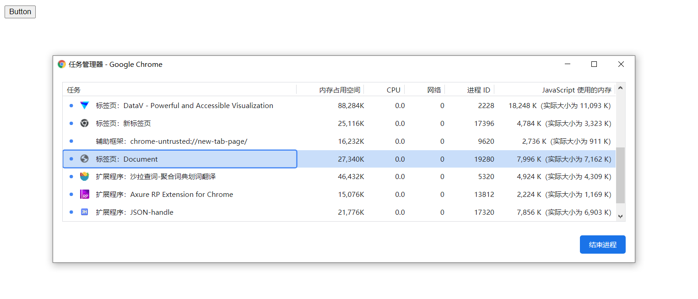

# JS 性能优化

性能优化不可避免。任何一种提高运行效率，降低运行开销的行为都可以看作是一种优化操作。

## 一、内存优化

内存泄漏案例：

```js
function fn () {
  arrList = [];
  arrList[100000] = 'yueluo is a coder';
}

fn();
```

### 内存管理

内存：由读写单元组成，表示一片可操作空间

管理：人为的去操作一片空间的申请、使用和释放

内存管理：开发者主动地申请空间、使用空间、释放空间

管理流程：申请 - 使用 - 释放


**JavaScript 内存管理**

* 申请内存空间

* 使用内存空间

* 释放内存空间


```js
// 申请空间
let obj = {};

// 使用空间
obj.name = 'yueluo';

// 释放空间
obj = null;
```

### 垃圾回收

* JavaScript 中内存管理是自动的
* 对象不再被引用时被视为垃圾
* 对象不能访问到时被视为垃圾

#### 可达对象

* 可以访问到的对象就是可达对象（引用、作用域链）
* 可达的标准就是从根出发是否能够被找到
* JavaScript 中的根可以理解为是全局变量对象

#### 引用与可达

```js
let obj = { name: 'yueluo' };

let obj2 = obj;

obj = null;

console.log(obj); // { name: 'yueluo' };
```


```js
function group (obj1, obj2) {
  obj1.next = obj2;
  obj2.prev = obj1;
  
  return {
    o1: obj1,
    o2: obj2
  }
}

let obj = group({ name: 'obj1' }, { name: 'obj2' });

console.log(obj); // {o1: {…}, o2: {…}}
```


### GC 算法

#### GC 定义与作用

GC 就是垃圾回收机制的简写，GC 可以找到内存中的垃圾、并释放和回收空间。

#### GC 中的垃圾

程序中不再需要使用的对象、程序中不能再访问到的对象

#### GC 算法

* GC 是一种机制，垃圾回收器完成具体的工作

* 工作的内容就是查找垃圾释放空间、回收空间
* 算法就是工作时查找和回收所遵循的规则

#### 常见 GC 算法

* 引用计数
* 标记清除
* 标记整理
* 分代回收

##### 引用计数算法

核心思想：设置引用数，判断当前引用数是否为 0 

引用关系改变时，引用计数器修改引用数字。

```js
const user1 = { age: 11 };
const user2 = { age: 12 };
const user3 = { age: 13 };

const nameList = [user1.age, user2.age, user3.age];

function fn () {
  num1 = 1;
  num2 = 2;
}

fn();
```

优点：

* 发现垃圾时立即回收
* 最大限度减少程序暂停

缺点：

* 无法回收循环引用的对象
* 时间开销大

```js
function fn () {
  const obj1 = {};
  const obj2 = {};
  
  obj1.name = obj2;
  obj2.name = obj1;
  
  return 'yueluo is a coder';
}

fn();
```

存在互相引用关系，使用引用计数算法无法进行垃圾回收。

##### 标记清除算法

核心思想：分标记和清除二个阶段完成

遍历所有的对象找标记活动对象，遍历所有对象清除没有标记对象，回收相应空间。


第一个阶段中找到所有可达对象，如果涉及到引用层次关系会递归查找进行标记。

第二个阶段会进行清除，找到没有标记的对象，进行垃圾回收，同时将第一次的标记进行清除。这样就完成一次垃圾回收。

最终会把回收的空间放到空闲列表上面，方便后续程序申请空间使用。

优点：

* 相对于标记清除算法，可以解决对象循环引用问题；

缺点：

* 易产生空间碎片化，垃圾回收后导致地址不连续，不能让空间得到最大化使用

##### 标记整理算法

标记整理算法可以看作是标记清除算法的增强。

标记阶段的操作和标记清除一致，清除阶段会先执行整理，移动对象位置，让地址产生连续，最大化的利用空间。


#### GC 算法总结

* 引用计数
  * 内部通过引用计数器维护每个对象的引用数值，通过数值是否为 0， 判断是否是垃圾对象
  * 可以及时回收垃圾对象、最大限度减少程序卡顿时间
  * 无法回收循环引用的对象、资源消耗较大（维护引用计数器，需要频繁操作）
* 标记清除
  * 遍历所有对象，将当前活动对象进行标记、遍历所有对象，将没有被标记的对象释放掉
  * 可以回收循环引用的对象
  * 容易产生碎片化空间，浪费空间、不会立即回收垃圾对象（清除时存在全停顿现象）
* 标记整理
  * 和标记清除类似，不过要在清除前先整理当前内存空间
  * 减少碎片化空间
  * 不会立即回收垃圾对象

### V8

#### 介绍

V8 是一款主流的 JavaScript 执行引擎。

* 采用即时编译
* 内存设有上限
  * windows 64位操作系统不超过 1.5 GB，32 位操作系统不超过 800 MB
  * V8 本身是为浏览器制造的，现有内存大小对于网页应用来说是足够使用的
  * V8 内部使用的垃圾回收机制也决定它采用这种方式

#### 垃圾回收策略

采用分代回收的思想，把内存空间按照一定规则分成两类，新生代和老生代。

针对不同对象采用不同算法。

V8 中常用 GC 算法

* 分代回收
* 空间复制
* 标记清除
* 标记整理
* 标记增量

#### 回收新生代对象

V8 内存空间一分为二，小空间用于存储新生代对象（64 位 32 M，32 位 16 M ）。

新生代指的是存活时间较短的对象。


主要采用复制算法和标记整理算法

* 将新生代内存区分为二个等大小空间，使用空间为 From 状态、空闲空间为 To 状态
* 活动对象存储于 From 空间，标记整理后将活动对象拷贝至 To
  * 拷贝过程存在晋升现象，将新生代对象移动至老生代
  * 晋升条件：一轮 GC 还存活的新生代需要晋升，To 空间的使用率超过 25% 
* From 与 To 交换空间完成内存释放

#### 回收老生代对象

64 位操作系统 1.4 G，32 位操作系统 700 M。

老生代对象就是指存活时间较长的对象。


**主要采用标记清除、标记整理、增量标记算法**

* 使用标记清除完成垃圾空间的回收
* 新生代对象向老生代区域移动，并且老生代区域不足以存放新生代区域对象，采用标记整理进行空间优化
* 采用增量标记进行效率优化

**新老生代垃圾回收对比**

* 新生代区域垃圾回收使用空间换时间
* 老生代区域垃圾回收不适合复制算法
  * 空间一分为二，浪费空间
  * 存放数据较多，复制过程消耗时间较多

**标记增量如何优化垃圾回收**

垃圾回收工作时会阻塞当前 JavaScript 程序执行，存在空档期（全停顿）。

标记增量就是将一整段的垃圾回收操作拆分成多个小步，组合完成整个回收，不需要一次完成整个垃圾回收过程。标记增量可以让垃圾回收和程序执行交替工作。


#### 垃圾回收总结

V8 是一款主流的 JavaScript 执行引擎，V8 内存设置上限。

V8 采用分代回收的思想实现垃圾回收，将内存分为新生代和老生代，分别使用不同的 GC  算法。

### Performance

#### 工具介绍

* GC 的目的是为了实现内存空间的良性循环。

* 良性循环的基石是合理使用。需要时刻关注内存变化。

* Performance 提供多种监控方式。

通过使用 Performance 时刻监控内存。

**使用步骤**

* 打开浏览器输入目标网址
* 打开开发人员工具面板，选择性能
* 开启录制功能，访问具体页面
* 执行用户行为，一段时间后停止录制
* 分析界面中记录的内存信息

#### 内存问题的体现

分析内存问题的前提条件是网络环境正常。

外在表现

* 页面出现延迟加载或经常性暂停（，可能出现频繁的垃圾回收
* 页面持续性出现糟糕的性能，可能存在内存膨胀
* 页面的性能随时间加长越来越差

#### 监控内存的方式

界定内存问题的标准

* 内存泄漏：内存使用持续升高
* 内存膨胀：多数设备上都存在性能问题
* 频繁垃圾回收：通过内存变化图进行分析

监控内存的几种方式

* 浏览器任务管理器
* Timeline 时序图记录
* 堆快照查找分析 DOM
* 判断是否存在频繁的垃圾回收

#### 任务管理器监控内存

```html
<button id="J-btn">
  
</button>

<script>
	const oBtn = document.getElementId('J-btn');
  
  oBtn.onclick = function () {
    let arrList = new Array(1000000);
  }
</script>
```

shift + esc 打开浏览器任务管理器。任务管理器只能说明存在问题，但是不能很准确的定位问题。




#### Timeline 记录内存

