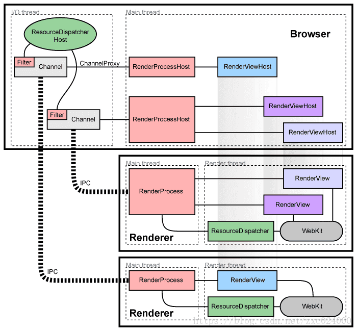
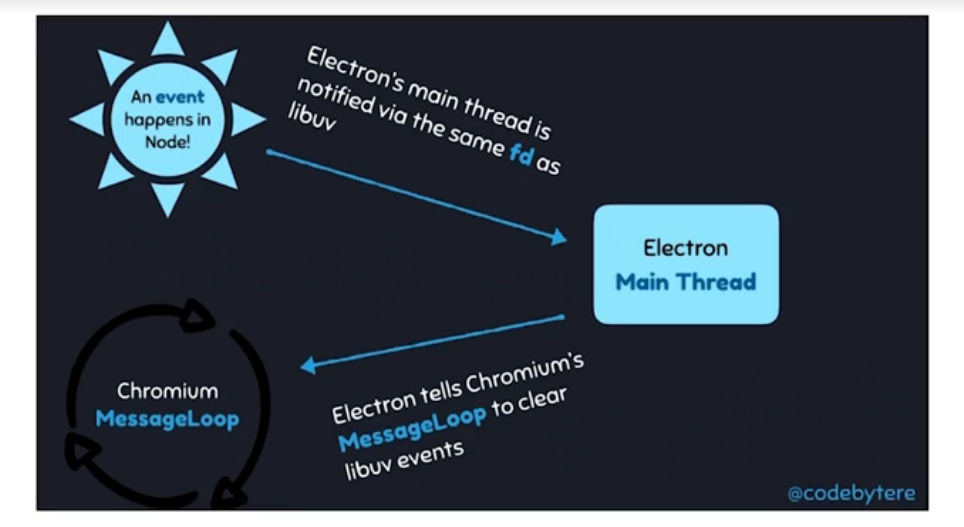
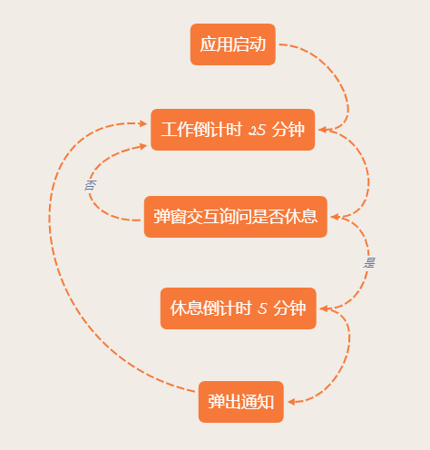
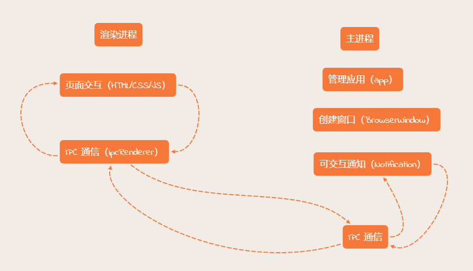
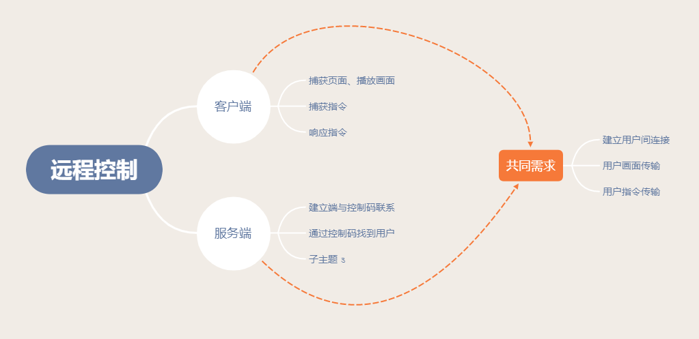
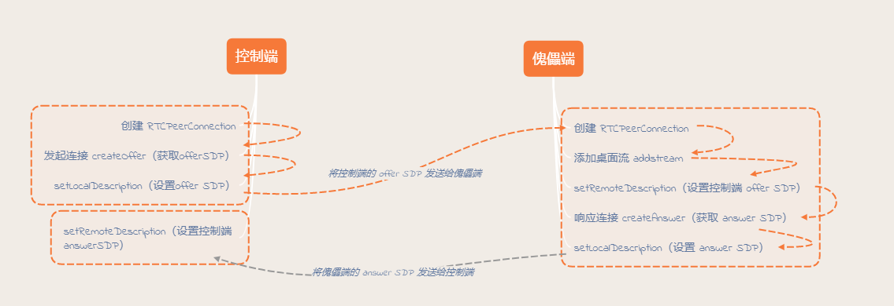
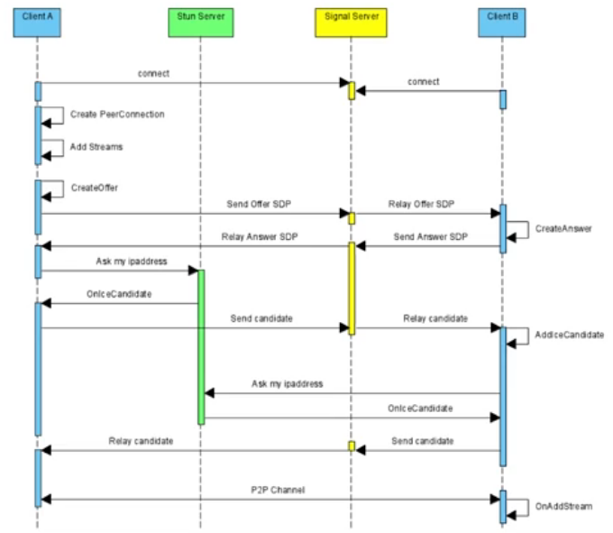

# Electron

## 一、Electron 基础

### Electron 基本概念

#### 学习难点

* 涉及技术栈比较多；
* 工程化建设；
* 如何利用 Electron 能力。

#### 基本概念

electron 是由 GitHub 开发的开源框架。

它允许开发者使用 Web 技术构建跨平台桌面应用。

> Electron = Chromium + node.js + NativeAPI
>
> 高效：通过 Web 技术写 UI
>
> 能力：底层能力
>
> 体验：跨平台&原生能力

#### 历史

网景公司在浏览器大战被 IE 击败后，开放源码，成立 Mozilla，派生了 Firefox。

Chrome 基于 Firefox 开发并产生了 V8 引擎，Node.js 基于 V8 引擎，实现了非阻塞 IO。

NW 基于 Node 和 Chromium 开发了桌面端，Atom 在尝试 NW 失败后，开始了 Atom-Shell 开发，最后改名为 Electron。

#### 应用场景

快速试错、快速占领市场。

特定领域：开发者工具、效率应用。

> 效率应用、开发者工具、实用工具、播放器、社交应用、照片&视频工具、游戏、理财应用、商业类应用、教育类应用、设计应用。

同时开发 Web 版和桌面版。

> Electron 可以让 Web 和 桌面端具有复用大量代码的可能性。

#### 落地场景

Atom、slack、VS Code、Whatsapp、WordPress、大象等。

#### 学习 Electron 有啥好处

造工具。

提升自己的技术深度。

#### 页面基本构成

```js
electron-app
 - package.json
 - index.html
 - main.js
```

### Electron 架构原理

#### Chromium 架构

chromium 本质是 Chrome 的开源版，可以看作是一个浏览器。

> chromium 是多进程架构，包含浏览器主进程和渲染进程等；
>
> 进程间通过 IPC 通信；

<div align="left"></div>

#### Electron 架构

Electron 在各个进程中暴露了很多 Native API，并且引入了 NodeJs。

Node.js 事件循环基于 libuv，但 Chromium 基于 message pump。

> Node.js 和 Chromiums 整合方式：
>
> Chromium 集成到 Node.js，使用 libuv 实现了 message pump (nw)。
>
> Node.js 集成到 Chromium。

<div align="left"></div>

Electron 是将 Node.js 集成到 Chromium 中。

> Electron 启用一个新的安全线程去轮询 backend_fd，当 Node.js 有了一个新事件之后。
>
> 通过 PostTask 转发到 Chromium 的事件循环中。这样实现 Electron 的事件融合。

<div align="left"></div>

### 桌面端技术选型

#### 为啥要开发桌面端

* 更快捷的入口
* 离线可用
* 调用系统能力（通知、硬件）
* 安全需求
* .....

#### 桌面端技术有哪些

**Native（C++/C#/Objective-C）**

* 高性能
* 原生体验
* 包体积小
* 门槛高
* 迭代速度慢

**QT**

* 基于 C++
* 跨平台（Mac、Windows、IOS、Android、Linux、嵌入式）
* 高性能
* 媲美原生体验
* 门槛高
* 迭代速度一般

**Flutter**

* 跨端（IOS、Android、Mac、Windows、Linux、Web）
* PC 端在发展中（Mac > Linux、Windows）
* 基建少

**NW.js**

* 跨平台（Mac、Windows、Linux），v0.14.7 支持 XP（XP 市场份额约为 15%）
* 迭代快，Web 技术构建
* 源码加密、支持 Chrome 拓展
* 社区活跃
* 包体积大
* 性能一般

> 微信开发者工具就是 nw.js 实现的（历史原因）。

**Electron**

* 跨平台（Mac、Windows、Linux、不支持 XP）
* Web 技术构建
* 社区活跃
* 大型应用案例
* 包体积大
* 性能一般

**其他**

Carlo（不成熟）、WPF、Chromium Embedded Framework（CEF）、PWA。

|            | Electron                         | Native           | QT                 | NW                               |
| ---------- | -------------------------------- | ---------------- | ------------------ | -------------------------------- |
| 性能       | ★                                | ★★★              | ★★                 | ★                                |
| 安装包大小 | ★                                | ★★★              | ★                  | ★                                |
| 原生体验   | ★                                | ★★★              | ★★                 | ★                                |
| 跨平台     | ★★★                              | ×                | ★★★                | ★★★                              |
| 开发效率   | ★★★                              | ★                | ★★                 | ★★★                              |
| 人才储备   | ★★★                              | ★★               | ★★                 | ★★★                              |
| 社区       | ★★★                              | ★★               | ★                  | ★★                               |
| 适用场景   | 跨平台应用、快速交付、前端技术栈 | 专业应用、高性能 | 跨平台应用、高性能 | 跨平台应用、快速交付、前端技术栈 |

### 开发环境搭建

#### 编辑器

* VS Code
* WebStorm
* Atom
* VIM
* ...

#### Node.js

```js
nvm install 12.14.0
nvm use 12.14.0
npm -v
node -v
```

#### Electron 安装

```js
npm install electron --save-dev
// window 打包需要基于 32 位，这样才能保证 32 位和 64 位都可用（安装不需要指定）
npm install --arch=ia32 --plarform=win32 electron -D

npx electron -v // npm 版本大于 5.2
./node_modules/.bin/electron -v // npm 版本小于 5.2
```

> cnpm install --arch=ia32 --platform=win32 electron -D
>
> ELECTRON_MIRROR=https://cdn.npm.taobao.org/dist/electron/ npm install electron --save-dev

### 番茄钟应用案例

####番茄工作法

番茄工作法是一种时间管理法。

使用定时器分割出一个一般为 25 分钟工作时间和 5 分钟休息时间。

#### 交互流程





#### Electron 渲染进程模块

```js
const { app, BrowserWindow } = require('electron'); // 主进程 
const { ipcRenderer } = require('electron'); // 渲染进程
```

```js
ipcRenderer.invoke(channel, ...args).then(result => {
  // handleResult 
  // 渲染进程与主进程通信
});
```

#### Electron 主进程模块

app，用于控制应用生命周期。

```js
app.on('ready', callback); // 应用程序就绪后开始业务 
```

BrowserWindow，用于创建和控制窗口。

```js
let win = new BrowserWindow({ width, height, ... }); // 创建窗口，并设置宽高
win.loadURL(url)、win.loadFile(path); // 加载页面
```

Notification，创建 Notiffication。

```js
let notification = new Notification({ title, body, actions:[ { text, type } ] });
notification.show();
```

ipcMain.handle(channel, handler)，处理渲染进程的 channel 请求，在 handler 中 return 返回结果。

#### 编写番茄钟

```js
cnpm i electron@7.1.7 timer.js -D
```

**main.js**

```js
const { app, BrowserWindow, Notification, ipcMain } = require('electron');

let win;

app.on('ready', () => {
  // 赋值给全局变量，避免被垃圾回收
  win = new BrowserWindow({
    width: 600,
    height: 400,
    webPreferences: {
      nodeIntegration: true
    }
  });

  win.loadFile('../index.html');
  
  handleIPC();
});

function handleIPC () {
  ipcMain.handle('work-notification', async () => {
    const res = await new Promise((resolve, reject) => {
      const notification = new Notification({
        title: '任务结束',
        body: '是否开始休息',
        actions: [
          {
            text: '开始休息',
            type: 'button'
          }
        ],
        closeButtonText: '继续工作'
      });

      notification.show();

      notification.on('action', () => {
        resolve('rest');
      });
      notification.on('close', () => {
        resolve('work');
      });
    });

    return res;
  });
}
```

**renderer.js**

```js
const { ipcRenderer } = require('electron');
const Timer = require('timer.js');

function startWork () {
  const workTimer = new Timer({
    ontick: updateTime,
    onend: notification
  });

  workTimer.start(10);
}

function updateTime (ms) {
  const timerContainer = document.getElementById('J-timer');

  let s = (ms / 1000).toFixed(0);
  let ss = s % 60;
  let mm = (s / 60).toFixed(0);

  timerContainer.innerText = `${ mm.toString().padStart(2, 0) } : ${ ss.toString().padStart(2, 0) }`;
}

async function notification () {
  const res = await ipcRenderer.invoke('work-notification')

  switch (res) {
    case 'rest':
      setTimeout(() => {
        alert('休息');
      }, 5 * 1000)
      break;
    case 'work':
      startWork();
      break;
  }
}

startWork();
```

### Electron vs Web： 特性

<div align="left"></div>

#### 主进程

Electron 运行 package.json 的 main 脚本的进程被称为主进程。

每个应用只有一个进程。

管理原生 GUI，典型的窗口（BrowserWindow、Tary、Dock、Menu）。

创建渲染进程。

控制应用生命周期（app）。

#### 渲染进程

展示 Web 页面的进程称为渲染进程。

通过 Node.js、Electron 提供的 API 可以跟系统底层打交道。

一个 Electron 应用可以有多个渲染进程。

|                  | API                                                          |
| ---------------- | ------------------------------------------------------------ |
| 主进程           | app（生命周期）、BorwserWindow（窗口）、ipcMain（跟 ipcRenderer 进行 IPC 通信）、Menu（原生 GUI）、Tray（原生 GUI）、MenuItem（原生 GUI）、dialog（原生 GUI）、Notification（可交互通知）、webContents（加载页面）、autoUpdater（更新模块）、globalShortcut（设置全局快捷键）、systemPerferences、TouchBar、netLog、powserMonitor、ipAppPurchase、net、powserSaveBlocker、contentTracing、BrowserView、session、protocol、Screen |
| 渲染进程         | ipcRenderer、remote（调用主进程模块）、desktopCapture（捕获桌面流，系统截图，视频流等）、webFrame |
| 主进程，渲染进程 | clipboard（访问和读写剪切板）、crashPeporter（监控主进程和渲染进程是否存在崩溃）、shell、nativeImage |

#### 进程间通信

通知事件

> 比如可以通过 IPC 通信让主进程创建原生菜单。

数据传输

> 在某个页面中获得现在的内存情况，可以通过 IPC 来传输。

共享数据

> 比如用户信息，在各个进程内都会用到，可以通过 IPC 通信来完成数据的共享。

#### IPC 模块通信

Electron 提供了 IPC 通信模块，主进程的 ipcMain  和 渲染进程的 ipcRenderer。

ipMain、ipcRenderer 都是 EventEmitter 对象。

#### 进程间通信：渲染进程到主进程

Callback 写法：

* ipcRenderer.send(channel, ...args)
* ipcMain.on(channel, handler)

Promise 写法（Electron 7.0 之后，处理请求和响应模式）

* ipcRenderer.invoke(channel, ...args)
* ipcMain.handle(channel, handler)

#### 进程间通信：主进程到渲染进程

ipcRenderer.on(channel, handler)

webContents.send(channel)

```js
win.webContents.send('eventName');
```

#### 页面间（渲染进程）通信

通知事件：

* 通过主进程转发（Electron 5 之前）
* ipcRenderer.sendTo（ELectron 5 之后）

```js
const { ipcRenderer, remote } = require('electron');

const { winWebContentId } = remote.getGlobal('sharedObject');

ipcRenderer.sendTo(winWebContentId, 'eventName', 1);
```

数据共享：

* Web 技术（localStroage、sessionStroage、indexedDB）
* 使用 remote（会将数据挂在一个全局的过程中，不推荐使用）

#### 经验 & 技巧

少用 remote 模块。

> 每次 remote 会触发底层的同步 IPC 事件，影响性能，如果处理不好，可能会卡死。

不要用 sync 模式。

请求 + 响应的通信模式下，需要自定义超时限制。

#### Electron 原生能力

Electron 原生能力主要来自其内置的 Native API 以及 NodeJS。


**Electron API 原生 GUI：**

* BrowserWindow 应用窗口
* Tray 托盘
* app 设置 dock.badge
* Menu 菜单
* dialog 原生弹窗
* TouchBar 苹果触控栏
* 。。。

**Electron API 底层能力：**

* clipboard 剪切板
* globalShortcut 全局快捷键
* desktopCapture 捕获桌面
* shell 打开文件、URL
* 。。。

**Node.js 底层能力：**

Electron 同时在主进程和渲染进程中对 Node.js 暴露了所有的接口。

* fs 进行文件读写
* crypto 进行加解密

通过 npm 安装即可引入社区上所有的 Node.js 库。

> 渲染进程中可以使用 Node.js 库。

**Node.js 原生模块：**

* node.js add-on
* node-ffi（Foreign Function Interface）

> 可以使用 NodeJS 的插件机制去集成 C++。
>
> 可以使用 node-ffi 去集成业务中的一些动态库。比如打印等应用场景。

* WinRT（https://github.com/NodeRT/NodeRT）
* Applescript（https://github.com/TooTallNate/node-applescript）
* Shell（node.js child_process）
* 。。。

#### Electron 能做什么

> Electron 运行在高版本的 Chromium  上。

**无兼容问题：**

* 不用考虑 Safari、IE 上的表现差异
* 可以使用 Chrome 浏览器最新的 feature
* babel 中设置 targets 为 Electron 对应的 Chrome 版本

> 比如最新浏览器已经支持纯天然的 LazyLoad。

> https://developers.google.com/web/updates  查看 chrome 更新特性。

**ES 6/7/8/9/10 高级语法**

* Async await、Promise
* String、Array、Object 等高级用法
* BigInt

**无跨域问题**

* 使用 Node.js 发送请求
* 使用 Electron net 发送请求

**操作本地文件**

**本地 DB**

**多线程、多进程并行**

**。。。**

### Electron 总结

* 无浏览器兼容问题
* 最新浏览器 Feature
* No PolyFill
* ES 高级语法
* 无跨域问题
* Powered by Node.js

## 二、实现远程控制软件

### 需求分析

#### 背景

提供软件服务时在复杂情况下（如排查问题、演示功能），通过沟通解决非常低效。

#### 目标

希望迅速为客户提供远程协助，能够远程控制用户电脑，提供点击和键入功能，完成排查故障、演示场景。

#### 业务流程

角色：

* 控制端：客服人员、研发人员
* 傀儡端：用户

流程：

1. 傀儡端告诉控制端本机控制码
2. 控制端输入控制码连接傀儡端
3. 傀儡端将捕获的画面传至控制器
4. 控制端的鼠标和键盘指令传送至傀儡端
5. 傀儡端响应控制端

### 项目分析

**傀儡端告诉控制端本机控制码。**

建立端与控制码的联系 -> 服务端需求

**控制端输入控制码连接傀儡端**

通过控制码找到用户 -> 服务端需求

建立用户间连接 -> 服务端需求 or 客户端需求

**傀儡端将捕获的画面传至控制器**

捕获画面、播放画面 -> 客户端需求

用户间画面传输 -> 服务端需求/客户端需求

**控制端的鼠标和键盘指令传送至傀儡端**

捕获指令 -> 客户端指令

用户间指令传输 -> 服务端需求/客户端需求

**指令传送至傀儡端**

响应指令 -> 客户端需求

### 需求汇总



### 可行性分析

#### 如何捕获画面

Electron desktopCapturer。

> 通过 [navigator.mediaDevices.getUserMedia] API，可以访问用于从桌面上捕获音频和视频的媒体源信息。

进程：Renderer

#### 如何建立连接、画面 + 指令传输

Web Real-Time Communications。

> WebRTC 是网页浏览器用来进行语音对话视频对话的 API。现在被广泛的使用在直播、视频、会议等场景。


#### 如何响应用户指令

robotjs。

### 项目架构与基础业务

#### 目录架构


#### 与 React 框架结合

* 编写 React，并且编译它。CRA 其实是一个好的选择。
* 处理引入 electron/node 模块。
  * webpack 配置
  * window.require
* windows 根据环境信息加载本地或者 devServer url
  * electron-is-dev
* 启动命令配置。编译成功再启动 Electron。
  * concurently
  * wait on

```js
npx create-react-app main --use-npm
npm i cross-env --save-dev

"start": "cross-env BROWSER=none react-scripts start"
```

```js
cnpm i electron --save-dev
```

**处理环境问题。**

```js
npm i electron-is-dev --save-dev
```

```js
const isDev = require('electron-is-dev');
const path = require('path');

let win;

app.on('ready', () => {
  win = new BrowserWindow({
    width: 600,
    height: 300,
    webPreferences: {
      nodeIntegration: true
    }
  });

  if (isDev) {
    win.loadURL('http://localhost:3000');
  } else {
    win.loadFile(path.resolve(__dirname, '../renderer/views/main/index.html'));
  }
});
```

**处理渲染进程引用 electron 问题**

最新版本的坑。

```js
win = new BrowserWindow({
  width: 600,
  height: 300,
  webPreferences: {
    nodeIntegration: true,
    contextIsolation: false // 最新的版本的坑
  }
});
```

window.require。

```js
const { ipcRenderer } = window.require('electron');
```

修改 webpack 的 target（如果是大型项目，可以考虑自己搭建一套 webpack 环境）。

```js
npm i customize-cra react-app-rewired --save-dev
```

```js
"scripts": {
  "start": "cross-env BROWSER=none react-app-rewired start"
}
```

```js
const { override } = require('customize-cra');

function addRendererTarget (config) {
  config.target = 'electron-renderer';
  return config;
}

module.exports = override(addRendererTarget);
```

**处理调用命令问题**

wait-on	等待资源、sockts、http、文件准备好才触发命令。

concurrently	用来并行两个命令的执行。

```js
npm i wait-on concurrently --save-dev
```

可以使用 start 命令并行执行 start:main 和 start:render 两个命令。

```js
"scripts": {
  "start": "concurrently \"npm run start:render\" \"wait-on http://localhost:3000 && npm run start:main\" ",
  "start:main": "electron app/main/index.js",
  "start:render": "cd app/renderer/src && npm start"
}
```

#### 其他模板选择

* electron-react-boilerplate
* electron-vue
* svelte-template-electron
* angular-electron

### 主页面基础业务：Real World PIC

#### 基础业务页面

* 获取自身控制码
* 发起控制：文本框 + 确认按钮
* 连接状态：未连接、正在连接屏幕、屏幕被控制中
* 确认按钮点击后创建控制屏幕窗口

#### IPC 通信

渲染进程请求 + 主进程响应（获取自己的控制码）

```js
ipcRender.invoke、ipcMain.handle
```

主进程推送（告知状态）

```js
webContents.send、ipcRenderer.on
```

渲染进程发起请求（申请控制）

```js
ipcRenderer.send、ipcMain.on
```

### 捕获桌面视频流

#### MediaStram API

媒体的流。

一个流对象可以包含多轨道，包括音频和视频轨道等。

能通过 WebRTC 传输。

通过 \<video\> 标签可以播放。

#### 如何捕获媒体流

navigator.mediaDevices.getUserMedia(MediaStreamConstraints)

返回：Promise，成功后 resolve 回调一个 MediaStream 实例对象。

参数：MediaStreamConstraints。

* audio: Boolean | MediaTrackConstraints

* video: Boolean | MediaTrackConstraints
  * width: 分辨率
  * height：分辨率
  * frameRate：帧率，比如 { ideal: 10, max: 15 }
  * 。。。

```js
navigator.mediaDevices.getUserMedia({
  audio: true,
  video: {
    width: { min: 1024, ideal: 1280, max: 1920 },
    height: { min: 576, ideal: 720, max: 1080 },
    frameRate: { max: 30 }
  }
});
```

#### 如何播放媒体流对象

```js
const video = document.querySelector('video');

video.srcObject = stream;
video.onloadedmetadata = function (e) {
  video.play();
}
```

#### 如何捕获桌面/窗口流

desktopCapturer.getSources({ types: ['window', 'screen'] }) 提取 chromeMediaSourceId

* Electron < 5.0 是 callback 调用
* 5.0 后是 promise，返回的是 chromeMediaSources 列表，包含 id、name、thumbnail、display_id

通过 navigator.webkitGetUserMedia({})

```js
navigator.webkitGetUserMedia({
  audio: false,
  video: {
    mandatory: {
      chromeMediaSource: 'desktop',
      chromeMediaSourceId: sources[0].id,
      maxWidth: width,
      maxHeight: height
    }
  }
}, (stream) => {
  peer.emit('add-stream', stream);
}, (err) => {
  console.log('get media failed：', err);
});
```

### 如何接收、响应指令

#### robot.js

* 用于控制鼠标、键盘
* Node.js、C++、add-on 库
* 支持 Mac、Windows、Linux

#### 安装、基本使用	

```js
npm install --global --production windows-build-tools
npm config set python E:\Install\python27\python.exe
```

> 需要 python 2.7 支持，配置其环境变量。

```js
import sys
reload(sys)
sys.setdefaultencoding("gbk")
```

```js
npm install robotjs --save-dev
```

鼠标移动：robot.moveMouse(x, y)

鼠标点击：mouseClick([button], [double])

按键：robot.keyTap(key, [modifier])

详细文档：[https://robotjs.io/docs/syntax](https://robotjs.io/docs/syntax)。

#### 编译原生模块

手动编译

```js
npm rebuild --runtime=electron --disturl=https://atom.io/download/atom-shell --target=<electron版本> --abi=<对应版本abi>
```

```js
process.versions.electron 可以看到 electron 版本
process.versions.node 可以看到 node 版本，之后再 abi_crosswalk 查找 abi
https://github.com/mapbox/node-pre-gyp/blob/master/lib/util/abi_crosswalk.json

process.versions
electron 12.0.2  node 14.16.0 => 83

npm rebuild --runtime=electron --disturl=https://atom.io/download/atom-shell --target=12.0.2 --abi=83
```

electron-rebuild

> 自动编译的库必须在 dependencies 而不是 devDependencies 中。

```js
npm install electron-rebuild --save-dev
npx electron-rebuild
```

> 调出快捷键 ctrl + shift + i。

经过测试，手动编译比较靠谱。

#### 监听键盘 + 鼠标事件

window.onkeydown。

window.onmouseup。

细节：

* modifier（修饰键）处理：shift、ctrl、alt、meta（win/command）
* 按键转换（vkey）

> vkey 可以完成 keycode 和 key 的转换。

鼠标位置缩放（按比例）

* x' = x * videoWidth / screenWidth
* y' = y * videoHeight / screenHeight

```js
npm i vkey --save-dev
```

可以利用 Electron globalShortcut 模块完成监听 + 响应打开控制台需求。

* Mac 打开控制台命令：CMD + OPTIONS + I
* Windows 打开控制台命令：CTRL + SHIFT + I

### WebRTC 传输视频流



#### SDP

SDP （Session Description Protocol）是一种会话描述协议，用来描述多媒体会话，主要用来协商双方通讯过程，传递基本信息。

SDP 的格式包含多行，每行为 `<type>=<value>`。

* `<type>`: 字符，代表特定的属性，比如 v，代表版本。
* `<value>`: 结构化文本，格式与属性类型无关，UTF8 编码。

> 图中的 answer 和 offer 其实本质是就是一个 SDP。

#### P2P

p2p 通常有两种模式，Served-Based 和 P2P。

P2P的难题：

* NAT（Network Address Translation）网络地址转换。

* 如何获得真正的 IP 和 端口。

#### NAT 穿透：ICE

ICE（Interactive Connectivity Establishment）交互式连接创建。

* 优先 STUN（Session Traversal Utilities for NAT），NAT 会话穿越应用程序
* 备选 TURN（Traversal Using Relay NAT），中继 NAT 实现的穿透
  * Full Cone NAT - 完全雏形 NAT
  * Restricted Cone NAT - 限制雏形 NAT
  * Port Restrict Cone NAT 端口限制雏形 NAT
  * Synmetric NAT 对称 NAT

### 信令服务：连接两端

#### 信令服务是什么

WebRTC 客户端（对等端）之间传递消息的服务器。

#### 信令服务有啥用

转发各种 SDP、Candidate。




#### 服务端需求

处理业务逻辑

* 建立端与控制码的联系
* 通过控制码找到用户

转发 offer SDP、answer SDP、iceCandidate

* 处理客户端请求
* 主动推送消息给客户端

|          | 短轮询               | 长轮询                                               | WebSocket                                | sse                              |
| -------- | -------------------- | ---------------------------------------------------- | ---------------------------------------- | -------------------------------- |
| 通讯方式 | http                 | http                                                 | 基于 TCP 长连接通讯                      | http                             |
| 触发方式 | 轮询                 | 轮询                                                 | 事件                                     | 事件                             |
| 优点     | 简单、兼容性好       | 相对短轮询资源占用少全双工通讯、性能好，安全，扩展性 | 全双工通讯，性能好，安全，扩展性         | 实现简单，开发成本低             |
| 缺点     | 安全性差、资源占用高 | 安全性差、资源占用高                                 | 传输数据进行进行二次解析，有一定开发门槛 | 适用于高级浏览器                 |
| 适用范围 | B/S 服务             | B/S 服务                                             | 网游、支持、IM 等                        | 服务端到客户端推送（新消息推送） |

#### 服务端实现 WebSocket 服务器

```js
npm i ws --save
```

```js
const WebSocket = require('ws');
const wss = new WebSocket.Server({ port: 8081 });

wss.on('connection', function (ws, req) {
	ws.on('message', function () {});
    ws.on('close', function () {});
    ws.send(); 
});
```

> 可以使用 https://websocket.org/echo.html 测试 socket 连接。

#### 业务逻辑处理

* 建立端与控制码的联系
* 通过控制码找到用户

#### 客户端使用 WebSocket

```js
const ws = new WebSocket('address');

ws.onopen = funnction (e) {}

ws.onmessage = funnction (e) {}

ws.onclose = funnction (e) {}

ws.close();

ws.send(''); // 文本、blob、ArrayBuffer
```

electron 可以选择 ws 库，需要在主进程创建。

。。。。

## 三、Electron 工程化

### Electron 打包

#### 打包过程分析

下载 HTML 文件

* Info.plist
* Frameworks
* Resources

添加业务代码

修改文件信息

* app 名称
* Info.plist 修改信息
* 设置图标
* ...

制作镜像

* dmg-builder
* nsis

#### 打包工具

|              | electron-builder                           | electron-forge                                   |
| ------------ | ------------------------------------------ | ------------------------------------------------ |
| 签名         | √√√                                        | √√√                                              |
| 安装包类型   | √√√                                        | √√√                                              |
| 原生模块编译 | √√√                                        | √√√                                              |
| 定制化       | √√√                                        | √                                                |
| 上手成本     | √√                                         | √                                                |
| boilerplate  | ×                                          | √√√                                              |
| 跨平台构建   | Linux、Windows                             | ×                                                |
| 社区活跃度   | √√√                                        | √√                                               |
| 场景         | 打包和发布的完整解决方案，基本适用所有场景 | 创建到发布的一体化解决方案，适合从 0 到 1 的项目 |

#### 打包准备

证书

* Mac：开发者证书 99$
* Windows：赛马铁克、WoSign

对应系统机器（Mac、Windows、Linux）

软件所需图片

#### 软件图片

Mac

* 软件图标。icns 格式。通过 image2icon 或者 iconutil 生成
* dmg 背景图
* 安装包图标（可选）

Windows

* ico
* installerIcon（可选）
* unInstallerIcon（可选）

#### iconutil 生成 icns

1. 准备 logo 图 1024 * 1024 的两倍图，png 格式
2. 生成 16 到 1024 的图片
3. iconutil -c icns icons.iconset -o icon.icns

准备图片。

建立 icons.iconset 目录。

#### electron-bulider 安装、使用

```js
npm install --global --production windows-build-tools //管理员启动 cmd 安装（windows）
npm i electron-builder --save-dev
npm i cross-env --save-dev

corss-env npm_config_electron_mirror="https://npm.taobao.org/mirrors/electron/" electron-builder build --mac

corss-env npm_config_electron_mirror="https://npm.taobao.org/mirrors/electron/" electron-builder build --win --ia32
```

```js
npm remove electron-rebuild

// package.json 加入 "postinstall": "electron-builder install-app-deps"

npm install electron-builder-squirrel-windows
```

#### electron-builder 打包配置

配置文件

* package.json 加入 build 属性
* 存放在 electron-builder.yml （）可选

配置项

* 公共配置 appId、produceName、copyright、asar、files、directories
* 各平台配置

文档：https://www.electron.build/configuration/configuration#configuration

```js
"build": {
  "appId": "com.yueluo.club",             // 应用ID
  "productName": "Mercurius",             // 应用名称
  "directories": {                        // 目录配置
    "app": "dist",                           // 打包的代码目录
    "buildResources": "resource",            // 构建包的资源目录
    "output": "release"                      // 存放产包的目录
  },
  "asar": true,                           // 是否使用 asar 加密
  "copyright": "Copyright © 2020 dragon"  // 版权
}
```

#### electron-builder Mac 平台配置

mac：target、icon

dmg：contens、iconSize、window、background

```js
"build": {
  "mac": {
    "target": ["dmg", "zip"],      // 包格式
    "icon": "resources/icon.icns"  // logo 地址
  },
  "dmg": {  // dmg 配置 
    "background": "resources/background.png", // 背景图
    "window": {"width": 540, "height": 380},  // 安装窗口大小
    "conetns": [ // dmg 内容坐标
      {"x": 410, "y": 190, "type": "link", "path": "/Applications"},
      {"x": 130, "y": 190, "type": "file"}
    ],
    "iconSize": 128  // logo 大小
  }
}
```

#### electron-builder windows 平台配置

win：target、icon

nsis：oneClick、language、perMachine、allowToChangeInstallationDir、ectory、allowElevation

squirreWindows：loadingGif、iconUrl

```js
"build": {
  "win": { 
    "icon": "resources/icon.ico",   // logo 地址
    "target": ["nsis", "squirrel"]  // 包格式
  },
  "nsis": { 
    "oneClick": false, // 一键安装
    "language": "2052", // 安装语言代码
    "perMachine": true, // 给机器上所有用户安装
    "allowToChangeInstallationDir": true // 让用户选择目录
  },
  "squirreWindows": { 
    "loadingGif": "resources/loading.gif", // 安装 loading 动画
    "iconUrl": "https://xxx.com/icon.ico"  // icon 的远端地址
  }
}
```

#### 打包配置

```js
{
  "name": "Mercurius",
  "version": "1.0.0",
  "description": "remote control",
  "main": "app/main/index.js",
  "scripts": {
    "test": "echo \"Error: no test specified\" && exit 1",
    "start": "concurrently \"npm run start:render\" \"wait-on http://localhost:3000 && npm run start:main\" ",
    "start:main": "electron .",
    "start:render": "cd app/renderer/src/main && npm start",
    "build": "cd app/renderer/src/main && npm run build",
    "pack:mac": "npm run build && NPM_CONFIG_ELECTRON_MIRROR=http://npm.taobao.org/mirrors/electron/ electron-builder build --mac",
    "pack:wi": "npm run build && cross-env NPM_CONFIG_ELECTRON_MIRROR=http://npm.taobao.org/mirrors/electron/ electron-builder build --win --ia32",
    "pack:win": " cross-env NPM_CONFIG_ELECTRON_MIRROR=http://npm.taobao.org/mirrors/electron/ electron-builder build --win --ia32",
    "postinstall": "electron-builder install-app-deps"
  },
  "keywords": [],
  "author": "dragon",
  "license": "ISC",
  "devDependencies": {
    "concurrently": "^5.0.2",
    "cross-env": "^7.0.0",
    "electron": "^7.1.8",
    "electron-builder": "^22.3.2",
    "electron-builder-squirrel-windows": "^22.3.3",
    "wait-on": "^3.3.0"
  },
  "dependencies": {
    "about-window": "^1.13.2",
    "electron-is-dev": "^1.1.0",
    "electron-squirrel-startup": "^1.0.0",
    "robotjs": "^0.6.0",
    "vkey": "^1.0.1",
    "ws": "^7.2.1"
  },
  "build": {
    "appId": "com.geektime.mercurius",
    "productName": "Mercurius",
    "files": "app",
    "asar": false,
    "extraFiles": [
      "app/renderer/**/src"
    ],
    "directories": {
      "buildResources": "resource",
      "output": "release"
    },
    "copyright": "Copyright © 2020 dragon",
    "mac": {
      "target": [
        "dmg",
        "zip"
      ],
      "icon": "resources/icon.icns"
    },
    "dmg": {
      "background": "resources/background.png",
      "window": {
        "width": 540,
        "height": 380
      },
      "contents": [
        {
          "x": 410,
          "y": 180,
          "type": "link",
          "path": "/Applications"
        },
        {
          "x": 130,
          "y": 180,
          "type": "file"
        }
      ],
      "iconSize": 128
    },
    "win": {
      "icon": "resources/icon.ico",
      "target": [
        "squirrel",
        "nsis"
      ]
    },
    "nsis": {
      "oneClick": false,
      "language": "2052",
      "perMachine": true,
      "allowToChangeInstallationDirectory": true
    },
    "squirrelWindows": {
      "iconUrl": "https://raw.githubusercontent.com/dengyaolong/geektime-electron/master/img/icon.ico"
    }
  }
}

```

#### 总结

* 产品发布时版本号需要升级，一般遵循 semver 语法，可以使用 npm version patch/minor/major 管理
* windows 下需要证书签名，否则可能被杀毒软件误杀
* mac 下如果没有证书签名，无法使用 Electron 自动更新
* windows 下打包可以写 nsis 逻辑修改安装包
* 开源软件可以基于 Travis、AppVeyor 持续集成

