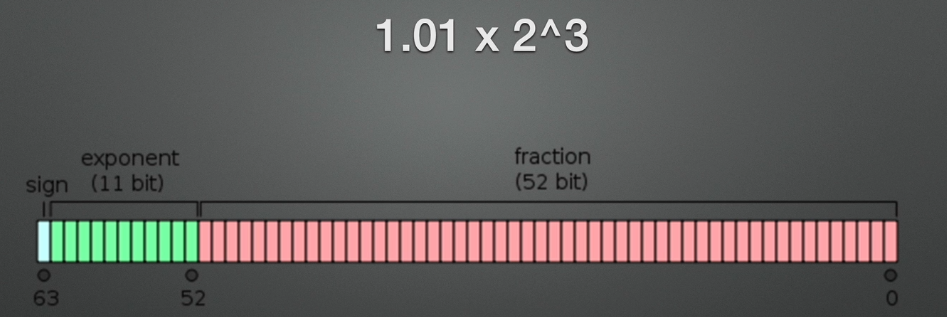

# 碎片知识

## 同步与异步加载

### 异步加载

  1. 异步加载，指加载 JS 脚本，我们可以设置属性，浏览器帮我们执行加载操作。
  2. 可以自己写一个异步加载方法，执行异步加载操作。

### 企业级工具函数写法

命名空间写法。

命名空间写法可以让我们知道方法出自于哪里，把某些功能封装在一起。

```js
var utils = {
  func1: function () { },
  func2: function () { }
}

utils.func1();
```

```js
Element.prototype = {
  func1: function () { },
  func2: function () { }
}

elem.func1();
```

###探究同步加载

可以在head标签内或者 body 标签内引入外部脚本文件。

**为什么外部 JS 脚本引入放在 body 标签最底部？CSS 脚本引入可以放在 head 标签内？**

当浏览器遇到 CSS 外部样式引入，会新开辟新线程加载文件，不会影响 DOM 解析。
当浏览器遇到未设置异步的 script 标签，会阻塞 DOM 解析，等到 JS 加载并且执行完毕，才会继续解析 DOM。
这种加载 script 标签的方式，叫做同步加载（阻塞加载、同步模式、阻塞模式）。
放在页面最后，可以极大的减少阻塞，不能完全解决解决阻塞问题（多个 script 标签存在，会有阻塞现象）。

**为什么加载JS脚本默认是同步的？**

JS 中常常存在修改 DOM 结构、重定向、对 DOM 的增加删除，如果异步，会产生 DOM 冲突。

###探究异步加载

异步加载（defer、async），就是浏览器会并行加载 scrip t脚本，和 link 标签差不多。

异步加载同时，不会阻塞解析 CSS，解析 DOM 结构，不会阻塞浏览器后续处理。

* defer
  * IE8 及以下至 IE4 都可以使用，IE4 已经存在该方法。异步加载，不阻塞后续处理
  * 但是加载完不会立即执行。DOM 树构建完毕后会顺序执行 script 脚本
* async
  * W3C 标准，HTML5 新增属性，IE9 及以上支持该属性
  * 异步加载，不阻塞后续处理，加载完毕会立刻执行 script 脚本

异步加载 JS 脚本是不能对文档进行操作的，异步加载会存在 DOM 冲突。

defer 和 async 同时设置，也是异步加载的，除 IE8之 下，优先判断为 async。

异步加载不常用，一般工具函数、与 DOM 操作无关的 JS 脚本、按需加载的才会使用异步加载。

按需加载，比如点击反馈效果，封装一个模块，点击时，按需加载，然后实现对应效果。

### 企业级异步加载

```js
var s = document.createElement('script'); // 主动创建就是异步加载

s.type = 'text/javascript';
s.async = true; // 无实际作用，只是在标签上添加async属性
s.src = 'js/index.js'; // src引入时已经在下载（加载）JS脚本，不会执行

document.body.appendChild(s); // 放入html中，执行JS脚本
```

异步加载时，不会触发 window.onload 方法，建议在 window.onload 之后进行异步加载。

```js
;(function () {
  function async_load () {
    var s = document.createElement('script');
    s.type = 'text/javascript';
    s.async = true;
    s.src = 'js/index.js';
    document.body.appendChild(s);
  }

  if (window.attachEvent) {
    window.attachEvent('onload', async_load);
  } else {
    window.addEventListener('load', async_load, false);
  }
})();
```

一般来说，异步加载一般写在最上面，一般企业会在head标签内放一个关于页面配置的脚本文件。
可以借助这个 script 脚本文件，把异步加载的 script 脚本放到 head 标签内。

```js
;(function () {
  function async_load () {
    var s = document.createElement('script'),
        oScript = document.getElementsByTagName('script')[0];

    s.type = 'text/javascript';
    s.async = true;
    s.src = 'js/index.js';

    oScript.parentNode.insertBefore(s, oScript);
  }

  if (window.attachEvent) {
    window.attachEvent('onload', async_load);
  } else {
    window.addEventListener('load', async_load, false);
  }
})();
```

如果又要进行异步加载，又要立刻执行 JS 脚本内方法，如何实现？

> readyState onreadystatechange IE 提出的事件
>
> s.onload 事件 W3C浏览器存在该方法，IE不存在

```js
function async_exec (url, fn) {
  var s = document.createElement('script'),
      oScript = document.getElementsByTagName('script')[0];

  s.type = 'text/javascript';
  s.async = true;

  if (s.readyState) {
    s.onreadystatechange = function () {
      var state = s.readyState;

      if (state === 'complate' || state === 'loaded') {
        utils[fn]();
      }
    }
  } else {
    s.onload = function () {
      utils[fn]();
    }
  }

  s.src = url;
  oScript.parentNode.insertBefore(s, oScript);
}

async_exec('js/index.js', 'test1');
```

微信的 SDK 是放在最上边的，所以每次加载都会由一定的延迟，页面阻塞产生白屏现象（同步加载）。
PC 端可以放在上面，移动端移动不要把 script 引入写在最上面，2.5 s 之内如果用户看不到页面，就是失败的。

  ## 放大模式、宽放大模式

window.frameElement 返回当前window对象的元素，chrome没有反应，IE、火狐有反应。

### 模块

 方法集合

```js
var utils = (function () {
  function test1 () { }
  function test2 () { }

  return {
    test1: test1,
    test2: test2
  }
})();
```

功能体

```js
function init_modules () {
  initCompute();
}

var initCompute = (function () {
  function init () {
    bindEvent();
  }

  function bindEvent () { }

  return function () {
    init();
  }
})();
```

### 模块间继承（模块依赖）

```js
var mod1 = (function () {
  var test1 = function () {
    console.log('test1');
  },

      test2 = function () {
        console.log('test2');
      },

      test3 = function () {
        console.log('test3');
      }

  return {
    test1: test1,
    test2: test2,
    test3: test3
  }
})();

var mod2 = (function (mod) {
  var test4 = function () {
    mod.test1();
  },

      test5 = function () {
        mod.test2();
      },

      test6 = function () {
        mod.test3();
      }

  return {
    test4: test4,
    test5: test5,
    test6: test6
  }
})(mod1);

mod2.test5();
mod2.test6();
mod2.test7();
```

这种写模块的方式就是模块化的放大模式（augmentation），可以进行多人协作开发。

###放大模式

module_1.js

```js
var mod = {};

mod = (function (module) {
  module.a = 1;

  module.test1 = function () {
    console.log('test1');
  }

  return module;
})(mod);
```

module_2.js

```js
var mod = (function (module) {
  module.b = 2;

  module.test2 = function () {
    console.log('test2');
  }

  return module;
})(mod);
```

index.html

```js
mod.test1();
mod.test2();
```

###宽放大模式 (Loose augmentation)

module_1.js

```js
var mod = (function (module) {
  module.a = 1;

  module.test1 = function () {
    console.log('test1');
  }

  return module;
})(mod || {});
```

 module_2.js

```js
var mod = (function (module) {
  module.b = 2;

  module.test2 = function () {
    console.log('test2');
  }

  return module;
})((mod || {});
```

index.html

```js
mod.test1();
mod.test2();
```

模块化外层一般是存在全局变量的，可以注入全局变量。

## JS 精度丢失、解决方法

### 精度丢失原因

IEEE 754 规范，JavaScript 采用 64 位双精度浮点数方式存储数字。

```js
10 // 十进制 

10 / 2 = 5 ... 0
5 / 2 = 2  ... 1
2 / 2 = 1  ... 0
1 / 2 = 0  ... 1

1010 // 二进制
```

计算机底层存储二进制数据不是直接存储，而是将数据转换成科学计数法存储。

```js
15000 -> 1.5 * 10^4
1200 -> 1.2 * 10^3
```

```js
// 二进制
1010 -> 1.01 * 2^3
```





64位：

* 最高 1 位，符号位。0 表示整数，1 表示负数；
* 往后 11 位，指数位。如 2^3，指数位就要存 3 + （2^11  - 1）；
  * 3 + 1023 = 1026 十进制数据，转换为二进制存储
* 最后 52 位，有效数。小数部分。

| 符号位 | 指数位      | 有效数                                  |
| ------ | ----------- | --------------------------------------- |
| 0      | 10000000010 | 010000000000000000000000000000000000... |


0.1 转换成二进制，0.00011001100110011... 。

> -4 + 1023 = 1019

```js
0 01111111011 10011001100110011...（52 位）
```

计算机会截取 52 位，会 0 舍 1 入（二进制 0 舍 1 入，十进制 4 舍 5 入）。

> 1001 -> 9
>
> 1010 -> 10

0.1 在计算机存储时，实际的值会比 0.1 大。


0.2

> 0.2 * 2 = 0.4
>
> 0.4 * 2 = 0.8
>
> 0.8 * 2 = 1.6
>
> 0.6 * 2 = 0.2
>
> 
>
> 0.2 *  2 = 0.4
>
> ...

```js
0.0011001100110011...
1.1 * 2^-3

0 01111111100 1001100110011001...(52位)
```

0.2 在计算机存储时，实际的值比 0.2 大。


所以最终结果 0.1 + 0.2 > 0.3。

> 1.1001 * 2^-4 + 1.1001 * 2^-3
>
> => 0.110011001 * 2^-3 + 1.001 * 2^3

### 解决方法

#### toFixed

```js
19.99 + 20.00

=> (19.99 + 20.00).toFixed(2)
=> parseFloat("39.99");
=> 39.99
```

#### 倍数（乘以 100）

```js
19.99 + 20.00

=> 19.99 * 100 + 20.00 * 100
=> 3999 / 100
=> 39.99
```

#### 第三方库

npm 仓库 搜索 js 精度。


