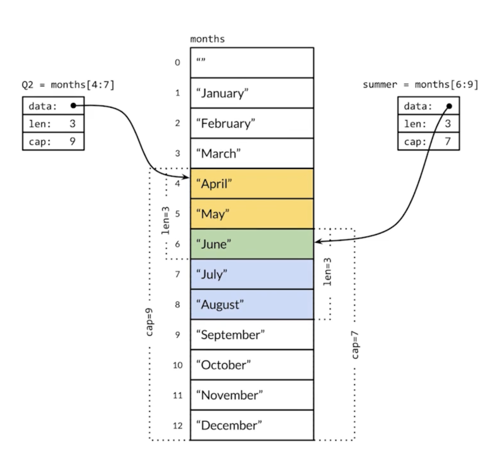

# Go 语言从入门到实战

## Go 语言简介

### 概述

Go 语言诞生于 2007 年，主要是为了解决 Google 内部所发现的问题。

* 多核硬件架构
* 超大规模分布式计算集群
* Web 模式导致的前所未有的开发规模和更新速度

大多数互联网公司都会面临上述问题，Go 语言本身就是用来解决上述问题的，所以越来越多公司和组织都在使用 Go。

除了构建大规模互联网系统之外，在业界大家熟知的一些软件，例如 Docker、Kubernets，都是使用 Go 来编写的，所以 Go 也被称为云端开发语言。著名的区块链项目，像以太坊、HYPERLEDGER 这些都可以用 Go 来开发，所以说 Go 也是当之无愧的区块链开发语言。传统的企业应用，物联网应用，也都有 Go 的身影 ，Go 语言的应用范围也在不断扩展。

Go 语言创始人：

* Rob Pike：Unix 的早期开发者，UTF-8 创始人
* Ken Thompson：Unix 创始人，C 语言创始人，1983 年获图灵奖
* Robert Griesemer：Google V8 JS Engineer、Hot Spot 开发者

特性：

* 简单
  * C 37 关键字、C++ 84 关键字、Go 25 关键字
* 高效
  * 编译的强类型语言
  * 支持垃圾回收的同时，也支持指针直接进行内存访问
* 生产力
  * 语法简洁
  * 存在编程约束，只支持复合，不支持继承

### 第一个 Go 程序

#### 简单案例

```go
// src/ch1/main/hello_world.go

package main

import "fmt"

func main() {
	fmt.Println("hello world")
}
```

直接运行

```
go run hello_world.go
```

编译后运行

```
go build hello_world.go 
./hello_world 
```

> Go 在默认情况下都会使用静态链接，编译完的 Go 程序都会指示一个独立的二进制文件，具有良好的便携性，可以拷贝到不到的机器上运行。安装部署时，尤其是通过容器安装部署，便携能力很强。

#### 案例分析

应用程序入口

* 必须是 main 包：package main
* 必须是 main 方法：func main()
* 文件名不一定是 main.go

退出返回值

* Go 中 main 函数不支持任何返回值
* 通过 os.Exit 返回状态

```go
// ...

func main() {
	fmt.Println("hello world")
	os.Exit(0)
}
```

* 在程序中直接通过 os.Args 获取命令行参数

```go
func main() {
	if len(os.Args) > 1 {
		fmt.Println("hello world", os.Args[1])
	}
}
```

```
go run hello_world.go heora
```

## 01. 基础程序结构

### 变量、常量

> The master has failed more times than the beginner has tried.

#### 编写测试程序

* 源码文件以 _test 结尾：xxx_test.go
* 测试方法名以 Test 开头：`func TestXXX(t *testing.T) {...}`

```go
// src/ch2/test/first_test.go

package try_test

import "testing"

func TestTry(t *testing.T) {
	t.Log("my first try!")
}
```

#### 变量定义

```go
// src/ch2/fib/fib_test.go

package fib

import (
	"testing"
)

func TestFibList(t *testing.T) {
	// 1. 第一种方式
	// var a int = 1
	// var b int = 1

	// 2. 第二种方式
	// var (
	// 	a int = 1
	// 	b     = 1
	// )

	// 3. 第三种方式
	a := 1
	b := 1

	t.Log(a)

	for i := 0; i < 5; i++ {
		t.Log(" ", b)
		tmp := a
		a = b
		b = tmp + a
	}
} 
```

* 赋值支持自动类型推断
* 在一个赋值语句中可以对多个变量同时赋值

```go
func TestExchange(t *testing.T) {
	// a := 1
	// b := 2
	// tmp := a
	// a = b
	// b = tmp

	a := 1
	b := 2

	a, b = b, a

	t.Log(a, b)
}
```

#### 常量定义

支持快速设置连续值

```go
package constant_test

import "testing"

const (
	Monday = iota + 1
	Tuesday
	Wednesday
	Thursday
	Friday
	Saturday
	Sunday
)

const (
	Readable = 1 << iota
	Writable
	Executable
)

func TestConstant(t *testing.T) {
	t.Log(Monday, Tuesday) // 1 2

	a := 7 // 0111

	t.Log(a&Readable == Readable, a&Writable == Writable, a&Executable == Executable) 
  // true true true
}
```

### 数据类型

#### 基本数据类型

| 数据类型                                                 |
| -------------------------------------------------------- |
| bool                                                     |
| string                                                   |
| int init8 int16 int32 int64                              |
| uint uint8 uint16 uint32 uint64 uintptr                  |
| byte // alias for uint8                                  |
| rune // alias for int32, represents a Unicode code point |
| float32 float64                                          |
| complex64 complex128                                     |

类型转化

* Go 语言不支持隐式类型转换
* 别名和原有类型也不能进行隐式类型转换

```go
package type_test

import "testing"

type MyInt int64

func TestType(t *testing.T) {
	var a int = 1

	var b int64
	var c int32

	// b = a // cannot use a (variable of type int) as int64 value in assignmentcompiler
	// c = a // cannot use a (variable of type int) as int64 value in assignmentcompiler

	b = int64(a)
	c = int32(a)

	var d MyInt
	d = MyInt(a)

	t.Log(a, b, c, d)
}
```

Go 语言对于类型转换非常严格， 不支持隐式类型转换。

```go
type MyInt int64    // 类型再定义，支持强制类型转换，不支持判等操作
type MyInt = int64  // 类型别名，支持直接判等操作
```

#### 类型的预定义值

* math.MaxInt64
* math.MaxFloat64
* math.MaxUnit32

#### 指针类型

Go 支持垃圾回收机制 ，同时作为一种非常高效的语言，也支持使用指针直接访问内存空间。

不过 Go 语言指针使用也有一些限制：

* 不支持指针运算
* string 是值类型，默认值是空字符串，而不是 nil

 ```go
 func TestPoint(t *testing.T) {
 	a := 1
 	aPtr := &a
 
 	// aPtr = aPtr + 1 // cannot convert 1 (untyped int constant) to *int
 
 	t.Log(a, aPtr)           // 1 0x140000a41c8
 	t.Logf("%T %T", a, aPtr) // int *int
 }
 ```

```go
func TestStrng(t *testing.T) {
	var s string

	t.Log("*" + s + "*") // **
	t.Log(len(s))        // 0
}
```

### 运算符

#### 算数运算符

A = 10, B = 20

| 运算符 | 描述 | 实例        |
| ------ | ---- | ----------- |
| +      | 相加 | A + B = 30  |
| -      | 相减 | A - B = -10 |
| *      | 相乘 | A * B = 200 |
| /      | 相除 | B / A = 2   |
| %      | 取余 | B % A = 0   |
| ++     | 自增 | A++ = 11    |
| --     | 自减 | A--   = 9   |

Go 语言没有前置 ++，前置 -- 。

#### 比较运算符

A = 10, B = 20

| 运算符 | 描述                                                         | 实例         |
| ------ | ------------------------------------------------------------ | ------------ |
| ==     | 检查两个值是否相等，如果相等返回 true，否则返回 false        | A == B false |
| !=     | 检查两个值是否相等，如果不想等返回 true，否则返回 false      | A != B true  |
| >      | 检查左边值是否大于右边值，如果是返回 true，否则返回 false    | A > B false  |
| <      | 检查左边值是否小于右边值，如果是返回 true，否则返回 false    | A < B true   |
| >=     | 检查左边值是否大于等于右边值，如果是返回 true，否则返回 false | A >= B false |
| <=     | 检查左边值是否小于等于右边值，，如果是返回 true，否则返回 false | A <= B true  |

**用 == 比较数组**

很多主流语言中，数组是引用类型，使用 == 比较时，实际上是比较两个数组的引用，而不是比较值，在 Go 中则完全不同。

* 相同维数且含有相同个数元素的数组才可以比较；
* 每个元素都相同的才相等。

```go 
func TestCompareArray(t *testing.T) {
	a := [...]int{1, 2, 3, 4}
	b := [...]int{1, 3, 4, 5}
	c := [...]int{1, 2, 3, 4, 5}
	d := [...]int{1, 2, 3, 4}

	t.Log(a == b) // false
	// t.Log(a == c) // cannot compare a == c (mismatched types [4]int and
	t.Log(a == d) // true

	t.Log(a, b, c, d)
}
```

#### 逻辑运算符

A = 10, B = 20

| 运算符 | 描述                                                         | 实例              |
| ------ | ------------------------------------------------------------ | ----------------- |
| &&     | 逻辑 AND 运算符。如果两边的操作数都是 true，则条件为 true，否则为 false | A && B   false    |
| \|\|   | 逻辑 OR 运算符。如果两边的操作数有一个 true，则条件为  true，否则为 false | A \|\| B     true |
| !      | 逻辑 NOT 运算符。如果条件为 true，则逻辑 NOT 条件为 false，否则为 true | !(A && B) true    |

#### 位运算符

和主流语言基本一致，差异如下。

&^ 按位置零

* 1 &^ 0 -- 1
* 1 &^ 1 -- 0
* 0 &^ 1 -- 0
* 0 &^ 0 -- 0

### 条件和循环

 #### 循环

Go 语言仅支持循环关键字 for

```go
for j := 7; j <= 9; j++
```

```go
// while 条件循环
// while <= 5

func TestWhileLoop(t *testing.T) {
	n := 0

	for n < 5 {
		n++
		t.Log(n)
	}
}
```

```go
// 无限循环
// while(true)

n := 0
for {
  ...
}
```

#### 条件语句 - if 条件

```go
if condition {
  // code to be executed if condition is true
} else {
	// code to be executed if condition is false  
}
```

```go
if condition-1 {
  // code to be executed if condition-1 is true
} else if condition-2 {
  // code to be executed if condition-2 is true
} else {
	// code to be executed if both condition1 and condition2 are false  
}
```

* condition 表达式结果必须为布尔值
* 支持变量赋值
  * 由于 go 支持多返回值，配合使用比较便捷

```go
if var decleartion; condition {
  // code to be exectuted if condition is true
}
```

```go
func TestIfMulitSec(t *testing.T) {
	if a := 1 == 1; a {
		t.Log("1 == 1")
	}
}
```

```go
func TestIfMulitSec(t *testing.T) {
  if v, err := someFun(); err == nil {
  } else {
  }
}
```

#### 条件语句 - switch 条件

```go
switch os := runtime.GOOS; os {
  case "darwin":
  	fmt.Println("OS X.")
  case "linux":
  	fmt.Println("Linux.")
	default:
  fmt.Printf("%s.", os)
}
```

```go
switch {
  case 0 <= Num && Num <= 3
  	fmt.Printf("0-3")
 	case 4 <= Num && Num <= 6
  	fmt.Printf("4-6")
  case 7 <= Num && Num <= 9
  	fmt.Printf("7-9")
}
```

* 条件表达式不限制为常量或者整数；
* 单个 case 中，可以出现多个结果选项，使用逗号分隔；
* 与 C 语言等规则相反，Go 语言不需要使用 break 来明确退出一个 case；
* 可以不设定 switch 之后的条件表达式，在此种情况下，整个 switch 结构与多个 if...else... 的逻辑作用等同。

```go
func TestSWitchMultiCase(t *testing.T) {
	for i := 0; i < 5; i++ {
		switch i {
		case 0, 2:
			t.Log("even")
		case 1, 3:
			t.Log("odd")
		default:
			t.Log("it is not 0-3")
		}
	}
}
```

 ```go
 func TestSwitchCaseCondition(t *testing.T) {
 	for i := 0; i < 5; i++ {
 		switch {
 		case i%2 == 0:
 			t.Log("even")
 		case i%2 == 1:
 			t.Log("odd")
 		default:
 			t.Log("it is not 0-3")
 		}
 	}
 }
 ```

## 02. 常用集合

### 数据和切片

#### 数组声明

```go
func TestArrayInit(t *testing.T) {
	var arr [3]int
	arr1 := [4]int{1, 2, 3, 4}
	arr3 := [...]int{1, 2, 3, 4, 5}

	arr1[1] = 6

	t.Log(arr[1], arr[2]) // 0 0
	t.Log(arr1)           // [1, 6, 3, 4]
	t.Log(arr3)           // [1, 2, 3, 4, 5]
}
```

#### 数组元素遍历

```go
func TestArrayTravel(t *testing.T) {
	arr := [...]int{1, 3, 4, 5}

	// 1. method1
	for i := 0; i < len(arr); i++ {
		t.Log((arr[i]))
	}

	// 2. method2
	for idx, e := range arr {
		t.Log(idx, e)
	}

	// 3. method3
	for _, e := range arr {
		t.Log(e)
	}
}
```

#### 数组截取

```
a[开始索引(包含), 结束索引(不包含)]
```

```go
func TestArraySection(t *testing.T) {
	arr := [...]int{1, 2, 3, 4, 5}

	t.Log(arr[:3]) // [1 2 3]
	t.Log(arr[3:]) // [4 5]
	t.Log(arr[:])  // [1 2 3 4 5]
}
```

> 数组截取之后，其实就是一个 slice。

#### 切片声明


```go
func TestSliceInit(t *testing.T) {
	var s0 []int
	t.Log(len(s0), cap(s0)) // 0 0

	s0 = append(s0, 1)
	t.Log(len(s0), cap(s0)) // 1 1

	s1 := []int{1, 2, 3, 4}
	t.Log(len(s1), cap(s1)) // 4 4

	s2 := make([]int, 3, 5)
	t.Log(len(s2), cap(s2)) // 3 5
	// cap 容量，len 可访问元素个数
	// t.Log(s2[0], s2[1], s2[2], s2[3], s2[4]) // index out of range [3] with length 3 [recovered]
	t.Log(s2[0], s2[1], s2[2]) // 0 0 0

	s2 = append(s2, 5)
	t.Log(len(s2), cap(s2))           // 4 5
	t.Log(s2[0], s2[1], s2[2], s2[3]) // 0 0 0 5
}
```

#### 切片共享存储结构

 ```go
 func TestSliceGrowing(t *testing.T) {
 	s := []int{}
 
 	for i := 0; i < 10; i++ {
 		s = append(s, i)
 		t.Log(len(s), cap(s))
 	}
 	// 当容量不够时，会乘 2 倍的方式进行扩展
 	// 当扩展时，会开启新的存储空间，并将原有空间的元素拷贝到新空间中间
 	// 1 1
 	// 2 2
 	// 3 4
 	// 4 4
 	// 5 8
 	// 6 8
 	// 7 8
 	// 8 8
 	// 9 16
 	// 10 16
 }
 ```



```go
func TestSliceShareMemory(t *testing.T) {
	year := []string{"Jan", "Feb", "Mar", "Apr", "May", "Jun", "Jul", "Aug", "Sep", "Oct", "Nov", "Dec"}

	Q2 := year[3:6]
	t.Log(Q2, len(Q2), cap(Q2)) // [Apr May Jun] 3 9

	summer := year[5:8]
	t.Log(summer, len(summer), cap(summer)) // [Jun Jul Aug] 3 7

	summer[0] = "Unknow"
	t.Log(Q2)   // [Apr May Unknow]
	t.Log(year) // [Jan Feb Mar Apr May Unknow Jul Aug Sep Oct Nov Dec]
}
```

#### 数组 vs 切片

* 容量是否可伸缩
  * 数组定长
  * 切片不定长
* 是否可以进行比较
  * 相同维数、相同长度的数组是可以比较的
  * 切片不能比较

```go
func TestSliceComparing(t *testing.T) {
	a := []int{1, 2, 3, 4}
	b := []int{1, 2, 3, 4}

	if a == b { // cannot compare a == b (slice can only be compared to nil)
		t.Log("equal")
	}
}
```

### Map 


