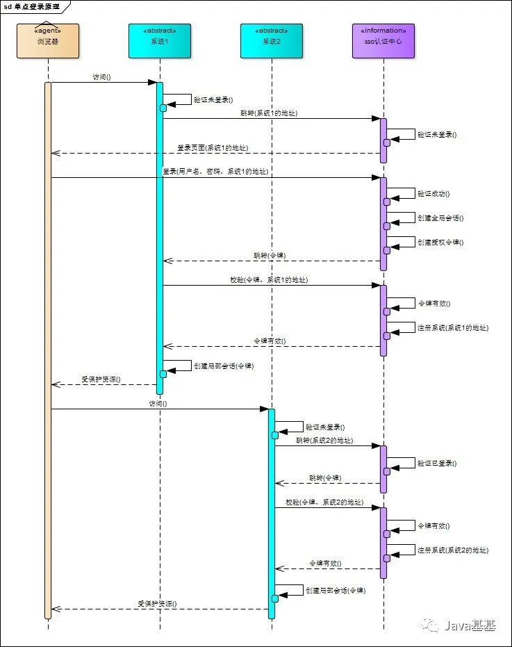

# interview

## personal blog

* 代码优化
  * remove axios，use $fetch
  * remove highlight.js
  * remove alicdn, use custom cdn
* 自定义拆包
  * `rollupOptions.output.manualChunks`
* preload
  * 字体文件预加载
* Accessiblity 优化
  * `<a class="pc" aria-label="website">`
* 代理服务器缓存
  * nginx 反向代理设置缓存
* cdn 缓存
  * 静态资源开启 cdn 缓存
* redis 缓存
  * 相同请求使用 redis 缓存处理
  * 更新/添加/删除文章，删除缓存

## network

### TCP/IP 网络分层模型

从下向上划分。

* 链接层（link layer）
  * 以太网、Wifi 底层网络发送原始数据包，工作在网卡层次，使用 MAC 标记网络设备
* 网际层或者网络互联层（internet layer），IP 协议就处于这一层
  * IP 协议定义了 IP 地址，可以在链接层基础上，用 IP 地址取代 MAC 地址
* 传输层（transport layer）
  * TCP、UDP 协议工作层次
* 应用层（application layer）
  * HTTP、Telnet、SSH、FTP、SMTP 等

### OSI 网络分层模型

开放式系统互通通信参考模型（Open System Interconnection Reference Model）。仅是一个参考，并不是强制标准。

从下向上划分。

* 物理层，网络的物理形式
* 数据链路层，相当于 TCP/IP 的链接层
* 网络层，相当于 TCP/IP 的网际层
* 传输层，相当于 TCP/IP 的传输层
* 会话层，维护网络中连接状态，保持会话和同步
* 表示层，把数据转换为合适、可理解的语法和语义
* 应用层，面向具体的应用传输协议

五六七层统一对应 TCP/IP 的应用层。

### HTTP

HTTP（HyperText Transfer Protocol） 是一个在计算机世界里用于专门在两点之间传输文本、图片、音频、视频等超文本数据的约定和规范。

HTTP 跑在 TCP/IP 协议栈之上，依靠 IP 协议实现寻址和路由、TCP 协议实现可靠数据传输、DNS 协议实现域名查找、SSL/TLS 协议实现安全通信。

特点：灵活可扩展、可靠的传输协议、应用层协议、使用请求-应答模式、无状态协议、明文传输、不安全

### WebSocket

WebSocket 协议依赖于 HTTP。

WebSocket 是一个 “全双工” 的通讯协议，与 TCP 一样，客户端和服务端都可以随时向对方发送数据。

WebSocket 握手是一个标准的 HTTP Get 请求。

但是要带上两个协议升级的头字段：

* Connection: Upgrade，表示要求协议升级
* Upgrade: websocket，表示要升级成 WebSocker 协议

还增加了两个额外的认证头字段：

* Sec-WebSocket-Key：一个 base64 编码的 16 字节随机数，作为简单的认证密钥
* Sec-WebSocket-Version：协议版本号，当前必须是 13

服务端会返回特殊的 “101 Switching Protocols” 响应报文，接下来请求就用 HTTP，改用 WebSocket 协议进行通信。

### 状态码

1xx：提示信息，目前是协议处理的状态，需要后续操作

* 101 Switch Protocols，客户端使用 Upgrade 头字段，要求协议升级，比如 WebSocket 。

2xx：成功态，报文已经收到并被正确处理

* 200 OK，常见成功状态码，响应头后通常存在 body 数据
* 204 No Content，常见成功状态码，响应头通常不存在 body 数据
* 206 Partial Content，HTTP 分块下载或断点续传的基础，客户端发送范围请求，服务端成功处理后，返回部分资源
  * 206 通常伴随头字段 Content-Range

3xx：重定向，资源位置发生变动，需要客户端发送请求

* 301 永久重定向
* 302 临时重定向
* 304 Not Modified 表示资源未修改

4xx：客户端错误，请求报文错误，服务器无法处理

* 400 Bad Request，通用的错误，表示请求报文错误
* 403 Forbidden，服务端禁止访问资源
* 404 Not Found，本意服务器无法提供资源，未找到资源
* 405 Method Not Allowed，不允许使用某些方法操作资源
* 408 Request Timeout，请求超时

5xx：服务端错误，服务器处理时内部发生错误

* 500 Internal Server Error，通用错误码
* 502 Bad Gateway，服务器网关错误或者代理错误
* 503 Service Unavailable，服务器正忙，无法响应服务，503 是一个临时状态

### HTTPS、SSL\TLS

https 主要用来解决 http 的缺点，明文传输和不安全。

如果通信过程具备机密性、完整性、身份认证和不可否认，就可以认为是安全的。

* 机密性，数据保密，不能让不相关的人看到消息
* 完整性，数据传输过程中不会被修改
* 身份认证，可以确认对方身份，保证消息发送给可信的人
* 不可否认，不能否认已经发生过的行为

https 在 http 的基础之上增加了上面所说的 3 大特性。

https 其实就是把 HTTP 下层的传输协议由 TCP/IP 协议换成 SSL/TLS，即 HTTP Over SSL/TLS。

SSL 即安全套接层（Secure Sockets Layer），位于 OSI 模型中的第 5 层。于网景公司 1994 年发明，有 v2、v3 两个版本。

1999 年互联网工程组 IETF 把它改名为 TLS（传输层安全，Transport Layer Security），正式标准化，版本号从 1.0 开始，所以 TLS 1.0 实际就是 SSL v3.1。

目前应用广泛的 TLS 是 1.2。TLS 协议由记录协议、握手协议、警告协议、变更密码规范协议、扩展协议等几个子协议组成，综合使用了对称加密、非对称加密、身份认证等许多密码学前沿技术。

浏览器和服务器使用 TLS 建立连接时需要选择一组恰当的加密算法和实现安全通信，这些算法的组合被称为 “密码套件”（cipher suite，加密套件）。

TLS 密码套件命名非常规范，基础形式是 “密钥交换算法 + 签名算法 + 对称加密算法 + 摘要算法”。

以下面的密码套件为例：

```
ECDHE-RSA-AES256-GCM-SHA384
```

握手时使用 ECDHE 算法进行密钥交换，使用 RSA 签名和身份认证，握手后的通信使用 AES 对称算法，密钥长度 256 位，分组模式是 GCM，摘要算法 SHA384 用于消息认证和产生随机数。

TLS 中使用混合加密方式，实现机密性。

* 通信刚开始使用非对称加密算法，比如 RSA、ECDHE 解决密钥交换的问题。
* 完成会话密钥安全交换之后，后续不再使用非对称加密，全部使用对称加密。

TLS 中使用摘要算法（Digest Algorithm）实现完整性。

* 摘要算法是特殊的 “单向” 加密算法，它只有算法，没有密钥，加密后的数据无法解密。
* 摘要算法保证 “数字摘要” 和原文是完全等价的。只要在原文后附上它的摘要，就能够保证数据的完整性。
* 摘要算法不具备机密性，明文传输同样也存在问题，所以 TLS 在传输过程会使用会话密钥同时加密消息和摘要。

TLS 中使用数字签名同时实现身份认证和不可否认。

* 私钥只能本人持有，其他任何人都不会拥有。
* 使用私钥加上摘要算法，就可以实现 “数字签名”。私钥仅加密原文摘要，形成数字签名，使用公钥对其进行解析，获取摘要后，比对原文验证其完整性。
* 上述两个行为存在两个专业术语，叫做 “签名” 和 “验签”。
* 对于 “公钥信任” 问题，需要通过 CA（Certificate Authority，证书认证机构）构建起公钥信任链，保证公钥是安全可靠的。

数字证书和 CA

* 公钥的分发需要使用数字证书，必须由 CA 的信任链来验证，否则就是不可信的。
* CA 证书中包含要发给客户端的公钥、签发者、过期时间等信息。
* 数字签名和数字证书仅用于 TSL/SSL 的握手阶段，用来保证服务器的公钥能够正确地传递给浏览器。

证书信任链过程：

以二级 CA 证书为例，服务器返回的是证书链（不包括根证书）。
浏览器获取到证书链，会根据证书链中的签发者信息，逐层向上查找到根证书，并从根证书开始逐级向下做验签。
首先使用信任的根证书（公钥）解析证书链的根证书得到一级证书的公钥和摘要验签，然后拿一级证书的公钥解密一级证书拿到二级证书的公钥和摘要验签，再然后拿二级证书的公钥解密二级证书得到服务器的公钥和摘要验签，验证过程结束。

验签过程：

首先证书包括四部分：

* signedCertificate 签名的证书，即浏览器点击小锁头直观可以看到的证书
* algorithmIdentifier 算法标记，包括了签名证书用到的摘要和签名算法
* encrpted 加密摘要，加密摘要不包含在 signedCertificate 中，浏览器中点击小锁头看不到加密摘要

使用传递过来的摘要算法 algorithmIdentifier  对一级证书的 signedCertificate 做摘要。
使用根证书解密解析一级证书的数字签名 encrpted，得到发过来的摘要。
如果两者一致，则认为一级 CA 证书是真实有效的。

> 如果中间人截获证书，将证书替换为自己申请的证书，并且使客户端信任中间人的根证书，这样中间人就可以使用这个根证书来 “伪造” 证书，冒充原网站， fiddler 就是这么做的。简单修改证书是不行的，因为证书会被 CA 签名，可以防止被篡改，中间人得不到 CA 的私钥，就没办法伪造。

### TLS 1.2 连接过程

TLS 协议包含几个子协议，也可以理解为几个不同职责的模块，常见的有记录协议、警报协议、握手协议、变更密码协议等。

* 记录协议（Record Protocol）规定 TLS 收发收据的基本单位：记录（Record）。
  * 类似 TCP 里的 segment，所有的其他子协议都需要记录协议发出。
  * 多个记录数据可以在一个 TCP 包里一次性发出，不需要像 TCP 那样返回 ACK。
* 警报协议（Alert Protocol）的职责是像对方发送警告信息
  * 类似 HTTP 协议里的状态码
  * protocol_version 就是不支持旧版本，bad_certificate 就是证书有问题
* 握手协议（Handshake Protocol）是 TLS 里最复杂的子协议
  * 比 TCP 的 SYN/ACK 复杂的多
  * 浏览器和服务器会在握手过程中协商 TLS 版本号、随机数、密码套件等信息，然后交换证书和密钥参数，最终双方协商得到会话密钥
* 变更密码规范协议（Change Cipher Spec Protocol）
  * 非常简单，就是一个 “通知”，告诉对方，后续数据都将使用加密保护

TLS 握手过程简要图。


#### ECDHE 握手过程

下图是 TLS 的握手过程。


TCP 建立连接之后：

浏览器会发送 “Client Hello” 消息。包含客户端的版本号、支持的密码套件，还有一个随机数（Client Random），用于生成会话密钥。

```
Handshake Protocol: Client Hello
    Version: TLS 1.2 (0x0303)
    Random: 1cbf803321fd2623408dfe…
    Cipher Suites (17 suites)
        Cipher Suite: TLS_ECDHE_RSA_WITH_AES_128_GCM_SHA256 (0xc02f)
        Cipher Suite: TLS_ECDHE_RSA_WITH_AES_256_GCM_SHA384 (0xc030)
```

服务器收到 “Client Hello” 后，返回 “Server Hello” 消息，对比版本号，也会给出一个随机数（Server Random），然后从客户端的列表里选择一个本次通信要使用的密码套件。假定这里选择 TLS_ECDHE_RSA_WITH_AES_256_GCM_SHA384。

```
Handshake Protocol: Server Hello
    Version: TLS 1.2 (0x0303)
    Random: 0e6320f21bae50842e96…
    Cipher Suite: TLS_ECDHE_RSA_WITH_AES_256_GCM_SHA384 (0xc030)
```

然后服务器为了证明自己的身份，还要把证书发送给客户端（Server Certificate）。

其次因为服务器选择 ECDHE 算法，所以会在发送证书后，发送 “Server Key Exchange” 消息，里面是椭圆曲线的公钥（Server Params），用来实现密钥交换算法，再加上自己的私钥签名认证。

```
Handshake Protocol: Server Key Exchange
    EC Diffie-Hellman Server Params
        Curve Type: named_curve (0x03)
        Named Curve: x25519 (0x001d)
        Pubkey: 3b39deaf00217894e...
        Signature Algorithm: rsa_pkcs1_sha512 (0x0601)
        Signature: 37141adac38ea4...
```

最后服务器发送 “Server Hello Done” 消息。

这样第一个消息往返就结束了，共发送两个 TCP 包，客户端和服务端通过明文共享了三个信息，Client Random、Server Random 和 ServeParams。


客户端此时已经拿到服务器的根证书，会开始走证书链验证，确认证书的真实性，再用证书公钥验证签名，就可以确认服务器身份。可以继续往下执行。

客户端按照密码套件的要求，也生成一个椭圆曲线的公钥（Client Params），发送 “Client Key Exchange” 消息给服务器。

```
Handshake Protocol: Client Key Exchange
    EC Diffie-Hellman Client Params
        Pubkey: 8c674d0e08dc27b5eaa…
```

此时客户端和服务器都拿到了密钥交换算法的两个参数（Client Params、Server Params），然后使用 ECDHE 算法计算得到 “Pre-Master”，也是一个随机数。

现在客户端和服务器手里就存在了三个随机数：Client Random、Server Random、Pre-Master。用这三个数可以生成用于加密会话的主密钥，即 “Master-Secret”。

> master_secret = PRF(pre_master_secret, "master secret", ClientHello.random + ServerHello.random)
>
> RPF 是伪随机数函数，基于密码套件中的最后一个参数，比如本次密码套件中的 SHA384，通过摘要算法再一次强化 “Master Secret” 的随机性。
>
> 主密钥有 48 字节，它也不是最终用于通信的会话密钥，还会用 PRF 扩展出更多的密钥，比如客户端发送的会话密钥（client_write_key）、服务器发送的会话密钥（server_write_key）等，避免只使用一个密码带来的安全隐患。

有了主密钥和派生的会话密钥，握手就快结束了。

客户端发送 “Change Cipher Spec”，然后再发送 “Finished” 消息，把之前发送的数据做一个摘要，加密一下让服务器做验证。

服务器也是同样的操作，发送 “Change Cipher Spec” 和 “Finished” 消息，双方都验证加密解析 OK，握手正式结束，后面就收发被加密的 HTTP 请求和响应了。


“Client Params 和 Server Params 都可以被截获，为何中间人没法通过这两个信息计算 Pre-Master Secret 呢？

* 客户端随机生成随机值 Ra，计算 Pa(x, y) = Ra * Q(x, y)，Q(x, y) 为全世界公认的某个椭圆曲线算法的基点。将 Pa(x, y) 发送至服务器。
* 服务器随机生成随机值 Rb，计算 Pb(x,y) = Rb * Q(x, y)。将 Pb(x, y) 发送至客户端。
* 客户端计算 Sa(x, y) = Ra * Pb(x, y)，服务器计算 Sb(x, y) = Rb * Pa(x, y)
* 算法保证了Sa = Sb = S，提取其中的 S 的 x 向量作为密钥（预主密钥）

> https://blog.csdn.net/mrpre/article/details/78025940 

#### RSA 握手过程

刚才说的 ECDHE 握手过程，是目前主流的 TLS 握手过程，这与传统的握手有两点不同。

* 使用 ECDHE 实现密钥交换，而不是 RSA，所以在服务端会发出 “Server Key Exchange” 消息。
* 因为使用 ECDHE，客户端可以不用等到服务器返回 “Finished” 确认握手完毕，立即就发出 HTTP 报文，省去一个消息往返的时间。不等连接完全建立就提前发送应用数据，提高传输的效率。


#### 双向认证

上面所说的只是 “单向认证” 握手过程，只认证了服务器身份，并没有认证客户端身份。

这是因为通常单向认证后就已经建立了安全通信，用账号、密码等简单的手段就可以确认用户的真实身份。

为了防止账号、密码被盗，例如网上银行还会使用 U 盾给用户颁发客户端的证书，实现 “双向认证”，这样会更加安全。双向认证的流程也没有太多变化，只是在 “Server Hello Done” 之后，“Client Key Exchange” 之前，客户端端要发送 “Client Certificate” 消息，服务器收到后也要把证书链走一遍，验证客户端身份。

### TLS 1.3  特性分析


### 单点登录（SSO）

https://mp.weixin.qq.com/s/6d_16hfd5Fz8pZvdpO3BEw

相对于单系统登录， SSO 需要一个认证中心，只有认证中心接受用户的用户名密码等安全信息，其他系统不再提供登录入口，只接受认证中心的间接授权。

间接授权通过令牌实现，SSO 认证中心验证用户的用户名密码没问题，创建授权令牌，在接下来的跳转过程中，授权令牌作为参数发送给各个子系统，子系统呢到令牌，得到授权之后，可以借此创建局部会话，局部会话登录方式与单系统登录方式相同。这个过程就是单点登录系统的原理。



## browser

### cache

ETag: W/"29322-09SpAhH3nXWd8KIVqB10hSSz66"

`w/` 代表当前是弱 eTag，弱 eTag 只用于提示资源是否相同，只要求资源在语义上没有变化即可，只有资源发生根本改变，才会改变 eTag 值

> 语义没有变化，内容可能会有变化，例如 HTML 里的标签顺序调整，或者多出几个空格。


缓存新鲜度 = max-age || (expires - date)

当响应报文中没有 max-age、s-maxage 或 expries 字段值，但又存在强缓存控制字段时，这时会触发启发式缓存。

缓存新鲜度 = max(0,（date - last-modified)) * 10%

> 根据响应头报文中 date 与 last-modified 值之差与 0 取最大值取其值的百分之十作为缓存时间。
>
> [Caching in HTTP](https://link.juejin.cn/?target=https%3A%2F%2Fwww.w3.org%2FProtocols%2Frfc2616%2Frfc2616-sec13.html%23sec13.2.4) 


频繁变动的资源，比如 HTML，采用协商缓存。CSS、JS、图片等资源采用强缓存，使用 hash 命名。

### chrome cache

#### 正常模块加载

```
Mac：Command + R
Windows：Ctrl + R（F5）
```

刷新网页，该模式下大多数资源会命中强缓存（memory cache）。

#### 硬盘重新加载

```
Mac：Command + shift + R
Windows：Ctrl + shift + R（Ctrl + F5）
```

这种模式会在资源请求头部增加 `cache-control: no-cache` 和 `pragma: no-cache`，向源服务器发起请求，确认是否存在新版本，不存在新版本使用本地缓存。

> pragma 字段是为了兼容 HTTP/1.0，不推荐使用

硬盘重新加载不会清空缓存而是禁用缓存，类似开发者工具 Network 面板的 Disable cache 选项。

## vue

### 响应式原理

### compiler  过程

vue 2 parse、optimize、generate

[compiler](https://github.com/vuejs/vue/blob/main/src/compiler/index.ts)

vue 3  parse（baseParse）、transform、generate

[compiler](https://github.com/vuejs/core/blob/main/packages/compiler-core/src/compile.ts#L85)

### parser  实现原理

对于 HTML 解析是有规范可循的，即 WHATWG 关于 HTML 的解析规范，其中定义了完整的错误处理和状态机的状态迁移过程。

vue.js 3 模板解析器使用递归下降算法构造模板 AST。

通过递归调用 parseChildren 函数不断地消费模板内容，返回解析得到的子节点，最终得到一棵树形结构的模板 AST。

[vue3 baseParse](https://github.com/vuejs/core/blob/main/packages/compiler-core/src/parse.ts#L104)

[解释器原理](https://www.yueluo.club/detail?articleId=62cd9984397c3e0980cd0e6a)

### optimize

#### 响应式系统

* vue.js 2 响应系统和核心是 defineProperty
  * 初始化时就遍历所有属性，包括用不到的属性
* vue.js 3 使用 Proxy 对象重写响应式系统
  * 不需要遍历所有属性，当访问到某个属性时才会递归处理，收集依赖
  * 可以监听动态新增属性
  * 可以监听删除属性
  * 可以监听数组的索引和 length 属性

#### 编译优化

[编译优化](https://www.yueluo.club/detail?articleId=62d0ab22397c3e0980cd2090)

[https://v2.template-explorer.vuejs.org](https://v2.template-explorer.vuejs.org)

[https://template-explorer.vuejs.org](https://template-explorer.vuejs.org)

优化思路：尽可能区分动态内容和静态内容，并针对不同的内容采用不同的优化策略。

vue.js 3 编译器会把编译时关键信息添加到虚拟 DOM 上，渲染器会根据这些关键信息进行优化。

* vue.js 2 通过标记静态根节点，优化 diff 过程
  * diff 时仍需要进行判断，存在一定的性能开销

* vue.js 3 标记和提升所有的静态根节点，diff 的过程中只需要对比动态节点内容
  * 动态节点收集与补丁标志（Patch Flag、Block）
    * 只要存在 patchFlag 节点，就认为它是动态节点，pacthFlag 即补丁标志
    * 虚拟节点的创建阶段会根据 patchFlag 提取动态子节点，并存储到 dynamicChildren 数组中，带有该属性的虚拟节点就是 块（Block）。
    * Block 既可以收集自身动态子节点，还可以收集子代节点的动态子节点。
    * 渲染器更新会以 Block 为维度进行更新。忽略 children 数组，直接寻找 dynamicChildren 数组进行更新。
    * 除了根节点之外，任何带有结构化指令的节点都是 Block，比如 v-if、v-for。
  * 静态提升
    * 将静态节点提升到渲染函数之外，仅保持引用，渲染函数执行时，不会重新创建静态虚拟节点，避免额外性能开销
  * 预字符串化
    * 基于静态提升的优化策略
    * 将大量连续静态标签节点序列化字符串，生成 static vnode
  * 缓存内联事件处理函数
    * `cache[0] || (cache[0] = ($event) => (ctx.a + ctx.b))`

#### 优化打包体积

* vue.js 3 中移除了一些不常用的 API
  * inline-template、filter 等
* Tree-shaking
  * 基于 ES Module 规范，支持静态分析，进行 Tree-shaking


### vuex、pinia

[https://github.com/yw0525/notes/tree/master/vue/vuex/src/store/vuex](https://github.com/yw0525/notes/tree/master/vue/vuex/src/store/vuex)

[https://github.com/yw0525/notes/tree/master/hand_writing/vuex_with_pinia](https://github.com/yw0525/notes/tree/master/hand_writing/vuex_with_pinia)

### vue-router

[https://router.vuejs.org/guide/advanced/navigation-guards.html#the-full-navigation-resolution-flow](https://router.vuejs.org/guide/advanced/navigation-guards.html#the-full-navigation-resolution-flow)

[https://github.com/yw0525/notes/blob/master/vue/vue_router_plus/test/src/vue-router/index.js](https://github.com/yw0525/notes/blob/master/vue/vue_router_plus/test/src/vue-router/index.js)

[https://github.com/yw0525/notes/blob/master/vue/vue_router/src/router/vue-router.js](https://github.com/yw0525/notes/blob/master/vue/vue_router/src/router/vue-router.js)

## build tools
