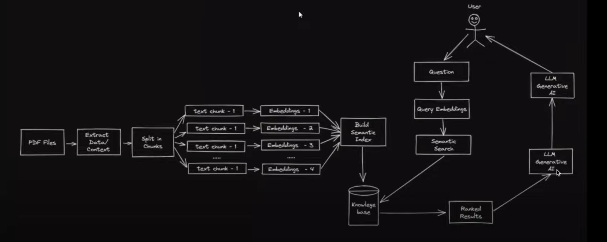

# langchain.js

langchian 核心价值就是标准化，让 AI 变得更加简单。

数据向量化、问题向量化、相似性搜索（基于向量）、接入 llm（openapi）润色，生成特定的结果。

llm 做整理、分析，这也是大语言模型应该做，并且擅长的的事情。

## application

whisper jax，语音转文字的工具。模型重构 更快更强。

langchain-supabase-website-chatbot

## agent

非纯文字处理，例如数据计算，图片处理，谷歌搜索等，与外部应用沟通。

## money

* Google Trends + ChatGpt 写稿
  * 文章改写，增加噱头，剪映配合剪视频

* 客制化宠物领巾

  * 宠物市场，照片生成各种样式的图片

  * AI 工具 Mid journey

  * 客制化宠物图打印

* AI 操作经验

# 语义优势

https://davidsj.substack.com/p/semantic-superiority-part-1

https://davidsj.substack.com/p/semantic-superiority-part-2

## 什么是语义层

*语义层是企业数据的业务表示形式，可帮助最终用户使用通过业务语义管理管理的通用业务术语自主访问数据。语义层将复杂的数据映射为熟悉的业务术语（例如产品、客户或收入），以提供整个组织内统一、整合的数据视图。*

将语义层中的每个对象定义为 SQL，类似于如何将对象的名称作为键并使用 SQL 将其派生为值。它的优点是不需要编译器。然而，你很快就会遇到问题：

* 除非逻辑数据结构中只有一张表/一种数据，否则每次都必须定义数据的位置。
* 派生对象所需的数据可能位于多个位置，然后您必须定义如何将数据连接在一起。
* 如果没有某种模板语言，定义每个事物都会变得非常重复，一旦您尝试抽象它的任何部分……它就不再是 SQL，然后您需要一些东西将其解释为 SQL（编译器）。
* 由于每条 SQL 实际上最终都是一个完整的查询，因此您无法系统地将它们组合在一起。如果你确实尝试做一些事情来做到这一点，最终需要将你的 SQL 解析成一些更有用的形式进行比较，然后组合需要将它们拼接在一起😬。

这就是为什么 SQL 本身的表达能力不足以定义语义层。它通常最终以 YAML 之类的方式表达（避免使用成熟的编程语言或全新的 DSL），并使用关联的编译器将定义转换为可以运行的 SQL。

## 组织竞争优势

语义层提供现实世界和数据之间的映射。它们是根据含义和计算来定义关键对象（实体、指标和相关维度）的地方。如果没有它们，组织就无法就这些含义或如何衡量任何事物达成共识。如果没有这种共识，就会出现混乱和不良结果。

当组织内的不同人员和团队对同一对象使用不同的定义时，他们无法从相同的角度讨论绩效。他们花费大量时间争论谁的观点（数据）是正确的。我在不同的公司多次亲身经历过这一点。这使得快速做出决策变得非常困难，而且实际上使决策者变得比应有的更加谨慎，因为他们对自己的信息产生了怀疑。

如果组织没有明确的共享语义层，分析师或其他数据用户最终将成为语义层。他们必须记住如何使用数据或保存查询和代码以供重用。这会导致不一致，并且随着组织规模的扩大，这种不一致会呈指数级增长——组织越大，语义层就越有价值。决策变得非常困难，数据团队常常被迫高度管理最高管理层使用的少量数据，并阻止其他团队直接访问，以避免产生“不同”的数字。其他人默认都是错的，除非他们同意并且巧合地是对的。

我认为，如果没有语义层，组织不可能拥有强大的数据文化或真正的“数据驱动”。即使有一个，也需要奉献和关怀；没有一个是不可能的。

另一方面是，如果组织拥有维护良好的第二语义层，每个人都可以知道一个对象的含义、有关它的指标是如何计算的以及它们相关的维度/属性是什么及其含义。然后可以利用数据快速做出决策，而不必经常质疑其有效性。组织中能够安全访问数据并熟悉数据的人越多，组织就越有可能就使用数据的决策快速达成共识。

以更高的容量和更低的延迟做出正确的决策使组织能够快速响应新的威胁和机遇。它还使组织能够自信地管理更高水平的风险——如果风险被很好地选择、分散和对冲，就会带来更高的回报和利润。

对于大多数公司来说，这就是他们“以数据取胜”的方式。不是机器学习，不是实时……清楚地了解正在发生的事情并能够快速、果断地采取行动。

## 遵循DRY原则

> "Keeping you DRY" 是一个常见的软件开发术语，其中 "DRY" 是 Don't Repeat Yourself 的缩写，意为 "不要重复自己"。它是一种编程原则，旨在通过避免重复的代码和逻辑，提高代码的可维护性、可读性和可复用性。
>
> 在软件开发中，DRY原则鼓励开发者将重复的代码抽象为可复用的组件、函数或模块，避免在不同的地方重复编写相同或类似的代码。这样可以减少代码量、降低维护成本，并提高代码的可靠性和可扩展性。
>
> 因此，"Keeping you DRY" 的含义是指通过遵循DRY原则，帮助你在开发过程中避免重复的工作，提高代码质量和开发效率。

当组织没有适当的语义层时，分析师和数据科学人员最终会以重复的方式编写许多查询。同一分析师必须调整现有查询或出于类似目的重写它们。

从事类似事情的不同分析师最终会编写相同的查询，因为他们不知道其他人以前是如何做到的。通常，分析师发现自己重新编写查询比尝试找出其他人过去如何完成查询更容易。

特别是，特定查询的连接和过滤器成为样板代码，因为这本质上是定义数据模型。语义层为许多变体查询提供了一个框架，可以一致地运行，并大大减少了样板代码的编写。

想象一下，如果您的笔记本、画布或仪表板的起点是语义层，而不必提取和操作数据。实现价值的时间要短得多，出错的风险也要低得多。

语义层提供对信息的访问 - SQL 和其他数据存储接口提供对数据的访问。通过定义如何使用数据将其与现实世界的实体联系起来，在使用 dbt 等将其转换为有用的结构后，从语义层访问的是将数据处理为信息。您不再要求从表 B 中获取字段 A - 您要求通过带有过滤器的维度显示有关实体的指标等 - 这是信息。

