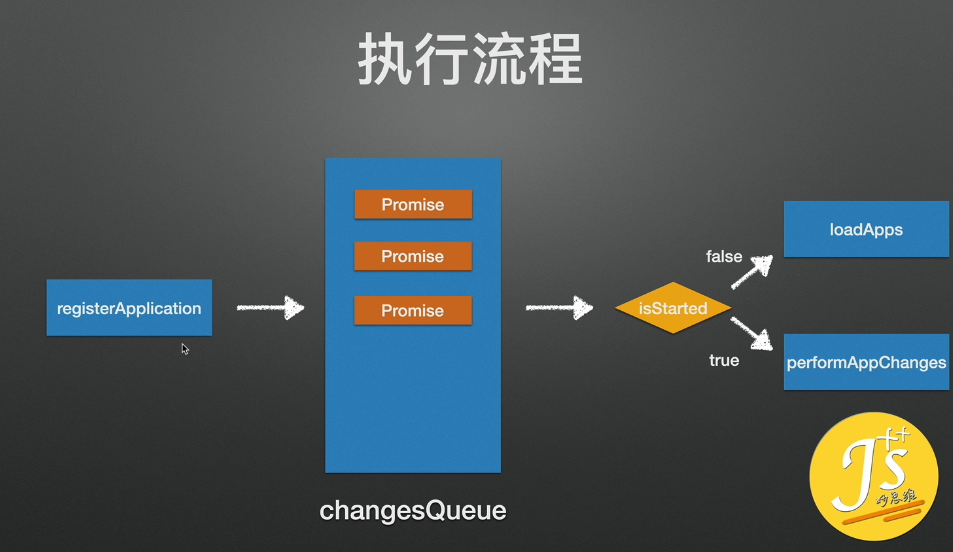
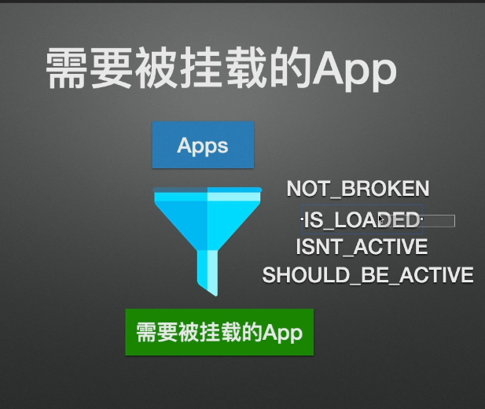

# 微前端

## 一、简介

将前端整体分解为许多更小、更易管理的片段。每个团队可以端到端地拥有自己的功能，可以在自己的代码库中工作，可以独立发布版本，可以不断进行小的增量升级，还可以通过 API 与其他团队集成，以便他们可以一起组建和管理页面和应用程序。


## 二、组成部分


### 1. 生命周期

管理 APP 行为，每个 APP 规定有四个生命周期。


```js
export default {
    // 启动
    bootstrap: [() => Promise.resolve()],
    // 挂载
    mount: [() => Promise.resolve()]
    // 卸载
    unmount: [() => Promise.resolve()]
    // 更新
    update: [() => Promise.resolve()]
}
```

### 2. 状态


### 3. 执行流程

微前端框架 

* isStarted false  预加载 APP

* isStarted true   已启动微前端框架

  /home -> /user	卸载 home 相关的 App，加载 user 相关的 App，挂载 user 相关的 App。
  
  /home -> app1	执行过程中，如果切换至 /user，首先卸载旧 app，然后挂载 app2。
  
  




微前端框架先处理 hashchange 或 popstate 事件，然后 VueRouter、React Router 再处理事件




## 三、微前端解决方案

**Single SPA** 它将生命周期应用于每个应用程序。每个应用程序都可以响应 url 路由事件，并且知道如何从 DOM 引导，加载和卸载自身。

实现简单的微前端框架。