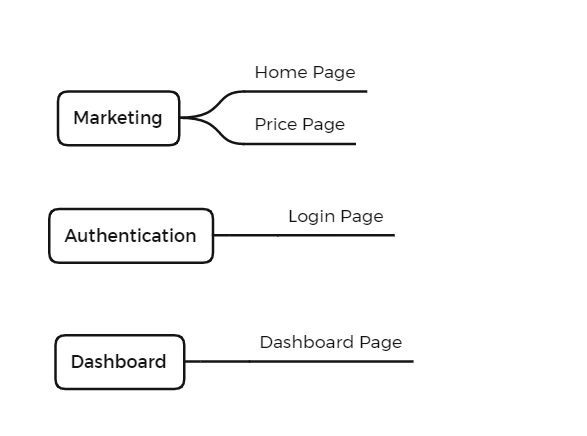
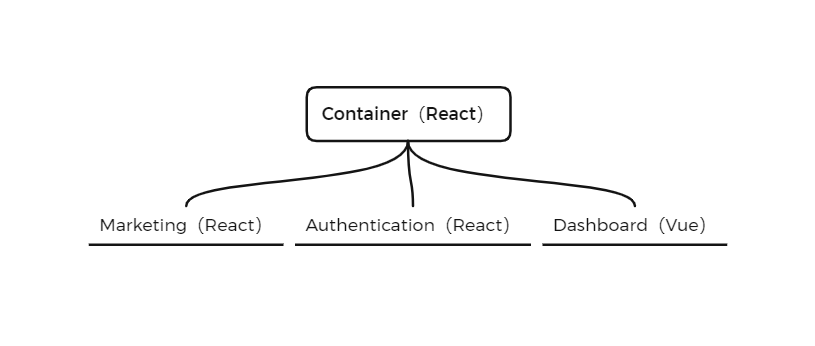

# 基于模块联邦的微前端实现方案

## 微前端应用案例概述

案例中包含三个微应用，分别为 marketing、Authentication 和 Dashboard。

* Marketing：营销微应用，包含首页组件和价格组件
* Authentication：身份验证微应用，包含登录组件
* Dashboard：仪表盘微应用，包含仪表盘组件



容器应用、营销应用、身份验证应用使用 React 框架，仪表盘使用 Vue 框架。



## Marketing - 应用初始化

### 1. 创建应用解构

```js
public
	index.html
src
	bootstrap.js
	index.js
package-lock.json
package.json
webpack.config.js
```

index.html

```html
<!DOCTYPE html>
<html lang="en">
<head>
  <meta charset="UTF-8">
  <meta http-equiv="X-UA-Compatible" content="IE=edge">
  <meta name="viewport" content="width=device-width, initial-scale=1.0">
  <title>Marketing</title>
</head>
<body>
  
  <div id="dev-marketing"></div>

</body>
</html>
```

src/bootstrap.js

```js
console.log('marketing');
```

src/index.js

```js
import("./bootstrap");
```

### 2. 配置 webpack

```js
const HtmlWebpackPlugin = require('html-webpack-plugin');

module.exports = {
  mode: 'development',
  devServer: {
    port: 8081,
    // 使用 html5 history API 时，所有的 404 请求都会响应 index.html 文件 
    historyApiFallback: true 
  },
  module: {
    rules: [
      {
        test: /\.js$/,
        exclude: /node_modules/,
        use: {
          loader: 'babel-loader',
          options: {
            presets: ['@babel/preset-react', '@babel/preset-env'],
            // 1. 避免 babel 语法转义后，函数重复
            // 2. 避免 babel polyfill 将 API 添加到全局
            plugins: ['@babel/plugin-transform-runtime']
          }
        }
      }
    ]
  },
  plugins: [
    new HtmlWebpackPlugin({
      template: './public/index.html'
    })
  ]
}
```

### 3. 添加启动命令

```js
"scripts": {
  "start": "webpack serve"
}
```

## Marketing 创建挂载方法

bootstrap.js

```js
import React from 'react';
import ReactDOM from 'react-dom';

function mount (el) {
  ReactDOM.render(<div>Marketing workds</div>, el);
}

if (process.env.NODE_ENV == 'development') {
  const el = document.querySelector('#dev-marketing');

  if (el) mount(el);
}

export { mount };
```

## Marketing 创建路由

### 1. 创建 components 文件夹

### 2. 创建 App 组件，编写路由

```jsx
import React from 'react';
import { BrowserRouter, Route, Switch } from 'react-router-dom';
import Landing from './components/Landing';
import Pricing from './components/Pricing';

function App () {
  return (
    <BrowserRouter>
      <Switch>
        <Route path="/pricing">
          <Pricing />
        </Route>
        <Route path="/">
          <Landing />
        </Route>
      </Switch>
    </BrowserRouter>
  )
}

export default App;
```

```js
import React from 'react';
import ReactDOM from 'react-dom';
import App from './App';

function mount (el) {
  ReactDOM.render(<App />, el);
}

if (process.env.NODE_ENV == 'development') {
  const el = document.querySelector('#dev-marketing');

  if (el) mount(el);
}

export { mount };
```

## Container 应用初始化

### 1. 创建应用结构

基于 marking 应用进行拷贝修改。

```js
public
	index.html
src
	bootstrap.js
	index.js
package-lock.json
package.json
webpack.config.js
```

### 2. 修改 index.html

```html
<!DOCTYPE html>
<html lang="en">
<head>
  <meta charset="UTF-8">
  <meta http-equiv="X-UA-Compatible" content="IE=edge">
  <meta name="viewport" content="width=device-width, initial-scale=1.0">
  <title>Container</title>
</head>
<body>
  
  <div id="root"></div>

</body>
</html>
```

### 3. 修改 App.js

```js
import React from 'react';

function App () {
  return <div>Container works</div>;
}

export default App;
```

### 4. 修改 bootstrap.js

```js
import React from 'react';
import ReactDOM from 'react-dom';
import App from './App';

function mount (el) {
  ReactDOM.render(<App />, el);
}

if (process.env.NODE_ENV == 'development') {
  const el = document.querySelector('#root');

  if (el) mount(el);
}

export { mount };
```

### 5. 修改 webpack.config.js

```js
const HtmlWebpackPlugin = require('html-webpack-plugin');

module.exports = {
  mode: 'development',
  devServer: {
    port: 8080,
    historyApiFallback: true 
  },
  module: {
    rules: [
      {
        test: /\.js$/,
        exclude: /node_modules/,
        use: {
          loader: 'babel-loader',
          options: {
            presets: ['@babel/preset-react', '@babel/preset-env'],
            plugins: ['@babel/plugin-transform-runtime']
          }
        }
      }
    ]
  },
  plugins: [
    new HtmlWebpackPlugin({
      template: './public/index.html'
    })
  ]
}
```

## 容器应用加载 Marketing 应用

### marketing 应用

webpack.config.js

```js
const HtmlWebpackPlugin = require('html-webpack-plugin');
const ModuleFederationPlugin = require('webpack/lib/container/ModuleFederationPlugin');

module.exports = {
  mode: 'development',
  devServer: {
    port: 8081,
    // 使用 html5 history API 时，所有的 404 请求都会响应 index.html 文件 
    historyApiFallback: true 
  },
  module: {
    rules: [
      {
        test: /\.js$/,
        exclude: /node_modules/,
        use: {
          loader: 'babel-loader',
          options: {
            presets: ['@babel/preset-react', '@babel/preset-env'],
            // 1. 避免 babel 语法转义后，函数重复
            // 2. 避免 babel polyfill 将 API 添加到全局
            plugins: ['@babel/plugin-transform-runtime']
          }
        }
      }
    ]
  },
  plugins: [
    // 导出模块
    new ModuleFederationPlugin({
      name: 'marketing',
      filename: 'remoteEntry.js',
      exposes: {
        "./MarketingApp": "./src/bootstrap.js"
      }
    }),
    new HtmlWebpackPlugin({
      template: './public/index.html'
    })
  ]
}
```

### Container 应用

components/MarketingApp

```js
import React, { useEffect, useRef } from 'react';
import { mount } from 'marketing/MarketingApp';

export default function MarketingApp () {
  const ref = useRef();

  useEffect(() => {
    mount(ref.current);
  }, []);

  return (
    <div ref={ ref }></div>
  );
}
```

webpack.config.js

```js
const HtmlWebpackPlugin = require('html-webpack-plugin');
const ModuleFederationPlugin = require('webpack/lib/container/ModuleFederationPlugin');

module.exports = {
  mode: 'development',
  devServer: {
    port: 8080,
    historyApiFallback: true 
  },
  module: {
    rules: [
      {
        test: /\.js$/,
        exclude: /node_modules/,
        use: {
          loader: 'babel-loader',
          options: {
            presets: ['@babel/preset-react', '@babel/preset-env'],
            plugins: ['@babel/plugin-transform-runtime']
          }
        }
      }
    ]
  },
  plugins: [
    new ModuleFederationPlugin({
      name: 'container',
      remotes: {
        marketing: "marketing@http://localhost:8081/remoteEntry.js"
      }
    }),
    new HtmlWebpackPlugin({
      template: './public/index.html'
    })
  ]
}
```

App.js

```js
import React from 'react';
import Marketing from './components/MarketingApp';

function App () {
  return <Marketing />;
}

export default App;
```

## 共享库设置

container 和 marketing 中使用大量相同的代码库，如果不做共享处理，则应用中相同的库会被加载多次。

```js
"@material-ui/core": "^4.11.0",
"@material-ui/icons": "^4.9.1",
"react": "^17.0.1",
"react-dom": "^17.0.1",
"react-router-dom": "^5.2.0"
```

container 和 marketing 应用的 webpack.config.js 配置文件中加入以下代码

```js
const packageJSON = require('./package.json');

plugins: [
  new ModuleFederationPlugin({
    name: 'marketing',
    filename: 'remoteEntry.js',
    exposes: {
      "./MarketingApp": "./src/bootstrap.js"
    },
    shared: packageJSON.dependencies
  }),
  new HtmlWebpackPlugin({
    template: './public/index.html'
  })
]
```

## 微前端应用路由

### 概述

容器应用路由用于匹配微应用，微应用用于匹配组件。

**Container**

| 路由         | 组件           |
| ------------ | -------------- |
| /            | Marketing      |
| /auth/signin | Authentication |
| /dashboard   | Dashboard      |

**Marketing**

| 路由       | 组件      |
| ---------- | --------- |
| /          | Landing   |
| /pircing   | Pricing   |

**Auth**

| 路由         | 组件    |
| ------------ | ------- |
| /auth/signin | signin  |

**Dashboard**

| 路由       | 组件      |
| ---------- | --------- |
| /dashboard | dashboard |

容器应用使用 BrowserHistory 路由，微应用使用 MemoryHistory 路由。

* 为防止容器应用和微应用同时操作 url 而产生冲突，在微前端架构中，只允许容器应用更新 url，微应用不允许更新 url，MemoryHistory 是基于内存的路由，不会改变浏览器地址栏中的 url；
* 如果不同的应用程序需要传达有关路由的相关信息，应该尽可能的使用通用的方式，memoryHistory 在 React 和 Vue 中都有提供。

### 更新现有路由配置

#### Container 路由配置

```jsx
// src/App.js

import React from 'react';
import { Router, Route, Switch } from 'react-router-dom';
import { createBrowserHistory } from 'history';
import Marketing from './components/MarketingApp';

const history = createBrowserHistory()

function App () {
  return (
    <Router history={ history }>
      <Switch>
        <Route path="/"> 
          <Marketing />
        </Route>
      </Switch>
    </Router>
  );
}

export default App;
```

#### Marketing 路由配置

```js
// Marketing/bootstrap.js

import React from 'react';
import ReactDOM from 'react-dom';
import { createMemoryHistory } from 'history';
import App from './App';

function mount (el) {
  const history = createMemoryHistory();

  ReactDOM.render(<App history={ history } />, el);
}

if (process.env.NODE_ENV == 'development') {
  const el = document.querySelector('#dev-marketing');

  if (el) mount(el);
}

export { mount };
```

```jsx
// Marketing/app.js

import React from 'react';
import { Router, Route, Switch } from 'react-router-dom';
import Landing from './components/Landing';
import Pricing from './components/Pricing';

function App ({ history }) {
  return (
    <Router history={ history }>
      <Switch>
        <Route path="/pricing">
          <Pricing />
        </Route>
        <Route path="/">
          <Landing />
        </Route>
      </Switch>
    </Router>
  )
}

export default App;
```

#### 添加头部组件

container/src/App.js

```jsx
import React from 'react';
import { Router, Route, Switch } from 'react-router-dom';
import { createBrowserHistory } from 'history';
import Marketing from './components/MarketingApp';
import Header from './components/Header';

const history = createBrowserHistory()

function App () {
  return (
    <Router history={ history }>
      <Header />
      <Switch>
        <Route path="/"> 
          <Marketing />
        </Route>
      </Switch>
    </Router>
  );
}

export default App;
```

### 微应用和容器应用路由交互

* 微应用路由变化时 url 地址没有被同步到浏览器中的地址栏中，路由变化也没有被同步到浏览器的历史记录中。

  当微应用路由变化时通知容器应用更新路由信息（容器应用向微应用传递方法）。

```js
// Container/components/MarketingApp.js

import React, { useEffect, useRef } from 'react';
import { mount } from 'marketing/MarketingApp';
import { useHistory } from 'react-router-dom';

export default function MarketingApp () {
  const ref = useRef();
  const history = useHistory();

  useEffect(() => {
    mount(ref.current, {
      onNavgate ({ pathname: nextPathname }) {
        const pathname = history.location.pathname;

        if (nextPathname !== pathname) {
          history.push(nextPathname);
        }
      }
    });
  }, []);

  return (
    <div ref={ ref }></div>
  );
}
```

```js
// Marketing/bootstrap.js

import React from 'react';
import ReactDOM from 'react-dom';
import { createMemoryHistory } from 'history';
import App from './App';

function mount (el, { onNavgate }) {
  const history = createMemoryHistory();

  onNavgate && history.listen(onNavgate);

  ReactDOM.render(<App history={ history } />, el);
}

if (process.env.NODE_ENV == 'development') {
  const el = document.querySelector('#dev-marketing');

  if (el) mount(el);
}

export { mount };
```

* 容器应用路由变化时只能匹配到微应用，微应用路由并不会响应容器应用路由的变化。

  当容器应用路由变化时需要通知微应用路由进行响应（微应用容容器应用传递方法）。

```js
// Container/components/MarketingApp.js

import React, { useEffect, useRef } from 'react';
import { mount } from 'marketing/MarketingApp';
import { useHistory } from 'react-router-dom';

export default function MarketingApp () {
  const ref = useRef();
  const history = useHistory();

  useEffect(() => {
    const { onParentNavgate } = mount(ref.current, {
      onNavgate ({ pathname: nextPathname }) {
        const pathname = history.location.pathname;

        if (nextPathname !== pathname) {
          history.push(nextPathname);
        }
      }
    });

    onParentNavgate && history.listen(onParentNavgate);
  }, []);

  return (
    <div ref={ ref }></div>
  );
}
```

```js
// Marketing/bootstrap.js

import React from 'react';
import ReactDOM from 'react-dom';
import { createMemoryHistory } from 'history';
import App from './App';

function mount (el, { onNavgate }) {
  const history = createMemoryHistory();

  onNavgate && history.listen(onNavgate);

  ReactDOM.render(<App history={ history } />, el);

  return {
    onParentNavgate ({ pathname: nextPathname }) {
      const pathname = history.location.pathname;

      if (nextPathname !== pathname) {
        history.push(nextPathname);
      }
    }
  }
}

if (process.env.NODE_ENV == 'development') {
  const el = document.querySelector('#dev-marketing');

  if (el) mount(el);
}

export { mount };
```

### marketing 应用本地路由设置

目前 Marketing 应用本地开发环境是报错的，原因是本地开发环境在调用 mount 方法时没有传递第二个参数，默认值就是 undefined，mount 方法内部试图从 undefined 解构 onNavigate，所以就报错了。

解决办法是在本地开发环境调用 mount 方法时传递一个空对象。

如果当前是本地开发环境，路由依然使用 BrowserHistory，所以在调用 mount 方法时传递 defaultHistory 以做区分。

```js
if (process.env.NODE_ENV == 'development') {
  const el = document.querySelector('#dev-marketing');

  if (el) mount(el, {
    defaultHistory: createBrowserHistory()
  });
}
```

在 mount 方法内部判断 defaultHistory 是否存在，如果存在就用 defaultHistory，否则就用 MemoryHistory。

```js
function mount (el, { onNavgate, defaultHistory }) {
  const history = defaultHistory || createMemoryHistory();

  onNavgate && history.listen(onNavgate);

  ReactDOM.render(<App history={ history } />, el);

  return {
    onParentNavgate ({ pathname: nextPathname }) {
      const pathname = history.location.pathname;

      if (nextPathname !== pathname) {
        history.push(nextPathname);
      }
    }
  }
}
```

### 配置其他应用的 publicPath

container

```js
output: {
  publicPath: 'http://localhost:8080/'
}
```

marketing

```js
output: {
  publicPath: 'http://localhost:8081/'
}
```

## Authentication 应用初始化

拷贝 marketing 项目的文件。

### 下载应用依赖

```js
cd auth && npm install
```

### 拷贝 src 文件夹

```js
// bootstrap.js

if (process.env.NODE_ENV == 'development') {
  const el = document.querySelector('#dev-auth');

  if (el) mount(el, {
    defaultHistory: createBrowserHistory()
  });
}
```

```jsx
// App.js

import React from 'react';
import { Router, Route, Switch } from 'react-router-dom';
import Signin from './components/Signin';

function App ({ history }) {
  return (
    <Router history={ history }>
      <Switch>
        <Route path="/auth/signin">
          <Signin />
        </Route>
      </Switch>
    </Router>
  )
}

export default App;
```

### 拷贝 public 文件夹

```html
<div id="dev-auth"></div>
```

### 修改 webpack.config.js

```js
const HtmlWebpackPlugin = require('html-webpack-plugin');
const ModuleFederationPlugin = require('webpack/lib/container/ModuleFederationPlugin');
const packageJSON = require('./package.json');

module.exports = {
  mode: 'development',
  output: {
    publicPath: 'http://localhost:8082/'
  },
  devServer: {
    port: 8082,
    historyApiFallback: true 
  },
  module: {
    rules: [
      {
        test: /\.js$/,
        exclude: /node_modules/,
        use: {
          loader: 'babel-loader',
          options: {
            presets: ['@babel/preset-react', '@babel/preset-env'],
            plugins: ['@babel/plugin-transform-runtime']
          }
        }
      }
    ]
  },
  plugins: [
    new ModuleFederationPlugin({
      name: 'auth',
      filename: 'remoteEntry.js',
      exposes: {
        "./AuthApp": "./src/bootstrap.js"
      },
      shared: packageJSON.dependencies
    }),
    new HtmlWebpackPlugin({
      template: './public/index.html'
    })
  ]
}
```

## Container 加载 Auth 应用

拷贝 Marketing App 的内容进行修改。

Auth/index.js

```js
import React, { useEffect, useRef } from 'react';
import { mount } from 'auth/AuthApp';
import { useHistory } from 'react-router-dom';

export default function AuthApp () {
  const ref = useRef();
  const history = useHistory();

  useEffect(() => {
    const { onParentNavgate } = mount(ref.current, {
      onNavgate ({ pathname: nextPathname }) {
        const pathname = history.location.pathname;

        if (nextPathname !== pathname) {
          history.push(nextPathname);
        }
      }
    });

    onParentNavgate && history.listen(onParentNavgate);
  }, []);

  return (
    <div ref={ ref }></div>
  );
}
```

App.js

```jsx
import React from 'react';
import { Router, Route, Switch } from 'react-router-dom';
import { createBrowserHistory } from 'history';
import Auth from './components/AuthApp';
import Marketing from './components/MarketingApp';
import Header from './components/Header';

const history = createBrowserHistory()

function App () {
  return (
    <Router history={ history }>
      <Header />
      <Switch>
        <Route path="/auth/signin"> 
          <Auth />
        </Route>
        <Route path="/"> 
          <Marketing />
        </Route>
      </Switch>
    </Router>
  );
}

export default App;
```

webpack.config.js

```js
const HtmlWebpackPlugin = require('html-webpack-plugin');
const ModuleFederationPlugin = require('webpack/lib/container/ModuleFederationPlugin');
const packageJSON = require('./package.json');

module.exports = {
  mode: 'development',
  output: {
    publicPath: 'http://localhost:8080/'
  },
  devServer: {
    port: 8080,
    historyApiFallback: true 
  },
  module: {
    rules: [
      {
        test: /\.js$/,
        exclude: /node_modules/,
        use: {
          loader: 'babel-loader',
          options: {
            presets: ['@babel/preset-react', '@babel/preset-env'],
            plugins: ['@babel/plugin-transform-runtime']
          }
        }
      }
    ]
  },
  plugins: [
    new ModuleFederationPlugin({
      name: 'container',
      remotes: {
        marketing: "marketing@http://localhost:8081/remoteEntry.js",
        auth: "auth@http://localhost:8082/remoteEntry.js",
      },
      shared: packageJSON.dependencies
    }),
    new HtmlWebpackPlugin({
      template: './public/index.html'
    })
  ]
}
```

