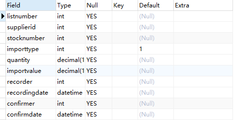
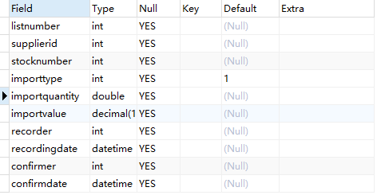
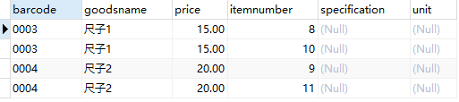
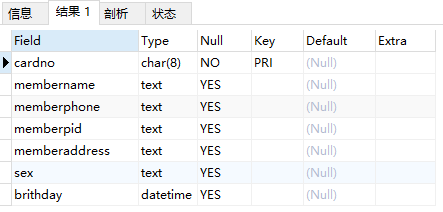
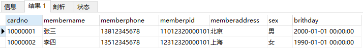

# MySQL 必知必会

安装数据库

```bash
docker run -d -p 3306:3306 \d
    --net=host \
    -e MYSQL_ROOT_PASSWORD=9sfx92Yp374YA7wv01ed \
    -v /data/main-mysql:/var/lib/mysql \
    -v /etc/localtime:/etc/localtime \
    --name=main-mysql \
    mysql:8.0
```

```bash
docker run -d -p 3306:3306 --net=host -e MYSQL_ROOT_PASSWORD=9sfx92Yp374YA7wv01ed -v /data/main-mysql:/var/lib/mysql -v /etc/localtime:/etc/localtime --name=main-mysql mysql:8.0
```

连接数据库

```
mysql –u用户名 [–h主机名或者IP地址,-P端口号] –p密码
```

```bash
docker exec -it main-mysql /bin/bash

mysql -uroot -p9sfx92Yp374YA7wv01ed
```

## 01. 数据存储过程

MySQL 中，一个完整数据存储过程分为四步：创建数据库 - 确认字段 - 创建数据表 - 插入数据。

从系统架构层次来看，MySQL 数据库系统从大到小依次是数据库服务器、数据库、数据表、数据表的行与列。

数据库是 MySQL 最大的存储单元，没有数据库，数据表就没有载体，也就无法存储数据。

### 1. 创建数据库

数据存储的第一步，就是创建数据库。

#### 创建数据库

```mysql
CREATE DATABASE demo;
```

创建数据库无权限处理方法如下：

```bash
show grants;

grant all privileges on *.* to 'root'@'%' identified by 'your passsword' with grant option;

flush privileges;
```

#### 查看数据库

```mysql
SHOW DATABASES;
```

* "demo"：我们通过 SQL 语句创建的数据库，用来存储用户数据。
* ”information_schema“ ：系统自带数据库，主要保存 MySQL 数据库服务器的系统信息。
  * 比如如数据库名称、数据表名称、字段名称、存取权限、数据文件所在的文件夹和系统使用的文件夹，等等。
* ”performance_schema“ ：系统自带数据库，可以用来监控 MySQL 的各项性能指标。
* ”sys“ 数据库是 MySQL 系统自带的数据库，主要作用是以一种更容易被理解的方式展示 MySQL 数据库服务器的各类性能指标，帮助系统管理员和开发人员监控 MySQL 的技术性能。
* ”mysql“ ：系统自带数据库，用来保存 MySQL 数据库服务器运行时需要的系统信息。
  * 比如数据文件夹、当前使用的字符集、约束检查信息，等等。

如果你是 DBA 或者 MySQL 数据库程序员，想深入了解 MySQL 数据库，可以查看[官方文档](https://dev.mysql.com/doc/refman/8.0/en/system-schema.html)。

### 2. 确认字段

数据存储流程的第二步是确认表的字段。

MySQL 数据表由行与列组成，一行就是一条数据记录，每一条数据记录都被分成许多列，一列就叫一个字段。

每个字段都需要定义数据类型，这个数据类型叫做字段类型。

### 3. 创建数据表

数据存储流程的第三步，是创建数据表。

#### 创建数据表

```mysql
CREATE TABLE
    demo.test (
        barcode text,
        goodsname text,
        price int
    );
```

* 创建数据表，最好指明数据库。
* 最后一个字段后面不需要加逗号 ”,“

#### 查看表结构

```mysql
DESCRIBE demo.test;
```

```
mysql> DESCRIBE demo.test;
+-----------+------+------+-----+---------+-------+
| Field     | Type | Null | Key | Default | Extra |
+-----------+------+------+-----+---------+-------+
| barcode   | text | YES  |     | NULL    |       |
| goodsname | text | YES  |     | NULL    |       |
| price     | int  | YES  |     | NULL    |       |
+-----------+------+------+-----+---------+-------+
3 rows in set (0.00 sec)
```

* Field：表示字段名称
* Type：表示字段类型
* Null：表示字段是否允许空值（NULL）
  * 在 MySQL 中，空值不等于空字符串。一个空字符串的长度为 0，一个空值的长度是空。
  * 在 MySQL 中，空值也占用空间。
* Key：表示键
* Default：表示默认值
  * 我们创建的数据表字段都允许为空，默认值都是 NULL
* Extra：表示附加信息

#### 查看表

```mysql
USE demo;
SHOW TABLES;
```

```
mysql> show tables;
+----------------+
| Tables_in_demo |
+----------------+
| test           |
+----------------+
1 row in set (0.00 sec)
```

#### 设置主键

一个 MySQL 数据表只能有一个主键，主键可以确保数据唯一性。

虽然 MySQL 允许创建没有主键的表，但是建议一定要给表定义主键，并且养成习惯。因为主键可以帮助你减少错误数据，并且可以提高查询速度。

MySQL 中的主键，是表中的一个字段或者几个字段的组合。它有 3 个特征：

* 必须唯一，不能重复；
* 不能为空；
* 必须可以唯一标识数据表中的记录。

我们的表中有三个字段 barcode、goodsname、price，那么哪个字段可以作为主键呢？

首先商品名称（goodsname）是不行的，原因是重名的商品会有很多。例如 ”笔“，大家都可以生产一种叫 ”笔“ 的商品，各种各样的，不同规格的，不同材料的。商品名称和数据记录之间并不能形成一一对应的关系，所以商品名称不能作为主键。同样，价格（price）重复的可能性也很大，也不能做主键。

商品条码（barcode）也不能是主键。可能你会说，商品的条码都是由中国物品编码中心统一编制的，一种商品对应一个条码，一个条码对应一种商品。这不就是一一对应的关系？在实际操作中，存在例外的情况。比较典型的就是用户的门店里面有很多自己生产或者加工的商品。例如，馒头、面条等自产产品，散装的糕点、糖果等称重商品，等等。为了管理方便，门店往往会自己给它们设置条码。这样，很容易产生重复、重用的现象。

这时，就需要我们自己添加一个不会重复的字段来做主键。

我们可以添加一个字段，字段类型是整数，可以取名为商品编码（itemnumber）。当我们每次增加一条新数据库的时候，可以让这个字段值自增，这样就永远都不会重复了。

我们可以通过一条 SQL 语句，修改表结构，增加一个主键字段：

```mysql
ALTER TABLE demo.test
ADD
    COLUMN itemnumber int PRIMARY KEY AUTO_INCREMENT;
```

```
mysql> ALTER TABLE demo.test
    -> ADD
    ->     COLUMN itemnumber int PRIMARY KEY AUTO_INCREMENT;
Query OK, 0 rows affected (0.11 sec)
Records: 0  Duplicates: 0  Warnings: 0
```

* alter table：表示修改表；
* add column：表示增加一列；
* primary key：表示这一列是主键；
* auto_increment：表示增加一条记录，这个值会自动增加。

```
mysql> DESCRIBE demo.test;
+------------+------+------+-----+---------+----------------+
| Field      | Type | Null | Key | Default | Extra          |
+------------+------+------+-----+---------+----------------+
| barcode    | text | YES  |     | NULL    |                |
| goodsname  | text | YES  |     | NULL    |                |
| price      | int  | YES  |     | NULL    |                |
| itemnumber | int  | NO   | PRI | NULL    | auto_increment |
+------------+------+------+-----+---------+----------------+
4 rows in set (0.00 sec)
```

### 4. 插入数据

数据存储流程的第四步，也是最后一步，是把数据插入到表当中去。

```mysql
INSERT INTO
    demo.test (barcode, goodsname, price)
VALUES ('001', '本', 3);
```

```
mysql> INSERT INTO
    ->     demo.test (barcode, goodsname, price)
    -> VALUES ('001', '', 3);
Query OK, 1 row affected (0.01 sec)
```

insert into 表示向 demo.test 中插入数据，后面是要插入数据的字段名，values 表示对应的值。

注意点：

* 插入数据的字段名可以不写，建议每次都写。这样做的好处是可读性好，不易出错且容易修改。
* 由于字段 itemnumber 定义了 auto_increment，所以我们插入一条记录的时候，不给它赋值，系统也会自动赋值，每次赋值自增 1。也可以在插入数据的时候给 itemnumber 赋值，但是必须保证与已有记录的 itemnumber 值不同，否则就会提示错误。

### 5. 总结

我们在进行具体操作时，会用到 8 种 SQL 语句：

```mysql
-- 创建数据库
CREATE DATABASE demo;
-- 删除数据库
DROP DATABASE demo;
-- 创建数据表
CREATE TABLE
    demo.test (
        barcode text,
        goodsname text,
        price int
    );
-- 查看表结构
DESCRIBE demo.test;
-- 查看所有表
SHOW TABLES;
-- 添加主键
ALTER TABLE demo.test
ADD
    COLUMN itemnumber int PRIMARY KEY AUTO_INCREMENT;
-- 向表中添加数据
INSERT INTO
    demo.test (barcode, goodsname, price)
VALUES ('001', '本', 3);
```

最后，我们再来了解一下 MySQL 种 SQL 语句的书写规范。

MySQL 以分号来识别一条 SQL 语句结束，所以，你写的每一条 SQL 语句的最后，都必须有一个分号，否则，MySQL 会认为这条语句没有完成，提示语法错误。

所以，建议在写 SQL 语句时遵循统一的样式，以增加可读性，减少错误。可以点击这个[链接](https://www.sqlstyle.guide/zh/)深入学习相关规范。

## 02. 字段类型

MySQL 种有很多字段类型，比如整数、文本、浮点数，等等。如果类型定义合理，就能节省存储空间，提升数据查询和处理的速度。相反，如果类型定义不合理，就有可能导致数据超出取值范围，引发系统错误，甚至可能出现计算错误的情况，进而影响整个系统。

### 1. 整数类型

整数类型一共有 5 种，包括 TINYINT、SMALLINT、MEDIUMINT、INT（INTEGER）和 BIGINT，它们的区别如下：


在评估使用哪种整数类型的时候，需要考虑存储空间和可靠性的平衡问题：

* 用占字节数少的整数类型可以节省存储空间；
* 为了节省存储空间，使用的整数类型取值范围太小，一旦遇到超出取值范围的情况，就可能引发系统错误，影响可靠性。

举个例子，在我们的项目中商品编号使用的数据类型是 INT。

之所以不采用占用字节更少的 SMALLINT 类型整数，是因为在客户门店中流通的商品种类较多，而且，每天都会有旧商品下架，新商品上架。经过不断迭代，日积月累，如果使用 SMALLINT 类型，虽然占用字节数比 INT 类型的整数少，但是却不能保证数据不会超出范围 65535。当我们使用 INT，就能确保有足够大的取值范围，不用担心数据超出范围影响可靠性的问题。

在实际工作中，系统故障产生的成本远远超过增加几个字段存储空间所产生的成本。因此，建议首先确保数据不会超出取值范围，在这个前提下，再去考虑如何节省存储空间。

### 2. 浮点数类型和定点数类型

浮点数和定点数类型的特点是可以处理小数，浮点数和定点数的使用场景，比整数大很多。

MySQL 支持的浮点类型：FLOAT、DOUBLE、REAL。

* FLOAT：表示单精度浮点数；
* DOUBLE：表示双精度浮点数；
* REAL 默认是 DOUBLE。如果把 SQL 模式设定为启用 “REAL_AS_FLOAT”，那么，MYSQL 就认为 REAL 是 FLOAT。启用 “REAL_AS_FLOAT”，可以用以下 SQL 语句实现。

```mysql
SET sql_mode = "REAL_AS_FLOAT";
```

FLOAT 占用字节数少，取值范围小；DOUBLE 占用字节数多，取值范围大。


MySQL 按照 ”符号（S）、尾数（M）、阶码（E）“ 的格式存储浮点数。因此，无论有没有符号，MySQL 的浮点数都会存储符号的部分。所谓的无符号取值范围，其实就是有符号数值范围大于等于零的部分。

浮点数类型有个缺陷，就是不够精确。因此，在一些精确度要求比较高的项目中，千万不要使用浮点数，不然会导致结果错误，甚至造成不可挽回的损失。

我们可以借助一个实际的例子演示下。我们先创建一个表，如下所示：

```mysql
CREATE TABLE
    demo.goodsmaster (
        barcode text,
        goodsname text,
        price double,
        itemnumber int PRIMARY KEY AUTO_INCREMENT
    );
```

可以看到我们创建的表字段 ”price“ 是浮点数类型。然后我们再用下面的 SQL 语句给这个表插入几条数据：

```mysql
INSERT INTO
    demo.goodsmaster (barcode, goodsname, price)
VALUES ('0001', '书', 0.47);

INSERT INTO
    demo.goodsmaster (barcode, goodsname, price)
VALUES ('0002', '笔', 0.44);

INSERT INTO
    demo.goodsmaster (barcode, goodsname, price)
VALUES ('0002', '胶水', 0.19);
```

接着，运行查询语句查看表中的情况：

```mysql
SELECT * FROM demo.goodsmaster;
```

```
mysql> SELECT *
    -> FROM demo.goodsmaster;
+---------+-----------+-------+------------+
| barcode | goodsname | price | itemnumber |
+---------+-----------+-------+------------+
| 0001    | 书        |  0.47 |          1 |
| 0002    | 笔        |  0.44 |          2 |
| 0002    | 胶水      |  0.19 |          3 |
+---------+-----------+-------+------------+
3 rows in set (0.00 sec)
```

然后我们使用下面的 SQL 语句，将这三个价格加在一起：

```mysql
SELECT SUM(price) FROM demo.goodsmaster;
```

```
mysql> SELECT SUM(price)
    -> FROM demo.goodsmaster;
+--------------------+
| SUM(price)         |
+--------------------+
| 1.0999999999999999 |
+--------------------+
```

查询结果是 1.0999999999999999。虽然误差很小，但确实有误差。
如果你把数据类型改成 FLOAT 再进行求和运算，你会发现误差更大，结果是 1.0999999940395355。

虽然 1.10 和 1.0999999999999999 差不多，但是当我们需要以数值比对为条件进行查询，一旦出现误差，就查不到想要的结果。

那么为什么会存在这样的误差？问题还是出在 MySQL 对浮点类型数据的存储方式上。

MySQL 使用 4 个字节存储 FLOAT 类型数据，用 8 个字节存储 DOUBLE 类型数据。无论哪种，都是采用二进制的方式来进行存储。比如 9.625，用二进制表示就是 1001.101，或者 1.001101 * 2^3。如果尾数不是 0 或 5，我们就无法使用一个二进制来精确表达，所以相加时只能再取值允许的范围内进行近似（四舍五入）。

现在你应该也可以明白，为什么数据类型是 DOUBLE 的时候，我们得到的结果误差更小一些，当数据类型是 FLOAT 的时候，误差会更大一些。原因就是，DOUBLE 有 8 位字节，精度更高。

那么，MySQL 有没有准确的数据类型呢？当然有，那就是定点数类型：DECIMAL。DECIMAL 的存储方式决定它一定是准确的。

浮点数类型是把十进制转换成二进制数存储，DECIMAL 则不同，它是把十进制数的整数部分和小数部分拆开，分别转换成十六进制数，进行存储。这样，所有的数值都可以精准表达，不会存在因无法表达而损失精度的问题。

MySQL 用 DECIMAL（M,D）的方式表示高精度小数。其中，M 表示整数部分加小数部分，一共有多少位，M<=65。D 表示小数部分位数，D<M。

我们可以用刚才的表 demo.goodsmaster 验证一下。

首先我们运行下面的语句，将字段 “price” 的数据类型修改为 DECIMAL(5, 2)。

```mysql
ALTER TABLE demo.goodsmaster MODIFY COLUMN price DECIMAL(5,2);
```

然后，我们再一次运行求和语句：

```mysql
SELECT SUM(price) from demo.goodsmater;
```

这次，我们就可以得到完美结果：1.10。

由于 DECIMAL 数据类型的准确性，在我们的项目中，除极少数（例如商品编号）用到整数类型外，其他数值都可以使用 DECIMAL。原因就是项目所处的零售行业，要求精准，一分钱也不能差。

当然，在一些精度要求不高的场景下，比起占用同样的字节长度的定点数，浮点数表达的数值范围可以更大一些。

简单小结下浮点数和定点数的特点：

* 浮点类型取值范围大，但是不精确，适用于需要取值范围大，又可以容忍微小误差的科学计算场景（比如计算化学、分子建模、流体动力学等）；
* 定点数类型取值范围相对小，但是精确，没有误差，适用于对精度要求极高的场景（比如涉及金额计算的场景）。

### 3. 文本类型

在实际的项目中，我们还经常会遇到一种数据，那就是字符串数据。比如，表 demo.goodsmaster 中，有两个字段 “barcode”、“goodsname" 。这两个字段的数据类型，我们都选择了 TEXT 类型。

TEXT 类型是 MySQL 支持的文本类型的一种。此外，MySQL 还支持 CHAR、VARCHAR、ENUM 和 SET 等文本类型。

* CHAR(M)：固定长度字符串。CHAR(M) 类型必须预先定义字符串长度。如果太短，数据可能会超出范围；如果太长，会浪费存储空间。
* VARCHAR(M)：可变长度字符串。VARCHAR(M) 也需要预先定义字符串长度。与 CHAR(M) 不同的是，VARCHAR(M) 存储字符串只要不超过这个最大长度，是按照实际字符串长度存储的。
* TEXT：字符串。系统自动按照实际长度存储，不需要预先定义长度。
* ENUM：枚举类型。取值必须是预先设定的一组字符串值范围之内的一个，必须知道字符串所有可能的取值。
* SET：字符串对象。取值必须是在预先设定的字符串值范围之内的 0 个或多个，也必须知道字符所有可能的取值。

对于 ENUM 类型和 SET 类型来说，你必须知道所有可能的取值，所以只能用在某些特定场合，比如某个参数设定的取值范围只有几个固定值的场景。

因为不需要预先知道字符串长度，系统会按照实际数据长度进行存储，所以 TEXT 类型最为灵活方便，下面我们重点学习一下它。

TEXT 类型也有  4 种，它们的区别就是最大长度不同（假设字符是 ASCII 码，一个字符占用一个字节）。

* TINYTEXT：255 字符；
* TEXT: 65535 字符；
* MEDIUMTEXT：16777215 字符；
* LONGTEXT：4294967295 字符（相当于 4 GB）。

不过，需要注意的是，TEXT 也有一个问题：由于实际存储长度不确定，MYSQL 不允许 TEXT 类型的字段做主键。遇到这种情况，只能采用 CHAR(M)，或者 VARCHAR(M)。

所以，建议在你的项目中，只要不是主键字段，就可以按照数据可能的最大长度，选择这几种 TEXT 类型中的一种，作为存储字符串的数据类型。

### 4. 日期与时间类型

日期与时间是重要的信息，在我们的系统中，几乎所有的数据表都用得到。原因是客户需要知道数据的时间标签，从而进行数据查询、统计和处理。

使用最多的日期时间类型，就是 DATETIME。虽然 MySQL 支持 YEAR（年）、TIME（时间）、DATE（日期） 以及 TIMESTAMP 类型。但在实际项目中，更推荐使用 DATETIME 类型。因为这个数据类型包括完整的日期和时间信息，使用起来比较方便。

下面列出了 MySQL 支持的其他日期类型的一些参数：


可以看到，不同数据类型表示的时间内容不同、取值范围不同，而且占用的字节数也不一样，我们要根据实际需要灵活选取。

为了确保数据的完整性和系统稳定性，优先考虑使用 DATETIME 类型。虽然 DATETIME 类型占用的存储空间最多，但是它表达的时间最为完整，取值范围也最大。

另外，你可以会有疑问，为什么时间类型的取值范围不是 -23.59.59~23.59.59？原因是 MySQL 设计的 TIME 类型，不仅可以表示一天之内的时间，而且还可以表示一个时间间隔，这个时间间隔可以超过 24 小时。

### 5. 总结

今天我们学习了几种常用的字段数据类型，包括整数类型、浮点数类型、定点数类型、文本类型以及日期时间类型。

另外，我们还学习了几个新的 SQL 语句。

```mysql
-- 修改字段类型语句
ALTER TABLE demo.goodsmaster MODIFY COLUMN price DECIMAL(5,2);
-- 计算字段合计语句
SELECT SUM(price) FROM demo.goodsmaster;
```

最后，再分享一个小技巧。在定义数据类型时：

* 如果确定是整数，用 INT；
* 如果是小数，用定点数类型 DECIMAL；
* 如果是字符串且非主键，就用 TEXT；
* 如果是日期与时间，就用 DATETIME。

这样做的好处是，可以确保你的系统不会因为数据类型定义出错。不过凡事都有两面性，可靠性好，并不意味高效。

比如，TEXT 虽然使用方便，但是效率不如 CHAR(M) 和 VARCHAR(M)。如果你有进一步优化需求，可以查看这个[文档](https://dev.mysql.com/doc/refman/8.0/en/data-types.html)。

## 03. 创建、修改数据表

创建和修改数据表，是数据存储过程中的重要一环。我们不仅需要把表创建出来，还需要正确地限定条件，这样才能确保数据的一致性和完整性。同时，表中的数据会随着业务需求的变化而变化，添加和修改相应的字段也是常见的操作。

假设在我们的超市项目中，客户经常需要进货，这就需要在 MySQL 数据库里创建一个表，用来管理进货相关的数据。

假设这个表叫做进货单头表（importhead），如下图所示：


这里的 1、2、3 表示门店的 3 种进货方式，分别是配送中心配送、门店采买和供货直供。其中 1 是标准进货方式。因为超市是连锁经营，为了确保商品质量和品类一致，超过 9 成的门店都是通过配送中心进行配送的。因此，我们希望这个字段的默认值为 1。

现在，客户需要一个类似的表来存储进货数据，进货方式有 3 个可能的取值范围，需要设置默认值。那么，应该如何创建这个表？另外，创建好表之后，应该如何修改？

### 创建数据表

首先，我们需要知道 MySQL 创建表的语法结构：

```mysql
CREATE TABLE <表名>
(
	字段名1 数据类型 [字段级别约束] [默认值],
  字段名2 数据类型 [字段级别约束] [默认值],
  ...
  [表级别约束]
);
```

在 MySQL 创建表的语法结构层面，有一个词叫做 “约束”。“约束” 用于限定表中数据应该满足的条件。MySQL 会根据这些限定条件，对表的操作进行监控，阻止破坏约束条件的操作执行，并提示错误，从而保证表中数据的唯一性、合法性和完整性。

下面我们来创建刚刚提到的进货单表。创建代码如下：

```mysql
CREATE TABLE demo.importhead
(
	listnumber INT,
	supplierid INt,
	stocknumber INT,
	-- 设置默认值 1
	importtype INT DEFAULT 1,
	quantity DECIMAL(10, 3),
	importvalue DECIMAL(10, 2),
	recorder INT,
	recordingdate DATETIME
);
```

运行上述 SQL 语句，表 demo.importhead 就按照我们的要求被创建出来了。

现在我们尝试往刚刚创建的表中插入一条记录，验证字段 “importtype” 定义的默认值约束是否起了作用。

```mysql
INSERT INTO demo.importhead
(
	listnumber,
	supplierid,
	stocknumber,
	-- 我们不需要插入 importtype 的值	
	quantity,
	importvalue,
	recorder,
	recordingdate
)
VALUES
(
	3256,
	1,
	1,
	10,
	100,
	1,
	'2023-01-29'	
);
```

插入完成后，我们可以运行以下 SQL 查询表内容：

```mysql
SELECT * FROM demo.importhead;
```

你会发现，字段 importtype 的值已经是 1 了。到这里，表就被创建出来了。

### 约束分类

刚才给字段设置默认值的做法是默认约束。设置默认约束后，插入数据的时候，如果不明确给字段赋值，那么系统会把设置的默认值自动赋值给字段。

除了**默认约束**，还有**主键约束**、**外键约束**、**非空约束**、**唯一性约束**和**自增约束**。

我们之前学的主键，其实就是主键约束。其中外键约束涉及表与表之间的关联，以及确保表的数据一致性的问题，内容比较多。后面我们再展开说。

下面，我们重点介绍一下非空约束、唯一性约束和自增约束。

#### 非空约束

非空约束表示字符值不能为空，如果创建表时，指明某个字段为空，那么添加数据的时候，这个字段必须有值，否则系统就会提示错误。

#### 唯一性约束

唯一性约束表示这个字段的值不能重复，否则系统会提示错误。跟主键约束相比，唯一性约束要更加弱一些。

在一个表中，我们可以指定多个字段满足唯一性约束，但是主键约束只能有一个，这是 MySQL 系统决定的。另外，满足主键约束的字段，自动满足非空约束，但是满足唯一性约束的字段，可以是空值。

例如，我们有一个商品信息表 goodsmaster。


为了防止条码重复，我们可以定义字段 “barcode” 满足唯一性约束。这样一来，条码就不能重复，但是允许为空。

#### 自增约束

自增约束可以让 MySQL 自动给字段赋值，且保证不会重复，非常有用，但是不容易用好。

还是之前的商品信息表，由于 barcode、goodsname 和 price 都不能确保唯一性，因此我们只能自己添加一个字段 itemnumber 作为主键，并且每次添加一条数据的时候，要给值增加 1。这时，我们就可以通过定义自增约束的方式，让系统自动帮我们赋值，从而满足唯一性，这样就可以做主键了。

不过这里有 2 个问题需要注意下：

* 在数据表中，只有整型类型的字段（包括 TINYINT、SMALLINT、MEDIUMINT、INT 和 BIGINT），才可以定义自增约束。自增约束，没增加一条数据，值自动增加 1。
* 可以给自增约束的字段赋值，这个时候，MySQL 会重置自增约束字段的自增基数，下次添加数据的时候，自动以自增约束字段的最大值加 1 为新的字段值。

> 自增约束其实就是设置 auto_increment。

### 修改数据表

创建完表后，我们经常还需要修改表。

当我们创建新表的时候，会出现这样的情况：例如我们前面创建进货单表，是用来存储进货数据的。

但是，我们还要创建一个进货单历史表（importheadlist），用来存储验收过的进货数据。这个表的结构跟进货单表类似，只是多了两个字段，分别是验收人（confirmer）和验收时间（confirmdate）。针对这种情况，我们很容易就可以想到通过复制表结构，然后在这个基础上通过修改表结构，来创建新表。

首先，我们可以把原来的表结构复制一下：

```mysql
CREATE TABLE demo.importheadhist LIKE demo.importhead;
```

运行这个语句之后，一个和 demo.importhead 具有相同表结构的空表 demo.importheadlist 就被创建出来了。

这个新创建的表，还不是我们需要的表，我们需要对这个表进行修改，通过添加字段和修改字段，来得到我们最终需要的表。

#### 添加字段

现在我们给这个新的表增加 2 个字段：confirmer 和 confirmdate。

```mysql
-- 添加字段 confirmer，类型为 INT
ALTER TABLE demo.importheadhist ADD confirmer INT;
-- 添加字段 confirmdate，类型为 DATETIME
ALTER TABLE demo.importheadhist ADD confirmdate DATETIME;
```

我们可以查看一下表结构：

```mysql
DESCRIBE demo.importheadhist;
```

<div></div>

#### 修改字段

除了添加字段，我们可能还要修改字段，比如，把字段名称 ”quantity“ 改成 ”importquantity“，并且将字段类型改为 DOUBLE。

```mysql
ALTER TABLE demo.importheadhist CHANGE quantity importquantity DOUBLE;
```

运行 SQL 语句后，重新查看表结构，可以得到下面的结果：

<div></div>

可以看到，字段名称和字段类型全部都改过来了。

如果你不想改变字段名称，只想改变字段类型。例如，将字段 ”importquantity“ 类型改为 DECIMAL(10, 3)，可以这样写：

```mysql
ALTER TABLE demo.importheadhist MODIFY importquantity DECIMAL(10, 3);
```

我们还可以通过 SQL 语句向表中添加一个字段，甚至可以指定添加字段在表中的位置。

比如在字段 supplierid 之后，添加一个字段 suppliername，数据类型是 TEXT。

```mysql
ALTER TABLE demo.importheadhist ADD suppliername TEXT AFTER supplierid;
```

到这里，我们就完成了修改字段在表中位置的操作。

### 总结

本篇文章，我们学习了创建和修改数据表的具体方法。

创建表时，我们还提到了一个重要概念，就是约束，包括默认约束、非空约束、唯一性约束和自增约束等。

* 默认值约束：给字段设置一个默认值。
* 非空约束：声明字段不能为空值。
* 唯一性约束：声明字段不能重复。
* 自增约束：声明字段值能够自动加 1，且不会重复。

修改表时，我们可以通过已经存在的表创建新表，也可以通过添加字段、修改字段的方式来修改数据表。

最后，汇总一下常用的创建表的 SQL 语句。

```mysql
-- 创建表
CREATE TABLE 
(
	字段名 字段类型 PRIMARY KEY
);
CREATE TABLE 
(
	字段名 字段类型 NOT NULL
);
CREATE TABLE 
(
	字段名 字段类型 UNIQUE
);
CREATE TABLE 
(
	字段名 字段类型 DEFAULT 值
);
-- 自增条件，字段类型必须时是整型
CREATE TABLE 
(
	字段名 字段类型 AUTO_INCREMENT
);
-- 已经存在表基础上，创建新表
CREATE TABLE demo.importheadhist LIKE demo.importhead;
-- 修改表相关
ALTER TABLE 表名 CHANGE 旧字段名 新字段名 数据类型;
ALTER TABLE 表名 ADD COLUMN 字段名 字段类型 FIRST|AFTER 字段名;
ALTER TABLE 表名 MODIFY 字段名 字段类型 FIRST|AFTER 字段名;
```

对于初学者来说，掌握今天的内容就已经足够了。不过，MySQL 支持的数据表操作不只这些。

比如，你可以在表级别指定表的存储引擎：

```mysql
ALTER TABLE 表名 ENGINE=INNDB;
```

还可以通过指定关键字 AUTO_EXTENDSIZE，指定存储文件自增空间的大小，从而提高存储空间的利用率。

在 MySQL 8.0.12 之后的版本中，甚至还可以通过 INVISIBLE 关键字，使字段不可见，但可以正常使用。

如果想了解更多有关数据表的操作，可以看这两份资料：[MySQL 创建表文档](https://dev.mysql.com/doc/refman/8.0/en/create-table.html) 和 [MySQL 修改表文档](https://dev.mysql.com/doc/refman/8.0/en/alter-table.html)。

## 04. 增删改查

今天，我们来学习如何操作数据表里的数据。

假设在我们的超市项目中，我们已经给用户设计好一个数据表 demo.goodsmaster，定义好里面的字段，以及各种约束。

<div></div>

现在，我们需要使用这个表来存储数据，也就是常说的 “增删改查”。

### 添加数据

首先我们先来看添加数据的语法结构：

```mysql
INSERT INTO 表名 [(字段名, [,字段名] ...)] VALUES (值的列表);
```

> 上面的方括号 "[]" 表示里面的内容可选。

添加数据分为两种情况：插入数据记录和插入查询结果。

#### 插入数据

MySQL 支持的数据插入操作十分灵活。你既可以通过给表里面所有的字段赋值，完整地插入一条数据记录，也可以在插入记录的时候，只给部分字段赋值。

当我们想插入一条数据记录，其中包含所有字段值，可以这样操作：

```mysql
INSERT INTO demo.goodsmater
(
	itemnumber,
	barcode,
	goodsname,
	specification,
	unit,
	price
)
VALUES
(
	4,
	'0003',
	'尺子',
	'三角型',
	'把',
	5
);
```

如果想插入一条记录，只给部分字段赋值，可以这样操作：

```mysql
INSERT INTO demo.goodsmater
(
	barcode,
	goodsname,
	price
)
VALUES
(
	'0004',
	'测试',
	10
);
```

我们在插入一条数据记录的时候，必须要考虑字段约束的 3 种情况。

* 第一种情况是，如果字段允许为空，但我们没有给它赋值，那么 MySQL 会自动给它们赋予空值。
* 第二种情况是，如果字段是主键，不能为空，这时，MySQL 会按照我们添加的约束进行处理。
  * 比如字段 “itemnumber‘” 是主键，不能为空，但由于我们定义了自增约束，所以 MySQL 会自动在之前的最大值基础上加 1。
* 第三种情况是，如果有一个字段定义不能为空，又不是主键，当你插入一条数据记录的时候，就需要给这个记录赋值。
  * 如果我们的操作违反了字段约束限制，执行 SQL 时，就会提示系统错误。


总结一下就是，部分字段插入数据也是可以的，前提是，没有赋值的字段，一定要让 MySQL 知道如何处理，比如可以为空、有默认值，或者是自增约束字段等。否则，MySQL 就会提示错误。

到这里，我们已经学会如何给 MySQL 数据表插入一条数据记录。但是，在实际工作中，一次只插入一条数据，并不能满足需求。

假设在我们的项目中有这样的场景：门店每天的销售流水有很多，日积月累，流水表会变得越来越大。如果一直让它这样增长，数据甚至达到数亿条，占据的存储空间也会达到几个 G。虽然 MySQL 可以处理这样比较大的数据表，但是每次操作的响应时间也会延长，这会导致系统的整体效率下降。

假设我们开发日结处理，当天算清所有账目。其中一个步骤就是，把当天流水表的数据全部转到历史流水表中。现在，我们就可以用上数据插入语句了：

* 从流水表取出一条数据；
* 将这条数据插入到历史流水表中。

然后不断重复这个步骤，直到把今天流水表中所有数据全部插入到历史流水表中。不过这种做法效率很低，其实还有更好的方法。就是将查询结果插入到数据表中。

#### 插入查询结果

MySQL 支持将查询结果插入到数据表中，我们可以指定字段，甚至是数值，插入到数据表中。语法结构如下：

```mysql
INSERT INTO 表名 (字段名)
SELECT 字段名或值
FROM 表名
WHERE 条件
```

假设在我们的超市信息系统的 MySQL 数据库中，历史流水表设计与流水表非常类似。不同的是，历史流水表增加了一些字段来标识历史流水的状态，比如日结时间字段，用来记录日结操作是什么时候进行的。

用 INSERT 语句实现起来也很简单。

```mysql
INSERT INTO 历史流水表 (日结时间字段, 其他字段)
SELECT 获取当前时间函数, 其他字段
FROM 流水表
```

### 删除数据

数据删除的语法很简单，如下所示：

```mysql
DELETE FROM 表名
WHERE 条件
```

如果我们想删除表全部数据，可以通过下面的 SQL 语句实现：

```mysql
DELETE FROM demo.goodsmater;
```
### 修改数据

先来看一下 MySQL 的数据修改语法：

```mysql
UPDATE 表名
SET 字段名=值
WHERE 条件
```

语法也很简单，需要注意的是，不能修改主键字段的值。因为主键是数据记录的唯一标识，如果修改主键值，就有可能破坏数据的完整性。

如果你必须修改主键的值，那极有可能就是主键设置的不合理。

### 查询数据

先来看下查询语句的语法结构：

```mysql
SELECT *|字段列表
FROM 数据源
WHERE 条件
GROUP BY 字段
HAVING 条件
ORDER BY 字段
LIMIT 起始点,行数
```

在这些字段中，SELECT、WHERE、GROUP BY 和 HAVING 比较好理解，我们能只需要知道它们的含义就可以了。

* SELECT：查询关键字，表示我们要做一个查询。
  * “*” 是一个通配符，表示我们要查询表中所有字段。也可以把要查询的字段罗列出来，这样，查询结果就只会显示想要查询的字段内容。
* WHERE：表示查询条件。
  * 可以把要查询的数据所要满足的条件，放在 WHERE 关键字之后。
* GROUP BY：告诉 MySQL，查询结果要如何分组，通常和 MySQL 聚合函数搭配使用。
* HAVING：用于筛选查询结果，与 WHERE 类似。

FROM、ORDER BY、LIMIT 相对来说比较复杂，需要注意的地方比较多，我们来具体解释一下。

### 关键字

#### FROM

FROM 关键字表示查询的数据源。目前我们只学习了单个数据表，可以把要查询的数据表名，直接写在 FROM 关键字之后。当我们学习关联表之后，在 FROM 关键字后面，还可以跟着更复杂的数据表链接。

需要注意的是，数据源不一定是表，也可以是一个查询结果。

```mysql
SELECT a.goodsname, a.price 
FROM (
	SELECT *
  FROM demo.goodsmaster
) AS a;
```

框号中的部分叫做派生表（derived table），或者子查询（subquery），意思是我们可以把一个查询结果数据集当做一个虚拟的数据表来看待。

MySQL 规定，必须使用 AS 关键字给这个派生表起一个别名。

#### ORDER BY

ORDER BY 的作用，是告诉 MySQL，查询结果如何排序。ASC 表示升序，DESC 表示降序。

首先我们向 demo.goodsmaster 中插入两条数据。

```mysql
INSERT INTO demo.goodsmater
(
	barcode,
	goodsname,
	price
)
VALUES
(
	'0003',
	'尺子1',
	15
);
INSERT INTO demo.goodsmater
(
	barcode,
	goodsname,
	price
)
VALUES
(
	'0004',
	'尺子2',
	20
);
```

如果我们不控制查询结果顺序，就会得到这样的结果：

```mysql
SELECT * FROM demo.goodsmater;
```

<div></div>

如果我们使用 ORDER BY 对查询结果进行控制，结果就不同了：

```mysql
SELECT * FROM demo.goodsmater ORDER BY barcode ASC, price DESC;
```

<div></div>

可以看到，查询结果会先按照字段 barcode 的升序排序，相同 barcode，再按照 price 的降序排序。

#### LIMIT

LIMIT 作用是告诉 MySQL 只显示部分查询结果。

比如，在我们的数据表 demo.goodsmaster 中有 4 条数据，我们只想显示第 2、3 条数据，就可以使用 LIMIT 关键字来实现。

```mysql
SELECT * FROM demo.goodsmater LIMIT 1,2;
```

<div></div>

### 总结

本篇文章，我们学习了添加、删除、修改和查询数据的方法，这些都是我们经常遇到的操作。

```mysql
INSERT INTO 表名 [(字段名 [,字段名] ...)] VALUES (值的列表);

INSERT INTO 表名 (字段名)
SELECT 字段名或值
FROM 表名
WHERE 条件

DELETE FROM 表名
SET 字段名=值
WHERE 条件

UPDATE 表名
SET 字段名=值
WHERE 条件

SELECT *|字段列表
FROM 数据源
WHERE 条件
GROUP BY 字段
HAVING 条件
ORDER BY 字段
LIMIT 起始点,行数
```

如果你在工作中遇到更复杂的操作需求，可以查看这 3 份资料，分别是 [MySQL 数据插入](https://dev.mysql.com/doc/refman/8.0/en/insert.html)、[MySQL 数据更新](https://dev.mysql.com/doc/refman/8.0/en/update.html)、[MySQL 数据查询](https://dev.mysql.com/doc/refman/8.0/en/select.html)。

### 技术拓展

如果我们将查询结果插入到表中，导致主键约束或者唯一性约束被破坏，就可以使用 “ON DUPLICATE” 关键字，把两个门店的商品信息数据整合到一起。

假设门店 A 的商品信息表是 "demo.goodsmaster"，代码如下：

```mysql
mysql> SELECT *
    -> FROM demo.goodsmaster;
    
+------------+---------+-----------+---------------+------+------------+
| itemnumber | barcode | goodsname | specification | unit | salesprice |
+------------+---------+-----------+---------------+------+------------+
|          1 | 0001    | 书        | 16开          | 本   |      89.00 |
|          2 | 0002    | 笔        | 10支装        | 包   |       5.00 |
|          3 | 0003    | 橡皮      | NULL          | 个   |       3.00 |
+------------+---------+-----------+---------------+------+------------+
3 rows in set (0.00 sec)
```

门店 B 的商品信息表是 ”demo.goodsmater1“：

```mysql
mysql> SELECT *
    -> FROM demo.goodsmaster1;
    
+------------+---------+-----------+---------------+------+------------+
| itemnumber | barcode | goodsname | specification | unit | salesprice |
+------------+---------+-----------+---------------+------+------------+
|          1 | 0001    | 教科书    | NULL          | NULL |      89.00 |
|          4 | 0004    | 馒头      |               |      |       1.50 |
+------------+---------+-----------+---------------+------+------------+
2 rows in set (0.00 sec)
```

假设我们要把门店 B 的商品数据插入到门店 A 的商品表中，如果有重复的商品编号，就用门店 B 的条码，替换门店 A 的条码，用门店 B 的商品名称，替换门店 A 的商品名称；如果没有重复编号，就直接把门店 B 的商品数据插入到门店 A 的商品表中。这个操作，可以用下面的 SQL 语句实现：

```mysql
INSERT INTO demo.goodsmaster 
SELECT *
FROM demo.goodsmaster1 as a
ON DUPLICATE KEY UPDATE barcode = a.barcode,goodsname=a.goodsname;

-- 运行结果如下
mysql> SELECT *
    -> FROM demo.goodsmaster;
+------------+---------+-----------+---------------+------+------------+
| itemnumber | barcode | goodsname | specification | unit | salesprice |
+------------+---------+-----------+---------------+------+------------+
|          1 | 0001    | 教科书    | 16开          | 本   |      89.00 |
|          2 | 0002    | 笔        | 10支装        | 包   |       5.00 |
|          3 | 0003    | 橡皮      | NULL          | 个   |       3.00 |
|          4 | 0004    | 馒头      |               |      |       1.50 |
+------------+---------+-----------+---------------+------+------------+
4 rows in set (0.00 sec)
```

## 05. 设置主键

主键可以唯一标识表中的某一条记录，对数据表来说非常重要。

当我们需要查询和引用表中的一条记录时，最好的办法就是通过主键。只有合理地设置主键，才能确保我们准确、快速地找到所需要的数据记录。

假设在我们的项目中，客户要进行会员营销，相应的，我们就需要处理会员信息。会员信息表（demo.membermaster）表结构如下：


为了能够唯一标识会员信息，我们需要为会员信息表设置一个主键。那么，应该如何设置主键，才可以达到我们理想的目标呢？

今天我们来学习三种设置主键的思路：业务字段做主键、自增字段做主键、手动赋值字段做主键。

### 业务字段做主键

针对这个需求，最容易想到的，就是选择表中已有字段，也就是跟业务相关的字段做主键。

在这个表中，会员卡号（cardno）看起来比较合适，因为会员卡号不能为空且具有唯一性，可以用来标识一条会员记录。

我们可以用下面的代码，在创建表的时候，设置字段 cardno 作为主键：

```mysql
CREATE TABLE demo.membermaster
(
	cardno CHAR(8) PRIMARY KEY, 
	membername TEXT,
	memberphone TEXT,
	memberpid TEXT,
	memberaddress TEXT,
	sex TEXT,
	brithday DATETIME
);
```

然后我们来查询一下表结构，确认下主键是否创建成功了：

```mysql
DESCRIBE demo.membermaster;
```

<div></div>

可以看到，字段 cardno 在表示键值的 Key 这一系列的值是 ”PRI“，意思是 PRIMARY KEY，这就表示它已经被设置成主键了。

会员卡号做主键有什么问题嘛？我们插入 2 条数据来验证下：

```mysql
INSERT INTO demo.membermaster
(
	cardno,
	membername,
	memberphone,
	memberpid,
	memberaddress,
	sex,
	brithday
)
VALUES
(
	'10000001',
	'张三',
	'13812345678',
	'110123200001017890',
	'北京',
	'男',
	'2000-01-01'
);

INSERT INTO demo.membermaster
(
	cardno,
	membername,
	memberphone,
	memberpid,
	memberaddress,
	sex,
	brithday
)
VALUES
(
	'10000002',
	'李四',
	'13512345678',
	'123123200001017890',
	'上海',
	'女',
	'1990-01-01'
);
```

插入成功后，我们再来看下表的内容：

```mysql
SELECT * FROM demo.membermaster;
```

<div></div>

我们可以发现，不同的会员卡号对应不同的会员，字段 ”cardno“ 唯一地标识某一个会员。如果都是这样，会员卡号与会员一一对应，系统是可以正常运行的。

但是实际情况并没有这么简单，会员卡号存在重复使用的情况。比如，张三因为工作变动搬离原来的地址，不再到商家的门店消费（退还会员卡），于是张三就不再是这个商店门店的会员了。但是，商家不想让这个会员卡空着，就把卡号是 ”10000001“ 的会员卡发给王五。

从系统设计的角度来看，这个变化只是修改会员信息表中的卡号为 ”10000001“ 的会员信息，但不会影响到数据一致性。也就是说，修改会员卡号是 ”10000001“ 的会员信息，系统的各个模块都会获取到修改后的会员信息。因此，从信息系统层面上看是没有问题的。但是从使用系统的业务层面来看，就有很大的问题了，会对商家造成影响。

下面，我们就来看看这种修改，是如何影响到商家的。

比如，我们有一个销售流水表，记录了所有的销售流水明细。2020 年 12 月 01 日，张三在门店购买一本书，消费 89 元。那么，系统中就有了张三买书的记录，如下所示：


我们可以用下面的代码创建销售流水表。因为需要引用会员信息和商品信息，所以表中要包括商品编号字段和会员卡号字段。

```mysql
CREATE TABLE demo.trans
(
	transactionno INT,
	itemnumber INT, -- 引用商品信息
	quantity DECIMAL(10, 3),
	price DECIMAL(10, 2),
	salesvalue DECIMAL(10, 2),
	cardno CHAR(8), -- 引用会员信息
	transdate DATETIME
);
```

创建好表之后，我们就来插入一条销售流水：

```mysql
INSERT INTO demo.trans
(
	transactionno,
	itemnumber,
	quantity,
	price,
	salesvalue,
	cardno,
	transdate
)
VALUES
(
	1,
	1,
	1,
	89,
	89,
	'10000001',
	'2023-02-01'
);
```

接着，我们再来查看一下 2023 年 02 月 01 日的会员销售记录。

```mysql
SELECT b.membername, c.goodsname, a.quantity, a.salesvalue, a.transdate
FROM demo.trans AS a
JOIN demo.membermaster AS b
JOIN demo.goodsmater AS c
ON (a.cardno = b.cardno AND a.itemnumber = c.itemnumber);
```

<div></div>

我们用到了 JOIN，也就是表的关联，目的就是为了引用其他表的信息，包括会员信息表（demo.membermaster）和商品信息表（demo.goodsmater）。通过关联查询，我们就可以从会员信息表中获取会员信息，从商品信息表获取商品信息。

下面，我们假设会员卡 ”10000001“ 又发给王五，我们需要更改会员信息表。

```mysql
UPDATE demo.membermaster
SET membername = '王五',
memberphone = '12345678998',
memberpid = '475145197001012356',
memberaddress = '天津',
sex = '女',
brithday = '1997-01-01'
WHERE cardno = '10000001';
```

会员记录修改后之后，我们再次运行之前的会员消费流水查询：

```mysql
SELECT b.membername, c.goodsname, a.quantity, a.salesvalue, a.transdate
FROM demo.trans AS a
JOIN demo.membermaster AS b
JOIN demo.goodsmater AS c
ON (a.cardno = b.cardno AND a.itemnumber = c.itemnumber);
```

<div></div>

这次得到的结果是：王五在 2023 年 02 月 01 日，买了一本书，消费 89 元。

很明显，这个结果把张三的消费行为放到王五身上了，这样是不对的。原因就是，我们将会员卡号对应的会员信息改了，因为会员卡号是主键，会员消费查询通过会员卡号关联到会员信息，最终得到错误的结果。

现在你已经知道，为什么不能把会员卡号当作主键。除此之外，会员电话也不能做主键，在实际操作中，手机号也存在被运营商收回，重新发给别人用的情况。

身份证号也不行。虽然身份证号不会重复，与每个人存在一一对应的关系。但是，身份证号属于个人隐私，顾客不一定会提供。客户电话也有这个问题。

这样看来，任何一个现有字段都不适合做主键。

所以，建议尽量不要使用与业务有关的字段做主键。作为项目设计的技术人员，我们无法预测在项目的整个声明周期中，哪个业务字段会因为项目的业务需求存在重复或者重用的情况出现。

### 自增字段做主键

我们再给会员信息表添加一个字段，比如叫 id，然后我们给这个字段定义自增约束，这样，我们就具备唯一性的，且不为空的字段来做主键了。

接下来，我们来修改会员信息表的结构，添加一个自增字段做主键。

第一步，修改会员信息表，删除表的主键约束。

```mysql
```

