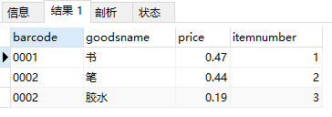
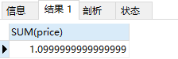

# MySQL 必知必会

安装数据库

```bash
docker run -d -p 3306:3306 \d
    --net=host \
    -e MYSQL_ROOT_PASSWORD=123456 \
    -v /data/main-mysql:/var/lib/mysql \
    -v /etc/localtime:/etc/localtime \
    --name=main-mysql \
    mysql:8.0
```

```bash
docker run -d -p 3306:3306 --net=host -e MYSQL_ROOT_PASSWORD=123456 -v /data/main-mysql:/var/lib/mysql -v /etc/localtime:/etc/localtime --name=main-mysql mysql:8.0
```

## 01. 数据存储过程

完整数据存储过程四步：创建数据库 - 确认字段 - 创建数据表 - 插入数据。

从架构层次来看，MySQL 数据库系统从大到小依次是数据库服务器、数据库、数据表、数据表的行与列。

数据库是 MySQL 最大的存储单元，没有数据库，数据表就没有载体，也就无法存储数据。

### 创建数据库

#### 创建数据库

```mysql
CREATE DATABASE demo;
```

创建数据库无权限处理方法如下：

```bash
docker exec -it main-mysql /bin/bash

mysql -uroot -p123456
 
show grants;

grant all privileges on *.* to 'root'@'%' identified by 'your passsword' with grant option;

flush privileges;
```

#### 查看数据库

```mysql
SHOW DATABASES;
```

* "demo"：我们通过 SQL 语句创建的数据库，用来存储用户数据。
* ”information_schema“ ：系统自带数据库，主要保存 MySQL 数据库服务器的系统信息。
  * 比如如数据库名称、数据表名称、字段名称、存取权限、数据文件所在的文件夹和系统使用的文件夹，等等。
* ”performance_schema“ ：系统自带数据库，可以用来监控 MySQL 的各项性能指标。
* ”sys“ 数据库是 MySQL 系统自带的数据库，主要作用是以一种更容易被理解的方式展示 MySQL 数据库服务器的各类性能指标，帮助系统管理员和开发人员监控 MySQL 的技术性能。
* ”mysql“ ：系统自带数据库，用来保存 MySQL 数据库服务器运行时需要的系统信息。
  * 比如数据文件夹、当前使用的字符集、约束检查信息，等等。

如果你是 DBA 或者 MySQL 数据库程序员，想深入了解 MySQL 数据库，可以查看[官方文档](https://dev.mysql.com/doc/refman/8.0/en/system-schema.html)。

### 确认字段

MySQL 数据表由行与列组成，一行就是一条数据记录，每一条数据记录都被分成许多列，一列就是一个字段。

每个字段都需要定义数据类型，这个数据类型就做字段类型。

### 创建数据表

#### 创建数据表

```mysql
CREATE TABLE demo.test
(
	barcode text,
	goodsname text,
	price int
)
```

* 创建数据表，最好指明数据库。
* 不要在最后一个字段后面加逗号 ”,“

#### 查看表结构

```mysql
DESCRIBE demo.test;
```

<div></div>

* Field：表示字段名称
* Type：表示字段类型
* Null：表示字段是否允许空值（NULL）
  * 在 MySQL 中，空值不等于空字符串。一个空字符串的长度为 0，一个空值的长度是空。
  * 在 MySQL 中，空值也占用空间。
* Key：表示键
* Default：表示默认值
  * 我们创建的数据表字段都允许为空，默认值都是 NULL
* Extra：表示附加信息

#### 查看表

```mysql
USE demo;
SHOW TABLES;
```

#### 设置主键

一个 MySQL 数据表只能有一个主键，主键可以确保数据唯一性。

虽然 MySQL 允许创建没有主键的表，但是建议一定要给表定义主键，并且养成习惯。因为主键可以帮助你减少错误数据，并且可以提高查询速度。

MySQL 中的主键，是表中的一个字段或者几个字段的组合。它有 3 个特征：

* 必须唯一，不能重复；
* 不能为空；
* 必须可以唯一标识数据表中的记录。

我们的表中有三个字段 barcode、goodsname、price，那么哪个字段可以作为主键呢？

首先商品名称（goodsname）是不行的，原因是重名的商品会有很多。例如 ”笔“，大家都可以生产一种叫 ”笔“ 的商品，各种各样的，不同规格的，不同材料的。商品名称和数据记录之间并不能形成一一对应的关系，所以商品名称不能作为主键。同样，价格（price）重复的可能性也很大，也不能做主键。

商品条码（barcode）也不能是主键。可能你会说，商品的条码都是由中国物品编码中心统一编制的，一种商品对应一个条码，一个条码对应一种商品。这不就是一一对应的关系？在实际操作中，存在例外的情况。比较典型的就是用户的门店里面有很多自己生产或者加工的商品。例如，馒头、面条等自产产品，散装的糕点、糖果等称重商品，等等。为了管理方便，门店往往会自己给它们设置条码。这样，很容易产生重复、重用的现象。

这时，就需要我们自己添加一个不会重复的字段来做主键。

我们可以添加一个字段，字段类型是整数，可以取名为商品编码（itemnumber）。当我们每次增加一条新数据库的时候，可以让这个字段值自增，这样就永远都不会重复了。

我们可以通过一条 SQL 语句，修改表结构，增加一个主键字段：

```mysql
ALTER TABLE demo.test
ADD COLUMN itemnumber int PRIMARY KEY AUTO_INCREMENT;
```

* alter table：表示修改表；
* add column：表示增加一列；
* primary key：表示这一列是主键；
* auto_increment：表示增加一条记录，这个值会自动增加。

### 插入数据

```mysql
INSERT INTO demo.test (barcode,goodsname,price) VALUES ('001', '本', 3);
```

insert into 表示向 demo.test 中插入数据，后面是要插入数据的字段名，values 表示对应的值。

注意点：

* 插入数据的字段名可以不写，建议每次都写。这样做的好处是可读性好，不易出错且容易修改。
* 由于字段 itemnumber 定义了 auto_increment，所以我们插入一条记录的时候，不给它赋值，系统也会自动赋值，每次赋值自增 1。也可以在插入数据的时候给 itemnumber 赋值，但是必须保证与已有记录的 itemnumber 值不同，否则就会提示错误。

### 总结

我们在进行具体操作时，会用到 8 种 SQL 语句：

```mysql
-- 创建数据库
CREATE DATABASE demo;

-- 删除数据库
DROP DATABASE demo;

-- 创建数据表
CREATE TABLE demo.test
(
	barcode text,
  goodsname text,
  price int
)

-- 查看表结构
DESCRIBE demo.test;

-- 查看所有表
SHOW TABLES;

-- 添加主键
ALTER TABLE demo.test
ADD COLUMN itemnumber int PRIMARY KEY AUTO_INCREMENT;

-- 向表中添加数据
INSERT INTO demo.test (barcode,goodsname,price) VALUES ('0001', '本', 3)
```

最后，我们再来了解一下 MySQL 种 SQL 语句的书写规范。

MySQL 以分号来识别一条 SQL 语句结束，所以，你写的每一条 SQL 语句的最后，都必须有一个分号，否则，MySQL 会认为这条语句没有完成，提示语法错误。

所以，建议在写 SQL 语句时遵循统一的样式，以增加可读性，减少错误。可以点击这个[链接](https://www.sqlstyle.guide/zh/)深入学习相关规范。

## 02. 数据类型

MySQL 种有很多字段类型，比如整数、文本、浮点数，等等。如果类型定义合理，就能节省存储空间，提升数据查询和处理的速度。相反，如果类型定义不合理，就有可能导致数据超出取值范围，引发系统错误，甚至可能出现计算错误的情况，进而影响整个系统。

### 整数类型

整数类型一共有 5 种，包括 TINYINT、SMALLINT、MEDIUMINT、INT（INTEGER）和 BIGINT，它们的区别如下：


在评估使用哪种整数类型的时候，需要考虑存储空间和可靠性的平衡问题：

* 用占字节数少的整数类型可以节省存储空间；
* 为了节省存储空间，使用的整数类型取值范围太小，一旦遇到超出取值范围的情况，就可能引发系统错误，影响可靠性。

举个例子，在我们的项目中商品编号使用的数据类型是 INT。

之所以不采用占用字节更少的 SMALLINT 类型整数，是因为在客户门店中流通的商品种类较多，而且，每天都会有旧商品下架，新商品上架。经过不断迭代，日积月累，如果使用 SMALLINT 类型，虽然占用字节数比 INT 类型的整数少，但是却不能保证数据不会超出范围 65535。当我们使用 INT，就能确保有足够大的取值范围，不用担心数据超出范围影响可靠性的问题。

在实际工作中，系统故障产生的成本远远超过增加几个字段存储空间所产生的成本。因此，建议首先确保数据不会超出取值范围，在这个前提下，再去考虑如何节省存储空间。

### 浮点数类型和定点数类型

浮点数和定点数类型的特点是可以处理小数，浮点数和定点数的使用场景，比整数大很多。

MySQL 支持的浮点类型：FLOAT、DOUBLE、REAL。

* FLOAT：表示单精度浮点数；
* DOUBLE：表示双精度浮点数；
* REAL 默认是 DOUBLE。如果把 SQL 模式设定为启用 “REAL_AS_FLOAT”，那么，MYSQL 就认为 REAL 是 FLOAT。启用 “REAL_AS_FLOAT”，可以用以下 SQL 语句实现。

```mysql
SET sql_mode = "REAL_AS_FLOAT";
```

FLOAT 占用字节数少，取值范围小；DOUBLE 占用字节数多，取值范围大。


MySQL 按照 ”符号（S）、尾数（M）、阶码（E）“ 的格式存储浮点数。因此，无论有没有符号，MySQL 的浮点数都会存储符号的部分。所谓的无符号取值范围，其实就是有符号数值范围大于等于零的部分。

浮点数类型有个缺陷，就是不够精确。因此，在一些精确度要求比较高的项目中，千万不要使用浮点数，不然会导致结果错误，甚至造成不可挽回的损失。

我们可以借助一个实际的例子演示下。我们先创建一个表，如下所示：

```mysql
CREATE TABLE demo.goodsmater
(
	barcode TEXT,
	goodsname TEXT,
	price DOUBLE,
	itemnumber INT PRIMARY KEY AUTO_INCREMENT
);
```

可以看到我们创建的表字段 ”price“ 是浮点数类型。然后我们再用下面的 SQL 语句给这个表插入几条数据：

```mysql
-- 第一条数据
INSERT INTO demo.goodsmater
(
	barcode,
	goodsname,
	price
)
VALUES
(
	'0001',
	'书',
	0.47
);
-- 第二条数据
INSERT INTO demo.goodsmater
(
	barcode,
	goodsname,
	price
)
VALUES
(
	'0002',
	'笔',
	0.44
);
-- 第三条数据
INSERT INTO demo.goodsmater
(
	barcode,
	goodsname,
	price
)
VALUES
(
	'0002',
	'胶水',
	0.19
)
```

接着，运行查询语句查看表中的情况：

```mysql
SELECT * FROM demo.goodsmater;
```

<div></div>

然后我们使用下面的 SQL 语句，将这三个价格加在一起：

```mysql
SELECT SUM(price) from demo.goodsmater;
```

<div></div>

查询结果是 1.0999999999999999。虽然误差很小，但确实有误差。
如果你把数据类型改成 FLOAT 再进行求和运算，你会发现误差更大，结果是 1.0999999940395355。

虽然 1.10 和 1.0999999999999999 差不多，但是当我们需要以数值比对为条件进行查询，一旦出现误差，就查不到想要的结果。

那么为什么会存在这样的误差？问题还是出在 MySQL 对浮点类型数据的存储方式上。

MySQL 使用 4 个字节存储 FLOAT 类型数据，用 8 个字节存储 DOUBLE 类型数据。无论哪种，都是采用二进制的方式来进行存储。比如 9.625，用二进制表示就是 1001.101，或者 1.001101 * 2^3。如果尾数不是 0 或 5，我们就无法使用一个二进制来精确表达，所以相加时只能再取值允许的范围内进行近似（四舍五入）。

那么，MySQL 有没有准确的数据类型呢？当然有，那就是定点数类型：DECIMAL。DECIMAL 的存储方式决定它一定是准确的。

浮点数类型是把十进制转换成二进制数存储，DECIMAL 则不同，它是把十进制数的整数部分和小数部分拆开，分别转换成十六进制数，进行存储。这样，所有的数值都可以精准表达，不会存在因无法表达而损失精度的问题。

MySQL 用 DECIMAL（M,D）的方式表示高精度小数。其中，M 表示整数部分加小数部分，一共有多少位，M<=65。D 表示小数部分位数，D<M。

我们可以用刚才的表 demo.goodsmaster 验证一下。

首先我们运行下面的语句，将字段 “price” 的数据类型修改为 DECIMAL(5, 2)。

```mysql
ALTER TABLE demo.goodsmater MODIFY COLUMN price DECIMAL(5,2);
```

然后，我们再一次运行求和语句：

```mysql
SELECT SUM(price) from demo.goodsmater;
```

这次，我们就可以得到完美结果：1.10。

由于 DECIMAL 数据类型的准确性，在我们的项目中，除极少数（例如商品编号）用到整数类型外，其他数值都可以使用 DECIMAL。原因就是项目所处的零售行业，要求精准，一分钱也不能差。

当然，在一些精度要求不高的场景下，比起占用同样的字节长度的定点数，浮点数表达的数值范围可以更大一些。

简单小结下浮点数和定点数的特点：

* 浮点类型取值范围大，但是不精确，适用于需要取值范围大，又可以容忍微小误差的科学计算场景（比如计算化学、分子建模、流体动力学等）；
* 定点数类型取值范围相对小，但是精确，没有误差，适用于对精度要求极高的场景（比如涉及金额计算的场景）。

### 文本类型

在实际的项目中，我们还经常会遇到字符串数据。比如，刚才我们创建的表 demo.goodsmaster 中，有两个字段 “barcode”、“goodsname" 。这两个字段的数据类型，我们都选择了 TEXT 类型。

TEXT 类型是 MySQL 支持的文本类型的一种。此外，MySQL 还支持 CHAR、VARCHAR、ENUM 和 SET 等文本类型。

* CHAR(M)：固定长度字符串。CHAR(M) 类型必须预先定义字符串长度。如果太短，数据可能会超出范围；如果太长，会浪费存储空间。
* VARCHAR(M)：可变长度字符串。VARCHAR(M) 也需要预先定义字符串长度。与 CHAR(M) 不同的是，VARCHAR(M) 存储字符串只要不超过这个最大长度，是按照实际字符串长度存储的。
* TEXT：字符串。系统自动按照实际长度存储，不需要预先定义长度。
* ENUM：枚举类型。取值必须是预先设定的一组字符串值范围之内的一个，必须知道字符串所有可能的取值。
* SET：字符串对象。取值必须是在预先设定的字符串值范围之内的 0 个或多个，也必须知道字符所有可能的取值。

对于 ENUM 类型和 SET 类型来说，你必须知道所有可能的取值，所以只能用在某些特定场合，比如某个参数设定的取值范围只有几个固定值的场景。

因为不需要预先知道字符串长度，系统会按照实际数据长度进行存储，所以 TEXT 类型最为灵活方便，下面我们重点学习一下它。

TEXT 类型也有  4 种，它们的区别就是最大长度不同：

> 假设字符是 ASCII 码，一个字符占用一个字节。

* TINYTEXT：255 字符；
* TEXT: 65535 字符；
* MEDIUMTEXT：16777215 字符；
* LONGTEXT：4294967295 字符（相当于 4 GB）。

不过，需要注意的是，TEXT 也有一个问题：由于实际存储长度不确定，MYSQL 不允许 TEXT 类型的字段做主键。遇到这种情况，只能采用 CHAR(M)，或者 VARCHAR(M)。

所以，建议在你的项目中，只要不是主键字段，就可以按照数据可能的最大长度，选择这几种 TEXT 类型中的一种，作为存储字符串的数据类型。

### 日期与时间类型

日期与时间是重要的信息，在我们的系统中，几乎所有的数据表都用得到。原因是客户需要知道数据的时间标签，从而进行数据查询、统计和处理。

使用最多的日期时间类型，就是 DATETIME。虽然 MySQL 支持 YEAR（年）、TIME（时间）、DATE（日期） 以及 TIMESTAMP 类型。但在实际项目中，更推荐使用 DATETIME 类型。因为这个数据类型包括完整的日期和时间信息，使用起来比较方便。

下面列出了 MySQL 支持的其他日期类型的一些参数：


可以看到，不同数据类型表示的时间内容不同、取值范围不同，而且占用的字节数也不一样，我们要根据实际需要灵活选取。

为了确保数据的完整性和系统稳定性，优先考虑使用 DATETIME 类型。虽然 DATETIME 类型占用的存储空间最多，但是它表达的时间最为完整，取值范围也最大。

另外，你可以会有疑问，为什么时间类型的取值范围不是 -23.59.59~23.59.59？原因是 MySQL 设计的 TIME 类型，不仅可以表示一天之内的时间，而且还可以表示一个时间间隔，这个时间间隔可以超过 24 小时。

### 总结

今天我们学习了几种常用的字段数据类型，包括整数类型、浮点数类型、定点数类型、文本类型以及日期时间类型。

另外，我们还学习了几个新的 SQL 语句。

```mysql
-- 修改字段类型语句
ALTER TABLE demo.goodsmater MODIFY COLUMN price DOUBLE;
-- 计算字段合计语句
SELECT SUM(price) FROM demo.goodsmater;
```

最后，再分享一个小技巧。在定义数据类型时：

* 如果确定是整数，用 INT；
* 如果是小数，用定点数类型 DECIMAL；
* 如果是字符串且非主键，就用 TEXT；
* 如果是日期与时间，就用 DATETIME。

这样做的好处是，可以确保你的系统不会因为数据类型定义出错。不过凡事都有两面性，可靠性好，并不意味高效。

比如，TEXT 虽然使用方便，但是效率不如 CHAR(M) 和 VARCHAR(M)。如果你有进一步优化需求，可以查看这个[文档](https://dev.mysql.com/doc/refman/8.0/en/data-types.html)。

## 03. 表操作

