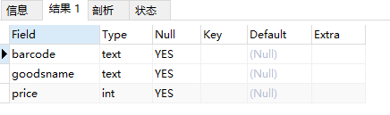

# MySQL 必知必会

安装数据库

```bash
docker run -d -p 3306:3306 \d
    --net=host \
    -e MYSQL_ROOT_PASSWORD=123456 \
    -v /data/main-mysql:/var/lib/mysql \
    -v /etc/localtime:/etc/localtime \
    --name=main-mysql \
    mysql:8.0
```

```bash
docker run -d -p 3306:3306 --net=host -e MYSQL_ROOT_PASSWORD=123456 -v /data/main-mysql:/var/lib/mysql -v /etc/localtime:/etc/localtime --name=main-mysql mysql:8.0
```

## 01. 数据存储过程

完整数据存储过程四步：创建数据库 - 确认字段 - 创建数据表 - 插入数据。

从架构层次来看，MySQL 数据库系统从大到小依次是数据库服务器、数据库、数据表、数据表的行与列。

数据库是 MySQL 最大的存储单元，没有数据库，数据表就没有载体，也就无法存储数据。

### 创建数据库

#### 创建数据库

```mysql
CREATE DATABASE demo;
```

创建数据库无权限处理方法如下：

```bash
docker exec -it main-mysql /bin/bash

mysql -uroot -p123456
 
show grants;

grant all privileges on *.* to 'root'@'%' identified by 'your passsword' with grant option;

flush privileges;
```

#### 查看数据库

```mysql
SHOW DATABASES;
```

* "demo"：我们通过 SQL 语句创建的数据库，用来存储用户数据。
* ”information_schema“ ：系统自带数据库，主要保存 MySQL 数据库服务器的系统信息。
  * 比如如数据库名称、数据表名称、字段名称、存取权限、数据文件所在的文件夹和系统使用的文件夹，等等。
* ”performance_schema“ ：系统自带数据库，可以用来监控 MySQL 的各项性能指标。
* ”sys“ 数据库是 MySQL 系统自带的数据库，主要作用是以一种更容易被理解的方式展示 MySQL 数据库服务器的各类性能指标，帮助系统管理员和开发人员监控 MySQL 的技术性能。
* ”mysql“ ：系统自带数据库，用来保存 MySQL 数据库服务器运行时需要的系统信息。
  * 比如数据文件夹、当前使用的字符集、约束检查信息，等等。

如果你是 DBA 或者 MySQL 数据库程序员，想深入了解 MySQL 数据库，可以查看[官方文档](https://dev.mysql.com/doc/refman/8.0/en/system-schema.html)。

### 确认字段

MySQL 数据表由行与列组成，一行就是一条数据记录，每一条数据记录都被分成许多列，一列就是一个字段。

每个字段都需要定义数据类型，这个数据类型就做字段类型。

### 创建数据表

#### 创建数据表

```mysql
CREATE TABLE demo.test
(
	barcode text,
	goodsname text,
	price int
)
```

* 创建数据表，最好指明数据库。
* 不要在最后一个字段后面加逗号 ”,“

#### 查看表结构

```mysql
DESCRIBE demo.test;
```

<div></div>

* Field：表示字段名称
* Type：表示字段类型
* Null：表示字段是否允许空值（NULL）
  * 在 MySQL 中，空值不等于空字符串。一个空字符串的长度为 0，一个空值的长度是空。
  * 在 MySQL 中，空值也占用空间。
* Key：表示键
* Default：表示默认值
  * 我们创建的数据表字段都允许为空，默认值都是 NULL
* Extra：表示附加信息

#### 查看表

```mysql
USE demo;
SHOW TABLES;
```

#### 设置主键

一个 MySQL 数据表只能有一个主键，主键可以确保数据唯一性。

虽然 MySQL 允许创建没有主键的表，但是建议一定要给表定义主键，并且养成习惯。因为主键可以帮助你减少错误数据，并且可以提高查询速度。

MySQL 中的主键，是表中的一个字段或者几个字段的组合。它有 3 个特征：

* 必须唯一，不能重复；
* 不能为空；
* 必须可以唯一标识数据表中的记录。

我们的表中有三个字段 barcode、goodsname、price，那么哪个字段可以作为主键呢？

首先商品名称（goodsname）是不行的，原因是重名的商品会有很多。例如 ”笔“，大家都可以生产一种叫 ”笔“ 的商品，各种各样的，不同规格的，不同材料的。商品名称和数据记录之间并不能形成一一对应的关系，所以商品名称不能作为主键。同样，价格（price）重复的可能性也很大，也不能做主键。

商品条码（barcode）也不能是主键。可能你会说，商品的条码都是由中国物品编码中心统一编制的，一种商品对应一个条码，一个条码对应一种商品。这不就是一一对应的关系？在实际操作中，存在例外的情况。比较典型的就是用户的门店里面有很多自己生产或者加工的商品。例如，馒头、面条等自产产品，散装的糕点、糖果等称重商品，等等。为了管理方便，门店往往会自己给它们设置条码。这样，很容易产生重复、重用的现象。

这时，就需要我们自己添加一个不会重复的字段来做主键。

我们可以添加一个字段，字段类型是整数，可以取名为商品编码（itemnumber）。当我们每次增加一条新数据库的时候，可以让这个字段值自增，这样就永远都不会重复了。

我们可以通过一条 SQL 语句，修改表结构，增加一个主键字段：

```mysql
ALTER TABLE demo.test
ADD COLUMN itemnumber int PRIMARY KEY AUTO_INCREMENT;
```

* alter table：表示修改表；
* add column：表示增加一列；
* primary key：表示这一列是主键；
* auto_increment：表示增加一条记录，这个值会自动增加。

### 插入数据

```mysql
INSERT INTO demo.test (barcode,goodsname,price) VALUES ('001', '本', 3);
```

insert into 表示向 demo.test 中插入数据，后面是要插入数据的字段名，values 表示对应的值。

注意点：

* 插入数据的字段名可以不写，建议每次都写。这样做的好处是可读性好，不易出错且容易修改。
* 由于字段 itemnumber 定义了 auto_increment，所以我们插入一条记录的时候，不给它赋值，系统也会自动赋值，每次赋值自增 1。也可以在插入数据的时候给 itemnumber 赋值，但是必须保证与已有记录的 itemnumber 值不同，否则就会提示错误。

### 总结

我们在进行具体操作时，会用到 8 种 SQL 语句：

```mysql
-- 创建数据库
CREATE DATABASE demo;

-- 删除数据库
DROP DATABASE demo;

-- 创建数据表
CREATE TABLE demo.test
(
	barcode text,
  goodsname text,
  price int
)

-- 查看表结构
DESCRIBE demo.test;

-- 查看所有表
SHOW TABLES;

-- 添加主键
ALTER TABLE demo.test
ADD COLUMN itemnumber int PRIMARY KEY AUTO_INCREMENT;

-- 向表中添加数据
INSERT INTO demo.test (barcode,goodsname,price) VALUES ('0001', '本', 3)
```

最后，我们再来了解一下 MySQL 种 SQL 语句的书写规范。

MySQL 以分号来识别一条 SQL 语句结束，所以，你写的每一条 SQL 语句的最后，都必须有一个分号，否则，MySQL 会认为这条语句没有完成，提示语法错误。

所以，建议在写 SQL 语句时遵循统一的样式，以增加可读性，减少错误。可以点击这个[链接](https://www.sqlstyle.guide/zh/)深入学习相关规范。

## 02. 字段

