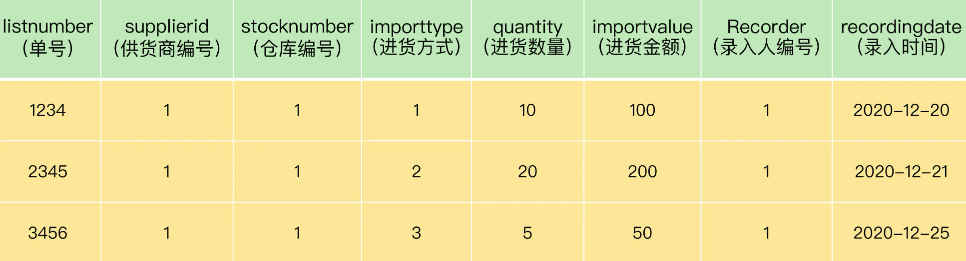
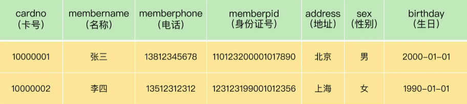
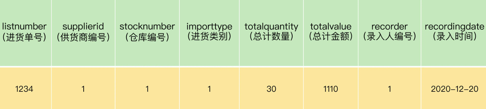
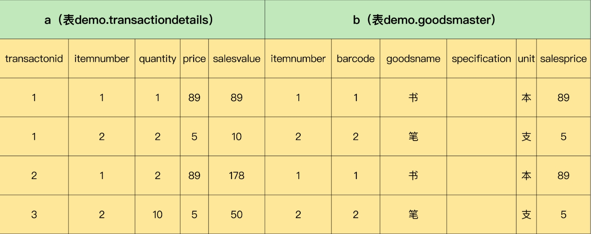
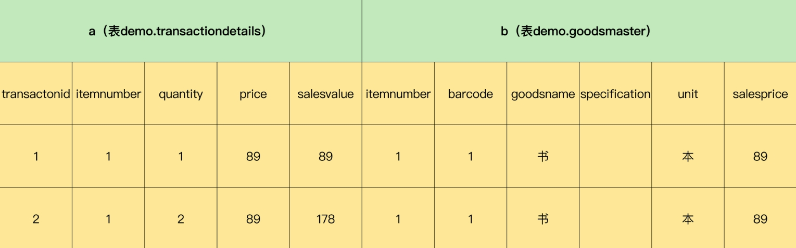
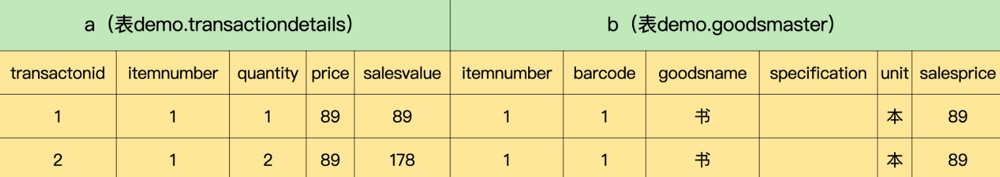

# MySQL 必知必会

## 一. 数据存储过程

MySQL 中，一个完整数据存储过程分为四步：创建数据库 - 确认字段 - 创建数据表 - 插入数据。

从系统架构层次来看，MySQL 数据库系统从大到小依次是数据库服务器、数据库、数据表、数据表的行与列。

数据库是 MySQL 最大的存储单元，没有数据库，数据表就没有载体，也就无法存储数据。

### 准备工作

安装数据库

```bash
docker run -d -p 3306:3306 \d
    --net=host \
    -e MYSQL_ROOT_PASSWORD=password \
    -v /data/main-mysql:/var/lib/mysql \
    -v /etc/localtime:/etc/localtime \
    --name=main-mysql \
    mysql:8.0
```

```bash
docker run -d -p 3306:3306 --net=host -e MYSQL_ROOT_PASSWORD=password -v /data/main-mysql:/var/lib/mysql -v /etc/localtime:/etc/localtime --name=main-mysql mysql:8.0
```

连接数据库

```
mysql –u用户名 [–h主机名或者IP地址,-P端口号] –p密码
```

```bash
docker exec -it main-mysql /bin/bash

mysql -uroot -ppassword
```

### 创建数据库

数据存储的第一步，就是创建数据库。

#### 创建数据库

```mysql
CREATE DATABASE demo;
```

创建数据库无权限处理方法如下：

```bash
show grants;

grant all privileges on *.* to 'root'@'%' identified by 'your passsword' with grant option;

flush privileges;
```

#### 查看数据库

```mysql
SHOW DATABASES;
```

* "demo"：我们通过 SQL 语句创建的数据库，用来存储用户数据。
* ”information_schema“ ：系统自带数据库，主要保存 MySQL 数据库服务器的系统信息。
  * 比如如数据库名称、数据表名称、字段名称、存取权限、数据文件所在的文件夹和系统使用的文件夹，等等。
* ”performance_schema“ ：系统自带数据库，可以用来监控 MySQL 的各项性能指标。
* ”sys“ 数据库是 MySQL 系统自带的数据库，主要作用是以一种更容易被理解的方式展示 MySQL 数据库服务器的各类性能指标，帮助系统管理员和开发人员监控 MySQL 的技术性能。
* ”mysql“ ：系统自带数据库，用来保存 MySQL 数据库服务器运行时需要的系统信息。
  * 比如数据文件夹、当前使用的字符集、约束检查信息，等等。

如果你是 DBA 或者 MySQL 数据库程序员，想深入了解 MySQL 数据库，可以查看[官方文档](https://dev.mysql.com/doc/refman/8.0/en/system-schema.html)。

### 确认字段

数据存储流程的第二步是确认表的字段。

MySQL 数据表由行与列组成，一行就是一条数据记录，每一条数据记录都被分成许多列，一列就叫一个字段。

每个字段都需要定义数据类型，这个数据类型叫做字段类型。

### 创建数据表

数据存储流程的第三步，是创建数据表。

#### 创建数据表

```mysql
CREATE TABLE
    demo.test (
        barcode text,
        goodsname text,
        price int
    );
```

* 创建数据表，最好指明数据库。
* 最后一个字段后面不需要加逗号 ”,“

#### 查看表结构

```mysql
DESCRIBE demo.test;
```

```mysql
mysql> DESCRIBE demo.test;
+-----------+------+------+-----+---------+-------+
| Field     | Type | Null | Key | Default | Extra |
+-----------+------+------+-----+---------+-------+
| barcode   | text | YES  |     | NULL    |       |
| goodsname | text | YES  |     | NULL    |       |
| price     | int  | YES  |     | NULL    |       |
+-----------+------+------+-----+---------+-------+
3 rows in set (0.00 sec)
```

* Field：表示字段名称
* Type：表示字段类型
* Null：表示字段是否允许空值（NULL）
  * 在 MySQL 中，空值不等于空字符串。一个空字符串的长度为 0，一个空值的长度是空。
  * 在 MySQL 中，空值也占用空间。
* Key：表示键
* Default：表示默认值
  * 我们创建的数据表字段都允许为空，默认值都是 NULL
* Extra：表示附加信息

#### 查看表

```mysql
USE demo;
SHOW TABLES;
```

```mysql
mysql> show tables;
+----------------+
| Tables_in_demo |
+----------------+
| test           |
+----------------+
1 row in set (0.00 sec)
```

#### 设置主键

一个 MySQL 数据表只能有一个主键，主键可以确保数据唯一性。

虽然 MySQL 允许创建没有主键的表，但是建议一定要给表定义主键，并且养成习惯。因为主键可以帮助你减少错误数据，并且可以提高查询速度。

MySQL 中的主键，是表中的一个字段或者几个字段的组合。它有 3 个特征：

* 必须唯一，不能重复；
* 不能为空；
* 必须可以唯一标识数据表中的记录。

我们的表中有三个字段 barcode、goodsname、price，那么哪个字段可以作为主键呢？

首先商品名称（goodsname）是不行的，原因是重名的商品会有很多。例如 ”笔“，大家都可以生产一种叫 ”笔“ 的商品，各种各样的，不同规格的，不同材料的。商品名称和数据记录之间并不能形成一一对应的关系，所以商品名称不能作为主键。同样，价格（price）重复的可能性也很大，也不能做主键。

商品条码（barcode）也不能是主键。可能你会说，商品的条码都是由中国物品编码中心统一编制的，一种商品对应一个条码，一个条码对应一种商品。这不就是一一对应的关系？在实际操作中，存在例外的情况。比较典型的就是用户的门店里面有很多自己生产或者加工的商品。例如，馒头、面条等自产产品，散装的糕点、糖果等称重商品，等等。为了管理方便，门店往往会自己给它们设置条码。这样，很容易产生重复、重用的现象。

这时，就需要我们自己添加一个不会重复的字段来做主键。

我们可以添加一个字段，字段类型是整数，可以取名为商品编码（itemnumber）。当我们每次增加一条新数据库的时候，可以让这个字段值自增，这样就永远都不会重复了。

我们可以通过一条 SQL 语句，修改表结构，增加一个主键字段：

```mysql
ALTER TABLE demo.test
ADD
    COLUMN itemnumber int PRIMARY KEY AUTO_INCREMENT;
```

```mysql
mysql> ALTER TABLE demo.test
    -> ADD
    ->     COLUMN itemnumber int PRIMARY KEY AUTO_INCREMENT;
Query OK, 0 rows affected (0.11 sec)
Records: 0  Duplicates: 0  Warnings: 0
```

* alter table：表示修改表；
* add column：表示增加一列；
* primary key：表示这一列是主键；
* auto_increment：表示增加一条记录，这个值会自动增加。

```mysql
mysql> DESCRIBE demo.test;
+------------+------+------+-----+---------+----------------+
| Field      | Type | Null | Key | Default | Extra          |
+------------+------+------+-----+---------+----------------+
| barcode    | text | YES  |     | NULL    |                |
| goodsname  | text | YES  |     | NULL    |                |
| price      | int  | YES  |     | NULL    |                |
| itemnumber | int  | NO   | PRI | NULL    | auto_increment |
+------------+------+------+-----+---------+----------------+
4 rows in set (0.00 sec)
```

### 插入数据

数据存储流程的第四步，也是最后一步，是把数据插入到表当中去。

```mysql
INSERT INTO
    demo.test (barcode, goodsname, price)
VALUES ('001', '本', 3);
```

```
mysql> INSERT INTO
    ->     demo.test (barcode, goodsname, price)
    -> VALUES ('001', '', 3);
Query OK, 1 row affected (0.01 sec)
```

insert into 表示向 `demo.test` 中插入数据，后面是要插入数据的字段名，values 表示对应的值。

注意点：

* 插入数据的字段名可以不写，建议每次都写。这样做的好处是可读性好，不易出错且容易修改。
* 由于字段 itemnumber 定义了 auto_increment，所以我们插入一条记录的时候，不给它赋值，系统也会自动赋值，每次赋值自增 1。也可以在插入数据的时候给 itemnumber 赋值，但是必须保证与已有记录的 itemnumber 值不同，否则就会提示错误。

### 总结

我们在进行具体操作时，会用到 8 种 SQL 语句：

```mysql
-- 创建数据库
CREATE DATABASE demo;
-- 删除数据库
DROP DATABASE demo;
-- 创建数据表
CREATE TABLE
    demo.test (
        barcode text,
        goodsname text,
        price int
    );
-- 查看表结构
DESCRIBE demo.test;
-- 查看所有表
SHOW TABLES;
-- 添加主键
ALTER TABLE demo.test
ADD
    COLUMN itemnumber int PRIMARY KEY AUTO_INCREMENT;
-- 向表中添加数据
INSERT INTO
    demo.test (barcode, goodsname, price)
VALUES ('001', '本', 3);
```

最后，我们再来了解一下 MySQL 种 SQL 语句的书写规范。

MySQL 以分号来识别一条 SQL 语句结束，所以，你写的每一条 SQL 语句的最后，都必须有一个分号，否则，MySQL 会认为这条语句没有完成，提示语法错误。

所以，建议在写 SQL 语句时遵循统一的样式，以增加可读性，减少错误。可以点击这个[链接](https://www.sqlstyle.guide/zh/)深入学习相关规范。

## 二. 字段类型

MySQL 种有很多字段类型，比如整数、文本、浮点数，等等。如果类型定义合理，就能节省存储空间，提升数据查询和处理的速度。相反，如果类型定义不合理，就有可能导致数据超出取值范围，引发系统错误，甚至可能出现计算错误的情况，进而影响整个系统。

### 整数类型

整数类型一共有 5 种，包括 TINYINT、SMALLINT、MEDIUMINT、INT（INTEGER）和 BIGINT，它们的区别如下：


在评估使用哪种整数类型的时候，需要考虑存储空间和可靠性的平衡问题：

* 用占字节数少的整数类型可以节省存储空间；
* 为了节省存储空间，使用的整数类型取值范围太小，一旦遇到超出取值范围的情况，就可能引发系统错误，影响可靠性。

举个例子，在我们的项目中商品编号使用的数据类型是 INT。

之所以不采用占用字节更少的 SMALLINT 类型整数，是因为在客户门店中流通的商品种类较多，而且，每天都会有旧商品下架，新商品上架。经过不断迭代，日积月累，如果使用 SMALLINT 类型，虽然占用字节数比 INT 类型的整数少，但是却不能保证数据不会超出范围 65535。当我们使用 INT，就能确保有足够大的取值范围，不用担心数据超出范围影响可靠性的问题。

在实际工作中，系统故障产生的成本远远超过增加几个字段存储空间所产生的成本。因此，建议首先确保数据不会超出取值范围，在这个前提下，再去考虑如何节省存储空间。

### 浮点数类型和定点数类型

浮点数和定点数类型的特点是可以处理小数，浮点数和定点数的使用场景，比整数大很多。

MySQL 支持的浮点类型：FLOAT、DOUBLE、REAL。

* FLOAT：表示单精度浮点数；
* DOUBLE：表示双精度浮点数；
* REAL 默认是 DOUBLE。如果把 SQL 模式设定为启用 “REAL_AS_FLOAT”，那么，MYSQL 就认为 REAL 是 FLOAT。启用 “REAL_AS_FLOAT”，可以用以下 SQL 语句实现。

```mysql
SET sql_mode = "REAL_AS_FLOAT";
```

FLOAT 占用字节数少，取值范围小；DOUBLE 占用字节数多，取值范围大。


MySQL 按照 ”符号（S）、尾数（M）、阶码（E）“ 的格式存储浮点数。因此，无论有没有符号，MySQL 的浮点数都会存储符号的部分。所谓的无符号取值范围，其实就是有符号数值范围大于等于零的部分。

浮点数类型有个缺陷，就是不够精确。因此，在一些精确度要求比较高的项目中，千万不要使用浮点数，不然会导致结果错误，甚至造成不可挽回的损失。

我们可以借助一个实际的例子演示下。我们先创建一个表，如下所示：

```mysql
CREATE TABLE
    demo.goodsmaster (
        barcode text,
        goodsname text,
        price double,
        itemnumber int PRIMARY KEY AUTO_INCREMENT
    );
```

可以看到我们创建的表字段 ”price“ 是浮点数类型。然后我们再用下面的 SQL 语句给这个表插入几条数据：

```mysql
INSERT INTO
    demo.goodsmaster (barcode, goodsname, price)
VALUES ('0001', '书', 0.47);

INSERT INTO
    demo.goodsmaster (barcode, goodsname, price)
VALUES ('0002', '笔', 0.44);

INSERT INTO
    demo.goodsmaster (barcode, goodsname, price)
VALUES ('0002', '胶水', 0.19);
```

接着，运行查询语句查看表中的情况：

```mysql
SELECT * FROM demo.goodsmaster;
```

```mysql
mysql> SELECT *
    -> FROM demo.goodsmaster;
+---------+-----------+-------+------------+
| barcode | goodsname | price | itemnumber |
+---------+-----------+-------+------------+
| 0001    | 书        |  0.47 |          1 |
| 0002    | 笔        |  0.44 |          2 |
| 0002    | 胶水      |  0.19 |          3 |
+---------+-----------+-------+------------+
3 rows in set (0.00 sec)
```

然后我们使用下面的 SQL 语句，将这三个价格加在一起：

```mysql
SELECT SUM(price) FROM demo.goodsmaster;
```

```mysql
mysql> SELECT SUM(price)
    -> FROM demo.goodsmaster;
+--------------------+
| SUM(price)         |
+--------------------+
| 1.0999999999999999 |
+--------------------+
```

查询结果是 1.0999999999999999。虽然误差很小，但确实有误差。
如果你把数据类型改成 FLOAT 再进行求和运算，你会发现误差更大，结果是 1.0999999940395355。

虽然 1.10 和 1.0999999999999999 差不多，但是当我们需要以数值比对为条件进行查询，一旦出现误差，就查不到想要的结果。

那么为什么会存在这样的误差？问题还是出在 MySQL 对浮点类型数据的存储方式上。

MySQL 使用 4 个字节存储 FLOAT 类型数据，用 8 个字节存储 DOUBLE 类型数据。无论哪种，都是采用二进制的方式来进行存储。比如 9.625，用二进制表示就是 1001.101，或者 1.001101 * 2^3。如果尾数不是 0 或 5，我们就无法使用一个二进制来精确表达，所以相加时只能再取值允许的范围内进行近似（四舍五入）。

现在你应该也可以明白，为什么数据类型是 DOUBLE 的时候，我们得到的结果误差更小一些，当数据类型是 FLOAT 的时候，误差会更大一些。原因就是，DOUBLE 有 8 位字节，精度更高。

那么，MySQL 有没有准确的数据类型呢？当然有，那就是定点数类型：DECIMAL。DECIMAL 的存储方式决定它一定是准确的。

浮点数类型是把十进制转换成二进制数存储，DECIMAL 则不同，它是把十进制数的整数部分和小数部分拆开，分别转换成十六进制数，进行存储。这样，所有的数值都可以精准表达，不会存在因无法表达而损失精度的问题。

MySQL 用 DECIMAL（M,D）的方式表示高精度小数。其中，M 表示整数部分加小数部分，一共有多少位，M<=65。D 表示小数部分位数，D<M。

我们可以用刚才的表 `demo.goodsmaster` 验证一下。

首先我们运行下面的语句，将字段 “price” 的数据类型修改为 DECIMAL(5, 2)。

```mysql
ALTER TABLE demo.goodsmaster MODIFY COLUMN price DECIMAL(5,2);
```

然后，我们再一次运行求和语句：

```mysql
SELECT SUM(price) from demo.goodsmater;
```

这次，我们就可以得到完美结果：1.10。

由于 DECIMAL 数据类型的准确性，在我们的项目中，除极少数（例如商品编号）用到整数类型外，其他数值都可以使用 DECIMAL。原因就是项目所处的零售行业，要求精准，一分钱也不能差。

当然，在一些精度要求不高的场景下，比起占用同样的字节长度的定点数，浮点数表达的数值范围可以更大一些。

简单小结下浮点数和定点数的特点：

* 浮点类型取值范围大，但是不精确，适用于需要取值范围大，又可以容忍微小误差的科学计算场景（比如计算化学、分子建模、流体动力学等）；
* 定点数类型取值范围相对小，但是精确，没有误差，适用于对精度要求极高的场景（比如涉及金额计算的场景）。

### 文本类型

在实际的项目中，我们还经常会遇到一种数据，那就是字符串数据。比如，表 `demo.goodsmaster 中`，有两个字段 “barcode”、“goodsname" 。这两个字段的数据类型，我们都选择了 TEXT 类型。

TEXT 类型是 MySQL 支持的文本类型的一种。此外，MySQL 还支持 CHAR、VARCHAR、ENUM 和 SET 等文本类型。

* CHAR(M)：固定长度字符串。CHAR(M) 类型必须预先定义字符串长度。如果太短，数据可能会超出范围；如果太长，会浪费存储空间。
* VARCHAR(M)：可变长度字符串。VARCHAR(M) 也需要预先定义字符串长度。与 CHAR(M) 不同的是，VARCHAR(M) 存储字符串只要不超过这个最大长度，是按照实际字符串长度存储的。
* TEXT：字符串。系统自动按照实际长度存储，不需要预先定义长度。
* ENUM：枚举类型。取值必须是预先设定的一组字符串值范围之内的一个，必须知道字符串所有可能的取值。
* SET：字符串对象。取值必须是在预先设定的字符串值范围之内的 0 个或多个，也必须知道字符所有可能的取值。

对于 ENUM 类型和 SET 类型来说，你必须知道所有可能的取值，所以只能用在某些特定场合，比如某个参数设定的取值范围只有几个固定值的场景。

因为不需要预先知道字符串长度，系统会按照实际数据长度进行存储，所以 TEXT 类型最为灵活方便，下面我们重点学习一下它。

TEXT 类型也有  4 种，它们的区别就是最大长度不同（假设字符是 ASCII 码，一个字符占用一个字节）。

* TINYTEXT：255 字符；
* TEXT: 65535 字符；
* MEDIUMTEXT：16777215 字符；
* LONGTEXT：4294967295 字符（相当于 4 GB）。

不过，需要注意的是，TEXT 也有一个问题：由于实际存储长度不确定，MYSQL 不允许 TEXT 类型的字段做主键。遇到这种情况，只能采用 CHAR(M)，或者 VARCHAR(M)。

所以，建议在你的项目中，只要不是主键字段，就可以按照数据可能的最大长度，选择这几种 TEXT 类型中的一种，作为存储字符串的数据类型。

### 日期与时间类型

日期与时间是重要的信息，在我们的系统中，几乎所有的数据表都用得到。原因是客户需要知道数据的时间标签，从而进行数据查询、统计和处理。

使用最多的日期时间类型，就是 DATETIME。虽然 MySQL 支持 YEAR（年）、TIME（时间）、DATE（日期） 以及 TIMESTAMP 类型。但在实际项目中，更推荐使用 DATETIME 类型。因为这个数据类型包括完整的日期和时间信息，使用起来比较方便。

下面列出了 MySQL 支持的其他日期类型的一些参数：


可以看到，不同数据类型表示的时间内容不同、取值范围不同，而且占用的字节数也不一样，我们要根据实际需要灵活选取。

为了确保数据的完整性和系统稳定性，优先考虑使用 DATETIME 类型。虽然 DATETIME 类型占用的存储空间最多，但是它表达的时间最为完整，取值范围也最大。

另外，你可以会有疑问，为什么时间类型的取值范围不是 -23.59.59~23.59.59？原因是 MySQL 设计的 TIME 类型，不仅可以表示一天之内的时间，而且还可以表示一个时间间隔，这个时间间隔可以超过 24 小时。

### 总结

今天我们学习了几种常用的字段数据类型，包括整数类型、浮点数类型、定点数类型、文本类型以及日期时间类型。

另外，我们还学习了几个新的 SQL 语句。

```mysql
-- 修改字段类型语句
ALTER TABLE demo.goodsmaster MODIFY COLUMN price DECIMAL(5,2);
-- 计算字段合计语句
SELECT SUM(price) FROM demo.goodsmaster;
```

最后，再分享一个小技巧。在定义数据类型时：

* 如果确定是整数，用 INT；
* 如果是小数，用定点数类型 DECIMAL；
* 如果是字符串且非主键，就用 TEXT；
* 如果是日期与时间，就用 DATETIME。

这样做的好处是，可以确保你的系统不会因为数据类型定义出错。不过凡事都有两面性，可靠性好，并不意味高效。

比如，TEXT 虽然使用方便，但是效率不如 CHAR(M) 和 VARCHAR(M)。如果你有进一步优化需求，可以查看这个[文档](https://dev.mysql.com/doc/refman/8.0/en/data-types.html)。

## 三. 创建、修改数据表

创建和修改数据表，是数据存储过程中的重要一环。我们不仅需要把表创建出来，还需要正确地限定条件，这样才能确保数据的一致性和完整性。同时，表中的数据会随着业务需求的变化而变化，添加和修改相应的字段也是常见的操作。

假设在我们的超市项目中，客户经常需要进货，这就需要在 MySQL 数据库里创建一个表，用来管理进货相关的数据。

假设这个表叫做进货单头表（importhead），如下图所示：



这里的 1、2、3 表示门店的 3 种进货方式，分别是配送中心配送、门店采买和供货直供。其中 1 是标准进货方式。因为超市是连锁经营，为了确保商品质量和品类一致，超过 9 成的门店都是通过配送中心进行配送的。因此，我们希望这个字段的默认值为 1。

现在，客户需要一个类似的表来存储进货数据，进货方式有 3 个可能的取值范围，需要设置默认值。那么，应该如何创建这个表？另外，创建好表之后，应该如何修改？

### 创建数据表

首先，我们需要知道 MySQL 创建表的语法结构：

```mysql
CREATE TABLE <表名>
(
	字段名1 数据类型 [字段级别约束] [默认值],
  字段名2 数据类型 [字段级别约束] [默认值],
  ...
  [表级别约束]
);
```

在 MySQL 创建表的语法结构层面，有一个词叫做 “约束”。“约束” 用于限定表中数据应该满足的条件。MySQL 会根据这些限定条件，对表的操作进行监控，阻止破坏约束条件的操作执行，并提示错误，从而保证表中数据的唯一性、合法性和完整性。

下面我们来创建刚刚提到的进货单表。创建代码如下：

```mysql
CREATE TABLE
    demo.importhead (
        listnumber INT,
        supplierid INT,
        stocknumber INT,
        -- 设置默认值 1
        importtype INT DEFAULT 1,
        quantity DECIMAL(10, 3),
        importvalue DECIMAL(10, 2),
        recorder INT,
        recordingdate DATETIME
    );

```

运行上述 SQL 语句，表 demo.importhead 就按照我们的要求被创建出来了。

现在我们尝试往刚刚创建的表中插入一条记录，验证字段 “importtype” 定义的默认值约束是否起了作用。

```mysql
INSERT INTO
    demo.importhead (
        listnumber,
        supplierid,
        stocknumber,
        -- 没有插入字段 importtype
        quantity,
        importvalue,
        recorder,
        recordingdate
    )
VALUES (
        1234,
        1,
        1,
        10,
3-10-09'
    );
```

插入完成后，我们可以运行以下 SQL 查询表内容：

```mysql
SELECT * from demo.importhead;
```

```mysql
mysql> select * from demo.importhead;
+------------+------------+-------------+------------+----------+-------------+----------+---------------------+
| listnumber | supplierid | stocknumber | importtype | quantity | importvalue | recorder | recordingdate       |
+------------+------------+-------------+------------+----------+-------------+----------+---------------------+
|       1234 |          1 |           1 |          1 |   10.000 |     100.00 |        1 | 2023-10-09 00:00:00 |
+------------+------------+-------------+------------+----------+-------------+----------+---------------------+
3 rows in set (0.00 sec)
```

你会发现，字段 importtype 的值已经是 1 了。

### 约束分类

刚才我们给字段设置默认值的做法是默认约束。设置默认约束后，插入数据的时候，如果不明确给字段赋值，那么系统会把设置的默认值自动赋值给字段。

除了**默认约束**，还有**主键约束**、**外键约束**、**非空约束**、**唯一性约束**和**自增约束**。

我们之前使用的主键，其实就是主键约束。其中外键约束涉及表与表之间的关联，以及确保表的数据一致性的问题，内容比较多，后面再具体解释。

下面，我们重点介绍一下非空约束、唯一性约束和自增约束。

#### 非空约束

非空约束表示字符值不能为空，如果创建表时，指明某个字段为空，那么添加数据的时候，这个字段必须有值，否则系统就会提示错误。

#### 唯一性约束

唯一性约束表示这个字段的值不能重复，否则系统会提示错误。跟主键约束相比，唯一性约束要更加弱一些。

在一个表中，我们可以指定多个字段满足唯一性约束，但是主键约束只能有一个，这是 MySQL 系统决定的。另外，满足主键约束的字段，自动满足非空约束，但是满足唯一性约束的字段，可以是空值。

例如，我们有一个商品信息表 goodsmaster。


为了防止条码重复，我们可以定义字段 “barcode” 满足唯一性约束。这样一来，条码就不能重复，但是允许为空。

同样道理，为了防止名称重复，我们也可以定义字段 “goodsname”  满足唯一性约束。

#### 自增约束

自增约束可以让 MySQL 自动给字段赋值，且保证不会重复，非常有用，但是不容易用好。

在商品信息表中，由于 barcode、goodsname 和 price 都不能确保唯一性，因此我们只能自己添加一个字段 itemnumber 作为主键，并且每次添加一条数据的时候，要给值增加 1。这时，我们就可以通过定义自增约束的方式，让系统自动帮我们赋值，从而满足唯一性，这样就可以做主键了。

这里有 2 个问题需要注意：

* 在数据表中，只有整型类型的字段（包括 TINYINT、SMALLINT、MEDIUMINT、INT 和 BIGINT），才可以定义自增约束。自增约束，没增加一条数据，值自动增加 1。
* 可以给自增约束的字段赋值，这个时候，MySQL 会重置自增约束字段的自增基数，下次添加数据的时候，自动以自增约束字段的最大值加 1 为新的字段值。

约束要根据业务需要定义在相应的字段上，这样才能保证数据是准确的，我们需要注意它的使用方法。

### 修改数据表

创建完表后，我们经常还需要修改表。

当我们创建新表的时候，会出现这样的情况：例如我们前面创建进货单表，是用来存储进货数据的。

但是，我们还要创建一个进货单历史表（importheadlist），用来存储验收过的进货数据。这个表的结构跟进货单表类似，只是多了两个字段，分别是验收人（confirmer）和验收时间（confirmdate）。针对这种情况，我们很容易就可以想到通过复制表结构，然后在这个基础上通过修改表结构，来创建新表。

首先，我们可以把原来的表结构复制一下：

```mysql
CREATE TABLE demo.importheadhist LIKE demo.importhead;
```

运行这个语句之后，就创建出一个和 demo.importhead 具有相同表结构的空表。

这个新创建的表，还不是我们需要的表，我们需要对这个表进行修改，通过添加字段和修改字段，来得到我们最终需要的表。

#### 添加字段

现在我们给这个新的表增加 2 个字段：confirmer 和 confirmdate。

```mysql
-- 添加字段 confirmer，类型为 INT
ALTER TABLE demo.importheadhist ADD confirmer INT;
-- 添加字段 confirmdate，类型为 DATETIME
ALTER TABLE demo.importheadhist ADD confirmdate DATETIME;
```

我们可以查看一下表结构：

```mysql
DESCRIBE demo.importheadhist;
```

```mysql
mysql> DESCRIBE demo.importheadhist;
+----------------+---------------+------+-----+---------+-------+
| Field          | Type          | Null | Key | Default | Extra |
+----------------+---------------+------+-----+---------+-------+
| listnumber     | int           | NO   |     | NULL    |       |
| supplierid     | int           | NO   |     | NULL    |       |
| stocknumber    | int           | NO   |     | NULL    |       |
| importtype     | int           | YES  |     | 1       |       |
| quantity       | decimal(10,3) | YES  |     | NULL    |       |
| importvalue    | decimal(10,2) | YES  |     | NULL    |       |
| recorder       | int           | YES  |     | NULL    |       |
| recordingdate  | datetime      | YES  |     | NULL    |       |
| confirmer      | int           | YES  |     | NULL    |       |
| confirmdate    | datetime      | YES  |     | NULL    |       |
+----------------+---------------+------+-----+---------+-------+
10 rows in set (0.02 sec)
```

通过增加 2 个字段，我们就得到了进货单历史表。

#### 修改字段

除了添加字段，我们可能还要修改字段，比如，把字段名称 ”quantity“ 改成 ”importquantity“，并且将字段类型改为 DOUBLE。

```mysql
ALTER TABLE
    demo.importheadhist CHANGE quantity importquantity DOUBLE;
```

运行 SQL 语句后，重新查看表结构，可以得到下面的结果：

```mysql
mysql> DESCRIBE demo.importheadhist;
+----------------+---------------+------+-----+---------+-------+
| Field          | Type          | Null | Key | Default | Extra |
+----------------+---------------+------+-----+---------+-------+
| listnumber     | int           | NO   |     | NULL    |       |
| supplierid     | int           | NO   |     | NULL    |       |
| stocknumber    | int           | NO   |     | NULL    |       |
| importtype     | int           | YES  |     | 1       |       |
| importquantity | double        | YES  |     | NULL    |       |
| importvalue    | decimal(10,2) | YES  |     | NULL    |       |
| recorder       | int           | YES  |     | NULL    |       |
| recordingdate  | datetime      | YES  |     | NULL    |       |
| confirmer      | int           | YES  |     | NULL    |       |
| confirmdate    | datetime      | YES  |     | NULL    |       |
+----------------+---------------+------+-----+---------+-------+
10 rows in set (0.02 sec)
```

可以看到，字段名称和字段类型全部都改过来了。

如果你不想改变字段名称，只想改变字段类型。例如，将字段 ”importquantity“ 类型改为 DECIMAL(10, 3)，可以这样写：

```mysql
ALTER TABLE demo.importheadhist MODIFY importquantity DECIMAL(10,3);
```

我们还可以通过 SQL 语句向表中添加一个字段，甚至可以指定添加字段在表中的位置。

比如在字段 supplierid 之后，添加一个字段 suppliername，数据类型是 TEXT。

```mysql
ALTER TABLE
    demo.importheadhist
ADD
    suppliername TEXT AFTER supplierid;
```

```mysql
mysql> DESCRIBE demo.importheadhist;
+----------------+---------------+------+-----+---------+-------+
| Field          | Type          | Null | Key | Default | Extra |
+----------------+---------------+------+-----+---------+-------+
| listnumber     | int           | NO   |     | NULL    |       |
| supplierid     | int           | NO   |     | NULL    |       |
| suppliername   | text          | YES  |     | NULL    |       |
| stocknumber    | int           | NO   |     | NULL    |       |
| importtype     | int           | YES  |     | 1       |       |
| importquantity | decimal(10,3) | YES  |     | NULL    |       |
| importvalue    | decimal(10,2) | YES  |     | NULL    |       |
| recorder       | int           | YES  |     | NULL    |       |
| recordingdate  | datetime      | YES  |     | NULL    |       |
| confirmer      | int           | YES  |     | NULL    |       |
| confirmdate    | datetime      | YES  |     | NULL    |       |
+----------------+---------------+------+-----+---------+-------+
11 rows in set (0.02 sec)
```

到这里，我们就完成了修改字段在表中位置的操作。

### 总结

本篇文章，我们学习了创建和修改数据表的具体方法。

创建表时，我们还提到了一个重要概念，就是约束，包括默认约束、非空约束、唯一性约束和自增约束等。

* 默认值约束：给字段设置一个默认值。
* 非空约束：声明字段不能为空值。
* 唯一性约束：声明字段不能重复。
* 自增约束：声明字段值能够自动加 1，且不会重复。

修改表时，我们可以通过已经存在的表创建新表，也可以通过添加字段、修改字段的方式来修改数据表。

最后，汇总一下常用的创建表的 SQL 语句。

```mysql
-- 创建表
CREATE TABLE 
(
	字段名 字段类型 PRIMARY KEY
);
CREATE TABLE 
(
	字段名 字段类型 NOT NULL
);
CREATE TABLE 
(
	字段名 字段类型 UNIQUE
);
CREATE TABLE 
(
	字段名 字段类型 DEFAULT 值
);
-- 自增条件，字段类型必须时是整型
CREATE TABLE 
(
	字段名 字段类型 AUTO_INCREMENT
);
-- 已经存在表基础上，创建新表，复制表结构
CREATE TABLE demo.importheadhist LIKE demo.importhead;
-- 修改表相关
ALTER TABLE 表名 CHANGE 旧字段名 新字段名 数据类型;
ALTER TABLE 表名 ADD COLUMN 字段名 字段类型 FIRST|AFTER 字段名;
ALTER TABLE 表名 MODIFY 字段名 字段类型 FIRST|AFTER 字段名;
```

对于初学者来说，掌握今天的内容就已经足够了。不过，MySQL 支持的数据表操作不只这些。

比如，你可以在表级别指定表的存储引擎：

```mysql
ALTER TABLE 表名 ENGINE=INNDB;
```

还可以通过指定关键字 AUTO_EXTENDSIZE，指定存储文件自增空间的大小，从而提高存储空间的利用率。

在 MySQL 8.0.12 之后的版本中，甚至还可以通过 INVISIBLE 关键字，使字段不可见，但可以正常使用。

如果想了解更多有关数据表的操作，可以看这两份资料：[MySQL 创建表文档](https://dev.mysql.com/doc/refman/8.0/en/create-table.html) 和 [MySQL 修改表文档](https://dev.mysql.com/doc/refman/8.0/en/alter-table.html)。

## 四. 增删改查

```mysql
SELECT * FROM demo.goodsmaster;

DESCRIBE demo.goodsmaster;

ALTER TABLE demo.goodsmaster MODIFY barcode TEXT NOT NULL;
ALTER TABLE demo.goodsmaster MODIFY goodsname TEXT NOT NULL;
ALTER TABLE demo.goodsmaster MODIFY price DECIMAL(10,2) NOT NULL;
ALTER TABLE demo.goodsmaster ADD COLUMN sepcification TEXT;
ALTER TABLE demo.goodsmaster ADD unit TEXT;
```

今天，我们来学习如何操作数据表里的数据。

在我们的超市项目中，我们已经给用户设计好一个数据表 `demo.goodsmaster`，定义好里面的字段，以及各种约束。

```mysql
mysql> DESCRIBE demo.goodsmaster;
+---------------+---------------+------+-----+---------+----------------+
| Field         | Type          | Null | Key | Default | Extra          |
+---------------+---------------+------+-----+---------+----------------+
| barcode       | text          | NO   |     | NULL    |                |
| goodsname     | text          | NO   |     | NULL    |                |
| price         | decimal(10,2) | NO   |     | NULL    |                |
| itemnumber    | int           | NO   | PRI | NULL    | auto_increment |
| sepcification | text          | YES  |     | NULL    |                |
| unit          | text          | YES  |     | NULL    |                |
+---------------+---------------+------+-----+---------+----------------+
6 rows in set (0.00 sec)
```

接下来，我们需要使用这个表来存储数据，也就是常说的 “增删改查”。

### 添加数据

首先我们先来看添加数据的语法结构：

```mysql
INSERT INTO 表名 [(字段名, [,字段名] ...)] VALUES (值的列表);
```

> 上面的方括号 "[]" 表示里面的内容可选。

添加数据分为两种情况：插入数据记录和插入查询结果。

#### 插入数据

MySQL 支持的数据插入操作十分灵活。你既可以通过给表里面所有的字段赋值，完整地插入一条数据记录，也可以在插入记录的时候，只给部分字段赋值。

当我们想插入一条数据记录，其中包含所有字段值，可以这样操作：

```mysql
INSERT INTO
    demo.goodsmaster (
        itemnumber,
        barcode,
        goodsname,
        sepcification,
        unit,
        price
    )
VALUES (4, '0003', '尺子', '三角型', '把', 5);
```

```mysql
mysql> SELECT * FROM demo.goodsmaster;
+---------+-----------+-------+------------+---------------+------+
| barcode | goodsname | price | itemnumber | sepcification | unit |
+---------+-----------+-------+------------+---------------+------+
| 0001    | 书       |  0.47 |          1 | NULL          | NULL |
| 0002    | 笔       |  0.44 |          2 | NULL          | NULL |
| 0002    | 胶水    |  0.19 |          3 | NULL          | NULL |
| 0003    | 尺子    |  5.00 |          4 | 三角型     | 把  |
+---------+-----------+-------+------------+---------------+------+
4 rows in set (0.00 sec)
```

如果想插入一条记录，只给部分字段赋值，可以这样操作：

```mysql
INSERT INTO
    demo.goodsmaster (barcode, goodsname, price)
VALUES ('0004', '测试', 10);
```

```mysql
mysql> SELECT * FROM demo.goodsmaster;
+---------+-----------+-------+------------+---------------+------+
| barcode | goodsname | price | itemnumber | sepcification | unit |
+---------+-----------+-------+------------+---------------+------+
| 0001    | 书       |  0.47 |          1 | NULL          | NULL |
| 0002    | 笔       |  0.44 |          2 | NULL          | NULL |
| 0002    | 胶水    |  0.19 |          3 | NULL          | NULL |
| 0003    | 尺子    |  5.00 |          4 | 三角型     | 把  |
| 0004    | 测试    | 10.00 |          5 | NULL          | NULL |
+---------+-----------+-------+------------+---------------+------+
5 rows in set (0.00 sec)
```

我们之所以可以在插入数据的时候，只给部分字段赋值，是因为我们对字段的定义方式。

```mysql
mysql> DESCRIBE demo.goodsmaster;
+---------------+---------------+------+-----+---------+----------------+
| Field         | Type          | Null | Key | Default | Extra          |
+---------------+---------------+------+-----+---------+----------------+
| barcode       | text          | NO   |     | NULL    |                |
| goodsname     | text          | NO   |     | NULL    |                |
| price         | decimal(10,2) | NO   |     | NULL    |                |
| itemnumber    | int           | NO   | PRI | NULL    | auto_increment |
| sepcification | text          | YES  |     | NULL    |                |
| unit          | text          | YES  |     | NULL    |                |
+---------------+---------------+------+-----+---------+----------------+
6 rows in set (0.00 sec)
```

可以看到，”specification“ 和 ”unit“ 都可以是空值，”itemnumber“ 定义了自增约束。

我们在插入一条数据记录的时候，必须要考虑字段约束的 3 种情况。

* 第一种情况是，如果字段允许为空，但我们没有给它赋值，那么 MySQL 会自动给它们赋予空值。
* 第二种情况是，如果字段是主键，不能为空，这时，MySQL 会按照我们添加的约束进行处理。
  * 比如字段 “itemnumber‘” 是主键，不能为空，但由于我们定义了自增约束，所以 MySQL 会自动在之前的最大值基础上加 1。
* 第三种情况是，如果有一个字段定义不能为空，又不是主键，当你插入一条数据记录的时候，就需要给这个记录赋值。
  * 如果我们的操作违反了字段约束限制，执行 SQL 时，就会提示系统错误。


部分字段插入数据是可以的，前提是，没有赋值的字段，MySQL 需要知道如何处理，比如可以为空、有默认值，或者是自增约束字段等。否则，MySQL 就会提示错误。

到这里，我们已经学会如何给 MySQL 数据表插入一条数据记录。但是，在实际工作中，一次只插入一条数据，并不能满足需求。

假设在我们的项目中有这样的场景：门店每天的销售流水有很多，日积月累，流水表会变得越来越大。如果一直让它这样增长，数据甚至达到数亿条，占据的存储空间也会达到几个 G。虽然 MySQL 可以处理这样比较大的数据表，但是每次操作的响应时间也会延长，这会导致系统的整体效率下降。

假设我们开发日结处理，需要当天算清所有账目。其中一个步骤就是，把当天流水表的数据全部转到历史流水表中。现在，我们就可以用上数据插入语句了：

* 从流水表取出一条数据；
* 将这条数据插入到历史流水表中。

然后不断重复这个步骤，直到把今天流水表中所有数据全部插入到历史流水表中。不过这种做法效率很低，其实还有更好的方法。就是将查询结果插入到数据表中。

#### 插入查询结果

MySQL 支持将查询结果插入到数据表中，我们可以指定字段，甚至是数值，插入到数据表中。语法结构如下：

```mysql
INSERT INTO 表名 (字段名)
SELECT 字段名或值
FROM 表名
WHERE 条件
```

在我们的超市信息系统的 MySQL 数据库中，历史流水表设计与流水表非常类似。不同的是，历史流水表增加了一些字段来标识历史流水的状态，比如日结时间字段，用来记录日结操作是什么时候进行的。用 INSERT 语句实现起来也很简单。

```mysql
INSERT INTO 历史流水表 (日结时间字段, 其他字段)
SELECT 获取当前时间函数, 其他字段
FROM 流水表
```

### 删除数据

数据删除的语法很简单，如下所示：

```mysql
DELETE FROM 表名
WHERE 条件
```

如果我们想删除表全部数据，可以通过下面的 SQL 语句实现：

```mysql
DELETE FROM demo.goodsmaster;
```
### 修改数据

```mysql
INSERT INTO
    demo.goodsmaster (
        itemnumber,
        barcode,
        goodsname,
        sepcification,
        unit,
        price
    )
VALUES (4, '0003', '尺子', '三角型', '把', 5);
```

先来看一下 MySQL 的数据修改语法：

```mysql
UPDATE 表名
SET 字段名=值
WHERE 条件
```

语法也很简单，需要注意的是，不能修改主键字段的值。因为主键是数据记录的唯一标识，如果修改主键值，就有可能破坏数据的完整性。

```mysql
mysql> SELECT * FROM demo.goodsmaster WHERE itemnumber = 4;
+---------+-----------+-------+------------+---------------+------+
| barcode | goodsname | price | itemnumber | sepcification | unit |
+---------+-----------+-------+------------+---------------+------+
| 0003    | 尺子    |  5.00 |          4 | 三角型     | 把  |
+---------+-----------+-------+------------+---------------+------+
1 row in set (0.00 sec)
```

我们可以查询到商品编号为 4 的数据记录。如果我们修改了主键值，就可能会改变刚才的查询结果。

```mysql
mysql> UPDATE demo.goodsmaster SET itemnumber = 3 WHERE itemnumber = 4;
Query OK, 1 row affected (0.01 sec)
Rows matched: 1  Changed: 1  Warnings: 0
```

```mysql
mysql> SELECT * FROM demo.goodsmaster WHERE itemnumber = 4;
Empty set (0.00 sec)
```

可以看到，查询结果为空，因为商品编号是 4 的记录已经不存在了。

如果你必须修改主键的值，那极有可能就是主键设置的不合理。

### 查询数据

我们先来看下查询语句的语法结构：

```mysql
SELECT *|字段列表
FROM 数据源
WHERE 条件
GROUP BY 字段
HAVING 条件
ORDER BY 字段
LIMIT 起始点,行数
```

在这些字段中，SELECT、WHERE、GROUP BY 和 HAVING 比较好理解，我们能只需要知道它们的含义就可以了。

* SELECT：查询关键字，表示我们要做一个查询。
  * `*` 是一个通配符，表示我们要查询表中所有字段。也可以把要查询的字段罗列出来，这样，查询结果就只会显示想要查询的字段内容。
* WHERE：表示查询条件。
  * 可以把要查询的数据所要满足的条件，放在 WHERE 关键字之后。
* GROUP BY：告诉 MySQL，查询结果要如何分组，通常搭配 MySQL 聚合函数使用。
* HAVING：用于筛选查询结果，与 WHERE 类似。

FROM、ORDER BY、LIMIT 相对来说比较复杂，需要注意的地方比较多，我们来具体解释一下。

#### FROM

FROM 关键字表示查询的数据源。我们只学习了单个数据表，可以把要查询的数据表名，直接写在 FROM 关键字之后。当我们学习关联表之后，你就会知道，在 FROM 关键字后面，还可以跟着更复杂的数据表联接。

需要注意的是，数据源不一定是表，也可以是一个查询结果。

```mysql
mysql> SELECT a.goodsname, a.price
    -> FROM (
    ->         SELECT *
    ->         FROM
    ->             demo.goodsmaster
    ->     ) AS a;
+-----------+-------+
| goodsname | price |
+-----------+-------+
| 尺子    |  5.00 |
+-----------+-------+
1 row in set (0.00 sec)
```

需要注意的是，框号中的部分叫做派生表（derived table），或者子查询（subquery），意思是我们可以把一个查询结果数据集当做一个虚拟的数据表来看待。

MySQL 规定，必须使用 AS 关键字给这个派生表起一个别名。在上面的语句中，派生表的名字就叫做 ”a“。

#### ORDER BY

ORDER BY 的作用，是告诉 MySQL，查询结果如何排序。**ASC** 表示升序，**DESC** 表示降序。

首先我们向 `demo.goodsmaster` 中插入两条数据。

```mysql
INSERT INTO
    demo.goodsmaster (barcode, goodsname, price)
VALUES('0003', '尺子1', 15);

INSERT INTO
    demo.goodsmaster (barcode, goodsname, price)
VALUES('0004', '测试1', 20);
```

如果我们不控制查询结果顺序，就会得到这样的结果：

```mysql
SELECT * FROM demo.goodsmater;
```

```mysql
mysql> SELECT * FROM demo.goodsmaster;
+---------+-----------+-------+------------+---------------+------+
| barcode | goodsname | price | itemnumber | sepcification | unit |
+---------+-----------+-------+------------+---------------+------+
| 0003    | 尺子    |  5.00 |          3 | 三角型     | 把  |
| 0004    | 测试    | 10.00 |          6 | NULL          | NULL |
| 0003    | 尺子1   | 15.00 |          7 | NULL          | NULL |
| 0004    | 测试1   | 20.00 |          8 | NULL          | NULL |
+---------+-----------+-------+------------+---------------+------+
4 rows in set (0.00 sec)
```

如果我们使用 ORDER BY 对查询结果进行控制，结果就不同了：

```mysql
SELECT * FROM demo.goodsmaster ORDER BY barcode ASC, price DESC;
```

```mysql
mysql> SELECT * FROM demo.goodsmaster ORDER BY barcode ASC, price DESC;
+---------+-----------+-------+------------+---------------+------+
| barcode | goodsname | price | itemnumber | sepcification | unit |
+---------+-----------+-------+------------+---------------+------+
| 0003    | 尺子1   | 15.00 |          7 | NULL          | NULL |
| 0003    | 尺子    |  5.00 |          3 | 三角型     | 把  |
| 0004    | 测试1   | 20.00 |          8 | NULL          | NULL |
| 0004    | 测试    | 10.00 |          6 | NULL          | NULL |
+---------+-----------+-------+------------+---------------+------+
```

可以看到，查询结果会先按照字段 barcode 的升序排序，相同 barcode，再按照 price 的降序排序。

#### LIMIT

LIMIT 作用是告诉 MySQL 只显示部分查询结果。

比如，在我们的数据表 `demo.goodsmaster` 中有 4 条数据，我们只想显示第 2、3 条数据，就可以使用 LIMIT 关键字来实现。

```mysql
SELECT * FROM demo.goodsmaster LIMIT 1,2;
```

```mysql
mysql> SELECT * FROM demo.goodsmaster LIMIT 1,2;
+---------+-----------+-------+------------+---------------+------+
| barcode | goodsname | price | itemnumber | sepcification | unit |
+---------+-----------+-------+------------+---------------+------+
| 0004    | 测试    | 10.00 |          6 | NULL          | NULL |
| 0003    | 尺子1   | 15.00 |          7 | NULL          | NULL |
+---------+-----------+-------+------------+---------------+------+
2 rows in set (0.00 sec)
```

### 总结

本篇文章，我们学习了添加、删除、修改和查询数据的方法，这些都是我们经常遇到的操作。

```mysql
INSERT INTO 表名 [(字段名 [,字段名] ...)] VALUES (值的列表);

INSERT INTO 表名 (字段名)
SELECT 字段名或值
FROM 表名
WHERE 条件

DELETE FROM 表名
WHERE 条件

UPDATE 表名
SET 字段名=值
WHERE 条件

SELECT *|字段列表
FROM 数据源
WHERE 条件
GROUP BY 字段
HAVING 条件
ORDER BY 字段
LIMIT 起始点,行数
```

如果你在工作中遇到更复杂的操作需求，可以查看这 3 份资料，分别是 [MySQL 数据插入](https://dev.mysql.com/doc/refman/8.0/en/insert.html)、[MySQL 数据更新](https://dev.mysql.com/doc/refman/8.0/en/update.html)、[MySQL 数据查询](https://dev.mysql.com/doc/refman/8.0/en/select.html)。

### 技术拓展

如果我们将查询结果插入到表中，导致主键约束或者唯一性约束被破坏，就可以使用 “ON DUPLICATE” 关键字，把两个门店的商品信息数据整合到一起。

```mysql
# 删除数据表
DELETE FROM demo.goodsmaster;

# 创建数据表 demo.goodsmaster
CREATE TABLE
    demo.goodsmaster (
        itemnumber INT PRIMARY KEY AUTO_INCREMENT,
        barcode TEXT NOT NULL,
        goodsname TEXT NOT NULL,
        specifiction TEXT,
        unit TEXT,
        salesprice DECIMAL(10, 2)
    );

INSERT INTO
    demo.goodsmaster (
        barcode,
        goodsname,
        specifiction,
        unit,
        salesprice
    )
VALUES ('0001', '书', '16开', '本', 89), ('0002', '笔', '10支装', '包', 5);

INSERT INTO
    demo.goodsmaster (
        barcode,
        goodsname,
        unit,
        salesprice
    )
VALUES ('0003', '橡皮', '个', 3);

# 创建数据表 demo.goodsmaster1
CREATE TABLE demo.goodsmaster1 LIKE demo.goodsmaster;

INSERT INTO
    demo.goodsmaster1 (barcode, goodsname, salesprice)
VALUES ('0001', '教科书', 89);

INSERT INTO
    demo.goodsmaster1 (
        itemnumber,
        barcode,
        goodsname,
        specifiction,
        unit,
        salesprice
    )
VALUES (4, '0004', '馒头', '', '', 1.5);
```

门店 A 的商品信息表是 `demo.goodsmaster`：

```mysql
mysql> SELECT * FROM demo.goodsmaster;
+------------+---------+-----------+--------------+------+------------+
| itemnumber | barcode | goodsname | specifiction | unit | salesprice |
+------------+---------+-----------+--------------+------+------------+
|          1 | 0001    | 书       | 16开        | 本  |      89.00 |
|          2 | 0002    | 笔       | 10支装     | 包  |       5.00 |
|          3 | 0003    | 橡皮    | NULL         | 个  |       3.00 |
+------------+---------+-----------+--------------+------+------------+
3 rows in set (0.00 sec)
```

门店 B 的商品信息表是 `demo.goodsmater1`：

```mysql
mysql> SELECT * FROM demo.goodsmaster1;
+------------+---------+-----------+--------------+------+------------+
| itemnumber | barcode | goodsname | specifiction | unit | salesprice |
+------------+---------+-----------+--------------+------+------------+
|          1 | 0001    | 教科书 | NULL         | NULL |      89.00 |
|          4 | 0004    | 馒头    |              |      |       1.50 |
+------------+---------+-----------+--------------+------+------------+
2 rows in set (0.00 sec)
```

假设我们要把门店 B 的商品数据插入到门店 A 的商品表中：

* 如果有重复的商品编号，就用门店 B 的条码，替换门店 A 的条码，用门店 B 的商品名称，替换门店 A 的商品名称；

* 如果没有重复编号，就直接把门店 B 的商品数据插入到门店 A 的商品表中。


这个操作，可以用下面的 SQL 语句实现：

```mysql
INSERT INTO demo.goodsmaster
SELECT *
FROM
    demo.goodsmaster1 AS a ON DUPLICATE KEY
UPDATE
    barcode = a.barcode,
    goodsname = a.goodsname;
```

```mysql
mysql> SELECT * FROM demo.goodsmaster;
+------------+---------+-----------+--------------+------+------------+
| itemnumber | barcode | goodsname | specifiction | unit | salesprice |
+------------+---------+-----------+--------------+------+------------+
|          1 | 0001    | 教科书 | 16开        | 本  |      89.00 |
|          2 | 0002    | 笔       | 10支装     | 包  |       5.00 |
|          3 | 0003    | 橡皮    | NULL         | 个  |       3.00 |
|          4 | 0004    | 馒头    |              |      |       1.50 |
+------------+---------+-----------+--------------+------+------------+
4 rows in set (0.00 sec)
```

## 五. 设置主键

主键可以唯一标识表中的某一条记录，对数据表来说非常重要。

当我们需要查询和引用表中的一条记录时，最好的办法就是通过主键。只有合理地设置主键，才能确保我们准确、快速地找到所需要的数据记录。

在我们的项目中，客户要进行会员营销，相应的，我们就需要处理会员信息。会员信息表（demo.membermaster）表结构如下：



为了能够唯一标识会员信息，我们需要为会员信息表设置一个主键。那么，应该如何设置主键，才可以达到我们理想的目标呢？

今天我们来学习三种设置主键的思路：业务字段做主键、自增字段做主键、手动赋值字段做主键。

### 业务字段做主键

针对这个需求，最容易想到的，就是选择表中已有字段，也就是跟业务相关的字段做主键。

在这个表中，会员卡号（cardno）看起来比较合适，因为会员卡号不能为空且具有唯一性，可以用来标识一条会员记录。

我们可以用下面的代码，在创建表的时候，设置字段 cardno 作为主键：

```mysql
CREATE TABLE
    demo.membermaster (
        -- 会员卡号为主键
        cardno CHAR(8) PRIMARY KEY,
        membername TEXT,
        memberphone TEXT,
        memberpid TEXT,
        memberaddress TEXT,
        sex TEXT,
        birthday DATETIME
    );
```

然后我们来查询一下表结构，确认下主键是否创建成功了：

```mysql
mysql> DESCRIBE demo.membermaster;
+---------------+----------+------+-----+---------+-------+
| Field         | Type     | Null | Key | Default | Extra |
+---------------+----------+------+-----+---------+-------+
| cardno        | char(8)  | NO   | PRI | NULL    |       |
| membername    | text     | YES  |     | NULL    |       |
| memberphone   | text     | YES  |     | NULL    |       |
| memberpid     | text     | YES  |     | NULL    |       |
| memberaddress | text     | YES  |     | NULL    |       |
| sex           | text     | YES  |     | NULL    |       |
| birthday      | datetime | YES  |     | NULL    |       |
+---------------+----------+------+-----+---------+-------+
7 rows in set (0.01 sec)
```

可以看到，字段 cardno 在表示键值的 Key 这一系列的值是 ”PRI“，意思是 PRIMARY KEY，这就表示它已经被设置成主键了。

会员卡号做主键会有什么问题嘛？我们插入 2 条数据来验证下：

```mysql
INSERT INTO
    demo.membermaster (
        cardno,
        membername,
        memberphone,
        memberpid,
        memberaddress,
        sex,
        birthday
    )
VALUES (
        '10000001',
        '张三',
        '15928792771',
        '110123200001017890',
        '济南',
        '男',
        '2000-01-01'
    ), (
        '10000002',
        '李四',
        '13578271231',
        '123123199001012356',
        '北京',
        '女',
        '1990-01-01'
    );
```

插入成功后，我们再来看下表的内容：

```mysql
SELECT * FROM demo.membermaster;
```

```
mysql> SELECT * FROM demo.membermaster;
+----------+------------+-------------+--------------------+---------------+------+---------------------+
| cardno   | membername | memberphone | memberpid          | memberaddress | sex  | birthday            |
+----------+------------+-------------+--------------------+---------------+------+---------------------+
| 10000001 | 张三     | 15928792771 | 110123200001017890 | 济南        | 男  | 2000-01-01 00:00:00 |
| 10000002 | 李四     | 13578271231 | 123123199001012356 | 北京        | 女  | 1990-01-01 00:00:00 |
+----------+------------+-------------+--------------------+---------------+------+---------------------+
2 rows in set (0.00 sec)
```

可以发现，不同的会员卡号对应不同的会员，字段 ”cardno“ 唯一地标识某一个会员。如果都是这样，会员卡号与会员一一对应，系统是可以正常运行的。

但是实际情况并没有这么简单，会员卡号存在重复使用的情况。比如，张三因为工作变动搬离原来的地址，不再到商家的门店消费（退还会员卡），于是张三就不再是这个商店门店的会员了。但是，商家不想让这个会员卡空着，就把卡号是 ”10000001“ 的会员卡发给王五。

从系统设计的角度来看，这个变化只是修改会员信息表中的卡号为 ”10000001“ 的会员信息，但不会影响到数据一致性。也就是说，修改会员卡号是 ”10000001“ 的会员信息，系统的各个模块都会获取到修改后的会员信息。因此，从信息系统层面上看是没有问题的。但是从使用系统的业务层面来看，就有很大的问题了，会对商家造成影响。

下面，我们就来看看这种修改，是如何影响到商家的。

比如，我们有一个销售流水表，记录了所有的销售流水明细。2020 年 12 月 01 日，张三在门店购买一本书，消费 89 元。那么，系统中就有了张三买书的记录，如下所示：


我们可以用下面的代码创建销售流水表。因为需要引用会员信息和商品信息，所以表中要包括商品编号字段和会员卡号字段。

```mysql
CREATE TABLE
    demo.trans (
        transactionno INT,
        -- 引用商品信息
        itemnumber INT,
        quantity DECIMAL(10, 3),
        price DECIMAL(10, 2),
        salesvalue DECIMAL(10, 2),
        -- 引用会员信息
        cardno CHAR(8),
        transdate DATETIME
    );
```

创建好表之后，我们就来插入一条销售流水：

```mysql
INSERT INTO
    demo.trans (
        transactionno,
        itemnumber,
        quantity,
        price,
        salesvalue,
        cardno,
        transdate
    )
VALUES (
        1,
        1,
        1,
        89,
        89,
        '10000001',
        '2023-10-10'
    );
```

接着，我们再来查看一下 2023 年 10 月 10 日的会员销售记录。

```mysql
SELECT
    b.membername,
    c.goodsname,
    a.quantity,
    a.salesvalue,
    a.transdate
FROM demo.trans AS a
    JOIN demo.membermaster AS b
    JOIN demo.goodsmaster as c ON (
        a.cardno = b.cardno AND a.itemnumber = c.itemnumber
    );
```

```
mysql> SELECT
    ->     b.membername,
    ->     c.goodsname,
    ->     a.quantity,
    ->     a.salesvalue,
    ->     a.transdate
    -> FROM demo.trans AS a
    ->     JOIN demo.membermaster AS b
    ->     JOIN demo.goodsmaster as c ON (
    ->         a.cardno = b.cardno AND a.itemnumber = c.itemnumber
    ->     );
+------------+-----------+----------+------------+---------------------+
| membername | goodsname | quantity | salesvalue | transdate           |
+------------+-----------+----------+------------+---------------------+
| 张三     | 教科书 |    1.000 |      89.00 | 2023-10-10 00:00:00 |
+------------+-----------+----------+------------+---------------------+
1 row in set (0.00 sec)
```

我们可以得到查询结果：张三，在 2023 年 10 月 10 日买了一本书，花了 89 元。

这里我们用到了 JOIN，也就是表的关联，目的就是为了引用其他表的信息，包括会员信息表（`demo.membermaster`）和商品信息表（`demo.goodsmater`）。通过关联查询，我们就可以从会员信息表中获取会员信息，从商品信息表获取商品信息。

下面，我们假设会员卡 ”10000001“ 又发给王五，我们需要更改会员信息表。

```mysql
UPDATE demo.membermaster
SET
    membername = '王五',
    memberphone = '13798293042',
    memberpid = '475145197001012356',
    memberaddress = '天津',
    sex = '女',
    birthday = '1970-01-01'
WHERE cardno = '10000001';
```

会员记录修改后之后，我们再次运行之前的会员消费流水查询：

```mysql
mysql> SELECT
    ->     b.membername,
    ->     c.goodsname,
    ->     a.quantity,
    ->     a.salesvalue,
    ->     a.transdate
    -> FROM demo.trans AS a
    ->     JOIN demo.membermaster AS b
    ->     JOIN demo.goodsmaster as c ON (
    ->         a.cardno = b.cardno AND a.itemnumber = c.itemnumber
    ->     );
+------------+-----------+----------+------------+---------------------+
| membername | goodsname | quantity | salesvalue | transdate           |
+------------+-----------+----------+------------+---------------------+
| 王五     | 教科书 |    1.000 |      89.00 | 2023-10-10 00:00:00 |
+------------+-----------+----------+------------+---------------------+
1 row in set (0.00 sec)
```

这次得到的结果是：王五在 2023 年 10 月 10 日买了一本书，消费 89 元。

很明显，这个结果把张三的消费行为放到王五身上了，肯定是不对的。原因就是，我们将会员卡号是 “10000001” 对应的会员信息改了，而会员卡号是主键，会员消费查询通过会员卡号关联到会员信息，最终得到错误的结果。

现在你已经知道，为什么不能把会员卡号当作主键。另外，会员电话也不能做主键，在实际操作中，手机号也存在被运营商收回，重新发给别人用的情况。

同理身份证号也不行。虽然身份证号不会重复，与每个人存在一一对应的关系。但是，身份证号属于个人隐私，顾客不一定会提供。对门店来说，顾客就是上帝，要是强制会员必须登记身份证号，会流失很多客户。另外，客户电话也有同样的问题。

这样看来，任何一个现有字段都不适合做主键。所以，建议你尽量不要使用与业务有关的字段做主键。作为项目设计的技术人员，我们无法预测在项目的整个生命周期中，哪个业务字段会因为项目的业务需求存在重复或者重用之类的情况出现。

既然业务字段不可以，那我们再来试试自增字段。

### 自增字段做主键

我们再给会员信息表添加一个字段，比如叫 id，然后我们给这个字段定义自增约束，这样，我们就具备唯一性的，而且不为空的字段来做主键了。

接下来，我们来修改会员信息表的结构，添加一个自增字段做主键。

第一步，修改会员信息表，删除表的主键约束（删除主键约束，并不会删除字段）。

```mysql
ALTER TABLE demo.membermaster DROP PRIMARY KEY;
```

第二步，修改会员信息表，添加字段 “id” 为主键，并且给它定义自增约束：

```mysql
ALTER TABLE demo.membermaster ADD id INT PRIMARY KEY AUTO_INCREMENT;
```

第三步，修改销售流水表，添加新的字段 memberid，对应会员信息表中的主键：

```mysql
ALTER TABLE demo.trans ADD memberid INT;
```

第四步，更新一下销售流水表，给新添加的字段 "memberid" 赋值，让它指向对应的会员信息：

```mysql
UPDATE
    demo.trans AS a,
    demo.membermaster AS b
SET a.memberid = b.id
WHERE
    a.transactionno > 0
    AND a.cardno = b.cardno;
```

这个更新语句包含 2 个关联的表，看起来比较复杂。其实，我们完全可以通过删除表 demo.trans、重建表，再插入一条数据的操作，来达到同样的目的。

在实际操作中，你不一定能删掉 `demo.trans` 这个表，因为这个表里面可能已经有了很多重要的数据。

到这里，我们就完成了数据表的重新设计，让我们看一下新的数据表 `demo.membermaster` 和 `demo.trans` 的结构：

```mysql
mysql> DESCRIBE demo.membermaster;
+---------------+----------+------+-----+---------+----------------+
| Field         | Type     | Null | Key | Default | Extra          |
+---------------+----------+------+-----+---------+----------------+
| cardno        | char(8)  | NO   |     | NULL    |                |
| membername    | text     | YES  |     | NULL    |                |
| memberphone   | text     | YES  |     | NULL    |                |
| memberpid     | text     | YES  |     | NULL    |                |
| memberaddress | text     | YES  |     | NULL    |                |
| sex           | text     | YES  |     | NULL    |                |
| birthday      | datetime | YES  |     | NULL    |                |
| id            | int      | NO   | PRI | NULL    | auto_increment |
+---------------+----------+------+-----+---------+----------------+
8 rows in set (0.00 sec)
```

```mysql
mysql> DESCRIBE demo.trans;
+---------------+---------------+------+-----+---------+-------+
| Field         | Type          | Null | Key | Default | Extra |
+---------------+---------------+------+-----+---------+-------+
| transactionno | int           | YES  |     | NULL    |       |
| itemnumber    | int           | YES  |     | NULL    |       |
| quantity      | decimal(10,3) | YES  |     | NULL    |       |
| price         | decimal(10,2) | YES  |     | NULL    |       |
| salesvalue    | decimal(10,2) | YES  |     | NULL    |       |
| cardno        | char(8)       | YES  |     | NULL    |       |
| transdate     | datetime      | YES  |     | NULL    |       |
| memberid      | int           | YES  |     | NULL    |       |
+---------------+---------------+------+-----+---------+-------+
8 rows in set (0.00 sec)
```

然后我们修改会员卡 10000001 为张三的状态。

```mysql
UPDATE demo.membermaster
SET
    membername = '张三',
    memberphone = '15928792771',
    memberpid = '110123200001017890',
    memberaddress = '济南',
    sex = '男',
    birthday = '2000-01-01 00:00:00'
WHERE cardno = '10000001';
```

现在，如果我们再次面对卡号重用的情况，该如何应对呢？

如果张三的会员卡 “10000001” 不再使用，发给王五，我们可以在会员信息表中增加一条记录：

```mysql
INSERT INTO
    demo.membermaster (
        cardno,
        membername,
        memberphone,
        memberpid,
        memberaddress,
        sex,
        birthday
    )
VALUES (
        '10000001',
        '王五',
        '13698765432',
        '475145197001012356',
        '天津',
        '女',
        '1970-01-01'
    );
```

下面我们再来看现在的会员信息表：

```mysql
mysql> SELECT * FROM demo.membermaster;
+----------+------------+-------------+--------------------+---------------+------+---------------------+----+
| cardno   | membername | memberphone | memberpid          | memberaddress | sex  | birthday            | id |
+----------+------------+-------------+--------------------+---------------+------+---------------------+----+
| 10000001 | 张三     | 15928792771 | 110123200001017890 | 济南        | 男  | 2000-01-01 00:00:00 |  1 |
| 10000002 | 李四     | 13578271231 | 123123199001012356 | 北京        | 女  | 1990-01-01 00:00:00 |  2 |
| 10000001 | 王五     | 13698765432 | 475145197001012356 | 天津        | 女  | 1970-01-01 00:00:00 |  3 |
+----------+------------+-------------+--------------------+---------------+------+---------------------+----+
3 rows in set (0.00 sec)
```

由于字段 “cardno” 不再是主键，允许重复。因此，我们可以在保留会员 “张三” 信息的同时，添加使用同一会员卡号的 “王五” 的信息。

现在我们再来查会员消费，就不会出现问题了。

```mysql
mysql> SELECT
    ->     b.membername,
    ->     c.goodsname,
    ->     a.quantity,
    ->     a.salesvalue,
    ->     a.transdate
    -> FROM demo.trans AS a
    ->     JOIN demo.membermaster AS b
    ->     JOIN demo.goodsmaster AS c ON (
    ->         a.memberid = b.id AND a.itemnumber = c.itemnumber
    ->     );
+------------+-----------+----------+------------+---------------------+
| membername | goodsname | quantity | salesvalue | transdate           |
+------------+-----------+----------+------------+---------------------+
| 张三     | 教科书 |    1.000 |      89.00 | 2023-10-10 00:00:00 |
+------------+-----------+----------+------------+---------------------+
1 row in set (0.00 sec)
```

可以看到，结果是 2023 年 10 月 10 日，张三买了一本书，消费 89 元，是正确的。

如果是一个小项目，只有一个 MySQL 数据库服务器，用添加自增字段作为主键的办法是可以的。不过，这并不意味，在任何情况下都可以这么做。

举个例子，用户要求把增加新会员的工作放到门店进行（发展新会员一般在门店进行，人们通常在购物的同时申请会员）。解决的办法是，门店的信息系统新增会员的功能，把新的会员信息先存放到本地 MySQL 数据库中，再上传到总部，进行汇总（分布式系统中的汇总重复问题）。

那么问题来了，如果会员信息表的主键是自增的，那么各个门店新加的会员就会出现“id”冲突的可能。那这种情况应该如何处理呢？

### 手动赋值字段做主键

要想解决这个问题，我们可以取消字段 “id" 的自增属性，改成信息系统在添加会员的时候对 ”id“ 进行赋值。

具体可以这样操作：在总部 MySQL 数据库中，有一个管理信息表，里面的信息包括成本核算策略，支付方式等，还有总部的系统参数，我们可以在这个表中添加一个字段，专门用来记录当前会员编号的最大值。

店在添加会员的时候，先到总部 MySQL 数据库中获取这个最大值，在这个基础上加 1，然后用这个值作为新会员的“id”，同时，更新总部 MySQL 数据库管理信息表中的当前会员编号的最大值。

这样一来，各个门店添加会员的时候，都对同一个总部 MySQL 数据库中的数据表字段进行操作，就解决了各门店添加会员时会员编号冲突的问题，同时也避免了使用业务字段导致数据错误的问题。

### 总结

今天，我们学习了设置数据表主键的三种方式：数据表的业务字段做主键、添加自增字段做主键，以及添加手动赋值字段做主键。

* 用业务字段做主键，看起来很简单，但是我们应该尽量避免这样做。因为我们无法预测未来会不会因为业务需要，而出现业务字段重复或者重用的情况。
* 自增字段做主键，对于单机系统来说是没问题的。但是，如果有多台服务器，各自都可以录入数据，那就不一定适用了。因为如果每台机器各自产生的数据需要合并，就可能会出现主键重复的问题。
* 我们可以采用手动赋值的办法，通过一定的逻辑，确保字段值在全系统的唯一性，这样就可以规避主键重复的问题了。

刚开始使用 MySQL 时，很多人都很容易犯的错误是喜欢用业务字段做主键，想当然地认为了解业务需求，但实际情况往往出乎意料，而更改主键设置的成本非常高。所以，如果你的系统比较复杂，尽量给表加一个字段做主键，采用手动赋值的办法，虽然系统开发的时候麻烦一点，却可以避免后面出大问题。

## 六. 外键和连接

在实际的数据库应用开发过程中，我们经常需要把 2 个或 2 个以上的表进行关联，以获取需要的数据。这是因为，为了提取存取效率，我们会把不同业务模块的信息分别存放在不同的表里面。但是，从业务层面上看，我们需要完整全面的信息为经营决策提供数据支撑。

以我们的超市项目来说，数据库里面的销售流水表一般只保存销售必须的信息。但是，在给超市经营者的统计报表里面，只包括这些信息是不够的。因此，必须要从商品表提取出商品信息，从会员表中提取出会员的相关信息，这样才能形成一个完整的报表。**这种把分散在多个不同的表里的数据查询出来的操作，就是多表查询。**

在我们项目的进货模块，有这样 2 个数据表，分别是进货单头表（importthead）和进货单明细表（importdetails）。

进货单头表记录的是整个进货单的总体信息：



进货单明细表记录了每次进货的商品明细信息。一条进货单头数据记录，对应多条进货商品的明细数据，是一对多的关系。


现在我们需要查询一次进货的所有数据，包括进货单的总体信息和进货商品的明细，那么，该怎么操作呢？

在 MySQL 中，为了把 2 个表关联起来，会用到两个重要的功能：外键（FOREIGN KEY）和连接（JOIN）。

外键需要在创建表的阶段就定义，连接可以通过相同意义的字段把 2 个表连接起来，用在查询字段。

### 如何创建外键

假设我们有 2 个表，分别是表 A 和表 B，它们通过一个公共字段 “id” 发生关联关系，我们把这个关联关系叫做 R。

如果 “id” 在表 A 中是主键，那么，表 A 就是这个关系 R 中的主表。相应的，表 B 就是这个关系中的从表，表 B 就是这个关系中的从表，表 B 中的 “id” ，就是表 B 用来引用表 A 中数据的，叫外键。**所以，外键就是从表中用来引用主表中数据的那个公共字段。**

在 MySQL 中，外键是通过外键约束来定义的。外键约束就是约束的一种，它必须是从表中定义，包括指明哪个是外键字段，以及外键字段所引用的主表中的字段是什么。MySQL 系统会根据外键约束的定义，监控对主表中数据的删除操作。如果发现要删除的主表记录，正在被从表中某条记录的外键字段所引用，MySQL 就会提示错误，从而确保了关联数据不会缺失。

外键约束可以在创建表的时候定义，也可以通过修改表来定义。

首先我们来看外键约束定义的语法结果：

```mysql
[CONSTRAINT <外键约束名称>] FOREIGN KEY 字段名 REFERENCES <主表名> 字段名
```

你可以在创建表的时候定义外键约束：

```mysql
CREATE TABLE 从表名
(
  字段名 类型,
  ...
-- 定义外键约束，指出外键字段和参照的主表字段
CONSTRAINT 外键约束名
FOREIGN KEY (字段名) REFERENCES 主表名 (字段名)
)
```

当然，你也可以通过修改表来定义外键约束：

```mysql
ALTER TABLE 从表名 ADD CONSTRAINT 约束名 FOREIGN KEY 字段名 REFERENCES 主表名 （字段名）;
```

一般情况下，表与表的关联都是提前设计好的。因此，会在创建表的时候就把外键约束定义好。如果需要修改表设计（比如添加新的字段，增加新的关联关系），但没有预先定义外键约束，那么，就要用修改表的方式来补充定义。

下面，我们就来讲下如何创建外键约束。首先，我们先创建主表 `demo.importhead`：

```mysql
CREATE TABLE
    demo.importhead (
        listnumber INT PRIMARY KEY,
        suppilerid INT,
        stocknumber INT,
        importtype INT,
        importquantity DECIMAL(10, 3),
        importvalue DECIMAL(10, 2),
        recorder INT,
        recordingdate DATETIME
    );
```

然后创建从表 `demo.importdetails` ，并且给它定义外键约束：

```mysql
CREATE TABLE
    demo.importdetails (
        listnumber INT,
        itemnumber INT,
        quantity DECIMAL(10, 3),
        importprice DECIMAL(10, 2),
        importvalue DECIMAL(10, 2),
        -- 定义外键约束，指出外键字段和参照的主表字段 constraint, foreign, references
        CONSTRAINT fk_importdetails_importhead FOREIGN KEY (listnumber) REFERENCES importhead (listnumber)
    );
```

运行这个 SQL 语句，我们就在创建表的同时定义了一个名字叫做 “fk_importdetails_importhead” 的外键约束。同时，我们声明。这个外键约束的字段 “listnumber”  引用的是表 importhead 里面的字段 “listnumber”。

我们可以通过 SQL 语句来查看，外键约束是否创建成功。

```mysql
mysql> SELECT
    ->     -- 
    ->     constraint_name,
    ->     -- 
    ->     table_name,
    ->     -- 
    ->     column_name,
    ->     -- 
    ->     referenced_table_name,
    ->     -- 
    ->     referenced_column_name
    -> FROM
    ->     information_schema.KEY_COLUMN_USAGE
    -> WHERE
    ->     constraint_name = 'fk_importdetails_importhead';
+-----------------------------+---------------+-------------+-----------------------+------------------------+
| CONSTRAINT_NAME             | TABLE_NAME    | COLUMN_NAME | REFERENCED_TABLE_NAME | REFERENCED_COLUMN_NAME |
+-----------------------------+---------------+-------------+-----------------------+------------------------+
| fk_importdetails_importhead | importdetails | listnumber  | importhead            | listnumber             |
+-----------------------------+---------------+-------------+-----------------------+------------------------+
1 row in set (0.01 sec)
```

通过查询，我们可以看到，外键约束所在的表是“importdetails”，外键字段是“listnumber”，参照的主表是“importhead”，参照的主表字段是“listnumber”。这样，通过定义外键约束，我们已经建立起了 2 个表之间的关联关系。

关联关系建立起来之后，我们可以用连接查询查询想要的数据。

### 连接

在 MySQL 中，有 2 种类型的连接，分别是内连接（INNER JOIN）和外连接（OUTER JOIN）。

* 内连接表示查询结果只返回符合连接条件的记录，这种连接方式比较常用；
* 外连接则不同，表示查询结果返回一个表中的所有记录，以及另一个表中满足连接条件的记录。

#### 内连接

首先，我们先来看下内连接。

在 MySQL 里面，关键字 JOIN、INNER JOIN、CROSS JOIN 的含义是一样的，都表示内连接。我们可以通过 JOIN 把两个表关联起来，来查询两个表中的数据。

咱们的项目中有会员销售的需求，所以，我们的流水表中的数据记录，既包括非会员的普通销售，又包括会员销售。它们的区别是，会员销售的数据记录包括会员编号，而在非会员销售的数据记录中，会员编号为空。

来看一下项目中的销售表（`demo.trans`)。

```mysql
mysql> SELECT * FROM demo.trans;
+---------------+------------+----------+-------+------------+----------+---------------------+----------+
| transactionno | itemnumber | quantity | price | salesvalue | cardno   | transdate           | memberid |
+---------------+------------+----------+-------+------------+----------+---------------------+----------+
|             1 |          1 |    1.000 | 89.00 |      89.00 | 10000001 | 2023-10-10 00:00:00 |        1 |
|             2 |          2 |    1.000 | 12.00 |      12.00 | NULL     | 2023-10-16 00:00:00 |        1 |
+---------------+------------+----------+-------+------------+----------+---------------------+----------+
2 rows in set (0.00 sec)
```

再看下会员信息表（`demo.membermaster`）。

```mysql
mysql> SELECT * FROM demo.membermaster;
+----------+------------+-------------+--------------------+---------------+------+---------------------+----+
| cardno   | membername | memberphone | memberpid          | memberaddress | sex  | birthday            | id |
+----------+------------+-------------+--------------------+---------------+------+---------------------+----+
| 10000001 | 张三     | 15928792771 | 110123200001017890 | 济南        | 男  | 2000-01-01 00:00:00 |  1 |
| 10000002 | 李四     | 13578271231 | 123123199001012356 | 北京        | 女  | 1990-01-01 00:00:00 |  2 |
| 10000001 | 王五     | 13698765432 | 475145197001012356 | 天津        | 女  | 1970-01-01 00:00:00 |  3 |
+----------+------------+-------------+--------------------+---------------+------+---------------------+----+
3 rows in set (0.00 sec)
```

这两个表存在关联关系，`表 demo.trans` 的字符 “cardno” 是这个关联关系中的外键。

我们可以通过内连接，查询所有会员销售的流水记录。

```mysql
mysql> SELECT
    ->     a.transactionno,
    ->     a.itemnumber,
    ->     a.quantity,
    ->     a.price,
    ->     a.transdate,
    ->     b.membername
    -> FROM demo.trans AS a
    ->     JOIN demo.membermaster as b ON (a.cardno = b.cardno)
    -> WHERE b.id = 1;
+---------------+------------+----------+-------+---------------------+------------+
| transactionno | itemnumber | quantity | price | transdate           | membername |
+---------------+------------+----------+-------+---------------------+------------+
|             1 |          1 |    1.000 | 89.00 | 2023-10-10 00:00:00 | 张三     |
+---------------+------------+----------+-------+---------------------+------------+
1 row in set (0.00 sec)
```

可以看到，通过公共字段 “cardno” 把两个表关联到了一起，查询出了会员消费的数据。

#### 外连接

知道了内连接，我们再来学习下外连接。

跟内连接只返回符合连接条件的记录不同的是，外连接还可以返回表中的所有记录，它包括两类，分别是左连接和右连接。

* 左连接，一般简写成 LEFT JOIN，返回左边表中的所有记录，以及右表中符合连接条件的记录。
* 右连接，一般简写成 RIGHT JOIN，返回右边表中的所有记录，以及左表中符合连接条件的记录。

当我们需要查询全部流水信息的时候，就会用到外连接，代码如下：

```mysql
mysql> SELECT
    ->     a.transactionno,
    ->     a.itemnumber,
    ->     a.quantity,
    ->     a.price,
    ->     a.transdate,
    ->     b.membername
    -> FROM demo.trans AS a
    ->     LEFT JOIN demo.membermaster as b ON (a.cardno = b.cardno);
+---------------+------------+----------+-------+---------------------+------------+
| transactionno | itemnumber | quantity | price | transdate           | membername |
+---------------+------------+----------+-------+---------------------+------------+
|             1 |          1 |    1.000 | 89.00 | 2023-10-10 00:00:00 | 王五     |
|             1 |          1 |    1.000 | 89.00 | 2023-10-10 00:00:00 | 张三     |
|             2 |          2 |    1.000 | 12.00 | 2023-10-16 00:00:00 | NULL       |
+---------------+------------+----------+-------+---------------------+------------+
3 rows in set (0.00 sec)
```

可以看到，我用到了 LEFT JOIN，意思是以表 `demo.trans` 中的数据记录为主，这个表中的数据记录要全部出现在结果集中，同时给出符合连接条件（`a.cardno=b.cardno`) 的表 `demo.membermaster` 中的字段 "membername" 的值。

我们也可以使用 RIGHT JOIN 实现同样的效果，代码如下：

```mysql
mysql> SELECT
    ->     a.transactionno,
    ->     a.itemnumber,
    ->     a.quantity,
    ->     a.price,
    ->     a.transdate,
    ->     b.membername
    -> FROM demo.membermaster AS b
    ->     RIGHT JOIN demo.trans as a ON (a.cardno = b.cardno);
+---------------+------------+----------+-------+---------------------+------------+
| transactionno | itemnumber | quantity | price | transdate           | membername |
+---------------+------------+----------+-------+---------------------+------------+
|             1 |          1 |    1.000 | 89.00 | 2023-10-10 00:00:00 | 王五     |
|             1 |          1 |    1.000 | 89.00 | 2023-10-10 00:00:00 | 张三     |
|             2 |          2 |    1.000 | 12.00 | 2023-10-16 00:00:00 | NULL       |
+---------------+------------+----------+-------+---------------------+------------+
3 rows in set (0.00 sec)
```

其实，这里就是把顺序颠倒了一下，意思是一样的。运行之后，我们都能得到一样的结果。

通过关联查询，销售流水数据里就补齐了会员的名称，我们也就获取到了需要的数据。

### 关联查询的误区

有了连接，我们就可以进行 2 个表的关联查询了。你可能会有疑问：关联查询必须在外键约束的基础上，才可以吗？

其实，在 MySQL 中，外键约束不是关联查询的必要条件。

很多人往往在设计表的时候，觉得只要连接查询就可以搞定一切了，外键约束太麻烦，没有必要。如果你这么想，就进入了一个误区。

下面我就以超市进货的例子，来实际说明一下，为什么这种思路不对。

假设一次进货数据是这样的：供货商编号是 1，进货仓库编号是 1。我们进货的商品编号是 1234，进货数量是 1，进货价格是 10，进货金额是 10。

先插入单头数据：

```mysql
INSERT INTO
    demo.importhead (
        listnumber,
        supplierid,
        stocknumber,
        importtype
    )
VALUES (1234, 1, 1, 1);
```

运行成功后，查看一下表的内容：

```mysql
mysql> SELECT * FROM demo.importhead;
+------------+------------+-------------+------------+----------------+-------------+----------+---------------+
| listnumber | supplierid | stocknumber | importtype | importquantity | importvalue | recorder | recordingdate |
+------------+------------+-------------+------------+----------------+-------------+----------+---------------+
|       1234 |          1 |           1 |          1 |           NULL |        NULL |     NULL | NULL          |
+------------+------------+-------------+------------+----------------+-------------+----------+---------------+
1 row in set (0.01 sec)
```

可以看到，我们有了一个进货单头，单号是 1234，供货商是 1 号供货商，进货仓库是 1 号仓库。

接着，我们向进货单明细表中插入进货明细数据：

```mysql
INSERT INTO
    demo.importdetails (
        listnumber,
        itemnumber,
        quantity,
        importprice,
        importvalue
    )
VALUES (1234, 1, 1, 10, 10);
```

运行成功，查看一下表的内容：

```mysql
mysql> SELECT * FROM demo.importdetails;
+------------+------------+----------+-------------+-------------+
| listnumber | itemnumber | quantity | importprice | importvalue |
+------------+------------+----------+-------------+-------------+
|       1234 |          1 |    1.000 |       10.00 |       10.00 |
+------------+------------+----------+-------------+-------------+
1 row in set (0.00 sec)
```

这样，我们就有了 1234 号进货单的明细数据：进货商品是 1 号商品，进货数量是 1 个，进货价格是 10 元，进货金额是 10 元。

这个时候，如果我删除进货单头表的数据，就会出现只有明细、没有单头的数据缺失情况。我们来看看会发生什么：

```mysql
mysql> DELETE FROM demo.importhead WHERE listnumber = 1234;
ERROR 1451 (23000): Cannot delete or update a parent row: a foreign key constraint fails (`demo`.`importdetails`, CONSTRAINT `fk_importdetails_importhead` FOREIGN KEY (`listnumber`) REFERENCES `importhead` (`listnumber`))
```

运行这条语句，MySQL 会提示错误，因为数据删除违反了外键约束。MySQL 阻止了数据不一致的情况出现。

不知道你有没有注意我插入数据的顺序：为什么我要先插入进货单头表的数据，再插入进货单明细表的数据呢？其实，这是因为，如果我先插入数据到从表，也就是进货单明细表，会导致 MySQL 找不到参照的主表信息，会提示错误，因为添加数据违反了外键约束。

你可能会不以为然，觉得按照信息系统的操作逻辑，生成一张进货单的时候，一定是先生成单头，再插入明细。同样，删除一张进货单的时候，一定是先删除明细，再删除单头。要是你这么想，可能就会“中招”了。原因很简单，既然我们把进货数据拆成了 2 个表，这就决定了无论是数据添加，还是数据删除，都不能通过一条 SQL 语句实现。实际工作中，什么突发情况都是有可能发生的。你认为一定会完成的操作，完全有可能只执行了一部分。

虽然你不用外键约束，也可以进行关联查询，但是有了它，MySQL 系统才会保护你的数据，避免出现误删的情况，从而提高系统整体的可靠性。

现在来回答另外一个问题，为什么在 MySQL 里，没有外键约束也可以进行关联查询呢？原因是外键约束是有成本的，需要消耗系统资源。对于大并发的 SQL 操作，有可能会不适合。比如大型网站的中央数据库，可能会因为外键约束的系统开销而变得非常慢。所以，MySQL 允许你不使用系统自带的外键约束，在应用层面完成检查数据一致性的逻辑。也就是说，即使你不用外键约束，也要想办法通过应用层面的附加逻辑，来实现外键约束的功能，确保数据的一致性。

### 总结

这篇文章中，介绍了如何进行多表查询，我们重点学习了外键和连接。

外键约束，可以帮助我们确定从表中的外键字段与主表中的主键字段之间的引用关系，还可以确保从表中数据所引用的主表数据不会被删除，从而保证了 2 个表中数据的一致性。

连接可以帮助我们对 2 个相关的表进行连接查询，从 2 个表中获取需要的信息。左连接表示连接以左边的表为主，结果集中要包括左边表中的所有记录；右连接表示连接以右边的表为主，结果集中要包括右边表中的所有记录。

下面是汇总的常用的 SQL 语句，你一定要重点掌握。

```mysql
-- 定义外键约束：
CREATE TABLE 从表名
(
字段 字段类型
....
CONSTRAINT 外键约束名称
FOREIGN KEY (字段名) REFERENCES 主表名 (字段名称)
);
ALTER TABLE 从表名 ADD CONSTRAINT 约束名 FOREIGN KEY 字段名 REFERENCES 主表名 （字段名）;

-- 连接查询
SELECT 字段名
FROM 表名 AS a
JOIN 表名 AS b
ON (a.字段名称=b.字段名称);
 
SELECT 字段名
FROM 表名 AS a
LEFT JOIN 表名 AS b
ON (a.字段名称=b.字段名称);
 
SELECT 字段名
FROM 表名 AS a
RIGHT JOIN 表名 AS b
ON (a.字段名称=b.字段名称);
```

刚开始学习 MySQL 的同学，很容易忽略在关联表中定义外键约束的重要性，从而导致数据缺失，影响系统的可靠性。我建议你尽量养成在关联表中定义外键约束的习惯。不过，如果你的业务场景因为高并发等原因，无法承担外键约束的成本，也可以不定义外键约束，但是一定要在应用层面实现外键约束的逻辑功能，这样才能确保系统的正确可靠。

## 七、条件语句

我们在进行查询的时候，经常需要按条件对查询结果进行筛选，这就要用到条件语句 WHERE 和 HAVING 了。

WHERE 是直接对表中的字段进行限定，来筛选结果；HAVING 则需要跟分组关键字 GROUP BY 一起使用，通过对分组字段或分组计算函数进行限定，来筛选结果。虽然它们都是对查询进行限定，却有着各自的特点和适用场景。很多时候，我们会遇到 2 个都可以用的情况。一旦用错，就很容易出现执行效率低下、查询结果错误，甚至是查询无法运行的情况。

下面我们就借助项目实施过程中的实际需求，给你讲讲 WHERE 和 HAVING 分别是如何对查询结果进行筛选的，以及它们各自的优缺点，来帮助你正确地使用它们，使你的查询不仅能够得到正确的结果，还能占用更少的资源，并且速度更快。

### 实际的查询需求

超市的经营者提出，要查单笔销售金额超过 50 元的商品。我们来分析一下这个需求：需要查询出一个商品记录集，限定条件是单笔销售金额超过 50 元。这个时候，我们就需要用到 WHERE 和 HAVING 了。

这个问题的条件很明确，查询的结果也只有“商品”一个字段，好像很容易实现。

假设我们有一个这样的商品信息表（`demo.goodsmaster`），里面有 2 种商品：书和笔。

```mysql
mysql> SELECT * FROM demo.goodsmaster;
+------------+---------+-----------+--------------+------+------------+
| itemnumber | barcode | goodsname | specifiction | unit | salesprice |
+------------+---------+-----------+--------------+------+------------+
|          1 | 0001    | 教科书 | 16开        | 本  |      89.00 |
|          2 | 0002    | 笔       | 10支装     | 包  |       5.00 |
+------------+---------+-----------+--------------+------+------------+
2 rows in set (0.00 sec)
```

同时，我们还有一个商品销售明细表（`demo.transactiondetails`），里面有 4 条销售记录：

```mysql
mysql> SELECT * FROM demo.transactiondetails;
+---------------+------------+----------+-------+------------+
| transactionid | itemnumber | quantity | price | salesvalue |
+---------------+------------+----------+-------+------------+
|             1 |          1 |        1 |    89 |         89 |
|             1 |          2 |        2 |     5 |         10 |
|             2 |          1 |        2 |    89 |        178 |
|             3 |          2 |       10 |     5 |         50 |
+---------------+------------+----------+-------+------------+
4 rows in set (0.00 sec)
```

接下来，我们分别用 WHERE 和 HAVING 进行查询，看看它们各自是如何查询的，是否能够得到正确的结果。

第一步，用 WHERE 关键字进行查询：

```mysql
mysql> SELECT DISTINCT b.goodsname
    -> FROM
    ->     demo.transactiondetails AS a
    ->     JOIN demo.goodsmaster AS b ON (a.itemnumber = b.itemnumber)
    -> WHERE a.salesvalue > 50;
+-----------+
| goodsname |
+-----------+
| 教科书 |
+-----------+
1 row in set (0.00 sec)
```

第二步，用 HAVING 关键字进行查询：

```mysql
mysql> SELECT b.goodsname
    -> FROM
    ->     demo.transactiondetails AS a
    ->     JOIN demo.goodsmaster as b ON (a.itemnumber = b.itemnumber)
    -> GROUP BY b.goodsname
    -> HAVING max(a.salesvalue) > 50;
+-----------+
| goodsname |
+-----------+
| 教科书 |
+-----------+
1 row in set (0.00 sec)
```

可以发现，两次查询的结果是一样的。那么，这两种查询到底有什么区别，哪个更好呢？要弄明白这个问题，我们要先学习下 WHERE 和 HAVING 的执行过程。

### WHERE

我们先来分析一下刚才使用 WHERE 条件的查询语句，来看看 MySQL 是如何执行这个查询的。

首先，MySQL 从数据表 `demo.transactiondetails` 中抽取满足条件 `a.salesvalue > 50` 的记录：

```mysql
mysql> SELECT * FROM demo.transactiondetails AS a WHERE a.salesvalue > 50;
+---------------+------------+----------+-------+------------+
| transactionid | itemnumber | quantity | price | salesvalue |
+---------------+------------+----------+-------+------------+
|             1 |          1 |        1 |    89 |         89 |
|             2 |          1 |        2 |    89 |        178 |
+---------------+------------+----------+-------+------------+
2 rows in set (0.00 sec)
```

为了获取到销售信息所对应的商品名称，我们需要通过公共字段 "itemnumber" 与数据表 `demo.goodsmaster` 进行关联，从 `demo.goodsmaster` 中获取商品民称。

```mysql
mysql> SELECT a.*, b.goodsname
    -> FROM demo.transactiondetails a
    ->     JOIN demo.goodsmaster b ON (a.itemnumber = b.itemnumber);
+---------------+------------+----------+-------+------------+-----------+
| transactionid | itemnumber | quantity | price | salesvalue | goodsname |
+---------------+------------+----------+-------+------------+-----------+
|             1 |          1 |        1 |    89 |         89 | 教科书 |
|             1 |          2 |        2 |     5 |         10 | 笔       |
|             2 |          1 |        2 |    89 |        178 | 教科书 |
|             3 |          2 |       10 |     5 |         50 | 笔       |
+---------------+------------+----------+-------+------------+-----------+
4 rows in set (0.00 sec)
```

这个时候，如何查询商品名称，就会出现两个重复的记录：

```mysql
mysql> SELECT b.goodsname
    -> FROM
    ->     demo.transactiondetails AS a
    ->     JOIN demo.goodsmaster AS b ON (a.itemnumber = b.itemnumber)
    -> WHERE a.salesvalue > 50;
+-----------+
| goodsname |
+-----------+
| 教科书 |
| 教科书 |
+-----------+
2 rows in set (0.00 sec)
```

需要注意的是，为了消除重复的语句，这里我们需要用到一个关键字：DISTINCT，它的作用是返回唯一不同的值。比如，DISTINCT 字段 1，就表示返回字段 1 的不同的值。

下面我们尝试一下加上 DISTINCT 关键字的查询：

```mysql
mysql> SELECT DISTINCT(b.goodsname)
    -> FROM
    ->     demo.transactiondetails AS a
    ->     JOIN demo.goodsmaster AS b ON (a.itemnumber = b.itemnumber)
    -> WHERE a.salesvalue > 50;
+-----------+
| goodsname |
+-----------+
| 教科书 |
+-----------+
1 row in set (0.01 sec)
```

这样，我们就得到了需要的结果：单笔销售金额超过 50 元的商品的就是 “书”。

总之，WHERE 关键字的特点是，直接用表的字段对数据集进行筛选。如果需要通过关联查询从其他的表获取需要的信息，那么执行的时候，也是先通过 WHERE 条件进行筛选，用筛选后的比较小的数据集进行连接。这样一来，连接过程中占用的资源比较少，执行效率也比较高。

### HAVING

讲完 WHERE，我们再说说 HAVING 是如何执行的。不过，在这之前，我要先给你介绍一下 GROUP BY，因为 HAVING 不能单独使用，必须要跟 GROUP BY 一起使用。

我们可以把 GROUP BY 理解成对数据进行分组，方便我们对组内的数据进行统计计算。

下面举个小例子，具体讲一讲 GROUP BY 如何使用，以及如何在分组里面进行统计计算。

假设现在有一组销售数据，我们需要从里面查询每天、每个收银员的销售数量和销售金额。我们通过下面的代码，来查看一下数据的内容：

```mysql
mysql> SELECT * FROM demo.transactionhead;
+---------------+------------------+------------+---------------------+
| transactionid | transactionno    | operatorid | transdate           |
+---------------+------------------+------------+---------------------+
|             1 | 0120201201000001 |          1 | 2023-10-15 00:00:00 |
|             2 | 0120201202000001 |          2 | 2023-10-16 00:00:00 |
|             3 | 0120201202000003 |          2 | 2023-10-17 00:00:00 |
+---------------+------------------+------------+---------------------+
3 rows in set (0.00 sec)
```

```mysql
mysql> SELECT * FROM demo.transactiondetails;
+---------------+------------+----------+-------+------------+
| transactionid | itemnumber | quantity | price | salesvalue |
+---------------+------------+----------+-------+------------+
|             1 |          1 |        1 |    89 |         89 |
|             1 |          2 |        2 |     5 |         10 |
|             2 |          1 |        2 |    89 |        178 |
|             3 |          2 |       10 |     5 |         50 |
+---------------+------------+----------+-------+------------+
4 rows in set (0.00 sec)
```

```mysql
mysql> SELECT * FROM demo.operator;
+------------+-----------+--------+--------------+-------------+---------+--------------------+-----------+
| operatorid | brandchid | workno | operatorname | phone       | address | pid                | duty      |
+------------+-----------+--------+--------------+-------------+---------+--------------------+-----------+
|          1 |         1 | 001    | 张静       | 18612345678 | 北京  | 110392197501012332 | 店长    |
|          2 |         1 | 002    | 李强       | 13312345678 | 北京  | 110222199501012332 | 收银员 |
+------------+-----------+--------+--------------+-------------+---------+--------------------+-----------+
2 rows in set (0.00 sec)
```

```mysql
mysql> SELECT
    ->     -- 交易时间
    ->     a.transdate,
    ->     -- 操作员
    ->     c.operatorname,
    ->     -- 商品名称
    ->     d.goodsname,
    ->     -- 销售数量
    ->     b.quantity,
    ->     -- 价格
    ->     b.price,
    ->     -- 销售金额
    ->     b.salesvalue
    -> FROM demo.transactionhead AS a
    ->     JOIN demo.transactiondetails AS b ON (
    ->         a.transactionid = b.transactionid
    ->     )
    ->     JOIN demo.operator AS c ON (a.operatorid = c.operatorid)
    ->     JOIN demo.goodsmaster AS d ON (b.itemnumber = d.itemnumber);
+---------------------+--------------+-----------+----------+-------+------------+
| transdate           | operatorname | goodsname | quantity | price | salesvalue |
+---------------------+--------------+-----------+----------+-------+------------+
| 2023-10-15 00:00:00 | 张静       | 教科书 |        1 |    89 |         89 |
| 2023-10-15 00:00:00 | 张静       | 笔       |        2 |     5 |         10 |
| 2023-10-16 00:00:00 | 李强       | 教科书 |        2 |    89 |        178 |
| 2023-10-17 00:00:00 | 李强       | 笔       |       10 |     5 |         50 |
+---------------------+--------------+-----------+----------+-------+------------+
4 rows in set (0.00 sec)
```

如果我想看看每天的销售数量和销售金额，可以按照一个字段 “transdate” 对数据进行分组和统计：

```mysql
mysql> SELECT
    ->     a.transdate,
    ->     SUM(b.quantity),
    ->     SUM(b.salesvalue)
    -> FROM demo.transactionhead AS a
    ->     JOIN demo.transactiondetails AS b ON (
    ->         a.transactionid = b.transactionid
    ->     )
    -> GROUP BY a.transdate;
+---------------------+-----------------+-------------------+
| transdate           | SUM(b.quantity) | SUM(b.salesvalue) |
+---------------------+-----------------+-------------------+
| 2023-10-15 00:00:00 |               3 |                99 |
| 2023-10-16 00:00:00 |               2 |               178 |
| 2023-10-17 00:00:00 |              10 |                50 |
+---------------------+-----------------+-------------------+
3 rows in set (0.00 sec)
```

如果我想看每天、每个收银员的销售数量和销售金额，就可以按 2 个字段进行分组和统计，分别是 “transdate” 和 “operatorname”：

```mysql
mysql> SELECT
    ->     a.transdate,
    ->     c.operatorname,
    ->     --
    ->     SUM(b.quantity),
    ->     --
    ->     SUM(b.salesvalue)
    -> FROM demo.transactionhead AS a
    ->     JOIN demo.transactiondetails AS b ON (
    ->         a.transactionid = b.transactionid
    ->     )
    ->     JOIN demo.operator AS c ON (a.operatorid = c.operatorid) --
    -> GROUP BY
    ->     a.transdate,
    ->     c.operatorname;
+---------------------+--------------+-----------------+-------------------+
| transdate           | operatorname | SUM(b.quantity) | SUM(b.salesvalue) |
+---------------------+--------------+-----------------+-------------------+
| 2023-10-15 00:00:00 | 张静       |               3 |                99 |
| 2023-10-16 00:00:00 | 李强       |               2 |               178 |
| 2023-10-17 00:00:00 | 李强       |              10 |                50 |
+---------------------+--------------+-----------------+-------------------+
3 rows in set (0.01 sec)
```

可以看到，通过对销售数据按照交易日期和收银员进行分组，再对组内数据进行求和统计，就实现了对每天、每个收银员的销售数量和销售金额的查询。

知道了 GROUP BY 的使用方法，我们就来学习下 HAVING。

回到开头的超市经营者的需求：查询单笔销售金额超过 50 元的商品。现在我们来使用 HAVING 来实现，代码如下：

```mysql

mysql> SELECT b.goodsname
    -> FROM
    ->     demo.transactiondetails AS a
    ->     JOIN demo.goodsmaster AS b ON (a.itemnumber = b.itemnumber)
    -> GROUP BY b.goodsname
    -> HAVING max(a.salesvalue) > 50;
+-----------+
| goodsname |
+-----------+
| 教科书 |
+-----------+
1 row in set (0.00 sec)
```

这种查询方式在 MySQL 里面是分四步实现的。

第一步，把流水明细表和商品信息表通过公共字段 “itemnumber” 连接起来，从 2 个表中获取数据：

```mysql
mysql> SELECT a.*, b.*
    -> FROM demo.transactiondetails a
    ->     JOIN demo.goodsmaster b ON (a.itemnumber = b.itemnumber);
+---------------+------------+----------+-------+------------+------------+---------+-----------+--------------+------+------------+
| transactionid | itemnumber | quantity | price | salesvalue | itemnumber | barcode | goodsname | specifiction | unit | salesprice |
+---------------+------------+----------+-------+------------+------------+---------+-----------+--------------+------+------------+
|             1 |          1 |        1 |    89 |         89 |          1 | 0001    | 教科书 | 16开        | 本  |      89.00 |
|             1 |          2 |        2 |     5 |         10 |          2 | 0002    | 笔       | 10支装     | 包  |       5.00 |
|             2 |          1 |        2 |    89 |        178 |          1 | 0001    | 教科书 | 16开        | 本  |      89.00 |
|             3 |          2 |       10 |     5 |         50 |          2 | 0002    | 笔       | 10支装     | 包  |       5.00 |
+---------------+------------+----------+-------+------------+------------+---------+-----------+--------------+------+------------+
4 rows in set (0.00 sec)
```

查询的结果有点复杂，为了方便你理解，我对结果进行了分类，并加了注释，如下图所示：



第二步，把结果集按照商品名称分组，分组的示意图如下所示：

组 1：



组 2：


第三步，对分组后的数据集进行筛选，把组中字段“salesvalue”的最大值 >50 的组筛选出来。筛选后的结果集如下所示：



第四步，返回商品名称。这时，我们就得到了需要的结果：单笔销售金额超过 50 元的商品就是“书”。

现在我们来简单小结下使用 HAVING 的查询过程。首先，我们要把所有的信息都准备好，包括从关联表中获取需要的信息，对数据集进行分组，形成一个包含所有需要的信息的数据集合。接着，再通过 HAVING 条件的筛选，得到需要的数据。

### 正确的使用 WHERE 和 HAVING

首先，你要知道它们的 2 个典型区别。

第一个区别是，如果需要通过连接从关联表中获取需要的数据，WHERE 是先筛选后连接，而 HAVING 是先连接后筛选。

这一点，就决定了在关联查询中，WHERE 比 HAVING 更高效。因为 WHERE 可以先筛选，用一个筛选后的较小数据集和关联表进行连接，这样占用的资源比较少，执行效率也就比较高。HAVING 则需要先把结果集准备好，也就是用未被筛选的数据集进行关联，然后对这个大的数据集进行筛选，这样占用的资源就比较多，执行效率也较低。

第二个区别是，WHERE 可以直接使用表中的字段作为筛选条件，但不能使用分组中的计算函数作为筛选条件；HAVING 必须要与 GROUP BY 配合使用，可以把分组计算的函数和分组字段作为筛选条件。

这决定了，在需要对数据进行分组统计的时候，HAVING 可以完成 WHERE 不能完成的任务。这是因为，在查询语法结构中，WHERE 在 GROUP BY 之前，所以无法对分组结果进行筛选。HAVING 在 GROUP BY 之后，可以使用分组字段和分组中的计算函数，对分组的结果集进行筛选，这个功能是 WHERE 无法完成的。

这么说你可能不太好理解，我来举个小例子。假如超市经营者提出，要查询一下是哪个收银员、在哪天卖了 2 单商品。这种必须先分组才能筛选的查询，用 WHERE 语句实现就比较难，我们可能要分好几步，通过把中间结果存储起来，才能搞定。但是用 HAVING，则很轻松，代码如下：

```mysql
mysql> SELECT
    ->     a.transdate,
    ->     c.operatorname
    -> FROM demo.transactionhead AS a
    ->     JOIN demo.transactiondetails AS b ON (
    ->         a.transactionid = b.transactionid
    ->     )
    ->     JOIN demo.operator AS c ON (a.operatorid = c.operatorid)
    -> GROUP BY
    ->     a.transdate,
    ->     c.operatorname
    -> HAVING COUNT(*) = 2;
+---------------------+--------------+
| transdate           | operatorname |
+---------------------+--------------+
| 2023-10-15 00:00:00 | 张静       |
+---------------------+--------------+
1 row in set (0.00 sec)
```

下面汇总了 WHERE 和 HAVING 各自的优缺点，如下图所示：

|        | 优点                         | 缺点                                   |
| ------ | ---------------------------- | -------------------------------------- |
| WHERE  | 先筛选数据再关联，执行效率高 | 不能使用分组中的计算函数进行筛选       |
| HAVING | 可以使用分组中的计算函数     | 在最后的结果集中进行筛选，执行效率较低 |

不过，需要注意的是，WHERE 和 HAVING 也不是互相排斥的，我们可以在一个查询里面同时使用 WHERE 和 HAVING。

假设现在我们有一组销售数据，包括交易时间、收银员、商品名称、销售数量、价格和销售金额等信息，超市的经营者要查询“2023-10-15”和“2023-10-16”这两天收银金额超过 100 元的销售日期、收银员名称、销售数量和销售金额。

```mysql
mysql> SELECT
    ->     a.transdate,
    ->     c.operatorname,
    ->     d.goodsname,
    ->     b.quantity,
    ->     b.price,
    ->     b.salesvalue
    -> FROM demo.transactionhead AS a
    ->     JOIN demo.transactiondetails AS b ON (
    ->         a.transactionid = b.transactionid
    ->     )
    ->     JOIN demo.operator AS c ON (a.operatorid = c.operatorid)
    ->     JOIN demo.goodsmaster as d ON (b.itemnumber = d.itemnumber);
+---------------------+--------------+-----------+----------+-------+------------+
| transdate           | operatorname | goodsname | quantity | price | salesvalue |
+---------------------+--------------+-----------+----------+-------+------------+
| 2023-10-15 00:00:00 | 张静       | 教科书 |        1 |    89 |         89 |
| 2023-10-15 00:00:00 | 张静       | 笔       |        2 |     5 |         10 |
| 2023-10-16 00:00:00 | 李强       | 教科书 |        2 |    89 |        178 |
| 2023-10-17 00:00:00 | 李强       | 笔       |       10 |     5 |         50 |
+---------------------+--------------+-----------+----------+-------+------------+
4 rows in set (0.00 sec)
```

我们来分析一下这个需求：由于是要按照销售日期和收银员进行统计，所以，必须按照销售日期和收银员进行分组，因此，我们可以通过使用 GROUP BY 和 HAVING 进行查询：

```mysql
mysql> SELECT
    ->     a.transdate,
    ->     c.operatorname,
    ->     SUM(b.quantity),
    ->     SUM(b.salesvalue)
    -> FROM demo.transactionhead AS a
    ->     JOIN demo.transactiondetails AS b ON (
    ->         a.transactionid = b.transactionid
    ->     )
    ->     JOIN demo.operator AS c ON (a.operatorid = c.operatorid)
    -> GROUP BY
    ->     a.transdate,
    ->     operatorname
    -> HAVING
    ->     a.transdate IN ('2023-10-15', '2023-10-16')
    ->     AND SUM(b.salesvalue) > 100;
+---------------------+--------------+-----------------+-------------------+
| transdate           | operatorname | SUM(b.quantity) | SUM(b.salesvalue) |
+---------------------+--------------+-----------------+-------------------+
| 2023-10-16 00:00:00 | 李强       |               2 |               178 |
+---------------------+--------------+-----------------+-------------------+
1 row in set (0.00 sec)
```

如果你仔细看 HAVING 后面的筛选条件，就会发现，条件 `a.transdate IN ('2020-12-10' , '2020-12-11')`，其实可以用 WHERE 来限定。我们把查询改一下试试：

```mysql
mysql> SELECT
    ->     a.transdate,
    ->     c.operatorname,
    ->     SUM(b.quantity),
    ->     SUM(b.salesvalue)
    -> FROM demo.transactionhead AS a
    ->     JOIN demo.transactiondetails AS b ON (
    ->         a.transactionid = b.transactionid
    ->     )
    ->     JOIN demo.operator AS c ON (a.operatorid = c.operatorid)
    -> WHERE
    ->     a.transdate IN ('2023-10-15', '2023-10-16')
    -> GROUP BY
    ->     a.transdate,
    ->     operatorname
    -> HAVING SUM(b.salesvalue) > 100;
+---------------------+--------------+-----------------+-------------------+
| transdate           | operatorname | SUM(b.quantity) | SUM(b.salesvalue) |
+---------------------+--------------+-----------------+-------------------+
| 2023-10-16 00:00:00 | 李强       |               2 |               178 |
+---------------------+--------------+-----------------+-------------------+
1 row in set (0.00 sec)
```

很显然，我们同样得到了需要的结果。这是因为我们把条件拆分开，包含分组统计函数的条件用 HAVING，普通条件用 WHERE。这样，我们就既利用了 WHERE 条件的高效快速，又发挥了 HAVING 可以使用包含分组统计函数的查询条件的优点。当数据量特别大的时候，运行效率会有很大的差别。

### 总结

今天，我们介绍了条件语句 WHERE 和 HAVING 在 MySQL 中的执行原理。WHERE 可以先按照条件对数据进行筛选，然后进行数据连接，所以效率更高。HAVING 可以在分组之后，通过使用分组中的计算函数，实现 WHERE 难以完成的数据筛选。

了解了 WHERE 和 HAVING 各自的特点，我们就可以在查询中，充分利用它们的优势，更高效地实现我们的查询目标。

最后，我想提醒你的是，很多人刚开始学习 MySQL 的时候，不太喜欢用 HAVING，一提到条件语句，就想当然地用 WHERE。其实，HAVING 是非常有用的，特别是在做一些复杂的统计查询的时候，经常要用到分组，这个时候 HAVING 就派上用场了。

当然，你也可以不用 HAVING，而是把查询分成几步，把中间结果存起来，再用 WHERE 筛选，或者干脆把这部分筛选功能放在应用层面，用代码来实现。但是，这样做的效率很低，而且会增加工作量，加大维护成本。所以，学会使用 HAVING，对你完成复杂的查询任务非常有帮助。

## 八、聚合函数

今天，我们来聊一聊聚合函数。

MySQL 中有 5 种聚合函数较为常用，分别是求和函数 SUM()、求平均函数 AVG()、最大值函数 MAX()、最小值函数 MIN() 和计数函数 COUNT()。接下来，我就结合超市项目的真实需求，来带你掌握聚合函数的用法，帮你实现高效的分组统计。

咱们的项目需求是这样的：超市经营者提出，他们需要统计某个门店，每天、每个单品的销售情况，包括销售数量和销售金额等。这里涉及 3 个数据表，具体信息如下所示：

销售明细表（`demo.transactiondetails`）：


销售单头表（`demo.transactionhead`）：


商品信息表（`demo.goodsmaster`）：


### SUM()

`SUM()`  函数可以返回指定字段值的和。我们可以用它获取某个门店，每天，每种商品的销售总计数据：

```mysql
mysql> SELECT
    ->     LEFT(b.transdate, 10),
    ->     c.goodsname,
    ->     SUM(a.quantity),
    ->     SUM(a.salesvalue)
    -> FROM
    ->     demo.transactiondetails AS a
    ->     JOIN demo.transactionhead AS b ON (
    ->         a.transactionid = b.transactionid
    ->     )
    ->     JOIN demo.goodsmaster AS c ON (a.itemnumber = c.itemnumber)
    -> GROUP BY
    ->     LEFT(b.transdate, 10),
    ->     c.goodsname
    -> ORDER BY
    ->     LEFT(b.transdate, 10),
    ->     c.goodsname;
+-----------------------+-----------+-----------------+-------------------+
| LEFT(b.transdate, 10) | goodsname | SUM(a.quantity) | SUM(a.salesvalue) |
+-----------------------+-----------+-----------------+-------------------+
| 2023-10-15            | 教科书 |               1 |                89 |
| 2023-10-15            | 笔       |               2 |                10 |
| 2023-10-16            | 教科书 |               2 |               178 |
| 2023-10-17            | 笔       |              10 |                50 |
+-----------------------+-----------+-----------------+-------------------+
4 rows in set (0.00 sec)
```

可以看到，我们引入了 2 个关键字：LEFT 和 ORDER BY，下面我来具体解释一下。

* **LEFT(str,n)**：表示返回字符串 str 最左边的 n 个字符；
  * MySQL 中 DATETIME 类型的默认格式是：YYYY-MM-DD。
* **ORDER BY**：表示按照指定的字段排序。
  * 超市经营者指定按照日期和单品统计，结果会更清晰。

知道这 2 个关键字之后，刚才的查询就很容易理解了。

如果用户需要知道全部商品销售的总计数量和总计金额，我们也可以把数据集的整体看作一个分组，进行计算。这样就不需要分组关键字 GROUP BY，以及排序关键字 ORDER BY。甚至不需要从关联表中获取数据，也不需要连接。

> 聚合函数的使用单位是分组，如果没有显式分组，那就是一个表是一个分组。

```mysql
mysql> SELECT SUM(quantity), SUM(salesvalue) FROM demo.transactiondetails;
+---------------+-----------------+
| SUM(quantity) | SUM(salesvalue) |
+---------------+-----------------+
|            15 |             327 |
+---------------+-----------------+
1 row in set (0.00 sec)
```

最后，需要提醒你的是，求和函数获取的是分组中的合计数据，所以你要对分组中的结果有准确的把握，否则就很容易搞错。也就是说，你要知道是按什么字段进行分组。如果是按多个字段分组，你要知道字段之间有什么样的层次关系；如果是按照以字段作为变量的某个函数进行分组，你要知道这个函数的返回值是什么，返回值又如何影响分组。

### AVG()、MAX()、MIN()

接下来，我们来计算分组中数据的平均值、最大值和最小值。

#### AVG()

首先，我们来学习下计算平均值的函数 AVG()。它的作用是，通过计算分组内指定字段值和，以及分组内的记录数，算出分组内指定字段的平均值。

举个例子，如果用户需要计算每天、每种商品，平均一次卖出多少个、多少钱，这个时候，就可以使用 AVG() 函数。

```mysql
mysql> SELECT
    ->     LEFT(a.transdate, 10),
    ->     c.goodsname,
    ->     AVG(b.quantity),
    ->     AVG(b.salesvalue)
    -> FROM demo.transactionhead AS a
    ->     JOIN demo.transactiondetails AS b ON (
    ->         a.transactionid = b.transactionid
    ->     )
    ->     JOIN demo.goodsmaster AS c ON (b.itemnumber = c.itemnumber)
    -> GROUP BY
    ->     LEFT(a.transdate, 10),
    ->     c.goodsname
    -> ORDER BY
    ->     LEFT(a.transdate, 10),
    ->     c.goodsname;
+-----------------------+-----------+-----------------+-------------------+
| LEFT(a.transdate, 10) | goodsname | AVG(b.quantity) | AVG(b.salesvalue) |
+-----------------------+-----------+-----------------+-------------------+
| 2023-10-15            | 教科书 |               1 |                89 |
| 2023-10-15            | 笔       |               2 |                10 |
| 2023-10-16            | 教科书 |               2 |               178 |
| 2023-10-17            | 笔       |              10 |                50 |
+-----------------------+-----------+-----------------+-------------------+
4 rows in set (0.00 sec)
```

#### MAX()、MIN()

MAX() 表示获取指定字段在分组中的最大值，MIN() 表示获取指定字段在分组中的最小值。

我们还是来看具体的例子。假如用户要求计算每天里的一次销售的最大数量和最大金额，就可以用下面的代码，得到我们需要的结果：

```mysql
mysql> SELECT
    ->     LEFT(a.transdate, 10),
    ->     MAX(b.quantity),
    ->     MAX(b.salesvalue)
    -> FROM demo.transactionhead AS a
    ->     JOIN demo.transactiondetails AS b ON (
    ->         a.transactionid = b.transactionid
    ->     )
    ->     JOIN demo.goodsmaster AS c ON (b.itemnumber = c.itemnumber)
    -> GROUP BY
    ->     LEFT(a.transdate, 10)
    -> ORDER BY
    ->     LEFT(a.transdate, 10);
+-----------------------+-----------------+-------------------+
| LEFT(a.transdate, 10) | MAX(b.quantity) | MAX(b.salesvalue) |
+-----------------------+-----------------+-------------------+
| 2023-10-15            |               2 |                89 |
| 2023-10-16            |               2 |               178 |
| 2023-10-17            |              10 |                50 |
+-----------------------+-----------------+-------------------+
3 rows in set (0.00 sec)
```

代码很简单，你一看就明白了。但是，这里有个问题你要注意：千万不要以为 `MAX（b.quantity）` 和  `MAX（b.salesvalue）`算出的结果一定是同一条记录的数据。实际上，MySQL 是分别计算的。MAX（字段）这个函数返回分组集中最大的那个值。如果你要查询 MAX（字段 1）和 MAX（字段 2），而它们是相互独立、分别计算的，你千万不要想当然地认为结果在同一条记录上。那样的话，你就掉坑里了。

### COUNT()

通过 **COUNT()**，我们可以了解数据集的大小，这对系统优化十分重要。

举个小例子，在项目实施的过程中，我们遇到了这么一个问题：由于用户的销售数据很多，而且每天都在增长，因此，在做销售查询的时候，经常会遇到卡顿的问题。这是因为，查询的数据量太大了，导致系统不得不花很多时间来处理数据，并给数据集分配资源，比如内存什么的。

怎么解决卡顿的问题呢？我们想到了一个分页的策略。

所谓的分页策略，其实就是，不把查询的结果一次性全部返回给客户端，而是根据用户电脑屏幕的大小，计算一屏可以显示的记录数，每次只返回用户电脑屏幕可以显示的数据集。接着，再通过翻页、跳转等功能按钮，实现查询目标的精准锁定。这样一来，每次查询的数据量较少，也就大大提高了系统响应速度。

这个策略能够实现的一个关键，就是要计算出符合条件的记录一共有多少条，之后才能计算出一共有几页、能不能翻页或跳转。

要计算记录数，就要用到 COUNT() 函数了。这个函数有两种情况。

* COUNT（*）：统计一共有多少条记录；

* COUNT（字段）：统计有多少个不为空的字段值。

#### COUNT(*)

如果 `COUNT（*）`与 `GROUP BY `一起使用，就表示统计分组内有多少条数据。它也可以单独使用，这就相当于数据集全体是一个分组，统计全部数据集的记录数。

我举个小例子，假设我有个销售流水明细表如下：

```mysql
mysql> SELECT * FROM demo.transactiondetails;
+---------------+------------+----------+-------+------------+
| transactionid | itemnumber | quantity | price | salesvalue |
+---------------+------------+----------+-------+------------+
|             1 |          1 |        1 |    89 |         89 |
|             1 |          2 |        2 |     5 |         10 |
|             2 |          1 |        2 |    89 |        178 |
|             2 |          2 |        6 |     5 |         30 |
|             3 |          1 |        1 |    89 |         89 |
|             3 |          2 |       10 |     5 |         50 |
+---------------+------------+----------+-------+------------+
6 rows in set (0.00 sec)
```

如果我们一屏可以显示 30 行，需要多少页才能显示完这个表的全部数据呢？

```mysql
mysql> SELECT COUNT(*) FROM demo.transactiondetails;
+----------+
| COUNT(*) |
+----------+
|        6 |
+----------+
1 row in set (0.00 sec)
```

我们这里只有 6 条数据，一屏就可以显示了，所以一共 1 页。

那么，如果超市经营者想知道，每天、每种商品都有几次销售，我们就需要按天、按商品名称，进行分组查询：

```mysql
mysql> SELECT
    ->     LEFT(a.transdate, 10),
    ->     c.goodsname,
    ->     COUNT(*)
    -> FROM demo.transactionhead AS a
    ->     JOIN demo.transactiondetails AS b ON (
    ->         a.transactionid = b.transactionid
    ->     )
    ->     JOIN demo.goodsmaster AS c ON (b.itemnumber = c.itemnumber)
    -> GROUP BY
    ->     LEFT(a.transdate, 10),
    ->     c.goodsname
    -> ORDER BY
    ->     LEFT(a.transdate, 10),
    ->     c.goodsname;
+-----------------------+-----------+----------+
| LEFT(a.transdate, 10) | goodsname | COUNT(*) |
+-----------------------+-----------+----------+
| 2023-10-15            | 教科书 |        1 |
| 2023-10-15            | 笔       |        1 |
| 2023-10-16            | 教科书 |        1 |
| 2023-10-16            | 笔       |        1 |
| 2023-10-17            | 教科书 |        1 |
| 2023-10-17            | 笔       |        1 |
+-----------------------+-----------+----------+
6 rows in set (0.00 sec)
```

运行这段代码，我们就得到了每天、每种商品有几次销售的全部结果。

#### COUNT(字段)

COUNT（字段）用来统计分组内这个字段的值出现了多少次。如果字段值是空，就不统计。

为了说明它们的区别，我举个小例子。假设我们有这样的一个商品信息表，里面包括了商品编号、条码、名称、规格、单位和售价的信息。

```mysql
mysql> SELECT * FROM demo.goodsmaster;
+------------+---------+-----------+--------------+------+------------+
| itemnumber | barcode | goodsname | specifiction | unit | salesprice |
+------------+---------+-----------+--------------+------+------------+
|          1 | 0001    | 教科书 | 16开        | 本  |      89.00 |
|          2 | 0002    | 笔       | 10支装     | 包  |       5.00 |
|          3 | 0002    | 笔       | NULL         | 支  |      10.00 |
+------------+---------+-----------+--------------+------+------------+
3 rows in set (0.00 sec)
```

如果我们要统计字段 “goodsname” 出现了多少次，就要用到函数 `COUNT（goodsname）`，结果是 3 次：

```mysql
mysql> SELECT COUNT(goodsname) FROM demo.goodsmaster;
+------------------+
| COUNT(goodsname) |
+------------------+
|                3 |
+------------------+
1 row in set (0.00 sec)
```

如果我们统计字段“specification”，用 COUNT(specification)，结果是 2 次：

```mysql
mysql> SELECT COUNT(specifiction) FROM demo.goodsmaster;
+---------------------+
| COUNT(specifiction) |
+---------------------+
|                   2 |
+---------------------+
1 row in set (0.00 sec)
```

你可能会问，为啥计数字段“goodsname”的结果是 3，计数字段“specification”却只有 1 呢？其实，这里的原因就是，3 条记录里面的字段“goodsname”没有空值，因此被统计了 3 次；而字段“specification”有 1 个空值，因此只统计了 2 次。

理解了这一点，你就可以利用计数函数对某个字段计数时，不统计空值的特点，对表中字段的非空值进行计数了。

### 总结

今天，我们学习了聚合函数 SUM（）、AVG（）、MAX（）、MIN（）和 COUNT（）。我们在对分组数据进行统计的时候，可以用这些函数来对分组数据求和、求平均值、最大值、最小值，以及统计分组内的记录数，或者分组内字段的值不为空的次数。

这些函数，为我们对数据库中的数据进行统计和计算提供了方便。因为计算直接在数据库中执行，比在应用层面完成相同的工作，效率高很多。

l另外，聚合函数可以和其他关键字、函数一起使用，这样会拓展它的使用场景，让原本复杂的计算变简单。所以，你不仅要认真学习这节课的聚合函数，还要掌握 MySQL 的各种关键字的功能和用法，并且根据实际工作的需要，尝试把它们组合在一起使用，这样就能利用好数据库的强大功能，更好地满足用户的需求。

## 九、时间函数


## 十一、索引

在我们的超市信息系统刚刚开始运营的时候，因为数据量很少，每一次的查询都能很快拿到结果。但是，系统运转时间长了以后，数据量不断地累积，变得越来越庞大，很多查询的速度就变得特别慢。这个时候，我们可以采用了 MySQL 提供的高效访问数据的方法—— 索引，有效解决这个问题。

### 索引是什么

如果你去过图书馆，应该会知道图书馆的检索系统。图书馆为图书准备了检索目录，包括书名、书号、对应的位置信息，包括在哪个区、哪个书架、哪一层。我们可以通过书名或书号，快速获知书的位置，拿到需要的书。

MySQL 中的索引，就相当于图书馆的检索目录，它是帮助 MySQL 系统快速检索数据的一种存储结构。我们可以在索引中按照查询条件，检索索引字段的值，然后快速定位数据记录的位置，这样就不需要遍历整个数据表了。而且，数据表中的字段越多，表中数据记录越多，速度提升越是明显。

我们来举个例子，进一步解释下索引的作用。这里要用到销售流水表（`demo.trans`），表结果如下：

```mysql
mysql> DESCRIBE demo.trans;
+---------------+----------+------+-----+---------+-------+
| Field         | Type     | Null | Key | Default | Extra |
+---------------+----------+------+-----+---------+-------+
| itemnumber    | int      | YES  |     | NULL    |       |
| quantity      | text     | YES  |     | NULL    |       |
| price         | text     | YES  |     | NULL    |       |
| transdate     | datetime | YES  |     | NULL    |       |
| actualvalue   | text     | YES  |     | NULL    |       |
| barcode       | text     | YES  |     | NULL    |       |
| cashiernumber | int      | YES  |     | NULL    |       |
| branchnumber  | int      | YES  |     | NULL    |       |
| transuniqueid | text     | YES  |     | NULL    |       |
+---------------+----------+------+-----+---------+-------+
9 rows in set (0.00 sec)
```

某个门店的销售流水表有 400 万条数据，现在我要查看一下商品编号是 100 的商品在 2023-10-18 这一天的销售情况，查询代码如下：

```mysql
mysql> SELECT
    ->     quantity,
    ->     price,
    ->     transdate
    -> FROM demo.trans
    -> WHERE
    ->     transdate >= '2023-10-18'
    ->     AND transdate < '2023-10-19'
    ->     AND itemnumber = 100;
+----------+--------+---------------------+
| quantity | price  | transdate           |
+----------+--------+---------------------+
| 1.000    | 220.00 | 2023-10-18 00:00:00 |
| 1.000    | 220.00 | 2023-10-18 00:00:00 |
+----------+--------+---------------------+
2 rows in set (8.08 sec)
```

可以看到，结果总共有 2 条记录，可是却花了 8 秒钟，非常慢。同时，这里我没有做表的关联，这只是单表的查询，而且只是一个门店几个月的数据而已。而总部是把所有门店的数据都汇总到一起，查询速度更慢，这样的查询效率，我们肯定是不能接受的。怎么解决这个问题呢？

这时，我们就可以给数据表添加索引。

### 单字段索引

#### 如何创建

MySQL 支持单字段索引和组合索引，而单字段索引比较常用，我们先来学习下创建单字段索引的方法。

**如何创建单字段索引？**

创建单字段索引，一般有 3 种方式：

* 你可以通过 CREATE 语句直接给存在的表创建索引，这种方式比较简单；
* 可以在创建表的同时创建索引；
* 可以通过修改表来创建索引。

直接给数据表创建索引的语法如下：

```mysql
CREATE INDEX 索引名 ON TABLE 表名 (字段);
```

创建表的同时创建索引的语法如下所示：

```mysql
CREATE TABLE 表名
(
字段 数据类型,
….
{ INDEX | KEY } 索引名(字段)
)
```

修改表时创建索引的语法如下所示：

```mysql
ALTER TABLE 表名 ADD { INDEX | KEY } 索引名 (字段);
```

> 给表设定主键约束或者唯一性约束的时候，MySQL 会自动创建主键索引或唯一性索引。

举个小例子，我们可以给表 `demo.trans` 创建索引如下：

```mysql
mysql> CREATE INDEX index_trans ON demo.trans (transdate);
Query OK, 0 rows affected (0.06 sec)
Records: 0  Duplicates: 0  Warnings: 0
```

> CREATE INDEX index_trans ON demo.trans (transdate(10));
>
> 在 MySQL 8 中，无法为 `datetime` 类型的列指定索引长度。`datetime` 类型所占用的存储空间是固定的，无法通过索引长度进行调整。MySQL 8 将会根据完整的 `datetime` 值来创建索引。如果需要调整存储空间或提高索引性能，可以考虑其他的优化策略，如合适的索引类型、创建组合索引等。

```mysql
mysql> SELECT
    ->     quantity,
    ->     price,
    ->     transdate
    -> FROM demo.trans
    -> WHERE
    ->     transdate >= '2023-10-18'
    ->     AND transdate < '2023-10-19'
    ->     AND itemnumber = 100;
+----------+--------+---------------------+
| quantity | price  | transdate           |
+----------+--------+---------------------+
| 1.000    | 220.00 | 2023-10-18 00:00:00 |
| 1.000    | 220.00 | 2023-10-18 00:00:00 |
+----------+--------+---------------------+
2 rows in set (0.30 sec)
```

可以看到，加了索引之后，这一次我们只用了 0.3 秒，比没有索引的时候，快了 20 多倍。这么大的差距，说明索引对提高查询的速度确实很有帮助。那么，索引是如何做到这一点的呢？下面我们来学习下单字段索引的作用原理。

#### 作用原理

要知道索引是怎么起作用的，我们需要借助 MySQL 中的 EXPLAIN 这个关键字。

EXPLAIN 关键字能够查看 SQL 语句的执行细节，包括表的加载顺序，表是如何连接的，以及索引使用情况等。

> "explain" 是 MySQL 中的一个关键字，用于解释查询语句的执行计划。

```mysql
mysql> EXPLAIN
    -> SELECT
    ->     quantity,
    ->     price,
    ->     transdate
    -> FROM demo.trans
    -> WHERE
    ->     transdate >= '2023-10-18'
    ->     AND transdate < '2023-10-19'
    ->     AND itemnumber = 100;
+----+-------------+-------------+------------+-------+-------------------+-------------------+---------+------+------+----------+-----------------------------------------------+
| id | select_type | table | partitions | type | possible_keys | key | key_len | ref | rows | filtered | Extra |
+----+-------------+-------------+------------+-------+-------------------+-------------------+---------+------+------+----------+-----------------------------------------------+
| 1 | SIMPLE | trans | NULL | range | index_trans | index_trans | 6 | NULL | 5411 | 10.00 | Using index condition; Using where; Using MRR |
+----+-------------+-------------+------------+-------+-------------------+-------------------+---------+------+------+----------+-----------------------------------------------+
1 row in set, 1 warning (0.00 sec)
```

解析下代码里的关键内容：

* type=range：表示使用索引查询特定范围内容的数据记录。
  * "type"是"explain"命令中的一个字段，表示MySQL在执行查询时所使用的访问类型。"type"字段的值越优秀，查询的性能就越好。以下是"explain"命令中"type"字段可能的值及其含义：
  * "system"：表只有一行记录（等于系统表），这是const类型的特例。 
  *  "const"：通过索引一次就找到了，const用于比较primary key或者unique索引。因为只匹配一行数据，所以很快。例如，将主键置于WHERE列表中，MySQL就能将该查询转换为一个常量。
  * "eq_ref"：类似于ref，区别在于使用的是唯一索引。对于每个索引键值，表中只有一条记录匹配，简单来说，就是多表连接中使用primary key或者unique key作为关联条件。
  * "ref"：使用非唯一索引或者唯一索引的前缀部分，返回匹配某个单独值的所有行。本质上也是一种索引访问，它返回所有匹配某个单独值的行，然而，它可能会找到多个符合条件的行，所以它应该属于查找和扫描的混合体。
  * "range"：只检索给定范围的行，使用一个索引来选择行。key列显示使用了哪个索引。这个类型通常出现在对索引进行范围限制的查询中，虽然也可能是使用=操作符的常量查询。
  * "index"：Full Index Scan，索引全扫描，和ALL一样，也是把全表扫描一遍。该类型查询效率极低，应该尽量避免。
  *  "ALL"：Full Table Scan，将遍历全表以找到匹配的行。这个效率低，应该尽量避免这种情况。
* rows=5411：表示需要读取的记录数。
* possible_keys=index_trans：表示可以选择的索引是 index_trans。
* key=index_trans：表示实际选择的索引是 index_trans。
* extra=Using index condition;USing  where; Using MRR：这里面的信息对 SQL 语句执行细节做了进一步的解释，包含 3 层含义：第一个是执行时使用了索引，第二个执行时通过 WHERE 条件进行了筛选，第三个是使用了顺序磁盘读取的策略。

通过上面这个例子，我们可以发现，有了索引之后，MySQL 在执行 SQL 语句的时候多了一种优化的手段。也就是说，在查询的时候，可以先通过查询索引快速定位，然后再找到对应的数据进行读取，这样就大大提高了查询的速度。

### 选择索引字段

在刚刚的查询中，我们是选择 transdate（交易时间）字段来当索引字段，你可能会问，为啥不选别的字段呢？这是因为，交易时间是查询条件。MySQL 可以按照交易时间的限定 “2023 年 10 月 18 日” ，在索引中而不是数据表中寻找满足条件的索引记录，在通过索引记录中的指针来定位数据表中的数据。这样，索引就能发挥作用了。

不过，你有没有想过，`itemnumber` 字段也是查询条件，能不能用 `itemnumber` 来创建一个索引呢？

```mysql
mysql> CREATE INDEX index_trans_itemnumber ON demo.trans (itemnumber);
Query OK, 0 rows affected (0.05 sec)
Records: 0  Duplicates: 0  Warnings: 0
```

然后查看效果：

```mysql
mysql> SELECT
    ->     quantity,
    ->     price,
    ->     transdate
    -> FROM demo.trans
    -> WHERE
    ->     transdate >= '2023-10-18'
    ->     AND transdate < '2023-10-19'
    ->     AND itemnumber = 100;
+----------+--------+---------------------+
| quantity | price  | transdate           |
+----------+--------+---------------------+
| 1.000    | 220.00 | 2023-10-18 00:00:00 |
| 1.000    | 220.00 | 2023-10-18 00:00:00 |
+----------+--------+---------------------+
2 rows in set (0.38 sec)
```

我们发现，用 `itemnumber` 创建索引之后，查询速度跟之前差不多，基本在同一个数量级。

这是为啥呢？我们来看下 MySQL 的运行计划：

```mysql
mysql> EXPLAIN
    -> SELECT
    ->     quantity,
    ->     price,
    ->     transdate
    -> FROM demo.trans
    -> WHERE
    ->     transdate >= '2023-10-18'
    ->     AND transdate < '2023-10-19'
    ->     AND itemnumber = 100;
+----+-------------+-------+------------+------+------------------------------------+------------------------+---------+-------+------+----------+-------------+
| id | select_type | table | partitions | type | possible_keys                      | key                    | key_len | ref   | rows | filtered | Extra       |
+----+-------------+-------+------------+------+------------------------------------+------------------------+---------+-------+------+----------+-------------+
|  1 | SIMPLE      | trans | NULL       | ref  | index_trans,index_trans_itemnumber | index_trans_itemnumber | 5       | const |    1192 |   0.14 | Using where |
+----+-------------+-------+------------+------+------------------------------------+------------------------+---------+-------+------+----------+-------------+
1 row in set, 1 warning (0.01 sec)
```

我们可以发现，“`possible_keys=index_trans,index_trans_itemnumber`”，就是说 MySQL 认为可以选择的索引确实有 2 个，一个是用 `translate` 字段创建的索引 `index_trans`，另一个是用 `item number` 字段创建的索引 `index_trans_itemnumber`。

`key= index_trans_itemnumber`， 说明 MySQL 实际选择使用的索引是 `itemnumber` 字段创建的索引 `index_trans_itemnumber`。而 `rows=1192`，就表示实际读取的数据记录数只有 1192 个，比用 `transdate` 创建的索引 `index_trans`的实际读取记录数要少，这就是 MySQL 选择使用 `itemnumber` 索引的原因。

所以，我建议你在选择索引字段的时候，要选择那些经常被用做筛选条件的字段。这样才能发挥索引的作用，提升检索的效率。

### 组合索引

在实际工作中，有时会遇到比较复杂的数据表，这种表包括的字段比较多，经常需要通过不同的字段筛选数据，特别是数据表中包含多个层级信息。比如我们的销售流水表就包含了门店信息、收款信息和商品信息这 3 个层级信息。门店对应多个门店里的收款机，每个收款机对应多个这台收款机销售出去的商品。我们经常要把这些层次信息作为筛选条件，来进行查询。这个时候单字段的索引往往不容易发挥出索引的最大功效，可以使用组合索引。

#### 单字段索引效果

现在，先看看单字段索引的效果，我们分别用 `brandnumber` 和 `cashiernumber` 来创建索引：

```mysql
mysql> CREATE INDEX index_trans_branchnumber ON demo.trans (branchnumber);
Query OK, 0 rows affected (41.49 sec)
Records: 0 Duplicates: 0 Warnings: 0

 mysql> CREATE INDEX index_trans_cashiernumber ON demo.trans (cashiernumber);
Query OK, 0 rows affected (41.95 sec)
Records: 0 Duplicates: 0 Warnings: 0
```

有了门店编号和收款机编号的索引，我们就可以尝试以门店编号、收款机编号和商品编号为查询条件，来验证索引是不是生效。

```mysql
mysql> SELECT
    ->     itemnumber,
    ->     quantity,
    ->     price,
    ->     transdate
    -> FROM demo.trans
    -> WHERE
    ->     branchnumber = 11
    ->     AND cashiernumber = 1
    ->     AND itemnumber = 100;
+------------+----------+--------+---------------------+
| itemnumber | quantity | price | transdate |
+------------+----------+--------+---------------------+
| 100 | 1.000 | 220.00 | 2022-07-11 09:18:35 |
| 100 | 1.000 | 220.00 | 2022-09-06 21:21:58 |
| 100 | 1.000 | 220.00 | 2022-11-10 15:00:11 |
| 100 | 1.000 | 220.00 | 2022-12-25 14:28:06 |
| 100 | 1.000 | 220.00 | 2023-01-09 20:21:44 |
| 100 | 1.000 | 220.00 | 2023-02-08 10:45:05 |
+------------+----------+--------+---------------------+
6 rows in set (0.31 sec)
```

结果有 6 条记录，查询时间是 0.31 秒，跟只创建商品编号索引差不多。

```mysql
mysql> EXPLAIN
    -> SELECT
    ->     itemnumber,
    ->     quantity,
    ->     price,
    ->     transdate
    -> FROM demo.trans
    -> WHERE
    ->     branchnumber = 11
    ->     AND cashiernumber = 1
    ->     AND itemnumber = 100;
+----+-------------+-------+------------+------+---------------------------------------------------------------------------+------------------------+---------+-------+------+----------+-------------+
| id | select_type | table | partitions | type | possible_keys                                                             | key                    | key_len | ref   | rows | filtered | Extra       |
+----+-------------+-------+------------+------+---------------------------------------------------------------------------+------------------------+---------+-------+------+----------+-------------+
|  1 | SIMPLE      | trans | NULL       | ref  | index_trans_itemnumber,index_trans_branchnumber,index_trans_cashiernumber | index_trans_itemnumber | 5       | const |    1192 |    20.50 | Using where |
+----+-------------+-------+------------+------+---------------------------------------------------------------------------+------------------------+---------+-------+------+----------+-------------+
1 row in set, 1 warning (0.31 sec)
```

MySQL 有 3 个索引可以用，分别是 `branchnumber` 创建的 `index_trans_branchnumber`、用 `cashiernumber` 创建的 `index_trans_cashiernumber` 和用 `itemnumber` 创建的 `index_trans_itemnumber`。

最后，MySQL 还是选择了 `index_trans_itemnumber`，实际筛选的记录数是 1192，花费了 0.31 秒。

为什么 MySQL 会这样选呢？这是因为，优化器现在有 3 种索引可以用，分别是商品编号索引、门店编号索引和收款机号索引。优化器发现，商品编号索引世纪搜索的记录数最少，所以最后就选择了这种索引。

所以，如果有多个索引，并且这些索引的字段同时作为筛选字段出现在查询中的时候，MySQL 会选择最优的索引来执行查询操作。

能不能让这几个筛选字段同时发挥作用呢？这就需要用到组合索引。组合索引，就是包含多个字段的索引。MySQL 最多支持由 16 个字段组成的组合索引。

#### 如何创建组合索引

创建组合索引的语法结果与创建单字段索引相同，不同的是相比单字段索引，组合索引可以使用多个字段。

直接给数据表创建索引的语法如下：

```mysql
CREATE INDEX 索引名 ON TABLE 表名 (字段1，字段2，...);
```

创建表的同时创建索引：

```mysql
CREATE TABLE 表名
(
字段 数据类型,
….
{ INDEX | KEY } 索引名(字段1，字段2，...)
)
```

修改表时创建索引：

```mysql
ALTER TABLE 表名 ADD { INDEX | KEY } 索引名 (字段1，字段2，...);
```

现在，针对刚刚的查询场景，我们就可以通过创建组合索引，发挥多个字段的筛选作用。

具体做法就是，我们给销售流水表创建一个由 3 个字段 `branchnumber`、`cashiernumber`、`itemnumber` 组成的组合索引。

```mysql
CREATE INDEX
    index_branchnumber_cashiernumber_itemnumber ON demo.trans (
        branchnumber,
        cashiernumber,
        itemnumber
    );
```

有了组合索引，刚刚的查询速度就更快了。

```mysql
mysql> SELECT
    ->     itemnumber,
    ->     quantity,
    ->     price,
    ->     transdate
    -> FROM demo.trans
    -> WHERE
    ->     branchnumber = 11
    ->     AND cashiernumber = 1
    ->     AND itemnumber = 10;
+------------+----------+--------+---------------------+
| itemnumber | quantity | price | transdate |
+------------+----------+--------+---------------------+
| 100 | 1.000 | 220.00 | 2022-07-11 09:18:35 |
| 100 | 1.000 | 220.00 | 2022-09-06 21:21:58 |
| 100 | 1.000 | 220.00 | 2022-11-10 15:00:11 |
| 100 | 1.000 | 220.00 | 2022-12-25 14:28:06 |
| 100 | 1.000 | 220.00 | 2023-01-09 20:21:44 |
| 100 | 1.000 | 220.00 | 2023-02-08 10:45:05 |
+------------+----------+--------+---------------------+
6 rows in set (0.00 sec)
```

几乎是瞬间完成，不超过 10 毫秒。我们再来看下 MySQL 的执行计划。

```mysql
mysql> EXPLAIN
    -> SELECT
    ->     itemnumber,
    ->     quantity,
    ->     price,
    ->     transdate
    -> FROM demo.trans
    -> WHERE
    ->     branchnumber = 11
    ->     AND cashiernumber = 1
    ->     AND itemnumber = 100;
+----+-------------+-------+------------+------+-----------------------------------------------------------------------------------------------------------------------+---------------------------------------------+---------+-------------------+------+----------+-------+| id | select_type | table | partitions | type | possible_keys | key | key_len | ref | rows | filtered | Extra |+----+-------------+-------+------------+------+-----------------------------------------------------------------------------------------------------------------------+---------------------------------------------+---------+-------------------+------+----------+-------+| 1 | SIMPLE | trans | NULL | ref | index_trans_itemnumber,index_trans_branchnumber,index_trans_cashiernumber,index_branchnumber_cashiernumber_itemnumber | index_branchnumber_cashiernumber_itemnumber | 15 | const,const,const | 6 | 100.00 | NULL |+----+-------------+-------+------------+------+------------------------------------------------------
```

这个查询，MySQL 可以用到的索引有 4 个：

* index_trans_itemnumber；
* index_trans_branchnumber；
* index_trans_cashiernumber；
* 我们刚才用 branchnumber、cashiernumber 和 itemnumber 创建的组合索引 Index_branchnumber_cashiernumber_itemnumber。

MySQL 选择了组合索引，筛选后读取的记录只有 6 条。组合索引被充分利用，筛选更加精准，所以非常快。

#### 作用原理

下面我就来讲讲组合索引的工作原理。

组合索引的多个字段是有序的，遵循左对齐的原则。比如我们创建的组合索引，排序的方式是 `branchnumber`、`cashiernumber` 和 `itemnumber`。因此，筛选的条件也要遵循从左向右的原则，如果中断，那么，断点后面的条件就没有办法利用索引了。

比如说我们刚才的条件，`branchnumber = 11 AND cashiernumber = 1 AND itemnumber = 100`，包含了从左到右的所有字段，所以可以最大限度使用全部组合索引。

假如把条件换成 “`cashiernumber = 1 AND itemnumber = 100”`，由于我们的组合索引是按照 `branchnumber`、`cashiernumber` 和 `itemnumber` 的顺序建立的，最左边的字段 `branchnumber` 没有包含到条件当中，中断了，所以这个条件完全不能使用组合索引。

类似的，如果筛选的是一个范围，如果没有办法无法精确定位，也相当于中断。比如“`branchnumber > 10 AND cashiernumber = 1 AND itemnumber = 100`”这个条件，只能用到组合索引中 `branchnumber>10` 的部分，后面的索引就都用不上了。我们来看看 MySQL 的运行计划：

```mysql
mysql> EXPLAIN 
-> SELECT
-> itemnumber,quantity,price,transdate
-> FROM
-> demo.trans
-> WHERE
-> branchnumber > 10 AND cashiernumber = 1 AND itemnumber = 100;
+----+-------------+-------+------------+------+-----------------------------------------------------------------------------------------------------------------------+------------------------+---------+-------+------+----------+-------------+
| id | select_type | table | partitions | type | possible_keys | key | key_len | ref | rows | filtered | Extra |
+----+-------------+-------+------------+------+-----------------------------------------------------------------------------------------------------------------------+------------------------+---------+-------+------+----------+-------------+
| 1 | SIMPLE | trans | NULL | ref | index_trans_itemnumber,index_trans_branchnumber,index_trans_cashiernumber,index_branchnumber_cashiernumber_itemnumber | index_trans_itemnumber | 5 | const | 1192 | 20.50 | Using where |
+----+-------------+-------+------------+------+-----------------------------------------------------------------------------------------------------------------------+------------------------+---------+-------+------+----------+-------------+
1 row in set, 1 warning (0.02 sec)
```

果然，MySQL 没有选择组合索引，而是选择了用 `itemnumber` 创建的普通索引 `index_trans_itemnumber`。因为如果只用组合索引的一部分，效果没有单字段索引那么好。

### 总结

这篇文章我们学习了什么是索引、如何创建和使用索引。索引可以非常显著地提高数据查询的速度，数据表里包含的数据越多，效果越显著。我们应该选择经常被用做筛选条件的字段来创建索引，这样才能通过索引缩小实际读取数据表中数据的范围，发挥出索引的优势。如果有多个筛选的字段，而且经常一起出现，也可以用多个字段来创建组合索引。

如果你要删除索引，就可以用：

```mysql
DROP INDEX 索引名 ON 表名;
```

当然， 有的索引不能用这种方法删除，比如主键索引，你就必须通过修改表来删除索引。语法如下：

```mysql
ALTER TABLE 表名 DROP PRIMARY KEY；
```

最后，我来跟你说说索引的成本。索引能够提升查询的效率，但是建索引也是有成本的，主要有 2 个方面，一个存储空间的开销，还有一个是数据操作上的开销。

* 存储空间的开销，是指索引需要单独占用存储空间。
* 数据操作上的开销，是指一旦数据表有变动，无论是插入一条新数据，还是删除一条旧的数据，甚至是修改数据，如果涉及索引字段，都需要对索引本身进行修改，以确保索引能够指向正确的记录。

因此，索引也不是越多越好，创建索引有存储开销和操作开销，需要综合考虑。

