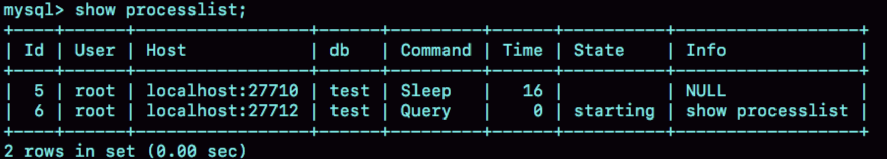

# MySQL实战45讲

## 一条 SQL 查询语句是如何执行的

我们经常说，看一个事儿千万不要直接陷入细节里，你应该先鸟瞰其全貌，这样能够帮助你从高维度理解问题。同样，对于 MySQL 的学习也是这样。平时我们使用数据库，看到的通常都是一个整体。比如，你有个最简单的表，表里只有一个 ID 字段，在执行下面这个查询语句时：

```mysql
mysql> select * from T where ID=10；
```

我们看到的只是输入一条语句，返回一个结果，却不知道这条语句在 MySQL 内部的执行过程。

所以今天我想和你一起把 MySQL 拆解一下，看看里面都有哪些“零件”，希望借由这个拆解过程，让你对 MySQL 有更深入的理解。这样当我们碰到 MySQL 的一些异常或者问题时，就能够直戳本质，更为快速地定位并解决问题。

下面我给出的是 MySQL 的基本架构示意图，从中你可以清楚地看到 SQL 语句在 MySQL 的各个功能模块中的执行过程。


大体来说，MySQL 可以分为 Server 层和存储引擎层两部分。

Server 层包括连接器、查询缓存、分析器、优化器、执行器等，涵盖 MySQL 的大多数核心服务功能，以及所有的内置函数（如日期、时间、数学和加密函数等），所有跨存储引擎的功能都在这一层实现，比如存储过程、触发器、视图等。

而存储引擎层负责数据的存储和提取。其架构模式是插件式的，支持 InnoDB、MyISAM、Memory 等多个存储引擎。现在最常用的存储引擎是 InnoDB，它从 MySQL 5.5.5 版本开始成为了默认存储引擎。

也就是说，你执行 create table 建表的时候，如果不指定引擎类型，默认使用的就是 InnoDB。不过，你也可以通过指定存储引擎的类型来选择别的引擎，比如在 create table 语句中使用 engine=memory, 来指定使用内存引擎创建表。不同存储引擎的表数据存取方式不同，支持的功能也不同，在后面的文章中，我们会讨论到引擎的选择。

从图中不难看出，不同的存储引擎共用一个 Server 层，也就是从连接器到执行器的部分。你可以先对每个组件的名字有个印象，接下来我会结合开头提到的那条 SQL 语句，带你走一遍整个执行流程，依次看下每个组件的作用。

### 连接器

第一步，你会先连接到这个数据库上，这时候接待你的就是连接器。连接器负责跟客户端建立连接、获取权限、维持和管理连接。连接命令一般是这么写的：

```mysql
mysql -h$ip -P$port -u$user -p
```

输完命令之后，你就需要在交互对话里面输入密码。虽然密码也可以直接跟在 -p 后面写在命令行中，但这样可能会导致你的密码泄露。如果你连的是生产服务器，强烈建议你不要这么做。

连接命令中的 mysql 是客户端工具，用来跟服务端建立连接。在完成经典的 TCP 握手后，连接器就要开始认证你的身份，这个时候用的就是你输入的用户名和密码。

* 如果用户名或密码不对，你就会收到一个"Access denied for user"的错误，然后客户端程序结束执行。
* 如果用户名密码认证通过，连接器会到权限表里面查出你拥有的权限。之后，这个连接里面的权限判断逻辑，都将依赖于此时读到的权限。

这就意味着，一个用户成功建立连接后，即使你用管理员账号对这个用户的权限做了修改，也不会影响已经存在连接的权限。修改完成后，只有再新建的连接才会使用新的权限设置。

连接完成后，如果你没有后续的动作，这个连接就处于空闲状态，你可以在 show processlist 命令中看到它。文本中这个图是 show processlist 的结果，其中的 Command 列显示为“Sleep”的这一行，就表示现在系统里面有一个空闲连接。



客户端如果太长时间没动静，连接器就会自动将它断开。这个时间是由参数 wait_timeout 控制的，默认值是 8 小时。

如果在连接被断开之后，客户端再次发送请求的话，就会收到一个错误提醒： Lost connection to MySQL server during query。这时候如果你要继续，就需要重连，然后再执行请求了。

数据库里面，长连接是指连接成功后，如果客户端持续有请求，则一直使用同一个连接。短连接则是指每次执行完很少的几次查询就断开连接，下次查询再重新建立一个。

建立连接的过程通常是比较复杂的，所以我建议你在使用中要尽量减少建立连接的动作，也就是尽量使用长连接。

但是全部使用长连接后，你可能会发现，有些时候 MySQL 占用内存涨得特别快，这是因为 MySQL 在执行过程中临时使用的内存是管理在连接对象里面的。这些资源会在连接断开的时候才释放。所以如果长连接累积下来，可能导致内存占用太大，被系统强行杀掉（OOM），从现象看就是 MySQL 异常重启了。

怎么解决这个问题呢？你可以考虑以下两种方案。

* 定期断开长连接。使用一段时间，或者程序里面判断执行过一个占用内存的大查询后，断开连接，之后要查询再重连。
* 如果你用的是 MySQL 5.7 或更新版本，可以在每次执行一个比较大的操作后，通过执行 mysql_reset_connection 来重新初始化连接资源。这个过程不需要重连和重新做权限验证，但是会将连接恢复到刚刚创建完时的状态。

### 查询缓存

