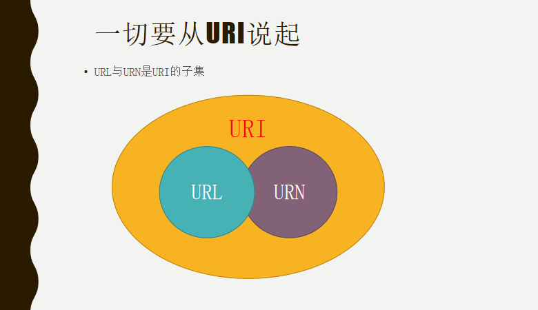
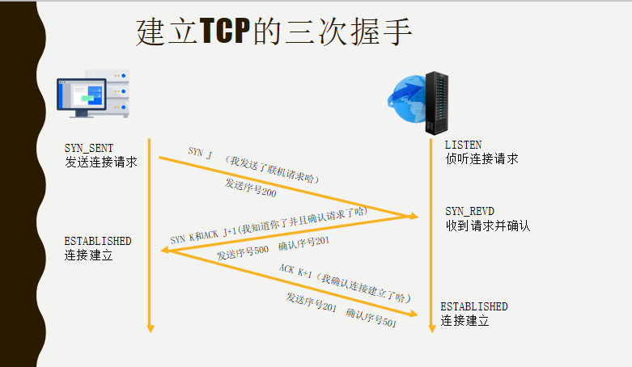
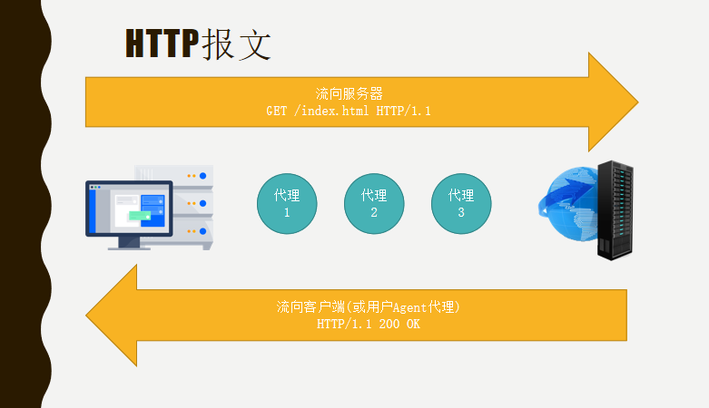
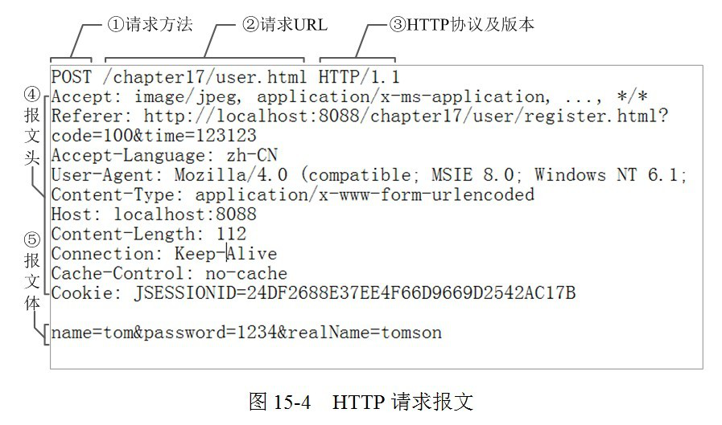
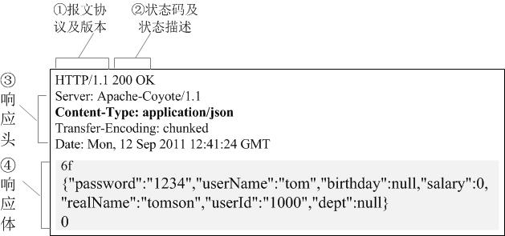
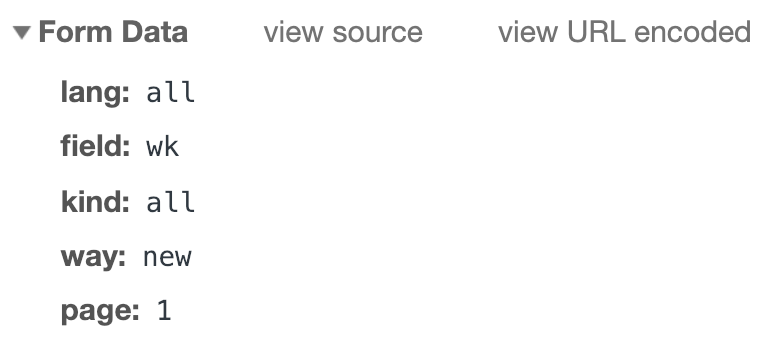
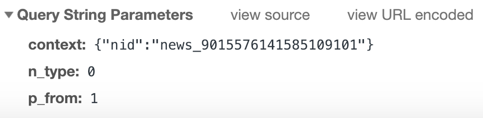
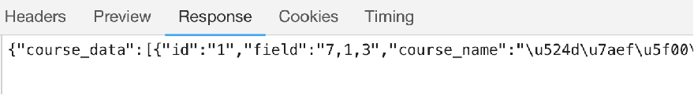
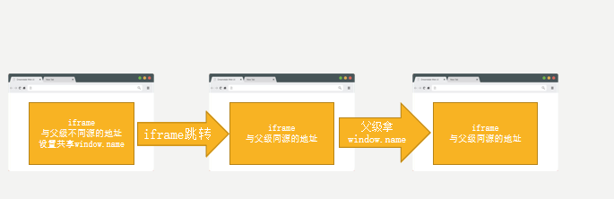
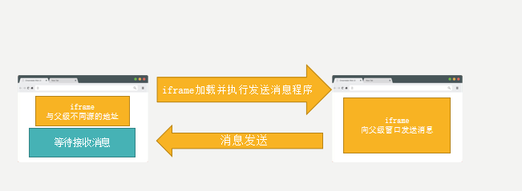

# network

## 一、网络初探、URL、客户端与服务端、域名操作

浏览器有哪些?

IE浏览器（trident），Chrome浏览器（Blink），Opera浏览器（Blink），火狐浏览器（gecko）

### 浏览器请求网页的流程

client客户端 - server服务端

1. DNS解析获取IP地址
2. TCP/IP三次握手，建立TCP连接，发起HTTP请求
3. 浏览器得到HTML代码
4. 请求下载HTML中的静态资源，解析页面
5. 四次挥手，中断连接请求，渲染页面

一个IP地址可以绑定多个域名，域名对用户来说更加友好。
    
### 一切从URI说起

URI（uniform resource identifer）：
即统一资源标识符，用来标识唯一的一个资源。

URL（uniform resource locator）：
统一资源定位符。URL可以用来标识一个资源，而且还指明如何定位这个资源。
用地址定义一个资源。

URN（uniform resource name）：
统一资源命名，即通过名字来表示资源。用名称定位一个资源。

URL肯定是一个URI，URI并不一定是URL，也有可能是URN。URL与URN是URI的子集。URI => { URL、URN }



#### URL
* 资源标识
* 具有定位资源的功能（资源的具体位置）
* 指明了如何获取资源所采用的协议     

https://  cn.bing.com  /dict  ?FORM=Z9LH3
协议名称  主机名称     路径    查询所需字符串

端口号	https：443、http：80、mysql：3306

#### URN
仅仅标识资源名称        
cn.bing.com/dict?FORM=Z9LH3 

### 客户端与服务端

客户端：client 客户所使用的电脑中的应用程序
服务端：server 存放网页、客户端程序、数据处理程序、数据库的电脑

#### CS架构与BS架构

CS：Client/Server 将应用程序安装到客户端电脑中，由服务端提供客户端程序所需要的数据。

* 优点：界面与操作丰富、安全性高、响应速度快
* 缺点：通常用于局域网（不局限于局域网）、需安装特定应用或使用特定硬件、维护成本高

BS：Borwser/Server 利用WEB浏览器呈现客户端程序界面，由服务端提供客户端程序所需要的数据。

* 优点：无需安装客户端程序与特定硬件、多客户访问、交互性强、无需升级客户端
* 缺点：跨浏览器兼容性差、功能性相对较弱、设计成本高、安全性弱、功能性弱

例如外挂的存在，可能是公司不进行处理，可能只是为了吸引客户。BS是由CS演变而来的，BS架构比较新。

#### 服务端、服务器、后台

服务端：服务端是一个数据或者文件的入口或者出入口
后台：指数据管理，程序管理，后台不是服务端，是一个程序体集合
服务器：电脑，配置相对于家用电脑性能好

服务器

* 自己购买服务器

* 购买（租赁）服务器：实体服务器、云服务器（Elastic Compute Service）

* 云服务器：无需提前采购硬件设备，而是根据业务需要，随时创建所需数量的云服务器。

  ECS实例（展示）、扩容磁盘、增加带宽。

ECS

* 分块存储
* 随时更换镜像文件
* 创建快照
* 配置安全组
* ECS管理控制台

#### 域名

域名  Domain Name

相当于访问互联网某一户人家的地址

域名与服务器绑定之后，域名与服务器对应的IP是映射关系

域名比IP更方便用户记忆

**IP可以对应多个域名，所以不同的域名可以访问一个或多个WEB网页**

#####购买域名及备案

购买：阿里云 万网
备案域名：阿里云备案管理
解析域名：解析就是将域名与服务器IP映射的过程，由DNS服务器来完成
A记录：Address，域名与IP对应的记录，将域名指向服务器上
CNAME记录：别名记录，将多个名字映射到另一个域名

一般来说，所有的图片或者视频不会放到自己服务器上，一般放到第三方平台上，例如七牛云。

##### 域名分类

通用类

* .com 工商金融等企业 .com.cn .公司

* .gov 政府机构 .gov.cn

* .net 提供互联网网络服务机构 .net.cn .网络

* .org 各类组织机构

* .ac 科研机构 .ac.cn

* .edu 教育机构 .edu.cn

国家地区类

* cn 中国 .中国
* ca 加拿大
* uk 英国 
* jp 日本
* kr 韩国
* hk 中国香港地区
* tw 中国台湾地区

#####域名级别

顶级域名 yueluo.club
二级域名 app.yueluo.club
三级域名 sleep.app.yueluo.club

##### 根域名服务器

主根服务器 1个 美国
辐根服务器 12个 美国9个 美国瑞典各1个 日本1个

管理机构：国际互联网名称与数字地址分配机构ICANN（美国授权）
前管理机构：商务部下属的国家通信与信息管理局（NTIA）外包给ICANN管理

作用：负责全球互联网域名根服务器、域名体系和IP地址的管理

美国给中国断网？

1. 网民一般不会去访问根域名服务器，通过DNS域名服务器来查询域名（递归域名服务器：运营商处设立）
2. 根域名服务器实际上只纪录了1000多个顶级域名信息，常用的非常少
3. DNS域名服务器会缓存根域名服务器的记录
4. 中国有根服务器的镜像（克隆服务器）

   国外访问不到部分中国的网站，国内访问国内的网站不受影响。

##### 中国的互联网大计划

雪人计划：由中国下一代互联网工程中心发起

现状：全球已完成25台IPV6根服务器的架设

“雪人计划”IPV6根服务器全球分布情况（2017年底）

    国家   主根服务器  辐根服务器  
    中国      1          3
    美国      1          2
    日本      1          0
    印度      0          3
    法国      0          3
    德国      0          2
    俄罗斯    0          1
    意大利    0          1
    西班牙    0          1
    奥地利    0          1
    智利      0          1
    南非      0          1
    澳大利亚  0          1
    瑞士      0          1
    荷兰      0          1

## 二、DNS、IP、TCP/UDP、HTTP/HTTPS、三次握手

#### www

www：World Wide Web 万维网 

Internet提供了很多服务，其中包括WWW（网页服务）、FTP（文件传输）、E-mail（电子邮件）、Telnet（远程登录）等。 
www是用浏览器访问网页的服务，所以网站的主页的域名前需要加www。
随着网站服务类型的增加，不同的二级域名或三级域名对应不同的业务，而业务的处理任务会分配到多个服务器，
所以不在需要使用www来标注主页，很多网站都还会做DNS解析www，原因是尊重用户习惯。（国外网站基本不用www标注主页）。

####DNS解析

DNS：Domain Name Server（域名服务器）
作用：域名与对应的IP转换的服务器
特征：DNS中保存了一张域名与IP对应的表，一个域名对应一个IP地址，一个IP地址可以对应多个域名。

gTLD：generic Top-Level DNS Server 定义域名服务器，为所有.com、.net...后缀做域名解析的服务器


用户输入访问域名www.yueluo.com，首先请求DNS本地服务器（运营商），如果DNS本地缓存没有此域名，
请求根服务器，如果根服务器没有此域名，去找.com域服务器，如果也没有，请求yueluo.com域服务器，
如果获取到域名对应关系3，返回DNS本地服务器，先写入本地缓存，再返回到浏览器，转换为IP地址。

根服务器和.com域服务器基本是用来管理的，存储的映射关系比较少。
一般网络提供商是有备案的，备案成功会在域服务器缓存。

域名最后实际上还存在一个.。
域名解析是由右向左解析的，根服务器是.，然后.com服务器。
. -> .com -> .yueluo.com -> www.yueluo.com

#### IP地址

互联网协议地址、IP地址 Internet Protocol Address
作用：分配给用户上网使用的互联网协议
分类：IPV4 IPV6 其他
形式：192.168.0.1（IPV4：长度32位（4个字节），十进制）

v:version 4或6都是版本号

优势

* IPV6地址空间更大（8组（128位），十六进制）
* 路由表更小
* 组播支持以及对流支持增强
* 对自动配置的支持
* 更高的安全性

```js
ABCD:EF01:2345:6789:ABCD:EF01:2345:6789   
```

IP地址：IPV4 IPV6

端口号：80 443 

每一个端口对应的是一个服务器的业务，访问一个服务器的不同端口相当于访问不同的业务。

端口号范围：0-65535
默认端口：http协议（80）、https协议（443）、FTP协议（20、21）

node展示端口不同，服务端不同的业务。

#### TCP

TCP：Transmission Control Protocol 传输控制协议

特点：面向连接（收发数据，必须建立可靠的连接）
建立连接基础：三次握手
应用场景：数据必须准确无误的收发，用于HTTP请求、FTP请求、邮件收发
优点：稳定、重传机制、拥塞控制机制、断开连接
缺点：速度慢、效率低、占用资源、容易被攻击（三次握手易受到DOS、DDOS攻击）

TCP/IP协议组：提供点对点的连接机制，制定了数据封装、定址、传输、路由、数据接收的标准

#### UDP

UDP：User Data Protocol 用户数据报协议

特点：面向无连接（不可靠的协议，无状态传输机制）、无连接信息发送机制
应用场景：无需确保通讯质量且要求速度快、无需确保信息完整，用于消息收发、语音通话、直播（QQ）
优点：安全、快速、漏洞少（会受到UDP flood攻击）
缺点：不可靠、不稳定、容易丢包

只要目的地源地址、端口号确定，就可以直接发送信息报文，但不能保证一定能收到或收到完整的数据。

#### HTTP、HTTPS

HTTP：HyperText Transfer Protocol 超文本传输协议
定义：客户端和服务器端请求和应答的标准，用于从WEB服务器传输超文本到本地浏览器的传输协议

HTTPS: HyperText Transfer Protocol Secure 超文本传输安全协议
定义：HTTP的安全版（安全基础是SSL/TLS）

HTTP请求：按照协议规则先向WEB服务器发送的将超文本协议传输到本地服务器的请求

```js
SSL：Secure Sockets Layer 安全套接层

为网络通信提供安全及数据完整性的一种安全协议，对网络连接进行加密。

TLS：Transport Layer Security 传输层安全

TLS是SSL的升级，两种搭配使用。HTTP不安全，信息传输是明文的方式，存在安全隐患。
```

HTTP和HTTPS的区别：

* HTTP是不安全的（监听和中间人攻击，获取网站账户信息和敏感信息）

  HTTPS可防止被攻击。

* HTTP协议的传输内容都是明文，直接在TCP连接上运行，客户端和服务端都无法验证对方身份。

* HTTPS协议的传输内容都被SSL/TLS加密，且运行在SSL/TLS上，SSL/TLS运行在TCP连接上，所以数据传输是安全的。

配置HTTPS：

在各大互联网运营商，免费申请https证书。
需要公钥和密钥。
需要在服务器的虚拟主机上配置HTTPS的设置。
需要在服务器的运营商上进行DNS解析。

####建立 TCP 连接（三次握手）

标志位：数据包

SYN：Synchronize Sequence Numbers 同步序列编号
ACK：Acknowledgement 确认字符

状态：

LISTEN：侦听TCP端口的连接请求（等待对方发送连接请求）
SYN-SENT：发送连接请求后等待匹配的连接需求（已发送请求，等待回复）
SYN-RECEIVED：收到和发送一个连接请求后等待对连接请求的确认（收到连接请求，等待回复）
ESTABLISHED：一个已经打开的连接，数据可以传送给用户（已经建立连接）



第一次握手：客户端向服务器发送SYN标志位（序号是J），并且进入SYN_SEND状态（等待服务器确认状态）。

第二次握手：服务器收到客户端的SYN J，服务端会确认改数据包已收到并发送ACK标志位（序号是J+1）和SYN标志位（序号是K），服务器进入SYN_RECV状态（请求接收并等待客户端确认状态）。

第三次握手：客户端进入连接建立状态，向服务端发送ACK标志位（序号是K+1），确认客户端已收到建立连接确认，服务端收到ACK标志位后，服务端进入连接已建立状态。

  ## 三、www历史、HTTP报文、请求方式、GET与POST

www最开始是一个协议（网络服务协议），并不是一个二级域名。

www.baidu.com、zhidao.baidu.com

最开始是www.baidu.com、www.baidu.com/zhidao，随着服务的增多，业务被拆分到多个服务器，以目录区分的方式不能满足现有需求，去掉www协议，www成为二级域名。解决不同的文件夹区管理不同的站点，不同的服务器可以有不同的服务域名的绑定，实现多服务器分站点的管理。

####HTTP报文

HTTP基于TCP/IP通信协议来传递数据
HTTP基于客户端/服务端（C/S）架构模型
通过一个可靠的连接来交换信息，是一个无状态的请求/响应协议

限制每次连接只处理一个请求（传统TCP/IP连接）。服务器处理完客户的请求，
并收到客户的应答后，即断开连接。采用这样方式可以节省传输时间。

只要客户端和服务器知道如何处理的数据内容，任何类型的数据都可以通过HTTP发送。
客户端以及服务器指定使用合适的MIME-type内容类型。
Multipurpose Internet Mail Extensions type 多用途互联网邮件扩展类型。

协议对于事物处理没有记忆能力。缺少状态意味着如果后续处理需要前面的信息，则它必须重传，
这样可能导致每次连接传送的数据量增大。另一方面，在服务器不需要先前信息时它的应答就比较快。

HTTP报文定义：在客户端与服务器之间发送的数据块。这些数据块以一些文本的元信息（meta-information）开头，
描述了报文的内容及含义，后面跟着可选的数据部分，这些报文在客户端、服务器和代理之间流动。
所以HTTP报文的发送也叫报文流。

每条HTTP报文包含一个客户端请求和服务端响应（请求报文Request和响应报文Response）。
浏览器显示的报文并不是报文的真正格式，是经过浏览器整理过的内容。




#### 报文组成部分

1. 对报文进行描述的起始行
2. 包含属性的首部/头部（header）
3. 包含数据的主体（body）（可选项）





#### 报文基本格式


#### 报文类型

##### GENERAL（通用报）


##### REQUEST HEADRES（请求报）


##### Response HEADERS（响应报）


#####  请求体





##### 响应体




#### 请求方式

HTTP1.1版本里存在8种请求方式。

* GET/POST
* OPTIONS：返回服务器针对特定资源所支持的HTTP请求方法
* HEAD：返回与GET请求相一致的响应，响应体被返回
* PUT：向指定资源位置上传最新内容（form表单不支持）
* DELETE：请求服务器删除Request-URL所标识的资源（form表单不支持）
* TARCE：回显服务器收到的请求，主要用于测试或诊断
* CONNECT：连接改为管道方式的代理服务器

put: 上传资源，form表单不支持、提交即存储的原则（无验证机制，存在安全漏洞），需要配置服务器支持put方式转发给后端操作。
delete：删除资源，from表单不支持、提交即删除的原则（无验证机制，存在安全漏洞），需要服务器支持put方式转发打给后端操作
post：修改资源。
get：获取资源。

4种不同的请求方式是为了分清楚不同请求的目的，但是不代表用了post就一定要修改数据，用get就不能修改数据。

```js
GET请求主要用来获取数据
GET的数据在请求体中是查询字符串（Query String Parameters）
POST主要用于传输数据到后端进行增加、删除、更新数据、提交表单
POST的数据在请求体中是表单数据（Form Data）
```

GET/POST：view source中仍然是url参数键值对形式 a=1&b=2

####GET/POST 请求方式

* POST更安全。

  不会作为url一部分、不会被缓存、保存在服务器日志和浏览器记录中。
  GET请求作为链接时可以被收藏的。

* POST发送的数据量更大（GET有url长度限制）。

  POST发送的数据量几乎时没有限制的。
  GET请求长度限制：IE（2083字节）firefox（65536字符） chrome（8182字符）
  safri（80000字符） opera（190000字符）

* POST能发送更多的数据类型（各种类型的文件）。

  GET只能发送ASCII字符

* POST比GET速度慢。

  POST请求包含更多的请求头

  POST接收数据之前会先将请求头发给服务器确认，然后发送数据

  ```js
  POST过程：
  (1) 第三次握手，浏览器确认并发送post请求头
  (2) 服务器返回状态码100后，continue响应
  (3) 浏览器开始发送数据
  (4) 服务器返回200 ok响应
  
  GET过程：
  (1) 第三次握手，浏览器确认并发送请求头和数据
  (2) 服务器返回200 ok响应
  ```

* GET会进行数据缓存，POST不会。

* POST不能进行管道化传输。

  ```js
  (1) 串行连接 
  每次请求先连接，请求成功后断开连接，重复进行此过程。
  (2) 持久化连接（connection:keep-alive） HTTP/1.0 1.1 连接不会关闭
  连接时，请求成功不会断开连接，可以继续请求，响应。
  (3) 管道化持久连接 http/1.1 
  把所有请求放到发送队列中，不等响应，一个一个发送请求的同时接收相应的响应
  不适合增加、删除、修改数据
  ```

####幂等性、必要性

数学中的幂等：x^y=x、x= 0 || 1       

幂等性：一个HTTP请求中，不会对数据或状态做修改，并且每次请求都会返回同样的结果。

必要性：(1) GET请求必须遵守幂等性，从HTTP请求来看GET只能获取数据。
                (2) POST请求一般是做增删改的操作，所以一般不遵守幂等性。

管道化传输不可以用非幂等性请求的原因：

假设：一个管道中有10个请求，发送了9个，但是连接关闭了，即使收到了9个响应，这9个响应内容
也将被清空，那么客户端将会重新发起这9个请求，但是9个响应收到就证明服务器已经做了
响应的操作，如果时非幂等的请求，则会出现操作的错误（如支付、增删改数据等）。
所以管道化传输不支持非幂等的请求，POST请求时幂等或非幂等请求，都不支持管道化传输。

Opera支持管道化传输，其他浏览器使用都需要配置。现在使用的基本都是持久化连接。

  ## 四、http状态码、accept、Content-Type

### HTTP报文-状态码

1xx 信息，服务器收到请求，需要请求者继续执行操作
2xx 成功，操作被成功接收并处理
3xx 重定向，需要进一步的操作以完成请求
4xx 客户端错误，请求包括语法错误或无法完成请求
5xx 服务器错误，服务器在处理请求的过程中发生了错误

#### 304 重定向

ETag：服务端资源唯一标识符（优先级高于Last Modified）
LastModified：资源在服务器最后修改的时间（精确到秒）=> 所以需要唯一标识符

第一次访问indix.html（响应头） - 200 ok

```js
Date：Sat, 05 Jan 2020 13:55:46 GMT
ETag: "144-57eb65254f380"
Keep-Alive: timeout=5, max=100
Last-Modified: Sat, 05 Jan 2020 13:53:34 GMT
```

第二次访问index.html（请求头）304 Not Modified

```js
请求头：If-Modified-Since：Sat, 05 Jan 2020 13:53:34 GMT
       If-None-Match："144-57eb65254f380"

根据发送的 If-None-Match 和服务端的 Etag 做对比，如果服务器资源没有变化，
ETag 没有变化，响应 304 Not Modified，返回之前的资源。
```

第三次修改index.html（响应头） 200 ok

```js
ETag："148-57eb661696cc0"
Keep-Alive: timeout=5, max=100
Last-Modified: Sat, 05 Jan 2020 13:57:47

If-Modified-Since：Sat, 05 Jan 2020 13:53:34 GMT
If-None-Match："144-57eb65254f380"

如果服务端资源发生变化，生成新的ETag，返回最新的资源。
```

> GMT：世界协调时，全球统一时间，格林威治时间，也叫UTC时间。

#### 302 重定向

服务端重定向，跳转其他页面，返回302 Found。

#### 404 Not Found

页面错误，页面不存在。 404 Not Found

#### 403 forbidden 

服务端拒绝请求 forbidden 

#### 500 Internal Server Error

服务器发生不可预测的错误，内部服务器错误

#### 503 server Unavailable 

服务器当前不能处理客户端请求（关闭应用程序池或者程序标识出错或者程序池队列已满）

###HTTP报文-ACCEPT&CONTENT-TYPE


**Accept** 

代表客户端希望接收到的数据类型

**q**

相对品质因子，权重，它从0到1的范围指定优先顺序，没有指定，质量值默认为“q=1”,
如赋值为0，则提醒服务器该内容类型不被浏览器接受。

**Accept（请求头）**text/html,application/xhtml+xml.application/xml;q=0.9,image/webp,image/apng,*/*;q=0.8,type;q=value,type;q=value

表示接收到text/html,application/xhtml+xml,其次是appliation/xml,再其次是其他任意数据类型。
以逗号分隔，作为一个组合，如果不写q，说明q默认为1。

**Content-Type（响应头）**

Content-Type：text/html;charest=UTF-8（Accept-Charest）
返回的资源类型与编码

**Accept-Language**

Accept-Language: zh-CN,en-US;q=0.8,en;q=0.6
浏览器支持的语言是简体中文，其次是美国英语，然后是其他形式的英语

**Content-Language**

Content-Language: zh-CN
说明语言的返回类型

**Accept-Encoding**

Accept-Encoding：gzip，define，br
浏览器可以接受的资源编码格式（压缩格式）

**Content-Encoding**

Content-Encoding：gzip
服务端返回资源的编码格式（压缩格式、优化传输内容的大小）

*****

```js
通配符，*/*任意类型。
```

  ## 五、缓存、长短连接、Content-Length、referrer

### 浏览器缓存

```js
把已请求并返回的WEB资源（HTML页面、图片、js文件、CSS文件、数据等）复制成一个副本存储在浏览器的缓存中。
```

#### 缓存的好处

* 减少网络带宽消耗
* 降低服务器压力
* 减少网络延迟

#### 缓存相关字段

**Pragma: no-cache 响应头**

指示浏览器忽略资源缓存副本，每次访问需要到服务器获取

http1.0中字段，http1.1用Cache-Control替代（http协议向下兼容，所以很多网站依旧有这个字段）。
如果两个同时存在，Cache-Control 的优先级比较高。

**Expires**

```js
Expires:  Mon, 15 Aug 2016 03:56:47 GMT(Cache-Control更高)
```

启用缓存和定义缓存时间。告诉浏览器资源缓存过期时间，如果还没过该时间点则不发请求。

在HTTP 1.1版开始，使用Cache-Control: max-age=秒替代

**Cache-Control 缓存控制**

* no-store：强制缓存在任何情况下都不要保留任何副本
* no-cache：指示浏览器忽略资源缓存副本，强制到服务器获取资源（浏览器依然缓存）
* max-age=31536000：指示缓存副本的有效时长，从请求时间开始到过去时间之间的秒数
*  public：表明响应可以被任何对象（发送请求的客户端，代理服务器等）缓存
* priavte：表明响应只能被单个用户缓存，不能作为共享缓存（不能被代理服务器缓存）

#### 浏览器缓存流程图


### HTTP短连接与长连接

#### 短连接/长连接

所谓短连接，就是每次请求一个资源就建立连接，请求完成后连接立马关闭。

```html
创建TCP连接 - 请求资源 - 响应资源 - 断开连接
```

所谓长连接，就是只建立一次连接，多次资源请求都复用该连接，完成后关闭。

#### Connection：keep-alive

早期 HTTP/1.0：每个 HTTP 请求都要创建一个 TCP/IP 连接。属于串行连接（短链接）。

后期 HTTP/1.0，在请求头增加：Connection:keep-alive

HTTP/1.1  默认开启：Connection:keep-alive，如需关闭，可以使用 Connection:close。

>  注意：Connection:keep-alive 在大多数浏览器中默认使用HTTP/1.1，服务器也须由相应的支持才能达成C/S协议进行长连接

管道化持久化连接在长连接的基础上，进一步进行优化。

#### Content-Length

Content-Length 用于描述 HTTP 消息实体的传输长度

GET请求：请求头没有Content-length，响应头带Content-length。

POST请求：请求头与响应头都带content-length。

例如 Post 请求：

原数据：

```js
username: 张三
password：李四
```

消息实体数据：

```html
username=张三&password=123456 （消息实体长度）
```

### Referer

Referer（referrer:来源域名）：Referer其实是错误的单词，应该是referrer，现在是将错就错。

 Referer 是 request header的一部分，当浏览器向web服务器发送请求的时候，一般会带上Referer，告诉服务器是从哪个页面链接过来的。

例如：在谷歌浏览器搜索腾讯课堂，进入连接后，可以查看请求头中有Referer：https://www.google.com/。

#### referer 的好处

可通过Referer分析不同渠道的流量分布、用户搜索的关键词。只能做大致分析，不可能做精确分析。

#### 设置 referer

**不发送 Referer**

```html
<meta name="referrer" content="no-referrer" />
```

Referrer Policy: no-referrer。
请求头就没有referer字段。

**只发送 Referer：origin 信息**

```html
<meta name="referrer" content="origin" />
```

Referrer Policy: origin
请求头只有源信息。例如Referer: http://localhost/。

**发送 Referer 信息**

Referrer Policy: no-referrer-when-downgrade
仅当协议降级（如https页面引入HTTP资源）时不发送Referrer信息。大部分浏览器的默认策略。
即从HTTPS页面跳转到HTTP页面，包括HTTPS获取HTTP资源，不发送Referrer。
Referer: http://localhost/network。

#### Referer 的应用场景

资源防止盗链：服务器拉取资源之前判断referer是否是自己的域名或者IP，如果不是就拦截，如果是拉取资源。

例如七牛CDN域名防盗链。避免违规下载图片和视频等资源。 

防盗链是针对视频之类的比较敏感的资源，我们要进行防盗链处理。当然，百分之百防盗链是不可能的，
但是我们可以通过一些机制来进行防盗链处理，比如说referer防盗链。我们可以在服务器获取资源之前，
让服务器判断referer是不是可以信赖的来源域名，如果不是，将拦截此次请求，如果是，返回对应资源。
比如在七牛服务器上，每一个资源都可以绑定一个防盗链的白名单和黑名单，如果是白名单内部的域名，就返回资源。

**资源防盗链**

* Referer防盗链;

* 时间戳防盗链;

  通过时间戳和签名规则来生成一段密钥，密钥是跟在资源请求地址后面，把这个密钥和资源一起发给服务器，服务器来鉴别如果签名正确，检查资源有没有过期，没有过期，返回对应资源。

## 六、http版本、关闭TCP、四次挥手、同源策略

### HTTP 协议版本

HTTP 版本标准写法

```js
HTTP/version
```

#### HTTP/0.9

仅支持GET请求方式
仅能请求访问HTML格式的资源

> 只要不是版本1开头的都是Beta（测试）版本。

#### HTTP/1.0

增加POST和HEAD请求方式
支持多种数据格式的请求与访问
支持cache缓存功能
新增状态码、多字符集支持、内容编码等

早期 HTTP/1.0 不支持 keep-alive 长连接，只支持串行连接。
后期 HTPP/1.0 增加 Connection:keep-alive 字段（非标准字段），开始支持长连接。

非标准字段：实际上HTTP/1.0 默认还没有这个属性，需要配置该属性。

#### HTTP/1.1

增加持久连接（默认开启Connection:Keep-alive）。
增加管道机制（支持多个请求同时发送）。
增加PUT/PATCH/OPTION/DELETE等请求方式。
增加Host字段（指定服务器域名）。
增加100状态码（Continue），支持只发送头信息。
增加身份认证机制。
支持传送内容的一部分和文件断点续传。
新增了24个错误状态码。

>  管道机制，即管道化持久连接。把所有请求放到发送队列中，不等响应，一个一个发送请求的同时接收相应的响应。

#### HTTP/2.0

增加双工模式（客户端同时发送多个请求，服务端同时处理多个请求）。
服务端推送（服务器会把客户端需要的资源一起推动到客户端，合适加载静态资源）。
头信息压缩机制（每次请求都会带上所有信息发送给服务端【HTTP协议不带状态】）。

HTTP协议是无状态的，没有记忆功能。
二进制协议（头信息与数据体使用二进制进行传输）2.0的优化措施。
多工（先发送已处理好的部分，再响应其他请求，最后解决没有处理好的部分）。

### 关闭 TCP 连接（四次挥手）

#### 关闭过程

FIN：finsh 关闭连接

状态：

FIN-WAIT-1：等待远程TCP的连接中断请求，或先前的连接中断请求的确认
FIN-WAIN-2：从远程TCP等待连接中断请求
CLOSE-WAIT：等待从本地用户发来的连接中断请求
LAST-ACK：等待原来发向远程TCP的连接中断请求的确认
TIME-WAIT：等待足够的时间以确保远程TCP接收到连接中断请求的确认
CLOSED：没有任何连接状态


小写的ack不是确认包，表示确认收到消息，确认的内容是 序列号内容+名称（u + 1，1为FIN的内容）。
大写的ACK表示确认包。
FIN-WAIT-2阶段客户端不再发送任何请求，可以接收服务端响应。
最后客户端确认关闭之后，不知道服务端是否已经关闭，所以需要等待2MSL之后再关闭连接。

#### 总结

1.  客户端发送连接关闭报文（此时已停止发送数据），**第一次挥手**。

   报文首部：FIN=1（序列号seq=u） 

   此刻客户端进入终止等待1（FIN-WAIT-1）状态。

2. 服务器收到连接关闭报文，并发送确认报文， **第二次挥手**。

   报文首部：ACK=1 ack=u+1（确认FIN）（序列号squ=v） 。

   此刻服务端进入关闭等待（CLOSE-WAIT）状态。

   > 连接半关闭状态，客户端没有数据要发送，但服务器如果还要发送数据，客户端依然需要接受

3. 客户端收到服务器的确认请求后，客户端进入终止等待2（FIN-WAIT-2）状态

   服务器在这期间还要确认客户端所需要的数据是否真的发送完毕了，如果还没有发送完，继续发送数据。

4. 服务器确认数据已发送完毕，向客户端发送连接关闭报文 **第三次挥手**。

   报文首部：FIN=1 ACK=1 ack=u+1（确认上次数据包） 序列号 seq=w。

   此刻进入最后确认状态（LAST-ACK）。

5. 客户端收到服务端的连接关闭报文后，发出接收确认报文 ，**第四次挥手**。

   报文首部：ACK=1 ack=w+1（确认上次数据包） 序列号 seq=u+1
   此刻客户端进入等待（TIME-WAIT）状态。

6.  服务器收到客户端发出的确认，立即进入TCP关闭状态（CLOSE），TCP连接结束。

   TCP关闭，服务端要比客户端早一些。

 #### TIME-WAIT

TIME-WAIT时长：2MSL Maximum Segment Lifetime 最大报文生存时间。

MSL的值根据不同的情况而不同，一般是30秒，1分钟，2分钟。

**目的：**

保证客户端发送的最后一个报文能够发到服务器，一旦报文丢失，服务器会认为，
自己最后一次发送的FIN+ACK包，客户端并没有收到，此时，服务器会重新发送一次FIN+ACK包（第三次挥手），
而客户端可以在2MSL的TIME-WAIT时间内收到重新传输的FIN+ACK包，接着重新进行第四次挥手，并重启2MSL计时器。

#### 为什么是四次挥手

第一次挥手的时候发送了FIN包，服务器接收到以后，表示客户端不再发送数据了，但还能接收数据。
这时服务器先向客户端先发送确认包，并且确认自己是否还有数据没有发送给客户端，这个确认的阶段是COLSE-WAIT，
所以在终止等待1（CLOSE-WAIT）的开始和结束需要各发送一个包，状态开始时向客户端发送的包是确认收到客户端的FIN包，
状态结束后向客户端发送的是确认数据已经发送完毕，所以是四次挥手。

#### TCP 连接建立后，客户端出现故障

TCP保活计时器：客户端如果出现故障，服务器每收到一次客户端的请求都会重新复位保活计时器，时间通常是2小时，
如2小时还没有收到客户端的数据，服务器就会发送一个探测报文段，以后每隔75分钟发送一次。
若一连发送10个探测报文仍无反应，服务器就认为客户端出了故障，此时将关闭连接。

### 同源策略

同源策略 Same-Origin-Policy（SOP）。

同源策略是浏览器的一个安全功能，不同源的客户端脚本在没有明确授权的情况下，不能读取对方资源。
只有在同一个源的脚本被赋予dom、读写cookie、session、ajax等操作的权限。
只要有JS引擎的浏览器都使用同源策略。

web浏览器只允许在两个页面有相同的源时，第一个页面的脚本访问第二个页面里的数据。

```html
第一个页面：http://test.jspluspus.com/index.html  Ajax请求
第二个页面：http://study.jspluspluscom/server.php

报错：Access to XMLHttpRequest at "http://study.jsplusplus.com/server.php" from origin
'http://test.jspluspus.com' has been blocked by CROS policy:NO 'Access-Control-Allow-Origin'
header is present on the requested resource.
```

源（域名）：协议 + 域名 + 端口
同源：相同的协议&&相同的域名&&相同的端口
不同源（跨域）：不同的协议||不同的域名||不同的端口

可以在被请求的资源添加允许访问的头信息：
header('Access-Control-Allow-Origin：域名');
header('Access-Control-Allow-Origin: *');

`*`  代表所有域名都可以访问

#### 不受策略限制

* 页面的超链接
* 重定向页面
* 表单提交
* 资源引入script src/link href/img src/iframe src

### 减少HTTP请求的方法

#### HTTP 请求流程

1. url输入回车
2. DNS解析：解析URL，获取相应服务器IP地址或者代理服务器IP地址
3. 浏览器网络向相应服务器发起TCP/IP连接请求（三次握手）
4. 建立TCP/IP连接
5. 浏览器网络发起HTTP请求
6. 等待 响应的过程
7. 下载HTML资源
8. 解析HTML
9. 遇到HTML里的资源，再次发起HTTP请求，下载资源
四次挥手（是一个整体的过程，现在浏览器是持久化连接，不是串行连接）
10. 时间线
11. 绘制页面

#### 减少 HTTP 请求

1. 能做雪碧图就做雪碧图（小图标、装饰用的东西），CSS雪碧图；
2. base64编码图片；
3. 合并脚本与样式表代码 HTML/JS/CSS；
4. 配置多个域名，CDN加速；
5. 尽量使用浏览器的缓存机制；
6. img和map制作地图；

 CDN加速：CDN具有并发请求能力，本身速度就比较快。即用自己的域名在第三方服务器上进行解析，从而生成CDN加速域名。

## 七、同步与异步请求、混编、AJAX、原生AJAX封装

### 前言

浏览器与服务器之间的通信基础是HTTP协议。

用户通过网址或表单向服务器提交请求，服务器向浏览器发送相应的请求。

**混编模式**

PHP虽然是服务端代码，仍然是脚本语言。JSP也是混编。
很久之前是没有JS引擎的，用渲染引擎解析JavaScript代码，所以经常崩溃。
Ajax之前都是同步请求。

如何不加载整个页面，却能获取到新的网页所需的数据和更新部分网页内容那？

### Ajax 历史

Ajax：Asynchronous JavaScript and XML 异步的 JavaScript 和 XML。

1999 IE5.0 允许JS脚本向服务器单独发起HTTP请求的新功能
2004 Gmail 推出异步邮件更新服务
2005 Google Map 异步更新地图服务
2005 AJAX被大厂公认命名
2006 W3C发布AJAX国际标准

### Ajax 是什么

JavaScript 脚本发起 HTTP 通信。

JavaScript异步通信：

请求服务器返回 XML文档  /JSON 数据，前端从 XML 文档中提取数据，再在不刷新整个网页的基础上，进行局部刷新。

### XMLHttpRequest 对象

原生 XMLHttpRequest 对象与 ActiveX 对象。

**作用：**

JS脚本发起HTTP请求的发起必须通过XMLHttpRequest对象，也是通过AJAX进行浏览器与服务器通信的接口，不局限于XML，可以发送任何格式的数据。

 XMLHttpRequest 本身是一个js引擎内置的构造函数，所有 XMLHttpRequest 对象需要被实例化。

IE5/6 使用 ActiveX 对象

```js
var xhr = new ActiveXObject('Microsoft.XMLHTTP');
var xhr = new XMLHttpRequest();
```

### 发起 HTTP 请求

#### open方法（发送设置）

参数列表：

* method：请求方式
*  url：请求发送的地址
*  async：true异步 false同步

#### send 方法

 参数列表：发送POST请求体数据用，GET不填写。

**AJAX-POST 请求方式的注意事项**

POST请求方式下，send方法参数中的格式：a=1&b=2&c=3

xhr.setRequestHeader("Content-type", "application/w-www-form-urlencoded");

POST请求方式必须设置这个请求头信息，目的是将请求体中的数据转换为键值对，这样后端接收到
a=1&b=2&c=3这样的数据才知道这是一个POST方式传来的数据。

http协议是二进制的，不能解析 “{a: 1, b: 2}” 这样的数据。

### Ajax 状态

onreadystatechange事件：挂载到XMLHttpRequest对象上的事件
readyState状态：通过XMLHttpRequest对象发送HTTP请求的各阶段状态码（0-4）
status状态：服务端响应的状态码（200 ok、404 未找到页面）

当readyStatus变化时，触发onreadystatechange事件执行其回调函数。

```html
0: 请求未初始化
1: 服务器连接已建立
2: 请求已接收
3: 请求处理中
4: 请求已完成，且响应已就绪
```

注意：readyState仅仅是针对请求与响应的状态码，获取资源是否成功取决于status的状态。

### Ajax 服务端响应

responseText：获取字符串数据
responseXML：获取XML数据

  ## 八、AJAX版本、响应状态、超时设置、同步与异步

XMLHttpRequest 标准分为 Level 1 和 Level 2。

### XMLHttpRequest Level 1 缺点

* 无法发送跨域请求
* 不能传输非纯文本的数据
* 无法后去传输进度

### XMLHttpRequest Level 2 改进

* 可以发送跨域请求
* 支持获取二进制数据（非纯文本数据）
* 支持上传文件
* formData对象
* 可以获取传输进度
* 可以设置超时时间

**兼容性问题**

1. IE8/9/Opara Mini不支持xhr对象
2. IE10/11不支持响应类型为JSON
3. 部分浏览器不支持超时设置
4. 部分浏览器不支持blob（文件对象的二进制数据）

 Level2虽然是改进，但是能不用最好不用。

### Ajax 状态码与状态

 xhr.status/xhr.statusText：服务器回应的HTTP状态码/服务器发送的状态提示。

```html
200 ok，访问正常
301 Moved Permanently，永久移动
302 Move temporarily，暂时移动
304 Not Modified，未修改
307 Temporary Redirect，暂时重定向
401 Unauthorized，未授权 
403 Forbidden，禁止访问
404 Not Found，未发现指定网址
500 Internal Server Error，服务器发生错误
```

 2xx 和 304 都认为是成功的。

### AJax 事件（level2）

```html
xhr.onloadstart：绑定HTTP请求发出监听函数
xhr.onerror：绑定请求失败的监听函数（修改封装的AJAX）
xhr.onload：绑定请求成功完成的监听函数
xhr.onabort：绑定请求中止（调用过abort方法）监听函数
xhr.onloadend：绑定请求完成（不管成功与失败）监听函数
```

load 在 JavaScript 中用的最多的不是加载的意思，而是加载成功。

```js
loadstart > readyState === 4 > load/error/abort > loadend
```

### Ajax-请求超时

xhr.timeout：多少毫秒，如果请求仍然没有得到结果，就会自动终止。如果该属性等于0，表示没有时间限制。
xhr.ontimeout：绑定请求超时一个监听函数，如果发生timeout事件，就会执行这个监听函数

**设置超时方法的第一种方法**

```js
xhr.ontimeout = function () {
  xhr.abort();        
  xhr = null;
}
xhr.timeout = 30000;
```

**设备超时的第二种方法**

```js
setTimeout();
```

### Ajax-异步与同步

async的值。

异步（默认 async=true）：AJAX异步发送请求时，不影响页面加载、用户操作以及AJAX程序后的程序执行
同步（async=false）：AJAX同步发送请求时，浏览器必须等到请求完成并响应成功后，AJAX程序后续的程序才会执行

### Ajax-DETETYPE

dateType 返回的数据类型

JSON TEXT XML -> 解决如果正确返回响应格式的数据

xhr.responseXML 返回类型为XML

### 原生 AJAX 作用

原生AJAX作用：

不用任何框架的前提下，一般AJAX是用原生请求的。引入第三方库，体积较大。

  ## 九、7种跨域获取数据的方法

### ifrma 相关

```html
<iframe src="index2.html" id="iframe"></iframe>  
```

```j
var iframe = document.getElementById('ifrrame');

iframe.onload = function () {
  // onload 不代表iframe加载完毕，而是代表iframe引入的HTML文件加载完毕
  // 通过window.name是可以实现互相传值的
  console.log(iframe.contentWindow.name);
  console.log(window.parent.name);
}

// window.name是可以共享（同一个窗口，多个页面）的，可以随意的读写。
```

### 跨域的 7 种方法

#### 服务器中转请求

客户端浏览器  -> 同源服务端程序 -> 不同源服务端程序

说明：同源策略只针对浏览器（客户端）


#### 设置基础域名 + IFRAME


说明：前提是基础域名必须一致。

让不同源的客户端浏览器请求数据，利用 iframe 获取到 contentWindow。

1. 首先设置同源域名（同源地址和不同源地址都要设置）
2. 客户端浏览器进行iframe引入，利用引入页面（不同源地址）的ajax获取数据

```js
var iframe = document.createElement('iframe');
iframe.src = 'http://data.yueluo.com/index.html';
iframe.id = 'myIframe';
frame.style.display = 'none';

iframe.onload = function () {
  var $$ = document.getElementById('myIframe').contentWindow.$;
  $$.post('http://data.yueluo.com/getCourses', {},
    function () {
      console.log(data);
    }
  );
}

document.body.appendChild(iframe);
```

**ifrmae数据请求函数封装**

```js
ajaxDomain({
  basicDomain: 'yeuluo.com',
  frameUrl: 'http://data.yueluo.com/index.html',
  url: 'http://data.yueluo.com/getCourses',
  type: 'POST',
  data: {},
  success: function (data) {
    console.log(data);
  },
  error: function () {
    // TODO
  }
})
```

```js
var ajaxDomain = (function () {
  function createIframe (frameId, frameUrl) {
    var frame = document.createElement('iframe');
    frame.src = frameUrl;
    frame.id = frameId;
    frame.style.display = 'none';
    return frame;
  }

  return function (opt) {
    document.domain = opt.basicDomain;
    var iframe = createIframe(opt.frameId, opt.frameUrl);
    frame.onload = function () {
      var $$ = document.getElementById(opt.frameId).contentWindow.$;
      $$.ajax({
        url: opt.url,
        type: opt.type,
        data: opt.data,
        success: opt.success,
        error: opt.error
      });
    }
    document.body.appendChild(iframe);
  }
})();
```

####WINDOW.NAME + IFRAME

**window.name的特点**

1. 每个浏览器窗口都有一个全局变量window（包含iframe框架和contentWindow）
2. 每个window对象都有一个name属性（注意：一个窗口只有一个name属性）
3. 该窗口被关闭前（生命周期内），所有页面共享一个name属性并有读写的权限
4. 无论该窗口在被关闭前，载入什么页面，都不会改变name值
5. 存储约为2M的字符串（2M左右）
6. 如果父级窗口地址源和iframe的地址源不同，父级无法通过iframe.contentWindow.name获取值，
但iframe内部不受该规则影响.

**解决方案**

先让iframe的页面程序保存window.name，然后跳转与父级窗口同源的另一个页面，
父级页面可以从当前的 iframe 拿到该页面的window.name。



**代码示例**

同源地址 index.html

```js
$.post('http://data.yueluo.club/getCourses', {}, function (data) {
  window.name = JSON.stringify(data);
});
```

客户端地址 index.html

```js
var iframe = document.createElement('iframe'),
  flag = false;

var getDatas = function () {
  if (flag) {
    var data = iframe.contentWindow.name;
    console.log(JSON.parse(data));
  } else {
    flag = true;
    setTimeout(function () {
      iframe.contentWindow.location = 'index2.html'; // ？
    }, 500);
  }
}

iframe.src = 'http://data.yueluo.com/index.html'; // 不同源的地址

if (iframe.attachEvent) {
  iframe.attachEvent('onload', getDatas);
} else {
  iframe.onload = getDatas;
}

document.body.appendChild(iframe);
```

####POSTMESSAGE + IFRAME

了解即可，不常用。

**不常用原因**

1. 伪造数据端泄露
2. xss攻击
3. 兼容性问题

**变量参数**

otherWindow.postMessage(message, targetOrigin);

otherWindow：接收方的引用
message：要发送到接收方数据
targetOrigin：接收方的源，还有必须要有监听的message事件



**代码示例**

同源地址

```js
$.post('http://data.yueluo.club/getCourses', {}, function (data) {
  window.parent.postMessage(JSON.stringify(data), 'http://www.yueluo.club');
});
```

客户端地址

```html
<iframe src="http://data.yueluo.club/index.html" id="iframe" />
```

```js
window.onmessage = function (e) {
  var e = e || window.event;
  console.log(JSON.parse(e.data));
}
```

#### HASH + IFRAME

了解即可，不常用。

**原理**

基本原理：利用url的hash值 #xxx来传递数据
基础工具：location.hash

明文传输，可以用来传简单字符串。


**代码示例**

客户端地址 index.html

```html
<iframe src="http://data.yueluo.club/index.html#getCourses" />
<button id="btn">获取HASH</button>
```

```js
var oBtn = document.getElementById('btn');
  oBtn.onclick = function () {
  console.log(JSON.parse(decodeURI(location.hash.substring(1))));
}
```

index2.html

```js
var self = this;

setTimeout(function () {
  window.parent.parent.location.hash = self.location.hash.substring(1);
}, 300);
```

同源页面

```html
<iframe src="http://www.yueluo.club/index2.html" id="iframe" />
```

```js
var hash = location.hash.substring(1),
	iframe = document.getElementById('iframe');

switch (hash) {
  case 'getCourses':
    $.post('http://data.yueluo.club/getCourses', {}, function (data) {
      var str = JSON.stringify(data);
      iframe.src = 'http://www.yueluo.club/index2.html#' + str;
    });
    break;
}
```

#### CORS 跨域

 "跨域资源共享"（Cross-origin resource sharing）。

```html
任意域名：header("Access-Control-Allow-Origin:*")
单域名：header("Access-Control-Allow-Origin:http://www.yueluoc.club");
多域名：$allowed_origins = array('http://www.yueluoc.club', 'http://yueluoc.club);
	   header("Access-Control-Allow-Origin:".$allowed_origins);
```

通知服务器在真正的请求中会采用哪种HTTP方法
 header('Access-Control-Request-Methods:GET,POST');

#### JSONP 跨域

JSONP-JSON with Padding：跨域获取JSON数据的一种非官方的使用模式。

JSON和JSONP不是一个类型
JSON是数据交换格式
JSONP是一种跨域获取JSON数据的交互技术，非正式的协议
JSONP抓取的资源并不直接是JSON数据，而是带有JSON数据参数的函数执行

    客户端期望返回的：{"name": "杨志强", age: "23"}
    JSONP实际返回的：callback({"name": "杨志强", age: "23"})
**同源策略到底适用于谁?**

1. img的src引入不同源的样式文件资源
2. link的href引入不同源的样式文件资源
3. iframe的src引入不同的网页资源
4. script的src引入不同的脚本文件资源 

script标签本身就是来引入脚本的，引入的文件后缀名，对于script标签并不重要，直解析文本内的内容。
文件里写的是什么，就按脚本解析什么。比如后缀为.txt文件，也是正常解析文件内容。

**代码测试**

客户端地址

```html
<script type="text/javascript">
function test1 (data) {
  console.log(data);
}

function test2 () {
  console.log('test2');
}

function test3 () {
  console.log('test3');
}
</script>
```

```html
<script type="text/javascript" src="http://data.yueluo.com/index.js?cb=test1" id="jsonpScript"></script>
```

不同源地址

```js
function getParams () {
  var path = document.getElementById('jsonpScript').src,
      callback = path.match(/cb=(.*)/)[1];

  switch (callback) {
    case 'test1':
      $.post('http://data.yueluo.club/getCourses', {}, function (data) {
        test1(data);
      });
      break;
    case 'test2':
      test2();
      break;
    case 'test3':
      test3();
      break;
    default:
      test1();
      break;
  }
} 
```

**JSONP 使用案例**

案例一

```js
button.onclick = function () {
  var oScript = document.createElement('script');
  oScript.src = 'http://data.yueluo.com/index.js?cb=test1';
  document.body.appendChild(oScript);
  document.body.removeChild(oScript);
}

function test1(data) {
  console.log(data);
}
```

案例二

```js
$.ajax({
  url: 'https://www.baidu.com/sugrec?prod=pc&from=pc_web&wd=' + '杨志强', // 新地址
  // url: 'https://sp0.baidu.com/5a1Fazu8AA54nxGko9WTAnF6hhy/su?wd=' + '杨志强', // 旧地址
  type: 'GET',
  dataType: 'JSONP',
  jsonp: 'cb',
  success: function (data) {
    console.log(data);
  }
})
```

  ## 十、cookie增删改查、用户追踪

HTTP协议无状态的。 stateless。

会话（session）和cookie。

浏览器起到类似用户代理的作用，向服务器请求资源。

cookie只有大约4kb的存储空间。和会话相关的信息，一般是放在服务器上的。

例如访问淘宝网相关的网站，每个用户看到的内容是不一样。

跟踪用户，收集用户喜好，根据喜好去展示想看的内容。

### 跟踪用户常见的几种形式

  1. HTTP headers 

    请求头中包含一些内容。例如referer，反应当前请求的页面是从哪一个页面来的。

  2. 客户端IP地址

    IP地址可能是动态的，不稳定。

  3. 用户登录

  4. 胖url

    用户浏览器网站的时候，部分网站会生成特定版本的url。包含特殊字段，作为每一个用户的唯一标识。

  5. cookie的解决方案

    服务器发送给用户浏览器并保存在本地的数据。

### cookie 创建

服务器响应请求时，在响应头里会增加 Set-Cookie一项，cookie就会保存在浏览器中。
之后每一次做请求时，在请求头部，就会携带cookie信息。

### cookie 包含字段

name：cookie名称
value：cookie值
domain：执行哪些主机可以接收用户信息
path：主机下哪些路径可以接收用户信息
Expires/Max-Age：指定过期时间

### cookie 操作

```js
document.cookie = 'name=jack; max-age=5000';

var date = new Date(), day = date.getDay();
date.setDate(day + 10);
document.cookie = 'name=xiaoming; expires=' + date;
```

也可以设置expires或者max-age作为过期时间。
如果没有设置过期时间，重新启动浏览器就会清除掉cookie信息。格林威治时间。

可以通过设置过期时间为过去的时间，进行删除cookie操作。

### cookies 增删改查函数封装

```js
var manageCookies = {
  set: function (key, value, expTime) {
    document.cookie = key + '=' + value + ';max-age=' + expTime;
    return this;
  },
  delete: function (key) {
    return this.set(key, '', -1);
  },
  get: function (key, callback) {
    var cookiesArr = document.cookie.split('; ');
    for (var i = 0; i < cookiesArr.length; i++) {
      var cookieItem = cookiesArr[i],
          cookieItemArr = cookieItem.split('=');

      if (cookieItemArr[0] === key) {
        callback(cookieItemArr[1]);
        return this;
      }
    }
    callback(undefined);
    return this;  
  }
}
```

### 持久化登录

