# Nginx 核心知识

## 一、Nginx 基础

### 概述

#### 主流 Web 服务器

Nginx、Apache、Tomcat。

#### Nginx 的优点

2014 发展至今。

* 高并发，高性能
* 可扩展性好
* 高可靠性
* 热部署
* BSD 许可证

### Nginx 应用场景

* 静态资源托管
  * 通过本地文件系统提供服务
* 反向代理服务
  * Nginx 的强大功能
  * 缓存
  * 负载均衡
* API 服务
  * OpenResty


### Nginx 历史背景

* 互联网的数据量快速增长
  * 互联网的快速普及
  * 全球化
  * 物联网
* 摩尔定律：性能提升
* 低效的 Apache
  * 一个连接对应一个进程

### Nginx 优点

* 高并发，高性能
* 可扩展性好
* 高可靠性
* 热部署
* BSD 许可证

### Nginx 组成部分

* Nginx 二进制可执行文件
  * 由各模块源码编译出的一个文件
* Nginx.conf 配置文件
  * 控制 Nginx 的行为
* access.log 访问日志
  * 记录每一条 http 请求信息
* error.log 错误日志
  * 定位问题

### Nginx 版本发布历史

nginx 版本发布情况（mainline）。2002 年开发时间，2004 推出第一个版本。


https://nginx.org/en/download.html。

### Nginx 发行版本选择

开源免费的 Nginx 与商业版 Nginx Plus。

开源版：nginx.org

商业版：nginx.com


阿里巴巴的 Tengine，http://tengine.taobao.org/。

> Tengine是由淘宝网发起的Web服务器项目。它在[Nginx](http://nginx.org/)的基础上，针对大访问量网站的需求，添加了很多高级功能和特性。Tengine的性能和稳定性已经在大型的网站如[淘宝网](http://www.taobao.com/)，[天猫商城](http://www.tmall.com/)等得到了很好的检验。它的最终目标是打造一个高效、稳定、安全、易用的Web平台。
>
> 从2011年12月开始，Tengine成为一个开源项目，Tengine团队在积极地开发和维护着它。Tengine团队的核心成员来自于[淘宝](http://www.taobao.com/)、[搜狗](http://www.sogou.com/)等互联网企业。Tengine是社区合作的成果，我们欢迎大家[参与其中](http://tengine.taobao.org/source_cn.html)，贡献自己的力量。


免费 OpenResty 与商业版 OpenRestry

开源 OpenRestry：http://openresty.org。

> OpenResty® 是一个基于 [Nginx](http://openresty.org/cn/nginx.html) 与 Lua 的高性能 Web 平台，其内部集成了大量精良的 Lua 库、第三方模块以及大多数的依赖项。用于方便地搭建能够处理超高并发、扩展性极高的动态 Web 应用、Web 服务和动态网关。
>
> OpenResty® 通过汇聚各种设计精良的 [Nginx](http://openresty.org/cn/nginx.html) 模块（主要由 OpenResty 团队自主开发），从而将 [Nginx](http://openresty.org/cn/nginx.html) 有效地变成一个强大的通用 Web 应用平台。这样，Web 开发人员和系统工程师可以使用 Lua 脚本语言调动 [Nginx](http://openresty.org/cn/nginx.html) 支持的各种 C 以及 Lua 模块，快速构造出足以胜任 10K 乃至 1000K 以上单机并发连接的高性能 Web 应用系统。

商业版 OpenResty：https://openresty.com。

> 技术支持比较好。


### 编译适合自己的 Nginx

#### 下载 Nginx

https://nginx.org

download

Mainline version、Stable version

下载稳定版。

```js
wget https://nginx.org/download/nginx-1.20.1.tar.gz
tar -xzf nginx-1.20.1.tar.gz
cd nginx-1.20.1
```

#### 目录介绍


* auto 
  * cc 编译
  * lib
  * os
  * types
* CHANGES：Nginx 每个版本中提供提供的特性和修复的 BUG
* CHANGES.ru：俄罗斯版本的 CHANGEES 文件，作者是俄罗斯的
* conf 示例文件
* configure：脚本，生成中间文件，执行编译前的必备动作
* contrib：提供脚本和 VIM 工具
  * cp -r contrib/vim/* ～/.vim/	可以使 vim 支持 nginx 语法
* html：提供标准 HTML 文件，500 错误文件与默认 nginx 欢迎界面
* main：linux 对 nginx 的帮助文件
* src：Nginx 源代码

#### Configure

```js
./configure --help | more // 查看帮助文件
```

默认参数编译

```js
./configure --prefix=/data/nginx
```


#### 中间文件介绍


objs

* ngx_modules.c：决定 nginx 编译时有哪些模块会被编译进 nginx

* src

#### 编译

```js
make // 编译
```

编译结束后，会在 objs 目录下生成大量二进制文件。

> c 语言编译时生成的所有的中间文件都会放到 src 目录

nginx 版本升级时，需要将 objs 目录下的文件拷贝到安装目录中。

如果我们使用动态模块，动态模块会生成 so 动态文件，也会放到 objs 目录下。

#### 安装

```js
make install // 首次安装时可以使用此命令
```

安装完成后可以去指定目录查看。


sbin：nginx 二进制文件

config：和源代码中配置文件相同，决定 nginx 功能文件

logs：日志文件

### 配置文件的通用语法介绍

#### 基础语法

* 配置文件由指令与指令块组成
* 每条指令以 ；分号结尾，指令与参数间以空格符号分割
* 指令块以 {} 大括号将多条指令组织在一起
* include 语句允许组合多个配置文件以提升可维护性
* 使用 # 符号添加注释，提高可读性
* 使用 $ 符号使用变量
* 部分指令的参数支持正则表达式

#### 配置参数：时间单位

```js
ms milliseconds
d days
s seconds
w weeks
m minutes
M months, 30 days
h hours
y years, 365 days
```

#### 配置参数：空间单位

```js
bytes
k/K kilobytes
m/M megabytes
g/G gigabytes
```

#### http 配置的指令块

http：表示内部所有执行由 http 解析并执行

server：定义域名或者一组域名

location：url 表达式

upstream：上游服务，nginx 需要与 tomcat 等其他服务交互时，我们可以定义 upstream

### 命令行：重载、热部署、日志切割

#### linux 命令行

* 格式：nginx -s reload
* 帮助：-?	-h
* 使用指定的配置文件：-c
* 指定配置指令：-g
* 指定运行目录：-p
* 发送信号：-s
  * 立刻停止服务：stop
  * 优雅的停止服务：quit
  * 重载配置文件：reload
  * 重新开始记录日志文件：reopen
* 测试配置文件是否有语法错误：-t、-T
* 打印 nginx 的版本信息、编译信息等：-v、-V

#### 重载配置文件

```js
./nginx -s reload // 不停止服务的情况下，重新载入配置文件
```

#### 热部署

```js
ps -ef | grep nginx // 查看进程状况
```

```js
// 备份现有二进制文件
cp nginx nginx.old

// 替换正在运行的二进制文件
cp -r nginx /data/nginx/sbin/ -f 

// 向 master 进程发送信号
kill -USR2 13195

// 向老的进程发送关闭信号（关闭 work 进程，老的 master 进程还可以重新拉起 worker 进程）
kill -WINCH 13195
```

#### 日志切割

```js
mv blog.log blog.bak.log

./nginx -s reopen
```

```js
// bash 脚本

crontab -l
```

### 搭建静态资源 Web 服务器

ngx_http_gzip_module

* Embeded Variables
  * $gzip_ratio 表示当时使用的压缩比率

autoindex  module

> 当我们访问以  “/”  结尾的 url 时，当我们对应到这个目录中，显示这个目录的结构

ngx_http_core_module

* Embeded Variables
  * $limit_rate	限制响应速度
  * $content_length 记录请求头部长度
  * 。。。

```nginx
server {
  listen 8080;
  server_name test.yueluo.club;
  
  gzip on; # 压缩
  gzip_min_length 1; # 小于多少字节就不再压缩
  gzip_comp_level 2; # 压缩级别
  gzip_types text/plain application/X-javascript text/css image/jpeg; # 压缩类型
	
  location / {
    alias www/project/; 
    # / 代表所有请求
    # 通常使用 alias，root 会携带路径
    # 这里就是说 project 目录下后面的路径和 url 是一一对应的
    autoindex on; # 显示文件结构，当路径是一个文件时
    
    set $limit_rate 1k; # 限制 nginx 向客户端浏览器发送响应的速度，每秒传输多少字节到浏览器中
    
  }
}
```

日志相关

```nginx
http {
  # 命名 main，方便对不同的 url 或者域名做不同的处理
  log_format main '$remote_addr - $remote_user [$time_local] "$request" '
                  '$status $body_bytes_sent "$http_referer" '
                  '"$http_user_agent" "$http_x_forwarded_for"'
}
```

```nginx
server {
  listen 8080;
  server_name test.yueluo.club;
  
  access_log data/logs/test/access.log main; # 使用 main 的日志格式，定义输出目录
  
  gzip on; # 压缩
  gzip_min_length 1; # 小于多少字节就不再压缩
  gzip_comp_level 2; # 压缩级别
  gzip_types text/plain application/X-javascript text/css image/jpeg; # 压缩类型
	
  location / {
    alias www/project/; 
    # / 代表所有请求
    # 通常使用 alias，root 会携带路径
    # 这里就是说 project 目录下后面的路径和 url 是一一对应的
    autoindex on; # 显示文件结构，当路径是一个文件时
    
    set $limit_rate 1k; # 限制 nginx 向客户端浏览器发送响应的速度，每秒传输多少字节到浏览器中
    
  }
}
```

### 搭建具备缓存功能的反向代理服务

listen 8080

listen 127.0.0.1:8080 表示只能本机访问 8080 端口

```nginx
server {
  listen 127.0.0.1:8080;
}
```


搭建反向代理服务

ngx_http_proxy_module

* proxy_cache	nginx 性能领先于上游服务器性能，使用 cache 对小的站点会有非常大的性能提升

```nginx
http {
  # 缓存文件相关参数配置
  proxy_cache_path /tmp/nginxcache levels=1:2 keys_zone=my_cache:10m max_size:10g inactive=60m use_temp_path=off; 
}
```

```nginx
upstream local {
  server 127.0.0.1:8080;
}

server {
  listen 80;
  server_name test.yueluo.club;
  
  location / {
    proxy_set_header Host $host;
    proxy_set_header X-Real-IP $remote_addr;
    proxy_set_header X-Forwarded-For $proxy_add_x_forwared_for;
    
    proxy_cache my_cache;
    proxy_cache_key $host$uri$is_args$args;
    proxy_cache_valid 200 304 302 1d;
    
    proxy_pass http://local;
  }  
}
```

### GoAccess 实现日志可视化

https://goaccess.io

```js
goaccess access.log -o report.html --log-format=COMBINED
```

```js
goaccess access.log -o ../html/report.html --real-time-html --time-format='%H:%M:%S' --date-format='%d/%b/%Y' --log-format=COMBINED
```

```nginx
server {
	access_log logs/access.log main;
  
  location /report.html {
    alias /data/log/blog/report.html
  }
}
```

### 从网络原理来看 SSL 安全协议


### 对称加密与非对称加密

#### 对称加密


#### 非对称加密


### SSL 如何保证公信力

#### PKI 公钥基础设施


#### 证书类型


#### 证书链


### SSL 协议握手的 Nginx 性能瓶颈

#### TLS 通讯过程


#### Nginx 握手性能


#### Nginx 数据加密性能


#### Nginx 综合性能


### 免费 SSL 证书实现一个站点

```jsx
yum install python2-certbot-nginx 

yum install certbot // 最新
```

```js
certbot --nginx --nginx-server-root=/etc/nginx/conf/ -d music.yueluo.club
```

### 基于 OpenResty 实现简单服务

#### 下载 OpenResty

https://openresty.org/cn/

> OpenResty® 是一个基于 [Nginx](https://openresty.org/cn/nginx.html) 与 Lua 的高性能 Web 平台，其内部集成了大量精良的 Lua 库、第三方模块以及大多数的依赖项。用于方便地搭建能够处理超高并发、扩展性极高的动态 Web 应用、Web 服务和动态网关。

下载页面：https://openresty.org/cn/download.html

通常我们不会下载二进制版本，我们需要下载源码，复制其下载链接

```js
wget https://openresty.org/download/openresty-1.19.3.2.tar.gz
```

#### 分析目录结构

* build 编译生成的目标文件

* bundle 模块文件，基于 nginx 二次开发
  * nginx c 模块
  * lua 模块

* configure
  * ./configure --help 帮助命令

* patches

* util

#### 编译

```js
./configure

make
```

#### 添加 lua 代码

```js
vim nginx.conf
```

```nginx
server {
  location /lua {
    default_type text/html;
    # http 请求内容生成阶段用 lua 处理
    content_by_lua 'ngx.say("User-Agent: ", ngx.req.get_headers()["User-Agent"])'
  }
  
  location / {
    alias html/music/;
  }
}
```

#### 运行

```js
nginx -s reload
```

## 二、Nginx 架构基础

### Nginx 的请求处理流程


### Nginx 的进程结构

* 单进程结构
  * 不适合生产环境，只适合开发，调试
* 多进程结构


多进程模型

* nginx 需要保持高可用性和高可靠性，所以不能使用线程，线程之间存在共享空间
* master 进程中通常不会加入第三方模块代码
  * master 主要是用来做进程管理，处理 worker 进程
  * 缓存需要被 worker 进程使用，也要被 Cache manager 进程使用
* woker 进程为什么很多
  * nginx 采用事件驱动模型之后，希望每个 worker 进程从头到尾占用一个 CPU，可以更好地使用 CPU 缓存


```js
ps -ef | grep nginx // 查看 nginx 进程
```

```js
nginx -s reload // 重载 nginx 服务，会重新开启新的 worker 子进程和 Cache manager 进程
kill -SIGHUP 9170 // SIGHUP 信号和 reload 作用是一致的
```

```js
kill -SIGTERM 9862 // 退出子进程，子进程会通知父进程，父进程会重启一个子进程
```

### 信号管理 Nginx 父进程

Master 进程

* TERM 立刻停止 Nginx 进程

* QUIT 优雅的停止 Nginx 进程

* HUP 重载配置文件

* USR1 重新打开日志文件，进行日志文件切割

* 以上 4 个命令可以通过命令行向 master 进程发送

  

* USR2 

* WINCH

* 以上 2 个命令只能通过 kill linux 命令行向 master 进程发送


> 调用 Nginx 命令行发送相应命令本质是也是发送信号指令。

### reload 重载配置文件的原理


老进程由于异常导致无法正常关闭，这时可以配置 worker_shutdonwn_timeout 最长等待时间，master 开启子进程之后会开启定时器，如果定时时间到达之后，老的 workder 进程还没有关闭，会强制关闭。

### 热升级的完整流程

替换 Nginx 文件：替换 bundary 文件。


### 优雅地关闭 worker 进程

```js
nginx -s reload // 优雅关闭
nginx -s stop // 立即关闭
```

优雅关闭是对 worker 进程 的 http 请求 而言的。

当老进程进行 WebSocket 通信时，或者进行 TCP 请求时，nginx 不知道什么时候应该关闭。


### 网络收发与 Nginx 事件间的对应关系

Nginx 是一个事件驱动的框架，这里的事件指的是网络事件。

#### 网络传输


#### TCP 与报文


#### TCP 协议与非阻塞接口

事件收集、分发器，我们会定义每个事件对应的消费者。


### Nginx 的事件驱动模型


### epoll 的优势及原理


### Nginx 的事件切换


### 同步，异步、阻塞与非阻塞

阻塞和非阻塞主要是指操作系统或者底层 C 库提供的方法或者系统调用，调用方法是否会导致进程进程 sleep 状态。

#### 阻塞调用


#### 非阻塞调用


#### 非阻塞调用下的同步与异步


### Nginx 的模块

https://nginx.org/en/docs 官方文档。

我们可以从官方文档或者编译出的 nginx 源码来查看具体使用方式。


Nginx 模块定义：

* ngx_module_t 是每一个模块都具备的
  * type 定义模块类型


### Nginx 模块的分类

* ngx_conf_module：解析 Nginx conf 文件

* 核心模块
  * http
    * ngx_http_core_module
    * 请求过滤模块
    * 响应过滤模块
  * cvcnts
  * strcam


### Nginx 如何通过连接池处理网络请求

。。。。

## 三、HTTP 模块

### 冲突的配置指令以谁为准

#### 配置块嵌套

```nginx
main
http {
  upstream {...}
  split_clients {...}
  map {}
  geo {}
  
  server {
    if () {}
    location {
      limit_except {...}
    }
    location {
      location {
        
      }
    }
  }
  
  server {
    
  }
}
```

#### 指令的 Context


#### 指令的合并


#### 存储值的指令继承规则：向上覆盖


#### HTTP 模块合并配置的实现

并不是所有的指令合并都遵循向上覆盖的原则，我们还需要注意以下几点。


###  Listen 指令的用法


### 处理 HTTP 请求头部的流程

#### 接收请求事件模块


#### 接收请求 HTTP 模块


### Nginx 中的正则表达式

 可以使用 pcre test 测试正则表达式。


### 如何找到处理请求的 server 指令

#### server_name 指令

指令后可以跟多个域名，第 1 个是主域名。

```js
Syntax: server_name_in_direct on | off;
Default: server_name_in_redirect off;
Context: http,server,location
```

*泛域名：仅支持在最前或者最后

```js
例如：server_name *.yueluo.club
```

正则表达式：加 ~ 前缀

```js
server_name www.yueluo.club ~^www\d+\.yueluo\.club$;
```

用正则表达式创建变量：用小括号

```nginx
server {
    server_name ~^(www\.)?(.+)S;
    location / { root /sites/$2; }
}

server {
    server_name ~^(www\.)?(?<domain>.+)S;
    location / { root /sites/$domain; }
}
```

其他

* .yueluo.club 可以匹配 yueluo.club *.yueluo.club
* _匹配所有
  * yueluo.club_
* “” 匹配没有传递 Host 头部

#### Server 匹配顺序

* 精确匹配

* `*` 在前的泛域名

* `*` 在后的泛域名
* 按文件中的顺序匹配正则表达式域名
* default server
  * 第 1 个
  * listen 指定 default

### HTTP 请求的 11 个阶段


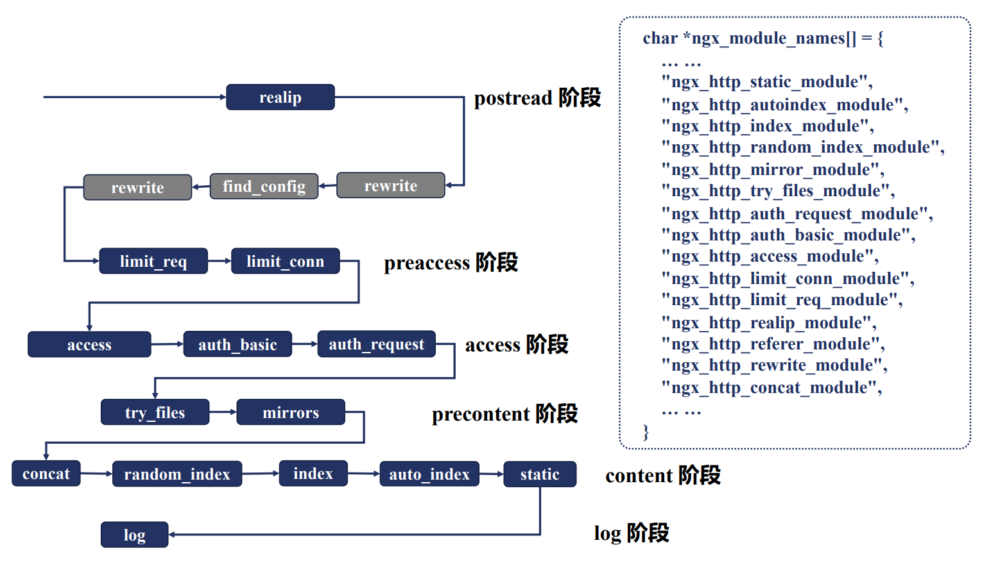


### postread 阶段

#### 获取真实客户端地址的 realip 模块

* TCP 连接四元组（src ip，src port，dst ip，dst port）
* HTTP 头部 X-Forwarded-For 用于传递 IP
* HTTP 头部 X-Real-IP 用户传递用户 IP
* 网络中存在许多反向代理


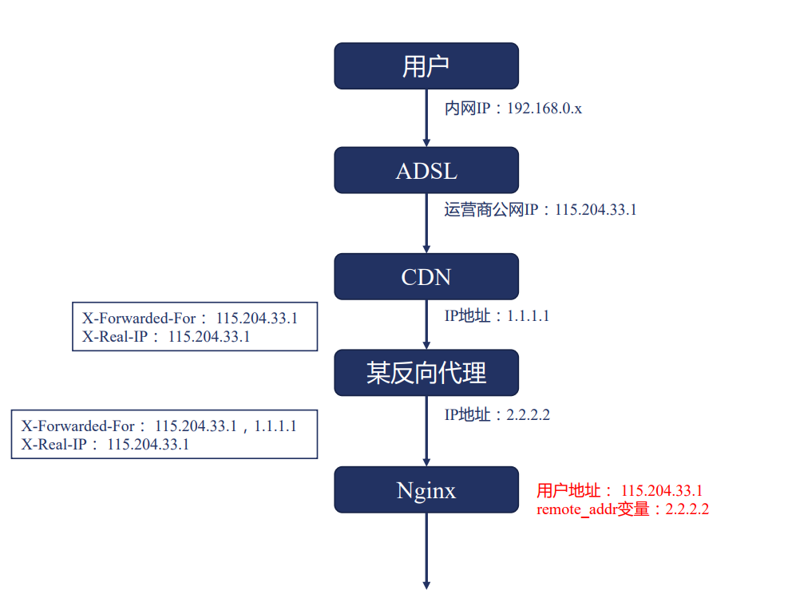


我们可以根据 X-Forwarded-For 获取到真实 IP，获取到真实 IP 之后如何使用？

答案是基于变量。像 binary_remote_addr、remote_addr 这样的变量，其值就是真实的 IP，这样做连接限制（limit_conn 模块）才有意义。

#### realip 模块

realip 模块默认不会编译进 Nginx

* 通过 --with-http_realip_module 启用功能

功能

* 修改客户端地址

变量

* realip_remote_addr
* realip_remote_port

指令

* set_real_ip_from
* real_ip_header
* real_ip_Rrcursive


```nginx
server {
    server_name realip.yueluo.club;
    
    error_log data/logs/realip/error.log dubug;
    
    set_real_ip_from xxx.xx.xxx.xxx;
    # real_ip_header X-Real_IP;
    real_ip_recursive off; # 环回地址
    # real_ip_reucrsize on;
    real_ip_header X-Forwared-For;
    	
    location / {
        return 200 "Client real ip: $remote_addr\n";
    }
}
```

### rewrite 阶段

#### return 指令


server 与 location 块下的 return 指令关系？

return 与 error_page 指令的关系？

```nginx
server {
  server_name return.yueluo.club;
  listen 8080;
    
  root html/;
  error_page 404 /403.html;
  return 403;
    
  location / {
  	return 404 "find nothing!";
  }
}
```

return 是 rewrite 提供的指令。

#### rewrite 指令


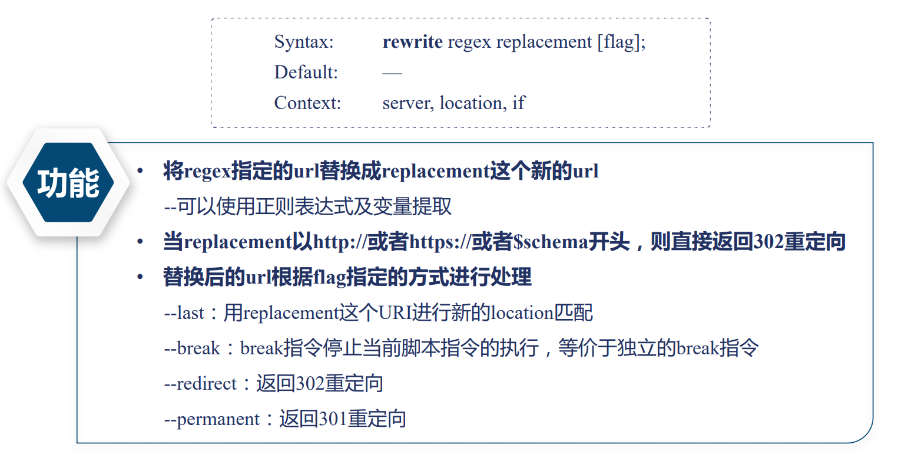


```nginx
server {
  root html/;

  location /first {
    rewrite /first(.*)/second$1 last;
    return 200 "first!";
  }

  location /second {
    rewrite /second(.*)/third$1 break;
    return 200 "second!";
  }

  location /thrid {
    return 200 "third!";
  }
}
```


```nginx
server {
  location /redirect1 {
    rewrite /redirect(.*)$1 permanent;
  }
  
  location /redirect2 {
    rewrite /redirect2(.*)$1 redirect;
  }
  
  location /redirect3 {
    rewrite /redirect3(.*) http://rewrite.yueluo.club$1;
  }
  
  location /redirect4 {
    rewrite /redirect4(.*) http://rewrite.yueluo.club$1 permanent;
  }
}
```


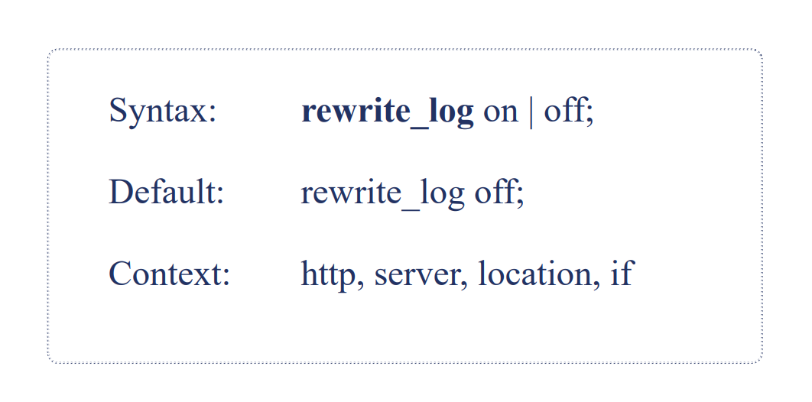

>  rewrite_on 指令默认是不打开的，如果打开会记录到 error.log 日志中。


#### 条件判断 if

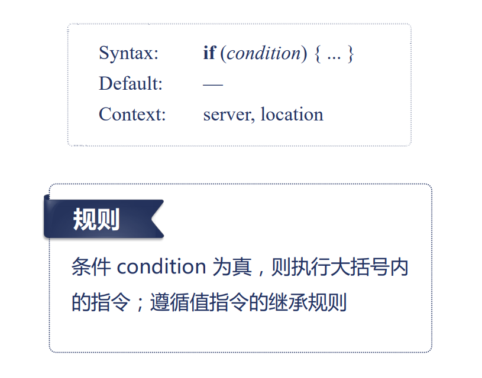

if 指令的条件表达式

* 检查变量为空或者值是否为 0，直接使用
* 将变量与字符串做匹配，使用 = 或者 !=
* 将变量与正则表达式做匹配
  * 大小写敏感，~ 或者 !~
  * 大小写不敏感，~* 或者 !~*，忽略大小写
* 检查文件是否存在，使用 -f 或者 !-f
* 检查目录是否存在，使用 -d 或者 !-d
* 检查文件、目录、软链接是否存在，使用 -e 或者 !-e
* 检查是否为可执行文件，使用 -x 或者 !-x


```nginx
if ($http_user_agent ~ MSIE) {
  rewrite ^(.*)$ /mise/$1 break;
}

if ($http_cookie ~* "id=([^;]+)()?:;|$) {
	set $id $1;
}

if ($request_method = POST) {
  return 405;
}

if ($slow) {
  limit_rate 10k;
}

if ($invalid_referer) {
  return 403;
}
```

### find_config 阶段

#### location 指令


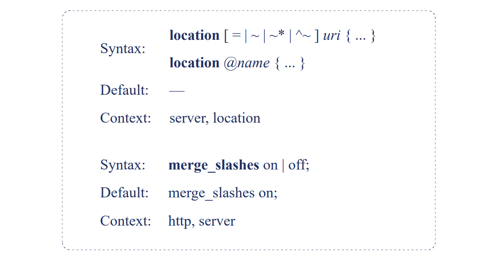

location 匹配规则：仅匹配 URI，忽略参数

* 合并连续的 / 符号
  * merge_slashes on
* 前缀字符串
  * 常规
  * =: 精确匹配
  * ^~：匹配上后则不再进行正则表达式匹配
* 用于内部跳转的命名 location
  * @
* 正则表达式
  * ~：大小写敏感的正则匹配
  * ~*：忽略大小写的正则匹配


location 匹配顺序


### preaccess 阶段

#### limit_conn

限制每个客户端的并发连接数


步骤：

* 定义共享内存（包括大小），以及 key 关键字

```js
Syntax: limit_conn_zone key zone=name:size; // 共享内存大小
Default: -
Context: http
```

* 限制并发连接数

```js
Syntax: limit_conn zone number;
Default: -
Context: http, server, location
```

* 限制发生时的日志级别

```js
Syntax: limit_conn_log_level info | notice | warn | error;
Default: limit_conn_log_level error;
Context: http, server, location
```

* 限制发生时向客户端返回的错误码

```js
Syntax: limit_conn_status code;
Default: limit_conn_status 503;
Context: http, server, location
```


```nginx
limit_conn_zone $binary_remote_addr zone=addr:10m;
# limit_conn_zone $binary_remote_addr zone=one: 10m rate=3r/s;

server {
  server_name limit.yueluo.club;
  root html/;
  error_log logs/myerror.log info;
  
  location / {
    limit_conn_status 500;
    limit_conn_log_level warn;
    limit_rate 50;
    limit_conn addr 1;
    # limit_req zone=one brust=1 nodelay;
    # limit_req zone=one;
  }
}
```

#### limit_req 

限制每个客户端的每秒处理请求数


步骤：

* 定义共享内存（包括大小），以及 key 关键字和限制速率

```js
Syntax: limit_req_zone key zone=name:size rate=rate;
Default: _;
Context: http

// rate 单位为 r/s 或者 r/m
```

* 限制并发连接数

```js
Syntax: limit_req zone=name [brust=number][nodelay];
Default: _
Context: http,server,location

// brust 默认为 0
// nodelay，对 burst 中的请求不再采用延时处理的做法，而是立即处理
```

* 限制发生时的日志级别

```js
Syntax: limit_req_log_level info | notice | warn | error;
Default: limit_req_log_level error;
Context: http, server, location
```

* 限制发生时向客户端返回的错误码

```js
Syntax: limit_red_status code;
Default: limit_red_status 503;
Context: http, server, location
```


limit_req 与 limit_conn 配置同时生效时，那个有效？

nodelay 添加与否，有什么不同？


```nginx
limit_conn_zone $binary_remote_addr zone=addr:10m;
limit_conn_zone $binary_remote_addr zone=one: 10m rate=2r/m;

server {
  server_name limit.yueluo.club;
  root html/;
  error_log logs/myerror.log info;
  
  location / {
    limit_conn_status 500;
    limit_conn_log_level warn;
    # limit_rate 50;
    # limit_conn addr 1;
    limit_req zone=one brust=1 nodelay;
    limit_req zone=one;
  }
}
```

### access 阶段

nginx_http_access_module 模块

```js
生效阶段：NGX_HTPP_ACCESS_PHASE
模块：http_access_module
默认编译进 nginx，通过 --without-http_access_module 禁用功能
生效范围：进入 access 阶段前不生效
```

#### deny/allow：限制 IP


#### auth_basic：用户名密码限制

 


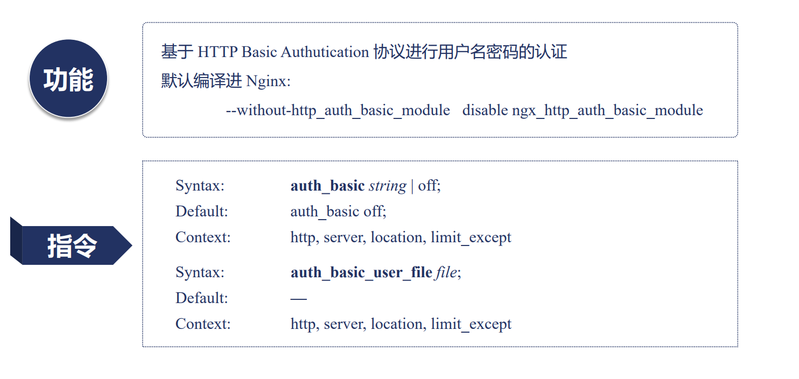

如何生成密码文件

* 文件格式

```js
# comment
name1:password1
name2:password2:comment
name3:password3
```

* 生成工具 htpasswd

```js
依赖安装包：httpd-tools
htpasswd -c file -b user pass
```


```nginx
server {
  default_type text/plain;
  
  location / {
    satisfy any;
    auth_basic "test auth_basic";
    auth_basic_user_file examples/auth.pass;
    deny all;
  }
  
  location /auth_request {
    auth_request /test_auth;
  }
  
  location = /test_auth {
    proxy_pass http://127.0.0.1:8090/auth_upstream;
    proxy_pass_request_body off;
    proxy_set_header Content-Length "";
    proxy_set_header X-Original-URI $request_uri;
  }
}
```

#### auth_request：第三方权限控制 

统一的用户权限验证系统


```nginx
server {
  location / {
    auth_request /test_auth;
  }
  
  location = /test_auth {
    proxy_pass http://127.0.0.1:8090/auth_upstream;
    proxy_pass_request_body off;
    proxy_set_header Content-Length "";
    proxy_set_header X-Original-URI $request_uri;
  }
}
```

#### satisfy 指令

satisfy 模块允许改变模块执行顺序。


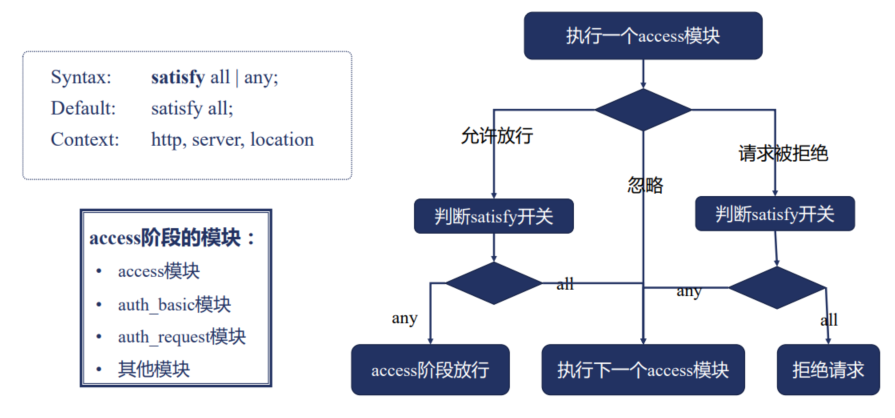


如果有 return 指令，access 阶段会生效吗？

> 不会生效，return 指令生效阶段在 rewrite 阶段，领先于 access。


多个 access 模块的顺序有影响吗？

* 查看 ngx_modules.c
  * &ngx_http_auth_request_module
  * &ngx_http_auth_basic_module
  * &ngx_http_access_module

>会。


输对密码，下面可以访问到文件吗？

```nginx
location / {
  satisfy any;
  auth_basic "test auth_basic";
  auth_basic_user_file examples/auth.pass;
  deny all;
}
```

> 可以。


如果把 deny all 提到 auth_basic 之前呢？

> 可以。


如果改为 allow all，有机会输入密码吗？

> 没有机会。

### precontent 阶段

#### try_files 指令

默认编译进 nginx 中。


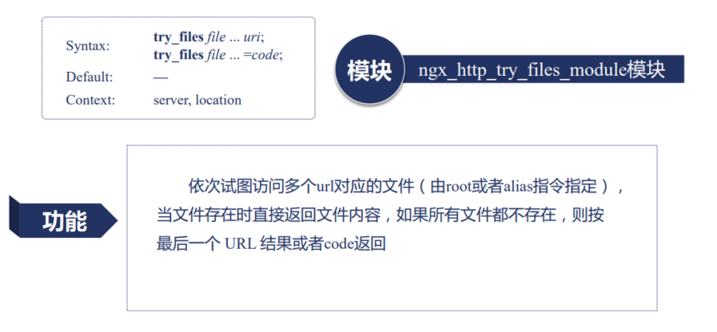

```nginx
server {
  location /first {
    try_files /system/index.html $uri $uri/index.html $uri @lasturl;
  }
  
  location @lasturl {
    return 200 'lasturl!\n';
  }
  
  location /second {
    try_files $uri $uri/index.html $uri.html = 404;
  }
}
```

#### mirror 模块：实时拷贝流量


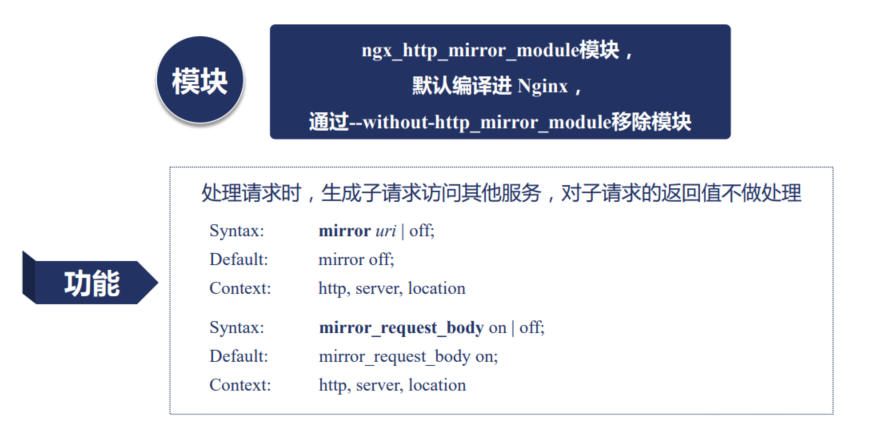


```nginx
server {
  listen 10020;
  location / {
    return 200 'mirror response!';
  }
}

server {
  listen 8081;
  error_log data/error.log debug;
  
  location / {
    mirror /mirror;
    mirror_request_body off;
  }
  
  location = /mirror {
    internal; # 内部请求
    proxy_pass http://127.0.0.1:10020$request_uri;
    proxy_pass_request_body off;
    proxy_set_header Content-Length "";
    proxy_set_header X-Original-URI $request_uri;
  }
}
```

### content 阶段

#### static 模块

##### root 和 alias 指令

都会用于把 URL 映射为文件，返回静态资源。

不过 root 会将完整 URL 映射进文件路径中，alias 只会将 location 后的 URL 路径映射到文件路径中。


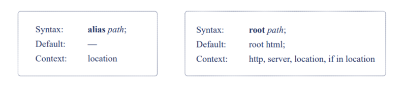


root 使用范围更广，且具有默认值。


```nginx
location /root {
  root html;
}

location /alias {
  alias html;
}

location ~/root/(\w+\.txt) {
  root html/first/$1;
}

location ~ /alias/(\w+\.txt) {
  alias html/first/$1;
}
```

##### 三个 nginx 变量

当我们访问一个 URI 文件时，会生成三个相关变量。

* request_filename：待访问文件的完整路径
* document_root：由 URI 和 root/alias 规则生成的文件夹路径
* realpath_root：将 document_root 中的软链接等换成真实路径

```nginx
location /RealPath/ {
  alias html/realpath/;
  return 200 '$request_filename:$document_root:$document_root:$realpath_root\n';
}
```

##### 静态文件返回的 content-type


##### 未找到文件的错误日志


可以关闭文件获取不到的错误日志。


##### url 不以斜杠结尾访问目录

访问目录时 URL 最后没有带 / ?

> static 模块实现了 root/alias 功能，发现访问目标时目录，但 URL 末尾加 / 时，会返回 301 重定向


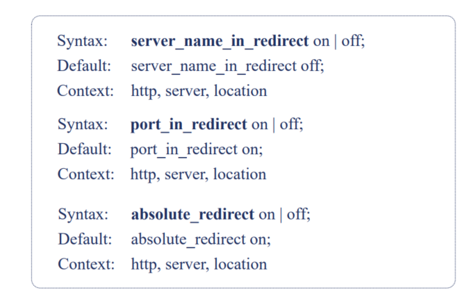


```nginx
server {
  server_name return.yueluo.club dir.yueluo.club;
  server_name_in_redirect off;
  listen 8088;
  port_in_redirect on;
  absolute_redirect off;
  
  root html/;
}
```

#### index、autoindex 模块


访问 / 时的处理


显示目录内容：content 阶段的 autoindex 模块


autoindex 模块的指令


```nginx
server {
  server_name autoindex.yueluo.club;
  listen 8080;
  
  location / {
    alias html/;
    autoindex on;
    # index a.html
    autoindex_exact_size off;
    autoindex_format json;
    autoindex_localtime on;
  }
}
```

#### concat 模块：提升多个小文件性能


concat 模块的指令


```nginx
server {
  server_name concat.yueluo.club;
  
  error_log logs/error.log debug;
  concat on;
  root html;
  
  location /concat {
    concat_max_files 20;
    concat_types text/plain;
    concat_unique on;
    concat_delimiter ':::'; # ::: 来分割多个文件
    concat_ignore_file_error on;
  }
}
```

### log 阶段

#### log 模块：记录请求访问日志

功能：将 HTTP 请求相关信息记录到日志

模块：ngx_http_log_module 无法禁用


 access 日志格式


配置日志文件路径


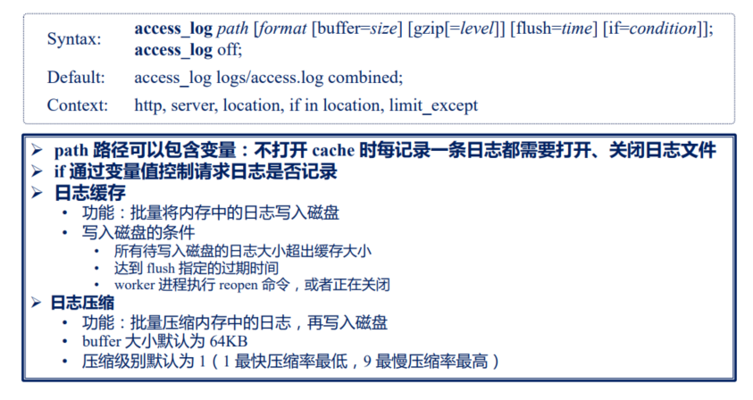


日志文件名包含变量时的优化


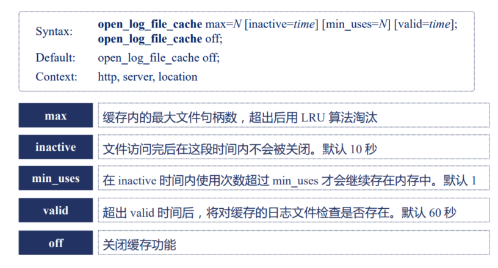


### HTTP 过滤模块

介于 content 模块之后，log 模块之前介入请求处理。


返回响应-加工响应内容


#### sub 模块


替换响应中的字符串：sub 模块。ngx_http_sub_filter_module。


sub 模块的指令。


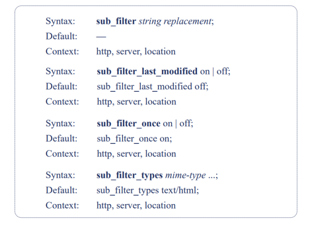


sub_fillter_last_modified：是否显示修改之前的 last_modified 内容，默认是关闭的。

sub_filter_once：只替换一次

sub_filter_types：针对什么类型进行替换，默认是 text/html。


```nginx
server {
  server_name sub.yueluo.club;
  error_log logs/error.log info;
  
  location / {
    # sub_filter 'Nginx.oRg' '$host/nginx';  # 替换时忽略大小写
    # sub_filter 'nginx.cOm' '$host/nginx';
    # sub_filter_once on;
    # sub_filter_once off;
    # sub_filter_last_modifed off;
    # sub_filter_last_modifed on;
  }
}
```


#### addition 模块


响应前或者响应后增加内容。


addition 模块的指令。


```nginx
server {
  server_name addition.yueluo.club;
  error_log logs/error.log info;
  
  location / {
    add_before_body /before_action;
    add_after_body /after_action;
    addition_types *;
  }
  
  location /brefore_action {
    return 200 'new content before\n';
  }
  
  location /after_action {
    return 200 'new content after\n';
  }
  
  location /testhost {
    uninitialized_variable_warn on;
    set $foo 'testhost';
    return 200 '$gzip_ratio\n';
  }
}
```


### Nginx 变量的运行原理

#### 惰性求值


#### 变量的特性

* 惰性求值
* 变量值可以时刻变化，其值为使用的那一刻的值


### HTTP 框架提供的请求相关的变量

* HTTP 请求相关的变量
* TCP 连接相关的变量
* Nginx 处理请求过程中产生的变量
* 发送 HTTP 响应时相关的变量
* Nginx 系统变量

#### HTTP 请求相关的变量

| 参数              | 参数含义                                                     |
| ----------------- | ------------------------------------------------------------ |
| arg_参数名        | URL 中某个具体参数的值                                       |
| query_string      | 与 args 变量完全相同                                         |
| args              | 全部 URL 参数                                                |
| is_args           | 如果请求 URL 中有参数则返回 ？否则返回空                     |
| content_length    | HTTP 请求中标识包体长度的 Content-Length 头部的值            |
| content_type      | 标识请求包体类型的 Content-Type 头部的值                     |
| uri               | 请求的 URI （不同于 URL，不包括 ？后的参数）                 |
| document_uri      | 与 uri 完全相同                                              |
| request_uri       | 请求的 URL（包括 URI 以及完整的参数）                        |
| scheme            | 协议名，例如 HTTP 或者 HTTPS                                 |
| request_method    | 请求方法，例如 GET 或者 POST                                 |
| request_length    | 所有请求内容的大小，包括请求行、头部、包体等                 |
| remote_user       | 由 HTTP Basic Authentication 协议传入的用户名                |
| request_body_file | 临时存放请求包体的文件（如果包体非常小不会存文件、client_body_in_file_body 强制所有包体存入文件，且可以决定是否删除） |
| request_body      | 请求中的包体，这个变量当且仅当使用反向代理，且设定用内存暂存包体时才有效 |
| request           | 原始的 url 请求，含有方法与协议版本，例如 GET /?a=1&b=22 HTTP/1.1 |
| host              | 先从请求行中获取，如果含有 Host 头部，则用其值替换掉请求行中的主机名，如果前两者都取不到，则使用匹配上的 server_name |
| http_头部名字     | 返回一个具体请求头部的值（特殊：http_host、http_user_agent、http_referer、http_via、http_x_forward_for、http_cookie） |

#### TCP 连接相关的变量


| 参数                | 参数含义                                                     |
| ------------------- | ------------------------------------------------------------ |
| binary_remote_addr  | 客户端地址的整型格式，对于 IPv4 是 4 字节，对于 IPv6 是 16 字节 |
| connection          | 递增的连接序号                                               |
| connection_requests | 当前连接上执行过的请求数，对 keepalive 连接有意义            |
| remote_addr         | 客户端地址                                                   |
| remote_port         | 客户端端口                                                   |
| proxy_protocol_addr | 若使用 proxy_protocol 协议则返回协议中的地址，否则返回空     |
| proxy_protocol_port | 若使用 proxy_protocol 协议则返回协议中的端口，否则返回空     |
| server_addr         | 服务端地址                                                   |
| server_port         | 服务端端口                                                   |
| TCP_INFO            | tcp 内核层参数，包括 $tcpinfp_rtt，$tcpinfo_rttvar，$tcpinfo_snd_cwnd，$tcpinco_rcv_space |
| server_protocol     | 服务端协议，例如 HTTP/1.1                                    |

#### Nginx 处理请求过程中产生的变量


| 参数              | 参数含义                                                     |
| ----------------- | ------------------------------------------------------------ |
| request_time      | 请求处理到现在的耗时，单位为秒，精确到毫秒                   |
| server_name       | 匹配上请求的 server_name 值                                  |
| https             | 如果开启了 TLS/SSL ，则返回 on，否则返回空                   |
| request_competion | 如请求处理完则返回 OK，否则返回空                            |
| request_id        | 以 16 进制输出的请求标识 id，该 id 共含有 16 个字节，是随机生成的 |
| request_filename  | 待访问文件的完整路径                                         |
| document_root     | 由 URI 和 root/alias 规则生成的文件夹路径                    |
| realpath_root     | 将 document_root 中的软链接等换成真实路径                    |
| limit_rate        | 返回客户端响应时的速度上限，单位为每秒字节数。可以通过 set 指令修改对请求产生效果 |


#### 发送 HTTP 响应时相关的变量

| 参数               | 参数含义                                                     |
| ------------------ | ------------------------------------------------------------ |
| body_bytes_sent    | 响应中 body 包体的长度                                       |
| byte_sent          | 全部 http 响应的长度                                         |
| status             | http 响应中的返回码                                          |
| sent_trailer_名字  | 把响应结尾内容里值返回                                       |
| request_id         | 以 16 进制输出的请求标识 id，该 id 共含有 16 个字节，是随机生成的 |
| sent_http_头部名字 | 响应中某个具体头部的值                                       |

特殊处理：

* sent_http_content_type
* sent_http_content_length
* sent_http_location
* sent_http_last_modified
* sent_http_connection
* sent_http_keep_alive
* sent_http_transfer_encoding
* sent_http_cache_control
* sent_http_link

#### Nginx 系统变量

| 参数          | 参数含义                                                    |
| ------------- | ----------------------------------------------------------- |
| time_local    | 以本地时间标准输出的当前时间                                |
| time_iso8601  | 使用 ISO 8601 标准输出的当前事件                            |
| nginx_version | Nginx 版本号                                                |
| pid           | 所属 worker 进程的进程 id                                   |
| pipe          | 使用了管道则返回 p，否则返回 .                              |
| hostname      | 所在服务器的主机名，与 hostname 命令输出一致                |
| msec          | 1970 年 1 月 1 日到现在的时间，单位为秒，小数点后精确到毫秒 |

### referer 模块：变量防盗链

#### referer 模块

场景：某网站通过 url 引用了你的页面，当用户在浏览器上点击 url 时，http 请求的头部中会通过 referer 头部，将该网站当前页面的 url 带上，告诉服务器本次请求是否这个页面发起的。

目的：拒绝非正常的网站访问我们站点的资源

思路：通过 referer，用 invalid_referer 变量根据配置判断 referer 头部是否合法

referer 模块：默认编译进 Nginx，通过 --without-http_referer_module 禁用

#### referer 模块的指令


#### valid_referers 指令

可同时携带多个参数，表示多个 referer 头部都生效


### secure_link：变量实现防盗链

#### secure 模块


#### 变量值及带过期时间的配置

变量

* secure_link
  * 值为空字符串：验证不通过
  * 值为 0：URL 过期
  * 值为 1：验证通过
* secure_link_expires
  * 时间戳的值


```nginx
server {
  location / {
    secure_link $arg_md5,$arg_expires;
    secure_link_md5 "$secure_link_expires$uri$remote_addr secret";
    
    if ($secure_link = '0') {
      return 410;
    }
    
    return 200 '$secure_link:$secure_link_expires\n';
  }
}
```

#### 仅对 URI 进行哈希

* 将请求 URL 分为三部分，`/prefix/hash/link`
* Hash 生成方式
  * 对 “link 密钥” 做 md5 哈希值
* 用 secure_link_secret secret; 配置密钥


```nginx
server {
  location /p/ {
    secure_link_secret mysecret2;
    
    if ($secure_link = " ") {
      return 403;
    }
    
    rewrite ^ /secure/$secure_link;
  }
  
  location /secure/ {
    alias html/;
    internal;
  }
}
```

### map 模块：为复杂业务生成新变量

可以根据一个或者多个变量组合而成的值做判断，修改新的变量的值，通过判断新变量的值实现复杂的业务逻辑。


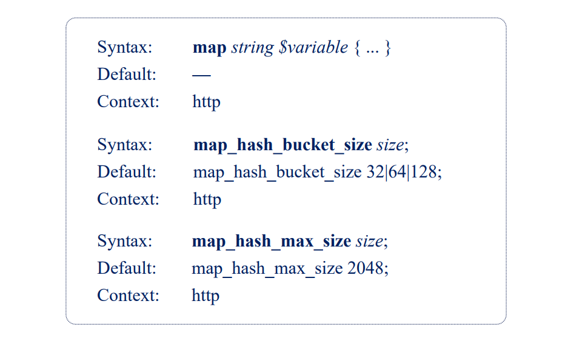


```nginx
map $http_host $name {
  hostnames;
    default       0;
  ~map\.tao\w+\.org.cn 1; *.taohui.org.cn   2; map.taohui.tech   3; map.taohui.*    4;
}

map $http_user_agent $mobile { 
  default       0;
  "~Opera Mini" 1; 
}

server {
  listen 8080;
  default_type text/plain;
  
  location / {
    return 200 '$name:$mobile\n';
  }
}
```

### split_client 模块：指定少量用户实现 AB 测试


```nginx
split_clients "${http_testcli}" $variant {
  0.51% .one;
  20.0% .two;
  50.5% .three;
  # 40%   .four; 超过 100 不能访问
  *     "";
}

server {
  server_name split_clients.yueluo.club;
  error_log logs/error.log debug;
  default_type text/plain;;
  
  location / {
  	rteurn 200 'ABtestfile$variant\n';  
  }
}
```

```js
curl -H 'testcli: 213213231adadasdad' split_clients.yueluo.club
```

### geo 模块：根据 IP 范围的匹配生成新变量


```nginx
geo $country {
  default        ZZ;
  # include        conf/geo.conf;
  proxy          116.62.160.193;
  
  127.0.0.0/24   US;
  127.0.0.1/32   RU;
  10.1.0.0/16    RU;
  192.168.1.0/24 UK; 
}

server {
  server_name geo.yueluo.club;
  
  location / {
    return 200 '$country\n';
  }
}
```

### geoip 模块：获取用户地理位置

##### 基于 MaxMind 数据库从客户端获取变量


#### geoip_country 指令提供的变量


#### geoip_city 指令提供的变量


maxmind 网站，下载 c 语言代码库和地址库，对它进行编译。

```nginx
geoip_country /usr/local/share/GeoIP/GeoIP.dat;
geoip_city /usr/local/share/GeoIP/GeoLiteCity.dat;
geoip_proxy 116.62.160.193/32;
geoip_proxy_recursize on;

server {
  location / {
    return 200 'country:$geoip_country_code'
  }
}
```

```js
curl -H 'X-Forwarded-For: ip' geoip.yueluo.club
```

### 对客户端使用 keeplive 提升连接效率

http 协议的 keepalive，不是指 tcp 协议的 keepalive。


## 四、反向代理与负载均衡

## 五、Nginx 系统层性能优化

## 六、深入使用 Nginx 与 OpenResty