# Nginx 核心知识

## 一、Nginx 基础

### 概述

#### 主流 Web 服务器

Nginx、Apache、Tomcat。

#### Nginx 的优点

2014 发展至今。

* 高并发，高性能
* 可扩展性好
* 高可靠性
* 热部署
* BSD 许可证

### Nginx 应用场景

* 静态资源托管
  * 通过本地文件系统提供服务
* 反向代理服务
  * Nginx 的强大功能
  * 缓存
  * 负载均衡
* API 服务
  * OpenResty


### Nginx 历史背景

* 互联网的数据量快速增长
  * 互联网的快速普及
  * 全球化
  * 物联网
* 摩尔定律：性能提升
* 低效的 Apache
  * 一个连接对应一个进程

### Nginx 优点

* 高并发，高性能
* 可扩展性好
* 高可靠性
* 热部署
* BSD 许可证

### Nginx 组成部分

* Nginx 二进制可执行文件
  * 由各模块源码编译出的一个文件
* Nginx.conf 配置文件
  * 控制 Nginx 的行为
* access.log 访问日志
  * 记录每一条 http 请求信息
* error.log 错误日志
  * 定位问题

### Nginx 版本发布历史

nginx 版本发布情况（mainline）。2002 年开发时间，2004 推出第一个版本。


https://nginx.org/en/download.html。

### Nginx 发行版本选择

开源免费的 Nginx 与商业版 Nginx Plus。

开源版：nginx.org

商业版：nginx.com


阿里巴巴的 Tengine，http://tengine.taobao.org/。

> Tengine是由淘宝网发起的Web服务器项目。它在[Nginx](http://nginx.org/)的基础上，针对大访问量网站的需求，添加了很多高级功能和特性。Tengine的性能和稳定性已经在大型的网站如[淘宝网](http://www.taobao.com/)，[天猫商城](http://www.tmall.com/)等得到了很好的检验。它的最终目标是打造一个高效、稳定、安全、易用的Web平台。
>
> 从2011年12月开始，Tengine成为一个开源项目，Tengine团队在积极地开发和维护着它。Tengine团队的核心成员来自于[淘宝](http://www.taobao.com/)、[搜狗](http://www.sogou.com/)等互联网企业。Tengine是社区合作的成果，我们欢迎大家[参与其中](http://tengine.taobao.org/source_cn.html)，贡献自己的力量。


免费 OpenResty 与商业版 OpenRestry

开源 OpenRestry：http://openresty.org。

> OpenResty® 是一个基于 [Nginx](http://openresty.org/cn/nginx.html) 与 Lua 的高性能 Web 平台，其内部集成了大量精良的 Lua 库、第三方模块以及大多数的依赖项。用于方便地搭建能够处理超高并发、扩展性极高的动态 Web 应用、Web 服务和动态网关。
>
> OpenResty® 通过汇聚各种设计精良的 [Nginx](http://openresty.org/cn/nginx.html) 模块（主要由 OpenResty 团队自主开发），从而将 [Nginx](http://openresty.org/cn/nginx.html) 有效地变成一个强大的通用 Web 应用平台。这样，Web 开发人员和系统工程师可以使用 Lua 脚本语言调动 [Nginx](http://openresty.org/cn/nginx.html) 支持的各种 C 以及 Lua 模块，快速构造出足以胜任 10K 乃至 1000K 以上单机并发连接的高性能 Web 应用系统。

商业版 OpenResty：https://openresty.com。

> 技术支持比较好。


### 编译适合自己的 Nginx

#### 下载 Nginx

https://nginx.org

download

Mainline version、Stable version

下载稳定版。

```js
wget https://nginx.org/download/nginx-1.20.1.tar.gz
tar -xzf nginx-1.20.1.tar.gz
cd nginx-1.20.1
```

#### 目录介绍

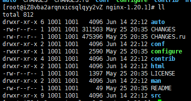

* auto 
  * cc 编译
  * lib
  * os
  * types
* CHANGES：Nginx 每个版本中提供提供的特性和修复的 BUG
* CHANGES.ru：俄罗斯版本的 CHANGEES 文件，作者是俄罗斯的
* conf 示例文件
* configure：脚本，生成中间文件，执行编译前的必备动作
* contrib：提供脚本和 VIM 工具
  * cp -r contrib/vim/* ～/.vim/	可以使 vim 支持 nginx 语法
* html：提供标准 HTML 文件，500 错误文件与默认 nginx 欢迎界面
* main：linux 对 nginx 的帮助文件
* src：Nginx 源代码

#### Configure

```js
./configure --help | more // 查看帮助文件
```

默认参数编译

```js
./configure --prefix=/data/nginx
```

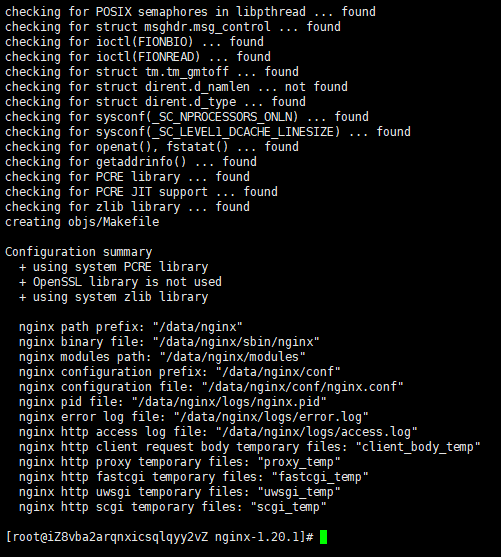

#### 中间文件介绍


objs

* ngx_modules.c：决定 nginx 编译时有哪些模块会被编译进 nginx

* src

#### 编译

```js
make // 编译
```

编译结束后，会在 objs 目录下生成大量二进制文件。

> c 语言编译时生成的所有的中间文件都会放到 src 目录

nginx 版本升级时，需要将 objs 目录下的文件拷贝到安装目录中。

如果我们使用动态模块，动态模块会生成 so 动态文件，也会放到 objs 目录下。

#### 安装

```js
make install // 首次安装时可以使用此命令
```

安装完成后可以去指定目录查看。


sbin：nginx 二进制文件

config：和源代码中配置文件相同，决定 nginx 功能文件

logs：日志文件

### 配置文件的通用语法介绍

#### 基础语法

* 配置文件由指令与指令块组成
* 每条指令以 ；分号结尾，指令与参数间以空格符号分割
* 指令块以 {} 大括号将多条指令组织在一起
* include 语句允许组合多个配置文件以提升可维护性
* 使用 # 符号添加注释，提高可读性
* 使用 $ 符号使用变量
* 部分指令的参数支持正则表达式

#### 配置参数：时间单位

```js
ms milliseconds
d days
s seconds
w weeks
m minutes
M months, 30 days
h hours
y years, 365 days
```

#### 配置参数：空间单位

```js
bytes
k/K kilobytes
m/M megabytes
g/G gigabytes
```

#### http 配置的指令块

http：表示内部所有执行由 http 解析并执行

server：定义域名或者一组域名

location：url 表达式

upstream：上游服务，nginx 需要与 tomcat 等其他服务交互时，我们可以定义 upstream

### 命令行：重载、热部署、日志切割

#### linux 命令行

* 格式：nginx -s reload
* 帮助：-?	-h
* 使用指定的配置文件：-c
* 指定配置指令：-g
* 指定运行目录：-p
* 发送信号：-s
  * 立刻停止服务：stop
  * 优雅的停止服务：quit
  * 重载配置文件：reload
  * 重新开始记录日志文件：reopen
* 测试配置文件是否有语法错误：-t、-T
* 打印 nginx 的版本信息、编译信息等：-v、-V

#### 重载配置文件

```js
./nginx -s reload // 不停止服务的情况下，重新载入配置文件
```

#### 热部署

```js
ps -ef | grep nginx // 查看进程状况
```

```js
// 备份现有二进制文件
cp nginx nginx.old

// 替换正在运行的二进制文件
cp -r nginx /data/nginx/sbin/ -f 

// 向 master 进程发送信号
kill -USR2 13195

// 向老的进程发送关闭信号（关闭 work 进程，老的 master 进程还可以重新拉起 worker 进程）
kill -WINCH 13195
```

#### 日志切割

```js
mv blog.log blog.bak.log

./nginx -s reopen
```

```js
// bash 脚本

crontab -l
```

### 搭建静态资源 Web 服务器

ngx_http_gzip_module

* Embeded Variables
  * $gzip_ratio 表示当时使用的压缩比率

autoindex  module

> 当我们访问以  “/”  结尾的 url 时，当我们对应到这个目录中，显示这个目录的结构

ngx_http_core_module

* Embeded Variables
  * $limit_rate	限制响应速度
  * $content_length 记录请求头部长度
  * 。。。

```nginx
server {
  listen 8080;
  server_name test.yueluo.club;
  
  gzip on; # 压缩
  gzip_min_length 1; # 小于多少字节就不再压缩
  gzip_comp_level 2; # 压缩级别
  gzip_types text/plain application/X-javascript text/css image/jpeg; # 压缩类型
	
  location / {
    alias www/project/; 
    # / 代表所有请求
    # 通常使用 alias，root 会携带路径
    # 这里就是说 project 目录下后面的路径和 url 是一一对应的
    autoindex on; # 显示文件结构，当路径是一个文件时
    
    set $limit_rate 1k; # 限制 nginx 向客户端浏览器发送响应的速度，每秒传输多少字节到浏览器中
    
  }
}
```

日志相关

```nginx
http {
  # 命名 main，方便对不同的 url 或者域名做不同的处理
  log_format main '$remote_addr - $remote_user [$time_local] "$request" '
                  '$status $body_bytes_sent "$http_referer" '
                  '"$http_user_agent" "$http_x_forwarded_for"'
}
```

```nginx
server {
  listen 8080;
  server_name test.yueluo.club;
  
  access_log data/logs/test/access.log main; # 使用 main 的日志格式，定义输出目录
  
  gzip on; # 压缩
  gzip_min_length 1; # 小于多少字节就不再压缩
  gzip_comp_level 2; # 压缩级别
  gzip_types text/plain application/X-javascript text/css image/jpeg; # 压缩类型
	
  location / {
    alias www/project/; 
    # / 代表所有请求
    # 通常使用 alias，root 会携带路径
    # 这里就是说 project 目录下后面的路径和 url 是一一对应的
    autoindex on; # 显示文件结构，当路径是一个文件时
    
    set $limit_rate 1k; # 限制 nginx 向客户端浏览器发送响应的速度，每秒传输多少字节到浏览器中
    
  }
}
```

### 搭建具备缓存功能的反向代理服务

listen 8080

listen 127.0.0.1:8080 表示只能本机访问 8080 端口

```nginx
server {
  listen 127.0.0.1:8080;
}
```


搭建反向代理服务

ngx_http_proxy_module

* proxy_cache	nginx 性能领先于上游服务器性能，使用 cache 对小的站点会有非常大的性能提升

```nginx
http {
  # 缓存文件相关参数配置
  proxy_cache_path /tmp/nginxcache levels=1:2 keys_zone=my_cache:10m max_size:10g inactive=60m use_temp_path=off; 
}
```

```nginx
upstream local {
  server 127.0.0.1:8080;
}

server {
  listen 80;
  server_name test.yueluo.club;
  
  location / {
    proxy_set_header Host $host;
    proxy_set_header X-Real-IP $remote_addr;
    proxy_set_header X-Forwarded-For $proxy_add_x_forwared_for;
    
    proxy_cache my_cache;
    proxy_cache_key $host$uri$is_args$args;
    proxy_cache_valid 200 304 302 1d;
    
    proxy_pass http://local;
  }  
}
```

### GoAccess 实现日志可视化

https://goaccess.io

```js
goaccess access.log -o report.html --log-format=COMBINED
```

```js
goaccess access.log -o ../html/report.html --real-time-html --time-format='%H:%M:%S' --date-format='%d/%b/%Y' --log-format=COMBINED
```

```nginx
server {
	access_log logs/access.log main;
  
  location /report.html {
    alias /data/log/blog/report.html
  }
}
```

### 从网络原理来看 SSL 安全协议


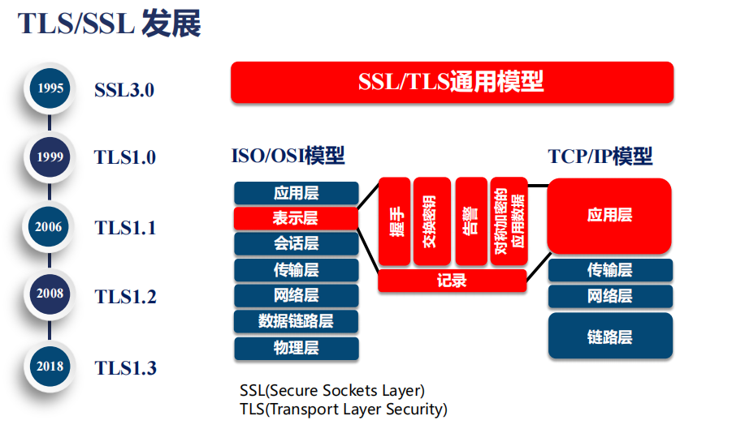


### 对称加密与非对称加密

#### 对称加密


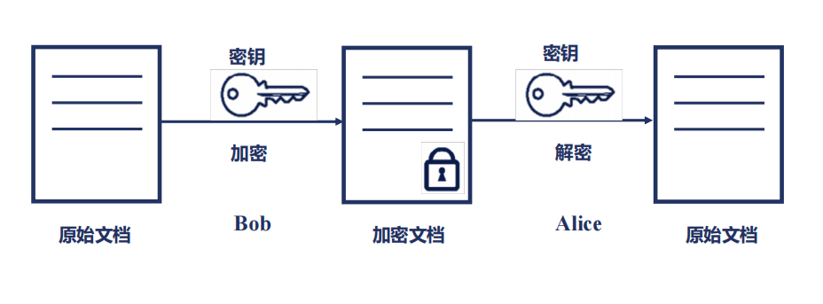


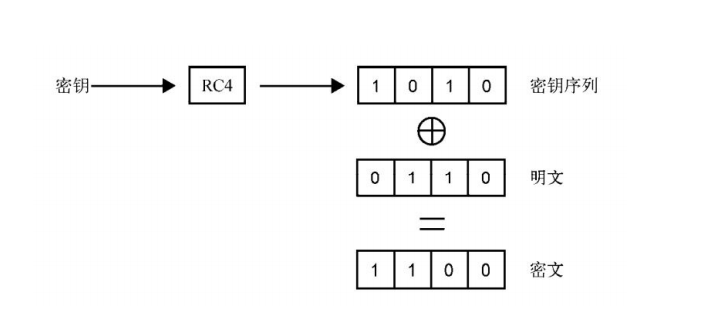


#### 非对称加密


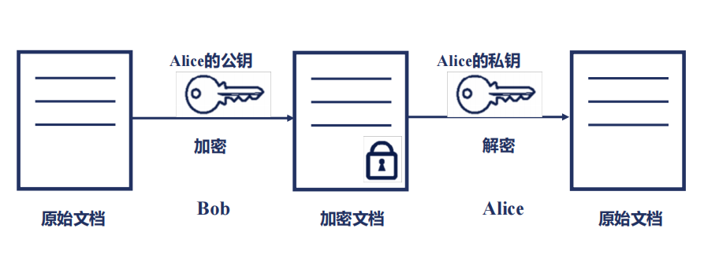

### SSL 如何保证公信力

#### PKI 公钥基础设施

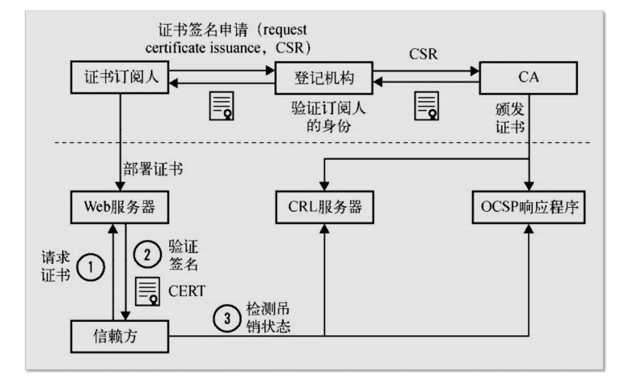

#### 证书类型


#### 证书链


### SSL 协议握手的 Nginx 性能瓶颈

#### TLS 通讯过程


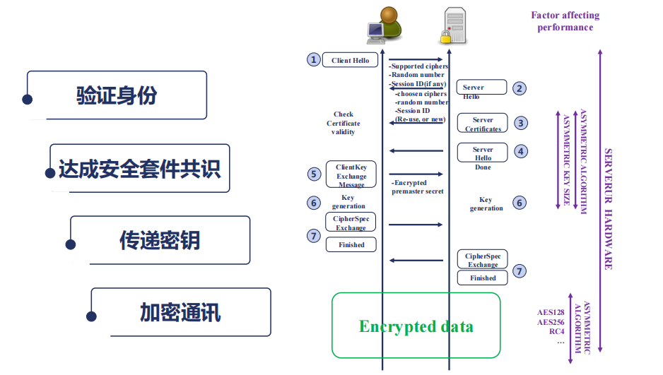

#### Nginx 握手性能


#### Nginx 数据加密性能


#### Nginx 综合性能


### 免费 SSL 证书实现一个站点

```jsx
yum install python2-certbot-nginx 

yum install certbot // 最新
```

```js
certbot --nginx --nginx-server-root=/etc/nginx/conf/ -d music.yueluo.club
```

### 基于 OpenResty 实现简单服务

#### 下载 OpenResty

https://openresty.org/cn/

> OpenResty® 是一个基于 [Nginx](https://openresty.org/cn/nginx.html) 与 Lua 的高性能 Web 平台，其内部集成了大量精良的 Lua 库、第三方模块以及大多数的依赖项。用于方便地搭建能够处理超高并发、扩展性极高的动态 Web 应用、Web 服务和动态网关。

下载页面：https://openresty.org/cn/download.html

通常我们不会下载二进制版本，我们需要下载源码，复制其下载链接

```js
wget https://openresty.org/download/openresty-1.19.3.2.tar.gz
```

#### 分析目录结构

* build 编译生成的目标文件

* bundle 模块文件，基于 nginx 二次开发
  * nginx c 模块
  * lua 模块

* configure
  * ./configure --help 帮助命令

* patches

* util

#### 编译

```js
./configure

make
```

#### 添加 lua 代码

```js
vim nginx.conf
```

```nginx
server {
  location /lua {
    default_type text/html;
    # http 请求内容生成阶段用 lua 处理
    content_by_lua 'ngx.say("User-Agent: ", ngx.req.get_headers()["User-Agent"])'
  }
  
  location / {
    alias html/music/;
  }
}
```

#### 运行

```js
nginx -s reload
```

## 二、Nginx 架构基础

### Nginx 的请求处理流程


### Nginx 的进程结构

* 单进程结构
  * 不适合生产环境，只适合开发，调试
* 多进程结构


多进程模型

* nginx 需要保持高可用性和高可靠性，所以不能使用线程，线程之间存在共享空间
* master 进程中通常不会加入第三方模块代码
  * master 主要是用来做进程管理，处理 worker 进程
  * 缓存需要被 worker 进程使用，也要被 Cache manager 进程使用
* woker 进程为什么很多
  * nginx 采用事件驱动模型之后，希望每个 worker 进程从头到尾占用一个 CPU，可以更好地使用 CPU 缓存


```js
ps -ef | grep nginx // 查看 nginx 进程
```

```js
nginx -s reload // 重载 nginx 服务，会重新开启新的 worker 子进程和 Cache manager 进程
kill -SIGHUP 9170 // SIGHUP 信号和 reload 作用是一致的
```

```js
kill -SIGTERM 9862 // 退出子进程，子进程会通知父进程，父进程会重启一个子进程
```

### 信号管理 Nginx 父进程

Master 进程

* TERM 立刻停止 Nginx 进程

* QUIT 优雅的停止 Nginx 进程

* HUP 重载配置文件

* USR1 重新打开日志文件，进行日志文件切割

* 以上 4 个命令可以通过命令行向 master 进程发送

  

* USR2 

* WINCH

* 以上 2 个命令只能通过 kill linux 命令行向 master 进程发送


> 调用 Nginx 命令行发送相应命令本质是也是发送信号指令。

### reload 重载配置文件的原理


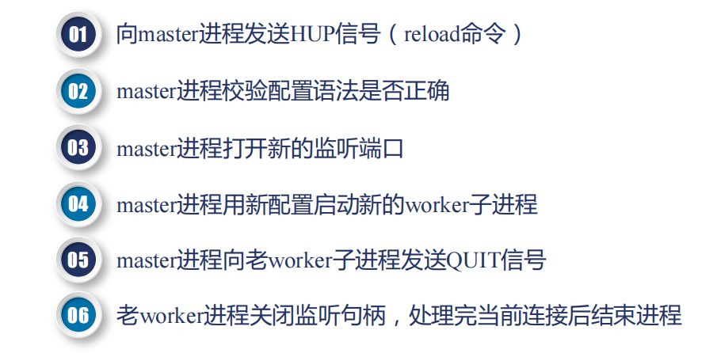


老进程由于异常导致无法正常关闭，这时可以配置 worker_shutdonwn_timeout 最长等待时间，master 开启子进程之后会开启定时器，如果定时时间到达之后，老的 workder 进程还没有关闭，会强制关闭。

### 热升级的完整流程

替换 Nginx 文件：替换 bundary 文件。


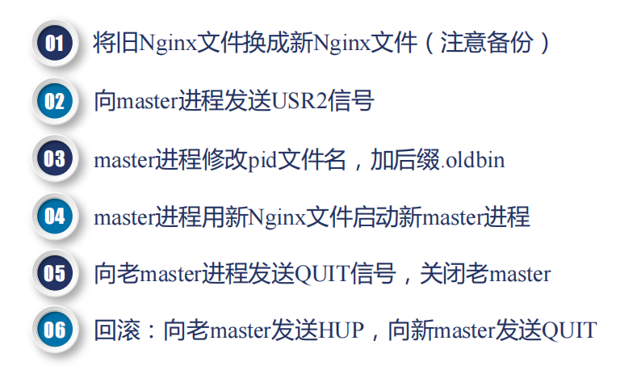


### 优雅地关闭 worker 进程

```js
nginx -s reload // 优雅关闭
nginx -s stop // 立即关闭
```

优雅关闭是对 worker 进程 的 http 请求 而言的。

当老进程进行 WebSocket 通信时，或者进行 TCP 请求时，nginx 不知道什么时候应该关闭。


### 网络收发与 Nginx 事件间的对应关系

Nginx 是一个事件驱动的框架，这里的事件指的是网络事件。

#### 网络传输


#### TCP 与报文


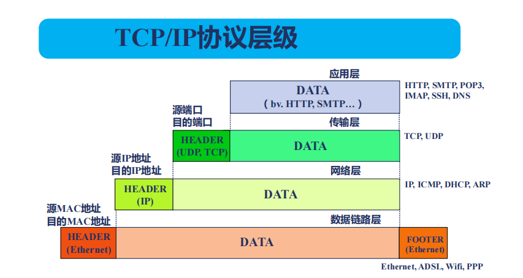


#### TCP 协议与非阻塞接口

事件收集、分发器，我们会定义每个事件对应的消费者。


### Nginx 的事件驱动模型


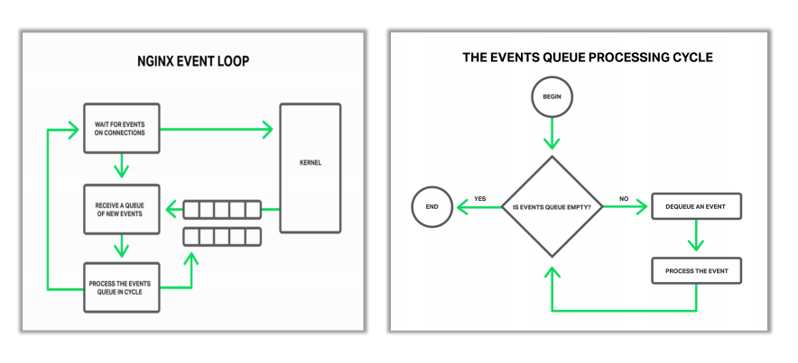

### epoll 的优势及原理


### Nginx 的事件切换


### 同步，异步、阻塞与非阻塞

阻塞和非阻塞主要是指操作系统或者底层 C 库提供的方法或者系统调用，调用方法是否会导致进程进程 sleep 状态。

#### 阻塞调用


#### 非阻塞调用


#### 非阻塞调用下的同步与异步


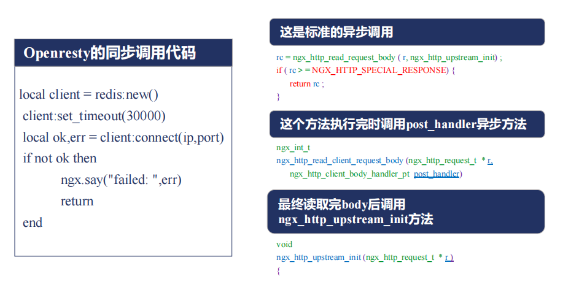

### Nginx 的模块

https://nginx.org/en/docs 官方文档。

我们可以从官方文档或者编译出的 nginx 源码来查看具体使用方式。


Nginx 模块定义：

* ngx_module_t 是每一个模块都具备的
  * type 定义模块类型

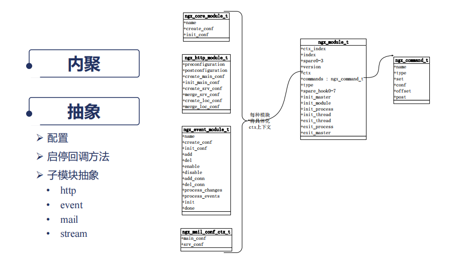


### Nginx 模块的分类

* ngx_conf_module：解析 Nginx conf 文件

* 核心模块
  * http
    * ngx_http_core_module
    * 请求过滤模块
    * 响应过滤模块
  * cvcnts
  * strcam


### Nginx 如何通过连接池处理网络请求

。。。。

## 三、HTTP 模块

### 冲突的配置指令以谁为准

#### 配置块嵌套

```nginx
main
http {
  upstream {...}
  split_clients {...}
  map {}
  geo {}
  
  server {
    if () {}
    location {
      limit_except {...}
    }
    location {
      location {
        
      }
    }
  }
  
  server {
    
  }
}
```

#### 指令的 Context


#### 指令的合并


#### 存储值的指令继承规则：向上覆盖


#### HTTP 模块合并配置的实现

并不是所有的指令合并都遵循向上覆盖的原则，我们还需要注意以下几点。


###  Listen 指令的用法


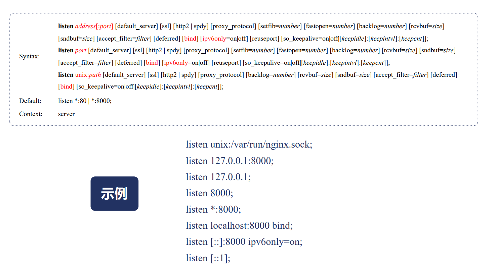

### 处理 HTTP 请求头部的流程

#### 接收请求事件模块


#### 接收请求 HTTP 模块


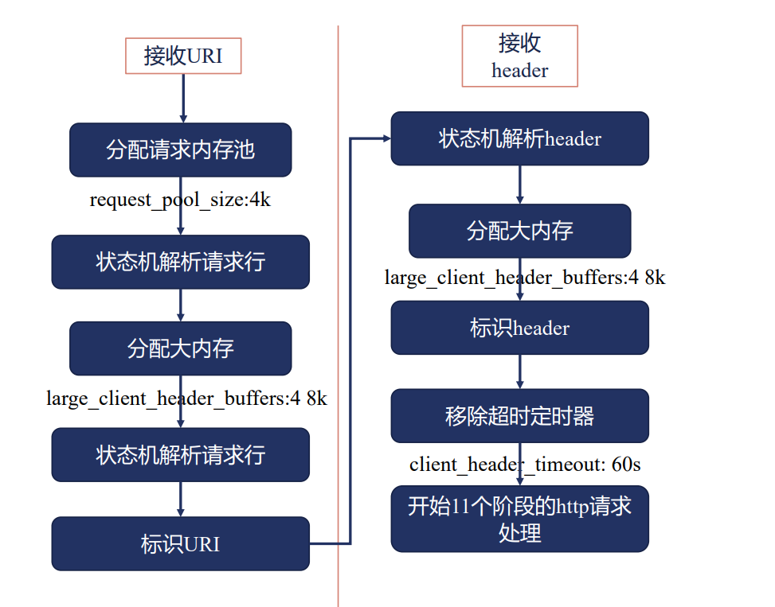

### Nginx 中的正则表达式


## 四、反向代理与负载均衡

##五、Nginx 系统层性能优化

## 六、深入使用 Nginx 与 OpenResty