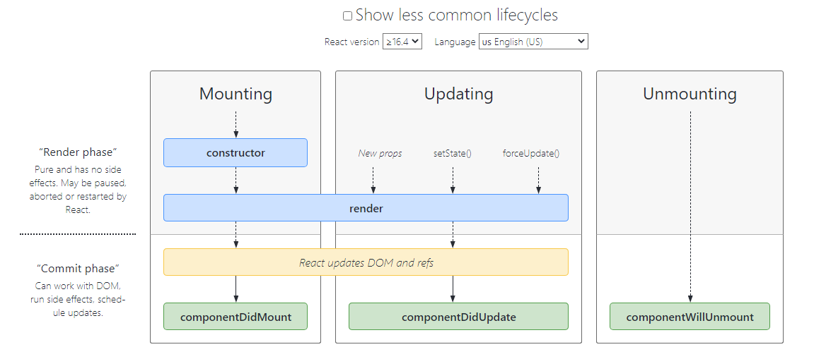
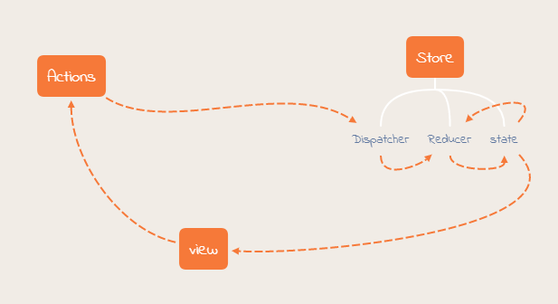
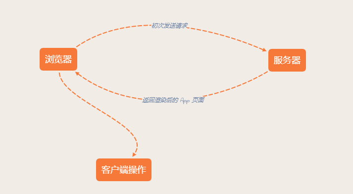
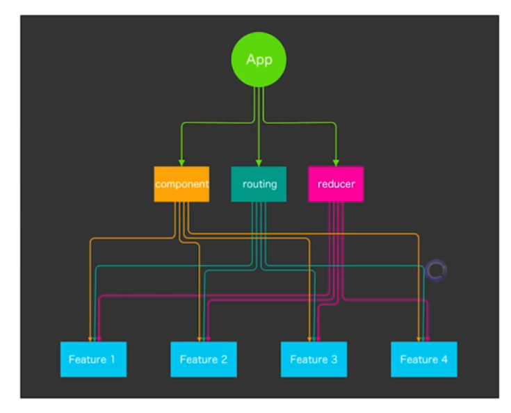

# React

## 一、React 基础

### 历史背景和特性

传统 UI 操作关注太多细节。

应用程序状态分散到各处，难以追踪和维护。


react 始终刷新整体页面（重绘），不需要关注细节。

Flux 架构：单向数据流。

> redux、mobx


 4 个 API。

* ReactDOM.render 渲染到指定节点
* 组件 render 方法
* 组件 setState 方法，触发 render
* props 传值

### UI 组件拆分

#### react 组件

> props + state = view

react 组件一般不提供方法，而是某种状态机。

react 组件可以理解为一个纯函数。

单项数据绑定。

#### 创建组件

创建静态 UI。

考虑组件的状态组成。

考虑组件的交互方式。

#### 受控组件 vs 非受控组件

受控组件表单元素状态由使用者维护。

```js
<input
  type="text"
  value={ this.state.value }
  onChange={ e => this.setState({ value: e.target.value }); }
/>
```

非受控组件状态 DOM 自身维护。

```js
<input
  type="text"
  ref={ node => this.input = false; }
/>
```

#### 创建组件：单一职责原则

每个组织只做一件事。

如果组件变得复杂，那么应该拆分为小组件。

#### 数据状态管理：DRY 原则

能计算得到的状态就不要单独存储。

组件尽量无状态，所需数据通过 props 获取。

###  JSX 语法

JSX 不是模板语言，只是一种语法糖。

> JavaSctipt 代码中直接写 HTML 标记。

```js
const name = 'yueluo';
const element = <h1>Hello, { name }</h1>;
```

#### JSX 本质

动态创建组件的语法糖。

```js
const name = 'yueluo';
const element = <h1>Hello, { name }</h1>;
```

```js
const name = 'yueluo';
const element = React.createElement(
  'h1',
  null,
  'Hello, ',
  name
);
```

#### JSX 中使用表达式

JSX 本身也是表达式。

```js
const element = <h1>Hello React!</h1>;
```

在属性中使用表达式。

```js
<MyComponent foo={ 1 + 2 + 3 + 4 } />
```

延展属性。

```js
const props = { firstName: 'Ben', lastName: 'Hector' };
const greeting = <Greeting {...props} />;
```

表达式作为子元素。

```js
const element = <li>{ props.message }</li>;
```

#### JSX 优点

* 声明式创建界面的直观
* 代码动态创建界面的灵活
* 无需学习新的模板语言

#### 约定：自定义组件以大写字母开头

React 认为小写的 tag 是原生 DOM 节点，如 div。

大写字母开头为自定义组件。

JSX 标记可以直接使用属性语法，例如 `<menu.Item /> 。`

### 组件生命周期



> https://projects.wojtekmaj.pl/react-lifecycle-methods-diagram/

#### constructor

用于初始化内部状态，很少使用。

唯一可以修改 state 的地方。

#### getDerivedStateFormProps

当 state 需要从 props 初始化时使用。

尽量不要使用：维护两者状态一致性会增加复杂度。

每次 render 都会调用。

应用场景：表单控件获取默认值。

#### componentDidMount

UI 渲染完成后调用。

只执行一次。

应用场景：获取外部资源。

####componentWillUnmount

组件移除时被调用。

应用场景：资源释放。

#### getSnapshotBeforeUpdate

在页面 render 之前调用，state 已更新。

应用场景：获取 render 之前的 DOM 状态。

#### componentDidUpdate

每次 UI 更新时被调用。

应用场景：页面需要根据 props 变化重新获取数据。

#### shouldComponentUpdate

决定 Virtual DOM 是否要重绘。

一般可以由 PureComponent 自动实现。

应用场景：性能优化。

### Virtual DOM 及 key 属性

JSX 的运行基础就是 Virtual DOM。

虚拟 DOM 采用广度优先分层比较（层层比较）。

算法复杂度为 O(n)。

虚拟 DOM 的两个阶段：

* 组件的 DOM 结构是相对稳定的。
* 类型相同的兄弟节点可以被唯一标识。

### 高阶组件和函数作为子组件

#### 高阶组件作为子组件

高阶组件接受组件作为参数，返回新的组件。

```js
const EnhancedComponent = higherOrderComponent(WrappedComponent);
```

计时器功能可以用高阶组件。

```jsx
import React from 'react';

export default function withTimer (WrappedComponent) {
  return class extends React.Component {
    state = { time: new Date() };
    
    componentDidMount () {
      this.timerID = setInterval(() => this.tick(), 1000);
    }
    
    componentWillUnmount () {
      clearInterval(this.timerId);
    }
    
    tick () {
      this.setState({
        tiem: new Date() 
      });
    }
    
    render () {
      return <WrappedComponent time={ this.state.time } { ...this.props } >;
    }
  }
}
```

```js
import withTimer from '';

class ChatApp extends React.Component { }

export default withTimer(ChatApp);
```

#### 函数作为子组件

```jsx
class MyComponent extends React.Component {
  render () {
    return (
      <div>{ this.props.children('月落') }</div>
    );
  }
}

<MyComponent>
  {
    (name) => ( <div>{ name }</div> )      
  } 
</MyComponent>
```

可以用于组件状态不变，但是外部表现形式可变的场景。


> 高阶组件和函数子组件都是设计模式。
>
> 可以实现更多场景的组件复用。

### ContextAPI 及其使用场景

ContextAPI 用来解决组件通信问题。

> React 16.3 新特性。

```jsx
const ThemeContext = React.createContext('light');

class App extends React.Component {
  render () {
    return (
      <ThemeContext.Provider value="dark">
        <ThemeButton />  
      </ThemeContext.Provider>
    );
  }
}

function ThemeButton (props) {
  return (
  	<ThemeContext.Consumer>
     { theme => <Button {...props} theme={ theme } ></Button> }  
    </ThemeContext.Consumer>
  );
}
```

可以用于语言切换，主题切换等应用场景。

```jsx
import React from 'react';

const enStrings = {
  submit: 'Submit',
  cancel: 'Cancel'
};

const cnStrings = {
  submit: '提交',
  cancel: '取消'
};

const LocaleContext = React.createContext(enStrings);

class LocaleProvider extends React.Component {
  state = { locale: cnStrings };

  toggleLocale = () => {
    this.state.locale === enStrings
      ? cnStrings
      : enStrings;
      
    this.setState({ locale });
  }
  
  render () {
    return (
      <LocaleContext.Provider value={ this.state.locale }>
        <button onClick={ this.toggleLocale }>
		  切换语言            
        </button>
        { this.props.children }
      </LocaleContext.Provider>
    );
  }
}

class LocaledButtons extends React.Component {
  render () {
    return (
      <LocaleContext.Consumer>
        {
          locale => (
            <div>
              <button>{ locale.cancel }</button>
              &nbsp;<button>{ locale.sumit }</button>
            </div>
          )        
        }  
      </LocaleContext.Consumer>
    );
  }
}

export default () => (
  <div>
    <LocaleProvider>
      <div>
        <br />
        <LocaledButtons />
      </div>    
    </LocaleProvider>  
  </div>
);
```

### 脚手架工具应用

Create React App、Codesandbox、Rekit。

#### create-react app

适合学习 react，或者开发简单的 react app。

> Babel + Webpack Config + Testing + ESLint 

#### Rekit

相比 create-react 增加了许多新功能。Redux、React Router、Less/Scss、Feature Oriented Archtecture、Dedicated IDE 等。

#### Online：Codesandbox.io

在线开发平台。

> https://codesandbox.io

### 打包和部署

#### 为什么需要打包？

编译 ES6 语法特性，编译 JSX。

整合资源，例如图片，Less/Sass。

优化代码体积。

> 使用 webpack 进行打包。

####注意事项

禁用开发时专用代码，比如 logger。

分离配置，生产环境设置为 production。

设置应用根目录。

## 二、React 生态

### redux

redux 是基于 flux 设计模式提出的完整的状态管理框架。

redux 让组件通信更加容易。

#### redux 特性

* Single Source of Truth。
* 可预测性。
  * state + action = new state
* 纯函数更新 Store。

#### store、action、reducer

store

```js
const store = createStore(reducer);
```

* getState()
* dispatch(action)
* subscrible(listener)

action

```js
{
  type: ADD_TODO,
  text: 'Build my first Redux app'
}
```

reducer

```js
function todoApp(state = initialState, action) {
  switch (action.type) {
    case ADD_TODO:
      return Object.assign({}, state, {
        todos: [
          ...state.todos,
          {
            text: action.text,
            completed: false
          }
        ]
      });
    default:
      return state;
  }
}
```

<div></div>

> (state, action) => new state

#### combineReducers

```js
export default function todos (state = [], action) {
  switch (action.type) {
    case 'ADD_TODO':
      return state.concat([action.text]);
    default:
      return state;  
  }
}
```

```js
export default function counter (state = 0, action) {
  switch (action.type) {
    case 'INCREMENT':
      return state + 1;
    case 'DECREMENT':
      return state - 1;
    default:
      return state;
  }
}
```

**combineReducers**

```js
import { combineReducers } from 'redux';
import todos from './todos';
import counter from './counter';

export default combineReducers({
  todos,
  counter
});
```

combinReducers 可以接收多个 reducer 作为参数。

```js
const store = createStore(combineReducers({
  todos,
  counter
}));
```

#### bindActionCreators

```js
function addTodoWithDispatch (text) {
  const action = {
    type: ADD_TODO,
    text
  };
    
  dispatch(action);
}
```

```js
dispatch(addTodo(text));
dispatch(compleTodo(index));
```

```js
const boundAddTodo = text => dispatch(addTodo(text));
const boundCompleteTodo = index => dispatch(compeleteTodo(index));
```

**bindActionCreators**

```js
function bindActionCreator (actionCreator, dispatch) {
  return function () {
    return dispatch(actionCreator.apply(this, arguments));
  }
}

function bindActionCreators (actionCreators, dispatch) {
  const keys = Object.keys(actionCreators);
  const boundActionCreators = {};
    
  for (let i = 0; i < keys.length; i++) {
    const key = keys[i];
    const actionCreator = actionCreators[key];
      
    if (typeof actionCreator === 'function') {
      boundActionCreators[key] = bindActionCreator(actionCreator, dispatch);
    }
  }
    
  return boundActionCreators;
}
```

```js
function plusOne () {
  return { type: 'PLUS_ONE' };
}

// before
store.disptach(plusOne());

// after
plusOne = bindActionCreators(plusOne, store.dispatch);
plusOne();
```

> redux 和页面是没有直接关系的，可以脱离 react 使用，在 node.js 中也可以使用。
>
> redux 是一个通用的状态管理框架。

#### react 中使用 redux

```js
import { connect } from 'react-redux';

class SidePanel extends Component {
  // ...
}

function mapStateToProps (state) {
  return {
    nextgen: state.nextgen,
    router: state.router
  };
}

function mapDispatchToProps (dispatch) {
  return {
    actions: bindActionCreators({ ...actions }, dispatch)
  }
}

export default connect(mapStateToProps, mapDispatchToProps)(SidePanel);
```

connect 其实是高阶组件的实现。

#### 异步 Action、Redux 中间件

redux 异步请求。Middleware 帮助实现异步 action。

> 异步 action 并不是 redux 自有的概念，而是一种设计模式。

redux 中间件（Middleware）。

* 截获 action（处理异步请求）
* 发出 action

异步 action 不是特殊 action，而是多个同步 action 的组合使用。

中间件在 dispatcher 中截获 action 做特殊处理。

#### 如何组织 Action 和 Reducer

"标准" 形式 Redux Action 存在的问题：

* 所有 Action 放一个文件，会无限扩展；
* Action，Reducer 分开，实现业务逻辑时需要来回切换；
* 系统中有哪些 Action 不够直观。

建议使用新的方式：单个 action 和 reducer 放在同一个文件。

```js
import { COUNT_PLUS_ONE } from './constants';

export function counterPlusOne () {
  return {
    type: COUNT_PLUS_ONE
  };
}

export function reducer (state, action) {
  switch (action.type) {
    case COUNT_PLUS_ONE:
      return {
        ...state,
        count: state.count + 1
      };
    default:
      return state;
  }
}
```

* 易于开发：不用在 action 和 reducer 文件间来回切换
* 易于维护：每个 action 文件都很小，容易理解
* 易于测试：每个业务逻辑秩序只需对应一个测试文件
* 易于理解：文件名就是 action 名字，文件列表就是 action 列表

#### 不可变数据（Immutability）

不可以直接修改值，可以通过复制对象属性产生新对象进行处理。

**为啥需要不可变数据：**

* 性能优化（只需要判断当前节点和旧节点是否是同一引用，就可以判断是否需要更新）
* 易于调试和跟踪
* 易于推测

**如何操作不可变数据：**

{...}，Object.assign

```js
const state = {
  filter: 'completed',
  todos: [ 'Learn React' ]
};

const newState = { ...state, todos: [
  ...state.todos,
  'Learn Reudx'
] };

const newState = Object.assign({}, state, {
  todos: [
    ...state.todos,
    'Learn Redux'
  ]
});
```

immutability-helper

```js
import update from 'immutability-helper';

const state = {
  filter: 'completed',
  todos: [ 'Learn React' ]
};

const newState = update(state, { todos: {
  $push: [ 'Learn Redux' ]
} });
```

immer

```js
import produce from 'immer';

const state = {
  filter: 'completed',
  todos: [ 'Learn React' ]
};

const newState = produce(state, draftState => {
  draftState.todos.push('Learn Redux');
});
```

相比其他方式更加直观，但是数据复杂时，带来一定的性能问题。

### react-router

#### 为什么需要路由

单页应用需要进行页面切换。

通过 URL 可以定义到页面。

更有语义的组织资源。

#### 路由实现的基本架构

路由定义 =>	Router	=> 页面布局。

#### React Router 实现

```jsx
<Router>
	<div>
  	<ul id="menu">
    	<li><Link to="/home">Home</Link></li>
      <li><Link to="/hello">Hello</Link></li>
      <li><Link to="/about">About</Link></li>
    </ul>
    
    <div id="page-container">
    	<Route path="/home" component={ Home }></Route>
      <Route path="/hello" component={ Hello }></Route>
      <Route path="/about" component={ About }></Route>
    </div>
  </div>
</Router>
```

#### React Router 特性

声明式路由定义。

动态路由。

```jsx
const App = () => (
	<div>
  	<nav>
      <Link to="/dashboard">Dashboard</Link>
    </nav>
    <div>
    	<Route path="/dashboard" component={ Dashboard } ></Route>
    </div>
  </div>
)
```

#### 三种路由实现方式

URL 路径。

```js
import { BrowserRouter as Router } from 'react-router-dom';
```

hash 路由。

```js
import { HashRouter as Router } from 'react-router-dom';
```

内存路由。

> 路由并不会反应到 URL 上，通常在服务端渲染场景中使用。

```js
import { MeoryRouter } from 'react-router';
```

#### 基于路由配置组织资源

实现业务逻辑的低耦合。

易于扩展，重构和维护。

路由页面实现 Lazy Load。

#### React Router API

| 常用组件     | 描述                                       |
| ------------ | ------------------------------------------ |
| `<Link>`     | 普通链接，不会触发浏览器刷新               |
| `<NavLink>`  | 类似 Link，但是会添加当前选中状态          |
| `<Prompt>`   | 满足条件时提示用户是否离开当前页面         |
| `<Redirect>` | 重定向到当前页面，例如登录判断             |
| `<Route>`    | 路由配置的核心标记，路径匹配时显示对应组件 |
| `<Switch>`   | 只显示第一个匹配的路由                     |

`<Link>`

```jsx
import { Link } from 'react-router-dom';

<Link to="/about">About</Link>
```

`<NavLink>`

```jsx
<NavLink to="/user" activeClassName="selected">About</NavLink>
```

`<Prompt>`

```jsx
import { Prompt } from 'react-router';

<Promot
	when={ formIsHalfFilledOut }
  message="Are you sure you want to leave?"
/>
```

`<Redirect>`

```jsx
import { Route, Redirect } from 'react-router';

<Route
  exact
  path="/"
  render={
    () => (
  		loggedIn ? ( <Redirect to="/dashboard" /> )
             	 : ( <PublicHomePage /> )
		)
  }
/>
```

`<Route>`

```jsx
import { BrowserRouter as Router, Route } from 'react-router-dom';

<Router>
	<div>
  	<Route exact path="/" component={ Home } ></Route>
    <Route path="/news" component={ NewsFeed } ></Route>
  </div>
</Router>
```

> exact 精确匹配。
>
> `<Route> `可以匹配多个组件，如果命中多个，都会显示在页面中。

`<Switch>`

```jsx
import { Switch, Route } from 'react-router-dom';

<Switch>
  <Route exact path="/" component={ Home } ></Route>
  <Route exact path="/about" component={ About } ></Route>
  <Route exact path="/:user" component={ User } ></Route>
  <Route component={ NoMatch } ></Route>
</Switch>
```

#### 通过 URL 传递参数

```jsx
<Route path="/topic/:id" comonent={ Topic } />
```

#### URL 参数应用场景

页面状态尽量通过 URL 参数定义。

```js
https://yueluo.club/timing/list/202104
```

#### 嵌套路由

每个 React 组件都可以是路由容器。

React Router 的声明式语法可以方便的实现嵌套路由。

```jsx
<Router>
	<div>
  	<ul id="menu">
    	<li>
      	<Link to="/category/1">Category 1</Link>
      </li>
      <li>
      	<Link to="/category/2">Category 2</Link>
      </li>
      <li>
      	<Link to="/category/3">Category 3</Link>
      </li>
    </ul>
    
    <div id="page-container">
    	<Route
      	path="/category/:id"
        component={ SubCategory }
      />
    </div>
  </div>
</Router>
```

```jsx
const SubCategory = ({ match }) => (
	<div>
  	<h1>Catgroy</h1>
    
    <ul id="menu">
    	<li>
      	<Link to={ `/category/${ match.params.id }/sub/1` }>Sub Category 1</Link>
      </li>
      <li>
      	<Link to={ `/category/${ match.params.id }/sub/2` }>Sub Category 2</Link>
      </li>
      <li>
      	<Link to={ `/category/${ match.params.id }/sub/3` }>Sub Category 3</Link>
      </li>
    </ul>
    
    <div id="page-container-2">
    	<Route
        path="/category/:id/sub/:subId"
        component={ Category }
      />
    </div>
  </div>
)
```

```jsx
const Category = ({ match }) => (
	<h1>Sub Category { match.params.subId }</h1>
)
```

### UI 组件库对比

Ant Design、Material UI、Semantic UI。

#### 选择 UI 库的考虑因素

* 组件库是否齐全；

* 样式风格是否符合业务需求；

* API 设计是否便捷和灵活；

* 技术支持是否完善（技术文档，issue 是否有效得到解决）；

* 开发是否活跃。

#### UI 组件库对比

Ant Design 组件库相对比较齐全。

> 如果开发企业级应用，建议使用 Ant Design。

### Next.js 创建同构应用

#### 同构应用



#### next.js 页面结构

页面就是 pages 目录下的一个组件。

static 目录映射静态文件。

page 具有特殊静态方法 getInitialProps。

#### 页面中使用其它 React 组件

页面是标准的 node 模块，可使用其他 React 组件。

```js
import Link from 'next/link';
import Hello from '../component';

export default () => (
	<div>
  	
    <nav>
    	<Link href="/about"><a>About</a></Link>
    </nav>
    <Hello />
  </div>
);
```

页面会针对性打包，仅包含其引用的组件。

#### 使用 Link 实现同构路由

* 使用 ”next/link“ 定义链接；
* 点击链接时页面不会刷新；
* 使用 prefetch 预加载目标资源；
* 使用 replace 属性替换 URL。

```jsx
<Link href="/about" prefetch><a>About</a></Link>
```

#### 动态加载页面

```jsx
import dynamic from 'next/dynamic';

const DynamicComponentWithCustomLoading = dynamic(
	import('../components/hellow'),
  {
    loading: () => <p>...</p>
  }
)
    
export default () => 
	<div>
		<Header />
  	<DynamicComponentWithCustomLoading />
    <p>home page is here.</p>
	</div>
```

### Jest、Enzyme 等工具单元测试

#### React 让单元测试更加容易

* React 应用很少需要访问浏览器 API；
* 虚拟 DOM 可以在 NodeJS 环境进行运行和测试；
* Redux 隔离了状态管理，纯数据层单元测试。

#### 单元测试涉及的工具

Jest：Facebook 开源的 JS 单元测试框架。

JS DOM：浏览器环境的 NodeJS 模拟（nodejs 中模拟浏览器环境）。

Enzyme：React 组件渲染和测试。

nock：模拟 HTTP 请求。

sinon：函数模拟和调用跟踪。

istanbul：单元测试覆盖率。

#### Jest

```js
const add = require('./add');

describe('add', () => {
  it('should add two numbers', () => {
    expect(add(1, 2)).toBe(3);
  });
});
```

#### jsdom

```js
const JSDOM = reuqire('jsdom').JSDOM;

global.window = new JSON('<!DOCTYPE html><div id="react-root"></div>').window;
global.document = window.document;
global.navigator = window.navigator;
global.HTMLElement = window.HTMLElement;
```

#### Enzyme

```jsx
import React from 'react';
import { shallow } from 'enzyme';
import { DefaultPage } from 'src/features/home/DefaultPage';

describe('home/DefaultPage', () => {
  it('renders node with corret class name', () => {
    const pageProps = {
      home: {},
      actions: {}
    };
    const renderComponent = shallow(
    	<DefaultPage {...pageProps} />
    );
    expect(
    	renderedComponent.find('.home-default-page').getElement()
    ).to.exist;
  });
});
```

主要可以处理 react 的 render。

* Shallow Renderding（ 浅 render）；
* Full Rendering（ 完整 render）；
* Static Rendering （静态 render）。

#### Nock

模拟 HTTP 请求。

```js
it('handlers fetchRedditReactjsList failre', () => {
  nock('http://www.reddit.com/')
  	.get('/r/reactjs.json')
    .reploy(500, null);
  
  const store = mockStore({ redditReactjsList: [] });
  
  return store.dispatch(fetchRedditReactjsList())
  	.catch(() => {
    	const actions = store.getActions();
    
    	expect(action[0]).to.have.property('type', HOME_FETCH_REDDIT_REACTJS_LIST_BEGIN);
      expect(action[1]).to.have.property('type', HOME_FETCH_REDDIT_REACTJS_LIST_FAILURE);
      expect(action[1]).to.have.nested.property('data.error').that.exist;
    });
});
```

#### Sinon

主要用于函数跟踪。可以去官网查看具体案例。

#### Istanbul

主要用于单元测试覆盖率。

```js
npm install -g istanbul
cd /path/to/your/source/root
istanbul cover test.js
```

```js
function meaningOfLife () {
	return 42;
}

// 转换后

function meaningOfLife () {
  __cov__ECtNDGoq6USQiIaViK8Qyw.f['1']++;
  __cov__ECtNDGoq6USQiIaViK8Qyw.f['2']++;
  return 42;
}
```

主要是对已有代码的修改和埋点进行分析。实际测试时运行的时埋点后的代码。

```js
npm test -- --coverage
```

### 常用开发调试工具

#### ESLint

使用 .eslint 进行规则的配置。

使用 airbnb 的 JavaScript 代码风格。

**.eslintrc**

```js
{
  "extends": "./node_modules/eslint-config-airhub/.eslint",
  "parser": "babel-eslint",
  "globals": {
    "document": true,
    "window": true
  },
  "settinds": {
    "import/resolver": {
      "babel-module": {}
    }
  },
  "rules": { }
}
```

#### Prettier 

代码格式化神器。

保证更容易写出风格一致的代码。

> ctrl + s 保存后可以实现自动格式化

**.prettierrc**

```js
{
  "singleQuote": false,
  "trailingComma": "all",
  "printWidth": 100
}
```

#### React Dev Tools

可以观察 React 组件结构及状态。

#### Redux Dev Tools

可以我们很好的调试 Redux 应用。

存在时间线功能，存在提供测试脚本功能。

## 三、可维护、可拓展的前端应用

### 前端项目的理想架构

可维护、可扩展、可测试、易开发、易构建。

#### 易于开发

开发工具是否完善。

生态圈是否繁荣。

社区是否活跃。

#### 易于扩展

增加新功能是否容易。

新功能是否会显著增加系统复杂度。

#### 易于维护

代码是否容易理解。

文档是否健全。

#### 易于测试

功能的分层是否清晰。

副作用少。

尽量使用纯函数。

####易于构建

使用通用技术和架构。

构建工具的选择。

### 拆分复杂度

#### 领域模型组织代码

**如何用领域模型（feature）来组织代码，降低耦合度。**

项目初期：规模小、模块关系清晰。

> 对于 React 应用来说，通常由三部分构成，一般是 Reducer、Action、Component。

项目逐渐复杂之后，添加了更多组件和其他元素。

项目收尾：文件结构，模块依赖错综复杂。

将业务逻辑拆分成高内聚松耦合的模块。



#### 文件夹结构

* 按 feature 组织源文件；
* 组件和样式文件同一级；
* Redux 单独文件夹；
* 单元测试保持同样目录结构放在 tests 文件夹。

#### 路由配置

每个 feature 中单独定义自己的路由。

使用 JSON 定义顶层路由。

解析 JSON 路由到 React Router 语法。

#### 总结

按 feature 组织组件，action 和 reducer。

使用 root loader 加载 feature 下的各个资源。

做到高内聚松耦合；

每个 feature 都有自己的专属路由配置；

顶层路由使用 JSON 配置更容易维护和理解；

如何解析到 JSON 配置到 React Router 语法。

## 四、常见场景的最佳实践

## 五、React 性能优化

### 如何避免应用出现性能问题

了解常见的性能问题场景。

时刻注意代码的潜在性能问题。

注意可重构的代码。

了解如何使用工具定位性能问题。

### 网络性能优化

#### react 实现按需加载

什么是按需加载。

使用 webpack 的 import API。

使用 react-loadable 库实现 React 异步加载。


