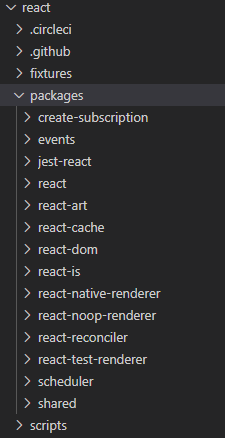

# ##React 源码

## 概述

UI = fn(x)。setState。超前的思想，Fiber。

* React API

* React 的更新创建
* Fiber Schedular
* 开始更新
* 完成各个节点的更新
* 提交更新
* 各种功能的实现过程
* Suspense
* Hooks

React 的源码实现：Fiber、Update、Schedular 等核心着重学习。

提高开发能力、解决问题能力、提升自身价值。

提升学习能力、提升思考能力、提升设计能力。

## React API 一览

### React 目录

<div></div>

events：事件绑定，事件相关
react：React 核心代码
react-dom：React DOM 相关，react-dom 依赖 react-reconciler 包。
scheduler：调度相关，react 异步渲染实现
shared: 通用方法

React、React DOM。React 是一个定义节点和表现行为的包。具体 DOM 渲染、更新等都在 React DOM 中。

Flow Type 静态检查工具。

### Jxs 到 JavaScript 转换

[babel playground](https://babeljs.io/repl/#?browsers=defaults%2C%20not%20ie%2011%2C%20not%20ie_mob%2011&build=&builtIns=false&corejs=3.6&spec=false&loose=false&code_lz=Q&debug=false&forceAllTransforms=false&shippedProposals=false&circleciRepo=&evaluate=false&fileSize=false&timeTravel=false&sourceType=module&lineWrap=true&presets=env%2Creact%2Cstage-2&prettier=false&targets=&version=7.14.2&externalPlugins=)

```jsx
<div class="container" key="key">
	container
</div>

=>

React.createElement("div", {
  class: "container",
  key: "key"
}, "container");
```

```jsx
<div class="container" key="key">
  <h1>title</h1>
  <span>desc</span>
</div>

=>

React.createElement("div", {
  class: "container",
  key: "key"
}, /*#__PURE__*/React.createElement("h1", null, "title"), /*#__PURE__*/React.createElement("span", null, "desc"));
```

```jsx
function Children () {
  return (
  	<div>Children</div>
  );
}

<div class="container" key="key">
 <Children />
</div>

=> 

function Children() {
  return /*#__PURE__*/React.createElement("div", null, "Children");
}

/*#__PURE__*/
React.createElement("div", {
  class: "container",
  key: "key"
}, /*#__PURE__*/React.createElement(Children, null));
```

### ReactElement

**react/packages/react/src/React.js**

react 入口文件中，导出 createElement 方法。

```jsx
/**
 * Copyright (c) Facebook, Inc. and its affiliates.
 *
 * This source code is licensed under the MIT license found in the
 * LICENSE file in the root directory of this source tree.
 */

import ReactVersion from 'shared/ReactVersion';
import {
  REACT_CONCURRENT_MODE_TYPE,
  REACT_FRAGMENT_TYPE,
  REACT_PROFILER_TYPE,
  REACT_STRICT_MODE_TYPE,
  REACT_SUSPENSE_TYPE,
} from 'shared/ReactSymbols';

import {Component, PureComponent} from './ReactBaseClasses';
import {createRef} from './ReactCreateRef';
import {forEach, map, count, toArray, only} from './ReactChildren';
import {
  createElement,
  createFactory,
  cloneElement,
  isValidElement,
} from './ReactElement';
import {createContext} from './ReactContext';
import {lazy} from './ReactLazy';
import forwardRef from './forwardRef';
import memo from './memo';
import {
  createElementWithValidation,
  createFactoryWithValidation,
  cloneElementWithValidation,
} from './ReactElementValidator';
import ReactSharedInternals from './ReactSharedInternals';
import {enableStableConcurrentModeAPIs} from 'shared/ReactFeatureFlags';

const React = {
  Children: {
    map,
    forEach,
    count,
    toArray,
    only,
  },

  createRef,
  Component,
  PureComponent,

  createContext,
  forwardRef,
  lazy,
  memo,

  Fragment: REACT_FRAGMENT_TYPE,
  StrictMode: REACT_STRICT_MODE_TYPE,
  Suspense: REACT_SUSPENSE_TYPE,

  createElement: __DEV__ ? createElementWithValidation : createElement,
  cloneElement: __DEV__ ? cloneElementWithValidation : cloneElement,
  createFactory: __DEV__ ? createFactoryWithValidation : createFactory,
  isValidElement: isValidElement,

  version: ReactVersion,

  __SECRET_INTERNALS_DO_NOT_USE_OR_YOU_WILL_BE_FIRED: ReactSharedInternals,
};

if (enableStableConcurrentModeAPIs) {
  React.ConcurrentMode = REACT_CONCURRENT_MODE_TYPE;
  React.Profiler = REACT_PROFILER_TYPE;
} else {
  React.unstable_ConcurrentMode = REACT_CONCURRENT_MODE_TYPE;
  React.unstable_Profiler = REACT_PROFILER_TYPE;
}

export default React;
```

**react/packages/react/src/ReactElement.js**

```jsx
const ReactElement = function(type, key, ref, self, source, owner, props) {
  // 定义元素
  const element = {
    // This tag allows us to uniquely identify this as a React Element
    // 标识 Element 是什么类型的元素
    // 大部分元素的 $$typeof 都是 REACT_ELEMENT_TYPE 类型
    $$typeof: REACT_ELEMENT_TYPE, 

    // Built-in properties that belong on the element
    // 记录节点类型
    type: type,
    key: key,
    ref: ref,
    props: props,

    // Record the component responsible for creating this element.
    _owner: owner,
  };

  if (__DEV__) {
    // The validation flag is currently mutative. We put it on
    // an external backing store so that we can freeze the whole object.
    // This can be replaced with a WeakMap once they are implemented in
    // commonly used development environments.
    element._store = {};

    // To make comparing ReactElements easier for testing purposes, we make
    // the validation flag non-enumerable (where possible, which should
    // include every environment we run tests in), so the test framework
    // ignores it.
    Object.defineProperty(element._store, 'validated', {
      configurable: false,
      enumerable: false,
      writable: true,
      value: false,
    });
    // self and source are DEV only properties.
    Object.defineProperty(element, '_self', {
      configurable: false,
      enumerable: false,
      writable: false,
      value: self,
    });
    // Two elements created in two different places should be considered
    // equal for testing purposes and therefore we hide it from enumeration.
    Object.defineProperty(element, '_source', {
      configurable: false,
      enumerable: false,
      writable: false,
      value: source,
    });
    if (Object.freeze) {
      Object.freeze(element.props);
      Object.freeze(element);
    }
  }

  return element;
};

// 创建元素
// type 可以是字符串，也可以是 react 元素
// config 配置项
// children 子元素
export function createElement(type, config, children) {
  let propName;

  // Reserved names are extracted
  const props = {};

  let key = null;
  let ref = null;
  let self = null;
  let source = null;

  if (config != null) {
    if (hasValidRef(config)) {
      ref = config.ref;
    }
    if (hasValidKey(config)) {
      key = '' + config.key;
    }

    self = config.__self === undefined ? null : config.__self;
    source = config.__source === undefined ? null : config.__source;
    // Remaining properties are added to a new props object
    for (propName in config) {
      if (
        hasOwnProperty.call(config, propName) &&
        !RESERVED_PROPS.hasOwnProperty(propName)
      ) {
        props[propName] = config[propName];
      }
    }
  }

  // Children can be more than one argument, and those are transferred onto
  // the newly allocated props object.
  const childrenLength = arguments.length - 2;

  // 处理子元素
  if (childrenLength === 1) {
    props.children = children;
  } else if (childrenLength > 1) {
    const childArray = Array(childrenLength);
    for (let i = 0; i < childrenLength; i++) {
      childArray[i] = arguments[i + 2];
    }
    if (__DEV__) {
      if (Object.freeze) {
        Object.freeze(childArray);
      }
    }
    props.children = childArray;
  }

  // Resolve default props
  if (type && type.defaultProps) {
    const defaultProps = type.defaultProps;
    for (propName in defaultProps) {
      if (props[propName] === undefined) {
        props[propName] = defaultProps[propName];
      }
    }
  }
  
  if (__DEV__) {
    if (key || ref) {
      const displayName =
        typeof type === 'function'
          ? type.displayName || type.name || 'Unknown'
          : type;
      if (key) {
        defineKeyPropWarningGetter(props, displayName);
      }
      if (ref) {
        defineRefPropWarningGetter(props, displayName);
      }
    }
  }

  // 返回 React 元素
  return ReactElement(
    type,
    key,
    ref,
    self,
    source,
    ReactCurrentOwner.current,
    props,
  );
}
```

### Component

**react/packages/react/src/ReactBaseClasses.js**

```jsx
/**
 * Base class helpers for the updating state of a component.
 */
function Component(props, context, updater) {
  this.props = props;
  this.context = context;
  // If a component has string refs, we will assign a different object later.
  this.refs = emptyObject;
  // We initialize the default updater but the real one gets injected by the
  // renderer.
  // updater 与平台相关，不同的平台传递不同的 updater
  this.updater = updater || ReactNoopUpdateQueue;
}

Component.prototype.isReactComponent = {};

Component.prototype.setState = function(partialState, callback) {
  invariant(
    typeof partialState === 'object' ||
      typeof partialState === 'function' ||
      partialState == null,
    'setState(...): takes an object of state variables to update or a ' +
      'function which returns an object of state variables.',
  );
  this.updater.enqueueSetState(this, partialState, callback, 'setState');
};
 
Component.prototype.forceUpdate = function(callback) {
  // 强制 React Component 更新
  this.updater.enqueueForceUpdate(this, callback, 'forceUpdate');
};

/**
 * Deprecated APIs. These APIs used to exist on classic React classes but since
 * we would like to deprecate them, we're not going to move them over to this
 * modern base class. Instead, we define a getter that warns if it's accessed.
 */
// 即将废弃方法
if (__DEV__) {
  const deprecatedAPIs = {
    isMounted: [
      'isMounted',
      'Instead, make sure to clean up subscriptions and pending requests in ' +
        'componentWillUnmount to prevent memory leaks.',
    ],
    replaceState: [
      'replaceState',
      'Refactor your code to use setState instead (see ' +
        'https://github.com/facebook/react/issues/3236).',
    ],
  };
  const defineDeprecationWarning = function(methodName, info) {
    Object.defineProperty(Component.prototype, methodName, {
      get: function() {
        lowPriorityWarning(
          false,
          '%s(...) is deprecated in plain JavaScript React classes. %s',
          info[0],
          info[1],
        );
        return undefined;
      },
    });
  };
  for (const fnName in deprecatedAPIs) {
    if (deprecatedAPIs.hasOwnProperty(fnName)) {
      defineDeprecationWarning(fnName, deprecatedAPIs[fnName]);
    }
  }
}

function ComponentDummy() {}
ComponentDummy.prototype = Component.prototype;

/**
 * Convenience component with default shallow equality check for sCU.
 */
function PureComponent(props, context, updater) {
  this.props = props;
  this.context = context;
  // If a component has string refs, we will assign a different object later.
  this.refs = emptyObject;
  this.updater = updater || ReactNoopUpdateQueue;
}

// 圣杯继承
const pureComponentPrototype = (PureComponent.prototype = new ComponentDummy());
pureComponentPrototype.constructor = PureComponent;
// Avoid an extra prototype jump for these methods.
Object.assign(pureComponentPrototype, Component.prototype);
pureComponentPrototype.isPureReactComponent = true;

export {Component, PureComponent};
```

### createRef、ref

手动操作，自主绑定事件等。

ref 有三种使用方式：

**string ref**

不推荐使用。

```jsx
<p ref="stringRef">span1</p>

this.refs.stringRef.textContent = 'string ref got';
```

**function ref**

```jsx
<p ref={(ele) => (this.methdRef = ele)}>span3</p>

this.methodRef.textContent = 'method ref got';
```

**object ref**

```jsx
<p ref={ this.objRef }>span3</p>

this.objRef.current.textContent = 'obj ref got';
```


**react/packages/react/src/ReactCreateRef.js**

```jsx

import type {RefObject} from 'shared/ReactTypes';

// an immutable object with a single mutable value
export function createRef(): RefObject {
  const refObject = {
    current: null,
  };
  if (__DEV__) {
    Object.seal(refObject);
  }
  return refObject;
}
```

### forward-ref

