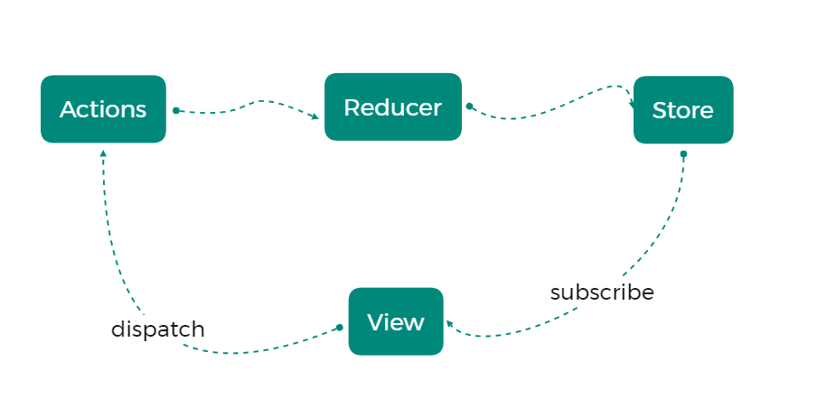
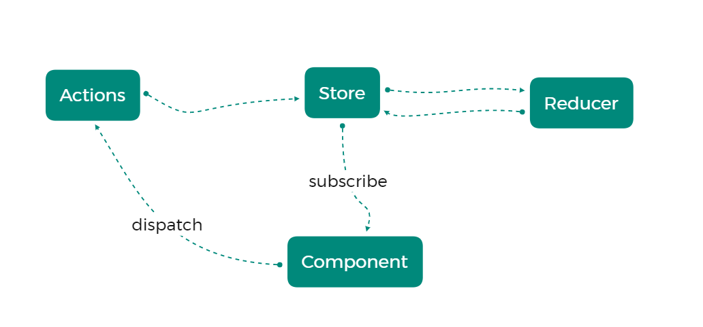

# Redux

## 概述

JavaScript 状态容器，提供可预测化的状态管理。

```js
const state = {
  modelOpen: 'yes',
  btnClicked: 'no',
  btnActiveClass: 'active',
  page: 5,
  size: 10
}
```

## 核心概念及工作流程




Store：存储状态的容器，JavaScript 对象

View：视图，HTML 页面

Actions：对象，描述对状态进行怎样的操作

Reducers：函数，操作状态并返回新的状态

## redux 计数器案例

```html
<!DOCTYPE html>
<html lang="en">
<head>
  <meta charset="UTF-8">
  <meta http-equiv="X-UA-Compatible" content="IE=edge">
  <meta name="viewport" content="width=device-width, initial-scale=1.0">
  <title>Redux</title>
</head>
<body>

  <button id="J-plus">+</button>
  <span id="J-count">0</span>
  <button id="J-minus">-</button>


  <script src="https://cdn.bootcdn.net/ajax/libs/redux/4.1.0/redux.min.js"></script>

  <script>
    // 3. 存储默认状态
    const initialState = {
      count: 0
    };

    // 2. 创建 reducer 函数
    function reducer (state = initialState, action) {
      switch (action.type) {
        case 'increment':
          return {
            count: state.count + 1
          }
        case 'decrement':
          return {
            count: state.count - 1
          }
        default:
          return state;
      }
    }

    // 1. 创建 store 对象
    const store = Redux.createStore(reducer);
    
    // 4. 定义 action
    const increment = { type: 'increment' };
    const decrement = { type: 'decrement' };

    // 5. 获取按钮，添加点击事件
    document.getElementById('J-plus').onclick = function () {
      // 6. 触发 action
      store.dispatch(increment);
    }
    document.getElementById('J-minus').onclick = function () {
      // 触发 action
      store.dispatch(decrement);
    }

    // 7. 订阅 store
    store.subscribe(() => {
      document.getElementById('J-count').innerHTML = store.getState().count;
    });
    
    console.log(store); // dispatch: ƒ, subscribe: ƒ, getState: ƒ, replaceReducer: ƒ, @@observable: ƒ}
    console.log(store.getState()); // {count: 0}

  </script>
  
</body>
</html>
```

## react 中 redux 解决的问题

在 React 中组件通信的数据流是单向的，顶层组件可以通过 props 属性向下层组件传递数据，而下层组件不能向上层传递数据，要实现下层组件修改数据，需要上层组件传递修改数据的方法到下层组件。当项目越来越大时，组件之间传递数据变得越来越困难。

使用 Redux 管理数据，由于 Store 独立于组件，使得数据管理独立于组件，解决了组件与组件之间传递数据困难的问题。

## react 计数器

### redux 工作流程

组件通过 dispatch 方法触发 Action。

Store 接收 Action 并将 Action 分发给 Reducer。

Reducer 根据 Action 类型对状态进行更改并将更改后的状态返回给 Store。

组件订阅 Store 状态，Store 中的状态更新会同步到组件。



### 安装

```jsx
npm i redux react-redux
```

### 基本实现

```jsx
import React from 'react';
import ReactDOM from 'react-dom';
import { createStore } from 'redux';

const initialState = {
  count: 0
}

function reducer (state = initialState, action) {
  switch (action.type) {
    case 'increment':
      return {
        count: state.count + 1
      };
    case 'decrement':
      return {
        count: state.count -1
      };
    default:
      return state;
  }
}

const store = createStore(reducer);

const increment = { type: 'increment' };
const decrement = { type: 'decrement' };


function Counter () {
  return (
    <div>
      <button onClick={() => store.dispatch(increment)}>+</button>
      <span>{ store.getState().count }</span>
      <button onClick={() => store.dispatch(decrement)}>-</button>
    </div>
  )
}

store.subscribe(() => {
  ReactDOM.render(
    <Counter />,
    document.getElementById('root')
  );
});

ReactDOM.render(
  <Counter />,
  document.getElementById('root')
);
```

## Provider 组件与 connect 方法

connect 方法：

* 订阅 store ，状态改变时重新渲染组件
* 获取 store 状态，将状态映射到组件的 props
* 获取 dispatch 方法

components/Counter.js

```jsx
import React from "react"
import { connect } from 'react-redux';

function Counter ({ count, dispatch }) {
  return (
    <div>
      <button onClick={() => dispatch({ type: 'increment' })}>+</button>
      <span>{ count }</span>
      <button onClick={() => dispatch({ type: 'decrement' })}>-</button>
    </div>
  )
}

const mapStateToProps = state => ({
  count: state.count
})

export default connect(mapStateToProps)(Counter);
```

index.js

```jsx
import React from 'react';
import ReactDOM from 'react-dom';
import { createStore } from 'redux';
import { Provider } from 'react-redux';
import Counter from './components/Counter';

const initialState = {
  count: 0
}

function reducer (state = initialState, action) {
  switch (action.type) {
    case 'increment':
      return {
        count: state.count + 1
      };
    case 'decrement':
      return {
        count: state.count -1
      };
    default:
      return state;
  }
}

const store = createStore(reducer);

const increment = { type: 'increment' };
const decrement = { type: 'decrement' };

ReactDOM.render(
  <Provider store={store}>
    <Counter />
  </Provider>,
  document.getElementById('root')
);
```

## 使用 connect 方法的第二个参数

```jsx
import React from "react"
import { connect } from 'react-redux';

function Counter ({ count, increment, decrement }) {
  return (
    <div>
      <button onClick={ increment }>+</button>
      <span>{ count }</span>
      <button onClick={ decrement }>-</button>
    </div>
  )
}

const mapStateToProps = state => ({
  count: state.count
});

const mapDispatchToProps = dispatch => ({
  increment () {
    dispatch({ type: 'increment' })
  },
  decrement () {
    dispatch({ type: 'decrement' })
  }
});

export default connect(mapStateToProps, mapDispatchToProps)(Counter);
```

## bindActionCreator 方法

store/actions/counter.js

```js
export const increment = () => ({ type: 'increment' });
export const decrement = () => ({ type: 'decrement' });
```

components/Counter.js

```js
import React from "react"
import { connect } from 'react-redux';
import { bindActionCreators } from 'redux';
import * as counterActions from '../store/actions/counter'

function Counter ({ count, increment, decrement }) {
  return (
    <div>
      <button onClick={ increment }>+</button>
      <span>{ count }</span>
      <button onClick={ decrement }>-</button>
    </div>
  )
}

const mapStateToProps = state => ({
  count: state.count
});

const mapDispatchToProps = dispatch => bindActionCreators(counterActions, dispatch);

export default connect(mapStateToProps, mapDispatchToProps)(Counter);
```

## 代码重构 - 代码拆分

store/const/counter.js

```js
export const INCREMENT = 'increment';
export const DECREMENT = 'decrement';
```

store/actions/counter.js

```js
import { INCREMENT, DECREMENT } from "../const/counter";

export const increment = () => ({ type: INCREMENT });
export const decrement = () => ({ type: DECREMENT });
```

store/reducers/counter.js

```js
import { INCREMENT, DECREMENT } from "../const/counter";

const initialState = {
  count: 0
}

export function reducer (state = initialState, action) {
  switch (action.type) {
    case INCREMENT:
      return {
        count: state.count + 1
      };
    case DECREMENT:
      return {
        count: state.count -1
      };
    default:
      return state;
  }
} 
```

store/index.js

```js
import { createStore } from 'redux';
import { reducer } from './reducers/couner';

export const store = createStore(reducer);
```

index.js

```jsx
import React from 'react';
import ReactDOM from 'react-dom';

import { Provider } from 'react-redux';
import Counter from './components/Counter';

import { store } from './store';

ReactDOM.render(
  <Provider store={store}>
    <Counter />
  </Provider>,
  document.getElementById('root')
);
```

## action 传递参数

### 步骤

传递参数

```jsx
<button onClick={ () => increment(5) }>+</button>
```

接收参数，传递 reducer

```js
export const increment = payload = ({ type: INCREMENT, payload });
```

reducer 根据接收到的数据进行处理

```js
export default (state, action) => {
  switch (action.type) {
    case INCREMENT:
      return { count: state.count + action.payload };
  }
}
```

### 代码改造

component/Counter.js

```js
import React from "react"
import { connect } from 'react-redux';
import { bindActionCreators } from 'redux';
import * as counterActions from '../store/actions/counter'

function Counter ({ count, increment, decrement }) {
  return (
    <div>
      <button onClick={ () => increment(5) }>+</button>
      <span>{ count }</span>
      <button onClick={ () => decrement(5) }>-</button>
    </div>
  )
}

const mapStateToProps = state => ({
  count: state.count
});

const mapDispatchToProps = dispatch => bindActionCreators(counterActions, dispatch);

export default connect(mapStateToProps, mapDispatchToProps)(Counter);
```

store/actions/actions/counter.js

```js
import { INCREMENT, DECREMENT } from "../const/counter";

export const increment = payload => ({ type: INCREMENT, payload });
export const decrement = payload => ({ type: DECREMENT, payload });
```

store/action/reducers/counter.js

```js
import { INCREMENT, DECREMENT } from "../const/counter";

const initialState = {
  count: 0
}

export function reducer (state = initialState, action) {
  switch (action.type) {
    case INCREMENT:
      return {
        count: state.count + action.payload
      };
    case DECREMENT:
      return {
        count: state.count - action.payload
      };
    default:
      return state;
  }
}
```

## redux 弹出框案例

components/Modal.js

```js
import React from "react";
import { connect } from 'react-redux';
import { bindActionCreators } from 'redux';
import * as modalActions from '../store/actions/modal';

function Modal ({ showStatus, show, hide }) {
  const styles = {
    width: 200,
    height: 200,
    position: 'absolute',
    left: '50%',
    top: '50%',
    marginLeft: -100,
    marginTop: -100,
    background: 'orange',
    display: showStatus ? 'block' : 'none'
  };

  return (
    <div>
      <button onClick={ show }>显示</button>
      <button onClick={ hide }>隐藏</button>
      <div style={styles}></div>
    </div>
  )
}

const mapStateToProps = state => ({
  showStatus: state.show
});

const mapDispatchToProps = dispatch => bindActionCreators(modalActions, dispatch);

export default connect(mapStateToProps, mapDispatchToProps)(Modal);
```

store/actions/modal.js

```js
import { HIDE_MODAL, SHOW_MODAL } from "../const/modal";

export const show = () => ({ type: SHOW_MODAL });
export const hide = () => ({ type: HIDE_MODAL });
```

store/const/modal.js

```js
export const SHOW_MODAL = 'showModal';
export const HIDE_MODAL = 'hideModal';
```

store/reducers/counter.js

```js
import { INCREMENT, DECREMENT } from "../const/counter";
import { HIDE_MODAL, SHOW_MODAL } from "../const/modal";

const initialState = {
  count: 0,
  show: false
}

export function reducer (state = initialState, action) {
  switch (action.type) {
    case INCREMENT:
      return {
        ...state,
        count: state.count + action.payload
      };
    case DECREMENT:
      return {
        ...state,
        count: state.count - action.payload
      };
    case SHOW_MODAL: 
      return {
        ...state,
        show: true
      };
    case HIDE_MODAL:
      return {
        ...state,
        show: false
      };
    default:
      return state;
  }
} 
```

App.js

```jsx
import React from "react";
import Counter from './components/Counter';
import Modal from './components/Modal';

function App () {
  return (
    <div>
      <Counter />
      <Modal />
    </div>
  )
}

export default App;
```

index.js

```jsx
import React from 'react';
import ReactDOM from 'react-dom';
import { Provider } from 'react-redux';
import App from './App';
import { store } from './store';

ReactDOM.render(
  <Provider store={store}>
    <App />
  </Provider>,
  document.getElementById('root')
);
```

## 拆分合并 reducer

components/Counter.js

```jsx
import React from "react"
import { connect } from 'react-redux';
import { bindActionCreators } from 'redux';
import * as counterActions from '../store/actions/counter'

function Counter ({ count, increment, decrement }) {
  return (
    <div>
      <button onClick={ () => increment(5) }>+</button>
      <span>{ count }</span>
      <button onClick={ () => decrement(5) }>-</button>
    </div>
  )
}

const mapStateToProps = state => ({
  count: state.counter.count // edit
});

const mapDispatchToProps = dispatch => bindActionCreators(counterActions, dispatch);

export default connect(mapStateToProps, mapDispatchToProps)(Counter);
```

components/Modal.js

```jsx
import React from "react";
import { connect } from 'react-redux';
import { bindActionCreators } from 'redux';
import * as modalActions from '../store/actions/modal';

function Modal ({ showStatus, show, hide }) {
  const styles = {
    width: 200,
    height: 200,
    position: 'absolute',
    left: '50%',
    top: '50%',
    marginLeft: -100,
    marginTop: -100,
    background: 'orange',
    display: showStatus ? 'block' : 'none'
  };

  return (
    <div>
      <button onClick={ show }>显示</button>
      <button onClick={ hide }>隐藏</button>
      <div style={styles}></div>
    </div>
  )
}

const mapStateToProps = state => ({
  showStatus: state.modal.show // edit
});

const mapDispatchToProps = dispatch => bindActionCreators(modalActions, dispatch);

export default connect(mapStateToProps, mapDispatchToProps)(Modal);
```

store/reducers/counter.js

```js
import { INCREMENT, DECREMENT } from "../const/counter";

const initialState = {
  count: 0
}

const counterReducer = (state = initialState, action) => {
  switch (action.type) {
    case INCREMENT:
      return {
        ...state,
        count: state.count + action.payload
      };
    case DECREMENT:
      return {
        ...state,
        count: state.count - action.payload
      };
    default:
      return state;
  }
};

export default counterReducer;
```

store/reducers/modal.js

```js
import { HIDE_MODAL, SHOW_MODAL } from "../const/modal";

const initialState = {
  show: false
}

const modalReducer = (state = initialState, action) => {
  switch (action.type) {
    case SHOW_MODAL: 
      return {
        ...state,
        show: true
      };
    case HIDE_MODAL:
      return {
        ...state,
        show: false
      };
    default:
      return state;
  }
};

export default modalReducer;
```

store/reducers/index.js

```js
import { combineReducers } from 'redux';
import CounterReducer from './counter';
import ModalReducer from './modal';

export default combineReducers({
  counter: CounterReducer,
  modal: ModalReducer
});
```

store/index.js

```js
import { createStore } from 'redux';
import reducers from './reducers';

export const store = createStore(reducers);
```

## 中间件概念

中间件本质是一个函数，redux 允许我们通过中间件的方式扩展和增强 redux 应用程序。


## 开发 Redux 中间件

### 模板代码
