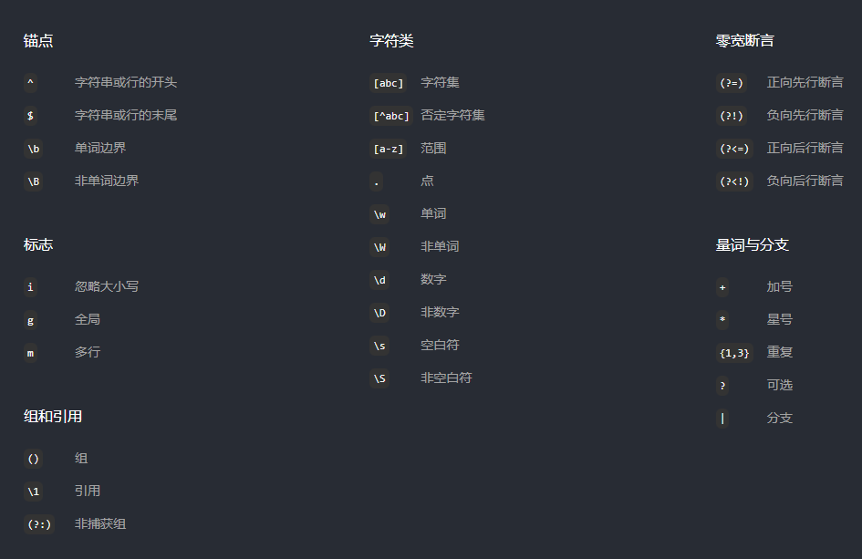

# 正则学习

正则表达式，即 Regular Expression，缩写为 `Regex` 或 `Regexp`。

我们可以使用正则表达式轻松管理数据，执行查找、匹配或编辑等命令。

## 介绍

`Regex` 是正则表达式（Regular Expression）的简称。它便于匹配、查找和管理文本。

```js
const str = 'Understand? OK or NOT'

console.log(str.match(/OK/)) // [ 'OK', index: 12, input: 'Understand? OK or NOT', groups: undefined ]
console.log(str.match(/ok/i)) // [ 'OK', index: 12, input: 'Understand? OK or NOT', groups: undefined ]
```

正则表达式是表示搜索模式的字符串，常缩写为 `Regex` 或 `Regexp`。

它常用于查找和替换文本中的字词。此外，我们可以测试文本是否符合我们设置的规则。

例如，当我们想查找文件名列表中，扩展名是 `pdf` 的文件，那您只需要跟着输入 `^\w+\.pdf` 就可以找到。

```js
const strArr = ['readme.md', 'document.pdf', 'image.png', 'music.mp4', 'manual.pdf']

strArr.forEach(str => {
  console.log(str.match(/^\w+\.pdf$/))
})
// null
// [ 'document.pdf', index: 0, input: 'document.pdf', groups: undefined ]
// null
// null
// [ 'manual.pdf', index: 0, input: 'manual.pdf', groups: undefined ]
```

## 基本匹配

当我们想要查找字符或单词可以直接输入，就像搜索一样。例如要找出文本内的 `curious` 一词，只需要输入同样的内容。

```js
const str = `
  “I have no special talents. I am only passionately curious.”

  ― Albert Einstein
`

console.log(str.match(/curious/gm)) // [ 'curious' ]
```

## 任何字符

使用 `.` 可以匹配任何字符。

```js
const str = 'abcABC123 .:!?'

console.log(str.match(/./g)) // ['a', 'b', 'c', 'A', 'B', 'C', '1', '2', '3', ' ', '.', ':', '!', '?']
```

## 字符集 `[abc]`

如果一个词中的字符可以是各种字符，我们就将所有的可选字符写进括号 `[]` 中。

例如，为了查找文本中的所有单词，我们需要编写表达式，在 `[]` 中相邻地输入字符 `a`、`e`、`i`、`o`、`u`。

```js
const str = 'bar ber bir bor bur'

console.log(str.match(/b[aeiou]r/)) // [ 'bar', index: 0, input: 'bar ber bir bor bur', groups: undefined ]
console.log(str.match(/b[aeiou]r/g)) // [ 'bar', 'ber', 'bir', 'bor', 'bur' ]
```

## 否定字符集 `[^abc]`

为了查找下方文本的所有单词（`ber` 和 `bor` 除外），请在 `[]` 中的 `^` 后面并排输入 `e` 和 `o`。

```js
const str = 'bar ber bir bor bur'

console.log(str.match(/b[^eo]r/g)) //  'bar', 'bir', 'bur' ]
```

`^` 在字符集中代表否定的意思，如果放在行首，代表以指定字符开头。

```js
const str = 'bar ber bir bor bur'

console.log(str.match(/b[^eo]r/g)) //  'bar', 'bir', 'bur' ]
console.log(str.match(/^bar/)) // [ 'bar', index: 0, input: 'bar ber bir bor bur', groups: undefined ]
```

## 字母范围 `[a-z]`

为了查找指定范围内的字母，我们可以将起始字母和结束字母写进 `[]` 中，中间使用连字符 `-` 分割（它区分大小写）。

```js
const str = 'abcdefghijklmnopqrstuvwxyz'

console.log(str.match(/[e-o]/g)) // ['e', 'f', 'g', 'h', 'i', 'j', 'k', 'l', 'm', 'n', 'o']
```

## 数字范围 `[0-9]`

为了查找指定范围的数字，我们可以在 `[]` 中输入起始和结束数字，中间用连字符 `-` 分割。

```js
const str = '0123456789'

console.log(str.match(/[3-6]/g)) // [ '3', '4', '5', '6' ]
```

## 重复

一些特殊字符用来指定一个字符在文本中重复的次数。它们分别是加号 `+`、星号 `*` 和问号 `?`。

### 星号 *

当我们在字符后面加上 `*` ，表示一个字符完全不匹配或可以匹配多次。

例如，表示字符 `e` 在下方文本中不出现，只出现 1 次或者并排出现多次。

```js
const str = 'br ber beer'

console.log(str.match(/be*r/g)) // [ 'br', 'ber', 'beer' ]
```

> 与 + 相比不同的是可以代表字符完全不匹配。

### 加号 +

为了表示一个字符可以出现一次或多次，我们可以将 `+` 放在它后面。

例如，表示 `e` 在下方文本中出现一次或多次。

```js
const str = 'br ber beer'

console.log(str.match(/be+r/g)) // [ 'ber', 'beer' ]
```

### 问号 ?

为了表示一个字符是可选的，我们在它后面加一个 `?`。

例如，表示下方文本中的字符 `u` 是可选的。

```js
const str = 'color, colour'

console.log(str.match(/colou?r/g)) // [ 'color', 'colour' ]
console.log(str.match(/colou*r/g)) // [ 'color', 'colour' ]
```

我们可以使用 `*` 实现类似的效果，但是 `*` 还可以匹配多次。

```js
const str = 'color, colouuur'

console.log(str.match(/colou?r/g)) // [ 'color' ]
console.log(str.match(/colou*r/g)) // [ 'color', 'colour' ]
```

### 大括号

为了表示一个字符出现的确切次数，我们可以在该字符的末尾，将它出现的次数写进大括号 `{}` 中，如 `{n}`。

例如，表示下方文本中的字符 `e` 只能出现 `2` 次。

```js
const str = 'ber beer beeer beeeer'

console.log(str.match(/be{2}r/g)) // [ 'beer' ]
console.log(str.match(/be{3}r/g)) // [ 'beeer' ]
```

为了表示一个字符至少出现多少次，我们可以在该字符的末尾，将它至少应出现的次数写进大括号 `{}` 中，并在数字后面加上逗号 `,`。

例如，表示下方文本中的字母 `e` 至少出现 `3` 次。

```js
const str = 'ber beer beeer beeeer'

console.log(str.match(/be{3,}r/g)) // [ 'beeer', 'beeeer' ]
```

为了表示一些字符出现次数在某个范围内，我们在该字符的末尾，将它至少和至多出现的次数写进大括号 `{}` 中，中间用逗号 `,` 分割，如 `{x,y}` 。

例如，匹配下方文本中，字符`e` 出现 1 到 3 次的单词。

```js
const str = 'ber beer beeer beeeer'

console.log(str.match(/be{1,3}r/g)) // [ 'ber', 'beer', 'beeer' ]
```

## 组和引用

### 分组 `()`

我们可以对一个表达式进行分组，并用这些分组来引用或执行一些规则。为了给表达式分组，我们需要将文本包裹在 `()` 中。

```js
const str = 'ha-ha,haa-haa'

console.log(str.match(/(haa)/g)) // [ 'haa', 'haa' ]
```

### 引用组`(\1)`

单词 `ha` 和 `haa` 分组如下。第一组用 `\1` 来避免重复书写。这里的 1 表示分组的顺序。

```js
const str1 = 'ha-ha,haa-haa'
const str2 = 'ha-ha-ha,haa-haa'

console.log(str1.match(/(ha)-\1,(haa)-\2/g)) // [ 'ha-ha,haa-haa' ]
console.log(str2.match(/(ha)-\1-\1,(haa)-\2/g)) // [ 'ha-ha-ha,haa-haa' ]
```

### 非捕获分组`(?:)`

我们可以对表达式进行分组，并确保它不被引用捕获。

例如，下面有两个分组，我们用 `\1` 引用的第一个组实际上是指向第二个组，因为第一个是未被捕获的分组。

```js
const str = 'ha-ha,haa-haa'

console.log(str.match(/(?:ha)-ha,(haa)-\1/g)) // [ 'ha-ha,haa-haa' ]
```

## 竖线 `|`

竖线允许一个表达式包含多个不同的分支，所有分支用 `|` 分割。与字符层面上运作的字符集 `[abc]` 不同，分支在表达式层面上运作。

例如，下面的表达式同时匹配 `cat` 和 `Cat`。

```js
const str = 'cat Cat rat'

console.log(str.match(/(c|C)at/g)) // [ 'cat', 'Cat' ]
console.log(str.match(/(c|C)at|rat/g)) // [ 'cat', 'Cat', 'rat' ]

console.log(str.match(/[cCr]at/g)) // [ 'cat', 'Cat', 'rat' ]
```

## 转义字符 `\`

在书写正则表达式时，我们会用到 `{}[]/\+*.$^|?` 这些特殊字符。为了匹配这些特殊字符本身，我们需要通过 `\` 将它们转义。

例如，要匹配文本中的 `.` 和 `*`，我们需要在它们前面添加一个 `\`。

```js
const str = '(*) Asterisk.'

console.log(str.match(/(\*|\.)/g)) // [ '*', '.' ]
```

## 插入符 `^`

用来匹配字符串的开始。当我们用 `[0-9]` 查找数字，如果仅查找行首的数字，可以在表达式前面加上 `^`。

```js
const str = `
Basic Omellette Recipe

1. 3 eggs, beaten
2. 1 tsp sunflower oil
3. 1 tsp butter
`

console.log(str.match(/^[0-9]/gm)) // [ '1', '2', '3' ]
```

## 美元符号 `$`

用来匹配字符串的结束。我们可以在 `html` 的后面添加 `$`，来查找仅在行末出现的 `html`。

```js
const str = `
  https://domain.com/what-is-html.html
  https://otherdomain.com/html-elements
  https://website.com/html5-features.html
`

console.log(str.match(/html$/gm)) // [ 'html', 'html' ]
```

## 单词字符 `\w`

表达式 `\w` 用来查找字母、数字和下划线。

```js
const str = 'abcABC123 _.:!?'

console.log(str.match(/\w/g)) // ['a', 'b', 'c', 'A', 'B', 'C', '1', '2', '3', '_']
```

## 非单词字符 `\W`

```js
const str = 'abcABC123 _.:!?'

console.log(str.match(/\W/g)) // [ ' ', '.', ':', '!', '?' ]
```

## 数字字符 `\d`

`\d` 仅用来匹配数字。

```js
const str = 'abcABC123 .:!?'

console.log(str.match(/\d/g)) // [ '1', '2', '3' ]
```

## 非数字字符 `\D`

`\D` 匹配除数字之外的字符。

```js
const str = 'abcABC123 .:!?'

console.log(str.match(/\D/g)) // ['a', 'b', 'c', 'A', 'B', 'C', ' ', '.', ':', '!', '?']
```

## 空白符 `\s`

`\s` 仅匹配空白字符。

```js
const str = 'abcABC123 .:!?'

console.log(str.match(/\s/g)) // [ ' ' ]
```

## 非空白字符 `\S`

`\S` 匹配除空白符之外的字符。

```js
const str = 'abcABC123 .:!?'

console.log(str.match(/\S/g)) // ['a', 'b', 'c', 'A', 'B', 'C', '1', '2', '3', '.', ':', '!', '?']
```

## 零宽断言

如果我们希望正在写的词语出现在另一个词语之前或之后，我们需要使用零宽断言。

### 正向先行断言 `(?=)`

例如，我们要匹配文本中的小时值。
为了只匹配后面有 `PM` 的数值，我们需要在表达式后面使用正向先行断言 `(?=)`，并在括号内的 `=` 后面添加 `PM`。

```js
const str = 'Date: 4 Aug 3PM'

console.log(str.match(/\d+/g)) // [ '4', '3' ]
console.log(str.match(/\d+(?=PM)/g)) // [ '3' ]
```

### 负向先行断言 `(?!)`

例如，我们要在文本中匹配除小时值以外的数字。
我们需要在表达式后面使用负向先行断言 `(?!)`，并在括号内的 `!` 后面添加 `PM`，从而匹配没有 `PM` 的数值。

```js
const str = 'Date: 4 Aug 3PM'

console.log(str.match(/\d+/g)) // [ '4', '3' ]
console.log(str.match(/\d+(?!PM)/g)) // [ '4' ]
```

### 正向后行断言 `(?<=)`

例如，我们要匹配文本中的金额数。
为了匹配前面带有 `$` 的数字。我们需要在表达式前面使用正向后行断言 `(?<=)` ，并在括号内的 `=` 后面添加 `\$`。

```js
const str = 'Product Code: 1064 Price: $5'

console.log(str.match(/(?<=\$)\d+/g)) // [ '5' ]
```

### 负向后行断言 `(?<!)`

例如，我们要在文本中匹配除价格外的数字。
为了只匹配前面没有 `$` 的数字，我们要在表达式前用负向后行断言 `(?<!)`，并在括号内的 `!` 后面添加 `\$`。

```js
const str = 'Product Code: 1064 Price: $5'

console.log(str.match(/(?<!\$)\d+/g)) // [ '1064' ]
```

## 标志

标志可以改变表达式的输出，这也是标志被称为修饰符的原因。

标志决定表达式是否将文本视作单独的行处理，是否区分大小写，或者是否查找所有匹配项。

### 全局标志

全局标志使表达式选中所有匹配项，如果不启用全局标志，表达式只会匹配第一个匹配项。

```js
const str = 'domain.com, test.com, site.com'

console.log(str.match(/\w+\.com/)) // ['domain.com']
console.log(str.match(/\w+\.com/g)) // [ 'domain.com', 'test.com', 'site.com' ]
```

### 多行标志

正则表达式将所有文本视作一行。如果我们使用了多行标志，它就会单独处理每一行。

```js
const str34 = `
  domain.com
  test.com
  site.com
`

console.log(str34.match(/\w+\.com$/)) // null
console.log(str34.match(/\w+\.com$/gm)) // [ 'domain.com', 'test.com', 'site.com' ]
```

### 忽略大小写标志

忽略大小写标志可以让我们编写的表达式不再大小写敏感。

```js
const str35 = `
  DOMAIN.COM
  TEST.COM
  SITE.COM
`

console.log(str35.match(/\w+\.com$/gm)) // null
console.log(str35.match(/\w+\.com$/gim)) // [ 'DOMAIN.COM', 'TEST.COM', 'SITE.COM' ]
```

### 贪婪匹配

正则表达式默认执行贪婪匹配。这意味着匹配的内容会尽可能长。

```js
const str = 'ber beer beeer beeeer'

console.log(str.match(/.*r/)) // ['ber beer beeer beeeer']
```

### 惰性匹配

与贪婪匹配不同，惰性匹配会在第一次匹配时停止。

下面的例子中，在 `*` 之后添加 `?`，将查找以 `r` 结尾且前面嗲有任意字符的第一个匹配项。

```js
const str = 'ber beer beeer beeeer'

console.log(str.match(/.*?r/)) // ['ber']
```

## 备忘单



## 参考文章

[RegexLearn](https://regexlearn.com/zh-cn/learn)

