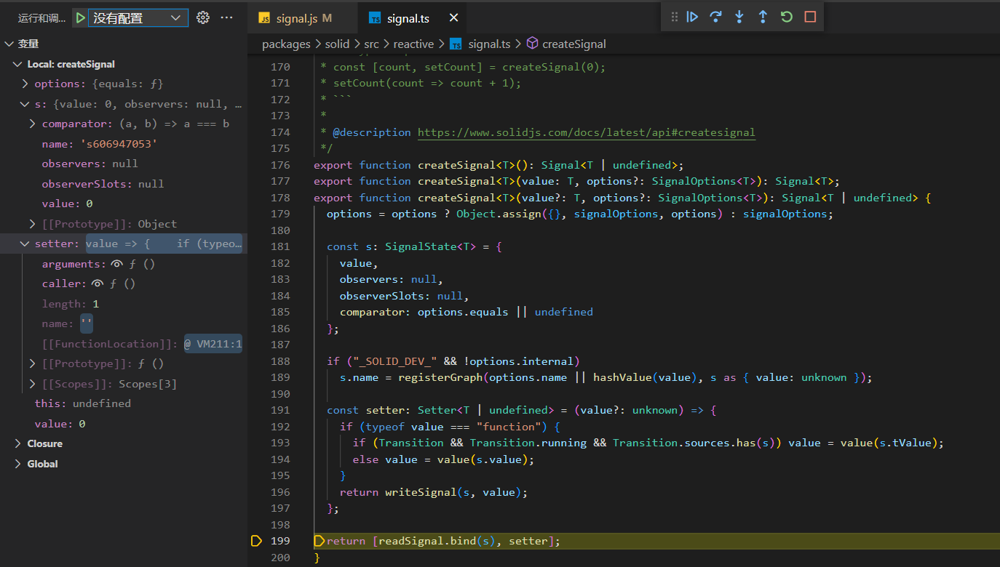
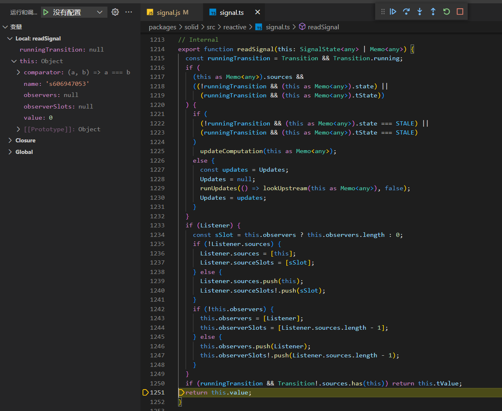
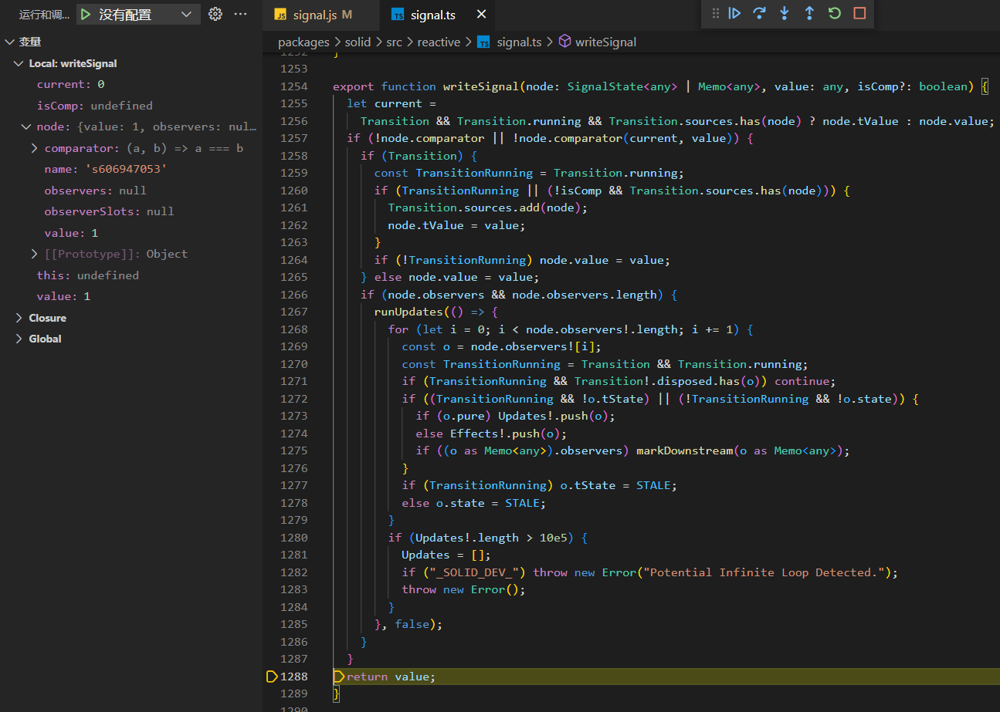

# solid.js

## 概述

[solid.js](https://www.solidjs.com/) 是一个用于构建用户界面，简单高效、性能卓越的 JavaScript 库。

> Simple and performant reactivity for building user interfaces.

特性：

* 真实 DOM 的细粒度更新
* 组件只会运行一次，不会重新执行函数体
  * react 更新每次都会重新执行函数体
* 体积小，并且运行速度快
* 提供现代框架功能
  * 例如 JSX、代码片段、Suspense、错误边界、并发渲染等
* web component 友好，支持自定义元素
* 支持服务端渲染
* 支持自定义渲染器
  * 通过自定义渲染器，原则上可以运行在任何平台
* 社区和生态正在逐步完善

工具支持：

* 阅读源码：[https://github.dev/solidjs/solid](https://github.dev/solidjs/solid)
  * [github.dev](https://github.com/github/dev) 是一个 web 编辑器，你可以使用编辑任何仓库，只需要在 github 仓库中按下 `.`  按键。
* 查看编译结果：[https://playground.solidjs.com](https://playground.solidjs.com)

相关文章：

* [如何评价前端框架 Solid?](https://www.zhihu.com/question/460278146)
* [精读《SolidJS》](https://github.com/ascoders/weekly/blob/master/前沿技术/255.精读《SolidJS》.md)

* [Introduction to Reactivity with SolidJS](https://www.youtube.com/watch?v=J70HXl1KhWE)
* [React vs SolidJS, Fight!](https://www.youtube.com/watch?v=OqcHoLWyyIw)


## 性能对比

[js-framework-benchmark](https://krausest.github.io/js-framework-benchmark/current.html)

<div></div>

## 目录划分

[https://github.com/solidjs/solid](https://github.com/solidjs/solid)

packages

- solid：核心模块，包含 solid.js 基础能力实现
- solid-element： WebComponents 相关
- solid-ssr： ssr 相关，提供 ssr 渲染的辅助工具
- babel-preset-solid：babel 实现，用于转化 jsx  相关内容
- test-integration：测试相关内容

## 代码调试

packages/solid/package.json

* vscode 调试代码
* 开启源代码映射

```diff
{
-  "type": "module",
+  "type": "commonjs"
  "scripts": {
    "build": "npm-run-all -nl build:*",
    "build:clean": "rimraf dist/ coverage/ store/dist/ web/dist/ h/dist/ h/jsx-runtime/dist html/dist/",
-    "build:js": "rollup -c",
+    "build:js": "rollup -c  --sourcemap",
    // ...
  },
}
```

packages/solid/rollup.config.js

* 配置是否开启测试环境

* 配置打包文件后映射，调试其他文件类似

```diff
export default [
  {
    input: "src/index.ts",
    output: [
      {
        file: "dist/solid.cjs",
        format: "cjs"
      },
      {
        file: "dist/solid.js",
        format: "es"
      }
    ],
    plugins: [
      replace({
-       '"_SOLID_DEV_"': false,
        preventAssignment: true,
        delimiters: ["", ""]
      })
    ].concat(plugins)
  },
  {
    input: "web/src/index.ts",
    output: [
      {
        file: "web/dist/web.cjs",
        format: "cjs"
      },
      {
        file: "web/dist/web.js",
        format: "es",
+        paths: {
+          "solid-js": "../../dist/solid.js"
+        }
      }
    ],
   	// ...
  }
]
```

接下来，就可以运行 `pnpm run build` 命令打包代码，然后创建测试用例，引入打包后的代码即可。

[配置案例](https://github.com/yw0525/solid/tree/feat-read)

## 响应式基础

### createSignal 源码分析

[https://www.solidjs.com/docs/latest/api#createsignal](https://www.solidjs.com/docs/latest/api#createsignal)

`createSignal` 用来创建响应式数据，它可以跟踪单个值的变化。

> solid.js 的响应式实现参考了 [S.js](https://github.com/adamhaile/S)，它是一个体积超小的 reactive 库，支持自动收集依赖和简单的响应式编程。

#### createSignal

[createSignal](https://github.com/solidjs/solid/blob/main/packages/solid/src/reactive/signal.ts#L153)

首先我们来看下 `createSignal` 的声明：

```typescript
// packages/solid/src/reactive/signal.ts

export interface BaseOptions {
  name?: string;
}
export interface EffectOptions extends BaseOptions {}
export interface MemoOptions<T> extends EffectOptions {
  equals?: false | ((prev: T, next: T) => boolean);
}

export type Accessor<T> = () => T;

export type Setter<T> = (undefined extends T ? () => undefined : {}) &
  (<U extends T>(value: (prev: T) => U) => U) &
  (<U extends T>(value: Exclude<U, Function>) => U) &
  (<U extends T>(value: Exclude<U, Function> | ((prev: T) => U)) => U);
```

```typescript
// packages/solid/src/reactive/signal.ts

export type Signal<T> = [get: Accessor<T>, set: Setter<T>];

export interface SignalOptions<T> extends MemoOptions<T> {
  internal?: boolean;
}

export function createSignal<T>(): Signal<T | undefined>;
export function createSignal<T>(value: T, options?: SignalOptions<T>): Signal<T>;
```

可以看到 `createSignal` 支持两个参数，分别是 value 和 options，然后返回一个包含 setter 和 getter 的数组。

参数：

* value：初始值，默认值为 `undefiend`
* options
  * equals：自定义比较器，用于新旧值比较或触发强制更新，允许传递函数或者 false；
  * internal（可选）：标识是否为内置属性，应用于开发环境，生产环境会移除掉相关逻辑；
  * name（可选）：自定义属性对象名称，应用于开发环境，生产环境会移除掉相关逻辑。

返回值：

* getter：返回当前值，以函数形式调用
  * 自动进行依赖收集。例如在 `createEffect` 中调用 getter， state 对象会与 effect 建立依赖关系。
* setter：设置值，以函数形式调用
  * 如果存在依赖当前 state 对象的观察者，循环执行观察者数组。

了解 `createSignal` 声明之后，下面我们来看下具体实现。

```typescript
// packages/solid/src/reactive/signal.ts

export function createSignal<T>(value?: T, options?: SignalOptions<T>): Signal<T | undefined> {
  options = options ? Object.assign({}, signalOptions, options) : signalOptions;

  const s: SignalState<T> = {
    value,
    observers: null,
    observerSlots: null,
    comparator: options.equals || undefined
  };

  if ("_SOLID_DEV_" && !options.internal)
    s.name = registerGraph(options.name || hashValue(value), s as { value: unknown });

  const setter: Setter<T | undefined> = (value?: unknown) => {
    if (typeof value === "function") {
      if (Transition && Transition.running && Transition.sources.has(s)) value = value(s.tValue);
      else value = value(s.value);
    }
    return writeSignal(s, value);
  };

  return [readSignal.bind(s), setter];
}
```

如果用户传入 options，会对 options 和默认的 options 进行合并，否则使用默认 options。

```typescript
// packages/solid/src/reactive/signal.ts

export const equalFn = <T>(a: T, b: T) => a === b;
const signalOptions = { equals: equalFn };
```

默认配置只有一个 `equals` 属性，值为 `equalFn` ，用于比较两个值是否相同。

由于这里比较的是引用地址，所以当你改变一个对象的某个属性，重新赋值时，相关订阅并不会被触发，所以这时我们可以在传入的 options 配置中配置 `equals` 为 false 或者自定义其他比较逻辑。例如下面的案例：

```typescript
const [object, setObject] = createSignal({ count: 0 });

createEffect(() => {
  console.log(object());
});

object().count = 2;
setObject(object);

setObject(current => {
  current.count += 1;
  current.updated = new Date();
  return current;
});

// { count: 0 }
```

上述代码在运行时 effect 中代码只会触发一次，这可能与我们的预期不符，所以我们可以传入自定义 options。

```typescript
const [object, setObject] = createSignal({ count: 0 }, { equals: false });

// { count: 0 }
// { count: 2 }
// { count: 3, updated: 2022-09-11T08:21:44.258Z }
```

当我们设置 equals 属性为 false，effect 就会被触发 3 次。

除此之外，我们还可以使用该配置作为触发器来使用，这里就不展开阐述了。感兴趣可以查看官方提供的案例，[createSignal](https://www.solidjs.com/docs/latest/api#createsignal)。

下面让我们继续查看代码：

```typescript
// packages/solid/src/reactive/signal.ts

export interface SignalState<T> {
  value?: T;
  observers: Computation<any>[] | null;
  observerSlots: number[] | null;
  tValue?: T;
  comparator?: (prev: T, next: T) => boolean;
  name?: string;
}

export function createSignal<T>(value?: T, options?: SignalOptions<T>): Signal<T | undefined> {
  options = options ? Object.assign({}, signalOptions, options) : signalOptions;

  const s: SignalState<T> = {
    value,
    observers: null,
    observerSlots: null,
    comparator: options.equals || undefined
  };

  if ("_SOLID_DEV_" && !options.internal)
    s.name = registerGraph(options.name || hashValue(value), s as { value: unknown });

  const setter: Setter<T | undefined> = (value?: unknown) => {
    if (typeof value === "function") {
      if (Transition && Transition.running && Transition.sources.has(s)) value = value(s.tValue);
      else value = value(s.value);
    }
    return writeSignal(s, value);
  };

  return [readSignal.bind(s), setter];
}
```

在 `createSignal` 定义了 `s` 对象，它有四个属性，分别是：

* value：传入的值
* observers：观察者数组
* observerSlots：观察者对象在数组的位置
* comparator：比较器

```typescript
// packages/solid/src/reactive/signal.ts

if ("_SOLID_DEV_" && !options.internal)
  s.name = registerGraph(options.name || hashValue(value), s as { value: unknown });
```

这段代码为 state 对象设置了 name 属性，不过它只作用于开发环境，生产环境打包时 `_SOLID_DEV_` 变量会被替换为 false，然后会作为 decode 被移除掉。

```js
// packages/solid/rollup.config.js

export default [
  {
    input: "src/index.ts",
		// ...
    plugins: [
      replace({
        '"_SOLID_DEV_"': false,
        preventAssignment: true,
        delimiters: ["", ""]
      })
    ].concat(plugins)
  }
]
```

接下来定义 setter 函数：首先会对 value 的值进行判断，如果传递的 setter 是一个 函数：

* 如果发现 `Transition` 存在，并且 `Transition.sources` 中存在当前 state，会使用 `s.tValue` 属性值；
* 如果上述条件不满足，会使用当前 state 的 value 属性值。

然后调用 `wrtieSignal`，并返回其结果。

```typescript
// packages/solid/src/reactive/signal.ts

export function createSignal<T>(value?: T, options?: SignalOptions<T>): Signal<T | undefined> {
 	// ...
  
  const setter: Setter<T | undefined> = (value?: unknown) => {
    if (typeof value === "function") {
      if (Transition && Transition.running && Transition.sources.has(s)) value = value(s.tValue);
      else value = value(s.value);
    }
    return writeSignal(s, value);
  };

  return [readSignal.bind(s), setter];
}
```

最后返回操作数组：第一个参数为 readSignal 函数，用来返回 s 中的 value 值，第二个参数就是 setter。

总结一下，`createSignal` 首先会合并用户 options，其次会定义 state 对象，用来记录当前值和依赖关系，然后定义 setter 函数，用来设置值，最后返回一个数组，分别是 `readSignal` 函数和 `setter` 函数。

#### readSignal

[readSignal](https://github.com/solidjs/solid/blob/main/packages/solid/src/reactive/signal.ts#L1214)

看完 createSignal 定义，接着我们再来看下 readSignal，这个方法非常重要。solid.js 依赖关系的建立就发生在这个方法中。

```typescript
// packages/solid/src/reactive/signal.ts

// Internal
export function readSignal(this: SignalState<any> | Memo<any>) {
  const runningTransition = Transition && Transition.running;
  if (
    (this as Memo<any>).sources &&
    ((!runningTransition && (this as Memo<any>).state) ||
      (runningTransition && (this as Memo<any>).tState))
  ) {
    if (
      (!runningTransition && (this as Memo<any>).state === STALE) ||
      (runningTransition && (this as Memo<any>).tState === STALE)
    )
      updateComputation(this as Memo<any>);
    else {
      const updates = Updates;
      Updates = null;
      runUpdates(() => lookUpstream(this as Memo<any>), false);
      Updates = updates;
    }
  }
  if (Listener) {
    const sSlot = this.observers ? this.observers.length : 0;
    if (!Listener.sources) {
      Listener.sources = [this];
      Listener.sourceSlots = [sSlot];
    } else {
      Listener.sources.push(this);
      Listener.sourceSlots!.push(sSlot);
    }
    if (!this.observers) {
      this.observers = [Listener];
      this.observerSlots = [Listener.sources.length - 1];
    } else {
      this.observers.push(Listener);
      this.observerSlots!.push(Listener.sources.length - 1);
    }
  }
  if (runningTransition && Transition!.sources.has(this)) return this.tValue;
  return this.value;
}
```

函数内部首先判断是否正在 transition，我们暂时不需要关心这段逻辑，直接跳到下面这段逻辑：

```typescript
// packages/solid/src/reactive/signal.ts

export function readSignal(this: SignalState<any> | Memo<any>) {
	// ...
  if (Listener) {
    const sSlot = this.observers ? this.observers.length : 0;
    if (!Listener.sources) {
      Listener.sources = [this];
      Listener.sourceSlots = [sSlot];
    } else {
      Listener.sources.push(this);
      Listener.sourceSlots!.push(sSlot);
    }
    if (!this.observers) {
      this.observers = [Listener];
      this.observerSlots = [Listener.sources.length - 1];
    } else {
      this.observers.push(Listener);
      this.observerSlots!.push(Listener.sources.length - 1);
    }
  }
  if (runningTransition && Transition!.sources.has(this)) return this.tValue;
  return this.value;
}
```

首先会判断 Listener 是否存在，如果存在才会执行这段代码。那么这个 Listener 是什么时候被定义并赋值的呢？

```typescript
// packages/solid/src/reactive/signal.ts

let Listener: Computation<any> | null = null;
let Updates: Computation<any>[] | null = null;
let Effects: Computation<any>[] | null = null;
```

Listener 是一个全局变量，默认值是 null。同时还定义了 `Updates`、`Effectes` 数组，它们都是 Computation 类型。

```typescript
export type EffectFunction<Prev, Next extends Prev = Prev> = (v: Prev) => Next;

export interface SignalState<T> {
  value?: T;
  observers: Computation<any>[] | null;
  observerSlots: number[] | null;
  tValue?: T;
  comparator?: (prev: T, next: T) => boolean;
  name?: string;
}

export interface Owner {
  owned: Computation<any>[] | null;
  cleanups: (() => void)[] | null;
  owner: Owner | null;
  context: any | null;
  sourceMap?: Record<string, { value: unknown }>;
  name?: string;
  componentName?: string;
}

export interface Computation<Init, Next extends Init = Init> extends Owner {
  fn: EffectFunction<Init, Next>;
  state: number;
  tState?: number;
  sources: SignalState<Next>[] | null;
  sourceSlots: number[] | null;
  value?: Init;
  updatedAt: number | null;
  pure: boolean;
  user?: boolean;
  suspense?: SuspenseContextType;
}
```

可以看到 Computation 是一个对象，定义了很多属性，基本都不知道啥作用。不过其中一个 sources 属性，你是否也感觉很眼熟？

对，它就是一个普通的 signal 对象，也就是我们调用 `createSignal` 方法时，内部创建的 s 对象。

另外可以看到，上面 `SignalState` 接口声明中的 observers 就是一个 Computation 类型的数组，这时我们已经知道 state 和 computation 互相依赖，并且是多对多的关系。

接下来再回到代码：

```typescript
// packages/solid/src/reactive/signal.ts

export function readSignal(this: SignalState<any> | Memo<any>) {
	// ...
  if (Listener) {
    const sSlot = this.observers ? this.observers.length : 0;
    if (!Listener.sources) {
      Listener.sources = [this];
      Listener.sourceSlots = [sSlot];
    } else {
      Listener.sources.push(this);
      Listener.sourceSlots!.push(sSlot);
    }
    if (!this.observers) {
      this.observers = [Listener];
      this.observerSlots = [Listener.sources.length - 1];
    } else {
      this.observers.push(Listener);
      this.observerSlots!.push(Listener.sources.length - 1);
    }
  }
  if (runningTransition && Transition!.sources.has(this)) return this.tValue;
  return this.value;
}
```

当 Listener 存在时，首先会获取当前 observers 的数量，如果不存在就是 0，这里的 this 就是 `s` 对象。

```typescript
export function createSignal<T>(value?: T, options?: SignalOptions<T>): Signal<T | undefined> {
	// ...
  return [readSignal.bind(s), setter];
}
```

接下来分别判断 Listener.sources 和 this.observers 是否存在，如果不存在会创建数组，并建立依赖关系。最后将 s 对象的 value 返回。这里的 value 就是我们调用 createSignal 传入的初始值。

不同于 vue 中 通过 Proxy 或者 Object.defineProperty 进行属性劫持，solid.js 中的依赖关系建立是通过函数调用实现的，例如在 `createEffect` 中调用 `getter` 函数，这时就会建立依赖关系。

#### writeSignal

[writeSignal](https://github.com/solidjs/solid/blob/main/packages/solid/src/reactive/signal.ts#L1254)

我们已经知道，通过 getter 可以建立 compulation 和 state 之间的依赖关系。setter 函数其实就是用来触发依赖。

```typescript
export function writeSignal(node: SignalState<any> | Memo<any>, value: any, isComp?: boolean) {
  let current =
    Transition && Transition.running && Transition.sources.has(node) ? node.tValue : node.value;
  if (!node.comparator || !node.comparator(current, value)) {
    if (Transition) {
      const TransitionRunning = Transition.running;
      if (TransitionRunning || (!isComp && Transition.sources.has(node))) {
        Transition.sources.add(node);
        node.tValue = value;
      }
      if (!TransitionRunning) node.value = value;
    } else node.value = value;
    if (node.observers && node.observers.length) {
      runUpdates(() => {
        for (let i = 0; i < node.observers!.length; i += 1) {
          const o = node.observers![i];
          const TransitionRunning = Transition && Transition.running;
          if (TransitionRunning && Transition!.disposed.has(o)) continue;
          if ((TransitionRunning && !o.tState) || (!TransitionRunning && !o.state)) {
            if (o.pure) Updates!.push(o);
            else Effects!.push(o);
            if ((o as Memo<any>).observers) markDownstream(o as Memo<any>);
          }
          if (TransitionRunning) o.tState = STALE;
          else o.state = STALE;
        }
        if (Updates!.length > 10e5) {
          Updates = [];
          if ("_SOLID_DEV_") throw new Error("Potential Infinite Loop Detected.");
          throw new Error();
        }
      }, false);
    }
  }
  return value;
}
```

writeSignal 接收两个参数，第一个参数就是 state 对象，第二个参数就是我们传入的值。

首先获取 current，我们暂时忽略 Transition 相关的判断逻辑，这里的 current 就是 state 的值，也就是旧值。

当 `node.comparator` 为 false，或者新值和旧值不同时，才会进行赋值和触发更新。

> comparator 可以被赋值为 false 或者一个函数，默认 comparator 只会比较新值和旧值引用是否相同，这里我们后面再去分析。

当传入的值与旧值不同，将新值赋值 `node.value`。然后判断 node 是否存在观察者，如果存在会循环遍历 observers 数组，根据不同逻辑放入 Updates 或者 Effects 数组，不过最终都会执行 observer 对象，即 computation 对象。

#### 案例分析

我们可以通过源码调试的方式对代码进行分析。

我们来看下面这个例子。

```typescript
const { createSignal } = require("../../solid/dist/solid.cjs");

const [count, setCount] = createSignal(0);

console.log(count());
setCount(count() + 1);
console.log(count());
```

例子很简单，就是创建一个响应式数据，打印它，改变值后继续对其进行打印。

当 createSignal 函数被执行完毕之前，我们可以可以看到 s 对象已经被创建，value 值为 0，observers 为 null。



接下来执行第一次打印，这时会触发 readSignal 函数。

可以看到，this 其实就是 state 对象，此时 runningTransition 和 Listerner 都为空，什么都不会执行，直接返回 s.value。



当执行到 `setCount(count() + 1)` 这段代码时，首先会取到 state 的 value 值，然后再进行计算，并将结果传给 setter 函数，触发 `writeSignal` 函数。



可以看到，current 的值是 0，此时 comparator 肯定是存在的，并且两个值并不相等，由于 Transition 不存在，所以会将 value 赋值给 `node.value`，此时 state 的 value 值已经变为 1。由于 node.observers` 也不存在，所以会直接返回传入的 value ，函数执行完毕。

接下来执行最后一次打印，和之前的过程一样，这里只是做了一次取值操作，打印出改变后的结果 1。

我们还可以调试其他案例，比如给 `createSignal` 传递第二个参数，配置 name 和 equals 属性然后查看代码的变化。

[相关案例](https://github.com/yw0525/solid/blob/feat-read/packages/examples/01_reactivity/signal.js)

#### 总结

createSignal 用于创建响应式数据，其内部定义了一个 s 对象，保存当前值和依赖关系，并返回 getter 函数和 setter 函数。

当调用 getter 函数读取值时，如果存在 Listener，双方会建立依赖关系，即将 Listener 添加到 state 的 observers 数组中，将 state 添加到 Listener 的 sources 数组中， 并返回当前值。

当调用 settter 函数赋值时，如果存在 observers，会遍历 observers 数组，并根据逻辑加入 Updates 或 Effects 数组中，最后去执行它们，触发副作用函数执行。

### createEffect 源码分析

[https://www.solidjs.com/docs/latest/api#createeffect](https://www.solidjs.com/docs/latest/api#createeffect)

`createEffect` 会创建一个 computation ，当在函数体内执行 getter 函数，会自动收集相关依赖。当依赖更新时，会重新运行该函数。

下面我们将使用这段代码对源码进行分析：

```typescript
const [count, setCount] = createSignal(0);

createEffect(() => {
  console.log("count =", count());
});

setCount(count() + 1);
```

#### 依赖收集

##### createEffect

[createEffect 源码](https://github.com/solidjs/solid/blob/main/packages/solid/src/reactive/signal.ts#L278)

首先我们来看下 `createEffect` 的声明：

```typescript
export interface BaseOptions {
  name?: string;
}

export interface EffectOptions extends BaseOptions {}

// Also similar to OnEffectFunction
export type EffectFunction<Prev, Next extends Prev = Prev> = (v: Prev) => Next;

export function createEffect<Next>(fn: EffectFunction<undefined | NoInfer<Next>, Next>): void;
export function createEffect<Next, Init = Next>(
  fn: EffectFunction<Init | Next, Next>,
  value: Init,
  options?: EffectOptions
): void;
```

可以看到 `createEffect` 可以传递三个参数，分别是 fn、value 和 options，没有返回值。

* fn：副作用函数，当依赖项更新时，会重新执行
* value：初始值，创建 compulation 对象时会作为初始值
* options
  * name：compulation 对象名称，开发环境使用，生产环境会被移除

接下来看下具体实现：

```typescript
let Listener: Computation<any> | null = null;
let Updates: Computation<any>[] | null = null;
let Effects: Computation<any>[] | null = null;

let runEffects = runQueue;

function runQueue(queue: Computation<any>[]) {
  for (let i = 0; i < queue.length; i++) runTop(queue[i]);
}

function runUserEffects(queue: Computation<any>[]) {
  let i,
    userLength = 0;
  for (i = 0; i < queue.length; i++) {
    const e = queue[i];
    if (!e.user) runTop(e);
    else queue[userLength++] = e;
  }
  if (sharedConfig.context) setHydrateContext();
  for (i = 0; i < userLength; i++) runTop(queue[i]);
}

export function createEffect<Next, Init>(
  fn: EffectFunction<Init | Next, Next>,
  value?: Init,
  options?: EffectOptions
): void {
  runEffects = runUserEffects;
  const c = createComputation(fn, value!, false, STALE, "_SOLID_DEV_" ? options : undefined),
    s = SuspenseContext && lookup(Owner, SuspenseContext.id);
  if (s) c.suspense = s;
  c.user = true;
  Effects ? Effects.push(c) : updateComputation(c);
}
```

首先将 `runUserEffects` 函数赋值给 `runEffects` ，用来指定用户副作用函数的调度流程。

然后会调用 `createComputation` 函数创建 computation 对象，这个 computation 对象就是 readSignal 中的 Listener，当 readSignal 函数执行时会被被添加 state 的 observers 数组中。

我们可以暂时忽略 suspense 相关逻辑，这里只需要看响应式处理相关的内容。

创建完 computation 对象后，会将 computation 对象的 user 属性设置为 true，说明这是用户传入的 effect 函数。

> 在 solid.js 中，凡是需要收集依赖并在依赖变化时进行更新的操作，都会被描述成一个 Computation。

接着会判断 Effects 是否存在，如果存在将 computation 对象添加到 Effects 数组中，否则调用 `updateComputation` 函数进行更新。

##### createComputation

在 createEffect 创建 computation 对象，传入以下参数：

```typescript
const STALE = 1;
const c = createComputation(fn, value!, false, STALE, "_SOLID_DEV_" ? options : undefined)
```

第 3 个参数为 false，即 pure 属性设置为 false，然后第 4 个参数 state 设置为 1。

```typescript
function createComputation<Next, Init = unknown>(
  fn: EffectFunction<Init | Next, Next>,
  init: Init,
  pure: boolean,
  state: number = STALE,
  options?: EffectOptions
): Computation<Init | Next, Next> {
  const c: Computation<Init | Next, Next> = {
    fn,
    state: state,
    updatedAt: null,
    owned: null,
    sources: null,
    sourceSlots: null,
    cleanups: null,
    value: init,
    owner: Owner,
    context: null,
    pure
  };

  if (Transition && Transition.running) {
    c.state = 0;
    c.tState = state;
  }

  if (Owner === null)
    "_SOLID_DEV_" &&
      console.warn(
        "computations created outside a `createRoot` or `render` will never be disposed"
      );
  else if (Owner !== UNOWNED) {
    if (Transition && Transition.running && (Owner as Memo<Init, Next>).pure) {
      if (!(Owner as Memo<Init, Next>).tOwned) (Owner as Memo<Init, Next>).tOwned = [c];
      else (Owner as Memo<Init, Next>).tOwned!.push(c);
    } else {
      if (!Owner.owned) Owner.owned = [c];
      else Owner.owned.push(c);
    }
    if ("_SOLID_DEV_")
      c.name =
        (options && options.name) ||
        `${(Owner as Computation<any>).name || "c"}-${
          (Owner.owned || (Owner as Memo<Init, Next>).tOwned!).length
        }`;
  }

  if (ExternalSourceFactory) {
    const [track, trigger] = createSignal<void>(undefined, { equals: false });
    const ordinary = ExternalSourceFactory(c.fn, trigger);
    onCleanup(() => ordinary.dispose());
    const triggerInTransition: () => void = () =>
      startTransition(trigger).then(() => inTransition.dispose());
    const inTransition = ExternalSourceFactory(c.fn, triggerInTransition);
    c.fn = x => {
      track();
      return Transition && Transition.running ? inTransition.track(x) : ordinary.track(x);
    };
  }

  return c;
}
```

createComputation 函数的主要的功能就是创建 computation 对象 c，并将它返回。

##### updateComputation

```typescript
export function createEffect<Next, Init>(
  fn: EffectFunction<Init | Next, Next>,
  value?: Init,
  options?: EffectOptions
): void {
  runEffects = runUserEffects;
  const c = createComputation(fn, value!, false, STALE, "_SOLID_DEV_" ? options : undefined),
    s = SuspenseContext && lookup(Owner, SuspenseContext.id);
  if (s) c.suspense = s;
  c.user = true;
  Effects ? Effects.push(c) : updateComputation(c);
}
```

首次执行时，Effects 数组肯定是不存在的，所以会调用 updateComputation 函数，并将 computation 对象传入。

```typescript
function updateComputation(node: Computation<any>) {
  if (!node.fn) return;
  cleanNode(node);
  const owner = Owner,
    listener = Listener,
    time = ExecCount;
  Listener = Owner = node;
  runComputation(
    node,
    Transition && Transition.running && Transition.sources.has(node as Memo<any>)
      ? (node as Memo<any>).tValue
      : node.value,
    time
  );

  if (Transition && !Transition.running && Transition.sources.has(node as Memo<any>)) {
    queueMicrotask(() => {
      runUpdates(() => {
        Transition && (Transition.running = true);
        runComputation(node, (node as Memo<any>).tValue, time);
      }, false);
    });
  }
  Listener = listener;
  Owner = owner;
}
```

首先判断 fn 是否存在，如果不存在，直接返回。然后执行 cleanNode 逻辑。

```typescript
function cleanNode(node: Owner) {
  let i;
  if ((node as Computation<any>).sources) {
    while ((node as Computation<any>).sources!.length) {
      const source = (node as Computation<any>).sources!.pop()!,
        index = (node as Computation<any>).sourceSlots!.pop()!,
        obs = source.observers;
      if (obs && obs.length) {
        const n = obs.pop()!,
          s = source.observerSlots!.pop()!;
        if (index < obs.length) {
          n.sourceSlots![s] = index;
          obs[index] = n;
          source.observerSlots![index] = s;
        }
      }
    }
  }

  if (Transition && Transition.running && (node as Memo<any>).pure) {
    if ((node as Memo<any>).tOwned) {
      for (i = 0; i < (node as Memo<any>).tOwned!.length; i++)
        cleanNode((node as Memo<any>).tOwned![i]);
      delete (node as Memo<any>).tOwned;
    }
    reset(node as Computation<any>, true);
  } else if (node.owned) {
    for (i = 0; i < node.owned.length; i++) cleanNode(node.owned[i]);
    node.owned = null;
  }

  if (node.cleanups) {
    for (i = 0; i < node.cleanups.length; i++) node.cleanups[i]();
    node.cleanups = null;
  }
  if (Transition && Transition.running) (node as Computation<any>).tState = 0;
  else (node as Computation<any>).state = 0;
  node.context = null;
  "_SOLID_DEV_" && delete node.sourceMap;
}
```

在 cleanNode 中，首次使用 createEffect，大部分逻辑都不会走到， 这时 computation 对象的 sources、owned 都为空，不过这时会触发 `(node as Computation<any>).state = 0;`， 将原本 computation 对象的 state 设置为 0，原本为 1。

然后定义 `owner`、`listener` 缓存已经存在的 `Owner`、`Listener` ，这时的 `owner`、`listener` 都为空。

接下来的操作比较关键，将 `node` 赋值给 `Listener`、`Owner` ，这时如果调用 readSignal 时，Listener 是存在的，即当前正在执行的 Computation 对象。

然后会调用 `runComputation` 方法，执行用户传入的副作用函数。

```typescript
function updateComputation(node: Computation<any>) {
  if (!node.fn) return;
  cleanNode(node);
  const owner = Owner,
    listener = Listener,
    time = ExecCount;
  Listener = Owner = node;
  runComputation(
    node,
    Transition && Transition.running && Transition.sources.has(node as Memo<any>)
      ? (node as Memo<any>).tValue
      : node.value,
    time
  );

  if (Transition && !Transition.running && Transition.sources.has(node as Memo<any>)) {
    queueMicrotask(() => {
      runUpdates(() => {
        Transition && (Transition.running = true);
        runComputation(node, (node as Memo<any>).tValue, time);
      }, false);
    });
  }
  Listener = listener;
  Owner = owner;
}
```

此时 Transition 并不存在，跳过下面这段逻辑，最后再还原 Listener、Owner。

##### runComputation

```typescript
function runComputation(node: Computation<any>, value: any, time: number) {
  let nextValue;
  try {
    nextValue = node.fn(value);
  } catch (err) {
    if (node.pure) Transition && Transition.running ? (node.tState = STALE) : (node.state = STALE);
    handleError(err);
  }
  if (!node.updatedAt || node.updatedAt <= time) {
    if (node.updatedAt != null && "observers" in (node as Memo<any>)) {
      writeSignal(node as Memo<any>, nextValue, true);
    } else if (Transition && Transition.running && node.pure) {
      Transition.sources.add(node as Memo<any>);
      (node as Memo<any>).tValue = nextValue;
    } else node.value = nextValue;
    node.updatedAt = time;
  }
}
```

首先定义 `nextValue` 变量，用来存储最新计算的值。

接下来调用 `node.fn` 函数，计算值并赋值给 `nextValue` 变量。这里的 `node.fn` 就是我们使用 ` createEffect` 传入的自定义函数。

获取到最新值后，判断 `node.updateAt` 是否不存在，或者 `node.updatedAt < time` 。

首次创建时，updateAt 属性并不存在，这时 `Transition` 也不存在，所以这里只是进行赋值操作，将计算后的最新值赋值给 `node.value`。

然后给 `node.updateAt` 赋值为 time，这里的 time 是调用 `runComputation` 时传入的，这时的 `time` 为默认值 `ExecCount`，它的值是 0。

下面我们继续看执行 `node.fn` 的过程，当执行到 `node.fn` 时，会调用我们传入的自定义函数。

```typescript
createEffect(() => {
  console.log("count =", count());
});
```

我们在函数中使用了名为 count 的 getter 函数，当调用 count 时，会调用 getter 函数，即 `readSignal` 。

```typescript
// Internal
export function readSignal(this: SignalState<any> | Memo<any>) {
  const runningTransition = Transition && Transition.running;
  if (
    (this as Memo<any>).sources &&
    ((!runningTransition && (this as Memo<any>).state) ||
      (runningTransition && (this as Memo<any>).tState))
  ) {
    if (
      (!runningTransition && (this as Memo<any>).state === STALE) ||
      (runningTransition && (this as Memo<any>).tState === STALE)
    )
      updateComputation(this as Memo<any>);
    else {
      const updates = Updates;
      Updates = null;
      runUpdates(() => lookUpstream(this as Memo<any>), false);
      Updates = updates;
    }
  }
  if (Listener) {
    const sSlot = this.observers ? this.observers.length : 0;
    if (!Listener.sources) {
      Listener.sources = [this];
      Listener.sourceSlots = [sSlot];
    } else {
      Listener.sources.push(this);
      Listener.sourceSlots!.push(sSlot);
    }
    if (!this.observers) {
      this.observers = [Listener];
      this.observerSlots = [Listener.sources.length - 1];
    } else {
      this.observers.push(Listener);
      this.observerSlots!.push(Listener.sources.length - 1);
    }
  }
  if (runningTransition && Transition!.sources.has(this)) return this.tValue;
  return this.value;
}
```

这段代码其实我们之前已经分析过，它会返回当前 state 的 value 值，即我们定义的属性值。

不过当时 `Listener` 并不存在，现在情况则不同，当我们调用 `updateComputation` 方法时，Listener 已经被赋值为 `node` ，即 `computation` 对象。

```typescript
Listener = Owner = node;
```

目前的 Transition 仍然是不存在的，我们直接来看 `Listerner` 相关逻辑。

```typescript
// Internal
export function readSignal(this: SignalState<any> | Memo<any>) {
	// ...
  if (Listener) {
    const sSlot = this.observers ? this.observers.length : 0;
    if (!Listener.sources) {
      Listener.sources = [this];
      Listener.sourceSlots = [sSlot];
    } else {
      Listener.sources.push(this);
      Listener.sourceSlots!.push(sSlot);
    }
    if (!this.observers) {
      this.observers = [Listener];
      this.observerSlots = [Listener.sources.length - 1];
    } else {
      this.observers.push(Listener);
      this.observerSlots!.push(Listener.sources.length - 1);
    }
  }
  if (runningTransition && Transition!.sources.has(this)) return this.tValue;
  return this.value;
}
```

这里的 this 还是 state，即 signalState 对象。

首先判断 `observers` 数组是否存在，很明显此时 `observers` 为空，我们并没有为其赋过值，所以这里的 `sSlot` 是 0。

然后判断 `Listener.sources` 是否存在：

* 如果 `Listener.sources` 不存在，创建空数组，并分别为其赋值为 this（signalState）和 sSlot。
* 如果 `Listener.sourcese` 存在，在数组中追加值。

继续判断 `this.observers` 是否存在：

* 如果 `this.observers` 不存在
  * 创建空数组，赋值为 `Listener` ，即 computation 对象，赋值给 `this.observers`；
  * 创建空数组，赋值为 `Listener.sources.length - 1`，此时值为 0；
* 如果 `this.observers` 存储，追加值

执行完这部分代码，computation 和 signalState 已经建立起双向联系：

* signalState 的 observers 数组中，存储的是 computation；
* computation 的 sources 数组中，存储的是 signalState。

最后返回 `this.value`，这时控制台就可以打印出 `count = 0 `。

#### 更新流程

#####  writeSignal

代码继续执行，接下来执行更新操作。

```typescript
setCount(count() + 1);
```

首先调用 getter 函数获取当前值，继续 writeSignal 函数，不过此时 `Listenenr` 已经设置为空，所以只是返回当前值。

> updateComputation 执行完 runComputation，会把缓存的 listener 赋值给 Listener，owner 赋值给 Owner。

所以我们得到数值 1 并传递给 `setCount` 函数，即 setter 函数，然后调用 writeSignal。

```typescript
export function createSignal<T>(value?: T, options?: SignalOptions<T>): Signal<T | undefined> {
  // ...
  
  const setter: Setter<T | undefined> = (value?: unknown) => {
    if (typeof value === "function") {
      if (Transition && Transition.running && Transition.sources.has(s)) value = value(s.tValue);
      else value = value(s.value);
    }
    return writeSignal(s, value);
  };

  return [readSignal.bind(s), setter];
}
```

由于这里的 value 并不是 function，会直接调用 `writeSignal` 函数。

```typescript
export function writeSignal(node: SignalState<any> | Memo<any>, value: any, isComp?: boolean) {
  let current =
    Transition && Transition.running && Transition.sources.has(node) ? node.tValue : node.value;
  if (!node.comparator || !node.comparator(current, value)) {
    if (Transition) {
      const TransitionRunning = Transition.running;
      if (TransitionRunning || (!isComp && Transition.sources.has(node))) {
        Transition.sources.add(node);
        node.tValue = value;
      }
      if (!TransitionRunning) node.value = value;
    } else node.value = value;
    if (node.observers && node.observers.length) {
      runUpdates(() => {
        for (let i = 0; i < node.observers!.length; i += 1) {
          const o = node.observers![i];
          const TransitionRunning = Transition && Transition.running;
          if (TransitionRunning && Transition!.disposed.has(o)) continue;
          if ((TransitionRunning && !o.tState) || (!TransitionRunning && !o.state)) {
            if (o.pure) Updates!.push(o);
            else Effects!.push(o);
            if ((o as Memo<any>).observers) markDownstream(o as Memo<any>);
          }
          if (TransitionRunning) o.tState = STALE;
          else o.state = STALE;
        }
        if (Updates!.length > 10e5) {
          Updates = [];
          if ("_SOLID_DEV_") throw new Error("Potential Infinite Loop Detected.");
          throw new Error();
        }
      }, false);
    }
  }
  return value;
}
```

此时 Transition 依旧不存在，会将 value 值赋值给 `node.value`，此时 `node.value` 已经变为 1。

接下来继续执行，此时 `node.observers` 是存在的。使用 `runUpdates` 函数包括匿名函数，runUpdates 是调度逻辑，我们后面再来分析。

首先对 observers 数组进行遍历，获取到 computation 对象。

因为 Transition 并不存在，但是 computation 的 state 为 0， 所以会命中以下逻辑：

> 在 updateComputation 的 cleanNode 函数中将 state 修改为 0。

```typescript
const STALE = 1;

if ((TransitionRunning && !o.tState) || (!TransitionRunning && !o.state)) {
  if (o.pure) Updates!.push(o);
  else Effects!.push(o);
  if ((o as Memo<any>).observers) markDownstream(o as Memo<any>);
}
if (TransitionRunning) o.tState = STALE;
else o.state = STALE;
```

由于此时 pure 属性为 false，所以会将 computation 对象添加到 Effects 数组中，然后再将 state 的值重新修改为 1。

##### runUpdates

runUpdates 是任务调度相关逻辑：

```typescript
let ExecCount = 0;

function runUpdates<T>(fn: () => T, init: boolean) {
  if (Updates) return fn();
  let wait = false;
  if (!init) Updates = [];
  if (Effects) wait = true;
  else Effects = [];
  ExecCount++;
  try {
    const res = fn();
    completeUpdates(wait);
    return res;
  } catch (err) {
    if (!Updates) Effects = null;
    handleError(err);
  }
}
```

判断 Updates 是否存在，如果存在，直接返回函数执行。

定义 wait 变量，赋值 false，`!init` 为真，将 Updates 赋值为空数组。此时 Effects 并不存在，赋值为空数组，`ExecCount` 变量自增，此时为 1。

然后执行函数内部逻辑，将 computation 添加到 Effects 数组中。

```typescript
const res = fn();
completeUpdates(wait);
```

最后调用 `completeUpdates` 函数完成更新。

##### completeUpdates

```typescript
function completeUpdates(wait: boolean) {
  if (Updates) {
    if (Scheduler && Transition && Transition.running) scheduleQueue(Updates);
    else runQueue(Updates);
    Updates = null;
  }
  if (wait) return;
  let res;
  if (Transition && Transition.running) {
    if (Transition.promises.size || Transition.queue.size) {
      Transition.running = false;
      Transition.effects.push.apply(Transition.effects, Effects!);
      Effects = null;
      setTransPending(true);
      return;
    }
    // finish transition
    const sources = Transition.sources;
    const disposed = Transition.disposed;
    res = Transition.resolve;
    for (const e of Effects!) {
      "tState" in e && (e.state = e.tState!);
      delete e.tState;
    }
    Transition = null;
    runUpdates(() => {
      for (const d of disposed) cleanNode(d);
      for (const v of sources) {
        v.value = v.tValue;
        if ((v as Memo<any>).owned) {
          for (let i = 0, len = (v as Memo<any>).owned!.length; i < len; i++)
            cleanNode((v as Memo<any>).owned![i]);
        }
        if ((v as Memo<any>).tOwned) (v as Memo<any>).owned = (v as Memo<any>).tOwned!;
        delete v.tValue;
        delete (v as Memo<any>).tOwned;
        (v as Memo<any>).tState = 0;
      }
      setTransPending(false);
    }, false);
  }
  const e = Effects!;
  Effects = null;
  if (e!.length) runUpdates(() => runEffects(e), false);
  else if ("_SOLID_DEV_") globalThis._$afterUpdate && globalThis._$afterUpdate();
  if (res) res();
}
```

首先判断 Updates 是否存在，这里确实存在，不过它是一个空数组。

```typescript
function runQueue(queue: Computation<any>[]) {
  for (let i = 0; i < queue.length; i++) runTop(queue[i]);
}

if (Updates) {
  if (Scheduler && Transition && Transition.running) scheduleQueue(Updates);
  else runQueue(Updates);
  Updates = null;
}
```

然后判断 Scheduler 和 Transition，这里都是不存在的，然后会调用 `runQueue`。因为这里是空数组，暂时跳过这部分逻辑，执行完毕后，会将 Updates 重新设置为 null。

继续执行，判断 wait 变量，值为 false 跳过，Transition 相关逻辑跳过，然后就只剩下这段代码。

```typescript
const e = Effects!;
Effects = null;
if (e!.length) runUpdates(() => runEffects(e), false);
else if ("_SOLID_DEV_") globalThis._$afterUpdate && globalThis._$afterUpdate();
if (res) res();
```

将 Effects 赋值给 e，然后将 Effects 设置为空。判断 e 的长度，继续调用 `runUpdates` 函数，传入 `runEffects(e)`，执行 Effect。

##### runEffects

```typescript
export function createEffect<Next, Init>(
  fn: EffectFunction<Init | Next, Next>,
  value?: Init,
  options?: EffectOptions
): void {
  runEffects = runUserEffects;
  const c = createComputation(fn, value!, false, STALE, "_SOLID_DEV_" ? options : undefined),
    s = SuspenseContext && lookup(Owner, SuspenseContext.id);
  if (s) c.suspense = s;
  c.user = true;
  Effects ? Effects.push(c) : updateComputation(c);
}
```

这里的 runEffects 函数其实是 runUserEffects，在调用 createEffect 的时候，就已经把 `runUserEffects` 赋值给 `runEffects`。

```typescript
function runUserEffects(queue: Computation<any>[]) {
  let i,
    userLength = 0;
  for (i = 0; i < queue.length; i++) {
    const e = queue[i];
    if (!e.user) runTop(e);
    else queue[userLength++] = e;
  }
  if (sharedConfig.context) setHydrateContext();
  for (i = 0; i < userLength; i++) runTop(queue[i]);
}
```

首先循环遍历 effects queue，其实我们这里只有一个 effect 对象，即 computation 对象。

因为这里的 computation 是用户创建的 computation，所以不会立即调用 runTop 去执行 computation，而是将 user computation 缓存起来，优先执行系统创建的 computation。

这里的逻辑非常巧妙，我们可以举个例子。假设我们有多个 computation，既包括用户创建的 computation，也有系统创建的。

```typescript
runUserEffects([
  {
    user: false,
    text: "computation01"
  },
  {
    user: true,
    text: "user computation01"
  },
  {
    user: true,
    text: "user computation02"
  },
  {
    user: false,
    text: "computation02"
  },
  {
    user: true,
    text: "user computation03"
  }
]);

function runUserEffects(queue) {
  let i;
  let userLength = 0;

  for (i = 0; i < queue.length; i++) {
    const e = queue[i];

    if (!e.user) console.log(e.text);
    else queue[userLength++] = e;
  }

  const userEffects = queue.slice(0, userLength);

  console.log(userEffects);

  for (let i = 0; i < userLength; i++) {
    console.log(queue[i].text);
  }

  // computation01
  // computation02
  // [
  //   { user: true, text: 'user computation01' },
  //   { user: true, text: 'user computation02' },
  //   { user: true, text: 'user computation03' }
  // ]
  // user computation01
  // user computation02
  // user computation03
}
```

可以看到，如果是用户 computation，会以 userLength 重新对数组进行赋值，这里的 i 肯定是大于 userLength，所以不会有问题。

然后判断 `sharedConfig.context` 是否存在，这里当然是不存在的，跳过。

最后再依次执行从 0 到 userLength 区间内的 user computation，使用 `runTop` 函数去执行每个 computation。

所以这里 computation 的执行是有优先级的，首先会执行系统创建的 computation，然后才会执行 user computation。

##### runTop

此时 Transition 不存在， node.state 的值是 1，也不存在 suspense 属性，所以会跳过相关逻辑。

```typescript
function runTop(node: Computation<any>) {
  const runningTransition = Transition && Transition.running;
  if ((!runningTransition && node.state === 0) || (runningTransition && node.tState === 0)) return;
  if (
    (!runningTransition && node.state === PENDING) ||
    (runningTransition && node.tState === PENDING)
  )
    return lookUpstream(node);
  if (node.suspense && untrack(node.suspense.inFallback!))
    return node!.suspense.effects!.push(node!);
 	// ...
}
```

跳过上述判断逻辑后，开始正式执行更新逻辑。

```typescript
function runTop(node: Computation<any>) {
	// ...
  const ancestors = [node];
  while (
    (node = node.owner as Computation<any>) &&
    (!node.updatedAt || node.updatedAt < ExecCount)
  ) {
    if (runningTransition && Transition!.disposed.has(node)) return;
    if ((!runningTransition && node.state) || (runningTransition && node.tState))
      ancestors.push(node);
  }
  for (let i = ancestors.length - 1; i >= 0; i--) {
    node = ancestors[i];
    if (runningTransition) {
      let top = node,
        prev = ancestors[i + 1];
      while ((top = top.owner as Computation<any>) && top !== prev) {
        if (Transition!.disposed.has(top)) return;
      }
    }
    if (
      (!runningTransition && node.state === STALE) ||
      (runningTransition && node.tState === STALE)
    ) {
      updateComputation(node);
    } else if (
      (!runningTransition && node.state === PENDING) ||
      (runningTransition && node.tState === PENDING)
    ) {
      const updates = Updates;
      Updates = null;
      runUpdates(() => lookUpstream(node, ancestors[0]), false);
      Updates = updates;
    }
  }
}
```

首先定义数组 ancestores，设置第一个元素为当前 node，即 computation 对象。

然后开启一个 while 循环，不断将 node.owner 赋值给 node，判断是否存在，如果存在并且符合连带条件，会将 node 添加到 ancestors 数组中。不过此时这里的 node .owner 并不存在，所以不会进行添加操作。

代码继续执行，定义一个 for 循环，从后往前执行，遍历 ancestors 数组。

```typescript
for (let i = ancestors.length - 1; i >= 0; i--) {
  node = ancestors[i];
  if (runningTransition) {
    let top = node,
      prev = ancestors[i + 1];
    while ((top = top.owner as Computation<any>) && top !== prev) {
      if (Transition!.disposed.has(top)) return;
    }
  }
  if (
    (!runningTransition && node.state === STALE) ||
    (runningTransition && node.tState === STALE)
  ) {
    updateComputation(node);
  } else if (
    (!runningTransition && node.state === PENDING) ||
    (runningTransition && node.tState === PENDING)
  ) {
    const updates = Updates;
    Updates = null;
    runUpdates(() => lookUpstream(node, ancestors[0]), false);
    Updates = updates;
  }
}
```

由于 runnintTransition 不存在，并且 node.state 为 1 ，等于 `STALE`，所以会执行这行代码。

```typescript
updateComputation(node);
```

##### updateComputation

所以，现在又回到这段代码（ps：是不是感觉好绕，我也是这么想的），开始更新 computation：

```typescript
function updateComputation(node: Computation<any>) {
  if (!node.fn) return;
  cleanNode(node);
  const owner = Owner,
    listener = Listener,
    time = ExecCount;
  Listener = Owner = node;
  runComputation(
    node,
    Transition && Transition.running && Transition.sources.has(node as Memo<any>)
      ? (node as Memo<any>).tValue
      : node.value,
    time
  );

  if (Transition && !Transition.running && Transition.sources.has(node as Memo<any>)) {
    queueMicrotask(() => {
      runUpdates(() => {
        Transition && (Transition.running = true);
        runComputation(node, (node as Memo<any>).tValue, time);
      }, false);
    });
  }
  Listener = listener;
  Owner = owner;
}
```

这里的执行逻辑和我们之前分析依赖收集基本一致。

不同点在于这里的 time 变量已经变为 2，还有一个不同发生在 `cleanNode` 方法中。

```typescript
function cleanNode(node: Owner) {
  let i;
  if ((node as Computation<any>).sources) {
    while ((node as Computation<any>).sources!.length) {
      const source = (node as Computation<any>).sources!.pop()!,
        index = (node as Computation<any>).sourceSlots!.pop()!,
        obs = source.observers;
      if (obs && obs.length) {
        const n = obs.pop()!,
          s = source.observerSlots!.pop()!;
        if (index < obs.length) {
          n.sourceSlots![s] = index;
          obs[index] = n;
          source.observerSlots![index] = s;
        }
      }
    }
  }
	// ...
  else (node as Computation<any>).state = 0;
  node.context = null;
  "_SOLID_DEV_" && delete node.sourceMap;
}
```

这里的 `computation` 是存在 `sources` 数组的，所以会对 `sources` 数组及其依赖的 `observers` 数组进行清理，解除两者的依赖关系。然后再将 `computation` 的 `state` 设置为 0。

然后再执行 `runComputation` 方法，重新建立起依赖关系。

##### runComputation

```typescript
function runComputation(node: Computation<any>, value: any, time: number) {
  let nextValue;
  try {
    nextValue = node.fn(value);
  } catch (err) {
    if (node.pure) Transition && Transition.running ? (node.tState = STALE) : (node.state = STALE);
    handleError(err);
  }
  if (!node.updatedAt || node.updatedAt <= time) {
    if (node.updatedAt != null && "observers" in (node as Memo<any>)) {
      writeSignal(node as Memo<any>, nextValue, true);
    } else if (Transition && Transition.running && node.pure) {
      Transition.sources.add(node as Memo<any>);
      (node as Memo<any>).tValue = nextValue;
    } else node.value = nextValue;
    node.updatedAt = time;
  }
}
```

定义变量 nextValue，执行 `node.fn`，将返回值赋值给 `nextValue`。这里的 `node.fn` 就是我们的副作用函数：

```typescript
createEffect(() => {
  console.log("count =", count());
});
```

执行副作用函数会重新进行取值操作，收集依赖，需要注意的是这里 `souces` 数组和 `observers` 都是空数组，所以会执行 `push` 新增逻辑。最后返回新值。

```typescript
// Internal
export function readSignal(this: SignalState<any> | Memo<any>) {
	// ...
  if (Listener) {
    const sSlot = this.observers ? this.observers.length : 0;
    if (!Listener.sources) {
      Listener.sources = [this];
      Listener.sourceSlots = [sSlot];
    } else {
      Listener.sources.push(this);
      Listener.sourceSlots!.push(sSlot);
    }
    if (!this.observers) {
      this.observers = [Listener];
      this.observerSlots = [Listener.sources.length - 1];
    } else {
      this.observers.push(Listener);
      this.observerSlots!.push(Listener.sources.length - 1);
    }
  }
  // ...
  return this.value;
}
```

此时控制台会打印出：

```typescript
count = 1
```

因为此时 updateAt 属性存在并小于 time，此时为 2，所以会触发下面逻辑。

```typescript
if (node.updatedAt != null && "observers" in (node as Memo<any>)) {
  writeSignal(node as Memo<any>, nextValue, true);
} else if (Transition && Transition.running && node.pure) {
  Transition.sources.add(node as Memo<any>);
  (node as Memo<any>).tValue = nextValue;
} else node.value = nextValue;
node.updatedAt = time;
```

然后会回到 `updateComputation`，将 Listener 和 Owner 重新赋值为缓存的 listener 和 owner。

继续回退，直至清空函数调用栈，代码执行完毕。

#### 总结

我们已经完成对 solid.js 的依赖收集和更新过程分析。这里对执行过程做一下总结。


首先是依赖收集过程，当我们使用 `createEffect` 时：

* 首先会将 `runUserEffects` 赋值给 `runEffects`
* 然后会调用 `createComputation` 创建 `computation` 对象
* 标识 `computation` 为用户 `computation`
* 接着会调用 `updateComputation` 方法
  * 清洗 `node(computation)` ，设置 `computation` 对象的 `state` 为 0
  * 缓存上次的 `Owner` 和 `Listener`，设置 `time` 属性值，将 `node(computation)` ， 赋值给 `Listener` 和 `Owner`
  * 调用 `runComputation` 方法
    * 定义 `nextValue` 属性
    * 执行用户传入的副作用函数，此时会执行 `getter`，获取最新值，赋值给 `nextValue`
      * 因为此时 `Listener(computation)` 已经存在，所以会和 `siganlState` 建立起依赖关系；
      * 只有这样我们才可以在设置响应式数据时，获取依赖当前数据的观察者数据，进行更新。
    * 因为此时 `Transition` 和 `node.updatedAt` 都不存在，所以会把最新值赋值给 `computation.value` ，这里也是 `undefined`
    * 设置 `node` 的 `updatedAt` 属性
  * 还原 `Listerner` 和 `Owner`


然后是更新流程，当我们使用 `setCount(count() + 1)` 设置值时：

* 首先使用  `count()` 调用 `getter(readSignal)` 获取最新值，然后将结果加 1 传入 `setCount`
* 调用 `setCount` 会触发 `setter`，因为我们传入的 `value` 是原始值，所以会直接调用 `writeSignal` 
  * 将传入的新值赋值给 `node.value`，此时 `node` 的值已经是最新值
  * 因为此时 `node(signleSignal)` 存在 `observers(computation)` 数组，所以会执行更新流程
  * 使用 `runUpdates` 传入处理 `computation` 数组的匿名函数，最终会将 `computation` 添加到 `Effects` 数组中
    * 设置 `wait` 变量，赋值为 `false`，初始化 `Effects` 数组；
    * 全局变量 `ExecCount` 自增；
    * 调用传入的匿名函数，将 `computation` 添加到 `Effects` 数组中，并且将 `computation` 的值重新设置为 1
    * 调用 `completeUpdates` 完成更新，传入变量 `wait`，此时值为 `false`
      * 缓存 `Effects` 数组，赋值给变量 `e`，`Effects` 重新设置为 `null`
      * 继续调用 `runUpdates` 传入匿名函数内部调用 `runEffects` ，参数为 `e` 
        * 同样设置 `wait` 变量，赋值为 `false` ，初始化 `Effects` 数组，数组为空，`ExecCount` 变量自增
        * 调用传入的匿名函数，触发 `runEffects` 
          * 处理 `effects` 数组，优先执行系统定义的 `effect`，其次执行用户传入的 `effect`
          * 调用 `runTop` 方法执行 `effect`
            * 定义 `ancestors` ，存储 `effect`
            * 如果 `effect(computation)` 存在 `owner` 属性，添加到 `ancestors` 数组中
            * 从后向前遍历 `ancestors` 数组，因为此时 `transition` 不存在且 `node.state` 为 1
            * 调用 `updateComputation` 方法更新 `computation`，具体逻辑和之前分析依赖收集基本一致。不过在执行 `cleanNode` 方法时，由于此时存在依赖关系，所以会清除依赖关系，然后在执行 `runComutation` 过程中重新建立依赖关系。
        * 调用 `completeUpdates` 完成更新，传入变量 `wait` ，此时值为 `false`
          * 此时 Effects 数组为空，不会执行更新流程，返回
      * 副作用函数执行完毕，返回
    * 更新完成，返回
  * 返回当前 value，即我们传入的值


简单概括一下就是：

当使用 `createEffect` 时，会创建 `computation`  对象，如果内部存在响应式数据 `singleState` ，两者会建立依赖关系。

* 将 `computation` 对象添加到 `singleState` 的 `observers` 数组中
* 将 `singleState` 对象添加到 `computation` 的 `sources` 数组中

当我们设置响应式数据时，会检查 `observers` 数组是否存在，如果存在就会更新每一个 `computation` 。值得注意的是在更新 `computation` 过程中会解除双方依赖关系，然后在 `readSignal` 时重新建立起依赖关系。


我们此次分析的案例是一个很基础的案例，如果你感觉意犹未尽，还可以查看 [更多案例](https://github.com/yw0525/solid/blob/feat-read/packages/examples/01_reactivity/effect.js)，尝试自己调试下代码，观察其运行流程。

### createMemo 源码分析


## 工具相关

### createRoot 源码分析

[https://www.solidjs.com/docs/latest/api#createroot](https://www.solidjs.com/docs/latest/api#createroot)

官方的概念其实有些难以理解，个人认为 createRoot 的作用就是会创建没有依赖收集的 owner 作用域，并提供缓存功能（Effects 缓存），可以延迟 computation 执行，直至赋值时才会触发 computation 执行。除此之外，官方建议所有的 solid.js 代码都应该被包裹在 createRoot 中，这样可以确保内部的变量可以被释放。

同样一段代码，直接运行与包裹在createRoot 中运行结果是不同的。

```typescript
const [count, setCount] = createSignal(0);

createEffect(() => {
  console.log("count effect01 =", count());
});
createEffect(() => {
  console.log("count effect02 =", count());
});

setCount(1);
```

例如上面这段代码，直接在模块全局中运行，打印结果如下：

```
count effect01 = 0
count effect02 = 0
count effect01 = 1
count effect02 = 1
```

但是如果放到 `createRoot` 函数中，打印结果如下：

```
count effect01 = 1
count effect02 = 1
```

可以看到，在 `createRoot` 中使用 effect 不是立即执行的，而是在首次渲染之后才会执行。在 `render` 函数和 `runWithOwner` 中具有相同的执行效果。

因为前面我们已经分析过 `createEffect` 的源码，这次重点主要分析 `createRoot` 是如何使 effect 延迟执行的。

#### createRoot

[createRoot](https://github.com/solidjs/solid/blob/main/packages/solid/src/reactive/signal.ts#L98)

createRoot 没有定义单独的声明，我们直接来看它是如何实现的。

```typescript
export interface Owner {
  owned: Computation<any>[] | null;
  cleanups: (() => void)[] | null;
  owner: Owner | null;
  context: any | null;
  sourceMap?: Record<string, { value: unknown }>;
  name?: string;
  componentName?: string;
}

export type RootFunction<T> = (dispose: () => void) => T;

export function createRoot<T>(fn: RootFunction<T>, detachedOwner?: Owner): T {
  const listener = Listener,
    owner = Owner,
    unowned = fn.length === 0,
    root: Owner =
      unowned && !"_SOLID_DEV_"
        ? UNOWNED
        : { owned: null, cleanups: null, context: null, owner: detachedOwner || owner },
    updateFn = unowned
      ? "_SOLID_DEV_"
        ? () =>
            fn(() => {
              throw new Error("Dispose method must be an explicit argument to createRoot function");
            })
        : fn
      : () => fn(() => untrack(() => cleanNode(root)));

  if ("_SOLID_DEV_") {
    if (owner) root.name = `${owner.name}-r${rootCount++}`;
    globalThis._$afterCreateRoot && globalThis._$afterCreateRoot(root);
  }

  Owner = root;
  Listener = null;

  try {
    return runUpdates(updateFn as () => T, true)!;
  } finally {
    Listener = listener;
    Owner = owner;
  }
}
```

createRoot 可以接收两个参数，分别是 fn 和 detachedOwner。

* fn：用户自定义函数
* detachedOwner：owner 上下文对象
  * 针对开发环境， solid.js 会优先使用用户传入的 detachedOwner；
  * 如果不存在或者是生产环境，会使用全局中的 Owner 对象。

首先缓存全局的 Listerner、Owner，还是一样的套路，缓存现有变量，等程序执行完毕，对变量进行恢复。

我们在讲解 `createEffect`  源码时，分析过 `updateComputation` 方法，也是类似的用法。

其次定义 `unowned` 变量，标识 `fn` 的参数是否为 0，定义 root 和 updateFn：

* root：因为 unowned 为真，并且处于开发环境

```typescript
{ owned: null, cleanups: null, context: null, owner: detachedOwner || owner }
```

* updateFn，因为 unowned 为真，并且处于开发环境

```typescript
() =>
  fn(() => {
    throw new Error("Dispose method must be an explicit argument to createRoot function");
  })
```

然后还是开发环境的逻辑，会给 owner 对象设置名称，如果 ` globalThis._$afterCreateRoot` 存在，会调用该方法传入 owner 对象。

```typescript
if ("_SOLID_DEV_") {
  if (owner) root.name = `${owner.name}-r${rootCount++}`;
  globalThis._$afterCreateRoot && globalThis._$afterCreateRoot(root);
}
```

将 root 赋值给 Owner（本次流程调试 Owner 是有值的），Listener 赋值为 null。

然后返回 `runUpdates` 方法调用，传入 `updateFn` 函数，并传入第二个参数为 true。这里使用 try 语句包裹函数，我们在自己定义库的时候也可以这么做，并且还可以自定义全局的错误函数，因为用户传入的任何配置都是不可靠的，我们必须对错误进行处理。

最后恢复 Listener 和 Owner。

#### runUpdates

```typescript
function runUpdates<T>(fn: () => T, init: boolean) {
  if (Updates) return fn();
  let wait = false;
  if (!init) Updates = [];
  if (Effects) wait = true;
  else Effects = [];
  ExecCount++;
  try {
    const res = fn();
    completeUpdates(wait);
    return res;
  } catch (err) {
    if (!Updates) Effects = null;
    handleError(err);
  }
}
```

还是这个方法，我们已经看过很多次，这里的不同点在于 init 参数是 true，所以不会给 Updates 赋值。

Effects 赋值为空数组，ExecCount 自增。然后执行我们传入的自定义方法。

```typescript
() =>
  fn(() => {
    throw new Error("Dispose method must be an explicit argument to createRoot function");
  })

// fn
createRoot(() => {
  const [count, setCount] = createSignal(0);

  createEffect(() => {
    console.log("count effect01 =", count());
  });
  createEffect(() => {
    console.log("count effect02 =", count());
  });

  setCount(1);
});
```

首先调用 `createSignal` 创建响应式数据（SignalState），然后依次调用 `createEffect` 方法。

```typescript
export function createEffect<Next, Init = Next>(
  fn: EffectFunction<Init | Next, Next>,
  value: Init,
  options?: EffectOptions
): void;
export function createEffect<Next, Init>(
  fn: EffectFunction<Init | Next, Next>,
  value?: Init,
  options?: EffectOptions
): void {
  runEffects = runUserEffects;
  const c = createComputation(fn, value!, false, STALE, "_SOLID_DEV_" ? options : undefined),
    s = SuspenseContext && lookup(Owner, SuspenseContext.id);
  if (s) c.suspense = s;
  c.user = true;
  Effects ? Effects.push(c) : updateComputation(c);
}
```

首先将 `runUserEffects` 赋值给 `runEffects`，然后调用 `createComputation` 方法创建 computation 对象。

因为此时 Effects 存在，并且是空数组，所以不会执行 `updateComputation` 方法，而是仅将 computation 对象添加到 Effects 数组中。

> 如果不用 `createRoot` 包裹代码，这里的 Effects 数组是空，所以会立即执行更新，添加到 Effects 数组相当于延迟更新。

#### createComputation

```typescript
function createComputation<Next, Init = unknown>(
  fn: EffectFunction<Init | Next, Next>,
  init: Init,
  pure: boolean,
  state: number = STALE,
  options?: EffectOptions
): Computation<Init | Next, Next> {
  const c: Computation<Init | Next, Next> = {
    fn,
    state: state,
    updatedAt: null,
    owned: null,
    sources: null,
    sourceSlots: null,
    cleanups: null,
    value: init,
    owner: Owner,
    context: null,
    pure
  };
	
  // Transition
  // ...

  if (Owner === null)
    "_SOLID_DEV_" &&
      console.warn(
        "computations created outside a `createRoot` or `render` will never be disposed"
      );
  else if (Owner !== UNOWNED) {
    if (Transition && Transition.running && (Owner as Memo<Init, Next>).pure) {
      if (!(Owner as Memo<Init, Next>).tOwned) (Owner as Memo<Init, Next>).tOwned = [c];
      else (Owner as Memo<Init, Next>).tOwned!.push(c);
    } else {
      if (!Owner.owned) Owner.owned = [c];
      else Owner.owned.push(c);
    }
    if ("_SOLID_DEV_")
      c.name =
        (options && options.name) ||
        `${(Owner as Computation<any>).name || "c"}-${
          (Owner.owned || (Owner as Memo<Init, Next>).tOwned!).length
        }`;
  }
	
  // ExternalSourceFactory
  // ...

  return c;
}
```

createComputation 方法执行也有所不同，当前存在 Owner 对象，Transition 相关的逻辑仍然不存在。

```typescript
if (!Owner.owned) Owner.owned = [c];
else Owner.owned.push(c);
```

因为 `Owener.owned` 为空，所以会创建一个数组赋值给 `Owner.owned`，并将当前 computation 对象作为第一个元素。如果是开发环境会给 computation 设置一个名称。

```typescript
c.name =
  (options && options.name) ||
  `${(Owner as Computation<any>).name || "c"}-${
    (Owner.owned || (Owner as Memo<Init, Next>).tOwned!).length
  }`;
```

这里的名称就是 `c-1`，取默认字符串 `c` ，拼接 `ownned` 的长度 `1`，最后将 computation 对象返回。

此时不仅 Effects 数组中存在 computation 对象，并且 Owner 的 owned 数组中也存在当前 computation 对象。

#### writeSignal

我们定义了两个副作用函数，所以最终 Effects 和 Owner.owned 中会存在两个 computation 对象。

```typescript
createRoot(() => {
  const [count, setCount] = createSignal(0);

  createEffect(() => {
    console.log("count effect01 =", count());
  });
  createEffect(() => {
    console.log("count effect02 =", count());
  });

  setCount(1);
});
```

执行 setCount，会触发 `writeSignal` 函数。

```typescript
export function writeSignal(node: SignalState<any> | Memo<any>, value: any, isComp?: boolean) {
  let current =
    Transition && Transition.running && Transition.sources.has(node) ? node.tValue : node.value;
  if (!node.comparator || !node.comparator(current, value)) {
    if (Transition) {
      const TransitionRunning = Transition.running;
      if (TransitionRunning || (!isComp && Transition.sources.has(node))) {
        Transition.sources.add(node);
        node.tValue = value;
      }
      if (!TransitionRunning) node.value = value;
    } else node.value = value;
    if (node.observers && node.observers.length) {
      runUpdates(() => {
        for (let i = 0; i < node.observers!.length; i += 1) {
          const o = node.observers![i];
          const TransitionRunning = Transition && Transition.running;
          if (TransitionRunning && Transition!.disposed.has(o)) continue;
          if ((TransitionRunning && !o.tState) || (!TransitionRunning && !o.state)) {
            if (o.pure) Updates!.push(o);
            else Effects!.push(o);
            if ((o as Memo<any>).observers) markDownstream(o as Memo<any>);
          }
          if (TransitionRunning) o.tState = STALE;
          else o.state = STALE;
        }
        if (Updates!.length > 10e5) {
          Updates = [];
          if ("_SOLID_DEV_") throw new Error("Potential Infinite Loop Detected.");
          throw new Error();
        }
      }, false);
    }
  }
  return value;
}
```

Transition 相关逻辑仍然不存在，直接将最新值赋值给 `node.value`，此时值为 1。此时 `node.observers` 也不存在，因为我们并没有触发 `readSignal` 函数收集 computation 依赖。所以这里返回最新值就执行结束了。

#### completeUpdates

```typescript
function runUpdates<T>(fn: () => T, init: boolean) {
  if (Updates) return fn();
  let wait = false;
  if (!init) Updates = [];
  if (Effects) wait = true;
  else Effects = [];
  ExecCount++;
  try {
    const res = fn();
    completeUpdates(wait);
    return res;
  } catch (err) {
    if (!Updates) Effects = null;
    handleError(err);
  }
}
```

然后回到 `runUpdates` 函数中，此时已经执行完 `fn()` 函数，接下来触发 `completeUpdates` 。

```typescript
function completeUpdates(wait: boolean) {
  if (Updates) {
		// ...
  }
  if (wait) return;
  let res;
  if (Transition && Transition.running) {
    // ...
  }
  const e = Effects!;
  Effects = null;
  if (e!.length) runUpdates(() => runEffects(e), false);
  else if ("_SOLID_DEV_") globalThis._$afterUpdate && globalThis._$afterUpdate();
  if (res) res();
}
```

此时 `Effects` 存在，赋值给 e 后将 Effects 清空，重新调用 `runUpdates` ，执行 `runEffects` 。

#### runUpdates

runUpdates 方法还是一样的逻辑，只不过由于传递第二个参数为 false，会初始化 `Updates` 数组，`ExecCount` 继续自增。

```typescript
function runUpdates<T>(fn: () => T, init: boolean) {
  if (Updates) return fn();
  let wait = false;
  if (!init) Updates = [];
  if (Effects) wait = true;
  else Effects = [];
  ExecCount++;
  try {
    const res = fn();
    completeUpdates(wait);
    return res;
  } catch (err) {
    if (!Updates) Effects = null;
    handleError(err);
  }
}
```

#### runEffects（runUserEffects）

```typescript
function runUserEffects(queue: Computation<any>[]) {
  let i,
    userLength = 0;
  for (i = 0; i < queue.length; i++) {
    const e = queue[i];
    if (!e.user) runTop(e);
    else queue[userLength++] = e;
  }
  if (sharedConfig.context) setHydrateContext();
  for (i = 0; i < userLength; i++) runTop(queue[i]);
}
```

因为此时都是用户 computation，所以最终会执行两次 `runTop` 方法。

#### runTop

```typescript
function runTop(node: Computation<any>) {
	// ...
  for (let i = ancestors.length - 1; i >= 0; i--) {
    node = ancestors[i];
    if (runningTransition) {
      let top = node,
        prev = ancestors[i + 1];
      while ((top = top.owner as Computation<any>) && top !== prev) {
        if (Transition!.disposed.has(top)) return;
      }
    }
    if (
      (!runningTransition && node.state === STALE) ||
      (runningTransition && node.tState === STALE)
    ) {
      updateComputation(node);
    } else if (
      (!runningTransition && node.state === PENDING) ||
      (runningTransition && node.tState === PENDING)
    ) {
      const updates = Updates;
      Updates = null;
      runUpdates(() => lookUpstream(node, ancestors[0]), false);
      Updates = updates;
    }
  }
}
```

runTop 我们已经分析过，在这里只会执行 `updateComputation` 方法。

```typescript
function updateComputation(node: Computation<any>) {
  if (!node.fn) return;
  cleanNode(node);
  const owner = Owner,
    listener = Listener,
    time = ExecCount;
  Listener = Owner = node;
  runComputation(
    node,
    Transition && Transition.running && Transition.sources.has(node as Memo<any>)
      ? (node as Memo<any>).tValue
      : node.value,
    time
  );
	// ...
  Listener = listener;
  Owner = owner;
}
```

updateComputation 首先会清理 computation 依赖关系，此时这里并没有依赖相关的 SignalState。然后执行 `runComputation` 。

```typescript
function runComputation(node: Computation<any>, value: any, time: number) {
  let nextValue;
  try {
    nextValue = node.fn(value);
  } catch (err) {
    if (node.pure) Transition && Transition.running ? (node.tState = STALE) : (node.state = STALE);
    handleError(err);
  }
  if (!node.updatedAt || node.updatedAt <= time) {
    if (node.updatedAt != null && "observers" in (node as Memo<any>)) {
      writeSignal(node as Memo<any>, nextValue, true);
    } else if (Transition && Transition.running && node.pure) {
      Transition.sources.add(node as Memo<any>);
      (node as Memo<any>).tValue = nextValue;
    } else node.value = nextValue;
    node.updatedAt = time;
  }
}
```

在 runComputation 中会执行 `node.fn`，即 `createEffect` 的内部逻辑，在打印 `count()` 时，会触发依赖收集，然后打印结果。

两次 `runTop` 执行完毕后，控制台已经打印出：

```typescript
count effect01 = 1
count effect02 = 1
```

#### 总结

createRoot 函数提供缓存 Effects 的功能，可以延迟执行 computation。

副作用函数在定义时并不会执行，只会在设置值的时候触发执行，这种表现其实才是我们想要的。

除此之外，不仅 `createRoot` 具有这个功能，使用 `render` 函数或者 `runWithOwner` 都可以达到这样的效果。

## 渲染相关

### render 源码分析

[https://www.solidjs.com/docs/latest/api#render](https://www.solidjs.com/docs/latest/api#render)

render 函数是 web 应用的入口。

```typescript
import { render } from "solid-js/web";
import type { JSX, MountableElement } from "solid-js/web";

function render(code: () => JSX.Element, element: MountableElement): () => void;
```

第一个参数可以函数组件声明或者使用函数返回组件，第二个参数是需要被挂载的元素。

这个元素推荐使用一个空元素，如果调用 render 返回 dispose 函数，会清理掉所有子元素，包括已经存在的静态内容。

```typescript
const dispose = render(App, document.getElementById("app"));
```

我们将以下面这个例子对源码进行分析：

```typescript
function HelloWorld() {
  const [count, setCount] = createSignal(0)

  setTimeout(() => {
    setCount(count() + 1)
  }, 1000);

  return html`<div >${ count }</div>`
}

render(HelloWorld, document.getElementById('app'))
```

#### 首次渲染

##### render

[render](https://github.com/ryansolid/dom-expressions/blob/main/packages/dom-expressions/src/client.js#L37)

render 函数没有定义在在 solid 库中，而是被封装在 [dom-expressions](https://github.com/ryansolid/dom-expressions) 中。

> dom-expressions 是 Ryan Carniato 针对于响应式开发的一个库，它可以进行细粒度的检测。

```typescript
export function render(code, element, init) {
  let disposer;
  root(dispose => {
    disposer = dispose;
    element === document
      ? code()
      : insert(element, code(), element.firstChild ? null : undefined, init);
  });
  return () => {
    disposer();
    element.textContent = "";
  };
}
```

render 函数可以接收三个参数，分别是 code、element、init。

* code：即我们传入的代码，可以是一个组件，可以是一个函数；
* element：DOM 元素，会将 code 渲染后的结果追加到 element 元素内部；
* init：初始值，可以是函数也可以是数组

首先定义 disposer 变量，然后调用 root 函数，函数内部首先将参数 dispose 赋值给 disposer，然后会对 element 进行判断：

* 如果 element 等于 document，直接执行 code 即可；
* 否则会调用 insert 方法，对 code() 返回的结果进行插入

最后在返回一个函数，内部调用 disposer，并将元素的内容清空。

代码逻辑其实比较清晰，不过有一点可需要说明一下，这里的 root 其实就是 createRoot 函数。

```typescript
import { root, effect, memo, getOwner, createComponent, sharedConfig, untrack } from "rxcore";
```

可以看到 root 是从 `rxcore` 中导入的，初看可能很懵逼，因为在 package.json 文件中并没有安装这个库。

其实这个库指向的是 solid 的 web 目录 src 文件夹下的 core.ts 文件。

在 `dom-expression` 中的 [babel.config.js](https://github.com/ryansolid/dom-expressions/blob/main/packages/dom-expressions/babel.config.js) 中使用 `babel-plugin-transfrom-rename-import` 插件，对变量进行了替换。

```typescript
module.exports = {
  presets: [["@babel/preset-env", { targets: { node: "current" } }]],
  plugins: [
    [
      "babel-plugin-transform-rename-import",
      {
        original: "rxcore",
        replacement: __dirname + "/core"
      }
    ],
    ["babel-plugin-jsx-dom-expressions", { moduleName: "./custom", generate: "universal" }]
  ]
};
```

可以看到，插件将 `rxcore` 字符串替换为当前目录下的 [core](https://github.com/solidjs/solid/blob/main/packages/solid/web/src/core.ts) 文件。

```typescript
//@ts-nocheck
import {
  createRoot,
  createRenderEffect,
  createMemo,
  createComponent,
  getOwner,
  sharedConfig,
  untrack
} from "solid-js";

// reactive injection for dom-expressions
function memo<T>(fn: () => T, equals: boolean) {
  return createMemo(fn, undefined, !equals ? { equals } : undefined);
}

export {
  getOwner,
  createComponent,
  createRoot as root,
  createRenderEffect as effect,
  memo,
  sharedConfig,
  untrack
};
```

可以看到这里的 root 其实就是 createRoot，createRoot 我们之前也分析过。

##### createRoot

```typescript
export function render(code, element, init) {
  let disposer;
  root(dispose => {
    disposer = dispose;
    element === document
      ? code()
      : insert(element, code(), element.firstChild ? null : undefined, init);
  });
  return () => {
    disposer();
    element.textContent = "";
  };
}
```

这段代码首先会调用 root 函数，将匿名函数作为参数传入，第二个参数为 undefined。

```typescript
export function createRoot<T>(fn: RootFunction<T>, detachedOwner?: Owner): T {
  const listener = Listener,
    owner = Owner,
    unowned = fn.length === 0,
    root: Owner =
      unowned && !"_SOLID_DEV_"
        ? UNOWNED
        : { owned: null, cleanups: null, context: null, owner: detachedOwner || owner },
    updateFn = unowned
      ? "_SOLID_DEV_"
        ? () =>
            fn(() => {
              throw new Error("Dispose method must be an explicit argument to createRoot function");
            })
        : fn
      : () => fn(() => untrack(() => cleanNode(root)));

  if ("_SOLID_DEV_") {
    if (owner) root.name = `${owner.name}-r${rootCount++}`;
    globalThis._$afterCreateRoot && globalThis._$afterCreateRoot(root);
  }

  Owner = root;
  Listener = null;

  try {
    return runUpdates(updateFn as () => T, true)!;
  } finally {
    Listener = listener;
    Owner = owner;
  }
}
```

这里的 Listener 和 Owner 都为空。

我们传递的函数参数个数并不为 0 ， 所以这时的 `unowned` 变量为 false，`updateFn` 为：

```typescript
() => fn(() => untrack(() => cleanNode(root)))
```

然后将 Owener 赋值为 root，Listerner 赋值为 null。调用 runUpdates 函数，传入 updateFn 作为参数。

最后函数执行完毕，将 Listerner 和 Owener 重置。

##### runUpdates 

```typescript
function runUpdates<T>(fn: () => T, init: boolean) {
  if (Updates) return fn();
  let wait = false;
  if (!init) Updates = [];
  if (Effects) wait = true;
  else Effects = [];
  ExecCount++;
  try {
    const res = fn();
    completeUpdates(wait);
    return res;
  } catch (err) {
    if (!Updates) Effects = null;
    handleError(err);
  }
}
```

这个函数我们已经分析过很多次，主要就是初始化 Effects 数组，然后执行我们传入的回调函数，最后调用 completeUpdate 完成更新。

##### anonymous（匿名函数）

runUpdates 中执行的 fn 其实就是在 render 函数中传入的匿名函数。

```typescript
export function render(code, element, init) {
  let disposer;
  root(dispose => {
    disposer = dispose;
    element === document
      ? code()
      : insert(element, code(), element.firstChild ? null : undefined, init);
  });
  return () => {
    disposer();
    element.textContent = "";
  };
}
```

dispose 也是一个匿名函数，即 fn 内部的匿名函数。

```typescript
() => fn(() => untrack(() => cleanNode(root)))

// =>

() => untrack(() => cleanNode(root))
```

这里会将这个匿名函数赋值给 disposer，主要的作用就是对 root 进行清理。

然后会调用 `insert`方法，这里其实会先执行 `code` 函数，即我们传入的函数。

```typescript
function HelloWorld() {
  const [count, setCount] = createSignal(0)

  setTimeout(() => {
    setCount(count() + 1)
  }, 1000);

  return html`<div>${ count }</div>`
}
```

首先会定义 signalState，value 值为 0，并返回 getter 和 setter 函数。其次定义一个定时器函数，内部首先使用 getter 获取值，然后再利用 setter 进行更新。最后将我们的代码返回。

因为这里是在浏览中直接引入调试的，不能直接在函数中使用 html 标签，所以这里使用 html 标签函数对 html 标签字符串进行解析。

我们可以举个简单的例子，定义一个 html 标签函数，将其放在 html 标签字符串前面，浏览器就会自动调用 html 函数，对标签字符串进行解析，并将解析后的内容以参数的形式传递给我们自定义的 html 函数。

第一个参数是包含一个字符串值得数组，其余的参数与表达式相关。

> 更多标签函数内容，可以查看 MDN 关于 [模板字符串](https://developer.mozilla.org/zh-CN/docs/Web/JavaScript/Reference/Template_literals) 的文章。

```typescript
const count = 1

function html2(static, ...args) {
console.log(static, args)
}

html2`<div>${ count }</div>`
```

##### html

[html](https://github.com/ryansolid/dom-expressions/blob/main/packages/lit-dom-expressions/src/index.ts#L464) 函数同样定义在 `dom-expression` 库中。

```typescript
const cache = new Map<TemplateStringsArray, HTMLTemplateElement[]>();

export function createHTML(r: Runtime, { delegateEvents = true } = {}): HTMLTag {
  let uuid = 1;
  (r as any).wrapProps = (props: any) => {
    const d = Object.getOwnPropertyDescriptors(props);
    for (const k in d) {
      if (typeof d[k].value === "function" && !d[k].value.length) r.dynamicProperty(props, k);
    }
    return props;
  };  
  
  function html(statics: TemplateStringsArray, ...args: unknown[]): Node {
    const templates = cache.get(statics) || createTemplate(statics);
    return (templates[0] as CreateableTemplate).create(templates, args, r);
  }
  
  return html
}
```

在 html 函数中，首先会从 cache 寻找 statics，如果存在用 cache 中数据，否则调用 createTemplate 方法创建模板。最后调用 templates 第一个元素的 create 方法，并将结果返回。

运行我们的测试代码中，这里的 static 和 args 分别是：

<div></div>

##### createTemplate

createTemplate 顾名思义，就是用来创建模板。

它会解析我们的 statics，最终返回一个 templates 数组，并向第一个元素身上挂载一个 create 函数，供外部调用这个函数。

```typescript
function createTemplate(statics: TemplateStringsArray) {
  let i = 0,
    markup = "";
  for (; i < statics.length - 1; i++) {
    markup = markup + statics[i] + "<!--#-->";
  }
  markup = markup + statics[i];
  markup = markup
    .replace(selfClosing, fullClosing)
    .replace(/<(<!--#-->)/g, "<###")
    .replace(/\.\.\.(<!--#-->)/g, "###")
    .replace(attrSeeker, attrReplacer)
    .replace(/>\n+\s*/g, ">")
    .replace(/\n+\s*</g, "<")
    .replace(/\s+</g, " <")
    .replace(/>\s+/g, "> ");

  const [html, code] = parseTemplate(parse(markup)),
    templates: HTMLTemplateElement[] = [];

  for (let i = 0; i < html.length; i++) {
    templates.push(document.createElement("template"));
    templates[i].innerHTML = html[i];
    const nomarkers = templates[i].content.querySelectorAll("script,style");
    for (let j = 0; j < nomarkers.length; j++) {
      const d = (nomarkers[j].firstChild as Text)!.data || "";
      if (d.indexOf(marker) > -1) {
        const parts = d.split(marker).reduce((memo, p, i) => {
          i && memo.push("");
          memo.push(p);
          return memo;
        }, [] as string[]);
        nomarkers[i].firstChild!.replaceWith(...parts);
      }
    }
  }
  (templates[0] as CreateableTemplate).create = code;
  cache.set(statics, templates);
  return templates;
}
```

create 函数即 parseTemplate 函数生成并返回的 code 函数，它是一个匿名函数：

```typescript
function parseTemplate(nodes: IDom[]): [string[], TemplateCreate] {
	// ...
  return [
    templateNodes.map(t => stringify(t)),
    new Function(
      "tmpls",
      "exprs",
      "r",
      options.decl.join(",\n") +
        ";\n" +
        options.exprs.join(";\n") +
        (toplevel ? "" : `;\nreturn _$el${id};\n`)
    ) as TemplateCreate
  ];
}
```

具体的创建模板的逻辑这里先不去深究，感兴趣的可以自己会调试下相关代码。

##### insert （inner）

```typescript
function html(statics: TemplateStringsArray, ...args: unknown[]): Node {
  const templates = cache.get(statics) || createTemplate(statics);
  return (templates[0] as CreateableTemplate).create(templates, args, r);
}
```

执行完 createTemplate 方法中，会在第一个元素上挂载 create 方法，即 parseTemplate 返回的 code 函数。

在这个例子中，我们的 code 函数是这样：

```typescript
(function anonymous(tmpls,exprs,r
) {
  const _$el1 = tmpls[0].content.firstChild.cloneNode(true),
  _$el2 = _$el1.firstChild;
  r.insert(_$el1, exprs[0]);
  return _$el1;
})
```

这段代码最关键的逻辑就是执行了一次 insert 方法。

```typescript
export function insert(parent, accessor, marker, initial) {
  if (marker !== undefined && !initial) initial = [];
  if (typeof accessor !== "function") return insertExpression(parent, accessor, initial, marker);
  effect(current => insertExpression(parent, accessor(), current, marker), initial);
}
```

因为此时我们传入的第二个参数并不是函数，所以会执行 effect 方法，这里就非常关键，effect 函数内部会创建一个 computation 对象，在这个过程中，state 就和 computation 完成了关联，即模板和数据完成了关联，这样后续我们设置值的时候才会重新触发渲染。

接下来我们就来深入分析下这段逻辑。

##### createRenderEffect（inner）

注意，这里的 effect 是 createRenderEffect，并不是  createEffect。

```typescript
export function createRenderEffect<Next, Init>(
  fn: EffectFunction<Init | Next, Next>,
  value?: Init,
  options?: EffectOptions
): void {
  const c = createComputation(fn, value!, false, STALE, "_SOLID_DEV_" ? options : undefined);
  if (Scheduler && Transition && Transition.running) Updates!.push(c);
  else updateComputation(c);
}
```

首先创建一个 computation 对象。然后判断 Scheduler、Transition 是否存在，且 Transition 是否正在运行。

如果命中条件，将 computation 添加到 Updates 数组中，否则执行 updateComputation 方法。

这里的 scheduler 和 Transition 都是空，所以会执行 updateComputation 方法。

##### updateComputation（inner）

```typescript
function updateComputation(node: Computation<any>) {
  if (!node.fn) return;
  cleanNode(node);
  const owner = Owner,
    listener = Listener,
    time = ExecCount;
  Listener = Owner = node;
  runComputation(
    node,
    Transition && Transition.running && Transition.sources.has(node as Memo<any>)
      ? (node as Memo<any>).tValue
      : node.value,
    time
  );

  if (Transition && !Transition.running && Transition.sources.has(node as Memo<any>)) {
    queueMicrotask(() => {
      runUpdates(() => {
        Transition && (Transition.running = true);
        runComputation(node, (node as Memo<any>).tValue, time);
      }, false);
    });
  }
  Listener = listener;
  Owner = owner;
}
```

这个方法我们分析过很多次，首先会缓存旧的 Listener、Owner，然后执行 runComputation 方法，最后再恢复变量值。

##### runComputation（inner）

```typescript
function runComputation(node: Computation<any>, value: any, time: number) {
  let nextValue;
  try {
    nextValue = node.fn(value);
  } catch (err) {
    if (node.pure) Transition && Transition.running ? (node.tState = STALE) : (node.state = STALE);
    handleError(err);
  }
  if (!node.updatedAt || node.updatedAt <= time) {
    if (node.updatedAt != null && "observers" in (node as Memo<any>)) {
      writeSignal(node as Memo<any>, nextValue, true);
    } else if (Transition && Transition.running && node.pure) {
      Transition.sources.add(node as Memo<any>);
      (node as Memo<any>).tValue = nextValue;
    } else node.value = nextValue;
    node.updatedAt = time;
  }
}
```

runComputation 最重要的就是执行 node.fn 方法：

```typescript
effect(current => insertExpression(parent, accessor(), current, marker), initial);
```

所以，这里会执行 insertExpression 方法，并传入相关参数。

##### readSignal（inner）

执行 insertExpression 函数前，会先执行 accessor 函数，这里的 accessor 其实就是 readSignal ，用来返回当前 state 的值。

readSignal 中建立起 computation 和 state 之间的关系，这样我们在设置值的时候才能得到依赖的 computation ，从而更新视图。

```typescript
// Internal
export function readSignal(this: SignalState<any> | Memo<any>) {
	// ...
  if (Listener) {
    const sSlot = this.observers ? this.observers.length : 0;
    if (!Listener.sources) {
      Listener.sources = [this];
      Listener.sourceSlots = [sSlot];
    } else {
      Listener.sources.push(this);
      Listener.sourceSlots!.push(sSlot);
    }
    if (!this.observers) {
      this.observers = [Listener];
      this.observerSlots = [Listener.sources.length - 1];
    } else {
      this.observers.push(Listener);
      this.observerSlots!.push(Listener.sources.length - 1);
    }
  }
  if (runningTransition && Transition!.sources.has(this)) return this.tValue;
  return this.value;
}
```

> 这里的 Listener 就是调用 createRenderEffect 方法时创建的 computation 对象，在 updateComputation 时将 computation 赋值给全局 Listener。

最后将 state 的值返回。

##### insertExpression（inner）

```typescript
effect(current => insertExpression(parent, accessor(), current, marker), initial);
```

然后就执行到 insertExpression 方法。

这里的 parent 即 div 元素，value 是当前 state 的值为 0，current、markder、unwrapArray 都不存在。

```typescript
function insertExpression(parent, value, current, marker, unwrapArray) {
  if (sharedConfig.context && !current) current = [...parent.childNodes];
  while (typeof current === "function") current = current();
  if (value === current) return current;
  const t = typeof value,
    multi = marker !== undefined;
  parent = (multi && current[0] && current[0].parentNode) || parent;

  if (t === "string" || t === "number") {
    if (sharedConfig.context) return current;
    if (t === "number") value = value.toString();
    if (multi) {
      let node = current[0];
      if (node && node.nodeType === 3) {
        node.data = value;
      } else node = document.createTextNode(value);
      current = cleanChildren(parent, current, marker, node);
    } else {
      if (current !== "" && typeof current === "string") {
        current = parent.firstChild.data = value;
      } else current = parent.textContent = value;
    }
  } else if (value == null || t === "boolean") {
		// ...
  } else if (t === "function") {
    // ..
  } else if (Array.isArray(value)) {
    // ...
  } else if (value instanceof Node) {
   	// ...
  } else if ("_DX_DEV_") console.warn(`Unrecognized value. Skipped inserting`, value);

  return current;
}
```

因为这里的 t 是 number 类型，我们暂时只需要关注 `t === 'string' || t === 'number'` 这段分支逻辑。 

首先判断 sharedConfig.context 是否存在，如果存在，直接返回 current，这里当然是不存在的。

因为 t  是 number 类型，首先会将 value 转换为字符串类型。然后判断 multi，这里也是 false，所以会执行下面这段代码。

```typescript
if (current !== "" && typeof current === "string") {
  current = parent.firstChild.data = value;
} else current = parent.textContent = value;
```

current 也不存在，这里会为 current 和 parent.textContent 赋值为当前的 value，然后将 current 返回。

当 insertExpression 执行完毕，已经为 div 元素设置文本内容，内容为 value 值，字符串 0。

##### insert （outer）

执行完 html 函数之后，回到 render 函数。

我们在 insert 的时候调用了 code 触发后面一系列逻辑，现在我们已经获取到返回结果。

```typescript
export function render(code, element, init) {
  let disposer;
  root(dispose => {
    disposer = dispose;
    element === document
      ? code()
      : insert(element, code(), element.firstChild ? null : undefined, init);
  });
  return () => {
    disposer();
    element.textContent = "";
  };
}
```

接下来调用 insert 函数。

```typescript
export function insert(parent, accessor, marker, initial) {
  if (marker !== undefined && !initial) initial = [];
  if (typeof accessor !== "function") return insertExpression(parent, accessor, initial, marker);
  effect(current => insertExpression(parent, accessor(), current, marker), initial);
}
```

目前我们只需要关心这两个参数：

* parent：父元素
* accessor： DOM 元素，由我们的模板生成的 DOM 元素

这里的 marker 是 undefined，所以不会初始化 initial，这里仍是 undefined。

因为这里的 accessor 不是函数，所以会直接调用 insertExpression 方法。

##### insertExpression（outer）

重新进入当前函数，这时 value 值是 div 元素，并且 div 元素内部已经存在文本内容 0。

```typescript
function insertExpression(parent, value, current, marker, unwrapArray) {
  if (sharedConfig.context && !current) current = [...parent.childNodes];
  while (typeof current === "function") current = current();
  if (value === current) return current;
  const t = typeof value,
    multi = marker !== undefined;
  parent = (multi && current[0] && current[0].parentNode) || parent;

  if (t === "string" || t === "number") {
    // ...
  } else if (value == null || t === "boolean") {
 		// ...
  } else if (t === "function") {
 		// ...
  } else if (Array.isArray(value)) {
    // ...
  } else if (value instanceof Node) {
    if (sharedConfig.context && value.parentNode) return (current = multi ? [value] : value);
    if (Array.isArray(current)) {
      if (multi) return (current = cleanChildren(parent, current, marker, value));
      cleanChildren(parent, current, null, value);
    } else if (current == null || current === "" || !parent.firstChild) {
      parent.appendChild(value);
    } else parent.replaceChild(value, parent.firstChild);
    current = value;
  } else if ("_DX_DEV_") console.warn(`Unrecognized value. Skipped inserting`, value);

  return current;
}
```

这个方法会根据 value 的类型做不同处理，因为我们的 value 是一个 DOM 元素，所以会命中 `value instance Node` 分支。

因为此时的 `parent.firstChild` 并不存在，并且 current 是 undefined，所以会直接向 parent 追加元素。

最后将 vale 赋值给 current，并将其返回，insert 函数执行完毕。

回到 `runUpdates` 函数，此时已经执行完我们传入的 fn，页面已经渲染出模板结果。

```typescript
function runUpdates<T>(fn: () => T, init: boolean) {
  if (Updates) return fn();
  let wait = false;
  if (!init) Updates = [];
  if (Effects) wait = true;
  else Effects = [];
  ExecCount++;
  try {
    const res = fn();
    completeUpdates(wait);
    return res;
  } catch (err) {
    if (!Updates) Effects = null;
    handleError(err);
  }
}
```

然后调用 `completeUpdates` 函数完成后续更新操作。

> 因为这里并不存在 Effects、Updates ，所以 completeUpdates 只是简单调用一下，并不会处理任何逻辑。

```typescript
function completeUpdates(wait: boolean) {
  if (Updates) {
    if (Scheduler && Transition && Transition.running) scheduleQueue(Updates);
    else runQueue(Updates);
    Updates = null;
  }
  if (wait) return;
  let res;
  if (Transition && Transition.running) {
    // ...
  }
  const e = Effects!;
  Effects = null;
  if (e!.length) runUpdates(() => runEffects(e), false);
  else if ("_SOLID_DEV_") globalThis._$afterUpdate && globalThis._$afterUpdate();
  if (res) res();
}
```

至此，首次渲染的代码我们就分析完了，接下来是更新过程。

#### 更新流程

```typescript
function HelloWorld() {
  const [count, setCount] = createSignal(0)

  setTimeout(() => {
    setCount(count() + 1)
  }, 1000);

  return html`<div>${ count }</div>`
}

render(HelloWorld, document.getElementById('app'))
```

当首次渲染完毕后，定时器到达时间会触发 `setCount(count() + 1)`  代码，从而触发更新流程。

首先会执行 `count()` ，调用 `readSignal` 方法，此时不存在 Listerner，所以只会返回 state 的值，即 0。

然后调用 `setCount` 方法，触发 `writeSignal` 方法。

##### writeSignal

```typescript
export function writeSignal(node: SignalState<any> | Memo<any>, value: any, isComp?: boolean) {
  let current =
    Transition && Transition.running && Transition.sources.has(node) ? node.tValue : node.value;
  if (!node.comparator || !node.comparator(current, value)) {
    if (Transition) {
      const TransitionRunning = Transition.running;
      if (TransitionRunning || (!isComp && Transition.sources.has(node))) {
        Transition.sources.add(node);
        node.tValue = value;
      }
      if (!TransitionRunning) node.value = value;
    } else node.value = value;
    if (node.observers && node.observers.length) {
      runUpdates(() => {
        for (let i = 0; i < node.observers!.length; i += 1) {
          const o = node.observers![i];
          const TransitionRunning = Transition && Transition.running;
          if (TransitionRunning && Transition!.disposed.has(o)) continue;
          if ((TransitionRunning && !o.tState) || (!TransitionRunning && !o.state)) {
            if (o.pure) Updates!.push(o);
            else Effects!.push(o);
            if ((o as Memo<any>).observers) markDownstream(o as Memo<any>);
          }
          if (TransitionRunning) o.tState = STALE;
          else o.state = STALE;
        }
        if (Updates!.length > 10e5) {
          Updates = [];
          if ("_SOLID_DEV_") throw new Error("Potential Infinite Loop Detected.");
          throw new Error();
        }
      }, false);
    }
  }
  return value;
}
```

这段代码中 Transition 并不存在，所以会把传入的 value 值赋值给 node.value，即 signalState 对象，state 的值被更新为 1。

然后判断 `node.observers` 是否存在，这里的 observers 是存在的，是我们的 render computation 对象。

然后会调用 runUpdates 方法，内部匿名函数会将 computation 添加到 Effects 数组中。

##### runUpdates


