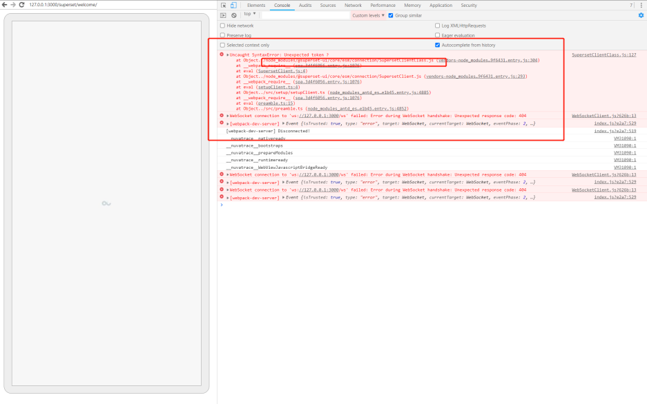
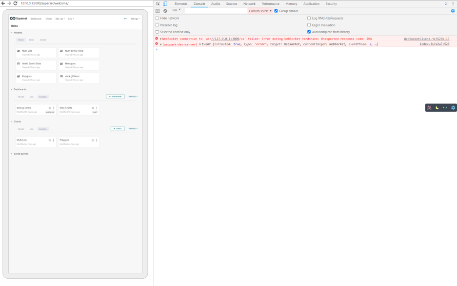
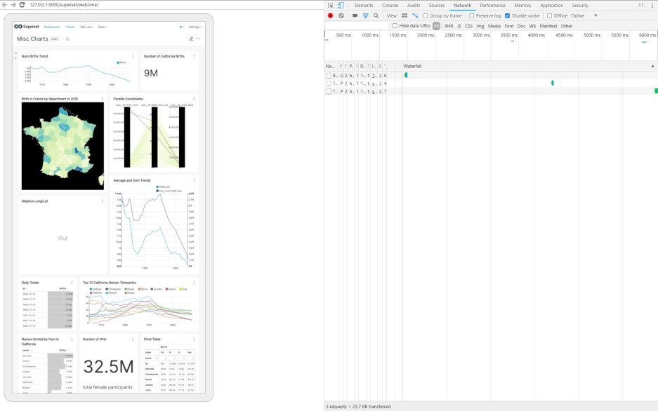

# superset 开发环境搭建

搭建前端本地开发环境有很多坑，官网文档写的模糊不清，百度、chrome 教程早已过时很久。

本次基于官网最新 [superset 1.4.2](https://github.com/apache/superset/releases/tag/1.4.2)  版本进行环境搭建。下面是官方教程，仅供参考，有很多坑。

https://superset.apache.org/docs/installation/installing-superset-from-scratch。

## 安装 python 环境

Python 自带 pip 打包管理工具，安装时需要将 python 添加到 path 中。

Python 版本不得高于 3.9.0，高于此版本部署虚拟环境会有问题。

> [https://www.python.org/downloads/release/python-390/](https://www.python.org/downloads/release/python-390/)


## 下载 superset 源码

[https://github.com/apache/superset/releases/tag/1.4.2](https://github.com/apache/superset/releases/tag/1.4.2)  

[Source code(zip)](https://github.com/apache/superset/archive/refs/tags/1.4.2.zip)

## 部署 python 虚拟环境

> 命令最好使用 cmd，bash 创建用户时有问题。


```javascript
pip install virtualenv
```

```javascript
virtualenv env
```

```javascript
env\Scripts\activate
```

## 安装、初始化 superset

解压之前下载的 superset 源码，进入到源码目录。

设置 pip 国内源地址。

```javascript
pip config set global.index-url https://pypi.tuna.tsinghua.edu.cn/simple
```

安装 superset 本地测试依赖

```javascript
pip install -e .
```

~~安装 apache-superset，非必须，不执行本行命令也可以。~~

```javascript
pip install apache-superset
```

初始化数据库

```javascript
superset db upgrade
```

创建用户并初始化配置

```javascript
superset fab create-admin // 默认用户名 admin，密码  admin

superset load_examples // 下载 superset 案例，需要安全上网

superset init
```

启动 superset server

```javascript
superset run -p 3000 --with-threads --reload --debugger
```

访问地址，会发现页面空白，这是因为前端资源并没有构建好。

开发环境是热更新，需要同时启动两个服务。一个是服务端的服务 ，一个是前端的打包服务，修改前端的代码时，前端的代码会实时的打包更新到 `superset/static/assets` 文件夹下，服务端根据这个文件夹内的文件对前端的页面进行渲染。

## 前端项目环境配置

安装项目依赖

```javascript
cd superset-frontend

npm install
```

修改 webpack 配置

```javascript
{
  test: /\.jsx?$/,
  // include source code for plugins, but exclude node_modules and test files within them
  exclude: [/superset-ui.*\/node_modules\//, /\.test.jsx?$/],
  include: [
    new RegExp(`${APP_DIR}/src`),
    /superset-ui.*\/src/,
    new RegExp(`${APP_DIR}/.storybook`),
    path.resolve(__dirname, 'src'), // 添加本行代码，对 windows 环境不友好
  ],
  use: [babelLoader],
}
```

运行项目

```javascript
npm run dev
```


## 总结

搭建好开发环境后，我们就可以做更多事情。例如对 superset 进行二次开发，自定义页面内容，样式等。

项目开发完毕后，运行 `npm run build`  命令编译线上资源。
将 `superset\static\assets` 目录的资源提供给后端开发人员就可以正常部署使用。

## Fix

## 钉钉移动端不能正常访问

安卓端 钉钉微应用在使用 superset 时，会发现页面一直处于 loading 状态。

通过 [charles ](https://www.charlesproxy.com/)抓包会发现前端资源并没有正常加载。
> 安装教程：[https://www.cnblogs.com/hancel/p/11245286.html](https://www.cnblogs.com/hancel/p/11245286.html)


通过 chrome 提供的 [调试工具](https://developer.chrome.com/docs/devtools/remote-debugging/) 以及钉钉提供的 [android 调试工具](https://open.dingtalk.com/document/resourcedownload/h5-debug) 可以看到。

> chrome 调试工具需要翻墙才可以正常使用。


这其实是因为钉钉使用的浏览器版本并不支持 [globalThis ](https://developer.mozilla.org/en-US/docs/Web/JavaScript/Reference/Global_Objects/globalThis#browser_compatibility%EF%BC%89)。
从 MDN 文档可以得到，其实 globalThis 其实就是指向 window，解决方案也很简单。

```html
  <script>
    this.globalThis || (this.globalThis = this);      
  </script>
```
我们可以在 `superset\templates\superset\basic.html` 文件中添加上述代码。

这个问题解决之后，刷新浏览器发现还会报错。





错误的含义就是浏览器不能解析 `@superset-ui/core/esm/connection/SupersetClientClass.js`文件。

```javascript
// @superset-ui/core/esm/connection/SupersetClientClass.js

/**
 * Licensed to the Apache Software Foundation (ASF) under one
 * or more contributor license agreements.  See the NOTICE file
 * distributed with this work for additional information
 * regarding copyright ownership.  The ASF licenses this file
 * to you under the Apache License, Version 2.0 (the
 * "License"); you may not use this file except in compliance
 * with the License.  You may obtain a copy of the License at
 *
 *   http://www.apache.org/licenses/LICENSE-2.0
 *
 * Unless required by applicable law or agreed to in writing,
 * software distributed under the License is distributed on an
 * "AS IS" BASIS, WITHOUT WARRANTIES OR CONDITIONS OF ANY
 * KIND, either express or implied.  See the License for the
 * specific language governing permissions and limitations
 * under the License.
 */
import callApiAndParseWithTimeout from './callApi/callApiAndParseWithTimeout';
import { DEFAULT_FETCH_RETRY_OPTIONS, DEFAULT_BASE_URL } from './constants';
export default class SupersetClientClass {
  
  // ...

  async request({
    credentials,
    mode,
    endpoint,
    host,
    url,
    headers,
    timeout,
    fetchRetryOptions,
    ...rest
  }) {
    await this.ensureAuth();
    return callApiAndParseWithTimeout({ ...rest,
      credentials: credentials ?? this.credentials,
      mode: mode ?? this.mode,
      url: this.getUrl({
        endpoint,
        host,
        url
      }),
      headers: { ...this.headers,
        ...headers
      },
      timeout: timeout ?? this.timeout,
      fetchRetryOptions: fetchRetryOptions ?? this.fetchRetryOptions
    });
  }

  async ensureAuth() {
    return this.csrfPromise ?? // eslint-disable-next-line prefer-promise-reject-errors
    Promise.reject({
      error: `SupersetClient has not been provided a CSRF token, ensure it is
        initialized with \`client.getCSRFToken()\` or try logging in at
        ${this.getUrl({
        endpoint: '/login'
      })}`
    });
  }
  
  // ...

  getUrl({
    host: inputHost,
    endpoint = '',
    url
  } = {}) {
    if (typeof url === 'string') return url;
    const host = inputHost ?? this.host;
    const cleanHost = host.slice(-1) === '/' ? host.slice(0, -1) : host; // no backslash

    return `${this.protocol}//${cleanHost}/${endpoint[0] === '/' ? endpoint.slice(1) : endpoint}`;
  }

}
```

问题其实是浏览器无法解析`??`，`??`这其实也是 ES 的一个新特性，[空值合并运算符](https://developer.mozilla.org/en-US/docs/Web/JavaScript/Reference/Operators/Logical_nullish_assignment)。我们可以这样解决它。

```javascript
// superset-frontend\webpack.config.js

const config = {
  // ...
  context: APP_DIR, // to automatically find tsconfig.json
  module: {
    rules: [
      // ...
      {
        test: /\.jsx?$/,
        // include source code for plugins, but exclude node_modules and test files within them
        exclude: [/superset-ui.*\/node_modules\//, /\.test.jsx?$/],
        include: [
          new RegExp(`${APP_DIR}/src`),
          /superset-ui.*\/src/,
          new RegExp(`${APP_DIR}/.storybook`),
          path.resolve(__dirname, 'src'), // 添加本行代码，对 windows 环境不友好
          /@encodable/,
        ],
        use: [babelLoader],
      },
      // 新增解析规则
      {
        test: /\.js$/,
        exclude: [/superset-ui.*\/node_modules\//, /\.test.jsx?$/],
        include: [/superset-ui/],
        use: [
          {
            loader: 'babel-loader',
            options: {
              cacheDirectory: true,
              // disable gzip compression for cache files
              // faster when there are millions of small files
              cacheCompression: false,
              presets: [['@babel/preset-env']],
            },
          },
        ],
      },
      {
        test: /\.css$/,
        include: [APP_DIR, /superset-ui.+\/src/],
        use: [
          isDevMode ? 'style-loader' : MiniCssExtractPlugin.loader,
          {
            loader: 'css-loader',
            options: {
              sourceMap: isDevMode,
            },
          },
        ],
      },
      // ...
    ],
  },
  // ...
};

```

解决上述问题，刷新页面会发现还有问题。


这个问题显而易见，浏览器无法解析 [ Object.fromEntries](https://developer.mozilla.org/en-US/docs/Web/JavaScript/Reference/Global_Objects/Object/fromEntries) 对象。我们需要手动引入 polyfill 。

```javascript
// superset-frontend\webpack.config.js

const PREAMBLE = [path.join(APP_DIR, '/src/preamble.ts')];

const config = {
  entry: {
    preamble: PREAMBLE,
    theme: path.join(APP_DIR, '/src/theme.ts'),
    menu: addPreamble('src/views/menu.tsx'),
    spa: addPreamble('/src/views/index.tsx'),
    addSlice: addPreamble('/src/addSlice/index.tsx'),
    explore: addPreamble('/src/explore/index.jsx'),
    sqllab: addPreamble('/src/SqlLab/index.tsx'),
    profile: addPreamble('/src/profile/index.tsx'),
    showSavedQuery: [path.join(APP_DIR, '/src/showSavedQuery/index.jsx')],
  }
}
```
从 webpack.config.js 文件可以看到，superset 定义了多个入口，我们可以在 `preamble`中引入 polyfill。

```javascript
// superset-frontend\src\preamble.ts

/**
 * Licensed to the Apache Software Foundation (ASF) under one
 * or more contributor license agreements.  See the NOTICE file
 * distributed with this work for additional information
 * regarding copyright ownership.  The ASF licenses this file
 * to you under the Apache License, Version 2.0 (the
 * "License"); you may not use this file except in compliance
 * with the License.  You may obtain a copy of the License at
 *
 *   http://www.apache.org/licenses/LICENSE-2.0
 *
 * Unless required by applicable law or agreed to in writing,
 * software distributed under the License is distributed on an
 * "AS IS" BASIS, WITHOUT WARRANTIES OR CONDITIONS OF ANY
 * KIND, either express or implied.  See the License for the
 * specific language governing permissions and limitations
 * under the License.
 */
import { setConfig as setHotLoaderConfig } from 'react-hot-loader';
import 'abortcontroller-polyfill/dist/abortcontroller-polyfill-only';
import 'core-js/features/object/from-entries'; // 新增代码
import moment from 'moment';
import { configure, supersetTheme } from '@superset-ui/core';
import { merge } from 'lodash';
import setupClient from './setup/setupClient';
import setupColors from './setup/setupColors';
import setupFormatters from './setup/setupFormatters';
```
重新刷新页面，大功告成。。。








中间还有其他一些不重要的问题给略过了，至此我们又可以使用 superset 开心的玩耍了。

