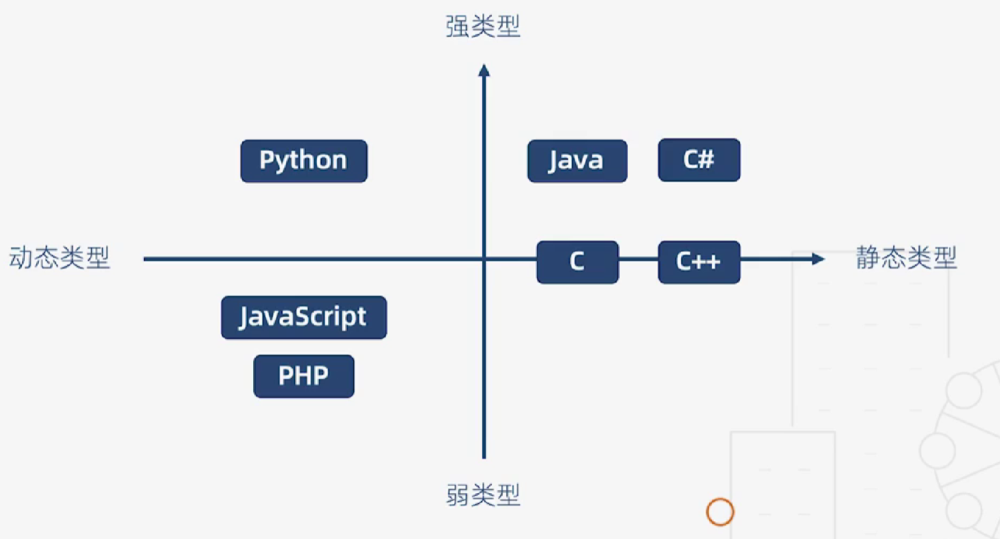
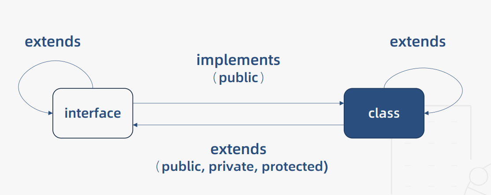
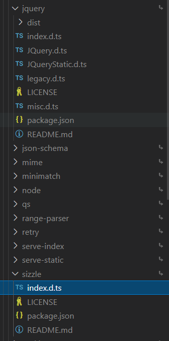
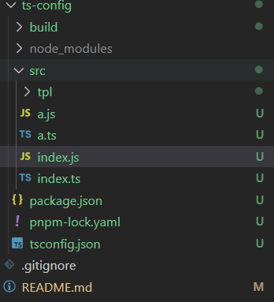
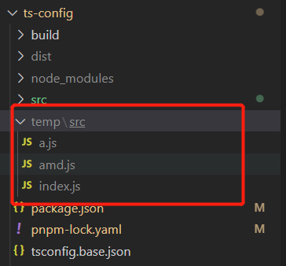
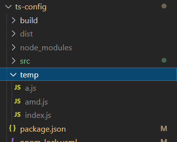
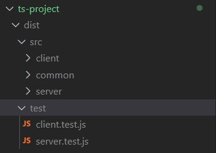
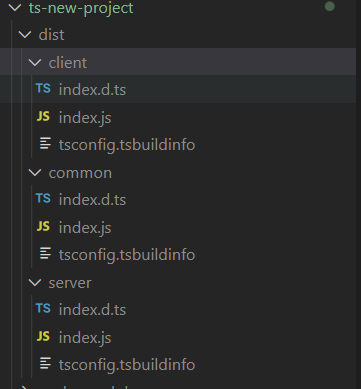
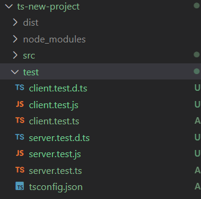
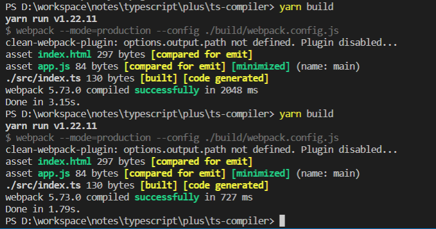

# TypeScript

## TypeScript 基础

### 简介

TypeScipt 是拥有类型系统的 JavaScript 的超集，可以编译成纯 JavaScript。

* 类型检查：编译代码时进行严格的静态类型检查，编码阶段可以发现代码隐患；
* 语言扩展：包括 ES6 及未来提案的特性，比如异步操作和装饰器；其他语言的特性，接口和抽象类；
* 工具属性：可以编译成标签的 JavaScript，可以在任何浏览器、操作系统允许，无须任何运行时额外开销。

其他好处：

* vscode 具备强大的自动补全，导航和重构功能，使得接口定义可以直接代替文档，可以提高开发效率，降低维护成本；
* typescript 可以帮助团队重塑 "类型思维"，接口提供方将被迫去思考 API 的边界，从代码编写者蜕变为代码的设计者。

> 思维方式决定编程习惯，编程习惯决定工程质量，工程质量划定能力边界。

### 类型基础

#### 强类型与弱类型

> 在强类型语言中，当一个对象从调用函数传递到被调用函数时，其类型必须与被调用函数中声明的类型兼容。 -- Liskov, Zilles 1974

强类型语言：不允许改变变量的数据类型，除非进行强制类型转换。

```java
int x = 1;
boolean y = true;

// x = y; // boolean cannot be converted to int

char z = 'a';
x = z; // 97，会进行强制类型转换，将字符转换为 ASCII 码传递给 x
```

弱类型语言：变量可以被赋予不同的数据类型。

```js
let x = 1;
let y = true;
x = y; // true

let z = 'a';
x = z; // 'a'
```

**强类型语言对于变量的类型转换具有严格的限制，不同类型的变量无法相互赋值，可以避免许多低级错误。**

**弱类型预览相对灵活，基本没有约束，容易产生 BUG。**

> 在线编码平台：https://tool.lu/coderunner/

#### 静态类型与动态类型

静态类型语言：编译阶段确定所有变量的类型

动态类型语言：执行阶段确定所有变量的类型

```js
class c {
  constructor (x, y) {
    this.x = x;
    this.y = y;
  }
}

function add (a, b) {
  return a.x + a.y + b.x + b.y;
}

// Js 引擎只有在实际运行时才可以确定参数类型
```

```c++
class c {
  public: 
  	int x;
  	int y;
}

int add (C a, C b) {
  return a.x + a.y + b.x + b.y;
}

// 编译阶段就可以确定参数类型，类型一定是整型
```

执行 add 方法时，两种语言都会创建实例对象 a 和 b。不同的是 js 需要在程序运行时，动态计算属性偏移量（相对于对象基地址的偏移量），需要额外的空间存储属性名，并且所有的的偏移量信息各存一份。C++ 可以在编译阶段确定属性偏移量，用偏移量访问代表属性名访问，并且所有偏移量信息是共享的。


静态类型与动态类型对比：

| 静态类型语言   | 动态类型语言             |
| -------------- | ------------------------ |
| 对类型极度严格 | 对类型非常宽松           |
| 立即发现错误   | BUG 可能隐藏数月甚至数年 |
| 运行时性能良好 | 运行时性能差             |
| 自文档化       | 可读性差                 |

动态类型语言：

* 性能是可以改善的（V8 引擎），语言的灵活性更重要；
* 隐藏的错误可以通过单元测试发现；
* 文档可以通过工具生成。

关于静态类型语言和动态类型语言不能一概而论，要看具体的场景和性价比，比如 js 就是一门动态弱类型语言，应用场景也十分广泛。

#### 其他定义

> 仅供参考。

强类型语言：不允许程序在发生错误后继续执行 

争议：C/C++ 是强类型还是弱类型？

按照这个定义 C/C++ 就成了弱类型语言，它们没有对数组越界进行检查，由此可能导致程序崩溃。

#### 总结



### 基础类型

最新的 ECMAScript 标准定义了8种数据类型：

* 基本数据类型：Boolean、null、undefined、Number、BigInt、String、Symbol
* 引用类型：Object

ES 数据类型：

```js
Boolen、null、undefined、Number、String、Symbol、Object、Array、Function
```

TypeScript 数据类型：

```js
Boolen、null、undefined、Number、String、Symbol、Object、Array、Function
void、any、never、元组、枚举、高级类型等
```

类型注解

作用：相当于强类型语言中的类型声明

语法：(变量/函数)：type

```ts
console.log('-- datatype start --')

// 原始类型
const bool: boolean = true
const num: number = 123
const str: string = 'abc'

// 数组
const arr: number[]  = [1, 2, 3]
const arr2: Array<number> = [1, 2, 3]
const arr3: Array<number | string> = [1, 2, 3, '4']

// 元组：特殊的数组，限定数组元素类型和个数
const tuple: [number, string] = [0, '1']
tuple.push(2); // 原则上不可以改变，允许 push 应该是一个TypeScript 的一个缺陷
console.log(tuple)// [0, '1', 2]
// console.log(tuple[2])// 无法越界访问

// 函数
const add = (x: number, y: number) => x + y 
const add2 = (x: number, y: number): number => x + y 
const compute: (x: number, y: number) => number = (a, b) => a + b

// 对象
const obj: { x: number; y: number } = { x: 1, y: 2 };
obj.x  = 3

// symbol
const s1: Symbol = Symbol()
const s2 = Symbol()
console.log(s1 === s2) // false

// undefiend、null 无法赋值其他数据类型
// 官方定义，undefine、null 是任何类型的子类型，理论上可以赋值给其他类型（需要配置 tsconfig.json "strictNullChecks" 配置为 false）
const un: undefined = undefined
const nu: null = null
const num_nu: number | null = nu

// void
// js 中 void 是一种操作符，可以让任何表达式返回 undefined
// void 0 => undefiend，undefined 在 js 中并不是一个保留字，我们可以自定义 undefined 变量覆盖全局的 undefined
;(() => {
  var undefined = 0;
})();
console.log(undefined, '22222')
// 用 void 可以确保返回的值一定是 undefined
const noReturn = () => {}

// any
// ts 中如果不指定数据类型，默认就是 any 类型，非特殊情况不推荐使用 any 类型
let x

// never
// 永远不会存在返回值的类型
const error = () => {
  throw new Error('error')
}
const endless = () => {
  while(true) {}
}

console.log('-- datatype end --')
```

ts 基础类型完全覆盖了 ES6 的基础类型，并且通过 any 类型实现了对 JS 的兼容。

### 枚举类型

先来看一段代码。

```js
function initByRole (role) {
  if (role === 1 || role === 2) {
    // ...
  } else if (role === 3 || role === 4) {
    // ...
  } else if (role === 5) {
    // ...
  } else {
    // do sth
  }
}
```

上面这段代码存在以下问题：

* 可读性差：很难记住数字的含义；
* 可维护性差：硬编码，牵一发而动全身；

要想解决上述问题，我们可以使用 ts 的枚举类型。

**枚举：一组有名字的常量集合。**

```ts
console.log('-- enum start --')

// 数字枚举
enum Role {
  Reporter,
  Developer,
  Maintainer,
  Owner,
  Guest
}
console.log(Role.Reporter);
console.log(Role);
// 枚举会被编译成一个对象，既可以用名称索引，也可以用值来索引
// {0: 'Reporter', 1: 'Developer', 2: 'Maintainer', 3: 'Owner', 4: 'Guest', Reporter: 0, Developer: 1, Maintainer: 2, Owner: 3, Guest: 4}
// 我们可以用 ts playground 来查看其实现，https://www.typescriptlang.org/play。
// "use strict";
// var Role;
// (function (Role) {
//     Role[Role["Reporter"] = 0] = "Reporter";
//     Role[Role["Developer"] = 1] = "Developer";
//     Role[Role["Maintainer"] = 2] = "Maintainer";
//     Role[Role["Owner"] = 3] = "Owner";
//     Role[Role["Guest"] = 4] = "Guest";
// })(Role || (Role = {}));
// 上面这种代码实现方式叫做反向映射，这就是枚举的实现原理。

// 字符串枚举
enum Message {
  Success = 'success',
  Fail = 'fail'
}
// 字符串枚举不可以反向映射
// "use strict";
// var Message;
// (function (Message) {
//     Message["Success"] = "success";
//     Message["Fail"] = "fail";
// })(Message || (Message = {}));

// 异构枚举
// 不推荐使用，容易引起混淆
enum Answer {
  N,
  Y = 'yes'
}
// "use strict";
// var Answer;
// (function (Answer) {
//     Answer[Answer["N"] = 0] = "N";
//     Answer["Y"] = "yes";
// })(Answer || (Answer = {}));

// 枚举成员
// 枚举成员的值是一个只读类型，定义后无法修改
// Role.Reporter = 2 // 'Reporter' because it is a read-only property.
// 枚举成员分为两类：
//  一类是常量枚举（const enum），它会在编译的时候计算出结果，然后以常量的形式出现在运行时环境
//  一类是计算枚举（computed enum），是一些非常量的表达式 ，这些类型的值不会再编译时计算，而是会保留到程序的执行阶段
enum Char {
  // const 
  a, // 1. 无初始值
  b = Char.a, // 2. 已有常量的引用
  c = 1 + 3, // 3. 常量表达式
  // computed
  d = Math.random(),
  e = '123'.length,
  // f //  Enum member must have initializer.  computed enum 后面的成员必须赋初始值
}
// "use strict";
// var Char;
// (function (Char) {
//     // const 
//     Char[Char["a"] = 0] = "a";
//     Char[Char["b"] = 0] = "b";
//     Char[Char["c"] = 4] = "c";
//     // computed
//     Char[Char["d"] = Math.random()] = "d";
//     Char[Char["e"] = '123'.length] = "e";
// })(Char || (Char = {}));

// 常量枚举
// const 关键字声明的枚举就是常量枚举，常量枚举会在编译阶段被移除
// "use strict"; 编译后没有任何代码，也不存在反向映射，因为已经被移除掉
const enum Month {
  Jan,
  Feb,
  Mar
}
// 当我们不需要一个对象，而需要对象的值时，可以使用常量枚举，这样会减少编译后的代码
let month = [Month.Jan, Month.Feb]
// "use strict";
// let month = [0 /* Jan */, 1 /* Feb */];
// 编译后，枚举会直接被替换成常量，这样在编译后代码就会变得非常简洁

// 枚举类型
// 某些情况下，枚举和枚举成员都可以作为一种单独的类型存在
enum E { a, b }
enum F { a = 0, b = 1 }
enum G { a = 'apple', b = 'banana' }

let e: E = 3
let f: F = 3
// e == f //  This condition will always return 'false' since the types 'E' and 'F' have no overlap. 两种不同类型的枚举是不可以比较的

let e1: E.a
let e2: E.b
let e3: E.a
// e1 === e2 // 不可以比较
// e1 === e3 // 相同类型可以进行比较

let g1: G
let g2: G.a
// 字符串类型枚举只能是枚举成员的类型

console.log('-- enum end --')
```

我们需要将程序中不容易记忆的硬编码或者在未来中可能改变的常量，抽离出来定义成枚举类型，可以提高程序的可读性和可维护性。

**技术拓展**

将 enum 类型，转换为一个 string iteator type。

```ts
enum Test {
  A = 'a',
  B = 'b',
  C = 'c'
}

type TestValue = keyof Record<Test, string>
```

给定字符串 “a”，获取 `Test.A`

```ts
function getKey (value: string) {
  let key: keyof typeof Test

  for (key in Test) {
    if (value === Test[key]) return key
  }

  return null
}
```

### 接口

接口可以用来约束对象、函数以及类的结构和类型，它是一种代码协作的契约，我们必须遵守，而且不能改变。

#### 对象类型接口

```ts
interface List {
  readonly id: number;
  name: string;
  age?: number // 可选属性，表示这个属性可以存在，也可以不存在
}

interface Result {
  data: List[]
}

function render (result: Result) {
  result.data.forEach(value => {
    console.log(value.id, value.name)

    if (value.age) {
      console.log(value.age)
    }

    // value.id = 3 // 只读属性是不允许修改的
  })
}

// ts 允许定义不存在属性，这是因为 ts 使用了一种鸭式辩型法，这是一种动态类型预览的风格
// 一种比较形象的说法就是，一只鸟如果看起来像鸭子，游起来像鸭子，叫起来像鸭子，那么就可以被视为一个鸭子
// 只要我们传入的对象符合接口的必要条件，就是被允许的，即使传入多余的字段也可以通过类型检查
const result = {
  data: [
    { id: 1, name: 'A', sex: 'male' },
    { id: 2, name: 'B' },
  ]
}

render(result)
// 如果直接传入对象字面量，ts 会对额外的字段进行类型检查
// render({
//   data: [
//     { id: 1, name: 'A', sex: 'male' },
//     { id: 2, name: 'B' },
//   ]
// })

// 绕过类型检查的方式一共有三种
// 1. 将对象字面量赋值给变量
// 2. 使用类型断言，下面两种使用方式是等价的，建议使用第一种，第二种在 react 中会产生歧义
render({
  data: [
    { id: 1, name: 'A', sex: 'male' },
    { id: 2, name: 'B' },
  ]
} as Result)
render(<Result>{
  data: [
    { id: 1, name: 'A', sex: 'male' },
    { id: 2, name: 'B' },
  ]
})
// 3. 使用字符串索引签名，可以用任意的字符串去索引类型，可以得到任意的结果，这样可以支持多个属性
// 当你不确定接口中属性的个数，就可以使用可索引的接口，可索引的接口可以用数字去索引，也可以用字符串去索引
interface List2 {
  id: number;
  name: string;
  [x: string]: any;
}


// 任意一个数字去索引 StringArray 都会得到一个 string，相当于声明了一个字符串类型的数组
interface StringArray {
  [index: number]: string
}
let chars: StringArray = ['A', 'B']

// 任意的字符串去索引 Names，得到的结果都是 string，只能声明 string 类型的成员
// 两种索引签名是可以混用的
interface Names {
  [x: string]: string;
  [z: number]: string
}
```

#### 函数类型接口

```ts
let add: (x: number, y: number) => number
interface Add {
  (x: number, y: number): number
}
// 上面这两种定义方式是等价的，除此之外还有一种更简洁的定义方式，就是使用类型别名
type Div = (x: number, y: number) => number
const div: Div = (a, b) => a / b

// 混合类型接口
// 所以混合类型接口就是指一个接口既可以定义一个函数，也可以像对象一样，具有属性和方法
interface Lib {
  (): void; // 没有返回值，也没有参数
  version: String;
  doSomething(): void;
}
// const lib: Lib = (() => {}) as Lib
// lib.version = '0.0.1';
// lib.doSomething = () => {}
// 这样我们就实现了一个接口，但是这样就对全局暴露了一个变量 lib，如果我们想创建多个 lib，我们可以用函数封装一下
function getLib () {
  const lib: Lib = (() => {}) as Lib
  lib.version = '0.0.1';
  lib.doSomething = () => {}
  return lib
}
const lib1 = getLib()
lib1()
lib1.doSomething()
const lib2 = getLib()
lib1()
lib1.doSomething()
```

#### 总结

我们用接口分别定义了对象和函数，除此之外，接口还可以定义类的结构和类型，后面我们再去讲解它。

> type和interface 多数情况下有相同的功能，就是定义类型。但有一些小区别： 
>
> type：不是创建新的类型，只是为一个给定的类型起一个名字。type还可以进行联合、交叉等操作，引用起来更简洁。 
> interface：创建新的类型，接口之间还可以继承、声明合并。 如果可能，建议优先使用 interface。

> 混合接口一般是为第三方类库写声明文件时会用到，很多类库名称可以直接当函数调用，也可以有些属性和方法。
> 例子你可以看一下@types/jest/index.d.ts 里面有一些混合接口。

> 用混合接口声明函数和用接口声明类的区别是，接口不能声明类的构造函数（既不带名称的函数），但混合接口可以，其他都一样。

### 函数

```ts
console.log('-- function start --')

{ 
  // 函数定义，明确指出函数参数类型，函数返回值可以通过 ts 类型推断得到
  function add1 (x: number, y: number) {
    return x + y
  }

  // 通过变量定义函数类型
  let add2: (x: number, y: number) => number
  // 通过类型别名定义函数类型
  type add3 = (x: number, y: number) => number
  // 通过接口定义函数类型
  interface add4 {
    (x: number, y: number): number
  }
  // 以上三种只是类型类型的定义，并没有具体实现

  // js 中对于函数参数的个数是没有限制的，ts 中形参和实参必须一一对应
  add1(1, 2)

  // 可选参数，可选参数必须位于必选参数之后
  function add5 (x: number, y?: number) {
    return y? x + y : x
  }

  // 参数默认值
  function add6 (x: number, y = 0, z: number, q = 1) {
    return x + y + z + q;
  }

  // 剩余参数
  function add7 (x: number, ...rest: number[]) {
    return x + rest.reduce((pre, cur) => pre + cur);
  }
  console.log(add7(1, 2, 3, 4, 5))

  // 函数重载
  // 两个函数如果名称相同，但是参数个数或者参数类型不同，就可以实现函数重载
  // 函数重载的好处就是不需要为相同作用的函数，定义不同的函数名称，可以增强函数的可读性
  function add8 (...rest: number[]): number
  function add8 (...rest: string[]): string
  function add8 (...rest: any[]): any {
    const first = rest[0]
    if (typeof first === 'string') {
      return rest.join('、')
    }
    if (typeof first === 'number') {
      return rest.reduce((pre, cur) => pre + cur)
    }
  }
  console.log(add8(1, 2, 3, 4, 5))
  console.log(add8('js', 'ts'))
  // ts 编译器在处理重载时，会查询重载列表，并且会尝试第一个定义，如果匹配就是用这个函数定义，如果不匹配，接着往下查找
  // 所以我们可以把最容易匹配的函数定义写在最前面
}

console.log('-- function end --')
```

如果不使用函数重载，也可以实现功能，那函数重载声明的意义是什么？

> TS在编译的时候要做类型检查，如果没有前面的函数声明，就会由于参数是 any 类型而忽略类型检查，这样类型检查的工作就转移到了运行时环境，而这不符合TS的设计目标。 TS在处理重载时，会去查询声明列表，并且尝试使用第一个声明的类型定义，如果匹配就使用，如果不匹配就继续向后查询。

### 类

ES6 引入了 class 关键字，我们可以像传统的面向对象语言一样去创建一个类。
总体来讲， ts 的类覆盖了 ES6 的类，同时也引入其他特性。

#### 继承成员和成员修饰符

```ts
// 类的成员修饰符
// public 公有成员，类的所有属性默认都是 public，也可以显示声明
// private 私有成员，私有成员只能在类本身调用，不能被类的实例调用，也不能被子类调用
// - 如果用 private 修饰 constructor，意味着这个类既不能被实例化也不能被继承
// protected 受保护成员，只能在类或者子类中访问，不能在类的实例中访问
// - 如果用 protected 修饰 constructor，意味着这个类不能被实例化，只能被继承， 可以用来声明基类
// readonly 只读属性，只读属性不可以被更改，同样，只读属性必须初始化
class Dog {
  public name: string
  readonly legs: number = 4
  // 类的静态成员只能通过类名调用
  static food: string = 'bones'
  
  constructor (name: string) {
    this.name = name
  }
  
  run () {}

  private print () {}
  protected pro () {}
}
// 无论 ES6 还是 TS 中，类成员的属性都是实例属性，不是原型属性，类成员的方法都是原型方法
// 与 ES6 不同的是，实例必须存在初始值或在构造函数中被初始化
const dog = new Dog('dog')
console.log(dog)

// 类的继承
class Husky extends Dog {
  color: string

  // 除了类的成员可以添加修饰符之外，构造函数的参数也可以添加修饰符
  // 它可以将参数自动变为实例属性，我们可以省略在类中的定义，看起来会更加简洁
  constructor (name: string, color: string, public sex: string) {
    super(name)
    this.color = color
    this.sex = sex
  }
}
```

> S 的继承方式是原型式继承，原型上的属性和方法是所有实例共享的，不需要共享的就放在构造函数中（也就是实例自己的属性和方法）。当调用实例的属性或方法时，先看实例自身有没有，如果没有就会沿着原型链查找。

派生类必须调用super，调用super之后才能使用this，这是为什么？

```js
// 传统 JavaScript 的继承：
function Animal(name) {
    this.name = name;
}
function Dog(name) {
    Animal.call(this, name);
}

// ES6的继承：
class Animal {
    constructor(name) {
        this.name = name;
    }
}
class Dog extends Animal {
    constructor(name) {
        super(name);
    }
}

// super 的作用是调用父类 Animal 的构造函数来初始化子类 Dog，等价于 Animal.call(this, ...)。
// 也就是说，只有相关的实例属性被绑定到 this 上后，才能调用 this.xxx。
```

#### 抽象类与多态

ES 中并没有引入抽象类的概念，抽象类是 TS 对 ES 的扩展。所谓抽象类，就是只能被继承，不能被实例化的类。

```ts
// 抽象类
// 抽象类可以抽离出一些事物的共性，有利于代码复用和扩展
// 抽象类可以实现多态
// 多态指在父类中定义抽象方法，可以在多个子类中对抽象方法有不同的实现，可以在程序运行时根据不同的实现执行不同的操作，这样就实现了运行时的绑定
abstract class Animal {
  eat () {
    console.log('eat')
  }

  // 抽象方法，不实现方法
  // 使用抽象方法，可以明确知道子类可以有其他的实现，不需要在父类中实现
  abstract sleep (): void
} 

// 抽象类不能被实例化
// const animal = new Animal() // Cannot create an instance of an abstract class.

class Dog extends Animal {
  constructor (public name: string) {
    super()
    this.name = name
  }

  run () {}

  sleep () {
    console.log('sleep')
  }
}
const dog = new Dog('wangwang')
dog.eat()

class Cat extends Animal {
  sleep () {
    console.log('cat sleep')
  }
}
const cat = new Cat()
cat.sleep()

// 多态运行示例
const animals: Animal[] = [dog, cat]
animals.forEach(cur => {
  cur.sleep()
})


// 类的成员方法可以直接返回一个 this，可以很方便的实现链式调用
class WorkFlow {
  step1 () {
    return this
  }
  setp2 () {
    return this
  }
}
new WorkFlow().step1().setp2()

// 继承时 this 类型也可以表现出多态，这里的多态指 this 既可以是父类型，也可以是子类型
class MyFlow extends WorkFlow {
  next () {
    return this
  }
}
new MyFlow().next().step1().next()
```

#### 总结

ts 为 es 扩展了许多特性，ts 更像是一种面向对象 “语言” 。

> ts 是一门编程语言，但它不是一个独立的编程语言，而是基于 JavaScript 拓展的语言。

### 类与接口的关系

```ts
console.log('-- class_with_interface start --')

{ 
  interface Human {
    // 接口不能约束类的构造函数
    // new (name: string): void
    name: string
    eat(): void
  }

  // 类实现接口必须实现接口中所有的属性和方法
  // 接口只能约束类的公有成员
  class Asian implements Human {
    constructor(public name: string) {
      this.name = name
    }

    eat() {}

    sleep() {}
  }

  // 接口继承接口
  // 接口可以像类一样，相互继承，并且一个接口可以继承多个接口
  interface Man extends Human {
    run(): void
  }
  interface Child {
    cry(): void
  }
  interface Boy extends Man,Child {}
  // 接口的继承可以抽离出可重用的接口，也可以将多个接口合并成一个接口
  const boy: Boy = {
    name: '',
    run() {},
    eat() {},
    cry() {}
  }


  // 接口继承类
  class Auto {
    state = 1
    // private state2 = 0 // Class 'C' incorrectly implements interface 'AutoInterface'.
  }
  interface AutoInterface extends Auto {}

  class C implements AutoInterface {
    state: number = 1
  }
  // 接口在抽离类成员时，不仅抽离了公共成员，而且抽离私有成员和受保护成员
  class Bus extends Auto implements AutoInterface {
    
  }  
}

console.log('-- class_with_interface end --')
```

接口之间是可以相互继承的，可以实现接口复用；类之间也是可以相互继承的，可以实现方法和属性的复用。
接口可以通过类来实现，接口只能约束类的公有成员。其次，接口可以抽离出类的成员，包括公有成员、私有成员和受保护成员。



## TypeScript 进阶

### 泛型

#### 泛型函数与泛型接口

很多时候我们希望一个函数或者一个类支持多种数据类型，有很大的灵活性。我们可以用以下方式实现。

```ts
// 函数支持传入多种类型
// 1. 函数重载实现
function log1(value: string): string
function log1(value: string[]): string
function log1(value: any) {
  console.log(value)
  return value
}
// 2. 联合类型实现
function log2(value: string | string []): string | string[] {
  console.log(value)
  return value
}
// 3. 支持任意类型 any。 any 类型会丢失类型信息，没有类型之间的约束关系
function log3(value: any) {
  console.log(value)
  return value
}
```

似乎 any 类型已经满足我们的需求，但是当一个调用者调用函数的时候，完全无法获取约束关系，这个时候就需要用到泛型。

**泛型：不预先确定的数据类型，具体的类型在使用的时候才能确定。**

```ts
function log4<T>(value: T): T {
  console.log(value)
  return value
}
// 显式声明
log4<String[]>(['a', 'b', 'c'])
// 利用 ts 类型推断，直接传入数组，推荐使用
log4(['a', 'b', 'c'])
```

我们不仅可以利用泛型定义函数，还可以定义一个类。

```ts
type Log = <T>(value: T) => T
const logger: Log = log1
```

泛型同样也可以使用在接口中。

```ts
// 泛型接口
// 这种实现和类型别名的方式是等价的
interface Log{
  <T>(value: T): T
}
// 上述泛型实现仅仅约束了一个函数，我们也可以用泛型约束接口其他成员
// 当使用泛型约束整个接口之后，实现的时候必须指定一个类型或者在接口的定义中指定一个默认类型
interface Log2<T = string> {
  (value: T): T
}
const logger: Log2<number> = log4
logger(1)
const looger2: Log2 = log4
looger2('1')
```

泛型对于前端开发来说是一个比较新的概念，泛型在 ts 的高级类型中有广泛的应用。

**技术拓展**

```ts
type Log = <T>(value: T) => T;
type Log<T> = (value: T) => T;

interface Log {
  <T>(value: T):T
}
interface Log<T> {
  (value: T):T
}

// 1、3是等价的，使用时无需指定类型。
// 2、4是等价的，使用时必须指定类型
```

#### 泛型类与泛型约束

泛型可以用来约束类的成员。

```ts
class Log<T> {
  run(value: T) {
    console.log(value)
    return value
  }
  // Static members cannot reference class type parameters.
  // 泛型不能应用于类的静态成员
  // static run(value: T) {
  //   console.log(value)
  //   return value
  // }
}
// 指定类型参数
const logger1 = new Log<number>();
logger1.run(1)
// 我们也可以不指定类型参数，这时 value 的值可以是任意的值
const logger2 = new Log()
logger2.run({ a: 1 })
logger2.run('2')
```

泛型定义约束关系。

```ts
// 泛型约束
interface Length {
  length: number
}
// 当我们不仅想使用 value，还想使用 value.length
function log<T extends Length>(value: T): T {
  console.log(value, value.length)
  return value
}
// 当我们使用 T 继承 Length 之后，就添加了约束，就不是所有类型都可以传了，输入的类型必须带有 length 属性
log('1')
// log(1) // Argument of type 'number' is not assignable to parameter of type 'Length'.
log([1])
// log({}) // Argument of type '{}' is not assignable to parameter of type 'Length'.
```

#### 总结

使用泛型的好处：

* 函数和类可以轻松地支持多种类型，增强程序的扩展性
* 不必写多条函数重载，冗长的联合类型声明，增强代码可读性
* 灵活控制类型之间的约束关系

泛型不仅可以保持类型的一致性，又不失程序的灵活性，同时也可以通过泛型约束，控制类型之间的约束。从代码的上来看，可读性，简洁性，远优于函数重载，联合类型声明以及 any 类型的声明。

### 类型检查机制

类型检查机制，就是 TypeScript 编译器在做类型检查时，所秉承的一些原则，以及表现出的一些行为。

类型检查机制可以用来辅助开发，提高开发效率。

* 类型推断
* 类型兼容性
* 类型保护

#### 类型推断

不需要指定变量的类型（函数的返回值类型），TypeScript 可以根据某些规则自动地为其推断出一个类型。

* 基础类型推断
* 最佳通用类型推断
* 上下文类型推断

```ts
// 类型推断

// 根据表达式值推断表达式类型，
// 基础类型推断
let a = 1 // number
let b = [] // any[]
let c = [1] // number[]
const d = (x = 1) => {} // const d: (x?: number) => void
const e = (x = 1) => x // const e: (x?: number) => number

// 最佳通用类型推断，从右到左
let c1 = [1, null, '1'] // let c1: (string | number)[]

// 上下文类型推断，从左到右
// ts 根据左侧事件绑定，推断右侧事件类型，(parameter) event: KeyboardEvent
window.onkeydown = (event) => {}
```

```ts
// 类型断言
// 类型断言可以增加代码灵活性，改造旧代码很有效，但是不能滥用类型断言
// 你需要对上下文的环境有充分的预判，没有任何根据的类型断言会给代码带来安全隐患

interface Foo {
  bar: number
}

// 类型断言配合接口类型
const foo = {} as Foo
foo.bar = 1
```

ts 类型推断可以我们提供重要的辅助信息。

#### 类型兼容性

当一个类型 Y 可以被赋值给另一个类型 X 时，我们就可以说类型 X 兼容类型 Y。

> X 兼容 Y：X（目标类型）= Y（源类型）

结构之间兼容：成员少的兼容成员多的。
函数之间兼容：参数多的兼容参数少的

```ts
// 类型兼容性

// strictNullChecks false 情况下，字符串类型兼容 null 类型
// null 是 字符串类型的子类型，之所以要讨论这些兼容性问题，是因为 ts 允许把一些类型不同的变量相互赋值
// 虽然在某种程度来讲，可能会产生一些不可靠的行为，但可以增加语言的灵活性
let s: string = 'a'
s = null

// 类型兼容性的例子广泛存在于接口、函数、类中

// 接口兼容
interface X {
  a: any
  b: any
}
interface Y {
  a: any
  b: any
  c: any
}
let x: X = { a: 1, b: 2 }
let y: Y = { a: 1, b: 2, c:3 }
x = y 
// y = x // Property 'c' is missing in type 'X' but required in type 'Y'.
// Y 接口具备 X 接口所有的属性，Y 可以被视为 X 类型，X 类型可以兼容 Y 类型
// 源类型必须具备目标类型的必要属性，就可以进行赋值，接口之间相互兼容，成员少的会兼容成员多的

// 函数兼容性
// 判断函数的兼容性，一般是在函数作为参数的情况下
type Handler = (a: number, b: number) => void
function hof(handler: Handler) {
  return handler
}

// 函数兼容需要满足三个条件
{
  // 1. 参数个数要求
  // 参数个数：目标函数的参数个数一定要多余原函数的参数个数
  let handler1 = (a: number) => {}
  hof(handler1)
  let handler2 = (a: number, b: number, c: number) => {}

  // 可选参数和剩余参数：
  let a = (p1: number, p2: number) => {}
  let b = (p1?: number, p2?: number) => {}
  let c = (...args: number[]) => {}
  // 1) 固定参数可以兼容可选参数和剩余参数
  a = b 
  a = c
  // 2) 可选参数不兼容固定参数和剩余参数
  b = c
  b = a
  // 3) 剩余参数可以兼容固定参数和可选参数
  c = a
  c = b
}
{
  // 2. 参数类型，参数类型必须要匹配
  let handler3 = (a: string) => {}
  // hof(handler3) // a: string) => void' is not assignable to parameter of type 'Handler'.  

  interface Point3D {
    x: number
    y: number
    z: number
  }
  interface Point2D {
    x: number
    y: number
  }
  let p3d = (point: Point3D) => {}
  let p2d = (point: Point2D) => {}
  p3d = p2d 
  // p2d 不兼容 p3d，成员个数多的会兼容个数少，少的不能兼容成员个数多的，与接口的结论正好相反
  // p2d = p3d
  // Type '(point: Point3D) => void' is not assignable to type '(point: Point2D) => void'.
  // Types of parameters 'point' and 'point' are incompatible.
  // 函数参数相互赋值的情况叫做函数的双向协变，这种情况允许我们把一个精确的类型赋值给一个不那么精确的类型
}
{
  // 3. 返回值类型，ts 要求目标函数的返回值必须与原函数的返回值类型相同，或者是其子类型
  let f = () => ({ name: 'heora' })
  let g = () => ({ name: 'heora', location: 'Beijing' })
  f = g // f 兼容 g
  // g = f // g 不兼容 f，成员少的会兼容成员多的
}

// 函数重载：函数重载分为两部分，一个是函数重载列表，一个是
// 1) 函数重载列表
function overload(a: number, b: number): number
function overload(a: string, b: string): string
// function overload(a: any, b: any, c: any): any{} 
// This overload signature is not compatible with its implementation signature.
function overload(a: any, b: any): any{}

// 枚举兼容性
enum Fruit { Apple, Banana }
enum Color { Red, Yellow }
// 枚举和 number 是可以完全兼容的
let fruit: Fruit.Apple = 3
let no: number = Fruit.Apple
// 枚举之间是完全不兼容的
// let color: Color.Red = Fruit.Apple // Type 'Fruit.Apple' is not assignable to type 'Color.Red'.

// 类兼容性
class A {
  constructor(p: number, q: number) {}
  id: number = 1
}
class B {
  static s = 1
  constructor(p: number) {}
  id: number = 2
}
let a = new A(1, 2)
let b = new B(1)
// 类和接口比较相似，它们也只比较结构
// 比较两个类是否兼容时，静态属性和构造函数是不参与比较的
// 如果两个类具有相同的实例成员，那么它们的实例就可以完全相互兼容
a = b
b = a
// 如果两个类中含有私有成员，那么这两个类就不兼容了，这时只有父类和子类之间是可以相互兼容的
class C {
  constructor(p: number, q: number) {}
  id: number = 1
  private name: string = ''
}
class D {
  static s = 1
  constructor(p: number) {}
  id: number = 2
}
let c = new C(1, 2)
let d = new D(1)
// c = d // Property 'name' is missing in type 'D' but required in type 'C'.
class E extends C {}
let e = new E(1, 2)
c = e
e = c

// 泛型兼容性
interface Empty<T> {
  value: T
}
let obj1: Empty<number> = { value: 1 }
let obj2: Empty<string> = { value: '1' }
// 泛型接口没有任何成员是可以兼容的，当添加成员后就不兼容了
// obj1 = obj2
// obj2 = obj1
// 只有类型参数 T 被接口使用的时候，才会影响泛型的兼容性

// 泛型函数
let log1 = <T>(x: T): T => {
  console.log('x')
  return x
}
let log2 = <U>(x: U): U => {
  console.log('x')
  return x
}
// 如果两个泛型函数的定义相同，没有指定类型参数，它们之间是可以相互兼容的
log1 = log2
log2 = log1
```

ts 允许我们在类型兼容的变量之间相互赋值，这个特性增加了语言的灵活性。

#### 类型保护

学习类型保护之前，先来看一段代码。

```ts
// 类型保护
enum Type { Strong, Week }
class Java {
  helloJava() {
    console.log('hello java')
  }
}
class JavaScript {
  helloJavaScript() {
    console.log('hello javascript')
  }
}
function getLanguage(type: Type) {
  const lang = type === Type.Strong ? new Java() : new JavaScript()
  if ((lang as Java).helloJava) {
    (lang as Java).helloJava()
  } else {
    (lang as JavaScript).helloJavaScript()
  }
  return lang
}
getLanguage(Type.Strong)
```

相信你已经看出上述代码存在的问题。因为我们不知道程序在运行时到底会传什么样的参数，所以在 `getLanguage` 方法中必须在使用 `lang` 时都加上类型断言。这显然不是理想的方案，代码的可读性很差。

类型保护机制就会用来解决这个问题，它可以提前对类型做出预判。

**所谓类型保护就是，TypeScript 能够在特定的区块中保证变量属于某种确认的类型。可以在此区块中放心地引用此类型的属性，或调用此类型的方法。**

下面我将介绍四种创建这种特定区块的方法。

```ts
function getLanguage(type: Type, x?: string | number) {
  const lang = type === Type.Strong ? new Java() : new JavaScript()

  // 不推荐
  if ((lang as Java).helloJava) {
    (lang as Java).helloJava()
  } else {
    (lang as JavaScript).helloJavaScript()
  }
  
  // 1. instanceof 判断实例是否属于某个类
  if (lang instanceof Java) {
    lang.helloJava()
  } else {
    lang.helloJavaScript()
  }

  // 2. in 关键字
  if ('javascript' in lang) {
    lang.helloJavaScript()
  } else {
    lang.helloJava()
  }

  // 3. typeof
  if (typeof x === 'string') {
    x.length
  } else {
    x?.toFixed(2)
  }

  // 4. 通过类型保护函数
  if (isJava(lang)) {
    lang.helloJava()
  } else {
    lang.helloJavaScript()
  }

  return lang
}
// 类型谓词用法
function isJava(lang: Java | JavaScript): lang is Java {
  return (lang as Java ).helloJava !== undefined
}
```

#### 总结

我们学习了 ts 的类型检查机制，分别是类型推断、类型兼容性、类型保护。利用这些机制，再配合 IDE 的自动补全提示功能能够极大地提高我们的开发效率，需要我们善加利用。

### 高级类型

所谓高级类型就是 ts 为了保持灵活性所引入的一些元特性。这些特性有助于我们应对复杂多变的开发场景。

#### 交叉类型与联合类型

```ts
// 交叉类型和联合类型

// 交叉类型指将多个类型合并为一个类型，新的类型具有所有类型的特性，交叉类型特别适合对象混用的场景
interface DogInterface {
  run(): void
}
interface CatInterface {
  jump(): void
}
// 交叉类型取所有类型的并集
const pet: DogInterface & CatInterface = {
  run() {},
  jump() {}
}

// 联合类型指声明的类型并不确定，可以为多个类型中的一个，
const a: number | string = 1
// 有时候我们不仅需要限制变量类型，还需要限定取值在某个范围内，这时就需要使用字面量类型
const b: 'a' | 'b' | 'c' = 'b'
// 字面量类型不仅可以是字符串，还可以是数字
const c: 1 | 2 | 3 = 3
class Dog implements DogInterface {
  run() { }
  eat() { }
}
class Cat implements CatInterface {
  jump() { }
  eat() { }
}
enum Master { Boy, Girl }
function getPet(master: Master) {
  let pet = master === Master.Boy ? new Dog() : new Cat()
  // 如果一个对象是联合类型，那么在类型未确定的情况下，只能访问所有类型的共有成员
  // 联合类型从字面上来看，是取所有类型的并集，实际上只能取类成员的交集
  pet.eat()

  return pet
}

// 可区分的联合类型
// 这种模式本质上是结合了联合类型和字面量类型的一种类型保护方法
// 核心思想是一个类型如果是多个类型的联合类型，并且每个类型之间存储公共的属性，那么我们就可以凭借这个公共属性，创建类型保护区块
interface Square {
  kind: "square";
  size: number
}
interface Rectangle {
  kind: "rectangle";
  width: number;
  height: number;
}
interface Circle {
  kind: 'circle',
  r: number
}
type Shape = Square | Rectangle
// 这种模式的核心就是利用两种模式的公有属性来创建不同的类型保护区块
function area(s: Shape) {
  switch (s.kind) {
    case "square":
      return s.size * s.size
    case "rectangle":
      return s.height * s.width
  }
}
// 如果我们向 Shape 追加一个类型，会发现它并不会报错
// 这时我们可以指定返回值类型对 area2 函数进行约束，这时就必须实现 Circle 的逻辑
type Shape2 = Square | Rectangle | Circle
function area2(s: Shape2): number {
  switch (s.kind) {
    case "square":
      return s.size * s.size
    case "rectangle":
      return s.height * s.width
    case "circle":
      return 2 * Math.PI * s.r
  }
}
```

交叉类型比较适合做对象的混入，联合类型可以让类型具备一些不确定性，可以增强代码的灵活性。

#### 索引类型

```ts
// 索引类型
const obj = {
  a: 1,
  b: 2,
  c: 3
}
function getValues(obj: any, keys: string[]) {
  return keys.map(key => obj[key])
}
console.log(getValues(obj, ['a', 'b'])) // [1, 2]
console.log(getValues(obj, ['e', 'f'])) // [undefined, undefined]

```

如何使用 ts 对上述模式进行约束？说明具体措施之前，我们先来了解一些概念。

索引类型的查询操作符：`keyof T` ，表示类型 T 的所有公共属性的字面量的联合类型

```ts
interface Obj {
  a: number;
  b: string;
}
let key: keyof Obj
```

索引访问操作符：`T[K]`，表示对象 T 的属性 K 所代表的类型

```ts
let value: Obj['a']
```

泛型约束：`T extends U` ，表示泛型变量可以通过继承某个类型获得某些属性

下面我们来改造下 `getValues` 函数：

```ts
function getValues<T, K extends keyof T>(obj: T, keys: K[]): T[K][] {
  return keys.map(key => obj[key])
}
console.log(getValues(obj, ['a', 'b']))
// console.log(getValues(obj, ['e', 'f'])) //  Type '"f"' is not assignable to type '"a" | "b" | "c"'.
```

索引类型可以实现对对象属性的查询和访问，然后再配合泛型约束就可以建立对象、对象属性以及属性值之间的约束关系。

#### 映射类型

通过映射类型我们可以从一个旧的类型生成一个新的类型，比如说把一个类型的所有属性变为只读。

```ts
interface Obj {
  a: string;
  b: number;
  c: boolean;
}
type ReadOnlyObj = Readonly<Obj>
// type ReadOnlyObj = {
//   readonly a: string;
//   readonly b: number;
//   readonly c: boolean;
// }
```

```ts
// Readonly 实现，内置类库

/**
 * Make all properties in T readonly
 */
type Readonly<T> = {
    readonly [P in keyof T]: T[P];
};

// readonly 是一个泛型接口，而且是一个可索引的泛型接口
// 索引签名是 P in keyof T，T 是一个索引类型的查询操作符，表示类型 T 所有属性的联合类型
// P in 相当于执行了一次遍历，会把变量 P 依次的绑定到 T 的所有属性上
// 索引签名的返回值就是一个索引访问操作符，T[P] 这里代表属性 P 所指定的类型
// 最后再加上 readonly，就可以把所有的属性变成只读，这就是 Readonly 的实现原理
```

```ts
type PartialObj = Partial<Obj>
// type PartialObj = {
//  a?: string | undefined;
//  b?: number | undefined;
//  c?: boolean | undefined;
// }

/**
 * Make all properties in T optional
 */
type Partial<T> = {
    [P in keyof T]?: T[P];
};

// Partial 的实现几乎和 Readonly 一致，只不过把只读的属性变成可选
```

```ts
// Pick 抽取指定属性的子集
type PickObject = Pick<Obj, 'a' | 'b'> 
// type PickObject = {
//   a: string;
//   b: number;
// }

/**
 * From T, pick a set of properties whose keys are in the union K
 */
type Pick<T, K extends keyof T> = {
    [P in K]: T[P];
};
// 第一个参数 T 指定对象，第二个参数 K 存在一个约束，K 一定要来自 T 所有属性字面量的联合类型
// 新的属性的类型一定要在 K 的属性中选取
```

以上三种类型，`Readonly`，`Partial`，`Pick`，官方有一个称呼，把它们称为同态。含义就是它们不会引入新的属性，只会用到目标类型属性（两个代数结构保持了结构不变的映射，则称这两个代数结构是同态的）。

下面我们再来介绍一种映射类型，它会创建一些新的属性。

```ts
type RecordObj = Record<'x' | 'y', Obj>
// type RecordObj = {
//   x: Obj;
//   y: Obj;
// }
```

映射类型本质上是一种泛型接口，通常会结合索引类型获取对象属性和属性值，从而将一个对象映射成我们想要的结构。

ts 预置了很多映射类型，如果你感兴趣，可以去它的类库中去学习。

#### 条件类型

条件类型是一种由条件表达式所决定的类型。
它的形式是 `T extends U ? X : Y` 。如果类型 T 可以被赋值给类型 U，结果类型就是 X 类型，否则就是 Y 类型。

条件类型使类型具有了不唯一性，同样也增加了语言的灵活性。

```js
// 条件类型：T extends U ? X : Y
// 条件类型嵌套，依次判断 T 类型，然后返回不同的字符串
type TypeName<T> = 
  T extends string ? 'string' :
  T extends number ? 'number' :
  T extends boolean ? 'boolean' :
  T extends undefined ? 'undefined' :
  T extends Function ? 'function' :
  "object"
type T1 = TypeName<string> // type T1 = "string"  字面量类型 "string"
type T2 = TypeName<string[]> // type T2 = "object"

// 分布式条件类型：(A | B) extends U ? X : Y
// (A extends U ? X : Y) | (B extends U ? X : Y)
type T3 = TypeName<string | string[]> // type T3 = "string" | "object"

// 利用这个特性可以帮助我们实现类型的过滤
type Diff<T, U> = T extends U ? never : T
type T4 = Diff<"a" | "b" | "c", "a" | "e"> // type T4 = "b" | "c"
// => (Diff<"a", "a" | "e">) | (Diff<"b", "a" | "e">) | (Diff<"c", "a" | "e">)
// => never | "b" | "c"
// => "b" | "c"
// 所以 diff 的作用就是从类型 T 中过滤掉可以赋值给类型 U 的类型

// 我们可以从 Diff 再进行扩展，可以从 Diff 中去除掉我们不需要的类型
type NotNull<T> = Diff<T, undefined |  null>
type T5 = NotNull<string | number | undefined | null> // type T5 = string | number

// 我们刚刚实现的两个类型，其实官方也有实现
// Diff => Exclude<T, U>
// NotNull => NotNullable<T>
// 我们实际使用的时候直接使用官方提供的内置类型即可

// 预置的其他条件类型
// Extract<T, U> 作用和 Exclude 相反
// Exclude 是从类型 T 中过掉掉可以赋值给类型 U 的类型
// Extract 是从类型 T 中抽取出可以赋值给类型 U 的类型
type T6 = Exclude<"a" | "c" | "c", "a" | "e"> // type T6 = "c"
// type Extract<T, U> = T extends U ? T : never;

// ReturnType<T>：获取一个函数返回值的类型
type T7 = ReturnType<() => string> // type T7 = string
// type ReturnType<T extends (...args: any) => any> = T extends (...args: any) => infer R ? R : any;
// 1. 首先 ReturnType 要求类型 T 可以被赋值给一个函数，函数存在任意的参数和任意的返回值
// 2. 由于返回的返回值是不确定的，所以可以使用 infer 关键字，表示待推断（延迟推断），需要根据实际的情况来确定
// 3. 如果实际的情况返回类型 R，那么结果类型就是 R，否则结果就是 any
```

 还有一些类型我们并没有介绍，感兴趣可以自己去 ts 的类库中去看。

**技术拓展**

type 和 interface 区别？

>  type 和 interface 多数情况下有相同的功能，就是定义类型。
>
> type：不是创建新的类型，只是为一个给定的类型起一个名字。type还可以进行联合、交叉等操作，引用起来更简洁。
> interface：创建新的类型，接口之间还可以继承、声明合并。

## TypeScript 工程化

### 模块系统

目前主流的模块化解决方案有两种，分别是 ES6 模块化和 CommonJS 模块化。

TS 对这两种模块系统都有比较好的支持。

#### ES6 模块化

```typescript
// a.ts

// 导出
export const a = 1

// 批量导出
const b = 2
const c = 3
export { b, c }

// 导出接口
export interface P {
  x: number
  y: number
}

// 导出函数
export function f() {}

// 导出时起别名
function g() {}
export { g as G }

// 默认导出，无需函数函数名
export default function() {
  console.log('default')
}

// 引入外部模块，重新导出
export { str as hello } from './b'
```

```typescript
// b.ts

// 导出常量
export const str = 'hello'
```

```typescript
// c.ts

// 批量导入
import { a, b, c } from './a'
// 导入接口
import { P } from './a'
// 导入时起别名
import { f as F } from './a'
// 导入模块的所有成员，绑定到 All 上
import * as All from './a'
// 不加 {}，导入默认
import defaultFunction from './a'

console.log('-- es6 module start --')

console.log(a, b, c)

const p: P = {
  x: 1,
  y: 2
}

console.log(F)

console.log(All)

defaultFunction()

console.log('-- es6 module end --')
```

#### CommonJS 模块化

```typescript
// a.ts

const a = {
  x: 1,
  y: 2
}

// 整体导出
module.exports = a
```

```typescript
// b.ts

// exports === module.exports
// 导出多个变量
exports.c = 3;
exports.d = 4;
```

```typescript
// c.ts

const c1 = require('./a')
const c2 = require('./b')

console.log('-- commonjs module start --')

console.log(c1)
console.log(c2)

console.log('-- commonjs module end --')
```

由于 ts 无法直接用 node 执行，我们可以借助 ts-node 来执行 ts 文件。

```js
npx ts-node .\src\node\c.ts
```

#### 总结

ts 对两个模块系统都有比较好的支持。

ts 编译时默认会把所有的模块都编译成 commonjs 模块。ts 会对 es6 写法进行特殊处理。

```js
tsc .\src\es6\c.ts  
```

```js
// a.js

"use strict";
var __createBinding = (this && this.__createBinding) || (Object.create ? (function(o, m, k, k2) {
    if (k2 === undefined) k2 = k;
    var desc = Object.getOwnPropertyDescriptor(m, k);
    if (!desc || ("get" in desc ? !m.__esModule : desc.writable || desc.configurable)) {
      desc = { enumerable: true, get: function() { return m[k]; } };
    }
    Object.defineProperty(o, k2, desc);
}) : (function(o, m, k, k2) {
    if (k2 === undefined) k2 = k;
    o[k2] = m[k];
}));
exports.__esModule = true;
exports.hello = exports.G = exports.f = exports.c = exports.b = exports.a = void 0;
// 导出
exports.a = 1;
// 批量导出
var b = 2;
exports.b = b;
var c = 3;
exports.c = c;
// 导出函数
function f() { }
exports.f = f;
// 导出时起别名
function g() { }
exports.G = g;
// 默认导出，无需函数函数名
function default_1() {
    console.log('default');
}
exports["default"] = default_1;
// 引入外部模块，重新导出
var b_1 = require("./b");
__createBinding(exports, b_1, "str", "hello");
```

```js
// b.js

"use strict";
exports.__esModule = true;
exports.str = void 0;
// 导出常量
exports.str = 'hello';
```

```js
// c.js

"use strict";
exports.__esModule = true;
// 批量导入
var a_1 = require("./a");
// 导入时起别名
var a_2 = require("./a");
// 导入模块的所有成员，绑定到 All 上
var All = require("./a");
// 不加 {}，导入默认
var a_3 = require("./a");
console.log('-- es6 module start --');
console.log(a_1.a, a_1.b, a_1.c);
var p = {
    x: 1,
    y: 2
};
console.log(a_2.f);
console.log(All);
(0, a_3["default"])();
console.log('-- es6 module end --');
```

es 中允许一个模块有一个顶级的导出，也就是 `export default` ，同时也允许次级导出 `export`。

commonjs 只允许一个模块有一个顶级的导出，`module.exports`，如果一个模块有次级导出`exports.xx`，不能再存在顶级导出，否则会覆盖次级导入的多个变量（无论定义前后）。

如果 es6 模块存在顶级导出，而且可能会被 node 模块引用，ts 为我们提供了一个兼容性语法。

```ts
// d.ts

export = function () {
  console.log('default export')
}
// 这个语法会被编译成 module.exports， 相当于 commonjs 的默认导出 
// 同时也意味着这个模块不能再有其他的导出（不能在具有其他导出元素的模块中使用导出分配）
// 如果想导出其他变量，可以合并为一个对象中进行导出
```

导入时可以使用 es6 默认导入，也可以使用特殊语法导入。结果是一样的。

**tsconfig.json - esMod uleInterop: "true" 开启时可以支持上述两种方法导入。如果关闭，只能通过 `import c4 =` 的方式导入。**

```ts
// import c4 = require('../es6/d') 特殊
import c4 from '../es6/d'

c4();
```

### 使用命名空间

JavaScript 中命名空间可以有效避免全局污染。ES6 引入模块系统之后，命名空间就很少被提及，不过 TS 仍然实现了这个特性。

尽管在模块系统中我们不必考虑全局污染问题，但是如果要使用全局的类库，命名空间仍然是一个比较好的解决方案。

```typescript
// a.ts

namespace Shape {
  const pi = Math.PI
  export function circle(r: number) {
    return pi * r * 2
  }
}
```

随着程序拓展，命名空间文件会越来越大，命名空间也可以进行拆分。

```typescript
// b.ts

namespace Shape {
  export function square(x: number) {
    return x * x
  }
}
```

当多文件使用同一个名称的命名空间时，它们之间可以共享。

如果使用命名空间：

```typescript
// b.ts

namespace Shape {
  export function square(x: number) {
    return x * x
  }
}


Shape.circle(1)
Shape.square(1)
```

使用命名空间我们需要明确一个原则，命名空间和模块不要混用，不要在一个模块中使用命名空间。命名空间最好在全局环境下使用。

我们可以将 ts 文件编译成 js，然后在 `index.html` 中通过 `script` 标签引用。

```shell
tsc .\src\name-space\a.ts .\src\name-space\b.ts  --outDir public
```

```js
// a.js
var Shape;
(function (Shape) {
    var pi = Math.PI;
    function circle(r) {
        return pi * r * 2;
    }
    Shape.circle = circle;
})(Shape || (Shape = {}));

// b.js
var Shape;
(function (Shape) {
    function square(x) {
        return x * x;
    }
    Shape.square = square;
})(Shape || (Shape = {}));
Shape.circle(1);
Shape.square(1);
```

```html
<!DOCTYPE html>
<html lang="en">
<head>
  <meta charset="UTF-8">
  <meta http-equiv="X-UA-Compatible" content="IE=edge">
  <meta name="viewport" content="width=device-width, initial-scale=1.0">
  <title>ts-base</title>
</head>
<body>
  <div class="app"></div>

  <script src="a.js"></script>
  <script src="b.js"></script>
</body>
</html>
```

我们现在在使用命名空间成员时都加了前缀 `Shapre` ，有的时候为了简便，我们可以给函数起一个别名。

```ts
// b.ts

namespace Shape {
  export function square(x: number) {
    return x * x
  }
}

console.log('-- name space start --')

console.log(Shape.circle(1))
console.log(Shape.square(1))

import cicle = Shape.circle // 与模块中的 import 没有任何关系，然后我们就可以直接执行 SQL 函数

console.log(cicle(3))

console.log('-- name space end --')
```

ts 早期版本中，命名空间也叫内部模块，本质上就是一个闭包，可以用于隔离作用域。
ts 保留命名空间，更多考虑是对全局变量时代的兼容。目前，在一个模块化系统中，我们其实不必使用命名空间。

### 理解声明合并

声明合并指编译器会把程序中多个地方具有相同名称的声明合并为一个声明。
通过声明合并就可以避免对接口成员的遗漏。

```typescript
{
  // 非函数成员
  interface A {
    x: number
    // y: string 
    // Type 'number' is not assignable to type 'string'.
    // 相同属性必须类型一致
  }
  interface A {
    y: number
  }
  const a: A = {
    x: 1,
    y: 1 
  }

  // 函数成员
  // 每一个函数都会被声明为一个函数重载
  interface B {
    foo (bar: number): number // 5
    foo (bar: 'b1'): number // 2
  }
  interface B {
    foo (bar: string): string // 3
    foo (bar: number[]): number[] // 4
    foo (bar: 'b2'): number // 1 
  }
  const b = {
    foo(bar: any): any {
      return bar
    }
  }
  // 函数重载的时候需要注意函数重载的顺序，因为编译器会按顺序进行匹配
  // 那么接口合并如何确认顺序？
  // 接口内部按书写顺序来确定，接口之间后面的接口会排在前面（顺序排名已标在代码后）
  // 如果函数参数是字符串字面量，那么这个声明就会被提升到整个函数声明的最顶端
  // 上述规则就是接口之前的声明合并

  // 命名空间合并
  // 命名空间中导出的成员是不可以重复定义的
}

// 命名空间与函数的合并
// 在 JS 中创建一个函数，给他增加一些属性是很常见的一个模式
// 通过命名空间和函数的声明也可以实现这个模式
function Lib() {}
namespace Lib {
  export let version = '1.0'
}
console.log(Lib)
console.log(Lib.version)

// 命名空间与类的声明合并
// 以下代码相当于给类添加了一些静态属性
class C {}
namespace C {
  export let state = 1
}
console.log(C)
console.log(C.state)

// 命令空间与枚举合并
// 以下代码相当于给枚举增加了一个方法
enum Color {
  Red,
  Yellow,
  Bule
}
namespace Color {
  export function mix() {}
}
console.log(Color)
// {0: 'Red', 1: 'Yellow', 2: 'Bule', Red: 0, Yellow: 1, Bule: 2, mix: ƒ}

// ★ 命名空间与函数/类时一定要放到函数/类定义之后，否则就会报错
// 枚举和命名空间的定义位置无关，没有要求
// 从编译结果来看，class 是重复声明，function 是内容覆盖，枚举则是创建对象并添加属性，
// 命名空间也是创建对象并添加属性，所以枚举可以在命名空间后面，因为它们本质上都是看全局是否存在同名对象，
// 如果有直接添加属性，如果没有则创建并添加属性

// 在我们的程序中如果存在多处同名的声明，并不是一个好的做法，最好还是将它们封装到一个模块中
// ts 拥有这种特性，只是为了兼容旧的开发模式，这使得 ts 可以与老的代码共存，并且还可以帮助发现一些设计缺陷
```

 **为什么命名空间与函数/类时一定要放到函数/类定义之后，而枚举则不需要？**

从编译结果来看，class 是重复声明产生隔报错，function 会发生内容覆盖，枚举则是创建对象并添加属性，
命名空间也是创建对象并添加属性，所以枚举可以在命名空间后面。因为它们本质上都是看全局是否存在同名对象，如果有直接添加属性，如果没有则创建并添加属性。

```js
function Lib() {}
namespace Lib {
    export const version = '0.1'
}
// =>
function Lib() { }
(function (Lib) {
    Lib.version = '0.1';
})(Lib || (Lib = {}));

enum Color {
    RED,
    BLUE,
}
namespace Color {
    export const version = '0.1'
}
// =>
var Color;
(function (Color) {
    Color[Color["RED"] = 0] = "RED";
    Color[Color["BLUE"] = 1] = "BLUE";
})(Color || (Color = {}));
(function (Color) {
    Color.version = '0.1';
})(Color || (Color = {}));
```

### 编写声明文件

本小节我们来学习如何在 ts 中引入 web 类库以及如何为它们编写声明文件。以 `jQuery` 为例。

```shell
pnpm install jquery
```

类库一般分为三类，分别是全局类库、模块类库及 UMD 类库。`jQuery` 是一种 UMD 类库（既可以通过全局方式使用，也可以通过模块化的方式引用）。为了方便，我们采用模块化的方式来使用。

```typescript
// src/libs/index.ts

import $ from 'jquery' // Could not find a declaration file for module 'jquery'.
```

直接引用 ts 会报错，无法找到 jqeury 的声明文件。这是因为 jQuery 是用 javascript 编写的，我们在使用非 ts 的类库时，必须为这个类库编写一个声明文件。对外暴露它的 API。有些类库的声明文件是包含在源码中的，有些是单独提供的，需要额外安装。

大多数类库社区都提供了声明文件，使用的方法就是需要额外安装类型声明包。包名通常是 `@types/jquey`。

```shell
pnpm i @types/jquery -D
```

声明文件安装完毕后，ts 代码就不会报错了。接下来我们就可以在 ts 中使用 jQuery 了。

```typescript
// src/libs/index.ts

import $ from 'jquery' // Could not find a declaration file for module 'jquery'.

$('.app').css('color', 'red')
```

我们在 ts 中使用 web 类库时，首先就要考虑它是否存在声明文件，你可以通过 [这个地址](https://www.typescriptlang.org/dt/search/) 进行查询。

如果社区没有声明文件，就需要你自己编写声明文件。这也是你贡献社区的好机会。

下面我们来学习三种类库的声明文件写法。

首先我们在 public 目录下新建 `gloabl-lib.js`，并在 `index.html` 引用 `global-lib.js`。

#### 全局库声明文件

```js
// global-lib.js

function globalLib(options) {
  console.log(options)
}

globalLib.version = '1.0.0'

globalLib.doSomething = function() {
  console.log('globalLib do something')
}

// 这是一个非常典型的全局类型的使用方法
```

```typescript
// src/libs/index.ts

globalLib({ x: 1 }) // Cannot find name 'globalLib'.
```

直接使用全局模块同样存在找不到 `globalLib` 类库的问题。下面我们来定义声明文件。

```typescript
// public/global-lib.js
function globalLib(options) {
  console.log(options)
}

globalLib.version = '1.0.0'

globalLib.doSomething = function() {
  console.log('globalLib do something')
}

// src/libs/global-lib.d.ts
declare function globalLib(options: globalLib.Options): void

declare namespace globalLib {
  const version: string

  function doSomething(): void

  // interface 接口也可以放到全局，但是会对全局暴露，建议放到命名空间中
  interface Options {
    [key: string]: any
  }
}
```

我们使用 `declare` 关键字，它可以用外部变量提供类型声明。我们使用函数与 namespace 的声明合并，为函数增加属性。

我们还可以调用 `globalLib` 的内部方法，都可以正常使用。

```typescript
// src/libs/index.ts

globalLib.doSomething()
```

#### 模块库声明文件

```js
// src/libs/module-lib.js

const version = '1.0.0'

function doSomething() {
  console.log('moduleLib do something')
}

function moduleLib(options) {
  console.log(options)
}

moduleLib.version = version
moduleLib.doSomething = doSomething

module.exports = moduleLib
```

```typescript
// src/libs/module-lib.d.ts

declare function moduleLib(options: Options): void

interface Options {
  [key: string]: any
}

declare namespace moduleLib {
  // export const version: string // export 关键字加或不加都可以
  const version: string
  function doSomething(): void
}

export = moduleLib // 这种写法导出兼容性比较好
```

```typescript
// src/libs/index.ts

import moduleLib from './module-lib'

moduleLib.doSomething()
```

#### UMD 库声明文件

 ```js
 // src/libs/umd-lib.js
 
 (function (root, factory){
   if (typeof define === 'function' && define.umd) {
     define(factory)
   } else if (typeof module === 'object' && module.exports) {
     module.exports = factory()
   } else {
     root.umdLib = factory()
   }
 }(this, function() {
   return {
     version: '1.0.0',
     doSomething() {
       console.log('umdLib do something')
     }
   }
 }))
 ```

```typescript
// src/libs/umd-lib.d.ts

declare namespace umdLib {
  const version: string
  function doSomething(): void
}

export as namespace umdLib // 专门为 umd 类库设置的语句
export = umdLib
```

```typescript
// src/libs/index.ts

import umdLib from './umd-lib'
umdLib.doSomething()
```

umd 库不仅可以在模块中使用，还可以在全局中引用，和 globalLib 一样。

我们注释掉模块中导入，并在全局引入它。

```typescript
// import umdLib from './umd-lib'
umdLib.doSomething()
//  TS2686: 'umdLib' refers to a UMD global, but the current file is a module. Consider adding an import instead.
```

注释掉代码，会提示 umdLib 指全局，但当前文件是模块，考虑为其添加导入。如果我们不想看见此报错，可以配置 `tsconfig.json` 文件的 `allowUmdGlobalAccess` 属性为 true。这样就不会报错了。

全局引入 umdLib 和使用 globalLib 方式一致。

#### 模块插件/全局插件

有时候我们想给一些类库添加一些自定义方法，这时就需要用到插件。

比如我们想给 moment 类库添加一个时间方法。

```shell
pnpm i moment
```

当我们给 moment 增加一个方法，这时会提示没有这个方法。

```typescript
import moment from 'moment'
moment.myFunction = () => {}

//  TS2339: Property 'myFunction' does not exist on type 'typeof moment'.  
```

我们可以使用 declare 处理这个问题。

```typescript
declare module 'moment' {
  export function myFunction(): void
}
```

这样我们就可以给一个外部类库增加一个自定义方法。这就是模块化的插件。

我们还可以给一个全局变量添加一个方法。比如我们给 `globalLib` 增加一个自定义方法。

```typescript
declare global {
  namespace globalLib {
    function doAnything(): void
  }
}
globalLib.doAnything = () => {}
```

不过这样会对全局的命名空间造成污染，一般不建议这样做。

#### 声明文件依赖

如果一个类库比较大，它的声明文件会很长，一般会按照模块划分。那么这些声明文件就会存在一定的依赖关系。

我们可以来看一下 jQuery 的声明文件是如何组织的。


```json
// package.json  types 字段代表声明文件入口

{
	"types": "index.d.ts",
}
```

```typescript
// index.d.ts
	
// 贡献者列表
// Type definitions for jquery 3.5
// Project: https://jquery.com
// Definitions by: Leonard Thieu <https://github.com/leonard-thieu>
//                 Boris Yankov <https://github.com/borisyankov>
//                 Christian Hoffmeister <https://github.com/choffmeister>
//                 Steve Fenton <https://github.com/Steve-Fenton>
//                 Diullei Gomes <https://github.com/Diullei>
//                 Tass Iliopoulos <https://github.com/tasoili>
//                 Sean Hill <https://github.com/seanski>
//                 Guus Goossens <https://github.com/Guuz>
//                 Kelly Summerlin <https://github.com/ksummerlin>
//                 Basarat Ali Syed <https://github.com/basarat>
//                 Nicholas Wolverson <https://github.com/nwolverson>
//                 Derek Cicerone <https://github.com/derekcicerone>
//                 Andrew Gaspar <https://github.com/AndrewGaspar>
//                 Seikichi Kondo <https://github.com/seikichi>
//                 Benjamin Jackman <https://github.com/benjaminjackman>
//                 Josh Strobl <https://github.com/JoshStrobl>
//                 John Reilly <https://github.com/johnnyreilly>
//                 Dick van den Brink <https://github.com/DickvdBrink>
//                 Thomas Schulz <https://github.com/King2500>
//                 Terry Mun <https://github.com/terrymun>
//                 Martin Badin <https://github.com/martin-badin>
//                 Chris Frewin <https://github.com/princefishthrower>
// Definitions: https://github.com/DefinitelyTyped/DefinitelyTyped
// TypeScript Version: 2.7

// 依赖文件
/// <reference types="sizzle" />
/// <reference path="JQueryStatic.d.ts" />
/// <reference path="JQuery.d.ts" />
/// <reference path="misc.d.ts" />
/// <reference path="legacy.d.ts" />

export = jQuery;
```

上面的依赖文件分为两种，分别是模块依赖和路径依赖。

模块依赖使用 types 属性，比如文中的 `types="sizzle"` ，sizzle 是 jQuery 的一个引擎。ts 会在 @types 目录下寻找这个模块。然后把对应的定义引入进来。



路径依赖使用 path 属性。代表一个相对路径。使用 index.d.ts 同级的一些文件。

#### 总结

如果你觉得编写一个声明文件很困难，或者官方得例子很难看懂，一个比较好得方法就是去看一些知名类库得声明文件是如何编写得。从这个过程中你会受到很大得启发。

**用.d.ts为后缀，ts就能感知这是申明文件并在整个工程下做类型检查？一般项目中这些申明文件编写一般是存放在哪，或者是怎么管理的？**

* 如果开发的是类库，声明文件应该放在 package.json 指定的 "types" 路径下，位置随意；或者在包的根目录下同时放置 index.js 和 index.d.ts，就不需要使用 "types" 指定了；也可单独发布声明文件包 @types/xxx；
* 如果是普通的项目工程，除非 js 和 ts 混写，且 ts 引用了 js 模块，一般不需要写声明文件，这种情况下，需要把声明文件和源文件放在一起，如 lib.js、lib.d.ts

**为什么说 export = 的兼容性是最好的呢？**

这种导出语法可以兼容ES6模块、CommonJS模块的导入。

**如何确定一个类库是全局库、模块库、还是UMD库中的哪种呢？**

全局库对外保留全局变量，模块库有export 语句，UMD库有典型的UMD封装。

### tsconfig.json 详解

#### 文件选项

ts 文件有三种类型，分别是 `ts` ，`d.ts` ，`tsx`。

如果没有任何配置，ts 就会按照默认配置编译当前目录下得所有 ts 文件。

```json
// tsconfig.json

{}
```

运行以下命令，可以看到 ts 项目中所有 ts 文件都会被编译。

```typescript
tsc
```



##### files

它是一个文件数组，表示编译器需要编译得单个文件列表。

```json
{
  "files": [
    "src/a.ts"
  ]
}
```

这样再次执行 `tsc` 就只会编译 `a.ts` 文件。

##### include

它也是一个数组，表示编译器需要编译的文件或者目录。

我们可以在 src 目录下新建 lib 目录，创建 `lib.ts` 文件。

```typescript
// src/lib/lib.ts

let libs = {}
```

```json
{
  "files": [
    "src/a.ts"
  ],
  "include": [
    "src"
  ]
}
```

如果 include 配置为 src，会编译所有文件，包括子目录文件。

include 支持通配符配置。

```json
{
  "files": [
    "src/a.ts"
  ],
  "include": [
    "src/*"
  ]
}
```

`src/*` 代表只会编译 src 目录下一级目录的文件。子目录不会被编译。

```json
{
  "files": [
    "src/a.ts"
  ],
  "include": [
    "src/*/*"
  ]
}
```

`src/*/*` 代表只会编译 src 目录下二级目录下的文件。
当前案例下会编译  lib 目录下所有文件以及 a.ts 文件， files 和 include 配置是会合并的。

 ##### exclude

表示编译器需要排除的的文件或者文件夹，默认 exclude 会排除 `node_modules` 目录下所有的文件。也会排除所有的声明文件。

```json
{
  "files": [
    "src/a.ts"
  ],
  "include": [
    "src/*/*"
  ],
  "exclude": [
    "src/lib"
  ]
}
```

上述配置，exclude 会覆盖 include 配置。也就是有 lib 目录不会被编译。

```json
{
  "files": [
    "src/a.ts"
  ],
  "include": [
    "src"
  ],
  "exclude": [
    "src/lib"
  ]
}
```

当前配置编译 src 目录下除 lib 目录的所有文件。

##### 抽离复用

以上就是编译器管理文件的一些选项，此外配置文件之间是可以继承的，我们可以把基础的一些配置抽离出来方便复用。

新建 `tsconfig.base.json` 文件。

```json
// tsconfig.base.json

{
  "files": [
    "src/a.ts"
  ],
  "include": [
    "src"
  ],
  "exclude": [
    "src/lib"
  ]
}
```

```json
// tsconfig.json

{
  "extends": "./tsconfig.base"
}
```

我们可以用 `extends` 继承基础配置，执行 `tsc` 是一样的效果。

其次在 `tsconfig.json` 文件中，我们也可以覆盖 `tsconfig.base.json` 文件中的配置。

```json
// tsconfig.json

{
  "extends": "./tsconfig.base",
  "exclude": []
}
```

这里指定不排除任何目录，这样编译器就会编译 src 目录下所有文件。

##### compileOnSave

它的作用是保存文件时编译器是否自动编译。不过 vscode 并不支持这个配置。你可以用其他编译器尝试使用一下。

```json
// tsconfig.json

{
  "extends": "./tsconfig.base",
  "exclude": [],
  "compileOnSave": true
}
```

#### 编译选项

本小节我们将学习跟编译相关的选项，这些选项有近 100 个，非常庞杂。我们仅介绍一些常用的选项，对于不常用的可以参考官方文档。

##### incremental

增量编译。ts 编译器可以在第一次编译后生成一个可以存储编译信息的文件，然后在二次编译时会对这个文件进行增量编译。这样可以提高编译速度。执行 `tsc` 命令会在根目录下生成 `tsconfig.tsbuildinfo` 文件。

我们可以设置  `diagnostics`  属性，通过这个可以看出两次编译时间的差距。

```json
{
  "compilerOptions": {
    "incremental": true, // 增量编译
    "diagnostics": true, // 打印诊断信息
  }
}
```


我们还可以通过 `tsBuildInfoFile` 配置增量编译文件的存储位置（路径、文件名称可以自定义）。

```json
{
  "compilerOptions": {
    "incremental": true, // 增量编译
    "tsBuildInfoFile": ".tsbuildinfo", // 增量编译文件的存储位置
    "diagnostics": true, // 打印诊断信息
  }
}
```

##### target/module

```json
{
  "compilerOptions": {
    "target": "ES3", // 目标语言的版本
    "module": "commonjs", // 生成代码的模块标准
  }
}
```

##### outFile

```json
{
  "compilerOptions": {
    "target": "ES3",
    "module": "amd",
    "outFile": "./app.js", // 将多个相互依赖的文件生成一个文件，可以用在 AMD 模块中
  }
}
```

我们定义一个 `amd.ts` 文件。

```typescript
// src/amd.ts

let a = 1

export = a
```

然后在 `index.ts` 中引入它。

```typescript
// src/index.ts

import a = require('./amd')
```

运行 `tsc` 命令会在根目录下生成 `app.js` 文件。会将 `index.ts` 和 `amd.ts` 这两个文件合并打包成一个文件。 

```typescript
// app.js

var s = 'a';
define("amd", ["require", "exports"], function (require, exports) {
    "use strict";
    var a = 1;
    return a;
});
define("index", ["require", "exports"], function (require, exports) {
    "use strict";
    exports.__esModule = true;
    (function () {
        var hello = 'hello world';
        document.querySelectorAll('.app')[0].innerHTML = hello;
    })();
});
```

##### lib

```json
{
  "compilerOptions": {
    "lib": [], // TS 需要引用的库声明文件，es5 默认 "dom", "es5", "scripthost"
  }
}
```

如果这个配置不指定，也会默认导入一些类库。当 target 为 es5 时，会默认导入 `"dom"，"es5"，"scripthost"` 。

如果我们要在程序中使用 ES 高级版本的特性，就需要用到这个属性。比如我们需要用到 es2019 的特性。

```typescript
console.log([1, 2, [3, 4]].flat())
```

```json
{
  "compilerOptions": {
    "lib": ["dom", "es5", "scripthost", "ES2019.Array"],
  }
}
```

##### allowJs/checkJs

```json
{
  "compilerOptions": {
    "allowJs": true, // 允许编译器编译 JS 文件（js、jsx）
    "checkJs": true, // 允许在 JS 文件中报错，通常与 allowJs 一起使用
  }
}
```

再次执行 tsc 编译会有报错信息。

```shell
Cannot write file 'D:/workspace/notes/typescript/plus/ts-config/build/webpack.base.config.js' because it would overwrite input file.
# ...
```

这是因为 ts 编译器会尝试编译当前目录下的所有 js 文件。包括 webpack 的配置文件。我们需要排除它，只编译 src 目录下文件。

```json
{
  "include": ["src"], // 只编译 src 目录下的文件
  "compilerOptions": {
    "allowJs": true, // 允许编译器编译 JS 文件（js、jsx）
    "checkJs": true, // 允许在 JS 文件中报错，通常与 allowJs 一起使用
  }
}
```

这样再次编译就不会有报错了。

##### outDir/rootDir

我们还可以指定输出目录。编译后的文件就会被打包到指定目录。

```json
{
  "include": ["src"], // 只编译 src 目录下的文件
  "compilerOptions": {
    "allowJs": true, // 允许编译器编译 JS 文件（js、jsx）
    "checkJs": true, // 允许在 JS 文件中报错，通常与 allowJs 一起使用
    "outDir": "./temp", // 指定输出目录
  }
}
```


我们还可以定义 `rootDir` 指定输入文件目录，默认就是当前目录。

```json
{
  "include": ["src"], // 只编译 src 目录下的文件
  "compilerOptions": {
    "allowJs": true, // 允许编译器编译 JS 文件（js、jsx）
    "checkJs": true, // 允许在 JS 文件中报错，通常与 allowJs 一起使用
    "outDir": "./temp", // 指定输出目录
   	"rootDir": "./" , // 指定输入文件目录（用于输出）
  }
}
```



rootDir 指定的是当前目录，所以输出目录中就会包含 src 目录。如果我们把输入目录指定为 src。

```json
{
  "include": ["src"], // 只编译 src 目录下的文件
  "compilerOptions": {
    "allowJs": true, // 允许编译器编译 JS 文件（js、jsx）
    "checkJs": true, // 允许在 JS 文件中报错，通常与 allowJs 一起使用
    "outDir": "./temp", // 指定输出目录
   	"rootDir": "./src" , // 指定输入文件目录（用于输出）
  }
}
```



从图中可以看到，输出的目录就不包含 src 目录。这个选项是用来控制输出目录结构的。

##### sourcemap

```json
{
  "compilerOptions": {
    "sourceMap": true, // 生成目标文件的 sourceMap
  }
}
```

开启 sourceMap 会为我们自动生成 sourceMap 文件。


```js
// amd.js.map

{"version":3,"file":"amd.js","sourceRoot":"","sources":["amd.ts"],"names":[],"mappings":";AAAA,IAAI,CAAC,GAAG,CAAC,CAAA;AAET,iBAAS,CAAC,CAAA"}
```

我们还可以使用 `inlineSourceMap`。

```json
{
  "compilerOptions": {
    // "sourceMap": true, // 生成目标文件的 sourceMap
    "inlineSourceMap": true, // 生成目标文件的 inline sourceMap
  }
}
```

```js
// a.js

var s = 'a';
//# sourceMappingURL=data:application/json;base64,eyJ2ZXJzaW9uIjozLCJmaWxlIjoiYS5qcyIsInNvdXJjZVJvb3QiOiIiLCJzb3VyY2VzIjpbImEudHMiXSwibmFtZXMiOltdLCJtYXBwaW5ncyI6IkFBQUEsSUFBSSxDQUFDLEdBQVcsR0FBRyxDQUFBIn0=
```

`inlineSourceMap` 会包含在生成的 js 文件中。

##### 声明文件

```json
{
  "compilerOptions": {
    "declaration": true, // 生成声明文件
  }
}
```

如果我们配置 declaration，当编译时会自动生成声明文件（默认情况下与文件同级）。

我们还可以控制声明文件路径。

```json
{
  "compilerOptions": {
    "declaration": true, // 生成声明文件
    "declarationDir": "./typings", // 声明文件路径
  }
}
```

这样声明文件就会输出到 typings 目录下。但是这样会存在一个问题，ts 编译器也会执行编译，生成 js 文件。

我们可以告知 ts 编译器只生成声明文件，而不进行文件编译。

```json
{
  "compilerOptions": {
    "declaration": true, // 生成声明文件
    "declarationDir": "./typings", // 声明文件路径
    "emitDeclarationOnly": true, // 只生成声明文件
  }
}
```

我们还可以为声明文件生成 `sourceMap`。

```json
{
  "compilerOptions": {
    "declaration": true, // 生成声明文件
    "declarationDir": "./typings", // 声明文件路径
    "emitDeclarationOnly": true, // 只生成声明文件
    "declarationMap": true, // 生成声明文件的 sourceMap
  }
}
```


```js
// a.d.ts.map

{"version":3,"file":"a.d.ts","sourceRoot":"","sources":["../src/a.ts"],"names":[],"mappings":"AAAA,QAAA,IAAI,CAAC,EAAE,MAAY,CAAA"}
```

下面我们再来看下另外两个配置项。

```json
{
  "compilerOptions": {
    "typeRoots": [], // 声明文件目录，默认查找 node_modules/@types
    "types": [] , // 声明文件包，指定需要加载的声明文件的包，会在 @types 目录下查找
  }
}
```

对于 types 配置，如果我们指定某一个包，ts 只会加载这个包的声明文件。

##### removeComments

```json
{
  "compilerOptions": {
    "removeComments": true, // 删除注释
  }
}
```

##### noEmit/noEmitOnError

```json
{
  "compilerOptions": {
    "noEmit": true, // 不输出文件
  }
}
```

`noEmit` 不输出任何文件，也就是不做任何事。还有一个类似的选项。

```json
{
  "compilerOptions": {
    // "noEmit": true, // 不输出文件
    "noEmitOnError": true, // 发生错误时不输出文件
  }
}
```

##### helpers

我们先来看一下 `noEmitHelpers` 。

```json
{
  "compilerOptions": {
    "noEmitHelpers": true, // 不生成 helper 函数，需要额外安装 ts-helpers
  }
}
```

这个选项会涉及一个类的继承。

```typescript
// src/index.ts

class A {}
class B extends A {}
```

我们先来看一下没有配置 `noEmitHelpers`  的编译后文件。

```js
"use strict";
var __extends = (this && this.__extends) || (function () {
    var extendStatics = function (d, b) {
        extendStatics = Object.setPrototypeOf ||
            ({ __proto__: [] } instanceof Array && function (d, b) { d.__proto__ = b; }) ||
            function (d, b) { for (var p in b) if (Object.prototype.hasOwnProperty.call(b, p)) d[p] = b[p]; };
        return extendStatics(d, b);
    };
    return function (d, b) {
        if (typeof b !== "function" && b !== null)
            throw new TypeError("Class extends value " + String(b) + " is not a constructor or null");
        extendStatics(d, b);
        function __() { this.constructor = d; }
        d.prototype = b === null ? Object.create(b) : (__.prototype = b.prototype, new __());
    };
})();
exports.__esModule = true;
(function () {
    var hello = 'hello world';
    document.querySelectorAll('.app')[0].innerHTML = hello;
})();
var A = /** @class */ (function () {
    function A() {
    }
    return A;
}());
var B = /** @class */ (function (_super) {
    __extends(B, _super);
    function B() {
        return _super !== null && _super.apply(this, arguments) || this;
    }
    return B;
}(A));
```

在编译结果中我们可以看到，除了我们的代码，还引入了其他的工具库函数。它会使我们编译后的代码体积增加。通过 `noEmitHelpers` 我们可以控制是否生成 helpers 函数。下面再来看一下配置 `noEmitHelpers` 编译后的文件。

```js
"use strict";
exports.__esModule = true;
(function () {
    var hello = 'hello world';
    document.querySelectorAll('.app')[0].innerHTML = hello;
})();
var A = /** @class */ (function () {
    function A() {
    }
    return A;
}());
var B = /** @class */ (function (_super) {
    __extends(B, _super);
    function B() {
        return _super !== null && _super.apply(this, arguments) || this;
    }
    return B;
}(A));
```

可以看到 helpers 函数已经没有了。但是代码中的 `__extends`  函数是未定义的，需要我们额外安装 `ts-helpers`。

之前的做法需要我们额外安装 `ts-helpers` ，现在 ts 为我们提供了另外一种方式去引入 helpers 函数。

```json
{
  "compilerOptions": {
    "noEmitHelpers": true, // 不生成 helper 函数，需要额外安装 ts-helpers
    "importHelpers": true, // 通过 tslib 引入 helper 函数，文件必须是模块
  }
}
```

我们可以通过 `importHelpers` 配置，使用 ts 内置的库把 helper 函数引入进来（文件必须是一个模块）。我们需要改造一下代码。

```typescript
// src/index.ts

class A {}
class B extends A {}

export = B
```

再次执行 tsc 编译代码。

```js
"use strict";
var tslib_1 = require("tslib");
(function () {
    var hello = 'hello world';
    document.querySelectorAll('.app')[0].innerHTML = hello;
})();
var A = /** @class */ (function () {
    function A() {
    }
    return A;
}());
var B = /** @class */ (function (_super) {
    tslib_1.__extends(B, _super);
    function B() {
        return _super !== null && _super.apply(this, arguments) || this;
    }
    return B;
}(A));
module.exports = B;
```

可以看到编译后的代码引入了 tslib 的库，lib 中就包含了一些 helper 函数。这样就可以减少打包后代码体积。

##### downlevelIteration

```json
{
  "compilerOptions": {
    "downlevelIteration": true, // 降级遍历器的实现（es3/5）
  }
}
```

如果我们的目标语言是 es3 或者 es5，就会对遍历器有一个降级的实现。

```typescript
// src/index.ts

const arr = [1, 2, 3]
const arr2 = [4, ...arr]
```

> 期间可能会报错，请考虑升级 "tslib" 的版本。ts(2343)。我们可以手动安装 tslib 来解决它。
>
> pnpm i tslib --save-dev

```js
"use strict";
var tslib_1 = require("tslib");
(function () {
    var hello = 'hello world';
    document.querySelectorAll('.app')[0].innerHTML = hello;
})();
var A = /** @class */ (function () {
    function A() {
    }
    return A;
}());
var B = /** @class */ (function (_super) {
    tslib_1.__extends(B, _super);
    function B() {
        return _super !== null && _super.apply(this, arguments) || this;
    }
    return B;
}(A));
var arr = [1, 2, 3];
var arr2 = tslib_1.__spreadArray([4], tslib_1.__read(arr), false);
module.exports = B;
```

##### 类型检查

```json
{
  "compilerOptions": {
    "strict": true, // 开启严格代码检查
    // "alwaysStrict": false, // 在代码中注入 "use strict";
    // "noImplicitAny": false, // 不允许隐式的 any 类型
    // "strictNullChecks": false, // 不允许把 null、undefined 赋值给其他类型变量
    // "strictFunctionTypes": false, // 不允许函数参数双向协变
    // "strictPropertyInitialization": false, // 类的实例属性必须初始化
    // "strictBindCallApply": false, // 严格的 bind/call/apply 检查
    // "noImplicitThis": false, // 不允许 this 有隐式的 any 类型
  }
}
```

如果开启 strict，strict 下面所有注释掉的配置也会默认开启。


```typescript
function add(x: number, y: number) {
  return x + y
}
add.call(undefined, 1, 2)
add.call(undefined, 1, '2') // 类型“string”的参数不能赋给类型“number”的参数。
```

上述代码如果在严格模式下，会报错，如果关闭 `strictBindCallApply` 。ts 就会放过类型检查。


```typescript
class A {
  a: number = 1

  getA () {
    return function() {
      console.log(this.a) // "this" 隐式具有类型 "any"，因为它没有类型注释。
    }
  }
}
const a = new A().getA()
a()
```

上述代码说的就是 `noImplicitThis` ，这里的 this 在某些环境下可能是 undefined。比如运行上面代码就会报错。

##### 函数相关

```json
{
  "compilerOptions": {
    // "noUnusedLocals": true, // 检查只声明，未使用的局部变量
    // "noUnusedParameters": true, // 检查只声明的函数参数
    // "noFallthroughCasesInSwitch": true, // 防止 switch 语句贯穿
    // "noImplicitReturns": true, // 每个分支都要有返回值
  }
}
```

上述的配置会为我们提示错误，但是不会阻碍编译。

switch 语句贯穿的意思就是就是：如果某一个分支没有 break 语句，下面的一系列语句都会依次执行。

##### 模块相关

```json
{
  "compilerOptions": {
    // "esModuleInterop": true, // 允许 export = 导出，由 import from 导入
    // "allowUmdGlobalAccess": true, // 允许在模块中访问 UMD 全局变量
    "moduleResolution": "Node", // 模块解析策略
  }
}
```

关于 `moduleResolution` ，ts 默认使用 node 解析策略。还有其他选项，例如 `Classic` ，`Node16`，`NodeNext` 等 。

**classic 模块解析策略**

用于 amd、system js、es2015 模块。

相对导入：

```typescript
// /root/src/moduleA.ts
import { b } from './moduleB'

// 文件解析策略

// 1. /root/src/moduleB.ts
// 2. /root/src/moduleB.d.ts
```

非相对导入：

```typescript
// /root/src/moduleA.ts
import { b } from './moduleB'

// 文件解析策略

// 1. /root/src/node_modules/moduleB.ts
// 2. /root/src/node_modules/moduleB.d.ts

// 如果本地目录没有，会依次向上查找 ...

// 3. /root/node_modules/moduleB.ts
// 4. /root/node_modules/moduleB.d.ts

// 5. node_modules/moduleB.ts
// 6. node_modules/moduleB.d.ts
```

**node 模块解析策略**

相对导入：

```typescript
// /root/src/moduleA.ts
import { b } from './moduleB'

// 文件解析策略

// 1. /root/src/moduleB.ts 
// 2. /root/src/moduleB.tsx
// 3. /root/src/moduleB.d.ts
// 4. /root/src/moduleB/package.json ("types" 属性，优先查找 "types" 属性，如果没有会查找 index)
// 5. /root/src/moduleB/index.ts 
// 6. /root/src/moduleB/index.tsx
// 7. /root/src/moduleB/index.d.ts
```

非相对导入：

```json
// /root/src/moduleA.ts
import { b } from './moduleB'

// 文件解析策略

// 1. /root/src/moduleB.ts 
// 2. /root/src/moduleB.tsx
// 3. /root/src/moduleB.d.ts
// 4. /root/src/moduleB/package.json
// 5. /root/src/moduleB/index.ts 
// 6. /root/src/moduleB/index.tsx
// 7. /root/src/moduleB/index.d.ts

// 8. /root/moduleB.ts 
// 9. /root/moduleB.tsx
// 10. /root/moduleB.d.ts
// 11. /root/moduleB/package.json
// 12. /root/moduleB/index.ts 
// 13. /root/moduleB/index.tsx
// 14. /root/moduleB/index.d.ts

// 如果本地目录没有，会依次向上查找，直到根目录下的 node_modules
```

下面我们再来看下其他配置。

```json
{
  "compilerOptions": {
    "baseUrl": "./", // 解析非相对模块的基地址，默认是当前目录
    // 路径映射（如果我们不想导入 jquery 的默认版本，而是当导入精简版本，就可以在这里指定）
    "paths": {
      "jquery": ["node_modules/jquery/dist/jquery.slim.min.js"]
    },
    "rootDirs": ["src", "temp"], // 将多个目录放到一个虚拟目录下，用于运行时
  }
} 
```

这里的 rootDirs 和前面的 rootDir 完全是两个概念，它可以为多个目录建立一个虚拟目录。应用场景如下：

我们新建 temp 目录，用来存放构建之后的文件。

```typescript
// temp/utils.ts

export const util = {}
```

我们可以单独编译一下这个文件。

```shell
tsc .\temp\utils.ts -d # 编译文件并生成声明文件
```

下面我们把源文件删除。即 `temp/utils.ts` 文件。有些时候我们构件好一个类库后，就不会二次构建了。它会永远放到这个输出目录中。如果在其他位置想引用这个类库，我们可以这样做。

```typescript
// src/index.ts

import { util } from './utils'
console.log(util)
```

因为 index.ts 编译后也会输出到 temp 目录，所以我们要想编译后也可以引用 util 文件，可以假定当前就在 temp 目录。但是这样很明显是有问题的。`找不到模块“./util”或其相应的类型声明。ts(2307)` 。

这时我们就需要用到 `rootDirs` 配置。

```json
{
  "compilerOptions": {
    "rootDirs": ["src", "temp"], // 将多个目录放到一个虚拟目录下，用于运行时
  }
} 
```

这样编译后就会认为它们在一个目录下。这样我们就可以在 src 目录下直接使用 temp 中的 util。编译后引用路径也不会发生改变。

##### 打印相关

```json
{
  "compilerOptions": {
    "listEmittedFiles": true, // 打印输出文件
    "listFiles": true, // 打印编译文件（包括引用的声明文件）
  }
} 
```

可以在命令行打印相关信息。


##### 总结

本小节我们介绍了很多编译配置项，不需要你全都记住，建议遵循这样的原则，遇到问题解决问题。

如果在开发中遇到不太清楚的报错，可以去配置中找一找，也许你的报错通过一个配置项就可以解决。同时你可以发现编码中不规范的地方。此外还有一些配置项没有说明，我们后面再来讲解。

#### 工程引用

工程引用是 ts 3.0 引入的新特性。我们来看下具体的应用场景。


我们有一个项目，是一个前后端混合项目，并且有公共的引用文件，且服务端和客户端代码的测试用例都在一个目录中。

```ts
// src/common/index.ts
export function getTime() {
  const time = new Date()
  return `${time.getFullYear()}-${time.getMonth() + 1}-${time.getDate()}`
}

// src/client/index.ts
import { getTime } from '../common'

console.log(`Client Time: ${getTime()}`)

class Client {} 

export = Client

// src/server/index.ts
import { getTime } from '../common'

console.log(`Server Time: ${getTime()}`)

class Server {} 

export = Server

// test/client.test.ts
import Client = require('../src/client')

const c = new Client()

// test/server.test.ts
import Server = require('../src/server')

const c = new Server()
```

```json
// tsconfig.json

{
  "compilerOptions": {
    "target": "ES5",
    "module": "CommonJS",
    "strict": true,
    "outDir": "./dist"
  }
}
```

以上就是目前工程的所有代码。根据我们的配置，ts 编译器会将编译后的文件输出到 dist 目录，我们可以使用 tsc 命令执行构建。

编译后的文件目录如下。



我们并不希望构建后的目录有一个 src 层级，我们想把 client、common、server 直接构建到 dist 目录下。

我们可以在配置文件中加入 `include` 实现。

```json
{
  "compilerOptions": {
    "target": "ES5",
    "module": "CommonJS",
    "strict": true,
    "outDir": "./dist"
  },
  "include": ["src"]
}
```

这样可以实现我们的目的，但是你会发现这样就把 test 目录给遗忘。还有一些不方便的地方就是，我们不能单独的构建客户端应用或者服务端应用。此外，我们也不想把测试用例构建到 dist 目录下。以上的问题都是通过单个配置文件不能解决的。工程引用就是用来解决这类问题的。它可以灵活控制输出目录，还可以使工程之间产生依赖关系，可以把一个大的项目拆分成小的项目，同时还可以利用增量编译提升编译速度。下面来看一下使用工程引用改造后的项目。


上述代码基本没有改动，只是我们为每个目录增加了自己的 tsconfig.json 文件。

```json
// tsconfig.json
{
  "compilerOptions": {
    "target": "ES5",
    "module": "CommonJS",
    "strict": true,
    "composite": true, // 工程可以被引用并且可以增量编译
    "declaration": true, // 生成声明文件
  },
}

// src/client/tsconfig.json
{
  "extends": "../../tsconfig.json",
  "compilerOptions": {
    "outDir": "../../dist/client"
  },
  "references": [
    {
      "path": "../common"
    }
  ]
}

// src/server/tsconfig.json
{
  "extends": "../../tsconfig.json",
  "compilerOptions": {
    "outDir": "../../dist/server"
  },
  "references": [
    {
      "path": "../common"
    }
  ]
}

// src/common/tsconfig.json
{
  "extends": "../../tsconfig.json",
  "compilerOptions": {
    "outDir": "../../dist/common"
  }
}

// test/tsconfig.json
{
  "extends": "../tsconfig.json",
  "references": [
    { "path": "../src/client" },
    { "path": "../src/server" }
  ]
}
```

ts 为了支持工程引用，为我们提供了一种新的构建模式。即 build 构建模式，它可以单独构建一个工程。相关的依赖也会被自动构建。

```shell
tsc -b src/server --verbose # 构建 server 工程
tsc -b src/client --verbose # 构建 client 工程
```

构建完毕后生成目录如下：



再次执行构建命令，你会发现构建速度也很快。因为我们启用了增量编译。

下面我们再来构建一下测试用例。

```shell
tsc -b test --verbose # 构建测试用例
```

你会发现 test 目录下会生成构建后的文件。



我们可以用以下命令清空构建文件。

```shell
tsc -b test --clean
```

从以上可以看出，工程引用的优点。首先它解决了输出目录结构的问题，其次它解决了单个工程构建的问题，然后它还可以通过增量编译提升构建速度。其实 typescript 项目本身已经使用工程引用改造过。

我们可以来看一下 [typescript 工程](https://github.com/microsoft/TypeScript/tree/main/src) 的 src 目录。当前目录下有一个基础配置，`tsconfig-base.json` 文件。

```json
// src/tsconfig.json

{
    "compilerOptions": {
        "pretty": true,
        "lib": ["es2015.iterable", "es2015.generator", "es5"],
        "target": "es5",
        "moduleResolution": "node",
        "rootDir": ".",

        "declaration": true,
        "declarationMap": true,
        "sourceMap": true,
        "composite": true,
        "noEmitOnError": true,

        "strictNullChecks": true,
        "noImplicitAny": true,
        "noImplicitThis": true,
        "strictPropertyInitialization": true,
        "noUnusedLocals": true,
        "noUnusedParameters": true,

        "skipLibCheck": true,

        "alwaysStrict": true,
        "preserveConstEnums": true,
        "newLine": "lf",

        "types": []
    }
}
```

其他的文件夹都是一个子工程。以 tsc 目录为例。

```json
// src/tsc/tsconfig.hson

{
    "extends": "../tsconfig-noncomposite-base",
    "compilerOptions": {
        "outFile": "../../built/local/tsc.js"
    },
    "files": [
        "tsc.ts"
    ],
    "references": [
        { "path": "../compiler", "prepend": true },
        { "path": "../executeCommandLine", "prepend": true }
    ]
}
```

ts 官方配置是一个很好的参照，你可以自己去学习一下。看看它是怎么利用工程引用特性来支撑这样一个庞大项目的构建。

**如何在根目录一次性构建所有工程？**

可以在 `src` 下新建一个 `tsconfig.json` 文件，通过运行 `tsc -b src` 来一次性构建所有工程。

```json
{
  "files": [],
  "include": [],
  "references": [
    { "path": "./client" },
    { "path": "./common" },
    { "path": "./server" }
  ]
}
```

```shell
tsc -b src --verbose # 构建 src 目录下所有工程
```

### 编译工具

#### ts-loader

我们搭建的 webpack 环境中，使用 ts-loader 进行编译。ts-loader 内部使用了官方的编译器 tsc。
ts-loader 和 tsc 共享 tsconfig.json 文件。此外 ts-loader 还有自己的一些配置。可以通过 options 属性来传入。

```js
// webpack.base.config.js

const HtmlWebpackPlugin = require('html-webpack-plugin')

module.exports = {
	// ...
  module: {
    rules: [
      {
        test: /\.tsx?$/i,
        use: [{
          loader: 'ts-loader',
          options: {
            // 当这个配置项开启后，只做语言转换而不做类型检查
            // 实际项目中，你会发现随着项目越来越大，构建时间越来越长，开启下面这个配置就会启动一种快速构建模式
            transpileOnly: false,
          }
        }],
        exclude: /node_modules/
      }
    ]
  },
	// ...
}
```



可以看到未开启 `transpileOnly` 编译需要 3.15s，开启后编译只需要 1.79s。不过这个模式也有缺点，就是编译时不能做类型检查。

```typescript
// src/index.ts

;(() => {
  let hello: string = 'hello world'
  
  document.querySelectorAll('.app')[0].innerHTML = hello

  hello = 1
})();
```

上述代码即使在 vscode 中会有错误提示，但是不会影响 ts 打包编译（开启 transpileOnly 时）。

那么如何在开始 `transpileOnly` 的时候做类型检查那，我们可以借助一个插件来实现，它会把类型检查放到一个独立的进程中进行。

```shell
pnpm i fork-ts-checker-webpack-plugin -D
```

```js
// webpack.base.config.js

const HtmlWebpackPlugin = require('html-webpack-plugin')
const ForkTsCheckerWebpackPlugin = require('fork-ts-checker-webpack-plugin')

module.exports = {
	// ...
  module: {
    rules: [
      {
        test: /\.tsx?$/i,
        use: [{
          loader: 'ts-loader',
          options: {
            // 当这个配置项开启后，只做语言转换而不做类型检查
            // 实际项目中，你会发现随着项目越来越大，构建时间越来越长，开启下面这个配置就会启动一种快速构建模式
            transpileOnly: true,
          }
        }],
        exclude: /node_modules/
      }
    ]
  },
  plugins: [
		// ...
    new ForkTsCheckerWebpackPlugin()
  ]
}
```

重新进行打包构建可以发现会提示错误。

#### awesome-typescript-loader

与 ts-loader 主要区别：

* 更适合与 Babel 集成，使用 Babel 的转义和缓存
* 不需要按照额外的插件，就可以把类型检查放在独立进程中执行

```shell
pnpm i awesome-typescript-loader -D
```

然后我们来修改一下 webpack 配置。

```json
const HtmlWebpackPlugin = require('html-webpack-plugin')
// const ForkTsCheckerWebpackPlugin = require('fork-ts-checker-webpack-plugin')
const { CheckerPlugin } = require('awesome-typescript-loader')

module.exports = {
  entry: './src/index.ts',
  output: {
    filename: 'app.js'
  },
  resolve: {
    extensions: ['.js', '.ts', '.tsx']
  },
  module: {
    rules: [
      {
        test: /\.tsx?$/i,
        // use: [{
        //   loader: 'ts-loader',
        //   options: {
        //     // 当这个配置项开启后，只做语言转换而不做类型检查
        //     // 实际项目中，你会发现随着项目越来越大，构建时间越来越长，开启下面这个配置就会启动一种快速构建模式
        //     transpileOnly: true,
        //   }
        // }],
        use: [{
          loader: 'awesome-typescript-loader',
          options: {
            transpileOnly: true,
          }
        }],
        exclude: /node_modules/
      }
    ]
  },
  plugins: [
    new HtmlWebpackPlugin({
      template: './src/tpl/index.html'
    }),
    // new ForkTsCheckerWebpackPlugin()
    new CheckerPlugin()
  ]
}
```

最后我们来对比一下两个 loader。

| loader                    | 默认配置 | transpileOnly | transpileOnly + 类型检查  |
| ------------------------- | -------- | ------------- | ------------------------- |
| ts-loader                 | 1600+    | 500+          | 3000+（时间较长）         |
| awesome-typescript-loader | 2200+    | 1600+         | 1600+（类型检查存在遗漏） |

就目前来看，其实推荐使用 `ts-loader` 默认配置就可以了。

#### ts 与 babel

我们使用了 ts，为什么还要继续使用 Babel？

|       | 编译能力                    | 类型检查 | 插件     |
| ----- | --------------------------- | -------- | -------- |
| tsc   | ts(x)、js(x)  => es3/5/6... | 有       | 无       |
| babel | ts(x)、js(x)  => es3/5/6... | 无       | 非常丰富 |

babel 7 之前是不支持 ts 的，对于已经使用了 babel 的项目，如果想使用 ts，并不是一件非常容易的事情。需要将用 ts 相关 loader 将 ts 转换为 js，然后再交由 babel 处理。

babel 7 之后，babel 目前已经支持 ts，babel 在编译时可以不使用 ts loader，只让 ts 负责类型检查。

下面我们使用 babel 重新创建一个工程。

```
.
├── dist
├── node_modules
│   └── ...
├── package.json
├── src
│   ├── index.ts
├── .babelrc
└── package.json
```

```ts
// src/index.ts

class A {
  a: number = 1
}

let { x, y, ...z } = { x: 1, y: 2, a: 3, b: 4, c: 5 } 
let n = { x, y, ...z }
```

```json
// .babelrc

{
  "presets": [
    "@babel/preset-env",
    "@babel/preset-typescript"
  ],
  "plugins": [
    "@babel/proposal-class-properties",
    "@babel/proposal-object-rest-spread"
  ]
}
```

```json
// package.json

{
  "name": "ts-babel",
  "version": "1.0.0",
  "description": "",
  "main": "./src/index.js",
  "scripts": {
    "build": "babel src --out-dir dist --extensions \".ts,.tsx\""
  },
  "keywords": [],
  "author": "",
  "license": "ISC",
  "devDependencies": {
    "@babel/cli": "^7.4.4",
    "@babel/core": "^7.4.5",
    "@babel/plugin-proposal-class-properties": "^7.4.4",
    "@babel/plugin-proposal-object-rest-spread": "^7.4.4",
    "@babel/preset-env": "^7.4.5",
    "@babel/preset-typescript": "^7.3.3"
  }
}
```

以上就是一个最简的 babel + ts 的工程化配置。你可以看到，我们并没有安装 ts，而是直接使用 babel 作为编译工具编译 ts 文件。

不过 babel 是不能进行类型检查的，所以我们还需要引入 ts 进行类型检查。

```shell
pnpm install typescript -D
```

```shell
tsc --init
```

我们需要在 tsconfig.json 中开启 `noEmit` 选项。这个选项代表 ts 不会输出任何文件，只会做类型检查。

然后我们在添加一个类型检查脚本。

```json
// package.json

{
  "name": "ts-babel",
  "version": "1.0.0",
  "description": "",
  "main": "./src/index.js",
  "scripts": {
    "build": "babel src --out-dir dist --extensions \".ts,.tsx\"",
    "type-check": "tsc --watch"
  },
  "keywords": [],
  "author": "",
  "license": "ISC",
  "devDependencies": {
    "@babel/cli": "^7.4.4",
    "@babel/core": "^7.4.5",
    "@babel/plugin-proposal-class-properties": "^7.4.4",
    "@babel/plugin-proposal-object-rest-spread": "^7.4.4",
    "@babel/preset-env": "^7.4.5",
    "@babel/preset-typescript": "^7.3.3",
    "typescript": "^3.5.2"
  }
}
```

```shell
pnpm run type-check
```

这时 ts 就会实时监控编码中的类型错误。这样我们就把 babel 和 ts 结合在一起。babel 只做语言转换，ts 只做类型检查。

在 babel 中是无法编译默认导出语法，会报错。

```typescript
export = A
```

#### 总结

如何选择 ts 编译工具？

* 如果没有使用 babel，首选 ts 自身的编译器，可以配合 ts-loader 使用
* 如果项目中已经使用 babel，安装 `@babel/preset-typescript` ，可以配合 tsc 做类型检查
* 两种编译工具建议不要混用，这样只会增加工程复杂度

### 代码检查工具

目前使用 ts 主要有两种代码检查工具，分别是 TSLint 和 ESLint。

由于某些原因，官方由 TypeScript 转向 ESLint：

* TSLint 执行规则的模式存在一些架构问题，从而影响性能，修复这些问题会破坏现有规则；
* ESLint 的性能更好，并且社区用户熟悉 ESLint 的规则配置（比如针对 React 和 Vue 的规则），但是对 TSLint 并不熟悉。

**使用 TypeScript ，为什么还需要 ESLint？**

TypeScript 主要做两件事，分别是类型检查和语言转换，在这个过程中也会对语法错误进行检查。
ESLint 除了可以检查语法错误，还可以保证代码风格的统一。两者的功能有部分重合，但是也各自有各自的职责。

但是如果要使用 ESLint 去检查 TS 语法，就会面临一些问题，它们在工作之前，都需要把代码转换成抽象语法树，即 AST。而这两种语法树是不兼容的，相反，TSLint 是完全基于 TSLint 的语法树进行工作的，不会存在兼容性问题，缺点就是无法做到重用（这也是官方放弃 TSLint 的主要原因）。那么如何解决这个问题？我们可以使用 `typescript-eslint` 项目。它为 ESLint 提供了解析 TS 代码的编译器，可以把 TS 代码的语法树转换为 ESLint 所期望的语法树，即 ESTree。

下面我们就来看一下如何在 TS 中使用 ESLint。我们基于之前的 `ts-config` 项目进行改造，项目为为 `ts-eslint`。

我们需要安装 `eslint`，`@typescript-eslint/eslint-plugin` 和 `@typescript-eslint/parser` 。

然后我们看下 eslint 配置。

```json
// .eslintrc.json

{
  "parser": "@typescript-eslint/parser",
  "plugins": ["@typescript-eslint"],
  "parserOptions": {
    "project": "./ts-eslint/tsconfig.json"
  },
  "extends": [
    "plugin:@typescript-eslint/recommended"
  ],
  "rules": {
    "@typescript-eslint/no-inferrable-types": "off"
  }
}
```

然后我们添加 `lint` 脚本。

```json
// package.json

"scripts": {
  "start": "webpack-dev-server --mode=development --config ./build/webpack.config.js",
  "build": "webpack --mode=production --config ./build/webpack.config.js",
  "lint": "eslint src --ext .js,.ts"
}
```

我们可以使用 `pnpm run lint` 执行脚本。

除了使用脚本做代码检查，我们还可以安装 eslint 插件来辅助我们开发。例如 vscode 的 eslint 插件。

```json
// settings.json
{
  "editor.codeActionsOnSave": {
    "source.fixAll.eslint": true
  },
  "eslint.validate": [
    "javascript",
    "javascriptreact",
    "typescript",
    "html",
    "vue"
  ]
}
```

这样 vscode 就会在文件保存时使用 eslint 格式化代码。

如果你使用 babel，可以使用 babel-eslint。

* babel-eslint：支持 ts 没有的额外的语法检查，抛弃 ts，不支持类型检查
* typescript-eslint：基于 ts 的 AST，支持创建基于类型信息的规则（tsconfig.json）

建议：两者底层机制不同，不要混用。Babel 体系建议使用 babel-eslint。

### Jest 单元测试

单元测试可以使用 ts-jest 和或者babel-jest。

首先我们要安装 `jest` 和 `ts-jest` 。

```shell
pnpm i jest ts-jest @types/jest -D
```

下面我们配置脚本文件。

```json
// package.json

"scripts": {
  "start": "webpack-dev-server --mode=development --config ./build/webpack.config.js",
  "build": "webpack --mode=production --config ./build/webpack.config.js",
  "lint": "eslint src --ext .js,.ts",
  "test": "jest"
}
```

然后通过以下命令创建 jest 配置文件。

```shell
npx ts-jest config:init
```

```js
// jest.config.js

/** @type {import('ts-jest/dist/types').InitialOptionsTsJest} */
module.exports = {
  preset: 'ts-jest',
  testEnvironment: 'node',
};
```

我们在 src 目录下新建 `math.ts`。

```typescript
// src/math.ts

function add (a: number, b: number) {
  return a + b
}

function sub (a: number, b: number) {
  return a - b
}

export default {
  add,
  sub
}
```

我们在根目录新建 `test` 文件夹，然后建立 `math.test.ts` 文件。

```typescript
// test/math.test.ts

import math from '../src/math'

test('add: 1 + 1 = 2', () => {
  expect(math.add(1, 1)).toBe(2)
})

test('sub: 1 - 2 = -1', () => {
  expect(math.sub(1, 2)).toBe(-1)
})
```

然后我们执行 `pnpm run test`  可以看到两个测试用例都已经通过。使用 ts-jest 的好处就是它能够在测试用例中进行类型检查。

```typescript
// test/math.test.ts

import math from '../src/math'

test('add: 1 + 1 = 2', () => {
  expect(math.add(1, 1)).toBe(2)
})

test('sub: 1 - 2 = -1', () => {
  expect(math.sub(1, 2)).toBe(-1)
})

let x: number = '1'
```

再次运行错误，可以看到错误提示。

接下来我们在使用 `babel-jest` 进行测试，首先我们打开之前创建的 `ts-babel` 工程。同样我们需要安装 jest ，同时也要安装 `babel-jest`。

```shell
pnpm i jest babel-jest @types/jest -D
```

jest 安装完毕后，我们把刚才创建的文件拷贝过来。然后编写测试脚本。

```json
// package.json

"scripts": {
  "build": "babel src --out-dir dist --extensions \".ts,.tsx\"",
  "type-check": "tsc --watch",
  "test": "jest"
},
```

执行脚本 `pnpm run test`  也可以正常通过测试。但是它不会进行类型检查。如果想让 `babel-jest` 支持类型检查，我们还需要提供类型检查脚本。我们执行 `pnpm run type-check` 可以看到错误提示。

## TypeScript 实战

### 函数组件与类组件

```tsx
// 函数组件

import React from "react"
import { Button } from 'antd'

interface Greeting {
  name: string;
  firstName?: string;
  lastName?: string;
}

// const Hello = (props: Greeting) => <Button>Hello { props.name }</Button>

const Hello: React.FC<Greeting> = ({
  name,
  firstName,
  lastName
}) => <Button>Hello { name }</Button>

export default Hello
```

react 中使用 `React.FC` 定义组件，相对于普通声明，当我们给函数定义静态属性时，存在提示。

```tsx
// 函数组件

import React from "react"
import { Button } from 'antd'

interface Greeting {
  name: string;
  firstName?: string;
  lastName?: string;
}

// const Hello = (props: Greeting) => <Button>Hello { props.name }</Button>

const Hello: React.FC<Greeting> = ({
  name,
  firstName,
  lastName,
}) => <Button>Hello { name }</Button>

// 类型提示
Hello.defaultProps = {
  firstName: '',
  lastName: ''
}

export default Hello
```

使用 `React.FC` 并不存在明显的好处。其实我们更推荐使用原生写法。

```tsx
import React, { Component } from "react"
import { Button } from 'antd'

interface Greeting {
  name: string;
  firstName?: string;
  lastName?: string;
}

interface State {
  count: number
}

class HelloClass extends Component<Greeting, State> {
  state: State = {
    count: 0
  }

  static defaultProps = {
    firstName: '',
    lastName: ''
  }

  setCount = () => {
    this.setState({
      count: this.state.count + 1
    })
  }

  render() {
    return (
      <>
        <p>点击了 { this.state.count }</p>
        <Button onClick={ this.setCount}>Hello { this.props.name }</Button>
      </>
    )
  }
}

export default HelloClass
```

### 高阶组件与 Hooks

| 组件复用方式    | 优势                                                      | 劣势                                                         | 状态               |
| --------------- | --------------------------------------------------------- | ------------------------------------------------------------ | ------------------ |
| 类组件（class） | 发展时间长，接受度广泛                                    | 只能继承父类                                                 | 传统模式，长期存在 |
| Mixin           | 可以复制任意对象的任意方法                                | 组件相互依赖、耦合，可能产生冲突，不利于维护                 | 被抛弃             |
| 高阶组件（HOC） | 利用装饰器模式，不改变组件的基础上，动态添加新能力        | 嵌套过多调试困难，需要遵循某些约定（不改变原组件，透传 props） | 能力强大，应用广泛 |
| Hooks           | 代替 class，多个 Hooks 互不影响，避免嵌套地狱，开发效率高 | 切换到新思维需要成本                                         | React 未来         |

```tsx
// 高阶组件

import React, { Component } from "react"
import HelloClass from './HelloClass'

interface Loading {
  loading: boolean
}

function HelloHOC<P>(WrapperComponent: React.ComponentType<P>) {
  return class extends Component<P & Loading> {
    render() {
      const { loading, ...props } = this.props
      return loading ? <div>Loading</div> : <WrapperComponent {...props as unknown as P} />
    }
  }
}

export default HelloHOC(HelloClass)
```

高阶组件用在 ts 中，我们可能会遇到很多类型问题。这并不是高阶组件本身的问题，而是 React 声明文件还没有很好的兼容高阶组件的类型检查。其实我们更推荐使用 Hooks 编写组件。

```tsx
// Hooks 组件

import { useEffect, useState } from "react"
import { Button } from 'antd'

interface Greeting {
  name: string;
  firstName?: string;
  lastName?: string;
}

const HelloHooks = (props: Greeting) => {
  const [count, setCount] = useState(0)
  const [text, setText] = useState<string | null>(null)

  useEffect(() => {
    if (count > 5) {
      setText('休息一下')
    }
  }, [ count ])

  return (
    <>
      <p>点击了 {count } { text }</p>
      <Button onClick={ () => setCount(count + 1) }>Hello { props.name }</Button>
    </>
  )
}

// 类型提示
HelloHooks.defaultProps = {
  firstName: '',
  lastName: ''
}

export default HelloHooks
```

Hooks 其实就是函数组件，只不过可以使用 react 提供的很多 API。

### 事件处理与数据请求

#### 搭建 mock 服务

安装依赖

```shell
pnpm i http-server -D
```

编写 server 脚本

```json
{
  "scripts": {
  "start": "react-scripts start",
  "build": "react-scripts build",
  "test": "react-scripts test",
  "eject": "react-scripts eject",
  "server": "cd mock && http-server -p 4000 -a localhost"
}
```

可以执行 server 命令启动服务。

#### 代理转发

安装依赖

```shell
pnpm i http-proxy-middleware -D
```

编写配置文件

> create-react-app 会在启动的时候自动调用这个文件

```js
// src/setupProxy.js

const { createProxyMiddleware } = require('http-proxy-middleware');

module.exports = function(app) {
  app.use(createProxyMiddleware('/api/**/*.action', {
    target: 'http://localhost:4000',
    pathRewrite(path) {
      return path.replace('/api', '/').replace('.action', '.json');
    }
  }));
};
```

#### 数据请求

```typescript
// src/constants/urls.ts

export const GET_EMPLOYEE_URL = '/api/employee/getEmployee.action';
```

```typescript
// src/typings/employee.ts

export interface EmployeeRequest {
  name: string;
  departmentId: number | undefined;
}

interface EmployeeInfo {
  id: number;
  key: number;
  name: string;
  department: string;
  hiredate: string;
  level: string;
}

export type EmployeeResponse = EmployeeInfo[] | undefined
```

```typescript
// src/utils/request.ts

import Axios from 'axios';
import { message } from 'antd';

const axios = Axios.create({
  timeout: 20000
});

axios.interceptors.response.use(
  function(response) {
    if (response.data && response.data.error_code) {
      const errorMsg = response.data.error_msg;
      message.error(errorMsg);
      return Promise.reject(errorMsg);
    }
    return response.data;
  },
  function (error) {
    return Promise.reject(error)
  }
)

export function get(url: string, data: any) {
  return axios.get(url, {
    params: data
  });
}

export function post(url: string, data: any) {
  return axios({
    method: 'post',
    url,
    data
  });
}

export default axios;
```

```typescript
// src/components/employee/QueryForm.tsx

import React, { Component } from 'react';
import { Form, Input, Select, Button } from 'antd';

import { EmployeeRequest } from '../../typings/employee';
import { get } from '../../utils/request';
import { GET_EMPLOYEE_URL } from '../../constants/urls';

const { Option } = Select;

class QueryForm extends Component<{}, EmployeeRequest> {
	state: EmployeeRequest = {
		name: '',
		departmentId: undefined
	}

	handleNameChange = (e: React.FormEvent<HTMLInputElement>) => {
		this.setState({
			name: e.currentTarget.value
		})
	}

	handleDepartmentChange = (value: number) => {
		this.setState({
			departmentId: value
		})
	}

	handleSubmit = () => {
		this.queryEmployee(this.state)
	}
	
	componentDidMount() {
		this.queryEmployee(this.state)
	}

	queryEmployee(param: EmployeeRequest) {
		get(GET_EMPLOYEE_URL, param)
			.then(res => {
				console.log(res)
			})
	}

	render() {
		const { name, departmentId } = this.state

		return (
			<Form layout="inline">
				<Form.Item>
					<Input
						placeholder="姓名"
						style={{ width: 120 }}
						allowClear
						value={name}
						onChange={this.handleNameChange}
					/>
				</Form.Item>
				<Form.Item>
					<Select
						placeholder="部门"
						style={{ width: 120 }}
						allowClear
						value={departmentId}
						onChange={this.handleDepartmentChange}
					>
						<Option value={1}>技术部</Option>
						<Option value={2}>产品部</Option>
						<Option value={3}>市场部</Option>
						<Option value={4}>运营部</Option>
					</Select>
				</Form.Item>
				<Form.Item>
					<Button type="primary" onClick={this.handleSubmit}>查询</Button>
				</Form.Item>
			</Form>
		)
	}
}

export default QueryForm;
```

