# Vite

## 项目搭建

### 使用 pnpm

```js
npm i -g pnpm
```

```js
pnpm config set registry https://registry.npmmirror.com/
```

### 项目初始化

```js
pnpm create vite
```

> framework：react、variant：react-ts

```js
// 进入项目目录
cd vite-project
// 安装依赖
pnpm install
// 启动项目
pnpm run dev
```

### 目录结构

项目目录结构如下:

```js
.
├── index.html
├── package.json
├── pnpm-lock.yaml
├── src
│   ├── App.css
│   ├── App.tsx
│   ├── favicon.svg
│   ├── index.css
│   ├── logo.svg
│   ├── main.tsx
│   └── vite-env.d.ts
├── tsconfig.json
└── vite.config.ts
```

在项目根目录中有一个`index.html`文件，这个文件十分关键，因为 Vite 默认会把项目根目录下的`index.html`作为入口文件。
也就是说，当你访问`http://localhost:3000`的时候，Vite 的 Dev Server 会自动返回这个 HTML 文件的内容。我们来看看这个 HTML 究竟写了什么:

```html
<!DOCTYPE html>
<html lang="en">
  <head>
    <meta charset="UTF-8" />
    <link rel="icon" type="image/svg+xml" href="/src/favicon.svg" />
    <meta name="viewport" content="width=device-width, initial-scale=1.0" />
    <title>Vite App</title>
  </head>
  <body>
    <div id="root"></div>
    <script type="module" src="/src/main.tsx"></script>
  </body>
</html>
```

这个 HTML 文件的内容非常简洁，在 `body` 标签中除了 id 为 root 的根节点之外，还包含了一个声明了`type="module"`的 `script` 标签:

```js
<script type="module" src="/src/main.tsx"></script>
```

由于现代浏览器原生支持了 ES 模块规范，因此原生的 ES 语法也可以直接放到浏览器中执行，只需要在 script 标签中声明 `type="module"` 即可。比如上面的 script 标签就声明了 type="module"，同时 src 指向了`/src/main.tsx`文件，此时相当于请求了`http://localhost:3000/src/main.tsx`这个资源，Vite 的 Dev Server 此时会接受到这个请求，然后读取对应的文件内容，进行一定的中间处理，最后将处理的结果返回给浏览器。

我们可以来看看 `main.tsx` 的内容:

```tsx
import React from 'react'
import ReactDOM from 'react-dom/client'
import App from './App'
import './index.css'

ReactDOM.createRoot(document.getElementById('root')!).render(
  <React.StrictMode>
    <App />
  </React.StrictMode>
)
```

你可能会诧异: 浏览器并不识别 tsx 语法，也无法直接 import css 文件，上面这段代码究竟是如何被浏览器正常执行的呢？

这就归功了 Vite Dev Server 所做的“中间处理”了，也就是说，在读取到 `main.tsx`文件的内容之后，Vite 会对文件的内容进行编译，大家可以从 Chrome 的网络调试面板看到编译后的结果:

```js
var _jsxFileName = "D:\\workspace\\notes\\vite\\vite-project\\src\\main.tsx";
import __vite__cjsImport0_react from "/node_modules/.vite/deps/react.js?v=d559f595";
const React = __vite__cjsImport0_react.__esModule ? __vite__cjsImport0_react.default : __vite__cjsImport0_react;
import __vite__cjsImport1_reactDom_client from "/node_modules/.vite/deps/react-dom_client.js?v=d559f595";
const ReactDOM = __vite__cjsImport1_reactDom_client.__esModule ? __vite__cjsImport1_reactDom_client.default : __vite__cjsImport1_reactDom_client;
import App from "/src/App.tsx";
import "/src/index.css";
import __vite__cjsImport4_react_jsxDevRuntime from "/node_modules/.vite/deps/react_jsx-dev-runtime.js?v=d559f595";
const _jsxDEV = __vite__cjsImport4_react_jsxDevRuntime["jsxDEV"];
ReactDOM.createRoot(document.getElementById("root")).render(/* @__PURE__ */
_jsxDEV(React.StrictMode, {
    children: /* @__PURE__ */
    _jsxDEV(App, {}, void 0, false, {
        fileName: _jsxFileName,
        lineNumber: 8,
        columnNumber: 5
    }, this)
}, void 0, false, {
    fileName: _jsxFileName,
    lineNumber: 7,
    columnNumber: 3
}, this));

//# sourceMappingURL=data:application/json;base64,eyJ2ZXJzaW9uIjozLCJtYXBwaW5ncyI6IjtBQUFBO0FBQ0E7QUFDQTtBQUNBOztBQUVBQSxTQUFTQyxXQUFXQyxTQUFTQyxlQUFlLE1BQXhCLENBQXBCLEVBQXNEQyxPQUNwRCx3QkFBQyxNQUFNLFlBQVA7QUFBQSxZQUNFLHdCQUFDLEtBQUQ7QUFBQTtBQUFBO0FBQUE7QUFBQTtBQURGO0FBQUE7QUFBQTtBQUFBO0FBQUEsUUFERiIsIm5hbWVzIjpbIlJlYWN0RE9NIiwiY3JlYXRlUm9vdCIsImRvY3VtZW50IiwiZ2V0RWxlbWVudEJ5SWQiLCJyZW5kZXIiXSwic291cmNlcyI6WyJEOi93b3Jrc3BhY2Uvbm90ZXMvdml0ZS92aXRlLXByb2plY3Qvc3JjL21haW4udHN4Il0sImZpbGUiOiJEOi93b3Jrc3BhY2Uvbm90ZXMvdml0ZS92aXRlLXByb2plY3Qvc3JjL21haW4udHN4Iiwic291cmNlc0NvbnRlbnQiOlsiaW1wb3J0IFJlYWN0IGZyb20gJ3JlYWN0J1xuaW1wb3J0IFJlYWN0RE9NIGZyb20gJ3JlYWN0LWRvbS9jbGllbnQnXG5pbXBvcnQgQXBwIGZyb20gJy4vQXBwJ1xuaW1wb3J0ICcuL2luZGV4LmNzcydcblxuUmVhY3RET00uY3JlYXRlUm9vdChkb2N1bWVudC5nZXRFbGVtZW50QnlJZCgncm9vdCcpISkucmVuZGVyKFxuICA8UmVhY3QuU3RyaWN0TW9kZT5cbiAgICA8QXBwIC8+XG4gIDwvUmVhY3QuU3RyaWN0TW9kZT5cbilcbiJdfQ==
```

Vite 会将项目的源代码编译成浏览器可以识别的代码，与此同时，一个 import 语句即代表了一个 HTTP 请求，如下面两个 import 语句:

```js
import "/src/index.css";
import App from "/src/App.tsx";
```

在 Vite 项目中，一个`import 语句即代表一个 HTTP 请求`。上述两个语句则分别代表了两个不同的请求，Vite Dev Server 会读取本地文件，返回浏览器可以解析的代码。当浏览器解析到新的 import 语句，又会发出新的请求，以此类推，直到所有的资源都加载完成。

现在，你应该知道了 Vite 所倡导的`no-bundle`理念的真正含义:  **利用浏览器原生 ES 模块的支持，实现开发阶段的 Dev Server，进行模块的按需加载**，而不是**先整体打包再进行加载**。相比 Webpack 这种必须打包再加载的传统构建模式，Vite 在开发阶段省略了繁琐且耗时的打包过程，这也是它为什么快的一个重要原因。

### 配置文件

在使用 Vite 的过程，我们需要对 Vite 做一些配置，以满足日常开发的需要。你可以通过两种方式来对 Vite 进行配置，一是通过命令行参数，如`vite --port=8888`，二是通过配置文件，一般情况下，大多数的配置都通过配置文件的方式来声明。

Vite 当中支持多种配置文件类型，包括`.js`、`.ts`、`.mjs`三种后缀的文件，实际项目中一般使用 `vite.config.ts `作为配置文件，以脚手架项目中的配置为例，具体的配置代码如下:

```js
import { defineConfig } from 'vite'
import react from '@vitejs/plugin-react'

// https://vitejs.dev/config/
export default defineConfig({
  plugins: [react()]
})
```

可以看到配置文件中默认在 `plugins` 数组中配置了官方的 react 插件，来提供 React 项目编译和热更新的功能。

接下来，我们可以基于这个文件完成更加丰富的配置。例如我们可以修改页面入口文件 `index.html`  的位置。

页面的入口文件`index.html`并不在项目根目录下，而需要放到 `src` 目录下，如何在访问`localhost:3000`的时候让 Vite 自动返回 src 目录下的`index.html`呢？我们可以通过`root`参数配置项目根目录的位置:

```js
// vite.config.ts
import { defineConfig } from 'vite'
// 引入 path 包注意两点:
// 1. 为避免类型报错，你需要通过 `pnpm i @types/node -D` 安装类型
// 2. tsconfig.node.json 中设置 `allowSyntheticDefaultImports: true`，以允许下面的 default 导入方式
import path from 'path'
import react from '@vitejs/plugin-react'

export default defineConfig({
  // 手动指定项目根目录位置
  root: path.join(__dirname, 'src')
  plugins: [react()]
})
```

当手动指定`root`参数之后，Vite 会自动从这个路径下寻找`index.html`文件，也就是说当我直接访问 `localhost:3000`的时候，Vite 从`src`目录下读取入口文件，这样就成功实现了刚才的需求。

### 生产环境构建

有人说`Vite`因为其不打包的特性而不能上生产环境，其实这种观点是相当有误的。

在开发阶段 Vite 通过 Dev Server 实现了不打包的特性，而在生产环境中，Vite 依然会基于 Rollup 进行打包，并采取一系列的打包优化手段。从脚手架项目的`package.json`中就可见一斑：

```js
"scripts": {
  // 开发阶段启动 Vite Dev Server
  "dev": "vite",
  // 生产环境打包
  "build": "tsc && vite build",
  // 生产环境打包完预览产物
  "preview": "vite preview"
}
```

相信你已经注意到其中的`build`命令了，没错，这个命令就是 Vite 专门用来进行生产环境打包的。但可能你会有点疑惑，为什么在`vite build`命令执行之前要先执行`tsc`呢？

`tsc` 作为 TypeScript 的官方编译命令，可以用来编译 TypeScript 代码并进行类型检查，而这里的作用主要是用来做类型检查，我们可以从项目的`tsconfig.json`中注意到这样一个配置:

```js
{
  "compilerOptions": {
    // 省略其他配置
    // 1. noEmit 表示只做类型检查，而不会输出产物文件
    // 2. 这行配置与 tsc --noEmit 命令等效
    "noEmit": true,
  },
}
```

虽然 Vite 提供了开箱即用的 TypeScript 以及 JSX 的编译能力，但实际上底层并没有实现 TypeScript 的类型校验系统，因此需要借助 `tsc` 来完成类型校验(在 Vue 项目中使用 `vue-tsc` 这个工具来完成)，在打包前提早暴露出类型相关的问题，保证代码的健壮性。

你可以试着执行一下这个打包命令:

```js
PS D:\workspace\notes\vite\vite-project> pnpm run build

> vite-project@0.0.0 build D:\workspace\notes\vite\vite-project
> tsc && vite build

vite v2.9.5 building for production...
✓ 34 modules transformed.
dist/assets/logo.ecc203fb.svg    2.61 KiB
dist/index.html                  0.44 KiB
dist/assets/index.62f502b0.css   0.75 KiB / gzip: 0.48 KiB
```

此时 Vite 已经生成了最终的打包产物，我们可以通过 `pnpm run preview` 命令预览一下打包产物的执行效果。

```js
PS D:\workspace\notes\vite\vite-project> pnpm run preview

> vite-project@0.0.0 preview D:\workspace\notes\vite\vite-project
> vite preview

  > Local: http://localhost:4173/
  > Network: use `--host` to expose
```

在浏览器中打开`http://localhost:5000`地址，你将看到和开发阶段一样的页面内容，证明我们成功完成第一个 Vite 项目的生产环境构建。

### 总结

本节中我们一起搭建了基本的前端开发环境，安装常用的编辑器、浏览器、Node.js 环境及包管理器 pnpm，接着我和你使用 Vite 的初始化命令创建一个 React 项目并成功启动，让你真切地体验到 Vite 的快速和轻量。

项目启动之后我也与你分析了项目背后的启动流程，强调了 `一个 import 语句代表一个 HTTP 请求`，而正是 Vite 的 Dev Server 来接收这些请求、进行文件转译以及返回浏览器可以运行的代码，从而让项目正常运行。

不仅如此，我还带你一起初步接触了 Vite 的配置文件，并尝试进行生产环境的打包，为下一节的学习作下了铺垫。

## CSS 工程化方案

### 样式方案的意义

对初学者来说，谈到开发前端的样式，首先想到的便是直接写原生 CSS。
但时间一长，难免会发现原生 CSS 开发的各种问题。那么，如果我们不用任何 CSS 工程方案，又会出现哪些问题呢？

**开发体验** 欠佳。比如原生 CSS 不支持选择器的嵌套:

```js
// 选择器只能平铺，不能嵌套
.container .header .nav .title .text {
  color: blue;
}

.container .header .nav .box {
  color: blue;
  border: 1px solid grey;
}
```

**样式污染 **问题。如果出现同样的类名，很容易造成不同的样式互相覆盖和污染。

```js
// a.css
.container {
  color: red;
}

// b.css
// 很有可能覆盖 a.css 的样式！
.container {
  color: blue;
}
```

**浏览器兼容** 问题。为了兼容不同的浏览器，我们需要对一些属性(如`transition`)加上不同的浏览器前缀，比如 `-webkit-`、`-moz-`、`-ms-`、`-o-`，意味着开发者要针对同一个样式属性写很多的冗余代码。

打包后的 **代码体积** 问题。如果不用任何的 CSS 工程化方案，所有的 CSS 代码都将打包到产物中，即使有部分样式并没有在代码中使用，导致产物体积过大。

针对如上原生 CSS 的痛点，社区中诞生了不少解决方案，常见的有 5 类。

* `CSS 预处理器`：主流的包括 `Sass/Scss`、`Less` 和 `Stylus`。这些方案各自定义了一套语法，让 CSS 也能使用嵌套规则，甚至能像编程语言一样定义变量、写条件判断和循环语句，大大增强了样式语言的灵活性，解决原生 CSS 的 **开发体验问题**；
* `CSS Modules`：能将 CSS 类名处理成哈希值，这样就可以避免同名的情况下 **样式污染** 的问题；
* CSS 后处理器  `PostCSS`，用来解析和处理 CSS 代码，可以实现的功能非常丰富，比如将 `px` 转换为 `rem`、根据目标浏览器情况自动加上类似于 `--moz--`、`-o-` 的属性前缀等等；
* `CSS in JS` 方案，主流的包括  `emotion`、`styled-components`  等等，顾名思义，这类方案可以实现直接在 JS 中写样式代码，基本包含 `CSS 预处理器` 和  `CSS Modules`  的各项优点，非常灵活，解决了开发体验和全局样式污染的问题；
* CSS 原子化框架，如 `Tailwind CSS`、`Windi CSS`，通过类名来指定样式，大大简化了样式写法，提高了样式开发的效率，主要解决了原生 CSS **开发体验**的问题。

不过，各种方案没有孰优孰劣，各自解决的方案有重叠的部分，但也有一定的差异，大家可以根据自己项目的痛点来引入。

### CSS 预处理器

Vite 本身对 CSS 各种预处理器语言(`Sass/Scss`、`Less`和`Stylus`)做了内置支持。也就是说，即使你不经过任何的配置也可以直接使用各种 CSS 预处理器。我们以 `Sass/Scss` 为例，来具体感受一下 Vite 的 `零配置` 给我们带来的便利。

由于 Vite 底层会调用 CSS 预处理器的官方库进行编译，而 Vite 为了实现按需加载，并没有内置这些工具库，而是让用户根据需要安装。因此，我们首先安装 Sass 的官方库，安装命令如下:

```js
pnpm i sass -D
```

然后，在上一节初始化后的项目中新建  `src/components/Header` 目录，并且分别新建`index.tsx` 和 `index.scss`文件，代码如下:

```js
// index.tsx
import './index.scss';
export function Header() {
  return <p className="header">This is Header</p>
};

// index.scss
.header {
  color: red;
}
```

这样就完成了一个最简单的 demo 组件。接着我们在 `App.tsx` 应用这个组件:

```js
import { useState } from 'react'
import logo from './logo.svg'
import './App.css'

import { Header } from './components/Header';

function App() {
  const [count, setCount] = useState(0)

  return (
    <div className="App">
      <header className="App-header">
        <Header />
       	// ...
      </header>
    </div>
  )
}

export default App
```

现在你可以执行`pnpm run dev`，然后到浏览器上查看效果。接下来我们封装一个全局的主题色，新建`src/variable.scss`文件，内容如下:

```scss
// variable.scss
$theme-color: red;
```

然后，我们在原来 Header 组件的样式中应用这个变量:

```scss
@import "../../variable";

.header {
  color: $theme-color;
}
```

回到浏览器访问页面，可以看到样式依然生效。你可能会注意到，每次要使用`$theme-color`属性的时候我们都需要手动引入`variable.scss`文件，那有没有自动引入的方案呢？这就需要在 Vite 中进行一些自定义配置了，在配置文件中增加如下的内容:

```js
// vite.config.ts
import { defineConfig, normalizePath } from 'vite'
// 如果类型报错，需要安装 @types/node: pnpm i @types/node -D
import path from 'path';
import react from '@vitejs/plugin-react'

// 全局 scss 文件的路径
// 用 normalizePath 解决 window 下的路径问题
const variablePath = normalizePath(path.resolve('./src/variable.scss'));

// https://vitejs.dev/config/
export default defineConfig({
  root: path.join(__dirname, 'src'),
  plugins: [react()],
  css: {
    preprocessorOptions: {
      scss: {
        // additionalData 的内容会在每个 scss 文件的开头自动注入
        additionalData: `@import "${variablePath}";`
      }
    }
  }
})
```

现在你可以直接在文件中使用全局文件的变量，相当于之前手动引入的方式显然方便了许多:

```scss
.header {
  color: $theme-color;
}
```

同样的，你可以对 `less`和`stylus`进行一些能力的配置，如果有需要你可以去下面的官方文档中查阅更多的配置项:

- [Sass](https://link.juejin.cn/?target=https%3A%2F%2Fsass-lang.com%2Fdocumentation%2Fjs-api%2Fmodules%23render)
- [Less](https://link.juejin.cn/?target=https%3A%2F%2Flesscss.org%2Fusage%2F%23less-options)
- [Stylus](https://link.juejin.cn/?target=https%3A%2F%2Fstylus-lang.com%2Fdocs%2Fjs.html)

### CSS Modules

CSS Modules 在 Vite 也是一个开箱即用的能力，Vite 会对后缀带有`.module`的样式文件自动应用 CSS Modules。接下来我们通过一个简单的例子来使用这个功能。

首先，将 Header 组件中的 `index.scss` 更名为 `index.module.scss`，然后稍微改动一下 `index.tsx` 的内容，如下:

```js
// index.tsx
import styles from './index.module.scss';
export function Header() {
  return <p className={styles.header}>This is Header</p>
};
```

现在打开浏览器，可以看见 p 标签的类名已经被处理成了哈希值的形式:

```js
._header_gxlcr_1 {
    color: red;
}
```

说明现在 CSS Modules 已经正式生效了！同样的，你也可以在配置文件中的`css.modules`选项来配置 CSS Modules 的功能，比如下面这个例子:

```js
import { defineConfig, normalizePath } from 'vite'
import path from 'path';
import react from '@vitejs/plugin-react'

const variablePath = normalizePath(path.resolve('./src/variable.scss'));

// https://vitejs.dev/config/
export default defineConfig({
  root: path.join(__dirname, 'src'),
  plugins: [react()],
  css: {
    preprocessorOptions: {
      scss: {
        // additionalData 的内容会在每个 scss 文件的开头自动注入
        additionalData: `@import "${variablePath}";`
      }
    },
    modules: {
      // 一般我们可以通过 generateScopedName 属性来对生成的类名进行自定义
      // 其中，name 表示当前文件名，local 表示类名
      generateScopedName: "[name]__[local]___[hash:base64:5]"
    }
  }
})
```

再次访问页面，我们可以发现刚才的类名已经变成了我们自定义的形式:

```js
// html
<p class="index-module__header___IdNfn">This is Header</p>

// css
.index-module__header___IdNfn {
    color: red;
}
```

这是一个 CSS Modules 中很常见的配置，对开发时的调试非常有用。其它的一些配置项不太常用，大家可以去这个 [地址](https://link.juejin.cn/?target=https%3A%2F%2Fgithub.com%2Fmadyankin%2Fpostcss-modules) 进行查阅。

### PostCSS

一般你可以通过  `postcss.config.js` 来配置 postcss ，不过在 Vite 配置文件中已经提供了 PostCSS 的配置入口，我们可以直接在 Vite 配置文件中进行操作。

首先，我们来安装一个常用的 PostCSS 插件 —— `autoprefixer`:

```js
pnpm i autoprefixer postcss -D
```

这个插件主要用来自动为不同的目标浏览器添加样式前缀，解决的是浏览器兼容性的问题。接下来让我们在 Vite 中接入这个插件:

```js
import { defineConfig, normalizePath } from 'vite'
import path from 'path';
import react from '@vitejs/plugin-react'
import autoprefixer from 'autoprefixer';

const variablePath = normalizePath(path.resolve('./src/variable.scss'));

// https://vitejs.dev/config/
export default defineConfig({
  root: path.join(__dirname, 'src'),
  plugins: [react()],
  css: {
 		// ...
    // 进行 PostCSS 配置
    postcss: {
      plugins: [
        autoprefixer({
          // 指定目标浏览器
          overrideBrowserslist: ['Chrome > 40', 'ff > 31', 'ie 11']
        })
      ]
    }
  }
})

```

配置完成后，我们回到 Header 组件的样式文件中添加一个新的 CSS 属性:

```js
.header {
  color: $theme-color;
  text-decoration: dashed;
}
```

你可以刷新浏览器或者执行`pnpm run build`命令进行打包，可以看到产物中自动补上了浏览器前缀，如:

```css
.index-module__header___IdNfn {
    color: red;
    -webkit-text-decoration: dashed;
    -moz-text-decoration: dashed;
    text-decoration: dashed;
}
```

由于有 CSS 代码的 AST (抽象语法树)解析能力，PostCSS 可以做的事情非常多，甚至能实现 CSS 预处理器语法和 CSS Modules，社区当中也有不少的 PostCSS 插件，除了刚刚提到的 `autoprefixer` 插件，常见的插件还包括:

- [postcss-pxtorem](https://link.juejin.cn/?target=https%3A%2F%2Fgithub.com%2Fcuth%2Fpostcss-pxtorem)： 用来将 px 转换为 rem 单位，在适配移动端的场景下很常用。
- [postcss-preset-env](https://link.juejin.cn/?target=https%3A%2F%2Fgithub.com%2Fcsstools%2Fpostcss-preset-env): 通过它，你可以编写最新的 CSS 语法，不用担心兼容性问题。
- [cssnano](https://link.juejin.cn/?target=https%3A%2F%2Fgithub.com%2Fcssnano%2Fcssnano): 主要用来压缩 CSS 代码，跟常规的代码压缩工具不一样，它能做得更加智能，比如提取一些公共样式进行复用、缩短一些常见的属性值等等。

关于 PostCSS 插件，这里还给大家推荐一个站点：[www.postcss.parts/](https://link.juejin.cn/?target=https%3A%2F%2Fwww.postcss.parts%2F) ，你可以去里面探索更多的内容。

### CSS In JS

社区中有两款主流的 `CSS In JS`  方案:  `styled-components` 和 `emotion`。

对于 CSS In JS 方案，在构建侧我们需要考虑 `选择器命名问题`、`DCE`(Dead Code Elimination 即无用代码删除)、`代码压缩`、`生成 SourceMap`、`服务端渲染(SSR)`等问题，而 `styled-components` 和 `emotion` 已经提供了对应的 babel 插件来解决这些问题，我们在 Vite 中要做的就是集成这些 babel 插件。

具体来说，上述的两种主流 CSS in JS 方案在 Vite 中集成方式如下:

```js
// vite.config.ts
import { defineConfig } from 'vite'
import react from '@vitejs/plugin-react'

// https://vitejs.dev/config/
export default defineConfig({
  plugins: [
    react({
      babel: {
        // 加入 babel 插件
        // 以下插件包都需要提前安装
        // 当然，通过这个配置你也可以添加其它的 Babel 插件
        plugins: [
          // 适配 styled-component
          "babel-plugin-styled-components"
          // 适配 emotion
          "@emotion/babel-plugin"
        ]
      },
      // 注意: 对于 emotion，需要单独加上这个配置
      // 通过 `@emotion/react` 包编译 emotion 中的特殊 jsx 语法
      jsxImportSource: "@emotion/react"
    })
  ]
})
```

### CSS 原子化框架

在目前的社区当中，CSS 原子化框架主要包括 `Tailwind CSS` 和  `Windi CSS`。Windi CSS 作为前者的替换方案，实现了按需生成 CSS 类名的功能，开发环境下的 CSS 产物体积大大减少，速度上比`Tailwind CSS v2`快 20~100 倍！当然，Tailwind CSS 在 v3 版本也引入 [JIT(即时编译)](https://link.juejin.cn/?target=https%3A%2F%2Fv2.tailwindcss.com%2Fdocs%2Fjust-in-time-mode) 的功能，解决了开发环境下 CSS 产物体积庞大的问题。接下来我们将这两个方案分别接入到 Vite 中，在实际的项目中你只需要使用其中一种就可以了。

#### Windi CSS

首先安装 `windicss` 及对应的 Vite 插件:

```js
pnpm i windicss vite-plugin-windicss -D
```

随后我们在配置文件中来使用它:

```js
// ...
import windi from 'vite-plugin-windicss';

// ...

// https://vitejs.dev/config/
export default defineConfig({
  root: path.join(__dirname, 'src'),
	// ...
  plugins: [
    react(),
    windi()
  ],
})

```

接着要注意在 `src/main.tsx` 中引入一个必需的 import 语句:

```jsx
// 用来注入 Windi CSS 所需要的样式
import 'virtual:windi.css';

// ...

ReactDOM.createRoot(document.getElementById('root')!).render(
  <React.StrictMode>
    <App />
  </React.StrictMode>
)
```

这样我们就完成了 Windi CSS 在 Vite 中的接入，接下来我们在 Header 组件中来测试，组件代码修改如下:

> 样式生效的前提是 index.html 必须再 根目录，不能在 src 目录下。

```jsx
import styles from './index.module.scss';
import { devDependencies } from '../../../package.json';

export function Header() {
  return (
    <div className="p-20px text-center">
      <p className={ styles.header }>This is Header</p>
      <h1 className="font-bold text-2xl mb-2">
        vite version：{ devDependencies.vite }
      </h1>
    </div>
  )
};
```

除了本身的原子化 CSS 能力，Windi CSS 还有一些非常好用的高级功能，例如 **attributify** 和 **shortcuts**。

要开启这两个功能，我们需要在项目根目录新建 `windi.config.ts`，配置如下:

```js
import { defineConfig } from "vite-plugin-windicss";

export default defineConfig({
  // 开启 attributify
  attributify: true,
});
```

首先我们来看看 `attributify`，翻译过来就是 `属性化`，也就是说我们可以用 props 的方式去定义样式属性，如下所示:

```jsx
<button 
  bg="blue-400 hover:blue-500 dark:blue-500 dark:hover:blue-600"
  text="sm white"
  font="mono light"
  p="y-2 x-4"
  border="2 rounded blue-200"
>
  Button
</button>
```

这样的开发方式不仅省去了繁琐的 className 内容，还加强了语义化，让代码更易维护，大大提升了开发体验。

不过使用 `attributify` 的时候需要注意类型问题，你需要添加`types/shim.d.ts`来增加类型声明，以防类型报错:

```js
// src/types/shim.d.ts

import { AttributifyAttributes } from 'windicss/types/jsx';

declare module 'react' {
  type HTMLAttributes<T> = AttributifyAttributes;
}
```

`shortcuts` 用来封装一系列的原子化能力，尤其是一些常见的类名集合，我们在 `windi.config.ts `来配置它:

```js
import { defineConfig } from "vite-plugin-windicss";

export default defineConfig({
  // 开启 attributify
  attributify: true,
  shortcuts: {
    "flex-c": "flex justify-center items-center",
  }
});
```

比如这里封装了 `flex-c` 的类名，接下来我们可以在业务代码直接使用这个类名:

```jsx
<div className="flex-c"></div>
<!-- 等同于下面这段 -->
<div className="flex justify-center items-center"></div>
```

#### Tailwind CSS

接下来我们来接入 Tailwind CSS 方案，为了避免和之前的 Windi CSS 混淆，建议你新起一个 Vite 项目。

首先安装 `tailwindcss` 及其必要的依赖 :

```js
pnpm install -D tailwindcss postcss autoprefixer
```

然后新建两个配置文件  `tailwind.config.js`  和  `postcss.config.js`:

```js
// tailwind.config.js
module.exports = {
  content: [
    "./index.html",
    "./src/**/*.{vue,js,ts,jsx,tsx}",
  ],
  theme: {
    extend: {},
  },
  plugins: [],
}

// postcss.config.js
// 从中你可以看到，Tailwind CSS 的编译能力是通过 PostCSS 插件实现的
// 而 Vite 本身内置了 PostCSS，因此可以通过 PostCSS 配置接入 Tailwind CSS 
// 注意: Vite 配置文件中如果有 PostCSS 配置的情况下会覆盖掉 postcss.config.js 的内容!
module.exports = {
  plugins: {
    tailwindcss: {},
    autoprefixer: {},
  },
}
```

接着在项目的入口 CSS 中引入必要的样板代码:

```css
@tailwind base;
@tailwind components;
@tailwind utilities;
```

现在，你就可以在项目中安心地使用 Tailwind 样式了，如下所示:

```jsx
// App.tsx

import logo from "./logo.svg";
import "./App.css";

function App() {
  return (
    <div>
      <header className="App-header">
        
        <p className="bg-red-400">Hello Vite + React!</p>
      </header>
    </div>
  );
}

export default App;
```

当你启动项目之后就可以看到 Tailwind CSS 的样式已经正常生效。

### 总结

通过本篇文章我们可以掌握前端工程中各种样式方案在 Vite 的接入方法。
这些样式方案包括，包括 `CSS 预处理器`、`CSS Modules`、`PostCSS`、`CSS In JS` 和 `CSS 原子化框架(Windi CSS)`。

## Lint 工具链配置

> 代码不仅是让机器看的，它也是给人看的。

在真实的工程项目中，尤其是多人协作的场景下，代码规范就变得非常重要了，它可以用来统一团队代码风格，避免不同风格的代码混杂到一起难以阅读，有效提高**代码质量**，甚至可以将一些**语法错误**在开发阶段提前规避掉。但仅有规范本身不够，我们需要**自动化的工具**(即`Lint 工具`)来保证规范的落地，把代码规范检查(包括`自动修复`)这件事情交给机器完成，开发者只需要专注应用逻辑本身。

通过本篇文章，你不仅能熟悉诸如`ESLint`、`Prettier`、`Stylelint`和`Commitlint` 等诸多主流 Lint 工具的概念和使用，还能配合`husky`、`lint-staged`、`VSCode 插件`和`Vite 生态`在项目中集成完整的 Lint 工具链，搭建起完整的前端开发和代码提交工作流，这部分内容虽然和 Vite 没有直接的联系，但也是 Vite 项目搭建中非常重要的一环，是前端工程化的必备知识。

### ESLint

#### 简介

> ESLint 是在 ECMAScript/JavaScript 代码中识别和报告模式匹配的工具，它的目标是保证代码的一致性和避免错误。

Eslint 是国外的前端大牛 `Nicholas C. Zakas` 在 2013 年发起的一个开源项目，有一本书被誉为前端界的"圣经"，叫《JavaScript 高级程序设计》(即红宝书)，他正是这本书的作者。

`Nicholas` 当初做这个开源项目，就是为了打造一款插件化的 JavaScript 代码静态检查工具，通过解析代码的 AST 来分析代码格式，检查代码的风格和质量问题。现在，Eslint 已经成为一个非常成功的开源项目了，基本上属于前端项目中 Lint 工具的标配。

ESLint 的使用并不复杂，主要通过配置文件对各种代码格式的规则(`rules`)进行配置，以指定具体的代码规范。目前开源社区也有一些成熟的规范集可供使用，著名的包括 [Airbnb JavaScript 代码规范](https://link.juejin.cn/?target=https%3A%2F%2Fgithub.com%2Fairbnb%2Fjavascript)、[Standard JavaScript 规范](https://link.juejin.cn/?target=https%3A%2F%2Fgithub.com%2Fstandard%2Fstandard%2Fblob%2Fmaster%2Fdocs%2FREADME-zhcn.md)、[Google JavaScript 规范](https://link.juejin.cn/?target=https%3A%2F%2Fgoogle.github.io%2Fstyleguide%2Fjsguide.html) 等等，你可以在项目中直接使用这些成熟的规范，也可以自己定制一套团队独有的代码规范，这在一些大型团队当中还是很常见的。

#### 初始化

接下来我们来利用 ESLint 官方的 cli 在现有的脚手架项目中进行初始化操作，首先我们需要安装 ESLint:

```js
pnpm i eslint -D
```

接着执行 ESLint 的初始化命令，并进行如下的命令行交互:

```js
npx eslint --init
```


接着 ESLint 会帮我们自动生成`.eslintrc.js`配置文件。需要注意的是，在上述初始化流程中我们并没有用 npm 安装依赖，需要进行手动安装:

```js
pnpm i eslint-plugin-react@latest @typescript-eslint/eslint-plugin@latest @typescript-eslint/parser@latest -D
```

#### 核心配置文件

初次接触配置文件可能会有点不太理解，接下来我来为你介绍一下几个核心的配置项，你可以对照目前生成的`.eslintrc.js`一起学习。

##### parser - 解析器

ESLint 底层默认使用 [Espree](https://link.juejin.cn/?target=https%3A%2F%2Fgithub.com%2Feslint%2Fespree) 来进行 AST 解析，这个解析器目前已经基于 `Acron` 来实现，虽然说 `Acron` 目前能够解析绝大多数的 [ECMAScript 规范的语法](https://link.juejin.cn/?target=https%3A%2F%2Fgithub.com%2Facornjs%2Facorn%2Ftree%2Fmaster%2Facorn)，但还是不支持 TypeScript ，因此需要引入其他的解析器完成 TS 的解析。

社区提供了 `@typescript-eslint/parser` 这个解决方案，专门为了 TypeScript 的解析而诞生，将 `TS` 代码转换为 `Espree` 能够识别的格式(即 [**Estree 格式**](https://link.juejin.cn/?target=https%3A%2F%2Fgithub.com%2Festree%2Festree))，然后在 Eslint 下通过 `Espree`进行格式检查， 以此兼容了 TypeScript 语法。

##### parserOptions - 解析器选项

这个配置可以对上述的解析器进行能力定制，默认情况下 ESLint 支持 ES5 语法，你可以配置这个选项，具体内容如下:

* ecmaVersion: 这个配置和 `Acron` 的 [ecmaVersion](https://link.juejin.cn/?target=https%3A%2F%2Fgithub.com%2Facornjs%2Facorn%2Ftree%2Fmaster%2Facorn) 是兼容的，可以配置 `ES + 数字`(如 ES6)或者`ES + 年份`(如 ES2015)，也可以直接配置为`latest`，启用最新的 ES 语法;
* sourceType: 默认为 `script`，如果使用 ES Module 则应设置为 `module`;
* ecmaFeatures: 为一个对象，表示想使用的额外语言特性，如开启 `jsx`。

##### rules - 代码规则

`rules` 配置即代表在 ESLint 中手动调整哪些代码规则，比如 `禁止在 if 语句中使用赋值语句` 这条规则可以像如下的方式配置:

```js
// .eslintrc.js
module.exports = {
  // 其它配置省略
  rules: {
    // key 为规则名，value 配置内容
    "no-cond-assign": ["error", "always"]
  }
}
```

在 rules 对象中，`key` 一般为`规则名`，`value` 为具体的配置内容，在上述的例子中我们设置为一个数组，数组第一项为规则的 `ID`，第二项为`规则的配置`。

这里重点说一说规则的 ID，它的语法对所有规则都适用，你可以设置以下的值:

* `off` 或 `0`:  表示关闭规则；
* `warn` 或 `1`:  表示开启规则，不过违背规则后只抛出 warning，而不会导致程序退出；
* `error` 或 `2`:  表示开启规则，不过违背规则后抛出 error，程序会退出。

具体的规则配置可能会不一样，有的是一个字符串，有的可以配置一个对象，你可以参考 [ESLint 官方文档](https://link.juejin.cn/?target=https%3A%2F%2Fcn.eslint.org%2Fdocs%2Frules%2F)。

当然，你也能直接将 `rules` 对象的 `value` 配置成 ID，如: `"no-cond-assign": "error"`。

##### plugins

上面提到过 ESLint 的 parser 基于 `Acorn` 实现，不能直接解析 TypeScript，需要我们指定 parser 选项为 `@typescript-eslint/parser`才能兼容 TS 的解析。同理，ESLint 本身也没有内置 TypeScript 的代码规则，这个时候 ESLint 的插件系统就派上用场了。我们需要通过添加 ESLint 插件来增加一些特定的规则，比如添加`@typescript-eslint/eslint-plugin` 来拓展一些关于 TS 代码的规则，如下代码所示:

```js
// .eslintrc.js
module.exports = {
  // 添加 TS 规则，可省略`eslint-plugin`
  plugins: ['@typescript-eslint']
}
```

值得注意的是，添加插件后只是拓展了 ESLint 本身的规则集，但 ESLint 默认并**没有开启**这些规则的校验！如果要开启或者调整这些规则，你需要在 rules 中进行配置，如:

```js
// .eslintrc.js
module.exports = {
  // 开启一些 TS 规则
  rules: {
    '@typescript-eslint/ban-ts-comment': 'error',
    '@typescript-eslint/no-explicit-any': 'warn',
  }
}
```

##### extends - 继承配置

extends 相当于 `继承` 另外一份 ESLint 配置，可以配置为一个字符串，也可以配置成一个字符串数组。主要分如下 3 种情况:

1. 从 ESLint 本身继承；
2. 从类似 `eslint-config-xxx` 的 npm 包继承；
3. 从 ESLint 插件继承。

```js
// .eslintrc.js
module.exports = {
   "extends": [
     // 第1种情况 
     "eslint:recommended",
     // 第2种情况，一般配置的时候可以省略 `eslint-config`
     "standard"
     // 第3种情况，可以省略包名中的 `eslint-plugin`
     // 格式一般为: `plugin:${pluginName}/${configName}`
     "plugin:react/recommended"
     "plugin:@typescript-eslint/recommended",
   ]
}
```

有了 extends 的配置，对于之前所说的 ESLint 插件中的繁多配置，我们就**不需要手动一一开启**了，通过 extends 字段即可自动开启插件中的推荐规则:

```js
extends: ["plugin:@typescript-eslint/recommended"]
```

##### env 和 globals

这两个配置分别表示 `运行环境` 和 `全局变量`，在指定的运行环境中会预设一些全局变量，比如:

```js
// .eslint.js
module.export = {
  "env": {
    "browser": "true",
    "node": "true"
  }
}
```

指定上述的 `env` 配置后便会启用浏览器和 Node.js 环境，这两个环境中的一些全局变量(如 `window`、`global` 等)会同时启用。

有些全局变量是业务代码引入的第三方库所声明，这里就需要在`globals`配置中声明全局变量了。每个全局变量的配置值有 3 种情况:

1. `"writable"`或者 `true`，表示变量可重写；
2. `"readonly"`或者`false`，表示变量不可重写；
3. `"off"`，表示禁用该全局变量。

以 `jquery` 举例，我们可以在配置文件中声明如下:

```js
// .eslintrc.js
module.exports = {
  "globals": {
    // 不可重写
    "$": false, 
    "jQuery": false 
  }
}
```

### Prettier

虽然 ESLint 本身具备自动格式化代码的功能(`eslint --fix`)，但术业有专攻，ESLint 的主要优势在于`代码的风格检查并给出提示`，而在代码格式化这一块 Prettier 做的更加专业，因此我们经常将 ESLint 结合 Prettier 一起使用。

首先我们来安装一下 Prettier:

```js
pnpm i prettier -D
```

在项目根目录新建 `.prettierrc.js` 配置文件，填写如下的配置内容:

```js
// .prettierrc.js
module.exports = {
  printWidth: 80, //一行的字符数，如果超过会进行换行，默认为80
  tabWidth: 2, // 一个 tab 代表几个空格数，默认为 2 个
  useTabs: false, //是否使用 tab 进行缩进，默认为false，表示用空格进行缩减
  singleQuote: true, // 字符串是否使用单引号，默认为 false，使用双引号
  semi: true, // 行尾是否使用分号，默认为true
  trailingComma: "none", // 是否使用尾逗号
  bracketSpacing: true // 对象大括号直接是否有空格，默认为 true，效果：{ a: 1 }
};
```

接下来我们将 `Prettier` 集成到现有的 `ESLint` 工具中，首先安装两个工具包:

```js
pnpm i eslint-config-prettier eslint-plugin-prettier -D
```

其中 `eslint-config-prettier` 用来覆盖 ESLint 本身的规则配置，而 `eslint-plugin-prettier` 则是用于让 Prettier 来接管`eslint --fix` 即修复代码的能力。

在  `.eslintrc.js`  配置文件中接入 prettier 的相关工具链，最终的配置代码如下所示，你可以直接粘贴过去:

```js
// .eslintrc.js
module.exports = {
  env: {
    browser: true,
    es2021: true
  },
  extends: [
    "eslint:recommended",
    "plugin:react/recommended",
    "plugin:@typescript-eslint/recommended",
    // 1. 接入 prettier 的规则
    "prettier",
    "plugin:prettier/recommended"
  ],
  parser: "@typescript-eslint/parser",
  parserOptions: {
    ecmaFeatures: {
      jsx: true
    },
    ecmaVersion: "latest",
    sourceType: "module"
  },
  // 2. 加入 prettier 的 eslint 插件
  plugins: ["react", "@typescript-eslint", "prettier"],
  rules: {
    // 3. 注意要加上这一句，开启 prettier 自动修复的功能
    "prettier/prettier": "error",
    quotes: ["error", "single"],
    semi: ["error", "always"],
    "react/react-in-jsx-scope": "off"
  }
};
```

我们可以在 `package.json` 中定义一个脚本:

```js
{
  "scripts": {
   	"lint": "eslint --ext .js,.jsx,.ts,.tsx --fix --quiet ./"
  }
}
```

接下来在命令行终端执行:

```js
pnpm run lint
```

这样我们就完成了 `ESLint 的规则检查`以及 `Prettier 的自动修复`。

不过每次执行这个命令未免会有些繁琐，我们可以在 `VSCode`中安装`ESLint`和`Prettier`这两个插件，并且做如下配置。

```js
"editor.codeActionsOnSave":{
  "source.fixAll.stylelint": true
},
"stylelint.validate": ["css", "less", "scss"]
```

接下来在你按 `Ctrl + S` 保存代码的时候，Prettier 便会自动帮忙修复代码格式。

### Vite 接入 ESLint

除了安装编辑器插件，我们也可以通过 Vite 插件的方式在开发阶段进行 ESLint 扫描，以命令行的方式展示出代码中的规范问题，并能够直接定位到原文件。

首先我们安装 Vite 中的 ESLint 插件:

```js
pnpm i vite-plugin-eslint -D
```

然后在  `vite.config.ts`  中接入:

```js
// vite.config.ts
import { defineConfig } from 'vite';
import react from '@vitejs/plugin-react';
import viteEslint from 'vite-plugin-eslint';

// https://vitejs.dev/config/
export default defineConfig({
  plugins: [react(), viteEslint()]
});
```

现在你可以试着重新启动项目， ESLint 的错误已经能够及时显示到命令行窗口中了。

```js
// 需要在页面预览才可以看到效果

[vite] warning:
D:\workspace\notes\vite\vite-lint\src\App.tsx
  5:7  warning  'a' is assigned a value but never used  @typescript-eslint/no-unused-vars
  7:7  warning  'c' is assigned a value but never used  @typescript-eslint/no-unused-vars

✖ 2 problems (0 errors, 2 warnings)
```

**由于这个插件采用另一个进程来运行 ESLint 的扫描工作，因此不会影响 Vite 项目的启动速度，这个大家不用担心。**

### 样式规范工具：Stylelint

> Stylelint，一个强大的现代化样式 Lint 工具，用来帮助你避免语法错误和统一代码风格。

Stylelint 主要专注于样式代码的规范检查，内置了 **170 多个 CSS 书写规则**，支持 **CSS 预处理器**(如 Sass、Less)，提供**插件化机制**以供开发者扩展规则，已经被 Google、Github 等**大型团队**投入使用。与 ESLint 类似，在规范检查方面，Stylelint 已经做的足够专业，而在代码格式化方面，我们仍然需要结合 Prettier 一起来使用。

首先让我们来安装 Stylelint 以及相应的工具套件：

```js
pnpm i stylelint stylelint-prettier stylelint-config-prettier stylelint-config-recess-order stylelint-config-standard stylelint-config-standard-scss -D
```

然后，我们在 Stylelint 的配置文件`.stylelintrc.js`中一一使用这些工具套件:

```js
// .stylelintrc.js
module.exports = {
  // 注册 stylelint 的 prettier 插件
  plugins: ['stylelint-prettier'],
  // 继承一系列规则集合
  extends: [
    // standard 规则集合
    'stylelint-config-standard',
    // standard 规则集合的 scss 版本
    'stylelint-config-standard-scss',
    // 样式属性顺序规则
    'stylelint-config-recess-order',
    // 接入 Prettier 规则
    'stylelint-config-prettier',
    'stylelint-prettier/recommended'
  ],
  // 配置 rules
  rules: {
    // 开启 Prettier 自动格式化功能
    'prettier/prettier': true
  }
};
```

可以发现 Stylelint 的配置文件和 ESLint 还是非常相似的，常用的 `plugins`、`extends` 和 `rules` 属性在 ESLint 同样存在，并且与 ESLint 中这三个属性的功能也基本相同。不过需要强调的是在 Stylelint 中 rules 的配置会和 ESLint 有些区别，对于每个具体的 rule 会有三种配置方式:

* `null`，表示关闭规则。
* 一个简单值(如 true，字符串，根据不同规则有所不同)，表示开启规则，但并不做过多的定制。
* 一个数组，包含两个元素，即`[简单值，自定义配置]`，第一个元素通常为一个简单值，第二个元素用来进行更精细化的规则配置。

接下来我们将 Stylelint 集成到项目中，回到 `package.json` 中，增加如下的 `scripts` 配置:

```js
{
  "scripts": {
    // 整合 lint 命令
    "lint": "npm run lint:script && npm run lint:style",
    // eslint 命令
    "lint:script": "eslint --ext .js,.jsx,.ts,.tsx --fix --quiet ./",
    // stylelint 命令
    "lint:style": "stylelint --fix \"src/**/*.{css,scss}\""
  },
}
```

执行 `pnpm run lint:style` 即可完成样式代码的规范检查和自动格式化。当然，你也可以在 VSCode 中安装 `Stylelint` 插件，这样能够在开发阶段即时感知到代码格式问题，提前进行修复。

当然，我们也可以直接在 Vite 中集成 Stylelint。社区中提供了 Stylelint 的 Vite 插件，实现在项目开发阶段提前暴露出样式代码的规范问题。我们来安装一下这个插件:

```js
pnpm i @amatlash/vite-plugin-stylelint -D
```

然后在 Vite 配置文件中添加如下的内容:

```js
import viteEslint from 'vite-plugin-eslint';
import viteStylelint from '@amatlash/vite-plugin-stylelint';

// https://vitejs.dev/config/
export default defineConfig({
  plugins: [
    react(),
    viteEslint(),
    // 省略其它插件
    viteStylelint({
      // 对某些文件排除检查
      exclude: /windicss|node_modules/
    })
  ]
});
```

接下来，你就可以在命令行界面看到对应的 Stylelint 提示了。

### Husky + lint-staged

> Husky + lint-staged 的 Git 提交工作流集成

#### 提前交代码 Lint 检查

在上文中我们提到了安装 `ESLint`、`Prettier`和`Stylelint`的浏览器插件或者 Vite 插件，在开发阶段提前规避掉代码格式的问题，但实际上这也只是将问题提前暴露，并不能保证规范问题能完全被解决，还是可能导致线上的代码出现不符合规范的情况。那么如何来避免这类问题呢？

我们可以在代码提交的时候进行卡点检查，也就是拦截  `git commit`  命令，进行代码格式检查，只有确保通过格式检查才允许正常提交代码。社区中已经有了对应的工具—— `Husky` 来完成这件事情，让我们来安装一下这个工具:

```js
pnpm i husky -D
```

有很多人推荐在 `package.json` 中配置 husky 的钩子:

```js
// package.json
{
  "husky": {
    "pre-commit": "npm run lint"
  }
}
```

这种做法在 Husky `4.x` 及以下版本没问题，而在最新版本(7.x 版本)中是无效的！在新版 Husky 版本中，我们需要做如下的事情:

1. 初始化 Husky:  `npx husky install`，并将 `husky install` 作为项目启动前脚本，如:

```js
{
  "scripts": {
    // 会在安装 npm 依赖后自动执行
    "postinstall": "husky install"
  }
}
```

2. 添加 Husky 钩子，在终端执行如下命令:

```js
npx husky add .husky/pre-commit "npm run lint"
```

接着你将会在项目根目录的 `.husky` 目录中看到名为 `pre-commit` 的文件，里面包含了 `git commit `前要执行的脚本。现在，当你执行 `git commit` 的时候，会首先执行 `npm run lint`脚本，通过 Lint 检查后才会正式提交代码记录。

不过，刚才我们直接在 Husky 的钩子中执行 `npm run lint`，这会产生一个额外的问题:  Husky 中每次执行`npm run lint` 都对仓库中的代码进行全量检查，也就是说，即使某些文件并没有改动，也会走一次 Lint 检查，当项目代码越来越多的时候，提交的过程会越来越慢，影响开发体验。

而 `lint-staged `就是用来解决上述全量扫描问题的，可以实现只对存入 `暂存区` 的文件进行 Lint 检查，大大提高了提交代码的效率。首先，让我们安装一下对应的 npm 包:

```js
pnpm i -D lint-staged
```

然后在  `package.json` 中添加如下的配置:

```js
{
  "lint-staged": {
    "**/*.{js,jsx,tsx,ts,json}": [
      "npm run lint:script",
      "git add --force"
    ],
    "**/*.{scss}": [
      "npm run lint:style",
      "git add --force"
    ]
  }
}
```

接下来我们需要在 Husky 中应用 `lint-stage`，回到 `.husky/pre-commit` 脚本中，将原来的`npm run lint`换成如下脚本:

```js
npx --no -- lint-staged
```

如此一来，我们便实现了提交代码时的 `增量 Lint 检查`。

#### 提交时的 commit 信息规范

除了代码规范检查之后，Git 提交信息的规范也是不容忽视的一个环节，规范的 commit 信息能够方便团队协作和问题定位。
首先我们来安装一下需要的工具库，执行如下的命令:

```js
pnpm i commitlint @commitlint/cli @commitlint/config-conventional -D
```

接下来新建`.commitlintrc.js`：

```js
// .commitlintrc.js
module.exports = {
  extends: ["@commitlint/config-conventional"]
};
```

一般我们直接使用`@commitlint/config-conventional`规范集就可以了，它所规定的 commit 信息一般由两个部分:  `type` 和 `subject` 组成，结构如下:

```js
// type 指提交的类型
// subject 指提交的摘要信息
<type>: <subject>
```

常用的 `type` 值包括如下:

* `feat`: 添加新功能。
* `fix`: 修复 Bug。

- `chore`: 一些不影响功能的更改。
- `docs`: 专指文档的修改。
- `perf`: 性能方面的优化。
- `refactor`: 代码重构。
- `test`: 添加一些测试代码等等。

接下来我们将`commitlint`的功能集成到 Husky 的钩子当中，在终端执行如下命令即可:

```js
npx husky add .husky/commit-msg "npx --no-install commitlint -e $HUSKY_GIT_PARAMS"
```

你可以发现在`.husky`目录下多出了`commit-msg`脚本文件，表示`commitlint`命令已经成功接入到 husky 的钩子当中。现在我们可以尝试对代码进行提交，假如输入一个错误的 commit 信息，commitlint 会自动抛出错误并退出。

至此，我们便完成了 Git 提交信息的卡点扫描和规范检查。

### 总结

现在你应该了解了前端的**自动化代码规范工具的使用**以及**在 Vite 中的接入方法**。

本篇文章主要介绍了 3 个方面的自动化代码规范工具:

1. JavaScript/TypeScript 规范。主流的 Lint 工具包括 `Eslint`、`Prettier`；
2. 样式开发规范。主流的 Lint 工具包括`Stylelint`、`Prettier`；
3. Git 提交规范。主流的 Lint 工具包括`Commitlint`。

我们可以通过编辑器的插件或者 Vite 插件在开发阶段暴露出规范问题，但也无法保证这类问题在开发时完全被解决掉，因此我们尝试在代码提交阶段来解决这个问题，通过 `Husky`+`lint-staged `成功地拦截  `git commit` 过程，只有在各项 Lint 检查通过后才能正常提交代码，这样就有效提高了线上代码和 Git 提交信息的质量。

## 静态资源处理

静态资源处理是前端工程经常遇到的问题，在真实的工程中不仅仅包含了动态执行的代码，也不可避免地要引入各种静态资源，如`图片`、`JSON`、`Worker 文件`、`Web Assembly 文件`等等。

而静态资源本身并不是标准意义上的模块，因此对它们的处理和普通的代码是需要区别对待的。一方面我们需要解决**资源加载**的问题，对 Vite 来说就是如何将静态资源解析并加载为一个 ES 模块的问题；另一方面在**生产环境**下我们还需要考虑静态资源的部署问题、体积问题、网络性能问题，并采取相应的方案来进行优化。

### 图片加载

图片是项目中最常用的静态资源之一，本身包括了非常多的格式，诸如 png、jpeg、webp、avif、gif，当然，也包括经常用作图标的 svg 格式。这一部分我们主要讨论的是如何加载图片，也就是说怎么让图片在页面中**正常显示**。

#### 使用场景

在日常的项目开发过程中，我们一般会遇到三种加载图片的场景:

1. 在 HTML 或者 JSX 中，通过 img 标签来加载图片，如:

```html
</img>
```

1. 在 CSS 中通过 background 属性加载图片，如:

```css
background: url('../../assets/b.png') norepeat;
```

1. 在 JavaScript 中，通过脚本的方式动态指定图片的`src`属性，如:

```ts
document.getElementById('hero-img').src = '../../assets/c.png'
```

当然，大家一般还会有别名路径的需求，比如地址前缀直接换成`@assets`，这样就不用开发人员手动寻址，降低开发时的心智负担。

#### Vite 中使用

你可以在 Vite 的配置文件中配置一下别名，方便后续的图片引入:

```js
/ vite.config.ts
import path from 'path';

{
  resolve: {
    // 别名配置
    alias: {
      '@assets': path.join(__dirname, 'src/assets')
    }
  }
}
```

这样 Vite 在遇到`@assets`路径的时候，会自动帮我们定位至根目录下的`src/assets`目录。
值得注意的是，alias 别名配置不仅在 JavaScript 的 import 语句中生效，在 CSS 代码的 `@import` 和 `url`导入语句中也同样生效。

现在 `src/assets` 目录的内容如下:

```js
.
├── icons
│   ├── favicon.svg
│   ├── logo-1.svg
│   ├── logo-2.svg
│   ├── logo-3.svg
│   ├── logo-4.svg
│   ├── logo-5.svg
│   └── logo-6.svg
└── imgs
    ├── background.png
    └── vite.png
```

接下来我们在 App 组件中引入 `vite.png`这张图片:

```jsx
import {　useEffect　} from 'react';
import './App.css'

// 1. 方式一：导入图片
import logo from '@assets/imgs/vite.png';

function App() {
  // 2. 方式二：动态加载图片
  useEffect(() => {
    const img = document.getElementById('logo') as HTMLImageElement;
    img.src = logo;
  }, []);

  return (
    <div className="App">
      <header className="App-header">
        
        
      </header>
    </div>
  )
}

export default App
```

可以发现图片能够正常显示，图片路径也被解析为了正确的格式(`/`表示项目根路径)。


```html


```

现在让我们 App 添加 `background` 属性:

```css
.App {
  text-align: center;
  background: url('@assets/imgs/background.png') no-repeat;
}
```

再次回到浏览器，可以看到生效后的背景如下:


#### Svg 组件方式加载

刚才我们成功地在 Vite 中实现了图片的加载，上述这些加载的方式对于 svg 格式来说依然是适用的。不过，我们通常也希望能将 svg 当做一个组件来引入，这样我们可以很方便地修改 svg 的各种属性，而且比 img 标签的引入方式更加优雅。

SVG 组件加载在不同的前端框架中的实现不太相同，社区中也已经了有了对应的插件支持:

- Vue2 项目中可以使用 [vite-plugin-vue2-svg](https://link.juejin.cn/?target=https%3A%2F%2Fgithub.com%2Fpakholeung37%2Fvite-plugin-vue2-svg)插件。
- Vue3 项目中可以引入 [vite-svg-loader](https://link.juejin.cn/?target=https%3A%2F%2Fgithub.com%2Fjpkleemans%2Fvite-svg-loader)。
- React 项目使用 [vite-plugin-svgr](https://link.juejin.cn/?target=https%3A%2F%2Fgithub.com%2Fpd4d10%2Fvite-plugin-svgr)插件。

现在让我们在 React 脚手架项目中安装对应的依赖:

```js
pnpm i vite-plugin-svgr -D
```

然后需要在 vite 配置文件添加这个插件:

```js
// vite.config.ts
import svgr from 'vite-plugin-svgr';

{
  plugins: [
    // 其它插件省略
    svgr()
  ]
}
```

随后注意要在 `tsconfig.json` 添加如下配置，否则会有类型错误:

```js
{
  "compilerOptions": {
    // 省略其它配置
    "types": ["vite-plugin-svgr/client"]
  }
}
```

接下来让我们在项目中使用 svg 组件:

```js
import { ReactComponent as ReactLogo } from '@assets/icons/logo.svg';

export function Header() {
  return (
    // 其他组件内容省略
    <ReactLogo width={400} height={400} />
  )
}
```

回到浏览器中，你可以看到 svg 已经成功渲染:


### JSON 加载

Vite 中已经内置了对于 JSON 文件的解析，底层使用 `@rollup/pluginutils` 的 `dataToEsm` 方法将 JSON 对象转换为一个包含各种具名导出的 ES 模块。

```js
import { version } from '../../../package.json';
```

不过你也可以在配置文件禁用按名导入的方式:

```js
// vite.config.ts

{
  json: {
    stringify: true
  }
}
```

这样会将 JSON 的内容解析为 `export default JSON.parse("xxx")`，这样会失去 `按名导出` 的能力，不过在 JSON 数据量比较大的时候，可以优化解析性能。

### WebWorker 脚本

Vite 中使用 Web Worker 也非常简单，我们可以在新建 `workers/example.js` 文件:

```js
const start = () => {
  let count = 0;
  setInterval(() => {
    // 给主线程传值
    postMessage(++count);
  }, 2000);
};

start();
```

然后在 App 组件中引入，引入的时候注意加上`?worker`后缀，相当于告诉 Vite 这是一个 Web Worker 脚本文件:

```js
import Worker from './works/example.js?worker';

// 1. 初始化 Worker 实例
const worker = new Worker();
// 2. 主线程监听 worker 的信息
worker.addEventListener('message', (e) => {
  console.log(e);
});
```

打开浏览器的控制面板，你可以看到 Worker 传给主线程的信息已经成功打印:


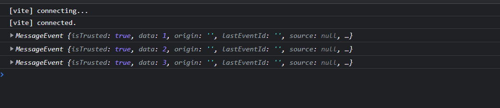


说明 Web Worker 脚本已经成功执行，也能与主线程正常通信。

### Web Assembly 文件

Vite 对于 `.wasm` 文件也提供了开箱即用的支持，我们拿一个斐波拉契的 `.wasm` 文件来进行一下实际操作，对应的 JavaScript 原文件如下:

```js
export function fib(n) {
  var a = 0,
    	b = 1;
  if (n > 0) {
    while (--n) {
      let t = a + b;
      a = b;
      b = t;
    }
    return b;
  }
  return a;
}
```

我们在组件中导入 `fib.wasm` 文件:

```js
import init from './fib.wasm';

type FibFunc = (num: number) => number;

init({}).then((exports) => {
  const fibFunc = exports.fib as FibFunc;
  console.log('Fib result:', fibFunc(10));
});
```

Vite 会对`.wasm`文件的内容进行封装，默认导出为 init 函数，这个函数返回一个 Promise，因此我们可以在其 then 方法中拿到其导出的成员——`fib`方法。

回到浏览器，我们可以查看到计算结果，说明 .wasm 文件已经被成功执行:

```js
[vite] connecting...
App.tsx:26 Fib result: 55
client.ts:53 [vite] connected.
```

### 其他静态资源

除了上述的一些资源格式，Vite 也对下面几类格式提供了内置的支持:

- 媒体类文件，包括`mp4`、`webm`、`ogg`、`mp3`、`wav`、`flac`和`aac`。
- 字体类文件。包括`woff`、`woff2`、`eot`、`ttf` 和 `otf`。
- 文本类。包括`webmanifest`、`pdf`和`txt`。

也就是说，你可以在 Vite 将这些类型的文件当做一个 ES 模块来导入使用。
如果你的项目中还存在其它格式的静态资源，你可以通过 `assetsInclude` 配置让 Vite 来支持加载:

```js
// vite.config.ts

{
  assetsInclude: ['.gltf']
}
```

### 特殊资源后缀

Vite 中引入静态资源时，也支持在路径最后加上一些特殊的 query 后缀，包括:

- `?url`: 表示获取资源的路径，这在只想获取文件路径而不是内容的场景将会很有用。
- `?raw`: 表示获取资源的字符串内容，如果你只想拿到资源的原始内容，可以使用这个后缀。
- `?inline`: 表示资源强制内联，而不是打包成单独的文件。

### 生产环境处理

在前面的内容中，我们围绕着如何加载静态资源这个问题，在 Vite 中进行具体的编码实践，相信对于 Vite 中各种静态资源的使用你已经比较熟悉了。但另一方面，在生产环境下，我们又面临着一些新的问题。

- 部署域名怎么配置？
- 资源打包成单文件还是作为 Base64 格式内联?
- 图片太大了怎么压缩？
- svg 请求数量太多了怎么优化？

#### 自定义部署域名

一般在我们访问线上的站点时，站点里面一些静态资源的地址都包含了相应域名的前缀，如:

```js

```

以上面这个地址例子，`https://sanyuan.cos.ap-beijing.myqcloud.com`是 CDN 地址前缀，`/logo.png` 则是我们开发阶段使用的路径。那么，我们是不是需要在上线前把图片先上传到 CDN，然后将代码中的地址手动替换成线上地址呢？这样就太麻烦了！

在 Vite 中我们可以有更加自动化的方式来实现地址的替换，只需要在配置文件中指定`base`参数即可:

```js
// vite.config.ts
// 是否为生产环境，在生产环境一般会注入 NODE_ENV 这个环境变量，见下面的环境变量文件配置
const isProduction = process.env.NODE_ENV === 'production';
// 填入项目的 CDN 域名地址
const CDN_URL = 'xxxxxx';

// 具体配置
{
  base: isProduction ? CDN_URL: '/'
}

// .env.development
NODE_ENV=development

// .env.production
NODE_ENV=production
```

注意在项目根目录新增的两个环境变量文件`.env.development`和`.env.production`，顾名思义，即分别在开发环境和生产环境注入一些环境变量，这里为了区分不同环境我们加上了`NODE_ENV`，你也可以根据需要添加别的环境变量。

> 打包的时候 Vite 会自动将这些环境变量替换为相应的字符串。

接着执行 `pnpm run build`，可以发现产物中的静态资源地址已经自动加上了 CDN 地址前缀:

```html
<!DOCTYPE html>
<html lang="en">
  <head>
    <meta charset="UTF-8" />
    <link rel="icon" type="image/svg+xml" href="/src/favicon.svg" />
    <meta name="viewport" content="width=device-width, initial-scale=1.0" />
    <title>Vite App</title>
    <script type="module" crossorigin src="https://img.yueluo.club/assets/index.f2f294a4.js"></script>
    <link rel="stylesheet" href="https://img.yueluo.club/assets/index.65178a92.css">
  </head>
  <body>
    <div id="root"></div>
  </body>
</html>

```

当然，有时候可能项目中的某些图片需要存放到另外的存储服务，一种直接的方案是将完整地址写死到 src 属性中，如:

```js

```

这样做显然是不太优雅的，我们可以通过定义环境变量的方式来解决这个问题，在项目根目录新增`.env`文件:

```js
// 开发环境优先级: .env.development > .env
// 生产环境优先级: .env.production > .env
// .env 文件
VITE_IMG_BASE_URL=https://my-image-cdn.com
```

然后进入 `src/vite-env.d.ts`增加类型声明:

```js
/// <reference types="vite/client" />

interface ImportMetaEnv {
  readonly VITE_APP_TITLE: string;
  // 自定义的环境变量
  readonly VITE_IMG_BASE_URL: string;
}

interface ImportMeta {
  readonly env: ImportMetaEnv;
}
```

值得注意的是，如果某个环境变量要在 Vite 中通过 `import.meta.env` 访问，那么它必须以`VITE_`开头，如`VITE_IMG_BASE_URL`。接下来我们在组件中来使用这个环境变量:

```html

```

接下来在 `开发环境` 启动项目或者 `生产环境` 打包后可以看到环境变量已经被替换，地址能够正常显示:

```html

```

至此，我们就彻底解决了图片资源生产环境域名替换的问题。

#### 单文件 or 内联

在 Vite 中，所有的静态资源都有两种构建方式，一种是打包成一个单文件，另一种是通过 base64 编码的格式内嵌到代码中。

这两种方案到底应该如何来选择呢？

对于比较小的资源，适合内联到代码中，一方面对`代码体积`的影响很小，另一方面可以减少不必要的网络请求，`优化网络性能`。而对于比较大的资源，就推荐单独打包成一个文件，而不是内联了，否则可能导致上 MB 的 base64 字符串内嵌到代码中，导致代码体积瞬间庞大，页面加载性能直线下降。

Vite 中内置的优化方案是下面这样的:

- 如果静态资源体积 >= 4KB，则提取成单独的文件
- 如果静态资源体积 < 4KB，则作为 base64 格式的字符串内联

上述的`4 KB`即为提取成单文件的临界值，当然，这个临界值你可以通过 `build.assetsInlineLimit` 自行配置，如下代码所示:

```js
// vite.config.ts
{
  build: {
    // 8 KB
    assetsInlineLimit: 8 * 1024
  }
}
```

> svg 格式的文件不受这个临时值的影响，始终会打包成单独的文件，因为它和普通格式的图片不一样，需要动态设置一些属性

#### 图片压缩

图片资源的体积往往是项目产物体积的大头，如果能尽可能精简图片的体积，那么对项目整体打包产物体积的优化将会是非常明显的。在 JavaScript 领域有一个非常知名的图片压缩库 [imagemin](https://link.juejin.cn/?target=https%3A%2F%2Fwww.npmjs.com%2Fpackage%2Fimagemin)，作为一个底层的压缩工具，前端的项目中经常基于它来进行图片压缩，比如 Webpack 中大名鼎鼎的`image-webpack-loader`。社区当中也已经有了开箱即用的 Vite 插件—— `vite-plugin-imagemin`，首先让我们来安装它:

```js
pnpm i vite-plugin-imagemin --ignore-scripts -D 

// 正常不需要使用 --ignore-scripts 参数，该参数会忽略部分依赖安装
```

随后在 Vite 配置文件中引入:

```js
//vite.config.ts
import viteImagemin from 'vite-plugin-imagemin';

{
  plugins: [
    // 忽略前面的插件
    viteImagemin({
      // 无损压缩配置，无损压缩下图片质量不会变差
      optipng: {
        optimizationLevel: 7
      },
      // 有损压缩配置，有损压缩下图片质量可能会变差
      pngquant: {
        quality: [0.8, 0.9],
      },
      // svg 优化
      svgo: {
        plugins: [
          {
            name: 'removeViewBox'
          },
          {
            name: 'removeEmptyAttrs',
            active: false
          }
        ]
      }
    })
  ]
}
```

接下来我们可以尝试执行`pnpm run build`进行打包，Vite 插件会自动帮助我们调用 `imagemin` 进行项目图片的压缩。


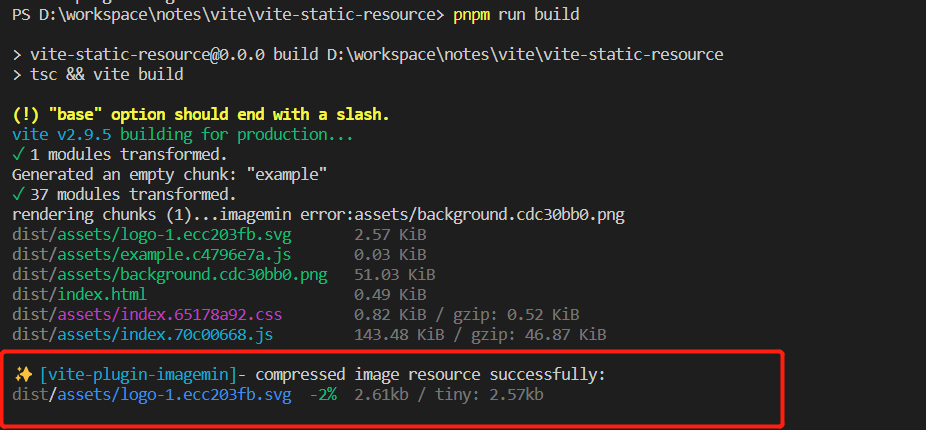


#### 雪碧图优化

在实际的项目中我们还会经常用到各种各样的 svg 图标，虽然 svg 文件一般体积不大，但 Vite 中对于 svg 文件会始终打包成单文件，大量的图标引入之后会导致网络请求增加，大量的 HTTP 请求会导致网络解析耗时变长，页面加载性能直接受到影响。这个问题怎么解决呢？

> HTTP2 的多路复用设计可以解决大量 HTTP 的请求导致的网络加载性能问题，因此雪碧图技术在 HTTP2 并没有明显的优化效果，这个技术更适合在传统的 HTTP 1.1 场景下使用(比如本地的 Dev Server)。

比如在 Header 中分别引入 5 个 svg 文件:

```js
import Logo2 from '@assets/icons/logo-2.svg';
import Logo3 from '@assets/icons/logo-3.svg';
import Logo4 from '@assets/icons/logo-4.svg';
import Logo5 from '@assets/icons/logo-5.svg';
import Logo6 from '@assets/icons/logo-6.svg';
```

这里顺便说一句，Vite 中提供了 `import.meta.glob` 的语法糖来解决这种**批量导入**的问题，如上述的 import 语句可以写成下面这样:

```js
const icons = import.meta.glob('./assets/icon/logo-*.svg');
```

结果如下:

```js
{
  ./assets/icon/logo-1.svg: () => import("/src/assets/icon/logo-1.svg?import")
	./assets/icon/logo-2.svg: () => import("/src/assets/icon/logo-2.svg?import")
	./assets/icon/logo-3.svg: () => import("/src/assets/icon/logo-3.svg?import")
	./assets/icon/logo-4.svg: () => import("/src/assets/icon/logo-4.svg?import")
	./assets/icon/logo-5.svg: () => import("/src/assets/icon/logo-5.svg?import")
	./assets/icon/logo-6.svg: () => import("/src/assets/icon/logo-6.svg?import")
}
```

可以看到对象的 value 都是动态 import，适合按需加载的场景。
在这里我们只需要同步加载即可，可以使用 `import.meta.globEager`来完成:

```js
const icons = import.meta.globEager('./assets/icon/logo-*.svg');
```

`icons ` 的结果打印如下:

```js
{
  ./assets/icon/logo-1.svg: Module {Symbol(Symbol.toStringTag): 'Module'}
  ./assets/icon/logo-2.svg: Module {Symbol(Symbol.toStringTag): 'Module'}
  ./assets/icon/logo-3.svg: Module {Symbol(Symbol.toStringTag): 'Module'}
  ./assets/icon/logo-4.svg: Module {Symbol(Symbol.toStringTag): 'Module'}
  ./assets/icon/logo-5.svg: Module {Symbol(Symbol.toStringTag): 'Module'}
  ./assets/icon/logo-6.svg: Module {Symbol(Symbol.toStringTag): 'Module'}
}
```

接下来我们稍作解析，然后将 svg 应用到组件当中:

```jsx
import {　useEffect　} from 'react';
import './App.css'

// const icons = import.meta.glob('./assets/icon/logo-*.svg');
const icons = import.meta.globEager('./assets/icon/logo-*.svg');
const urls = Object.values(icons).map(mod => mod.default);

function App() {
  return (
    <div className="App">
      {
        urls.map((item) => (
          
        ))
      }
    </div>
  )
}

export default App
```

回到页面中，我们发现浏览器分别发出了 6 个 svg 的请求:


假设页面有 100 个 svg 图标，将会多出 100 个 HTTP 请求，依此类推。我们能不能把这些 svg 合并到一起，从而大幅减少网络请求呢？

答案是可以的。这种合并图标的方案也叫`雪碧图`，我们可以通过`vite-plugin-svg-icons`来实现这个方案，首先安装一下这个插件:

```js
pnpm i vite-plugin-svg-icons -D
```

接着在 Vite 配置文件中增加如下内容:

```js
// vite.config.ts
import { createSvgIconsPlugin } from 'vite-plugin-svg-icons';

{
  plugins: [
    // 省略其它插件
    createSvgIconsPlugin({
      iconDirs: [path.join(__dirname, 'src/assets/icon')]
    })
  ]
}
```

在 `src/components`目录下新建`SvgIcon`组件:

```jsx
// SvgIcon/index.tsx
export interface SvgIconProps {
  name?: string;
  prefix: string;
  color: string;
  [key: string]: string;
}

export default function SvgIcon({
  name,
  prefix = 'icon',
  color = '#333',
  ...props
}: SvgIconProps) {
  const symbolId = `#${prefix}-${name}`;

  return (
    <svg {...props} aria-hidden="true">
      <use href={symbolId} fill={color} />
    </svg>
  );
}
```

现在我们回到 App 组件中，稍作修改:

```js
// TODO：暂不动态导入，不起作用

// App.tsx
const icons = import.meta.globEager('./assets/icon/logo-*.svg');
const iconUrls = Object.values(icons).map((mod) => {
  // 如 ./assets/icons/logo-1.svg -> logo-1
  const fileName = mod.default.split('/').pop();
  const [svgName] = fileName.split('.');
  return svgName;
});

// 渲染 svg 组件
{iconUrls.map((item) => (
  <SvgIcon name={item} key={item} width="50" height="50" />
))}
```

```jsx
// TODO：使用静态导入可以有效合成 Svg 雪碧图

<SvgIcon name='logo-1' width="50" height="50"  />
<SvgIcon name='logo-2' width="50" height="50"  />
<SvgIcon name='logo-3' width="50" height="50"  />
<SvgIcon name='logo-4' width="50" height="50"  />
<SvgIcon name='logo-5' width="50" height="50"  />
<SvgIcon name='logo-6' width="50" height="50"  />
```

最后在 `src/main.tsx` 文件中添加一行代码:

```js
import 'virtual:svg-icons-register';
```

> virtual 开头的这一段 ID 代表一个虚拟模块，插件内部会通过这个虚拟模块加载成一段脚本，把 svg 插入到 dom 树。

现在回到浏览器的页面中，发现雪碧图已经生成，观察网络请求，也不会出现请求多个 svg 的情况。

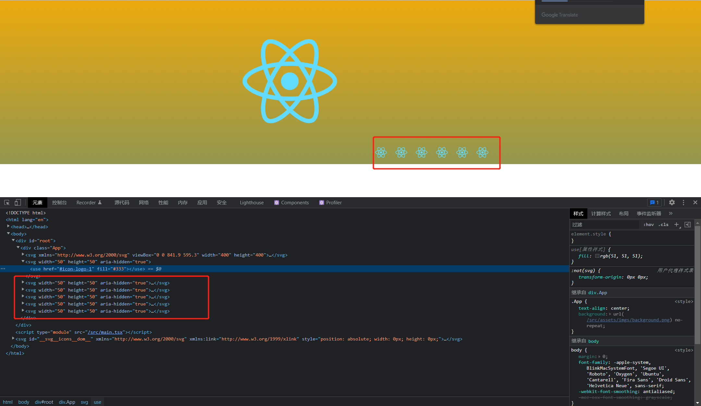

雪碧图包含了所有图标的具体内容，而对于页面每个具体的图标，则通过 `use` 属性来引用雪碧图的对应内容:

```html
<svg width="50" height="50" aria-hidden="true">
  <use href="#icon-logo-2" fill="#333">
</use></svg>
```

如此一来，我们就能将所有的 svg 内容都内联到 HTML 中，省去了大量 svg 的网络请求。

### 总结

你需要重点掌握在**Vite 如何加载静态资源**和**如何在生产环境中对静态资源进行优化**。

首先是如何加载各种静态资源，如图片、svg(组件形式)、JSON、Web Worker 脚本、Web Asssembly 文件等等格式，并通过一些示例带大家进行实际的操作。

其次，我们会把关注点放到**生产环境**，对 `自定义部署域名`、`是否应该内联`、`图片压缩`、`svg 雪碧图` 等问题进行了详细的探讨和实践，对于如何解决这些问题，相信你也有了自己的答案。

当然，在编码实操的过程当中，我也给你穿插了一些 Vite 其他的知识点，比如如何 `定义环境变量文件`、`如何使用 Glob 导入` 的语法糖。相信你在学习过程中能更加体会到 Vite 给项目开发带来的便利，同时也对 Vite 的掌握更深入了一步。

## 秒级依赖预构建

Vite 是一个提倡 `no-bundle` 的构建工具，相比于传统的 Webpack，能做到开发时的模块按需编译，而不用先打包完再加载。

我们所说的模块代码其实分为两部分，一部分是源代码，也就是业务代码，另一部分是第三方依赖的代码，即 `node_modules` 中的代码。所谓的 `no-bundle` **只是对于源代码而言**，对于第三方依赖而言，Vite 还是选择 bundle(打包)，并且使用速度极快的打包器 Esbuild 来完成这一过程，达到秒级的依赖编译速度。

### 为什么需要预构建

为什么在开发阶段我们要对第三方依赖进行预构建? 如果不进行预构建会怎么样？

首先 Vite 是基于浏览器原生 ES 模块规范实现的 Dev Server，不论是应用代码，还是第三方依赖的代码，理应符合 ESM 规范才能够正常运行。但我们没有办法控制第三方的打包规范。就目前来看，还有相当多的第三方库仍然没有 ES 版本的产物，比如大名鼎鼎的  `react`:

```js
// react 入口文件
// 只有 CommonJS 格式

if (process.env.NODE_ENV === "production") {
  module.exports = require("./cjs/react.production.min.js");
} else {
  module.exports = require("./cjs/react.development.js");
}
```

这种 CommonJS 格式的代码在 Vite 当中无法直接运行，我们需要将它转换成 ESM 格式的产物。

此外，还有一个比较重要的问题——**请求瀑布流问题**。比如说，知名的`loadsh-es`库本身是有 ES 版本产物的，可以在 Vite 中直接运行。但实际上，它在加载时会发出特别多的请求，导致页面加载的前几秒几都乎处于卡顿状态，拿一个简单的 demo 项目举例，请求情况如下图所示:

```js
import debounce from '../node_modules/lodash-es/debounce';

const handlebtnClick = debounce(function () {
  setCount(count + 1);
}, 600);
```

我们在应用代码中调用了`debounce`方法，这个方法会依赖很多工具函数。

每个`import`都会触发一次新的文件请求，因此在这种 `依赖层级深`、`涉及模块数量多 `的情况下，会触发成百上千个网络请求，巨大的请求量加上 Chrome 对同一个域名下只能同时支持 `6` 个 HTTP 并发请求的限制，导致页面加载十分缓慢，与 Vite 主导性能优势的初衷背道而驰。不过，在进行**依赖的预构建**之后，`lodash-es `这个库的代码被打包成了一个文件，这样请求的数量会骤然减少，页面加载也快了许多。下图是进行预构建之后的请求情况，你可以对照看看:

// TODO

依赖预构建主要做了两件事情：

一是将其他格式(如 UMD 和 CommonJS)的产物转换为 ESM 格式，使其在浏览器通过 `<script type="module"><script>`的方式正常加载。

二是打包第三方库的代码，将各个第三方库分散的文件合并到一起，减少 HTTP 请求数量，避免页面加载性能劣化。

而这两件事情全部由性能优异的  `Esbuild` (基于 Golang 开发)完成，而不是传统的 Webpack/Rollup，所以也不会有明显的打包性能问题，反而是 Vite 项目启动飞快(秒级启动)的一个核心原因。

> Vite 1.x 使用了 Rollup 来进行依赖预构建，在 2.x 版本将 Rollup 换成了 Esbuild，编译速度提升了 [近 100 倍](https://link.juejin.cn/?target=https%3A%2F%2Fesbuild.github.io%2F)！

### 如何开启预构建

在 Vite 中有两种开启预构建的方式，分别是 `自动开启` 和 `手动开启`。

#### 自动开启

预构建默认是是 `自动开启`。项目启动成功后，你可以在根目录下的`node_modules`中发现`.vite`目录，这就是预构建产物文件存放的目录，内容如下:


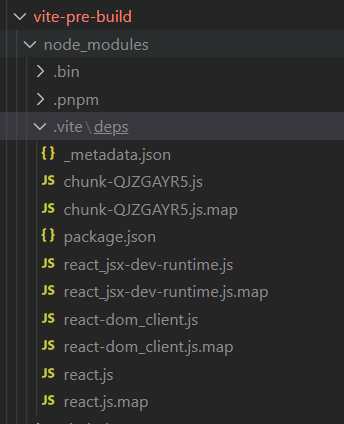


在浏览器访问页面后，打开 `Dev Tools` 中的网络调试面板，你可以发现第三方包的引入路径已经被重写:

```js
import {
  require_react
} from "/node_modules/.vite/deps/chunk-QJZGAYR5.js?v=2dc7d6a2";

// dep:react
var react_default = require_react();
export {
  react_default as default
};
//# sourceMappingURL=react.js.map
```

并且对于依赖的请求结果，Vite 的 Dev Server 会设置强缓存:

```js
Access-Control-Allow-Origin: *
Cache-Control: max-age=31536000,immutable
Connection: keep-alive
Content-Length: 213
Content-Type: application/javascript
Date: Sun, 24 Apr 2022 13:11:01 GMT
Etag: W/"d5-B0da628485UVtIrlUkYdZltKfa4"
Keep-Alive: timeout=5
```

缓存过期时间被设置为一年，表示缓存过期前浏览器对 react 预构建产物的请求不会再经过 Vite Dev Server，直接用缓存结果。

当然，除了 HTTP 缓存，Vite 还设置了本地文件系统的缓存，所有的预构建产物默认缓存在 `node_modules/.vite`目录中。如果以下 3 个地方都没有改动，Vite 将一直使用缓存文件:

1. package.json 的 `dependencies` 字段
2. 各种包管理器的 lock 文件
3. `optimizeDeps` 配置内容

#### 手动开启

上面提到了预构建中本地文件系统的产物缓存机制，而少数场景下我们不希望用本地的缓存文件，比如需要调试某个包的预构建结果，我推荐使用下面任意一种方法清除缓存，还有手动开启预构建:

1. 删除 `node_modules/.vite` 目录。
2. 在 Vite 配置文件中，将 `server.force` 设为 `true`。
3. 命令行执行 `npx vite --force` 或者 `npx vite optimize`。

> Vite 项目的启动可以分为两步，第一步是依赖预构建，第二步才是 Dev Server 的启动，`npx vite optimize`相比于其它的方案，仅仅完成第一步的功能。

### 自定义配置详解

前面说到了如何启动预构建的问题，现在我们来谈谈怎样通过 Vite 提供的配置项来定制预构建的过程。
Vite 将预构建相关的配置项都集中在 `optimizeDeps` 属性上，我们来一一拆解这些子配置项背后的含义和应用场景。

#### 入口文件 - entries

第一个是参数是 `optimizeDeps.entries`，通过这个参数你可以自定义预构建的入口文件。

实际上，在项目第一次启动时，Vite 会默认抓取项目中所有的 HTML 文件（如当前脚手架项目中的 `index.html`），将 HTML 文件作为应用入口，然后根据入口文件扫描出项目中用到的第三方依赖，最后对这些依赖逐个进行编译。

那么，当默认扫描 HTML 文件的行为无法满足需求的时候，比如项目入口为 `vue` 格式文件时，你可以通过 entries 参数来配置:

```js
// vite.config.ts
{
  optimizeDeps: {
    // 为一个字符串数组
    entries: ["./src/main.vue"];
  }
}
```

当然，entries 配置也支持 [glob 语法](https://link.juejin.cn/?target=https%3A%2F%2Fgithub.com%2Fmrmlnc%2Ffast-glob)，非常灵活，如:

```js
// 将所有的 .vue 文件作为扫描入口
entries: ["**/*.vue"];
```

不光是 `.vue` 文件，Vite 同时还支持各种格式的入口，包括:  `html`、`svelte`、`astro`、`js`、`jsx`、`ts` 和 `tsx`。可以看到，只要可能存在 `import` 语句的地方，Vite 都可以解析，并通过内置的扫描机制搜集到项目中用到的依赖，通用性很强。

#### 添加依赖 - include

除了 `entries`，`include`  也是一个很常用的配置，它决定了可以强制预构建的依赖项，使用方式很简单:

```js
// vite.config.ts
optimizeDeps: {
  // 配置为一个字符串数组，将 `lodash-es` 和 `vue`两个包强制进行预构建
  include: ["lodash-es", "vue"];
}
```

它在使用上并不难，真正难的地方在于，如何找到合适它的使用场景。前文中我们提到，Vite 会根据应用入口(`entries`)自动搜集依赖，然后进行预构建，这是不是说明 Vite 可以百分百准确地搜集到所有的依赖呢？事实上并不是，某些情况下 Vite 默认的扫描行为并不完全可靠，这就需要联合配置 `include` 来达到完美的预构建效果了。接下来，我们好好梳理一下到底有哪些需要配置 `include` 的场景。

#### 动态 import 

在某些动态 import 的场景下，由于 Vite 天然按需加载的特性，经常会导致某些依赖只能在运行时被识别出来。

```js
// src/locales/zh_CN.js
import objectAssign from "object-assign";
console.log(objectAssign);

// main.tsx
const importModule = (m) => import(`./locales/${m}.ts`);
importModule("zh_CN");
```

在这个例子中，动态 import 的路径只有运行时才能确定，无法在预构建阶段被扫描出来。

Vite 运行时发现了新的依赖，随之重新进行依赖预构建，并刷新页面。这个过程也叫**二次预构建**。
在一些比较复杂的项目中，这个过程会执行很多次，如下面的日志信息所示:

```js
[vite] new dependencies found: @material-ui/icons/Dehaze, @material-ui/core/Box, @material-ui/core/Checkbox, updating...
[vite] ✨ dependencies updated, reloading page...
[vite] new dependencies found: @material-ui/core/Dialog, @material-ui/core/DialogActions, updating...
[vite] ✨ dependencies updated, reloading page...
[vite] new dependencies found: @material-ui/core/Accordion, @material-ui/core/AccordionSummary, updating...
[vite] ✨ dependencies updated, reloading page...
```

然而，二次预构建的成本也比较大。我们不仅需要把预构建的流程重新运行一遍，还得重新刷新页面，并且需要重新请求所有的模块。尤其是在大型项目中，这个过程会严重拖慢应用的加载速度！因此，我们要尽力避免运行时的 **二次预构建** 。具体怎么做呢？你可以通过`include` 参数提前声明需要按需加载的依赖:

```js
// vite.config.ts
{
  optimizeDeps: {
    include: [
      // 按需加载的依赖都可以声明到这个数组里
      "object-assign",
    ];
  }
}
```

#### 手动 exclude

`exclude` 是`optimizeDeps`中的另一个配置项，与`include `相对，用于将某些依赖从预构建的过程中排除。不过这个配置并不常用，也不推荐大家使用。如果真遇到了要在预构建中排除某个包的情况，需要注意 `它所依赖的包` 是否具有 ESM 格式，如下面这个例子:

```js
// vite.config.ts
{
  optimizeDeps: {
    exclude: ["@loadable/component"];
  }
}
```

刷新浏览器h控制台会出现报错。我们刚刚手动 exclude 的包 `@loadable/component` 本身具有 ESM 格式的产物，但它的某个依赖`hoist-non-react-statics`的产物并没有提供 ESM 格式，导致运行时加载失败。

这个时候 `include` 配置就派上用场了，我们可以强制对 `hoist-non-react-statics` 这个间接依赖进行预构建:

```js
// vite.config.ts
{
  optimizeDeps: {
    include: [
      // 间接依赖的声明语法，通过`>`分开, 如`a > b`表示 a 中依赖的 b
      "@loadable/component > hoist-non-react-statics",
    ];
  }
}
```

在 `include` 参数中，我们将所有不具备 ESM 格式产物包都声明一遍，这样再次启动项目就没有问题了。

#### 自定义 ESBuild 行为

Vite 提供了 `esbuildOptions`  参数来让我们自定义 Esbuild 本身的配置，常用的场景是加入一些 Esbuild 插件:

```js
// vite.config.ts
{
  optimizeDeps: {
    esbuildOptions: {
       plugins: [
        // 加入 Esbuild 插件
      ];
    }
  }
}
```

这个配置主要是处理一些特殊情况，如某个第三方包本身的代码出现问题了。接下来，我们就来讨论一下。

由于我们无法保证第三方包的代码质量，在某些情况下我们会遇到莫名的第三方库报错。我举一个常见的案例 —— `react-virtualized`库。这个库被许多组件库用到，但它的 ESM 格式产物有明显的问题，在 Vite 进行预构建的时候会直接抛出这个错误：


原因是这个库的 ES 产物莫名其妙多出了一行无用的代码:

```js
// WindowScroller.js 并没有导出这个模块
import { bpfrpt_proptype_WindowScroller } from "../WindowScroller.js";
```

其实我们并不需要这行代码，但它却导致 Esbuild 预构建的时候直接报错退出了。那这一类的问题如何解决呢？

##### 1. 修改第三方库代码

首先，我们能想到的思路是**直接修改第三方库的代码**，不过这会带来团队协作的问题，你的改动需要同步到团队所有成员，比较麻烦。

好在，我们可以使用 `patch-package` 这个库来解决这类问题。一方面，它能记录第三方库代码的改动，另一方面也能将改动同步到团队每个成员。

`patch-package` 官方只支持 npm 和 yarn，而不支持 pnpm，不过社区中已经提供了支持`pnpm`的版本，这里我们来安装一下相应的包:

```js
pnpm i @milahu/patch-package-with-pnpm-support -D
```

> 注意: 要改动的包在 package.json 中必须声明确定的版本，不能有`~`或者`^`的前缀。

接着，我们进入第三方库的代码中进行修改，先删掉无用的 import 语句，再在命令行输入:

```js
npx patch-package react-virtualized
```

现在根目录会多出 `patches` 目录记录第三方包内容的更改，随后我们在 `package.json` 的 `scripts` 中增加如下内容：

```js
{
  "scripts": {
    // ...
    "postinstall": "patch-package"
  }
}
```

这样一来，每次安装依赖的时候都会通过  `postinstall` 脚本自动应用 patches 的修改，解决了团队协作的问题。

##### 2. 加入 ESBuild 插件

第二种方式是通过 Esbuild 插件修改指定模块的内容，这里给大家展示一下新增的配置内容:

```js
// vite.config.ts
const esbuildPatchPlugin = {
  name: "react-virtualized-patch",
  setup(build) {
    build.onLoad(
      {
        filter:
          /react-virtualized\/dist\/es\/WindowScroller\/utils\/onScroll.js$/,
      },
      async (args) => {
        const text = await fs.promises.readFile(args.path, "utf8");

        return {
          contents: text.replace(
            'import { bpfrpt_proptype_WindowScroller } from "../WindowScroller.js";',
            ""
          ),
        };
      }
    );
  },
};

// 插件加入 Vite 预构建配置
{
  optimizeDeps: {
    esbuildOptions: {
      plugins: [esbuildPatchPlugin];
    }
  }
}
```

### 总结

在这一节，你需要重点掌握 **Vite 预构建技术的作用**和**预构建相关配置的使用**。

Vite 中的依赖预构建技术主要解决了 2 个问题，即模块格式兼容问题和海量模块请求的问题。
Vite 中开启预构建有 2 种方式，并梳理了预构建产物的缓存策略，推荐了一些手动清除缓存的方法。

接着，我们正式学习了预构建的相关配置——`entries`、`include`、`exclude`和`esbuldOptions`，并且重点介绍了 `include` 配置的各种使用场景和使用姿势。最后，我们讨论了一类特殊情况，即第三方包出现了问题该怎么办，分别给你介绍了两个解决思路: 通过 `patch-package` 修改库代码和编写  `Esbuild 插件 ` 修改模块加载的内容。

## 双引擎架构

之前，我们学习了很多 Vite 使用和项目搭建的内容。接下来让我们将目光集中到 Vite 本身的架构上，一起聊聊它是如何站在巨人的肩膀上实现出来的。所谓的 `巨人`，指的就是 Vite 底层所深度使用的两个构建引擎—— `Esbuild` 和 `Rollup`。

### Vite 架构图

很多人对 Vite 的双引擎架构仅仅停留在 `开发阶段使用 Esbuild，生产环境用 Rollup` 的阶段，殊不知，Vite 真正的架构远没有这么简单。一图胜千言，这里放一张 Vite 架构图：

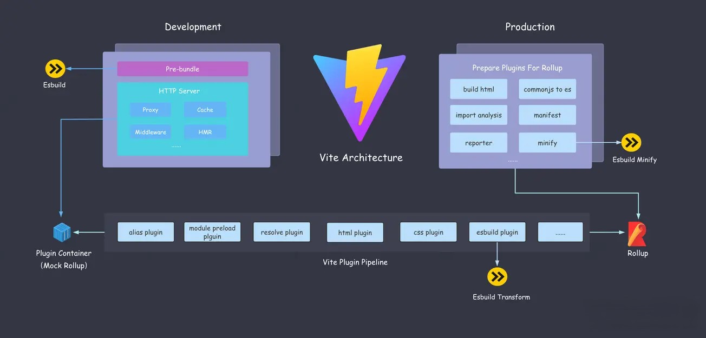

### ESBuild

必须要承认的是，`Esbuild`的确是 Vite 高性能的得力助手，在很多 `关键的构建阶段` 让 Vite 获得了相当优异的性能，如果这些阶段用传统的打包器/编译器来完成的话，开发体验要下降一大截。

那么，Esbuild 到底在 Vite 的构建体系中发挥了哪些作用？

#### 依赖构建 - Bundle 工具

首先是**开发阶段的依赖预构建**阶段。


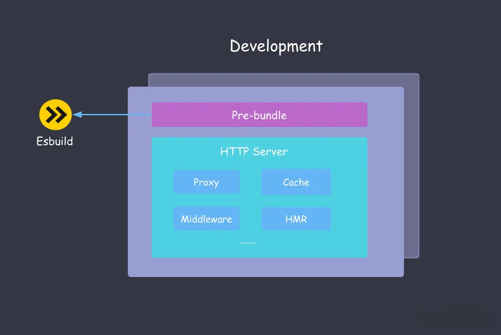


一般来说，`node_modules` 依赖的大小动辄几百 MB 甚至上 GB ，会远超项目源代码，相信大家都深有体会。如果这些依赖直接在 Vite 中使用，会出现一系列的问题，主要是 ESM 格式的兼容性问题和海量请求的问题。总而言之，对于第三方依赖，需要在应用启动前进行**打包**并且**转换为 ESM 格式**。

Vite 1.x 版本中使用 Rollup 来做这件事情，但 Esbuild 的性能实在是太恐怖了，Vite 2.x 果断采用 Esbuild 来完成第三方依赖的预构建，至于性能到底有多强，大家可以参照它与传统打包工具的性能对比图:

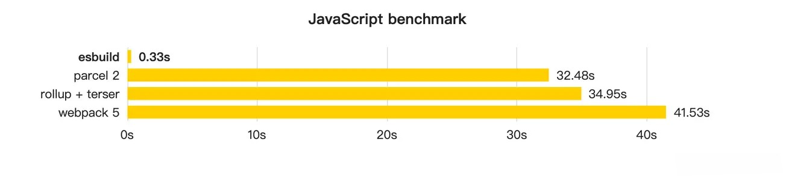

当然，Esbuild 作为打包工具也有一些缺点。

- 不支持降级到 `ES5` 的代码。这意味着在低端浏览器代码会跑不起来。
- 不支持 `const enum` 等语法。这意味着单独使用这些语法在 esbuild 中会直接抛错。
- 不提供操作打包产物的接口，像 Rollup 中灵活处理打包产物的能力(如`renderChunk`钩子)在 Esbuild 当中完全没有。
- 不支持自定义 Code Splitting 策略。传统的 Webpack 和 Rollup 都提供了自定义拆包策略的 API，而 Esbuild 并未提供，从而降级了拆包优化的灵活性。


尽管 Esbuild 作为一个社区新兴的明星项目，有如此多的局限性，但依然不妨碍 Vite 在**开发阶段**使用它成功启动项目并获得极致的**性能提升**，生产环境处于稳定性考虑当然是采用功能更加丰富、生态更加成熟的 Rollup 作为依赖打包工具了。

#### 单文件编译 - 编译工具

在依赖预构建阶段， Esbuild 作为 Bundler 的角色存在。而在 TS(X)/JS(X) 单文件编译上面，Vite 也使用 Esbuild 进行语法转译，也就是将 Esbuild 作为 Transformer 来用。大家可以在架构图中 `Vite Plugin Pipeline` 部分注意到:


也就是说，Esbuild 转译 TS 或者 JSX 的能力通过 Vite 插件提供，这个 Vite 插件在开发环境和生产环境都会执行，因此，我们可以得出下面这个结论:

> Vite 已经将 Esbuild 的 Transformer 能力用到了生产环境。对于低端浏览器场景，Vite 仍然可以做到语法和 Polyfill 安全。

这部分能力用来替换原先 Babel 或者 TSC 的功能，因为无论是 Babel 还是 TSC都有性能问题，大家对这两个工具普遍的认知都是:  **慢，太慢了**。

当 Vite 使用 Esbuild 做单文件编译之后，提升可以说**相当大**了，我们以一个巨大的、50 多 MB 的纯代码文件为例，来[对比](https://link.juejin.cn/?target=https%3A%2F%2Fdatastation.multiprocess.io%2Fblog%2F2021-11-13-benchmarking-esbuild-swc-typescript-babel.html)`Esbuild`、`Babel`、`TSC` 包括 `SWC` 的编译性能:

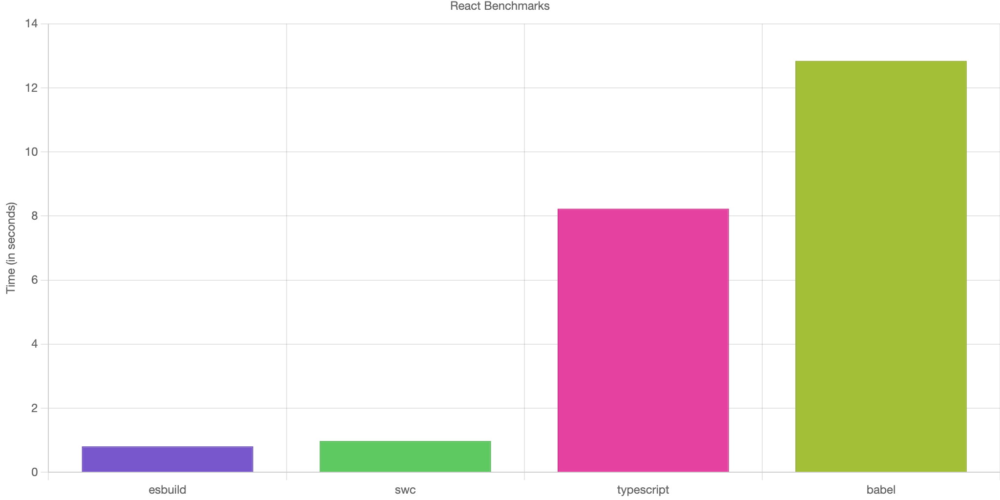

可以看到，虽然 Esbuild Transfomer 能带来巨大的性能提升，但其自身也有局限性，最大的局限性就在于 TS 中的类型检查问题。这是因为 Esbuild 并没有实现 TS 的类型系统，在编译 `TS`(或者 `TSX`) 文件时仅仅抹掉了类型相关的代码，暂时没有能力实现类型检查。

也因此，`vite build`之前会先执行`tsc`命令，也就是借助 TS 官方的编译器进行类型检查。

当然，要解决类型问题，我更推荐大家使用 TS 的编辑器插件。在开发阶段就能早早把问题暴露出来并解决，不至于等到项目要打包上线的时候。

#### 代码压缩 - 压缩工具

> Vite 从 2.6 版本开始，就官宣默认使用 Esbuild 来进行生产环境的代码压缩，包括 JS 代码和 CSS 代码。

从架构图中可以看到，在生产环境中 Esbuild 压缩器通过插件的形式融入到了 Rollup 的打包流程中:


为什么 Vite 要将 Esbuild 作为生产环境下默认的压缩工具呢？

传统的方式都是使用 Terser 这种 JS 开发的压缩器来实现，在 Webpack 或者 Rollup 中作为一个 Plugin 来完成代码打包后的压缩混淆的工作。但 Terser 其实很慢，主要有 2 个原因。

1. 压缩这项工作涉及大量 AST 操作，并且在传统的构建流程中，AST 在各个工具之间无法共享，比如 Terser 就无法与 Babel 共享同一个 AST，造成了很多重复解析的过程。
2. JS 本身属于解释性 + JIT（即时编译） 的语言，对于压缩这种 CPU 密集型的工作，其性能远远比不上 Golang 这种原生语言。

因此，Esbuild 这种从头到尾**共享 AST** 以及**原生语言编写**的 Minifier 在性能上能够甩开传统工具的好几十倍。

举个例子，我们可以看下面这个实际大型库(`echarts`)的压缩性能[测试项目](https://link.juejin.cn/?target=https%3A%2F%2Fgithub.com%2Fprivatenumber%2Fminification-benchmarks):

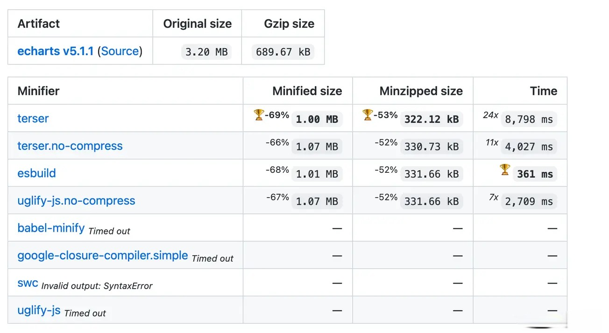

压缩一个大小为`3.2 MB`的库，Terser 需要耗费`8798 ms`，而 Esbuild 仅仅需要`361 ms`，压缩效率较 Terser 提升了二三十倍，并且产物的体积几乎没有劣化。

总的来说，Vite 将 Esbuild 作为自己的性能利器，将 Esbuild 各个垂直方向的能力(`Bundler`、`Transformer`、`Minifier`)利用的淋漓尽致，给 Vite 的高性能提供了有利的保证。

### Rollup

Rollup 在 Vite 中的重要性一点也不亚于 Esbuild，它既是 Vite 用作生产环境打包的核心工具，也直接决定了 Vite 插件机制的设计。那么，Vite 到底基于 Rollup 做了哪些事情？

#### 生产环境 Bundle

虽然 ESM 已经得到众多浏览器的原生支持，但生产环境做到完全 `no-bundle` 也不行，会有网络性能问题。为了在生产环境中也能取得优秀的产物性能，Vite 默认选择在生产环境中利用 `Rollup` 打包，并基于 Rollup 本身成熟的打包能力进行扩展和优化，主要包含 3 个方面:

* CSS 代码分割。如果某个异步模块中引入了一些 CSS 代码，Vite 就会自动将这些 CSS 抽取出来生成单独的文件，提高线上产物的`缓存复用率`。

* 自动预加载。Vite 会自动为入口 chunk 的依赖自动生成预加载标签 `<link rel="moduelpreload">` ，如:

```html
<head>
  <!-- 省略其它内容 -->
  <!-- 入口 chunk -->
  <script type="module" crossorigin src="/assets/index.250e0340.js"></script>
  <!--  自动预加载入口 chunk 所依赖的 chunk-->
  <link rel="modulepreload" href="/assets/vendor.293dca09.js">
</head>
```

这种适当预加载的做法会让浏览器提前下载好资源，优化页面性能。

* 异步 Chunk 加载优化。在异步引入的 Chunk 中，通常会有一些公用的模块，如现有两个异步引入的 Chunk: `A` 和 `B`，而且两者有一个公共依赖 C，如下图:


一般情况下，Rollup 打包之后，会先请求 A，然后浏览器在加载 A 的过程中才决定请求和加载 C，但 Vite 进行优化之后，请求 A 的同时会自动预加载 C，通过优化 Rollup 产物依赖加载方式节省了不必要的网络开销。

#### 插件兼容机制

无论是开发阶段还是生产环境，Vite 都根植于 Rollup 的插件机制和生态，如下面的架构图所示:

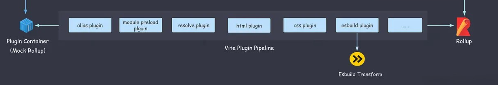

在开发阶段，Vite 借鉴了 [WMR](https://link.juejin.cn/?target=https%3A%2F%2Fgithub.com%2Fpreactjs%2Fwmr) 的思路，自己实现了一个 `Plugin Container`，用来模拟 Rollup 调度各个 Vite 插件的执行逻辑，而 Vite 的插件写法完全兼容 Rollup，因此在生产环境中将所有的 Vite 插件传入 Rollup 也没有问题。

反过来说，Rollup 插件却不一定能完全兼容 Vite。不过，目前仍然有不少 Rollup 插件可以直接复用到 Vite 中，你可以通过这个站点查看所有兼容 Vite 的 Rollup 插件: [vite-rollup-plugins.patak.dev/](https://link.juejin.cn/?target=https%3A%2F%2Fvite-rollup-plugins.patak.dev%2F) 。

狼叔在[《以框架定位论前端的先进性》](https://link.juejin.cn/?target=https%3A%2F%2Fmp.weixin.qq.com%2Fs%2Fmt2Uyh-lpHqHAHqjsen7zw) 提到现代前端框架的几大分类，Vite 属于`人有我优`的类型，因为类似的工具之前有 [Snowpack](https://link.juejin.cn/?target=https%3A%2F%2Fwww.snowpack.dev%2F)，Vite 诞生之后补齐了作为一个 no-bundle 构建工具的 Dev Server 能力(如 HMR)，确实比现有的工具能力更优。但更重要的是，Vite 在**社区生态**方面比 Snowpack 更占先天优势。

Snowpack 自研了一套插件机制，类似 Rollup 的 Hook 机制，可以看出借鉴了 Rollup 的插件机制，但并不能兼容任何现有的打包工具。如果需要打包，只能调用其它打包工具的 API，自身不提供打包能力。

而 Vite 的做法是从头到尾根植于的 Rollup 的生态，设计了和 Rollup 非常吻合的插件机制，而 Rollup 作为一个非常成熟的打包方案，从诞生至今已经迭代了`六年多`的时间，npm 年下载量达到`上亿次`，产物质量和稳定性都经历过大规模的验证。某种程度上说，这种根植于已有成熟工具的思路也能打消或者降低用户内心的疑虑，更有利于工具的推广和发展。

### 总结

本篇文章拆解了 Vite 底层双引擎的架构，分别介绍了 Esbuild 和 Rollup 究竟在 Vite 中做些了什么，你需要重点掌握 **Vite 的整体架构**以及 **Esbuild 和 Rollup 在 Vite 中的作用**。

首先，Esbuild 作为构建的性能利器，Vite 利用其 Bundler 的功能进行依赖预构建，用其 Transformer 的能力进行 TS 和 JSX 文件的转译，也用到它的压缩能力进行 JS 和 CSS 代码的压缩。

接着，介绍了 Vite 和 Rollup 的关系。在 Vite 当中，无论是插件机制、还是底层的打包手段，都基于 Rollup 来实现，可以说 Vite 是对于 Rollup 一种场景化的深度扩展，将 Rollup 从传统的 JS 库打包场景扩展至完整 Web 应用打包，然后结合开发阶段 `no-bundle` 的核心竞争力，打造出了自己独具一格的技术品牌。

因此，你可以看出双引擎对于 Vite 的重要性，如果要深入学习和应用 Vite，那么掌握 Esbuild 和 Rollup 的基础使用和插件开发是非常有必要的。

## ESBuild 插件开发实战

本篇文章将专注于 Esbuild 本身，让我们一起学习它的基本概念和功能使用，同时开发一个完整的 Esbuild 插件。

### 为什么 ESBuild 性能极高

Esbuild 是由 Figma 的 CTO 「Evan Wallace」基于 Golang 开发的一款打包工具，相比传统的打包工具，主打性能优势，在构建速度上可以比传统工具快 `10~100` 倍。那么，它是如何达到这样超高的构建性能的呢？主要原因可以概括为 4 点。

1. **使用 Golang 开发**，构建逻辑代码直接被编译为原生机器码，而不用像 JS 一样先代码解析为字节码，然后转换为机器码，大大节省了程序运行时间。
2. **多核并行**。内部打包算法充分利用多核 CPU 优势，所有的步骤尽可能并行，这也是得益于 Go 当中多线程共享内存的优势。
3. **从零造轮子**。 几乎没有使用任何第三方库，所有逻辑自己编写，大到 AST 解析，小到字符串的操作，保证极致的代码性能。
4. **高效的内存利用**。Esbuild 中从头到尾尽可能地复用一份 AST 节点数据，而不用像 JS 打包工具中频繁地解析和传递 AST 数据（如 string -> TS -> JS -> string)，造成内存的大量浪费。

### ESBuild 功能使用

首先我们执行 `pnpm init -y` 新建一个项目, 然后通过如下的命令完成 Esbuild 的安装:

```js
pnpm i esbuild
```

使用 Esbuild 有 2 种方式，分别是 **命令行调用**和**代码调用**。

#### 命令行调用

命令行方式调用也是最简单的使用方式。我们先来写一些示例代码，新建`src/index.jsx`文件，内容如下:

```js
// src/index.jsx
import Server from "react-dom/server";

let Greet = () => <h1>Hello, juejin!</h1>;
console.log(Server.renderToString(<Greet />));
```

安装所需的依赖，在终端执行如下的命令:

```js
pnpm install react react-dom
```

接着到`package.json`中添加`build`脚本:

```js
"scripts": {
    "build": "./node_modules/.bin/esbuild src/index.jsx --bundle --outfile=dist/out.js"
 },
```

> 如果提示  '.' is not recognized as an internal or external command，可以在命令行直接运行 build 命令。

现在，你可以在终端执行`pnpm run build`，可以发现如下的日志信息:

```js
PS D:\workspace\notes\vite\esbuild-demo> .\node_modules\.bin\esbuild src/index.jsx --bundle --outfile=dist/out.js

  dist\out.js  507.7kb

Done in 72ms
```

说明我们已经成功通过命令行完成了 Esbuild 打包！但命令行的使用方式不够灵活，只能传入一些简单的命令行参数，稍微复杂的场景就不适用了，所以一般情况下我们还是会用代码调用的方式。

#### 代码调用

Esbuild 对外暴露了一系列的 API，主要包括两类:  `Build API`和`Transform API`，我们可以在 Nodejs 代码中通过调用这些 API 来使用 Esbuild 的各种功能。

##### 项目打包：Build API

`Build API` 主要用来进行项目打包，包括 `build`、`buildSync` 和 `serve` 三个方法。

首先我们来试着在 Node.js 中使用 `build` 方法。你可以在项目根目录新建 `build.js` 文件，内容如下:

```js
onst { build, buildSync, serve } = require("esbuild");

async function runBuild() {
  // 异步方法，返回一个 Promise
  const result = await build({
    // ----  如下是一些常见的配置  --- 
    // 当前项目根目录
    absWorkingDir: process.cwd(),
    // 入口文件列表，为一个数组
    entryPoints: ["./src/index.jsx"],
    // 打包产物目录
    outdir: "dist",
    // 是否需要打包，一般设为 true
    bundle: true,
    // 模块格式，包括`esm`、`commonjs`和`iife`
    format: "esm",
    // 需要排除打包的依赖列表
    external: [],
    // 是否开启自动拆包
    splitting: true,
    // 是否生成 SourceMap 文件
    sourcemap: true,
    // 是否生成打包的元信息文件
    metafile: true,
    // 是否进行代码压缩
    minify: false,
    // 是否开启 watch 模式，在 watch 模式下代码变动则会触发重新打包
    watch: false,
    // 是否将产物写入磁盘
    write: true,
    // Esbuild 内置了一系列的 loader，包括 base64、binary、css、dataurl、file、js(x)、ts(x)、text、json
    // 针对一些特殊的文件，调用不同的 loader 进行加载
    loader: {
      '.png': 'base64',
    }
  });
  console.log(result);
}

runBuild();
```

随后，你在命令行执行 `node build.js`，就能在控制台发现如下日志信息:

```js
// node .\build.js

{
  errors: [],
  warnings: [],
  metafile: {
    inputs: {
      'node_modules/.pnpm/react@18.0.0/node_modules/react/cjs/react.development.js': [Object],
      'node_modules/.pnpm/react@18.0.0/node_modules/react/index.js': [Object],
      'node_modules/.pnpm/react-dom@18.0.0_react@18.0.0/node_modules/react-dom/cjs/react-dom-server-legacy.browser.development.js': [Object],
      'node_modules/.pnpm/react-dom@18.0.0_react@18.0.0/node_modules/react-dom/cjs/react-dom-server.browser.development.js': [Object],
      'node_modules/.pnpm/react-dom@18.0.0_react@18.0.0/node_modules/react-dom/server.browser.js': [Object],
      'src/index.jsx': [Object]
    },
    outputs: { 'dist/index.js.map': [Object], 'dist/index.js': [Object] }
  }
}
```

以上就是 Esbuild 打包的元信息，这对我们编写插件扩展 Esbuild 能力非常有用。

接着，我们再观察一下 dist 目录，发现打包产物和相应的 SourceMap 文件也已经成功写入磁盘:

```js
dist
- index.js
- index.js.map
```

其实 `buildSync` 方法的使用几乎相同，如下代码所示:

```js
function runBuild() {
  // 同步方法
  const result = buildSync({
    // 省略一系列的配置
  });
  console.log(result);
}

runBuild();
```

但我并不推荐大家使用  `buildSync`  这种同步的 API，它们会导致两方面不良后果。一方面容易使 Esbuild 在当前线程阻塞，丧失 `并发任务处理` 的优势。另一方面，Esbuild 所有插件中都不能使用任何异步操作，这给 `插件开发` 增加了限制。

因此我更推荐大家使用 `build` 这个异步 API，它可以很好地避免上述问题。

在项目打包方面，除了 `build` 和 `buildSync`，Esbuild 还提供了另外一个比较强大的 API——`serve`。这个 API 有 3 个特点。

1. 开启 serve 模式后，将在指定的端口和目录上搭建一个`静态文件服务`，这个服务器用原生 Go 语言实现，性能比 Nodejs 更高。
2. 类似 webpack-dev-server，所有的产物文件都默认不会写到磁盘，而是放在内存中，通过请求服务来访问。
3. **每次请求**到来时，都会进行重新构建(`rebuild`)，永远返回新的产物。

> 值得注意的是，触发 rebuild 的条件并不是代码改动，而是新的请求到来。

下面，我们通过一个具体例子来感受一下。

```js
// build.js
const { build, buildSync, serve } = require("esbuild");

function runBuild() {
  serve(
    {
      port: 8000,
      // 静态资源目录
      servedir: './dist'
    },
    {
      absWorkingDir: process.cwd(),
      entryPoints: ["./src/index.jsx"],
      bundle: true,
      format: "esm",
      splitting: true,
      sourcemap: true,
      ignoreAnnotations: true,
      metafile: true,
    }
  ).then((server) => {
    console.log("HTTP Server starts at port", server.port);
  });
}

runBuild();
```

我们在浏览器访问 `localhost:8000` 可以看到 Esbuild 服务器返回的编译产物如下所示：


后续每次在浏览器请求都会触发 Esbuild 重新构建，而每次重新构建都是一个增量构建的过程，耗时也会比首次构建少很多(一般能减少 70% 左右)。

> Serve API 只适合在开发阶段使用，不适用于生产环境。

##### 单文件转移：Transform API

除了项目的打包功能之后，Esbuild 还专门提供了单文件编译的能力，即 `Transform API`，与  `Build API`  类似，它也包含了同步和异步的两个方法，分别是 `transformSync` 和 `transform`。下面，我们具体使用下这些方法。

首先，在项目根目录新建 `transform.js`，内容如下:

```js
// transform.js
const { transform, transformSync } = require("esbuild");

async function runTransform() {
  // 第一个参数是代码字符串，第二个参数为编译配置
  const content = await transform(
    "const isNull = (str: string): boolean => str.length > 0;",
    {
      sourcemap: true,
      loader: "tsx",
    }
  );
  console.log(content);
}

runTransform();
```

`transformSync`  的用法类似，换成同步的调用方式即可。

```js
function runTransform {
  const content = await transformSync(/* 参数和 transform 相同 */)
  console.log(content);
}
```

不过由于同步的 API 会使 Esbuild 丧失 `并发任务处理` 的优势（`Build API`的部分已经分析过），我同样也不推荐大家使用`transformSync`。出于性能考虑，Vite 的底层实现也是采用 `transform`这个异步的 API 进行 TS 及 JSX 的单文件转译的。

### ESBuild 插件开发

我们在使用 Esbuild 的时候难免会遇到一些需要加上自定义插件的场景，并且 Vite 依赖预编译的实现中大量应用了 Esbuild 插件的逻辑。因此，插件开发是 Esbuild 中非常重要的内容，

接下来，我们就一起来完成 Esbuild 的插件开发，带你掌握若干个关键的钩子使用。

#### 基本概念

插件开发其实就是基于原有的体系结构中进行`扩展`和`自定义`。 Esbuild 插件也不例外，通过 Esbuild 插件我们可以扩展 Esbuild 原有的路径解析、模块加载等方面的能力，并在 Esbuild 的构建过程中执行一系列自定义的逻辑。

`Esbuild` 插件结构被设计为一个对象，里面有 `name` 和 `setup` 两个属性，`name` 是插件的名称，`setup` 是一个函数，其中入参是一个 `build` 对象，这个对象上挂载了一些钩子可供我们自定义一些钩子函数逻辑。以下是一个简单的`Esbuild`插件示例:

```js
let envPlugin = {
  name: 'env',
  setup(build) {
    build.onResolve({ filter: /^env$/ }, args => ({
      path: args.path,
      namespace: 'env-ns',
    }))

    build.onLoad({ filter: /.*/, namespace: 'env-ns' }, () => ({
      contents: JSON.stringify(process.env),
      loader: 'json',
    }))
  },
}

require('esbuild').build({
  entryPoints: ['src/index.jsx'],
  bundle: true,
  outfile: 'out.js',
  // 应用插件
  plugins: [envPlugin],
}).catch(() => process.exit(1))
```

使用插件后效果如下:

```js
// 应用了 env 插件后，构建时将会被替换成 process.env 对象
import { PATH } from 'env'

console.log(`PATH is ${PATH}`)
```

那么，`build`对象上的各种钩子函数是如何使用的呢？

#### 钩子函数的使用

##### onResolve、onLoad 钩子

在 Esbuild 插件中，`onResolve` 和 `onload `是两个非常重要的钩子，分别控制路径解析和模块内容加载的过程。

首先，我们来说说上面插件示例中的两个钩子该如何使用。

```js
build.onResolve({ filter: /^env$/ }, args => ({
  path: args.path,
  namespace: 'env-ns',
}));
build.onLoad({ filter: /.*/, namespace: 'env-ns' }, () => ({
  contents: JSON.stringify(process.env),
  loader: 'json',
}));
```

可以发现这两个钩子函数中都需要传入两个参数:  `Options`  和  `Callback`。

先说说 `Options`。它是一个对象，对于 `onResolve` 和  `onload` 都一样，包含 `filter` 和 `namespace` 两个属性，类型定义如下:

```js
interface Options {
  filter: RegExp;
  namespace?: string;
}
```

`filter`  为必传参数，是一个正则表达式，它决定了要过滤出的特征文件。

> 注意: 插件中的 `filter` 正则是使用 Go 原生正则实现的，为了不使性能过于劣化，规则应该尽可能严格。同时它本身和 JS 的正则也有所区别，不支持前瞻(?<=)、后顾(?=)和反向引用(\1)这三种规则。

`namespace` 为选填参数，一般在 `onResolve`  钩子中的回调参数返回 `namespace` 属性作为标识，我们可以在 `onLoad` 钩子中通过 `namespace` 将模块过滤出来。如上述插件示例就在 `onLoad` 钩子通过 `env-ns` 这个 namespace 标识过滤出了要处理的 `env` 模块。

除了 Options 参数，还有一个回调参数  `Callback`，它的类型根据不同的钩子会有所不同。相比于 Options，Callback 函数入参和返回值的结构复杂得多，涉及很多属性。不过，我们也不需要看懂每个属性的细节，先了解一遍即可，常用的一些属性会在插件实战部分讲解来讲。

在 onResolve 钩子中函数参数和返回值梳理如下:

```js
build.onResolve({ filter: /^env$/ }, (args: onResolveArgs): onResolveResult => {
  // 模块路径
  console.log(args.path)
  // 父模块路径
  console.log(args.importer)
  // namespace 标识
  console.log(args.namespace)
  // 基准路径
  console.log(args.resolveDir)
  // 导入方式，如 import、require
  console.log(args.kind)
  // 额外绑定的插件数据
  console.log(args.pluginData)
  
  return {
      // 错误信息
      errors: [],
      // 是否需要 external
      external: false;
      // namespace 标识
      namespace: 'env-ns';
      // 模块路径
      path: args.path,
      // 额外绑定的插件数据
      pluginData: null,
      // 插件名称
      pluginName: 'xxx',
      // 设置为 false，如果模块没有被用到，模块代码将会在产物中会删除。否则不会这么做
      sideEffects: false,
      // 添加一些路径后缀，如`?xxx`
      suffix: '?xxx',
      // 警告信息
      warnings: [],
      // 仅仅在 Esbuild 开启 watch 模式下生效
      // 告诉 Esbuild 需要额外监听哪些文件/目录的变化
      watchDirs: [],
      watchFiles: []
  }
}
```

在 onLoad 钩子中函数参数和返回值梳理如下:

```js
build.onLoad({ filter: /.*/, namespace: 'env-ns' }, (args: OnLoadArgs): OnLoadResult => {
  // 模块路径
  console.log(args.path);
  // namespace 标识
  console.log(args.namespace);
  // 后缀信息
  console.log(args.suffix);
  // 额外的插件数据
  console.log(args.pluginData);
  
  return {
      // 模块具体内容
      contents: '省略内容',
      // 错误信息
      errors: [],
      // 指定 loader，如`js`、`ts`、`jsx`、`tsx`、`json`等等
      loader: 'json',
      // 额外的插件数据
      pluginData: null,
      // 插件名称
      pluginName: 'xxx',
      // 基准路径
      resolveDir: './dir',
      // 警告信息
      warnings: [],
      // 同上
      watchDirs: [],
      watchFiles: []
  }
});
```

##### 其他钩子

在 build 对象中，除了`onResolve`和`onLoad`，还有 `onStart` 和 `onEnd` 两个钩子用来在构建开启和结束时执行一些自定义的逻辑，使用上比较简单，如下面的例子所示:

```js
let examplePlugin = {
  name: 'example',
  setup(build) {
    build.onStart(() => {
      console.log('build started')
    });
    build.onEnd((buildResult) => {
      if (buildResult.errors.length) {
        return;
      }
      // 构建元信息
      // 获取元信息后做一些自定义的事情，比如生成 HTML
      console.log(buildResult.metafile)
    })
  },
}
```

在使用这些钩子的时候，有 2 点需要注意。

1. onStart 的执行时机是在每次 build 的时候，包括触发 `watch` 或者 `serve` 模式下的重新构建。
2. onEnd 钩子中如果要拿到 `metafile`，必须将 Esbuild 的构建配置中 `metafile` 属性设为 `true`。

接下来我们进入插件实战，通过编写一些特定功能的插件来熟悉 Esbuild 插件的开发流程和技巧。

#### CDN 依赖拉取插件

Esbuild 原生不支持通过 HTTP 从 CDN 服务上拉取对应的第三方依赖资源，如下代码所示:

```js
// src/index.jsx
// react-dom 的内容全部从 CDN 拉取
// 这段代码目前是无法运行的
import { render } from "https://cdn.skypack.dev/react-dom";

let Greet = () => <h1>Hello, ESBuild!</h1>;

render(<Greet />, document.getElementById("root"));
```

示例代码中我们用到了 `Skypack` 这个提供 npm 第三方包 ESM 产物的 `CDN 服务`，我们可以通过 url 访问第三方包的资源，如下图所示:


现在我们需要通过 Esbuild 插件来识别这样的 url 路径，然后从网络获取模块内容并让 Esbuild 进行加载，甚至不再需要`npm install`安装依赖了。

> ESM CDN 作为面向未来的前端基础设施，对 Vite 的影响也至关重大，可以极大提升 Vite 在生产环境下的构建性能。

我们先从最简单的版本开始写起:

```js
// http-import-plugin.js
module.exports = () => ({
  name: "esbuild:http",
  setup(build) {
    let https = require("https");
    let http = require("http");

    // 1. 拦截 CDN 请求
    build.onResolve({ filter: /^https?:\/\// }, (args) => ({
      path: args.path,
      namespace: "http-url",
    }));

    // 2. 通过 fetch 请求加载 CDN 资源
    build.onLoad({ filter: /.*/, namespace: "http-url" }, async (args) => {
      let contents = await new Promise((resolve, reject) => {
        function fetch(url) {
          console.log(`Downloading: ${url}`);
          let lib = url.startsWith("https") ? https : http;
          let req = lib
            .get(url, (res) => {
              if ([301, 302, 307].includes(res.statusCode)) {
                // 重定向
                fetch(new URL(res.headers.location, url).toString());
                req.abort();
              } else if (res.statusCode === 200) {
                // 响应成功
                let chunks = [];
                res.on("data", (chunk) => chunks.push(chunk));
                res.on("end", () => resolve(Buffer.concat(chunks)));
              } else {
                reject(
                  new Error(`GET ${url} failed: status ${res.statusCode}`)
                );
              }
            })
            .on("error", reject);
        }
        fetch(args.path);
      });
      return { contents };
    });
  },
});
```

然后我们新建 `build.js` 文件，内容如下:

```js
const { build } = require("esbuild");
const httpImport = require("./http-import-plugin");
async function runBuild() {
  build({
    absWorkingDir: process.cwd(),
    entryPoints: ["./src/index.jsx"],
    outdir: "dist",
    bundle: true,
    format: "esm",
    splitting: true,
    sourcemap: true,
    metafile: true,
    plugins: [httpImport()],
  }).then(() => {
    console.log("🚀 Build Finished!");
  });
}

runBuild();
```

通过 `node build.js` 执行打包脚本，发现插件不能 work，抛出了这样一个错误:

```js
errors: [
    {
      detail: undefined,
        length: 91,
        line: 15,
        lineText: "export * from '/-/react-dom@v17.0.1-oZ1BXZ5opQ1DbTh7nu9r/dist=es2019,mode=imports/optimized/react-dom.js';",
        namespace: '',
        suggestion: ''
      },
      notes: [
        {
          location: null,
          text: `The plugin "esbuild:http" didn't set a resolve directory for the file "http-url:https://cdn.skypack.dev/react-dom", so esbuild did not search for "/-/react-dom@v17.0.1-oZ1BXZ5opQ1DbTh7nu9r/dist=es2019,mode=imports/optimized/react-dom.js" on the file system.`
        }
      ],      pluginName: '',
      text: 'Could not resolve "/-/react-dom@v17.0.1-oZ1BXZ5opQ1DbTh7nu9r/dist=es2019,mode=imports/optimized/react-dom.js"'
    }
```

这是为什么呢？你可以回过头观察一下第三方包的响应内容:

```js
export * from '/-/react-dom@v17.0.1-oZ1BXZ5opQ1DbTh7nu9r/dist=es2019,mode=raw/optimized/react-dom.js';
export {default} from '/-/react-dom@v17.0.1-oZ1BXZ5opQ1DbTh7nu9r/dist=es2019,mode=raw/optimized/react-dom.js';
```

除了要解析 react-dom 这种直接依赖的路径，还要解析它依赖的路径，也就是间接依赖的路径。

那如何来实现这个效果呢？我们可以加入这样一段 `onResolve` 钩子逻辑:


现在我们再次执行`node build.js`，发现依赖已经成功下载并打包了。

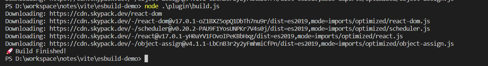

#### HTML 构建插件

Esbuild 作为一个前端打包工具，本身并不具备 HTML 的构建能力。也就是说，当它把 js/css 产物打包出来的时候，并不意味着前端的项目可以直接运行了，我们还需要一份对应的入口 HTML 文件。而这份 HTML 文件当然可以手写一个，但手写显得比较麻烦，尤其是产物名称带哈希值的时候，每次打包完都要替换路径。那么，我们能不能通过 Esbuild 插件的方式来自动化地生成 HTML 呢？

在 Esbuild 插件的 `onEnd` 钩子中可以拿到 `metafile` 对象的信息。那么，这个对象究竟什么样呢？

```js
{
  "inputs": { /* 省略内容 */ },
  "output": {
    "dist/index.js": {
      imports: [],
      exports: [],
      entryPoint: 'src/index.jsx',
      inputs: {
        'http-url:https://cdn.skypack.dev/-/object-assign@v4.1.1-LbCnB3r2y2yFmhmiCfPn/dist=es2019,mode=imports/optimized/object-assign.js': { bytesInOutput: 1792 },
        'http-url:https://cdn.skypack.dev/-/react@v17.0.1-yH0aYV1FOvoIPeKBbHxg/dist=es2019,mode=imports/optimized/react.js': { bytesInOutput: 10396 },
        'http-url:https://cdn.skypack.dev/-/scheduler@v0.20.2-PAU9F1YosUNPKr7V4s0j/dist=es2019,mode=imports/optimized/scheduler.js': { bytesInOutput: 9084 },
        'http-url:https://cdn.skypack.dev/-/react-dom@v17.0.1-oZ1BXZ5opQ1DbTh7nu9r/dist=es2019,mode=imports/optimized/react-dom.js': { bytesInOutput: 183229 },
        'http-url:https://cdn.skypack.dev/react-dom': { bytesInOutput: 0 },
        'src/index.jsx': { bytesInOutput: 178 }
      },
      bytes: 205284
    },
    "dist/index.js.map": { /* 省略内容 */ }
  }
}
```

从`outputs`属性中我们可以看到产物的路径，这意味着我们可以在插件中拿到所有 js 和 css 产物，然后自己组装、生成一个 HTML，实现自动化生成 HTML 的效果。

我们接着来实现一下这个插件的逻辑，首先新建 `html-plugin.js`，内容如下:

```js
const fs = require("fs/promises");
const path = require("path");
const { createScript, createLink, generateHTML } = require('./util');

module.exports = () => {
  return {
    name: "esbuild:html",
    setup(build) {
      build.onEnd(async (buildResult) => {
        if (buildResult.errors.length) {
          return;
        }
        const { metafile } = buildResult;
        // 1. 拿到 metafile 后获取所有的 js 和 css 产物路径
        const scripts = [];
        const links = [];
        if (metafile) {
          const { outputs } = metafile;
          const assets = Object.keys(outputs);

          assets.forEach((asset) => {
            if (asset.endsWith(".js")) {
              scripts.push(createScript(asset));
            } else if (asset.endsWith(".css")) {
              links.push(createLink(asset));
            }
          });
        }
        // 2. 拼接 HTML 内容
        const templateContent = generateHTML(scripts, links);
        // 3. HTML 写入磁盘
        const templatePath = path.join(process.cwd(), "index.html");
        await fs.writeFile(templatePath, templateContent);
      });
    },
  };
  
// util.js
// 一些工具函数的实现
const createScript = (src) => `<script type="module" src="${src}"></script>`;
const createLink = (src) => `<link rel="stylesheet" href="${src}"></link>`;
const generateHTML = (scripts, links) => `
  <!DOCTYPE html>
  <html lang="en">

  <head>
    <meta charset="UTF-8" />
    <meta name="viewport" content="width=device-width, initial-scale=1.0" />
    <title>Esbuild App</title>
    ${links.join("\n")}
  </head>

  <body>
    <div id="root"></div>
    ${scripts.join("\n")}
  </body>

  </html>
  `;

module.exports = { createLink, createScript, generateHTML };
```

现在我们在 `build.js` 中引入 html 插件:

```js
const { build } = require("esbuild");
const httpImport = require("./http-import-plugin");
const html = require('./html-plugin');

async function runBuild() {
  build({
    absWorkingDir: process.cwd(),
    entryPoints: ["./src/index.jsx"],
    outdir: "dist",
    bundle: true,
    format: "esm",
    splitting: true,
    sourcemap: true,
    metafile: true,
    plugins: [httpImport(), html()],
  }).then(() => {
    console.log("🚀 Build Finished!");
  });
}

runBuild();
```

然后执行`node build.js`对项目进行打包，你就可以看到 `index.html` 已经成功输出到根目录。

```js
// index.jsx

import React from "https://cdn.skypack.dev/react";
import { render } from "https://cdn.skypack.dev/react-dom";

let Greet = () => <h1>Hello, ESBuild!</h1>;

render(<Greet />, document.getElementById("root"));
```


接着，我们通过 `serve` 起一个本地静态文件服务器:

```js
// 1. 全局安装 serve
pnpm i -g serve
// 2. 在项目根目录执行
serve .
```

可以看到如下的界面:


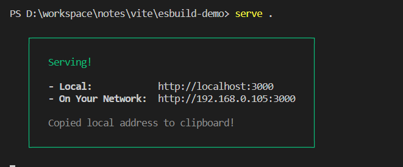


再访问 `localhost:3000`，会默认访问到 index.html 的内容：

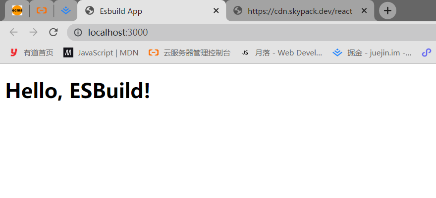

这样一来，应用的内容就成功显示了，也说明 HTML 插件正常生效了。当然，如果要做一个足够通用的 HTML 插件，还需要考虑诸多的因素，比如`自定义 HTML 内容`、`自定义公共前缀(publicPath)`、`自定义 script 标签类型`以及 `多入口打包`等等，大家感兴趣的话可以自行扩展，可以参考这个 [开源插件](https://link.juejin.cn/?target=https%3A%2F%2Fgithub.com%2Fsanyuan0704%2Fewas%2Fblob%2Fmain%2Fpackages%2Fesbuild-plugin-html%2Fsrc%2Findex.ts)。

### 总结

我们要重点掌握 Esbuild 的基础使用和插件开发。

首先你可以通过`命令行方式`和`代码调用方式`两种方式来使用 Esbuild。对后者而言，我们需要使用到 Esbuild 中两个重要的 API，分别是`Build API`和`Transform API`，为了避免同步方法所导致的性能问题，推荐使用异步方式进行调用。

其次，我们用一个简单的`env`插件示例带你学习了 Esbuild 插件的代码结构和基本概念，并进行了插件开发实战，开发了两个复杂度比较高的插件，分别是 `CDN 依赖拉取插件`和`HTML 构建插件`。希望你能通过这些经典的例子好好体会插件的编写方式，并多多实践，提升自己对 Esbuild 的理解。

## Rollup 基本概念及使用

Rollup 是一款基于 ES Module 模块规范实现的 JavaScript 打包工具，在前端社区中赫赫有名，同时也在 Vite 的架构体系中发挥着重要作用。不仅是 Vite 生产环境下的打包工具，其插件机制也被 Vite 所兼容，可以说是 Vite 的构建基石。因此，掌握 Rollup 也是深入学习 Vite 的必经之路。

本篇文章主要围绕 Rollup 的基本概念和核心特性展开，你不仅能知道 Rollup 是如何打包项目的，还能学会 Rollup 更高阶的使用方式，甚至能够通过 JavaScript API 二次开发 Rollup。

### 快速上手

首先让我们用 `pnpm init -y` 新建一个项目，然后安装 `rollup` 依赖:

```js
pnpm i rollup
```

接着新增 `src/index.js` 和 `src/util.js` 和 `rollup.config.js` 三个文件，目录结构如下所示:

```js
.
├── package.json
├── pnpm-lock.yaml
├── rollup.config.js
└── src
    ├── index.js
    └── util.js
```

文件的内容分别如下:

```js
// src/index.js
import { add } from "./util";
console.log(add(1, 2));

// src/util.js
export const add = (a, b) => a + b;

export const multi = (a, b) => a * b;
// rollup.config.js
// 以下注释是为了能使用 VSCode 的类型提示
/**
 * @type { import('rollup').RollupOptions }
 */
const buildOptions = {
  input: ["src/index.js"],
  output: {
    // 产物输出目录
    dir: "dist/es",
    // 产物格式
    format: "esm",
  },
};

export default buildOptions;
```

你可以在 `package.json` 中加入如下的构建脚本:

```js
{
  // rollup 打包命令，`-c` 表示使用配置文件中的配置
  "build": "rollup -c"
}
```

接着在终端执行一下 `pnpm run build`，可以看到如下的命令行信息:

```js
PS D:\workspace\notes\vite\rollup-demo> pnpm run build

> rollup-demo@1.0.0 build D:\workspace\notes\vite\rollup-demo
> rollup -c


src/index.js → dist/es...
created dist/es in 15ms
```

现在你已经成功使用 Rollup 打出了第一份产物! 我们可以去 `dist/es` 目录查看一下产物的内容:

```js
const add = (a, b) => a + b;

console.log(add(1, 2));
```

同时你也可以发现，`util.js` 中的 `multi` 方法并没有被打包到产物中，这是因为 Rollup 具有天然的  `Tree Shaking` 功能，可以分析出未使用到的模块并自动擦除。

所谓 `Tree Shaking`(摇树)，也是计算机编译原理中`DCE` (Dead Code Elimination，即消除无用代码) 技术的一种实现。由于 ES 模块依赖关系是确定的，和运行时状态无关。因此 Rollup 可以在编译阶段分析出依赖关系，对 AST 语法树中没有使用到的节点进行删除，从而实现 Tree Shaking。

### 常用配置解读

#### 多产物配置

在打包 JavaScript 类库的场景中，我们通常需要对外暴露出不同格式的产物供他人使用，不仅包括 `ESM`，也需要包括诸如`CommonJS`、`UMD`等格式，保证良好的兼容性。那么，同一份入口文件，如何让 Rollup 给我们打包出不一样格式的产物呢？我们基于上述的配置文件来进行修改:

```js
// rollup.config.js
/**
 * @type { import('rollup').RollupOptions }
 */
const buildOptions = {
  input: ["src/index.js"],
  // 将 output 改造成一个数组
  output: [
    {
      dir: "dist/es",
      format: "esm",
    },
    {
      dir: "dist/cjs",
      format: "cjs",
    },
  ],
};

export default buildOptions;
```

从代码中可以看到，我们将 `output` 属性配置成一个数组，数组中每个元素都是一个描述对象，决定了不同产物的输出行为。

#### 多入口配置

除了多产物配置，Rollup 中也支持多入口配置，而且通常情况下两者会被结合起来使用。接下来，就让我们继续改造之前的配置文件，将 `input` 设置为一个数组或者一个对象，如下所示:

```js
{
  input: ["src/index.js", "src/util.js"]
}
// 或者
{
  input: {
    index: "src/index.js",
    util: "src/util.js",
  },
}
```

通过执行 `npm run build` 可以发现，所有入口的不同格式产物已经成功输出:

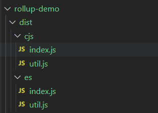

如果不同入口对应的打包配置不一样，我们也可以默认导出一个 `配置数组`，如下所示:

```js
// rollup.config.js
/**
 * @type { import('rollup').RollupOptions }
 */
const buildIndexOptions = {
  input: ["src/index.js"],
  output: [
    // 省略 output 配置
  ],
};

/**
 * @type { import('rollup').RollupOptions }
 */
const buildUtilOptions = {
  input: ["src/util.js"],
  output: [
    // 省略 output 配置
  ],
};

export default [buildIndexOptions, buildUtilOptions];
```

如果是比较复杂的打包场景(如 [Vite 源码本身的打包](https://link.juejin.cn/?target=https%3A%2F%2Fgithub.com%2Fvitejs%2Fvite%2Fblob%2Fmain%2Fpackages%2Fvite%2Frollup.config.js))，我们需要将项目的代码分成几个部分，用不同的 Rollup 配置分别打包，这种配置就很有用了。

#### 自定义 ouput 配置

刚才我们提到了 `input` 的使用，主要用来声明入口，可以配置成字符串、数组或者对象，使用比较简单。而 `output` 与之相对，用来配置输出的相关信息，常用的配置项如下:

```js
output: {
  // 产物输出目录
  dir: path.resolve(__dirname, 'dist'),
  // 以下三个配置项都可以使用这些占位符:
  // 1. [name]: 去除文件后缀后的文件名
  // 2. [hash]: 根据文件名和文件内容生成的 hash 值
  // 3. [format]: 产物模块格式，如 es、cjs
  // 4. [extname]: 产物后缀名(带`.`)
  // 入口模块的输出文件名
  entryFileNames: `[name].js`,
  // 非入口模块(如动态 import)的输出文件名
  chunkFileNames: 'chunk-[hash].js',
  // 静态资源文件输出文件名
  assetFileNames: 'assets/[name]-[hash][extname]',
  // 产物输出格式，包括`amd`、`cjs`、`es`、`iife`、`umd`、`system`
  format: 'cjs',
  // 是否生成 sourcemap 文件
  sourcemap: true,
  // 如果是打包出 iife/umd 格式，需要对外暴露出一个全局变量，通过 name 配置变量名
  name: 'MyBundle',
  // 全局变量声明
  globals: {
    // 项目中可以直接用`$`代替`jquery`
    jquery: '$'
  }
}
```

#### 依赖 external

对于某些第三方包，有时候我们不想让 Rollup 进行打包，也可以通过 external 进行外部化:

```js
{
  external: ['react', 'react-dom']
}
```

在 SSR 构建或者使用 ESM CDN 的场景中，这个配置将非常有用。

#### 接入插件能力

在 Rollup 的日常使用中，我们难免会遇到一些 Rollup 本身不支持的场景，比如`兼容 CommonJS 打包`、`注入环境变量`、`配置路径别名`、`压缩产物代码` 等等。这个时候就需要我们引入相应的 Rollup 插件了。

虽然 Rollup 能够打包`输出`出 `CommonJS` 格式的产物，但对于`输入`给 Rollup 的代码并不支持 CommonJS，仅仅支持 ESM。你可能会说，那我们直接在项目中统一使用 ESM 规范就可以了啊，这有什么问题呢？需要注意的是，我们不光要考虑项目本身的代码，还要考虑第三方依赖。目前为止，还是有不少第三方依赖只有 CommonJS 格式产物而并未提供 ESM 产物，比如项目中用到 `lodash` 时，打包项目会出现这样的警告：

```js
(!) Unresolved dependencies
https://rollupjs.org/guide/en/#warning-treating-module-as-external-dependency
```

我们需要引入额外的插件去解决这个问题。首先需要安装两个核心的插件包:

```js
pnpm i @rollup/plugin-node-resolve @rollup/plugin-commonjs
```

- `@rollup/plugin-node-resolve`是为了允许我们加载第三方依赖，否则像`import React from 'react'` 的依赖导入语句将不会被 Rollup 识别。
- `@rollup/plugin-commonjs` 的作用是将 CommonJS 格式的代码转换为 ESM 格式

然后让我们在配置文件中导入这些插件:

```js
// rollup.config.js
import resolve from "@rollup/plugin-node-resolve";
import commonjs from "@rollup/plugin-commonjs";

/**
 * @type { import('rollup').RollupOptions }
 */
export default {
  input: ["src/index.js"],
  output: [
    {
      dir: "dist/es",
      format: "esm",
    },
    {
      dir: "dist/cjs",
      format: "cjs",
    },
  ],
  // 通过 plugins 参数添加插件
  plugins: [resolve(), commonjs()],
};
```

重新执行 `npm run build`，你可以发现产物已经正常生成了:

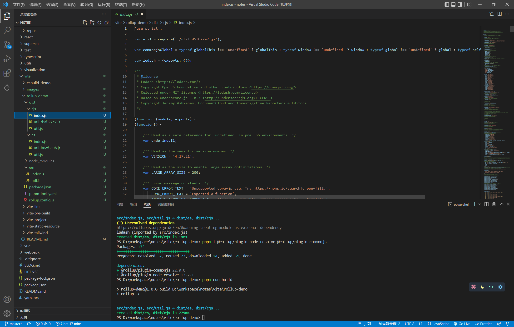

在 Rollup 配置文件中，`plugins` 除了可以与 `output` 配置在同一级，也可以配置在 output 参数里面，如:

```js
// rollup.config.js
import { terser } from 'rollup-plugin-terser'
import resolve from "@rollup/plugin-node-resolve";
import commonjs from "@rollup/plugin-commonjs";

export default {
  output: {
    // 加入 terser 插件，用来压缩代码
    plugins: [terser()]
  },
  plugins: [resolve(), commonjs()]
}
```

> 当然，你可以将上述的 terser 插件放到最外层的 `plugins` 配置中。

需要注意的是，`output.plugins`中配置的插件是有一定限制的，只有使用 `Output 阶段` 相关钩子的插件才能够放到这个配置中，大家可以去 [这个站点](https://link.juejin.cn/?target=https%3A%2F%2Fgithub.com%2Frollup%2Fawesome%23output) 查看 Rollup 的 Output 插件列表。

另外，这里也给大家分享其它一些比较常用的 Rollup 插件库:

- [@rollup/plugin-json](https://link.juejin.cn/?target=https%3A%2F%2Fgithub.com%2Frollup%2Fplugins%2Ftree%2Fmaster%2Fpackages%2Fjson)： 支持`.json`的加载，并配合`rollup`的`Tree Shaking`机制去掉未使用的部分，进行按需打包。
- [@rollup/plugin-babel](https://link.juejin.cn/?target=https%3A%2F%2Fgithub.com%2Frollup%2Fplugins%2Ftree%2Fmaster%2Fpackages%2Fbabel)：在 Rollup 中使用 Babel 进行 JS 代码的语法转译。
- [@rollup/plugin-typescript](https://link.juejin.cn/?target=https%3A%2F%2Fgithub.com%2Frollup%2Fplugins%2Ftree%2Fmaster%2Fpackages%2Ftypescript): 支持使用 TypeScript 开发。
- [@rollup/plugin-alias](https://link.juejin.cn/?target=https%3A%2F%2Fgithub.com%2Frollup%2Fplugins%2Ftree%2Fmaster%2Fpackages%2Falias)：支持别名配置。
- [@rollup/plugin-replace](https://link.juejin.cn/?target=https%3A%2F%2Fgithub.com%2Frollup%2Fplugins%2Ftree%2Fmaster%2Fpackages%2Freplace)：在 Rollup 进行变量字符串的替换。
- [rollup-plugin-visualizer](https://link.juejin.cn/?target=https%3A%2F%2Fgithub.com%2Fbtd%2Frollup-plugin-visualizer): 对 Rollup 打包产物进行分析，自动生成产物体积可视化分析图。

#### JavaScript API 方式调用

以上我们通过 `Rollup` 的配置文件结合 `rollup -c` 完成了 Rollup 的打包过程，但有些场景下我们需要基于 Rollup 定制一些打包过程，配置文件就不够灵活了，这时候我们需要用到对应 JavaScript API 来调用 Rollup，主要分为 `rollup.rollup` 和 `rollup.watch` 两个 API，接下来我们以具体的例子来学习一下。

首先是  `rollup.rollup`，用来一次性地进行 Rollup 打包，你可以新建 `build.js`，内容如下:

```js
// build.js
const rollup = require("rollup");

// 常用 inputOptions 配置
const inputOptions = {
  input: "./src/index.js",
  external: []
  plugins:[]
};

const outputOptionsList = [
  // 常用 outputOptions 配置
  {
    dir: 'dist/es',
    entryFileNames: `[name].[hash].js`,
    chunkFileNames: 'chunk-[hash].js',
    assetFileNames: 'assets/[name]-[hash][extname]'
    format: 'es',
    sourcemap: true,
    globals: {
      lodash: '_'
    }
  }
  // 省略其它的输出配置
];

async function build() {
  let bundle;
  let buildFailed = false;
  try {
    // 1. 调用 rollup.rollup 生成 bundle 对象
    const bundle = await rollup.rollup(inputOptions);
    for (const outputOptions of outputOptionsList) {
      // 2. 拿到 bundle 对象，根据每一份输出配置，调用 generate 和 write 方法分别生成和写入产物
      const { output } = await bundle.generate(outputOptions);
      await bundle.write(outputOptions);
    }
  } catch (error) {
    buildFailed = true;
    console.error(error);
  }
  if (bundle) {
    // 最后调用 bundle.close 方法结束打包
    await bundle.close();
  }
  process.exit(buildFailed ? 1 : 0);
}

build();
```

主要的执行步骤如下:

- 1. 通过 `rollup.rollup`方法，传入 `inputOptions`，生成 bundle 对象；
- 1. 调用 bundle 对象的 generate 和 write 方法，传入`outputOptions`，分别完成产物和生成和磁盘写入。
- 1. 调用 bundle 对象的 close 方法来结束打包。

接着你可以执行 `node build.js`，这样，我们就可以完成了以编程的方式来调用 Rollup 打包的过程。

除了通过 `rollup.rollup` 完成一次性打包，我们也可以通过 `rollup.watch` 来完成`watch`模式下的打包，即每次源文件变动后自动进行重新打包。你可以新建 `watch.js` 文件，内容入下:

```js
// watch.js
const rollup = require("rollup");

const watcher = rollup.watch({
  // 和 rollup 配置文件中的属性基本一致，只不过多了`watch`配置
  input: "./src/index.js",
  output: [
    {
      dir: "dist/es",
      format: "esm",
    },
    {
      dir: "dist/cjs",
      format: "cjs",
    },
  ],
  watch: {
    exclude: ["node_modules/**"],
    include: ["src/**"],
  },
});

// 监听 watch 各种事件
watcher.on("restart", () => {
  console.log("重新构建...");
});

watcher.on("change", (id) => {
  console.log("发生变动的模块id: ", id);
});

watcher.on("event", (e) => {
  if (e.code === "BUNDLE_END") {
    console.log("打包信息:", e);
  }
});
```

现在你可以通过执行 `node watch.js` 开启 Rollup 的 watch 打包模式，当你改动一个文件后可以看到如下的日志，说明 Rollup 自动进行了重新打包，并触发相应的事件回调函数:

```js
发生生变动的模块id: /xxx/src/index.js
重新构建...
打包信息: {
  code: 'BUNDLE_END',
  duration: 10,
  input: './src/index.js',
  output: [
    // 输出产物路径
  ],
  result: {
    cache: { /* 产物具体信息 */ },
    close: [AsyncFunction: close],
    closed: false,
    generate: [AsyncFunction: generate],
    watchFiles: [
      // 监听文件列表
    ],
    write: [AsyncFunction: write]
  }
}
```

基于如上的两个 JavaScript API 我们可以很方便地在代码中调用 Rollup 的打包流程，相比于配置文件有了更多的操作空间，你可以在代码中通过这些 API 对 Rollup 打包过程进行定制，甚至是二次开发。

### 总结

学习了完了 Rollup 基础使用篇的内容，你需要重点掌握 **Rollup 基本配置项的含义**和 **JavaScript API 的使用**。

首先，我们通过一个简单的示例学习了 Rollup 一般的使用方法，用 Rollup 打包出了第一份产物，然后我们针对 Rollup 中常用的配置项进行介绍，包括 `input`、`output`、`external`、`plugins `等核心配置，并以一个实际的打包场景为例带你在 Rollup 中接入插件功能。接着，我给你介绍了 Rollup 更高级的使用姿势——通过 JavaScript API 使用，分别介绍了两个经典的 API:  `rollup.rollup` 和`rollup.watch`，并带你在实战中使用这些 API，完成了更为复杂的打包操作。

## Rollup 插件机制

我们知道，仅仅使用 Rollup 内置的打包能力很难满足项目日益复杂的构建需求。对于一个真实的项目构建场景来说，我们还需要考虑到`模块打包`之外的问题，比如**路径别名(alias)** 、**全局变量注入**和**代码压缩**等等。

可要是把这些场景的处理逻辑与核心的打包逻辑都写到一起，一来打包器本身的代码会变得十分臃肿，二来也会对原有的核心代码产生一定的侵入性，混入很多与核心流程无关的代码，不易于后期的维护。因此 ，Rollup 设计出了一套完整的**插件机制**，将自身的核心逻辑与插件逻辑分离，让你能按需引入插件功能，提高了 Rollup 自身的可扩展性。

Rollup 的打包过程中，会定义一套完整的构建生命周期，从开始打包到产物输出，中途会经历一些**标志性的阶段**，并且在不同阶段会自动执行对应的插件钩子函数(Hook)。对 Rollup 插件来讲，最重要的部分是钩子函数，一方面它定义了插件的执行逻辑，也就是"做什么"；另一方面也声明了插件的作用阶段，即"什么时候做"，这与 Rollup 本身的构建生命周期息息相关。

因此，要真正理解插件的作用范围和阶段，首先需要了解 Rollup 整体的构建过程中到底做了些什么。

### Rollup 整体构建阶段

在执行 `rollup` 命令之后，在 cli 内部的主要逻辑简化如下:

```js
// Build 阶段
const bundle = await rollup.rollup(inputOptions);

// Output 阶段
await Promise.all(outputOptions.map(bundle.write));

// 构建结束
await bundle.close();
```

Rollup 内部主要经历了 `Build` 和 `Output` 两大阶段：


首先，Build 阶段主要负责创建模块依赖图，初始化各个模块的 AST 以及模块之间的依赖关系。下面我们用一个简单的例子来感受一下:

```js
// src/index.js
import { a } from './module-a';
console.log(a);

// src/module-a.js
export const a = 1;
```

然后执行如下的构建脚本:

```js
const rollup = require('rollup');
const util = require('util');

async function build() {
  const bundle = await rollup.rollup({
    input: ['./src/index.js'],
  });
  console.log(util.inspect(bundle));
}

build();
```

可以看到这样的 `bundle` 对象信息:

```js
{
  cache: {
    modules: [
      {
        ast: 'AST 节点信息，具体内容省略',
        code: 'export const a = 1;',
        dependencies: [],
        id: '/Users/code/rollup-demo/src/data.js',
        // 其它属性省略
      },
      {
        ast: 'AST 节点信息，具体内容省略',
        code: "import { a } from './data';\n\nconsole.log(a);",
        dependencies: [
          '/Users/code/rollup-demo/src/data.js'
        ],
        id: '/Users/code/rollup-demo/src/index.js',
        // 其它属性省略
      }
    ],
    plugins: {}
  },
  closed: false,
  // 挂载后续阶段会执行的方法
  close: [AsyncFunction: close],
  generate: [AsyncFunction: generate],
  write: [AsyncFunction: write]
}
```

从上面的信息中可以看出，目前经过 Build 阶段的 `bundle` 对象其实并没有进行模块的打包，这个对象的作用在于存储各个模块的内容及依赖关系，同时暴露`generate`和`write`方法，以进入到后续的 `Output` 阶段（`write`和`generate`方法唯一的区别在于前者打包完产物会写入磁盘，而后者不会）。

所以，真正进行打包的过程会在 `Output` 阶段进行，即在`bundle`对象的 `generate`或者`write`方法中进行。还是以上面的 demo 为例，我们稍稍改动一下构建逻辑:

```js
const rollup = require('rollup');

async function build() {
  const bundle = await rollup.rollup({
    input: ['./src/index.js'],
  });
  const result = await bundle.generate({
    format: 'es',
  });
  console.log('result:', result);
}

build();
```

执行后可以得到如下的输出:

```js
{
  output: [
    {
      exports: [],
      facadeModuleId: '/Users/code/rollup-demo/src/index.js',
      isEntry: true,
      isImplicitEntry: false,
      type: 'chunk',
      code: 'const a = 1;\n\nconsole.log(a);\n',
      dynamicImports: [],
      fileName: 'index.js',
      // 其余属性省略
    }
  ]
}
```

这里可以看到所有的输出信息，生成的 `output` 数组即为打包完成的结果。当然，如果使用 `bundle.write` 会根据配置将最后的产物写入到指定的磁盘目录中。

因此，**对于一次完整的构建过程而言，** **Rollup** **会先进入到 Build 阶段，解析各模块的内容及依赖关系，然后进入 **`Output` **阶段，完成打包及输出的过程**。对于不同的阶段，Rollup 插件会有不同的插件工作流程，接下来我们就来拆解一下 Rollup 插件在 `Build` 和 `Output` 两个阶段的详细工作流程。

### 拆解插件工作流

#### 插件 Hook 类型

在具体讲述 Rollup 插件工作流之前，先给大家介绍一下不同插件 Hook 的类型，这些类型代表了不同插件的执行特点，是我们理解 Rollup 插件工作流的基础，因此有必要跟大家好好拆解一下。

通过上文的例子，相信你可以直观地理解 Rollup 两大构建阶段（`Build`和`Output`）各自的原理。可能你会有疑问，这两个阶段到底跟插件机制有什么关系呢？实际上，插件的各种 Hook 可以根据这两个构建阶段分为两类: `Build Hook` 与 `Output Hook`。

- `Build Hook`即在`Build`阶段执行的钩子函数，在这个阶段主要进行模块代码的转换、AST 解析以及模块依赖的解析，那么这个阶段的 Hook 对于代码的操作粒度一般为`模块`级别，也就是单文件级别。
- `Ouput Hook`(官方称为`Output Generation Hook`)，则主要进行代码的打包，对于代码而言，操作粒度一般为 `chunk`级别(一个 chunk 通常指很多文件打包到一起的产物)。

除了根据构建阶段可以将 Rollup 插件进行分类，根据不同的 Hook 执行方式也会有不同的分类，主要包括 `Async`、`Sync`、`Parallel`、`Squential`、`First `这五种。在后文中我们将接触各种各样的插件 Hook，但无论哪个 Hook 都离不开这五种执行方式。

##### Async、Sync

首先是 `Async` 和 `Sync` 钩子函数，两者其实是相对的，分别代表`异步`和`同步`的钩子函数，两者最大的区别在于同步钩子里面不能有异步逻辑，而异步钩子可以有。

##### Parallel

这里指并行的钩子函数。如果有多个插件实现了这个钩子的逻辑，一旦有钩子函数是异步逻辑，则并发执行钩子函数，不会等待当前钩子完成(底层使用 `Promise.all`) 。

比如对于 `Build` 阶段的 `buildStart` 钩子，它的执行时机其实是在构建刚开始的时候，各个插件可以在这个钩子当中做一些状态的初始化操作，但其实插件之间的操作并不是相互依赖的，也就是可以并发执行，从而提升构建性能。反之，对于需要**依赖其他插件处理结果**的情况就不适合用  `Parallel`  钩子了，比如 `transform`。

##### Sequential

**Sequential** 指串行的钩子函数。这种 Hook 往往适用于插件间处理结果相互依赖的情况，前一个插件 Hook 的返回值作为后续插件的入参，这种情况就需要等待前一个插件执行完 Hook，获得其执行结果，然后才能进行下一个插件相应 Hook 的调用，如`transform`。

##### Frist

如果有多个插件实现了这个 Hook，那么 Hook 将依次运行，直到返回一个非 null 或非 undefined 的值为止。比较典型的 Hook 是 `resolveId`，一旦有插件的 resolveId 返回了一个路径，将停止执行后续插件的 resolveId 逻辑。

刚刚我们介绍了 Rollup 当中不同插件 Hook 的类型，实际上不同的类型是可以叠加的，`Async`/`Sync` 可以搭配后面三种类型中的任意一种，比如一个 Hook既可以是 `Async` 也可以是 `First` 类型，接着我们将来具体分析 Rollup 当中的插件工作流程，里面会涉及到具体的一些 Hook，大家可以具体地感受一下。

#### Build 阶段工作流

首先，我们来分析 Build 阶段的插件工作流程。对于 Build 阶段，插件 Hook 的调用流程如下图所示。流程图的最上面声明了不同 Hook 的类型，也就是我们在上面总结的 5 种 Hook 分类，每个方块代表了一个 Hook，边框的颜色可以表示`Async`和`Sync` 类型，方块的填充颜色可以表示 `Parallel`、`Sequential` 和 `First` 类型。


乍一看是不是感觉这张图非常复杂？没关系，接下来我会和你一步步分析 `Build Hooks` 的工作流程，你可以对照着图一起看。

1. 首先经历 `options` 钩子进行配置的转换，得到处理后的配置对象。
2. 随之 Rollup 会调用`buildStart`钩子，正式开始构建流程。
3. Rollup 先进入到 `resolveId` 钩子中解析文件路径。(从 `input` 配置指定的入口文件开始)。
4. Rollup 通过调用`load`钩子加载模块内容。
5. 紧接着 Rollup 执行所有的 `transform` 钩子来对模块内容进行进行自定义的转换，比如 babel 转译。
6. 现在 Rollup 拿到最后的模块内容，进行 AST 分析，得到所有的 import 内容，调用 moduleParsed 钩子:
   - 6.1 如果是普通的 import，则执行 `resolveId` 钩子，继续回到步骤`3`。
   - 6.2 如果是动态 import，则执行 `resolveDynamicImport` 钩子解析路径，如果解析成功，则回到步骤`4`加载模块，否则回到步骤`3`通过 `resolveId` 解析路径。
7. 直到所有的 import 都解析完毕，Rollup 执行`buildEnd`钩子，Build 阶段结束。

当然，在 Rollup 解析路径的时候，即执行 `resolveId` 或者 `resolveDynamicImport` 的时候，有些路径可能会被标记为 `external`(翻译为`排除`)，也就是说不参加 Rollup 打包过程，这个时候就不会进行 `load`、`transform ` 等等后续的处理了。

在流程图最上面，不知道大家有没有注意到 `watchChange` 和 `closeWatcher` 这两个 Hook，这里其实是对应了 rollup 的 `watch` 模式。当你使用  `rollup --watch` 指令或者在配置文件配有 `watch: true` 的属性时，代表开启了 Rollup 的 `watch` 打包模式，这个时候 Rollup 内部会初始化一个 `watcher` 对象，当文件内容发生变化时，watcher 对象会自动触发 `watchChange` 钩子执行并对项目进行重新构建。在当前**打包过程结束**时，Rollup 会自动清除 watcher 对象调用 `closeWatcher` 钩子。

#### Output 工作流

接着我们来看看 Output 阶段的插件到底是如何来进行工作的。这个阶段的 Hook 相比于 Build 阶段稍微多一些，流程上也更加复杂。需要注意的是，其中会涉及的 Hook 函数比较多，可能会给你理解整个流程带来一些困扰，因此我会在 Hook 执行的阶段解释其大致的作用和意义，关于具体的使用大家可以去 Rollup 的官网自行查阅，毕竟这里的主线还是分析插件的执行流程，掺杂太多的使用细节反而不易于理解。下面我结合一张完整的插件流程图和你具体分析一下。


1. 执行所有插件的 `outputOptions` 钩子函数，对 `output` 配置进行转换。
2. 执行 `renderStart`，并发执行 renderStart 钩子，正式开始打包。
3. 并发执行所有插件的 `banner`、`footer`、`intro`、`outro`  钩子(底层用 Promise.all 包裹所有的这四种钩子函数)，这四个钩子功能很简单，就是往打包产物的固定位置(比如头部和尾部)插入一些自定义的内容，比如协议声明内容、项目介绍等等。
4. 从入口模块开始扫描，针对动态 import 语句执行 `renderDynamicImport `钩子，来自定义动态 import 的内容。
5. 对每个即将生成的 `chunk`，执行 `augmentChunkHash` 钩子，来决定是否更改 chunk 的哈希值，在 `watch` 模式下即可能会多次打包的场景下，这个钩子会比较适用。
6. 如果没有遇到 `import.meta` 语句，则进入下一步，否则:
   - **6.1** 对于 `import.meta.url` 语句调用 `resolveFileUrl` 来自定义 url 解析逻辑
   - **6.2** 对于其他 `import.meta` 属性，则调用 `resolveImportMeta` 来进行自定义的解析。
7. 接着 Rollup 会生成所有 chunk 的内容，针对每个 chunk 会依次调用插件的 `renderChunk` 方法进行自定义操作，也就是说，在这里时候你可以直接操作打包产物了。
8. 随后会调用 `generateBundle` 钩子，这个钩子的入参里面会包含所有的打包产物信息，包括  `chunk`  (打包后的代码)、`asset `(最终的静态资源文件)。你可以在这里删除一些 chunk 或者 asset，最终这些内容将不会作为产物输出。
9. 前面提到了 `rollup.rollup `方法会返回一个 `bundle` 对象，这个对象是包含 `generate` 和 `write` 两个方法，两个方法唯一的区别在于后者会将代码写入到磁盘中，同时会触发 `writeBundle` 钩子，传入所有的打包产物信息，包括 chunk 和 asset，和 `generateBundle `  钩子非常相似。不过值得注意的是，这个钩子执行的时候，产物已经输出了，而 `generateBundle` 执行的时候产物还并没有输出。顺序如下图所示:


10. 当上述的 `bundle` 的 `close` 方法被调用时，会触发 `closeBundle` 钩子，到这里 Output 阶段正式结束。

> 注意: 当打包过程中任何阶段出现错误，会触发 renderError 钩子，然后执行 closeBundle 钩子结束打包。

到这里，我们终于梳理完了 Rollup 当中完整的插件工作流程，从一开始在**构建生命周期**中对两大构建阶段的感性认识，到现在**插件工作流**的具体分析，不禁感叹 Rollup 看似简单，实则内部细节繁杂。希望你能对照流程图好好复习几遍，彻底消化这部分的知识点，不仅仅能加深你对 Rollup 插件机制的理解，并且对 Rollup 本身打包原理的掌握也会更上一层楼。

### 常用 hook 实战

读到这里你可能会说了：上面讲了那么多 Rollup 插件机制的内容，但真正要去写一个插件，感觉还是很困难啊。

这里我想要分享两个观点：首先是**二八定律**，也就是 20% 的 API 应对 80% 的场景，这放在 Rollup 当中仍然是适用的。经常使用到的 Hook 也并不多，况且 Rollup 插件的写法也非常简单，至少比 Webpack 插件要容易的多，因此掌握 Rollup 的插件开发难度并不大，这个大家放心。

其次，**学会模仿**也特别重要。尤其是刚开始什么经验都没有的时候，观察和模仿别人优秀的实现不失为一种高效的学习方法，慢慢地自己也会轻车熟路，成为一个经验丰富的老司机。

实际上开发 Rollup 插件就是在编写一个个 Hook 函数，你可以理解为一个 Rollup 插件基本就是各种 Hook 函数的组合。因此，接下来我会详细介绍一些常用的 Hook，并以一些官方的插件实现为例，从 Hook 的特性、应用场景、入参和返回值的意义及实现代码示例这几个角度带你掌握各种 Hook 实际的使用，如此一来，开发一个完整的插件对你来说想必也不在话下了。

#### 路径解析：resolveId

resolveId 钩子一般用来解析模块路径，为 `Async + First` 类型即`异步优先`的钩子。

这里我们拿官方的 [alias 插件](https://link.juejin.cn/?target=https%3A%2F%2Fgithub.com%2Frollup%2Fplugins%2Fblob%2Fmaster%2Fpackages%2Falias%2Fsrc%2Findex.ts) 来说明，这个插件用法演示如下:

```js
// rollup.config.js
import alias from '@rollup/plugin-alias';
module.exports = {
  input: 'src/index.js',
  output: {
    dir: 'output',
    format: 'cjs'
  },
  plugins: [
    alias({
      entries: [
        // 将把 import xxx from 'module-a' 
        // 转换为 import xxx from './module-a'
        { find: 'module-a', replacement: './module-a.js' },
      ]
    })
  ]
};
```

插件的代码简化后如下:

```js
export default alias(options) {
  // 获取 entries 配置
  const entries = getEntries(options);
  return {
    // 传入三个参数，当前模块路径、引用当前模块的模块路径、其余参数
    resolveId(importee, importer, resolveOptions) {
      // 先检查能不能匹配别名规则
      const matchedEntry = entries.find((entry) => matches(entry.find, importee));
      // 如果不能匹配替换规则，或者当前模块是入口模块，则不会继续后面的别名替换流程
      if (!matchedEntry || !importerId) {
        // return null 后，当前的模块路径会交给下一个插件处理
        return null;
      }
      // 正式替换路径
      const updatedId = normalizeId(
        importee.replace(matchedEntry.find, matchedEntry.replacement)
      );
      // 每个插件执行时都会绑定一个上下文对象作为 this
      // 这里的 this.resolve 会执行所有插件(除当前插件外)的 resolveId 钩子
      return this.resolve(
        updatedId,
        importer,
        Object.assign({ skipSelf: true }, resolveOptions)
      ).then((resolved) => {
        // 替换后的路径即 updateId 会经过别的插件进行处理
        let finalResult: PartialResolvedId | null = resolved;
        if (!finalResult) {
          // 如果其它插件没有处理这个路径，则直接返回 updateId
          finalResult = { id: updatedId };
        }
        return finalResult;
      });
    }
  }
}
```

从这里你可以看到 resolveId 钩子函数的一些常用使用方式，它的入参分别是`当前模块路径`、`引用当前模块的模块路径`、`解析参数`，返回值可以是 null、string 或者一个对象，我们分情况讨论。

- 返回值为 null 时，会默认交给下一个插件的 resolveId 钩子处理。
- 返回值为 string 时，则停止后续插件的处理。这里为了让替换后的路径能被其他插件处理，特意调用了 this.resolve 来交给其它插件处理，否则将不会进入到其它插件的处理。
- 返回值为一个对象，也会停止后续插件的处理，不过这个对象就可以包含[更多的信息](https://link.juejin.cn/?target=https%3A%2F%2Frollupjs.org%2Fguide%2Fen%2F%23resolveid)了，包括解析后的路径、是否被 enternal、是否需要 tree-shaking 等等，不过大部分情况下返回一个 string 就够用了。

#### load

load 为`Async + First`类型，即**异步优先**的钩子，和`resolveId`类似。它的作用是通过 resolveId 解析后的路径来加载模块内容。这里，我们以官方的 [image 插件](https://link.juejin.cn/?target=https%3A%2F%2Fgithub.com%2Frollup%2Fplugins%2Fblob%2Fmaster%2Fpackages%2Fimage%2Fsrc%2Findex.js) 为例来介绍一下 load 钩子的使用。源码简化后如下所示:

```js
const mimeTypes = {
  '.jpg': 'image/jpeg',
  // 后面图片类型省略
};

export default function image(opts = {}) {
  const options = Object.assign({}, defaults, opts);
  return {
    name: 'image',
    load(id) {
      const mime = mimeTypes[extname(id)];
      if (!mime) {
        // 如果不是图片类型，返回 null，交给下一个插件处理
        return null;
      }
      // 加载图片具体内容
      const isSvg = mime === mimeTypes['.svg'];
      const format = isSvg ? 'utf-8' : 'base64';
      const source = readFileSync(id, format).replace(/[\r\n]+/gm, '');
      const dataUri = getDataUri({ format, isSvg, mime, source });
      const code = options.dom ? domTemplate({ dataUri }) : constTemplate({ dataUri });

      return code.trim();
    }
  };
}
```

从中可以看到，load 钩子的入参是模块 id，返回值一般是 null、string 或者一个对象：

- 如果返回值为 null，则交给下一个插件处理；
- 如果返回值为 string 或者对象，则终止后续插件的处理，如果是对象可以包含 SourceMap、AST 等[更详细的信息](https://link.juejin.cn/?target=https%3A%2F%2Frollupjs.org%2Fguide%2Fen%2F%23load)。

#### 代码转换：transform

`transform` 钩子也是非常常见的一个钩子函数，为 `Async + Sequential` 类型，也就是`异步串行`钩子，作用是对加载后的模块内容进行自定义的转换。我们以官方的 `replace` 插件为例，这个插件的使用方式如下:

```js
// rollup.config.js
import replace from '@rollup/plugin-replace';

module.exports = {
  input: 'src/index.js',
  output: {
    dir: 'output',
    format: 'cjs'
  },
  plugins: [
    // 将会把代码中所有的 __TEST__ 替换为 1
    replace({
      __TEST__: 1
    })
  ]
};
```

内部实现也并不复杂，主要通过字符串替换来实现，核心逻辑简化如下:

```js
import MagicString from 'magic-string';

export default function replace(options = {}) {
  return {
    name: 'replace',
    transform(code, id) {
      // 省略一些边界情况的处理
      // 执行代码替换的逻辑，并生成最后的代码和 SourceMap
      return executeReplacement(code, id);
    }
  }
}

function executeReplacement(code, id) {
  const magicString = new MagicString(code);
  // 通过 magicString.overwrite 方法实现字符串替换
  if (!codeHasReplacements(code, id, magicString)) {
    return null;
  }

  const result = { code: magicString.toString() };

  if (isSourceMapEnabled()) {
    result.map = magicString.generateMap({ hires: true });
  }

  // 返回一个带有 code 和 map 属性的对象
  return result;
}
```

[transform 钩子](https://link.juejin.cn/?target=https%3A%2F%2Frollupjs.org%2Fguide%2Fen%2F%23transform)的入参分别为`模块代码`、`模块 ID`，返回一个包含 `code`(代码内容) 和 `map`(SourceMap 内容) 属性的对象，当然也可以返回 null 来跳过当前插件的 transform 处理。需要注意的是，**当前插件返回的代码会作为下一个插件 transform 钩子的第一个入参**，实现类似于瀑布流的处理。

#### Chunk 级代码修改: renderChunk

这里我们继续以 `replace `插件举例，在这个插件中，也同样实现了 renderChunk 钩子函数:

```js
export default function replace(options = {}) {
  return {
    name: 'replace',
    transform(code, id) {
      // transform 代码省略
    },
    renderChunk(code, chunk) {
      const id = chunk.fileName;
      // 省略一些边界情况的处理
      // 拿到 chunk 的代码及文件名，执行替换逻辑
      return executeReplacement(code, id);
    },
  }
}
```

可以看到这里 replace 插件为了替换结果更加准确，在 renderChunk 钩子中又进行了一次替换，因为后续的插件仍然可能在 transform 中进行模块内容转换，进而可能出现符合替换规则的字符串。

这里我们把关注点放到 renderChunk 函数本身，可以看到有两个入参，分别为 `chunk 代码内容`、[chunk 元信息](https://link.juejin.cn/?target=https%3A%2F%2Frollupjs.org%2Fguide%2Fen%2F%23generatebundle)，返回值跟  `transform` 钩子类似，既可以返回包含 code 和 map 属性的对象，也可以通过返回 null 来跳过当前钩子的处理。

#### 产物生成最后一步: generateBundle

generateBundle 也是`异步串行`的钩子，你可以在这个钩子里面自定义删除一些无用的 chunk 或者静态资源，或者自己添加一些文件。这里我们以 Rollup 官方的`html`插件来具体说明，这个插件的作用是通过拿到 Rollup 打包后的资源来生成包含这些资源的 HTML 文件，源码简化后如下所示:

```js
export default function html(opts: RollupHtmlOptions = {}): Plugin {
  // 初始化配置
  return {
    name: 'html',
    async generateBundle(output: NormalizedOutputOptions, bundle: OutputBundle) {
      // 省略一些边界情况的处理
      // 1. 获取打包后的文件
      const files = getFiles(bundle);
      // 2. 组装 HTML，插入相应 meta、link 和 script 标签
      const source = await template({ attributes, bundle, files, meta, publicPath, title});
      // 3. 通过上下文对象的 emitFile 方法，输出 html 文件
      const htmlFile: EmittedAsset = {
        type: 'asset',
        source,
        name: 'Rollup HTML Asset',
        fileName
      };
      this.emitFile(htmlFile);
    }
  }
}
```

相信从插件的具体实现中，你也能感受到这个钩子的强大作用了。入参分别为 `output 配置`、[所有打包产物的元信息对象](https://link.juejin.cn/?target=https%3A%2F%2Frollupjs.org%2Fguide%2Fen%2F%23generatebundle)，通过操作元信息对象你可以删除一些不需要的 chunk 或者静态资源，也可以通过 插件上下文对象的 `emitFile` 方法输出自定义文件。

常用的 Rollup 钩子我们就先介绍到这里，相信这些知识点已经足够你应付大多数的构建场景了。

### 总结

在这篇文章中，我们首先认识到 Rollup 为了追求扩展性和可维护性，引入了插件机制，而后给你介绍了 Rollup 的 `Build` 和`Output` 两大构建阶段，接着给你详细地分析了两大构建阶段的插件工作流，最后通过几个实际的官方插件带你熟悉了一些常见的 Hook。

Rollup 的插件开发整体上是非常简洁和灵活的，总结为以下几个方面:

- **插件逻辑集中管理**。各个阶段的 Hook 都可以放在一个插件中编写，比如上述两个 Webpack 的 Loader 和 Plugin 功能在 Rollup 只需要用一个插件，分别通过 transform 和 renderChunk 两个 Hook 来实现。
- **插件 API 简洁，符合直觉**。Rollup 插件基本上只需要返回一个包含 name 和各种钩子函数的对象即可，也就是声明一个 name 属性，然后写几个钩子函数即可。
- **插件间的互相调用**。比如刚刚介绍的`alias`插件，可以通过插件上下文对象的`resolve`方法，继续调用其它插件的 `resolveId`钩子，类似的还有`load`方法，这就大大增加了插件的灵活性。

现在，相信你已经从宏观到细节上，已经对 Rollup 插件有了全面的掌握，为接下来的 Vite 学习打下了坚实的基础。

## Vite 插件开发

这篇文章，我们将深入应用 Vite 的各项高级能力，遇到更多有挑战的开发场景。你不仅能学会一系列有难度的**解决方案**，直接运用到实际项目中，还能系统提高自己的**知识深度**，体会复杂项目场景中构建工具如何提供高度自定义的能力，以及如何对项目进行性能优化。

说到自定义的能力，你肯定很容易想到`插件机制`，利用一个个插件来扩展构建工具自身的能力。没错，这一节中我们将系统学习 Vite 的插件机制，带你掌握 Vite 插件开发的基本知识以及实战开发技巧。

虽然 Vite 的插件机制是基于 Rollup 来设计的，我们也已经对 Rollup 的插件机制进行了详细的解读，但实际上 Vite 的插件机制也包含了自己独有的一部分，与 Rollup 的各个插件 Hook 并非完全兼容，因此我们将重点关注 Vite 独有的部分以及和 Rollup 所区别的部分，而对于 Vite 和 Rollup 中相同的 Hook (如`resolveId`、`load`、`transform`)只是稍微提及，就不再展开赘述了。

让我们先从一个简单的例子入手吧！

### 插件示例

Vite 插件与 Rollup 插件结构类似，为一个 `name` 和各种插件 Hook 的对象:

```js
{
  // 插件名称
  name: 'vite-plugin-xxx',
  load(code) {
    // 钩子逻辑
  },
}
```

> 如果插件是一个 npm 包，在`package.json`中的包命名也推荐以`vite-plugin`开头

一般情况下因为要考虑到外部传参，我们不会直接写一个对象，而是实现一个返回插件对象的 `工厂函数`，如下代码所示:

```js
// myPlugin.js
export function myVitePlugin(options) {
  console.log(options)
  return {
    name: 'vite-plugin-xxx',
    load(id) {
      // 在钩子逻辑中可以通过闭包访问外部的 options 传参
    }
  }
}

// 使用方式
// vite.config.ts
import { myVitePlugin } from './myVitePlugin';
export default {
  plugins: [myVitePlugin({ /* 给插件传参 */ })]
}
```

### hook 介绍

#### 通用 hook

Vite **开发阶段**会模拟 Rollup 的行为。


Vite 会调用一系列与 Rollup 兼容的钩子，这个钩子主要分为三个阶段

- **服务器启动阶段**: `options` 和 `buildStart` 钩子会在服务启动时被调用。
- **请求响应阶段**: 当浏览器发起请求时，Vite 内部依次调用 `resolveId`、`load `和 `transform` 钩子。
- **服务器关闭阶段**: Vite 会依次执行 `buildEnd` 和 `closeBundle` 钩子。

除了以上钩子，其他 Rollup 插件钩子(如`moduleParsed`、`renderChunk`)均不会在 Vite **开发阶段**调用。而生产环境下，由于 Vite 直接使用 Rollup，Vite 插件中所有 Rollup 的插件钩子都会生效。

#### 独有 hook

接下来给大家介绍 Vite 中特有的一些 Hook，这些 Hook 只会在 Vite 内部调用，而放到 Rollup 中会被直接忽略。

##### config

Vite 在读取完配置文件（即`vite.config.ts`）之后，会拿到用户导出的配置对象，然后执行 config 钩子。在这个钩子里面，你可以对配置文件导出的对象进行自定义的操作，如下代码所示:

```js
// 返回部分配置（推荐）
const editConfigPlugin = () => ({
  name: 'vite-plugin-modify-config',
  config: () => ({
    alias: {
      react: require.resolve('react')
    }
  })
})
```

官方推荐的姿势是在 config 钩子中返回一个配置对象，这个配置对象会和 Vite 已有的配置进行深度的合并。不过你也可以通过钩子的入参拿到 config 对象进行自定义的修改，如下代码所示:

```js
const mutateConfigPlugin = () => ({
  name: 'mutate-config',
  // command 为 `serve`(开发环境) 或者 `build`(生产环境)
  config(config, { command }) {
    // 生产环境中修改 root 参数
    if (command === 'build') {
      config.root = __dirname;
    }
  }
})
```

在一些比较深层的对象配置中，这种直接修改配置的方式会显得比较麻烦，如 `optimizeDeps.esbuildOptions.plugins`，需要写很多的样板代码，类似下面这样:

```js
// 防止出现 undefined 的情况
config.optimizeDeps = config.optimizeDeps || {}
config.optimizeDeps.esbuildOptions = config.optimizeDeps.esbuildOptions || {}
config.optimizeDeps.esbuildOptions.plugins = config.optimizeDeps.esbuildOptions.plugins || []
```

因此这种情况下，建议直接返回一个配置对象，这样会方便很多:

```js
config() {
  return {
    optimizeDeps: {
      esbuildOptions: {
        plugins: []
      }
    }
  }
}
```

##### configResolved

Vite 在解析完配置之后会调用 `configResolved `钩子，这个钩子一般用来记录最终的配置信息，而不建议再修改配置，用法如下图所示:

```js
const exmaplePlugin = () => {
  let config

  return {
    name: 'read-config',

    configResolved(resolvedConfig) {
      // 记录最终配置
      config = resolvedConfig
    },

    // 在其他钩子中可以访问到配置
    transform(code, id) {
      console.log(config)
    }
  }
}
```

##### configureServer

这个钩子仅在**开发阶段**会被调用，用于扩展 Vite 的 Dev Server，一般用于增加自定义 server 中间件，如下代码所示:

```js
const myPlugin = () => ({
  name: 'configure-server',
  configureServer(server) {
    // 姿势 1: 在 Vite 内置中间件之前执行
    server.middlewares.use((req, res, next) => {
      // 自定义请求处理逻辑
    })
    // 姿势 2: 在 Vite 内置中间件之后执行 
    return () => {
      server.middlewares.use((req, res, next) => {
        // 自定义请求处理逻辑
      })
    }
  }
})
```

##### transformIndexHtml

这个钩子用来灵活控制 HTML 的内容，你可以拿到原始的 html 内容后进行任意的转换:

```js
const htmlPlugin = () => {
  return {
    name: 'html-transform',
    transformIndexHtml(html) {
      return html.replace(
        /<title>(.*?)</title>/,
        `<title>换了个标题</title>`
      )
    }
  }
}
// 也可以返回如下的对象结构，一般用于添加某些标签
const htmlPlugin = () => {
  return {
    name: 'html-transform',
    transformIndexHtml(html) {
      return {
        html,
        // 注入标签
        tags: [
          {
            // 放到 body 末尾，可取值还有`head`|`head-prepend`|`body-prepend`，顾名思义
            injectTo: 'body',
            // 标签属性定义
            attrs: { type: 'module', src: './index.ts' },
            // 标签名
            tag: 'script',
          },
        ],
      }
    }
  }
}
```

##### handleHotUpdate

这个钩子会在 Vite 服务端处理热更新时被调用，你可以在这个钩子中拿到热更新相关的上下文信息，进行热更模块的过滤，或者进行自定义的热更处理。下面是一个简单的例子:

```js
const handleHmrPlugin = () => {
  return {
    async handleHotUpdate(ctx) {
      // 需要热更的文件
      console.log(ctx.file)
      // 需要热更的模块，如一个 Vue 单文件会涉及多个模块
      console.log(ctx.modules)
      // 时间戳
      console.log(ctx.timestamp)
      // Vite Dev Server 实例
      console.log(ctx.server)
      // 读取最新的文件内容
      console.log(await read())
      // 自行处理 HMR 事件
      ctx.server.ws.send({
        type: 'custom',
        event: 'special-update',
        data: { a: 1 }
      })
      return []
    }
  }
}

// 前端代码中加入
if (import.meta.hot) {
  import.meta.hot.on('special-update', (data) => {
    // 执行自定义更新
    // { a: 1 }
    console.log(data)
    window.location.reload();
  })
}
```

以上就是 Vite 独有的五个钩子，我们来重新梳理一下:

- `config`: 用来进一步修改配置。
- `configResolved`: 用来记录最终的配置信息。
- `configureServer`: 用来获取 Vite Dev Server 实例，添加中间件。
- `transformIndexHtml`: 用来转换 HTML 的内容。
- `handleHotUpdate`: 用来进行热更新模块的过滤，或者进行自定义的热更新处理。

#### hook 执行顺序

我们学习到了 Vite 的通用钩子和独有钩子，估计你现在脑子里面一点乱:  这么多的钩子，到底谁先执行、谁后执行呢？

我们可以通过一个具体的代码示例来汇总一下所有的钩子。在 Vite 的脚手架工程中新建 `test-hooks-plugin.ts`:

```js
// test-hooks-plugin.ts
// 注: 请求响应阶段的钩子
// 如 resolveId, load, transform, transformIndexHtml在下文介绍
// 以下为服务启动和关闭的钩子
export default function testHookPlugin () {
  return {
    name: 'test-hooks-plugin', 
    // Vite 独有钩子
    config(config) {
      console.log('config');
    },
    // Vite 独有钩子
    configResolved(resolvedCofnig) {
      console.log('configResolved');
    },
    // 通用钩子
    options(opts) {
      console.log('options');
      return opts;
    },
    // Vite 独有钩子
    configureServer(server) {
      console.log('configureServer');
      setTimeout(() => {
        // 手动退出进程
        process.kill(process.pid, 'SIGTERM');
      }, 3000)
    },
    // 通用钩子
    buildStart() {
      console.log('buildStart');
    },
    // 通用钩子
    buildEnd() {
      console.log('buildEnd');
    },
    // 通用钩子
    closeBundle() {
      console.log('closeBundle');
    }
  }
}
```

将插件加入到 Vite 配置文件中，然后启动，你可以观察到各个 Hook 的执行顺序:

```js
$ pnpm run dev

> vite-hook@0.0.0 dev D:\workspace\notes\vite\vite-hook
> vite

config
configResolved
options
configureServer
buildStart

  vite v2.9.6 dev server running at:

  > Local: http://localhost:3000/
  > Network: use `--host` to expose

  ready in 339ms.

buildEnd
closeBundle
```

由此我们可以梳理出 Vite 插件的执行顺序:

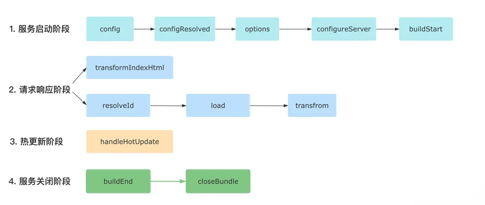

- 服务启动阶段: `config`、`configResolved`、`options`、`configureServer`、`buildStart`
- 请求响应阶段: 如果是 `html` 文件，仅执行 `transformIndexHtml` 钩子；对于非 HTML 文件，则依次执行 `resolveId`、`load `和`transform` 钩子。
- 热更新阶段: 执行 `handleHotUpdate` 钩子。
- 服务关闭阶段: 依次执行 `buildEnd` 和 `closeBundle` 钩子。`apply`参数还可以配置成一个函数，进行更灵活的控制:

### 插件应用位置

梳理完 Vite 的各个钩子函数之后，接下来让我们来了解一下 Vite 插件的**应用情景**和**应用顺序**。

默认情况下 Vite 插件同时被用于开发环境和生产环境，你可以通过 `apply` 属性来决定应用场景:

```js
{
  // 'serve' 表示仅用于开发环境，'build'表示仅用于生产环境
  apply: 'serve'
}
```

`apply `参数还可以配置成一个函数，进行更灵活的控制:

```js
apply(config, { command }) {

  // 只用于非 SSR 情况下的生产环境构建
  return command === 'build' && !config.build.ssr
}
```

同时，你也可以通过 `enforce` 属性来指定插件的执行顺序:

```js
{
  // 默认为`normal`，可取值还有`pre`和`post`
  enforce: 'pre'
}
```

Vite 中插件的执行顺序如下图所示:

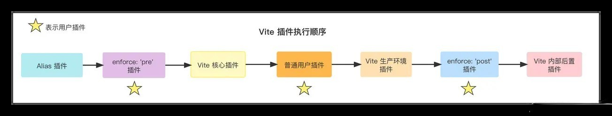

Vite 会依次执行如下的插件:

- Alias (路径别名)相关的插件。
- ⭐️ 带有 `enforce: 'pre'` 的用户插件。
- Vite 核心插件。
- ⭐️ 没有 enforce 值的用户插件，也叫`普通插件`。
- Vite 生产环境构建用的插件。
- ⭐️ 带有 `enforce: 'post'` 的用户插件。
- Vite 后置构建插件(如压缩插件)。

### 插件开发实战

接下来我们将一起编写两个 Vite 插件，分别是 `虚拟模块加载插件` 和 `Svgr 插件`，你将学会从插件开发的常见套路和各种开发技巧。

#### 虚拟模块加载

首先我们来实现一个虚拟模块的加载插件，可能你会有疑问: 什么是虚拟模块呢？

作为构建工具，一般需要处理两种形式的模块，一种存在于真实的磁盘文件系统中，另一种并不在磁盘而在内存当中，也就是`虚拟模块`。通过虚拟模块，我们既可以把自己手写的一些代码字符串作为单独的模块内容，又可以将内存中某些经过计算得出的**变量**作为模块内容进行加载，非常灵活和方便。接下来让我们通过一些具体的例子来实操一下，首先通过脚手架命令初始化一个 `react + ts` 项目:

```js
pnpm init vite
```

然后通过 `pnpm i` 安装依赖，接着新建 `plugins` 目录，开始插件的开发:

```js
// plugins/virtual-module.ts
import { Plugin, ResolvedConfig } from 'vite';

// 虚拟模块名称
const virtualFibModuleId = 'virtual:fib';
// Vite 中约定对于虚拟模块，解析后的路径需要加上`\0`前缀
const resolvedFibVirtualModuleId = '\0' + virtualFibModuleId;

export default function virtualFibModulePlugin(): Plugin {
  let config: ResolvedConfig | null = null;
  return {
    name: 'vite-plugin-virtual-module',
    resolveId(id) {
      if (id === virtualFibModuleId) { 
        return resolvedFibVirtualModuleId;
      }
    },
    load(id) {
      // 加载虚拟模块
      if (id === resolvedFibVirtualModuleId) {
        return 'export default function fib(n) { return n <= 1 ? n : fib(n - 1) + fib(n - 2); }';
      }
    }
  }
}
```

接着我们在项目中来使用这个插件:

```js
// vite.config.ts
import virtual from './plugins/virtual-module.ts'

// 配置插件
{
  plugins: [react(), virtual()]
}
```

然后在 `main.tsx` 中加入如下的代码:

```js
import fib from 'virtual:fib';

alert(`结果: ${fib(10)}`)
```

这里我们使用了 `virtual:fib` 这个虚拟模块，虽然这个模块不存在真实的文件系统中，但你打开浏览器后可以发现这个模块导出的函数是可以正常执行的:

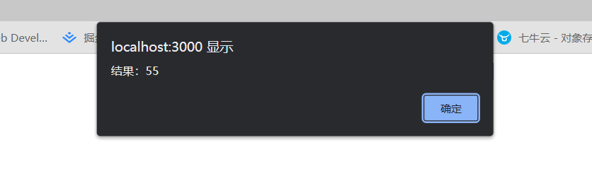

接着我们来尝试一下如何通过虚拟模块来读取内存中的变量，在 `virtual-module.ts` 中增加如下代码:

```diff
import { Plugin, ResolvedConfig } from 'vite';

const virtualFibModuleId = 'virtual:fib';
const resolvedFibVirtualModuleId = '\0' + virtualFibModuleId;

+ const virtualEnvModuleId = 'virtual:env';
+ const resolvedEnvVirtualModuleId = '\0' + virtualEnvModuleId;

export default function virtualFibModulePlugin(): Plugin {
	let config: ResolvedConfig | null = null;
  return {
    name: 'vite-plugin-virtual-fib-module',
+     configResolved(c: ResolvedConfig) {
+       config = c;
+     },
    resolveId(id) {
      if (id === virtualFibModuleId) { 
        return resolvedFibVirtualModuleId;
      }
+       if (id === virtualEnvModuleId) { 
+        return resolvedEnvVirtualModuleId;
+      }
    },
    load(id) {
      if (id === resolvedFibVirtualModuleId) {
        return 'export default function fib(n) { return n <= 1 ? n : fib(n - 1) + fib(n - 2); }';
      }
+      if (id === resolvedEnvVirtualModuleId) {
+        return `export default ${JSON.stringify(config!.env)}`;
+      }
    }
  }
}
```

在新增的这些代码中，我们注册了一个新的虚拟模块 `virtual:env`，紧接着我们去项目去使用:

```js
// main.tsx
import env from 'virtual:env';
console.log(env)
```

接着你可以去浏览器观察一下输出的情况:

```js
{BASE_URL: '/', MODE: 'development', DEV: true, PROD: false}
BASE_URL: "/"
DEV: true
MODE: "development"
PROD: false
```


Vite 环境变量能正确地在浏览器中打印出来，说明在内存中计算出来的 `virtual:env` 模块的确被成功地加载了。从中你可以看到，虚拟模块的内容完全能够被动态计算出来，因此它的灵活性和可定制程度非常高，实用性也很强，在 Vite 内部的插件被深度地使用，社区当中也有不少知名的插件(如 `vite-plugin-windicss`、`vite-plugin-svg-icons`等)也使用了虚拟模块的技术。

#### Svg 组件形式加载

在一般的项目开发过程中，我们有时候希望能将 svg 当做一个组件来引入，这样我们可以很方便地修改 svg 的各种属性，相比于`img`标签的引入方式也更加优雅。但 Vite 本身并不支持将 svg 转换为组件的代码，需要我们通过插件来实现。

接下来我们就来写一个 Vite 插件，实现在 React 项目能够通过组件方式来使用 svg 资源。首先安装一下需要的依赖:

```js
pnpm i resolve @svgr/core -D
```

接着在 `plugins` 目录新建  `svgr.ts`:

```js
import { Plugin } from 'vite';
import * as fs from 'fs';
import * as resolve from 'resolve';

interface SvgrOptions {
  // svg 资源模块默认导出，url 或者组件
  defaultExport: 'url' | 'component';
}

export default function viteSvgrPlugin(options: SvgrOptions) {
  const { defaultExport='url' } = options;
  return {
    name: 'vite-plugin-svgr',
    async transform(code ,id) {
      // 转换逻辑: svg -> React 组件
    }
  }
}
```

让我们先来梳理一下开发需求，用户通过传入 `defaultExport` 可以控制 svg 资源的默认导出:

- 当 `defaultExport`为 `component`，默认当做组件来使用，即:

```js
import Logo from './Logo.svg'

// 在组件中直接使用
<Logo />
```

- 当`defaultExports`为`url`，默认当做 url 使用，如果需要用作组件，可以通过`具名导入`的方式来支持:

```js
import logoUrl, { ReactComponent as Logo } from './logo.svg';

// url 使用

// 组件方式使用
<Logo />
```

明确了需求之后，接下来让我们来整理一下插件开发的整体思路，主要逻辑在 `transform `钩子中完成，流程如下:

- 1. 根据 id 入参过滤出 svg 资源；
- 1. 读取 svg 文件内容；
- 1. 利用 `@svgr/core` 将 svg 转换为 React 组件代码;
- 1. 处理默认导出为 url 的情况；
- 1. 将组件的 jsx 代码转译为浏览器可运行的代码。

下面是插件的完整的代码，你可以参考学习:

```js
import { Plugin } from 'vite';
import * as fs from 'fs';
import * as resolve from 'resolve';

interface SvgrOptions {
  defaultExport: 'url' | 'component';
}

export default function viteSvgrPlugin(options: SvgrOptions): Plugin {
  const { defaultExport = 'component' } = options;

  return {
    name: 'vite-plugin-svgr',
    async transform(code, id) {
      // 1. 根据 id 入参过滤出 svg 资源；
      if (!id.endsWith('.svg')) {
        return code;
      }
      const svgrTransform = require('@svgr/core').transform;
      // 解析 esbuild 的路径，后续转译 jsx 会用到，我们这里直接拿 vite 中的 esbuild 即可
      const esbuildPackagePath = resolve.sync('esbuild', { basedir: require.resolve('vite') });
      const esbuild = require(esbuildPackagePath);
      // 2. 读取 svg 文件内容；
      const svg = await fs.promises.readFile(id, 'utf8');
      // 3. 利用 `@svgr/core` 将 svg 转换为 React 组件代码
      const svgrResult = await svgrTransform(
        svg,
        {},
        { componentName: 'ReactComponent' }
      );
      // 4. 处理默认导出为 url 的情况
      let componentCode = svgrResult;
      if (defaultExport === 'url') {
        // 加上 Vite 默认的 `export default 资源路径`
        componentCode += code;
        componentCode = svgrResult.replace('export default ReactComponent', 'export { ReactComponent }');
      }
      // 5. 利用 esbuild，将组件中的 jsx 代码转译为浏览器可运行的代码;
      const result = await esbuild.transform(componentCode, {
        loader: 'jsx',
      });
      return {
        code: result.code,
        map: null // TODO
      };
    },
  };
}

```

接下来让我们在项目中使用这个插件:

```js
// vite.config.ts
import svgr from './plugins/svgr';

// 返回的配置
{
  plugins: [
    // 省略其它插件
		svgr({ defaultExport: 'component' })
  ]
}
```

接着我们在项目中用组件的方式引入 svg:

```js
// App.tsx
import Logo from './logo.svg'

function App() {
  return (
    <>
      <Logo />
    </>
  )
}

export default App;
```

打开浏览器，可以看到组件已经正常显示:


#### 调试技巧

在开发调试插件的过程，推荐大家在本地装上`vite-plugin-inspect`插件，并在 Vite 中使用它:

```js
pnpm i vite-plugin-inspect -D
```

```js
// vite.config.ts
import inspect from 'vite-plugin-inspect';

// 返回的配置
{
  plugins: [
    // 省略其它插件
    inspect()
  ]

}
```

这样当你再次启动项目时，会发现多出一个调试地址:

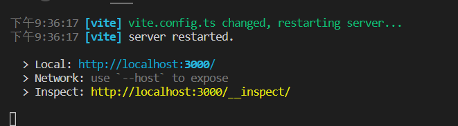

你可以通过这个地址来查看项目中各个模块的编译结果：

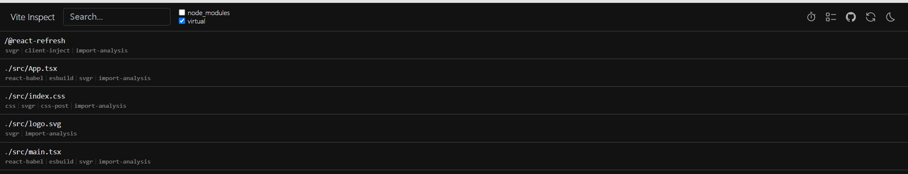

点击特定的文件后，你可以看到这个模块经过各个插件处理后的中间结果，如下图所示:


通过这个面板，我们可以很清楚地看到相应模块经过插件处理后变成了什么样子，让插件的调试更加方便。

### 总结

你需要重点掌握 Vite **插件钩子的含义**、**作用顺序**以及**插件的实战开发**。

首先我们通过一个最简单的示例让你对 Vite 插件的结构有了初步的印象，然后对 Vite 中的各种钩子函数进行了介绍，主要包括`通用钩子`和`独有钩子`，通用钩子与 Rollup 兼容，而独有钩子在 Rollup 中会被忽略。而由于上一节已经详细介绍了 Rollup 的插件机制，对于通用钩子我们没有继续展开，而是详细介绍了 5 个独有钩子，分别是: `config`、`configResolved`、`configureServer`、`transformIndexHtml `和 `handleHotUpdate`。不仅如此，我还给你从宏观角度分析了 Vite 插件的作用场景和作用顺序，你可以分别通过`apply`和`enforce`两个参数来进行手动的控制。

接下来我们正式进入插件开发实战的环节，实现了 `虚拟模块加载插件` 和 `Svg 组件加载插件`，相信你已经对虚拟模块的概念和使用有了直观的了解，也能通过后者的开发过程了解到如何在 Vite 中集成其它的前端编译工具。总体来说，Vite 插件的设计秉承了 Rollup 的插件设计理念，通过一个个语义化的 Hook 来组织，十分简洁和灵活，上手难度并不大，但真正难的地方在于如何利用 Vite 插件去解决实际开发过程的问题。

## HMR API 原理

开始今天的内容之前，我想先问你一个日常开发中的问题：在代码变更之后，如何实时看到更新后的页面效果呢？

很久之前通过 live reload 也就是自动刷新页面的方式来解决的。不过随着前端工程的日益庞大，开发场景也越来越复杂，这种 `live reload` 的方式在诸多的场景下却显得十分鸡肋，简单来说就是 `模块局部更新`+`状态保存` 的需求在 `live reload` 的方案没有得到满足，从而导致开发体验欠佳。当然，针对部分场景也有一些临时的解决方案，比如状态存储到浏览器的本地缓存(localStorage 对象)中，或者直接 mock 一些数据。但这些方式未免过于粗糙，无法满足通用的开发场景，且实现上也不够优雅。

那么，如果在改动代码后，想要进行模块级别的局部更新该怎么做呢？业界一般使用 HMR 技术来解决这个问题，像 Webpack、Parcel 这些传统的打包工具底层都实现了一套 HMR API，而我们今天要讲的就是 Vite 自己所实现的 HMR API，相比于传统的打包工具，Vite 的 HMR API 基于 ESM 模块规范来实现，可以达到毫秒级别的更新速度，性能非常强悍。接下来，让我们一起来谈谈在 Vite 当中，这一套 HMR 相关的 API 是如何设计的，以及我们可以通过这些 API 实现哪些功能。

### HMR 简介

HMR 的全称叫做 `Hot Module Replacement`，即`模块热替换`或者`模块热更新`。在计算机领域当中也有一个类似的概念叫`热插拔`，我们经常使用的 USB 设备就是一个典型的代表，当我们插入 U 盘的时候，系统驱动会加载在新增的 U 盘内容，不会重启系统，也不会修改系统其它模块的内容。HMR 的作用其实一样，就是在页面模块更新的时候，直接把**页面中发生变化的模块替换为新的模块**，同时不会影响其它模块的正常运作。通过 HMR 的技术我们就可以实现`局部刷新`和`状态保存`，从而解决之前提到的种种问题。

### HMR API

Vite 作为一个完整的构建工具，本身实现了一套 HMR 系统，值得注意的是，这套 HMR 系统基于原生的 ESM 模块规范来实现，在文件发生改变时 Vite 会侦测到相应 ES 模块的变化，从而触发相应的 API，实现局部的更新。

Vite 的 HMR API 设计也并非空穴来风，它基于一套完整的 [ESM HMR 规范](https://link.juejin.cn/?target=https%3A%2F%2Fgithub.com%2Fwithastro%2Fesm-hmr) 来实现，这个规范由同时期的 no-bundle 构建工具 Snowpack、WMR 与 Vite 一起制定，是一个比较通用的规范。

我们可以直观地来看一看 HMR API 的类型定义:

```js
interface ImportMeta {
  readonly hot?: {
    readonly data: any
    accept(): void
    accept(cb: (mod: any) => void): void
    accept(dep: string, cb: (mod: any) => void): void
    accept(deps: string[], cb: (mods: any[]) => void): void
    prune(cb: () => void): void
    dispose(cb: (data: any) => void): void
    decline(): void
    invalidate(): void
    on(event: string, cb: (...args: any[]) => void): void
  }
}
```

这里稍微解释一下，`import.meta `对象为现代浏览器原生的一个内置对象，Vite 所做的事情就是在这个对象上的 `hot` 属性中定义了一套完整的属性和方法。因此，在 Vite 当中，你就可以通过 `import.meta.hot` 来访问关于 HMR 的这些属性和方法，比如`import.meta.hot.accept()`。

#### hot.accept

在 `import.meta.hot` 对象上有一个非常关键的方法`accept`，因为它决定了 Vite 进行热更新的边界，那么如何来理解这个`accept`的含义呢？

从字面上来看，它表示接受的意思。它是用来**接受模块更新**的。 一旦 Vite 接受了这个更新，当前模块就会被认为是 HMR 的边界。那么，Vite 接受谁的更新呢？这里会有三种情况：

- 接受**自身模块**的更新
- 接受**某个子模块**的更新
- 接受**多个子模块**的更新

这三种情况分别对应 accept 方法三种不同的使用方式，下面我们就一起来分析一下。

##### 接收自身更新

当模块接受自身的更新时，则当前模块会被认为 HMR 的边界。也就是说，除了当前模块，其他的模块均未受到任何影响。

为了加深你的理解，这里我们以一个[实际的例子]()进行测试。首先展示一下整体的目录结构:

```js
.
├── favicon.svg
├── index.html
├── node_modules
│   └── ...
├── package.json
├── src
│   ├── main.ts
│   ├── render.ts
│   ├── state.ts
│   ├── style.css
│   └── vite-env.d.ts
└── tsconfig.json
```

这里放出一些关键文件的内容，如下面的 `index.html`：

```html
<!DOCTYPE html>
<html lang="en">
  <head>
    <meta charset="UTF-8" />
    <link rel="icon" type="image/svg+xml" href="favicon.svg" />
    <meta name="viewport" content="width=device-width, initial-scale=1.0" />
    <title>Vite App</title>
  </head>
  <body>
    <div id="app"></div>
    <p>
      count: <span id="count">0</span>
    </p>
    <script type="module" src="/src/main.ts"></script>
  </body>
</html>
```

里面的 DOM 结构比较简单，同时引入了  `/src/main.ts`  这个文件，内容如下:

```js
import { render } from './render';
import { initState } from './state';

render();
initState();
```

文件依赖了 `render.ts` 和 `state.ts`，前者负责渲染文本内容，而后者负责记录当前的页面状态:

```js
// src/render.ts
// 负责渲染文本内容
import './style.css'
export const render = () => {
  const app = document.querySelector<HTMLDivElement>('#app')!
  app.innerHTML = `
    <h1>Hello Vite!</h1>
    <p target="_blank">This is hmr test.123</p>
  `
}

// src/state.ts
// 负责记录当前的页面状态
export function initState() {
  let count = 0;
  setInterval(() => {
    let countEle = document.getElementById('count');
    countEle!.innerText =  ++count + '';
  }, 1000);
}
```

仓库当中关键的代码就目前这些了。现在，你可以执行 `pnpm i` 安装依赖，然后 `npm run dev` 启动项目。

每隔一秒钟，你可以看到这里的 `count` 值会加一。现在你可以试着改动一下 `render.ts` 的渲染内容，比如增加一些文本:

```diff
// render.ts
export const render = () => {
  const app = document.querySelector<HTMLDivElement>('#app')!
  app.innerHTML = `
    <h1>Hello Vite!</h1>
+   <p target="_blank">This is hmr test.123 这是增加的文本</p>
  `
}
```

页面的渲染内容已经更新，但不知道你有没有注意到最下面的`count`值瞬间被置零了，并且查看控制台，也有这样的 log：

```js
[vite] page reload src/render.ts
```

很明显，当 `render.ts` 模块发生变更时，Vite 发现并没有 HMR 相关的处理，然后直接刷新页面了。

现在让我们在 `render.ts` 中加上如下的代码:

```diff
// 条件守卫
+ if (import.meta.hot) {
+  import.meta.hot.accept((mod) => mod.render())
+ }
```

`import.meta.hot` 对象只有在开发阶段才会被注入到全局，生产环境是访问不到的，另外增加条件守卫之后，打包时识别到 if 条件不成立，会自动把这部分代码从打包产物中移除，来优化资源体积。因此，我们需要增加这个条件守卫语句。

接下来，可以注意到我们对于  `import.meta.hot.accept` 的使用:

```js
import.meta.hot.accept((mod) => mod.render())
```

这里我们传入了一个回调函数作为参数，入参即为 Vite 给我们提供的更新后的模块内容，在浏览器中打印 `mod` 内容如下，正好是`render` 模块最新的内容:

我们在回调中调用了一下  `mod.render`  方法，也就是当模块变动后，每次都重新渲染一遍内容。这时你可以试着改动一下渲染的内容，然后到浏览器中注意一下 `count` 的情况，并没有被重新置零，而是保留了原有的状态:

现在 `render` 模块更新后，只会重新渲染这个模块的内容，而对于 state 模块的内容并没有影响，并且控制台的 log 也发生了变化:

```js
[vite] hmr update /src/render.ts (x3)
```

现在我们算是实现了初步的 HMR，也在实际的代码中体会到了 accept 方法的用途。当然，在这个例子中我们传入了一个回调函数来手动调用 render 逻辑，但事实上你也可以什么参数都不传，这样 Vite 只会把 `render`模块的最新内容执行一遍，但 `render` 模块内部只声明了一个函数，因此直接调用 `import.meta.hot.accept() `并不会重新渲染页面。

##### 接收依赖模块更新

上面介绍了 `接受自身模块更新` 的情况，现在来分析一下 `接受依赖模块更新` 是如何做到的。先给大家放一张原理图，直观地感受一下:


还是拿示例项目来举例，`main `模块依赖 `render` 模块，也就是说，`main`模块是 `render` 父模块，那么我们也可以在 `main` 模块中接受`render`模块的更新，此时 HMR 边界就是 `main` 模块了。

我们将 `render`模块的 accept 相关代码先删除:

```diff
// render.ts
- if (import.meta.hot) {
-   import.meta.hot.accept((mod) => mod.render())
- }
```

然后再 `main` 模块增加如下代码:

```diff
// main.ts
import { render } from './render';
import './state';

render();

+if (import.meta.hot) {
+  import.meta.hot.accept('./render.ts', (newModule) => {
+    newModule.render();
+  })
+}
```

在这里我们同样是调用 accept 方法，与之前不同的是，第一个参数传入一个依赖的路径，也就是 `render` 模块的路径，这就相当于告诉 Vite: 我监听了 `render` 模块的更新，当它的内容更新的时候，请把最新的内容传给我。同样的，第二个参数中定义了模块变化后的回调函数，这里拿到了 `render` 模块最新的内容，然后执行其中的渲染逻辑，让页面展示最新的内容。

通过接受一个依赖模块的更新，我们同样又实现了 HMR 功能，你可以试着改动 `render`模块的内容，可以发现页面内容正常更新，并且状态依然保持着原样。

##### 接受多个子模块的更新

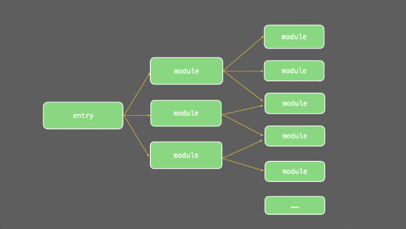

这里的意思是**父模块可以接受多个子模块的更新，当其中任何一个子模块更新之后，父模块会成为 HMR 边界**。还是拿之前的例子来演示，现在我们更改`main`模块代码:

```diff
// main.ts
import { render } from './render';
import { initState } from './state';

render();
initState();

+if (import.meta.hot) {
+  import.meta.hot.accept(['./render.ts', './state.ts'], (modules) => {
+    console.log(modules);
+  })
+}
```

在代码中我们通过 accept 方法接受了`render`和`state`两个模块的更新，接着让我们手动改动一下某一个模块的代码，观察一下回调中`modules`的打印内容。例如当我改动 `state`模块的内容时，回调中拿到的 modules 是这样的:

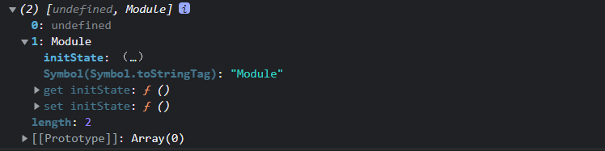

可以看到 Vite 给我们的回调传来的参数 `modules` 其实是一个数组，和我们第一个参数声明的子模块数组一一对应。因此 `modules` 数组第一个元素是 `undefined`，表示 `render` 模块并没有发生变化，第二个元素为一个 Module 对象，也就是经过变动后 `state` 模块的最新内容。于是在这里，我们根据 `modules` 进行自定义的更新，修改 `main.ts`:

```js
// main.ts
import { render } from './render';
import { initState } from './state';

render();
initState();

if (import.meta.hot) {
  import.meta.hot.accept(['./render.ts', './state.ts'], (modules) => {
    const [renderModule, stateModule] = modules;
    
    if (renderModule) {
      renderModule.render();
    }
    if (stateModule) {
      stateModule.initState();
    }
  })
}
```

现在，你可以改动两个模块的内容，可以发现，页面的相应模块会更新，并且对其它的模块没有影响。但实际上你会发现另外一个问题，当改动了`state`模块的内容之后，页面的内容会变得错乱:


这是为什么呢？我们快速回顾一下 `state`模块的内容:

```js
// state.ts
export function initState() {
  let count = 0;
  setInterval(() => {
    let countEle = document.getElementById('count');
    countEle!.innerText =  ++count + '';
  }, 1000);
}
```

其中设置了一个定时器，但当模块更改之后，这个定时器并没有被销毁，紧接着我们在 accept 方法调用 `initState` 方法又创建了一个新的定时器，导致 count 的值错乱。那如何来解决这个问题呢？这就涉及到新的 HMR 方法——`dispose`方法了。

#### hot.dispose

这个方法相较而言就好理解多了，代表在模块更新、旧模块需要销毁时需要做的一些事情，拿刚刚的场景来说，我们可以通过在 `state` 模块中调用 dispose 方法来轻松解决定时器共存的问题，代码改动如下:

```js
// state.ts
let timer: number | undefined;

if (import.meta.hot) {
  import.meta.hot.dispose(() => {
    if (timer) {
      clearInterval(timer);
    }
  })
}

export function initState() {
  let count = 0;
  timer = setInterval(() => {
    let countEle = document.getElementById('count');
    countEle!.innerText =  ++count + '';
  }, 1000);
}
```

此时，我们再来到浏览器观察一下 HMR 的效果:

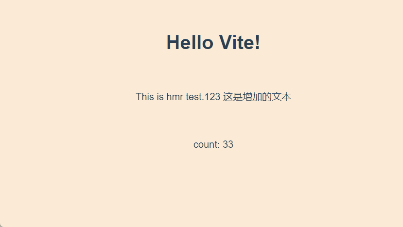

可以看到，当我稍稍改动一下 `state` 模块的内容(比如加个空格)，页面确实会更新，而且也没有状态错乱的问题，说明我们在模块销毁前清除定时器的操作是生效的。但你又可以很明显地看到一个新的问题: 原来的状态丢失了，`count` 的内容从 `64` 突然变成`1`。这又是为什么呢？

让我们来重新梳理一遍热更新的逻辑:


当我们改动了 `state` 模块的代码，`main`模块接受更新，执行 accept 方法中的回调，接着会执行 `state` 模块的 `initState `方法。注意了，此时新建的 `initState` 方法的确会初始化定时器，但同时也会初始化 count 变量，也就是 `count` 从 0 开始计数了！

这显然是不符合预期的，我们期望的是每次改动 `state` 模块，之前的状态都保存下来。怎么来实现呢？

#### hot.data

这就不得不提到 hot 对象上的 data 属性了，这个属性用来在不同的模块实例间共享一些数据。
使用上也非常简单，让我们来重构一下 `state` 模块:

```diff
let timer: number | undefined;
if (import.meta.hot) {
+  // 初始化 count
+  if (!import.meta.hot.data.count) {
+    import.meta.hot.data.count = 0;
+  }
  import.meta.hot.dispose(() => {
    if (timer) {
      clearInterval(timer);
    }
  })
}
export function initState() {
+  const getAndIncCount = () => {
+    const data = import.meta.hot?.data || {
+      count: 0
+    };
+    data.count = data.count + 1;
+    return data.count;
+  };
  timer = setInterval(() => {
    let countEle = document.getElementById('count');
+    countEle!.innerText =  getAndIncCount() + '';
  }, 1000);
}
```

我们在 `import.meta.hot.data` 对象上挂载了一个`count` 属性，在二次执行 `initState` 的时候便会复用 `import.meta.hot.data` 上记录的 count 值，从而实现状态的保存。

此时，我们终于大功告成，基本实现了这个示例应用的 HMR 的功能。在这个过程中，我们用到了核心的`accept`、`dispose` 和`data` 属性和方法。当然还有一些方法将会给大家进行介绍，但相较而言就比较简单了，而且用的也不多，大家只需要留下初步的印象，知道这些方法的用途是什么，需要用到的时候再来查阅即可。

#### 其他方法

##### hot.decline

这个方法调用之后，相当于表示此模块不可热更新，当模块更新时会强制进行页面刷新。

##### hot.invalidate

强制刷新页面。

##### 自定义事件

你还可以通过 `import.meta.hot.on` 来监听 HMR 的自定义事件，内部有这几个事件会自动触发:

- `vite:beforeUpdate` 当模块更新时触发；
- `vite:beforeFullReload` 当即将重新刷新页面时触发；
- `vite:beforePrune` 当不再需要的模块即将被剔除时触发；
- `vite:error` 当发生错误时（例如，语法错误）触发。

如果你想自定义事件可以通过上节中提到的 `handleHotUpdate` 这个插件 Hook 来进行触发:

```js
// 插件 Hook
handleHotUpdate({ server }) {
  server.ws.send({
    type: 'custom',
    event: 'custom-update',
    data: {}
  })
  return []
}
// 前端代码
import.meta.hot.on('custom-update', (data) => {
  // 自定义更新逻辑
})
```

### 总结

在这一节中，你需要重点掌握 **HMR 的概念**、**Vite HMR API 的使用 **以及 **HMR 的更新原理**。

我们首先认识了 HMR 这个概念，了解它相比于传统的 live reload 所解决的问题：`模块局部更新`和`状态保存`。然后我带你熟悉了 Vite HMR 中的各种 API，尤其是 accept 方法，根据 accept 的不同用法，我们分了三种情况来讨论 Vite 接受更新的策略: `接受自身更新`、`接受依赖模块的更新`和`接受多个子模块的更新`，并通过具体的示例来进行这三种情况的代码演示，可以看到在代码发生变动的时候，Vite 会定位到发生变化的局部模块，也就是找到对应的 HMR 边界，然后基于这个边界进行更新，其他的模块并没有受到影响，这也是 Vite 中的热更新的时间也到达毫秒级别的重要原因。

在 Vite 中，HMR 是一套比较复杂的系统，不过一旦理解了本文提到的`HMR 边界`的作用原理，那么在后面解读 Vite HMR 源码的时候将会倍感轻松。大家加油吧！

## 代码分割

