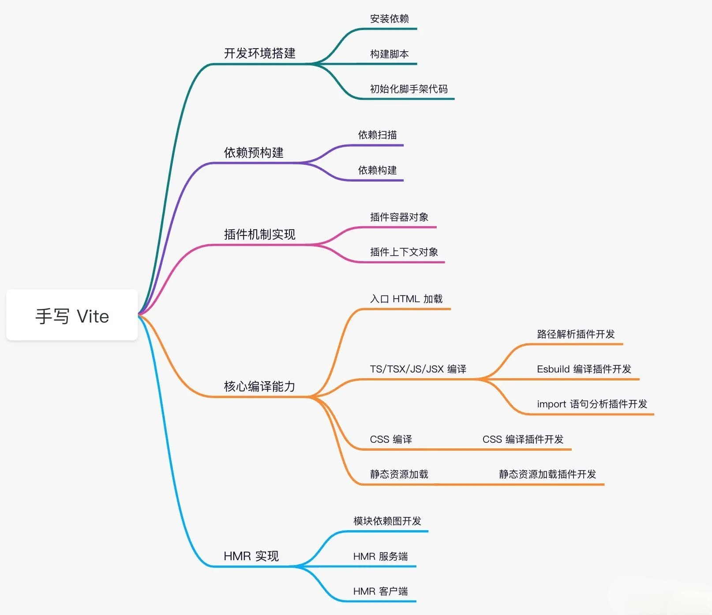

# Vite 源码实现

## 架构原理

Vite 底层使用两个构建引擎，Esbuild 和 Rollup。


### EsBuild

* 依赖预构建阶段，作为 bundler（打包工具） 使用

* 语法转译，将 Esbuild 作为 transformer 使用
  * TS 或者 JSX 文件转译，生产环境和开发环境都会执行
  * 替换原来的 Babel 和 TSC 功能
* 代码压缩，作为压缩工具使用
  * 在生产环境通过插件的形式融入到 Rollup 的打包流程
  * JS 和 CSS 代码压缩

Vite 利用 EsBuild 各个垂直方向的能力（Bundler、Transformer、Minifier），给 Vite 的高性能提供了有利的保证。

Vite 3.0 支持通过配置将 EsBuild 预构建同时用于开发环境和生产环境，默认不会开启，属于实验性质的特性。

### Rollup

* 生产环境下，Vite 利用 Rollup 打包，并基于 Rollup 本身的打包能力进行扩展和优化。
  * CSS 代码分割
    * 将异步模块 CSS 代码抽离成单独文件，提高线上产物的缓存复用率
  * 自动预加载
    * 为 入口 chunk 的依赖自动生成 `<link rel="modulepreload" >`，提前下载资源，优化页面性能
    * 关于 [modulepreload](https://developer.mozilla.org/en-US/docs/Web/HTML/Link_types/modulepreload)
  * 异步 chunk 加载优化
    * 自动预加载公共依赖，优化 Rollup 产物依赖加载方式
* 兼容插件机制
  * 无论是开发阶段还是生产环境，Vite 都根植于 Rollup 的插件机制和生态

在 Vite 中，无论是插件机制还是打包手段，都基于 Rollup 来实现，可以说 Vite 是对于 Rollup 的一种场景化的深度拓展。

## 插件流水线

在开发阶段 Vite 实现了一个按需加载的服务器，每一个文件都会经历一系列的编译流程，然后再将编译结果响应给浏览器。
在生产环境中，Vite 同样会执行一系列编译过程，将编译结果交给 Rollup 进行模块打包。

这一系列的编译过程指的就是 Vite 的插件工作流水线（Pipeline），插件功能是 Vite 构建的核心。

在生产环境中 Vite 直接调用 Rollup 进行打包，由 Rollup 调度各种插件。
在开发环境中，Vite 模拟了 Rollup 的插件机制，设计了一个 `PluginContainer` 对象来调度各个插件。

PluginContainer 的实现主要分为两部分：

* 实现 Rollup 插件钩子的调度
* 实现插件钩子内部的 Context 上下文对象

Vite 插件的具体执行顺序如下：

* 别名插件：`vite:pre-alias` 和 `@rollup/plugin-alias` ，用于路径别名替换。
* 用户自定义 pre 插件，即带有 `enforce: "pre"` 属性的自定义插件。
* vite 核心构建插件。
* 用户自定义普通插件，即不带有 `enforce` 属性的自定义插件。
* vite 生产环境插件和用户插件中带有 `enforce: "post"` 属性的插件。
* 开发阶段特有的插件，包括环境变量注入插件 `clientInjectionsPlugin` 和 import 语句分析及重写插件 `importAnalysisPlugin`。

Vite 内置的插件包括四大类：

* 别名插件
* 核心构建插件
* 生产环境特有插件
* 开发环境特有插件

关于更多插件流水线内容，可以查看 [这篇文章](https://www.yueluo.club/detail?articleId=62f370d9b6da2b3d4dc99b0a)。

## 源码实现



### 开发环境搭建

安装依赖

```bash
pnpm init -y
```

```bash
pnpm i cac chokidar connect debug es-module-lexer esbuild fs-extra magic-string picocolors resolve rollup sirv ws --save
```

```bash
pnpm i @types/connect @types/debug @types/fs-extra @types/resolve @types/ws tsup --save-dev
```

这里我们使用 [tsup](https://github.com/egoist/tsup) 进行项目的构建（Vite 本身使用 Rollup 进行打包）， tsup 能够实现库打包的功能，并且内置 esbuild 进行提速，性能上更加强悍。

配置 scripts 脚本

```json
// package.json

"scripts": {
  "start": "tsup --watch",
  "build": "tsup --minify"
}
```

新建 `tsconfig.json` 和 `tsup.config.ts` 配置文件

```json
// tsconfig.json

{
  "compilerOptions": {
    // 支持 commonjs 模块的 default import，如 import path from 'path'
    // 否则只能通过 import * as path from 'path' 进行导入
    "esModuleInterop": true,
    "target": "ES2020",
    "moduleResolution": "node",
    "module": "ES2020",
    "strict": true
  }
}
```

```json
// tsup.config.ts

import { defineConfig } from "tsup";

export default defineConfig({
  // 后续会增加 entry
  entry: {
    index: "src/node/cli.ts",
  },
  // 产物格式，包含 esm 和 cjs 格式
  format: ["esm", "cjs"],
  // 目标语法
  target: "es2020",
  // 生成 sourcemap
  sourcemap: true,
  // 没有拆包的需求，关闭拆包能力
  splitting: false,
})
```

新建 `src/node/cli.ts`文件，进行 cli 的初始化：

```typescript
// src/node/cli.ts

import cac from "cac"

const cli = cac()

// [] 中的内容为可选参数，也就是说仅输入 `vite` 命令下会执行下面的逻辑
cli
  .command("[root]", "Run the development server")
  .alias("serve")
  .alias("dev")
  .action(async () => {
    console.log('测试 cli~')
  })

cli.help()

cli.parse()
```

现在你可以执行  `pnpm start` 来编译这个 `custom-vite` 项目，tsup 会生成产物目录 `dist`，然后你可以新建 `bin/vite` 文件来引用产物:

```
#!/usr/bin/env node

require("../dist/index.js")
```

同时，你需要在 package.json 中注册 `vite`命令，配置如下:

```json
"bin": {
  "vite": "bin/vite"
}
```

现在，我们就可以在业务项目中使用 `vite` 这个命令了。这里有一个示例的 `playground` 项目，你可以拿来进行测试，[点击查看项目](https://github.com/yw0525/notes/tree/master/vite/vite_source/playground)。

playground 项目 package.json 如下：

```json
{
  "name": "playground",
  "private": true,
  "version": "0.0.0",
  "scripts": {
    "dev": "vite"
  },
  "dependencies": {
    "react": "17",
    "react-dom": "17"
  },
  "devDependencies": {
    "@types/react": "17",
    "@types/react-dom": "17",
    "@vitejs/plugin-react": "^1.3.0",
    "vite": "../custom-vite",
    "typescript": "^4.6.3"
  }
}
```

将 `playground` 项目放在 `vite` 同级目录中，然后执行 `pnpm i`，`vite ` 命令会自动安装到测试项目的 `node_modules/.bin`目录中。

<div></div>

接着我们在 `playground` 项目中执行 `pnpm dev` 命令(内部执行 `vite`)，可以看到如下的 log 信息:

```
测试 cli~
```

接着，我们把 `console.log` 语句换成服务启动的逻辑:

```diff
import cac from "cac"
+ import { startDevServer } from "./server"

const cli = cac()

cli
  .command("[root]", "Run the development server")
  .alias("serve")
  .alias("dev")
  .action(async () => {
-    console.log('测试 cli~')
+   await startDevServer()
  })

cli.help()

cli.parse()
```

接着新建 `src/node/server/index.ts`，内容如下:

```typescript
// connect 是一个具有中间件机制的轻量级 Node.js 框架。
// 既可以单独作为服务器，也可以接入到任何具有中间件机制的框架中，如 Koa、Express
import connect from "connect"
// picocolors 是一个用来在命令行显示不同颜色文本的工具
import { blue, green } from "picocolors"

export async function startDevServer() {
  const app = connect()
  const root = process.cwd()
  const startTime = Date.now()
  
  app.listen(3000, async () => {
    console.log(
      green("🚀 No-Bundle 服务已经成功启动!"),
      `耗时: ${Date.now() - startTime}ms`
    )
    console.log(`> 本地访问路径: ${blue("http://localhost:3000")}`)
  })
}
```

再次执行 `pnpm dev`，你可以发现终端出现如下的启动日志:

<div></div>

### 依赖预构建

现在我们来进入依赖预构建阶段的开发。

首先我们新建 `src/node/optimizer/index.ts` 来存放依赖预构建的逻辑:

```typescript
export async function optimize(root: string) {
  // 1. 确认入口
  // 2. 从入口处扫描依赖
  // 3. 预构建依赖  
}
```

然后在服务入口中引入预构建的逻辑:

```diff
import connect from "connect"
import { blue, green } from "picocolors"

+import { optimize } from '../optimizer'

export async function startDevServer() {
  const app = connect()
  const root = process.cwd()
  const startTime = Date.now()

  app.listen(3000, async () => {
+    await optimize(root)

    console.log(
      green("🚀 No-Bundle 服务已经成功启动!"),
      `耗时: ${Date.now() - startTime}ms`
    )
    console.log(`> 本地访问路径: ${blue("http://localhost:3000")}`)
  })
}
```

接着我们来开发依赖预构建的功能，从上面的代码注释你也可以看出，我们需要完成三部分的逻辑:

- 确定预构建入口
- 从入口开始扫描出用到的依赖
- 对依赖进行预构建

首先是确定入口，为了方便理解，我们直接约定入口为 src 目录下的 `main.tsx` 文件:

```typescript
import path from 'path'

export async function optimize(root: string) {
  // 1. 确认入口
  const entry = path.resolve(root, 'src/main.tsx')

  // 2. 从入口处扫描依赖
  // 3. 预构建依赖  
}
```

第二步是扫描依赖：

```typescript
import path from 'path'
import { build } from "esbuild";
import { green } from 'picocolors'
import { scanPlugin } from './scanPlugin'

export async function optimize(root: string) {
  // 1. 确认入口
  const entry = path.resolve(root, 'src/main.tsx')

  // 2. 从入口处扫描依赖
  const deps = new Set<string>()

  await build({
    entryPoints: [entry],
    bundle: true,
    write: false,
    plugins: [ scanPlugin(deps) ]
  })

  console.log(
    `${green("需要预构建的依赖")}:\n${[...deps]
    .map(green)
    .map((item) => `  ${item}`)
    .join("\n")}`
  )

  // 3. 预构建依赖  
}
```

依赖扫描需要我们借助 Esbuild 插件来完成，最后会记录到 deps 这个集合中。

接下来我们开发基于 Esbuild 的依赖扫描插件，你需要在 `optimzier` 目录中新建 `scanPlguin.ts` 文件，内容如下:

```typescript
import { Plugin } from "esbuild"
import { BARE_IMPORT_RE, EXTERNAL_TYPES } from "../constants"

export function scanPlugin(deps: Set<string>): Plugin {
  return {
    name: "esbuild:scan-deps",
    setup(build) {
      // 忽略的文件类型
      build.onResolve(
        { filter: new RegExp(`\\.(${EXTERNAL_TYPES.join("|")})$`) },
        (resolveInfo) => {
          return {
            path: resolveInfo.path,
            // 打上 external 标记
            external: true,
          }
        }
      )
      // 记录依赖
      build.onResolve(
        {
          filter: BARE_IMPORT_RE,
        },
        (resolveInfo) => {
          const { path: id } = resolveInfo
          // 推入 deps 集合中
          deps.add(id)
          return {
            path: id,
            external: true,
          }
        }
      )
    }
  }
}
```

文件中用到了一些常量，在 `src/node/constants.ts` 中定义，内容如下：

```typescript
export const EXTERNAL_TYPES = [
  "css",
  "less",
  "sass",
  "scss",
  "styl",
  "stylus",
  "pcss",
  "postcss",
  "vue",
  "svelte",
  "marko",
  "astro",
  "png",
  "jpe?g",
  "gif",
  "svg",
  "ico",
  "webp",
  "avif",
]

export const BARE_IMPORT_RE = /^[\w@][^:]/
```

插件的逻辑非常简单，即把一些无关的资源进行 external，不让 esbuild 处理，防止 Esbuild 报错，同时将 `bare import` 的路径视作第三方包，推入 deps 集合中。

现在，我们在 `playground` 项目根路径中执行 `pnpm dev`，可以发现依赖扫描已经成功执行:

当我们收集到所有的依赖信息之后，就可以对每个依赖进行打包，完成依赖预构建了：

<div></div>

当我们收集到所有的依赖信息之后，就可以对每个依赖进行打包，完成依赖预构建了：

```typescript
// ...
import { preBundlePlugin } from "./preBundlePlugin";
import { PRE_BUNDLE_DIR } from "../constants";

export async function optimize(root: string) {
  // 1. 确认入口
  const entry = path.resolve(root, 'src/main.tsx')

  // 2. 从入口处扫描依赖
	// ...
  
  // 3. 预构建依赖
  await build({
    entryPoints: [...deps],
    write: true,
    bundle: true,
    format: 'esm',
    splitting: true,
   outdir: path.resolve(root, PRE_BUNDLE_DIR),
    plugins: [preBundlePlugin(deps)]
  })
}
```

在此，我们引入了一个新的常量 `PRE_BUNDLE_DIR`，定义如下:

```typescript
import path from 'path'

// ...

export const BARE_IMPORT_RE = /^[\w@][^:]/

// 预构建产物默认存放在 node_modules 中的 .vite 目录中
export const PRE_BUNDLE_DIR = path.join("node_modules", ".vite")
```

接着，我们继续开发预构建的 Esbuild 插件：

```typescript
// src/node/utils.ts

import path from 'path'
import os from 'os'

export function slash(p: string): string {
  return p.replace(/\\/g, '/')
}
export const isWindows = os.platform() === 'win32'

export function normalizePath(id: string): string {
  return path.posix.normalize(isWindows ? slash(id) : id)
}
```

```typescript
// src/node/optimizer/preBundlePlugin.ts

import { Loader, Plugin } from "esbuild"
import { BARE_IMPORT_RE } from "../constants"

// 用来分析 es 模块 import/export 语句的库
import { init, parse } from "es-module-lexer"
import path from "path"
// 一个实现了 node 路径解析算法的库
import resolve from "resolve"
// 一个更加好用的文件操作库
import fs from "fs-extra"
// 用来开发打印 debug 日志的库
import createDebug from "debug"

import{ normalizePath } from '../utils'

const debug = createDebug("dev")

export function preBundlePlugin(deps: Set<string>): Plugin {
  return {
    name: "esbuild:pre-bundle",
    setup(build) {
      build.onResolve(
        {
          filter: BARE_IMPORT_RE,
        },
        (resolveInfo) => {
          const { path: id, importer } = resolveInfo
          const isEntry = !importer

          // 命中需要预编译的依赖
          if (deps.has(id)) {
            // 若为入口，则标记 dep 的 
            
            return isEntry
              ? {
                  path: id,
                  namespace: "dep",
                }
              : {
                  // 因为走到 onResolve 了，所以这里的 path 就是绝对路径了
                  path: resolve.sync(id, { basedir: process.cwd() }),
                }
          }
        }
      )

      // 拿到标记后的依赖，构造代理模块，交给 esbuild 打包
      build.onLoad(
        {
          filter: /.*/,
          namespace: "dep",
        },
        async (loadInfo) => {
          await init
          
          const id = loadInfo.path
          const root = process.cwd()

          const entryPath = resolve.sync(id, { basedir: root })

          const code = await fs.readFile(entryPath, "utf-8")
          const [imports, exports] = await parse(code)

          let relativePath = normalizePath(path.relative(root, entryPath))
          if (
            !relativePath.startsWith('./') &&
            !relativePath.startsWith('../') &&
            relativePath !== '.'
          ) {
            relativePath = `./${relativePath}`
          }

          let proxyModule = []

          // cjs
          if (!imports.length && !exports.length) {
            // 构造代理模块
            const res = require(entryPath)
            const specifiers = Object.keys(res)
            proxyModule.push(
              `export { ${specifiers.join(",")} } from "${relativePath}"`,
              `export default require("${relativePath}")`
            )
          } else {
            // esm 格式比较好处理，export * 或者 export default 即可
            if (exports.includes("default")) {
              proxyModule.push(`import d from "${relativePath}"export default d`)
            }
            proxyModule.push(`export * from "${relativePath}"`)
          }
          debug("代理模块内容: %o", proxyModule.join("\n"))
          const loader = path.extname(entryPath).slice(1)

          return {
            loader: loader as Loader,
            contents: proxyModule.join("\n"),
            resolveDir: root,
          }
        }
      )
    }
  }
}
```

对于 CommonJS 格式的依赖，单纯用 `export default require('入口路径')` 是有局限性的，比如对于 React 而言，用这样的方式生成的产物最后只有 default 导出:

```typescript
// esbuild 的打包产物
// ...
export default react_default
```

那么用户在使用这个依赖的时候，必须这么使用：

```typescript
// ✅ 正确
import React from 'react'

const { useState } = React

// ❌ 报错
import { useState } from 'react'
```

那为什么上述会报错的语法在 Vite 是可以正常使用的呢？原因是 Vite 在做 import 语句分析的时候，自动将你的代码进行改写了：

```typescript
// 原来的写法
import { useState } from 'react'

// Vite 的 importAnalysis 插件转换后的写法类似下面这样
import react_default from '/node_modules/.vite/react.js'

const { useState } = react_default
```

那么，还有没有别的方案来解决这个问题？其实，上述的插件代码中已经用另一个方案解决了这个问题，我们不妨把目光集中在下面这段代码中：

```typescript
if (!imports.length && !exports.length) {
  // 构造代理模块
  // 通过 require 拿到模块的导出对象
  const res = require(entryPath)
  // 用 Object.keys 拿到所有的具名导出
  const specifiers = Object.keys(res)
  // 构造 export 语句交给 Esbuild 打包
  proxyModule.push(
    `export { ${specifiers.join(",")} } from "${entryPath}"`,
    `export default require("${entryPath}")`
  )
}
```

如此一来，Esbuild 预构建的产物中便会包含 CommonJS 模块中所有的导出信息：

```typescript
// 预构建产物导出代码
export {
  react_default as default,
  useState,
  useEffect,
  // 省略其它导出
}
```

接下来让我们来测试一下预构建整体的功能。在 `playground` 项目中执行 `pnpm dev`，接着去项目的 `node_modules` 目录中，可以发现`.vite` 目录下新增的`react`、`react-dom`的预构建产物:

<div></div>

### 插件机制开发

完成了依赖预构建的功能之后，我们开始着手实现插件容器和插件上下文对象。

首先，你可以新建 `src/node/pluginContainer.ts` 文件，增加如下的类型定义:

```typescript
import type {
  LoadResult,
  PartialResolvedId,
  SourceDescription,
  PluginContext as RollupPluginContext,
  ResolvedId,
} from "rollup";

export interface PluginContainer {
  resolveId(id: string, importer?: string): Promise<PartialResolvedId | null>;
  load(id: string): Promise<LoadResult | null>;
  transform(code: string, id: string): Promise<SourceDescription | null>;
}
```

另外，由于插件容器需要接收 Vite 插件作为初始化参数，因此我们需要提前声明插件的类型，你可以继续新建 `src/node/plugin.ts` 来声明如下的插件类型:

```typescript
import { LoadResult, PartialResolvedId, SourceDescription } from "rollup";
import { ServerContext } from "./server";

export type ServerHook = (
  server: ServerContext
) => (() => void) | void | Promise<(() => void) | void>;

// 仅实现以下这几个钩子
export interface Plugin {
  name: string;
  configureServer?: ServerHook;
  resolveId?: (
    id: string,
    importer?: string
  ) => Promise<PartialResolvedId | null> | PartialResolvedId | null;
  load?: (id: string) => Promise<LoadResult | null> | LoadResult | null;
  transform?: (
    code: string,
    id: string
  ) => Promise<SourceDescription | null> | SourceDescription | null;
  transformIndexHtml?: (raw: string) => Promise<string> | string;
}
```

对于其中的 ServerContext，我们暂时不用过于关心，只需要在 `server/index.ts` 中简单声明一下类型即可:

```typescript
// src/node/server/index.ts

// 增加如下类型声明
export interface ServerContext {}
```

接着，我们来实现插件机制的具体逻辑，主要集中在 `createPluginContainer` 函数中:

```typescript
import type {
  LoadResult,
  PartialResolvedId,
  SourceDescription,
  PluginContext as RollupPluginContext,
  ResolvedId,
} from "rollup";

export interface PluginContainer {
  resolveId(id: string, importer?: string): Promise<PartialResolvedId | null>;
  load(id: string): Promise<LoadResult | null>;
  transform(code: string, id: string): Promise<SourceDescription | null>;
}

export const createPluginContainer = (plugins: Plugin[]): PluginContainer => {
  // 插件上下文对象
  // @ts-ignore 
  class Context implements RollupPluginContext {
    // 这里仅实现上下文对象的 resolve 方法
    async resolve(id: string, importer?: string) {
      let out = await pluginContainer.resolveId(id, importer)
      if (typeof out === "string") out = { id: out }
      return out as ResolvedId | null
    }
  }

  // 插件容器
  const pluginContainer: PluginContainer = {
    async resolveId(id: string, importer?: string) {
      const ctx = new Context() as any
      for (const plugin of plugins) {
        if (plugin.resolveId) {
          const newId = await plugin.resolveId.call(ctx as any, id, importer)
          if (newId) {
            id = typeof newId === "string" ? newId : newId.id
            return { id }
          }
        }
      }
      return null
    },
    async load(id) {
      const ctx = new Context() as any
      for (const plugin of plugins) {
        if (plugin.load) {
          const result = await plugin.load.call(ctx, id)
          if (result) {
            return result
          }
        }
      }
      return null
    },
    async transform(code, id) {
      const ctx = new Context() as any
      for (const plugin of plugins) {
        if (plugin.transform) {
          const result = await plugin.transform.call(ctx, code, id)
          if (!result) continue
          if (typeof result === "string") {
            code = result
          } else if (result.code) {
            code = result.code
          }
        }
      }
      return { code }
    }
  }

  return pluginContainer
}
```

接着，我们来完善一下之前的服务器逻辑：

```typescript
// src/node/server/index.ts

import connect from "connect"
import { blue, green } from "picocolors"

import { optimize } from '../optimizer'
import { resolvePlugins } from '../plugins'
import { Plugin } from "../plugin";
import { createPluginContainer, PluginContainer } from '../pluginContainer'

export interface ServerContext {
  root: string;
  pluginContainer: PluginContainer;
  app: connect.Server;
  plugins: Plugin[]
}

export async function startDevServer() {
  const app = connect()
  const root = process.cwd()
  const startTime = Date.now()

  const plugins = resolvePlugins()
  const pluginContainer = createPluginContainer(plugins)

  const serverContext: ServerContext = {
    root: process.cwd(),
    app,
    pluginContainer,
    plugins
  }

  for (const plugin of plugins) {
    if (plugin.configureServer) {
      await plugin.configureServer(serverContext)
    }
  }

  app.listen(3000, async () => {
    await optimize(root)

    console.log(
      green("🚀 No-Bundle 服务已经成功启动!"),
      `耗时: ${Date.now() - startTime}ms`
    )
    console.log(`> 本地访问路径: ${blue("http://localhost:3000")}`)
  })
}
```

其中 `resolvePlugins` 方法我们还未定义，你可以新建 `src/node/plugins/index.ts`  文件，内容如下:

```typescript
import { Plugin } from "../plugin";

export function resolvePlugins(): Plugin[] {
  return [];
}
```

### 入口 HTML 加载

现在我们基于如上的插件机制，来实现 Vite 的核心编译能力。

首先要考虑的就是入口 HTML 如何编译和加载的问题，这里我们可以通过一个服务中间件，配合插件机制来实现。具体而言，你可以新建`src/node/server/middlewares/indexHtml.ts`，内容如下:

```typescript
import { NextHandleFunction } from "connect"
import path from "path"
import { pathExists, readFile } from "fs-extra"
import { ServerContext } from "../index"

export function indexHtmlMiddware(
  serverContext: ServerContext
): NextHandleFunction {
  return async (req, res, next) => {
    if (req.url === "/") {
      const { root } = serverContext

      // 默认使用项目根目录下的 index.html
      const indexHtmlPath = path.join(root, "index.html")

      if (await pathExists(indexHtmlPath)) {
        const rawHtml = await readFile(indexHtmlPath, "utf8")

        let html = rawHtml

        // 通过执行插件的 transformIndexHtml 方法来对 HTML 进行自定义的修改
        for (const plugin of serverContext.plugins) {
          if (plugin.transformIndexHtml) {
            html = await plugin.transformIndexHtml(html)
          }
        }

        res.statusCode = 200
        res.setHeader("Content-Type", "text/html")
        return res.end(html)
      }
    }
    
    return next()
  }
}
```

然后在服务中应用这个中间件：

```typescript
import connect from "connect"
import { blue, green } from "picocolors"

import { optimize } from '../optimizer'
import { resolvePlugins } from '../plugins'
import { Plugin } from "../plugin";
import { createPluginContainer, PluginContainer } from '../pluginContainer'

import { indexHtmlMiddware } from './middlewares/indexHtml'

// ...

export async function startDevServer() {
  const app = connect()
  const root = process.cwd()
  const startTime = Date.now()

  const plugins = resolvePlugins()
  const pluginContainer = createPluginContainer(plugins)
	
  // ...
  
  // 处理入口 HTML 资源
  app.use(indexHtmlMiddware(serverContext))

	// ...
}
```

接下来通过 `pnpm dev` 启动项目，然后访问 `http://localhost:3000`，从网络面板中你可以查看到 HTML 的内容已经成功返回：


不过当前的页面并没有任何内容，因为 HTML 中引入的 TSX 文件并没有被正确编译。接下来，我们就来处理 TSX 文件的编译工作。

### JS/TS/JSX/TSX 编译能力

首先新增一个中间件 `src/node/server/middlewares/transform.ts`，内容如下：

```typescript
// src/node/server/middlewares/transform.ts

import { NextHandleFunction } from "connect"
import {
  isJSRequest,
  cleanUrl,
} from "../../utils"
import { ServerContext } from "../index"
import createDebug from "debug"

const debug = createDebug("dev")

export async function transformRequest(
  url: string,
  serverContext: ServerContext
) {
  const { pluginContainer } = serverContext

  url = cleanUrl(url)
  
  // 简单来说，就是依次调用插件容器的 resolveId、load、transform 方法
  const resolvedResult = await pluginContainer.resolveId(url)

  let transformResult

  if (resolvedResult?.id) {
    let code = await pluginContainer.load(resolvedResult.id)
    if (typeof code === "object" && code !== null) {
      code = code.code
    }
    if (code) {
      transformResult = await pluginContainer.transform(
        code as string,
        resolvedResult?.id
      )
    }
  }
  return transformResult
}

export function transformMiddleware(
  serverContext: ServerContext
): NextHandleFunction {
  return async (req, res, next) => {
    if (req.method !== "GET" || !req.url) {
      return next()
    }

    const url = req.url

    debug("transformMiddleware: %s", url)

    // transform JS request
    if (isJSRequest(url)) {
      // 核心编译函数
      let result = await transformRequest(url, serverContext)

      if (!result) {
        return next()
      }
      if (result && typeof result !== "string") {
        result = result.code
      }

      // 编译完成，返回响应给浏览器
      res.statusCode = 200
      res.setHeader("Content-Type", "application/javascript")
      
      return res.end(result)
    }

    next()
  }
}
```

```typescript
// src/node/server/index.ts

export async function startDevServer() {
	// ...
  
  // 核心编译逻辑
  app.use(transformMiddleware(serverContext))
  // 处理入口 HTML 资源
  app.use(indexHtmlMiddware(serverContext))

  app.listen(3000, async () => {
    await optimize(root)

    console.log(
      green("🚀 No-Bundle 服务已经成功启动!"),
      `耗时: ${Date.now() - startTime}ms`
    )
    console.log(`> 本地访问路径: ${blue("http://localhost:3000")}`)
  })
}
```

同时，我们也需要补充如下的工具函数和常量定义：

```typescript
// src/node/utils.ts

import path from 'path'
import os from 'os'
import { JS_TYPES_RE, HASH_RE, QEURY_RE } from './constants.ts'

// ...

export const isJSRequest = (id: string): boolean => {
  id = cleanUrl(id);
  if (JS_TYPES_RE.test(id)) {
    return true;
  }
  if (!path.extname(id) && !id.endsWith("/")) {
    return true;
  }
  return false;
};

export const cleanUrl = (url: string): string =>
  url.replace(HASH_RE, "").replace(QEURY_RE, "");
```

```typescript
// src/node/constants.ts

import path from 'path'

// ...

export const JS_TYPES_RE = /\.(?:j|t)sx?$|\.mjs$/
export const QEURY_RE = /\?.*$/s
export const HASH_RE = /#.*$/s
```

从如上的核心编译函数 `transformRequest`可以看出，Vite 对于 JS/TS/JSX/TSX 文件的编译流程主要是依次调用插件容器的如下方法：

- resolveId
- load
- transform

其中会经历众多插件的处理逻辑，那么，对于 TSX 文件的编译逻辑，也分散到了各个插件当中，具体来说主要包含以下的插件：

- 路径解析插件
- Esbuild 语法编译插件
- import 分析插件

接下来，我们就开始依次实现这些插件。

#### 路径解析插件

当浏览器解析到如下的标签时：

```typescript
<script type="module" src="/src/main.tsx"></script>
```

会自动发送一个路径为 `/src/main.tsx` 的请求，但如果服务端不做任何处理，是无法定位到源文件的，随之会返回 404 状态码：

> [ES Module 模块](https://hacks.mozilla.org/2018/03/es-modules-a-cartoon-deep-dive/)

<div></div>

因此，我们需要开发一个路径解析插件，对请求的路径进行处理，使之能转换真实文件系统中的路径。

你可以新建文件 `src/node/plugins/resolve.ts`，内容如下：

```typescript
import resolve from "resolve"
import path from "path"
import { pathExists } from "fs-extra"

import { Plugin } from "../plugin"
import { ServerContext } from "../server/index"
import { DEFAULT_EXTERSIONS } from "../constants"
import { cleanUrl } from "../utils"

export function resolvePlugin(): Plugin {
  let serverContext: ServerContext
  return {
    name: "vite:resolve",
    configureServer(s) {
      // 保存服务端上下文
      serverContext = s
    },
    async resolveId(id: string, importer?: string) {
      // 1. 绝对路径
      if (path.isAbsolute(id)) {
        if (await pathExists(id)) {
          return { id }
        }
        // 加上 root 路径前缀，处理 /src/main.tsx 的情况
        id = path.join(serverContext.root, id)
        if (await pathExists(id)) {
          return { id }
        }
      }
      // 2. 相对路径
      else if (id.startsWith(".")) {
        if (!importer) {
          throw new Error("`importer` should not be undefined")
        }
        const hasExtension = path.extname(id).length > 1
        let resolvedId: string
        // 2.1 包含文件名后缀
        // 如 ./App.tsx
        if (hasExtension) {
          resolvedId = resolve.sync(id, { basedir: path.dirname(importer) })
          if (await pathExists(resolvedId)) {
            // return { id: resolvedId }
            return { id }
          }
        } 
        // 2.2 不包含文件名后缀
        // 如 ./App
        else {
          // ./App -> ./App.tsx
          for (const extname of DEFAULT_EXTERSIONS) {
            try {
              const withExtension = `${id}${extname}`
              resolvedId = resolve.sync(withExtension, {
                basedir: path.dirname(importer),
              })
              if (await pathExists(resolvedId)) {
                // return { id: resolvedId }
                return { id: withExtension }
              }
            } catch (e) {
              continue
            }
          }
        }
      }
      return null
    }
  }
}
```

这样对于 `/src/main.tsx`，在插件中会转换为文件系统中的真实路径，从而让模块在 load 钩子中能够正常加载(加载逻辑在 Esbuild 语法编译插件实现)。

接着我们来补充一下目前缺少的常量:

```typescript
// src/node/constants.ts
export const DEFAULT_EXTERSIONS = [".tsx", ".ts", ".jsx", "js"]
```

#### Esbuild 语法编译插件

这个插件的作用比较好理解，就是将 JS/TS/JSX/TSX 编译成浏览器可以识别的 JS 语法，可以利用 Esbuild 的 Transform API 来实现。

你可以新建`src/node/plugins/esbuild.ts`文件，内容如下：

```typescript
import esbuild from "esbuild"
import path from "path"
import { readFile } from "fs-extra"

import { Plugin } from "../plugin"
import { isJSRequest } from "../utils"

export function esbuildTransformPlugin(): Plugin {
  return {
    name: "vite:esbuild-transform",
    // 加载模块
    async load(id) {
      if (isJSRequest(id)) {
        try {
          const code = await readFile(id, "utf-8")
          return code
        } catch (e) {
          return null
        }
      }
    },
    async transform(code, id) {
      if (isJSRequest(id)) {
        const extname = path.extname(id).slice(1)
        const { code: transformedCode, map } = await esbuild.transform(code, {
          target: "esnext",
          format: "esm",
          sourcemap: true,
          loader: extname as "js" | "ts" | "jsx" | "tsx",
        })
        return {
          code: transformedCode,
          map,
        }
      }
      return null
    }
  }
}
```

#### import 分析插件

在将 TSX 转换为浏览器可以识别的语法之后，是不是就可以直接返回给浏览器执行了呢？

显然不是，我们还考虑如下的一些问题:

- 对于第三方依赖路径(bare import)，需要重写为预构建产物路径；
- 对于绝对路径和相对路径，需要借助之前的路径解析插件进行解析。

接下来，我们就在 import 分析插件中一一解决这些问题：

```typescript
import { pathExists } from "fs-extra"
import resolve from "resolve"
import path from "path"
// magic-string 用来作字符串编辑
import MagicString from "magic-string" 
import { init, parse } from "es-module-lexer"

import {
  BARE_IMPORT_RE,
  DEFAULT_EXTERSIONS,
  PRE_BUNDLE_DIR,
} from "../constants"
import {
  cleanUrl,
  isJSRequest,
  normalizePath
} from "../utils"

import { Plugin } from "../plugin"
import { ServerContext } from "../server/index"

export function importAnalysisPlugin(): Plugin {
  let serverContext: ServerContext
  return {
    name: "vite:import-analysis",
    configureServer(s) {
      // 保存服务端上下文
      serverContext = s
    },
    async transform(code: string, id: string) {
      // 只处理 JS 相关的请求
      if (!isJSRequest(id)) {
        return null
      }
      await init
      // 解析 import 语句
      const [imports] = parse(code)
      const ms = new MagicString(code)
      // 对每一个 import 语句依次进行分析
      for (const importInfo of imports) {
        // 举例说明: const str = `import React from 'react'`
        // str.slice(s, e) => 'react'
        const { s: modStart, e: modEnd, n: modSource } = importInfo
        
        if (!modSource) continue
        // 第三方库: 路径重写到预构建产物的路径
        if (BARE_IMPORT_RE.test(modSource)) {
          // const bundlePath = path.join(
          //   serverContext.root,
          //   PRE_BUNDLE_DIR,
          //   `${modSource}.js`
          // )
          const bundlePath = normalizePath(
            path.join('/', PRE_BUNDLE_DIR, `${modSource}.js`)
          )
          ms.overwrite(modStart, modEnd, bundlePath)
        } else if (modSource.startsWith(".") || modSource.startsWith("/")) {
          // 直接调用插件上下文的 resolve 方法，会自动经过路径解析插件的处理
          const resolved = await this.resolve(modSource, id)
          if (resolved) {
            ms.overwrite(modStart, modEnd, resolved.id)
          }
        }
      }

      return {
        code: ms.toString(),
        // 生成 SourceMap
        map: ms.generateMap(),
      }
    }
  }
}
```

现在，我们便完成了 JS 代码的 import 分析工作。接下来，我们把上面实现的三个插件进行注册：

```typescript
// src/node/plugin/index.ts

import { Plugin } from "../plugin"

import { esbuildTransformPlugin } from "./esbuild"
import { importAnalysisPlugin } from "./importAnalysis"
import { resolvePlugin } from "./resolve"

export function resolvePlugins(): Plugin[] {
  return [resolvePlugin(), esbuildTransformPlugin(), importAnalysisPlugin()]
}
```

然后在 `playground` 项目下执行 `pnpm dev`，在浏览器里面访问 `http://localhost:3000`，你可以在网络面板中发现  `main.tsx`  的内容以及被编译为下面这样:

```js
import React from "/node_modules/.vite/react.js";
import ReactDOM from "/node_modules/.vite/react-dom.js";
import App from "./App.tsx";
ReactDOM.render(/* @__PURE__ */ React.createElement(App, null), document.getElementById("root"));
```

同时，页面内容也能被渲染出来：

<div></div>

目前为止我们就基本上完成对 JS/TS/JSX/TSX 文件的编译。

> 测试还没有处理静态资源，如果使用提供的案例，需要注释掉 css、svg 的资源。

