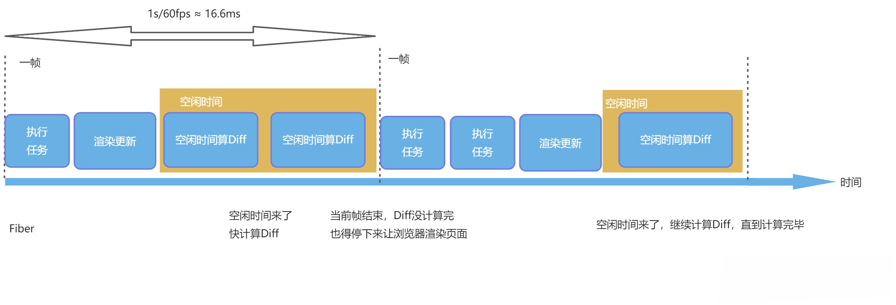

# Vue 与 React 框架对比

Vue 和 React 在数据发生变化后，在通知页面更新的方式上有明显的不同，通俗的来说，就是在 Vue 框架下，如果数据变了，框架会主动告诉你修改了哪些数据；而 React  的数据变化后，我们只能通过新老数据的计算 Diff 来得知数据的变化。

这两个解决方案都解决了数据变化后，如何通知页面更新的问题，但是它们都碰到了性能瓶颈：

* 对于 Vue 来说，它的一个核心是 “响应式”，也就是数据变化后，会主动通知。响应式数据新建 Watcher 监听，本身比较损耗性能，项目规模大了以后每个数据都有一个 watcher 会影响性能；
* 对于 React 的虚拟 DOM 的 Diff 计算逻辑来说，如果虚拟 DOM 树过于庞大，使得计算时间大于 16.6 ms，那么就可能造成卡顿。

为了解决这种性能瓶颈，Vue 和 React 走了不同的道路。

React 为了突破性能瓶颈，借鉴了操作系统时间分片的概念，引入 Fiber 架构。通俗来说，就是把整个虚拟 DOM 树微观化，变成链表，然后我们利用浏览器的空闲时间计算 Diff。一旦浏览器有需求，我们就可以把没计算完的任务放在一旁，把主进程控制权还给浏览器，等待浏览器下次空闲。

> 关于更多 Fiber 的相关内容可以查看这篇文章 - [Fiber](https://www.yueluo.club/detail?articleId=614e625806388427e6578046)。

这种架构虽然没有减少计算量，但是巧妙地利用空闲实现计算，解决了卡顿的问题。

上图中，左侧是一个树形结构，树形结构的 Diff 很难中断。右侧将树形结构改造成了链表，按照 `子元素-兄弟元素-父元素` 的逻辑进行遍历，可以做到随时中断和恢复 Diff 的计算过程。

这个图中两个虚线之间是浏览器的一帧，高性能的动画要求是 60 fps，也就是 1 秒要渲染 60 次，每一帧的时间就是 16.6 毫秒，在这 16.6 毫秒里，浏览器自己的渲染更新任务执行后，会有一部分空闲时间，这段时间我们可以用来计算 Diff。

等到下一帧任务执行，我们就把控制权还给浏览器，让它继续去更新和渲染，等待空闲时间再继续计算，这样就不会导致卡顿。

Vue 1 的问题的问题在于响应式数据过多，这样会带来内存占用过多的问题。所以 Vue 2 引入虚拟 DOM 来解决响应式数据过多的问题。

这个解决方案使用虚拟 DOM 解决了响应式数据过多的内存占用问题，并且规避了 React 中虚拟 DOM 的问题，并通过虚拟 DOM 给 Vue 带来跨端能力。

对于 Vue 2 来说，组件之间的变化，可以通过响应式来通知更新。组件内部的数据变化，则通过虚拟 DOM 去更新页面，这样就把响应式的监听器，控制在组件级别，虚拟 DOM 的大小，也控制在组件大小。

除了响应式和虚拟 DOM 这个维度，Vue 和 React 还有一些理念和路线的不同。

React 中编写 JSX，JSX 都会在 Compiler 那一层，通过工程化编译成 JS 来执行，所以 React 可以拥有全部 JS 的动态性，这也导致 React 的 API 一直很少，只有 state、hooks、Component 几个概念，主要都是 JavaScript 本身的语法和特性。

Vue 中默认使用 template，语法是限定死的，例如 `v-if`、`v-for` 等。有了这些语法限制，我们可以在上线前做很多优化。Vue 3 在虚拟 DOM 的静态标记上做到了极致，让静态代码部分直接越过虚拟 DOM 计算，真正做到按需更新，提高了性能。

在模板的书写上，除了 Vue 和 React 使用的 template 和 JSX 之外，还出现了 Svelte 这种框架，它不存在虚拟 DOM 库，直接将模板编译成原生 DOM，几乎不存在 Runtime，所以的逻辑都在 Compiler 层优化，算是另一个方向的极致。

这里还有一个问题，那就是 Vue 为什么不需要 React 的 Fiber？

其实最早 Vue 3 的提案中使包含时间切片方案的，最后废弃的主要原因，是因为使用时间切片解决的问题，Vue 3 并不会出现：

* Vue 3 把虚拟 DOM 控制在组件级别，组件之间使用响应式，这使得 Vue 3 的虚拟 DOM 不会过于庞大；
* Vue 3 虚拟 DOM 的静态标记和自动缓存功能，让静态节点和属性可以直接绕过 Diff 逻辑，减少了虚拟 DOM 的 Diff 事件；
* 引入时间切片机制会带来额外的系统复杂性。

另外关于 Vue 的新语法和新功能讨论，都会在 GitHub 上公开征求意见，邀请社区所有的人一起讨论，你可以随时打开这个[项目](https://github.com/vuejs/rfcs)。

Vue 3 正在讨论中的新需求，任何人都可以围观、参与讨论和尝试实现。