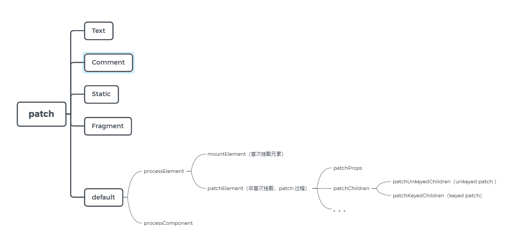
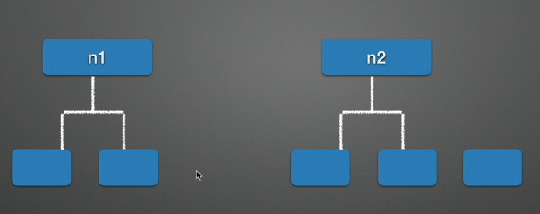
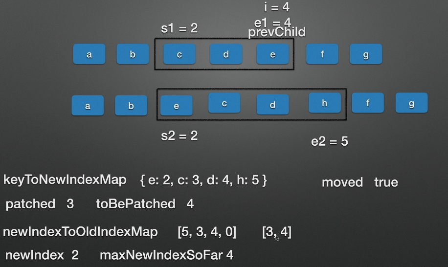

# Vue3 Diff


Vue3 patch method：

**runtime-core/src/renderer.ts**


Vue3 Diff 算法和 Vue2 基本是一致的，主要看一下 patch 方法。


### patch 流程图



### patch 源码分析


```js
const patch: PatchFn = () => {}
```


#### patch

```js
// Note: functions inside this closure should use `const xxx = () => {}`
// style in order to prevent being inlined by minifiers.
const patch: PatchFn = (
  n1,
  n2,
  container,
  anchor = null,
  parentComponent = null,
  parentSuspense = null,
  isSVG = false,
  optimized = false
) => {
  // patching & not same type, unmount old tree
  if (n1 && !isSameVNodeType(n1, n2)) {
    anchor = getNextHostNode(n1)
    // 组件相关的卸载操作
    unmount(n1, parentComponent, parentSuspense, true)
    n1 = null
  }

  if (n2.patchFlag === PatchFlags.BAIL) {
    optimized = false
    n2.dynamicChildren = null
  }

  const { type, ref, shapeFlag } = n2
  switch (type) {
    case Text:
      processText(n1, n2, container, anchor)
      break
    case Comment:
      processCommentNode(n1, n2, container, anchor)
      break
    case Static:
      if (n1 == null) {
        mountStaticNode(n2, container, anchor, isSVG)
      } else if (__DEV__) {
        patchStaticNode(n1, n2, container, isSVG)
      }
      break
    case Fragment:
      processFragment(
        n1,
        n2,
        container,
        anchor,
        parentComponent,
        parentSuspense,
        isSVG,
        optimized
      )
      break
    default:
      if (shapeFlag & ShapeFlags.ELEMENT) {
        // 处理普通元素节点
        processElement(
          n1,
          n2,
          container,
          anchor,
          parentComponent,
          parentSuspense,
          isSVG,
          optimized
        )
      } else if (shapeFlag & ShapeFlags.COMPONENT) {
        processComponent(
          n1,
          n2,
          container,
          anchor,
          parentComponent,
          parentSuspense,
          isSVG,
          optimized
        )
      } else if (shapeFlag & ShapeFlags.TELEPORT) {
        ;(type as typeof TeleportImpl).process(
          n1 as TeleportVNode,
          n2 as TeleportVNode,
          container,
          anchor,
          parentComponent,
          parentSuspense,
          isSVG,
          optimized,
          internals
        )
      } else if (__FEATURE_SUSPENSE__ && shapeFlag & ShapeFlags.SUSPENSE) {
        ;(type as typeof SuspenseImpl).process(
          n1,
          n2,
          container,
          anchor,
          parentComponent,
          parentSuspense,
          isSVG,
          optimized,
          internals
        )
      } else if (__DEV__) {
        warn('Invalid VNode type:', type, `(${typeof type})`)
      }
  }

  // set ref
  if (ref != null && parentComponent) {
    setRef(ref, n1 && n1.ref, parentSuspense, n2)
  }
}
```


####  processElement

```js
const processElement = (
	n1: VNode | null,
	n2: VNode,
	container: RendererElement,
	anchor: RendererNode | null,
	parentComponent: ComponentInternalInstance | null,
	parentSuspense: SuspenseBoundary | null,
	isSVG: boolean,
	optimized: boolean
) => {
	isSVG = isSVG || (n2.type as string) === 'svg'
    // 首次挂载，n1 为 null
	if (n1 == null) {
        // 挂载元素
		mountElement(
			n2,
			container,
			anchor,
			parentComponent,
			parentSuspense,
			isSVG,
			optimized
		)
	} else {
        // 非首次挂载，patch 更新
		patchElement(n1, n2, parentComponent, parentSuspense, isSVG, optimized)
	}
}
```


####  patchElement

```js
const patchElement = (
	n1: VNode,
	n2: VNode,
	parentComponent: ComponentInternalInstance | null,
	parentSuspense: SuspenseBoundary | null,
	isSVG: boolean,
	optimized: boolean
) => {
	const el = (n2.el = n1.el!)
	let { patchFlag, dynamicChildren, dirs } = n2
	// #1426 take the old vnode's patch flag into account since user may clone a
	// compiler-generated vnode, which de-opts to FULL_PROPS
	patchFlag |= n1.patchFlag & PatchFlags.FULL_PROPS
	const oldProps = n1.props || EMPTY_OBJ
	const newProps = n2.props || EMPTY_OBJ
	let vnodeHook: VNodeHook | undefined | null

	if ((vnodeHook = newProps.onVnodeBeforeUpdate)) {
		invokeVNodeHook(vnodeHook, parentComponent, n2, n1)
	}
	if (dirs) {
		invokeDirectiveHook(n2, n1, parentComponent, 'beforeUpdate')
	}

	if (__DEV__ && isHmrUpdating) {
		// HMR updated, force full diff
		patchFlag = 0
		optimized = false
		dynamicChildren = null
	}
	
	// 优化操作，如果 patchFlag > 0 才进行比对
	if (patchFlag > 0) {
		// the presence of a patchFlag means this element's render code was
		// generated by the compiler and can take the fast path.
		// in this path old node and new node are guaranteed to have the same shape
		// (i.e. at the exact same position in the source template)
		if (patchFlag & PatchFlags.FULL_PROPS) {
			// element props contain dynamic keys, full diff needed
            // 如果存在动态的 key
			patchProps(
				el,
				n2,
				oldProps,
				newProps,
				parentComponent,
				parentSuspense,
				isSVG
			)
		} else {
			// class
			// this flag is matched when the element has dynamic class bindings.
            // 处理类
			if (patchFlag & PatchFlags.CLASS) {
				if (oldProps.class !== newProps.class) {
					hostPatchProp(el, 'class', null, newProps.class, isSVG)
				}
			}

			// style
			// this flag is matched when the element has dynamic style bindings
            // 处理 style
			if (patchFlag & PatchFlags.STYLE) {
				hostPatchProp(el, 'style', oldProps.style, newProps.style, isSVG)
			}

			// props
			// This flag is matched when the element has dynamic prop/attr bindings
			// other than class and style. The keys of dynamic prop/attrs are saved for
			// faster iteration.
			// Note dynamic keys like :[foo]="bar" will cause this optimization to
			// bail out and go through a full diff because we need to unset the old key
			if (patchFlag & PatchFlags.PROPS) {
				// if the flag is present then dynamicProps must be non-null
				const propsToUpdate = n2.dynamicProps!
				for (let i = 0; i < propsToUpdate.length; i++) {
					const key = propsToUpdate[i]
					const prev = oldProps[key]
					const next = newProps[key]
					if (
						next !== prev ||
						(hostForcePatchProp && hostForcePatchProp(el, key))
					) {
						hostPatchProp(
							el,
							key,
							prev,
							next,
							isSVG,
							n1.children as VNode[],
							parentComponent,
							parentSuspense,
							unmountChildren
						)
					}
				}
			}
		}

		// text
		// This flag is matched when the element has only dynamic text children.
		if (patchFlag & PatchFlags.TEXT) {
			if (n1.children !== n2.children) {
				hostSetElementText(el, n2.children as string)
			}
		}
	} else if (!optimized && dynamicChildren == null) {
		// unoptimized, full diff
		patchProps(
			el,
			n2,
			oldProps,
			newProps,
			parentComponent,
			parentSuspense,
			isSVG
		)
	}

	const areChildrenSVG = isSVG && n2.type !== 'foreignObject'
	if (dynamicChildren) {
		patchBlockChildren(
			n1.dynamicChildren!,
			dynamicChildren,
			el,
			parentComponent,
			parentSuspense,
			areChildrenSVG
		)
		if (__DEV__ && parentComponent && parentComponent.type.__hmrId) {
			traverseStaticChildren(n1, n2)
		}
	} else if (!optimized) {
		// full diff
        // 主要看一下 patchChildren 方法
		patchChildren(
			n1,
			n2,
			el,
			null,
			parentComponent,
			parentSuspense,
			areChildrenSVG
		)
	}

	if ((vnodeHook = newProps.onVnodeUpdated) || dirs) {
		queuePostRenderEffect(() => {
			vnodeHook && invokeVNodeHook(vnodeHook, parentComponent, n2, n1)
			dirs && invokeDirectiveHook(n2, n1, parentComponent, 'updated')
		}, parentSuspense)
	}
}
```


####  patchChildren ☆

```js
const patchChildren: PatchChildrenFn = (
	n1,
	n2,
	container,
	anchor,
	parentComponent,
	parentSuspense,
	isSVG,
	optimized = false
) => {
    // 获取 n1 的子节点
	const c1 = n1 && n1.children
	const prevShapeFlag = n1 ? n1.shapeFlag : 0
    // 获取 n2 的子节点
	const c2 = n2.children

	const { patchFlag, shapeFlag } = n2
	// fast path
	if (patchFlag > 0) {
		if (patchFlag & PatchFlags.KEYED_FRAGMENT) {
			// this could be either fully-keyed or mixed (some keyed some not)
			// presence of patchFlag means children are guaranteed to be arrays
            // 如果 children 存在 key
			patchKeyedChildren(
				c1 as VNode[],
				c2 as VNodeArrayChildren,
				container,
				anchor,
				parentComponent,
				parentSuspense,
				isSVG,
				optimized
			)
			return
		} else if (patchFlag & PatchFlags.UNKEYED_FRAGMENT) {
			// unkeyed
            // children 没有 key
			patchUnkeyedChildren(
				c1 as VNode[],
				c2 as VNodeArrayChildren,
				container,
				anchor,
				parentComponent,
				parentSuspense,
				isSVG,
				optimized
			)
			return
		}
	}

	// children has 3 possibilities: text, array or no children.
	if (shapeFlag & ShapeFlags.TEXT_CHILDREN) {
		// text children fast path
		if (prevShapeFlag & ShapeFlags.ARRAY_CHILDREN) {
			unmountChildren(c1 as VNode[], parentComponent, parentSuspense)
		}
		if (c2 !== c1) {
			hostSetElementText(container, c2 as string)
		}
	} else {
		if (prevShapeFlag & ShapeFlags.ARRAY_CHILDREN) {
			// prev children was array
			if (shapeFlag & ShapeFlags.ARRAY_CHILDREN) {
				// two arrays, cannot assume anything, do full diff
				patchKeyedChildren(
					c1 as VNode[],
					c2 as VNodeArrayChildren,
					container,
					anchor,
					parentComponent,
					parentSuspense,
					isSVG,
					optimized
				)
			} else {
				// no new children, just unmount old
				unmountChildren(c1 as VNode[], parentComponent, parentSuspense, true)
			}
		} else {
			// prev children was text OR null
			// new children is array OR null
			if (prevShapeFlag & ShapeFlags.TEXT_CHILDREN) {
				hostSetElementText(container, '')
			}
			// mount new if array
			if (shapeFlag & ShapeFlags.ARRAY_CHILDREN) {
				mountChildren(
					c2 as VNodeArrayChildren,
					container,
					anchor,
					parentComponent,
					parentSuspense,
					isSVG,
					optimized
				)
			}
		}
	}
}
```


####  patchUnkeyedChildren 

patch 过程中没有key的情况

```js
const patchUnkeyedChildren = (
	c1: VNode[],
	c2: VNodeArrayChildren,
	container: RendererElement,
	anchor: RendererNode | null,
	parentComponent: ComponentInternalInstance | null,
	parentSuspense: SuspenseBoundary | null,
	isSVG: boolean,
	optimized: boolean
) => {
	c1 = c1 || EMPTY_ARR
	c2 = c2 || EMPTY_ARR
	const oldLength = c1.length
	const newLength = c2.length
    // 获取数据长度，取数组长度比较小的作为 commonLength，即循环的长度
	const commonLength = Math.min(oldLength, newLength)
	let i
	for (i = 0; i < commonLength; i++) {
        // 获取新节点的子项
		const nextChild = (c2[i] = optimized
			? cloneIfMounted(c2[i] as VNode)
			: normalizeVNode(c2[i]))
        // 调用 patch 方法
		patch(
			c1[i],
			nextChild,
			container,
			null,
			parentComponent,
			parentSuspense,
			isSVG,
			optimized
		)
	}
	if (oldLength > newLength) {
		// remove old
        // 如果老节点比新节点多，执行 unmountChildren 方法
    	// 把 c1 多出来的一项移除掉（参见图示 1）
		unmountChildren(
			c1,
			parentComponent,
			parentSuspense,
			true,
			false,
			commonLength
		)
	} else {
		// mount new
        // 如果新节点比老节点多，执行 mountChildren 方法
        // 把新节点插入到老节点中（参见图示二）
		mountChildren(
			c2,
			container,
			anchor,
			parentComponent,
			parentSuspense,
			isSVG,
			optimized,
			commonLength
		)
	}
}
```


##### 图1


##### 图2




#### patchKeyedChildren

patch 过程中存在 key 的情况

```js
// can be all-keyed or mixed
// children 都有 key 或者 有些有 key，有些没 key
const patchKeyedChildren = (
	c1: VNode[],
	c2: VNodeArrayChildren,
	container: RendererElement,
	parentAnchor: RendererNode | null,
	parentComponent: ComponentInternalInstance | null,
	parentSuspense: SuspenseBoundary | null,
	isSVG: boolean,
	optimized: boolean
) => {
	let i = 0
	const l2 = c2.length
	let e1 = c1.length - 1 // prev ending index
	let e2 = l2 - 1 // next ending index

	// 1. sync from start
	// (a b) c
	// (a b) d e
    // 从头开始比对
	while (i <= e1 && i <= e2) {
		const n1 = c1[i]
		const n2 = (c2[i] = optimized
			? cloneIfMounted(c2[i] as VNode)
			: normalizeVNode(c2[i]))
		if (isSameVNodeType(n1, n2)) {
			patch(
				n1,
				n2,
				container,
				null,
				parentComponent,
				parentSuspense,
				isSVG,
				optimized
			)
		} else {
			break
		}
		i++
	}

	// 2. sync from end
	// a (b c)
	// d e (b c)
    // 尾开始比较
	while (i <= e1 && i <= e2) {
		const n1 = c1[e1]
		const n2 = (c2[e2] = optimized
			? cloneIfMounted(c2[e2] as VNode)
			: normalizeVNode(c2[e2]))
		if (isSameVNodeType(n1, n2)) {
			patch(
				n1,
				n2,
				container,
				null,
				parentComponent,
				parentSuspense,
				isSVG,
				optimized
			)
		} else {
			break
		}
		e1--
		e2--
	}

	// 3. common sequence + mount
	// (a b)
	// (a b) c
	// i = 2, e1 = 1, e2 = 2
	// (a b)
	// c (a b)
	// i = 0, e1 = -1, e2 = 0
	if (i > e1) {
		if (i <= e2) {
			const nextPos = e2 + 1
			const anchor = nextPos < l2 ? (c2[nextPos] as VNode).el : parentAnchor
			while (i <= e2) {
                // anchor 为 null => appendChild 方法
                // anchor 不为 null => insertBefore 方法
				patch(
					null,
					(c2[i] = optimized
						? cloneIfMounted(c2[i] as VNode)
						: normalizeVNode(c2[i])),
					container,
					anchor,
					parentComponent,
					parentSuspense,
					isSVG
				)
				i++
			}
		}
	}

	// 4. common sequence + unmount
	// (a b) c
	// (a b)
	// i = 2, e1 = 2, e2 = 1
	// a (b c)
	// (b c)
	// i = 0, e1 = 0, e2 = -1
	else if (i > e2) {
		while (i <= e1) {
			unmount(c1[i], parentComponent, parentSuspense, true)
			i++
		}
	}

	// 5. unknown sequence
	// [i ... e1 + 1]: a b [c d e] f g
	// [i ... e2 + 1]: a b [e c d h] f g
	// i = 2, e1 = 4, e2 = 5
	else {
		const s1 = i // prev starting index
		const s2 = i // next starting index

		// 5.1 build key:index map for newChildren
		const keyToNewIndexMap: Map<string | number, number> = new Map()
        // 未知序列情况（详见图4）
        // 构造新值的映射关系
		for (i = s2; i <= e2; i++) {
			const nextChild = (c2[i] = optimized
				? cloneIfMounted(c2[i] as VNode)
				: normalizeVNode(c2[i]))
			if (nextChild.key != null) {
				if (__DEV__ && keyToNewIndexMap.has(nextChild.key)) {
					warn(
						`Duplicate keys found during update:`,
						JSON.stringify(nextChild.key),
						`Make sure keys are unique.`
					)
				}
				keyToNewIndexMap.set(nextChild.key, i)
			}
		}

		// 5.2 loop through old children left to be patched and try to patch
		// matching nodes & remove nodes that are no longer present
        // 循环旧孩子节点，尝试进行 patch
		let j
		let patched = 0
		const toBePatched = e2 - s2 + 1
		let moved = false
		// used to track whether any node has moved
		let maxNewIndexSoFar = 0
		// works as Map<newIndex, oldIndex>
		// Note that oldIndex is offset by +1
		// and oldIndex = 0 is a special value indicating the new node has
		// no corresponding old node.
		// used for determining longest stable subsequence
		const newIndexToOldIndexMap = new Array(toBePatched)
		for (i = 0; i < toBePatched; i++) newIndexToOldIndexMap[i] = 0

		for (i = s1; i <= e1; i++) {
			const prevChild = c1[i]
            // 头与头相同，尾与尾相同，中间不同，执行卸载过程（详见图3），特殊情况
			if (patched >= toBePatched) {
				// all new children have been patched so this can only be a removal
				unmount(prevChild, parentComponent, parentSuspense, true)
				continue
			}
			let newIndex
			if (prevChild.key != null) {
				newIndex = keyToNewIndexMap.get(prevChild.key)
			} else {
				// key-less node, try to locate a key-less node of the same type
				for (j = s2; j <= e2; j++) {
					if (
						newIndexToOldIndexMap[j - s2] === 0 &&
						isSameVNodeType(prevChild, c2[j] as VNode)
					) {
						newIndex = j
						break
					}
				}
			}
			if (newIndex === undefined) {
				unmount(prevChild, parentComponent, parentSuspense, true)
			} else {
				newIndexToOldIndexMap[newIndex - s2] = i + 1
				if (newIndex >= maxNewIndexSoFar) {
					maxNewIndexSoFar = newIndex
				} else {
					moved = true
				}
				patch(
					prevChild,
					c2[newIndex] as VNode,
					container,
					null,
					parentComponent,
					parentSuspense,
					isSVG,
					optimized
				)
				patched++
			}
		}
        
        // 逻辑执行情况（详见图5），可以自己推导一下。

		// 5.3 move and mount
		// generate longest stable subsequence only when nodes have moved
        // 获取最长的稳定的子序列
		const increasingNewIndexSequence = moved
			? getSequence(newIndexToOldIndexMap)
			: EMPTY_ARR
		j = increasingNewIndexSequence.length - 1
		// looping backwards so that we can use last patched node as anchor
        // 从后向前循环，将已经 patch 好的节点作为锚点
        // 执行结果（详见图6）
		for (i = toBePatched - 1; i >= 0; i--) {
			const nextIndex = s2 + i
			const nextChild = c2[nextIndex] as VNode
			const anchor =
				nextIndex + 1 < l2 ? (c2[nextIndex + 1] as VNode).el : parentAnchor
			if (newIndexToOldIndexMap[i] === 0) {
				// mount new
				patch(
					null,
					nextChild,
					container,
					anchor,
					parentComponent,
					parentSuspense,
					isSVG
				)
			} else if (moved) {
				// move if:
				// There is no stable subsequence (e.g. a reverse)
				// OR current node is not among the stable sequence
				if (j < 0 || i !== increasingNewIndexSequence[j]) {
					move(nextChild, container, anchor, MoveType.REORDER)
				} else {
					j--
				}
			}
		}
	}
}
```


##### 图3


##### 图4


##### 图5




##### 图6


#### getSequence

算法。计算最长稳定的子序列。

[5, 3, 4, 0] => [3, 4]

```js
// https://en.wikipedia.org/wiki/Longest_increasing_subsequence
function getSequence(arr: number[]): number[] {
  const p = arr.slice()
  const result = [0]
  let i, j, u, v, c
  const len = arr.length
  for (i = 0; i < len; i++) {
    const arrI = arr[i]
    if (arrI !== 0) {
      j = result[result.length - 1]
      if (arr[j] < arrI) {
        p[i] = j
        result.push(i)
        continue
      }
      u = 0
      v = result.length - 1
      while (u < v) {
        c = ((u + v) / 2) | 0
        if (arr[result[c]] < arrI) {
          u = c + 1
        } else {
          v = c
        }
      }
      if (arrI < arr[result[u]]) {
        if (u > 0) {
          p[i] = result[u - 1]
        }
        result[u] = i
      }
    }
  }
  u = result.length
  v = result[u - 1]
  while (u-- > 0) {
    result[u] = v
    v = p[v]
  }
  return result
}
```

