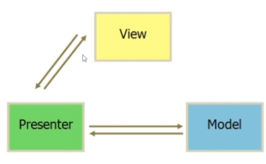
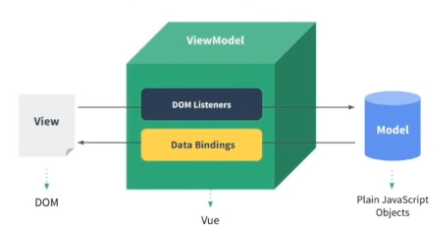
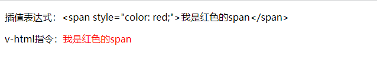
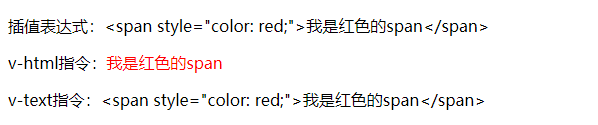

# Vue

## 一、Vue介绍、指令基础、TodoList、设计模式

[官方手册](https://cn.vuejs.org)
[官方论坛](https://forum.vuejs.org)

### 特点

* 应用范围广
* 生态环境好
* 易上手，学习成本低
* 代码轻量
* 发展迅速
  Nuxt 框架，快速实现服务端渲染功能。
  Weex 框架，使用Vue语法编写原生APP。

Vue 不支持 IE8 及以下版本。

### 基础示例

#### 1. 为 div 添加 css 样式。

```html
<div id="root">
  <div :style="styleObj">
    Hello World
  </div>
</div>

<script type="text/javascript" src="../vue.js"></script>

<script type="text/javascript">
  var vm = new Vue({
    el: '#root',
    data: {
      styleObj: {
        color: 'red'
      }
    }
  })
</script>

: 是 v-bind 的缩写。

```

#### 2. js 事件

```html
<div id="root">
  <div
    @click="handleBtnClick"
  >
    Hello World
  </div>
</div>

<script type="text/javascript" src="../vue.js"></script>

<script type="text/javascript">
  var vm = new Vue({
    el: '#root',
    methods: {
      handleBtnClick () {
        console.log('我被点击了');
      }
    },
  })
```

@click 是 v-on 的缩写。

#### 3. 访问 data 属性

```html
<div id="root">
  <div>
    {{ message }}
  </div>
</div>

<script type="text/javascript" src="../vue.js"></script>

<script type="text/javascript">
  var vm = new Vue({
    el: '#root',
    data: {
      message: 'Hello World'
    }
  })

  console.log(vm.data); // undefined
  console.log(vm.$data); // {__ob__: Observer}
  console.log(vm.$data.message); // Hello World
  console.log(vm.message); // Hello World
</script>
```

#### 4. vue 与 原生JS 对比

原生JS

```html
<div id="root"></div>

<script type="text/javascript">
  var root = document.getElementById('root');

  root.innerHTML = 'Hello World';
</script>
```

VueJS

```html
<div id="root">
  {{ message }}
</div>

<script type="text/javascript" src="../vue.js"></script>

<script type="text/javascript">
  var vm = new Vue({
    el: '#root',
    data: {
      message: 'Hello World'
    }
  })
</script>
```

{{ }}  mustache 语法，插值表达式

#### 5. 2s 改变页面内容

原生JS

```html
<div id="root"></div>

<script type="text/javascript">
  var root = document.getElementById('root');

  root.innerHTML = 'Hello World';

  setTimeout(() => {
    root.innerHTML = 'I am Heora';
  }, 2 * 1000)
</script>
```

VueJS

```html
<div id="root">
  {{ message }}
</div>

<script type="text/javascript" src="../vue.js"></script>

<script type="text/javascript">
  var vm = new Vue({
    el: '#root',
    data: {
      message: 'Hello World'
    }
  })

  setTimeout(() => {
    vm.$data.message = 'I am Heora';
  }, 2 * 1000)
</script>
```

### TodoList

* v-for 指令：循环数组
* v-on 指令：事件绑定
* v-model 指令：双向绑定

```html
<div id="root">
  <input type="text" v-model="inputValue" />
  <button
    v-on:click="handleBtnClick"
  >
    提交
  </button>
  {{ inputValue }}

  <ul>
    <li
      v-for="item in list"
    >
      {{ item }}
    </li>
  </ul>
</div>

<script type="text/javascript" src="../vue.js"></script>

<script type="text/javascript">
  var vm = new Vue({
    el: '#root',
    data: {
      inputValue: '',
      list: [ 1, 2 ]
    },
    methods: {
      handleBtnClick () {
        this.list.push(this.inputValue);
        this.inputValue = '';
      }
    }
  })
</script>
```

### MVVM 设计模式

#### 1. MVP 

M ：Model     数据层
V ：View      视图层
P ：Presenter 控制层（逻辑层）



#### 2. MVVM 

M ： Model     数据层
V ： View      视图层
VM ：ViewModel Vue 处理



## 二、组件介绍、组件的注册、命名、组件间传值

### 组件化

* 提高开发效率
* 方便重复使用
* 简化调试步骤
* 提升项目可维护性
* 便于协同开发

### 组件命名方式

短横线式命名（kebab-case）

```js
todo-item
```

驼峰式命名（PascalCase）

```js
TodoItem
```

无论是使用短横线式命名或驼峰式命名，页面引入使用的时候都要用短横线式组件名。

```js
<todo-item></todo-item>
```

### 组件注册方式

全局注册

```js
Vue.component('TodoItem', {
  // ...options
});
```

局部注册

```js
const TodoItem = {/**/}

var vm = new Vue({
  el: '#root',
  components: {
    TodoItem
  }
})
```

全局注册时，如果使用 webpack 构建项目，即使不使用全局注册的组件，组件也会包含在构建结果里面。局部注册就不会有此问题。

Vue是根实例，每个组件也是一个实例。

### 组件传值

静态传值

```js
<todo-item test="hello world" />

Vue.component('TodoItem', {
  props: [
    'test'
  ],
  template: '<li>{{ test }}</li>'
});
```

动态传值

```js
<todo-item
  v-for="item in list"
  v-bind:content="item"
>
</todo-item>

Vue.component('TodoItem', {
props: [
  'content'
],
template: '<li>{{ content }}</li>'
});
```

### 组件化开发 TodoList

v:bind 给子组件动态传值，“ : ” 是 v:bind 的缩写。

全局注册方式

```html
<div id="root">
  <input type="text" v-model="inputValue" />
  <button @click="hanleBtnClick">提交</button>
  <ul>
    <todo-item
      v-for="item in list"
      v-bind:content="item"
    >
    </todo-item>
  </ul>
</div>

<script type="text/javascript" src="../vue.js"></script>

<script type="text/javascript">
  Vue.component('TodoItem', {
    props: [
      'content'
    ],
    template: '<li>{{ content }}</li>'
  });

  var vm = new Vue({
    el: '#root',
    data: {
      inputValue: '',
      list: [ 1, 2 ]
    },
    methods: {
      hanleBtnClick () {
        this.list.push(this.inputValue);
        this.inputValue = '';
      }
    }
  })
</script>
```

局部注册方式

```html
<div id="root">
  <input type="text" v-model="inputValue" />
  <button @click="hanleBtnClick">提交</button>
  <ul>
    <todo-item
      v-for="item in list"
      v-bind:content="item"
    >
    </todo-item>
  </ul>
</div>

<script type="text/javascript" src="../vue.js"></script>

<script type="text/javascript">
  const TodoItem = {
    props: ['content'],
    template: '<li>{{ content }}</li>'
  }

  var vm = new Vue({
    el: '#root',
    components: {
      TodoItem
    },
    data: {
      inputValue: '',
      list: [ 1, 2 ]
    },
    methods: {
      hanleBtnClick () {
        this.list.push(this.inputValue);
        this.inputValue = '';
      }
    }
  })
</script>
```

## 三、生命周期、模板、计算属性、方法、侦听器

### Vue 生命周期

生命周期钩子函数是 Vue 实例在某个时间点会自动执行的函数。

Init Events & Lifecycle 初始化事件和生命周期相关内容
Init injection & reactivity 初始化外部注入和双向绑定

outerHTML：el 对象及包含内容
innerHTML：el 对象包含内容
innerText：el 对象中文本属性


```html
<div id="root"></div>

<script type="text/javascript" src="../vue.js"></script>

<script type="text/javascript">
  var vm = new Vue({
    el: '#root',
    template: '<div>Hello World</div>',
    beforeCreate () {
      console.log('beforeCreate');
    },
    created () {
      console.log('created');
    },
    beforeMount () {
      console.log(this.$el);
      console.log('beforeMount');
    },
    mounted () {
      console.log(this.$el);
      console.log('mounted');
    },
    beforeUpdate () {
      console.log('beforeUpdate');
    },
    updated () {
      console.log('updated');
    },
    beforeDestroy () {
      console.log('beforeDestroy');
    },
    destroyed () {
      console.log('destroyed');
    }
  })
</script>
```

### 模板语法

#### 1. 插值

```html
<div id="root">
  <span>{{ content }}</span>
  <span>{{ content + '456' }}</span>
</div>

<script type="text/javascript" src="../vue.js"></script>

<script type="text/javascript">
  var vm = new Vue({
    el: '#root',
    data: {
      content: 'Hello World'
    }
  });

  vm.$data.content = 123;
</script>
```

插值表达式中支持JS表达式，可以进行简单的逻辑运算。
使用 vm.$data.content 可改变数据。

#### 2. v-once 指令

如果只想数据渲染一次，可以使用 v-once 指令。

```html
<div id="root">
  <span v-once>{{ content }}</span>
</div>

<script type="text/javascript" src="../vue.js"></script>

<script type="text/javascript">
  var vm = new Vue({
    el: '#root',
    data: {
      content: 'Hello World'
    }
  });

  vm.$data.content = 123;
</script>
```

#### 2. v-html 指令

可以解析富文本内容。

```html
<div id="root">
  <p>插值表达式：{{ rawHtml }}</p>
  <p>v-html指令：<span v-html="rawHtml"></span></p>
</div>

<script type="text/javascript" src="../vue.js"></script>

<script type="text/javascript">
  var vm = new Vue({
    el: '#root',
    data: {
      rawHtml: '<span style="color: red;">我是红色的span</span>'
    }
  });

  vm.$data.content = 123;
</script>
```



#### 3. v-text

与插值表达式的功能一样，都是作为一个普通文本展示到页面。

```html
<div id="root">
  <p>插值表达式：{{ rawHtml }}</p>
  <p>v-html指令：<span v-html="rawHtml"></span></p>
  <p>v-text指令：<span v-text="rawHtml"></span></p>
</div>

<script type="text/javascript" src="../vue.js"></script>

<script type="text/javascript">
  var vm = new Vue({
    el: '#root',
    data: {
      rawHtml: '<span style="color: red;">我是红色的span</span>'
    }
  });

  vm.$data.content = 123;
</script>
```



### 计算属性

计算属性，Computed Properties。

计算属性实现文字反转

```html
<div id="root">
  <p>计算前数据：{{ message }}</p>
  <p>计算后数据：{{ reversedMessage }}</p>
</div>

<script type="text/javascript" src="../vue.js"></script>

<script type="text/javascript">
  var vm = new Vue({
    el: '#root',
    data: {
      message: '大家好，我是月落。'
    },
    computed: {
      reversedMessage () {
        return this.message.split('').reverse('').join('');
      }
    },
  });
</script>
```

方法实现文字反转

```js
<div id="root">
  <p>计算前数据：{{ message }}</p>
  <p>计算后数据：{{ reversedMessage() }}</p>
</div>

<script type="text/javascript" src="../vue.js"></script>

<script type="text/javascript">
  var vm = new Vue({
    el: '#root',
    data: {
      message: '大家好，我是月落。'
    },
    methods: {
      reversedMessage () {
        return this.message.split('').reverse('').join('');
      }
    }
  });
</script>
```

使用方法时，改变页面值，页面会重新渲染，方法会执行一次。
使用计算属性，只有在与页面相关的属性修改时，才会重新计算一次。

computed setter

```html
<div id="root">
  <p>{{ fullName }}</p>
</div>

<script type="text/javascript" src="../vue.js"></script>

<script type="text/javascript">
  var vm = new Vue({
    el: '#root',
    data: {
      firstName: '落',
      lastName: '月'
    },
    computed: {
      fullName: {
        get: function () {
          return this.firstName + ' ' + this.lastName;
        },
        set: function (val) {
          this.firstName = val;
        }
      }
    }
  });

  vm.fullName = '李四';
</script>
```

如果 computed 属性不设置 setter，直接修改，会报错。

### 侦听属性

观察并响应 Vue 实例上的数据变动。

```html
<script type="text/javascript">
  var vm = new Vue({
    el: '#root',
    data: {
      firstName: '落',
      lastName: '月',
      fullName: '长歌'
    },
    watch: {
      firstName: function () {
        this.fullName = this.firstName + ' ' + this.lastName;
      },
      lastName: function () {
        this.fullName = this.firstName + ' ' + this.lastName;
      }
    }
  });

  vm.firstName = 'Jar';
</script>
```

使用侦听属性，在与页面相关的属性修改时，会重新计算一次。

## 四、class绑定、style绑定、条件渲染