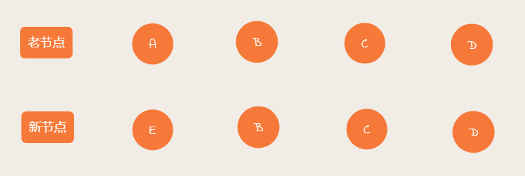
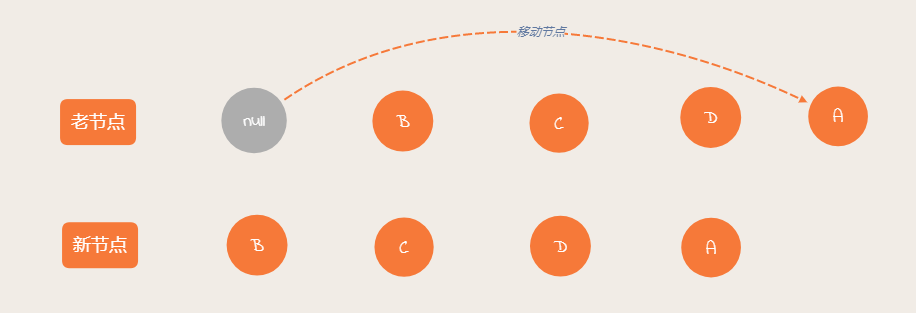
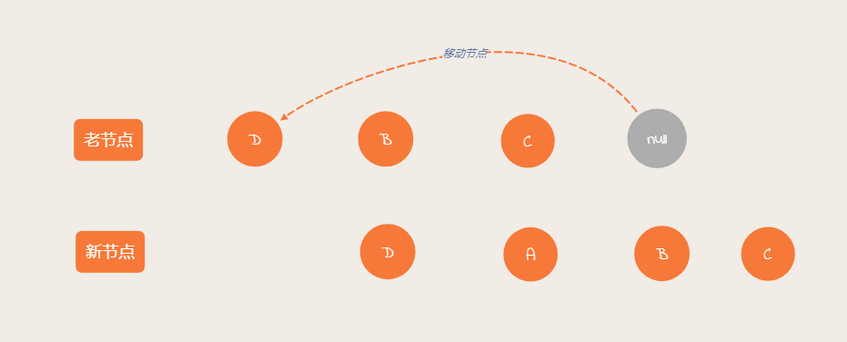
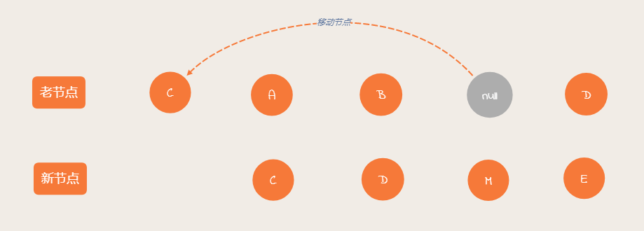
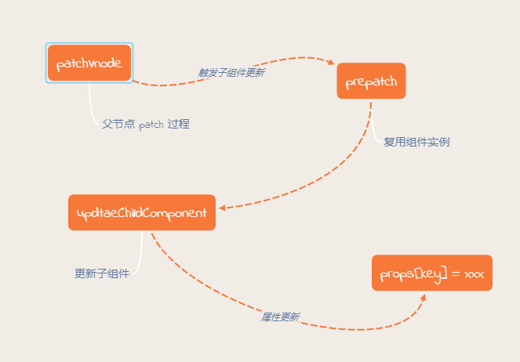
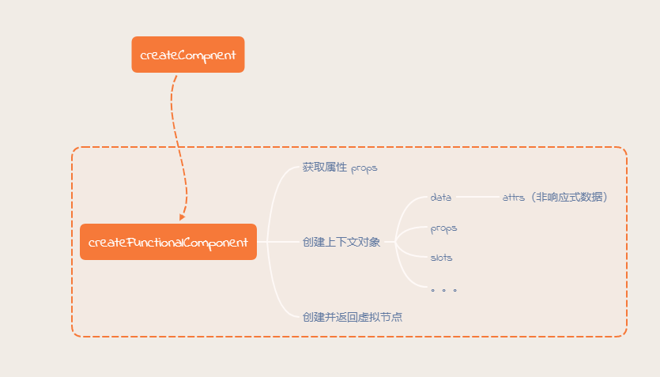
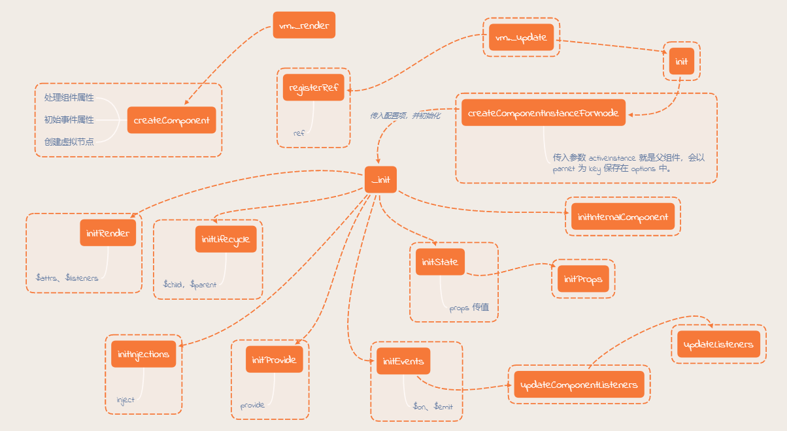
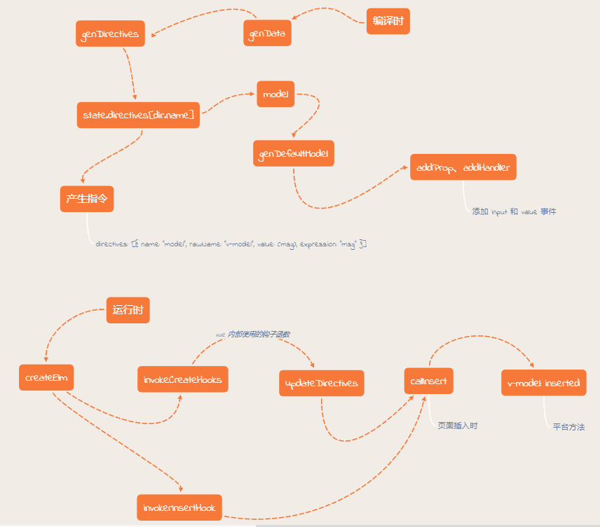
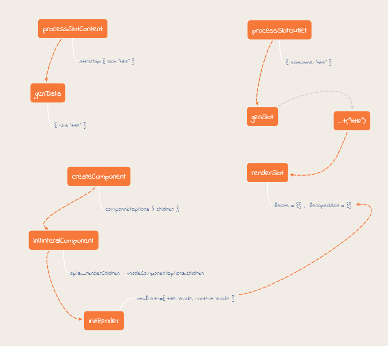
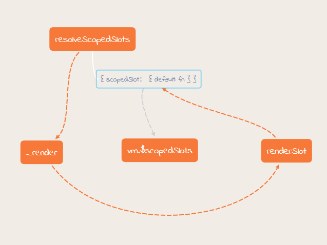

## 1. MVVM

MVC、MVVM 这类模式的目的都是为了职责划分和分层，如果代码都堆在一起，就很臃肿，也不利于维 护。

MVVM 借鉴了后端的 MVC 模式，比如 java 中比较原始的 servlet + jsp 技术。


但是对于前端来说，数据变化无法同步到视图中，还是需要将逻辑聚拢在 controller 层。

所以就产生了 MVVM 模式，MVVM 模式是对映射关系的简化，隐藏了 Controller 层。

Vue 就借鉴了 MVVM 的思想，但是它并没有完全遵循 MVVM 模型。

> 在 vue 中是可以使用 JS 操作视图的，MVVM 模式不推荐直接操作视图。


## 2. vue2 响应式原理

首先响应式原理和双向绑定并不是一个概念。

>  响应式原理是指当数据变化时，会驱动视图变化。

vue2 的响应式原理是通过 Object.defineProperty 实现的。

### 处理对象

使用 Object.defineProperty 将属性进行劫持（只会劫持已经存在的属性）。多层对象是通过递归实现劫持。

**src/core/observer/index.js**

```js
export class Observer {
  value: any;
  dep: Dep;
  vmCount: number; // number of vms that have this object as root $data

  constructor (value: any) {
    this.value = value
    this.dep = new Dep()
    this.vmCount = 0
    def(value, '__ob__', this)
    if (Array.isArray(value)) {
      // 数据处理
      if (hasProto) {
        protoAugment(value, arrayMethods)
      } else {
        copyAugment(value, arrayMethods, arrayKeys)
      }
      this.observeArray(value)
    } else {
      // 对象处理
      this.walk(value)
    }
  }

  /**
   * Walk through all properties and convert them into
   * getter/setters. This method should only be called when
   * value type is Object.
   */
  walk (obj: Object) {
    const keys = Object.keys(obj)
    for (let i = 0; i < keys.length; i++) {
      defineReactive(obj, keys[i])
    }
  }
}
```

**src/core/observer/index.js**

```js
// 定义响应式数据
export function defineReactive (
  obj: Object,
  key: string,
  val: any,
  customSetter?: ?Function,
  shallow?: boolean
) {
  const dep = new Dep()
 
  // 如果不可以配置直接 return
  const property = Object.getOwnPropertyDescriptor(obj, key)
  if (property && property.configurable === false) {
    return
  }

  // cater for pre-defined getter/setters
  const getter = property && property.get
  const setter = property && property.set
  if ((!getter || setter) && arguments.length === 2) {
    val = obj[key]
  }
 
  // 数据递归观测
  let childOb = !shallow && observe(val)
  
  Object.defineProperty(obj, key, {
    enumerable: true,
    configurable: true,
    get: function reactiveGetter () {
      // 依赖收集
      const value = getter ? getter.call(obj) : val
      if (Dep.target) {
        dep.depend()
        if (childOb) {
          // 对象本身进行依赖收集
          childOb.dep.depend()
          if (Array.isArray(value)) {
            // 如果是数组，让 arr 属性和外层数组进行收集
            dependArray(value)
          }
        }
      }
      return value
    },
    set: function reactiveSetter (newVal) {
      const value = getter ? getter.call(obj) : val
      /* eslint-disable no-self-compare */
      if (newVal === value || (newVal !== newVal && value !== value)) {
        return
      }
      /* eslint-enable no-self-compare */
      if (process.env.NODE_ENV !== 'production' && customSetter) {
        customSetter()
      }
      // #7981: for accessor properties without setter
      if (getter && !setter) return
      if (setter) {
        setter.call(obj, newVal)
      } else {
        val = newVal
      }
      childOb = !shallow && observe(newVal)
      dep.notify()
    }
  })
}
```

### 处理数组

数组则是通过重写数组方法来实现的。

数组考虑性能原因没有用 defineProperty 对数组的每一项进行拦截，而是选择重写数组方法。

> push、shift、pop、unshift、reverse、sort、splice

也正因如此，数组的索引和长度变化是无法监控到的。

**src/core/observer/index.js**

```js
export class Observer {
  value: any;
  dep: Dep;
  vmCount: number; // number of vms that have this object as root $data

  constructor (value: any) {
    this.value = value
    this.dep = new Dep()
    this.vmCount = 0
    def(value, '__ob__', this)
    if (Array.isArray(value)) {
      // 数据处理
      if (hasProto) {
        protoAugment(value, arrayMethods)
      } else {
        copyAugment(value, arrayMethods, arrayKeys)
      }
      this.observeArray(value)
    } else {
      // 对象处理
      this.walk(value)
    }
  }

  /**
   * Observe a list of Array items.
   */
  observeArray (items: Array<any>) {
    for (let i = 0, l = items.length; i < l; i++) {
      observe(items[i])
    }
  }
}
```

**src/core/observer/array.js**

```js
const arrayProto = Array.prototype
export const arrayMethods = Object.create(arrayProto)

const methodsToPatch = [
  'push',
  'pop',
  'shift',
  'unshift',
  'splice',
  'sort',
  'reverse'
]

/**
 * Intercept mutating methods and emit events
 */
methodsToPatch.forEach(function (method) {
  // cache original method
  const original = arrayProto[method]
  def(arrayMethods, method, function mutator (...args) {
    const result = original.apply(this, args)
    const ob = this.__ob__
    let inserted
    switch (method) {
      case 'push':
      case 'unshift':
        inserted = args
        break
      case 'splice':
        inserted = args.slice(2)
        break
    }
    // 
    if (inserted) ob.observeArray(inserted)
    // notify change
    ob.dep.notify()
    return result
  })
})
```

对于数组中新增（splice、push、unshift ）的数据也会进行观测。

## 3. Vue3 响应式原理

```js
export function reactive (target) {
  // 创建响应式对象
  return createReactiveObject(target, mutableHandler); 
}

function createReactiveObject (target, baseHandler) {
  if (!isObject(target)) {
    return target;
  }
  const observed = new Proxy(target, baseHandler);
  return observed;
}
```

```js
/**
 * @file 对象和数组相关的处理函数
 */
const get = createGetter(),
      set = cretaeSetter();


function createGetter () {
  return function get (target, key, receiver) {
    const res = Reflect.get(target, key, receiver);
    // 依赖收集
    track(target, TrackOpTypes.GET, key);
    // 如果是数组或对象
    if (isObject(res)) {
      return reactive(res);
    }
    return res;
  }
}

function cretaeSetter () {
  return function setter (target, key, value, receiver) {
    // 检查一个属性是否已经存在
    const hasKey = hasOwn(target, key);

    const oldValue = target[key];

    const res = Reflect.set(target, key, value, receiver); // target[key] = value

    if (!hasKey) {
      // 新增属性
      trigger(target, TriggerOpTypes.ADD, key, value);
    } else if (hasChanged(value, oldValue)) {
      // 设置属性值
      trigger(target, TriggerOpTypes.SET, key, value, oldValue);
    }

    return res;
  }
}

export const mutableHandler = {
  get,
  set
}
```

vue3 相对于 vue2 是懒代理，vue2 中会递归对属性进行定义。其次使用 Proxy 是可以代理数组的。

## 4. 依赖收集

每个属性都拥有自己的 dep 属性，存放所依赖的 watcher，当属性变化后会通知自己对应的 watcher 去更新。

默认在初始化时会调用 render 函数，此时会触发属性依赖收集 dep.depend。

当属性发生修改时会触发 watcher 更新 dep.notify()。


**src/core/observer/index.js**

```js
/**
 * Define a reactive property on an Object.
 */
export function defineReactive (
  obj: Object,
  key: string,
  val: any,
  customSetter?: ?Function,
  shallow?: boolean
) {
  const dep = new Dep()
  
  // ....
  
  let childOb = !shallow && observe(val)
  Object.defineProperty(obj, key, {
    enumerable: true,
    configurable: true,
    get: function reactiveGetter () {
      const value = getter ? getter.call(obj) : val
      if (Dep.target) {
        dep.depend()
        if (childOb) {
          childOb.dep.depend()
          if (Array.isArray(value)) {
            dependArray(value)
          }
        }
      }
      return value
    },
    set: function reactiveSetter (newVal) {
      const value = getter ? getter.call(obj) : val
      /* eslint-disable no-self-compare */
      if (newVal === value || (newVal !== newVal && value !== value)) {
        return
      }
      /* eslint-enable no-self-compare */
      if (process.env.NODE_ENV !== 'production' && customSetter) {
        customSetter()
      }
      // #7981: for accessor properties without setter
      if (getter && !setter) return
      if (setter) {
        setter.call(obj, newVal)
      } else {
        val = newVal
      }
      childOb = !shallow && observe(newVal)
      dep.notify()
    }
  })
}
```

vue 初始化的时候，如果是 Runtime + Compiler 版本的，就会执行模板编译相关逻辑，生成 render 函数。

然后会调用 mountComponent 方法实例化渲染 Watcher，同时执行自身 get 方法。

这时会触发 Dep.pushTarget 方法，然后会执行传入的 getter，即 updateComponent 方法。

updateComponent 会触发 `vm._update(vm._render())` 方法，这个过程就会触发 Object.definePropery 定义的 get 进行依赖收集。

执行完 updataComponnet 方法后会执行 Dep.popTarget 方法。接着处理后续逻辑。

## 5. 模板编译原理

### 编译入口

当使用 Runtime + Compiler 版本的 Vue.js 时，就会执行模板编译过程，最终生成 render 函数。

**src/platforms/web/entry-runtime-with-compiler.js**

```js
const mount = Vue.prototype.$mount
Vue.prototype.$mount = function (
  el?: string | Element,
  hydrating?: boolean
): Component {
  el = el && query(el)
   
  /* istanbul ignore if */
  // el 元素不能是 body 和 documentElement 元素。
  if (el === document.body || el === document.documentElement) {
    process.env.NODE_ENV !== 'production' && warn(
      `Do not mount Vue to <html> or <body> - mount to normal elements instead.`
    )
    return this
  }

  const options = this.$options
  // resolve template/el and convert to render function
  if (!options.render) {
    let template = options.template
    if (template) {
      if (typeof template === 'string') {
        if (template.charAt(0) === '#') {
          template = idToTemplate(template)
          /* istanbul ignore if */
          if (process.env.NODE_ENV !== 'production' && !template) {
            warn(
              `Template element not found or is empty: ${options.template}`,
              this
            )
          }
        }
      } else if (template.nodeType) {
        template = template.innerHTML
      } else {
        if (process.env.NODE_ENV !== 'production') {
          warn('invalid template option:' + template, this)
        }
        return this
      }
    } else if (el) {
      template = getOuterHTML(el)
    }
    // 如果存在模板
    if (template) {
      /* istanbul ignore if */
      if (process.env.NODE_ENV !== 'production' && config.performance && mark) {
        mark('compile')
      }
      // 模板编译入口
      const { render, staticRenderFns } = compileToFunctions(template, {
        outputSourceRange: process.env.NODE_ENV !== 'production',
        shouldDecodeNewlines,
        shouldDecodeNewlinesForHref,
        delimiters: options.delimiters,
        comments: options.comments
      }, this)
      options.render = render
      options.staticRenderFns = staticRenderFns

      /* istanbul ignore if */
      if (process.env.NODE_ENV !== 'production' && config.performance && mark) {
        mark('compile end')
        measure(`vue ${this._name} compile`, 'compile', 'compile end')
      }
    }
  }
  return mount.call(this, el, hydrating)
}
```

compileToFunctions 方法就是把模板 template 编译生成 render 以及 staticRenderFns。

**src/platforms/web/compiler/index.js**

```js
/* @flow */

import { baseOptions } from './options'
import { createCompiler } from 'compiler/index'

const { compile, compileToFunctions } = createCompiler(baseOptions)

export { compile, compileToFunctions }
```

compileToFunctions 是 src/compiler/index.js 的返回值。 

### 核心逻辑

template 模板编译核心逻辑就定义在 createCompilerCreator 传入的函数 baseCompile 中。

如果将 template 转换成 render 函数？

1. 解析语法树。将 template 模板转换成 AST 语法树 （parseHTML）；
2. 优化语法树。比如对静态节点做静态标记，静态节点会跳过 diff 操作（从子到父）；
3. 生成代码。将优化后的 AST 树转换成可执行代码（codegen）。

**src/compiler/index.js**

```js
/* @flow */

import { parse } from './parser/index'
import { optimize } from './optimizer'
import { generate } from './codegen/index'
import { createCompilerCreator } from './create-compiler'

// `createCompilerCreator` allows creating compilers that use alternative
// parser/optimizer/codegen, e.g the SSR optimizing compiler.
// Here we just export a default compiler using the default parts.
export const createCompiler = createCompilerCreator(function baseCompile (
  template: string,
  options: CompilerOptions
): CompiledResult {
  // 1. 解析 ast 语法树
  const ast = parse(template.trim(), options)
  if (options.optimize !== false) {
    // 2. 对 ast 树进行标记（根据配置项决定是否开启优化）
    optimize(ast, options)
  }
  // 3. 生成代码，返回 render 函数
  const code = generate(ast, options)
  return {
    ast,
    render: code.render,
    staticRenderFns: code.staticRenderFns
  }
})
```

> ast 用来描述语法结构的，virtual dom 用来描述 DOM 节点，层面不同。vue 3 的模板编译流程与 vue2 基本类似。


vue 在执行上述核心编译逻辑之前，还有很多其他处理，过程比较复杂，先看下图。


你可能会问编译过程为啥会这么复杂？

因为 Vue.js 在不同的平台都会有编译的过程，因此编译过程中依赖的配置 baseOptions 会有所不同。

Vue.js 利用了柯里化的技巧把核心的编译函数抽出来，通过 createCompilerCreator(base)  的方式把真正编译的过程和其他逻辑（编译配置处理、缓存处理等）剥离开，这样的设计思路很值得我们学习。

## 6. 生命周期钩子函数

Vue 的生命周期就是回调函数，当创建组件实例的过程中会调用对应的钩子方法。

### 实现过程

Vue 内部会对钩子函数进行处理，将钩子函数维护成数组的形式（配置合并）。

**src/core/instance/init.js **  

Vue.options 上包含所有全局属性，将全局属性和局部属性进行合并。

```js
export function initMixin (Vue: Class<Component>) {
  Vue.prototype._init = function (options?: Object) {
    // ...
    if (options && options._isComponent) {
      // optimize internal component instantiation
      // since dynamic options merging is pretty slow, and none of the
      // internal component options needs special treatment.
      initInternalComponent(vm, options)
    } else {
      // 属性合并
      vm.$options = mergeOptions(
        resolveConstructorOptions(vm.constructor),
        options || {},
        vm
      )
    }
    // ....
  }
}
```

**src/core/util/options.js**

```js
export function mergeOptions (
  parent: Object,
  child: Object,
  vm?: Component
): Object {
  if (process.env.NODE_ENV !== 'production') {
    checkComponents(child)
  }

  if (typeof child === 'function') {
    child = child.options
  }

  normalizeProps(child, vm)
  normalizeInject(child, vm)
  normalizeDirectives(child)

  // Apply extends and mixins on the child options,
  // but only if it is a raw options object that isn't
  // the result of another mergeOptions call.
  // Only merged options has the _base property.
  if (!child._base) {
    if (child.extends) {
      parent = mergeOptions(parent, child.extends, vm)
    }
    if (child.mixins) {
      for (let i = 0, l = child.mixins.length; i < l; i++) {
        parent = mergeOptions(parent, child.mixins[i], vm)
      }
    }
  }

  const options = {}
  let key
  for (key in parent) {
    mergeField(key)
  }
  for (key in child) {
    if (!hasOwn(parent, key)) {
      mergeField(key)
    }
  }
  function mergeField (key) {
    const strat = strats[key] || defaultStrat
    options[key] = strat(parent[key], child[key], vm, key)
  }
  return options
}
```

mergeField 对不同的 key 有不同的合并策略，以达到处理不同的逻辑的功能。

```js
/**
 * Hooks and props are merged as arrays.
 */
function mergeHook (
  parentVal: ?Array<Function>,
  childVal: ?Function | ?Array<Function>
): ?Array<Function> {
  const res = childVal // 子节点
    ? parentVal
      ? parentVal.concat(childVal) // 父节点
      : Array.isArray(childVal) // 子节点是数组
        ? childVal
        : [childVal] // 不是数组包装成数组
    : parentVal
  return res
    ? dedupeHooks(res)
    : res
}
```

组件也会执行 mergeOptions，是在执行 Vue.entend 方法执行的。

**src/core/global-api/extend.js**

```js
/**
 * Class inheritance
 */
Vue.extend = function (extendOptions: Object): Function {
  // ...
    
  Sub.options = mergeOptions(
    Super.options,
    extendOptions
  )
   
  // ...
  // allow further extension/mixin/plugin usage
  Sub.extend = Super.extend
  Sub.mixin = Super.mixin
  Sub.use = Super.use
  
  // ...
  // keep a reference to the super options at extension time.
  // later at instantiation we can check if Super's options have
  // been updated.
  Sub.superOptions = Super.options
  Sub.extendOptions = extendOptions
  Sub.sealedOptions = extend({}, Sub.options)
  
  // ...
  return Sub
}
```

上面的 extendOptions 对应的就是前面定义的组件对象，它会和 Vue.options 合并到 Sub.options 中。

调用 Vue.mixin 方法时，也会进行合并配置的操作。

**src/core/global-api/mixin.js**

```js
export function initMixin (Vue: GlobalAPI) {
  Vue.mixin = function (mixin: Object) {
    this.options = mergeOptions(this.options, mixin)
    return this
  }
}
```

### 执行阶段

源码中执行生命周期的函数都是调用 callhook 方法。

**src/core/instance/lifecycle.js**

```js
export function callHook (vm: Component, hook: string) {
  // #7573 disable dep collection when invoking lifecycle hooks
  pushTarget()
  const handlers = vm.$options[hook]
  const info = `${hook} hook`
  if (handlers) {
    for (let i = 0, j = handlers.length; i < j; i++) {
      invokeWithErrorHandling(handlers[i], vm, null, vm, info)
    }
  }
  if (vm._hasHookEvent) {
    vm.$emit('hook:' + hook)
  }
  popTarget()
}
```

callhook 函数会根据传入的字符串，获取对应的回调函数数组，然后遍历执行。

#### beforeCreate、created

beforeCreate 和 created 都是定义在实例化 Vue 的阶段，在 init 方法中执行。

**src/core/instance/init.js**

```js
export function initMixin (Vue: Class<Component>) {
  Vue.prototype._init = function (options?: Object) {
    // ...
    vm._self = vm
    initLifecycle(vm)
    initEvents(vm)
    initRender(vm)
    callHook(vm, 'beforeCreate')
    initInjections(vm) // resolve injections before data/props
    initState(vm)
    initProvide(vm) // resolve provide after data/props
    callHook(vm, 'created')
    
    // ...
  }
}
```

beforeCreate 和 created 钩子调用在 initState 的前后。

所以 beforeCreate 的钩子函数中并不能获取到 props、data 中定义的值，也不能调用 methods 中定义的函数。

执行 created 钩子函数时，虽然已经初始化数据，但是并没有渲染 DOM，也不能访问 DOM，即 $el 对象。

之前我们说过的响应式原理就是发生在执行 initState 方法的阶段。

#### beforeMount、mounted

beforeMount 即在 DOM 挂载之前，在 mountComponent 中执行。

**src/core/instance/lifecycle.js**

```js
export function mountComponent (
  vm: Component,
  el: ?Element,
  hydrating?: boolean
): Component {
  vm.$el = el
 
  // ...
    
  callHook(vm, 'beforeMount')

  let updateComponent
  /* istanbul ignore if */
  if (process.env.NODE_ENV !== 'production' && config.performance && mark) {
    updateComponent = () => {
      const name = vm._name
      const id = vm._uid
      const startTag = `vue-perf-start:${id}`
      const endTag = `vue-perf-end:${id}`

      mark(startTag)
      const vnode = vm._render()
      mark(endTag)
      measure(`vue ${name} render`, startTag, endTag)

      mark(startTag)
      vm._update(vnode, hydrating)
      mark(endTag)
      measure(`vue ${name} patch`, startTag, endTag)
    }
  } else {
    updateComponent = () => {
      vm._update(vm._render(), hydrating)
    }
  }

  // we set this to vm._watcher inside the watcher's constructor
  // since the watcher's initial patch may call $forceUpdate (e.g. inside child
  // component's mounted hook), which relies on vm._watcher being already defined
  new Watcher(vm, updateComponent, noop, {
    before () {
      if (vm._isMounted && !vm._isDestroyed) {
        callHook(vm, 'beforeUpdate')
      }
    }
  }, true /* isRenderWatcher */)
  hydrating = false

  // manually mounted instance, call mounted on self
  // mounted is called for render-created child components in its inserted hook
  if (vm.$vnode == null) {
    vm._isMounted = true
    callHook(vm, 'mounted')
  }
    
  return vm
}
```

beforeMount 钩子函数在渲染 VNode 之前（`vm._render()`）调用。

首次渲染时，mounted 钩子函数会在将 VNode patch 到真实 DOM （ `vm._update()` ）之后调用。

> 上面调用前 callHook(vm,  'mounted') 有个判断逻辑，如果 vm.$node 为空才会执行，说明这是首次 Vue 的初始化过程。

组件的 mouted 时机发生在组件的 VNode patch 到真实 DOM 之后，这时会调用 invokeInsertHook 函数，把 insertedVnodeQueue 里保存的钩子函数执行一遍，继而执行组件的 mouted 过程。

**src/core/vdom/patch.js**

```js

function invokeInsertHook (vnode, queue, initial) {
  // delay insert hooks for component root nodes, invoke them after the
  // element is really inserted
  if (isTrue(initial) && isDef(vnode.parent)) {
    vnode.parent.data.pendingInsert = queue
  } else {
    for (let i = 0; i < queue.length; ++i) {
      queue[i].data.hook.insert(queue[i])
    }
  }
}
```

这时会调用 insert 或者钩子函数，它定义在 componentVNodeHooks 中。

**src/core/vdom/create-component.js**

```js
// inline hooks to be invoked on component VNodes during patch
const componentVNodeHooks = {
  init (vnode: VNodeWithData, hydrating: boolean): ?boolean {},

  prepatch (oldVnode: MountedComponentVNode, vnode: MountedComponentVNode) { },

  insert (vnode: MountedComponentVNode) {
    const { context, componentInstance } = vnode
    if (!componentInstance._isMounted) {
      componentInstance._isMounted = true
      callHook(componentInstance, 'mounted')
    }
    if (vnode.data.keepAlive) {
      if (context._isMounted) {
        // vue-router#1212
        // During updates, a kept-alive component's child components may
        // change, so directly walking the tree here may call activated hooks
        // on incorrect children. Instead we push them into a queue which will
        // be processed after the whole patch process ended.
        queueActivatedComponent(componentInstance)
      } else {
        activateChildComponent(componentInstance, true /* direct */)
      }
    }
  },

  destroy (vnode: MountedComponentVNode) { }
}
```

每个子组件都是在这个钩子函数中执行 mouted 钩子函数。mouted 钩子函数的执行顺序是先子后父。

#### beforeUpdate、updated

beforeUpdate 和 updated 的钩子函数都是在数据更新的时候才会执行。

breforeUpdate 的执行时机是在渲染 Watcher 的 before 函数中，只有当组件已经 mouted 之后，才回去调用这个钩子函数。

**src/core/instance/lifecycle.js**

```js
export function mountComponent (
  vm: Component,
  el: ?Element,
  hydrating?: boolean
): Component {
  // we set this to vm._watcher inside the watcher's constructor
  // since the watcher's initial patch may call $forceUpdate (e.g. inside child
  // component's mounted hook), which relies on vm._watcher being already defined
  new Watcher(vm, updateComponent, noop, {
    before () {
      if (vm._isMounted && !vm._isDestroyed) {
        callHook(vm, 'beforeUpdate')
      }
    }
  }, true /* isRenderWatcher */)
}
```

updated 在 flushScheduerQueue 函数调用的时候执行。

**src/core/observer/scheduler.js**

```js
function flushSchedulerQueue () {
  // ...
  queue.sort((a, b) => a.id - b.id)

  // do not cache length because more watchers might be pushed
  // as we run existing watchers
  for (index = 0; index < queue.length; index++) {
    watcher = queue[index]
    if (watcher.before) {
      watcher.before() // beforeUpdate
    }
    id = watcher.id
    has[id] = null
    watcher.run()
    // ...
  }

  // keep copies of post queues before resetting state
  const activatedQueue = activatedChildren.slice()
  const updatedQueue = queue.slice()

  resetSchedulerState()

  // call component updated and activated hooks
  callActivatedHooks(activatedQueue)
  callUpdatedHooks(updatedQueue)
  
  // ...
}
```

```js
function callUpdatedHooks (queue) {
  let i = queue.length
  while (i--) {
    const watcher = queue[i]
    const vm = watcher.vm
    if (vm._watcher === watcher && vm._isMounted && !vm._isDestroyed) {
      callHook(vm, 'updated')
    }
  }
}
```

updatedQueue 是执行更新操作的 watcher 数组，在 callUpdatedHooks 函数中，会对数组进行遍历，只有满足当前 watcher 是 vm._watcher 并且组件已经 mouted 且没有销毁时，才会执行。

#### beforeDestroy、destroyed

beforeDestroy 和 destroyed 钩子函数执行发生在组件销毁的阶段。组件销毁最终会调用 $destroy方法。

**src/core/instance/lifecycle.js**

```js
export function lifecycleMixin (Vue: Class<Component>) {
  // ...
  Vue.prototype.$destroy = function () {
    // ...
    callHook(vm, 'beforeDestroy')
    vm._isBeingDestroyed = true
    // remove self from parent
    const parent = vm.$parent
    if (parent && !parent._isBeingDestroyed && !vm.$options.abstract) {
      remove(parent.$children, vm)
    }
    // teardown watchers
    if (vm._watcher) {
      vm._watcher.teardown()
    }
    let i = vm._watchers.length
    while (i--) {
      vm._watchers[i].teardown()
    }
    // remove reference from data ob
    // frozen object may not have observer.
    if (vm._data.__ob__) {
      vm._data.__ob__.vmCount--
    }
    // call the last hook...
    vm._isDestroyed = true
    // invoke destroy hooks on current rendered tree
    vm.__patch__(vm._vnode, null)
    // fire destroyed hook
    callHook(vm, 'destroyed')
    // turn off all instance listeners.
    vm.$off()
    // remove __vue__ reference
    if (vm.$el) {
      vm.$el.__vue__ = null
    }
    // release circular reference (#6759)
    if (vm.$vnode) {
      vm.$vnode.parent = null
    }
  }
}
```

beforeDestory  在 $destroy 函数执行最开始的地方。这一步，vm 实例仍然是可用的。

$destroy 的执行过程中，会执行 `vm.__patch__` 触发组件销毁，destoryed 钩子函数执行顺序也是先子后父，与 mounted 过程一致。

#### activated、deactiveted

activated 和 deactiveted 钩子函数专门用来处理 keep-alive 组件中。后面会分析 keep-alive 组件。

最后附一张 Vue 官网的生命周期图。


## 7. Vue.mixin 原理及使用场景

Vue.mixin 主要作用就是抽离公共的业务逻辑，原理类似 ”对象的继承“，当组件初始化时会调用 mergeOptions 方法进行合并，

采用策略模式针对不同的属性进行合并。如果混入的数据和本身组件中的数据有冲突，会采用 ”就近原则“ 以组件的数据为准。

> 如果使用 mixin 不当  ，可能会产生很多问题，比如 ”命名冲突问题“、”依赖问题“、”数据来源问题“。

**src/core/global-api/mixin.js**

```js
import { mergeOptions } from '../util/index'

export function initMixin (Vue: GlobalAPI) {
  Vue.mixin = function (mixin: Object) {
    this.options = mergeOptions(this.options, mixin)
    return this
  }
}
```

## 8. Vue 组件 data 为什么必须是个函数

每次使用组件时都会对组件进行实例化操作，只有调用 data 函数返回一个对象作为组件的数据，这样才能保证多个组件间的数据互不影响。Vue 组件实例化会使用 Vue.extend 方法构造一个 Vue 的子类，转换成一个继承于 Vue 的构造器 Sub 并返回。

**src/core/global-api/extend.js**

```js
/**
   * Class inheritance
   */
  Vue.extend = function (extendOptions: Object): Function {
    extendOptions = extendOptions || {}
    const Super = this
    const SuperId = Super.cid
    const cachedCtors = extendOptions._Ctor || (extendOptions._Ctor = {})
    if (cachedCtors[SuperId]) {
      return cachedCtors[SuperId]
    }
      
    // ....

    const Sub = function VueComponent (options) {
      this._init(options)
    }
    Sub.prototype = Object.create(Super.prototype)
    Sub.prototype.constructor = Sub
    Sub.cid = cid++
    Sub.options = mergeOptions(
      Super.options,
      extendOptions
    )
    Sub['super'] = Super
    
    // ...
    // allow further extension/mixin/plugin usage
    Sub.extend = Super.extend
    Sub.mixin = Super.mixin
    Sub.use = Super.use
    // ...
}
```

组件会调用 mergeOptions 方法将全局属性和自身属性合并，合并到 Sub.options 上。

因为组件使用过程中会创建多次，如果不使用函数的方式，组件的属性还是引用类型，就会产生影响。

## 9. nextTick 原理及使用场景

nextTick 用来获取更新后的 DOM。

Vue 中数据更新是异步的（同样使用 nextTick 方法），使用 nextTick 方法可以保证用户自定义的逻辑在更新之后执行。

Vue 提供了两种方法调用 nextTick。一种是全局 API 方法 Vue.nextTick，一种是实例上的 vm.$nextTick。

**src/core/util/next-tick.js**

```js
/* @flow */
/* globals MutationObserver */

import { noop } from 'shared/util'
import { handleError } from './error'
import { isIE, isIOS, isNative } from './env'

export let isUsingMicroTask = false

const callbacks = []
let pending = false

function flushCallbacks () {
  pending = false
  const copies = callbacks.slice(0)
  callbacks.length = 0
  for (let i = 0; i < copies.length; i++) {
    copies[i]()
  }
}

// Here we have async deferring wrappers using microtasks.
// In 2.5 we used (macro) tasks (in combination with microtasks).
// However, it has subtle problems when state is changed right before repaint
// (e.g. #6813, out-in transitions).
// Also, using (macro) tasks in event handler would cause some weird behaviors
// that cannot be circumvented (e.g. #7109, #7153, #7546, #7834, #8109).
// So we now use microtasks everywhere, again.
// A major drawback of this tradeoff is that there are some scenarios
// where microtasks have too high a priority and fire in between supposedly
// sequential events (e.g. #4521, #6690, which have workarounds)
// or even between bubbling of the same event (#6566).
let timerFunc

if (typeof Promise !== 'undefined' && isNative(Promise)) {
  const p = Promise.resolve()
  timerFunc = () => {
    p.then(flushCallbacks)
    // In problematic UIWebViews, Promise.then doesn't completely break, but
    // it can get stuck in a weird state where callbacks are pushed into the
    // microtask queue but the queue isn't being flushed, until the browser
    // needs to do some other work, e.g. handle a timer. Therefore we can
    // "force" the microtask queue to be flushed by adding an empty timer.
    if (isIOS) setTimeout(noop)
  }
  isUsingMicroTask = true
} else if (!isIE && typeof MutationObserver !== 'undefined' && (
  isNative(MutationObserver) ||
  // PhantomJS and iOS 7.x
  MutationObserver.toString() === '[object MutationObserverConstructor]'
)) {
  // Use MutationObserver where native Promise is not available,
  // e.g. PhantomJS, iOS7, Android 4.4
  // (#6466 MutationObserver is unreliable in IE11)
  let counter = 1
  const observer = new MutationObserver(flushCallbacks)
  const textNode = document.createTextNode(String(counter))
  observer.observe(textNode, {
    characterData: true
  })
  timerFunc = () => {
    counter = (counter + 1) % 2
    textNode.data = String(counter)
  }
  isUsingMicroTask = true
} else if (typeof setImmediate !== 'undefined' && isNative(setImmediate)) {
  // Fallback to setImmediate.
  // Technically it leverages the (macro) task queue,
  // but it is still a better choice than setTimeout.
  timerFunc = () => {
    setImmediate(flushCallbacks)
  }
} else {
  // Fallback to setTimeout.
  timerFunc = () => {
    setTimeout(flushCallbacks, 0)
  }
}

export function nextTick (cb?: Function, ctx?: Object) {
  let _resolve
  callbacks.push(() => {
    if (cb) {
      try {
        cb.call(ctx)
      } catch (e) {
        handleError(e, ctx, 'nextTick')
      }
    } else if (_resolve) {
      _resolve(ctx)
    }
  })
  if (!pending) {
    pending = true
    timerFunc()
  }
  // $flow-disable-line
  if (!cb && typeof Promise !== 'undefined') {
    return new Promise(resolve => {
      _resolve = resolve
    })
  }
}
```

nextTick 是用来维护一个 callbacks 数组，以异步的方式去同步执行任务数组中的任务。

如果调用 nextTick 先于修改数据，同样也获取不到最终的数据。比如下面这个例子。

```js
vm.$nextTick(() => {
   console.log(vm.a);
});

vm.a = 'yueluo';
```

## 10. computed 和 watch 区别

computed 和 watch 都是基于 Watcher 实现的。

computed 通常叫做计算属性 watcher（lazy：true），watch 叫做用户自定义 watcher（user：true）。

computed 属性是具备缓存的，依赖的值不发生变化，对其取值时的计算属性不会重新执行。

> computed 只有取值时才执行。

watch 则是监控值的变化，当值发生变化时调用对应的回调函数。

**src/core/instance/state.js**

```js
export function initState (vm: Component) {
  vm._watchers = []
  const opts = vm.$options
  if (opts.props) initProps(vm, opts.props)
  if (opts.methods) initMethods(vm, opts.methods)
  if (opts.data) {
    initData(vm)
  } else {
    observe(vm._data = {}, true /* asRootData */)
  }
  if (opts.computed) initComputed(vm, opts.computed)
  if (opts.watch && opts.watch !== nativeWatch) {
    initWatch(vm, opts.watch)
  }
}
```

**src/core/instance/state.js**

计算属性的实现。

```js
// 设置此属性后，实例化 watcher 时，首次就不会加载。
const computedWatcherOptions = { lazy: true }

function initComputed (vm: Component, computed: Object) {
  // $flow-disable-line
  const watchers = vm._computedWatchers = Object.create(null)
  // computed properties are just getters during SSR
  const isSSR = isServerRendering()

  for (const key in computed) {
    const userDef = computed[key]
    const getter = typeof userDef === 'function' ? userDef : userDef.get
    if (process.env.NODE_ENV !== 'production' && getter == null) {
      warn(
        `Getter is missing for computed property "${key}".`,
        vm
      )
    }

    if (!isSSR) {
      // create internal watcher for the computed property.
      watchers[key] = new Watcher(
        vm,
        getter || noop,
        noop,
        computedWatcherOptions
      )
    }

    // component-defined computed properties are already defined on the
    // component prototype. We only need to define computed properties defined
    // at instantiation here.
    if (!(key in vm)) {
      // 定义 computed 属性
      defineComputed(vm, key, userDef)
    } else if (process.env.NODE_ENV !== 'production') {
      if (key in vm.$data) {
        warn(`The computed property "${key}" is already defined in data.`, vm)
      } else if (vm.$options.props && key in vm.$options.props) {
        warn(`The computed property "${key}" is already defined as a prop.`, vm)
      }
    }
  }
}

export function defineComputed (
  target: any,
  key: string,
  userDef: Object | Function
) {
  const shouldCache = !isServerRendering()
  if (typeof userDef === 'function') {
    sharedPropertyDefinition.get = shouldCache
      ? createComputedGetter(key)
      : createGetterInvoker(userDef)
    sharedPropertyDefinition.set = noop
  } else {
    sharedPropertyDefinition.get = userDef.get
      ? shouldCache && userDef.cache !== false
        ? createComputedGetter(key)
        : createGetterInvoker(userDef.get)
      : noop
    sharedPropertyDefinition.set = userDef.set || noop
  }
  if (process.env.NODE_ENV !== 'production' &&
      sharedPropertyDefinition.set === noop) {
    sharedPropertyDefinition.set = function () {
      warn(
        `Computed property "${key}" was assigned to but it has no setter.`,
        this
      )
    }
  }
  // 
  Object.defineProperty(target, key, sharedPropertyDefinition)
}

function createComputedGetter (key) {
  return function computedGetter () {
    const watcher = this._computedWatchers && this._computedWatchers[key]
    if (watcher) {
      // 如果数据存在变化，才会重新求值
      // watcher 调用 update 方法时，会把 dirty 属性设置为 true。
      if (watcher.dirty) {
        watcher.evaluate()
      }
      // 让计算属性所依赖的属性，收集计算属性 watcher
      if (Dep.target) {
        watcher.depend()
      }
      // 返回数据
      return watcher.value
    }
  }
}
```

**src/core/instance/state.js**

watch 的实现。

```js
function initWatch (vm: Component, watch: Object) {
  for (const key in watch) {
    const handler = watch[key]
    if (Array.isArray(handler)) {
      for (let i = 0; i < handler.length; i++) {
        createWatcher(vm, key, handler[i])
      }
    } else {
      createWatcher(vm, key, handler)
    }
  }
}

function createWatcher (
  vm: Component,
  expOrFn: string | Function,
  handler: any,
  options?: Object
) {
  if (isPlainObject(handler)) {
    options = handler
    handler = handler.handler
  }
  if (typeof handler === 'string') {
    handler = vm[handler]
  }
  return vm.$watch(expOrFn, handler, options)
}

export function stateMixin (Vue: Class<Component>) {
  // ...
  Vue.prototype.$watch = function (
    expOrFn: string | Function,
    cb: any,
    options?: Object
  ): Function {
    const vm: Component = this
    if (isPlainObject(cb)) {
      return createWatcher(vm, expOrFn, cb, options)
    }
    options = options || {}
    // 用户 watcher
    options.user = true
    // 实例化 watcher
    const watcher = new Watcher(vm, expOrFn, cb, options)
    if (options.immediate) {
      try {
        cb.call(vm, watcher.value)
      } catch (error) {
        handleError(error, vm, `callback for immediate watcher "${watcher.expression}"`)
      }
    }
    return function unwatchFn () {
      watcher.teardown()
    }
  }
}
```

## 11. Vue.set 方法是如何实现的

Vue 初始化时给对象和数组本身都增加了 dep 属性，用来收集 watcher。

当给对象新增不存在的属性则主动触发对象依赖的 watcher 去更新。

当修改数组索引时调用数组本身的 splice 方法去更新数组，这时依赖的 watcher 会自动更新。

> Vue.set、Vue.$set 都可以使用，这两个方法是同一个方法。只是初始化时机不同，一个是全局方法，一个是原型方法。

**src/core/observer/index.js**

```js
/**
 * Set a property on an object. Adds the new property and
 * triggers change notification if the property doesn't
 * already exist.
 */
export function set (target: Array<any> | Object, key: any, val: any): any {
  // 1. 如果是开发环境，并且 target 没有定义或者 target 是基础类型报错
  if (process.env.NODE_ENV !== 'production' &&
    (isUndef(target) || isPrimitive(target))
  ) {
    warn(`Cannot set reactive property on undefined, null, or primitive value: ${(target: any)}`)
  }
  // 2. 如果是数组，调用重写的 splice 方法触发视图更新
  if (Array.isArray(target) && isValidArrayIndex(key)) {
    target.length = Math.max(target.length, key)
    target.splice(key, 1, val)
    return val
  }
  // 3. 如果是对象本身的属性，直接添加即可
  if (key in target && !(key in Object.prototype)) {
    target[key] = val
    return val
  }
  // 4. 如果是 Vue 实例或者根数据 data 时，直接报错
  const ob = (target: any).__ob__
  if (target._isVue || (ob && ob.vmCount)) {
    process.env.NODE_ENV !== 'production' && warn(
      'Avoid adding reactive properties to a Vue instance or its root $data ' +
      'at runtime - declare it upfront in the data option.'
    )
    return val
  }
  // 5. 如果不是响应式数据也不需要将其定义成响应式数据，直接添加数据即可
  if (!ob) {
    target[key] = val
    return val
  }
  // 6. 如果是响应式数据，将属性定义成响应式数据
  defineReactive(ob.value, key, val)
  // 7. 通知视图更新
  ob.dep.notify()
  return val
}
```

## 12. Vue 为什么需要虚拟 DOM 

Virtual DOM 是用 js 对象描述真实 DOM，是对真实 DOM 的抽象描述。

Vue 中虚拟 DOM 的核心定义只有几个关键属性、标签、数据、子节点和键值，其他属性都是对 VNode 的扩展。

因为直接操作 DOM 性能比较低，将 DOM 转换为对象操作，再通过 diff 算法对比差异进行更新 DOM，可以减少对真实 DOM 的操作。

其次虚拟 DOM 还有跨平台的特性，它不依赖于真实平台环境，如果你了解过 MPVUE，肯定知道它只是根据 Vue.js 重新做了实现。

> Vue.js 的虚拟 DOM 借鉴了开源库 snabbdom 的实现，然后加入了 Vue.js 特色的东西。

**src/core/vdom/vnode.js**

```js
export default class VNode {
  // ...
  constructor (
    tag?: string,
    data?: VNodeData,
    children?: ?Array<VNode>,
    text?: string,
    elm?: Node,
    context?: Component,
    componentOptions?: VNodeComponentOptions,
    asyncFactory?: Function
  ) {
    this.tag = tag //标签
    this.data = data // 数据
    this.children = children // 子节点
    this.text = text
    this.elm = elm // 真实节点
    this.ns = undefined
    this.context = context
    this.fnContext = undefined
    this.fnOptions = undefined
    this.fnScopeId = undefined
    this.key = data && data.key // key
    this.componentOptions = componentOptions // 组件选项
    this.componentInstance = undefined
    this.parent = undefined
    this.raw = false
    this.isStatic = false
    this.isRootInsert = true
    this.isComment = false
    this.isCloned = false
    this.isOnce = false
    this.asyncFactory = asyncFactory
    this.asyncMeta = undefined
    this.isAsyncPlaceholder = false
  }

  // DEPRECATED: alias for componentInstance for backwards compat.
  /* istanbul ignore next */
  get child (): Component | void {
    return this.componentInstance
  }
}
```

**src/vdom/create-element.js**

```js
// wrapper function for providing a more flexible interface
// without getting yelled at by flow
export function createElement (
  context: Component,
  tag: any,
  data: any,
  children: any,
  normalizationType: any,
  alwaysNormalize: boolean
): VNode | Array<VNode> {
  if (Array.isArray(data) || isPrimitive(data)) {
    normalizationType = children
    children = data
    data = undefined
  }
  if (isTrue(alwaysNormalize)) {
    normalizationType = ALWAYS_NORMALIZE
  }
  return _createElement(context, tag, data, children, normalizationType)
}
```

Vue 在 `vm._render` 过程中会调用 createElement 方法来创建 VNode。

## 13. Vue 中 diff 算法原理

Vue 的 diff 算法是平级比较，不考虑跨级比较的情况。

其内部使用深度递归 + 双指针的方式进行比较。diff 算法肯定考虑的还是相同节点，否则会执行创建过程。

1. 根据 key、tag 比较是否是相同节点（sameVnode 方法）；

2. 相同节点比较属性，并复用老节点（标签复用）；

3. 比较子节点，考虑老节点和新节点子节点的情况；

4. 如果老节点和新节点都存在且字节点不同，进入核心 diff 算法逻辑。

   比较方式分为 头头、尾尾、头尾、尾头，如果上述情况都不满足，则创建映射表进行乱序比对。

> Vue 3 采用最长递增子序列来实现 diff 算法优化。
>
> 单纯以算法比较，vue 和 vue3 性能提升并不明显，核心还是相同的逻辑。
>
> Vue3 真正的性能提升在于编译的时候会添加大量标记来优化 diff 算法逻辑。

**src/core/vdom/patch.js**

```js
const hooks = ['create', 'activate', 'update', 'remove', 'destroy']

export function createPatchFunction (backend) {
  let i, j
  const cbs = {}

  const { modules, nodeOps } = backend

  for (i = 0; i < hooks.length; ++i) {
    cbs[hooks[i]] = []
    for (j = 0; j < modules.length; ++j) {
      if (isDef(modules[j][hooks[i]])) {
        cbs[hooks[i]].push(modules[j][hooks[i]])
      }
    }
  }

  // ...
  return function patch (oldVnode, vnode, hydrating, removeOnly) {
    if (isUndef(vnode)) {
      // 组件卸载逻辑  
      if (isDef(oldVnode)) invokeDestroyHook(oldVnode)
      return
    }

    let isInitialPatch = false
    const insertedVnodeQueue = []
     
    if (isUndef(oldVnode)) {
      // 组件挂载过程，不存在 oldVnode。
      // empty mount (likely as component), create new root element
      isInitialPatch = true
      createElm(vnode, insertedVnodeQueue)
    } else {
      const isRealElement = isDef(oldVnode.nodeType)
      if (!isRealElement && sameVnode(oldVnode, vnode)) {
        // 非真实元素，并且 oldVnode 和 vnode 相同，这里就是主要的分析过程
        // patch existing root node
        patchVnode(oldVnode, vnode, insertedVnodeQueue, null, null, removeOnly)
      } else {
        // 如果是真实元素，说明是初始化过程，首次加载的时候会走这部分逻辑
        if (isRealElement) {
          // mounting to a real element
          // check if this is server-rendered content and if we can perform
          // a successful hydration.
          if (oldVnode.nodeType === 1 && oldVnode.hasAttribute(SSR_ATTR)) {
            oldVnode.removeAttribute(SSR_ATTR)
            hydrating = true
          }
          if (isTrue(hydrating)) {
            if (hydrate(oldVnode, vnode, insertedVnodeQueue)) {
              invokeInsertHook(vnode, insertedVnodeQueue, true)
              return oldVnode
            } else if (process.env.NODE_ENV !== 'production') {
              warn(
                'The client-side rendered virtual DOM tree is not matching ' +
                'server-rendered content. This is likely caused by incorrect ' +
                'HTML markup, for example nesting block-level elements inside ' +
                '<p>, or missing <tbody>. Bailing hydration and performing ' +
                'full client-side render.'
              )
            }
          }
          // either not server-rendered, or hydration failed.
          // create an empty node and replace it
          oldVnode = emptyNodeAt(oldVnode)
        }

        // replacing existing element
        const oldElm = oldVnode.elm
        const parentElm = nodeOps.parentNode(oldElm)

        // create new node
        createElm(
          vnode,
          insertedVnodeQueue,
          // extremely rare edge case: do not insert if old element is in a
          // leaving transition. Only happens when combining transition +
          // keep-alive + HOCs. (#4590)
          oldElm._leaveCb ? null : parentElm,
          nodeOps.nextSibling(oldElm)
        )

        // update parent placeholder node element, recursively
        if (isDef(vnode.parent)) {
          let ancestor = vnode.parent
          const patchable = isPatchable(vnode)
          while (ancestor) {
            for (let i = 0; i < cbs.destroy.length; ++i) {
              cbs.destroy[i](ancestor)
            }
            ancestor.elm = vnode.elm
            if (patchable) {
              for (let i = 0; i < cbs.create.length; ++i) {
                cbs.create[i](emptyNode, ancestor)
              }
              // #6513
              // invoke insert hooks that may have been merged by create hooks.
              // e.g. for directives that uses the "inserted" hook.
              const insert = ancestor.data.hook.insert
              if (insert.merged) {
                // start at index 1 to avoid re-invoking component mounted hook
                for (let i = 1; i < insert.fns.length; i++) {
                  insert.fns[i]()
                }
              }
            } else {
              registerRef(ancestor)
            }
            ancestor = ancestor.parent
          }
        }

        // destroy old node
        if (isDef(parentElm)) {
          removeVnodes([oldVnode], 0, 0)
        } else if (isDef(oldVnode.tag)) {
          invokeDestroyHook(oldVnode)
        }
      }
    }

    invokeInsertHook(vnode, insertedVnodeQueue, isInitialPatch)
    return vnode.elm
  }
}
```

**src/core/vdom/patch.js**

patchVnode()。

```js
function patchVnode (
  oldVnode,
  vnode,
  insertedVnodeQueue,
  ownerArray,
  index,
  removeOnly
) {
  // 如果节点一致，直接跳过。
  if (oldVnode === vnode) {
    return
  }

  if (isDef(vnode.elm) && isDef(ownerArray)) {
    // clone reused vnode
    vnode = ownerArray[index] = cloneVNode(vnode)
  }

  const elm = vnode.elm = oldVnode.elm // 复用老节点
 
  // 如果是异步占位符，直接跳过
  if (isTrue(oldVnode.isAsyncPlaceholder)) {
    if (isDef(vnode.asyncFactory.resolved)) {
      hydrate(oldVnode.elm, vnode, insertedVnodeQueue)
    } else {
      vnode.isAsyncPlaceholder = true
    }
    return
  }

  // reuse element for static trees.
  // note we only do this if the vnode is cloned -
  // if the new node is not cloned it means the render functions have been
  // reset by the hot-reload-api and we need to do a proper re-render.
  // 如果是静态节点，跳过。
  if (isTrue(vnode.isStatic) &&
    isTrue(oldVnode.isStatic) && // 静态节点，key 相同。
    vnode.key === oldVnode.key &&
    (isTrue(vnode.isCloned) || isTrue(vnode.isOnce)) // 克隆节点或者带有 once的节点
  ) {
    vnode.componentInstance = oldVnode.componentInstance
    return
  }

  let i
  const data = vnode.data
  // 组件更新逻辑
  if (isDef(data) && isDef(i = data.hook) && isDef(i = i.prepatch)) {
    i(oldVnode, vnode)
  }
 
  // 获取子节点
  const oldCh = oldVnode.children
  const ch = vnode.children
  // 调用更新方法，更新类名、属性、样式、指令等
  if (isDef(data) && isPatchable(vnode)) {
    for (i = 0; i < cbs.update.length; ++i) cbs.update[i](oldVnode, vnode)
    if (isDef(i = data.hook) && isDef(i = i.update)) i(oldVnode, vnode)
  }
  // 如果不是文本节点
  if (isUndef(vnode.text)) {
    if (isDef(oldCh) && isDef(ch)) {
       // 双方都有子节点，而且不是一个子节点，进入核心的 diff 算法过程 ☆
      if (oldCh !== ch) updateChildren(elm, oldCh, ch, insertedVnodeQueue, removeOnly)
    } else if (isDef(ch)) {
      // 如果只有新节点存在子节点
      if (process.env.NODE_ENV !== 'production') {
        checkDuplicateKeys(ch)
      }
      // 清空老节点内容
      if (isDef(oldVnode.text)) nodeOps.setTextContent(elm, '')
      // 添加新节点
      addVnodes(elm, null, ch, 0, ch.length - 1, insertedVnodeQueue)
    } else if (isDef(oldCh)) {
      // 如果只有老节点存在子节点，删除节点
      removeVnodes(oldCh, 0, oldCh.length - 1)
    } else if (isDef(oldVnode.text)) {
      // 如果老节点是文本，清空文本内容
      nodeOps.setTextContent(elm, '')
    }
  } else if (oldVnode.text !== vnode.text) {
    // 如果老节点和新节点都是文本节点且文本不相同，直接赋值
    nodeOps.setTextContent(elm, vnode.text)
  }
  if (isDef(data)) {
    if (isDef(i = data.hook) && isDef(i = i.postpatch)) i(oldVnode, vnode)
  }
}
```

**src/core/vdom/patch.js**

updateChildren()。diff 算法核心逻辑。

```js
function updateChildren (parentElm, oldCh, newCh, insertedVnodeQueue, removeOnly) {
  let oldStartIdx = 0
  let newStartIdx = 0
  let oldEndIdx = oldCh.length - 1
  let oldStartVnode = oldCh[0]
  let oldEndVnode = oldCh[oldEndIdx]
  let newEndIdx = newCh.length - 1
  let newStartVnode = newCh[0]
  let newEndVnode = newCh[newEndIdx]
  let oldKeyToIdx, idxInOld, vnodeToMove, refElm

  // removeOnly is a special flag used only by <transition-group>
  // to ensure removed elements stay in correct relative positions
  // during leaving transitions
  const canMove = !removeOnly

  if (process.env.NODE_ENV !== 'production') {
    checkDuplicateKeys(newCh)
  }

  while (oldStartIdx <= oldEndIdx && newStartIdx <= newEndIdx) {
    if (isUndef(oldStartVnode)) {
      oldStartVnode = oldCh[++oldStartIdx] // Vnode has been moved left
    } else if (isUndef(oldEndVnode)) {
      oldEndVnode = oldCh[--oldEndIdx]
    } else if (sameVnode(oldStartVnode, newStartVnode)) {
      // 头头比较
      patchVnode(oldStartVnode, newStartVnode, insertedVnodeQueue, newCh, newStartIdx)
      oldStartVnode = oldCh[++oldStartIdx]
      newStartVnode = newCh[++newStartIdx]
    } else if (sameVnode(oldEndVnode, newEndVnode)) {
      // 尾尾比较
      patchVnode(oldEndVnode, newEndVnode, insertedVnodeQueue, newCh, newEndIdx)
      oldEndVnode = oldCh[--oldEndIdx]
      newEndVnode = newCh[--newEndIdx]
    } else if (sameVnode(oldStartVnode, newEndVnode)) { // Vnode moved right
      // 头尾比较
      patchVnode(oldStartVnode, newEndVnode, insertedVnodeQueue, newCh, newEndIdx)
      canMove && nodeOps.insertBefore(parentElm, oldStartVnode.elm, nodeOps.nextSibling(oldEndVnode.elm))
      oldStartVnode = oldCh[++oldStartIdx]
      newEndVnode = newCh[--newEndIdx]
    } else if (sameVnode(oldEndVnode, newStartVnode)) { // Vnode moved left
      // 尾头比较
      patchVnode(oldEndVnode, newStartVnode, insertedVnodeQueue, newCh, newStartIdx)
      canMove && nodeOps.insertBefore(parentElm, oldEndVnode.elm, oldStartVnode.elm)
      oldEndVnode = oldCh[--oldEndIdx]
      newStartVnode = newCh[++newStartIdx]
    } else {
      // 乱序比对（较复杂的一种情况）
        
      // 以老节点创建映射表
      if (isUndef(oldKeyToIdx)) oldKeyToIdx = createKeyToOldIdx(oldCh, oldStartIdx, oldEndIdx)
      // 通过 key 判断新节点是否映射表中
      idxInOld = isDef(newStartVnode.key)
        ? oldKeyToIdx[newStartVnode.key]
        : findIdxInOld(newStartVnode, oldCh, oldStartIdx, oldEndIdx)
        
      if (isUndef(idxInOld)) { // New element
        // 如果不在映射表中，创建新节点
        createElm(newStartVnode, insertedVnodeQueue, parentElm, oldStartVnode.elm, false, newCh, newStartIdx)
      } else {
        // 如果在映射表中，移动元素
        vnodeToMove = oldCh[idxInOld]
        if (sameVnode(vnodeToMove, newStartVnode)) {
          // 如果 key 相同，并且节点相同，移动元素
          patchVnode(vnodeToMove, newStartVnode, insertedVnodeQueue, newCh, newStartIdx)
          oldCh[idxInOld] = undefined
          canMove && nodeOps.insertBefore(parentElm, vnodeToMove.elm, oldStartVnode.elm)
        } else {
          // 如果 key 相同，节点不同，创建新元素
          // same key but different element. treat as new element
          createElm(newStartVnode, insertedVnodeQueue, parentElm, oldStartVnode.elm, false, newCh, newStartIdx)
        }
      }
      newStartVnode = newCh[++newStartIdx]
    }
  }
  if (oldStartIdx > oldEndIdx) {
    refElm = isUndef(newCh[newEndIdx + 1]) ? null : newCh[newEndIdx + 1].elm
    addVnodes(parentElm, refElm, newCh, newStartIdx, newEndIdx, insertedVnodeQueue)
  } else if (newStartIdx > newEndIdx) {
    removeVnodes(oldCh, oldStartIdx, oldEndIdx)
  }
}
```

Vue2 diff 核心算法各分支逻辑可以参考下图。

**头头比较**


**尾尾比较**



**头尾比较**



**尾头比较**



**乱序比较**



## 14. vue 已经存在数据劫持，为什么还要使用虚拟 DOM 和 diff 算法

1. Vue 通过数据劫持确实可以在数据发生变化时，通知视图渲染。但是如果给每个属性都添加 watcher，会产生大量的 watcher 从而降低性能。而且粒度过细也会导致更新不精确的问题，所以 Vue 采用了组件级的 watcher 配置 diff 来检测差异。

2. 使用虚拟 DOM 配合 diff 算法可以对比差异进行更新 DOM，可以减少对真实 DOM 的操作。

## 15.  Vue 中 key 的作用和原理

Vue 在 patch 过程中通过 key 可以判断两个虚拟节点是否是相同节点（可以复用老节点）。

**src/code/vdom/patch.js**

```js
function sameVnode (a, b) {
  return (
    a.key === b.key && (
      (
        a.tag === b.tag &&
        a.isComment === b.isComment &&
        isDef(a.data) === isDef(b.data) &&
        sameInputType(a, b)
      ) || (
        isTrue(a.isAsyncPlaceholder) &&
        a.asyncFactory === b.asyncFactory &&
        isUndef(b.asyncFactory.error)
      )
    )
  )
}
```

没有 key 会导致更新的时候出现问题（不设置 key 时，key 默认是 undefined）。


尽量不要采用索引作为 key。

> 比如做一个 todoList，使用 unshift 添加任务到数组中，如果默认选中第一项，这是添加 N个 元素默认选中的都是第一项。
>
> 如果使用索引作为 key，会导致后续节点的值都需要更新。如果不使用索引，新节点只会执行一次插入操作。

## 16. 谈谈你对 vue 组件化的理解

* 组件的特点：高内聚、低耦合、单向数据流；
* 降低更新范围，只重新渲染变化的组件（一个组件对应一个 watcher）；
* 组件化开发能大幅提高应用开发效率、测试性、复用性等；
* 常用组件化技术：属性、自定义事件、插槽等。

## 17. Vue 组件渲染流程

主要分为三部分。创建组件虚拟节点 -> 创建组件的真实节点 -> 插入到页面中。


## 18. Vue 组件更新流程

属性更新时会触发 patchVnode 方法 -> 组件虚拟节点会调用 prepatch 钩子 -> 更新属性 -> 组件更新。

> 组件更新有两种途径。内部数据更新时，组件会更新。传入的响应式属性更新时，组件也会更新。

这里主要分析父节点数据改变，触发 patch 过程从而导致子组件更新的流程。



## 19. Vue 中异步组件原理

### 创建方式

vue 有 3 种创建异步组件的方式。

**普通异步组件**

```js
Vue.component('HelloWorld', function (resolve, reject) {
  require(['./components/HelloWorld'], resolve);
})
```

**Promise 异步组件**

```js
Vue.component(
  'HelloWorld',
  // 该 import 函数返回一个 Promise 对象
  () => import('./components/HelloWorld.vue')
)
```

**高级异步组件**

```js
const AsyncComp = () => ({
  // 需要加载的组件
  component: import('./components/HelloWorld.vue'),
  // 加载中应当渲染的组件
  loading: LoadingComp,
  // 出错时渲染的组件
  error: ErrorComp,
  // 渲染加载中组件前的等待时间。默认：200ms
  delay: 200,
  // 最长等待时间。超出此时间则渲染错误组件。默认：Infinity
  timeout: 3000
});

Vue.component('HelloWorld', AsyncComp);
```

### 执行流程分析

这里以普通异步组件的创建为例。

默认渲染异步占位符节点 -> 组件加载完毕后调用 foreceUpdate 强制更新。


## 20. 函数组件的优势及原理

### 特性

函数式组件无状态、无生命周期、无 this，所以性能也高。

正常组件是一个类继承了 Vue，函数式组件就是普通的函数，没有 new 的过程，也没有初始化过程。

### 执行流程分析

```js
Vue.component('func', {
  functional: true,
  render (h) {
    return h('div', 'yueluo');
  }
});
```



**src/core/vdom/create-component.js**

```js
export function createComponent (
  Ctor: Class<Component> | Function | Object | void,
  data: ?VNodeData,
  context: Component,
  children: ?Array<VNode>,
  tag?: string
): VNode | Array<VNode> | void {
  if (isUndef(Ctor)) {
    return
  }

  const baseCtor = context.$options._base

  // plain options object: turn it into a constructor
  if (isObject(Ctor)) {
    Ctor = baseCtor.extend(Ctor)
  }

  // ...

  // functional component
  if (isTrue(Ctor.options.functional)) {
    return createFunctionalComponent(Ctor, propsData, data, context, children)
  }
  
  // 未执行到安装组件钩子函数的逻辑
  // install component management hooks onto the placeholder node
  installComponentHooks(data)
  // ....

  return vnode
}
```

## 21. Vue 组件传值的方式及区别

### 传值方式

* `props` 和 `$emit` 父组件向子组件传递数据是通过 prop 传递的，子组件向父组件传递数据是通过 `$emit` 触发事件来做到的；
* `$parent`，`$children` 获取当前组件的父组件和当前组件的子组件；
* `$attrs` 和 `$listeners`。Vue 2.4 开始提供 `$attrs` 和 `$listeners` 来解决这个问题；
* 父组件中通过 `provide` 来提供变量，然后在子组件通过 `inject` 来注入变量；
* `$refs` 获取实例；
* `eventBus` 平级组件数据传递。这种情况下可以使用中央事件总线的方式；
* `vuex` 状态管理；
* 。。。

### 原理分析

为了方便理解，先看下图。下图标注了常见的几种传值方式的源码所在位置。



#### props 实现原理

```js
<child-component a="1" b="2" c="3" @event01 @event02 @click.native></child-component>
```

**src/core/vdom/create-component**

```js
export function createComponent (
  Ctor: Class<Component> | Function | Object | void,
  data: ?VNodeData,
  context: Component,
  children: ?Array<VNode>,
  tag?: string
): VNode | Array<VNode> | void {
  // ...
    
  // 处理组件属性（attrs，props）
  // extract props
  const propsData = extractPropsFromVNodeData(data, Ctor, tag)
  
  // extract listeners, since these needs to be treated as
  // child component listeners instead of DOM listeners
  // 处理事件
  const listeners = data.on 
  // replace with listeners with .native modifier
  // so it gets processed during parent component patch.
  // 处理原生事件
  data.on = data.nativeOn

  // return a placeholder vnode
  const name = Ctor.options.name || tag
  // 创建组件虚拟节点，包含组件的属性及事件（componentOptions）
  const vnode = new VNode(
    `vue-component-${Ctor.cid}${name ? `-${name}` : ''}`,
    data, undefined, undefined, undefined, context,
    { Ctor, propsData, listeners, tag, children },
    asyncFactory
  )

  return vnode
}
```

**src/core/instance/init.js**

```js
export function initMixin (Vue: Class<Component>) {
  Vue.prototype._init = function (options?: Object) {
    const vm: Component = this
     
    // ...
      
    if (options && options._isComponent) {
      // optimize internal component instantiation
      // since dynamic options merging is pretty slow, and none of the
      // internal component options needs special treatment.
      // 组件初始化
      initInternalComponent(vm, options)
    } else {
      vm.$options = mergeOptions(
        resolveConstructorOptions(vm.constructor),
        options || {},
        vm
      )
    }
    
    // ...
    vm._self = vm
    initLifecycle(vm)
    initEvents(vm)
    initRender(vm)
    callHook(vm, 'beforeCreate')
    initInjections(vm) // resolve injections before data/props
    // 初始化属性
    initState(vm)
    initProvide(vm) // resolve provide after data/props
    callHook(vm, 'created')
      
    // 组件初始化执行此处的 $mount    
    if (vm.$options.el) {
      vm.$mount(vm.$options.el)
    }
  }
}
```

```js
export function initInternalComponent (vm: Component, options: InternalComponentOptions) {
  const opts = vm.$options = Object.create(vm.constructor.options)
  // doing this because it's faster than dynamic enumeration.
  const parentVnode = options._parentVnode
  opts.parent = options.parent
  opts._parentVnode = parentVnode

  const vnodeComponentOptions = parentVnode.componentOptions
  // 组件属性
  opts.propsData = vnodeComponentOptions.propsData 
  // 组件监听器
  opts._parentListeners = vnodeComponentOptions.listeners
  // 组件子节点
  opts._renderChildren = vnodeComponentOptions.children
  // 组件标签名
  opts._componentTag = vnodeComponentOptions.tag

  if (options.render) {
    opts.render = options.render
    opts.staticRenderFns = options.staticRenderFns
  }
}
```

**src/core/instance/state.js**

```js
export function initState (vm: Component) {
  vm._watchers = []
  const opts = vm.$options
  // 初始化属性
  if (opts.props) initProps(vm, opts.props)
  if (opts.methods) initMethods(vm, opts.methods)
  if (opts.data) {
    initData(vm)
  } else {
    observe(vm._data = {}, true /* asRootData */)
  }
  if (opts.computed) initComputed(vm, opts.computed)
  if (opts.watch && opts.watch !== nativeWatch) {
    initWatch(vm, opts.watch)
  }
}
```

```js
function initProps (vm: Component, propsOptions: Object) {
  // 获取用户数据
  const propsData = vm.$options.propsData || {}
  // 创建 vm._props，组件的属性都放到 _props 中
  const props = vm._props = {}
  // cache prop keys so that future props updates can iterate using Array
  // instead of dynamic object key enumeration.
  const keys = vm.$options._propKeys = []
  const isRoot = !vm.$parent
  // root instance props should be converted
  if (!isRoot) {
    // 如果是根元素，属性需要定义成响应式数据
    toggleObserving(false)
  }
  // 遍历用户传入的 props 
  // 将最终的值定义到 props 上
  for (const key in propsOptions) {
    keys.push(key)
    const value = validateProp(key, propsOptions, propsData, vm)
    /* istanbul ignore else */
    if (process.env.NODE_ENV !== 'production') {
      const hyphenatedKey = hyphenate(key)
      if (isReservedAttribute(hyphenatedKey) ||
          config.isReservedAttr(hyphenatedKey)) {
        warn(
          `"${hyphenatedKey}" is a reserved attribute and cannot be used as component prop.`,
          vm
        )
      }
      defineReactive(props, key, value, () => {
        if (!isRoot && !isUpdatingChildComponent) {
          warn(
            `Avoid mutating a prop directly since the value will be ` +
            `overwritten whenever the parent component re-renders. ` +
            `Instead, use a data or computed property based on the prop's ` +
            `value. Prop being mutated: "${key}"`,
            vm
          )
        }
      })
    } else {
      defineReactive(props, key, value)
    }
    // static props are already proxied on the component's prototype
    // during Vue.extend(). We only need to proxy props defined at
    // instantiation here.
    // 属性代理
    // _props  this.xxx => this._props.xxx
    if (!(key in vm)) {
      proxy(vm, `_props`, key)
    }
  }
  toggleObserving(true)
}
```

#### `$on`、`$event`

基本流程和 props 一致。内部使用订阅模式进行实现。

**src/core/instance/init.js**

```js
export function initInternalComponent (vm: Component, options: InternalComponentOptions) {
  // 组件监听器，用户在组件上定义的事件
  opts._parentListeners = vnodeComponentOptions.listeners
}
```

**src/core/instance/event.js**

```js
export function initEvents (vm: Component) {
  // 创建 _events 属性
  vm._events = Object.create(null)
  vm._hasHookEvent = false
  // init parent attached events
  // 获取当前所有事件
  const listeners = vm.$options._parentListeners
  if (listeners) {
    updateComponentListeners(vm, listeners)
  }
}
```

```js
function add (event, fn) {
  target.$on(event, fn)
}

function remove (event, fn) {
  target.$off(event, fn)
}

function createOnceHandler (event, fn) {
  const _target = target
  return function onceHandler () {
    const res = fn.apply(null, arguments)
    if (res !== null) {
      _target.$off(event, onceHandler)
    }
  }
}

export function updateComponentListeners (
  vm: Component,
  listeners: Object,
  oldListeners: ?Object
) {
  target = vm
  // $change="fn" => this.$on('change')
  // 更新组件事件
  updateListeners(listeners, oldListeners || {}, add, remove, createOnceHandler, vm)
  target = undefined
}
```

```js
export function updateListeners (
  on: Object,
  oldOn: Object,
  add: Function,
  remove: Function,
  createOnceHandler: Function,
  vm: Component
) {
  let name, def, cur, old, event
  for (name in on) {
    def = cur = on[name]
    old = oldOn[name]
    event = normalizeEvent(name)
    /* istanbul ignore if */
    if (__WEEX__ && isPlainObject(def)) {
      cur = def.handler
      event.params = def.params
    }
    if (isUndef(cur)) {
      process.env.NODE_ENV !== 'production' && warn(
        `Invalid handler for event "${event.name}": got ` + String(cur),
        vm
      )
    } else if (isUndef(old)) {
      if (isUndef(cur.fns)) {
        cur = on[name] = createFnInvoker(cur, vm)
      }
      if (isTrue(event.once)) {
        cur = on[name] = createOnceHandler(event.name, cur, event.capture)
      }
      // 添加事件
      add(event.name, cur, event.capture, event.passive, event.params)
    } else if (cur !== old) {
      old.fns = cur
      on[name] = old
    }
  }
  for (name in oldOn) {
    if (isUndef(on[name])) {
      event = normalizeEvent(name)
      // 移除事件
      remove(event.name, oldOn[name], event.capture)
    }
  }
}
```

#### `$parent`、`$children`

**src/core/vdom/create-component.js**

```js
init (vnode: VNodeWithData, hydrating: boolean): ?boolean {
  if (
    vnode.componentInstance &&
    !vnode.componentInstance._isDestroyed &&
    vnode.data.keepAlive
  ) {
    // kept-alive components, treat as a patch
    const mountedNode: any = vnode // work around flow
    componentVNodeHooks.prepatch(mountedNode, mountedNode)
  } else {
    const child = vnode.componentInstance = createComponentInstanceForVnode(
      vnode,
      activeInstance
    )
    child.$mount(hydrating ? vnode.elm : undefined, hydrating)
  }
}
```

组件初始化时会调用此方法。

```js
export function createComponentInstanceForVnode (
  // we know it's MountedComponentVNode but flow doesn't
  vnode: any,
  // activeInstance in lifecycle state
  parent: any
): Component {
  const options: InternalComponentOptions = {
    _isComponent: true,
    _parentVnode: vnode,
    parent
  }
  // check inline-template render functions
  const inlineTemplate = vnode.data.inlineTemplate
  if (isDef(inlineTemplate)) {
    options.render = inlineTemplate.render
    options.staticRenderFns = inlineTemplate.staticRenderFns
  }
  // 调用初始化过程
  return new vnode.componentOptions.Ctor(options)
}
```

**src/core/instance/lifecycle.js**

构建父子关系。vm.parent === vm.$parent。

```js
export function initLifecycle (vm: Component) {
  const options = vm.$options

  // locate first non-abstract parent
  let parent = options.parent
  // 排除抽象组件，查找父亲不是抽象组件，抽象组件不列入父子关系
  if (parent && !options.abstract) {
    while (parent.$options.abstract && parent.$parent) {
      parent = parent.$parent
    }
    // 让父组件记住该实例（子组件）
    parent.$children.push(vm)
  }
 
  // 增加 $parent 指向父组件 
  vm.$parent = parent
  vm.$root = parent ? parent.$root : vm

  vm.$children = []
  vm.$refs = {}

  vm._watcher = null
  vm._inactive = null
  vm._directInactive = false
  vm._isMounted = false
  vm._isDestroyed = false
  vm._isBeingDestroyed = false
}
```

#### `$attrs`、`$listeners`

```js
<child-component a="1" b="2" c="3"></child-component> => $vnode.data.attrs = { a: 1, b: 2 }
```

**src/core/instance/render.js**

```js
export function initRender (vm: Component) {
  vm._vnode = null // the root of the child tree
  vm._staticTrees = null // v-once cached trees
  const options = vm.$options
  // 获取占位符节点
  const parentVnode = vm.$vnode = options._parentVnode // the placeholder node in parent tree
  const renderContext = parentVnode && parentVnode.context
  vm.$slots = resolveSlots(options._renderChildren, renderContext)
  vm.$scopedSlots = emptyObject
  // bind the createElement fn to this instance
  // so that we get proper render context inside it.
  // args order: tag, data, children, normalizationType, alwaysNormalize
  // internal version is used by render functions compiled from templates
  vm._c = (a, b, c, d) => createElement(vm, a, b, c, d, false)
  // normalization is always applied for the public version, used in
  // user-written render functions.
  vm.$createElement = (a, b, c, d) => createElement(vm, a, b, c, d, true)

  // $attrs & $listeners are exposed for easier HOC creation.
  // they need to be reactive so that HOCs using them are always updated
  // 获取占位符节点上的数据
  const parentData = parentVnode && parentVnode.data

  /* istanbul ignore else */
  if (process.env.NODE_ENV !== 'production') {
    // 非开发环境下处理
    defineReactive(vm, '$attrs', parentData && parentData.attrs || emptyObject, () => {
      !isUpdatingChildComponent && warn(`$attrs is readonly.`, vm)
    }, true)
    defineReactive(vm, '$listeners', options._parentListeners || emptyObject, () => {
      !isUpdatingChildComponent && warn(`$listeners is readonly.`, vm)
    }, true)
  } else {
    // 开发环境下处理
    // 定义响应式数据 $attrs、$listeners
    defineReactive(vm, '$attrs', parentData && parentData.attrs || emptyObject, null, true)
    defineReactive(vm, '$listeners', options._parentListeners || emptyObject, null, true)
  }
}
```

#### `provide、inject`

**src/core/instance/inject.js**

```js
export function initProvide (vm: Component) {
  const provide = vm.$options.provide
  if (provide) {
    // 将用户自定义的 provide 挂载到 vm._provided
    vm._provided = typeof provide === 'function'
      ? provide.call(vm)
      : provide
  }
}
```

```js
export function initInjections (vm: Component) {
  // 顺着父子关系链条向上查找 _provided，直至返回结果  
  const result = resolveInject(vm.$options.inject, vm)
  if (result) {
    // 变成非响应式数据
    toggleObserving(false)
    Object.keys(result).forEach(key => {
      /* istanbul ignore else */
      if (process.env.NODE_ENV !== 'production') {
        defineReactive(vm, key, result[key], () => {
          warn(
            `Avoid mutating an injected value directly since the changes will be ` +
            `overwritten whenever the provided component re-renders. ` +
            `injection being mutated: "${key}"`,
            vm
          )
        })
      } else {
        // 把父节点的 peovide 的数据组，定义在当前组件的实例上
        defineReactive(vm, key, result[key])
      }
    })
    toggleObserving(true)
  }
}


export function resolveInject (inject: any, vm: Component): ?Object {
  if (inject) {
    // inject is :any because flow is not smart enough to figure out cached
    const result = Object.create(null)
    const keys = hasSymbol
      ? Reflect.ownKeys(inject)
      : Object.keys(inject)

    for (let i = 0; i < keys.length; i++) {
      const key = keys[i]
      // #6574 in case the inject object is observed...
      if (key === '__ob__') continue
      const provideKey = inject[key].from
      let source = vm
      while (source) {
        if (source._provided && hasOwn(source._provided, provideKey)) {
          // 查找 _provided 值，如果存在放到 result 中
          result[key] = source._provided[provideKey]
          break
        }
        source = source.$parent
      }
      if (!source) {
        if ('default' in inject[key]) {
          const provideDefault = inject[key].default
          result[key] = typeof provideDefault === 'function'
            ? provideDefault.call(vm)
            : provideDefault
        } else if (process.env.NODE_ENV !== 'production') {
          warn(`Injection "${key}" not found`, vm)
        }
      }
    }
    return result
  }
}
```

#### `$ref`

**src/core/vdom/modules/ref.js**

DOM 创建更新删除时会调用一些方法，继而执行该钩子。

```js
export default {
  create (_: any, vnode: VNodeWithData) {
    registerRef(vnode)
  },
  update (oldVnode: VNodeWithData, vnode: VNodeWithData) {
    if (oldVnode.data.ref !== vnode.data.ref) {
      registerRef(oldVnode, true)
      registerRef(vnode)
    }
  },
  destroy (vnode: VNodeWithData) {
    registerRef(vnode, true)
  }
}
```

```js
export function registerRef (vnode: VNodeWithData, isRemoval: ?boolean) {
  // 获取 ref
  const key = vnode.data.ref
  if (!isDef(key)) return

  const vm = vnode.context
  // ref 等于 当前组件实例（组件） 或者 组件的真实节点（元素上）
  const ref = vnode.componentInstance || vnode.elm
  const refs = vm.$refs
  if (isRemoval) {
    // 删除 ref
    if (Array.isArray(refs[key])) {
      remove(refs[key], ref)
    } else if (refs[key] === ref) {
      refs[key] = undefined
    }
  } else {
    if (vnode.data.refInFor) {
      // <div v-for="item in 4"></div> => refs[xx] = [div, div, div, div]
      if (!Array.isArray(refs[key])) {
        // 如果在 v-for 里面，会把 ref 变成数组
        refs[key] = [ref]
      } else if (refs[key].indexOf(ref) < 0) {
        // $flow-disable-line
        refs[key].push(ref)
      }
    } else {
      refs[key] = ref
    }
  }
}
```

## 22. `$attrs` 是为了解决什么问题出现的

$attrs 主要的作用就是实现批量传递数据。

> 适用于不需要显式传递数据的场景。比如多个组件传递数据，中间的组件不需要数据，只起到传递的作用。

```js
v-bind="$attrs"、v-on="$listeners"
```

provide/inject 更适合应用在插件中，主要是实现跨级数据传递。

## 23. v-if 和 v-for 哪个优先级更高

v-for 和 v-if 不要在同一个标签中使用，因为解析时先解析 v-for 再解析 v-if。

如果要同时使用时可以考虑写成计算属性的方式。

**src/compiler/index.js**

```js
// `createCompilerCreator` allows creating compilers that use alternative
// parser/optimizer/codegen, e.g the SSR optimizing compiler.
// Here we just export a default compiler using the default parts.
export const createCompiler = createCompilerCreator(function baseCompile (
  template: string,
  options: CompilerOptions
): CompiledResult {
  const ast = parse(template.trim(), options)
  if (options.optimize !== false) {
    optimize(ast, options)
  }
  const code = generate(ast, options)
  return {
    ast,
    render: code.render,
    staticRenderFns: code.staticRenderFns
  }
})
```

**src/compiler/codegen/index.js**

```js
export function genElement (el: ASTElement, state: CodegenState): string {
  if (el.parent) {
    el.pre = el.pre || el.parent.pre
  }

  if (el.staticRoot && !el.staticProcessed) {
    return genStatic(el, state)
  } else if (el.once && !el.onceProcessed) {
    return genOnce(el, state)
  } else if (el.for && !el.forProcessed) {
    // 处理 v-for
    return genFor(el, state)
  } else if (el.if && !el.ifProcessed) {
    // 处理 v-if
    return genIf(el, state)
  } else if (el.tag === 'template' && !el.slotTarget && !state.pre) {
    return genChildren(el, state) || 'void 0'
  } else if (el.tag === 'slot') {
    return genSlot(el, state)
  } else {
    // component or element
    let code
    if (el.component) {
      code = genComponent(el.component, el, state)
    } else {
      let data
      if (!el.plain || (el.pre && state.maybeComponent(el))) {
        data = genData(el, state)
      }

      const children = el.inlineTemplate ? null : genChildren(el, state, true)
      code = `_c('${el.tag}'${
        data ? `,${data}` : '' // data
      }${
        children ? `,${children}` : '' // children
      })`
    }
    // module transforms
    for (let i = 0; i < state.transforms.length; i++) {
      code = state.transforms[i](el, code)
    }
    return code
  }
}
```

## 24. v-if、v-model、v-for 的实现原理

### v-for 实现原理

```js
export function genFor (
  el: any,
  state: CodegenState,
  altGen?: Function,
  altHelper?: string
): string {
  // 获取表达式
  const exp = el.for
  const alias = el.alias
  const iterator1 = el.iterator1 ? `,${el.iterator1}` : ''
  const iterator2 = el.iterator2 ? `,${el.iterator2}` : ''

  // slot 和 template 不能进行 v-for 操作
  if (process.env.NODE_ENV !== 'production' &&
    state.maybeComponent(el) &&
    el.tag !== 'slot' && 
    el.tag !== 'template' &&
    !el.key
  ) {
    state.warn(
      `<${el.tag} v-for="${alias} in ${exp}">: component lists rendered with ` +
      `v-for should have explicit keys. ` +
      `See https://vuejs.org/guide/list.html#key for more info.`,
      el.rawAttrsMap['v-for'],
      true /* tip */
    )
  }

  el.forProcessed = true // avoid recursion
  // 生成并返回循环函数
  return `${altHelper || '_l'}((${exp}),` +
    `function(${alias}${iterator1}${iterator2}){` +
      `return ${(altGen || genElement)(el, state)}` +
    '})'
}
```

### v-if 实现原理

```js
export function genIf (
  el: any,
  state: CodegenState,
  altGen?: Function,
  altEmpty?: string
): string {
  el.ifProcessed = true // avoid recursion
  return genIfConditions(el.ifConditions.slice(), state, altGen, altEmpty)
}
```

```js
function genIfConditions (
  conditions: ASTIfConditions,
  state: CodegenState,
  altGen?: Function,
  altEmpty?: string
): string {
  if (!conditions.length) {
    return altEmpty || '_e()'
  }

  const condition = conditions.shift()
  if (condition.exp) {
    // 如果有表达式，将表达式拼接起来
    return `(${condition.exp})?${
      genTernaryExp(condition.block)
    }:${
      genIfConditions(conditions, state, altGen, altEmpty)
    }`
  } else {
    // 没有表达式直接生成元素，比如 v-else
    return `${genTernaryExp(condition.block)}`
  }

  // v-if with v-once should generate code like (a)?_m(0):_m(1)
  function genTernaryExp (el) {
    return altGen
      ? altGen(el, state)
      : el.once
        ? genOnce(el, state)
        : genElement(el, state)
  }
}
```

### v-model 实现原理

v-model  在普通元素和组件上的表现形式是不同的。

在普通元素上 v-model 会生成 指令 + val 和 input 事件。

> lazy：change 事件，否则是 input 。

在组件上会有 model: { value,  callback }。回调会更新 value 的值。默认是 value + input 事件，也可以修改其名称。

```js
// 自定义修改名称
components: {
  组件名: {
     model: {
       prop: 'title',
       event: 'change'
     }
  }
}
```

基本过程都是从编译到创建运行时，再到运行时触发的指令。

#### 普通元素上的 v-model 指令



**编译时生成指令**

**src/compiler/codegen/index.js**

```js
function genDirectives (el: ASTElement, state: CodegenState): string | void {
  // 获取转换为 ast 语法树后的指令
  // [{ name: "model", rawName: "v-model", val: "" }]
  const dirs = el.directives
  // 如果没有指令直接返回
  if (!dirs) return
  let res = 'directives:['
  let hasRuntime = false
  let i, l, dir, needRuntime
  // 循环追加指令
  for (i = 0, l = dirs.length; i < l; i++) {
    // [{ name: "model", rawName: "v-model", val: "", arg: null, isDynamicArg: false }]
    dir = dirs[i]
    needRuntime = true
    // 调用 directive 中的方法，这里取的是 model 方法
    const gen: DirectiveFunction = state.directives[dir.name]
    if (gen) {
      // compile-time directive that manipulates AST.
      // returns true if it also needs a runtime counterpart.
      // 调用方法
      needRuntime = !!gen(el, dir, state.warn)
    }
    if (needRuntime) {
      // 需要执行时
      hasRuntime = true
      res += `{name:"${dir.name}",rawName:"${dir.rawName}"${
        dir.value ? `,value:(${dir.value}),expression:${JSON.stringify(dir.value)}` : ''
      }${
        dir.arg ? `,arg:${dir.isDynamicArg ? dir.arg : `"${dir.arg}"`}` : ''
      }${
        dir.modifiers ? `,modifiers:${JSON.stringify(dir.modifiers)}` : ''
      }},`
    }
  }
  if (hasRuntime) {
    return res.slice(0, -1) + ']'
  }
}

// { directives: [ {name: "model", rawName: "v-model", value: (xxx), expression: "xxx"} ] }
```

**src/platforms/web/compiler/directives/model.js**

```js
export default function model (
  el: ASTElement,
  dir: ASTDirective,
  _warn: Function
): ?boolean {
  warn = _warn
  const value = dir.value
  const modifiers = dir.modifiers
  const tag = el.tag
  const type = el.attrsMap.type
  
  // ...

  if (el.component) {
    genComponentModel(el, value, modifiers)
    // component v-model doesn't need extra runtime
    return false
  } else if (tag === 'select') {
    genSelect(el, value, modifiers)
  } else if (tag === 'input' && type === 'checkbox') {
    genCheckboxModel(el, value, modifiers)
  } else if (tag === 'input' && type === 'radio') {
    genRadioModel(el, value, modifiers)
  } else if (tag === 'input' || tag === 'textarea') {
    genDefaultModel(el, value, modifiers)
  } else if (!config.isReservedTag(tag)) {
    genComponentModel(el, value, modifiers)
    // component v-model doesn't need extra runtime
    return false
  } else if (process.env.NODE_ENV !== 'production') {
    warn(
      `<${el.tag} v-model="${value}">: ` +
      `v-model is not supported on this element type. ` +
      'If you are working with contenteditable, it\'s recommended to ' +
      'wrap a library dedicated for that purpose inside a custom component.',
      el.rawAttrsMap['v-model']
    )
  }

  // ensure runtime directive metadata
  return true
}
```

```js
function genDefaultModel (
  el: ASTElement,
  value: string,
  modifiers: ?ASTModifiers
): ?boolean {
  const type = el.attrsMap.type

  // warn if v-bind:value conflicts with v-model
  // except for inputs with v-bind:type
  if (process.env.NODE_ENV !== 'production') {
    const value = el.attrsMap['v-bind:value'] || el.attrsMap[':value']
    const typeBinding = el.attrsMap['v-bind:type'] || el.attrsMap[':type']
    if (value && !typeBinding) {
      const binding = el.attrsMap['v-bind:value'] ? 'v-bind:value' : ':value'
      warn(
        `${binding}="${value}" conflicts with v-model on the same element ` +
        'because the latter already expands to a value binding internally',
        el.rawAttrsMap[binding]
      )
    }
  }

  const { lazy, number, trim } = modifiers || {}
  const needCompositionGuard = !lazy && type !== 'range'
  const event = lazy
    ? 'change'
    : type === 'range'
      ? RANGE_TOKEN
      : 'input'

  let valueExpression = '$event.target.value'
  if (trim) {
    valueExpression = `$event.target.value.trim()`
  }
  if (number) {
    valueExpression = `_n(${valueExpression})`
  }

  let code = genAssignmentCode(value, valueExpression)
  if (needCompositionGuard) {
    code = `if($event.target.composing)return;${code}`
  }

  addProp(el, 'value', `(${value})`)
  addHandler(el, event, code, null, true)
  if (trim || number) {
    addHandler(el, 'blur', '$forceUpdate()')
  }
}
```

**src/compiler/helpers.js**

```js
export function addProp (el: ASTElement, name: string, value: string, range?: Range, dynamic?: boolean) {
  (el.props || (el.props = [])).push(rangeSetItem({ name, value, dynamic }, range))
  el.plain = false
}

export function addHandler (
  el: ASTElement,
  name: string,
  value: string,
  modifiers: ?ASTModifiers,
  important?: boolean,
  warn?: ?Function,
  range?: Range,
  dynamic?: boolean
) {
  // ...
}
```

**运行时调用指令**

**src/core/vdom/patch.js**

```js
function createElm (
  vnode,
  insertedVnodeQueue,
  parentElm,
  refElm,
  nested,
  ownerArray,
  index
) {
  // ...
  if (isDef(tag)) {
    if (process.env.NODE_ENV !== 'production') {
      if (data && data.pre) {
        creatingElmInVPre++
      }
      if (isUnknownElement(vnode, creatingElmInVPre)) {
        warn(
          'Unknown custom element: <' + tag + '> - did you ' +
          'register the component correctly? For recursive components, ' +
          'make sure to provide the "name" option.',
          vnode.context
        )
      }
    }

  vnode.elm = vnode.ns
    ? nodeOps.createElementNS(vnode.ns, tag)
    : nodeOps.createElement(tag, vnode)
  setScope(vnode)

    /* istanbul ignore if */
    if (__WEEX__) {
      // in Weex, the default insertion order is parent-first.
      // List items can be optimized to use children-first insertion
      // with append="tree".
      const appendAsTree = isDef(data) && isTrue(data.appendAsTree)
      if (!appendAsTree) {
        if (isDef(data)) {
          invokeCreateHooks(vnode, insertedVnodeQueue)
        }
        insert(parentElm, vnode.elm, refElm)
      }
      createChildren(vnode, children, insertedVnodeQueue)
      if (appendAsTree) {
        if (isDef(data)) {
          invokeCreateHooks(vnode, insertedVnodeQueue)
        }
        insert(parentElm, vnode.elm, refElm)
      }
    } else {
      createChildren(vnode, children, insertedVnodeQueue)
      if (isDef(data)) {
        // 如果存在属性，调用对应的钩子 指令钩子
        invokeCreateHooks(vnode, insertedVnodeQueue)
      }
      insert(parentElm, vnode.elm, refElm)
    }

    if (process.env.NODE_ENV !== 'production' && data && data.pre) {
      creatingElmInVPre--
    }
  } else if (isTrue(vnode.isComment)) {
    vnode.elm = nodeOps.createComment(vnode.text)
    insert(parentElm, vnode.elm, refElm)
  } else {
    vnode.elm = nodeOps.createTextNode(vnode.text)
    insert(parentElm, vnode.elm, refElm)
  }
}

function invokeCreateHooks (vnode, insertedVnodeQueue) {
  for (let i = 0; i < cbs.create.length; ++i) {
    cbs.create[i](emptyNode, vnode)
  }
  i = vnode.data.hook // Reuse variable
  if (isDef(i)) {
    if (isDef(i.create)) i.create(emptyNode, vnode)
    if (isDef(i.insert)) insertedVnodeQueue.push(vnode)
  }
}
```

**src/vdom/modules/directives,js**

```js
function updateDirectives (oldVnode: VNodeWithData, vnode: VNodeWithData) {
  if (oldVnode.data.directives || vnode.data.directives) {
    _update(oldVnode, vnode)
  }
}

function _update (oldVnode, vnode) {
  // ...
  if (dirsWithInsert.length) {
    const callInsert = () => {
      for (let i = 0; i < dirsWithInsert.length; i++) {
        callHook(dirsWithInsert[i], 'inserted', vnode, oldVnode)
      }
    }
    if (isCreate) {
      mergeVNodeHook(vnode, 'insert', callInsert)
    } else {
      callInsert()
    }
  }

  if (dirsWithPostpatch.length) {
    mergeVNodeHook(vnode, 'postpatch', () => {
      for (let i = 0; i < dirsWithPostpatch.length; i++) {
        callHook(dirsWithPostpatch[i], 'componentUpdated', vnode, oldVnode)
      }
    })
  }

  if (!isCreate) {
    for (key in oldDirs) {
      if (!newDirs[key]) {
        // no longer present, unbind
        callHook(oldDirs[key], 'unbind', oldVnode, oldVnode, isDestroy)
      }
    }
  }
}
```

**src/platforms/web/runtime/directives/model.js**

```js
const directive = {
  inserted (el, binding, vnode, oldVnode) {
    if (vnode.tag === 'select') {
      // #6903
      if (oldVnode.elm && !oldVnode.elm._vOptions) {
        mergeVNodeHook(vnode, 'postpatch', () => {
          directive.componentUpdated(el, binding, vnode)
        })
      } else {
        setSelected(el, binding, vnode.context)
      }
      el._vOptions = [].map.call(el.options, getValue)
    } else if (vnode.tag === 'textarea' || isTextInputType(el.type)) {
      el._vModifiers = binding.modifiers
      if (!binding.modifiers.lazy) {
        el.addEventListener('compositionstart', onCompositionStart)
        el.addEventListener('compositionend', onCompositionEnd)
        // Safari < 10.2 & UIWebView doesn't fire compositionend when
        // switching focus before confirming composition choice
        // this also fixes the issue where some browsers e.g. iOS Chrome
        // fires "change" instead of "input" on autocomplete.
        el.addEventListener('change', onCompositionEnd)
        /* istanbul ignore if */
        if (isIE9) {
          el.vmodel = true
        }
      }
    }
  }
}
```

#### 组件上的 v-model 指令


**src/vdom/create-component.js**

```js
// transform component v-model info (value and callback) into
// prop and event handler respectively.
function transformModel (options, data: any) {
  // 默认采用 value 属性
  const prop = (options.model && options.model.prop) || 'value'
  // 默认采用 input 事件
  const event = (options.model && options.model.event) || 'input'
  ;(data.attrs || (data.attrs = {}))[prop] = data.model.value // 绑定属性
  // 锁定事件
  const on = data.on || (data.on = {})
  const existing = on[event]
  const callback = data.model.callback
  if (isDef(existing)) {
    if (
      Array.isArray(existing)
        ? existing.indexOf(callback) === -1
        : existing !== callback
    ) {
      on[event] = [callback].concat(existing)
    }
  } else {
    on[event] = callback
  }
}
```

## 25. Vue 插槽的使用及实现原理

插槽分为普通插槽和作用域插槽，它们用来解决不同场景下的问题。

### 使用

#### 普通插槽

```jsx
<div id="app">
  <child-component>
    <h1 slot="title">标题</h1>  
    <div slot="content">内容</div>  
  </child-component>    
</div>
```

```jsx
Vue.component("child-component", {
 template: `
  <div>
    <slot name="title"></slot>
    <slot name="content"></slot>
  </div>
 ` 
});
```

数据的作用域是父组件，父组件中渲染生成 vnodes，子组件渲染时会直接拿到渲染好的 vnodes。

#### 作用域插槽

```js
<div id="app">
  <child-component>
    <template slot-scope="{ article }">
      <h1 slot="article.title">标题</h1>  
      <div slot="article.content">内容</div>  
    </template>
  </child-component>    
</div>
```

```js
Vue.component("child-component", {
 template: `
  <div>
    <slot :article="{ title: '标题', content: '内容' }"></slot>
  </div>
 ` 
});
```

父组件在编译和渲染阶段不会直接生成 vnodes，会在父节点保存 scopedSlots 对象，子组件渲染时才会执行渲染函数生成 vnodes。

总结来说就是，两种插槽的目的都是让子组件 slot 占位符生成的内容由父组件决定，但数据的作用域会根据它们 vnodes 渲染发生改变。

### 实现原理

#### 普通插槽



**src/compiler/parser/index.js**

```js
// handle content being passed to a component as slot,
// e.g. <template slot="xxx">, <div slot-scope="xxx">
// 处理插槽
function processSlotContent (el) {
  let slotScope
  if (el.tag === 'template') {
    slotScope = getAndRemoveAttr(el, 'scope')
    /* istanbul ignore if */
    if (process.env.NODE_ENV !== 'production' && slotScope) {
      warn(
        `the "scope" attribute for scoped slots have been deprecated and ` +
        `replaced by "slot-scope" since 2.5. The new "slot-scope" attribute ` +
        `can also be used on plain elements in addition to <template> to ` +
        `denote scoped slots.`,
        el.rawAttrsMap['scope'],
        true
      )
    }
    el.slotScope = slotScope || getAndRemoveAttr(el, 'slot-scope')
  } else if ((slotScope = getAndRemoveAttr(el, 'slot-scope'))) {
    /* istanbul ignore if */
    if (process.env.NODE_ENV !== 'production' && el.attrsMap['v-for']) {
      warn(
        `Ambiguous combined usage of slot-scope and v-for on <${el.tag}> ` +
        `(v-for takes higher priority). Use a wrapper <template> for the ` +
        `scoped slot to make it clearer.`,
        el.rawAttrsMap['slot-scope'],
        true
      )
    }
    el.slotScope = slotScope
  }

  // slot="xxx"
  // 获取当前绑定的 slot 属性
  const slotTarget = getBindingAttr(el, 'slot')
  if (slotTarget) {
    // 设置插槽名称，默认为 default
    el.slotTarget = slotTarget === '""' ? '"default"' : slotTarget
    el.slotTargetDynamic = !!(el.attrsMap[':slot'] || el.attrsMap['v-bind:slot'])
    // preserve slot as an attribute for native shadow DOM compat
    // only for non-scoped slots.
    if (el.tag !== 'template' && !el.slotScope) {
      // 给 el 添加属性
      addAttr(el, 'slot', slotTarget, getRawBindingAttr(el, 'slot'))
    }
  }

  // 2.6 v-slot syntax
  if (process.env.NEW_SLOT_SYNTAX) {
    if (el.tag === 'template') {
      // v-slot on <template>
      const slotBinding = getAndRemoveAttrByRegex(el, slotRE)
      if (slotBinding) {
        if (process.env.NODE_ENV !== 'production') {
          if (el.slotTarget || el.slotScope) {
            warn(
              `Unexpected mixed usage of different slot syntaxes.`,
              el
            )
          }
          if (el.parent && !maybeComponent(el.parent)) {
            warn(
              `<template v-slot> can only appear at the root level inside ` +
              `the receiving component`,
              el
            )
          }
        }
        const { name, dynamic } = getSlotName(slotBinding)
        el.slotTarget = name
        el.slotTargetDynamic = dynamic
        el.slotScope = slotBinding.value || emptySlotScopeToken // force it into a scoped slot for perf
      }
    } else {
      // v-slot on component, denotes default slot
      const slotBinding = getAndRemoveAttrByRegex(el, slotRE)
      if (slotBinding) {
        if (process.env.NODE_ENV !== 'production') {
          if (!maybeComponent(el)) {
            warn(
              `v-slot can only be used on components or <template>.`,
              slotBinding
            )
          }
          if (el.slotScope || el.slotTarget) {
            warn(
              `Unexpected mixed usage of different slot syntaxes.`,
              el
            )
          }
          if (el.scopedSlots) {
            warn(
              `To avoid scope ambiguity, the default slot should also use ` +
              `<template> syntax when there are other named slots.`,
              slotBinding
            )
          }
        }
        // add the component's children to its default slot
        const slots = el.scopedSlots || (el.scopedSlots = {})
        const { name, dynamic } = getSlotName(slotBinding)
        const slotContainer = slots[name] = createASTElement('template', [], el)
        slotContainer.slotTarget = name
        slotContainer.slotTargetDynamic = dynamic
        slotContainer.children = el.children.filter((c: any) => {
          if (!c.slotScope) {
            c.parent = slotContainer
            return true
          }
        })
        slotContainer.slotScope = slotBinding.value || emptySlotScopeToken
        // remove children as they are returned from scopedSlots now
        el.children = []
        // mark el non-plain so data gets generated
        el.plain = false
      }
    }
  }
}
```

**src/compiler/codegen/index.js**

```js
export function genData (el: ASTElement, state: CodegenState): string {
  let data = '{'

  // directives first.
  // directives may mutate the el's other properties before they are generated.
  const dirs = genDirectives(el, state)
  if (dirs) data += dirs + ','

  // ...
    
  // slot target
  // only for non-scoped slots
  if (el.slotTarget && !el.slotScope) {
    data += `slot:${el.slotTarget},`
  }
  // scoped slots
  if (el.scopedSlots) {
    data += `${genScopedSlots(el, el.scopedSlots, state)},`
  }
  
  // ...
    
  data = data.replace(/,$/, '') + '}'
  // v-bind dynamic argument wrap
  // v-bind with dynamic arguments must be applied using the same v-bind object
  // merge helper so that class/style/mustUseProp attrs are handled correctly.
  if (el.dynamicAttrs) {
    data = `_b(${data},"${el.tag}",${genProps(el.dynamicAttrs)})`
  }
  // v-bind data wrap
  if (el.wrapData) {
    data = el.wrapData(data)
  }
  // v-on data wrap
  if (el.wrapListeners) {
    data = el.wrapListeners(data)
  }
  return data
}
```

```js
function genSlot (el: ASTElement, state: CodegenState): string {
  const slotName = el.slotName || '"default"'
  const children = genChildren(el, state)
  // _t 
  let res = `_t(${slotName}${children ? `,${children}` : ''}`
  const attrs = el.attrs || el.dynamicAttrs
    ? genProps((el.attrs || []).concat(el.dynamicAttrs || []).map(attr => ({
        // slot props are camelized
        name: camelize(attr.name),
        value: attr.value,
        dynamic: attr.dynamic
      })))
    : null
  const bind = el.attrsMap['v-bind']
  if ((attrs || bind) && !children) {
    res += `,null`
  }
  if (attrs) {
    res += `,${attrs}`
  }
  if (bind) {
    res += `${attrs ? '' : ',null'},${bind}`
  }
  return res + ')'
}
```

**src/core/vdom/create-component.js**

```js
export function createComponent (
  Ctor: Class<Component> | Function | Object | void,
  data: ?VNodeData,
  context: Component,
  children: ?Array<VNode>,
  tag?: string
): VNode | Array<VNode> | void {
  if (isUndef(Ctor)) {
    return
  }

  const baseCtor = context.$options._base

  // ...

  // install component management hooks onto the placeholder node
  installComponentHooks(data)

  // return a placeholder vnode
  // 插槽作为 children 放到 componentOptions 中去
  const name = Ctor.options.name || tag
  const vnode = new VNode(
    `vue-component-${Ctor.cid}${name ? `-${name}` : ''}`,
    data, undefined, undefined, undefined, context,
    { Ctor, propsData, listeners, tag, children },
    asyncFactory
  )

  // Weex specific: invoke recycle-list optimized @render function for
  // extracting cell-slot template.
  // https://github.com/Hanks10100/weex-native-directive/tree/master/component
  /* istanbul ignore if */
  if (__WEEX__ && isRecyclableComponent(vnode)) {
    return renderRecyclableComponentTemplate(vnode)
  }

  return vnode
}
```

**src/core/instance/init.js**

```js
Vue.prototype._init = function (options?: Object) {
  const vm: Component = this
  // a uid
  vm._uid = uid++

  let startTag, endTag
  /* istanbul ignore if */
  if (process.env.NODE_ENV !== 'production' && config.performance && mark) {
    startTag = `vue-perf-start:${vm._uid}`
    endTag = `vue-perf-end:${vm._uid}`
    mark(startTag)
  }

  // a flag to avoid this being observed
  vm._isVue = true
  // merge options
  if (options && options._isComponent) {
    // optimize internal component instantiation
    // since dynamic options merging is pretty slow, and none of the
    // internal component options needs special treatment.
    initInternalComponent(vm, options)
    // _renderChildren
  } else {
    vm.$options = mergeOptions(
      resolveConstructorOptions(vm.constructor),
      options || {},
      vm
    )
  }
  /* istanbul ignore else */
  if (process.env.NODE_ENV !== 'production') {
    initProxy(vm)
  } else {
    vm._renderProxy = vm
  }
  // expose real self
  vm._self = vm
  initLifecycle(vm)
  initEvents(vm)
  // vm.$slots
  initRender(vm)
  callHook(vm, 'beforeCreate')
  initInjections(vm) // resolve injections before data/props
  initState(vm)
  initProvide(vm) // resolve provide after data/props
  callHook(vm, 'created')
 
  // ...
}
```

```js
export function initInternalComponent (vm: Component, options: InternalComponentOptions) {
  const opts = vm.$options = Object.create(vm.constructor.options)
  // doing this because it's faster than dynamic enumeration.
  const parentVnode = options._parentVnode
  opts.parent = options.parent
  opts._parentVnode = parentVnode

  const vnodeComponentOptions = parentVnode.componentOptions
  opts.propsData = vnodeComponentOptions.propsData
  opts._parentListeners = vnodeComponentOptions.listeners
  // 处理 children
  opts._renderChildren = vnodeComponentOptions.children
  opts._componentTag = vnodeComponentOptions.tag

  if (options.render) {
    opts.render = options.render
    opts.staticRenderFns = options.staticRenderFns
  }
}
```

**src/core/instance/render.js**

```js
export function initRender (vm: Component) {
  vm._vnode = null // the root of the child tree
  vm._staticTrees = null // v-once cached trees
  const options = vm.$options
  const parentVnode = vm.$vnode = options._parentVnode // the placeholder node in parent tree
  const renderContext = parentVnode && parentVnode.context
  // 处理插槽，处理映射关系
  vm.$slots = resolveSlots(options._renderChildren, renderContext)
  vm.$scopedSlots = emptyObject
  // bind the createElement fn to this instance
  // so that we get proper render context inside it.
  // args order: tag, data, children, normalizationType, alwaysNormalize
  // internal version is used by render functions compiled from templates
  vm._c = (a, b, c, d) => createElement(vm, a, b, c, d, false)
  // normalization is always applied for the public version, used in
  // user-written render functions.
  vm.$createElement = (a, b, c, d) => createElement(vm, a, b, c, d, true)

  // $attrs & $listeners are exposed for easier HOC creation.
  // they need to be reactive so that HOCs using them are always updated
  const parentData = parentVnode && parentVnode.data

  /* istanbul ignore else */
  if (process.env.NODE_ENV !== 'production') {
    defineReactive(vm, '$attrs', parentData && parentData.attrs || emptyObject, () => {
      !isUpdatingChildComponent && warn(`$attrs is readonly.`, vm)
    }, true)
    defineReactive(vm, '$listeners', options._parentListeners || emptyObject, () => {
      !isUpdatingChildComponent && warn(`$listeners is readonly.`, vm)
    }, true)
  } else {
    defineReactive(vm, '$attrs', parentData && parentData.attrs || emptyObject, null, true)
    defineReactive(vm, '$listeners', options._parentListeners || emptyObject, null, true)
  }
}
```

#### 作用域插槽



**src/core/instance/render_helpers**

```js
export function resolveScopedSlots (
  fns: ScopedSlotsData, // see flow/vnode
  res?: Object,
  // the following are added in 2.6
  hasDynamicKeys?: boolean,
  contentHashKey?: number
): { [key: string]: Function, $stable: boolean } {
  res = res || { $stable: !hasDynamicKeys }
  for (let i = 0; i < fns.length; i++) {
    const slot = fns[i]
    if (Array.isArray(slot)) {
      resolveScopedSlots(slot, res, hasDynamicKeys)
    } else if (slot) {
      // marker for reverse proxying v-slot without scope on this.$slots
      if (slot.proxy) {
        slot.fn.proxy = true
      }
      res[slot.key] = slot.fn // { default: fn }
    }
  }
  if (contentHashKey) {
    (res: any).$key = contentHashKey
  }
  return res
}
```

**src/core/instance/render.js**

```js
Vue.prototype._render = function (): VNode {
  const vm: Component = this
  const { render, _parentVnode } = vm.$options
 
  // vm.$scopedSlots {default: fn}
  // 核心就是就是映射表
  if (_parentVnode) {
    vm.$scopedSlots = normalizeScopedSlots(
      _parentVnode.data.scopedSlots,
      vm.$slots,
      vm.$scopedSlots
    )
  }

  // set parent vnode. this allows render functions to have access
  // to the data on the placeholder node.
  vm.$vnode = _parentVnode
  // render self
  let vnode
  try {
    // There's no need to maintain a stack because all render fns are called
    // separately from one another. Nested component's render fns are called
    // when parent component is patched.
    currentRenderingInstance = vm
    vnode = render.call(vm._renderProxy, vm.$createElement)
  } catch (e) {
    // ...
  } finally {
    currentRenderingInstance = null
  }
 
  // ...
    
  return vnode
}
```

> 普通插槽，渲染在父级， 作用域插槽在组件内部渲染。 ☆ 

## 26. Vue.use 使用、实现原理

Vue.use 是用来使用插件的，我们可以在插件中扩展全局插件、指令、原型方法等。

Vue.use 会调用插件暴露出的 install 方法，将 Vue 的构造函数默认传入，这样在插件中就可以使用 Vue 无需依赖库。

**src/core/global-api/use.js**

```js
/* @flow */

import { toArray } from '../util/index'

export function initUse (Vue: GlobalAPI) {
  Vue.use = function (plugin: Function | Object) {
    // 获取插件缓存
    const installedPlugins = (this._installedPlugins || (this._installedPlugins = []))
    // 如果已经有插件，直接返回，不重复创建
    if (installedPlugins.indexOf(plugin) > -1) {
      return this
    }

    // additional parameters
    // 除了第一项其他的参数转换为数组
    const args = toArray(arguments, 1)
    // 将 Vue 添加到数组中
    args.unshift(this)
    if (typeof plugin.install === 'function') {
      // 如果 plugin.install 是一个函数，调用 install 方法。
      plugin.install.apply(plugin, args)
    } else if (typeof plugin === 'function') {
      // 如果 plugin 是一个函数，直接调用 plugin 方法。
      plugin.apply(null, args)
    }
    // 缓存插件
    installedPlugins.push(plugin)
    return this
  }
}
```

## 27. 组件写 name 的好处及作用

增加 name 选项会在 components 属性中增加组件本身，实现组件的递归调用。

**src/core/global-ap/extend.js**

```js
/**
 * Class inheritance
 */
Vue.extend = function (extendOptions: Object): Function {
  // ...

  const Sub = function VueComponent (options) {
    this._init(options)
  }
  Sub.prototype = Object.create(Super.prototype)
  Sub.prototype.constructor = Sub
  Sub.cid = cid++
  Sub.options = mergeOptions(
    Super.options,
    extendOptions
  )
  Sub['super'] = Super
  
  // ...
    
  // enable recursive self-lookup
  // 记录自己，在组件中递归自己
  if (name) {
    Sub.options.components[name] = Sub
  }

  // keep a reference to the super options at extension time.
  // later at instantiation we can check if Super's options have
  // been updated.
  Sub.superOptions = Super.options
  Sub.extendOptions = extendOptions
  Sub.sealedOptions = extend({}, Sub.options)

  // cache constructor
  cachedCtors[SuperId] = Sub
  return Sub
}
```

可以标识组件的具体名称方便调试和查找对应组件。

如果没有名称会使用 tag。

组件名称默认使用 `vue-component-{Ctor.cid}{-name || ''}`

**src/core/vdom/create-component.js**

```js
const name = Ctor.options.name || tag
const vnode = new VNode(
  `vue-component-${Ctor.cid}${name ? `-${name}` : ''}`,
  data, undefined, undefined, undefined, context,
  { Ctor, propsData, listeners, tag, children },
  asyncFactory
)
```

使用 keep-alive 缓存时，也需要使用到名称作为 key 。

keep-alive 组件缓存的 key 为 `key（Ctor.id + （::tag || ''）`。

**src/core/components/keep-alive.js**

```js
export default {
  name: 'keep-alive',
  // 不会放到对应的 lifecycle 
  abstract: true,
 
  // ...

  render () {
      // ....
      
 	  // 生成缓存 key（Ctor.id + （::tag || ''））
      const key: ?string = vnode.key == null
        // same constructor may get registered as different local components
        // so cid alone is not enough (#3269)
        ? componentOptions.Ctor.cid + (componentOptions.tag ? `::${componentOptions.tag}` : '')
        : vnode.key
      
      // LRU（least recentlt used） 算法（缓存淘汰策略）
      // 1. 如果命中缓存，删除此项，添加到数据最后面。
      // 2. 如果没有命中，添加到最后一位，如果这时长度大于设置的最大值，移除第一项。
        
      if (cache[key]) {
        // 如果缓存中有 key，直接复用缓存中的组件实例
        vnode.componentInstance = cache[key].componentInstance
        // make current key freshest
        // 命中缓存后，删除此项，再将此项添加到最后面
        remove(keys, key)
        keys.push(key)
      } else {
        // 缓存组件
        cache[key] = vnode
        keys.push(key)
        // prune oldest entry
        // 如果存在最大数，并且缓存数量超过最大数，删除缓存的第一项
        if (this.max && keys.length > parseInt(this.max)) {
          pruneCacheEntry(cache, keys[0], keys, this._vnode)
        }
      }
      
      // 设置 vnode.data.keepAlive 为 true
      // 组件被 keep-alive，为了防止组件在初始化的时候重新 init
      vnode.data.keepAlive = true
    }
    // 先渲染当前对应的组件内容，之后会在节点初始化的时候，跳过渲染流程，不再执行初始化流程
    return vnode || (slot && slot[0])
  }
}
```

## 28. Vue 事件修饰符、实现原理

.stop、.prevent、.capture、.self、.once、.passive。

**src/compiler/parser/index.js**

```js
// 属性处理
function processAttrs (el) {
  const list = el.attrsList
  let i, l, name, rawName, value, modifiers, syncGen, isDynamic
  for (i = 0, l = list.length; i < l; i++) {
    name = rawName = list[i].name
    value = list[i].value
    if (dirRE.test(name)) {
      // mark element as dynamic
      el.hasBindings = true
      // modifiers
      modifiers = parseModifiers(name.replace(dirRE, ''))
      // support .foo shorthand syntax for the .prop modifier
      if (process.env.VBIND_PROP_SHORTHAND && propBindRE.test(name)) {
        (modifiers || (modifiers = {})).prop = true
        name = `.` + name.slice(1).replace(modifierRE, '')
      } else if (modifiers) {
        name = name.replace(modifierRE, '')
      }
      if (bindRE.test(name)) { // v-bind
        name = name.replace(bindRE, '')
        value = parseFilters(value)
        isDynamic = dynamicArgRE.test(name)
        if (isDynamic) {
          name = name.slice(1, -1)
        }
        if (
          process.env.NODE_ENV !== 'production' &&
          value.trim().length === 0
        ) {
          warn(
            `The value for a v-bind expression cannot be empty. Found in "v-bind:${name}"`
          )
        }
        if (modifiers) {
          if (modifiers.prop && !isDynamic) {
            name = camelize(name)
            if (name === 'innerHtml') name = 'innerHTML'
          }
          if (modifiers.camel && !isDynamic) {
            name = camelize(name)
          }
          // .sync
          if (modifiers.sync) {
            syncGen = genAssignmentCode(value, `$event`)
            if (!isDynamic) {
              addHandler(
                el,
                `update:${camelize(name)}`, // update:xxx
                syncGen,
                null,
                false,
                warn,
                list[i]
              )
              if (hyphenate(name) !== camelize(name)) {
                addHandler(
                  el,
                  `update:${hyphenate(name)}`,
                  syncGen,
                  null,
                  false,
                  warn,
                  list[i]
                )
              }
            } else {
              // handler w/ dynamic event name
              addHandler(
                el,
                `"update:"+(${name})`,
                syncGen,
                null,
                false,
                warn,
                list[i],
                true // dynamic
              )
            }
          }
        }
        if ((modifiers && modifiers.prop) || (
          !el.component && platformMustUseProp(el.tag, el.attrsMap.type, name)
        )) {
          addProp(el, name, value, list[i], isDynamic)
        } else {
          addAttr(el, name, value, list[i], isDynamic)
        }
      } else if (onRE.test(name)) { // v-on 绑定事件 @click.xx
        name = name.replace(onRE, '')
        isDynamic = dynamicArgRE.test(name)
        if (isDynamic) {
          name = name.slice(1, -1)
        }
        addHandler(el, name, value, modifiers, false, warn, list[i], isDynamic)
      } else { // normal directives
        name = name.replace(dirRE, '')
        // parse arg
        const argMatch = name.match(argRE)
        let arg = argMatch && argMatch[1]
        isDynamic = false
        if (arg) {
          name = name.slice(0, -(arg.length + 1))
          if (dynamicArgRE.test(arg)) {
            arg = arg.slice(1, -1)
            isDynamic = true
          }
        }
        addDirective(el, name, rawName, value, arg, isDynamic, modifiers, list[i])
        if (process.env.NODE_ENV !== 'production' && name === 'model') {
          checkForAliasModel(el, value)
        }
      }
    } else {
      // literal attribute
      if (process.env.NODE_ENV !== 'production') {
        const res = parseText(value, delimiters)
        if (res) {
          warn(
            `${name}="${value}": ` +
            'Interpolation inside attributes has been removed. ' +
            'Use v-bind or the colon shorthand instead. For example, ' +
            'instead of <div id="{{ val }}">, use <div :id="val">.',
            list[i]
          )
        }
      }
      addAttr(el, name, JSON.stringify(value), list[i])
      // #6887 firefox doesn't update muted state if set via attribute
      // even immediately after element creation
      if (!el.component &&
          name === 'muted' &&
          platformMustUseProp(el.tag, el.attrsMap.type, name)) {
        addProp(el, name, 'true', list[i])
      }
    }
  }
}
```

**src/compiler/helpers.js**

```js
// 添加处理函数
export function addHandler (
  el: ASTElement,
  name: string,
  value: string,
  modifiers: ?ASTModifiers,
  important?: boolean,
  warn?: ?Function,
  range?: Range,
  dynamic?: boolean
) {
  modifiers = modifiers || emptyObject
  // warn prevent and passive modifier
  /* istanbul ignore if */
  if (
    process.env.NODE_ENV !== 'production' && warn &&
    modifiers.prevent && modifiers.passive
  ) {
    warn(
      'passive and prevent can\'t be used together. ' +
      'Passive handler can\'t prevent default event.',
      range
    )
  }

  // normalize click.right and click.middle since they don't actually fire
  // this is technically browser-specific, but at least for now browsers are
  // the only target envs that have right/middle clicks.
  if (modifiers.right) {
    if (dynamic) {
      name = `(${name})==='click'?'contextmenu':(${name})`
    } else if (name === 'click') {
      name = 'contextmenu'
      delete modifiers.right
    }
  } else if (modifiers.middle) {
    if (dynamic) {
      name = `(${name})==='click'?'mouseup':(${name})`
    } else if (name === 'click') {
      name = 'mouseup'
    }
  }

  // check capture modifier
  if (modifiers.capture) {
    // 如果用 capture，用 ! 标记
    delete modifiers.capture
    // 无法绑定事件，只是做编译，绑定事件在运行时
    // @click.stop='xxx' 
    name = prependModifierMarker('!', name, dynamic)
  }
  if (modifiers.once) {
    // 如果用 once，用 ~ 标记
    delete modifiers.once
    name = prependModifierMarker('~', name, dynamic)
  }
  /* istanbul ignore if */
  if (modifiers.passive) {
    delete modifiers.passive
    name = prependModifierMarker('&', name, dynamic)
  }

  let events
  if (modifiers.native) {
    delete modifiers.native
    events = el.nativeEvents || (el.nativeEvents = {})
  } else {
    events = el.events || (el.events = {})
  }

  const newHandler: any = rangeSetItem({ value: value.trim(), dynamic }, range)
  if (modifiers !== emptyObject) {
    newHandler.modifiers = modifiers
  }

  const handlers = events[name]
  /* istanbul ignore if */
  if (Array.isArray(handlers)) {
    important ? handlers.unshift(newHandler) : handlers.push(newHandler)
  } else if (handlers) {
    events[name] = important ? [newHandler, handlers] : [handlers, newHandler]
  } else {
    events[name] = newHandler
  }

  el.plain = false
}
```

**src/compiler/codegen/event.js**

```js
// 不包含 once、capture、passive  ! ~ &
const modifierCode: { [key: string]: string } = {
  stop: '$event.stopPropagation();',
  prevent: '$event.preventDefault();',
  self: genGuard(`$event.target !== $event.currentTarget`),
  ctrl: genGuard(`!$event.ctrlKey`),
  shift: genGuard(`!$event.shiftKey`),
  alt: genGuard(`!$event.altKey`),
  meta: genGuard(`!$event.metaKey`),
  left: genGuard(`'button' in $event && $event.button !== 0`),
  middle: genGuard(`'button' in $event && $event.button !== 1`),
  right: genGuard(`'button' in $event && $event.button !== 2`)
}
```

**src/core/vdom/helpers**

```js
const normalizeEvent = cached((name: string): {
  name: string,
  once: boolean,
  capture: boolean,
  passive: boolean,
  handler?: Function,
  params?: Array<any>
} => {
  const passive = name.charAt(0) === '&'
  name = passive ? name.slice(1) : name
  const once = name.charAt(0) === '~' // Prefixed last, checked first
  name = once ? name.slice(1) : name
  const capture = name.charAt(0) === '!'
  name = capture ? name.slice(1) : name
  return {
    name,
    once,
    capture,
    passive
  }
})
```

```js
export function updateListeners (
  on: Object,
  oldOn: Object,
  add: Function,
  remove: Function,
  createOnceHandler: Function,
  vm: Component
) {
  let name, def, cur, old, event
  for (name in on) {
    def = cur = on[name]
    old = oldOn[name]
    event = normalizeEvent(name)
    /* istanbul ignore if */
    if (__WEEX__ && isPlainObject(def)) {
      cur = def.handler
      event.params = def.params
    }
    if (isUndef(cur)) {
      process.env.NODE_ENV !== 'production' && warn(
        `Invalid handler for event "${event.name}": got ` + String(cur),
        vm
      )
    } else if (isUndef(old)) {
      if (isUndef(cur.fns)) {
        cur = on[name] = createFnInvoker(cur, vm)
      }
      if (isTrue(event.once)) {
        cur = on[name] = createOnceHandler(event.name, cur, event.capture)
      }
      add(event.name, cur, event.capture, event.passive, event.params)
    } else if (cur !== old) {
      old.fns = cur
      on[name] = old
    }
  }
  for (name in oldOn) {
    if (isUndef(on[name])) {
      event = normalizeEvent(name)
      remove(event.name, oldOn[name], event.capture)
    }
  }
}
```

## 29. Vue .sync 修饰符的作用及原理

和 vue 事件修饰符基本一致。

**src/compiler/parser/index.js**

```js
// 属性处理
function processAttrs (el) {
  const list = el.attrsList
  let i, l, name, rawName, value, modifiers, syncGen, isDynamic
  for (i = 0, l = list.length; i < l; i++) {
    name = rawName = list[i].name
    value = list[i].value
    if (dirRE.test(name)) {
      // mark element as dynamic
      el.hasBindings = true
      // modifiers
      modifiers = parseModifiers(name.replace(dirRE, ''))
      // support .foo shorthand syntax for the .prop modifier
      if (process.env.VBIND_PROP_SHORTHAND && propBindRE.test(name)) {
        (modifiers || (modifiers = {})).prop = true
        name = `.` + name.slice(1).replace(modifierRE, '')
      } else if (modifiers) {
        name = name.replace(modifierRE, '')
      }
      if (bindRE.test(name)) { // v-bind
        name = name.replace(bindRE, '')
        value = parseFilters(value)
        isDynamic = dynamicArgRE.test(name)
        if (isDynamic) {
          name = name.slice(1, -1)
        }
        if (
          process.env.NODE_ENV !== 'production' &&
          value.trim().length === 0
        ) {
          warn(
            `The value for a v-bind expression cannot be empty. Found in "v-bind:${name}"`
          )
        }
        if (modifiers) {
          // ...
          // .sync
          if (modifiers.sync) {
            syncGen = genAssignmentCode(value, `$event`)
            if (!isDynamic) {
              addHandler(
                el,
                `update:${camelize(name)}`, // update:xxx
                syncGen,
                null,
                false,
                warn,
                list[i]
              )
              if (hyphenate(name) !== camelize(name)) {
                addHandler(
                  el,
                  `update:${hyphenate(name)}`,
                  syncGen,
                  null,
                  false,
                  warn,
                  list[i]
                )
              }
            } else {
              // handler w/ dynamic event name
              addHandler(
                el,
                `"update:"+(${name})`,
                syncGen,
                null,
                false,
                warn,
                list[i],
                true // dynamic
              )
            }
          }
        }
        // ...
      } else if (onRE.test(name)) { // v-on 绑定事件 @click.xx
        name = name.replace(onRE, '')
        isDynamic = dynamicArgRE.test(name)
        if (isDynamic) {
          name = name.slice(1, -1)
        }
        addHandler(el, name, value, modifiers, false, warn, list[i], isDynamic)
      } else { // normal directives
        name = name.replace(dirRE, '')
        // parse arg
        const argMatch = name.match(argRE)
        let arg = argMatch && argMatch[1]
        isDynamic = false
        if (arg) {
          name = name.slice(0, -(arg.length + 1))
          if (dynamicArgRE.test(arg)) {
            arg = arg.slice(1, -1)
            isDynamic = true
          }
        }
        addDirective(el, name, rawName, value, arg, isDynamic, modifiers, list[i])
        if (process.env.NODE_ENV !== 'production' && name === 'model') {
          checkForAliasModel(el, value)
        }
      }
    } else {
      // ...
    }
  }
}
```

## 30. 如何理解自定义指令

1. 生成 ast 语法树时，遇到指令会给当前元素添加 directives 属性；

   v-show、v-if 都会编译成 directives 属性。{ directives: {  } }

2. 通过 genDirectives 生成指令代码；

3. 在 patch 前将指令的钩子提取到 cbs 中，在 patch 过程中调用对应的钩子；

4. 当指向 cbs 对应的钩子时，调用对应指令定义的方法。

> 用户自定义组件时，只需要暴露 bind、inserted、componentUpdated、unbind 等方法。
>
> vue 会处理暴露出钩子函数。


**src/core/vdom/patch.js**

```js
// vue 内部名称和指令的钩子无关
const hooks = ['create', 'activate', 'update', 'remove', 'destroy']

export function createPatchFunction (backend) {
  let i, j
  const cbs = {}

  const { modules, nodeOps } = backend

  for (i = 0; i < hooks.length; ++i) {
    cbs[hooks[i]] = []
    for (j = 0; j < modules.length; ++j) {
      if (isDef(modules[j][hooks[i]])) {
        // 收集 hook，patch 过程中调用
        cbs[hooks[i]].push(modules[j][hooks[i]])
      }
    }
  }
    
  // ...
  function createElm (
    vnode,
    insertedVnodeQueue,
    parentElm,
    refElm,
    nested,
    ownerArray,
    index
  ) {
    if (isDef(vnode.elm) && isDef(ownerArray)) {
      // This vnode was used in a previous render!
      // now it's used as a new node, overwriting its elm would cause
      // potential patch errors down the road when it's used as an insertion
      // reference node. Instead, we clone the node on-demand before creating
      // associated DOM element for it.
      vnode = ownerArray[index] = cloneVNode(vnode)
    }

    vnode.isRootInsert = !nested // for transition enter check
    if (createComponent(vnode, insertedVnodeQueue, parentElm, refElm)) {
      return
    }

    const data = vnode.data
    const children = vnode.children
    const tag = vnode.tag
    if (isDef(tag)) {
      if (process.env.NODE_ENV !== 'production') {
        if (data && data.pre) {
          creatingElmInVPre++
        }
        if (isUnknownElement(vnode, creatingElmInVPre)) {
          warn(
            'Unknown custom element: <' + tag + '> - did you ' +
            'register the component correctly? For recursive components, ' +
            'make sure to provide the "name" option.',
            vnode.context
          )
        }
      }

      vnode.elm = vnode.ns
        ? nodeOps.createElementNS(vnode.ns, tag)
        : nodeOps.createElement(tag, vnode)
      setScope(vnode)

      /* istanbul ignore if */
      if (__WEEX__) {
        // in Weex, the default insertion order is parent-first.
        // List items can be optimized to use children-first insertion
        // with append="tree".
        const appendAsTree = isDef(data) && isTrue(data.appendAsTree)
        if (!appendAsTree) {
          if (isDef(data)) {
            invokeCreateHooks(vnode, insertedVnodeQueue)
          }
          insert(parentElm, vnode.elm, refElm)
        }
        createChildren(vnode, children, insertedVnodeQueue)
        if (appendAsTree) {
          if (isDef(data)) {
            invokeCreateHooks(vnode, insertedVnodeQueue)
          }
          insert(parentElm, vnode.elm, refElm)
        }
      } else {
        createChildren(vnode, children, insertedVnodeQueue)
        if (isDef(data)) {
          // 调用 invokeCreateHooks 
          invokeCreateHooks(vnode, insertedVnodeQueue)
        }
        insert(parentElm, vnode.elm, refElm)
      }

      if (process.env.NODE_ENV !== 'production' && data && data.pre) {
        creatingElmInVPre--
      }
    } else if (isTrue(vnode.isComment)) {
      vnode.elm = nodeOps.createComment(vnode.text)
      insert(parentElm, vnode.elm, refElm)
    } else {
      vnode.elm = nodeOps.createTextNode(vnode.text)
      insert(parentElm, vnode.elm, refElm)
    }
  }
}
```

```js
function invokeCreateHooks (vnode, insertedVnodeQueue) {
  for (let i = 0; i < cbs.create.length; ++i) {
    // 调用 create 钩子
    cbs.create[i](emptyNode, vnode)
  }
  i = vnode.data.hook // Reuse variable
  if (isDef(i)) {
    if (isDef(i.create)) i.create(emptyNode, vnode)
    if (isDef(i.insert)) insertedVnodeQueue.push(vnode)
  }
}
```

**src/core/vdom/modules/directives.js**

```js
// 指令的钩子
// 创建和更新过程中调用 create、update、destory 钩子
export default {
  create: updateDirectives,
  update: updateDirectives,
  destroy: function unbindDirectives (vnode: VNodeWithData) {
    updateDirectives(vnode, emptyNode)
  }
}

// 更新指令
function updateDirectives (oldVnode: VNodeWithData, vnode: VNodeWithData) {
  if (oldVnode.data.directives || vnode.data.directives) {
    // 刚刚创建一个元素，元素还未插入到 dom 中
    _update(oldVnode, vnode)
  }
}

function _update (oldVnode, vnode) {
  const isCreate = oldVnode === emptyNode
  const isDestroy = vnode === emptyNode
  // 获取指令名称
  const oldDirs = normalizeDirectives(oldVnode.data.directives, oldVnode.context)
  // 解析出最新的指令 
  const newDirs = normalizeDirectives(vnode.data.directives, vnode.context)

  const dirsWithInsert = []
  const dirsWithPostpatch = []

  let key, oldDir, dir
  
  // 获取对应指令，调用对应指令的钩子方法
  for (key in newDirs) {
    oldDir = oldDirs[key]
    dir = newDirs[key]
    if (!oldDir) {
      // 如果没有旧的，说明是绑定
      // new directive, bind
      // 调用 bind 方法，绑定指令，但是无法操作具体 DOM 元素
      callHook(dir, 'bind', vnode, oldVnode)
      // 如果用户写了 inserted，会将对应函数保存起来
      if (dir.def && dir.def.inserted) {
        dirsWithInsert.push(dir)
      }
    } else {
      // 存在指令，则是更新操作
      // existing directive, update
      dir.oldValue = oldDir.value
      dir.oldArg = oldDir.arg
      callHook(dir, 'update', vnode, oldVnode)
      if (dir.def && dir.def.componentUpdated) {
        dirsWithPostpatch.push(dir)
      }
    }
  }
 
  // 如果有 insert 钩子，生成回调方法
  if (dirsWithInsert.length) {
    // 等待插入页面时，调用
    const callInsert = () => {
      for (let i = 0; i < dirsWithInsert.length; i++) {
        // 执行用户定义的 inserted 方法
        callHook(dirsWithInsert[i], 'inserted', vnode, oldVnode)
      }
    }
    if (isCreate) {
      // 合并到元素插入的过程中
      // 两个函数的合并
      mergeVNodeHook(vnode, 'insert', callInsert)
    } else {
      callInsert()
    }
  }

  if (dirsWithPostpatch.length) {
    mergeVNodeHook(vnode, 'postpatch', () => {
      for (let i = 0; i < dirsWithPostpatch.length; i++) {
        callHook(dirsWithPostpatch[i], 'componentUpdated', vnode, oldVnode)
      }
    })
  }

  if (!isCreate) {
    for (key in oldDirs) {
      if (!newDirs[key]) {
        // no longer present, unbind
        callHook(oldDirs[key], 'unbind', oldVnode, oldVnode, isDestroy)
      }
    }
  }
}
```

**src/core/vdom/patch.js**

```js
return function patch (oldVnode, vnode, hydrating, removeOnly) {
  if (isUndef(vnode)) {
    if (isDef(oldVnode)) invokeDestroyHook(oldVnode)
    return
  }

  let isInitialPatch = false
  const insertedVnodeQueue = []
   
  // ...

  // create new node
  createElm(
      vnode,
      insertedVnodeQueue,
      // extremely rare edge case: do not insert if old element is in a
      // leaving transition. Only happens when combining transition +
      // keep-alive + HOCs. (#4590)
      oldElm._leaveCb ? null : parentElm,
      nodeOps.nextSibling(oldElm)
  )
  
  // ...
 
  // 调用插入的回调钩子 => callInsert 钩子
  invokeInsertHook(vnode, insertedVnodeQueue, isInitialPatch)
  return vnode.elm
}
```

## 31. keep-alive 使用、实现原理

使用 keep-alive 包裹动态组件时，会对组件进行缓存。主要是为了避免组件的重新创建。

### 使用

```jsx
<keep-alive :inclue="oneList" :exclude="twoList" :max="count">
  <component :is="component"></component>    
</keep-alive>
```

```jsx
<keep-alive :inclue="oneList" :exclude="twoList" :max="count">
  <router-view></router-view>    
</keep-alive>
```

### 实现原理

**src/core/global-api/index.js**

vue 初始化全局 API 时，会构建 keep-alive 。

```js
export function initGlobalAPI (Vue: GlobalAPI) {
  // config
  const configDef = {}
  configDef.get = () => config
  if (process.env.NODE_ENV !== 'production') {
    configDef.set = () => {
      warn(
        'Do not replace the Vue.config object, set individual fields instead.'
      )
    }
  }
  Object.defineProperty(Vue, 'config', configDef)

  // exposed util methods.
  // NOTE: these are not considered part of the public API - avoid relying on
  // them unless you are aware of the risk.
  Vue.util = {
    warn,
    extend,
    mergeOptions,
    defineReactive
  }

  Vue.set = set
  Vue.delete = del
  Vue.nextTick = nextTick

  // 2.6 explicit observable API
  Vue.observable = <T>(obj: T): T => {
    observe(obj)
    return obj
  }

  Vue.options = Object.create(null)
  ASSET_TYPES.forEach(type => {
    Vue.options[type + 's'] = Object.create(null)
  })

  // this is used to identify the "base" constructor to extend all plain-object
  // components with in Weex's multi-instance scenarios.
  Vue.options._base = Vue

  extend(Vue.options.components, builtInComponents)

  initUse(Vue)
  initMixin(Vue)
  initExtend(Vue)
  initAssetRegisters(Vue)
}
```

**src/core/components/keep-alive.js**

```js
export default {
  name: 'keep-alive',
  // 不会放到对应的 lifecycle 
  abstract: true,

  props: {
    include: patternTypes, // 白名单
    exclude: patternTypes, // 黑名单
    max: [String, Number]  // 缓存的最大个数
  },

  created () {
    // 缓存列表 缓存的是组件实例
    this.cache = Object.create(null)
    // 缓存的 key 列表
    this.keys = []
  },

  destroyed () {
    // 组件销毁，删除所有缓存
    for (const key in this.cache) {
      pruneCacheEntry(this.cache, key, this.keys)
    }
  },

  mounted () {
    // 监控缓存列表（缓存列表是动态的）
    this.$watch('include', val => {
      pruneCache(this, name => matches(val, name))
    })
    this.$watch('exclude', val => {
      pruneCache(this, name => !matches(val, name))
    })
  },

  render () {
    // 获取默认插槽
    const slot = this.$slots.default
    // 获取第一个子组件
    const vnode: VNode = getFirstComponentChild(slot)
    // { Ctor, children, tag, name }
    const componentOptions: ?VNodeComponentOptions = vnode && vnode.componentOptions
    if (componentOptions) {
      // check pattern
      const name: ?string = getComponentName(componentOptions)
      const { include, exclude } = this
      // 获取组件名，查看是否需要缓存，不需要缓存直接返回
      if (
        // not included
        (include && (!name || !matches(include, name))) ||
        // excluded
        (exclude && name && matches(exclude, name))
      ) {
        // 不需要缓存，直接返回虚拟节点
        return vnode
      }

      const { cache, keys } = this
     
      // 生成缓存 key（Ctor.id + （::tag || ''））
      const key: ?string = vnode.key == null
        // same constructor may get registered as different local components
        // so cid alone is not enough (#3269)
        ? componentOptions.Ctor.cid + (componentOptions.tag ? `::${componentOptions.tag}` : '')
        : vnode.key
      
      // LRU（least recentlt used） 算法（缓存淘汰策略）
      // 1. 如果命中缓存，删除此项，添加到数据最后面。
      // 2. 如果没有命中，添加到最后一位，如果这时长度大于设置的最大值，移除第一项。
        
      if (cache[key]) {
        // 如果缓存中有 key，直接复用缓存中的组件实例
        vnode.componentInstance = cache[key].componentInstance
        // make current key freshest
        // 命中缓存后，删除此项，再将此项添加到最后面
        remove(keys, key)
        keys.push(key)
      } else {
        // 缓存组件
        cache[key] = vnode
        keys.push(key)
        // prune oldest entry
        // 如果存在最大数，并且缓存数量超过最大数，删除缓存的第一项
        if (this.max && keys.length > parseInt(this.max)) {
          pruneCacheEntry(cache, keys[0], keys, this._vnode)
        }
      }
      
      // 设置 vnode.data.keepAlive 为 true
      // 组件被 keep-alive，为了防止组件在初始化的时候重新 init
      vnode.data.keepAlive = true
    }
    // 先渲染当前对应的组件内容，之后会在节点初始化的时候，跳过渲染流程，不再执行初始化流程
    return vnode || (slot && slot[0])
  }
}
```

**src/core/vdom/create-component.js**

```js
// inline hooks to be invoked on component VNodes during patch
const componentVNodeHooks = {
  init (vnode: VNodeWithData, hydrating: boolean): ?boolean {
    if (
      vnode.componentInstance &&
      !vnode.componentInstance._isDestroyed &&
      vnode.data.keepAlive
    ) {
      // 如果组件被 keep-alive 缓存过，不会调用 mounted 钩子函数。
      // kept-alive components, treat as a patch
      const mountedNode: any = vnode // work around flow
      componentVNodeHooks.prepatch(mountedNode, mountedNode)
    } else {
      const child = vnode.componentInstance = createComponentInstanceForVnode(
        vnode,
        activeInstance
      )
      child.$mount(hydrating ? vnode.elm : undefined, hydrating)
    }
  },

  prepatch (oldVnode: MountedComponentVNode, vnode: MountedComponentVNode) {
    const options = vnode.componentOptions
    const child = vnode.componentInstance = oldVnode.componentInstance
    // 更新子组件
    updateChildComponent(
      child,
      options.propsData, // updated props
      options.listeners, // updated listeners
      vnode, // new parent vnode
      options.children // new children
    )
  }
}
```

**src/core/instance/lifecycle.js**

```js
export function updateChildComponent (
  vm: Component,
  propsData: ?Object,
  listeners: ?Object,
  parentVnode: MountedComponentVNode,
  renderChildren: ?Array<VNode>
) {
  if (process.env.NODE_ENV !== 'production') {
    isUpdatingChildComponent = true
  }

  // determine whether component has slot children
  // we need to do this before overwriting $options._renderChildren.

  // check if there are dynamic scopedSlots (hand-written or compiled but with
  // dynamic slot names). Static scoped slots compiled from template has the
  // "$stable" marker.
  const newScopedSlots = parentVnode.data.scopedSlots
  const oldScopedSlots = vm.$scopedSlots
  const hasDynamicScopedSlot = !!(
    (newScopedSlots && !newScopedSlots.$stable) ||
    (oldScopedSlots !== emptyObject && !oldScopedSlots.$stable) ||
    (newScopedSlots && vm.$scopedSlots.$key !== newScopedSlots.$key)
  )

  // Any static slot children from the parent may have changed during parent's
  // update. Dynamic scoped slots may also have changed. In such cases, a forced
  // update is necessary to ensure correctness.
  const needsForceUpdate = !!(
    renderChildren ||               // has new static slots
    vm.$options._renderChildren ||  // has old static slots
    hasDynamicScopedSlot
  )

  vm.$options._parentVnode = parentVnode
  vm.$vnode = parentVnode // update vm's placeholder node without re-render

  if (vm._vnode) { // update child tree's parent
    vm._vnode.parent = parentVnode
  }
  vm.$options._renderChildren = renderChildren

  // update $attrs and $listeners hash
  // these are also reactive so they may trigger child update if the child
  // used them during render
  vm.$attrs = parentVnode.data.attrs || emptyObject
  vm.$listeners = listeners || emptyObject

  // update props
  if (propsData && vm.$options.props) {
    toggleObserving(false)
    const props = vm._props
    const propKeys = vm.$options._propKeys || []
    for (let i = 0; i < propKeys.length; i++) {
      const key = propKeys[i]
      const propOptions: any = vm.$options.props // wtf flow?
      props[key] = validateProp(key, propOptions, propsData, vm)
    }
    toggleObserving(true)
    // keep a copy of raw propsData
    vm.$options.propsData = propsData
  }

  // update listeners
  listeners = listeners || emptyObject
  const oldListeners = vm.$options._parentListeners
  vm.$options._parentListeners = listeners
  updateComponentListeners(vm, listeners, oldListeners)

  // resolve slots + force update if has children
  if (needsForceUpdate) {
    vm.$slots = resolveSlots(renderChildren, parentVnode.context)
    // 重新渲染 keep-alive 
    vm.$forceUpdate() 
  }

  if (process.env.NODE_ENV !== 'production') {
    isUpdatingChildComponent = false
  }
}
```

## 32. Vue-Router 钩子函数、执行流程

钩子函数的种类有：全局守卫、路由守卫、组件守卫。

1. 导航被触发；
2. 在失活的组件里调用 beforeRouteLeave 守卫；
3. 调用全局的 beforeEach 守卫；
4. 重用的组件里调用 deforeRouteUpdate 守卫；
5. 路由配置里调用 beforeEnter；
6. 解析异步路由组件；
7. 在被激活的组件里调用 beforeRouteEnter；
8. 调用全局的 beforeResolve；
9. 导航被确认；
10. 调用全局的 afterEach 钩子；
11. 触发 DOM 更新；
12. 调用 beforeRouteEnter 守卫中传给 next 的回调函数，创建好的组件实例会作为回调函数的参数传入。

内部的核心逻辑就是把所有的钩子组成一个列表，依次去筛选执行。

```js
const queue: Array<?NavigationGuard> = [].concat(
    // in-component leave guards
    extractLeaveGuards(deactivated), // 离开钩子
    // global before hooks
    this.router.beforeHooks, // 全局 before 钩子
    // in-component update hooks
    extractUpdateHooks(updated), // 更新钩子 beforeRouteUpdate
    // in-config enter guards
    activated.map(m => m.beforeEnter), // beforeEnter 钩子
    // async components
    resolveAsyncComponents(activated) // 异步组件 )
    
    runQueue(queue, iterator, () => {
        // wait until async components are resolved before
        // extracting in-component enter guards
        const enterGuards = extractEnterGuards(activated) // beforeRouteEnter
        const queue = enterGuards.concat(this.router.resolveHooks) // beforeResolve
        runQueue(queue, iterator, () => {
            afterEachs.forEach(fn=>fn())
       })
    })
}
```

## 33. Vue-Router 两种模式的区别

Vue-Router 有三种模式。hash、history、abstract。

hash 模式，内部使用 hash + popState/hashChange ，兼容性比较好但是不够美观，hash 服务端无法获取 hash。不利于 seo 优化。

> 如果存在 popState ，使用 popState，否则使用 hashChange 进行监控。
>
> nuxt 服务端渲染框架，不支持 hash 这种模式，不利于 seo 优化。

history 模式，内部使用 history api + popState。相对于 hash 来说，url 更加美观。刷新时会 404，需要配合服务器配合重定向使用。

> 开发过程中可以配置 webpackDevServer 的 historyApiFallback 属性为 true，这样就不会产生 404 的问题。

abstract 模式不支持在浏览器 API 环境使用，不依赖于浏览器。主要是降低方案，比如 weex 会使用这种模式。

## 34. 谈一下你对 vuex 的个人理解

vuex 是专门为 vue 提供的全局状态管理系统，用于多个组件中共享数据、数据缓存等。

vuex 无法进行数据持久化，内部核心原理是通过创造一个全局实例（new Vue）。


> 方法：replaceState、subscrible、registerModule、namespace（modules）、辅助函数。。。 
>
> 面试的时候可以说一说。

## 35. mutation 和 action 的区别

mutaion：主要在于修改状态，必须同步执行。

> 内部会创建同步 watcher，观察数据变化。

action：执行业务代码，方便复用，逻辑可以异步，不能直接修改状态。

## 36. Vue 中常用的性能优化手段

* 数据层级不易过深，合理设置响应式数据；

* 使用数据时缓存值的结果，不频繁取值；

* 合理设置 key 属性；

* v-show 和 v-if 的选取；

  v-show 会判断原始的值是什么，如果原本的属性是 none，就赋值为空，否则就把原本的属性进行赋值。

  主要就是根据实际的值和 none 属性进行切换，（原值 <=> none 属性）。

  v-show 在频繁切换时效率比 v-if 高。

* 控制组件粒度 （Vue 采用的是组件级更新）；

* 无状态的组件，采用函数式组件（函数式组件开销低）；

* 采用异步组件（借助 webpack 分包能力）；

* 使用 keep-alive 缓存组件，防止内容重复渲染；

* 滚动列表优化：虚拟滚动、时间分片等策略；

* 打包相关优化（webpack）。

## 37. Vue 中使用了哪些设计模式

### 单例模式

单例模式就是整个程序有且仅有一个实例。

比如 Vuex 中的 install 方法。

### 工厂模式

传入参数即可创建实例。

vue 的 _createElement 方法，用来创建虚拟节点，可以返回组件 VNode 和 元素 VNode。

### 发布订阅模式

订阅者把自己订阅的事件注册到调度中心，当该事件触发的时候，发布者发布该事件到调度中心，由调度中心统一调度订阅者注册到调度中心的处理代码。

Vue 中的 eventBus，组件间的事件传递。

核心方法是 Vue 原型上定义的 `$on`、`$emit` 方法。

### 观察者模式

watcher 和 dep 的关系。互相依赖，保存对方的实例。

### 代理模式

代理模式给某一个对象提供一个代理对象，并由代理对象控制对原对象的引用。

Vue 中代理的 `vm._data` 属性，`vm._props`（使用 Object.defineProperty）。

Vue3 中的 Proxy。

还有就是常用的 防抖、节流函数也可以看作代理模式的实现。

### 装饰模式

Vue2 装饰器的用法，主要目的是对功能进行增强（@）。

### 中介者模式

中介者是一个行为设计模式，通过提供一个统一的接口让系统的不同部分进行通信。

Vuex。

### 策略模式

策略模式指对象有某个行为，但是在不同的场景中，该行为有不同的实现方案。

比如 mergeOptions 中根据不同的策略处理不同的逻辑。

### 外观模式

提供统一接口，用来访问子系统的一群接口。

### 。。。