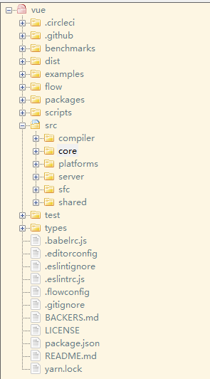

# Vue 源码解析

## 准备工作

### Flow

[Flow](https://flow.org/en/docs/getting-started/) 是 facebook 出品的 JavaScript 静态类型检查工具。  

Vue.js 的源码利用了 Flow 做了静态类型检查，所以了解 Flow 有助于我们阅读源码。

#### 为什么使用 Flow

JavaScript 是动态类型语言，它的灵活性有目共睹，但是过于灵活的副作用是很容易就写出非常隐蔽的隐患代码，在编译期甚至看上去都不会报错，但在运行阶段就可能出现各种奇怪的 bug。

类型检查是当前动态类型语言的发展趋势，所谓类型检查，就是在编译期尽早发现（由类型错误引起的）bug，又不影响代码运行（不需要运行时动态检查类型），使编写 JavaScript 具有和编写 Java 等强类型语言相近的体验。

项目越复杂就越需要通过工具的手段来保证项目的维护性和增强代码的可读性。 Vue.js 在做 2.0 重构的时候，在 ES2015 的基础上，除了 ESLint 保证代码风格之外，也引入了 Flow 做静态类型检查。之所以选择 Flow，主要是因为 Babel 和 ESLint 都有对应的 Flow 插件以支持语法，可以完全沿用现有的构建配置，非常小成本的改动就可以拥有静态类型检查的能力。

#### Flow 的工作方式

通常类型检查分成 2 种方式：

* **类型推断**：通过变量的使用上下文来推断出变量类型，然后根据这些推断来检查类型。
* **类型注释**：事先注释好我们期待的类型，Flow 会基于这些注释来判断。

**安装 Flow**

```js
npm i flow-bin -g
```

**初始化 Flow**

```js
flow init
```

**类型判断**

它不需要任何代码修改即可进行类型检查，最小化开发者的工作量。它不会强制你改变开发习惯，因为它会自动推断出变量的类型。  

这就是所谓的类型推断，Flow 最重要的特性之一。

通过一个简单例子说明一下：

```js
// @flow

function split (str) {
  return str.split(' ')
}

split(11);
```

Flow 检查上述代码后会报错，因为函数 split 期待的参数是字符串，而我们输入了数字。

**类型注释**

如上所述，类型推断是 Flow 最有用的特性之一，不需要编写类型注释就能获取有用的反馈。但在某些特定的场景下，添加类型注释可以提供更好更明确的检查依据。

考虑如下代码：

```js
// @flow

function add (x, y) {
  return x + y
}

add('Hello', 11);
```

Flow 检查上述代码时检查不出任何错误，因为从语法层面考虑， + 即可以用在字符串上，也可以用在数字上，我们并没有明确指出 add() 的参数必须为数字。

在这种情况下，我们可以借助类型注释来指明期望的类型。类型注释是以冒号 : 开头，可以在函数参数，返回值，变量声明中使用。

如果我们在上段代码中添加类型注释，就会变成如下：

```js
// @flow

function add (x: number, y: number): number {
  return x + y
}

add('Hello', 11);
```

现在 Flow 就能检查出错误，因为函数参数的期待类型为数字，而我们提供了字符串。

上面的例子是针对函数的类型注释。接下来我们来看看 Flow 能支持的一些常见的类型注释。

#### Flow 类型

**数组**

```js
// @flow

var arr: Array<number> = [1, 2, 3];

arr.push('Hello');
```

数组类型注释的格式是 `Array<T>`，T 表示数组中每项的数据类型。在上述代码中，arr 是每项均为数字的数组。  

如果我们给这个数组添加了一个字符串，Flow 能检查出错误。

**类和对象**

```js
// @flow

class Bar {
  x: string;           // x 是字符串
  y: string | number;  // y 可以是字符串或者数字
  z: boolean;

  constructor (x: string, y: string | number) {
    this.x = x;
    this.y = y;
    this.z = false;
  }
}

var bar: Bar = new Bar('hello', 4);
```

```js
// @flow

var obj: { a: string, b: number, c: Array<string>, d: Bar } = {
  a: 'hello',
  b: 11,
  c: ['hello', 'world'],
  d: new Bar('hello', 3)
}
```

类的类型注释格式如上，可以对类自身的属性做类型检查，也可以对构造函数的参数做类型检查。  

这里需要注意的是，属性 y 的类型中间用 | 做间隔，表示 y 的类型即可以是字符串也可以是数字。

对象的注释类型类似于类，需要指定对象属性的类型。

**Null**

想任意类型 T 可以为 null 或者 undefined，只需类似如下写成 ?T 的格式即可。

若想任意类型 T 可以为 null 或者 undefined，只需类似如下写成 ?T 的格式即可。

```js
// @flow

var foo: ?string = null;
```

此时，foo 可以为字符串，也可以为 null。

目前我们只列举了 Flow 的一些常见的类型注释。如果想了解所有类型注释，请移步 Flow 的[官方文档](https://flow.org/en/docs/types/)。

#### Flow 在 Vue 源码中的应用

有时候我们想引用第三方库，或者自定义一些类型，但 Flow 并不认识，因此检查的时候会报错。为了解决这类问题，Flow 提出了一个 libdef 的概念，可以用来识别这些第三方库或者是自定义类型，而 Vue.js 也利用了这一特性。

在 Vue.js 的主目录下有 .flowconfig 文件， 它是 Flow 的配置文件，感兴趣的同学可以看[官方文档](https://flow.org/en/docs/config/)。这其中的 [libs] 部分用来描述包含指定库定义的目录，默认是名为 flow-typed 的目录。

这里 [libs] 配置的是 flow，表示指定的库定义都在 flow 文件夹内。我们打开这个目录，会发现文件如下：

vue.js 配置如下：

```js
[ignore]
.*/node_modules/.*
.*/test/.*
.*/scripts/.*
.*/examples/.*
.*/benchmarks/.*

[include]

[libs]
flow

[options]
unsafe.enable_getters_and_setters=true
module.name_mapper='^compiler/\(.*\)$' -> '<PROJECT_ROOT>/src/compiler/\1'
module.name_mapper='^core/\(.*\)$' -> '<PROJECT_ROOT>/src/core/\1'
module.name_mapper='^shared/\(.*\)$' -> '<PROJECT_ROOT>/src/shared/\1'
module.name_mapper='^web/\(.*\)$' -> '<PROJECT_ROOT>/src/platforms/web/\1'
module.name_mapper='^weex/\(.*\)$' -> '<PROJECT_ROOT>/src/platforms/weex/\1'
module.name_mapper='^server/\(.*\)$' -> '<PROJECT_ROOT>/src/server/\1'
module.name_mapper='^entries/\(.*\)$' -> '<PROJECT_ROOT>/src/entries/\1'
module.name_mapper='^sfc/\(.*\)$' -> '<PROJECT_ROOT>/src/sfc/\1'
suppress_comment= \\(.\\|\n\\)*\\$flow-disable-line
```

flow 目录

* compiler.js        编译相关
* component.js   组件数据结构
* global-api.js      Global API 结构
* modules.js        第三方库定义
* options.js          选项相关
* ssr.js 	             服务端渲染相关
* vnode.js            虚拟 node 相关

可以看到，Vue.js 有很多自定义类型的定义，在阅读源码的时候，如果遇到某个类型并想了解它完整的数据结构的时候，可以回来翻阅这些数据结构的定义。

#### 总结

通过对 Flow 的认识，有助于我们阅读 Vue 的源码，并且这种静态类型检查的方式非常有利于大型项目源码的开发和维护。  

类似 Flow 的工具还有如 TypeScript，感兴趣的同学也可以自行去了解一下。

### Vue 源码目录设计

<div align="left" >  </div>

Vue.js 的源码都在 src 目录下，其目录结构如下。

* compiler  编译相关

  compiler 目录包含 Vue.js 所有编译相关的代码。它包括把模板解析成 ast 语法树，ast 语法树优化，代码生成等功能。

  编译的工作可以在构建时做（借助 webpack、vue-loader 等辅助插件）；也可以在运行时做，使用包含构建功能的 Vue.js。  

  显然，编译是一项耗性能的工作，所以更推荐前者——离线编译。

* core  核心代码 

  core 目录包含了 Vue.js 的核心代码，包括内置组件、全局 API 封装，Vue 实例化、观察者、虚拟 DOM、工具函数等等。

  这里的代码可谓是 Vue.js 的灵魂，也是我们之后需要重点分析的地方。

* platforms  不同平台的支持

  Vue.js 是一个跨平台的 MVVM 框架，它可以跑在 web 上，也可以配合 weex 跑在 natvie 客户端上。 

  platform 是 Vue.js 的入口，2 个目录代表 2 个主要入口，分别打包成运行在 web 上和 weex 上的 Vue.js。

  我们会重点分析 web 入口打包后的 Vue.js，对于 weex 入口打包的 Vue.js，感兴趣的同学可以自行研究。

* server  服务端渲染

  Vue.js 2.0 支持了服务端渲染，所有服务端渲染相关的逻辑都在这个目录下。注意：这部分代码是跑在服务端的 Node.js，不要和跑在浏览器端的 Vue.js 混为一谈。

  服务端渲染主要的工作是把组件渲染为服务器端的 HTML 字符串，将它们直接发送到浏览器，最后将静态标记"混合"为客户端上完全交互的应用程序。

* sfc  .vue 文件解析

  通常我们开发 Vue.js 都会借助 webpack 构建， 然后通过 .vue 单文件的编写组件。

  这个目录下的代码逻辑会把 .vue 文件内容解析成一个 JavaScript 的对象。

* shared  共享代码

  Vue.js 会定义一些工具方法，这里定义的工具方法都是会被浏览器端的 Vue.js 和服务端的 Vue.js 所共享的。

**总结**

从 Vue.js 的目录设计可以看到，作者把功能模块拆分的非常清楚，相关的逻辑放在一个独立的目录下维护，并且把复用的代码也抽成一个独立目录。这样的目录设计让代码的阅读性和可维护性都变强，是非常值得学习和推敲的。

### Vue.js 源码构建

Vue.js 源码是基于 [Rollup](https://github.com/rollup/rollup) 构建的，它的构建相关配置都在 scripts 目录下。

Rollup 和 Webpack 都是构建工具，Webpack 更强大一些，会把 图片，JS 等静态资源通通编译成 JavaScript。  

Rollup 更适合 JavaScript 库的编译，只处理 JS 部分，不处理其他资源。相对于 Webpack 更轻量，编译出的代码也更友好。

#### 构建脚本

通常一个基于 NPM 托管的项目都会有一个 package.json 文件，它是对项目的描述文件，它的内容实际上是一个标准的 JSON 对象。

```js
{
"name": "vue",
"version": "2.6.12",
"description": "Reactive, component-oriented view layer for modern web interfaces.",
"main": "dist/vue.runtime.common.js",
"module": "dist/vue.runtime.esm.js",
"unpkg": "dist/vue.js",
"jsdelivr": "dist/vue.js",
"typings": "types/index.d.ts",
"files": [
	"src",
	"dist/*.js",
	"types/*.d.ts"
],
  "sideEffects": false,
  "scripts": {
    "dev": "rollup -w -c scripts/config.js --environment TARGET:web-full-dev",
    "dev:cjs": "rollup -w -c scripts/config.js --environment TARGET:web-runtime-cjs-dev",
    "dev:esm": "rollup -w -c scripts/config.js --environment TARGET:web-runtime-esm",
    "dev:test": "karma start test/unit/karma.dev.config.js",
    "dev:ssr": "rollup -w -c scripts/config.js --environment TARGET:web-server-renderer",
    "dev:compiler": "rollup -w -c scripts/config.js --environment TARGET:web-compiler ",
    "dev:weex": "rollup -w -c scripts/config.js --environment TARGET:weex-framework",
    "dev:weex:factory": "rollup -w -c scripts/config.js --environment TARGET:weex-factory",
    "dev:weex:compiler": "rollup -w -c scripts/config.js --environment TARGET:weex-compiler ",
    "build": "node scripts/build.js",
    "build:ssr": "npm run build -- web-runtime-cjs,web-server-renderer",
    "build:weex": "npm run build -- weex",
    "test": "npm run lint && flow check && npm run test:types && npm run test:cover && npm run test:e2e -- --env phantomjs && npm run test:ssr && npm run test:weex",
    "test:unit": "karma start test/unit/karma.unit.config.js",
    "test:cover": "karma start test/unit/karma.cover.config.js",
    "test:e2e": "npm run build -- web-full-prod,web-server-basic-renderer && node test/e2e/runner.js",
    "test:weex": "npm run build:weex && jasmine JASMINE_CONFIG_PATH=test/weex/jasmine.js",
    "test:ssr": "npm run build:ssr && jasmine JASMINE_CONFIG_PATH=test/ssr/jasmine.js",
    "test:sauce": "npm run sauce -- 0 && npm run sauce -- 1 && npm run sauce -- 2",
    "test:types": "tsc -p ./types/test/tsconfig.json",
    "lint": "eslint src scripts test",
    "flow": "flow check",
    "sauce": "karma start test/unit/karma.sauce.config.js",
    "bench:ssr": "npm run build:ssr && node benchmarks/ssr/renderToString.js && node benchmarks/ssr/renderToStream.js",
    "release": "bash scripts/release.sh",
    "release:weex": "bash scripts/release-weex.sh",
    "release:note": "node scripts/gen-release-note.js",
    "commit": "git-cz"
  },
  "gitHooks": {
    "pre-commit": "lint-staged",
    "commit-msg": "node scripts/verify-commit-msg.js"
  },
  "lint-staged": {
    "*.js": [
      "eslint --fix",
      "git add"
    ]
  },
  "author": "Evan You",
  "license": "MIT",
  "bugs": {
    "url": "https://github.com/vuejs/vue/issues"
  },
  "homepage": "https://github.com/vuejs/vue#readme",
  "config": {
    "commitizen": {
      "path": "./node_modules/cz-conventional-changelog"
    }
  }
}
```

main 字段是 npm 包的入口，**import vue** 会通过 main 查找入口。

module 和 main 是类似的，在 webpack2 以上，会把 module 作为默认入口。


我们通常会配置 script 字段作为 NPM 的执行脚本，Vue.js 源码构建的脚本如下：

```js
"scripts": {
	"build": "node scripts/build.js",
	"build:ssr": "npm run build -- web-runtime-cjs,web-server-renderer",
	"build:weex": "npm run build -- weex",
}
```

这里总共有 3 条命令，作用都是构建 Vue.js，后面 2 条是在第一条命令的基础上，添加一些环境参数。

当在命令行运行 npm run build 的时候，实际上就会执行 node scripts/build.js，接下来我们来看看它实际是怎么构建的。

#### 构建过程

在 scripts/build.js 中：

```js
let builds = require('./config').getAllBuilds()

// filter builds via command line arg
if (process.argv[2]) {
  const filters = process.argv[2].split(',')
  builds = builds.filter(b => {
    return filters.some(f => b.output.file.indexOf(f) > -1 || b._name.indexOf(f) > -1)
  })
} else {
  // filter out weex builds by default
  builds = builds.filter(b => {
    return b.output.file.indexOf('weex') === -1
  })
}

build(builds)
```

这段代码逻辑非常简单，先从配置文件读取配置，再通过命令行参数对构建配置做过滤，这样就可以构建出不同用途的 Vue.js 。

在 scripts/config.js 中：

```js
const builds = {
  // Runtime only (CommonJS). Used by bundlers e.g. Webpack & Browserify
  'web-runtime-cjs-dev': {
    entry: resolve('web/entry-runtime.js'),
    dest: resolve('dist/vue.runtime.common.dev.js'),
    format: 'cjs',
    env: 'development',
    banner
  },
  'web-runtime-cjs-prod': {
    entry: resolve('web/entry-runtime.js'),
    dest: resolve('dist/vue.runtime.common.prod.js'),
    format: 'cjs',
    env: 'production',
    banner
  },
  // Runtime+compiler CommonJS build (CommonJS)
  'web-full-cjs-dev': {
    entry: resolve('web/entry-runtime-with-compiler.js'),
    dest: resolve('dist/vue.common.dev.js'),
    format: 'cjs',
    env: 'development',
    alias: { he: './entity-decoder' },
    banner
  },
  'web-full-cjs-prod': {
    entry: resolve('web/entry-runtime-with-compiler.js'),
    dest: resolve('dist/vue.common.prod.js'),
    format: 'cjs',
    env: 'production',
    alias: { he: './entity-decoder' },
    banner
  },
  // Runtime only ES modules build (for bundlers)
  'web-runtime-esm': {
    entry: resolve('web/entry-runtime.js'),
    dest: resolve('dist/vue.runtime.esm.js'),
    format: 'es',
    banner
  },
  // Runtime+compiler ES modules build (for bundlers)
  'web-full-esm': {
    entry: resolve('web/entry-runtime-with-compiler.js'),
    dest: resolve('dist/vue.esm.js'),
    format: 'es',
    alias: { he: './entity-decoder' },
    banner
  },
  // Runtime+compiler ES modules build (for direct import in browser)
  'web-full-esm-browser-dev': {
    entry: resolve('web/entry-runtime-with-compiler.js'),
    dest: resolve('dist/vue.esm.browser.js'),
    format: 'es',
    transpile: false,
    env: 'development',
    alias: { he: './entity-decoder' },
    banner
  },
  // Runtime+compiler ES modules build (for direct import in browser)
  'web-full-esm-browser-prod': {
    entry: resolve('web/entry-runtime-with-compiler.js'),
    dest: resolve('dist/vue.esm.browser.min.js'),
    format: 'es',
    transpile: false,
    env: 'production',
    alias: { he: './entity-decoder' },
    banner
  },
  // runtime-only build (Browser)
  'web-runtime-dev': {
    entry: resolve('web/entry-runtime.js'),
    dest: resolve('dist/vue.runtime.js'),
    format: 'umd',
    env: 'development',
    banner
  },
  // runtime-only production build (Browser)
  'web-runtime-prod': {
    entry: resolve('web/entry-runtime.js'),
    dest: resolve('dist/vue.runtime.min.js'),
    format: 'umd',
    env: 'production',
    banner
  },
  // Runtime+compiler development build (Browser)
  'web-full-dev': {
    entry: resolve('web/entry-runtime-with-compiler.js'),
    dest: resolve('dist/vue.js'),
    format: 'umd',
    env: 'development',
    alias: { he: './entity-decoder' },
    banner
  },
  // Runtime+compiler production build  (Browser)
  'web-full-prod': {
    entry: resolve('web/entry-runtime-with-compiler.js'),
    dest: resolve('dist/vue.min.js'),
    format: 'umd',
    env: 'production',
    alias: { he: './entity-decoder' },
    banner
  },
  // ...
}
```

这里列举了一些 Vue.js 构建的配置，关于还有一些服务端渲染 webpack 插件以及 weex 的打包配置就不列举了。

对于单个配置，它是遵循 Rollup 的构建规则的。其中 entry 属性表示构建的入口 JS 文件地址，dest 属性表示构建后的 JS 文件地址。format 属性表示构建的格式，cjs 表示构建出来的文件遵循 [CommonJS](http://wiki.commonjs.org/wiki/Modules/1.1) 规范，es 表示构建出来的文件遵循 [ES Module](http://exploringjs.com/es6/ch_modules.html) 规范。 umd 表示构建出来的文件遵循 [UMD](https://github.com/umdjs/umd) 规范。

以 web-runtime-cjs 配置为例，它的 entry 是 resolve('web/entry-runtime.js')，先来看一下 resolve 函数的定义。

```js
const resolve = p => {
  const base = p.split('/')[0]
  if (aliases[base]) {
    return path.resolve(aliases[base], p.slice(base.length + 1))
  } else {
    return path.resolve(__dirname, '../', p)
  }
}
```

这里的 resolve 函数实现非常简单，它先把 resolve 函数传入的参数 p 通过 / 做了分割成数组，然后取数组第一个元素设置为 base。在我们这个例子中，参数 p 是 web/entry-runtime.js，那么 base 则为 web。base 并不是实际的路径，它的真实路径借助了别名的配置，我们来看一下别名配置的代码，在 scripts/alias 中：

```js
const path = require('path')

const resolve = p => path.resolve(__dirname, '../', p)

module.exports = {
  vue: resolve('src/platforms/web/entry-runtime-with-compiler'),
  compiler: resolve('src/compiler'),
  core: resolve('src/core'),
  shared: resolve('src/shared'),
  web: resolve('src/platforms/web'),
  weex: resolve('src/platforms/weex'),
  server: resolve('src/server'),
  sfc: resolve('src/sfc')
}
```

很显然，这里 web 对应的真实的路径是 path.resolve(__dirname, '../src/platforms/web')，这个路径就找到了 Vue.js 源码的 web 目录。然后 resolve 函数通过 path.resolve(aliases[base], p.slice(base.length + 1)) 找到了最终路径，它就是 Vue.js 源码 web 目录下的 entry-runtime.js。因此，web-runtime-cjs 配置对应的入口文件就找到了。

它经过 Rollup 的构建打包后，最终会在 dist 目录下生成 vue.runtime.common.js。

#### Runtime Only VS Runtime+Compiler

通常我们利用 vue-cli 去初始化我们的 Vue.js 项目的时候会询问我们用 Runtime Only 版本的还是 Runtime+Compiler 版本。  

下面我们来对比这两个版本。

* Runtime Only

  我们在使用 Runtime Only 版本的 Vue.js 的时候，通常需要借助如 webpack 的 vue-loader 工具把 .vue 文件编译成 JavaScript，因为是在编译阶段做的，所以它只包含运行时的 Vue.js 代码，因此代码体积也会更轻量。

* Runtime+Compiler

  我们如果没有对代码做预编译，但又使用了 Vue 的 template 属性并传入一个字符串，则需要在客户端编译模板，如下所示：

  ```js
  // 需要编译器的版本
  new Vue({
    template: '<div>{{ hi }}</div>'
  });
  
  // 这种情况不需要
  new Vue({
    render (h) {
      return h('div', this.hi)
    }
  });
  ```

因为在 Vue.js 2.0 中，最终渲染都是通过 render 函数，如果写 template 属性，则需要编译成 render 函数，那么这个编译过程会发生运行时，所以需要带有编译器的版本。很显然，这个编译过程对性能会有一定损耗，所以通常我们更推荐使用 Runtime-Only 的 Vue.js。

#### 总结

通过这一节的分析，我们可以了解到 Vue.js 的构建打包过程，也知道了不同作用和功能的 Vue.js 它们对应的入口以及最终编译生成的 JS 文件。尽管在实际开发过程中我们会用 Runtime Only 版本开发比较多，但为了分析 Vue 的编译过程，我们这门课重点分析的源码是 Runtime+Compiler 的 Vue.js。

### 从入口开始

我们之前提到过 Vue.js 构建过程，在 web 应用下，我们来分析 Runtime + Compiler 构建出来的 Vue.js，它的入口是 src/platforms/web/entry-runtime-with-compiler.js：

```js
/* @flow */

import config from 'core/config'
import { warn, cached } from 'core/util/index'
import { mark, measure } from 'core/util/perf'

import Vue from './runtime/index'
import { query } from './util/index'
import { compileToFunctions } from './compiler/index'
import { shouldDecodeNewlines, shouldDecodeNewlinesForHref } from './util/compat'

const idToTemplate = cached(id => {
  const el = query(id)
  return el && el.innerHTML
})

const mount = Vue.prototype.$mount
Vue.prototype.$mount = function (
  el?: string | Element,
  hydrating?: boolean
): Component {
  el = el && query(el)

  /* istanbul ignore if */
  if (el === document.body || el === document.documentElement) {
    process.env.NODE_ENV !== 'production' && warn(
      `Do not mount Vue to <html> or <body> - mount to normal elements instead.`
    )
    return this
  }

  const options = this.$options
  // resolve template/el and convert to render function
  if (!options.render) {
    let template = options.template
    if (template) {
      if (typeof template === 'string') {
        if (template.charAt(0) === '#') {
          template = idToTemplate(template)
          /* istanbul ignore if */
          if (process.env.NODE_ENV !== 'production' && !template) {
            warn(
              `Template element not found or is empty: ${options.template}`,
              this
            )
          }
        }
      } else if (template.nodeType) {
        template = template.innerHTML
      } else {
        if (process.env.NODE_ENV !== 'production') {
          warn('invalid template option:' + template, this)
        }
        return this
      }
    } else if (el) {
      template = getOuterHTML(el)
    }
    if (template) {
      /* istanbul ignore if */
      if (process.env.NODE_ENV !== 'production' && config.performance && mark) {
        mark('compile')
      }

      const { render, staticRenderFns } = compileToFunctions(template, {
        outputSourceRange: process.env.NODE_ENV !== 'production',
        shouldDecodeNewlines,
        shouldDecodeNewlinesForHref,
        delimiters: options.delimiters,
        comments: options.comments
      }, this)
      options.render = render
      options.staticRenderFns = staticRenderFns

      /* istanbul ignore if */
      if (process.env.NODE_ENV !== 'production' && config.performance && mark) {
        mark('compile end')
        measure(`vue ${this._name} compile`, 'compile', 'compile end')
      }
    }
  }
  return mount.call(this, el, hydrating)
}

/**
 * Get outerHTML of elements, taking care
 * of SVG elements in IE as well.
 */
function getOuterHTML (el: Element): string {
  if (el.outerHTML) {
    return el.outerHTML
  } else {
    const container = document.createElement('div')
    container.appendChild(el.cloneNode(true))
    return container.innerHTML
  }
}

Vue.compile = compileToFunctions

export default Vue
```

那么，当我们的代码执行 import Vue from 'vue' 的时候，就是从这个入口执行代码来初始化 Vue，
那么 Vue 到底是什么，它是怎么初始化的，我们来一探究竟。

#### Vue 的入口

在这个入口 JS 的上方我们可以找到 Vue 的来源：import Vue from './runtime/index'，我们先来看一下这块儿的实现，它定义在 src/platforms/web/runtime/index.js 中：

```js
/* @flow */

import Vue from 'core/index'
import config from 'core/config'
import { extend, noop } from 'shared/util'
import { mountComponent } from 'core/instance/lifecycle'
import { devtools, inBrowser } from 'core/util/index'

import {
  query,
  mustUseProp,
  isReservedTag,
  isReservedAttr,
  getTagNamespace,
  isUnknownElement
} from 'web/util/index'

import { patch } from './patch'
import platformDirectives from './directives/index'
import platformComponents from './components/index'

// install platform specific utils
Vue.config.mustUseProp = mustUseProp
Vue.config.isReservedTag = isReservedTag
Vue.config.isReservedAttr = isReservedAttr
Vue.config.getTagNamespace = getTagNamespace
Vue.config.isUnknownElement = isUnknownElement

// install platform runtime directives & components
extend(Vue.options.directives, platformDirectives)
extend(Vue.options.components, platformComponents)

// install platform patch function
Vue.prototype.__patch__ = inBrowser ? patch : noop

// public mount method
Vue.prototype.$mount = function (
  el?: string | Element,
  hydrating?: boolean
): Component {
  el = el && inBrowser ? query(el) : undefined
  return mountComponent(this, el, hydrating)
}
// ...
```

这里关键的代码是 import Vue from 'core/index'，之后的逻辑都是对 Vue 这个对象做一些扩展，可以先不用看，我们来看一下真正初始化 Vue 的地方，在 src/core/index.js 中：

```js
import Vue from './instance/index'
import { initGlobalAPI } from './global-api/index'
import { isServerRendering } from 'core/util/env'
import { FunctionalRenderContext } from 'core/vdom/create-functional-component'

initGlobalAPI(Vue)

Object.defineProperty(Vue.prototype, '$isServer', {
  get: isServerRendering
})

Object.defineProperty(Vue.prototype, '$ssrContext', {
  get () {
    /* istanbul ignore next */
    return this.$vnode && this.$vnode.ssrContext
  }
})

// expose FunctionalRenderContext for ssr runtime helper installation
Object.defineProperty(Vue, 'FunctionalRenderContext', {
  value: FunctionalRenderContext
})

Vue.version = '__VERSION__'

export default Vue
```

这里有 2 处关键的代码，import Vue from './instance/index' 和 initGlobalAPI(Vue)，初始化全局 Vue API（我们稍后介绍），我们先来看第一部分，在 src/core/instance/index.js 中：

#### Vue 的定义

```js
import { initMixin } from './init'
import { stateMixin } from './state'
import { renderMixin } from './render'
import { eventsMixin } from './events'
import { lifecycleMixin } from './lifecycle'
import { warn } from '../util/index'

function Vue (options) {
  if (process.env.NODE_ENV !== 'production' &&
    !(this instanceof Vue)
  ) {
    warn('Vue is a constructor and should be called with the `new` keyword')
  }
  this._init(options)
}

initMixin(Vue)
stateMixin(Vue)
eventsMixin(Vue)
lifecycleMixin(Vue)
renderMixin(Vue)

export default Vue
```

在这里，我们终于看到了 Vue 的庐山真面目，它实际上就是一个用 Function 实现的类，我们只能通过 new Vue 去实例化它。

有些同学看到这不禁想问，为何 Vue 不用 ES6 的 Class 去实现呢？我们往后看这里有很多 xxxMixin 的函数调用，并把 Vue 当参数传入，它们的功能都是给 Vue 的 prototype 上扩展一些方法（这里具体的细节会在之后的文章介绍，这里不展开），Vue 按功能把这些扩展分散到多个模块中去实现，而不是在一个模块里实现所有，这种方式是用 Class 难以实现的。这么做的好处是非常方便代码的维护和管理，这种编程技巧也非常值得我们去学习。

#### 全局静态方法

Vue.js 在整个初始化过程中，除了给它的原型 prototype 上扩展方法，还会给 Vue 这个对象本身扩展全局的静态方法，它的定义在 src/core/global-api/index.js 中：

```js
/* @flow */

import config from '../config'
import { initUse } from './use'
import { initMixin } from './mixin'
import { initExtend } from './extend'
import { initAssetRegisters } from './assets'
import { set, del } from '../observer/index'
import { ASSET_TYPES } from 'shared/constants'
import builtInComponents from '../components/index'
import { observe } from 'core/observer/index'

import {
  warn,
  extend,
  nextTick,
  mergeOptions,
  defineReactive
} from '../util/index'

export function initGlobalAPI (Vue: GlobalAPI) {
  // config
  const configDef = {}
  configDef.get = () => config
  if (process.env.NODE_ENV !== 'production') {
    configDef.set = () => {
      warn(
        'Do not replace the Vue.config object, set individual fields instead.'
      )
    }
  }
  Object.defineProperty(Vue, 'config', configDef)

  // exposed util methods.
  // NOTE: these are not considered part of the public API - avoid relying on
  // them unless you are aware of the risk.
  Vue.util = {
    warn,
    extend,
    mergeOptions,
    defineReactive
  }

  Vue.set = set
  Vue.delete = del
  Vue.nextTick = nextTick

  // 2.6 explicit observable API
  Vue.observable = <T>(obj: T): T => {
    observe(obj)
    return obj
  }

  Vue.options = Object.create(null)
  ASSET_TYPES.forEach(type => {
    Vue.options[type + 's'] = Object.create(null)
  })

  // this is used to identify the "base" constructor to extend all plain-object
  // components with in Weex's multi-instance scenarios.
  Vue.options._base = Vue

  extend(Vue.options.components, builtInComponents)

  initUse(Vue)
  initMixin(Vue)
  initExtend(Vue)
  initAssetRegisters(Vue)
}
```

这里就是在 Vue 上扩展的一些全局方法的定义，Vue 官网中关于全局 API 都可以在这里找到，这里不会介绍细节，会在之后的章节我们具体介绍到某个 API 的时候会详细介绍。有一点要注意的是，Vue.util 暴露的方法最好不要依赖，因为它可能经常会发生变化，是不稳定的。

#### 总结

那么至此，Vue 的初始化过程基本介绍完毕。这一节的目的是让同学们对 Vue 是什么有一个直观的认识，它本质上就是一个用 Function 实现的 Class，然后它的原型 prototype 以及它本身都扩展了一系列的方法和属性，那么 Vue 能做什么，它是怎么做的，我们会在后面的章节一层层帮大家揭开 Vue 的神秘面纱。

## 一、数据驱动

Vue.js 一个核心思想是数据驱动。所谓数据驱动，是指视图是由数据驱动生成的，我们对视图的修改，不会直接操作 DOM，而是通过修改数据。它相比我们传统的前端开发，如使用 jQuery 等前端库直接修改 DOM，大大简化了代码量。特别是当交互复杂的时候，只关心数据的修改会让代码的逻辑变的非常清晰，因为 DOM 变成了数据的映射，我们所有的逻辑都是对数据的修改，而不用碰触 DOM，这样的代码非常利于维护。

在 Vue.js 中我们可以采用简洁的模板语法来声明式的将数据渲染为 DOM：

```js
<div id="app">
  {{ message }}
</div>

var app = new Vue({
  el: '#app',
  data: {
    message: 'Hello Vue!'
  }
});
```

最终它会在页面上渲染出 Hello Vue。接下来，我们会从源码角度来分析 Vue 是如何实现的，分析过程会以主线代码为主，重要的分支逻辑会放在之后单独分析。数据驱动还有一部分是数据更新驱动视图变化，这一块内容我们也会在之后的章节分析，**这一章我们的目标是弄清楚模板和数据如何渲染成最终的 DOM**。

### new Vue 发生了什么

#### Vue 初始化 

从入口代码开始分析，我们先来分析 new Vue 背后发生了哪些事情。我们都知道，new 关键字在 Javascript 语言中代表实例化是一个对象，而 Vue 实际上是一个类，类在 Javascript 中是用 Function 来实现的，来看一下源码，在src/core/instance/index.js 中。

```js
function Vue (options) {
  if (process.env.NODE_ENV !== 'production' &&
    !(this instanceof Vue)
  ) {
    warn('Vue is a constructor and should be called with the `new` keyword')
  }
  this._init(options)
}
```

可以看到 Vue 只能通过 new 关键字初始化，然后会调用 this._init 方法， 该方法在 src/core/instance/init.js 中定义。

```js
Vue.prototype._init = function (options?: Object) {
	const vm: Component = this
	// a uid
	vm._uid = uid++

	let startTag, endTag
	/* istanbul ignore if */
	if (process.env.NODE_ENV !== 'production' && config.performance && mark) {
		startTag = `vue-perf-start:${vm._uid}`
		endTag = `vue-perf-end:${vm._uid}`
		mark(startTag)
	}

	// a flag to avoid this being observed
	vm._isVue = true
	// merge options
	if (options && options._isComponent) {
		// optimize internal component instantiation
		// since dynamic options merging is pretty slow, and none of the
		// internal component options needs special treatment.
		initInternalComponent(vm, options)
	} else {
		vm.$options = mergeOptions(
			resolveConstructorOptions(vm.constructor),
			options || {},
			vm
		)
	}
	/* istanbul ignore else */
	if (process.env.NODE_ENV !== 'production') {
		initProxy(vm)
	} else {
		vm._renderProxy = vm
	}
	// expose real self
	vm._self = vm
	initLifecycle(vm)
	initEvents(vm)
	initRender(vm)
	callHook(vm, 'beforeCreate')
	initInjections(vm) // resolve injections before data/props
	initState(vm)
	initProvide(vm) // resolve provide after data/props
	callHook(vm, 'created')

	/* istanbul ignore if */
	if (process.env.NODE_ENV !== 'production' && config.performance && mark) {
		vm._name = formatComponentName(vm, false)
		mark(endTag)
		measure(`vue ${vm._name} init`, startTag, endTag)
	}

	if (vm.$options.el) {
        // $mount 挂载
		vm.$mount(vm.$options.el)
	}
}
```

Vue 初始化主要就干了几件事情，合并配置，初始化生命周期，初始化事件中心，初始化渲染，初始化 data、props、computed、watcher 等等。

#### Data 初始化

数据初始化发生在 initState 方法中。该方法在 src/core/instance/statejs 中定义。

##### initState

```js
export function initState (vm: Component) {
  vm._watchers = []
  const opts = vm.$options
  if (opts.props) initProps(vm, opts.props)
  if (opts.methods) initMethods(vm, opts.methods)
  if (opts.data) {
    initData(vm)
  } else {
    observe(vm._data = {}, true /* asRootData */)
  }
  if (opts.computed) initComputed(vm, opts.computed)
  if (opts.watch && opts.watch !== nativeWatch) {
    initWatch(vm, opts.watch)
  }
}
```

initState 方法，用来初始化 data、props、computed、watcher 等等。

##### initData

```js
function initData (vm: Component) {
  let data = vm.$options.data
  // 获取数据赋值给 data 和 vm._data
  data = vm._data = typeof data === 'function'
    ? getData(data, vm)
    : data || {}
  if (!isPlainObject(data)) {
    data = {}
    process.env.NODE_ENV !== 'production' && warn(
      'data functions should return an object:\n' +
      'https://vuejs.org/v2/guide/components.html#data-Must-Be-a-Function',
      vm
    )
  }
  // proxy data on instance
  const keys = Object.keys(data)
  const props = vm.$options.props
  const methods = vm.$options.methods
  // 如果 data 中定义过某项值，在 methods 和 props 中就不能使用，否则会报出警告
  let i = keys.length
  while (i--) {
    const key = keys[i]
    if (process.env.NODE_ENV !== 'production') {
      if (methods && hasOwn(methods, key)) {
        warn(
          `Method "${key}" has already been defined as a data property.`,
          vm
        )
      }
    }
    if (props && hasOwn(props, key)) {
      process.env.NODE_ENV !== 'production' && warn(
        `The data property "${key}" is already declared as a prop. ` +
        `Use prop default value instead.`,
        vm
      )
    } else if (!isReserved(key)) {
      // 数据代理
      proxy(vm, `_data`, key)
    }
  }
  // observe data 
  // 响应式处理
  observe(data, true /* asRootData */)
}
```

##### proxy

```js
const sharedPropertyDefinition = {
  enumerable: true,
  configurable: true,
  get: noop,
  set: noop
}

export function proxy (target: Object, sourceKey: string, key: string) {
  sharedPropertyDefinition.get = function proxyGetter () {
    return this[sourceKey][key]
  }
  sharedPropertyDefinition.set = function proxySetter (val) {
    this[sourceKey][key] = val
  }
  Object.defineProperty(target, key, sharedPropertyDefinition)
}
```

```js
vm.key => vm[source][key] // 数据代理
vm.key => vm['_data'][key] // 数据代理
```

虽然使用 vm._data 也能访问到属性，不推荐使用，``__[property] `` 在编程界意味着私有属性，不可访问。

#### 总结

Vue 的初始化逻辑写的非常清楚，把不同的功能逻辑拆成一些单独的函数执行，让主线逻辑一目了然，这样的编程思想是非常值得借鉴和学习的。

由于我们这一章的目标是弄清楚模板和数据如何渲染成最终的 DOM，所以各种初始化逻辑我们先不看。在初始化的最后，检测到如果有 el 属性，则调用 vm.$mount 方法挂载 vm，挂载的目标就是把模板渲染成最终的 DOM，那么接下来我们来分析 Vue 的挂载过程。

### Vue 实例挂载的实现

#### 重写 $mount 方法

Vue 中我们是通过 **$mount** 实例⽅法去挂载 vm 的， **$mount** ⽅法在多个⽂件中都有定义，如 

src/platform/web/entry-runtime-with- compiler.js 、 src/platform/web/runtime/index.js 、 src/platform/weex/runtime/index.js 。

因为 **$mount** 这个⽅法的实现是和平台、构建⽅式都相关的。接下来我们重点分析带 compiler 版本的 **$monu**t 实现，因为抛开 webpack 的 vue-loader，我们在纯前端浏览器环境分析 Vue 的⼯作原 理，有助于我们对原理理解的深⼊。

compiler 版本的 $monut 实现⾮常有意思，先来看⼀下 src/platform/web/entry-runtime- with-compiler.js ⽂件中定义： 

```js
const mount = Vue.prototype.$mount
Vue.prototype.$mount = function (
  el?: string | Element,
  hydrating?: boolean
): Component {
  el = el && query(el)

  /* istanbul ignore if */
  // vue 不可以挂载到 body 和 documentElement 元素上
  if (el === document.body || el === document.documentElement) {
    process.env.NODE_ENV !== 'production' && warn(
      `Do not mount Vue to <html> or <body> - mount to normal elements instead.`
    )
    return this
  }

  const options = this.$options
  // resolve template/el and convert to render function
  if (!options.render) {
    let template = options.template
    if (template) {
      if (typeof template === 'string') {
        if (template.charAt(0) === '#') {
          template = idToTemplate(template)
          /* istanbul ignore if */
          if (process.env.NODE_ENV !== 'production' && !template) {
            warn(
              `Template element not found or is empty: ${options.template}`,
              this
            )
          }
        }
      } else if (template.nodeType) {
        template = template.innerHTML
      } else {
        if (process.env.NODE_ENV !== 'production') {
          warn('invalid template option:' + template, this)
        }
        return this
      }
    } else if (el) {
      template = getOuterHTML(el)
    }
    if (template) {
      /* istanbul ignore if */
      if (process.env.NODE_ENV !== 'production' && config.performance && mark) {
        mark('compile')
      }

      const { render, staticRenderFns } = compileToFunctions(template, {
        outputSourceRange: process.env.NODE_ENV !== 'production',
        shouldDecodeNewlines,
        shouldDecodeNewlinesForHref,
        delimiters: options.delimiters,
        comments: options.comments
      }, this)
      options.render = render
      options.staticRenderFns = staticRenderFns

      /* istanbul ignore if */
      if (process.env.NODE_ENV !== 'production' && config.performance && mark) {
        mark('compile end')
        measure(`vue ${this._name} compile`, 'compile', 'compile end')
      }
    }
  }
  return mount.call(this, el, hydrating)
}
```

这段代码⾸先缓存了原型上的 $mount ⽅法，再重新定义该⽅法，我们先来分析这段代码。⾸先，它 对 el 做了限制，Vue 不能挂载在 body 、 html 这样的根节点上。接下来的是很关键的逻辑 。

如果没有定义 render ⽅法，则会把 el 或者 template 字符串转换成 render ⽅法。这⾥我们 要牢记，在 Vue 2.0 版本中，所有 Vue 的组件的渲染最终都需要 render ⽅法，⽆论我们是⽤单⽂件 .vue ⽅式开发组件，还是写了 el 或者 template 属性，最终都会转换成 render ⽅法，那么这个 过程是 Vue 的⼀个“在线编译”的过程，它是调⽤ compileToFunctions ⽅法实现的，编译过程我们之后会介绍。

最后，调⽤原先原型上的 **$mount** ⽅法挂载。 原先原型上的 **$mount** ⽅法在 src/platform/web/runtime/index.js 中定义，之所以这么设计完 全是为了复⽤，因为它是可以被 runtime only 版本的 Vue 直接使⽤的。

##### query

````js
/**
 * Query an element selector if it's not an element already.
 */
export function query (el: string | Element): Element {
  if (typeof el === 'string') {
    const selected = document.querySelector(el)
    if (!selected) {
      process.env.NODE_ENV !== 'production' && warn(
        'Cannot find element: ' + el
      )
      return document.createElement('div')
    }
    return selected
  } else {
    return el
  }
}
````

调用 document.querySelector 方法获取页面元素。如果不存在元素，创建 div 元素返回。

##### getOutHtml

```js
/**
 * Get outerHTML of elements, taking care
 * of SVG elements in IE as well.
 */
function getOuterHTML (el: Element): string {
  if (el.outerHTML) {
    return el.outerHTML
  } else {
    const container = document.createElement('div')
    container.appendChild(el.cloneNode(true))
    return container.innerHTML
  }
}
```

如果存在 outerHTML 直接返回。如果不存在，外面包裹一层 div，返回其 innerHTML。

#### 原型 $mount 方法

这个⽅法在 src/platform/web/runtime/index.js 中定义。

```js
// public mount method
Vue.prototype.$mount = function (
  el?: string | Element,
  hydrating?: boolean
): Component {
  el = el && inBrowser ? query(el) : undefined
  return mountComponent(this, el, hydrating)
}
```

$mount ⽅法⽀持传⼊ 2 个参数，第⼀个是 el ，它表⽰挂载的元素，可以是字符串，也可以是 DOM 对象，如果是字符串在浏览器环境下会调⽤ query ⽅法转换成 DOM 对象的。第⼆个参数是和 服务端渲染相关，在浏览器环境下我们不需要传第⼆个参数。 

##### mountComponent 

$mount ⽅法实际上会去调⽤ mountComponent ⽅法，这个⽅法定义在 src/core/instance/lifecycle.js ⽂件中： 

```js
export function mountComponent (
  vm: Component,
  el: ?Element,
  hydrating?: boolean
): Component {
  vm.$el = el
  // 如果不存在 render 或者 template 并没有正确转化 render 函数
  if (!vm.$options.render) {
    vm.$options.render = createEmptyVNode
    // 开发环境报警告
    if (process.env.NODE_ENV !== 'production') {
      /* istanbul ignore if */
       // 如果使用了 runtime-only 版本，但是有没有写 render 函数，写了 template
      if ((vm.$options.template && vm.$options.template.charAt(0) !== '#') ||
        vm.$options.el || el) {
        warn(
          'You are using the runtime-only build of Vue where the template ' +
          'compiler is not available. Either pre-compile the templates into ' +
          'render functions, or use the compiler-included build.',
          vm
        )
      } else {
        // 既没有 template 和 render 
        warn(
          'Failed to mount component: template or render function not defined.',
          vm
        )
      }
    }
  }
  callHook(vm, 'beforeMount')

  let updateComponent
  /* istanbul ignore if */
  if (process.env.NODE_ENV !== 'production' && config.performance && mark) {
    updateComponent = () => {
      const name = vm._name
      const id = vm._uid
      const startTag = `vue-perf-start:${id}`
      const endTag = `vue-perf-end:${id}`

      mark(startTag)
      const vnode = vm._render()
      mark(endTag)
      measure(`vue ${name} render`, startTag, endTag)

      mark(startTag)
      vm._update(vnode, hydrating)
      mark(endTag)
      measure(`vue ${name} patch`, startTag, endTag)
    }
  } else {
    // 渲染 不仅是首次渲染，更新时也会调用此方法
    updateComponent = () => {
      vm._update(vm._render(), hydrating)
    }
  }

  // we set this to vm._watcher inside the watcher's constructor
  // since the watcher's initial patch may call $forceUpdate (e.g. inside child
  // component's mounted hook), which relies on vm._watcher being already defined
  // 渲染 watcher（观察者模式）
  new Watcher(vm, updateComponent, noop, {
    before () {
      if (vm._isMounted && !vm._isDestroyed) {
        callHook(vm, 'beforeUpdate')
      }
    }
  }, true /* isRenderWatcher */)
  hydrating = false

  // manually mounted instance, call mounted on self
  // mounted is called for render-created child components in its inserted hook
  if (vm.$vnode == null) {
    vm._isMounted = true
    callHook(vm, 'mounted')
  }
  return vm
}
```

从上⾯的代码可以看到， mountComponent 核⼼就是先调⽤ vm._render ⽅法先⽣成虚拟 Node，再 实例化⼀个渲染 Watcher ，在它的回调函数中会调⽤ updateComponent ⽅法，最终调⽤  vm._update 更新 DOM。 

Watcher 在这⾥起到两个作⽤，⼀个是初始化的时候会执⾏回调函数，另⼀个是当 vm 实例中的监测 的数据发⽣变化的时候执⾏回调函数，这块⼉我们会在之后的章节中介绍。 

函数最后判断为根节点的时候设置 vm._isMounted 为 true ， 表⽰这个实例已经挂载了，同时执⾏ mounted 钩⼦函数。 这⾥注意 vm.$vnode 表⽰ Vue 实例的⽗虚拟 Node，所以它为 Null 则表⽰ 当前是根 Vue 的实例。 

##### Watcher

```js
/**
 * A watcher parses an expression, collects dependencies,
 * and fires callback when the expression value changes.
 * This is used for both the $watch() api and directives.
 */
export default class Watcher {
  vm: Component;
  expression: string;
  cb: Function;
  id: number;
  deep: boolean;
  user: boolean;
  lazy: boolean;
  sync: boolean;
  dirty: boolean;
  active: boolean;
  deps: Array<Dep>;
  newDeps: Array<Dep>;
  depIds: SimpleSet;
  newDepIds: SimpleSet;
  before: ?Function;
  getter: Function;
  value: any;

  constructor (
    vm: Component,
    expOrFn: string | Function,
    cb: Function,
    options?: ?Object,
    isRenderWatcher?: boolean
  ) {
    this.vm = vm
    // 如果是渲染 watcher， vm._watcher = this。
    if (isRenderWatcher) {
      vm._watcher = this
    }
    vm._watchers.push(this)
    // options
    // 处理 options
    if (options) {
      this.deep = !!options.deep
      this.user = !!options.user
      this.lazy = !!options.lazy
      this.sync = !!options.sync
      this.before = options.before
    } else {
      this.deep = this.user = this.lazy = this.sync = false
    }
    this.cb = cb
    this.id = ++uid // uid for batching
    this.active = true
    this.dirty = this.lazy // for lazy watchers
    this.deps = []
    this.newDeps = []
    this.depIds = new Set()
    this.newDepIds = new Set()
    this.expression = process.env.NODE_ENV !== 'production'
      ? expOrFn.toString()
      : ''
    // parse expression for getter
    // 如果 expOrFn 是 function，直接赋值给 getter。
    // 否则调用 parsePath 进行转化赋值给 getter。
    if (typeof expOrFn === 'function') {
      this.getter = expOrFn
    } else {
      this.getter = parsePath(expOrFn)
      if (!this.getter) {
        this.getter = noop
        process.env.NODE_ENV !== 'production' && warn(
          `Failed watching path: "${expOrFn}" ` +
          'Watcher only accepts simple dot-delimited paths. ' +
          'For full control, use a function instead.',
          vm
        )
      }
    }
    this.value = this.lazy
      ? undefined
      : this.get()
  }

  /**
   * Evaluate the getter, and re-collect dependencies.
   */
  get () {
    // 依赖收集相关
    pushTarget(this)
    let value
    const vm = this.vm
    try {
      // 对于首次渲染来说，getter 就是 updateComponent 。
      value = this.getter.call(vm, vm)
    } catch (e) {
      if (this.user) {
        handleError(e, vm, `getter for watcher "${this.expression}"`)
      } else {
        throw e
      }
    } finally {
      // "touch" every property so they are all tracked as
      // dependencies for deep watching
      if (this.deep) {
        traverse(value)
      }
      popTarget()
      this.cleanupDeps()
    }
    return value
  }
  // ...
}
```

#### 总结

mountComponent ⽅法的逻辑也是⾮常清晰的，它会完成整个渲染⼯作，接下来我们要重点分析其中 的细节，也就是最核⼼的 2 个⽅法： vm._render 和 vm._update 。

### vm.render

#### _render

Vue 的 _render ⽅法是实例的⼀个私有⽅法，它⽤来把实例渲染成⼀个虚拟 Node。

它的定义在 src/core/instance/render.js ⽂件中： 

```js
Vue.prototype._render = function (): VNode {
	const vm: Component = this
	const { render, _parentVnode } = vm.$options

	if (_parentVnode) {
		vm.$scopedSlots = normalizeScopedSlots(
			_parentVnode.data.scopedSlots,
			vm.$slots,
			vm.$scopedSlots
		)
	}

	// set parent vnode. this allows render functions to have access
	// to the data on the placeholder node.
	vm.$vnode = _parentVnode
	// render self
	let vnode
	try {
		// There's no need to maintain a stack because all render fns are called
		// separately from one another. Nested component's render fns are called
		// when parent component is patched.
		currentRenderingInstance = vm
        // vm._renderProxy 在生产环境下就是 vm，this 本身
        // 开发环境是一个 proxy 对象
		vnode = render.call(vm._renderProxy, vm.$createElement)
	} catch (e) {
		handleError(e, vm, `render`)
		// return error render result,
		// or previous vnode to prevent render error causing blank component
		/* istanbul ignore else */
		if (process.env.NODE_ENV !== 'production' && vm.$options.renderError) {
			try {
				vnode = vm.$options.renderError.call(vm._renderProxy, vm.$createElement, e)
			} catch (e) {
				handleError(e, vm, `renderError`)
				vnode = vm._vnode
			}
		} else {
			vnode = vm._vnode
		}
	} finally {
		currentRenderingInstance = null
	}
	// if the returned array contains only a single node, allow it
	if (Array.isArray(vnode) && vnode.length === 1) {
		vnode = vnode[0]
	}
	// return empty vnode in case the render function errored out
    // 如果 vnode 不属于 VNode
	if (!(vnode instanceof VNode)) {
        // 如果 vnode 是一个数组，说明模板存在多个根节点
		if (process.env.NODE_ENV !== 'production' && Array.isArray(vnode)) {
			warn(
				'Multiple root nodes returned from render function. Render function ' +
				'should return a single root node.',
				vm
			)
		}
		vnode = createEmptyVNode()
	}
	// set parent
	vnode.parent = _parentVnode
	return vnode
}
```

这段代码最关键的是 render ⽅法的调⽤，我们在平时的开发⼯作中⼿写 render ⽅法的场景⽐较 少，⽽写的⽐较多的是 template 模板，在之前的 mounted ⽅法的实现中，会把 template 编译 成 render ⽅法，但这个编译过程是⾮常复杂的，我们不打算在这⾥展开讲，之后会专门花⼀个章节 来分析 Vue 的编译过程。 

在 Vue 的官⽅⽂档中介绍了 render 函数的第⼀个参数是 createElement ，那么结合之前的例⼦： 

```html
<div id="app">
  {{ message }}
</div>
```

相当于我们编写如下 render 函数： 

```js
render: function (createElement) {
  return createElement('div', {
    attrs: {
      id: 'app'
    },
  }, this.message)
}
```

再回到 _render 函数中的 render ⽅法的调⽤： 

```js
vnode = render.call(vm._renderProxy, vm.$createElement)
```

可以看到， render 函数中的 createElement ⽅法就是 vm.$createElement ⽅法：

```js
export function initRender (vm: Component) {
  vm._vnode = null // the root of the child tree
  vm._staticTrees = null // v-once cached trees
  const options = vm.$options
  const parentVnode = vm.$vnode = options._parentVnode // the placeholder node in parent tree
  const renderContext = parentVnode && parentVnode.context
  vm.$slots = resolveSlots(options._renderChildren, renderContext)
  vm.$scopedSlots = emptyObject
  // bind the createElement fn to this instance
  // so that we get proper render context inside it.
  // args order: tag, data, children, normalizationType, alwaysNormalize
  // internal version is used by render functions compiled from templates
  vm._c = (a, b, c, d) => createElement(vm, a, b, c, d, false)
  // normalization is always applied for the public version, used in
  // user-written render functions.
  vm.$createElement = (a, b, c, d) => createElement(vm, a, b, c, d, true)
  // ...
}
```

实际上， **vm.$createElement** ⽅法定义是在执⾏ initRender ⽅法的时候，可以看到除了 **vm.$createElement** ⽅法，

还有⼀个 **vm._c** ⽅法，它是被模板编译成的 render 函数使⽤，⽽ **vm.$createElement** 是⽤户⼿写 render ⽅法使⽤的， 

这俩个⽅法⽀持的参数相同，并且内部都调⽤了 createElement ⽅法。 

**示例代码**

```html
<div id="app"></div>
```

```js
new Vue({
  el: '#app',
  render (createElement) {
    return createElement('div', {
      attrs: {
        id: 'app1'
      }
    }, this.message);
  },
  data () {
    return {
      message: 'Hello World'
    }
  }
})
```

手写 render 函数，不会走模板编译转换为 render 的过程，和使用 template 模板是一样的效果。

实际挂载的 #app1的元素 会把原 id 为 #app 的元素替换掉。这也是为什么不能使用 body 或者 html 作为根元素的原因。

#### _renderProxy

继续看这部分代码，在调用 render 时，还传递了 vm._renderProxy 参数。

```js
vnode = render.call(vm._renderProxy, vm.$createElement)
```

它的定义在 src/instance/init.js 文件中:

```js
 Vue.prototype._init = function (options?: Object) {
    const vm: Component = this
    // a uid
    vm._uid = uid++

    let startTag, endTag
    /* istanbul ignore if */
    if (process.env.NODE_ENV !== 'production' && config.performance && mark) {
      startTag = `vue-perf-start:${vm._uid}`
      endTag = `vue-perf-end:${vm._uid}`
      mark(startTag)
    }

    // a flag to avoid this being observed
    vm._isVue = true
    // merge options
    if (options && options._isComponent) {
      // optimize internal component instantiation
      // since dynamic options merging is pretty slow, and none of the
      // internal component options needs special treatment.
      initInternalComponent(vm, options)
    } else {
      vm.$options = mergeOptions(
        resolveConstructorOptions(vm.constructor),
        options || {},
        vm
      )
    }
    /* istanbul ignore else */
    if (process.env.NODE_ENV !== 'production') {
      initProxy(vm)
    } else {
      vm._renderProxy = vm
    }
  	// ...
  }
```

可以看到 vm._renderProxy 在生产环境下就是 vm，指向 this 本身。

在开发环境下，则调用 initProxy 方法。该方法定义在 src/instance/proxy.js 文件中:

```js
let initProxy

if (process.env.NODE_ENV !== 'production') {
  const allowedGlobals = makeMap(
    'Infinity,undefined,NaN,isFinite,isNaN,' +
    'parseFloat,parseInt,decodeURI,decodeURIComponent,encodeURI,encodeURIComponent,' +
    'Math,Number,Date,Array,Object,Boolean,String,RegExp,Map,Set,JSON,Intl,' +
    'require' // for Webpack/Browserify
  )

  const warnNonPresent = (target, key) => {
    warn(
      `Property or method "${key}" is not defined on the instance but ` +
      'referenced during render. Make sure that this property is reactive, ' +
      'either in the data option, or for class-based components, by ' +
      'initializing the property. ' +
      'See: https://vuejs.org/v2/guide/reactivity.html#Declaring-Reactive-Properties.',
      target
    )
  }

  const warnReservedPrefix = (target, key) => {
    warn(
      `Property "${key}" must be accessed with "$data.${key}" because ` +
      'properties starting with "$" or "_" are not proxied in the Vue instance to ' +
      'prevent conflicts with Vue internals. ' +
      'See: https://vuejs.org/v2/api/#data',
      target
    )
  }

  const hasProxy =
    typeof Proxy !== 'undefined' && isNative(Proxy)

  if (hasProxy) {
    const isBuiltInModifier = makeMap('stop,prevent,self,ctrl,shift,alt,meta,exact')
    config.keyCodes = new Proxy(config.keyCodes, {
      set (target, key, value) {
        if (isBuiltInModifier(key)) {
          warn(`Avoid overwriting built-in modifier in config.keyCodes: .${key}`)
          return false
        } else {
          target[key] = value
          return true
        }
      }
    })
  }

  const hasHandler = {
    has (target, key) {
      const has = key in target
      const isAllowed = allowedGlobals(key) ||
        (typeof key === 'string' && key.charAt(0) === '_' && !(key in target.$data))
      if (!has && !isAllowed) {
        if (key in target.$data) warnReservedPrefix(target, key)
        else warnNonPresent(target, key)
      }
      return has || !isAllowed
    }
  }

  const getHandler = {
    get (target, key) {
      if (typeof key === 'string' && !(key in target)) {
        if (key in target.$data) warnReservedPrefix(target, key)
        else warnNonPresent(target, key)
      }
      return target[key]
    }
  }

  initProxy = function initProxy (vm) {
    if (hasProxy) {
      // determine which proxy handler to use
      const options = vm.$options
      const handlers = options.render && options.render._withStripped
        ? getHandler
        : hasHandler
      vm._renderProxy = new Proxy(vm, handlers)
    } else {
      vm._renderProxy = vm
    }
  }
}

export { initProxy }
```

可以看到，当浏览器存在 Proxy 时，创建 Proxy 对象赋值给 vm._renderProxy。正因如此，在开发环境时，当你使用未被定义的变量时，Proxy 会优先拦截属性，如果发现属性未定义，这时控制台就会报警告。

**示例代码**

```html
<div id="app">{{ message1 }}</div>
```

```js
new Vue({
  el: '#app',
  data () {
    return {
      message: 'Hello World'
    }
  }
});
```


#### 总结

vm._render 最终是通过执⾏ createElement ⽅法并返回的是 vnode ，它是⼀个虚拟 Node。

Vue 2.0 相⽐ Vue 1.0 最⼤的升级就是利⽤了 Virtual DOM。

因此在分析 createElement 的实现前，我们 先了解⼀下 Virtual DOM 的概念。 

### Virtual DOM

Virtual DOM 这个概念相信⼤部分⼈都不会陌⽣，它产⽣的前提是浏览器中的 DOM 是很“昂贵"的，

为了更直观的感受，我们可以简单的把⼀个简单的 div 元素的属性都打印出来，如图所⽰： 


可以看到，真正的 DOM 元素是⾮常庞⼤的，因为浏览器的标准就把 DOM 设计的⾮常复杂。

当我们频繁的去做 DOM 更新，会产⽣⼀定的性能问题。 

⽽ Virtual DOM 就是⽤⼀个原⽣的 JS 对象去描述⼀个 DOM 节点，所以它⽐创建⼀个 DOM 的代价要⼩很多。

在 Vue.js 中，Virtual DOM 是⽤ VNode 这么⼀个 Class 去描述，它是定义在 src/core/vdom/vnode.js 中的。 

```js
export default class VNode {
  tag: string | void;
  data: VNodeData | void;
  children: ?Array<VNode>;
  text: string | void;
  elm: Node | void;
  ns: string | void;
  context: Component | void; // rendered in this component's scope
  key: string | number | void;
  componentOptions: VNodeComponentOptions | void;
  componentInstance: Component | void; // component instance
  parent: VNode | void; // component placeholder node

  // strictly internal
  raw: boolean; // contains raw HTML? (server only)
  isStatic: boolean; // hoisted static node
  isRootInsert: boolean; // necessary for enter transition check
  isComment: boolean; // empty comment placeholder?
  isCloned: boolean; // is a cloned node?
  isOnce: boolean; // is a v-once node?
  asyncFactory: Function | void; // async component factory function
  asyncMeta: Object | void;
  isAsyncPlaceholder: boolean;
  ssrContext: Object | void;
  fnContext: Component | void; // real context vm for functional nodes
  fnOptions: ?ComponentOptions; // for SSR caching
  devtoolsMeta: ?Object; // used to store functional render context for devtools
  fnScopeId: ?string; // functional scope id support

  constructor (
    tag?: string,
    data?: VNodeData,
    children?: ?Array<VNode>,
    text?: string,
    elm?: Node,
    context?: Component,
    componentOptions?: VNodeComponentOptions,
    asyncFactory?: Function
  ) {
    this.tag = tag
    this.data = data
    this.children = children
    this.text = text
    this.elm = elm
    this.ns = undefined
    this.context = context
    this.fnContext = undefined
    this.fnOptions = undefined
    this.fnScopeId = undefined
    this.key = data && data.key
    this.componentOptions = componentOptions
    this.componentInstance = undefined
    this.parent = undefined
    this.raw = false
    this.isStatic = false
    this.isRootInsert = true
    this.isComment = false
    this.isCloned = false
    this.isOnce = false
    this.asyncFactory = asyncFactory
    this.asyncMeta = undefined
    this.isAsyncPlaceholder = false
  }

  // DEPRECATED: alias for componentInstance for backwards compat.
  /* istanbul ignore next */
  get child (): Component | void {
    return this.componentInstance
  }
}
```

可以看到 Vue.js 中的 Virtual DOM 的定义还是略微复杂⼀些的，因为它这⾥包含了很多 Vue.js 的特 性。

这⾥千万不要被这些茫茫多的属性吓到，实际上 Vue.js 中 Virtual DOM 是借鉴了⼀个开源库 snabbdom 的实现，然后加⼊了⼀些 Vue.js 特⾊的东⻄。我建议⼤家如果想深⼊了解 Vue.js 的 Virtual DOM 前不妨先阅读这个库的源码，因为它更加简单和纯粹。 

VNode 相关类型定义在 flow/vnode.js 文件中。

```tsx
declare type VNodeChildren = Array<?VNode | string | VNodeChildren> | string;

declare type VNodeComponentOptions = {
  Ctor: Class<Component>;
  propsData: ?Object;
  listeners: ?Object;
  children: ?Array<VNode>;
  tag?: string;
};

declare type MountedComponentVNode = {
  context: Component;
  componentOptions: VNodeComponentOptions;
  componentInstance: Component;
  parent: VNode;
  data: VNodeData;
};

// interface for vnodes in update modules
declare type VNodeWithData = {
  tag: string;
  data: VNodeData;
  children: ?Array<VNode>;
  text: void;
  elm: any;
  ns: string | void;
  context: Component;
  key: string | number | void;
  parent?: VNodeWithData;
  componentOptions?: VNodeComponentOptions;
  componentInstance?: Component;
  isRootInsert: boolean;
};

declare interface VNodeData {
  key?: string | number;
  slot?: string;
  ref?: string;
  is?: string;
  pre?: boolean;
  tag?: string;
  staticClass?: string;
  class?: any;
  staticStyle?: { [key: string]: any };
  style?: string | Array<Object> | Object;
  normalizedStyle?: Object;
  props?: { [key: string]: any };
  attrs?: { [key: string]: string };
  domProps?: { [key: string]: any };
  hook?: { [key: string]: Function };
  on?: ?{ [key: string]: Function | Array<Function> };
  nativeOn?: { [key: string]: Function | Array<Function> };
  transition?: Object;
  show?: boolean; // marker for v-show
  inlineTemplate?: {
    render: Function;
    staticRenderFns: Array<Function>;
  };
  directives?: Array<VNodeDirective>;
  keepAlive?: boolean;
  scopedSlots?: { [key: string]: Function };
  model?: {
    value: any;
    callback: Function;
  };
};

declare type VNodeDirective = {
  name: string;
  rawName: string;
  value?: any;
  oldValue?: any;
  arg?: string;
  oldArg?: string;
  modifiers?: ASTModifiers;
  def?: Object;
};

declare type ScopedSlotsData = Array<{ key: string, fn: Function } | ScopedSlotsData>;
```

**总结**

其实 VNode 是对真实 DOM 的⼀种抽象描述，它的核⼼定义⽆⾮就⼏个关键属性，标签名、数据、⼦节点、键值等，其它属性都是都是⽤来扩展 VNode 的灵活性以及实现⼀些特殊 feature 的。由于 VNode 只是⽤来映射到真实 DOM 的渲染，不需要包含操作 DOM 的⽅法，因此它是⾮常轻量和简单的。 

Virtual DOM 除了它的数据结构的定义，映射到真实的 DOM 实际上要经历 VNode 的 create、diff、 patch 等过程。那么在 Vue.js 中，VNode 的 create 是通过之前提到的 createElement ⽅法创建的，我们接下来分析这部分的实现。

### createElement

Vue.js 利⽤ createElement ⽅法创建 VNode，它定义在 src/core/vdom/create-elemenet.js 中： 

```js
const SIMPLE_NORMALIZE = 1
const ALWAYS_NORMALIZE = 2

// wrapper function for providing a more flexible interface
// without getting yelled at by flow
export function createElement (
  context: Component,
  tag: any,
  data: any,
  children: any,
  normalizationType: any,
  alwaysNormalize: boolean
): VNode | Array<VNode> {
  // 如果满足条件，说明 data 就是 children
  // 对参数个数不一致进行处理
  if (Array.isArray(data) || isPrimitive(data)) {
    normalizationType = children
    children = data
    data = undefined
  }
  if (isTrue(alwaysNormalize)) {
    normalizationType = ALWAYS_NORMALIZE
  }
  return _createElement(context, tag, data, children, normalizationType)
}
```

createElement ⽅法实际上是对 _createElement ⽅法的封装，它允许传⼊的参数更加灵活，

在处理这些参数后，调⽤真正创建 VNode 的函数 _createElement ： 

```ts
export function _createElement (
  context: Component,
  tag?: string | Class<Component> | Function | Object,
  data?: VNodeData,
  children?: any,
  normalizationType?: number
): VNode | Array<VNode> {
  // data 不能是响应式对象
  if (isDef(data) && isDef((data: any).__ob__)) {
    process.env.NODE_ENV !== 'production' && warn(
      `Avoid using observed data object as vnode data: ${JSON.stringify(data)}\n` +
      'Always create fresh vnode data objects in each render!',
      context
    )
    // 创建注释 VNode
    return createEmptyVNode()
  }
  // object syntax in v-bind
  if (isDef(data) && isDef(data.is)) {
    tag = data.is
  }
  if (!tag) {
    // in case of component :is set to falsy value
    return createEmptyVNode()
  }
  // warn against non-primitive key
  if (process.env.NODE_ENV !== 'production' &&
    isDef(data) && isDef(data.key) && !isPrimitive(data.key)
  ) {
    if (!__WEEX__ || !('@binding' in data.key)) {
      warn(
        'Avoid using non-primitive value as key, ' +
        'use string/number value instead.',
        context
      )
    }
  }
  // support single function children as default scoped slot
  if (Array.isArray(children) &&
    typeof children[0] === 'function'
  ) {
    data = data || {}
    data.scopedSlots = { default: children[0] }
    children.length = 0
  }
  if (normalizationType === ALWAYS_NORMALIZE) {
    // 对 children 进行 normalize
    children = normalizeChildren(children)
  } else if (normalizationType === SIMPLE_NORMALIZE) {
    children = simpleNormalizeChildren(children)
  }
  let vnode, ns
  if (typeof tag === 'string') {
    let Ctor
    ns = (context.$vnode && context.$vnode.ns) || config.getTagNamespace(tag)
    if (config.isReservedTag(tag)) {
      // platform built-in elements
      if (process.env.NODE_ENV !== 'production' && isDef(data) && isDef(data.nativeOn)) {
        warn(
          `The .native modifier for v-on is only valid on components but it was used on <${tag}>.`,
          context
        )
      }
      vnode = new VNode(
        config.parsePlatformTagName(tag), data, children,
        undefined, undefined, context
      )
    } else if ((!data || !data.pre) && isDef(Ctor = resolveAsset(context.$options, 'components', tag))) {
      // component
      vnode = createComponent(Ctor, data, context, children, tag)
    } else {
      // unknown or unlisted namespaced elements
      // check at runtime because it may get assigned a namespace when its
      // parent normalizes children
      vnode = new VNode(
        tag, data, children,
        undefined, undefined, context
      )
    }
  } else {
    // direct component options / constructor
    vnode = createComponent(tag, data, context, children)
  }
  if (Array.isArray(vnode)) {
    return vnode
  } else if (isDef(vnode)) {
    if (isDef(ns)) applyNS(vnode, ns)
    if (isDef(data)) registerDeepBindings(data)
    return vnode
  } else {
    return createEmptyVNode()
  }
}
```

_createElement ⽅法有 5 个参数。

* context 表⽰ VNode 的上下⽂环境，它是 Component 类型；
*  tag 表⽰标签，它可以是⼀个字符串，也可以是⼀个 Component ； 
* data 表⽰ VNode 的数据，它是⼀个 VNodeData 类型，可以在 flow/vnode.js 中找到它的定义，这⾥先不展开说；
* children 表⽰当前 VNode 的⼦节点，它是任意类型的，它接下来需要被规范为标准的 VNode 数组； 
* normalizationType 表⽰⼦节点规范的类型，类型不同规范的⽅法也就不⼀样，它主要是参考 render 函数是编译⽣成的还是⽤户⼿写的。 

createElement 函数的流程略微有点多，我们接下来主要分析 2 个重点的流程 —— children 的规范化以及 VNode 的创建。 

#### **children** **的规范化** 

由于 Virtual DOM 实际上是⼀个树状结构，每⼀个 VNode 可能会有若⼲个⼦节点，这些⼦节点应该也是 VNode 的类型。 _createElement 接收的第 4 个参数 children 是任意类型的，因此我们需要把它们规范成 VNode 类型。

这⾥根据 normalizationType 的不同，调⽤了 **normalizeChildren(children)** 和 **simpleNormalizeChildren(children)** ⽅法，

它们的定义都在 src/core/vdom/helpers/normalzie-children.js 中： 

```js
// The template compiler attempts to minimize the need for normalization by
// statically analyzing the template at compile time.
//
// For plain HTML markup, normalization can be completely skipped because the
// generated render function is guaranteed to return Array<VNode>. There are
// two cases where extra normalization is needed:

// 1. When the children contains components - because a functional component
// may return an Array instead of a single root. In this case, just a simple
// normalization is needed - if any child is an Array, we flatten the whole
// thing with Array.prototype.concat. It is guaranteed to be only 1-level deep
// because functional components already normalize their own children.
export function simpleNormalizeChildren (children: any) {
  for (let i = 0; i < children.length; i++) {
    if (Array.isArray(children[i])) {
      return Array.prototype.concat.apply([], children)
    }
  }
  return children
}
```

simpleNormalizeChildren ⽅法调⽤场景是 render 函数当函数是编译⽣成的。理论上编译⽣成的 children 都已经是 VNode 类型的，但这⾥有⼀个例外，就是 functional component 函数式组件返回的是⼀个数组⽽不是⼀个根节点，所以会通过 Array.prototype.concat ⽅法把整个 children 数组打平，让它的深度只有⼀层。 

```js
// 2. When the children contains constructs that always generated nested Arrays,
// e.g. <template>, <slot>, v-for, or when the children is provided by user
// with hand-written render functions / JSX. In such cases a full normalization
// is needed to cater to all possible types of children values.
export function normalizeChildren (children: any): ?Array<VNode> {
  return isPrimitive(children)
    ? [createTextVNode(children)]
    : Array.isArray(children)
      ? normalizeArrayChildren(children)
      : undefined
}
```

normalizeChildren ⽅法的调⽤场景有 2 种。

⼀个场景是 render 函数是⽤户⼿写的，当 children 只有⼀个节点的时候，Vue.js 从接⼝层⾯允许⽤户把 children 写成基础类型⽤来创建单个简单的⽂本节点，这种情况会调⽤ createTextVNode 创建⼀个⽂本节点的 VNode；

另⼀个场景是当编译 slot 、 v-for 的时候会产⽣嵌套数组的情况，会调⽤ normalizeArrayChildren ⽅法，接下来看⼀下它的实现： 

```js
function normalizeArrayChildren (children: any, nestedIndex?: string): Array<VNode> {
  const res = []
  let i, c, lastIndex, last
  for (i = 0; i < children.length; i++) {
    c = children[i]
    if (isUndef(c) || typeof c === 'boolean') continue
    lastIndex = res.length - 1
    last = res[lastIndex]
    //  nested
    if (Array.isArray(c)) {
      if (c.length > 0) {
        c = normalizeArrayChildren(c, `${nestedIndex || ''}_${i}`)
        // merge adjacent text nodes
        // 优化：合并文本节点
        if (isTextNode(c[0]) && isTextNode(last)) {
          res[lastIndex] = createTextVNode(last.text + (c[0]: any).text)
          c.shift()
        }
        res.push.apply(res, c)
      }
    } else if (isPrimitive(c)) {
      if (isTextNode(last)) {
        // merge adjacent text nodes
        // this is necessary for SSR hydration because text nodes are
        // essentially merged when rendered to HTML strings
        // 优化：合并文本节点
        res[lastIndex] = createTextVNode(last.text + c)
      } else if (c !== '') {
        // convert primitive to vnode
        res.push(createTextVNode(c))
      }
    } else {
      if (isTextNode(c) && isTextNode(last)) {
        // merge adjacent text nodes
        res[lastIndex] = createTextVNode(last.text + c.text)
      } else {
        // default key for nested array children (likely generated by v-for)
        if (isTrue(children._isVList) &&
          isDef(c.tag) &&
          isUndef(c.key) &&
          isDef(nestedIndex)) {
          c.key = `__vlist${nestedIndex}_${i}__`
        }
        res.push(c)
      }
    }
  }
  return res
}
```

normalizeArrayChildren 接收 2 个参数， children 表⽰要规范的⼦节点， nestedIndex 表⽰嵌套的索引，因为单个 child 可能是⼀个数组类型。 normalizeArrayChildren 主要的逻辑就是遍历 children ，获得单个节点 c ，然后对 c 的类型判断。

如果是⼀个数组类型，则递归调⽤ normalizeArrayChildren ; 

如果是基础类型，则通过 createTextVNode ⽅法转换成 VNode 类型；

否则就已经是 VNode 类型了，如果 children 是⼀个列表并且列表还存在嵌套的情况，则根据 nestedIndex 去更新它的 key。

这⾥需要注意⼀点，在遍历的过程中，对这 3 种情况都做了如下处理：如果存在两个连续的 text 节点，会把它们合并成⼀个 text 节点。经过对 children 的规范化， children 变成了⼀个类型为 VNode 的 Array。 

#### VNode 的创建

回到 createElement 函数，规范化 children 后，接下来会去创建⼀个 VNode 的实例： 

```js
let vnode, ns
if (typeof tag === 'string') {
	let Ctor
	ns = (context.$vnode && context.$vnode.ns) || config.getTagNamespace(tag)
    // 判断标签是不是 HTML 保留标签
	if (config.isReservedTag(tag)) {
		// platform built-in elements
		if (process.env.NODE_ENV !== 'production' && isDef(data) && isDef(data.nativeOn)) {
			warn(
				`The .native modifier for v-on is only valid on components but it was used on <${tag}>.`,
				context
			)
		}
		vnode = new VNode(
			config.parsePlatformTagName(tag), data, children,
			undefined, undefined, context
		)
	} else if ((!data || !data.pre) && isDef(Ctor = resolveAsset(context.$options, 'components', tag))) {
		// component
		vnode = createComponent(Ctor, data, context, children, tag)
	} else {
		// unknown or unlisted namespaced elements
		// check at runtime because it may get assigned a namespace when its
		// parent normalizes children
		vnode = new VNode(
			tag, data, children,
			undefined, undefined, context
		)
	}
} else {
	// direct component options / constructor
	vnode = createComponent(tag, data, context, children)
}
```

这⾥先对 tag 做判断。

如果是 string 类型，则接着判断如果是内置的⼀些节点，则直接创建⼀个 普通 VNode，如果是为已注册的组件名，则通过 createComponent 创建⼀个组件类型的 VNode；否则创建⼀个未知的标签的 VNode。 

如果是 tag ⼀个 Component 类型，则直接调⽤ createComponent 创建⼀个组件类型的 VNode 节点。

对于 createComponent 创建组件类型的 VNode 的过程，我们之后会去介绍，本质上它还是返回了⼀个 VNode。 

#### 总结

那么⾄此，我们⼤致了解了 createElement 创建 VNode 的过程，每个 VNode 有 children ， children 每个元素也是⼀个 VNode，这样就形成了⼀个 VNode Tree，它很好的描述了我们的 DOM Tree。 

回到 mountComponent 函数的过程，我们已经知道 vm._render 是如何创建了⼀个 VNode，接下来就是要把这个 VNode 渲染成⼀个真实的 DOM 并渲染出来，这个过程是通过 vm._update 完成的， 接下来分析⼀下这个过程。 

### update

#### _update

Vue 的 _update 是实例的⼀个私有⽅法，它被调⽤的时机有 2 个，⼀个是⾸次渲染，⼀个是数据更新的时候；

由于我们这⼀章节只分析⾸次渲染部分，数据更新部分会在之后分析响应式原理的时候涉及。 

_update ⽅法的作⽤是把 VNode 渲染成真实的 DOM，它的定义在 src/core/instance/lifecycle.js 中：

```js
Vue.prototype._update = function (vnode: VNode, hydrating?: boolean) {
	const vm: Component = this
	const prevEl = vm.$el
	const prevVnode = vm._vnode
	const restoreActiveInstance = setActiveInstance(vm)
	vm._vnode = vnode
	// Vue.prototype.__patch__ is injected in entry points
	// based on the rendering backend used.
	if (!prevVnode) {
		// initial render
		vm.$el = vm.__patch__(vm.$el, vnode, hydrating, false /* removeOnly */)
	} else {
		// updates
		vm.$el = vm.__patch__(prevVnode, vnode)
	}
	restoreActiveInstance()
	// update __vue__ reference
	if (prevEl) {
		prevEl.__vue__ = null
	}
	if (vm.$el) {
		vm.$el.__vue__ = vm
	}
	// if parent is an HOC, update its $el as well
	if (vm.$vnode && vm.$parent && vm.$vnode === vm.$parent._vnode) {
		vm.$parent.$el = vm.$el
	}
	// updated hook is called by the scheduler to ensure that children are
	// updated in a parent's updated hook.
}
```

_update 的核⼼就是调⽤ ```vm.__patch__``` ⽅法，这个⽅法实际上在不同的平台，⽐如 web 和 weex 上的定义是不⼀样的，因此在 web 平台中它的定义在 src/platforms/web/runtime/index.js 中： 

```js
// install platform patch function
Vue.prototype.__patch__ = inBrowser ? patch : noop
```

可以看到，甚⾄在 web 平台上，是否是服务端渲染也会对这个⽅法产⽣影响。因为在服务端渲染中，没有真实的浏览器 DOM 环境，所以不需要把 VNode 最终转换成 DOM，因此是⼀个空函数，⽽在浏览器端渲染中，它指向了 patch ⽅法，它的定义在 src/platforms/web/runtime/patch.js 中： 

```js
/* @flow */

import * as nodeOps from 'web/runtime/node-ops'
import { createPatchFunction } from 'core/vdom/patch'
import baseModules from 'core/vdom/modules/index'
import platformModules from 'web/runtime/modules/index'

// the directive module should be applied last, after all
// built-in modules have been applied.
const modules = platformModules.concat(baseModules)

export const patch: Function = createPatchFunction({ nodeOps, modules })
```

该⽅法的定义是调⽤ createPatchFunction ⽅法的返回值，这⾥传⼊了⼀个对象，包含 nodeOps 参数和 modules 参数。

其中， nodeOps 封装了⼀系列 DOM 操作的⽅法， modules 定义了⼀些模块的钩⼦函数的实现，我们这⾥先不详细介绍。

#### patch

来看⼀下 createPatchFunction 的实现，它定义在 src/core/vdom/patch.js 中： 

```js
const hooks = ['create', 'activate', 'update', 'remove', 'destroy']

export function createPatchFunction (backend) {
  let i, j
  const cbs = {}

  const { modules, nodeOps } = backend

  for (i = 0; i < hooks.length; ++i) {
    cbs[hooks[i]] = []
    for (j = 0; j < modules.length; ++j) {
      if (isDef(modules[j][hooks[i]])) {
        cbs[hooks[i]].push(modules[j][hooks[i]])
      }
    }
  }

  // ...
  return function patch (oldVnode, vnode, hydrating, removeOnly) {
    if (isUndef(vnode)) {
      if (isDef(oldVnode)) invokeDestroyHook(oldVnode)
      return
    }

    let isInitialPatch = false
    const insertedVnodeQueue = []

    if (isUndef(oldVnode)) {
      // empty mount (likely as component), create new root element
      isInitialPatch = true
      createElm(vnode, insertedVnodeQueue)
    } else {
      const isRealElement = isDef(oldVnode.nodeType)
      if (!isRealElement && sameVnode(oldVnode, vnode)) {
        // patch existing root node
        patchVnode(oldVnode, vnode, insertedVnodeQueue, null, null, removeOnly)
      } else {
        if (isRealElement) {
          // mounting to a real element
          // check if this is server-rendered content and if we can perform
          // a successful hydration.
          if (oldVnode.nodeType === 1 && oldVnode.hasAttribute(SSR_ATTR)) {
            oldVnode.removeAttribute(SSR_ATTR)
            hydrating = true
          }
          if (isTrue(hydrating)) {
            if (hydrate(oldVnode, vnode, insertedVnodeQueue)) {
              invokeInsertHook(vnode, insertedVnodeQueue, true)
              return oldVnode
            } else if (process.env.NODE_ENV !== 'production') {
              warn(
                'The client-side rendered virtual DOM tree is not matching ' +
                'server-rendered content. This is likely caused by incorrect ' +
                'HTML markup, for example nesting block-level elements inside ' +
                '<p>, or missing <tbody>. Bailing hydration and performing ' +
                'full client-side render.'
              )
            }
          }
          // either not server-rendered, or hydration failed.
          // create an empty node and replace it
          oldVnode = emptyNodeAt(oldVnode)
        }

        // replacing existing element
        const oldElm = oldVnode.elm
        const parentElm = nodeOps.parentNode(oldElm)

        // create new node
        createElm(
          vnode,
          insertedVnodeQueue,
          // extremely rare edge case: do not insert if old element is in a
          // leaving transition. Only happens when combining transition +
          // keep-alive + HOCs. (#4590)
          oldElm._leaveCb ? null : parentElm,
          nodeOps.nextSibling(oldElm)
        )

        // update parent placeholder node element, recursively
        if (isDef(vnode.parent)) {
          let ancestor = vnode.parent
          const patchable = isPatchable(vnode)
          while (ancestor) {
            for (let i = 0; i < cbs.destroy.length; ++i) {
              cbs.destroy[i](ancestor)
            }
            ancestor.elm = vnode.elm
            if (patchable) {
              for (let i = 0; i < cbs.create.length; ++i) {
                cbs.create[i](emptyNode, ancestor)
              }
              // #6513
              // invoke insert hooks that may have been merged by create hooks.
              // e.g. for directives that uses the "inserted" hook.
              const insert = ancestor.data.hook.insert
              if (insert.merged) {
                // start at index 1 to avoid re-invoking component mounted hook
                for (let i = 1; i < insert.fns.length; i++) {
                  insert.fns[i]()
                }
              }
            } else {
              registerRef(ancestor)
            }
            ancestor = ancestor.parent
          }
        }

        // destroy old node
        if (isDef(parentElm)) {
          removeVnodes([oldVnode], 0, 0)
        } else if (isDef(oldVnode.tag)) {
          invokeDestroyHook(oldVnode)
        }
      }
    }

    invokeInsertHook(vnode, insertedVnodeQueue, isInitialPatch)
    return vnode.elm
  }
}
```

createPatchFunction 内部定义了⼀系列的辅助⽅法，最终返回了⼀个 patch ⽅法，这个⽅法就赋值给了 vm._update 函数⾥调⽤的 ```vm.__patch__ ```。 

在介绍 patch 的⽅法实现之前，我们可以思考⼀下为何 Vue.js 源码绕了这么⼀⼤圈，把相关代码分散到各个⽬录。

因为前⾯介绍过， patch 是平台相关的，在 Web 和 Weex 环境，它们把虚拟 DOM 映射到 “平台 DOM” 的⽅法是不同的，并且对 “DOM” 包括的属性模块创建和更新也不尽相同。

因此每个因此每个平台都有各⾃的 nodeOps 和 modules ，它们的代码需要托管在 src/platforms 这个⼤⽬录下。

⽽不同平台的 patch 的主要逻辑部分是相同的，所以这部分公共的部分托管在 core 这个⼤⽬录下。

差异化部分只需要通过参数来区别，这⾥⽤到了⼀个函数柯⾥化的技巧，通过 createPatchFunction 把差异化参数提前固化，这样不⽤每次调⽤ patch 的时候都传递 nodeOps 和 modules 了，这种编程技巧也⾮常值得学习。 

在这⾥， nodeOps 表⽰对 “平台 DOM” 的⼀些操作⽅法， modules 表⽰平台的⼀些模块，它们会在整个 patch 过程的不同阶段执⾏相应的钩⼦函数。这些代码的具体实现会在之后的章节介绍。回到 patch ⽅法本⾝，它接收 4个参数， oldVnode 表⽰旧的 VNode 节点，它也可以不存在或者是⼀个 DOM 对象； vnode 表⽰执⾏ _render 后返回的 VNode 的节点； hydrating 表⽰是否是服务端渲染； removeOnly 是给 transition-group ⽤的，之后会介绍。 

patch 的逻辑看上去相对复杂，因为它有着⾮常多的分⽀逻辑，为了⽅便理解，我们并不会在这⾥介绍所有的逻辑，仅会针对我们之前的例⼦分析它的执⾏逻辑。之后我们对其它场景做源码分析的时候会再次回顾 patch ⽅法。

先来回顾我们的例⼦： 

```js
new Vue({
  el: '#app',
  render (createElement) {
    return createElement('div', {
      attrs: {
        id: 'app'
      }
    }, this.message);
  },
  data () {
    return {
      message: 'Hello World'
    }
  }
})
```

然后我们在 vm._update 的⽅法⾥是这么调⽤ patch ⽅法的（src/core/instance/lifecycle.js 文件中）： 

```js
// initial render
vm.$el = vm.__patch__(vm.$el, vnode, hydrating, false /* removeOnly */)
```

结合我们的例⼦，我们的场景是⾸次渲染，所以在执⾏ patch 函数的时候，传⼊的 ```vm.$el``` 对应的是例⼦中 id 为 app 的 DOM 对象，这个也就是我们在 index.html 模板中写的 ```<div id="app"> ```，```vm.$el``` 的赋值是在之前 mountComponent 函数做的， vnode 对应的是调⽤ render 函数的返回值， hydrating 在⾮服务端渲染情况下为 false， removeOnly 为 false。 

确定了这些⼊参后，我们回到 patch 函数的执⾏过程，看⼏个关键步骤。

```js
const isRealElement = isDef(oldVnode.nodeType)
if (!isRealElement && sameVnode(oldVnode, vnode)) {
    // patch existing root node
    patchVnode(oldVnode, vnode, insertedVnodeQueue, null, null, removeOnly)
} else {
if (isRealElement) {
	// mounting to a real element
	// check if this is server-rendered content and if we can perform
	// a successful hydration.
    // 服务端渲染
	if (oldVnode.nodeType === 1 && oldVnode.hasAttribute(SSR_ATTR)) {
		oldVnode.removeAttribute(SSR_ATTR)
		hydrating = true
	}
	if (isTrue(hydrating)) {
		if (hydrate(oldVnode, vnode, insertedVnodeQueue)) {
			invokeInsertHook(vnode, insertedVnodeQueue, true)
			return oldVnode
		} else if (process.env.NODE_ENV !== 'production') {
			warn(
				'The client-side rendered virtual DOM tree is not matching ' +
				'server-rendered content. This is likely caused by incorrect ' +
				'HTML markup, for example nesting block-level elements inside ' +
				'<p>, or missing <tbody>. Bailing hydration and performing ' +
				'full client-side render.'
			)
		}
	}
	// either not server-rendered, or hydration failed.
	// create an empty node and replace it
    // 将真实 DOM 转换为 VNode
	oldVnode = emptyNodeAt(oldVnode)
}

// replacing existing element
const oldElm = oldVnode.elm // <div id="app"></div>
const parentElm = nodeOps.parentNode(oldElm) // <body></body>

// create new node
// 将 vnode 挂载到真实 DOM
createElm(
	vnode,
	insertedVnodeQueue,
	// extremely rare edge case: do not insert if old element is in a
	// leaving transition. Only happens when combining transition +
	// keep-alive + HOCs. (#4590)
	oldElm._leaveCb ? null : parentElm,
	nodeOps.nextSibling(oldElm)
)
```

#### createElem

由于我们传⼊的 oldVnode 实际上是⼀个 DOM container，所以 isRealElement 为 true。接下来⼜通过 emptyNodeAt ⽅法把 oldVnode 转换成 VNode 对象，然后再调⽤ createElm ⽅法，这个⽅法在这⾥⾮常重要，来看⼀下它的实现： 

```js
function createElm (
	vnode,
	insertedVnodeQueue,
	parentElm,
	refElm,
	nested,
	ownerArray,
	index
) {
	if (isDef(vnode.elm) && isDef(ownerArray)) {
		// This vnode was used in a previous render!
		// now it's used as a new node, overwriting its elm would cause
		// potential patch errors down the road when it's used as an insertion
		// reference node. Instead, we clone the node on-demand before creating
		// associated DOM element for it.
		vnode = ownerArray[index] = cloneVNode(vnode)
	}

	vnode.isRootInsert = !nested // for transition enter check
    // 尝试创建组件节点，首次肯定是返回 false
	if (createComponent(vnode, insertedVnodeQueue, parentElm, refElm)) {
		return
	}

	const data = vnode.data
	const children = vnode.children
	const tag = vnode.tag
	if (isDef(tag)) {
		if (process.env.NODE_ENV !== 'production') {
			if (data && data.pre) {
				creatingElmInVPre++
			}
			if (isUnknownElement(vnode, creatingElmInVPre)) {
				warn(
					'Unknown custom element: <' + tag + '> - did you ' +
					'register the component correctly? For recursive components, ' +
					'make sure to provide the "name" option.',
					vnode.context
				)
			}
		}

        // 创建元素
		vnode.elm = vnode.ns
			? nodeOps.createElementNS(vnode.ns, tag)
			: nodeOps.createElement(tag, vnode)
		setScope(vnode)

		/* istanbul ignore if */
		if (__WEEX__) {
			// ... 
		} else {
			createChildren(vnode, children, insertedVnodeQueue)
			if (isDef(data)) {
				invokeCreateHooks(vnode, insertedVnodeQueue)
			}
			insert(parentElm, vnode.elm, refElm)
		}

		if (process.env.NODE_ENV !== 'production' && data && data.pre) {
			creatingElmInVPre--
		}
	} else if (isTrue(vnode.isComment)) {
        // 创建注释
		vnode.elm = nodeOps.createComment(vnode.text)
		insert(parentElm, vnode.elm, refElm)
	} else {
        // 创建文本节点
		vnode.elm = nodeOps.createTextNode(vnode.text)
		insert(parentElm, vnode.elm, refElm)
	}
}
```

createElm 的作⽤是通过虚拟节点创建真实的 DOM 并插⼊到它的⽗节点中。 

我们来看⼀下它的⼀些关键逻辑， createComponent ⽅法⽬的是尝试创建⼦组件，这个逻辑在之后组件的章节会详细介绍，在当前这个 case 下它的返回值为 false；接下来判断 vnode 是否包含 tag，如果包含，先简单对 tag 的合法性在⾮⽣产环境下做校验，看是否是⼀个合法标签；然后再去调⽤平台 DOM 的操作去创建 ⼀个占位符元素。

```js
vnode.elm = vnode.ns
	? nodeOps.createElementNS(vnode.ns, tag)
	: nodeOps.createElement(tag, vnode)
setScope(vnode
```

#### createChildren

接下来调⽤ createChildren ⽅法去创建⼦元素： 

```js
createChildren(vnode, children, insertedVnodeQueue)
```

```js
function createChildren (vnode, children, insertedVnodeQueue) {
	if (Array.isArray(children)) {
		if (process.env.NODE_ENV !== 'production') {
			checkDuplicateKeys(children)
		}
		for (let i = 0; i < children.length; ++i) {
			createElm(children[i], insertedVnodeQueue, vnode.elm, null, true, children, i)
		}
	} else if (isPrimitive(vnode.text)) {
		nodeOps.appendChild(vnode.elm, nodeOps.createTextNode(String(vnode.text)))
	}
}
```

createChildren 的逻辑很简单，实际上是遍历⼦虚拟节点，递归调⽤ createElm ，这是⼀种常⽤的深度优先的遍历算法，

这⾥要注意的⼀点是在遍历过程中会把 vnode.elm 作为⽗容器的 DOM 节点占位符传⼊。 

接着再调⽤ invokeCreateHooks ⽅法执⾏所有的 create 的钩⼦并把 vnode push 到 insertedVnodeQueue 中。 

```js
invokeCreateHooks(vnode, insertedVnodeQueue)
```

```js
function invokeCreateHooks (vnode, insertedVnodeQueue) {
	for (let i = 0; i < cbs.create.length; ++i) {
		cbs.create[i](emptyNode, vnode)
	}
	i = vnode.data.hook // Reuse variable
	if (isDef(i)) {
		if (isDef(i.create)) i.create(emptyNode, vnode)
		if (isDef(i.insert)) insertedVnodeQueue.push(vnode)
	}
}
```

最后调⽤ insert ⽅法把 DOM 插⼊到⽗节点中，因为是递归调⽤，⼦元素会优先调⽤ insert ，所以整个 vnode 树节点的插⼊顺序是先⼦后⽗。来看⼀下 insert ⽅法，它的定义在 src/core/vdom/patch.js 上。

```js
insert(parentElm, vnode.elm, refElm)
```

```js
function insert (parent, elm, ref) {
	if (isDef(parent)) {
		if (isDef(ref)) {
			if (nodeOps.parentNode(ref) === parent) {
				nodeOps.insertBefore(parent, elm, ref)
			}
		} else {
			nodeOps.appendChild(parent, elm)
		}
	}
}
```

insert 逻辑很简单，调⽤⼀些 nodeOps 把⼦节点插⼊到⽗节点中，这些辅助⽅法定义在 src/platforms/web/runtime/node-ops.js 中： 

```js
export function insertBefore (parentNode: Node, newNode: Node, referenceNode: Node) {
  parentNode.insertBefore(newNode, referenceNode)
}
```

```js
export function appendChild (node: Node, child: Node) {
  node.appendChild(child)
}
```

其实就是调⽤原⽣ DOM 的 API 进⾏ DOM 操作，看到这⾥，很多同学恍然⼤悟，原来 Vue 是这样动态创建的 DOM。 

在 createElm 过程中，如果 vnode 节点如果不包含 tag ，则它有可能是⼀个注释或者纯⽂本节点，可以直接插⼊到⽗元素中。

在我们这个例⼦中，最内层就是⼀个⽂本 vnode ，它的 text 值取的就是之前的 this.message 的值 Hello World! 。 

再回到 patch ⽅法，⾸次渲染我们调⽤了 createElm ⽅法，这⾥传⼊的 parentElm 是 oldVnode.elm 的⽗元素，在我们的例⼦是 id 为 #app div 的⽗元素，也就是 Body；实际上整个过程就是递归创建了⼀个完整的 DOM 树并插⼊到 Body 上。 

最后，我们根据之前递归 createElm ⽣成的 vnode 插⼊顺序队列，执⾏相关的 insert 钩⼦函数，这部分内容我们之后会详细介绍。 

### 总结

那么⾄此我们从主线上把模板和数据如何渲染成最终的 DOM 的过程分析完毕了，

我们可以通过下图更直观地看到从初始化 Vue 到最终渲染的整个过程。 

<div align="left" >  </div>

我们这⾥只是分析了最简单和最基础的场景，在实际项⽬中，我们是把⻚⾯拆成很多组件的，Vue 另⼀个核⼼思想就是组件化。

那么下⼀章我们就来分析 Vue 的组件化过程。 

## 二、组件化

Vue.js 另⼀个核⼼思想是组件化。所谓组件化，就是把⻚⾯拆分成多个组件 (component)，每个组件依赖的 CSS、JavaScript、模板、图⽚等资源放在⼀起开发和维护。组件是资源独⽴的，组件在系统内部可复⽤，组件和组件之间可以嵌套。 

我们在⽤ Vue.js 开发实际项⽬的时候，就是像搭积⽊⼀样，编写⼀堆组件拼装⽣成⻚⾯。在 Vue.js 的官⽹中，也是花了⼤篇幅来介绍什么是组件，如何编写组件以及组件拥有的属性和特性。

那么在这⼀章节，我们将从源码的⾓度来分析 Vue 的组件内部是如何⼯作的，只有了解了内部的⼯作原理，才能让我们使⽤它的时候更加得⼼应⼿。接下来我们会⽤ Vue-cli 初始化的代码为例，来分析⼀下 Vue 组件初始化的⼀个过程。 

```js
import Vue from 'vue';
import App from './App.vue';

new Vue({
  el: '#app',
  render: h => h(App)
})
```

这段代码相信很多同学都很熟悉，它和我们上⼀章相同的点也是通过 render 函数去渲染的，不同的这次通过 createElement 传的参数是⼀个组件⽽不是⼀个原⽣的标签，那么接下来我们就开始分析这⼀过程。 

### createComponent

上⼀章我们在分析 createElement 的实现的时候，它最终会调⽤ _createElement ⽅法，其中有⼀段逻辑是对参数 tag 的判断，如果是⼀个普通的 html 标签，像上⼀章的例⼦那样是⼀个普通的 div，则会实例化⼀个普通 VNode 节点，否则通过 createComponent ⽅法创建⼀个组件 VNode。 

```js
if (typeof tag === 'string') {
	let Ctor
	ns = (context.$vnode && context.$vnode.ns) || config.getTagNamespace(tag)
	if (config.isReservedTag(tag)) {
		// platform built-in elements
		if (process.env.NODE_ENV !== 'production' && isDef(data) && isDef(data.nativeOn)) {
			warn(
				`The .native modifier for v-on is only valid on components but it was used on <${tag}>.`,
				context
			)
		}
		vnode = new VNode(
			config.parsePlatformTagName(tag), data, children,
			undefined, undefined, context
		)
	} else if ((!data || !data.pre) && isDef(Ctor = resolveAsset(context.$options, 'components', tag))) {
		// component
		vnode = createComponent(Ctor, data, context, children, tag)
	} else {
		// unknown or unlisted namespaced elements
		// check at runtime because it may get assigned a namespace when its
		// parent normalizes children
		vnode = new VNode(
			tag, data, children,
			undefined, undefined, context
		)
	}
} else {
	// direct component options / constructor
	vnode = createComponent(tag, data, context, children)
}
```

在我们这⼀章传⼊的是⼀个 App 对象，它本质上是⼀个 Component 类型，那么它会⾛到上述代码的 else 逻辑，直接通过 createComponent ⽅法来创建 vnode 。

所以接下来我们来看⼀下 createComponent ⽅法的实现，它定义在 src/core/vdom/create-component.js ⽂件中：

```jsx
export function createComponent (
  Ctor: Class<Component> | Function | Object | void,
  data: ?VNodeData,
  context: Component,
  children: ?Array<VNode>,
  tag?: string
): VNode | Array<VNode> | void {
  if (isUndef(Ctor)) {
    return
  }

  const baseCtor = context.$options._base

  // plain options object: turn it into a constructor
  // Vue.extend 
  if (isObject(Ctor)) {
    Ctor = baseCtor.extend(Ctor)
  }

  // if at this stage it's not a constructor or an async component factory,
  // reject.
  if (typeof Ctor !== 'function') {
    if (process.env.NODE_ENV !== 'production') {
      warn(`Invalid Component definition: ${String(Ctor)}`, context)
    }
    return
  }

  // async component
  // 异步组件处理
  let asyncFactory
  if (isUndef(Ctor.cid)) {
    asyncFactory = Ctor
    Ctor = resolveAsyncComponent(asyncFactory, baseCtor)
    if (Ctor === undefined) {
      // return a placeholder node for async component, which is rendered
      // as a comment node but preserves all the raw information for the node.
      // the information will be used for async server-rendering and hydration.
      return createAsyncPlaceholder(
        asyncFactory,
        data,
        context,
        children,
        tag
      )
    }
  }

  data = data || {}

  // resolve constructor options in case global mixins are applied after
  // component constructor creation
  resolveConstructorOptions(Ctor)

  // transform component v-model data into props & events
  if (isDef(data.model)) {
    transformModel(Ctor.options, data)
  }

  // extract props
  const propsData = extractPropsFromVNodeData(data, Ctor, tag)

  // functional component
  if (isTrue(Ctor.options.functional)) {
    return createFunctionalComponent(Ctor, propsData, data, context, children)
  }

  // extract listeners, since these needs to be treated as
  // child component listeners instead of DOM listeners
  const listeners = data.on
  // replace with listeners with .native modifier
  // so it gets processed during parent component patch.
  data.on = data.nativeOn

  if (isTrue(Ctor.options.abstract)) {
    // abstract components do not keep anything
    // other than props & listeners & slot

    // work around flow
    const slot = data.slot
    data = {}
    if (slot) {
      data.slot = slot
    }
  }

  // install component management hooks onto the placeholder node
  // 安装组件钩子函数
  installComponentHooks(data)

  // return a placeholder vnode
  const name = Ctor.options.name || tag
  const vnode = new VNode(
    `vue-component-${Ctor.cid}${name ? `-${name}` : ''}`,
    data, undefined, undefined, undefined, context,
    { Ctor, propsData, listeners, tag, children },
    asyncFactory
  )

  // Weex specific: invoke recycle-list optimized @render function for
  // extracting cell-slot template.
  // https://github.com/Hanks10100/weex-native-directive/tree/master/component
  /* istanbul ignore if */
  if (__WEEX__ && isRecyclableComponent(vnode)) {
    return renderRecyclableComponentTemplate(vnode)
  }

  return vnode
}
```

可以看到， createComponent 的逻辑也会有⼀些复杂，但是分析源码⽐较推荐的是只分析核⼼流程，分⽀流程可以之后针对性的看，所以这⾥针对组件渲染这个 case 主要就 3 个关键步骤： 构造⼦类构造函数，安装组件钩⼦函数和实例化 vnode 。

#### **构造⼦类构造函数** 

```js
const baseCtor = context.$options._base

// plain options object: turn it into a constructor
// Vue.extend 
if (isObject(Ctor)) {
    Ctor = baseCtor.extend(Ctor)
}
```

我们在编写⼀个组件的时候，通常都是创建⼀个普通对象，还是以我们的 App.vue 为例，代码如下： 

```js
import HelloWorld from './components/HelloWorld';

export default {
  name: 'App',
  components: {
    HelloWorld
  }
}
```

这⾥ export 的是⼀个对象，所以 createComponent ⾥的代码逻辑会执⾏到 baseCtor.extend(Ctor) ，在这⾥ baseCtor 实际上就是 Vue，这个的定义是在最开始初始化 Vue 的阶段，在 src/core/global-api/index.js 中的 initGlobalAPI 函数有这么⼀段逻辑： 

```js
// this is used to identify the "base" constructor to extend all plain-object
// components with in Weex's multi-instance scenarios.
Vue.options._base = Vue
```

细⼼的同学会发现，这⾥定义的是 Vue.option ，⽽我们的 createComponent 取的是 context.$options ，实际上在 src/core/instance/init.js ⾥ Vue 原型上的 _init 函数中有这么⼀段逻辑：

```js
vm.$options = mergeOptions(
	resolveConstructorOptions(vm.constructor),
	options || {},
	vm
)
```

这样就把 Vue 上的⼀些 option 扩展到了 ```vm.$option``` 上，所以我们也就能通过 ```vm.$options._base``` 拿到 Vue 这个构造函数了。 mergeOptions 的实现我们会在后续章节中具体分析，现在只需要理解它的功能是把 Vue 构造函数的 options 和⽤户传⼊的 options 做⼀层合并，到 vm.$options 上。 

在了解了 baseCtor 指向了 Vue 之后，我们来看⼀下 Vue.extend 函数的定义，在 src/core/global-api/extend.js 中。

```js
/**
 * Class inheritance
 */
Vue.extend = function (extendOptions: Object): Function {
	extendOptions = extendOptions || {}
	const Super = this
	const SuperId = Super.cid
	const cachedCtors = extendOptions._Ctor || (extendOptions._Ctor = {})
    // 多组件使用同一个组件时，组件只会创建一次
	if (cachedCtors[SuperId]) {
		return cachedCtors[SuperId]
	}

	const name = extendOptions.name || Super.options.name
	if (process.env.NODE_ENV !== 'production' && name) {
        // 校验组件名称
		validateComponentName(name)
	}

    // 定义子构造函数，其内部调用 init 方法
	const Sub = function VueComponent (options) {
		this._init(options)
	}
    // 子构造器的原型指向父的原型（原型继承）
	Sub.prototype = Object.create(Super.prototype)
	Sub.prototype.constructor = Sub
	Sub.cid = cid++
    // 配置合并，将自身配置与 Vue 配置进行合并
	Sub.options = mergeOptions(
		Super.options,
		extendOptions
	)
	Sub['super'] = Super

	// For props and computed properties, we define the proxy getters on
	// the Vue instances at extension time, on the extended prototype. This
	// avoids Object.defineProperty calls for each instance created.
    // 初始化 props
	if (Sub.options.props) {
		initProps(Sub)
	}
    // 初始化 computed
	if (Sub.options.computed) {
		initComputed(Sub)
	}

	// allow further extension/mixin/plugin usage
	Sub.extend = Super.extend
	Sub.mixin = Super.mixin 
	Sub.use = Super.use

	// create asset registers, so extended classes
	// can have their private assets too.
	ASSET_TYPES.forEach(function (type) {
		Sub[type] = Super[type]
	})
	// enable recursive self-lookup
	if (name) {
		Sub.options.components[name] = Sub
	}

	// keep a reference to the super options at extension time.
	// later at instantiation we can check if Super's options have
	// been updated.
	Sub.superOptions = Super.options
	Sub.extendOptions = extendOptions
	Sub.sealedOptions = extend({}, Sub.options)

	// cache constructor
    // 缓存构造器
	cachedCtors[SuperId] = Sub
	return Sub
}
```

```js
export function validateComponentName (name: string) {
  if (!new RegExp(`^[a-zA-Z][\\-\\.0-9_${unicodeRegExp.source}]*$`).test(name)) {
    warn(
      'Invalid component name: "' + name + '". Component names ' +
      'should conform to valid custom element name in html5 specification.'
    )
  }
  if (isBuiltInTag(name) || config.isReservedTag(name)) {
    warn(
      'Do not use built-in or reserved HTML elements as component ' +
      'id: ' + name
    )
  }
}
```

Vue.extend 的作⽤就是构造⼀个 Vue 的⼦类，它使⽤⼀种⾮常经典的原型继承的⽅式把⼀个纯对象转换⼀个继承于 Vue 的构造器 Sub 并返回，然后对 Sub 这个对象本⾝扩展了⼀些属性，如扩展 options 、添加全局 API 等；

并且对配置中的 props 和 computed 做了初始化⼯作；最后对于这个 Sub 构造函数做了缓存，避免多次执⾏ Vue.extend 的时候对同⼀个⼦组件重复构造。这样当我们去实例化 Sub 的时候，就会执⾏ this._init 逻辑再次⾛到了 Vue 实例的初始化逻辑，实例化⼦组件的逻辑在之后的章节会介绍。

```js
const Sub = function VueComponent (options) {
	this._init(options)
}
```

####安装组件钩⼦函数

```js
// install component management hooks onto the placeholder node
installComponentHooks(data)
```

我们之前提到 Vue.js 使⽤的 Virtual DOM 参考的是开源库 snabbdom，它的⼀个特点是在 VNode 的 patch 流程中对外暴露了各种时机的钩⼦函数，⽅便我们做⼀些额外的事情，Vue.js 也是充分利⽤这⼀点，在初始化⼀个 Component 类型的 VNode 的过程中实现了⼏个钩⼦函数： 

```js
// 每个组件都存在的钩子函数
const componentVNodeHooks = {
  init (vnode: VNodeWithData, hydrating: boolean): ?boolean {
    if (
      vnode.componentInstance &&
      !vnode.componentInstance._isDestroyed &&
      vnode.data.keepAlive
    ) {
      // kept-alive components, treat as a patch
      const mountedNode: any = vnode // work around flow
      componentVNodeHooks.prepatch(mountedNode, mountedNode)
    } else {
      const child = vnode.componentInstance = createComponentInstanceForVnode(
        vnode,
        activeInstance
      )
      child.$mount(hydrating ? vnode.elm : undefined, hydrating)
    }
  },

  prepatch (oldVnode: MountedComponentVNode, vnode: MountedComponentVNode) {
    const options = vnode.componentOptions
    const child = vnode.componentInstance = oldVnode.componentInstance
    updateChildComponent(
      child,
      options.propsData, // updated props
      options.listeners, // updated listeners
      vnode, // new parent vnode
      options.children // new children
    )
  },

  insert (vnode: MountedComponentVNode) {
    const { context, componentInstance } = vnode
    if (!componentInstance._isMounted) {
      componentInstance._isMounted = true
      callHook(componentInstance, 'mounted')
    }
    if (vnode.data.keepAlive) {
      if (context._isMounted) {
        // vue-router#1212
        // During updates, a kept-alive component's child components may
        // change, so directly walking the tree here may call activated hooks
        // on incorrect children. Instead we push them into a queue which will
        // be processed after the whole patch process ended.
        queueActivatedComponent(componentInstance)
      } else {
        activateChildComponent(componentInstance, true /* direct */)
      }
    }
  },

  destroy (vnode: MountedComponentVNode) {
    const { componentInstance } = vnode
    if (!componentInstance._isDestroyed) {
      if (!vnode.data.keepAlive) {
        componentInstance.$destroy()
      } else {
        deactivateChildComponent(componentInstance, true /* direct */)
      }
    }
  }
}
```

```js
const hooksToMerge = Object.keys(componentVNodeHooks)

function installComponentHooks (data: VNodeData) {
  const hooks = data.hook || (data.hook = {})
  for (let i = 0; i < hooksToMerge.length; i++) {
    const key = hooksToMerge[i]
    const existing = hooks[key]
    const toMerge = componentVNodeHooks[key]
    if (existing !== toMerge && !(existing && existing._merged)) {
      hooks[key] = existing ? mergeHook(toMerge, existing) : toMerge
    }
  }
}

function mergeHook (f1: any, f2: any): Function {
  const merged = (a, b) => {
    // flow complains about extra args which is why we use any
    f1(a, b)
    f2(a, b)
  }
  merged._merged = true
  return merged
}
```

整个 installComponentHooks 的过程就是把 componentVNodeHooks 的钩⼦函数合并到 data.hook 中，在 VNode 执⾏ patch 的过程中执⾏相关的钩⼦函数，具体的执⾏我们稍后在介绍 patch 过程中会详细介绍。

这⾥要注意的是合并策略，在合并过程中，如果某个时机的钩⼦已经存在 data.hook 中，那么通过执⾏ mergeHook 函数做合并，这个逻辑很简单，就是在最终执⾏的时候，依次执⾏这两个钩⼦函数即可。 

####实例化 vnode

```js
// return a placeholder vnode
const name = Ctor.options.name || tag
const vnode = new VNode(
	`vue-component-${Ctor.cid}${name ? `-${name}` : ''}`,
	data, undefined, undefined, undefined, context,
	{ Ctor, propsData, listeners, tag, children },
	asyncFactory
)
```

最后⼀步⾮常简单，通过 new VNode 实例化⼀个 vnode 并返回。

需要注意的是和普通元素节点的 vnode 不同，组件的 vnode 是没有 children 的，这点很关键，在之后的 patch 过程中我们会再提。

组件 VNode 没有 children、text、elm，但是存在 componentOptions 属性。 

#### 总结

这⼀节我们分析了 createComponent 的实现，了解到它在渲染⼀个组件的时候的 3 个关键逻辑：构造⼦类构造函数，安装组件钩⼦函数和实例化 vnode 。 createComponent 后返回的是组件 vnode ，它也⼀样⾛到 vm._update ⽅法，进⽽执⾏了 patch 函数，我们在上⼀章对 patch 函数做了简单的分析，那么下⼀节我们会对它做进⼀步的分析。 

### patch

#### 目标

了解组件 patch 的整体流程。

了解组件 patch 流程中的 activeInstance、vm.$vnode、vm._vnode 等。（父子关系）

了解嵌套组件的插入顺序。（先子后父）

#### 引言

通过前⼀章的分析我们知道，当我们通过 createComponent 创建了组件 VNode，接下来会⾛到 ```vm._update``` ，执⾏ ```vm.__patch__``` 去把 VNode 转换成真正的 DOM 节点。

这个过程我们在前⼀章已经分析过了，但是针对⼀个普通的 VNode 节点，接下来我们来看看组件的 VNode 会有哪些不⼀样的地⽅。 

patch 的过程会调⽤ createElm 创建元素节点，回顾⼀下 createElm 的实现，它的定义在 src/core/vdom/patch.js 中： 

```js
function createElm (
	vnode,
	insertedVnodeQueue,
	parentElm,
	refElm,
	nested,
	ownerArray,
	index
) {
	// ...
	if (createComponent(vnode, insertedVnodeQueue, parentElm, refElm)) {
		return
	}
	// ...
}
```

#### createComponent

我们删掉多余的代码，只保留关键的逻辑，这⾥会判断 createComponent(vnode, insertedVnodeQueue, parentElm, refElm) 的返回值，如果为 true 则直接结束，那么接下来看⼀下 createComponent ⽅法的实现：

```js
function createComponent (vnode, insertedVnodeQueue, parentElm, refElm) {
	let i = vnode.data
	if (isDef(i)) {
        // keep-alive 逻辑，先忽略
		const isReactivated = isDef(vnode.componentInstance) && i.keepAlive
        
        // render 过程中已安装组件钩子函数 init
		if (isDef(i = i.hook) && isDef(i = i.init)) {
			i(vnode, false /* hydrating */)
		}
		// after calling the init hook, if the vnode is a child component
		// it should've created a child instance and mounted it. the child
		// component also has set the placeholder vnode's elm.
		// in that case we can just return the element and be done.
		if (isDef(vnode.componentInstance)) {
			initComponent(vnode, insertedVnodeQueue)
			insert(parentElm, vnode.elm, refElm)
			if (isTrue(isReactivated)) {
				reactivateComponent(vnode, insertedVnodeQueue, parentElm, refElm)
			}
			return true
		}
	}
}
```

createComponent 函数中，⾸先对 vnode.data 做了⼀些判断： 

```js
let i = vnode.data
if (isDef(i)) {
	// ...
	if (isDef(i = i.hook) && isDef(i = i.init)) {
		i(vnode, false /* hydrating */)
	}
	// ...
}
```

如果 vnode 是⼀个组件 VNode，那么条件会满⾜，并且得到 i 就是 init 钩⼦函数，

回顾上节我们在创建组件 VNode 的时候合并钩⼦函数中就包含 init 钩⼦函数，定义在 src/core/vdom/create-component.js 中： 

```js
import { activeInstance } from '../instance/lifecycle'

init (vnode: VNodeWithData, hydrating: boolean): ?boolean {
	if (
		vnode.componentInstance &&
		!vnode.componentInstance._isDestroyed &&
		vnode.data.keepAlive
	) {
		// kept-alive components, treat as a patch
		const mountedNode: any = vnode // work around flow
		componentVNodeHooks.prepatch(mountedNode, mountedNode)
	} else {
		const child = vnode.componentInstance = createComponentInstanceForVnode(
			vnode,
			activeInstance
		)
		child.$mount(hydrating ? vnode.elm : undefined, hydrating)
	}
}
```

init 钩⼦函数执⾏也很简单，我们先不考虑 keepAlive 的情况，它是通过 createComponentInstanceForVnode 创建⼀个 Vue 的实例，然后调⽤ $mount ⽅法挂载⼦组件，先来看⼀下 createComponentInstanceForVnode 的实现： 

```js
export function createComponentInstanceForVnode (
  // we know it's MountedComponentVNode but flow doesn't
  vnode: any,
  // activeInstance in lifecycle state
  parent: any
): Component {
  const options: InternalComponentOptions = {
    _isComponent: true,
    _parentVnode: vnode, // 占位符 VNode，占位节点
    parent
  }
  // check inline-template render functions
  const inlineTemplate = vnode.data.inlineTemplate
  if (isDef(inlineTemplate)) {
    options.render = inlineTemplate.render
    options.staticRenderFns = inlineTemplate.staticRenderFns
  }
  return new vnode.componentOptions.Ctor(options)
}
```

createComponentInstanceForVnode 函数构造的⼀个内部组件的参数，然后执⾏ new vnode.componentOptions.Ctor(options) 。

这⾥的 vnode.componentOptions.Ctor 对应的就是⼦组件的构造函数，我们上⼀节分析了它实际上是继承于 Vue 的⼀个构造器 Sub ，相当于 new Sub(options) 这⾥有⼏个关键参数要注意⼏个点， _isComponent 为 true 表⽰它是⼀个组件， parent 表⽰当前激活的组件实例。注意，这⾥⽐较有意思的是如何拿到组件实例，后⾯会介绍。

所以⼦组件的实例化实际上就是在这个时机执⾏的，并且它会执⾏实例的 _init ⽅法，这个过程有⼀些和之前不同的地⽅需要挑出来说，代码在 src/core/instance/init.js 中： 

```js
Vue.prototype._init = function (options?: Object) {
	const vm: Component = this
	// ...
	// merge options
	if (options && options._isComponent) {
		// optimize internal component instantiation
		// since dynamic options merging is pretty slow, and none of the
		// internal component options needs special treatment.
		initInternalComponent(vm, options)
	} else {
		vm.$options = mergeOptions(
			resolveConstructorOptions(vm.constructor),
			options || {},
			vm
		)
	}
	// ...
	if (vm.$options.el) {
		vm.$mount(vm.$options.el)
	}
}
```

这⾥⾸先是合并 options 的过程有变化， _isComponent 为 true，所以⾛到了 initInternalComponent 过程，这个函数的实现也简单看⼀下： 

```js
export function initInternalComponent (vm: Component, options: InternalComponentOptions) {
  const opts = vm.$options = Object.create(vm.constructor.options)
  // doing this because it's faster than dynamic enumeration.
  const parentVnode = options._parentVnode
  opts.parent = options.parent // 父 VNode 实例
  opts._parentVnode = parentVnode

  const vnodeComponentOptions = parentVnode.componentOptions
  opts.propsData = vnodeComponentOptions.propsData
  opts._parentListeners = vnodeComponentOptions.listeners
  opts._renderChildren = vnodeComponentOptions.children
  opts._componentTag = vnodeComponentOptions.tag

  if (options.render) {
    opts.render = options.render
    opts.staticRenderFns = options.staticRenderFns
  }
}
```

这个过程我们重点记住以下⼏个点即可： 

opts.parent = options.parent 、 opts._parentVnode = parentVnode ，

它们是把之前我们通过 createComponentInstanceForVnode 函数传⼊的⼏个参数合并到内部的选项 $options ⾥了。 

再来看⼀下 _init 函数最后执⾏的代码： 

```js
if (vm.$options.el) {
	vm.$mount(vm.$options.el)
}
```

由于组件初始化的时候是不传 el 的，因此组件是⾃⼰接管了``` $mount``` 的过程，这个过程的主要流程在上⼀章介绍过了，回到组件 init 的过程，componentVNodeHooks 的 init 钩⼦函数，在完成实例化的``` _init``` 后，接着会执⾏ ```child.$mount(hydrating ? vnode.elm : undefined, hydrating)``` 。这⾥ hydrating 为 true ⼀般是服务端渲染的情况，我们只考虑客户端渲染，所以这⾥```$mount``` 相当于执⾏ child.$mount(undefined, false) ，它最终会调⽤ mountComponent ⽅法，进⽽执⾏ vm._render() ⽅法

```js
Vue.prototype._render = function (): VNode {
	const vm: Component = this
	const { render, _parentVnode } = vm.$options
    // ... 
	// set parent vnode. this allows render functions to have access
	// to the data on the placeholder node.
	vm.$vnode = _parentVnode
	// render self
	let vnode
	try {
		// There's no need to maintain a stack because all render fns are called
		// separately from one another. Nested component's render fns are called
		// when parent component is patched.
		currentRenderingInstance = vm
		vnode = render.call(vm._renderProxy, vm.$createElement)
	} catch (e) {
		// ...
	}
    // ...
	// set parent
	vnode.parent = _parentVnode
	return vnode
}
```

我们只保留关键部分的代码，这⾥的 _parentVnode 就是当前组件的⽗ VNode，⽽ render 函数⽣成的 vnode 当前组件的渲染 vnode ， vnode 的 parent 指向了 _parentVnode ，也就是vm.$vnode ，它们是⼀种⽗⼦的关系。 

我们知道在执⾏完 ```vm._render``` ⽣成 VNode 后，接下来就要执⾏ ```vm._update``` 去渲染 VNode 了。 

来看⼀下组件渲染的过程中有哪些需要注意的， vm._update 的定义在src/core/instance/lifecycle.js 中： 

```js
export let activeInstance: any = null

Vue.prototype._update = function (vnode: VNode, hydrating?: boolean) {
	const vm: Component = this
	const prevEl = vm.$el
	const prevVnode = vm._vnode
	const restoreActiveInstance = setActiveInstance(vm)
	vm._vnode = vnode
	// Vue.prototype.__patch__ is injected in entry points
	// based on the rendering backend used.
	if (!prevVnode) {
		// initial render
		vm.$el = vm.__patch__(vm.$el, vnode, hydrating, false /* removeOnly */)
	} else {
		// updates
		vm.$el = vm.__patch__(prevVnode, vnode)
	}
	restoreActiveInstance()
	// update __vue__ reference
	if (prevEl) {
		prevEl.__vue__ = null
	}
	if (vm.$el) {
		vm.$el.__vue__ = vm
	}
	// if parent is an HOC, update its $el as well
	if (vm.$vnode && vm.$parent && vm.$vnode === vm.$parent._vnode) {
		vm.$parent.$el = vm.$el
	}
	// updated hook is called by the scheduler to ensure that children are
	// updated in a parent's updated hook.
}
```

```_update``` 过程中有⼏个关键的代码，⾸先 ```vm._vnode = vnode``` 的逻辑，这个 vnode 是通过 ```vm._render()``` 返回的组件渲染 VNode，```vm._vnode``` 和 ```vm.$vnode``` 的关系就是⼀种⽗⼦关系，⽤代码表达就是 ```vm._vnode.parent === vm.$vnode``` 。

还有⼀段⽐较有意思的代码： 

```js
export let activeInstance: any = null

export function setActiveInstance(vm: Component) {
  const prevActiveInstance = activeInstance
  activeInstance = vm
  return () => {
    activeInstance = prevActiveInstance
  }
}

Vue.prototype._update = function (vnode: VNode, hydrating?: boolean) {
	const vm: Component = this
	const prevEl = vm.$el
	const prevVnode = vm._vnode
	const restoreActiveInstance = setActiveInstance(vm)
	vm._vnode = vnode
	// Vue.prototype.__patch__ is injected in entry points
	// based on the rendering backend used.
	if (!prevVnode) {
		// initial render
		vm.$el = vm.__patch__(vm.$el, vnode, hydrating, false /* removeOnly */)
	} else {
		// updates
		vm.$el = vm.__patch__(prevVnode, vnode)
	}
	restoreActiveInstance()
}
```

这个 activeInstance 作⽤就是保持当前上下⽂的 Vue 实例，它是在 lifecycle 模块的全局变量，定义是 export let activeInstance: any = null ，并且在之前我们调⽤ createComponentInstanceForVnode ⽅法的时候从 lifecycle 模块获取，并且作为参数传⼊的。 

因为实际上 JavaScript 是⼀个单线程，Vue 整个初始化是⼀个深度遍历的过程，在实例化⼦组件的过程中，它需要知道当前上下⽂的 Vue 实例是什么，并把它作为⼦组件的⽗ Vue 实例。之前我们提到过对⼦组件的实例化过程先会调⽤ initInternalComponent(vm, options) 合并 options ，把parent 存储在 ```vm.$options``` 中，在 $mount 之前会调⽤ initLifecycle(vm) ⽅法： 

```js
export function initLifecycle (vm: Component) {
  const options = vm.$options

  // locate first non-abstract parent
  let parent = options.parent
  if (parent && !options.abstract) {
    while (parent.$options.abstract && parent.$parent) {
      parent = parent.$parent
    }
    parent.$children.push(vm)
  }

  vm.$parent = parent
  // ...
}
```

可以看到 ```vm.$parent``` 就是⽤来保留当前 vm 的⽗实例，并且通过 ```parent.$children.push(vm)``` 来把当前的 vm 存储到⽗实例的 $children 中。 在 vm._update 的过程中，把当前的 vm 赋值给 activeInstance ，同时通过 ```const prevActiveInstance = activeInstance``` ⽤ prevActiveInstance 保留上⼀次的 activeInstance 。

实际上， prevActiveInstance 和当前的 vm 是⼀个⽗⼦关系，当⼀个 vm 实例完成它的所有⼦树的 patch 或者 update 过程后， activeInstance 会回到它的⽗实例，这样就完美地保证了 createComponentInstanceForVnode 整个深度遍历过程中，我们在实例化⼦组件的时候能传⼊当前⼦组件的⽗ Vue 实例，并在 _init 的过程中，通过 vm.$parent 把这个⽗⼦关系保留。

那么回到 _update ，最后就是调⽤ ```__patch__ ```渲染 VNode 了。

```js
vm.$el = vm.__patch__(vm.$el, vnode, hydrating, false /* removeOnly */)

return function patch (oldVnode, vnode, hydrating, removeOnly) {
	// ...
	let isInitialPatch = false
	const insertedVnodeQueue = []

	if (isUndef(oldVnode)) {
		// empty mount (likely as component), create new root element
		isInitialPatch = true
		createElm(vnode, insertedVnodeQueue)
	} else {
		// ...
	}
	// ...
}
```

这⾥⼜回到了本节开始的过程，之前分析过负责渲染成 DOM 的函数是 createElm ，注意这⾥我们只传了 2 个参数，所以对应的 parentElm 是 undefined 。我们再来看看它的定义： 

```js
function createElm (
	vnode,
	insertedVnodeQueue,
	parentElm,
	refElm,
	nested,
	ownerArray,
	index
) {
	if (isDef(vnode.elm) && isDef(ownerArray)) {
		// This vnode was used in a previous render!
		// now it's used as a new node, overwriting its elm would cause
		// potential patch errors down the road when it's used as an insertion
		// reference node. Instead, we clone the node on-demand before creating
		// associated DOM element for it.
		vnode = ownerArray[index] = cloneVNode(vnode)
	}

	vnode.isRootInsert = !nested // for transition enter check
	if (createComponent(vnode, insertedVnodeQueue, parentElm, refElm)) {
		return
	}

	const data = vnode.data
	const children = vnode.children
	const tag = vnode.tag
	if (isDef(tag)) {
		// ...
        
		vnode.elm = vnode.ns
			? nodeOps.createElementNS(vnode.ns, tag)
			: nodeOps.createElement(tag, vnode)
		setScope(vnode)

		/* istanbul ignore if */
		if (__WEEX__) {
			// ...
		} else {
			createChildren(vnode, children, insertedVnodeQueue)
			if (isDef(data)) {
				invokeCreateHooks(vnode, insertedVnodeQueue)
			}
			insert(parentElm, vnode.elm, refElm)
		}

		if (process.env.NODE_ENV !== 'production' && data && data.pre) {
			creatingElmInVPre--
		}
	} else if (isTrue(vnode.isComment)) {
		vnode.elm = nodeOps.createComment(vnode.text)
		insert(parentElm, vnode.elm, refElm)
	} else {
		vnode.elm = nodeOps.createTextNode(vnode.text)
		insert(parentElm, vnode.elm, refElm)
	}
}
```

注意，这⾥我们传⼊的 vnode 是组件渲染的 vnode ，也就是我们之前说的 ```vm._vnode``` ，如果组件的根节点是个普通元素，那么 vm._vnode 也是普通的 vnode ，这⾥ createComponent(vnode, insertedVnodeQueue, parentElm, refElm) 的返回值是 false。

接下来的过程就和我们上⼀章⼀样了，先创建⼀个⽗节点占位符，然后再遍历所有⼦ VNode 递归调⽤ createElm ，在遍历的过程中， 如果遇到⼦ VNode 是⼀个组件的 VNode，则重复本节开始的过程，这样通过⼀个递归的⽅式就可以完整地构建了整个组件树。 

由于我们这个时候传⼊的 parentElm 是空，所以对组件的插⼊，在 createComponent 有这么⼀段逻辑：

```js
function createComponent (vnode, insertedVnodeQueue, parentElm, refElm) {
	let i = vnode.data
	if (isDef(i)) {
		const isReactivated = isDef(vnode.componentInstance) && i.keepAlive
		if (isDef(i = i.hook) && isDef(i = i.init)) {
			i(vnode, false /* hydrating */)
		}
		// after calling the init hook, if the vnode is a child component
		// it should've created a child instance and mounted it. the child
		// component also has set the placeholder vnode's elm.
		// in that case we can just return the element and be done.
		if (isDef(vnode.componentInstance)) {
			initComponent(vnode, insertedVnodeQueue)
			insert(parentElm, vnode.elm, refElm)
			if (isTrue(isReactivated)) {
				reactivateComponent(vnode, insertedVnodeQueue, parentElm, refElm)
			}
			return true
		}
	}
}
```

在完成组件的整个 patch 过程后，最后执⾏ insert(parentElm, vnode.elm, refElm) 完成组件的 DOM 插⼊，如果组件 patch 过程中⼜创建了⼦组件，那么DOM 的插⼊顺序是先⼦后⽗。 

#### 总结

* patch 的整体流程：createComponent -> 子组件初始化 -> 子组件 render ->子组件 patch 。

* activeInstance 为当前激活的的 vm 实例；vm.$vnode 为组件的占位 vnode；vm._vnode 为组件的渲染 vnode。

* 嵌套组件的插入顺序是先子后父。

那么到此，⼀个组件的 VNode 是如何创建、初始化、渲染的过程也就介绍完毕了。在对组件化的实现有⼀个⼤概了解后，接下来我们来介绍⼀下这其中的⼀些细节。我们知道编写⼀个组件实际上是编写⼀个 JavaScript 对象，对象的描述就是各种配置，之前我们提到在 _init 的最初阶段执⾏的就是 merge options 的逻辑，那么下⼀节我们从源码⾓度来分析合并配置的过程。 

### 合并配置

当全局 mixin 调用时，会进行合并配置。相关的代码在 src/core/global-api/mixins 文件中。

```js
Vue.mixin = function (mixin: Object) {
	this.options = mergeOptions(this.options, mixin)
	return this
}
```

它会把传入的 mixin 合并到 Vue.options 中。通过之前章节的源码分析我们知道， new Vue 的过程通常有 2 种场景。

⼀种是外部我们的代码主动调⽤ new Vue(options) 的⽅式实例化⼀个 Vue 对象；

另⼀种是我们上⼀节分析的组件过程中内部通过 new Vue(options) 实例化⼦组件。 

⽆论哪种场景，都会执⾏实例的 _init(options) ⽅法，它⾸先会执⾏⼀个 merge options 的逻辑，

相关的代码在 src/core/instance/init.js 中： 

```js
Vue.prototype._init = function (options?: Object) {
	// ...
	// merge options
	if (options && options._isComponent) {
		// optimize internal component instantiation
		// since dynamic options merging is pretty slow, and none of the
		// internal component options needs special treatment.
		initInternalComponent(vm, options)
	} else {
		vm.$options = mergeOptions(
			resolveConstructorOptions(vm.constructor),
			options || {},
			vm
		)
	}
	// ...
}
```

可以看到不同场景对于 options 的合并逻辑是不⼀样的，并且传⼊的 options 值也有⾮常⼤的不同，接下来我会分开介绍 2 种场景的 options 合并过程。为了更直观，我们可以举个简单的⽰例： 

```js
import Vue from 'vue';

const childComp = {
  template: '<div>{{ msg }}</div>',
  created () {
    console.log('child created');
  },
  mounted () {
    console.log('child mounted');
  },
  data () {
    return {
      msg: 'Hello World.'
    }
  }
}

Vue.mixin({
  created () {
    console.log('parent created');
  },
})

new Vue({
  el: '#app',
  render: h => h(childComp)
})
```

#### 外部调用场景

当执⾏ new Vue 的时候，在执⾏ this._init(options) 的时候，就会执⾏如下逻辑去合并 options ： 

```js
vm.$options = mergeOptions(
	resolveConstructorOptions(vm.constructor),
	options || {},
	vm
)
```

这⾥通过调⽤ mergeOptions ⽅法来合并，它实际上就是把 resolveConstructorOptions(vm.constructor) 的返回值和 options 做合 并， resolveConstructorOptions 的实现先不考虑，在我们这个场景下，它还是简单返回 vm.constructor.options ，相当于 Vue.options ，那么这个值⼜是什么呢，其实在 initGlobalAPI(Vue) 的时候定义了这个值，代码在 src/core/global-api/index.js 中： 

```js
export function initGlobalAPI (Vue: GlobalAPI) {
  // ...
  Vue.options = Object.create(null)
  ASSET_TYPES.forEach(type => {
    Vue.options[type + 's'] = Object.create(null)
  })

  // this is used to identify the "base" constructor to extend all plain-object
  // components with in Weex's multi-instance scenarios.
  Vue.options._base = Vue

  extend(Vue.options.components, builtInComponents)
  // ...
}
```

⾸先通过 Vue.options = Object.create(null) 创建⼀个空对象，然后遍历 ASSET_TYPES ， ASSET_TYPES 的定义在 src/shared/constants.js 中： 

```js
export const ASSET_TYPES = [
  'component',
  'directive',
  'filter'
]
```

所以上⾯遍历 ASSET_TYPES 后的代码相当于： 

```js
Vue.options.components = {};
Vue.options.directives = {};
Vue.options.filters = {}
```

接着执⾏了 Vue.options._base = Vue ，它的作⽤在我们上节实例化⼦组件的时候介绍了。 

最后通过 extend(Vue.options.components, builtInComponents) 把⼀些内置组件扩展到 Vue.options.components 上，Vue 的内置组件⽬前有 ```<keep-alive>``` 、 ```<transition>``` 和 ```<transition-group>``` 组件，这也就是为什么我们在其它组件中使⽤ ```<keep-alive>``` 组件不需要注册的原因，这块⼉后续我们介绍 ```<keep-alive>``` 组件的时候会详细讲。那么回到 mergeOptions 这个函数，它的定义在 src/core/util/options.js 中： 

```js
/**
 * Default strategy.
 */
const defaultStrat = function (parentVal: any, childVal: any): any {
  return childVal === undefined
    ? parentVal
    : childVal
}

/**
 * Merge two option objects into a new one.
 * Core utility used in both instantiation and inheritance.
 */
export function mergeOptions (
  parent: Object,
  child: Object,
  vm?: Component
): Object {
  if (process.env.NODE_ENV !== 'production') {
    checkComponents(child)
  }

  if (typeof child === 'function') {
    child = child.options
  }

  normalizeProps(child, vm)
  normalizeInject(child, vm)
  normalizeDirectives(child)

  // Apply extends and mixins on the child options,
  // but only if it is a raw options object that isn't
  // the result of another mergeOptions call.
  // Only merged options has the _base property.
  if (!child._base) {
    if (child.extends) {
      parent = mergeOptions(parent, child.extends, vm)
    }
    if (child.mixins) {
      for (let i = 0, l = child.mixins.length; i < l; i++) {
        parent = mergeOptions(parent, child.mixins[i], vm)
      }
    }
  }
	
  // 定义空对象，作为最后返回的值
  const options = {}
  let key
  for (key in parent) {
    mergeField(key)
  }
  for (key in child) {
    if (!hasOwn(parent, key)) {
      mergeField(key)
    }
  }
  function mergeField (key) {
    const strat = strats[key] || defaultStrat
    options[key] = strat(parent[key], child[key], vm, key)
  }
  return options
}
```

mergeOptions 主要功能就是把 parent 和 child 这两个对象根据⼀些合并策略，合并成⼀个新对象并返回。

⽐较核⼼的⼏步，先递归把 extends 和 mixixns 合并到 parent 上，然后遍历 parent ，调⽤ mergeField ，然后再遍历 child ，如果 key 不在 perent 的⾃⾝属性上，则调⽤ mergeField 。

这⾥有意思的是 mergeField 函数，它对不同的 key 有着不同的合并策略。举例来说，对于⽣命周期函数，它的合并策略是这样的： 

```js
/**
 * Hooks and props are merged as arrays.
 */
function mergeHook (
  parentVal: ?Array<Function>,
  childVal: ?Function | ?Array<Function>
): ?Array<Function> {
  const res = childVal
    ? parentVal
      ? parentVal.concat(childVal)
      : Array.isArray(childVal)
        ? childVal
        : [childVal]
    : parentVal
  return res
    ? dedupeHooks(res)
    : res
}
```

这其中的 LIFECYCLE_HOOKS 的定义在 src/shared/constants.js 中： 

```js
export const LIFECYCLE_HOOKS = [
  'beforeCreate',
  'created',
  'beforeMount',
  'mounted',
  'beforeUpdate',
  'updated',
  'beforeDestroy',
  'destroyed',
  'activated',
  'deactivated',
  'errorCaptured',
  'serverPrefetch'
]
```

这⾥定义了 Vue.js 所有的钩⼦函数名称，所以对于钩⼦函数，他们的合并策略都是 mergeHook 函数。

这个函数的实现也⾮常有意思，⽤了⼀个多层 3 元运算符，逻辑就是如果不存在 childVal ，就返回 parentVal ；

否则再判断是否存在 parentVal ，如果存在就把 childVal 添加到 parentVal 后返回新数组；否则返回 childVal 的数组。所以回到 mergeOptions 函数，⼀旦 parent 和 child 都定义了相同的钩⼦函数，那么它们会把 2 个钩⼦函数合并成⼀个数组。

关于其它属性的合并策略的定义都可以在 src/core/util/options.js ⽂件中看到，这⾥不⼀⼀介绍了，感兴趣的同学可以⾃⼰看。 

通过执⾏ mergeField 函数，把合并后的结果保存到 options 对象中，最终返回它。

因此，在我们当前这个 case 下，执⾏完如下合并后： 

```js
vm.$options = mergeOptions(
	resolveConstructorOptions(vm.constructor),
	options || {},
	vm
)
```

vm.$options 的值差不多是如下这样： 

```js
vm.$options = {
  components: {},
  create: [
    function created () {
      console.log('parent created');
    }
  ],
  directives: {},
  filters: {},
  _base: function Vue (options) {
    // ...
  },
  el: '#app',
  render: function (h) {
    // ...
  }
}
```

#### 组件场景

由于组件的构造函数是通过 Vue.extend 继承⾃ Vue 的，先回顾⼀下这个过程，代码定义在 src/core/global-api/extend.js 中。 

```js
/**
 * Class inheritance
 */
Vue.extend = function (extendOptions: Object): Function {
	// ...
	Sub.options = mergeOptions(
		Super.options,
		extendOptions
	)
    
	// ...
	// keep a reference to the super options at extension time.
	// later at instantiation we can check if Super's options have
	// been updated.
	Sub.superOptions = Super.options
	Sub.extendOptions = extendOptions
	Sub.sealedOptions = extend({}, Sub.options)

	// ...
	return Sub
}
```

我们只保留关键逻辑，这⾥的 extendOptions 对应的就是前⾯定义的组件对象，它会和 Vue.options（Super.options） 合并到 Sub.opitons 中。 

接下来我们再回忆⼀下⼦组件的初始化过程，代码定义在 src/core/vdom/create-component.js 中：

```js
export function createComponentInstanceForVnode (
  // we know it's MountedComponentVNode but flow doesn't
  vnode: any,
  // activeInstance in lifecycle state
  parent: any
): Component {
  const options: InternalComponentOptions = {
    _isComponent: true,
    _parentVnode: vnode,
    parent
  }
  // check inline-template render functions
  const inlineTemplate = vnode.data.inlineTemplate
  if (isDef(inlineTemplate)) {
    options.render = inlineTemplate.render
    options.staticRenderFns = inlineTemplate.staticRenderFns
  }
  return new vnode.componentOptions.Ctor(options)
}
```

这⾥的 vnode.componentOptions.Ctor 就是指向 Vue.extend 的返回值 Sub ， 所以 执⾏ new vnode.componentOptions.Ctor(options) 接着执⾏ this._init(options) ，因为 options._isComponent 为 true，那么合并 options 的过程⾛到了 initInternalComponent(vm, options) 逻辑。先来看⼀下它的代码实现，在 src/core/instance/init.js 中： 

```js
Vue.prototype._init = function (options?: Object) {
	// ...
	// merge options
	if (options && options._isComponent) {
		// optimize internal component instantiation
		// since dynamic options merging is pretty slow, and none of the
		// internal component options needs special treatment.
		initInternalComponent(vm, options)
	}
	// ...
}

export function initInternalComponent (vm: Component, options: InternalComponentOptions) {
  const opts = vm.$options = Object.create(vm.constructor.options)
  // doing this because it's faster than dynamic enumeration.
  const parentVnode = options._parentVnode
  opts.parent = options.parent
  opts._parentVnode = parentVnode

  const vnodeComponentOptions = parentVnode.componentOptions
  opts.propsData = vnodeComponentOptions.propsData
  opts._parentListeners = vnodeComponentOptions.listeners
  opts._renderChildren = vnodeComponentOptions.children
  opts._componentTag = vnodeComponentOptions.tag

  if (options.render) {
    opts.render = options.render
    opts.staticRenderFns = options.staticRenderFns
  }
}
```

initInternalComponent ⽅法⾸先执⾏ ```const opts = vm.$options = Object.create(vm.constructor.options)``` ，这⾥的 vm.construction 就是⼦组件的构造函数 Sub ，相当于 ```vm.$options = Sub.options``` 。 

接着⼜把实例化⼦组件传⼊的⼦组件⽗ VNode 实例 parentVnode 、⼦组件的⽗ Vue 实例 parent 保存到 vm.$options 中，另外还保留了 parentVnode 配置中的如 propsData 等其它的属性。这么看来， initInternalComponent 只是做了简单⼀层对象赋值，并不涉及到递归、合并策略等复杂逻辑。因此，在我们当前这个 case 下，执⾏完如下合并后： 

```js
initInternalComponent(vm, options)
```

vm.$options 的值差不多是如下这样： 

```js
vm.$options = {
  parent: Vue, // 父 Vue 实例
  propsData: undefined,
  _compoentTag: undefined,
  _parentVnode: VNode, // 父 VNode 实例
  _renderChildren: undefined,
  _proto__: {
    components: {},
    directives: {},
    filters: {},
    _base: function Vue (options) {
      // ...
    },
    _Ctor: {},
    create: [
      function created () {
        console.log('parent created');
      },
      function created () {
        console.log('child created');
      },
    ],
    mounted: [
      function mounted () {
        console.log('child mounted');
      },
    ],
    data () {
      return {
        msg: 'Hello World.'
      }
    },
    template: '<div>{{ msg }}</div>'
  }
}
```

#### 总结

那么⾄此，Vue 初始化阶段对于 options 的合并过程就介绍完了，我们需要知道对于 options 的合并有 2 种⽅式，⼦组件初始化过程通过 initInternalComponent ⽅式要⽐外部初始化 Vue 通过 mergeOptions（遵循一定的合并策略） 的过程要快，合并完的结果保留在 vm.$options 中。 

纵观⼀些库、框架的设计⼏乎都是类似的，⾃⾝定义了⼀些默认配置，同时⼜可以在初始化阶段传⼊⼀些定义配置，然后去 merge 默认配置，来达到定制化不同需求的⽬的。只不过在 Vue 的场景下，会对 merge 的过程做⼀些精细化控制，虽然我们在开发⾃⼰的 JSSDK 的时候并没有 Vue 这么复杂，但这个设计思想是值得我们借鉴的。 

### 生命周期钩子函数

每个 Vue 实例在被创建之前都要经过⼀系列的初始化过程。例如需要设置数据监听、编译模板、挂载实例到 DOM、在数据变化时更新 DOM 等。同时在这个过程中也会运⾏⼀些叫做⽣命周期钩⼦的函数，给予⽤户机会在⼀些特定的场景下添加他们⾃⼰的代码。 


在我们实际项⽬开发过程中，会⾮常频繁地和 Vue 组件的⽣命周期打交道，接下来我们就从源码的⾓度来看⼀下这些⽣命周期的钩⼦函数是如何被执⾏的。源码中最终执⾏⽣命周期的函数都是调⽤ callHook ⽅法，它的定义在 src/core/instance/lifecycle 中： 

```js
export function callHook (vm: Component, hook: string) {
  // #7573 disable dep collection when invoking lifecycle hooks
  pushTarget()
  const handlers = vm.$options[hook]
  const info = `${hook} hook`
  if (handlers) {
    for (let i = 0, j = handlers.length; i < j; i++) {
      invokeWithErrorHandling(handlers[i], vm, null, vm, info)
    }
  }
  if (vm._hasHookEvent) {
    vm.$emit('hook:' + hook)
  }
  popTarget()
}
```

callHook 函数的逻辑很简单，根据传⼊的字符串 hook ，去拿到 vm.$options[hook] 对应的回调函数数组，然后遍历执⾏，执⾏的时候把 vm 作为函数执⾏的上下⽂。在上⼀节中，我们详细地介绍了 Vue.js 合并 options 的过程，各个阶段的⽣命周期的函数也被合并 

到 vm.$options ⾥，并且是⼀个数组。因此 callhook 函数的功能就是调⽤某个⽣命周期钩⼦注册的所有回调函数。 

了解了⽣命周期的执⾏⽅式后，接下来我们会具体介绍每⼀个⽣命周期函数它的调⽤时机。 

#### **beforeCreate & created** 

beforeCreate 和 created 函数都是在实例化 Vue 的阶段，在 _init ⽅法中执⾏的，它的定义在 src/core/instance/init.js 中： 

```js
Vue.prototype._init = function (options?: Object) {
	// ...
	vm._self = vm
	initLifecycle(vm)
	initEvents(vm)
	initRender(vm)
	callHook(vm, 'beforeCreate')
	initInjections(vm) // resolve injections before data/props
	initState(vm)
	initProvide(vm) // resolve provide after data/props
	callHook(vm, 'created')
	// ...
}
```

可以看到 beforeCreate 和 created 的钩⼦调⽤是在 initState 的前后， initState 的作⽤是初始化 props 、 data 、 methods 、 watch 、 computed 等属性，之后我们会详细分析。那么显然 beforeCreate 的钩⼦函数中就不能获取到 props 、 data 中定义的值，也不能调⽤ methods 中定义的函数。

在这俩个钩⼦函数执⾏的时候，并没有渲染 DOM，所以我们也不能够访问 DOM，⼀般来说，如果组件在加载的时候需要和后端有交互，放在这俩个钩⼦函数执⾏都可以，如果是需要访问 props 、 data 等数据的话，就需要使⽤ created 钩⼦函数。

之后我们会介绍 vue-router 和 vuex 的时候会发现它们都混合了 beforeCreatd 钩⼦函数。 

#### **beforeMount & mounted** 

顾名思义， beforeMount 钩⼦函数发⽣在 mount ，也就是 DOM 挂载之前，它的调⽤时机是在 mountComponent 函数中，

定义在 src/core/instance/lifecycle.js 中： 

```js
export function mountComponent (
  vm: Component,
  el: ?Element,
  hydrating?: boolean
): Component {
  // ...
  callHook(vm, 'beforeMount')

  let updateComponent
  /* istanbul ignore if */
  if (process.env.NODE_ENV !== 'production' && config.performance && mark) {
    updateComponent = () => {
      const name = vm._name
      const id = vm._uid
      const startTag = `vue-perf-start:${id}`
      const endTag = `vue-perf-end:${id}`

      mark(startTag)
      const vnode = vm._render()
      mark(endTag)
      measure(`vue ${name} render`, startTag, endTag)

      mark(startTag)
      vm._update(vnode, hydrating)
      mark(endTag)
      measure(`vue ${name} patch`, startTag, endTag)
    }
  } else {
    updateComponent = () => {
      vm._update(vm._render(), hydrating)
    }
  }

  // we set this to vm._watcher inside the watcher's constructor
  // since the watcher's initial patch may call $forceUpdate (e.g. inside child
  // component's mounted hook), which relies on vm._watcher being already defined
  new Watcher(vm, updateComponent, noop, {
    before () {
      if (vm._isMounted && !vm._isDestroyed) {
        callHook(vm, 'beforeUpdate')
      }
    }
  }, true /* isRenderWatcher */)
  hydrating = false

  // manually mounted instance, call mounted on self
  // mounted is called for render-created child components in its inserted hook
  if (vm.$vnode == null) {
    vm._isMounted = true
    callHook(vm, 'mounted')
  }
  return vm
}
```

在执⾏ ```vm._render() ``` 函数渲染 VNode 之前，执⾏了 beforeMount 钩⼦函数，在执⾏完  ```vm._update()``` 把 VNode patch 到真实 DOM 后，执⾏ mouted 钩⼦。注意，这⾥对 mouted 钩⼦函数执⾏有⼀个判断逻辑， vm.$vnode 如果为 null ，则表明这不是⼀次组件的初始化过程，⽽是我们通过外部 new Vue 初始化过程。

那么对于组件，它的 mounted 时机在哪⼉呢？之前我们提到过，组件的 VNode patch 到 DOM 后，会执⾏ invokeInsertHook 函数，把 

insertedVnodeQueue ⾥保存的钩⼦函数依次执⾏⼀遍，它的定义在 src/core/vdom/patch.js 中：

```js
function invokeInsertHook (vnode, queue, initial) {
	// delay insert hooks for component root nodes, invoke them after the
	// element is really inserted
	if (isTrue(initial) && isDef(vnode.parent)) {
		vnode.parent.data.pendingInsert = queue
	} else {
		for (let i = 0; i < queue.length; ++i) {
			queue[i].data.hook.insert(queue[i])
		}
	}
}
```

该函数会执⾏ insert 这个钩⼦函数，对于组件⽽⾔， insert 钩⼦函数的定义在 src/core/vdom/create-component.js 中的 componentVNodeHooks 中： 

```js
// inline hooks to be invoked on component VNodes during patch
const componentVNodeHooks = {
  insert (vnode: MountedComponentVNode) {
    const { context, componentInstance } = vnode
    if (!componentInstance._isMounted) {
      componentInstance._isMounted = true
      callHook(componentInstance, 'mounted')
    }
    // keep-alive 处理逻辑
    if (vnode.data.keepAlive) {
      if (context._isMounted) {
        // vue-router#1212
        // During updates, a kept-alive component's child components may
        // change, so directly walking the tree here may call activated hooks
        // on incorrect children. Instead we push them into a queue which will
        // be processed after the whole patch process ended.
        queueActivatedComponent(componentInstance)
      } else {
        activateChildComponent(componentInstance, true /* direct */)
      }
    }
  }
}
```

我们可以看到，每个⼦组件都是在这个钩⼦函数中执⾏ mouted 钩⼦函数，并且我们之前分析过， insertedVnodeQueue（createComponent 方法） 的添加顺序是先⼦后⽗，所以对于同步渲染的⼦组件⽽⾔， mounted 钩⼦函数的执⾏顺序也是先⼦后⽗。 beforeMounted 执行顺序是先父后子。

#### **beforeUpdate & updated** 

顾名思义， beforeUpdate 和 updated 的钩⼦函数执⾏时机都应该是在数据更新的时候，到⽬前为⽌，我们还没有分析 Vue 的数据双向绑定、更新相关，下⼀章我会详细介绍这个过程。beforeUpdate 的执⾏时机是在渲染 Watcher 的 before 函数中，我们刚才提到过： 

```js
export function mountComponent (
  vm: Component,
  el: ?Element,
  hydrating?: boolean
): Component {
  // ...
  // we set this to vm._watcher inside the watcher's constructor
  // since the watcher's initial patch may call $forceUpdate (e.g. inside child
  // component's mounted hook), which relies on vm._watcher being already defined
  new Watcher(vm, updateComponent, noop, {
    before () {
      if (vm._isMounted && !vm._isDestroyed) {
        callHook(vm, 'beforeUpdate')
      }
    }
  }, true /* isRenderWatcher */)
  // ...
}
```

注意这⾥有个判断，也就是在组件已经 mounted 之后，才会去调⽤这个钩⼦函数。 

update 的执⾏时机是在 flushSchedulerQueue 函数调⽤的时候, 它的定义在 src/core/observer/scheduler.js 中： 

```js
/**
 * Flush both queues and run the watchers.
 */
function flushSchedulerQueue () {
  // ...
  callUpdatedHooks(updatedQueue)
  // ...
}

function callUpdatedHooks (queue) {
  let i = queue.length
  while (i--) {
    const watcher = queue[i]
    const vm = watcher.vm
    if (vm._watcher === watcher && vm._isMounted && !vm._isDestroyed) {
      callHook(vm, 'updated')
    }
  }
}
```

flushSchedulerQueue 函数我们之后会详细介绍，可以先⼤概了解⼀下， updatedQueue 是 更新了的 wathcer 数组，那么在 callUpdatedHooks 函数中，它对这些数组做遍历，只有满⾜当前 watcher 为 vm._watcher 以及组件已经 mounted 这两个条件，才会执⾏ updated 钩⼦函数。 

我们之前提过，在组件 mount 的过程中，会实例化⼀个渲染的 Watcher 去监听 vm 上的数据变化重新渲染，这断逻辑发⽣在 mountComponent 函数执⾏的时候：

```js
export function mountComponent (
  vm: Component,
  el: ?Element,
  hydrating?: boolean
): Component {
  // ...
  let updateComponent
  /* istanbul ignore if */
  if (process.env.NODE_ENV !== 'production' && config.performance && mark) {
    // ...
  } else {
    updateComponent = () => {
      vm._update(vm._render(), hydrating)
    }
  }

  // we set this to vm._watcher inside the watcher's constructor
  // since the watcher's initial patch may call $forceUpdate (e.g. inside child
  // component's mounted hook), which relies on vm._watcher being already defined
  new Watcher(vm, updateComponent, noop, {
    before () {
      if (vm._isMounted && !vm._isDestroyed) {
        callHook(vm, 'beforeUpdate')
      }
    }
  }, true /* isRenderWatcher */)
  // ....
}
```

那么在实例化 Watcher 的过程中，在它的构造函数⾥会判断 isRenderWatcher ，接着把当前 watcher 的实例赋值给 vm._watcher ，定义在 src/core/observer/watcher.js 中： 

```js
/**
 * A watcher parses an expression, collects dependencies,
 * and fires callback when the expression value changes.
 * This is used for both the $watch() api and directives.
 */
export default class Watcher {
  // ...
  constructor (
    vm: Component,
    expOrFn: string | Function,
    cb: Function,
    options?: ?Object,
    isRenderWatcher?: boolean
  ) {
    this.vm = vm
    if (isRenderWatcher) {
      vm._watcher = this
    }
    vm._watchers.push(this)
    // ...
  }
}
```

同时，还把当前 wathcer 实例 push 到 vm._watchers 中， vm._watcher 是专门⽤来监听 vm 上数据变化然后重新渲染的，所以它是⼀个渲染相关的 watcher ，因此在 callUpdatedHooks 函数中，只有 vm._watcher 的回调执⾏完毕后，才会执⾏ updated 钩⼦函数。

#### **beforeDestroy & destroyed** 

顾名思义， beforeDestroy 和 destroyed 钩⼦函数的执⾏时机在组件销毁的阶段，组件的销毁过程之后会详细介绍，最终会调⽤ $destroy ⽅法，它的定义在 src/core/instance/lifecycle.js 中：

```js
Vue.prototype.$destroy = function () {
	const vm: Component = this
	if (vm._isBeingDestroyed) {
		return
	}
	callHook(vm, 'beforeDestroy')
	vm._isBeingDestroyed = true
	// remove self from parent
	const parent = vm.$parent
	if (parent && !parent._isBeingDestroyed && !vm.$options.abstract) {
		remove(parent.$children, vm)
	}
	// teardown watchers
	if (vm._watcher) {
		vm._watcher.teardown()
	}
	let i = vm._watchers.length
	while (i--) {
		vm._watchers[i].teardown()
	}
	// remove reference from data ob
	// frozen object may not have observer.
	if (vm._data.__ob__) {
		vm._data.__ob__.vmCount--
	}
	// call the last hook...
	vm._isDestroyed = true
	// invoke destroy hooks on current rendered tree
	vm.__patch__(vm._vnode, null)
	// fire destroyed hook
	callHook(vm, 'destroyed')
	// turn off all instance listeners.
	vm.$off()
	// remove __vue__ reference
	if (vm.$el) {
		vm.$el.__vue__ = null
	}
	// release circular reference (#6759)
	if (vm.$vnode) {
		vm.$vnode.parent = null
	}
}
```

beforeDestroy 钩⼦函数的执⾏时机是在``` $destroy``` 函数执⾏最开始的地⽅，接着执⾏了⼀系列的销毁动作，包括从 parent 的 $children 中删掉⾃⾝，删除 watcher ，当前渲染的 VNode 执⾏销毁钩⼦函数等，执⾏完毕后再调⽤ destroy 钩⼦函数。 

在 $destroy 的执⾏过程中，它⼜会执⾏ ```vm.__patch__(vm._vnode, null)``` 触发它⼦组件的销毁钩⼦函数，这样⼀层层的递归调⽤，所以 destroy 钩⼦函数执⾏顺序是先⼦后⽗，和 mounted 过程⼀样。 

#### **activated & deactivated** 

activated 和 deactivated 钩⼦函数是专门为 keep-alive 组件定制的钩⼦，

我们会在介绍keep-alive 组件的时候详细介绍，这⾥先留个悬念。 

#### 总结

Vue.js 的生命周期钩子函数就是在初始化及数据更新过程中各个阶段执行不同的钩子函数。

这⼀节主要介绍了 Vue ⽣命周期中各个钩⼦函数的执⾏时机以及顺序，通过分析，我们知道了如在 created 钩⼦函数中可以访问到数据，在 mounted 钩⼦函数中可以访问到 DOM，在 destroy 钩⼦函数中可以做⼀些定时器销毁⼯作，了解它们有利于我们在合适的⽣命周期去做不同的事情。 

### 组件注册

在 Vue.js 中，除了它内置的组件如 keep-alive 、 component 、 transition 、 transition- group 等，其它⽤户⾃定义组件在使⽤前必须注册。很多同学在开发过程中可能会遇到如下报错信息：

```js
'Unknown custom element: <xxx> - did you register the component correctly? For recursive components, make sure to provide the "name" option.'
```

⼀般报这个错的原因都是我们使⽤了未注册的组件。Vue.js 提供了 2 种组件的注册⽅式，全局注册和局部注册。接下来我们从源码分析的⾓度来分析这两种注册⽅式。 

#### 全局注册

要注册⼀个全局组件，可以使⽤ Vue.component(tagName, options) 。例如： 

```js
Vue.component('my-component', {
  // 选项
})
```

那么， Vue.component 函数是在什么时候定义的呢，它的定义过程发⽣在最开始初始化 Vue 的全局函数的时候，代码在 src/core/global-api/assets.js 中： 

```js
import { ASSET_TYPES } from 'shared/constants'
import { isPlainObject, validateComponentName } from '../util/index'

export function initAssetRegisters (Vue: GlobalAPI) {
  /**
   * Create asset registration methods.
   */
  ASSET_TYPES.forEach(type => {
    Vue[type] = function (
      id: string,
      definition: Function | Object
    ): Function | Object | void {
      if (!definition) {
        return this.options[type + 's'][id]
      } else {
        /* istanbul ignore if */
        if (process.env.NODE_ENV !== 'production' && type === 'component') {
          validateComponentName(id)
        }
        if (type === 'component' && isPlainObject(definition)) {
          definition.name = definition.name || id
          definition = this.options._base.extend(definition)
        }
        if (type === 'directive' && typeof definition === 'function') {
          definition = { bind: definition, update: definition }
        }
        this.options[type + 's'][id] = definition
        return definition
      }
    }
  })
}
```

函数⾸先遍历 ASSET_TYPES ，得到 type 后挂载到 Vue 上 。 ASSET_TYPES 的定义在 src/shared/constants.js 中： 

```js
export const ASSET_TYPES = [
  'component',
  'directive',
  'filter'
]
```

所以实际上 Vue 是初始化了 3 个全局函数，并且如果 type 是 component 且 definition 是⼀个对象的话，通过 this.opitons._base.extend ， 相当于 Vue.extend 把这个对象转换成⼀个继承于 Vue 的构造函数，最后通过 ```this.options[type + 's'][id] = definition``` 把它挂载到 Vue.options.components 上。 

由于我们每个组件的创建都是通过 Vue.extend 继承⽽来，我们之前分析过在继承的过程中有这么⼀段逻辑： 

```js
Sub.options = mergeOptions(
	Super.options,
	extendOptions
)
```

也就是说它会把 Vue.options 合并到 Sub.options ，也就是组件的 optinons 上， 然后在组件的实例化阶段，会执⾏ merge options 逻辑，把 Sub.options.components 合并到 vm.$options.components 上。 

然后在创建 vnode 的过程中，会执⾏ _createElement ⽅法，我们再来回顾⼀下这部分的逻辑，它的定义在 src/core/vdom/create-element.js 中： 

```jsx
export function _createElement (
  context: Component,
  tag?: string | Class<Component> | Function | Object,
  data?: VNodeData,
  children?: any,
  normalizationType?: number
): VNode | Array<VNode> {
  // ...
  let vnode, ns
  if (typeof tag === 'string') {
    let Ctor
    ns = (context.$vnode && context.$vnode.ns) || config.getTagNamespace(tag)
    if (config.isReservedTag(tag)) {
      // platform built-in elements
      if (process.env.NODE_ENV !== 'production' && isDef(data) && isDef(data.nativeOn)) {
        warn(
          `The .native modifier for v-on is only valid on components but it was used on <${tag}>.`,
          context
        )
      }
      vnode = new VNode(
        config.parsePlatformTagName(tag), data, children,
        undefined, undefined, context
      )
    } else if ((!data || !data.pre) && isDef(Ctor = resolveAsset(context.$options, 'components', tag))) {
      // component
      vnode = createComponent(Ctor, data, context, children, tag)
    } else {
      // unknown or unlisted namespaced elements
      // check at runtime because it may get assigned a namespace when its
      // parent normalizes children
      vnode = new VNode(
        tag, data, children,
        undefined, undefined, context
      )
    }
  } else {
    // direct component options / constructor
    vnode = createComponent(tag, data, context, children)
  }
  // ...
}
```

这⾥有⼀个判断逻辑 isDef(Ctor = resolveAsset(context.$options, 'components', tag)) ，先来看⼀下 resolveAsset 的定义，在 src/core/utils/options.js 中： 

```js
 * Resolve an asset.
 * This function is used because child instances need access
 * to assets defined in its ancestor chain.
 */
export function resolveAsset (
  options: Object,
  type: string,
  id: string,
  warnMissing?: boolean
): any {
  /* istanbul ignore if */
  if (typeof id !== 'string') {
    return
  }
  const assets = options[type]
  // check local registration variations first
  if (hasOwn(assets, id)) return assets[id]
  const camelizedId = camelize(id)
  if (hasOwn(assets, camelizedId)) return assets[camelizedId]
  const PascalCaseId = capitalize(camelizedId)
  if (hasOwn(assets, PascalCaseId)) return assets[PascalCaseId]
  // fallback to prototype chain
  const res = assets[id] || assets[camelizedId] || assets[PascalCaseId]
  if (process.env.NODE_ENV !== 'production' && warnMissing && !res) {
    warn(
      'Failed to resolve ' + type.slice(0, -1) + ': ' + id,
      options
    )
  }
  return res
}
```

这段逻辑很简单，先通过 const assets = options[type] 拿到 assets ，然后再尝试拿 assets[id] ，这⾥有个顺序，先直接使⽤ id 拿，如果不存在，则把 id 变成驼峰的形式再拿，如果仍然不存在则在驼峰的基础上把⾸字⺟再变成⼤写的形式再拿，如果仍然拿不到则报错。

这样说明了我们在使⽤ Vue.component(id, definition) 全局注册组件的时候，id 可以是连字符、驼峰或⾸字⺟⼤写的形式。 

那么回到我们的调⽤ ```resolveAsset(context.$options, 'components', tag)``` ，即拿 ```vm.$options.components[tag]``` ，这样我们就可以在 resolveAsset 的时候拿到这个组件的构造函数，并作为 createComponent 的钩⼦的参数。 

#### 局部注册

Vue.js 也同样⽀持局部注册，我们可以在⼀个组件内部使⽤ components 选项做组件的局部注册，例如：

```js
import HelloWorld from './components/HelloWorld';

export default {
  components: {
    HelloWorld
  }
}
```

其实理解了全局注册的过程，局部注册是⾮常简单的。在组件的 Vue 的实例化阶段有⼀个合并 option 的逻辑，之前我们也分析过，所以就把 components 合并到 vm.$options.components 上，这样我们就可以在 resolveAsset 的时候拿到这个组件的构造函数，并作为 createComponent 的钩⼦的参数。 

注意，局部注册和全局注册不同的是，只有该类型的组件才可以访问局部注册的⼦组件，⽽全局注册是扩展到 Vue.options 下，所以在所有组件创建的过程中，都会从全局的 Vue.options.components 扩展到当前组件的 vm.$options.components 下，这就是全局注册的组 件能被任意使⽤的原因。 

#### 总结

通过这⼀⼩节的分析，我们对组件的注册过程有了认识，并理解了全局注册和局部注册的差异。

其实在平时的⼯作中，当我们使⽤到组件库的时候，往往更通⽤基础组件都是全局注册的，⽽编写的特例场景的业务组件都是局部注册的。了解了它们的原理，对我们在⼯作中到底使⽤全局注册组件还是局部注册组件是有这⾮常好的指导意义的。 

### 异步组件

在我们平时的开发⼯作中，为了减少⾸屏代码体积，往往会把⼀些⾮⾸屏的组件设计成异步组件，按需加载。

Vue 也原⽣⽀持了异步组件的能⼒，如下： 

```js
Vue.component('HelloWorld', function (resolve, reject) {
  // 这个特殊的 require 语法告诉 webpack
  // 自动将编译后的代码分割成不同的块
  // 这些块将通过 Ajax 请求自动下载
  require(['./components/HelloWorld'], resolve);
})
```

⽰例中可以看到，Vue 注册的组件不再是⼀个对象，⽽是⼀个⼯⼚函数，函数有两个参数 resolve 和 reject ，函数内部⽤ setTimout 模拟了异步，实际使⽤可能是通过动态请求异步组件的 JS 地址，最终通过执⾏ resolve ⽅法，它的参数就是我们的异步组件对象。 

在了解了异步组件如何注册后，我们从源码的⾓度来分析⼀下它的实现。 

上⼀节我们分析了组件的注册逻辑，由于组件的定义并不是⼀个普通对象，所以不会执⾏ Vue.extend 的逻辑把它变成⼀个组件的构造函数，但是它仍然可以执⾏到 createComponent 函数，我们再来对这个函数做回顾，它的定义在 src/core/vdom/create-component/js 中： 

```js
export function createComponent (
  Ctor: Class<Component> | Function | Object | void,
  data: ?VNodeData,
  context: Component,
  children: ?Array<VNode>,
  tag?: string
): VNode | Array<VNode> | void {
  if (isUndef(Ctor)) {
    return
  }

  const baseCtor = context.$options._base

  // plain options object: turn it into a constructor
  if (isObject(Ctor)) {
    Ctor = baseCtor.extend(Ctor)
  }

  // ...

  // async component
  let asyncFactory
  if (isUndef(Ctor.cid)) {
    asyncFactory = Ctor
    Ctor = resolveAsyncComponent(asyncFactory, baseCtor)
    if (Ctor === undefined) {
      // return a placeholder node for async component, which is rendered
      // as a comment node but preserves all the raw information for the node.
      // the information will be used for async server-rendering and hydration.
      return createAsyncPlaceholder(
        asyncFactory,
        data,
        context,
        children,
        tag
      )
    }
  }
  // ...
}
```

我们省略了不必要的逻辑，只保留关键逻辑，由于我们这个时候传⼊的 Ctor 是⼀个函数，那么它也并不会执⾏ Vue.extend 逻辑，因此它的 cid 是 undefiend ，进⼊了异步组件创建的逻辑。

这⾥⾸先执⾏了 Ctor = resolveAsyncComponent(asyncFactory, baseCtor, context) ⽅法，它的定义在 src/core/vdom/helpers/resolve-async-component.js 中： 

```js
export function resolveAsyncComponent (
  factory: Function,
  baseCtor: Class<Component>
): Class<Component> | void {
  if (isTrue(factory.error) && isDef(factory.errorComp)) {
    return factory.errorComp
  }

  if (isDef(factory.resolved)) {
    return factory.resolved
  }

  const owner = currentRenderingInstance
  if (owner && isDef(factory.owners) && factory.owners.indexOf(owner) === -1) {
    // already pending
    factory.owners.push(owner)
  }

  if (isTrue(factory.loading) && isDef(factory.loadingComp)) {
    return factory.loadingComp
  }

  if (owner && !isDef(factory.owners)) {
    const owners = factory.owners = [owner]
    let sync = true
    let timerLoading = null
    let timerTimeout = null

    ;(owner: any).$on('hook:destroyed', () => remove(owners, owner))

    const forceRender = (renderCompleted: boolean) => {
      for (let i = 0, l = owners.length; i < l; i++) {
        (owners[i]: any).$forceUpdate()
      }

      if (renderCompleted) {
        owners.length = 0
        if (timerLoading !== null) {
          clearTimeout(timerLoading)
          timerLoading = null
        }
        if (timerTimeout !== null) {
          clearTimeout(timerTimeout)
          timerTimeout = null
        }
      }
    }

    const resolve = once((res: Object | Class<Component>) => {
      // cache resolved
      factory.resolved = ensureCtor(res, baseCtor)
      // invoke callbacks only if this is not a synchronous resolve
      // (async resolves are shimmed as synchronous during SSR)
      if (!sync) {
        forceRender(true)
      } else {
        owners.length = 0
      }
    })

    const reject = once(reason => {
      process.env.NODE_ENV !== 'production' && warn(
        `Failed to resolve async component: ${String(factory)}` +
        (reason ? `\nReason: ${reason}` : '')
      )
      if (isDef(factory.errorComp)) {
        factory.error = true
        forceRender(true)
      }
    })

    const res = factory(resolve, reject)

    if (isObject(res)) {
      if (isPromise(res)) {
        // () => Promise
        if (isUndef(factory.resolved)) {
          res.then(resolve, reject)
        }
      } else if (isPromise(res.component)) {
        res.component.then(resolve, reject)

        if (isDef(res.error)) {
          factory.errorComp = ensureCtor(res.error, baseCtor)
        }

        if (isDef(res.loading)) {
          factory.loadingComp = ensureCtor(res.loading, baseCtor)
          if (res.delay === 0) {
            factory.loading = true
          } else {
            timerLoading = setTimeout(() => {
              timerLoading = null
              if (isUndef(factory.resolved) && isUndef(factory.error)) {
                factory.loading = true
                forceRender(false)
              }
            }, res.delay || 200)
          }
        }

        if (isDef(res.timeout)) {
          timerTimeout = setTimeout(() => {
            timerTimeout = null
            if (isUndef(factory.resolved)) {
              reject(
                process.env.NODE_ENV !== 'production'
                  ? `timeout (${res.timeout}ms)`
                  : null
              )
            }
          }, res.timeout)
        }
      }
    }

    sync = false
    // return in case resolved synchronously
    return factory.loading
      ? factory.loadingComp
      : factory.resolved
  }
}
```

resolveAsyncComponent 函数的逻辑略复杂，因为它实际上处理了 3 种异步组件的创建⽅式，除了刚才⽰例的组件注册⽅式，还⽀持 2 种，⼀种是⽀持 Promise 创建组件的⽅式，如下： 

```js
Vue.component(
  'async-example',
  // 该 import 函数返回一个 Promise 对象
  () => import('./my-async-component')
)
```

另⼀种是⾼级异步组件，如下： 

```js
const AsyncComp = () => ({
  // 需要加载的组件
  component: import('./MyComp.vue'),
  // 加载中应当渲染的组件
  loading: LoadingComp,
  // 出错时渲染的组件
  error: ErrorComp,
  // 渲染加载中组件前的等待时间。默认：200ms
  delay: 200,
  // 最长等待时间。超出此时间则渲染错误组件。默认：Infinity
  timeout: 3000
})
Vue.component('async-example', AsyncComp);
```

那么解下来，我们就根据这 3 种异步组件的情况，来分别去分析 resolveAsyncComponent 的逻辑。 

#### 普通异步组件

针对普通函数的情况，前⾯⼏个 if 判断可以忽略，它们是为⾼级组件所⽤，对于 factory.contexts 的判断，是考虑到多个地⽅同时初始化⼀个异步组件，那么它的实际加载应该只有⼀次。

接着进⼊实际加载逻辑，定义了 forceRender 、 resolve 和 reject 函数，注意 resolve 和 reject 函数⽤ once 函数做了⼀层包装，它的定义在 src/shared/util.js 中： 

```js
/**
 * Ensure a function is called only once.
 */
export function once (fn: Function): Function {
  let called = false
  return function () {
    if (!called) {
      called = true
      fn.apply(this, arguments)
    }
  }
}
```

once 逻辑⾮常简单，传⼊⼀个函数，并返回⼀个新函数，它⾮常巧妙地利⽤闭包和⼀个标志位保证了它包装的函数只会执⾏⼀次，也就是确保 resolve 和 reject 函数只执⾏⼀次。 

接下来执⾏ const res = factory(resolve, reject) 逻辑，这块⼉就是执⾏我们组件的⼯⼚函数，同时把 resolve 和 reject 函数作为参数传⼊，组件的⼯⼚函数通常会先发送请求去加载我们的异步组件的 JS ⽂件，拿到组件定义的对象 res 后，执⾏ resolve(res) 逻辑，它会先执⾏ factory.resolved = ensureCtor(res, baseCtor) ：

```js
function ensureCtor (comp: any, base) {
  if (
    comp.__esModule ||
    (hasSymbol && comp[Symbol.toStringTag] === 'Module')
  ) {
    comp = comp.default
  }
  return isObject(comp)
    ? base.extend(comp)
    : comp
}
```

这个函数⽬的是为了保证能找到异步组件 JS 定义的组件对象，并且如果它是⼀个普通对象，则调⽤ Vue.extend 把它转换成⼀个组件的构造函数。

resolve 逻辑最后判断了 sync ，显然我们这个场景下 sync 为 false，那么就会执⾏ forceRender 函数，它会遍历 factory.contexts ，拿到每⼀个调⽤异步组件的实例 vm , 执⾏ vm.$forceUpdate() ⽅法，它的定义在 src/core/instance/lifecycle.js 中： 

```js
Vue.prototype.$forceUpdate = function () {
	const vm: Component = this
	if (vm._watcher) {
		vm._watcher.update()
	}
}
```

```$forceUpdate``` 的逻辑⾮常简单，就是调⽤渲染 watcher 的 update ⽅法，让渲染 watcher 对应的回调函数执⾏，也就是触发了组件的重新渲染。之所以这么做是因为 Vue 通常是数据驱动视图重新渲染，但是在整个异步组件加载过程中是没有数据发⽣变化的，所以通过执⾏ ```$forceUpdate``` 可以强制组件重新渲染⼀次。 

#### **Promise** **异步组件** 

```js
Vue.component(
  'HelloWorld',
  // 该 import 函数返回一个 Promise 对象
  () => import('./components/HelloWorld.vue')
)
```

webpack 2+ ⽀持了异步加载的语法糖： () => import('./my-async-component') ，当执⾏完 res = factory(resolve, reject) ，返回的值就是 import('./my-async-component') 的返回值，它是⼀个 Promise 对象。

接着进⼊ if 条件，⼜判断了 typeof res.then === 'function') ，条件满⾜，执⾏： 

```js
if (isUndef(factory.resolved)) {
  res.then(resolve, reject)
}
```

当组件异步加载成功后，执⾏ resolve ，加载失败则执⾏ reject ，这样就⾮常巧妙地实现了配合 webpack 2+ 的异步加载组件的⽅式（ Promise ）加载异步组件。

#### **⾼级异步组件** 

由于异步加载组件需要动态加载 JS，有⼀定⽹络延时，⽽且有加载失败的情况，所以通常我们在开发异步组件相关逻辑的时候需要设计 loading 组件和 error 组件，并在适当的时机渲染它们。

Vue.js 2.3+ ⽀持了⼀种⾼级异步组件的⽅式，它通过⼀个简单的对象配置，帮你搞定 loading 组件和 error 组件的渲染时机，你完全不⽤关⼼细节，⾮常⽅便。接下来我们就从源码的⾓度来分析⾼级异步组件是怎么实现的。 

```js
const AsyncComp = () => ({
  // 需要加载的组件
  component: import('./components/HelloWorld.vue'),
  // 加载中应当渲染的组件
  loading: LoadingComp,
  // 出错时渲染的组件
  error: ErrorComp,
  // 渲染加载中组件前的等待时间。默认：200ms
  delay: 200,
  // 最长等待时间。超出此时间则渲染错误组件。默认：Infinity
  timeout: 3000
});

Vue.component('HelloWorld', AsyncComp);
```

⾼级异步组件的初始化逻辑和普通异步组件⼀样，也是执⾏ resolveAsyncComponent ，当执⾏完 res = factory(resolve, reject) ，返回值就是定义的组件对象，显然满⾜ else if (isDef(res.component) && typeof res.component.then === 'function') 的逻辑，接着执⾏ res.component.then(resolve, reject) ，当异步组件加载成功后，执⾏ resolve ，失败执⾏ reject 。 

因为异步组件加载是⼀个异步过程，它接着⼜同步执⾏了如下逻辑： 

```js
if (isDef(res.error)) {
	factory.errorComp = ensureCtor(res.error, baseCtor)
}

if (isDef(res.loading)) {
	factory.loadingComp = ensureCtor(res.loading, baseCtor)
	if (res.delay === 0) {
		factory.loading = true
	} else {
		timerLoading = setTimeout(() => {
			timerLoading = null
			if (isUndef(factory.resolved) && isUndef(factory.error)) {
				factory.loading = true
				forceRender(false)
			}
		}, res.delay || 200)
	}
}

if (isDef(res.timeout)) {
	timerTimeout = setTimeout(() => {
		timerTimeout = null
		if (isUndef(factory.resolved)) {
			reject(
				process.env.NODE_ENV !== 'production'
					? `timeout (${res.timeout}ms)`
					: null
			)
		}
	}, res.timeout)
}
```

先判断 res.error 是否定义了 error 组件，如果有的话则赋值给 factory.errorComp 。 接着判断 res.loading 是否定义了 loading 组件，如果有的话则赋值给 factory.loadingComp ，如果设置了 res.delay 且为 0，则设置 factory.loading = true ，否则延时 delay 的时间执⾏： 

```js
if (isUndef(factory.resolved) && isUndef(factory.error)) {
	factory.loading = true
	forceRender(false)
}
```

最后判断 res.timeout ，如果配置了该项，则在 res.timout 时间后，如果组件没有成功加载，执⾏ reject 。 

在 resolveAsyncComponent 的最后有⼀段逻辑： 

```js
// return in case resolved synchronously
return factory.loading
	? factory.loadingComp
	: factory.resolved
```

如果 delay 配置为 0，则这次直接渲染 loading 组件，否则则延时 delay 执⾏ forceRender ，那 

么⼜会再⼀次执⾏到 resolveAsyncComponent 。 

那么这时候我们有⼏种情况，按逻辑的执⾏顺序，对不同的情况做判断。

##### 异步组件加载失败

当异步组件加载失败，会执⾏ reject 函数： 

```js
const reject = once(reason => {
	process.env.NODE_ENV !== 'production' && warn(
		`Failed to resolve async component: ${String(factory)}` +
		(reason ? `\nReason: ${reason}` : '')
	)
	if (isDef(factory.errorComp)) {
		factory.error = true
		forceRender(true)
	}
})
```

这个时候会把 factory.error 设置为 true ，同时执⾏ forceRender() 再次执⾏到 resolveAsyncComponent ：

```js
if (isTrue(factory.error) && isDef(factory.errorComp)) {
	return factory.errorComp
}
```

那么这个时候就返回 factory.errorComp ，直接渲染 error 组件。 

##### 异步组件加载成功

当异步组件加载成功，会执⾏ resolve 函数： 

```js
const resolve = once((res: Object | Class<Component>) => {
	// cache resolved
	factory.resolved = ensureCtor(res, baseCtor)
	// invoke callbacks only if this is not a synchronous resolve
	// (async resolves are shimmed as synchronous during SSR)
	if (!sync) {
		forceRender(true)
	} else {
		owners.length = 0
	}
})
```

⾸先把加载结果缓存到 factory.resolved 中，这个时候因为 sync 已经为 false，则执⾏ forceRender() 再次执⾏到 resolveAsyncComponent ：

```js
if (isDef(factory.resolved)) {
	return factory.resolved
}
```

那么这个时候直接返回 factory.resolved ，渲染成功加载的组件。

##### **异步组件加载中** 

如果异步组件加载中并未返回，这时候会⾛到这个逻辑： 

```js
if (isTrue(factory.loading) && isDef(factory.loadingComp)) {
	return factory.loadingComp
}
```

那么则会返回 factory.loadingComp ，渲染 loading 组件。

##### **异步组件加载超时** 

如果超时，则⾛到了 reject 逻辑，之后逻辑和加载失败⼀样，渲染 error 组件。 

##### **异步组件** **patch**

回到 createComponent 的逻辑： 

```js
// async component
let asyncFactory
if (isUndef(Ctor.cid)) {
	asyncFactory = Ctor
	Ctor = resolveAsyncComponent(asyncFactory, baseCtor)
	if (Ctor === undefined) {
		// return a placeholder node for async component, which is rendered
		// as a comment node but preserves all the raw information for the node.
		// the information will be used for async server-rendering and hydration.
		return createAsyncPlaceholder(
			asyncFactory,
			data,
			context,
			children,
			tag
		)
	}
}
```

如果是第⼀次执⾏ resolveAsyncComponent ，除⾮使⽤⾼级异步组件 0 delay 去创建了⼀个loading 组件，否则返回是 undefiend ，接着通过 createAsyncPlaceholder 创建⼀个注释节点作为占位符。它的定义在 src/core/vdom/helpers/resolve-async-components.js 中： 

```js
export function createAsyncPlaceholder (
  factory: Function,
  data: ?VNodeData,
  context: Component,
  children: ?Array<VNode>,
  tag: ?string
): VNode {
  const node = createEmptyVNode()
  node.asyncFactory = factory
  node.asyncMeta = { data, context, children, tag }
  return node
}
```

实际上就是就是创建了⼀个占位的注释 VNode，同时把 asyncFactory 和 asyncMeta 赋值给当前 vnode 。 

当执⾏ forceRender 的时候，会触发组件的重新渲染，那么会再⼀次执⾏ resolveAsyncComponent ，这时候就会根据不同的情况，可能返回 loading、error 或成功加载的异步组件，返回值不为 undefined ，因此就⾛正常的组件 render 、 patch 过程，与组件第⼀次渲染流程不⼀样，这个时候是存在新旧 vnode 的，下⼀章我会分析组件更新的 patch 过程。 

#### 总结

通过以上代码分析，我们对 Vue 的异步组件的实现有了深⼊的了解，知道了 3 种异步组件的实现⽅式，并且看到⾼级异步组件的实现是⾮常巧妙的，它实现了 loading、resolve、reject、timeout 4 种状态。

Promise 异步组件的设计配合 webpack 的 import 语法，也是非常好的实现。

异步组件实现的通常是 2 次渲染，除了 0 delay 的⾼级异步组件第⼀次直接渲染成 loading 组件外，其它都是第⼀次渲染⽣成⼀个注释节点，当异步获取组件成功后，再通过 forceRender 强制重新渲染，这样就能正确渲染出我们异步加载的组件了。 

## 三、深入响应式原理

前⾯ 2 章介绍的都是 Vue 怎么实现数据渲染和组件化的，主要讲的是初始化的过程，把原始的数据最终映射到 DOM 中，但并没有涉及到数据变化到 DOM 变化的部分。

⽽ Vue 的数据驱动除了数据渲染DOM 之外，还有⼀个很重要的体现就是数据的变更会触发 DOM 的变化。

其实前端开发最重要的 2 个⼯作，⼀个是把数据渲染到⻚⾯，另⼀个是处理⽤户交互。Vue 把数据渲染到⻚⾯的能⼒我们已经通过源码分析出其中的原理了，但是由于⼀些⽤户交互或者是其它⽅⾯导致数据发⽣变化重新对⻚⾯渲染的原理我们还未分析。

考虑如下⽰例： 

```html
<div id="app" @click="changeMsg">
  {{ message }}
</div>
```

```js
new Vue({
  el: '#app',
  data: {
    message: 'Hello Vue！'
  },
  methods: {
    changeMsg () {
      this.message = 'Hello World！';
    }
  }
})
```

当我们去修改 this.message 的时候，模板对应的插值也会渲染成新的数据，那么这⼀切是怎么做到的呢？ 

在分析前，我们先直观的想⼀下，如果不⽤ Vue 的话，我们会通过最简单的⽅法实现这个需求：监听点击事件，修改数据，⼿动操作 DOM 重新渲染。这个过程和使⽤ Vue 的最⼤区别就是多了⼀步“⼿动操作 DOM 重新渲染”。这⼀步看上去并不多，但它背后⼜潜在的⼏个要处理的问题：

1. 我需要修改哪块的 DOM？ 
2. 我的修改效率和性能是不是最优的？ 
3. 我需要对数据每⼀次的修改都去操作 DOM 吗？ 
4. 我需要 case by case 去写修改 DOM 的逻辑吗？ 

如果我们使⽤了 Vue，那么上⾯⼏个问题 Vue 内部就帮你做了，那么 Vue 是如何在我们对数据修改后⾃动做这些事情呢，接下来我们将进⼊⼀些 Vue 响应式系统的底层的细节。 

### 响应式对象

可能很多⼩伙伴之前都了解过 Vue.js 实现响应式的核⼼是利⽤了 ES5 的 Object.defineProperty ，这也是为什么 Vue.js 不能兼容 IE8 及以下浏览器的原因，我们先来对它有个直观的认识。 

#### **Object.defineProperty** 

Object.defineProperty ⽅法会直接在⼀个对象上定义⼀个新属性，或者修改⼀个对象的现有属性， 并返回这个对象，先来看⼀下它的语法：

```js
Object.defineProperty(obj, prop, descriptor);
```

obj 是要在其上定义属性的对象； prop 是要定义或修改的属性的名称； descriptor 是将被定义或修改的属性描述符。 ⽐较核⼼的是 descriptor ，它有很多可选键值，具体的可以去参阅它的⽂档。

这⾥我们最关⼼的是 get 和 set ， get 是⼀个给属性提供的 getter ⽅法，当我们访问了该属性的时候会触发 getter ⽅法； 

set 是⼀个给属性提供的 setter ⽅法，当我们对该属性做修改的时候会触发 setter ⽅法。

⼀旦对象拥有了 getter 和 setter，我们可以简单地把这个对象称为响应式对象。

那么 Vue.js 把哪些对象变成了响应式对象了呢，接下来我们从源码层⾯分析。 

#### initState

在 Vue 的初始化阶段， _init ⽅法执⾏的时候，会执⾏ initState(vm) ⽅法，它的定义在 src/core/instance/state.js 中。 

```js
export function initState (vm: Component) {
  vm._watchers = []
  const opts = vm.$options
  if (opts.props) initProps(vm, opts.props)
  if (opts.methods) initMethods(vm, opts.methods)
  if (opts.data) {
    initData(vm)
  } else {
    observe(vm._data = {}, true /* asRootData */)
  }
  if (opts.computed) initComputed(vm, opts.computed)
  if (opts.watch && opts.watch !== nativeWatch) {
    initWatch(vm, opts.watch)
  }
}
```

initState ⽅法主要是对 props 、 methods 、 data 、 computed 和 wathcer 等属性做了初始化操作。这⾥我们重点分析 props 和 data ，对于其它属性的初始化我们之后再详细分析。 

##### initProps

```js
function initProps (vm: Component, propsOptions: Object) {
  const propsData = vm.$options.propsData || {}
  const props = vm._props = {}
  // cache prop keys so that future props updates can iterate using Array
  // instead of dynamic object key enumeration.
  const keys = vm.$options._propKeys = []
  const isRoot = !vm.$parent
  // root instance props should be converted
  if (!isRoot) {
    toggleObserving(false)
  }
  for (const key in propsOptions) {
    keys.push(key)
    const value = validateProp(key, propsOptions, propsData, vm)
    /* istanbul ignore else */
    if (process.env.NODE_ENV !== 'production') {
      const hyphenatedKey = hyphenate(key)
      if (isReservedAttribute(hyphenatedKey) ||
          config.isReservedAttr(hyphenatedKey)) {
        warn(
          `"${hyphenatedKey}" is a reserved attribute and cannot be used as component prop.`,
          vm
        )
      }
      defineReactive(props, key, value, () => {
        if (!isRoot && !isUpdatingChildComponent) {
          warn(
            `Avoid mutating a prop directly since the value will be ` +
            `overwritten whenever the parent component re-renders. ` +
            `Instead, use a data or computed property based on the prop's ` +
            `value. Prop being mutated: "${key}"`,
            vm
          )
        }
      })
    } else {
      defineReactive(props, key, value)
    }
    // static props are already proxied on the component's prototype
    // during Vue.extend(). We only need to proxy props defined at
    // instantiation here.
    if (!(key in vm)) {
      proxy(vm, `_props`, key)
    }
  }
  toggleObserving(true)
}
```

props 的初始化主要过程，就是遍历定义的 props 配置。遍历的过程主要做两件事情：

⼀个是调⽤ defineReactive ⽅法把每个 prop 对应的值变成响应式，可以通过 vm._props.xxx 访问到定义 props 中对应的属性。对于 defineReactive ⽅法，我们稍后会介绍；

另⼀个是通过 proxy 把 vm._props.xxx 的访问代理到 vm.xxx 上，我们稍后也会介绍。 

##### initData

```js
function initData (vm: Component) {
  let data = vm.$options.data
  data = vm._data = typeof data === 'function'
    ? getData(data, vm)
    : data || {}
  if (!isPlainObject(data)) {
    data = {}
    process.env.NODE_ENV !== 'production' && warn(
      'data functions should return an object:\n' +
      'https://vuejs.org/v2/guide/components.html#data-Must-Be-a-Function',
      vm
    )
  }
  // proxy data on instance
  const keys = Object.keys(data)
  const props = vm.$options.props
  const methods = vm.$options.methods
  let i = keys.length
  while (i--) {
    const key = keys[i]
    if (process.env.NODE_ENV !== 'production') {
      if (methods && hasOwn(methods, key)) {
        warn(
          `Method "${key}" has already been defined as a data property.`,
          vm
        )
      }
    }
    if (props && hasOwn(props, key)) {
      process.env.NODE_ENV !== 'production' && warn(
        `The data property "${key}" is already declared as a prop. ` +
        `Use prop default value instead.`,
        vm
      )
    } else if (!isReserved(key)) {
      proxy(vm, `_data`, key)
    }
  }
  // observe data
  observe(data, true /* asRootData */)
}
```

data 的初始化主要过程也是做两件事：

⼀个是对定义 data 函数返回对象的遍历，通过 proxy 把每⼀个值 vm._data.xxx 都代理到 vm.xxx 上；

另⼀个是调⽤ observe ⽅法观测整个 data 的变化，把 data 也变成响应式，可以通过 vm._data.xxx 访问到定义 data 返回函数中对应的 

属性， observe 我们稍后会介绍。 

可以看到，⽆论是 props 或是 data 的初始化都是把它们变成响应式对象，这个过程我们接触到⼏个函数，接下来我们来详细分析它们。 

#### proxy

⾸先介绍⼀下代理，代理的作⽤是把 props 和 data 上的属性代理到 vm 实例上，这也就是为什么⽐如我们定义了如下 props，却可以通过 vm 实例访问到它。 

```js
const comP = {
  props: {
    msg: 'Hello'
  },
  methods: {
    say () {
      console.log(this.msg);
    }
  }
}
```

我们可以在 say 函数中通过 this.msg 访问到我们定义在 props 中的 msg ，这个过程发⽣在 proxy 阶段： 

```js
const sharedPropertyDefinition = {
  enumerable: true,
  configurable: true,
  get: noop,
  set: noop
}

export function proxy (target: Object, sourceKey: string, key: string) {
  sharedPropertyDefinition.get = function proxyGetter () {
    return this[sourceKey][key]
  }
  sharedPropertyDefinition.set = function proxySetter (val) {
    this[sourceKey][key] = val
  }
  Object.defineProperty(target, key, sharedPropertyDefinition)
}
```

proxy ⽅法的实现很简单，通过 Object.defineProperty 把 ```target[sourceKey][key] ```的读写变成了对 target[key] 的读写。

所以对于 props ⽽⾔，对 ```vm._props.xxx``` 的读写变成了  ```vm.xxx``` 的读写，⽽对于``` vm._props.xxx``` 我们可以访问到定义在 props 中的属性，所以我们就可以通过 vm.xxx 访问到定义在 props 中的 xxx 属性了。

同理，对于 data ⽽⾔，对 ```vm._data.xxxx``` 的读写变成了对 ```vm.xxxx ```的读写，⽽对于 ```vm._data.xxxx``` 我们可以访问到定义 

在 data 函数返回对象中的属性，所以我们就可以通过 vm.xxxx 访问到定义在 data 函数返回对象中的 xxxx 属性了。 

#### observe

observe 的功能就是⽤来监测数据的变化，它的定义在 src/core/observer/index.js 中： 

```js
/**
 * Attempt to create an observer instance for a value,
 * returns the new observer if successfully observed,
 * or the existing observer if the value already has one.
 */
export function observe (value: any, asRootData: ?boolean): Observer | void {
  if (!isObject(value) || value instanceof VNode) {
    return
  }
  let ob: Observer | void
  if (hasOwn(value, '__ob__') && value.__ob__ instanceof Observer) {
    ob = value.__ob__
  } else if (
    shouldObserve &&
    !isServerRendering() &&
    (Array.isArray(value) || isPlainObject(value)) &&
    Object.isExtensible(value) &&
    !value._isVue
  ) {
    ob = new Observer(value)
  }
  if (asRootData && ob) {
    ob.vmCount++
  }
  return ob
}
```

observe ⽅法的作⽤就是给⾮ VNode 的对象类型数据添加⼀个 Observer ，如果已经添加过则直接返回，否则在满⾜⼀定条件下去实例化⼀个 Observer 对象实例。接下来我们来看⼀下 Observer 的作⽤。 

#### Observer

Observer 是⼀个类，它的作⽤是给对象的属性添加 getter 和 setter，⽤于依赖收集和派发更新： 

```js
/**
 * Observer class that is attached to each observed
 * object. Once attached, the observer converts the target
 * object's property keys into getter/setters that
 * collect dependencies and dispatch updates.
 */
export class Observer {
  value: any;
  dep: Dep;
  vmCount: number; // number of vms that have this object as root $data

  constructor (value: any) {
    this.value = value
    this.dep = new Dep()
    this.vmCount = 0
    def(value, '__ob__', this)
    if (Array.isArray(value)) {
      if (hasProto) {
        protoAugment(value, arrayMethods)
      } else {
        copyAugment(value, arrayMethods, arrayKeys)
      }
      this.observeArray(value)
    } else {
      this.walk(value)
    }
  }

  /**
   * Walk through all properties and convert them into
   * getter/setters. This method should only be called when
   * value type is Object.
   */
  walk (obj: Object) {
    const keys = Object.keys(obj)
    for (let i = 0; i < keys.length; i++) {
      defineReactive(obj, keys[i])
    }
  }

  /**
   * Observe a list of Array items.
   */
  observeArray (items: Array<any>) {
    for (let i = 0, l = items.length; i < l; i++) {
      observe(items[i])
    }
  }
}
```

Observer 的构造函数逻辑很简单，⾸先实例化 Dep 对象，这块稍后会介绍，接着通过执⾏ def 函数把⾃⾝实例添加到数据对象 value 的 ```__ob__``` 属性上， def 的定义在 src/core/util/lang.js 中： 

```js
/**
 * Define a property.
 */
export function def (obj: Object, key: string, val: any, enumerable?: boolean) {
  Object.defineProperty(obj, key, {
    value: val,
    enumerable: !!enumerable,
    writable: true,
    configurable: true
  })
}
```

def 函数是⼀个⾮常简单的 Object.defineProperty 的封装，这就是为什么我在开发中输出 data 上对象类型的数据，会发现该对象多了⼀个 ```__ob__ ``的属性。 

回到 Observer 的构造函数，接下来会对 value 做判断，对于数组会调⽤ observeArray ⽅法，否则对纯对象调⽤ walk ⽅法。可以看到 observeArray 是遍历数组再次调⽤ observe ⽅法，⽽ walk ⽅法是遍历对象的 key 调⽤ defineReactive ⽅法，那么我们来看⼀下这个⽅法是做什么的。

#### **defineReactive** 

defineReactive 的功能就是定义⼀个响应式对象，给对象动态添加 getter 和 setter，它的定义在 src/core/observer/index.js 中： 

```js
/**
 * Define a reactive property on an Object.
 */
export function defineReactive (
  obj: Object,
  key: string,
  val: any,
  customSetter?: ?Function,
  shallow?: boolean
) {
  const dep = new Dep()

  const property = Object.getOwnPropertyDescriptor(obj, key)
  if (property && property.configurable === false) {
    return
  }

  // cater for pre-defined getter/setters
  const getter = property && property.get
  const setter = property && property.set
  if ((!getter || setter) && arguments.length === 2) {
    val = obj[key]
  }

  let childOb = !shallow && observe(val)
  Object.defineProperty(obj, key, {
    enumerable: true,
    configurable: true,
    get: function reactiveGetter () {
      const value = getter ? getter.call(obj) : val
      if (Dep.target) {
        dep.depend()
        if (childOb) {
          childOb.dep.depend()
          if (Array.isArray(value)) {
            dependArray(value)
          }
        }
      }
      return value
    },
    set: function reactiveSetter (newVal) {
      const value = getter ? getter.call(obj) : val
      /* eslint-disable no-self-compare */
      if (newVal === value || (newVal !== newVal && value !== value)) {
        return
      }
      /* eslint-enable no-self-compare */
      if (process.env.NODE_ENV !== 'production' && customSetter) {
        customSetter()
      }
      // #7981: for accessor properties without setter
      if (getter && !setter) return
      if (setter) {
        setter.call(obj, newVal)
      } else {
        val = newVal
      }
      childOb = !shallow && observe(newVal)
      dep.notify()
    }
  })
}
```

defineReactive 函数最开始初始化 Dep 对象的实例，接着拿到 obj 的属性描述符，然后对⼦对象递归调⽤ observe ⽅法，这样就保证了⽆论 obj 的结构多复杂，它的所有⼦属性也能变成响应式的对象，这样我们访问或修改 obj 中⼀个嵌套较深的属性，也能触发 getter 和 setter。最后利⽤ Object.defineProperty 去给 obj 的属性 key 添加 getter 和 setter。⽽关于 getter 和 setter 的具体实现，我们会在之后介绍。 

#### 总结

Vue 会把 props、data 等变成响应式对象，在创建过程中，发现子属性也为对象则递归把该对象变成响应式。

这⼀节我们介绍了响应式对象，核⼼就是利⽤ Object.defineProperty 给数据添加了 getter 和 setter，⽬的就是为了在我们访问数据以及写数据的时候能⾃动执⾏⼀些逻辑：getter 做的事情是依赖收集，setter 做的事情是派发更新，那么在接下来的章节我们会重点对这两个过程分析。 

### 依赖收集

通过上⼀节的分析我们了解 Vue 会把普通对象变成响应式对象，响应式对象 getter 相关的逻辑就是做依赖收集，这⼀节我们来详细分析这个过程。 我们先来回顾⼀下 getter 部分的逻辑：

```js
/**
 * Define a reactive property on an Object.
 */
export function defineReactive (
  obj: Object,
  key: string,
  val: any,
  customSetter?: ?Function,
  shallow?: boolean
) {
  const dep = new Dep()

  const property = Object.getOwnPropertyDescriptor(obj, key)
  if (property && property.configurable === false) {
    return
  }

  // cater for pre-defined getter/setters
  const getter = property && property.get
  const setter = property && property.set
  if ((!getter || setter) && arguments.length === 2) {
    val = obj[key]
  }

  let childOb = !shallow && observe(val)
  Object.defineProperty(obj, key, {
    enumerable: true,
    configurable: true,
    get: function reactiveGetter () {
      const value = getter ? getter.call(obj) : val
      if (Dep.target) {
        dep.depend()
        if (childOb) {
          childOb.dep.depend()
          if (Array.isArray(value)) {
            dependArray(value)
          }
        }
      }
      return value
    },
    // ...
  })
}
```

这段代码我们只需要关注 2 个地⽅，⼀个是 const dep = new Dep() 实例化⼀个 Dep 的实例，另⼀个是在 get 函数中通过 dep.depend 做依赖收集，这⾥还有个对 childObj 判断的逻辑，我们之后会介绍它的作⽤。 

#### Dep

Dep 是整个 getter 依赖收集的核⼼，它的定义在 src/core/observer/dep.js 中： 

```js
/* @flow */

import type Watcher from './watcher'
import { remove } from '../util/index'
import config from '../config'

let uid = 0

/**
 * A dep is an observable that can have multiple
 * directives subscribing to it.
 */
export default class Dep {
  static target: ?Watcher;
  id: number;
  subs: Array<Watcher>;

  constructor () {
    this.id = uid++
    this.subs = []
  }

  addSub (sub: Watcher) {
    this.subs.push(sub)
  }

  removeSub (sub: Watcher) {
    remove(this.subs, sub)
  }

  depend () {
    if (Dep.target) {
      Dep.target.addDep(this)
    }
  }

  notify () {
    // stabilize the subscriber list first
    const subs = this.subs.slice()
    if (process.env.NODE_ENV !== 'production' && !config.async) {
      // subs aren't sorted in scheduler if not running async
      // we need to sort them now to make sure they fire in correct
      // order
      subs.sort((a, b) => a.id - b.id)
    }
    for (let i = 0, l = subs.length; i < l; i++) {
      subs[i].update()
    }
  }
}

// The current target watcher being evaluated.
// This is globally unique because only one watcher
// can be evaluated at a time.
Dep.target = null
const targetStack = []

export function pushTarget (target: ?Watcher) {
  targetStack.push(target)
  Dep.target = target
}

export function popTarget () {
  targetStack.pop()
  Dep.target = targetStack[targetStack.length - 1]
}
```

Dep 是⼀个 Class，它定义了⼀些属性和⽅法，这⾥需要特别注意的是它有⼀个静态属性 target ，这是⼀个全局唯⼀ Watcher ，这是⼀个⾮常巧妙的设计，因为在同⼀时间只能有⼀个全局的 Watcher 被计算，另外它的⾃⾝属性 subs 也是 Watcher 的数组。 

Dep 实际上就是对 Watcher 的⼀种管理， Dep 脱离 Watcher 单独存在是没有意义的，为了完整地讲清楚依赖收集过程，我们有必要看⼀下 Watcher 的⼀些相关实现，它的定义在 src/core/observer/watcher.js 中。

#### Watcher

```js
let uid = 0

/**
 * A watcher parses an expression, collects dependencies,
 * and fires callback when the expression value changes.
 * This is used for both the $watch() api and directives.
 */
export default class Watcher {
  vm: Component;
  expression: string;
  cb: Function;
  id: number;
  deep: boolean;
  user: boolean;
  lazy: boolean;
  sync: boolean;
  dirty: boolean;
  active: boolean;
  deps: Array<Dep>;
  newDeps: Array<Dep>;
  depIds: SimpleSet;
  newDepIds: SimpleSet;
  before: ?Function;
  getter: Function;
  value: any;

  constructor (
    vm: Component,
    expOrFn: string | Function,
    cb: Function,
    options?: ?Object,
    isRenderWatcher?: boolean
  ) {
    this.vm = vm
    if (isRenderWatcher) {
      vm._watcher = this
    }
    vm._watchers.push(this)
    // options
    if (options) {
      this.deep = !!options.deep
      this.user = !!options.user
      this.lazy = !!options.lazy
      this.sync = !!options.sync
      this.before = options.before
    } else {
      this.deep = this.user = this.lazy = this.sync = false
    }
    this.cb = cb
    this.id = ++uid // uid for batching
    this.active = true
    this.dirty = this.lazy // for lazy watchers
    this.deps = []
    this.newDeps = []
    this.depIds = new Set()
    this.newDepIds = new Set()
    this.expression = process.env.NODE_ENV !== 'production'
      ? expOrFn.toString()
      : ''
    // parse expression for getter
    if (typeof expOrFn === 'function') {
      this.getter = expOrFn
    } else {
      this.getter = parsePath(expOrFn)
      if (!this.getter) {
        this.getter = noop
        process.env.NODE_ENV !== 'production' && warn(
          `Failed watching path: "${expOrFn}" ` +
          'Watcher only accepts simple dot-delimited paths. ' +
          'For full control, use a function instead.',
          vm
        )
      }
    }
    this.value = this.lazy
      ? undefined
      : this.get()
  }

  /**
   * Evaluate the getter, and re-collect dependencies.
   */
  get () {
    pushTarget(this)
    let value
    const vm = this.vm
    try {
      value = this.getter.call(vm, vm)
    } catch (e) {
      if (this.user) {
        handleError(e, vm, `getter for watcher "${this.expression}"`)
      } else {
        throw e
      }
    } finally {
      // "touch" every property so they are all tracked as
      // dependencies for deep watching
      if (this.deep) {
        traverse(value)
      }
      popTarget()
      this.cleanupDeps()
    }
    return value
  }

  /**
   * Add a dependency to this directive.
   */
  addDep (dep: Dep) {
    const id = dep.id
    if (!this.newDepIds.has(id)) {
      this.newDepIds.add(id)
      this.newDeps.push(dep)
      if (!this.depIds.has(id)) {
        dep.addSub(this)
      }
    }
  }

  /**
   * Clean up for dependency collection.
   */
  cleanupDeps () {
    let i = this.deps.length
    while (i--) {
      const dep = this.deps[i]
      if (!this.newDepIds.has(dep.id)) {
        dep.removeSub(this)
      }
    }
    let tmp = this.depIds
    this.depIds = this.newDepIds
    this.newDepIds = tmp
    this.newDepIds.clear()
    tmp = this.deps
    this.deps = this.newDeps
    this.newDeps = tmp
    this.newDeps.length = 0
  }
 
  // ...
}
```

Watcher 是⼀个 Class，在它的构造函数中，定义了⼀些和 Dep 相关的属性：

```js
this.deps = []
this.newDeps = []
this.depIds = new Set()
this.newDepIds = new Set()
```

其中， this.deps 和 this.newDeps 表⽰ Watcher 实例持有的 Dep 实例的数组；⽽ this.depIds 和 this.newDepIds 分别代表 this.deps 和 this.newDeps 的 id Set（这个 Set 是 ES6 的数据结构，它的实现在 src/core/util/env.js 中）。

那么这⾥为何需要有 2 个 Dep 实例数组呢，稍后我们会解释。 

Watcher 还定义了⼀些原型的⽅法，和依赖收集相关的有 get 、 addDep 和 cleanupDeps ⽅法，单个介绍它们的实现不⽅便理解，我会结合整个依赖收集的过程把这⼏个⽅法讲清楚。

#### 过程分析

之前我们介绍当对数据对象的访问会触发他们的 getter ⽅法，那么这些对象什么时候被访问呢？还记得之前我们介绍过 Vue 的 mount 过程是通过 mountComponent 函数，其中有⼀段⽐较重要的逻辑，⼤致如下： 

```js
updateComponent = () => {
	vm._update(vm._render(), hydrating)
}

// we set this to vm._watcher inside the watcher's constructor
// since the watcher's initial patch may call $forceUpdate (e.g. inside child
// component's mounted hook), which relies on vm._watcher being already defined
new Watcher(vm, updateComponent, noop, {
	before () {
		if (vm._isMounted && !vm._isDestroyed) {
			callHook(vm, 'beforeUpdate')
		}
	}
}, true /* isRenderWatcher */)
```

当我们去实例化⼀个渲染 watcher 的时候，⾸先进⼊ watcher 的构造函数逻辑，然后会执⾏它的 this.get() ⽅法，进⼊ get 函数，⾸先会执⾏： 

```js
pushTarget(this)
```

pushTarget 的定义在 src/core/observer/dep.js 中： 

```js
export function pushTarget (target: ?Watcher) {
  targetStack.push(target)
  Dep.target = target
}
```

实际上就是把 Dep.target 赋值为当前的渲染 watcher 并压栈（为了恢复⽤）。接着⼜执⾏了： 

```js
value = this.getter.call(vm, vm)
```

this.getter 对应就是 updateComponent 函数，这实际上就是在执⾏： 

```js
vm._update(vm._render(), hydrating)
```

它会先执⾏ vm._render() ⽅法，因为之前分析过这个⽅法会⽣成 渲染 VNode，并且在这个过程中会对 vm 上的数据访问，这个时候就触发了数据对象的 getter。 

那么每个对象值的 getter 都持有⼀个 dep ，在触发 getter 的时候会调⽤ dep.depend() ⽅法，也就会执⾏ Dep.target.addDep(this) 。 

刚才我们提到这个时候 Dep.target 已经被赋值为渲染 watcher ，那么就执⾏到 addDep ⽅法： 

```js
/**
 * Add a dependency to this directive.
 */
addDep (dep: Dep) {
	const id = dep.id
	if (!this.newDepIds.has(id)) {
		this.newDepIds.add(id)
		this.newDeps.push(dep)
		if (!this.depIds.has(id)) {
			dep.addSub(this)
		}
	}
}
```

这时候会做⼀些逻辑判断（保证同⼀数据不会被添加多次）后执⾏ dep.addSub(this) ，那么就会执⾏ this.subs.push(sub) ，也就是说把当前的 watcher 订阅到这个数据持有的 dep 的 subs 中，这个⽬的是为后续数据变化时候能通知到哪些 subs 做准备。 

所以在 vm._render() 过程中，会触发所有数据的 getter，这样实际上已经完成了⼀个依赖收集的过程。那么到这⾥就结束了么，其实并没有，再完成依赖收集后，还有⼏个逻辑要执⾏，⾸先是： 

```js
if (this.deep) {
	traverse(value)
}
```

这个是要递归去访问 value ，触发它所有⼦项的 getter ，这个之后会详细讲。接下来执⾏： 

```js
popTarget()
```

popTarget 的定义在 src/core/observer/dep.js 中： 

```js
targetStack.pop()
Dep.target = targetStack[targetStack.length - 1]
```

实际上就是把 Dep.target 恢复成上⼀个状态，因为当前 vm 的数据依赖收集已经完成，那么对应的渲染 Dep.target 也需要改变。最后执⾏： 

```js
this.cleanupDeps()
```

其实很多⼈都分析过并了解到 Vue 有依赖收集的过程，但我⼏乎没有看到有⼈分析依赖清空的过程，其实这是⼤部分同学会忽视的⼀点，也是 Vue 考虑特别细的⼀点。 

```js
/**
 * Clean up for dependency collection.
 */
cleanupDeps () {
	let i = this.deps.length
	while (i--) {
		const dep = this.deps[i]
		if (!this.newDepIds.has(dep.id)) {
			dep.removeSub(this)
		}
	}
	let tmp = this.depIds
	this.depIds = this.newDepIds
	this.newDepIds = tmp
	this.newDepIds.clear()
	tmp = this.deps
	this.deps = this.newDeps
	this.newDeps = tmp
	this.newDeps.length = 0
}
```

考虑到 Vue 是数据驱动的，所以每次数据变化都会重新 render，那么 vm._render() ⽅法⼜会再次执⾏，并再次触发数据的 getters，所以 Wathcer 在构造函数中会初始化 2 个 Dep 实例数组， newDeps 表⽰新添加的 Dep 实例数组，⽽ deps 表⽰上⼀次添加的 Dep 实例数组。 

在执⾏ cleanupDeps 函数的时候，会⾸先遍历 deps ，移除对 dep 的订阅，然后把 newDepIds 和 depIds 交换， newDeps 和 deps 交换，并把 newDepIds 和 newDeps 清空。 

那么为什么需要做 deps 订阅的移除呢，在添加 deps 的订阅过程，已经能通过 id 去重避免重复订阅了。 

考虑到⼀种场景，我们的模板会根据 v-if 去渲染不同⼦模板 a 和 b，当我们满⾜某种条件的时候渲染 a 的时候，会访问到 a 中的数据，这时候我们对 a 使⽤的数据添加了 getter，做了依赖收集，那么当我们去修改 a 的数据的时候，理应通知到这些订阅者。那么如果我们⼀旦改变了条件渲染了 b 模板，⼜会对 b 使⽤的数据添加了 getter，如果我们没有依赖移除的过程，那么这时候我去修改 a 模板的数据，会通知 a 数据的订阅的回调，这显然是有浪费的。 

因此 Vue 设计了在每次添加完新的订阅，会移除掉旧的订阅，这样就保证了在我们刚才的场景中，如果渲染 b 模板的时候去修改 a 模板的数据，a 数据订阅回调已经被移除了，所以不会有任何浪费，真的是⾮常赞叹 Vue 对⼀些细节上的处理。 

#### 总结

通过这⼀节的分析，我们对 Vue 数据的依赖收集过程已经有了认识，并且对这其中的⼀些细节做了分析。

依赖收集就是订阅数据变化的 watcher 的收集。收集依赖的⽬的是为了当这些响应式数据发送变化，触发它们的 setter 的时候，能知道应该通知哪些订阅者去做相应的逻辑处理，我们把这个过程叫派发更新，其实 Watcher 和 Dep 就是⼀个⾮常经典的观察者设计模式的实现，下⼀节我们来详细分析⼀下派发更新的过程。

### 派发更新

通过上⼀节分析我们了解了响应式数据依赖收集过程，收集的⽬的就是为了当我们修改数据的时候，可以对相关的依赖派发更新，那么这⼀节我们来详细分析这个过程。 

我们先来回顾⼀下 setter 部分的逻辑： 

```js
/**
 * Define a reactive property on an Object.
 */
export function defineReactive (
  obj: Object,
  key: string,
  val: any,
  customSetter?: ?Function,
  shallow?: boolean
) {
  const dep = new Dep()

  const property = Object.getOwnPropertyDescriptor(obj, key)
  if (property && property.configurable === false) {
    return
  }

  // cater for pre-defined getter/setters
  const getter = property && property.get
  const setter = property && property.set
  if ((!getter || setter) && arguments.length === 2) {
    val = obj[key]
  }

  let childOb = !shallow && observe(val)
  Object.defineProperty(obj, key, {
    enumerable: true,
    configurable: true,
	// ... 
    set: function reactiveSetter (newVal) {
      const value = getter ? getter.call(obj) : val
      /* eslint-disable no-self-compare */
      if (newVal === value || (newVal !== newVal && value !== value)) {
        return
      }
      /* eslint-enable no-self-compare */
      if (process.env.NODE_ENV !== 'production' && customSetter) {
        customSetter()
      }
      // #7981: for accessor properties without setter
      if (getter && !setter) return
      if (setter) {
        setter.call(obj, newVal)
      } else {
        val = newVal
      }
      childOb = !shallow && observe(newVal)
      dep.notify()
    }
  })
}
```

setter 的逻辑有 2 个关键的点，⼀个是 childOb = !shallow && observe(newVal) ，如果 shallow 为 false 的情况，会对新设置的值变成⼀个响应式对象；另⼀个是 dep.notify() ，通知所有的订阅者，这是本节的关键，接下来我会带⼤家完整的分析整个派发更新的过程。 

#### 过程分析

当我们在组件中对响应的数据做了修改，就会触发 setter 的逻辑，最后调⽤ dep.notify() ⽅法， 它是 Dep 的⼀个实例⽅法，定义在 src/core/observer/dep.js 中： 

```js
/**
 * A dep is an observable that can have multiple
 * directives subscribing to it.
 */
export default class Dep {
  // ...
  notify () {
    // stabilize the subscriber list first
    const subs = this.subs.slice()
    if (process.env.NODE_ENV !== 'production' && !config.async) {
      // subs aren't sorted in scheduler if not running async
      // we need to sort them now to make sure they fire in correct
      // order
      subs.sort((a, b) => a.id - b.id)
    }
    for (let i = 0, l = subs.length; i < l; i++) {
      subs[i].update()
    }
  }
}
```

这⾥的逻辑⾮常简单，遍历所有的 subs ，也就是 Watcher 的实例数组，然后调⽤每⼀个 watcher 的 update ⽅法，它的定义在 src/core/observer/watcher.js 中： 

```js
/**
 * A watcher parses an expression, collects dependencies,
 * and fires callback when the expression value changes.
 * This is used for both the $watch() api and directives.
 */
export default class Watcher {
  // ...
  /**
   * Subscriber interface.
   * Will be called when a dependency changes.
   */
  update () {
    /* istanbul ignore else */
    if (this.lazy) {
      this.dirty = true
    } else if (this.sync) {
      this.run()
    } else {
      queueWatcher(this)
    }
  }
  // ...
}
```

这⾥对于 Watcher 的不同状态，会执⾏不同的逻辑， computed 和 sync 等状态的分析我会之后抽⼀⼩节详细介绍，在⼀般组件数据更新的场景，会⾛到最后⼀个 queueWatcher(this) 的逻辑， queueWatcher 的定义在 src/core/observer/scheduler.js 中： 

```js
const queue: Array<Watcher> = []
const activatedChildren: Array<Component> = []
let has: { [key: number]: ?true } = {}
let circular: { [key: number]: number } = {}
let waiting = false
let flushing = false
let index = 0

/**
 * Push a watcher into the watcher queue.
 * Jobs with duplicate IDs will be skipped unless it's
 * pushed when the queue is being flushed.
 */
export function queueWatcher (watcher: Watcher) {
  const id = watcher.id
  if (has[id] == null) {
    has[id] = true
    if (!flushing) {
      queue.push(watcher)
    } else {
      // if already flushing, splice the watcher based on its id
      // if already past its id, it will be run next immediately.
      let i = queue.length - 1
      while (i > index && queue[i].id > watcher.id) {
        i--
      }
      queue.splice(i + 1, 0, watcher)
    }
    // queue the flush
    if (!waiting) {
      waiting = true

      if (process.env.NODE_ENV !== 'production' && !config.async) {
        flushSchedulerQueue()
        return
      }
      nextTick(flushSchedulerQueue)
    }
  }
}
```

这⾥引⼊了⼀个队列的概念，这也是 Vue 在做派发更新的时候的⼀个优化的点，它并不会每次数据改变都触发 watcher 的回调，⽽是把这些 watcher 先添加到⼀个队列⾥，然后在 nextTick 后执⾏ flushSchedulerQueue 。 

这⾥有⼏个细节要注意⼀下，⾸先⽤ has 对象保证同⼀个 Watcher 只添加⼀次；接着对 flushing 的判断，else 部分的逻辑稍后我会讲；最后通过 wating 保证对 nextTick(flushSchedulerQueue) 的调⽤逻辑只有⼀次，另外 nextTick 的实现我之后会抽⼀⼩节专门去讲，⽬前就可以理解它是在下⼀个 tick，也就是异步的去执⾏ flushSchedulerQueue 。 

接下来我们来看 flushSchedulerQueue 的实现，它的定义在 src/core/observer/scheduler.js 中。

```js
let flushing = false
let index = 0

/**
 * Flush both queues and run the watchers.
 */
function flushSchedulerQueue () {
  currentFlushTimestamp = getNow()
  flushing = true
  let watcher, id

  // Sort queue before flush.
  // This ensures that:
  // 1. Components are updated from parent to child. (because parent is always
  //    created before the child)
  // 2. A component's user watchers are run before its render watcher (because
  //    user watchers are created before the render watcher)
  // 3. If a component is destroyed during a parent component's watcher run,
  //    its watchers can be skipped.
  queue.sort((a, b) => a.id - b.id)

  // do not cache length because more watchers might be pushed
  // as we run existing watchers
  for (index = 0; index < queue.length; index++) {
    watcher = queue[index]
    if (watcher.before) {
      watcher.before()
    }
    id = watcher.id
    has[id] = null
    watcher.run()
    // in dev build, check and stop circular updates.
    if (process.env.NODE_ENV !== 'production' && has[id] != null) {
      circular[id] = (circular[id] || 0) + 1
      if (circular[id] > MAX_UPDATE_COUNT) {
        warn(
          'You may have an infinite update loop ' + (
            watcher.user
              ? `in watcher with expression "${watcher.expression}"`
              : `in a component render function.`
          ),
          watcher.vm
        )
        break
      }
    }
  }

  // keep copies of post queues before resetting state
  const activatedQueue = activatedChildren.slice()
  const updatedQueue = queue.slice()

  resetSchedulerState()

  // call component updated and activated hooks
  callActivatedHooks(activatedQueue)
  callUpdatedHooks(updatedQueue)

  // devtool hook
  /* istanbul ignore if */
  if (devtools && config.devtools) {
    devtools.emit('flush')
  }
}
```

这⾥有⼏个重要的逻辑要梳理⼀下，对于⼀些分⽀逻辑如 keep-alive 组件相关和之前提到过的 updated 钩⼦函数的执⾏会略过。

##### 队列排序 

queue.sort((a, b) => a.id - b.id) 对队列做了从⼩到⼤的排序，这么做主要有以下要确保以下⼏点： 

1. 组件的更新由⽗到⼦；因为⽗组件的创建过程是先于⼦的，所以 watcher 的创建也是先⽗后⼦，执⾏顺序也应该保持先⽗后⼦。 
2. ⽤户的⾃定义 watcher 要优先于渲染 watcher 执⾏；因为⽤户⾃定义 watcher 是在渲染 watcher 之前创建的。 
3. 如果⼀个组件在⽗组件的 watcher 执⾏期间被销毁，那么它对应的 watcher 执⾏都可以被跳过，所以⽗组件的 watcher 应该先执⾏。 

##### 队列遍历 

在对 queue 排序后，接着就是要对它做遍历，拿到对应的 watcher ，执⾏ watcher.run() 。这⾥需要注意⼀个细节，在遍历的时候每次都会对 queue.length 求值，因为在 watcher.run() 的时候，很可能⽤户会再次添加新的 watcher ，这样会再次执⾏到 queueWatcher ，如下： 

```js
/**
 * Push a watcher into the watcher queue.
 * Jobs with duplicate IDs will be skipped unless it's
 * pushed when the queue is being flushed.
 */
export function queueWatcher (watcher: Watcher) {
  const id = watcher.id
  if (has[id] == null) {
    has[id] = true
    if (!flushing) {
      queue.push(watcher)
    } else {
      // if already flushing, splice the watcher based on its id
      // if already past its id, it will be run next immediately.
      let i = queue.length - 1
      while (i > index && queue[i].id > watcher.id) {
        i--
      }
      queue.splice(i + 1, 0, watcher)
    }
    // queue the flush
    if (!waiting) {
      waiting = true

      if (process.env.NODE_ENV !== 'production' && !config.async) {
        flushSchedulerQueue()
        return
      }
      nextTick(flushSchedulerQueue)
    }
  }
}
```

可以看到，这时候 flushing 为 true，就会执⾏到 else 的逻辑，然后就会从后往前找，找到第⼀个待插⼊ watcher 的 id ⽐当前队列中 watcher 的 id ⼤的位置。把 watcher 按照 id 的插⼊到队列中，因此 queue 的⻓度发送了变化。 

##### 状态恢复

这个过程就是执⾏ resetSchedulerState 函数，它的定义在 src/core/observer/scheduler.js 中。

```js
const queue: Array<Watcher> = []
const activatedChildren: Array<Component> = []
let has: { [key: number]: ?true } = {}
let circular: { [key: number]: number } = {}
let waiting = false
let flushing = false
let index = 0

/**
 * Reset the scheduler's state.
 */
function resetSchedulerState () {
  index = queue.length = activatedChildren.length = 0
  has = {}
  if (process.env.NODE_ENV !== 'production') {
    circular = {}
  }
  waiting = flushing = false
}
```

逻辑⾮常简单，就是把这些控制流程状态的⼀些变量恢复到初始值，把 watcher 队列清空。 

接下来我们继续分析 watcher.run() 的逻辑，它的定义在 src/core/observer/watcher.js 中。 

```js
/**
 * A watcher parses an expression, collects dependencies,
 * and fires callback when the expression value changes.
 * This is used for both the $watch() api and directives.
 */
export default class Watcher {
  // ...
  /**
   * Scheduler job interface.
   * Will be called by the scheduler.
   */
  run () {
    if (this.active) {
      const value = this.get()
      if (
        value !== this.value ||
        // Deep watchers and watchers on Object/Arrays should fire even
        // when the value is the same, because the value may
        // have mutated.
        isObject(value) ||
        this.deep
      ) {
        // set new value
        const oldValue = this.value
        this.value = value
        if (this.user) {
          try {
            this.cb.call(this.vm, value, oldValue)
          } catch (e) {
            handleError(e, this.vm, `callback for watcher "${this.expression}"`)
          }
        } else {
          this.cb.call(this.vm, value, oldValue)
        }
      }
    }
  }
  // ...
}
```

run 函数实际上就是执⾏ this.getAndInvoke ⽅法，并传⼊ watcher 的回调函数。 

getAndInvoke 函数逻辑也很简单，先通过 this.get() 得到它当前的值，然后做判断，如果满⾜新旧值不等、新值是对象类型、 deep 模式任何⼀个条件，则执⾏ watcher 的回调，注意回调函数执⾏的时候会把第⼀个和第⼆个参数传⼊新值 value 和旧值 oldValue ，这就是当我们添加⾃定义 watcher 的时候能在回调函数的参数中拿到新旧值的原因。 

那么对于渲染 watcher ⽽⾔，它在执⾏ this.get() ⽅法求值的时候，会执⾏ getter ⽅法：

```js
updateComponent = () => {
	vm._update(vm._render(), hydrating)
}
```

所以这就是当我们去修改组件相关的响应式数据的时候，会触发组件重新渲染的原因，接着就会重新执⾏ patch 的过程，但它和⾸次渲染有所不同，之后我们会花⼀⼩节去详细介绍。 

#### 总结

通过这⼀节的分析，我们对 Vue 数据修改派发更新的过程也有了认识，实际上就是当数据发⽣变化的时候，触发 setter 逻辑，把在依赖过程中订阅的的所有观察者，也就是 watcher ，都触发它们的 update 过程，这个过程⼜利⽤了队列做了进⼀步优化，在 nextTick 后执⾏所有 watcher 的 run ，最后执⾏它们的回调函数。nextTick 是 Vue ⼀个⽐较核⼼的实现了，下⼀节我们来重点分析它的实现。

### nextTick

nextTick 是 Vue 的⼀个核⼼实现，在介绍 Vue 的 nextTick 之前，为了⽅便⼤家理解，我先简单介绍 ⼀下 JS 的运⾏机制。 

#### JS 运行机制

JS 执⾏是单线程的，它是基于事件循环的。事件循环⼤致分为以下⼏个步骤： 

1. 所有同步任务都在主线程上执⾏，形成⼀个执⾏栈（execution context stack）。 
2. 主线程之外，还存在⼀个"任务队列"（task queue）。只要异步任务有了运⾏结果，就在"任务队列"之中放置⼀个事件。
3. ⼀旦"执⾏栈"中的所有同步任务执⾏完毕，系统就会读取"任务队列"，看看⾥⾯有哪些事件。那些对应的异步任务，于是结束等待状态，进⼊执⾏栈，开始执⾏。 
4. 主线程不断重复上⾯的第三步。 


主线程的执⾏过程就是⼀个 tick，⽽所有的异步结果都是通过 “任务队列” 来调度被调度。 消息队列中存放的是⼀个个的任务（task）。 规范中规定 task 分为两⼤类，分别是 macro task（宏任务） 和 micro task（微任务），并且每个 macro task 结束后，都要清空所有的 micro task。 

关于 macro task 和 micro task 的概念，这⾥不会细讲，简单通过⼀段代码演⽰他们的执⾏顺序： 

```js
for (macroTask of macroTaskQueue) {
  // 1. Handle current MACRO-TASK
  handleMacroTask();
    
  // 2. Handle all MICRO-TASK
  for (microTask of microTaskQueue) {
    handleMicroTask(microTask);
  }
}
```

在浏览器环境中，常⻅的 macro task 有 setTimeout、MessageChannel、postMessage、setImmediate；

常⻅的 micro task 有 MutationObsever 和 Promise.then。 

#### Vue 的实现

在 Vue 源码 2.5+ 后， nextTick 的实现单独有⼀个 JS ⽂件来维护它，它的源码并不多，总共也就 100 多⾏。

接下来我们来看⼀下它的实现，在 src/core/util/next-tick.js 中： 

```js
/* @flow */
/* globals MutationObserver */

import { noop } from 'shared/util'
import { handleError } from './error'
import { isIE, isIOS, isNative } from './env'

export let isUsingMicroTask = false

const callbacks = []
let pending = false

function flushCallbacks () {
  pending = false
  const copies = callbacks.slice(0)
  callbacks.length = 0
  for (let i = 0; i < copies.length; i++) {
    copies[i]()
  }
}

// Here we have async deferring wrappers using microtasks.
// In 2.5 we used (macro) tasks (in combination with microtasks).
// However, it has subtle problems when state is changed right before repaint
// (e.g. #6813, out-in transitions).
// Also, using (macro) tasks in event handler would cause some weird behaviors
// that cannot be circumvented (e.g. #7109, #7153, #7546, #7834, #8109).
// So we now use microtasks everywhere, again.
// A major drawback of this tradeoff is that there are some scenarios
// where microtasks have too high a priority and fire in between supposedly
// sequential events (e.g. #4521, #6690, which have workarounds)
// or even between bubbling of the same event (#6566).
let timerFunc

// The nextTick behavior leverages the microtask queue, which can be accessed
// via either native Promise.then or MutationObserver.
// MutationObserver has wider support, however it is seriously bugged in
// UIWebView in iOS >= 9.3.3 when triggered in touch event handlers. It
// completely stops working after triggering a few times... so, if native
// Promise is available, we will use it:
/* istanbul ignore next, $flow-disable-line */
if (typeof Promise !== 'undefined' && isNative(Promise)) {
  const p = Promise.resolve()
  timerFunc = () => {
    p.then(flushCallbacks)
    // In problematic UIWebViews, Promise.then doesn't completely break, but
    // it can get stuck in a weird state where callbacks are pushed into the
    // microtask queue but the queue isn't being flushed, until the browser
    // needs to do some other work, e.g. handle a timer. Therefore we can
    // "force" the microtask queue to be flushed by adding an empty timer.
    if (isIOS) setTimeout(noop)
  }
  isUsingMicroTask = true
} else if (!isIE && typeof MutationObserver !== 'undefined' && (
  isNative(MutationObserver) ||
  // PhantomJS and iOS 7.x
  MutationObserver.toString() === '[object MutationObserverConstructor]'
)) {
  // Use MutationObserver where native Promise is not available,
  // e.g. PhantomJS, iOS7, Android 4.4
  // (#6466 MutationObserver is unreliable in IE11)
  let counter = 1
  const observer = new MutationObserver(flushCallbacks)
  const textNode = document.createTextNode(String(counter))
  observer.observe(textNode, {
    characterData: true
  })
  timerFunc = () => {
    counter = (counter + 1) % 2
    textNode.data = String(counter)
  }
  isUsingMicroTask = true
} else if (typeof setImmediate !== 'undefined' && isNative(setImmediate)) {
  // Fallback to setImmediate.
  // Technically it leverages the (macro) task queue,
  // but it is still a better choice than setTimeout.
  timerFunc = () => {
    setImmediate(flushCallbacks)
  }
} else {
  // Fallback to setTimeout.
  timerFunc = () => {
    setTimeout(flushCallbacks, 0)
  }
}

export function nextTick (cb?: Function, ctx?: Object) {
  let _resolve
  callbacks.push(() => {
    if (cb) {
      try {
        cb.call(ctx)
      } catch (e) {
        handleError(e, ctx, 'nextTick')
      }
    } else if (_resolve) {
      _resolve(ctx)
    }
  })
  if (!pending) {
    pending = true
    timerFunc()
  }
  // $flow-disable-line
  if (!cb && typeof Promise !== 'undefined') {
    return new Promise(resolve => {
      _resolve = resolve
    })
  }
}
```

以下是旧版逻辑（新版不区分宏任务和微任务）。

next-tick.js 申明了 microTimerFunc 和 macroTimerFunc 2 个变量，它们分别对应的是 microtask 的函数和 macro task 的函数。

对于 macro task 的实现，优先检测是否⽀持原⽣ setImmediate ，这是⼀个⾼版本 IE 和 Edge 才⽀持的特性，不⽀持的话再去检测是否⽀持原⽣的 MessageChannel ，如果也不⽀持的话就会降级为 setTimeout 0 ；

⽽对于 micro task 的实现，则检测浏览器是否原⽣⽀持 Promise，不⽀持的话直接指向 macro task 的实现。 

next-tick.js 对外暴露了 2 个函数，先来看 nextTick ，这就是我们在上⼀节执⾏ nextTick(flushSchedulerQueue) 所⽤到的函数。

它的逻辑也很简单，把传⼊的回调函数 cb 压⼊ callbacks 数组，最后⼀次性地根据 useMacroTask 条件执⾏ macroTimerFunc 或者是 

microTimerFunc ，⽽它们都会在下⼀个 tick 执⾏ flushCallbacks ， flushCallbacks 的逻辑⾮常简单，对 callbacks 遍历，然后执⾏相应的回调函数。 

这⾥使⽤ callbacks ⽽不是直接在 nextTick 中执⾏回调函数的原因是保证在同⼀个 tick 内多次执⾏ nextTick ，不会开启多个异步任务，⽽把这些异步任务都压成⼀个同步任务，在下⼀个 tick 执⾏完毕。 

nextTick 函数最后还有⼀段逻辑： 

```js
// $flow-disable-line
if (!cb && typeof Promise !== 'undefined') {
	return new Promise(resolve => {
		_resolve = resolve
	})
}
```

这是当 nextTick 不传 cb 参数的时候，提供⼀个 Promise 化的调⽤，⽐如： 

```js
nextTick().then(() => {});
```

当 _resolve 函数执⾏，就会跳到 then 的逻辑中。 

next-tick.js 还对外暴露了 withMacroTask 函数，它是对函数做⼀层包装，确保函数执⾏过程中对数据任意的修改，触发变化执⾏ nextTick 的时候强制⾛ macroTimerFunc 。⽐如对于⼀些 DOM 交互事件，如 v-on 绑定的事件回调函数的处理，会强制⾛ macro task。 

#### 总结

* nextTick 是把要执行的任务推入到一个队列中，在下一个 tick 同步执行。

* 数据改变后触发渲染 watcher 的 update，但是 watchers 的 flush 是在 nextTick 后，所以渲染是异步的。

通过这⼀节对 nextTick 的分析，并结合上⼀节的 setter 分析，我们了解到数据的变化到 DOM 的重新渲染是⼀个异步过程，发⽣在下⼀个 tick。

这就是我们平时在开发的过程中，⽐如从服务端接⼝去获取数据的时候，数据做了修改，如果我们的某些⽅法去依赖了数据修改后的 DOM 变化，我们就必须在 nextTick 后执⾏。⽐如下⾯的伪代码： 

```js
getData(res).then(() => {
  this.xxx= res.data;
  this.$nextTick(() => {
    // 这里我们可以获取变化后的 DOM
  });
});
```


Vue.js 提供了 2 种调⽤ nextTick 的⽅式，⼀种是全局 API Vue.nextTick ，⼀种是实例上的⽅法 vm.$nextTick ，⽆论我们使⽤哪⼀种，最后都是调⽤ next-tick.js 中实现的 nextTick ⽅法。

### 检测变化的注意事项

通过前⾯⼏节的分析，我们对响应式数据对象以及它的 getter 和 setter 部分做了了解，但是对于⼀些特殊情况是需要注意的，接下来我们就从源码的⾓度来看 Vue 是如何处理这些特殊情况的。 

#### 对象添加属性

对于使⽤ Object.defineProperty 实现响应式的对象，当我们去给这个对象添加⼀个新的属性的时候，是不能够触发它的 setter 的，⽐如： 

```js
var vm = new Vue({
    data: {
        a: 1
    }
})

// vm.b 是非响应的
vm.b = 2;
```

但是添加新属性的场景我们在平时开发中会经常遇到，那么 Vue 为了解决这个问题，定义了⼀个全局 API Vue.set ⽅法，它在 src/core/global-api/index.js 中初始化： 

```js
Vue.set = set
```

这个 set ⽅法的定义在 src/core/observer/index.js 中： 

```js
/**
 * Set a property on an object. Adds the new property and
 * triggers change notification if the property doesn't
 * already exist.
 */
export function set (target: Array<any> | Object, key: any, val: any): any {
  if (process.env.NODE_ENV !== 'production' &&
    (isUndef(target) || isPrimitive(target))
  ) {
    warn(`Cannot set reactive property on undefined, null, or primitive value: ${(target: any)}`)
  }
  if (Array.isArray(target) && isValidArrayIndex(key)) {
    target.length = Math.max(target.length, key)
    target.splice(key, 1, val)
    return val
  }
  if (key in target && !(key in Object.prototype)) {
    target[key] = val
    return val
  }
  const ob = (target: any).__ob__
  if (target._isVue || (ob && ob.vmCount)) {
    process.env.NODE_ENV !== 'production' && warn(
      'Avoid adding reactive properties to a Vue instance or its root $data ' +
      'at runtime - declare it upfront in the data option.'
    )
    return val
  }
  if (!ob) {
    target[key] = val
    return val
  }
  defineReactive(ob.value, key, val)
  ob.dep.notify()
  return val
}
```

set ⽅法接收 3个参数， target 可能是数组或者是普通对象， key 代表的是数组的下标或者是对象的键值， val 代表添加的值。

⾸先判断如果 target 是数组且 key 是⼀个合法的下标，则之前通过 splice 去添加进数组然后返回，这⾥的 splice 其实已经不仅仅是原⽣数组的 splice 了，稍后我会详细介绍数组的逻辑。

接着⼜判断 key 已经存在于 target 中，则直接赋值返回，因为这样的变化是可以观测到了。接着再获取到``` target.__ob__ ```并赋值给 ob ，之前分析过它是在 Observer 的构造函数执⾏的时候初始化的，表⽰ Observer 的⼀个实例，如果它不存在，则说明 target 不是⼀个响应式的对象，则直接赋值并返回。

最后通过 defineReactive(ob.value, key, val) 把新添加的属性变成响应式对象，然后再通过 ob.dep.notify() ⼿动的触发依赖通知，还记 

得我们在给对象添加 getter 的时候有这么⼀段逻辑： 

```js
/**
 * Define a reactive property on an Object.
 */
export function defineReactive (
  obj: Object,
  key: string,
  val: any,
  customSetter?: ?Function,
  shallow?: boolean
) {
  const dep = new Dep()

  const property = Object.getOwnPropertyDescriptor(obj, key)
  if (property && property.configurable === false) {
    return
  }

  // cater for pre-defined getter/setters
  const getter = property && property.get
  const setter = property && property.set
  if ((!getter || setter) && arguments.length === 2) {
    val = obj[key]
  }

  let childOb = !shallow && observe(val)
  Object.defineProperty(obj, key, {
    enumerable: true,
    configurable: true,
    get: function reactiveGetter () {
      const value = getter ? getter.call(obj) : val
      if (Dep.target) {
        dep.depend()
        if (childOb) {
          childOb.dep.depend()
          if (Array.isArray(value)) {
            dependArray(value)
          }
        }
      }
      return value
    },
    // ...
  })
}
```

在 getter 过程中判断了 childOb ，并调⽤了 childOb.dep.depend() 收集了依赖，这就是为什么执⾏ Vue.set 的时候通过 ob.dep.notify() 能够通知到 watcher ，从⽽让添加新的属性到对象也可以检测到变化。这⾥如果 value 是个数组，那么就通过 dependArray 把数组每个元素也去做依赖收集。 

#### 数组

接着说⼀下数组的情况，Vue 也是不能检测到以下变动的数组： 

1. 当你利⽤索引直接设置⼀个项时，例如： vm.items[indexOfItem] = newValue ；
2. 当你修改数组的⻓度时，例如： vm.items.length = newLength；

对于第⼀种情况，可以使⽤： Vue.set(example1.items, indexOfItem, newValue) ；

⽽对于第⼆种情况，可以使⽤ vm.items.splice(newLength) 。 

我们刚才也分析到，对于 Vue.set 的实现，当 target 是数组的时候，也是通过 target.splice(key, 1, val) 来添加的，那么这⾥的 splice 到底有什么⿊魔法，能让添加的对象变成响应式的呢。 

其实之前我们也分析过，在通过 observe ⽅法去观察对象的时候会实例化 Observer ，在它的构造函数中是专门对数组做了处理，它的定义在 src/core/observer/index.js 中。 

```js
/**
 * Observer class that is attached to each observed
 * object. Once attached, the observer converts the target
 * object's property keys into getter/setters that
 * collect dependencies and dispatch updates.
 */
export class Observer {
  value: any;
  dep: Dep;
  vmCount: number; // number of vms that have this object as root $data

  constructor (value: any) {
    this.value = value
    this.dep = new Dep()
    this.vmCount = 0
    def(value, '__ob__', this)
    if (Array.isArray(value)) {
      if (hasProto) {
        protoAugment(value, arrayMethods)
      } else {
        copyAugment(value, arrayMethods, arrayKeys)
      }
      this.observeArray(value)
    } else {
      this.walk(value)
    }
  }
}
```

这⾥我们只需要关注 value 是 Array 的情况，⾸先获取 augment ，这⾥的 hasProto 实际上就是判断对象中是否存在 ```__proto__``` ，如果存在则 augment 指向 protoAugment ， 否则指向 copyAugment ，来看⼀下这两个函数的定义： 

```js
/**
 * Augment a target Object or Array by intercepting
 * the prototype chain using __proto__
 */
function protoAugment (target, src: Object) {
  /* eslint-disable no-proto */
  target.__proto__ = src
  /* eslint-enable no-proto */
}

/**
 * Augment a target Object or Array by defining
 * hidden properties.
 */
/* istanbul ignore next */
function copyAugment (target: Object, src: Object, keys: Array<string>) {
  for (let i = 0, l = keys.length; i < l; i++) {
    const key = keys[i]
    def(target, key, src[key])
  }
}
```

protoAugment ⽅法是直接把 target.__proto__ 原型直接修改为 src ，⽽ copyAugment ⽅法是遍历 keys，通过 def ，也就是 Object.defineProperty 去定义它⾃⾝的属性值。对于⼤部分现代浏览器都会⾛到 protoAugment ，那么它实际上就把 value 的原型指向了 arrayMethods ， arrayMethods 的定义在 src/core/observer/array.js 中： 

```js
import { def } from '../util/index'

const arrayProto = Array.prototype
export const arrayMethods = Object.create(arrayProto)

const methodsToPatch = [
  'push',
  'pop',
  'shift',
  'unshift',
  'splice',
  'sort',
  'reverse'
]

/**
 * Intercept mutating methods and emit events
 */
methodsToPatch.forEach(function (method) {
  // cache original method
  const original = arrayProto[method]
  def(arrayMethods, method, function mutator (...args) {
    const result = original.apply(this, args)
    const ob = this.__ob__
    let inserted
    switch (method) {
      case 'push':
      case 'unshift':
        inserted = args
        break
      case 'splice':
        inserted = args.slice(2)
        break
    }
    if (inserted) ob.observeArray(inserted)
    // notify change
    ob.dep.notify()
    return result
  })
})
```

可以看到， arrayMethods ⾸先继承了 Array ，然后对数组中所有能改变数组⾃⾝的⽅法，如 push、pop 等这些⽅法进⾏重写。

重写后的⽅法会先执⾏它们本⾝原有的逻辑，并对能增加数组⻓度 的 3 个⽅法 push、unshift、splice ⽅法做了判断，获取到插⼊的值，然后把新添加的值变成⼀个响应式对象，并且再调⽤ ob.dep.notify() ⼿动触发依赖通知，这就很好地解释了之前的⽰例中调⽤ vm.items.splice(newLength) ⽅法可以检测到变化。 

#### 总结

通过这⼀节的分析，我们对响应式对象⼜有了更全⾯的认识，如果在实际⼯作中遇到了这些特殊情况，我们就可以知道如何把它们也变成响应式的对象。其实对于对象属性的删除也会⽤同样的问题，Vue 同样提供了 Vue.del 的全局 API，它的实现和 Vue.set ⼤相径庭，甚⾄还要更简单⼀些，这⾥我就不去分析了，感兴趣的同学可以⾃⾏去了解。 

### 计算属性 VS 侦听属性

Vue 的组件对象⽀持了计算属性 computed 和侦听属性 watch 2 个选项，很多同学不了解什么时候该⽤ computed 什么时候该⽤ watch 。先不回答这个问题，我们接下来从源码实现的⾓度来分析它们两者有什么区别。

 #### computed

计算属性的初始化是发⽣在 Vue 实例初始化阶段的 initState 函数中，执⾏了 if (opts.computed) initComputed(vm, opts.computed) ， initComputed 的定义在 src/core/instance/state.js 中： 

```js
const computedWatcherOptions = { lazy: true }

function initComputed (vm: Component, computed: Object) {
  // $flow-disable-line
  const watchers = vm._computedWatchers = Object.create(null)
  // computed properties are just getters during SSR
  const isSSR = isServerRendering()

  for (const key in computed) {
    const userDef = computed[key]
    const getter = typeof userDef === 'function' ? userDef : userDef.get
    if (process.env.NODE_ENV !== 'production' && getter == null) {
      warn(
        `Getter is missing for computed property "${key}".`,
        vm
      )
    }

    if (!isSSR) {
      // create internal watcher for the computed property.
      watchers[key] = new Watcher(
        vm,
        getter || noop,
        noop,
        computedWatcherOptions
      )
    }

    // component-defined computed properties are already defined on the
    // component prototype. We only need to define computed properties defined
    // at instantiation here.
    if (!(key in vm)) {
      defineComputed(vm, key, userDef)
    } else if (process.env.NODE_ENV !== 'production') {
      if (key in vm.$data) {
        warn(`The computed property "${key}" is already defined in data.`, vm)
      } else if (vm.$options.props && key in vm.$options.props) {
        warn(`The computed property "${key}" is already defined as a prop.`, vm)
      }
    }
  }
}
```

函数⾸先创建 vm._computedWatchers 为⼀个空对象，接着对 computed 对象做遍历，拿到计算属性的每⼀个 userDef ，然后尝试获取这个 userDef 对应的 getter 函数，拿不到则在开发环境下报警告。

接下来为每⼀个 getter 创建⼀个 watcher ，这个 watcher 和渲染 watcher 有⼀点很⼤的不同，它是⼀个 computed watcher ，因为 const computedWatcherOptions = { computed: true } 。 

computed watcher 和普通 watcher 的差别我稍后会介绍。最后对判断如果 key 不是 vm 的属性，则调⽤ defineComputed(vm, key, userDef) ，否则判断计算属性对于的 key 是否已经被 data 或者 prop 所占⽤，如果是的话则在开发环境报相应的警告。 

那么接下来需要重点关注 defineComputed 的实现： 

```js
export function defineComputed (
  target: any,
  key: string,
  userDef: Object | Function
) {
  const shouldCache = !isServerRendering()
  if (typeof userDef === 'function') {
    sharedPropertyDefinition.get = shouldCache
      ? createComputedGetter(key)
      : createGetterInvoker(userDef)
    sharedPropertyDefinition.set = noop
  } else {
    sharedPropertyDefinition.get = userDef.get
      ? shouldCache && userDef.cache !== false
        ? createComputedGetter(key)
        : createGetterInvoker(userDef.get)
      : noop
    sharedPropertyDefinition.set = userDef.set || noop
  }
  if (process.env.NODE_ENV !== 'production' &&
      sharedPropertyDefinition.set === noop) {
    sharedPropertyDefinition.set = function () {
      warn(
        `Computed property "${key}" was assigned to but it has no setter.`,
        this
      )
    }
  }
  Object.defineProperty(target, key, sharedPropertyDefinition)
}
```

这段逻辑很简单，其实就是利⽤ Object.defineProperty 给计算属性对应的 key 值添加 getter 和 setter，setter 通常是计算属性是⼀个对象，并且拥有 set ⽅法的时候才有，否则是⼀个空函数。在平时的开发场景中，计算属性有 setter 的情况⽐较少，我们重点关注⼀下 getter 部分，缓存的配置也先忽略，最终 getter 对应的是 createComputedGetter(key) 的返回值，来看⼀下它的定义：

```js
function createComputedGetter (key) {
  return function computedGetter () {
    const watcher = this._computedWatchers && this._computedWatchers[key]
    if (watcher) {
      if (watcher.dirty) {
        watcher.evaluate()
      }
      if (Dep.target) {
        watcher.depend()
      }
      return watcher.value
    }
  }
}
```

createComputedGetter 返回⼀个函数 computedGetter ，它就是计算属性对应的 getter。 

整个计算属性的初始化过程到此结束，我们知道计算属性是⼀个 computed watcher ，它和普通的 watcher 有什么区别呢，为了更加直观，接下来来我们来通过⼀个例⼦来分析 computed watcher 的实现。 

```js
new Vue({
  el: '#app',
  data: {
    firstName: 'Foo',
    lastName: 'Bar'
  },
  computed: {
    fullName: function () {
      return this.firstName + ' ' + this.lastName;
    }
  }
});
```

当初始化这个 computed watcher 实例的时候，构造函数部分逻辑稍有不同： 

```js
export default class Watcher {
  // ...
  constructor (
    vm: Component,
    expOrFn: string | Function,
    cb: Function,
    options?: ?Object,
    isRenderWatcher?: boolean
  ) {
    this.vm = vm
    if (isRenderWatcher) {
      vm._watcher = this
    }
    vm._watchers.push(this)
    // options
    if (options) {
      this.deep = !!options.deep
      this.user = !!options.user
      this.lazy = !!options.lazy
      this.sync = !!options.sync
      this.before = options.before
    } else {
      this.deep = this.user = this.lazy = this.sync = false
    }
    this.cb = cb
    this.id = ++uid // uid for batching
    this.active = true
    this.dirty = this.lazy // for lazy watchers
    this.deps = []
    this.newDeps = []
    this.depIds = new Set()
    this.newDepIds = new Set()
    this.expression = process.env.NODE_ENV !== 'production'
      ? expOrFn.toString()
      : ''
    // parse expression for getter
    if (typeof expOrFn === 'function') {
      this.getter = expOrFn
    } else {
      this.getter = parsePath(expOrFn)
      if (!this.getter) {
        this.getter = noop
        process.env.NODE_ENV !== 'production' && warn(
          `Failed watching path: "${expOrFn}" ` +
          'Watcher only accepts simple dot-delimited paths. ' +
          'For full control, use a function instead.',
          vm
        )
      }
    }
    this.value = this.lazy
      ? undefined
      : this.get()
  }
}
```

可以发现 computed watcher 会并不会⽴刻求值，同时持有⼀个 dep 实例。 

然后当我们的 render 函数执⾏访问到 this.fullName 的时候，就触发了计算属性的 getter ， 

它会拿到计算属性对应的 watcher ，然后执⾏ watcher.depend() ，来看⼀下它的定义：

```js

/**
 * Depend on all deps collected by this watcher.
 */
depend () {
	let i = this.deps.length
	while (i--) {
		this.deps[i].depend()
	}
}
```

注意，这时候的 Dep.target 是渲染 watcher ，所以 this.dep.depend() 相当于渲染 watcher 订阅了这个 computed watcher 的变化。 

然后再执⾏ watcher.evaluate() 去求值，来看⼀下它的定义： 

```js
/**
 * Evaluate the value of the watcher.
 * This only gets called for lazy watchers.
 */
evaluate () {
	this.value = this.get()
	this.dirty = false
}
```

evaluate 的逻辑⾮常简单，判断 this.dirty ，如果为 true 则通过 this.get() 求值，然后 把 this.dirty 设置为 false。在求值过程中，会执⾏ value = this.getter.call(vm, vm) ，这实际上就是执⾏了计算属性定义的 getter 函数，在我们这个例⼦就是执⾏了 return this.firstName + ' ' + this.lastName 。 

这⾥需要特别注意的是，由于 this.firstName 和 this.lastName 都是响应式对象，这⾥会触发它们的 getter，根据我们之前的分析，它们会把⾃⾝持有的 dep 添加到当前正在计算的 watcher 中，这个时候 Dep.target 就是这个 computed watcher 。 

最后通过 return this.value 拿到计算属性对应的值。我们知道了计算属性的求值过程，那么接下来看⼀下它依赖的数据变化后的逻辑。 

⼀旦我们对计算属性依赖的数据做修改，则会触发 setter 过程，通知所有订阅它变化的 watcher 更新，执⾏ watcher.update() ⽅法： 

```js

```

那么对于计算属性这样的 computed watcher ，它实际上是有 2 种模式，lazy 和 active。如果 this.dep.subs.length === 0 成⽴，则说明没有⼈去订阅这个 computed watcher 的变化，仅仅把 this.dirty = true ，只有当下次再访问这个计算属性的时候才会重新求值。在我们的场景下，渲染 watcher 订阅了这个 computed watcher 的变化，那么它会执⾏： 

```js
...
```

#### user watcher

。。。

#### computed watcher

。。。

#### **sync watcher**

。。。

### 总结


## 四、编译

### 编译入口

。。。

### parse

。。。

#### optimize

。。。

### codegen

。。。

## 五、扩展

### event

。。。

### v-model

。。。

### slot

。。。

### keep-alive

。。。

### transition

。。。

### transition-group

。。。