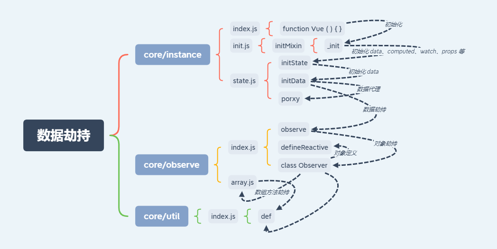
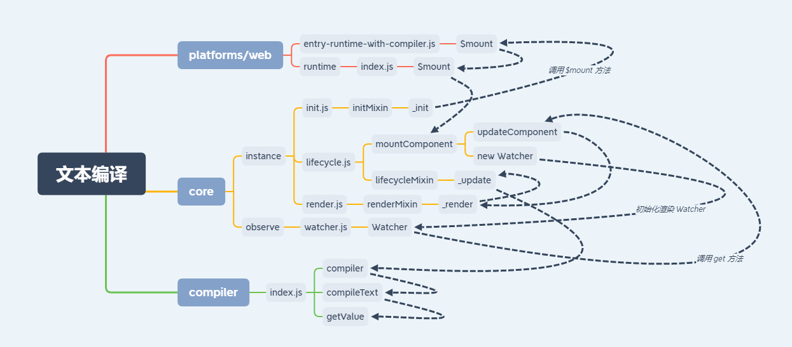

# Vue 源码重写

## 搭建 webpack 开发环境

### 安装环境

```js
npm iniy -y
```

```js
npm i webpack webpack-cli webpack-dev-server -D
```

```js
npm i html-webpack-plugin -D
```

### 编写脚本文件

```js
"scripts": {
  "dev": "webpack serve",
  "build": "webpack"
},
```

### 编写配置文件

```js
const path = require('path');
const HtmlWebpackPlugin = require('html-webpack-plugin');

module.exports = {
  mode: 'development',
  entry: './src/index.js',
  output: {
    filename: 'bundle.js',
    path: path.resolve(__dirname, 'dist')
  },
  // 代码调试，配置源代码映射
  devtool: 'source-map',
  plugins: [
    new HtmlWebpackPlugin({
      template: path.resolve(__dirname, 'public/index.html')
    })
  ]
}
```

source-map 生效的前提是入口文件中存在 js 代码。

编写 resolve 解析配置，指向本地源码路径 source。

```js
const path = require('path');
const HtmlWebpackPlugin = require('html-webpack-plugin');

module.exports = {
  mode: 'development',
  entry: './src/index.js',
  output: {
    filename: 'bundle.js',
    path: path.resolve(__dirname, 'dist')
  },
  // 代码调试，配置源代码映射
  devtool: 'source-map',
  // 解析路径配置
  resolve: {
    modules: [
      path.resolve(__dirname, 'source'),
      path.resolve('node_modules')
    ]
  },
  plugins: [
    new HtmlWebpackPlugin({
      template: path.resolve(__dirname, 'public/index.html')
    })
  ]
}
```

### 编写 html 文件

根目录下建立 public 目录，创建 index.html。

```html
<!DOCTYPE html>
<html lang="en">
<head>
  <meta charset="UTF-8">
  <meta name="viewport" content="width=device-width, initial-scale=1.0">
  <title>手写 Vue</title>
</head>
<body>
  
  <div id="app"></div>

</body>
</html>
```

## 编写 vue 测试用例

src/index.js

```js
let vm = new Vue({
  el: '#app',
  data () {
    return {
      message: 'Hello Vue',
      nums: [ 1, 5, 7 ],
      person: {
        name: 'Mike',
        age: 20
      }
    }
  },
  computed: {},
  watch: {}
});
```

## 编写 vue 源码

### vue 初始化

### 数据劫持

首先来看一下数据劫持的流程图。



#### 对象劫持

#### 数据代理

#### 数组劫持

#### 数组劫持缺点

* 数组索引修改元素，无效；
* 数组长度修改，无效；

**Vue 为什么不对数组本身进行劫持**

js 调用时存在参数上限，[参数个数上限：65536](https://bugs.webkit.org/show_bug.cgi?id=80797)。

* 尤雨奚回答：JavaScript 的性能问题，性能代价和获得的用户体验收益不能正比。
* 官网文档：由于 JavaScript 的限制，Vue **不能检测**数组和对象的变化。

其实 Object.defineProperty 是可以对数组进行定义的。至于到底为啥不监听数组，没搞清楚。

### 文本编译



#### 编译文本

#### 编译节点

### 依赖收集

上面文本编译我们已经处理完了，接下来处理依赖收集的问题（暂不考虑数组和批量更新问题）。


### 批量异步更新策略

之前我们写的依赖搜集与更新虽然可以实现，但是存在一个很严重的问题。

由于每个对象都有自己的一个 Dep，并且依赖了相同的 watcher ，更新多条数据时会导致多次渲染更新，其实并不需要多次渲染，只需要更新一次就够了，下面我们来处理一下这个问题。


#### 批量更新

#### 异步更新（next-tick）

### 数组的依赖收集

