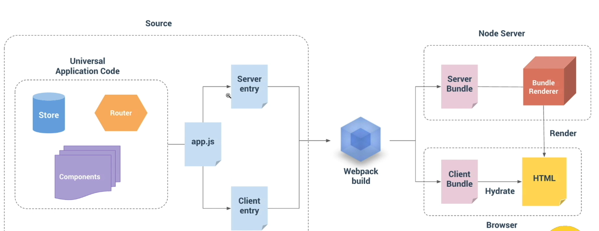

# 服务端渲染

## 1. 优点

* 利于SEO优化
* 减少首屏渲染时间

## 2. 缺点

* 可能会消耗更多的CPU和内存资源
* 常用浏览器端API无法访问
* 不支持 mouted，beforeMouted 等钩子函数（与DOM操作相关都不支持）
* 支持 beforeCreate，created 钩子函数 

## 3. 服务端渲染

首屏渲染使用服务端渲染实现，路由切换由客户端来完成。

服务端生成渲染字符串，由客户端代码来激活。

对于服务端来说，每次请求都会创建一个新的vue实例。
