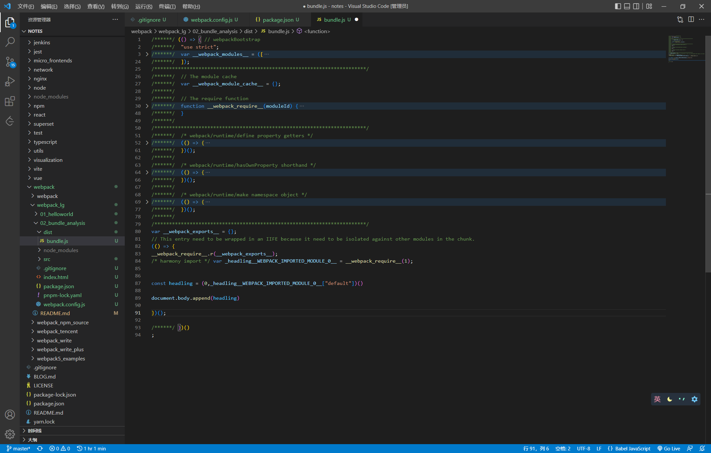
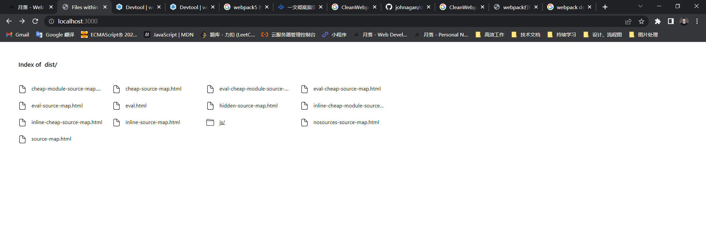

# webpack 5

模块化的问题

* ES Modules 存在兼容问题。

* 模块文件过多，网络请求频繁。
* 所有的前端资源都需要模块化。

前端领域有一些工具就很好的解决了以上问题，比如 Webpack、Parcel、Rollup。

以 webpack 为例，webpack 模块打包器（module bundler），提供以下功能：

* 模块加载器（Loader）
* 代码拆分（Code Splitting）
* 资源模块（Asset Module）

打包工具解决的是前端整体模块化，并不单指 JavaScript 模块化。

## 快速上手

```js
pnpm i webpack webpack-cli -D
```

```js
pnpm webpack --version

// webpack: 5.74.0
// webpack-cli: 4.10.0
// webpack-dev-server not installed
```


```js
// src/index.js

import createHeading from './headling'

const headling = createHeading()

document.body.append(headling)
```

```js
// src/headling.js

export default () => {
  const element = document.createElement('h2')

  element.textContent = 'Hello World'
  element.addEventListener('click', () => {
    alert('Hello webpack')
  })

  return element
}
```

```
pnpm webpack
```

## 配置文件

webpack 4 之后的版本支持零配置的方式启动打包。

整个打包过程会按照约定将 `src/index.js`  作为打包入口。

`src/index.js` -> `dist/main.js`。

可以在项目根目录下建立 `webpack.config.js` 文件

```js
const path = require('path')

module.exports = {
  entry: './src/main.js',
  output: {
    filename: 'bundle.js',
    path: path.resolve(__dirname, 'dist')
  }
}
```

可以配置 scripts 脚本

```json
{
  "name": "01_helloworld",
  "version": "1.0.0",
  "description": "",
  "main": "index.js",
  "scripts": {
    "build": "webpack"
  },
  "keywords": [],
  "author": "",
  "license": "ISC",
  "devDependencies": {
    "webpack": "^5.74.0",
    "webpack-cli": "^4.10.0"
  }
}
```

运行命令

```js
pnpm build
```

## 工作模式

针对不同环境预设的配置。

production（默认）、development、node

[webpack mode](https://webpack.js.org/configuration/mode/#usage)

[webpack default options](https://github.com/webpack/webpack/blob/main/lib/config/defaults.js)

## 打包结果运行原理

可以先设置 mode 为 none。

> vscode ctrl + k，ctrl + 0 可以折叠代码



可以使用浏览器单步调试代码执行过程。

```html
<!DOCTYPE html>
<html lang="en">
<head>
  <meta charset="UTF-8">
  <meta http-equiv="X-UA-Compatible" content="IE=edge">
  <meta name="viewport" content="width=device-width, initial-scale=1.0">
  <title>webpack</title>
</head>
<body>
  
  <script src="./dist/bundle.js"></script>

</body>
</html>
```

## 资源模块加载

JavaScript 驱动前端应用

* 逻辑合理，JS 导入资源文件
* 确保上线资源不缺失，都是必要的

webpack5 使用  assets modules 可以实现定制功能

```js
const path = require('path')

module.exports = {
  mode: 'development',
  entry: './src/main.js',
  output: {
    filename: 'bundle.js',
    path: path.resolve(__dirname, 'dist')
  },
  module: {
    rules: [
      {
        test: /\.css$/,
        use: [
          'style-loader',
          'css-loader'
        ]
      },
      {
        test: /\.(png|svg|jpg|jpeg|gif)$/i,
        type: 'asset',
        parser: {
          dataUrlCondition: {
            maxSize: 10 * 1024 // 10 KB
          }
        }
      }
    ]
  }
}
```

针对图片资源

* 超出 10 KB 文件单独提取存放
* 小于 10 KB 文件转换为 Data URLs 嵌入代码中

Data URLs


```
data:text/html;charset=UTF-8,<h1>html content<h1>
```

```
data:image/png;base64,ivadsadadakdasda...
```

## 常用加载器分类

编译转换

* css-loader

文件操作

* file-loader

代码检查

* eslint-loader

## webpack 与 ES 2015

因为模块打包需要， webpack 会处理 import 和 export，但是并不会转换 ES6 特性，进行语法降级。

* babel-loader
* @babel/core
* @babel/preset-env

```
pnpm i babel-loader @babel/core @babel/preset-env -D
```

* webpack 只是打包工具
* 加载器可以用来编译转换代码

## 模块加载方式

遵循 ES Modules 标准的 import 声明

```js
import createHeading from './headling'
import Avator from './avator.jpg'

import './main.css'

const headling = createHeading()
document.body.append(headling)

const img = new Image()
img.src = Avator
document.body.append(img)
```

遵循 CommonJS 标准的 require 函数

```js
const createHeading = require('./headling').default
const Avator = require('./avator.jpg')

require('./main.css')

const headling = createHeading()
document.body.append(headling)

const img = new Image()
img.src = Avator
document.body.append(img)
```

遵循 AMD 标准的 define 函数和 require 函数

```js
define(['./headling.js', './avator.jpg', './main.css'], (createHeading, Avator) => {
  const headling = createHeading.default()
  document.body.append(headling)

  const img = new Image()
  img.src = Avator
  document.body.append(img)
})
```

webpack 兼容多种模块化标准，但是不推荐混合使用。


Loader 加载的非 JavaScript 也会触发资源加载。

css-loader 加载的样式代码中的 @import 指令和 url 函数。

```css
body {
  min-height: 100vh;
  background: #ecf5ff;
  background-image: url(baclground.png);
  background-size: cover;
}
```

html-loader 加载的 HTML 代码中图片标签的 src 属性。

```js
import footerHtml from './footer.html'
document.wirte(footerHtml)
```

```js
{
  test: /.html$/,
  use: {
    loader: 'html-loader',
    options: {
      // default only support img:src 
      attrs: ['img:src', 'a:href']
    }
  }
}
```


webpack 模块加载方式

* 遵循 ES Modules 标准的 import 声明
* 遵循 CommonJS 标准的 require 函数
* 遵循 AMD 标准的 define 函数和 require 函数
* 样式代码中的 @import 指令和 url 函数
*  HTML 代码中图片标签的 src 属性

## 核心工作原理

由 entry 触发，解析所有需要的依赖，最终形成具有依赖关系的依赖树。

webpack 会递归依赖树，获取每个节点对应的资源文件，根据配置文件中的 rules 属性去找到模块对应的加载器进行处理。

最后将加载到的结果放入到打包结果中，从而实现整个项目的打包。

Loader 机制是 webpack 的核心。

## 开发 Loader

```js
// md-loader

const marked = require('marked')

module.exports = source => {
  const html = marked.parse(source)

  // return `module.exports = ${ JSON.stringify(html) }`
  // return `export default ${ JSON.stringify(html) }`

  // 返回 html 字符串，交给下一个 loader 处理
  return html
}
```

Loader 负责资源文件从输入到输出的转换，对于同一个资源可以依次使用多个 Loader

```js
// webpack.config.js

const path = require('path')

module.exports = {
  mode: 'development',
  entry: './src/main.js',
  output: {
    publicPath: 'dist/',
    filename: 'bundle.js',
    path: path.resolve(__dirname, 'dist')
  },
  module: {
    rules: [
      {
        test: /\.md$/,
        use: [
          'html-loader',
          path.resolve(__dirname, 'md-loader')
        ]
      }
    ]
  }
}
```

## 插件机制

增强 webpack 自动化能力。

Loader 专注实现资源模块加载，Plugin 解决项目中处理资源加载的其他自动化工作。

eg：

* 自动在打包之前清除 dist 目录
* 拷贝静态文件至输出目录
* 压缩输出代码

Loader + Plugin 可以实现大多数前端工程化工作。


自动清除输出目录插件

```bash
pnpm i clean-webpack-plugin -D
```


自动生成使用打包结果的 HTML

```bash
pnpm i html-webpack-plugin -D
```

```json
const path = require('path')
const { CleanWebpackPlugin } = require('clean-webpack-plugin')
const HtmlWebpackPlugin = require('html-webpack-plugin')

module.exports = {
	// ...
  plugins: [
    new CleanWebpackPlugin(),
    new HtmlWebpackPlugin({
      title: '月落 - Web Developer & JS Fancier',
      meta: {
        keywords: '月落,博客,月落博客,个人博客,月落个人博客,个人网站,程序员,程序员博客,程序员个人博客',
        description: '月落个人博客，记载前端学习历程。'
      },
      template: 'index.html'
    })
  ]
}
```

```html
<!DOCTYPE html>
<html lang="en">

<head>
  <meta charset="UTF-8">
  <meta http-equiv="X-UA-Compatible" content="IE=edge">
  <meta name="viewport" content="width=device-width, initial-scale=1.0">
  <title>
    <%= htmlWebpackPlugin.options.title %>
  </title>
</head>

<body>

</body>

</html>
```


复制文件夹

```js
pnpm i copy-webpack-plugin -D
```

```json
const CopyWebpackPlugin = require('copy-webpack-plugin')

module.exports = {
  plugins: [
		// ...
    new CopyWebpackPlugin({
      patterns: ['public']
    })
  ]
}

```

## 开发 Plugin

相对于 Loader，Plugin 拥有更宽的能力范围。

Loader 只是在加载模块的环节中工作，插件的作用范围可以在 webpack 的每一个环节。

Plugin 通过钩子机制实现，我们开发插件就是在 webpack 提供的钩子中挂载函数实现扩展。

[https://webpack.js.org/api/](https://webpack.js.org/api/)

插件必须是一个函数或者是一个包含 apply 方法的对象。

```js
// webpack.config.js

const path = require('path')
const { sources, Compilation } = require('webpack')

class MyPlugin {
  apply(compiler) {
    // compiler.hooks.emit.tap('MyPlugin', compilation => {
    //   // compilation 可以理解成此次打包的上下文
    //   for (const name in compilation.assets) {
    //     if (name.endsWith('.js')) {
    //       const contents = compilation.assets[name].source()
    //       const withoutComments = contents.replace(/\/\*+\*\//g, '')

    //       compilation.assets[name] = {
    //         source: () => withoutComments,
    //         size: () => withoutComments.length
    //       }
    //     }
    //   }
    // })
    compiler.hooks.compilation.tap('MyPlugin', (compilation) => {
      compilation.hooks.processAssets.tapPromise(
        {
          name: 'MyPlugin',
          // https://github.com/webpack/webpack/blob/master/lib/Compilation.js#L3280
          stage: Compilation.PROCESS_ASSETS_STAGE_ADDITIONAL,
        },
        (assets) => {
          for (const name in assets) {
            if (name.endsWith('.js')) {
              const contents = assets[name].source()

              const withoutComments = contents.replace(/\/\*+\*\//g, '')

              assets[name] = {
                source: () => withoutComments,
                ...assets[name]
              }
            }
          }
          return Promise.resolve(assets)
        }
      )
    })
  }
}

module.exports = {
  mode: 'development',
  entry: './src/main.js',
  output: {
    filename: 'bundle.js',
    path: path.resolve(__dirname, 'dist')
  },
  plugins: [
    new MyPlugin()
  ]
}
```

> [DEP_WEBPACK_COMPILATION_ASSETS] DeprecationWarning: 
> Compilation.assets will be frozen in future, all modifications are deprecated.
> BREAKING CHANGE: No more changes should happen to Compilation.assets after sealing the Compilation.

## DevServer

* HTTP 服务运行
* 自动编译、自动刷新浏览器

```bash
pnpm i webpack-dev-server -D
```

默认只会 serve 打包输出文件，如果其他资源文件也需要 serve。

```js
// webpack.config.js

module.exports = {
  devServer: {
    // Allows to configure options for serving static files from directory (by default 'public' directory).
    static: './public'
  }
}

```

[webpack-dev-server](https://github.com/webpack/webpack-dev-server)

提供配置代理解决开发阶段接口跨域问题。

```js
// webpack.config.js

module.exports = {
  devServer: {
    static: './public',
    proxy: {
      '/api': {
        // https://localhost:8080/api/users -> https://api.github.com/api/users
        target: 'https://api.github.com',
        // https://api.github.com/api/users -> https://api.github.com/users
        pathRewrite: {
          '^/api': ''
        },
        // 不能使用 localhost:8080 作为请求 GitHub 主机名
        changeOrigin: true
      }
    }
  }
}
```

## Source Map

生产环境运行代码和源代码之间完全不同，如果需要调试应用，或者运行过程中出现错误都将无法定位。调试和报错都是基于运行代码。

Source Map 就是用于解决此类问题最好的办法，用来映射转换后代码与源代码之间的关系。

可以通过 source map 文件逆向解析源代码。

```js
//# sourceMappingURL=xxxx.map
```

source map 解决了源代码与运行代码不一致所产生的问题。


配置 source map

```js
const path = require('path')

module.exports = {
  mode: 'development',
  entry: './src/main.js',
  output: {
    filename: 'bundle.js',
    path: path.resolve(__dirname, 'dist')
  },
  devtool: 'source-map',
}
```

webpack 支持很多种 [source map](https://webpack.js.org/configuration/devtool/) 的实现方式，每种方式的效率和效果各不相同。


eval：将模块转换后代码放到 eval 函数中，并且在 eval 函数字符串最后通过 sourceURL 方式说明对应文件路径。

> 这种模式下不会生成 source map 文件，不存在行列信息

```js
eval("__webpack_require__.r(__webpack_exports__);\n/* harmony import */ var _headling__WEBPACK_IMPORTED_MODULE_0__ = __webpack_require__(/*! ./headling */ \"./src/headling.js\");\n/* harmony import */ var _avator_jpg__WEBPACK_IMPORTED_MODULE_1__ = __webpack_require__(/*! ./avator.jpg */ \"./src/avator.jpg\");\n/* harmony import */ var _main_css__WEBPACK_IMPORTED_MODULE_2__ = __webpack_require__(/*! ./main.css */ \"./src/main.css\");\n\n\n\nvar headling = (0,_headling__WEBPACK_IMPORTED_MODULE_0__[\"default\"])();\ndocument.body.append(headling);\nvar img = new Image();\nimg.src = _avator_jpg__WEBPACK_IMPORTED_MODULE_1__;\ndocument.body.append(img);\nconsole.log2('222');\n\n//# sourceURL=webpack://01_helloworld/./src/main.js?");
```


配置 webpack.config.js 查看多种模式结果

> The pattern is: `[inline-|hidden-|eval-][nosources-][cheap-[module-]]source-map`.

```js
const path = require('path')
const { merge } = require('webpack-merge')

const { CleanWebpackPlugin } = require('clean-webpack-plugin')
const HtmlWebpackPlugin = require('html-webpack-plugin')
const CopyWebpackPlugin = require('copy-webpack-plugin')

const allModes = [
  'eval',
  'eval-cheap-source-map',
  'eval-cheap-module-source-map',
  'eval-source-map',
  'cheap-source-map',
  'cheap-module-source-map',
  'inline-cheap-source-map',
  'inline-cheap-module-source-map',
  'source-map',
  'inline-source-map',
  'hidden-source-map',
  'nosources-source-map'
]

const baseConfig =  {
  entry: './src/main.js',
  module: {
    rules: [
      {
        test: /.js$/,
        use: {
          loader: 'babel-loader',
          options: {
            presets: ['@babel/preset-env']
          }
        },
      }
    ]
  },
  plugins: [
    // bug: clean failed
    new CleanWebpackPlugin()
  ],
  devServer: {
    static: './public'
  }
}

module.exports = allModes.map(mode => merge(baseConfig, {
  mode: 'none',
  devtool: mode,
  output: {
    filename: `js/${ mode }.js`
  },
  plugins: [
    new HtmlWebpackPlugin({
      title: '月落 - Web Developer & JS Fancier',
      meta: {
        keywords: '月落,博客,月落博客,个人博客,月落个人博客,个人网站,程序员,程序员博客,程序员个人博客',
        description: '月落个人博客，记载前端学习历程。'
      },
      filename: `${ mode }.html`,
      template: 'index.html'
    })
  ]
}))
```

可以使用 `server dist` 启动 server，预览不同的文件，对比差异。




> The pattern is: `[inline-|hidden-|eval-][nosources-][cheap-[module-]]source-map`.

eval：不会生成 source map 文件（不存在行列信息），可以定位文件错误

eval-source-map：生成 source map 文件（存在行列信息），可以定位文件错误

eval-cheap-source-map：生成 source map 文件（阉割版，存在行，缺失列信息），可以定位文件错误

eval-cheap-module-source-map：生成 source map 文件（阉割版，存在行，缺失列信息，未经过转化的源代码），可以定位文件错误


> eval：是否使用 eval 执行模块代码
>
> cheap：source map 是否包含行信息
>
> module：是否能够得到 Loader 处理之前的代码


inline-source-map：source-map 的文件是以 data url 的方式存在，以 data url 方式嵌入到代码中

hidden-source-map：看不到 source-map 效果，确实会生成 source-map 文件，但是不会引入文件（开发第三方包时比较有用）

nosources-source-map：可以看到错误出现位置（存在行列信息），但是不能看到源代码，生产环境中保护源代码不被暴露


官方推荐

* 开发环境

  * eval

  * eval-source-map

  * eval-cheap-source-map

  * eval-cheap-module-source-map（个人推荐）
    * 代码经过 loader 转换过后的代码差异比较大（ module）
    * 首次打包速度慢无所谓，重写打包相对较快（cheap）

* 生产环境

  * none（个人推荐）

  * source-map

  * hidden-source-map

  * nosources-source-map（个人推荐）


调试是开发阶段的事情，而不是生产环境让用户帮忙测试。

理解不同模式的差异，适配不同的环境。开发时并没有绝对的通用法则。


