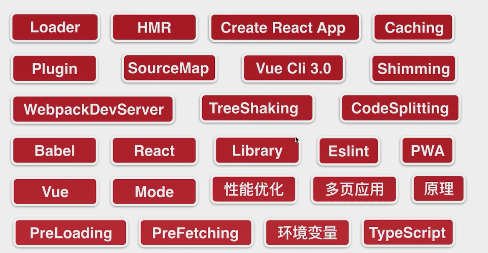

# Webpack 4



## webpack 基础

webpack 是一个模块打包工具（module bundler）。

### 安装

#### 全局安装

```js
npm i webpack webpack-cli -g
```

```js
webpack -v
```

不推荐使用 webpack。

```js
npm uninstall webpack webpack-cli -g
```

#### 局部安装

可以在不同的项目使用不同的 webpack 版本。

```js
npm i webpack webpack-cli --save-dev
npm i webpack webpack-cli -D
```

**查看版本号**

```js
npx webpack -v
```

**查看版本号是否存在**

```js
npm info webpack
```

```js
npm i webpack@4.16.5 webpack-cli -D
```

### 配置文件

#### 基础配置

```js
const path = require('path');

module.exports = {
  entry: './src/index.js',
  output: {
    filename: 'bundle.js',
    path: path.resolve(__dirname, 'dist')
  }
}
```

```js
npx webpack
npx webpack --config filename.js
```

#### npm scripts

```js
{
  "name": "webpack-demo",
  "version": "1.0.0",
  "description": "",
  "private": true,
  "scripts": {
    "build": "webpack"
  },
  "keywords": [],
  "author": "heora",
  "license": "ISC",
  "devDependencies": {
    "webpack": "^5.17.0",
    "webpack-cli": "^4.4.0"
  }
}
```

#### 三种运行方式

```js
webpack
npx webpack
npm run webpack
```

#### webpack-cli 作用

使我们可以在命令行中正确运行 webpack 命令。

## webpack 核心概念

### 打包静态资源

loader 其实就是打包方案，告知 webpack 怎样处理非 JS 文件。

#### 图片处理

##### file-loader

**安装 file-loader**

```js
npm i file-loader -D
```

**编写配置文件**

```js
const path = require('path');

module.exports = {
  mode: "development",
  entry: './src/index.js',
  output: {
    filename: 'bundle.js',
    path: path.resolve(__dirname, 'dist')
  },
  module: {
    rules: [
      {
        test: /\.png$/,
        use: {
          loader: 'file-loader'
        }
      }
    ]
  }
}
```

**编写脚本文件**

```js
import avator from './images/avator.png';

const image = new Image();
const app = document.getElementById('app');

image.src = avator;
app.append(image);
```

**配置优化**

```js
const path = require('path');

module.exports = {
  mode: "development",
  entry: './src/index.js',
  output: {
    filename: 'bundle.js',
    path: path.resolve(__dirname, 'dist')
  },
  module: {
    rules: [
      {
        test: /\.(jpg|png|gif)$/,
        use: {
          loader: 'file-loader',
          options: {
            // placeholder 占位符 
            name: '[name]_[hash].[ext]',
            outputPath: 'images/'
          }
        }
      }
    ]
  }
}
```

##### url-loader

url-loader 可以把图片转化为 base64 字符串，放到 bundle.js 文件中，不生成图片。

**安装 url-loader **

```js
npm i url-loader --save-dev
```

**编写配置文件**

```js
const path = require('path');

module.exports = {
  mode: "development",
  entry: './src/index.js',
  output: {
    filename: 'bundle.js',
    path: path.resolve(__dirname, 'dist')
  },
  module: {
    rules: [
      {
        test: /\.(jpg|png|gif)$/,
        use: {
          loader: 'url-loader',
          options: {
            // placeholder 占位符 
            name: '[name]_[hash].[ext]',
            outputPath: 'images/'
          }
        }
      },
    ]
  }
}
```

**配置优化**

图片大小超过 20480，会生成图片，反之会把图片转 base64 放到 bundle.js 中。

```js
const path = require('path');

module.exports = {
  mode: "development",
  entry: './src/index.js',
  output: {
    filename: 'bundle.js',
    path: path.resolve(__dirname, 'dist')
  },
  module: {
    rules: [
      {
        test: /\.(jpg|png|gif)$/,
        use: {
          loader: 'url-loader',
          options: {
            // placeholder 占位符 
            name: '[name]_[hash].[ext]',
            outputPath: 'images/',
            limit: 20480
          }
        }
      },
    ]
  }
}
```

#### 样式处理 

##### css-loader、style-loader

**安装 css-loader、style-loader **

```js
npm i css-loader style-loader --save-dev
```

**编写配置文件**

```js
const path = require('path');

module.exports = {
  mode: "development",
  entry: './src/index.js',
  output: {
    filename: 'bundle.js',
    path: path.resolve(__dirname, 'dist')
  },
  module: {
    rules: [
      {
        test: /\.(jpg|png|gif)$/,
        use: {
          loader: 'url-loader',
          options: {
            // placeholder 占位符 
            name: '[name]_[hash].[ext]',
            outputPath: 'images/',
            limit: 2048
          }
        }
      },
      {
        test: /\.css$/,
        use: ['style-loader', 'css-loader']
      }
    ]
  }
}
```

css-loader 会分析 css 文件之间的关系，合并成一段 css。

style-loader 获取到 css-loader 处理后的内容后，style-loader 会把内容挂载到页面的 head 部分。

##### sass-loader

**安装 sass-loader node-sass**

```js
npm i sass-loader node-sass --save-dev
```

**编写配置文件**

```js
const path = require('path');

module.exports = {
  mode: "development",
  entry: './src/index.js',
  output: {
    filename: 'bundle.js',
    path: path.resolve(__dirname, 'dist')
  },
  module: {
    rules: [
      {
        test: /\.(jpg|png|gif)$/,
        use: {
          loader: 'url-loader',
          options: {
            // placeholder 占位符 
            name: '[name]_[hash].[ext]',
            outputPath: 'images/',
            limit: 2048
          }
        }
      },
      {
        test: /\.scss$/,
        use: [
          'style-loader',
          'css-loader',
          'sass-loader'
        ]
      }
    ]
  }
}
```

loader 的执行顺序是从下到上，从右到左。

##### postcss-loader，autoprefixer

**安装 postcss-loader**

```js
npm i postcss-loader -D
```

**安装 autoprefixer**

只支持单文件，不支持处理 @import 引入的文件。

```js
npm i autoprefixer -D
```

**创建 postcss.config.js 配置文件**

不配置 overrideBrowserslist 会导致 autoprefix 失效。

```js
module.exports = {
  plugins: [
    require('autoprefixer')({
      "overrideBrowserslist": [
        "defaults",
        "not ie < 11",
        "last 2 versions",
        "> 1%",
        "iOS 7",
        "last 3 iOS versions"
      ]
    })
  ]
}
```

**编写 webpack 配置**

```js
const path = require('path');

module.exports = {
  mode: "development",
  entry: './src/index.js',
  output: {
    filename: 'bundle.js',
    path: path.resolve(__dirname, 'dist')
  },
  module: {
    rules: [
      {
        test: /\.(jpg|png|gif)$/,
        use: {
          loader: 'url-loader',
          options: {
            // placeholder 占位符 
            name: '[name]_[hash].[ext]',
            outputPath: 'images/',
            limit: 2048
          }
        }
      },
      {
        test: /\.scss$/,
        use: [
          'style-loader',
          'css-loader',
          'sass-loader',
          'postcss-loader'
        ]
      }
    ]
  }
}
```

