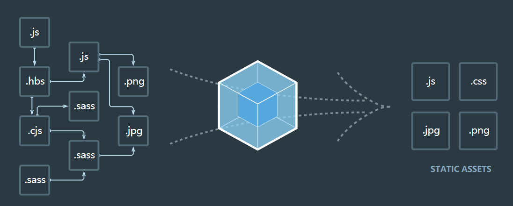
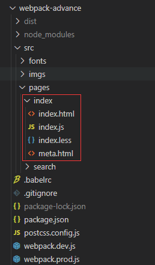
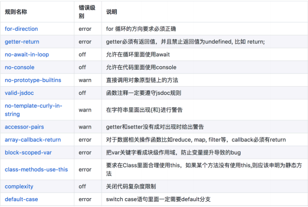
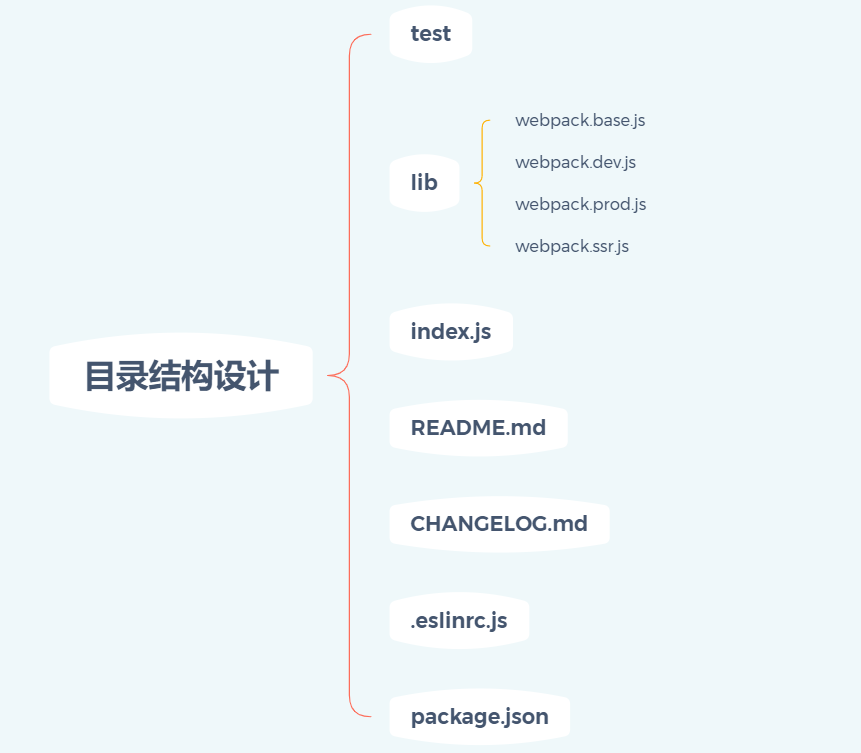
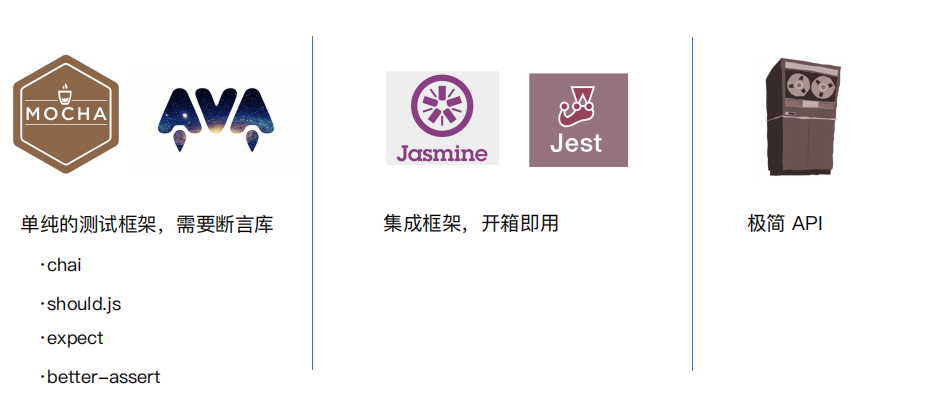
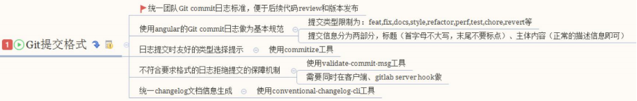
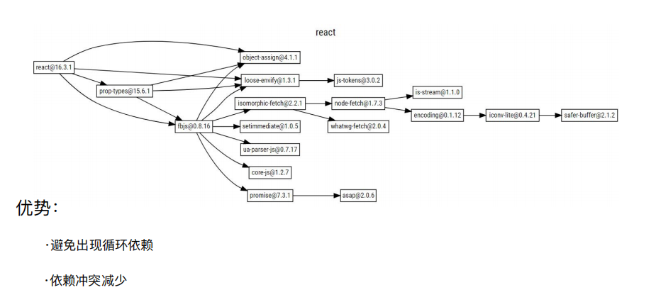

# 玩转Webpack

## 一、概要

介绍 webpack 的基础用法。

**为什么选择 webpack**

* 社区生态丰富
* 配置灵活、插件化扩展
* 官方更新迭代速度快

## 二、功能介绍

### 代码转换

把浏览器不支持的东西转换成浏览器支持的东西。例如 ES6 有很多语法糖，值得我们使用。

ES6 -> ES5、SCSS -> CSS 等。

### 文件优化

浏览器处理资源时，需要耗费时间，所以需要压缩文件，这样，http 请求更快，浏览器处理更快。

压缩 JS、CSS、HTML、图片等。

### 代码检查

可以配置 ESLint 等工具，约束团队。前端单元测试。

代码规范、单元测试等。

### 模块合并与分割

将组件化、模块化的代码公共代码进行抽取，优化，合并。有些文件可以设置异步加载。 

### 刷新与发布

 webpack 提供了工程化、自动化的构建方案，方案即系统化、流程化、规范化的自动构建。

## 三、安装与使用

### 安装

```js
npm i webpack@4.16.5 webpack-cli -D
```

> 不推荐使用全局安装。多个项目可能会使用不同的 webpack 版本与配置，全局安装很可能会导致诸多问题。

**webpack-cli**

webpack command line interface：webpack 命令行接口

> 1. webpack3 中，webpack-cli 和 webpack 在一个包中
>
> 2. webpack4 与 wenpack-cli 分来管理，也需要单独安装
>
> 3. webpack 是核心功能库，webpack-cli 是提供 webpack 进行构建的命令行接口

### 使用

直接运行命令

```js
npx webpack
```

编写 script 脚本

```js
{
  "name": "webpack-demo",
  "version": "1.0.0",
  "description": "",
  "private": true,
  "scripts": {
    "build": "webpack"
  },
  "keywords": [],
  "author": "heora",
  "license": "ISC",
  "devDependencies": {
    "webpack": "^5.17.0",
    "webpack-cli": "^4.4.0"
  }
}
```

```js
npm run webpack
```

## 四、基础概念

### entry

Entry 用来指定 webpack 的打包入口。

webpack中，所有都是模块，JS/CSS/HTML都是模块，如需打包，必须引入到入口文件里，

当然也可以借助 plugin 对模块进行单独处理，但常规情况下，都是通过入口文件。

#### 理解依赖图的含义

webpack 是一个模块打包工具（module bundler）。

它会把一切的资源，不管是代码资源还是非代码资源（图片、字体依赖等），都会不断加入到依赖图中。

<div align="center"></div>

#### entry 用法

单入口

entry 是一个字符串。

```js
module.exports = {
  entry: './src/index.js'
}
```

一般比较适用于一个项目只有一个入口文件或者项目是单页面应用。

多入口

entry 是一个对象。

```js
module.exports = {
  entry: {
    index: './src/index.js',
    detail: './src/detail.js'
  }
}
```

适合多页面的场景，多页应用。

### output

Output 用来告诉 webpack 如何将编译后的文件输出到磁盘。

#### 单入口配置

```js
module.exports = {
  entry: './src/index.js',
  output: {
    filename: 'bundle.js',
    path: path.resolve(__dirname, 'dist')
  }
}
```

#### 多入口配置

可以通过占位符确保文件名称的唯一。

```js
module.exports = {
 entry: {
    index: './src/index.js',
    detail: './src/detail.js'
  }
  output: {
    filename: '[name].js',
    path: path.resolve(__dirname, 'dist')
  }
}
```

### loader

webpack 开箱即用只支持 JS 和 JSON 两种文件类型，可以通过 Loader 去支持其他文件类型并且把它们转换成有效的模块，并且可以添加到依赖图中。

loader 本身是一个函数，接收源文件作为参数，返回转换的结果。

#### 常见的 loader

| 名称          | 描述                                                   |
| ------------- | ------------------------------------------------------ |
| babel-loader  | 转换 ES6、ES7 等 JS 新特性语法                         |
| css-loader    | 支持 .css 文件的加载和解析                             |
| style-loader  | 将 css-loader 处理后的内容挂载到页面的 head 部分       |
| less-loader   | 将 less 文件转换成 css                                 |
| ts-loader     | 将 ts 转换为 JS                                        |
| file-loader   | 进行图片、字体的打包                                   |
| url-loader    | 功能类似于 file-loader，可以指定限制，返回一个 DataURL |
| raw-loader    | 将文件以字符串的形式导入                               |
| thread-loader | 多进程打包 JS 和 CSS                                   |

#### loader 的用法

```js
module.exports = {
  module: {
    rules: [
      {
        test: /\.(jpg|png|gif)$/,
        use: {
          loader: 'url-loader',
          options: {
            name: '[name]_[hash].[ext]',
            outputPath: 'images/',
            limit: 2048
          }
        }
      },
      {
        test: /\.scss$/,
        use: [
          'style-loader',
          'css-loader',
          'sass-loader',
          'postcss-loader'
        ]
      }
    ]
  }
}
```

test 指定匹配规则。use 执行使用的 loader 名称。

> 1. 多个loader的执行顺序是从后向前
>
> 2. 第一个loader将模块代码作为参数，然后处理参数并返回
>
> 3. 其后的loader接收前一个loader的返回值作为参数，继续处理参数并返回
>
> 4. 最后一个loader返回处理后的JS模块源码

### Plugins

插件用于 bundle 文件的优化，资源管理和环境变量注入，作用于整个构建过程。

任何不能通过 loader 完成的事情，都可以用 plugins 完成，比如构建之前需要手动删除目录。

每一个 plugin 实际上是一个类（构造函数）。

#### 常见的 Plugin

| 名称                     | 描述                                                         |
| ------------------------ | ------------------------------------------------------------ |
| CommonsChunkPlugin       | 将 chunks 相同的模块代码提取成公共 js（通常用于多个页面打包的情况） |
| CleanWebpackPlugin       | 清理构建目录                                                 |
| ExtractTextWebpackPlugin | 将 CSS 从 bundle 文件里提取成一个独立的 CSS 文件             |
| MiniCssExtaractPlugin    | 将 CSS 源码提取，创建为独立的文件引入相应的HTML中            |
| HtmlWebpackPlugin        | 创建 html 文件去承载输出的 bundle                            |
| CopyWebpackPlugin        | 将文件或者文件夹拷贝到构建的输出目录                         |
| UglifyjsWebpackPlugin    | 压缩 JS                                                      |
| ZipWebpackPlugin         | 将打包出的资源生成一个 zip 包                                |

#### Plugin 的用法

```js
module.exports = {
  plugins: [
    new htmlWebpackPlugin({
      template: path.resolve(__dirname, 'src/index.html'),
      filename: 'index.html',
      chunks: ['index']
    }),
    new htmlWebpackPlugin({
      template: path.resolve(__dirname, 'src/list.html'),
      filename: 'list.html',
      chunks: ['list']
    }),
    new MiniCssExtractPlugin({
      // 独立打包 css 文件的相对路径与名称
      filename: 'css/[name].css',
      // 通过import导入的样式文件模块的文件名
      // 生成一个 JS 的 chunk
      chunkFilename: 'css/[id].[hash:16].css'
    }),
    // 优化与压缩 CSS 资源
    new OptimizeCssAssetsPlugin({
      // https://www.cssnano.cn/guides/optimisations/
      // https://www.cssnano.cn/guides/presets/
      // CSS 优化插件设置
      cssProcessor: require('cssnano'),
      // CSS 优化插件配置项
      cssProcessorOptions: {
        preset: [
          'default',
          {
            discardCommonents: {
              removeAll: true
            }
          }
        ]
      }
    })
  ]
}
```

将定义好的插件实例化并放入 plugins 数组中。

> 1. webpack在其生命周期中会向外界广播一些事件钩子
>
> 2. 每一个plugin都可以监听其中的任何一个事件钩子
>
> 3. 当被监听的事件响应，就执行对应的处理函数改变原本webpack正常输出的结果
>
> 4. 插件的执行顺序是从上到下

### mode

Mode 用来指定当前的构建环境是：production、development 还是 none。

设置 mode 可以使用 webpack 的内置函数，默认为 production。

#### Mode 的内置函数功能

| 选项        | 描述                                                         |
| ----------- | ------------------------------------------------------------ |
| development | 会将 process.env.NODE_ENV 的值设为 development。启用 NamedChunksPlugin 和 NamedModulesPlugin。 |
| production  | 会将 process.env.NODE_ENV 的值设为 production。启用 FlagDependencyUsagePlugin, FlagIncludedChunksPlugin, ModuleConcatenationPlugin, NoEmitOnErrorsPlugin, OccurrenceOrderPlugin, SideEffectsFlagPlugin 和 UglifyJsPlugin. |
| none        | 不开启任何优化选项                                           |

## 五、webpack 基础用法

### 解析 ES6 和 React JSX

#### 解析 ES6

```js
npm i @babel/core @babel/preset-env babel-loader -D
```

webpack 原生支持 js 解析，但是对于 ES6 语法，原生是不支持的。

可以使用 babel-loader，babel 的配置文件是：.babelrc。

```js
const path = require('path');

module.exports = {
  entry: './src/index.js',
  output: {
    filename: 'bundle.js',
    path: path.resolve(__dirname, 'dist')
  },
  mode: "development",
  module: {
    rules: [
      {
        test: /.js$/,
        use: 'babel-loader'
      }
    ]
  }
}
```

增加 ES6 的 babel preset 配置。

```js
{
  "presets": [
    "@babel/preset-env"
  ]
}
```

#### 解析 React JSX

```js
npm i react react-dom -S
```

```js
npm i @babel/preset-react -D
```

> package.json 中 dependencies 和 devDependencies 的区别是：devDependencies 用于本地环境开发时候，dependencies 用户发布环境，也就是开发阶段的依赖最后是不对被打入包内。
>
> 通常框架、组件和 utils 等业务逻辑相关的包依赖放在 dependencies s里面，对于构建、ESlint、单元测试等相关依赖放在 devDependencies 中。

在前面的基础之上增加 React 的 babel preset 配置，同理，vue 也可以这样配置。

```js
{
  "presets": [
    "@babel/preset-env",
    "@babel/preset-react"
  ]
}
```

> babel-loader 解析 ES6 的语法也是需要知道哪些语法需要解析，需要通过 .babelrc 进行配置，这个 @babel/preset-env 就是告诉 babel-loader 要解析ES6的语法，其它的 react 语法可以通过其它的 babel preset 进行处理。

编写个测试代码

```js
'use strict';

import React from 'react';
import ReactDOM from 'react-dom';

class Search extends React.Component {
  render () {
    return <div>Hello React</div>;
  }
}

ReactDOM.render(
  <Search />,
  document.getElementById('app')
);
```

### 解析 CSS、Less 和 Sass

#### 解析 CSS

css-loader 用于加载 .css 文件，并且转换成 commonjs 对象。

style-loader 将样式通过 `<style>` 标签插入到 head 中。

```js
npm i style-loader css-loader -D
```

**index.js**

```js
'use strict';

import React from 'react';
import ReactDOM from 'react-dom';

import './css/index.css';

class Search extends React.Component {
  render () {
    return (
      <div className="text">Hello React</div>
    );
  }
}

ReactDOM.render(
  <Search />,
  document.getElementById('app')
);
```

**index.css**

```js
.text {
  font-size: 20px;
  color: red;
}
```

**webpack.config.js**

```js
const path = require('path');

module.exports = {
  entry: './src/index.js',
  output: {
    filename: 'bundle.js',
    path: path.resolve(__dirname, 'dist')
  },
  mode: "development",
  module: {
    rules: [
      {
        test: /\.js$/,
        use: 'babel-loader'
      },
      {
        test: /\.css$/,
        use: [
          'style-loader',
          'css-loader'
        ]
      }
    ]
  }
}
```

#### 解析 Less、Sass

less-loader 用于将 less 转换成 css。

```js
npm i less less-loader -D
```

**index.js**

```js
import './css/index.less';
```

**webpack.config.js**

```js
module: {
  rules: [
 	// ...
    {
      test: /\.less$/,
      use: [
        'style-loader',
        'css-loader',
        'less-loader'
      ]
    }
  ]
}
```

sass-loader 和 less-loader 配置基本一致。

```js
npm i node-sass sass-loader -D
```

### 解析图片和字体

file-loader 用于处理文件。

```js
npm i file-loader -D
```

#### 解析图片

**index.js**

```js
import './css/index.less';
import avator from './imgs/avator.png';

class Search extends React.Component {
  render () {
    return (
      <div className="text">
        Hello React 
      </div>
    );
  }
}
```

**webpack.config.js**

```js
module: {
  rules: [
    {
      test: /\.(png|jpg|gif|jpeg)$/,
      use: 'file-loader'
    }
  ]
}
```

#### 解析字体

file-loader 可以用来处理图片，也可以用来处理字体。

**index.less**

```js
@font-face {
  font-family: 'SourceHanSerifSC-Heavy';
  src: url('../fonts/SourceHanSerifSC-Heavy.otf');
}

.text {
  font-size: 20px;
  color: red;
  font-family: 'SourceHanSerifSC-Heavy';
}
```

**webpack.config.js**

```js
module: {
  rules: [
    {
      test: /\.(woff|woff2|eot|ttf|otf)$/,
      use: 'file-loader'
    }
  ]
}
```

#### 资源解析

url-loader 也可以处理图片和字体。还可以设置较小资源自动转换 base64。

url-loader 内部也是使用的 file-loader。对于图片资源，可以使用 url-loader 进行处理。

```js
npm i url-loader -D
```

**webpack.config.js**

```js
module: {
    // {
    //   test: /.(png|jpg|gif|jpeg)$/,
    //   use: 'file-loader'
    // },
    {
      test: /\.(png|jpg|gif|jpeg)$/,
      use: [
        {
          loader: 'url-loader',
          options: {
            limit: 10240
          }
        }
      ]
    }
  ]
}
```

### webpack 文件监听

文件监听是在发现源码发生变化时，自动重新构建出新的输出文件。

#### 开启方式

webpack 开启监听模式，有两种方式：

* 启动 webpack 命令时，带上 --watch 参数。

  ```js
  "scripts": {
    "build": "webpack",
    "watch": "webpack --watch"
  },
  ```

* webpack.config.js 中设置 watch: true。

#### 缺陷

每次需要手动刷新浏览器。

#### 原理分析

轮询判断文件的最后编辑时间是否变化。

某个文件发生变化，并不会立即告诉监听者，而是先缓存起来，等 aggregateTimeout。

**webpack.config.js**

```js
// 默认 false，也就是不开启
watch: true,
// 只有开启监听模式，watchOptions 才生效
watchOptions: {
  // 默认为空，不监听的文件或者文件夹，支持正则匹配
  ignored: /node_modules/,
  // 监听到变化发生后会等 300ms 再去执行，默认 300ms
  aggregateTimeout: 300,
  // 判断文件是否变化是通过不停询问系统指定文件有没有变化实现的，默认每秒询问 1 次
  poll: 1000
}
```

### webpack 热更新

使用 webpack-dev-server。

```js
npm i webpack-dev-server -D
```

#### 特性

WDS 不刷新浏览器。

WDS 不输出文件，而是放在内存中。

配置 hot：true后，自动引入 HotModuleReplacementPlugin 插件。

> webpack-dev-server(WDS)的功能提供 bundle server的能力，就是生成的 bundle.js 文件可以通过 localhost://xxx 的方式去访问，另外 WDS 也提供 livereload(浏览器的自动刷新)。
>
> hot-module-replacement-plugin 的作用是提供 HMR 的 runtime，并且将 runtime 注入到 bundle.js 代码里面去。一旦磁盘里面的文件修改，那么 HMR server 会将有修改的 js module 信息发送给 HMR runtime，然后 HMR runtime 去局部更新页面的代码。因此这种方式可以不用刷新浏览器。
>
> 单独写两个包也是出于功能的解耦来考虑的。简单来说就是：hot-module-replacement-plugin 包给 webpack-dev-server 提供了热更新的能力。

#### 配置

**package.json**

```js
"scripts": {
  "build": "webpack",
  "watch": "webpack --watch",
  "dev": "webpack serve --open"
},
```

**webpack.config.js**

webpack-dev-server 开发环境使用，生产环境不需要使用。

```js
module.exports = {
  // ...
  mode: "development",
  // ...
  devServer: {
    contentBase: './dist',
    hot: true
  }
}
```

#### 其他方式

使用 webpack-dev-middleware。

WDM 将 webpack 输出的文件传输给服务器（通常使用 express，koa2）。

适用于灵活的定制场景。

#### 原理分析

Webpack Compile 将 JS 编译成 Bundle。

Bundle server：提供文件在浏览器的访问。

HMR Server：建热更新的文件输出给 HMR Runtime。

HMR Runtime：会被注入到浏览器。


正常流程  1-2-A-B ，更新流程  1-2- 3-4。

### 文件指纹策略

文件指纹指打包后的文件名的后缀。

通常文件指纹用来做版本管理，只需要发布修改的页面。

#### 常见指纹

文件指纹策略：chunkhash、contenthash、hash。

**Hash**

和整个项目的构建相关，只要项目文件有修改，整个项目构建的 hash 值就会更改。

**Chunkhash**

和 webpack 打包出的 chunk 有关，不同的 entry 会生成不同的 chunkhash 值。

**Contenthash**

根据文件内容来定义 hash，文件内容不变，则 contenthash 不变。

#### JS 文件指纹设置

设置 output 的 filename，使用 [chunkhash]。

#### CSS 文件指纹设置

设置 MiniCssExtractPlugin 的 filename，使用 [contenthash]。

> 单纯使用 css-loader 和 style-loader 会把 css 插入到 head 头部，不存在文件的概念。

#### 图片的文件指纹设置

设置 file-loader 的 name，使用 [hash]。

>  这里的 hash 也是指文件内容 hash，和上面提的 Hash 的含义不同。

| 占位符名称    | 含义                             |
| ------------- | -------------------------------- |
| [ext]         | 资源后缀名                       |
| [name]        | 文件名称                         |
| [path]        | 文件的相对路径                   |
| [folder]      | 文件所在的文件夹                 |
| [contenthash] | 文件的内容 hash，默认是 md5 生成 |
| [hash]        | 文件内容的 hash，默认是 md5 生成 |
| [emoji]       | 一个随机的指代文件内容的 emoj    |

 #### 配置

webpack 的 chunkhash 不能和热更新一起使用（测试环境），需要在生产环境使用。

css 使用文件指纹，需要安装 plugin。

```js
npm i mini-css-extract-plugin -D
```

**package.json**

```js
"scripts": {
  "watch": "webpack --watch",
  "build": "webpack --config webpack.prod.js",
  "dev": "webpack serve --config webpack.dev.js --open"
}
```

**webpack.prod.js**

```js
const path = require('path');
const MiniCssExtractPlugin = require('mini-css-extract-plugin');

module.exports = {
  entry: './src/index.js',
  output: {
    publicPath: '/',
    filename: '[name][chunkhash:8].js',
    path: path.resolve(__dirname, 'dist')
  },
  mode: "production",
  module: {
    rules: [
      {
        test: /\.js$/,
        use: 'babel-loader'
      },
      {
        test: /\.css$/,
        use: [
          MiniCssExtractPlugin.loader,
          'css-loader'
        ]
      },
      {
        test: /\.less$/,
        use: [
          MiniCssExtractPlugin.loader,
          'css-loader',
          'less-loader'
        ]
      },
      {
        test: /\.(png|jpg|gif|jpeg)$/,
        use: [
          {
            loader: 'url-loader',
            options: {
              name: '[name]_[hash:8].[ext]',
              limit: 10240
            },
          }
        ]
      },
      {
        test: /\.(woff|woff2|eot|ttf|otf)$/,
        use: [
          {
            loader: 'file-loader',
            options: {
              name: '[name]_[hash:8].[ext]'
            },
          }
        ]
      },
    ]
  },
  plugins: [
    new MiniCssExtractPlugin({
      filename: '[name]_[contenthash:8].css'
    })
  ]
}
```

### HTML、CSS、JavaScript 代码压缩

代码压缩分为三块。

HTML 压缩、CSS 压缩、JS 压缩。

#### JS 文件压缩

内置 uglifyjs-webpack-plugin。

生产环境默认开启此插件。

#### CSS 文件压缩

使用 optimize-css-assets-webpack-plugin，同时使用 cssnano。

```js
npm i optimize-css-assets-webpack-plugin -D
```

```js
npm i cssnano -D
```

#### HTML 文件压缩

修改 html-wbepack-plugin，设置压缩参数

```js
npm i html-webpack-plugin -D
```

webpack5 使用 html-webpack-plugin 报错，建议降级 webpack4。

> 删除再安装发现可以，但是未复现解决策略，目前看是还是存在兼容问题的。

#### 配置

**webpack.prod.js**

```js
const MiniCssExtractPlugin = require('mini-css-extract-plugin');
const OptimizeCSSAssetsPlugin = require('optimize-css-assets-webpack-plugin');
const HtmlWebpackPlugin = require('html-webpack-plugin');

module.exports = {
  entry: {
    index: './src/index.js'
  },
  // ...
  plugins: [
    new MiniCssExtractPlugin({
      filename: '[name]_[contenthash:8].css'
    }),
    new OptimizeCSSAssetsPlugin({
      assetNameRegExp: /\.css$/g,
      cssProcessor: require('cssnano')
    }),
    new HtmlWebpackPlugin({
      template: path.resolve(__dirname, 'src/index.html'),
      filename: 'index.html',
      chunks: ['index'],
      excludeChunks: ['node_modules'],
      inject: true,
      minify: {
        html5: true,
        collapseWhitespace: true,
        preserveLineBreaks: false,
        minifyCSS: true,
        minifyJS: true,
        removeComments: false
      }
    })
  ]
}
```

## 六、webpack 进阶用法

### 自动清理构建目录产物

每次构建的时候不会清理目录，造成构建的输出目录 output 文件越来越多。

#### 通过 npm scripts 清理构建目录

```js
rm -rf ./dist && webpack
rimraf ./dist && webpack
```

#### 使用 clean-webpack-plugin

```js
npm i clean-webpack-plugin -D
```

避免构建前每次都需要手动删除 dist。

> 默认会删除 output 指定的输出目录

**webpack.prod.js**

```js
const { CleanWebpackPlugin } = require('clean-webpack-plugin');

module.exports = {
  // ...
  plugins: [
    // ...
    new CleanWebpackPlugin()
  ]
}
```

测试环境也可以使用此插件。

### 自定补齐 CSS3 前缀

需求原因：各大浏览器写法并没有统一。


举个例子。

```css
.box {
  -moz-border-radius: 10px;
  -webkit-border-radius: 10px;
  -o-border-radius: 10px;
  border-radius: 10px;
}
```

使用 PostCSS 插件 autoprefixer 插件。根据 Can I Use 规则（[https://caniuse.com/](https://caniuse.com/)）。

#### 安装

```js
npm i postcss-loader autoprefixer -D
```

#### 配置

**index.less**

```css
.text {
  font-size: 20px;
  color: red;
  display: flex;
}
```

**postcss.config.js**

```js
module.exports = {
  plugins: [
    require('autoprefixer')({
      "overrideBrowserslist": [
        "defaults",
        "not ie < 11",
        "last 2 versions",
        "> 1%",
        "iOS 7",
        "last 3 iOS versions"
      ]
    })
  ]
}
```

**webpack.prod.js**

```js
module.exports = {
  // ...
  module: {
    rules: [
	  // ...
      {
        test: /\.css$/,
        use: [
          MiniCssExtractPlugin.loader,
          'css-loader'
        ]
      },
      {
        test: /\.less$/,
        use: [
          MiniCssExtractPlugin.loader,
          'css-loader',
          'less-loader',
          'postcss-loader'
        ]
      }
  },
  // ...
}
```

### 移动端 CSS px 自动转换成 rem

针对浏览器的分辨率。需要进行页面适配。

主要针对 ios 出很多新的设备，不同的设备的分辨率都不同。

设备适配常用的方法。

#### CSS 媒体查询实现响应式布局

缺陷：需要写多套适配样式代码。

```css
@media screen and (max-width: 980px) {
    .header {
        width: 900px;
    }
}

@media screen and (max-width: 480px) {
    .header {
        width: 400px;
    }
}

@media screen and (max-width: 350px) {
    .header {
        width: 300px;
    }
}
```

#### rem 是什么

W3C 对 rem 的定义：font-size of the root element。

rem 与 px 对比：

* rem 是相对单位
* px 是绝对单位

#### 使用 px2rem-loader

px2rem-loader 将 px 转换成 rem。

```js
npm i px2rem-loader -D
```

页面渲染时计算根元素的 font-size 值。

* 可以使用手淘的 lib-flexible 库

  自动根据当前设备宽高计算根元素实际 font-size 的值。

* [https://github.com/amfe/lib-flexible](https://github.com/amfe/lib-flexible)

```js
npm i lib-flexible -S
```

> px2rem-loader 只是以构建的手段将 px 单位转换成了 rem。但是 rem 和 px 的单位计算并不清楚，flexible.js 的作用就是动态的去计算不同设备下的 rem 相对 px 的单位，也就是计算跟元素 html 节点的 font-size 大小。
>
> 这个比较适合H5和Pad端的应用，PC端还是使用px比较适合。

#### 配置

**webpack.prod.js**

```js
module.exports = {
  // ...
  module: {
    rules: [
      {
        test: /\.css$/,
        use: [
          MiniCssExtractPlugin.loader,
          'css-loader'
        ]
      },
      {
        test: /\.less$/,
        use: [
          MiniCssExtractPlugin.loader,
          'css-loader',
          'less-loader',
          'postcss-loader',
          {
            loader: 'px2rem-loader',
            options: {
              remUnit: 75, // 1rem = 75px、适合 750 设计稿
              remPrecesion: 8 // px => rem 小数点的位数
            }
          }
        ]
      },
  	  // ...
  }
  // ...
}
```

**index.html**

先手动引入 lib-flexible 库，后面再学习如何内联库到页面。

```js
<!DOCTYPE html>
<html lang="en">
<head>
  <meta charset="UTF-8">
  <meta http-equiv="X-UA-Compatible" content="IE=edge">
  <meta name="viewport" content="width=device-width, initial-scale=1.0">
  <title>Document</title>
  <script type="text/javascript">
    ;(function(win, lib) {
        var doc = win.document;
        var docEl = doc.documentElement;
        var metaEl = doc.querySelector('meta[name="viewport"]');
        var flexibleEl = doc.querySelector('meta[name="flexible"]');
        var dpr = 0;
        var scale = 0;
        var tid;
        var flexible = lib.flexible || (lib.flexible = {});

        if (metaEl) {
            console.warn('将根据已有的meta标签来设置缩放比例');
            var match = metaEl.getAttribute('content').match(/initial\-scale=([\d\.]+)/);
            if (match) {
                scale = parseFloat(match[1]);
                dpr = parseInt(1 / scale);
            }
        } else if (flexibleEl) {
            var content = flexibleEl.getAttribute('content');
            if (content) {
                var initialDpr = content.match(/initial\-dpr=([\d\.]+)/);
                var maximumDpr = content.match(/maximum\-dpr=([\d\.]+)/);
                if (initialDpr) {
                    dpr = parseFloat(initialDpr[1]);
                    scale = parseFloat((1 / dpr).toFixed(2));
                }
                if (maximumDpr) {
                    dpr = parseFloat(maximumDpr[1]);
                    scale = parseFloat((1 / dpr).toFixed(2));
                }
            }
        }

        if (!dpr && !scale) {
            var isAndroid = win.navigator.appVersion.match(/android/gi);
            var isIPhone = win.navigator.appVersion.match(/iphone/gi);
            var devicePixelRatio = win.devicePixelRatio;
            if (isIPhone) {
                // iOS下，对于2和3的屏，用2倍的方案，其余的用1倍方案
                if (devicePixelRatio >= 3 && (!dpr || dpr >= 3)) {
                    dpr = 3;
                } else if (devicePixelRatio >= 2 && (!dpr || dpr >= 2)){
                    dpr = 2;
                } else {
                    dpr = 1;
                }
            } else {
                // 其他设备下，仍旧使用1倍的方案
                dpr = 1;
            }
            scale = 1 / dpr;
        }

        docEl.setAttribute('data-dpr', dpr);
        if (!metaEl) {
            metaEl = doc.createElement('meta');
            metaEl.setAttribute('name', 'viewport');
            metaEl.setAttribute('content', 'initial-scale=' + scale + ', maximum-scale=' + scale + ', minimum-scale=' + scale + ', user-scalable=no');
            if (docEl.firstElementChild) {
                docEl.firstElementChild.appendChild(metaEl);
            } else {
                var wrap = doc.createElement('div');
                wrap.appendChild(metaEl);
                doc.write(wrap.innerHTML);
            }
        }

        function refreshRem(){
            var width = docEl.getBoundingClientRect().width;
            if (width / dpr > 540) {
                width = 540 * dpr;
            }
            var rem = width / 10;
            docEl.style.fontSize = rem + 'px';
            flexible.rem = win.rem = rem;
        }

        win.addEventListener('resize', function() {
            clearTimeout(tid);
            tid = setTimeout(refreshRem, 300);
        }, false);
        win.addEventListener('pageshow', function(e) {
            if (e.persisted) {
                clearTimeout(tid);
                tid = setTimeout(refreshRem, 300);
            }
        }, false);

        if (doc.readyState === 'complete') {
            doc.body.style.fontSize = 12 * dpr + 'px';
        } else {
            doc.addEventListener('DOMContentLoaded', function(e) {
                doc.body.style.fontSize = 12 * dpr + 'px';
            }, false);
        }


        refreshRem();

        flexible.dpr = win.dpr = dpr;
        flexible.refreshRem = refreshRem;
        flexible.rem2px = function(d) {
            var val = parseFloat(d) * this.rem;
            if (typeof d === 'string' && d.match(/rem$/)) {
                val += 'px';
            }
            return val;
        }
        flexible.px2rem = function(d) {
            var val = parseFloat(d) / this.rem;
            if (typeof d === 'string' && d.match(/px$/)) {
                val += 'rem';
            }
            return val;
        }

    })(window, window['lib'] || (window['lib'] = {}));
  </script>
</head>
<body>
  
  <div id="app"></div>

</body>
</html>
```

#### 其他问题

**1. 统一转化 rem 时，有部分样式不想转化。**

后面有 `/*no*/` 这种注释语法会不进行 rem 的转换。

```js
.page {
  font-size: 12px; /*no*/
  width: 375px; /*no*/
  height: 40px;
}
```


**2.  关于 手淘的lib-flexible库 与 vw 方法。**

```css
html: {
  font-size: calc(100vw / 固定分辨率);
}
```

 手淘的这个库有个好处，它会比较方便的解决手机端的1px问题。


**3. 不推荐使用rem了么，现在项目里面用vw用的更多一些**

针对兼容性来说，rem 兼容性更好。


**4. px2rem-loader 会把第三方 ui 库的 px 也给转换**

px2rem-loader 也是可以设置 exclude 的，可以把 node_modules 里面的模块 exclude 掉。

如果不设置 exclude，那么也可以使用 /*no*/的语法去设置某一行样式不进行 px2rem 的转换操作。


**5. lib-flex一定要内里联进来吗，可以引入文件吗？**

这个是必须要内联进来的，因为页面打开的时候就需要马上计算页面的根节点的 font-size 值。

如果不内联进来而是打包到了 js 里面去，那么样式解析的时候会有问题，可能存在样式闪动的情况。


**6. vm布局和rem哪个适配好，都有什么不同**

主要是兼容性上。rem兼容性更好，支持 android2.2 以上的机型。但是vm只支持 android4.4 和 ios8 以上的。

另外rem需要的计算需要在头部内联一个脚本，vm是纯css去实现的。如果不考虑兼容性，vm完全没问题。


**7. 内联样式该如何转为rem？**

内联的样式如果想转换成rem需要自己实现 loader 去解析 html 文件。

可以实现一个 loader，然后这个 loader 去匹配 html，然后将 html 里面的 px 都转换成 rem就可以。


**8. 按照 750 的设计稿，直接就是10px写10px吗? 为什么看着比设计稿的要大？**

如果设置的 remUnit 是 75，那么对于 750 的设计稿如果字体是 24px，就写 24px（实际上在 iphone 6是12px的大小）。

如果设置的 remUnit 是 37.5，那么对于 375 的设计稿如果字体是 12px，就写 12px（实际上在 iphone 6是12px的大小）。

看着比设计稿的要大这个需要以 iphone 6 为参照。

### 资源内联

#### 资源内联的意义

**代码层面**

* 页面框架的初始化脚本
* 上报相关打点
* css 内联避免页面闪动

**请求层面**

* 小图片或者字体内联（url-loader）

#### HTML 内联

```js
<%= require('raw-loader!./meta.html') %>
```

#### JS 内联

```js
<script><%= require('raw-loader!babel-loader!../node_modules/lib-flexible/flexible.js') %></script>
```

#### CSS 内联

**方案一：借助 style-loader **

```js
{
  loader: 'style-loader',
  options: {
    insertAt: 'top', // 样式插入到 <head>
    singleton: true, // 将所有的 style 标签合并成一个
  }
}
```

> css-loader 将css转换成commonjs对象，然后css代码就在js里面了。
>
> style-loader的作用是在js执行时，动态的创建style标签，然后将 css-loader 转换的样式插入到这个style标签里去的。
>
> 所以在打包之后的 html 文件中找不到内联的 css 文件，只能运行时看到，也就是在浏览器可以看到。

**方案二：html-inline-css-webpack-plugin**

将页面打包过程的产生的所有 CSS 提取成一个独立的文件，然后将这个 CSS 文件内联进 HTML head 里面。这里需要借助 mini-css-extract-plugin 和 html-inline-css-webpack-plugin 来实现 CSS 的内联功能。

```js
module.exports = {
  // ...
  plugins: [
    new MiniCssExtractPlugin({
      filename: '[name]_[contenthash:8].css'
    }),
    new HtmlWebpackPlugin(),
    new HTMLInlineCSSWebpackPlugin()
  ]
};
```

> 注：html-inline-css-webpack-plugin 需要放在 html-webpack-plugin 后面。

#### 配置

```js
npm i raw-loader@0.5.1 -D
```

> 安装的版本是 0.5.1 的版本，最新的版本导出模块的时候使用了 export default 语法， html 里面用的话有问题。
>
> raw-loader 内联进去的样式或者脚本的压缩都是基于 html-webpack-plugin 进行处理的。
>
> 如果想压缩内联的文件，可以配置 html-webpack-plugin 的 minify参数，用于压缩 html 里面内联的内容。

**index.html**

```js
<!DOCTYPE html>
<html lang="en">
<head>
  <%= require('raw-loader!./meta.html') %>
  <title>Document</title>
  <script><%= require('raw-loader!babel-loader!../node_modules/lib-flexible/flexible.js') %></script>
</head>
<body>
  
  <div id="app"></div>

</body>
</html>
```

> <%= %> 语法是 html-webpack-plugin 插件支持的 ejs 写法。


关于图片、字体内联等，可以参考 [这篇文章](https://github.com/cpselvis/blog/issues/5)。

### 多页面应用打包通用方案

#### 多页面应用（MPA）概念

每一次页面跳转的时候，后台服务器都会返回一个新的 html 文档，这种类型的网站也就是多页网站，也叫做多页应用。

#### 基本思路

每个页面对应一个 entry，一个 html-webpack-plugin。

缺点：每次新增或删除页面需要改 webpack 配置。

####通用方案

动态获取 entry 和设置 html-webpack-plugin 数量。

利用 glob.sync。

```js
entry: glob.sync(path.join(__dirname, './src/*/index.js'))
```

比如上述配置需要所有的文件都放在 src 目录下，每个目录的文件名称都是 index.js 文件。

#### 配置

```js
npm i glob -D
```

**页面结构整理**

<div></div>

**webpack.prod.js**

```js
const path = require('path');
const glob = require('glob');

const setMPA = () => {
  const entry = {};
  const htmlWebpackPlugins = [];

  const entryFiles = glob.sync(path.join(__dirname, './src/pages/*/index.js'))

  entryFiles.map((entryFile) => {
    const match = entryFile.match(/src\/pages\/(.*)\/index\.js/);
    const pageName = match && match[1];

    entry[pageName] = entryFile;

    htmlWebpackPlugins.push(
      new HtmlWebpackPlugin({
        template: path.resolve(__dirname, `src/pages/${pageName}/index.html`),
        filename: `${ pageName }.html`,
        chunks: [ pageName ],
        excludeChunks: ['node_modules'],
        inject: true,
        minify: {
          html5: true,
          collapseWhitespace: true,
          preserveLineBreaks: false,
          minifyCSS: true,
          minifyJS: true,
          removeComments: false
        }
      }),
    )
  });

  return {
    entry,
    htmlWebpackPlugins
  }
}

const { entry, htmlWebpackPlugins }  = setMPA();

module.exports = {
  entry,
  output: {
    filename: '[name][chunkhash:8].js',
    path: path.resolve(__dirname, 'dist')
  },
  mode: "production",
  // ...
  plugins: [
    new MiniCssExtractPlugin({
      filename: '[name]_[contenthash:8].css'
    }),
    new OptimizeCSSAssetsPlugin({
      assetNameRegExp: /\.css$/g,
      cssProcessor: require('cssnano')
    }),
    new CleanWebpackPlugin()
  ].concat(htmlWebpackPlugins)
}
```

### 使用 sourceMap

可以通过 source map 定位到源代码。

开发环境开启，线上环境关闭。线上排查问题的时候可以将 sourcemap 上传到错误监控系统。

#### source map 关键字

* eval：使用 eval 包裹模块代码
* source map：产生 .map 文件
* cheap：不包含列信息
* inline：将 .map 作为 DataURL 嵌入，不单独生成 .map 文件
* module：包含 loader 的 sourcemap

#### source map 类型

| devtool                        | 首次构建 | 二次构建 | 是否适合生产环境 | 可以定位的代码                         |
| ------------------------------ | -------- | -------- | ---------------- | -------------------------------------- |
| none                           | +++      | +++      | yes              | 最终输出的代码                         |
| eval                           | +++      | +++      | no               | webpack 生成的代码（一个个的模块）     |
| cheap-eval-source-map          | *        | ++       | no               | 经过 loader 转换后的代码（只能看到行） |
| cheap-module-eval-source-map   | o        | ++       | no               | 源代码（只能看到行）                   |
| eval-source-map                | --       | +        | no               | 源代码                                 |
| cheap-source-map               | +        | o        | yes              | 经过 loader 转换后的代码（只能看到行） |
| cheap-module-source-map        | o        | -        | yes              | 源代码（只能看到行）                   |
| inline-cheap-source-map        | +        | o        | no               | 经过 loader 转换后的代码（只能看到行） |
| inline-cheap-module-source-map | o        | -        | no               | 源代码（只能看到行）                   |
| source-map                     | --       | --       | yes              | 源代码                                 |
| inline-source-map              | --       | --       | no               | 源代码                                 |
| hidden-source-map              | --       | --       | yes              | 源代码                                 |

#### 配置

**webpack.dev.js**

```js
module.exports = {
  mode: "development",
  // ...
  devServer: {
    contentBase: './dist',
    hot: true
  },
  devtool: 'source-map'
}
```

### 提取页面公共资源

#### 基础库分离

##### 1. 利用 html-webpack-externals-plugin 。

将 react、react-dom 基础包通过 cdn 引入，不打入 bundle 中。

```js
npm i html-webpack-externals-plugin -D
```

webpack.prod.js

```js
const path = require('path');
const glob = require('glob');

// ...
const HtmlWebpackExternalsPlugin = require('html-webpack-externals-plugin');

const setMPA = () => {
  const entry = {};
  const htmlWebpackPlugins = [];
  const htmlWebpackExternalsPlugins = [];

  const entryFiles = glob.sync(path.join(__dirname, './src/pages/*/index.js'))

  entryFiles.map((entryFile) => {
    const match = entryFile.match(/src\/pages\/(.*)\/index\.js/);
    const pageName = match && match[1];

    entry[pageName] = entryFile;

    // ...
    htmlWebpackExternalsPlugins.push(
      new HtmlWebpackExternalsPlugin({
        externals: [
          {
            module: 'react',
            entry: 'https://11.url.cn/now/lib/16.2.0/react.min.js',
            global: 'React'
          },
          {
            module: 'react-dom',
            entry: 'https://11.url.cn/now/lib/16.2.0/react-dom.min.js',
            global: 'ReactDOM'
          },
        ],
        files: [`${pageName}.html`]
      })
    )
  });

  return {
    entry,
    htmlWebpackPlugins,
    htmlWebpackExternalsPlugins
  }
}

const { entry, htmlWebpackPlugins, htmlWebpackExternalsPlugins }  = setMPA();

module.exports = {
  // ...
  plugins: [
    new MiniCssExtractPlugin({
      filename: '[name]_[contenthash:8].css'
    }),
    new OptimizeCSSAssetsPlugin({
      assetNameRegExp: /\.css$/g,
      cssProcessor: require('cssnano')
    }),
    new CleanWebpackPlugin(),
  ].concat(htmlWebpackExternalsPlugins, htmlWebpackPlugins)
}
```

##### 2. 利用 SplitChunksPlugin。

webpack4 内置的，替代 CommonsChunksPlugin 插件。

chunks 参数说明：

* async 异步引入的库进行分离（默认）
* initial 同步引入的库进行分离
* all 所有引入的库进行分离（推荐）

详细参数可以去 webpack 官网查看。

test 匹配出需要分离的包。

```js
module.exports = {
   // ....
   plugins: [
    new MiniCssExtractPlugin({
      filename: '[name]_[contenthash:8].css'
    }),
    new OptimizeCSSAssetsPlugin({
      assetNameRegExp: /\.css$/g,
      cssProcessor: require('cssnano')
    }),
    new CleanWebpackPlugin(),
  ].concat(htmlWebpackPlugins),
  optimization: {
    splitChunks: {
      cacheGroups: {
        commons: {
          test: /(react|react-dom)/,
          name: 'vendors',
          chunks: 'all'
        }
      }
    }
  }
}
```

不需要安装手动 SplitChunksPlugin，内置插件。

#### 公共文件分离

利用 SplitChunksPlugin 分离页面公共文件。

minChunks：设置最小引用次数为 2 次

minSize：分离包体积的大小

```js
module.exports = {
  optimization: {
    splitChunks: {
      minSize: 0,
      cacheGroups: {
        commons: {
          name: 'commons',
          chunks: 'all',
          minChunks: 2
        }
      }
    }
  }
}
```

#### 基础库和公共文件分离

搭配使用，使用 priority 权重属性。值越大,优先级越高.模块先打包到优先级高的组里。

```js
module.exports = {
   // ....
   plugins: [
    new MiniCssExtractPlugin({
      filename: '[name]_[contenthash:8].css'
    }),
    new OptimizeCSSAssetsPlugin({
      assetNameRegExp: /\.css$/g,
      cssProcessor: require('cssnano')
    }),
    new CleanWebpackPlugin(),
  ].concat(htmlWebpackPlugins),
  optimization: {
    splitChunks: {
      minSize: 0,
      cacheGroups: {
        vendors: {
          test: /(react|react-dom)/,
          name: 'vendors',
          chunks: 'all',
          priority: -10
        },
        commons: {
          name: 'commons',
          chunks: 'all',
          minChunks: 2,
          priority: -20
        }
      }
    }
  }
}
```

其他相关配置可以参考下面。

```js
module.exports = {
  //...
  optimization: {
    splitChunks: {
      // async：异步引入的库进行分离（默认）， initial： 同步引入的库进行分离， all：所有引入的库进行分离（推荐）
      chunks: 'async',
      minSize: 30000, // 抽离的公共包最小的大小，单位字节
      maxSize: 0, // 最大的大小
      minChunks: 1, // 资源使用的次数(在多个页面使用到)， 大于1， 最小使用次数
      maxAsyncRequests: 5, // 并发请求的数量
      maxInitialRequests: 3, // 入口文件做代码分割最多能分成3个js文件
      automaticNameDelimiter: '~', // 文件生成时的连接符
      automaticNameMaxLength: 30, // 自动自动命名最大长度
      name: true, //让cacheGroups里设置的名字有效
      cacheGroups: { //当打包同步代码时,上面的参数生效
        vendors: {
          test: /[\\/]node_modules[\\/]/, // 检测引入的库是否在node_modlues目录下的
          priority: -10, // 值越大,优先级越高.模块先打包到优先级高的组里
          filename: 'vendors.js'// 把所有的库都打包到一个叫vendors.js的文件里
        },
        default: {
          minChunks: 2, // 上面有
          priority: -20, // 上面有
          reuseExistingChunk: true //如果一个模块已经被打包过了,那么再打包时就忽略这个上模块
        }
      }
    }
  }
}
```

### Tree Shaking 使用和原理分析

tree shaking（摇树优化）。

1 个模块可能有多个方法，只要其中的某个方法使用到了，则整个文件就会被打到 bundle 里面去。

tree shaking 就是只把用到的方法打入到 bundle，没用到的方法会在 unlify 阶段被删除掉。

#### 使用

* webpack 默认支持，在 .babelrc 中设置 modules: false 即可。

* production mode 的情况下默认开启。

**必须是 ES6  Module 的形式，CommonJS 的方式不支持**

#### DCE

DCE（Dead code elimination），即死码消除。

它是一种编译最优化技术，它的用途是移除对程序运行结果没有任何影响的代码。

* 代码不会被执行，不可到达。

* 代码执行的结果不会被用到。

* 代码只会影响死变量（只写不读）。

```js
if (false) {
  console.log('这段代码永远不会执行');
}
```

#### 原理

Tree-shaking  原理。

利用 ES6 模块特点。

* 只能作为模块顶层的语句出现；
* import 的模块名只能是字符串常量；
* import binding 是 immutable 的。

代码擦除：unglify 阶段删除无用代码。


Tree-shaking 生效还有一个要求，就是编写的代码不能有副作用。

> 副作用这个概念来源于函数式编程(FP)，纯函数是没有副作用的，也不依赖外界环境或者改变外界环境。
>
> 纯函数的概念是：接受相同的输入，任何情况下输出都是一样的。
>
> 非纯函数存在副作用，副作用就是：相同的输入，输出不一定相同。或者这个函数会影响到外部变量、外部环境。
>
> 函数如果调用了全局对象或者改变函数外部变量，则说明这个函数有副作用。


#### 配置

**tree-shaking.js**

```js
export function a () {
  return 'This is a func a';
}

export function b () {
  return 'This is a func b';
}
```

**index.js**

```js
'use strict';

import React from 'react';
import ReactDOM from 'react-dom';

// ...

import { a } from './tree-shaking';

class Search extends React.Component {
  render () {
    const funcA = a;

    return (
      <div className="text">
        Hello React!!! { funcA } 
      </div>
    );
  }
}

ReactDOM.render(
  <Search />,
  document.getElementById('app')
);
```

**webpack.prod.js**

```js
// ...

module.exports = {
  entry,
  output: {
    filename: '[name][chunkhash:8].js',
    path: path.resolve(__dirname, 'dist')
  },
  mode: "production"
  // ...
}
```

### Scope Hoisting 使用和原理分析

现象：构建后的代码存在大量闭包代码。

```js
// a.js
export default 'xxxx';

// b.js
import index from './a';
console.log(index);
```

大量函数闭包包裹代码，导致体积增大（模块越多越明显）。

运行代码时创建的函数作用域变多，内存开销变大。

被 webpack 转换后的模块会带上一层包裹。import 会被转换成 __webpack_require。

#### webpack_require

打包出来的是一个 IIFE（匿名闭包）。

modules 是一个数组，每一项是一个模块初始化函数。

`__webpack_require`  用来加载模块，返回 module.exports。

通过 WEBPACK_REQUEST_METHOD(0) 启动程序。

#### Scope hoisting 原理

原理：将所有模块的代码按照引用顺序放在一个函数作用域里，然后适当的重命名一些变量以防止变量名冲突。

通过 scope hoisting 可以减少函数声明代码和内存开销。

#### 使用

webpack mode 为 prodution 默认开启，必须是 ES6 语法，CJS 不支持。

> 实际上默认开启 new webpack.optimize.ModuleConcatenationPlugin()。

>  Scope hoisting 对模块的引用次数大于1次是不产生效果的，如果一个模块引用次数大于1次，那么这个模块的代码会被内联多次，从而增加了打包出来的 js bundle 的体积。

### 代码分割与动态 import

#### 代码分割的意义

对于大的的 Web 应用来讲，将所有的代码都放在一个文件中显然是不够有效的，特别是当你的某些代码块是在某些特殊的时候才会被使用到。webpack 有一个功能就是将你的代码分割成 chunks（语块），当代码运行到需要它们的时候在进行加载。

适用场景：

* 抽离相同代码到一个共享块。
* 脚本懒加载，使得初始下载的代码更小。

#### 懒加载 JS 脚本的方式

CommonJS：require.ensure

ES6：动态 import（目前还没有原生支持，需要 babel 转换）。

#### 如何使用动态 import

安装 babel 插件

```js
npm i @babel/plugin-syntax-dynamic-import -D
```

```js
{
  "plugins": [
    "@babel/plugin-syntax-dynamic-import"
  ]
}
```

#### 配置

**babelrc.js**

```js
{
  "presets": [
    "@babel/preset-env",
    "@babel/preset-react"
  ],
  "plugins": [
    "@babel/plugin-syntax-dynamic-import"
  ]
}
```

**dynamic.js**

```js
import React from 'react';

export default () => <div>动态 import</div>;
```

**index.js**

```js
'use strict';

import React from 'react';
import ReactDOM from 'react-dom';

// ...

class Search extends React.Component {
  constructor () {
    super(...arguments);

    this.state = {
      Text: null
    };
  }
 
  // 动态加载组件
  loadComponent () {
    import('./dynamic').then((Text) => {
      this.setState({
        Text: Text.default
      });
    });
  }

  render () {
    const { Text } = this.state;

    return (
      <div className="text">
        <div>
          Hello React!!!
        </div>
        { Text ? <Text /> : null }
        <div>
          
        </div>
      </div>
    );
  }
}

ReactDOM.render(
  <Search />,
  document.getElementById('app')
);
```

### 使用 ESLint

#### 行业中优秀的 ESLint 规范实践

Airbnb: eslint-config-airbnb、 eslint-config-airbnb-base

腾讯：

* alloyteam团队 eslint-config-alloy(https://github.com/AlloyTeam/eslint-config-alloy) 
* ivweb 团队：eslint-config-ivweb(https://github.com/feflow/eslint-config-ivweb)

#### 制定团队的 ESLint 规范

不重复造轮⼦，基于 eslint:recommend 配置并改进。

能够帮助发现代码错误的规则，全部开启。

帮助保持团队的代码⻛格统⼀，⽽不是限制开发体验。

<div aligin="left"></div>

#### ESLint 如何执行落地

和 CI/CD 系统集成，和 webpack 集成。

#### webpack 与 CI/CD 集成

<div aligin="center"></div>

本地开发阶段增加 precommit 钩子

安装 husky

```js
npm i husky -D
```

增加 npm script，通过 lint-staged 增量检查修改的文件

```js
"scripts": {
  "precommit": "lint-staged"
},
"lint-staged": {
  "linters": {
    "*.{js,scss}": ["eslint --fix", "git add"]
  }
}
```

#### webpack 与 ESLint 集成

使用 eslint-loader，构建时检查 JS 规范。推荐新项目，老项目不适合。

react 项目推荐使用 eslint-config-airbnb，非 react 项目推荐使用 eslint-config-airbnb-base。

```js
npm i eslint eslint-plugin-import eslint-plugin-react eslint-plugin-jsx-a11y -D
```

```js
npm i eslint-loader babel-eslint eslint-config-airbnb -D
```

**.eslintrc.js**

```js
module.exports = {
  "parser": "babel-eslint",
  "extends": "airbnb",
  "env": {
    "browser": true,
    "node": true
  }
}
```

**webpack.prod.js**

```js
module.exports = {
  entry,
  output: {
    filename: '[name][chunkhash:8].js',
    path: path.resolve(__dirname, 'dist')
  },
  mode: "production",
  module: {
    rules: [
      {
        test: /\.js$/,
        use: [
          'babel-loader',
          'eslint-loader'
        ]
      },
      // ...
    ]
  }
}
```

### webpack 打包组件和基础库 ★ ★ ★ 

webpack 除了可以用来打包应用，也可以用来打包 JS 库。

实现一个大整数加法库的打包。

* 需要打包压缩版和非压缩版本。
* 支持 AMD/CJS/ESM 模块引入。

> Rollup 更适合打包组件和库。

#### 库的目录结构和打包要求

打包输出的库名称：

* 未压缩版 large-number.js
* 压缩版 large-number.min.js

#### 支持的使用方式

* 支持 ES Module
* 支持 CJS
* 支持 AMD

* 可以直接通过 script 引入

#### 如何将库暴露出去

library：指定库的全局变量

libraryTarget：支持库引入的方式

#### 配置

新建立一个项目。

```js
npm i webpack webpack-cli -D
```

需要只对 .min 压缩。通过 include 设置只压缩 min.js 结尾的文件。

```js
npm i terser-webpack-plugin -D
```

**webpack.config.js**

```js
const TerserPlugin = require('terser-webpack-plugin');

module.exports = {
  mode: 'none',
  entry: {
    'large-number': './src/index.js',
    'largeg-number.min': './src/index.js'
  },
  output: {
    filename: '[name].js',
    library: 'largeNumber',
    libraryTarget: 'umd',
    libraryExport: 'default',
    globalObject: 'this',
    umdNamedDefine: true
  },
  optimization: {
    minimize: true,
    minimizer: [
      new TerserPlugin({
        include: /\.min\.js$/
      })
    ]
  }
}
```

**src/index.js**

```js
export default function add (a, b) {
  let i = a.length - 1;
  let j = b.length - 1;

  let carry = 0;
  let ret = '';

  while (i >= 0 || j>= 0) {
    let x = 0,
        y = 0,
        sum = 0;

    if (i >= 0) {
      x = a[i] - '0';
      i--;
    }

    if (j >= 0) {
      y = b[j] - '0';
      j--;
    }

    sum = x + y + carry;

    if (sum >= 10) {
      carry = 1;
      sum -= 10;
    } else {
      carry = 0;
    }

    ret = sum + ret;
  }

  if (carry) {
    ret = carry + ret;
  }

  return ret;
}

// add('999', '1');
// add('1', '999');
// add('123', '321');
// add('9999999999999999999999999999999999999999999999999999', '1');
```

还需要设置入口文件，主要是 package.json  main 字段。

**package.json**

```js
{
  "name": "yueluo-large-number",
  "version": "1.0.0",
  "description": "大整数加法打包",
  "main": "index.js",
  "scripts": {
    "build": "webpack",
    "prepublish": "webpack"
  },
  "keywords": [],
  "author": "",
  "license": "ISC",
  "devDependencies": {
    "terser-webpack-plugin": "^5.1.1",
    "webpack": "^5.24.2",
    "webpack-cli": "^4.5.0"
  }
}
```

**index.js**

```js
if (process.env.NODE_ENV === 'production') {
  modules.exports = require('./dist/large-number.min.js');
} else {
  modules.exports = require('./dist/large-number.js');
}
```

最后可以使用 npm 命令推到 npm 仓库中，然后在项目中安装测试。

### webpack 实现 SSR 打包

#### SSR 是什么

渲染：HTML + CSS + JS + Data  => 渲染后的 HTML。

服务端：

* 所有模板等资源都存储在服务端。
* 内网机器拉取数据更快。
* 一个 HTML 返回所有数据。

#### 浏览器和服务器交互流程


#### 客户端渲染和服务端渲染


总结：服务端渲染（SSR）的核心是减少请求。

#### SSR 优势

减少白屏时间。

对 SEO 优化好。

#### 实现思路

服务端

* 使用 react-dom/server 的 renderToString 方法将 React 组件渲染成字符串。
* 服务端返回对应的模板。

客户端

* 打包出针对服务端的组件。

#### 配置

```js
npm i express -D
```

**server/index.js**

```js
const express = require('express');
const { renderToString } = require('react-dom/server');

const SEARCH_SSR = require('../dist/search-server');

const server = (port) => {
  const app = express();

  app.use(express.static('dist'));

  app.get('/search', (req, res) => {
    const htmlStr = renderMarkUp(renderToString(SEARCH_SSR));
    res.status(200).send(htmlStr);
  });

  app.listen(port, () => {
    console.log('Server is running on port：', port);
  });
}

server(process.env.PORT || 3000);

const renderMarkUp = (str) => {
  return `
    <!DOCTYPE html>
    <html lang="en">
    <head>
      <meta charset="UTF-8">
      <meta http-equiv="X-UA-Compatible" content="IE=edge">
      <meta name="viewport" content="width=device-width, initial-scale=1.0">
      <title>Document</title>
    </head>
    <body>
      <div id="app>${str}</div>
    </body>
    </html>
  `;
}
```

**src/search/index-index.js**

```js
'use strict';

const React = require('react');

require('../../common/index');
require('./index.less');

class Search extends React.Component {
  render () {
    return (
      <div className="text">
        <div>
          Hello React Servcer Render!!!
        </div>
      </div>
    );
  }
}

module.exports = <Search />;
```

**webpack.ssr.js**

```js
const path = require('path');
const glob = require('glob');

const MiniCssExtractPlugin = require('mini-css-extract-plugin');
const OptimizeCSSAssetsPlugin = require('optimize-css-assets-webpack-plugin');
const HtmlWebpackPlugin = require('html-webpack-plugin');
const { CleanWebpackPlugin } = require('clean-webpack-plugin');

const setMPA = () => {
  const entry = {};
  const htmlWebpackPlugins = [];

  const entryFiles = glob.sync(path.join(__dirname, './src/pages/*/index-server.js'))

  entryFiles.map((entryFile) => {
    const match = entryFile.match(/src\/pages\/(.*)\/index-server\.js/);
    const pageName = match && match[1];

    entry[pageName] = entryFile;

    if (pageName) {
      htmlWebpackPlugins.push(
        new HtmlWebpackPlugin({
          template: path.resolve(__dirname, `src/pages/${pageName}/index.html`),
          filename: `${ pageName }.html`,
          chunks: [ pageName ],
          excludeChunks: ['node_modules'],
          inject: true,
          minify: {
            html5: true,
            collapseWhitespace: true,
            preserveLineBreaks: false,
            minifyCSS: true,
            minifyJS: true,
            removeComments: false
          }
        }),
      );
    }
  });

  return {
    entry,
    htmlWebpackPlugins
  }
}

const { entry, htmlWebpackPlugins }  = setMPA();

module.exports = {
  entry,
  output: {
    filename: '[name]-server.js',
    path: path.resolve(__dirname, 'dist'),
    libraryTarget: 'umd',
    globalObject: 'this',
    umdNamedDefine: true
  },
  mode: "production",
  // ....
  plugins: [
    new MiniCssExtractPlugin({
      filename: '[name]_[contenthash:8].css'
    }),
    new OptimizeCSSAssetsPlugin({
      assetNameRegExp: /\.css$/g,
      cssProcessor: require('cssnano')
    }),
    new CleanWebpackPlugin(),
  ].concat(htmlWebpackPlugins)
}
```

**package.json**

```js
"scripts": {
  // ...
  "build:ssr": "webpack --config webpack.ssr.js"
},
```

#### 打包存在的问题

浏览器的全局变量 (Node.js 中没有 document, window)

* 组件适配：将不兼容的组件根据打包环境进⾏适配。
* 请求适配：将 fetch 或者 ajax 发送请求的写法改成 isomorphic-fetch 或者 axios。

样式问题 (Node.js ⽆法解析 css) 

* ⽅案⼀：服务端打包通过 ignore-loader 忽略掉 CSS 的解析。
* ⽅案⼆：将 style-loader 替换成 isomorphic-style-loader 。

#### 如何解决样式不显示的问题

使用打包后的浏览器端 html 为模板。设置占位符，动态插入组件。

服务端请求会的数据，也可以使用占位符，嵌入到页面中。

**server/index.js**

```js
const fs = require('fs');
const path = require('path');
const express = require('express');
const { renderToString } = require('react-dom/server');

const SEARCH_SSR = require('../dist/search-server');
const SEARCH_TEMPLATE = fs.readFileSync(path.resolve(__dirname, '../dist/search.html'), 'utf-8');
const DATA = require('./data.json');

const server = (port) => {
  const app = express();

  app.use(express.static('../dist'));

  app.get('/search', (req, res) => {
    const htmlStr = renderMarkUp(renderToString(SEARCH_SSR));
    res.status(200).send(htmlStr);
  });

  app.listen(port, () => {
    console.log('Server is running on port：', port);
  });
}

server(process.env.PORT || 3000);

const renderMarkUp = (str) => {
  const dataStr = JSON.stringify(DATA);
  return SEARCH_TEMPLATE.replace('<!--HTML_PLACEHOLDER-->', str)
                        .replace('<!--INITIAL_DATA_PLACEHOLDER-->', `<script>window._initial_data=${dataStr}</script>`);
}
```

**data.json**

```js
{
  "code": 200,
  "msg": "查询文章列表成功",
  "articles": [
    {
      "articleId": "60373cba61495b7b5aada0db",
      "title": "消息队列和事件循环机制",
      "category": "BOM",
      "comments": 0,
      "pageviews": 6,
      "likes": 0,
      "desc": "从浏览器底层分析消息队列和事件循环机制。",
      "img": "https://data.yueluo.club/bom.png",
      "time": "2021-02-25",
      "author": "月落"
    },
    {
      "articleId": "60271e4cac51f0058d2ec33e",
      "title": "输入网址按下回车发生了什么？",
      "category": "网络",
      "comments": 0,
      "pageviews": 16,
      "likes": 0,
      "desc": "输入网址按下回车到底发生了什么？接下来为你揭晓。",
      "img": "https://data.yueluo.club/network.png",
      "time": "2021-02-13",
      "author": "月落"
    },
    {
      "articleId": "5fcc633afee352374cbbceb1",
      "title": "小程序双线程模型",
      "category": "微信小程序",
      "comments": 0,
      "pageviews": 31,
      "likes": 0,
      "desc": "腾讯是为了技术垄断才单独开发小程序体系？为什么小程序不用浏览器的线程模型？双线程模型和 JavaScript 单线程模型有什么区别？",
      "img": "https://data.yueluo.club/mini.png",
      "time": "2020-12-06",
      "author": "月落"
    }
    // ...
  ],
  "total": 76
}
```

**src/search/index.html**

```js
<!DOCTYPE html>
<html lang="en">
<head>
  <meta charset="UTF-8">
  <meta http-equiv="X-UA-Compatible" content="IE=edge">
  <meta name="viewport" content="width=device-width, initial-scale=1.0">
  <title>Document</title>
</head>
<body>

  <div id="app"><!--HTML_PLACEHOLDER--></div>

  <!--INITIAL_DATA_PLACEHOLDER-->
  
</body>
</html>
```

### 优化构建时命令行的显示日志

展示一大堆日志，很多并不需要开发者关注。

#### 统计信息 stats


**webpack.prod.js**

```js
module.exports = {
  // ...
  stats: 'errors-only'
}
```

**webpack.dev.js**

```js
module.exports = {
  // ...
  devServer: {
    contentBase: './dist',
    hot: true,
    stats: 'errors-only'
  }
}
```

这样输出也不是很友好，如果没有错误，啥都不展示。

#### 如何优化命令行的构建日志

使用 firendly-errors-webpack-plugin。

* success: 构建成功的⽇志提示
* warning: 构建警告的⽇志提示
*  error: 构建报错的⽇志提示

stats 设置成 errors-only。

```js
npm i friendly-errors-webpack-plugin -D
```

**webpack.prod.js**

```js
module.exports = {
  entry,
  output: {
    filename: '[name][chunkhash:8].js',
    path: path.resolve(__dirname, 'dist')
  },
  mode: "production",
  // ...
  plugins: [
    new MiniCssExtractPlugin({
      filename: '[name]_[contenthash:8].css'
    }),
    new OptimizeCSSAssetsPlugin({
      assetNameRegExp: /\.css$/g,
      cssProcessor: require('cssnano')
    }),
    new CleanWebpackPlugin(),
    new FriendlyErrorsWebpaclPlugin(),
  ].concat(htmlWebpackPlugins),
  // ...
  stats: 'errors-only'
}
```

**webpack.dev.js**

```js
module.exports = {
  entry,
  output: {
    filename: '[name].js',
    path: path.resolve(__dirname, 'dist')
  },
  mode: "development",
  // ...
  plugins: [
    new CleanWebpackPlugin(),
    new FriendlyErrorsWebpaclPlugin(),
  ].concat(htmlWebpackPlugins),
  devServer: {
    contentBase: './dist',
    hot: true,
    stats: 'errors-only'
  },
  devtool: 'source-map'
}
```

### 构建异常和中断处理

#### 如何判断构建是否成功？

在 CI/CD 的 pipline 或者发布系统需要知道当前构建状态。

每次构建完成后输入 echo $? 获取错误码。

>  如果错误码不为 0 ，说明这个构建是失败的。

webpack4 之前的版本构建失败不会抛出错误码 (error code)。

Node.js 中的 process.exit 规范

*  0 表示成功完成，回调函数中，err 为 null
* ⾮ 0 表示执⾏失败，回调函数中，err 不为 null，err.code 就是传给 exit 的数字

#### 如何主动捕获并处理构建错误？

compiler 在每次构建结束后会触发 done 这个 hook。

process.exit 主动处理构建报错。

**webpack.prod.js**

```js
const path = require('path');
const glob = require('glob');

const MiniCssExtractPlugin = require('mini-css-extract-plugin');
const OptimizeCSSAssetsPlugin = require('optimize-css-assets-webpack-plugin');
const HtmlWebpackPlugin = require('html-webpack-plugin');
const { CleanWebpackPlugin } = require('clean-webpack-plugin');
const HtmlWebpackExternalsPlugin = require('html-webpack-externals-plugin');
const FriendlyErrorsWebpaclPlugin = require('friendly-errors-webpack-plugin');

// ...

module.exports = {
  entry,
  output: {
    filename: '[name]_[chunkhash:8].js',
    path: path.resolve(__dirname, 'dist')
  },
  mode: "production",
  // ...
  plugins: [
    new MiniCssExtractPlugin({
      filename: '[name]_[contenthash:8].css'
    }),
    new OptimizeCSSAssetsPlugin({
      assetNameRegExp: /\.css$/g,
      cssProcessor: require('cssnano')
    }),
    new CleanWebpackPlugin(),
    new FriendlyErrorsWebpaclPlugin(),
    function () {
      this.hooks.done.tap('done', (stats) => {
        if (
            stats.compilation.errors && 
            stats.compilation.errors.length && 
            process.argv.indexOf('--watch') == -1
          ) {
          console.log('build error');
          process.exit(1);
        }
      })
    }
  ].concat(htmlWebpackPlugins),
  // ...
  stats: 'errors-only'
}
```

## 七、编写可维护的 webpack 配置

### 构建包设计

#### 构建配置抽离成 npm 包的意义

通用性

* 业务开发者无需关注构建配置
* 统一团队构建脚本

可维护性

* 构建配置合理的拆分
* README 文档、ChangeLog 文档等

质量

* 冒烟测试、单元测试、测试覆盖率
* 持续集成

#### 构建配置管理的可选方案

1. 通过多个配置文件管理不同环境的构建，webpack --config 参数进行控制。

2. 将构建配置设计成一个库，比如：hjs-webpack、Neutrino、webpack-blocks 。

3. 抽成一个工具进行管理，比如：create-react-app, kyt, nwb 。

4. 将所有的配置放在一个文件，通过 --env 参数控制分支选择。

下面介绍的是 1、2 两种方案。适用于规模 10 - 20 人左右的团队。

#### 构建配置包设计

通过多个配置文件管理不同环境的 webpack 配置 

* 基础配置：webpack.base.js

* 开发环境：webpack.dev.js 

* 生产环境：webpack.prod.js

* SSR环境：webpack.ssr.js 

  。。。。。。

抽离成一个 npm 包统一管理 

* 规范：Git commit日志、README、ESLint 规范、Semver 规范 
* 质量：冒烟测试、单元测试、测试覆盖率和 CI

#### 通过 webpack-merge 组合配置

合并配置。

```js
module.exports = merge(baseConfig, devConfig);
```

### 功能模块设计和目录结构

#### 功能模块设计

<div></div>

#### 目录结构设计

lib 放置源代码。

test 放置测试代码。

<div></div>

#### 配置

```js
npm i webpack-merge -D
```

**webpack.base.js**

```js
const path = require('path');
const glob = require('glob');

const HtmlWebpackPlugin = require('html-webpack-plugin');
const { CleanWebpackPlugin } = require('clean-webpack-plugin');
const FriendlyErrorsWebpaclPlugin = require('friendly-errors-webpack-plugin');
const MiniCssExtractPlugin = require('mini-css-extract-plugin');

const projectRoot = process.cwd();

const setMPA = () => {
  const entry = {};
  const htmlWebpackPlugins = [];

  const entryFiles = glob.sync(path.join(projectRoot, './src/pages/*/index.js'));

  entryFiles.map((entryFile) => {
    const match = entryFile.match(/src\/pages\/(.*)\/index\.js/);
    const pageName = match && match[1];

    entry[pageName] = entryFile;

    return htmlWebpackPlugins.push(
      new HtmlWebpackPlugin({
        template: path.resolve(projectRoot, `src/pages/${pageName}/index.html`),
        filename: `${pageName}.html`,
        chunks: [pageName],
        excludeChunks: ['node_modules'],
        inject: true,
        minify: {
          html5: true,
          collapseWhitespace: true,
          preserveLineBreaks: false,
          minifyCSS: true,
          minifyJS: true,
          removeComments: false,
        },
      }),
    );
  });

  return {
    entry,
    htmlWebpackPlugins,
  };
};

const { entry, htmlWebpackPlugins } = setMPA();

module.exports = {
  entry,
  module: {
    rules: [
      {
        test: /\.js$/,
        use: [
          'babel-loader',
        ],
      },
      {
        test: /\.css$/,
        use: [
          MiniCssExtractPlugin.loader,
          'css-loader',
        ],
      },
      {
        test: /\.less$/,
        use: [
          MiniCssExtractPlugin.loader,
          'css-loader',
          'less-loader',
          'postcss-loader',
          {
            loader: 'px2rem-loader',
            options: {
              remUnit: 75, // 1rem = 75px、适合 750 设计稿
              remPrecesion: 8, // px => rem 小数点的位数
            },
          },
        ],
      },
      {
        test: /\.(png|jpg|gif|jpeg)$/,
        use: [
          {
            loader: 'url-loader',
            options: {
              name: '[name]_[hash:8].[ext]',
              limit: 10240,
            },
          },
        ],
      },
      {
        test: /\.(woff|woff2|eot|ttf|otf)$/,
        use: [
          {
            loader: 'file-loader',
            options: {
              name: '[name]_[hash:8].[ext]',
            },
          },
        ],
      },
    ],
  },
  stats: 'errors-only',
  plugins: [
    new MiniCssExtractPlugin({
      filename: '[name]_[contenthash:8].css',
    }),
    new CleanWebpackPlugin(),
    new FriendlyErrorsWebpaclPlugin(),
    function errorPlugin() {
      this.hooks.done.tap('done', (stats) => {
        if (
          stats.compilation.errors
          && stats.compilation.errors.length
          && process.argv.indexOf('--watch') === -1
        ) {
          console.log(stats.compilation.errors); // eslint-disable-line
          process.exit(1);
        }
      });
    },
  ].concat(htmlWebpackPlugins),
};
```

**webpack.dev.js**

```js
const path = require('path');

const { merge } = require('webpack-merge');
const baseConfig = require('./webpack.base');

const projectRoot = process.cwd();

const devConfig = {
  mode: 'devlopment',
  output: {
    filename: '[name].js',
    path: path.resolve(projectRoot, 'dist'),
  },
  devServer: {
    contentBase: './dist',
    hot: true,
    stats: 'errors-only',
  },
  devtool: 'source-map',
};

module.exports = merge(baseConfig, devConfig);
```

**webpack.prod.js**

```js
const path = require('path');
const glob = require('glob');

const { merge } = require('webpack-merge');
const cssnano = require('cssnano');
const OptimizeCSSAssetsPlugin = require('optimize-css-assets-webpack-plugin');
const HtmlWebpackExternalsPlugin = require('html-webpack-externals-plugin');
const baseConfig = require('./webpack.base');

const projectRoot = process.cwd();

const setMPA = () => {
  const htmlWebpackExternalsPlugins = [];

  const entryFiles = glob.sync(path.join(projectRoot, './src/pages/*/index.js'));

  entryFiles.map((entryFile) => {
    const match = entryFile.match(/src\/pages\/(.*)\/index\.js/);
    const pageName = match && match[1];

    return htmlWebpackExternalsPlugins.push(
      new HtmlWebpackExternalsPlugin({
        externals: [
          {
            module: 'react',
            entry: 'https://11.url.cn/now/lib/16.2.0/react.min.js',
            global: 'React',
          },
          {
            module: 'react-dom',
            entry: 'https://11.url.cn/now/lib/16.2.0/react-dom.min.js',
            global: 'ReactDOM',
          },
        ],
        files: [`${pageName}.html`],
      }),
    );
  });

  return {
    htmlWebpackExternalsPlugins,
  };
};

const { htmlWebpackExternalsPlugins } = setMPA();

const prodConfig = {
  mode: 'production',
  output: {
    filename: '[name]_[chunkhash:8].js',
    path: path.resolve(projectRoot, 'dist'),
  },
  optimization: {
    splitChunks: {
      minSize: 0,
      cacheGroups: {
        commons: {
          name: 'commons',
          chunks: 'all',
          minChunks: 2,
        },
      },
    },
  },
  plugins: [
    new OptimizeCSSAssetsPlugin({
      assetNameRegExp: /\.css$/g,
      cssProcessor: cssnano,
    }),
  ].concat(htmlWebpackExternalsPlugins),
};

module.exports = merge(baseConfig, prodConfig);
```

**webpack.ssr.js**

```js
const path = require('path');
const glob = require('glob');

const { merge } = require('webpack-merge');
const cssnano = require('cssnano');
const OptimizeCSSAssetsPlugin = require('optimize-css-assets-webpack-plugin');
const HtmlWebpackExternalsPlugin = require('html-webpack-externals-plugin');
const baseConfig = require('./webpack.base');

const projectRoot = process.cwd();

const setMPA = () => {
  const htmlWebpackExternalsPlugins = [];

  const entryFiles = glob.sync(path.join(projectRoot, './src/pages/*/index.js'));

  entryFiles.map((entryFile) => {
    const match = entryFile.match(/src\/pages\/(.*)\/index\.js/);
    const pageName = match && match[1];

    return htmlWebpackExternalsPlugins.push(
      new HtmlWebpackExternalsPlugin({
        externals: [
          {
            module: 'react',
            entry: 'https://11.url.cn/now/lib/16.2.0/react.min.js',
            global: 'React',
          },
          {
            module: 'react-dom',
            entry: 'https://11.url.cn/now/lib/16.2.0/react-dom.min.js',
            global: 'ReactDOM',
          },
        ],
        files: [`${pageName}.html`],
      }),
    );
  });

  return {
    htmlWebpackExternalsPlugins,
  };
};

const { htmlWebpackExternalsPlugins } = setMPA();

const prodConfig = {
  mode: 'production',
  output: {
    filename: '[name]_[chunkhash:8].js',
    path: path.resolve(projectRoot, 'dist'),
  },
  module: {
    rules: [
      {
        test: /\.(css|less)$/,
        use: 'ignore-loader',
      },
    ],
  },
  optimization: {
    splitChunks: {
      minSize: 0,
      cacheGroups: {
        commons: {
          name: 'commons',
          chunks: 'all',
          minChunks: 2,
        },
      },
    },
  },
  plugins: [
    new OptimizeCSSAssetsPlugin({
      assetNameRegExp: /\.css$/g,
      cssProcessor: cssnano,
    }),
  ].concat(htmlWebpackExternalsPlugins),
};

module.exports = merge(baseConfig, prodConfig);
```

**.postcss.config.js**

```js
module.exports = {
  plugins: [
    require('autoprefixer')({
      "overrideBrowserslist": [
        "defaults",
        "not ie < 11",
        "last 2 versions",
        "> 1%",
        "iOS 7",
        "last 3 iOS versions"
      ]
    })
  ]
}
```

**.gitignore**

```js
node_modules/
logs/
dist/
```

### 使用 ESLint 规范构建脚本

使用 eslint-config-airhnb-base。

eslint --fix 可以自动处理空格。

```js
npm i eslint eslint-plugin-import babel-eslint eslint-config-airbnb-base -D
```

**.eslintrc.js**

```js
module.exports = {
  "parser": "babel-eslint",
  "extends": "airbnb-base",
  "env": {
    "browser": true,
    "node": true
  }
}
```

**package.json**

```js
{
  "scripts": {
    "test": "echo \"Error: no test specified\" && exit 1",
    "eslint": "eslint ./lib --fix"
  },
  "devDependencies": {
    "babel-eslint": "^10.1.0",
    "eslint": "^7.21.0",
    "eslint-config-airbnb-base": "^14.2.1",
    "eslint-plugin-import": "^2.22.1"
  },
  "dependencies": {
    "@babel/core": "^7.12.17",
    "@babel/plugin-syntax-dynamic-import": "^7.8.3",
    "@babel/preset-env": "^7.12.17",
    "@babel/preset-react": "^7.12.13",
    "autoprefixer": "^10.2.4",
    "babel-loader": "^8.2.2",
    "clean-webpack-plugin": "^3.0.0",
    "css-loader": "^5.0.2",
    "cssnano": "^4.1.10",
    "express": "^4.17.1",
    "file-loader": "^6.2.0",
    "friendly-errors-webpack-plugin": "^1.7.0",
    "glob": "^7.1.6",
    "html-webpack-externals-plugin": "^3.8.0",
    "html-webpack-plugin": "^5.2.0",
    "less": "^4.1.1",
    "less-loader": "^8.0.0",
    "mini-css-extract-plugin": "^1.3.8",
    "optimize-css-assets-webpack-plugin": "^5.0.4",
    "postcss-loader": "^5.0.0",
    "px2rem-loader": "^0.1.9",
    "raw-loader": "^0.5.1",
    "lib-flexible": "^0.3.2",
    "style-loader": "^2.0.0",
    "url-loader": "^4.1.1",
    "webpack": "^5.24.2",
    "webpack-cli": "^4.5.0",
    "webpack-merge": "^5.7.3"
  }
}
```

### 冒烟测试和实际运用

冒烟测试 (smoke testing) 是指对提交测试的软件在进行详细深入的测试之前而进行的预测试。

这种预测试的主要目的是暴露导致软件需重新发布的基本功能失效等严重问题。

**冒烟测试执行**

构建是否成功 。

每次构建完成 build 目录是否有内容输出 ：

* 是否有 JS、CSS 等静态资源文件 
* 是否有 HTML 文件

**判断构建是否成功** 

```js
npm i rimraf -D
```

```js
const path = require('path');
const webpack = require('webpack');
const rimraf = require('rimraf');

process.chdir(path.join(__dirname, 'template'));

rimraf('./dist', () => {
  const prodConfig = require('../../lib/webpack.prod');

  webpack(prodConfig, (err, stats) => {
    if (err) {
      console.error(err);
      process.exit(2);
    }

    console.log(stats.toString({
      colors: true,
      modules: false,
      children: false
    }));
  });
});
```

**判断基本功能是否正常**

```js
npm i mocha -D
```

```js
npm i glob-all -D
```

编写 mocha 测试用例 ：

* 是否有 JS、CSS 等静态资源文件 
* 是否有 HTML 文件

```js
const glob = require('glob-all');

describe('Checking generated css files', () => {
  it ('should generate css js files', (done) => {
    const files = glob.sync([
      './dist/index_*.js',
      './dist/index_*.css',
      './dist/search_*.js',
      './dist/search_*.css'
    ]);

    if (files.length > 0) {
      done();
    } else {
      throw new Error('no css js files generated');
    }
  });
});

describe('Checking generated html files', () => {
  it ('should generate html files', (done) => {
    const files = glob.sync([
      './dist/index.html',
      './dist/search.html'
    ]);

    if (files.length > 0) {
      done();
    } else {
      throw new Error('no html files generated');
    }
  });
});
```

```js
const path = require('path');
const webpack = require('webpack');
const rimraf = require('rimraf');
const Mocha = require('mocha');

const mocha = new Mocha({
  timeout: '10000ms'
});

process.chdir(path.join(__dirname, 'template'));

rimraf('./dist', () => {
  const prodConfig = require('../../lib/webpack.prod');

  webpack(prodConfig, (err, stats) => {
    if (err) {
      console.error(err);
      process.exit(2);
    }

    console.log(stats.toString({
      colors: true,
      modules: false,
      children: false
    }));

    console.log('Webpack build success, begin run test.');

    mocha.addFile(path.join(__dirname, 'html-test.js'));
    mocha.addFile(path.join(__dirname, 'css-js-test.js'));

    mocha.run();
  });
});
```

**测试**

```js
node .\test\smoke\index.js
```

### 单元测试和覆盖率



#### 编写单元测试用例

技术选型：Mocha + Chai。

测试代码：describe, it, except。

测试命令：mocha add.test.js。

#### 单元测试接入

```js
npm i mocha -D
```

安装断言库支持

```js
npm i assert -D
```

安装测试覆盖率支持

```js
npm i nyc -D
```

新建 test 目录，并增加 xxx.test.js 测试文件 

**test/index.js**

```js
const path = require('path');

process.chdir(path.join(__dirname, 'smoke/template'));

describe('webpack-desigin test case', () => {
  require('./unit/webpack-base-test');
  require('./unit/webpack-prod-test');
});
```

**test/unit/webpack-base-test.js**

```js
const assert = require('assert');

describe('webpack.base.js test case', () => {
  const baseConfig = require('../../lib/webpack.base');

  console.log(baseConfig);

  it ('enrty', () => {
    assert.deepStrictEqual(baseConfig.entry.index, 'F:/js/review/webpack/webpack_tencent/webpack-design/test/smoke/template/src/pages/index/index.js');
    assert.deepStrictEqual(baseConfig.entry.search, 'F:/js/review/webpack/webpack_tencent/webpack-design/test/smoke/template/src/pages/search/index.js');
  });
});
```

在 package.json 中的 scripts 字段增加 test 命令 

```js
"scripts": {
  "test": "./node_modules/.bin/_mocha",
  "test:cover": "nyc ./node_modules/bin/_mocha",
}
```

单元测试命令

```js
npm run test
```

测试覆盖率命令

```js
npm run test:cover
```

### 持续集成和 Travis CI

#### 持续集成的作用

* 快速发现错误。
* 防止分支大幅偏离主干。

代码集成到主干之前，必须通过自动化测试。只有有一个测试用例失败，就不能集成。

#### GitHub 最流行的 CI


#### 接入 Travis CI

1. https://travis-ci.org/  使用 GitHub 账号登录 
2. 在 https://travis-ci.org/account/repositories 为项目开启 
3. 项目根目录下新增 .travis.yml

#### travis.yml 文件内容 

install 安装项目依赖 。

script 运行测试用例。

```js
language: node_js

sudo: false

cache:
  apt: true
  directories:
    - node_modules

node_js: stable

install:
  - npm install -D
  - cd ./test/smoke/template
  - npm install -D
  - cd ../../../

scripts:
  - npm test
```

### 发布到 npm

添加用户： npm adduser 

升级版本 

* 升级补丁版本号：npm version patch
* 升级小版本号：npm version minor 
* 升级大版本号：npm version major

发布版本：npm publish

### Git Commit 规范和 changelog 生成

良好的 Git commit 规范优势：

* 加快 Code Review 的流程 
* 根据 Git Commit 的元数据生成 Changelog
* 后续维护者可以知道 Feature 被修改的原因 

#### 技术方案



#### 提交格式要求

<div></div>

#### 本地开发阶段增加 precommit 钩子

安装 husky

```js
npm i husky -D
```

通过 commitmsg 钩子校验信息

```js
"scripts": {
  "commitmsg": "validate-commit-msg",
  "changelog": "conventional-changelog -p angular -i CHANGELOG.md -s -r 0"
},
"devDependencies": {
  "valiate-commit-msg": "^2.11.1",
  "conventional-changelog-cli": "^1.2.0",
  "husky": "^0.13.1"
}
```

### 语义化版本（Semantic Versioning）规范格式

开源项目版本信息案例。

软件的版本通常由三位组成，形如：X.Y.Z 。

版本是严格递增的，此处是：16.2.0 -> 16.3.0 -> 16.3.1 。

在发布重要版本时，可以发布alpha, rc 等先行版本 。

alpha和rc等修饰版本的关键字后面可以带上次数和meta信息 。

<div></div>

#### 遵守 semver 规范的优势 

<div></div>

#### 语义化版本（Semantic Versioning）规范格式

主版本号：当你做了不兼容的 API 修改。

次版本号：当你做了向下兼容的功能性新增。

修订号：当你做了向下兼容的问题修正。

#### 先行版本号 

先行版本号可以作为发布正式版之前的版本，格式是在修订版本号后面加上一个连接号（-），再加上一连串以点（.）分割的标识符，标识符可以由英文、数字和连接号（[0-9A-Za-z-]）组成。 

* alpha：是内部测试版，一般不向外部发布，会有很多 Bug。一般只有测试人员使用。 

* beta：也是测试版，这个阶段的版本会一直加入新的功能。在 Alpha 版之后推出。

* rc：Release Candidate) 系统平台上就是发行候选版本。RC 版不会再加入新的功能了，主 

  要着重于除错。

## 八、webpack 构建速度和体积优化策略

### 使用 webpack 内置的 stats

stats：构建的统计信息。

```js
"script": {
  "build:stats": "webpack --config webpack.prod.js --json > stats.json"
  // ...
}
```

### 速度分析：speed-measure-webpack-plugin

可以看到每个 loader 和插件执行耗时。

#### 速度分析插件作用

分析整个打包总耗时。

分析每个插件和 loader 的耗时情况。

#### 配置

```js
npm i speed-measure-webpack-plugin -D
```

```js
const SpeedMeasureWebpackPlugin = require('speed-measure-webpack-plugin');

const smp = new SpeedMeasureWebpackPlugin();

module.exports = smp.wrap({
  // ...
  plugins: [
    new MiniCssExtractPlugin({
      filename: '[name]_[contenthash:8].css'
    }),
    new OptimizeCSSAssetsPlugin({
      assetNameRegExp: /\.css$/g,
      cssProcessor: require('cssnano')
    }),
    new CleanWebpackPlugin(),
    // new FriendlyErrorsWebpaclPlugin(),
    // function () {
    //   this.hooks.done.tap('done', (stats) => {
    //     if (
    //         stats.compilation.errors && 
    //         stats.compilation.errors.length && 
    //         process.argv.indexOf('--watch') == -1
    //       ) {
    //       console.log('build error');
    //       process.exit(1);
    //     }
    //   })
    // }
  ].concat(htmlWebpackPlugins)
})
```

打印信息如下。

```html
  module count = 13
raw-loader, and
babel-loader, and
thread-loader, and
babel-loader took 0.922 secs
  module count = 1
css-loader, and
less-loader, and
postcss-loader, and
px2rem-loader took 0.734 secs
  module count = 2
raw-loader took 0.183 secs
  module count = 1
url-loader took 0.022 secs
  module count = 1
html-webpack-plugin took 0.017 secs
  module count = 2
modules with no loaders took 0.011 secs
  module count = 1
```

### 体积分析：使用 webpack-bundle-analyzer

构建完成后会在 8888 端口展示大小。

#### 可以分析哪些问题

依赖的第三方模块大小。

业务里面的组件代码大小。

#### 配置

```js
npm i webpack-bundle-analyzer -D
```

```js
const { BundleAnalyzerPlugin } = require('webpack-bundle-analyzer');

module.exports = {
  // ...
  plugins: [
    new MiniCssExtractPlugin({
      filename: '[name]_[contenthash:8].css'
    }),
    new OptimizeCSSAssetsPlugin({
      assetNameRegExp: /\.css$/g,
      cssProcessor: require('cssnano')
    }),
    new CleanWebpackPlugin(),
    new FriendlyErrorsWebpaclPlugin(),
    function () {
      this.hooks.done.tap('done', (stats) => {
        if (
            stats.compilation.errors && 
            stats.compilation.errors.length && 
            process.argv.indexOf('--watch') == -1
          ) {
          console.log('build error');
          process.exit(1);
        }
      })
    },
    new BundleAnalyzerPlugin()
  ].concat(htmlWebpackPlugins)
}
```

**亲测好用。**

### 使用高版本的 webpack 和 nodejs

**webpack4 内部优化**

* V8 带来的优化（for of 替代 forEach、Map 和 Set 替代 Object、includes 替代 indexOf）。

* 默认使用更快的 md4 hash 算法。

* webpacks AST 可以直接从 loader 传递给 AST，减少解析时间。

* 使用字符串方法替代正则表达式。

### 多进程多实例构建

#### 可选方案

* thread-loader
* parallel-webpack
* HappyPack

#### HappyPack 解析资源

原理：每次 webpack 解析一个模块，HappyPack 会将它及它的依赖分配给 worker 线程中。

> webpack4 原生提供 thread-loader 模块，HappyPack 已不再维护。

```js
npm i happypack -D
```

#### thread-loader 解析资源

原理：每次 webpack 解析一个模块，thread-loader 会将它及它的依赖分配给 worker 线程中。

```js
npm i thread-loader -D
```

```js
const path = require('path');
const glob = require('glob');

module.exports = {
  // ...
  module: {
    rules: [
      {
        test: /\.js$/,
        use: [
          {
            loader: 'thread-loader',
            options: {
              workers: 3
            }
          },
          'babel-loader',
          // 'eslint-loader'
        ]
      }
  },
 // ...
}
```

**经测试，靠谱。**

### 多进程多实例并行压缩

**使用 parallel-uglify-plugin 插件**

**使用 uglifyjs-webpack-plugin 开启 parallel 参数**

**使用 terser-webpack-plugin 开启 parallel 参数**

webpack4 推荐使用 terser-webpack-plugin。

```js
npm i terser-webpack-plugin -D
```

```js
const TerserWebpackPlugin = require('terser-webpack-plugin');

module.exports = {
  // ...
  optimization: {
    // ...
    minimizer: [
      new TerserWebpackPlugin({
        parallel: true
      })
    ]
  }
}
```

### 分包：预编译资源模块

#### 设置 Externals

思路：将 react、react-dom 基础包通过 cdn 引入，不打入 bundle 中。

方法：使用 html-webpack-externals-plugin。

#### 使用预编译资源模块

思路：将 react、react-dom、redux、react-redux 基础包和业务基础包打包成一个文件。

方法：使用 DLLPlugin 进行分包，DllReferencePlugin 对 mainfest.json 引用。

**webpack.dll.js**

```js
const path = require('path');
const webpack = require('webpack');

module.exports = {
  mode: 'production',
  entry: {
    library: [
      'react',
      'react-dom'
    ]
  },
  output: {
    filename: '[name]_[chunkhash].dll.js',
    path: path.join(__dirname, 'build/library'),
    library: '[name]'
  },
  plugins: [
    new webpack.DllPlugin({
      name: '[name]_[hash]',
      path: path.join(__dirname, 'build/library/[name].json')
    })
  ]
}
```

**package.json**

```js
"scripts": {
  "dll": "webpack --config webpack.dll.js"
}
```

**wbpack.prod.js**

```js
const webpack = require('webpack');

module.exports = {
  // ...
  // optimization: {
  //   splitChunks: {
  //     minSize: 0,
  //     cacheGroups: {
  //       vendors: {
  //         test: /(react|react-dom)/,
  //         name: 'vendors',
  //         chunks: 'all',
  //         priority: -10
  //       },
  //       commons: {
  //         name: 'commons',
  //         chunks: 'all',
  //         minChunks: 2,
  //         priority: -20
  //       }
  //     }
  //   }
  stats: 'errors-only',
  plugins: [
    // ...
    // new BundleAnalyzerPlugin()
    new webpack.DllReferencePlugin({
      manifest: require('./build/library/library.json')
    })
  ].concat(htmlWebpackPlugins)
}
```

### 利用缓存提升二次构建速度

#### 缓存

目的：提升二次构建速度。

缓存思路：

* babel-loader 开启缓存
* terser-webpack-plugin 开启缓存
* 使用 cache-loader 或者 hard-source-webpack-plugin

#### babel-loader 缓存

```js
'babel-loader?cacheDirectory=true'
```

#### terser-webpack-plugin

**新版本无 cache 属性。**

#### hard-source-webpack-plugin

```js
npm i hard-source-webpack-plugin -D
```

**webpack 5 无效。**

### 缩小构建目标

目的：尽可能的少构建模块。

比如 babel-loader 不解析 node_modules。

**减少文件搜索范围**

优化 resolve.modules 配置（减少模块搜索层级）。

优化 resolve.mainFields 配置。

优化 resolve.extensions 配置。

合理使用 alias。

```js
module.exports = {
  // resolve: {
  //   alias: {
  //     'react': path.resolve(__dirname, './node_modules/react/umd/react.production.min.js'),
  //     'react-dom': path.resolve(__dirname, './node_modules/react-dom/umd/react-dom.production.min.js')
  //   },
  //   extensions: ['.js'],
  //   mainFields: ['main']
  // },
  module: {
    rules: [
      {
        test: /\.js$/,
        include: path.resolve('src'),
        use: [
          {
            loader: 'thread-loader',
            options: {
              workers: 3
            }
          },
          'babel-loader',
          // 'babel-loader?cacheDirectory=true',
          // 'eslint-loader'
        ]
      }
    ]
  }
}
```

**resolve 配置测试效果不好，include 效果还可以。**

### Tree Shaking 擦除无用的 JS 和 CSS

概念：1 个模块可能有多个方法，只要其中的某个方法使用到了，则整个文件都会被打到 bundle 里，tree shaking 就是只把用到的方法打入 bundle，没用到的方法则会在 uglify 阶段被擦除掉。

使用：webpack 默认支持，在 .babelrc 里设置 modules: false 即可。

.production mode 的情况下默认开启。

要求：必须是 ES6 的语法，CJS 的方式不支持。

#### 无用的 CSS 如何删除掉？

PurifyCSS：遍历代码，识别已经用到的 CSS class。

uncss：HTML 需要通过 jsdom 加载，所有的样式通过 PostCSS 解析，通过 doucument.querySelector 来识别在 html 文件里面不存在的选择器。

#### 如何使用 PurifyCSS

使用 [purgecss-webpack-plugin](https://github.com/FullHuman/purgecss-webpack-plugin) 和 mini-css-extract-plugin 配合使用。

```js
npm i purgecss-webpack-plugin -D
```

```js
const PurgecssWebpackPlugin = require('purgecss-webpack-plugin');

const PATHS = {
  src: path.join(__dirname, 'src')
}

module.exports = {
  // ....
  plugins: [
    // ...
    new PurgecssWebpackPlugin({
      paths: glob.sync(`${PATHS.src}/**/*`,  { nodir: true })
    })
  ].concat(htmlWebpackPlugins)
}
```

### 图片压缩

要求：基于 Node 库的 imagemin 或者 tinypng API。

使用：配置 image-webpack-loader。

#### Imagemin 的优点分析 

有很多定制选项 。

可以引入更多第三方优化插件，例如 pngquant 。

可以处理多种图片格式。

#### Imagemin 的压缩原理 

pngquant: 是一款 PNG 压缩器，通过将图像转换为具有 alpha 通道（通常比24/32位PNG 文件小60-80％）的更高效的 8 位 PNG 格式，可显著减小文件大小。 

pngcrush: 其主要目的是通过尝试不同的压缩级别和 PNG 过滤方法来降低 PNG IDAT 数据流的大小。

optipng: 其设计灵感来自于pngcrush。optipng 可将图像文件重新压缩为更小尺寸，而不会丢失任何信息。

tinypng: 也是将 24 位 png 文件转化为更小有索引的 8 位图片，同时所有非必要的 metadata 也会被剥离掉。

#### 配置

```js
npm i image-webpack-loader -D
```

```js
module.exports = {
  module: {
    rules: [
      {
        test: /\.(png|jpg|gif|jpeg)$/,
        use: [
          {
            loader: 'url-loader',
            options: {
              name: '[name]_[hash:8].[ext]',
              limit: 10240
            },
          },
          {
            loader: 'image-webpack-loader',
            options: {
              mozjpeg: {
                progressive: true,
                quality: 65
              },
              // optipng.enabled: false will disable optipng
              optipng: {
                enabled: false,
              },
              pngquant: {
                quality: [0.65, 0.90],
                speed: 4
              },
              gifsicle: {
                interlaced: false,
              },
              // the webp option will enable WEBP
              webp: {
                quality: 75
              }
            }
          }
        ]
      }
    ]
  }
}
```

### 使用动态 Polyfill

#### Promise 的浏览器支持情况


#### 动态 Polyfill 方案


#### Polyfill Service 原理

识别 User Agent，下发不同的 Polyfill。

#### 如何动态使用 Polyfill Service

polyfill.io 官方提供的服务 。

```js
<script src="https://cdn.polyfill.io/v3/polyfill.min.js"></script>
```

基于官方自建 polyfill 服务 。

### 体积优化策略

Scope Hoisting 。

Tree-shaking 。

公共资源分离 。

图片压缩 。

动态 Polyfill。

## 九、掌握 webpack 打包原理

### webpack 启动过程分析

通过 npm scripts 运行 webpack。

* 开发环境：npm run dev。
* 生产环境：npm run build.

通过 webpack 直接运行。

* webpack entry.js bundle.js

#### 查找 webpack 入口文件

在命令行运行以上命令后，npm 会让命令行工具进入 `node_modules\.bin` 目录查找是否存在 webpack.sh 或者 webpack.cmd 文件，如果存在，就执行，不存在，就抛出错误。

实际的入口文件是：

```js
node_modules\webpack\bin\webpack.js
```

webpack 提供 webpack 命令。

```js
"bin": {
  "webpack": "./bin/webpack.js"
}
```

webpack-cli 提供 webpack-cli 命令。

#### 分析 webpack 的入口文件

```js
#!/usr/bin/env node

/**
 * @param {string} command process to run
 * @param {string[]} args command line arguments
 * @returns {Promise<void>} promise
 */
const runCommand = (command, args) => {}; // 1. 执行某个命令

/**
 * @param {string} packageName name of the package
 * @returns {boolean} is the package installed?
 */
const isInstalled = packageName => {}; 、// 2. 判断某个包是否安装

/**
 * @param {CliOption} cli options
 * @returns {void}
 */
const runCli = cli => {}; // 3. 执行 cli

/**
 * @typedef {Object} CliOption
 * @property {string} name display name
 * @property {string} package npm package name
 * @property {string} binName name of the executable file
 * @property {boolean} installed currently installed?
 * @property {string} url homepage
 */

// 4. webpack cli 配置
/** @type {CliOption} */
const cli = {
	name: "webpack-cli",
	package: "webpack-cli",
	binName: "webpack-cli",
	installed: isInstalled("webpack-cli"),
	url: "https://github.com/webpack/webpack-cli"
};

if (!cli.installed) { 
  // 5. 如果 webpack cli 没有安装，执行安装流程，然后执行 cli
} else {
  // 6. 执行 cli
}
```

webpack 最终找到 webpack-cli 这个 npm 包，并且执行。

### webpack-cli 源码阅读

#### webpack-cli 功能

引入 yargs，对命令行进行定制。

分析命令行参数，对各个参数进行转换，组成编译配置项。

引用 webpack，根据配置项进行编译和构建。

#### 执行流程

从 NON_COMPILATON_CMD 分析出不需要编译的命令。

webpack-cli 处理不需要经过编译的命令。

。。。

webpack-cli 对配置文件和命令行参数进行转换最终生成配置项参数 options，最终会根据配置参数实例化 webpack 对象，然后执行构建流程。

### Tapable 插件架构与 Hooks 设计

#### webpack 的本质

Webpack 可以将其理解是一种基于事件流的编程范例，一系列的插件运行。

Webpack 最核心的对象 Compiler 与 Compilation 都是继承于 Tapable 的。

```js
class Compiler extends Tapable { }
```

```js
class Compilation extends Tapable { }
```

#### Tapable 是什么

Tapable 是一个类似于 Node.js 的 EventEmitter 的库，主要是控制钩子函数的发布与订阅，控制着 webpack 的插件系统。

Tapable 库暴露了很多 Hook （钩子）类，为插件提供挂载的钩子（9种）。

```js
const {
  SyncHook,                // 同步钩子
  SyncBailHook,            // 同步熔断钩子
  SyncWaterfallHook,       // 同步流水钩子
  SyncLoopHook,            // 同步循环钩子
    
  AsyncParallelHook,       // 异步并发钩子
  AsyncParallelBailHook,   // 异步并发熔断钩子
  AsyncSeriesHook,         // 异步串行钩子
  AsyncSeriesBailHook,     // 异步串行熔断钩子
  AsyncSeriesWaterfallHook // 异步串行流水钩子
}= require("tapable");
```

#### Tapable hooks 类型

| type          | function                                                    |
| ------------- | ----------------------------------------------------------- |
| Hook          | 所有钩子的后缀                                              |
| Waterfall     | 同步方法，但是它会传值给下一个函数                          |
| Bail          | 熔断：当函数有任何返回值，就会在当前执行函数停止            |
| Loop          | 监听函数返回 true 表示继续循环，返回 undefined 表示结束循环 |
| Sync          | 同步方法                                                    |
| AsyncSeries   | 异步串行钩子                                                |
| AsyncParallel | 异步并行执行钩子                                            |

上面说的 9 种钩子都是继承于 hooks 类型。

#### Tapable 使用

Tapable 暴露出来的都是类方法，new 一个类方法获得我们需要的钩子。

class 接受数组参数 options，非必传。类方法会根据传参，接受同样数量的参数。

```js
const hook = new SyncHook(["arg1", "arg2", "arg3"]);
```

Tappack 提供了同步/异步绑定钩子的方法，并且他们都有绑定事件和执行事件对应的方法。

| Async*                        | Sync*      |
| ----------------------------- | ---------- |
| 绑定：tapAsync/tapPromise/tap | 绑定：tap  |
| 执行：callAsync/promise       | 执行：call |

**用法示例**

```js
const hook = new SyncHook(["arg1", "arg2", "arg3"]);

// 绑定事件到 webpack 事件流
hook.tap('hook', (arg1, arg2, arg3) => console.log(arg1, arg2, arg3));

// 执行绑定的事件
hook.call(1, 2, 3);
```

#### Tapable 使用案例

定义一个 Car 方法，在内部 hooks 上新建钩子。

分别是同步钩子 accelerate、brake（accelerate 接受一个参数）、异步钩子 calculateRoutes。

使用钩子对应的绑定和执行方法。

calculateRoutes 使用 tapPromise 可以返回一个 promise 对象。

```js
npm i tapable -D
```

**同步钩子**

```js
const { SyncHook } = require('tapable');

const hook = new SyncHook(['val1', 'val2', 'val3']);

hook.tap('hook', (v1, v2, v3) => {
  console.log(v1, v2, v3);
});

hook.call(1, 2, 3);
```

**异步钩子**

```js
const { SyncHook, AsyncSeriesHook } = require('tapable');

class Car {
  constructor () {
    this.hooks = {
      accelerate: new SyncHook(['newspeed']),
      brake: new SyncHook(),
      calculateRoutes: new AsyncSeriesHook(['source', 'target', 'routesList'])
    }
  }
}

const car = new Car();

// 绑定同步钩子
car.hooks.brake.tap('WarningLampPlugin', () => {
  console.log('WarningLampPlugin');
});

// 绑定同步钩子，传参
car.hooks.accelerate.tap('LoggerPlugin', newSpeed => console.log(`Accelerating to ${ newSpeed }`));

// 绑定一个异步 promise 钩子
car.hooks.calculateRoutes.tapPromise('calculateRoutes tapPromise', (source, target, routesList) => {
  console.log('source', source);

  return new Promise((resolve, reject) => {
    setTimeout(() => {
      console.log(`tapPromise to ${ source } ${ target } ${ routesList }`);
      resolve();
    }, 1000);
  });
});


// 执行同步钩子
car.hooks.brake.call();
car.hooks.accelerate.call(10);

console.time('cost');

// 执行异步钩子
car.hooks.calculateRoutes.promise('Async', 'hook', 'demo')
  .then(() => {
    console.timeEnd('cost');
  })
  .catch(() => {
    console.error(err);
    console.timeEnd('cost');
  })
```

### Tapable 如何和 wepack 进行关联

插件需要有 apply 方法，插件上面主要做一个事件的监听，监听 compiler 上面的 hooks。

一旦 compiler 触发之后，插件也会执行相关的操作。

比如文件的写入，代码的编译等。

简易代码如下：

**compiler.js**

```js
const { SyncHook, AsyncSeriesHook } = require('tapable');

module.exports = class Compiler {
  constructor () {
    this.hooks = {
      accelerate: new SyncHook(['newspeed']),
      brake: new SyncHook(),
      calculateRoutes: new AsyncSeriesHook(['source', 'target', 'routesList'])
    }
  }

  run () {
    this.accelerate(10);
    this.break();
    this.calculateRoutes('Async', 'hook', 'demo');
  }

  accelerate (speed) {
    this.hooks.accelerate.call(speed);
  }

  break () {
    this.hooks.brake.call();
  }

  calculateRoutes () {
    this.hooks.calculateRoutes.promise(...arguments)
        .then(() => {

        }, err => {
          console.error(err);
        });
  }
}
```

**plugin.js**

```js
module.exports = class Plugin {
  constructor () {}

  apply (compiler) {
    // 绑定同步钩子
    compiler.hooks.brake.tap('WarningLampPlugin', () => {
      console.log('WarningLampPlugin');
    });
    // 绑定同步钩子，传参
    compiler.hooks.accelerate.tap('LoggerPlugin', newSpeed => console.log(`Accelerating to ${ newSpeed }`));
    // 绑定一个异步 promise 钩子
    compiler.hooks.calculateRoutes.tapPromise('calculateRoutes tapAsync', (source, target, routesList) => {
      return new Promise((resolve, reject) => {
        setTimeout(() => {
          console.log(`tapPromise to ${ source } ${ target } ${ routesList }`);
          resolve();
        }, 1000);
      });
    });
  }
}
```

**index.js**

```js
const Plugin = require('./plugin'),
      Compiler = require('./compiler');

const options = {
  plugins: [ new Plugin() ]
}

const compiler = new Compiler();

for (const plugin of options.plugins) {
  if (typeof plugin === 'function') {
    plugin.call(compiler, compiler);
  } else {
    plugin.apply(compiler);
  }
}

compiler.run();
```

### webpack 执行流程

#### 执行流程分析

webpack  的编译都按照下面的钩子调用顺序执行。


可以把 webpack 的整个流程分为 3 个阶段。

1. 准备阶段；

2. 模块打包构建阶段；

3. 模块优化、代码生成、输入到磁盘。

#### 相关源码分析

**compiler.js**

```js
class Compiler {
	/**
	 * @param {string} context the compilation path
	 */
	constructor(context) {
		this.hooks = Object.freeze({
			/** @type {SyncHook<[]>} */
			initialize: new SyncHook([]),

			/** @type {SyncBailHook<[Compilation], boolean>} */
			shouldEmit: new SyncBailHook(["compilation"]),
			/** @type {AsyncSeriesHook<[Stats]>} */
			done: new AsyncSeriesHook(["stats"]),
			/** @type {SyncHook<[Stats]>} */
			afterDone: new SyncHook(["stats"]),
			/** @type {AsyncSeriesHook<[]>} */
			additionalPass: new AsyncSeriesHook([]),
			/** @type {AsyncSeriesHook<[Compiler]>} */
			beforeRun: new AsyncSeriesHook(["compiler"]), // 构建前
			/** @type {AsyncSeriesHook<[Compiler]>} */
			run: new AsyncSeriesHook(["compiler"]),
			/** @type {AsyncSeriesHook<[Compilation]>} */
			emit: new AsyncSeriesHook(["compilation"]), // 文件生成
			/** @type {AsyncSeriesHook<[string, AssetEmittedInfo]>} */
			assetEmitted: new AsyncSeriesHook(["file", "info"]),
			/** @type {AsyncSeriesHook<[Compilation]>} */ 
			afterEmit: new AsyncSeriesHook(["compilation"]), // 文件生成之后

			/** @type {SyncHook<[Compilation, CompilationParams]>} */
			thisCompilation: new SyncHook(["compilation", "params"]), // html-webpack-plugin 内部使用了这个钩子
			/** @type {SyncHook<[Compilation, CompilationParams]>} */
			compilation: new SyncHook(["compilation", "params"]), // 
			/** @type {SyncHook<[NormalModuleFactory]>} */
			normalModuleFactory: new SyncHook(["normalModuleFactory"]),
			/** @type {SyncHook<[ContextModuleFactory]>}  */
			contextModuleFactory: new SyncHook(["contextModuleFactory"]),

			/** @type {AsyncSeriesHook<[CompilationParams]>} */
			beforeCompile: new AsyncSeriesHook(["params"]),
			/** @type {SyncHook<[CompilationParams]>} */
			compile: new SyncHook(["params"]),
			/** @type {AsyncParallelHook<[Compilation]>} */
			make: new AsyncParallelHook(["compilation"]),
			/** @type {AsyncParallelHook<[Compilation]>} */
			finishMake: new AsyncSeriesHook(["compilation"]),
			/** @type {AsyncSeriesHook<[Compilation]>} */
			afterCompile: new AsyncSeriesHook(["compilation"]),

			/** @type {AsyncSeriesHook<[Compiler]>} */
			watchRun: new AsyncSeriesHook(["compiler"]),
			/** @type {SyncHook<[Error]>} */
			failed: new SyncHook(["error"]),
			/** @type {SyncHook<[string | null, number]>} */
			invalid: new SyncHook(["filename", "changeTime"]),
			/** @type {SyncHook<[]>} */
			watchClose: new SyncHook([]),
			/** @type {AsyncSeriesHook<[]>} */
			shutdown: new AsyncSeriesHook([]),

			/** @type {SyncBailHook<[string, string, any[]], true>} */
			infrastructureLog: new SyncBailHook(["origin", "type", "args"]),

			// TODO the following hooks are weirdly located here
			// TODO move them for webpack 5
			/** @type {SyncHook<[]>} */
			environment: new SyncHook([]),
			/** @type {SyncHook<[]>} */
			afterEnvironment: new SyncHook([]),
			/** @type {SyncHook<[Compiler]>} */
			afterPlugins: new SyncHook(["compiler"]),
			/** @type {SyncHook<[Compiler]>} */
			afterResolvers: new SyncHook(["compiler"]),
			/** @type {SyncBailHook<[string, Entry], boolean>} */
			entryOption: new SyncBailHook(["context", "entry"]) // 初始化钩子
		});
    }
    
    // ...
}
```

**compilation.js**

compilation 主要负责模块编译、打包优化。

```js
class Compilation {
	/**
	 * Creates an instance of Compilation.
	 * @param {Compiler} compiler the compiler which created the compilation
	 */
	constructor(compiler) {
		// ...
		this.hooks = Object.freeze({
			/** @type {SyncHook<[Module]>} */
			buildModule: new SyncHook(["module"]),
			/** @type {SyncHook<[Module]>} */
			rebuildModule: new SyncHook(["module"]),
			/** @type {SyncHook<[Module, WebpackError]>} */
			failedModule: new SyncHook(["module", "error"]),
			/** @type {SyncHook<[Module]>} */
			succeedModule: new SyncHook(["module"]),
			/** @type {SyncHook<[Module]>} */
			stillValidModule: new SyncHook(["module"]),

			/** @type {SyncHook<[Dependency, EntryOptions]>} */
			addEntry: new SyncHook(["entry", "options"]),
			/** @type {SyncHook<[Dependency, EntryOptions, Error]>} */
			failedEntry: new SyncHook(["entry", "options", "error"]),
			/** @type {SyncHook<[Dependency, EntryOptions, Module]>} */
			succeedEntry: new SyncHook(["entry", "options", "module"]),

			/** @type {SyncWaterfallHook<[(string[] | ReferencedExport)[], Dependency, RuntimeSpec]>} */
			dependencyReferencedExports: new SyncWaterfallHook([
				"referencedExports",
				"dependency",
				"runtime"
			]),

			/** @type {AsyncSeriesHook<[Iterable<Module>]>} */
			finishModules: new AsyncSeriesHook(["modules"]),
			/** @type {AsyncSeriesHook<[Module]>} */
			finishRebuildingModule: new AsyncSeriesHook(["module"]),
			/** @type {SyncHook<[]>} */
			unseal: new SyncHook([]),
			/** @type {SyncHook<[]>} */
			seal: new SyncHook([]), // 构建完毕

			/** @type {SyncHook<[]>} */
			beforeChunks: new SyncHook([]),
			/** @type {SyncHook<[Iterable<Chunk>]>} */
			afterChunks: new SyncHook(["chunks"]),

			/** @type {SyncBailHook<[Iterable<Module>]>} */
			optimizeDependencies: new SyncBailHook(["modules"]),
			/** @type {SyncHook<[Iterable<Module>]>} */
			afterOptimizeDependencies: new SyncHook(["modules"]),

			/** @type {SyncHook<[]>} */
			optimize: new SyncHook([]),
			/** @type {SyncBailHook<[Iterable<Module>]>} */
			optimizeModules: new SyncBailHook(["modules"]),
			/** @type {SyncHook<[Iterable<Module>]>} */
			afterOptimizeModules: new SyncHook(["modules"]),

			/** @type {SyncBailHook<[Iterable<Chunk>, ChunkGroup[]]>} */
			optimizeChunks: new SyncBailHook(["chunks", "chunkGroups"]),
			/** @type {SyncHook<[Iterable<Chunk>, ChunkGroup[]]>} */
			afterOptimizeChunks: new SyncHook(["chunks", "chunkGroups"]),

			/** @type {AsyncSeriesHook<[Iterable<Chunk>, Iterable<Module>]>} */
			optimizeTree: new AsyncSeriesHook(["chunks", "modules"]),
			/** @type {SyncHook<[Iterable<Chunk>, Iterable<Module>]>} */
			afterOptimizeTree: new SyncHook(["chunks", "modules"]),

			/** @type {AsyncSeriesBailHook<[Iterable<Chunk>, Iterable<Module>]>} */
			optimizeChunkModules: new AsyncSeriesBailHook(["chunks", "modules"]),
			/** @type {SyncHook<[Iterable<Chunk>, Iterable<Module>]>} */
			afterOptimizeChunkModules: new SyncHook(["chunks", "modules"]),
			/** @type {SyncBailHook<[], boolean>} */
			shouldRecord: new SyncBailHook([]),

			/** @type {SyncHook<[Chunk, Set<string>]>} */
			additionalChunkRuntimeRequirements: new SyncHook([
				"chunk",
				"runtimeRequirements"
			]),
			/** @type {HookMap<SyncBailHook<[Chunk, Set<string>]>>} */
			runtimeRequirementInChunk: new HookMap(
				() => new SyncBailHook(["chunk", "runtimeRequirements"])
			),
			/** @type {SyncHook<[Module, Set<string>]>} */
			additionalModuleRuntimeRequirements: new SyncHook([
				"module",
				"runtimeRequirements"
			]),
			/** @type {HookMap<SyncBailHook<[Module, Set<string>]>>} */
			runtimeRequirementInModule: new HookMap(
				() => new SyncBailHook(["module", "runtimeRequirements"])
			),
			/** @type {SyncHook<[Chunk, Set<string>]>} */
			additionalTreeRuntimeRequirements: new SyncHook([
				"chunk",
				"runtimeRequirements"
			]),
			/** @type {HookMap<SyncBailHook<[Chunk, Set<string>]>>} */
			runtimeRequirementInTree: new HookMap(
				() => new SyncBailHook(["chunk", "runtimeRequirements"])
			),

			/** @type {SyncHook<[RuntimeModule, Chunk]>} */
			runtimeModule: new SyncHook(["module", "chunk"]),

			/** @type {SyncHook<[Iterable<Module>, any]>} */
			reviveModules: new SyncHook(["modules", "records"]),
			/** @type {SyncHook<[Iterable<Module>]>} */
			beforeModuleIds: new SyncHook(["modules"]),
			/** @type {SyncHook<[Iterable<Module>]>} */
			moduleIds: new SyncHook(["modules"]),
			/** @type {SyncHook<[Iterable<Module>]>} */
			optimizeModuleIds: new SyncHook(["modules"]),
			/** @type {SyncHook<[Iterable<Module>]>} */
			afterOptimizeModuleIds: new SyncHook(["modules"]),

			/** @type {SyncHook<[Iterable<Chunk>, any]>} */
			reviveChunks: new SyncHook(["chunks", "records"]),
			/** @type {SyncHook<[Iterable<Chunk>]>} */
			beforeChunkIds: new SyncHook(["chunks"]),
			/** @type {SyncHook<[Iterable<Chunk>]>} */
			chunkIds: new SyncHook(["chunks"]),
			/** @type {SyncHook<[Iterable<Chunk>]>} */
			optimizeChunkIds: new SyncHook(["chunks"]),
			/** @type {SyncHook<[Iterable<Chunk>]>} */
			afterOptimizeChunkIds: new SyncHook(["chunks"]),

			/** @type {SyncHook<[Iterable<Module>, any]>} */
			recordModules: new SyncHook(["modules", "records"]),
			/** @type {SyncHook<[Iterable<Chunk>, any]>} */
			recordChunks: new SyncHook(["chunks", "records"]),

			/** @type {SyncHook<[Iterable<Module>]>} */
			optimizeCodeGeneration: new SyncHook(["modules"]),

			/** @type {SyncHook<[]>} */
			beforeModuleHash: new SyncHook([]),
			/** @type {SyncHook<[]>} */
			afterModuleHash: new SyncHook([]),

			/** @type {SyncHook<[]>} */
			beforeCodeGeneration: new SyncHook([]),
			/** @type {SyncHook<[]>} */
			afterCodeGeneration: new SyncHook([]),

			/** @type {SyncHook<[]>} */
			beforeRuntimeRequirements: new SyncHook([]),
			/** @type {SyncHook<[]>} */
			afterRuntimeRequirements: new SyncHook([]),

			/** @type {SyncHook<[]>} */
			beforeHash: new SyncHook([]),
			/** @type {SyncHook<[Chunk]>} */
			contentHash: new SyncHook(["chunk"]),
			/** @type {SyncHook<[]>} */
			afterHash: new SyncHook([]),
			/** @type {SyncHook<[any]>} */
			recordHash: new SyncHook(["records"]),
			/** @type {SyncHook<[Compilation, any]>} */
			record: new SyncHook(["compilation", "records"]),

			/** @type {SyncHook<[]>} */
			beforeModuleAssets: new SyncHook([]),
			/** @type {SyncBailHook<[], boolean>} */
			shouldGenerateChunkAssets: new SyncBailHook([]),
			/** @type {SyncHook<[]>} */
			beforeChunkAssets: new SyncHook([]),
			// TODO webpack 6 remove
			/** @deprecated */
			additionalChunkAssets: createProcessAssetsHook(
				"additionalChunkAssets",
				Compilation.PROCESS_ASSETS_STAGE_ADDITIONAL,
				() => [this.chunks],
				"DEP_WEBPACK_COMPILATION_ADDITIONAL_CHUNK_ASSETS"
			),

			// TODO webpack 6 deprecate
			/** @deprecated */
			additionalAssets: createProcessAssetsHook(
				"additionalAssets",
				Compilation.PROCESS_ASSETS_STAGE_ADDITIONAL,
				() => []
			),
			// TODO webpack 6 remove
			/** @deprecated */
			optimizeChunkAssets: createProcessAssetsHook(
				"optimizeChunkAssets",
				Compilation.PROCESS_ASSETS_STAGE_OPTIMIZE,
				() => [this.chunks],
				"DEP_WEBPACK_COMPILATION_OPTIMIZE_CHUNK_ASSETS"
			),
			// TODO webpack 6 remove
			/** @deprecated */
			afterOptimizeChunkAssets: createProcessAssetsHook(
				"afterOptimizeChunkAssets",
				Compilation.PROCESS_ASSETS_STAGE_OPTIMIZE + 1,
				() => [this.chunks],
				"DEP_WEBPACK_COMPILATION_AFTER_OPTIMIZE_CHUNK_ASSETS"
			),
			// TODO webpack 6 deprecate
			/** @deprecated */
			optimizeAssets: processAssetsHook,
			// TODO webpack 6 deprecate
			/** @deprecated */
			afterOptimizeAssets: afterProcessAssetsHook,

			processAssets: processAssetsHook,
			afterProcessAssets: afterProcessAssetsHook,
			/** @type {AsyncSeriesHook<[CompilationAssets]>} */
			processAdditionalAssets: new AsyncSeriesHook(["assets"]),

			/** @type {SyncBailHook<[], boolean>} */
			needAdditionalSeal: new SyncBailHook([]),
			/** @type {AsyncSeriesHook<[]>} */
			afterSeal: new AsyncSeriesHook([]),

			/** @type {SyncWaterfallHook<[RenderManifestEntry[], RenderManifestOptions]>} */
			renderManifest: new SyncWaterfallHook(["result", "options"]),

			/** @type {SyncHook<[Hash]>} */
			fullHash: new SyncHook(["hash"]),
			/** @type {SyncHook<[Chunk, Hash, ChunkHashContext]>} */
			chunkHash: new SyncHook(["chunk", "chunkHash", "ChunkHashContext"]),

			/** @type {SyncHook<[Module, string]>} */
			moduleAsset: new SyncHook(["module", "filename"]),
			/** @type {SyncHook<[Chunk, string]>} */
			chunkAsset: new SyncHook(["chunk", "filename"]),

			/** @type {SyncWaterfallHook<[string, object, AssetInfo]>} */
			assetPath: new SyncWaterfallHook(["path", "options", "assetInfo"]),

			/** @type {SyncBailHook<[], boolean>} */
			needAdditionalPass: new SyncBailHook([]),

			/** @type {SyncHook<[Compiler, string, number]>} */
			childCompiler: new SyncHook([
				"childCompiler",
				"compilerName",
				"compilerIndex"
			]),

			/** @type {SyncBailHook<[string, LogEntry], true>} */
			log: new SyncBailHook(["origin", "logEntry"]),

			/** @type {SyncWaterfallHook<[WebpackError[]]>} */
			processWarnings: new SyncWaterfallHook(["warnings"]),
			/** @type {SyncWaterfallHook<[WebpackError[]]>} */
			processErrors: new SyncWaterfallHook(["errors"]),

			/** @type {HookMap<SyncHook<[Partial<NormalizedStatsOptions>, CreateStatsOptionsContext]>>} */
			statsPreset: new HookMap(() => new SyncHook(["options", "context"])),
			/** @type {SyncHook<[Partial<NormalizedStatsOptions>, CreateStatsOptionsContext]>} */
			statsNormalize: new SyncHook(["options", "context"]),
			/** @type {SyncHook<[StatsFactory, NormalizedStatsOptions]>} */
			statsFactory: new SyncHook(["statsFactory", "options"]),
			/** @type {SyncHook<[StatsPrinter, NormalizedStatsOptions]>} */
			statsPrinter: new SyncHook(["statsPrinter", "options"]),

			get normalModuleLoader() {
				return getNormalModuleLoader();
			}
		});
	    // ...
	}
    
    // ...
}
```

### webpack 流程 - 准备阶段

**webpack.js**

```js
/**
 * @param {WebpackOptions} options options object
 * @param {function(Error=, Stats=): void=} callback callback
 * @returns {Compiler | MultiCompiler} the compiler object
 */
const webpack = (options, callback) => {
	const webpackOptionsValidationErrors = validateSchema(
		webpackOptionsSchema,
		options
	);
	if (webpackOptionsValidationErrors.length) {
		throw new WebpackOptionsValidationError(webpackOptionsValidationErrors);
	}
	let compiler;
	if (Array.isArray(options)) {
		compiler = new MultiCompiler(
			Array.from(options).map(options => webpack(options))
		);
	} else if (typeof options === "object") {
        // 初始化操作
		options = new WebpackOptionsDefaulter().process(options);

		compiler = new Compiler(options.context);
		compiler.options = options;
		new NodeEnvironmentPlugin({
			infrastructureLogging: options.infrastructureLogging
		}).apply(compiler);
		if (options.plugins && Array.isArray(options.plugins)) {
			for (const plugin of options.plugins) {
				if (typeof plugin === "function") {
					plugin.call(compiler, compiler);
				} else {
					plugin.apply(compiler);
				}
			}
		}
		compiler.hooks.environment.call();
		compiler.hooks.afterEnvironment.call();
		compiler.options = new WebpackOptionsApply().process(options, compiler);
	} else {
		throw new Error("Invalid argument: options");
	}
	if (callback) {
		if (typeof callback !== "function") {
			throw new Error("Invalid argument: callback");
		}
		if (
			options.watch === true ||
			(Array.isArray(options) && options.some(o => o.watch))
		) {
			const watchOptions = Array.isArray(options)
				? options.map(o => o.watchOptions || {})
				: options.watchOptions || {};
			return compiler.watch(watchOptions, callback);
		}
		compiler.run(callback);
	}
	return compiler;
};
```

**WebpackOptionsDefaulter.js**

对 webpack 一些基础进行设置。设置默认参数。

```js

class WebpackOptionsDefaulter extends OptionsDefaulter {
	constructor() {
		super();

		this.set("entry", "./src");

		this.set("devtool", "make", options =>
			options.mode === "development" ? "eval" : false
		);
		this.set("cache", "make", options => options.mode === "development");

		this.set("context", process.cwd());
		this.set("target", "web");

		this.set("module", "call", value => Object.assign({}, value));
		this.set("module.unknownContextRequest", ".");
		this.set("module.unknownContextRegExp", false);
		this.set("module.unknownContextRecursive", true);
		this.set("module.unknownContextCritical", true);
		this.set("module.exprContextRequest", ".");
		this.set("module.exprContextRegExp", false);
		this.set("module.exprContextRecursive", true);
		this.set("module.exprContextCritical", true);
		this.set("module.wrappedContextRegExp", /.*/);
		this.set("module.wrappedContextRecursive", true);
		this.set("module.wrappedContextCritical", false);
		this.set("module.strictExportPresence", false);
		this.set("module.strictThisContextOnImports", false);
		this.set("module.unsafeCache", "make", options => !!options.cache);
		this.set("module.rules", []);
		this.set("module.defaultRules", "make", options => [
			{
				type: "javascript/auto",
				resolve: {}
			},
			{
				test: /\.mjs$/i,
				type: "javascript/esm",
				resolve: {
					mainFields:
						options.target === "web" ||
						options.target === "webworker" ||
						options.target === "electron-renderer"
							? ["browser", "main"]
							: ["main"]
				}
			},
			{
				test: /\.json$/i,
				type: "json"
			},
			{
				test: /\.wasm$/i,
				type: "webassembly/experimental"
			}
		]);

		this.set("output", "call", (value, options) => {
			if (typeof value === "string") {
				return {
					filename: value
				};
			} else if (typeof value !== "object") {
				return {};
			} else {
				return Object.assign({}, value);
			}
		});

		this.set("output.filename", "[name].js");
		this.set("output.chunkFilename", "make", options => {
			const filename = options.output.filename;
			if (typeof filename !== "function") {
				const hasName = filename.includes("[name]");
				const hasId = filename.includes("[id]");
				const hasChunkHash = filename.includes("[chunkhash]");
				// Anything changing depending on chunk is fine
				if (hasChunkHash || hasName || hasId) return filename;
				// Elsewise prefix "[id]." in front of the basename to make it changing
				return filename.replace(/(^|\/)([^/]*(?:\?|$))/, "$1[id].$2");
			}
			return "[id].js";
		});
		this.set("output.webassemblyModuleFilename", "[modulehash].module.wasm");
		this.set("output.library", "");
		this.set("output.hotUpdateFunction", "make", options => {
			return Template.toIdentifier(
				"webpackHotUpdate" + Template.toIdentifier(options.output.library)
			);
		});
		this.set("output.jsonpFunction", "make", options => {
			return Template.toIdentifier(
				"webpackJsonp" + Template.toIdentifier(options.output.library)
			);
		});
		this.set("output.chunkCallbackName", "make", options => {
			return Template.toIdentifier(
				"webpackChunk" + Template.toIdentifier(options.output.library)
			);
		});
		this.set("output.globalObject", "make", options => {
			switch (options.target) {
				case "web":
				case "electron-renderer":
				case "node-webkit":
					return "window";
				case "webworker":
					return "self";
				case "node":
				case "async-node":
				case "electron-main":
					return "global";
				default:
					return "self";
			}
		});
		this.set("output.devtoolNamespace", "make", options => {
			return getDevtoolNamespace(options.output.library);
		});
		this.set("output.libraryTarget", "var");
		this.set("output.path", path.join(process.cwd(), "dist"));
		this.set(
			"output.pathinfo",
			"make",
			options => options.mode === "development"
		);
		this.set("output.sourceMapFilename", "[file].map[query]");
		this.set("output.hotUpdateChunkFilename", "[id].[hash].hot-update.js");
		this.set("output.hotUpdateMainFilename", "[hash].hot-update.json");
		this.set("output.crossOriginLoading", false);
		this.set("output.jsonpScriptType", false);
		this.set("output.chunkLoadTimeout", 120000);
		this.set("output.hashFunction", "md4");
		this.set("output.hashDigest", "hex");
		this.set("output.hashDigestLength", 20);
		this.set("output.devtoolLineToLine", false);
		this.set("output.strictModuleExceptionHandling", false);

		this.set("node", "call", value => {
			if (typeof value === "boolean") {
				return value;
			} else {
				return Object.assign({}, value);
			}
		});
		this.set("node.console", false);
		this.set("node.process", true);
		this.set("node.global", true);
		this.set("node.Buffer", true);
		this.set("node.setImmediate", true);
		this.set("node.__filename", "mock");
		this.set("node.__dirname", "mock");

		this.set("performance", "call", (value, options) => {
			if (value === false) return false;
			if (
				value === undefined &&
				(!isProductionLikeMode(options) || !isWebLikeTarget(options))
			)
				return false;
			return Object.assign({}, value);
		});
		this.set("performance.maxAssetSize", 250000);
		this.set("performance.maxEntrypointSize", 250000);
		this.set("performance.hints", "make", options =>
			isProductionLikeMode(options) ? "warning" : false
		);

		this.set("optimization", "call", value => Object.assign({}, value));
		// TODO webpack 5: Disable by default in a modes
		this.set(
			"optimization.removeAvailableModules",
			"make",
			options => options.mode !== "development"
		);
		this.set("optimization.removeEmptyChunks", true);
		this.set("optimization.mergeDuplicateChunks", true);
		this.set("optimization.flagIncludedChunks", "make", options =>
			isProductionLikeMode(options)
		);
		// TODO webpack 5 add `moduleIds: "named"` default for development
		// TODO webpack 5 add `moduleIds: "size"` default for production
		// TODO webpack 5 remove optimization.occurrenceOrder
		this.set("optimization.occurrenceOrder", "make", options =>
			isProductionLikeMode(options)
		);
		this.set("optimization.sideEffects", "make", options =>
			isProductionLikeMode(options)
		);
		this.set("optimization.providedExports", true);
		this.set("optimization.usedExports", "make", options =>
			isProductionLikeMode(options)
		);
		this.set("optimization.concatenateModules", "make", options =>
			isProductionLikeMode(options)
		);
		this.set("optimization.splitChunks", {});
		this.set("optimization.splitChunks.hidePathInfo", "make", options => {
			return isProductionLikeMode(options);
		});
		this.set("optimization.splitChunks.chunks", "async");
		this.set("optimization.splitChunks.minSize", "make", options => {
			return isProductionLikeMode(options) ? 30000 : 10000;
		});
		this.set("optimization.splitChunks.minChunks", 1);
		this.set("optimization.splitChunks.maxAsyncRequests", "make", options => {
			return isProductionLikeMode(options) ? 5 : Infinity;
		});
		this.set("optimization.splitChunks.automaticNameDelimiter", "~");
		this.set("optimization.splitChunks.automaticNameMaxLength", 109);
		this.set("optimization.splitChunks.maxInitialRequests", "make", options => {
			return isProductionLikeMode(options) ? 3 : Infinity;
		});
		this.set("optimization.splitChunks.name", true);
		this.set("optimization.splitChunks.cacheGroups", {});
		this.set("optimization.splitChunks.cacheGroups.default", {
			automaticNamePrefix: "",
			reuseExistingChunk: true,
			minChunks: 2,
			priority: -20
		});
		this.set("optimization.splitChunks.cacheGroups.vendors", {
			automaticNamePrefix: "vendors",
			test: /[\\/]node_modules[\\/]/,
			priority: -10
		});
		this.set("optimization.runtimeChunk", "call", value => {
			if (value === "single") {
				return {
					name: "runtime"
				};
			}
			if (value === true || value === "multiple") {
				return {
					name: entrypoint => `runtime~${entrypoint.name}`
				};
			}
			return value;
		});
		this.set("optimization.noEmitOnErrors", "make", options =>
			isProductionLikeMode(options)
		);
		this.set("optimization.checkWasmTypes", "make", options =>
			isProductionLikeMode(options)
		);
		this.set("optimization.mangleWasmImports", false);
		// TODO webpack 5 remove optimization.namedModules
		this.set(
			"optimization.namedModules",
			"make",
			options => options.mode === "development"
		);
		this.set("optimization.hashedModuleIds", false);
		// TODO webpack 5 add `chunkIds: "named"` default for development
		// TODO webpack 5 add `chunkIds: "size"` default for production
		// TODO webpack 5 remove optimization.namedChunks
		this.set(
			"optimization.namedChunks",
			"make",
			options => options.mode === "development"
		);
		this.set(
			"optimization.portableRecords",
			"make",
			options =>
				!!(
					options.recordsInputPath ||
					options.recordsOutputPath ||
					options.recordsPath
				)
		);
		this.set("optimization.minimize", "make", options =>
			isProductionLikeMode(options)
		);
		this.set("optimization.minimizer", "make", options => [
			{
				apply: compiler => {
					// Lazy load the Terser plugin
					const TerserPlugin = require("terser-webpack-plugin");
					const SourceMapDevToolPlugin = require("./SourceMapDevToolPlugin");
					new TerserPlugin({
						cache: true,
						parallel: true,
						sourceMap:
							(options.devtool && /source-?map/.test(options.devtool)) ||
							(options.plugins &&
								options.plugins.some(p => p instanceof SourceMapDevToolPlugin))
					}).apply(compiler);
				}
			}
		]);
		this.set("optimization.nodeEnv", "make", options => {
			// TODO: In webpack 5, it should return `false` when mode is `none`
			return options.mode || "production";
		});

		this.set("resolve", "call", value => Object.assign({}, value));
		this.set("resolve.unsafeCache", true);
		this.set("resolve.modules", ["node_modules"]);
		this.set("resolve.extensions", [".wasm", ".mjs", ".js", ".json"]);
		this.set("resolve.mainFiles", ["index"]);
		this.set("resolve.aliasFields", "make", options => {
			if (
				options.target === "web" ||
				options.target === "webworker" ||
				options.target === "electron-renderer"
			) {
				return ["browser"];
			} else {
				return [];
			}
		});
		this.set("resolve.mainFields", "make", options => {
			if (
				options.target === "web" ||
				options.target === "webworker" ||
				options.target === "electron-renderer"
			) {
				return ["browser", "module", "main"];
			} else {
				return ["module", "main"];
			}
		});
		this.set("resolve.cacheWithContext", "make", options => {
			return (
				Array.isArray(options.resolve.plugins) &&
				options.resolve.plugins.length > 0
			);
		});

		this.set("resolveLoader", "call", value => Object.assign({}, value));
		this.set("resolveLoader.unsafeCache", true);
		this.set("resolveLoader.mainFields", ["loader", "main"]);
		this.set("resolveLoader.extensions", [".js", ".json"]);
		this.set("resolveLoader.mainFiles", ["index"]);
		this.set("resolveLoader.roots", "make", options => [options.context]);
		this.set("resolveLoader.cacheWithContext", "make", options => {
			return (
				Array.isArray(options.resolveLoader.plugins) &&
				options.resolveLoader.plugins.length > 0
			);
		});

		this.set("infrastructureLogging", "call", value =>
			Object.assign({}, value)
		);
		this.set("infrastructureLogging.level", "info");
		this.set("infrastructureLogging.debug", false);
	}
}
```

**NodeEnvironmentPlugin.js**

监听 beforeRun hook，主要目的是清理构建缓存。

```js

class NodeEnvironmentPlugin {
	constructor(options) {
		this.options = options || {};
	}

	apply(compiler) {
		compiler.infrastructureLogger = createConsoleLogger(
			Object.assign(
				{
					level: "info",
					debug: false,
					console: nodeConsole
				},
				this.options.infrastructureLogging
			)
		);
		compiler.inputFileSystem = new CachedInputFileSystem(
			new NodeJsInputFileSystem(),
			60000
		);
		const inputFileSystem = compiler.inputFileSystem;
		compiler.outputFileSystem = new NodeOutputFileSystem();
		compiler.watchFileSystem = new NodeWatchFileSystem(
			compiler.inputFileSystem
		);
		compiler.hooks.beforeRun.tap("NodeEnvironmentPlugin", compiler => {
			if (compiler.inputFileSystem === inputFileSystem) inputFileSystem.purge();
		});
	}
}
```

**WebpackOptionsApply.js**

WebpackOptionsApply 会将所有的配置 options 参数转换成 webpack 内部插件。

```js
class WebpackOptionsApply extends OptionsApply {
	constructor() {
		super();
	}

	/**
	 * @param {WebpackOptions} options options object
	 * @param {Compiler} compiler compiler object
	 * @returns {WebpackOptions} options object
	 */
	process(options, compiler) {
		let ExternalsPlugin;
		compiler.outputPath = options.output.path;
		compiler.recordsInputPath = options.recordsInputPath || options.recordsPath;
		compiler.recordsOutputPath =
			options.recordsOutputPath || options.recordsPath;
		compiler.name = options.name;
		// TODO webpack 5 refactor this to MultiCompiler.setDependencies() with a WeakMap
		// @ts-ignore TODO
		compiler.dependencies = options.dependencies;
		if (typeof options.target === "string") {
			let JsonpTemplatePlugin;
			let FetchCompileWasmTemplatePlugin;
			let ReadFileCompileWasmTemplatePlugin;
			let NodeSourcePlugin;
			let NodeTargetPlugin;
			let NodeTemplatePlugin;

			switch (options.target) {
				case "web":
					JsonpTemplatePlugin = require("./web/JsonpTemplatePlugin");
					FetchCompileWasmTemplatePlugin = require("./web/FetchCompileWasmTemplatePlugin");
					NodeSourcePlugin = require("./node/NodeSourcePlugin");
					new JsonpTemplatePlugin().apply(compiler);
					new FetchCompileWasmTemplatePlugin({
						mangleImports: options.optimization.mangleWasmImports
					}).apply(compiler);
					new FunctionModulePlugin().apply(compiler);
					new NodeSourcePlugin(options.node).apply(compiler);
					new LoaderTargetPlugin(options.target).apply(compiler);
					break;
				case "webworker": {
					let WebWorkerTemplatePlugin = require("./webworker/WebWorkerTemplatePlugin");
					FetchCompileWasmTemplatePlugin = require("./web/FetchCompileWasmTemplatePlugin");
					NodeSourcePlugin = require("./node/NodeSourcePlugin");
					new WebWorkerTemplatePlugin().apply(compiler);
					new FetchCompileWasmTemplatePlugin({
						mangleImports: options.optimization.mangleWasmImports
					}).apply(compiler);
					new FunctionModulePlugin().apply(compiler);
					new NodeSourcePlugin(options.node).apply(compiler);
					new LoaderTargetPlugin(options.target).apply(compiler);
					break;
				}
				case "node":
				// ...
				default:
					throw new Error("Unsupported target '" + options.target + "'.");
			}
		}
		// @ts-ignore This is always true, which is good this way
		else if (options.target !== false) {
			options.target(compiler);
		} else {
			throw new Error("Unsupported target '" + options.target + "'.");
		}

		// ..
        
		new JavascriptModulesPlugin().apply(compiler);
		new JsonModulesPlugin().apply(compiler);
		new WebAssemblyModulesPlugin({
			mangleImports: options.optimization.mangleWasmImports
		}).apply(compiler);

		new EntryOptionPlugin().apply(compiler);
		compiler.hooks.entryOption.call(options.context, options.entry);

		new CompatibilityPlugin().apply(compiler);
		new HarmonyModulesPlugin(options.module).apply(compiler);
		if (options.amd !== false) {
			const AMDPlugin = require("./dependencies/AMDPlugin");
			const RequireJsStuffPlugin = require("./RequireJsStuffPlugin");
			new AMDPlugin(options.module, options.amd || {}).apply(compiler);
			new RequireJsStuffPlugin().apply(compiler);
		}
		new CommonJsPlugin(options.module).apply(compiler);
		new LoaderPlugin().apply(compiler);
		if (options.node !== false) {
			const NodeStuffPlugin = require("./NodeStuffPlugin");
			new NodeStuffPlugin(options.node).apply(compiler);
		}
		new CommonJsStuffPlugin().apply(compiler);
		new APIPlugin().apply(compiler);
		new ConstPlugin().apply(compiler);
		new UseStrictPlugin().apply(compiler);
		new RequireIncludePlugin().apply(compiler);
		new RequireEnsurePlugin().apply(compiler);
		new RequireContextPlugin(
			options.resolve.modules,
			options.resolve.extensions,
			options.resolve.mainFiles
		).apply(compiler);
		new ImportPlugin(options.module).apply(compiler);
		new SystemPlugin(options.module).apply(compiler);

		if (typeof options.mode !== "string") {
			const WarnNoModeSetPlugin = require("./WarnNoModeSetPlugin");
			new WarnNoModeSetPlugin().apply(compiler);
		}

		const EnsureChunkConditionsPlugin = require("./optimize/EnsureChunkConditionsPlugin");
		new EnsureChunkConditionsPlugin().apply(compiler);
		if (options.optimization.removeAvailableModules) {
			const RemoveParentModulesPlugin = require("./optimize/RemoveParentModulesPlugin");
			new RemoveParentModulesPlugin().apply(compiler);
		}
		if (options.optimization.removeEmptyChunks) {
			const RemoveEmptyChunksPlugin = require("./optimize/RemoveEmptyChunksPlugin");
			new RemoveEmptyChunksPlugin().apply(compiler);
		}
		if (options.optimization.mergeDuplicateChunks) {
			const MergeDuplicateChunksPlugin = require("./optimize/MergeDuplicateChunksPlugin");
			new MergeDuplicateChunksPlugin().apply(compiler);
		}
		if (options.optimization.flagIncludedChunks) {
			const FlagIncludedChunksPlugin = require("./optimize/FlagIncludedChunksPlugin");
			new FlagIncludedChunksPlugin().apply(compiler);
		}
		if (options.optimization.sideEffects) {
			const SideEffectsFlagPlugin = require("./optimize/SideEffectsFlagPlugin");
			new SideEffectsFlagPlugin().apply(compiler);
		}
		if (options.optimization.providedExports) {
			const FlagDependencyExportsPlugin = require("./FlagDependencyExportsPlugin");
			new FlagDependencyExportsPlugin().apply(compiler);
		}
		if (options.optimization.usedExports) {
			const FlagDependencyUsagePlugin = require("./FlagDependencyUsagePlugin");
			new FlagDependencyUsagePlugin().apply(compiler);
		}
		if (options.optimization.concatenateModules) {
			const ModuleConcatenationPlugin = require("./optimize/ModuleConcatenationPlugin");
			new ModuleConcatenationPlugin().apply(compiler);
		}
		if (options.optimization.splitChunks) {
			const SplitChunksPlugin = require("./optimize/SplitChunksPlugin");
			new SplitChunksPlugin(options.optimization.splitChunks).apply(compiler);
		}
		if (options.optimization.runtimeChunk) {
			const RuntimeChunkPlugin = require("./optimize/RuntimeChunkPlugin");
			new RuntimeChunkPlugin(options.optimization.runtimeChunk).apply(compiler);
		}
		// ...
	}
}
```

示例如下：

```js
output.library -> LibraryTemplatePlugin
externals      -> ExternalsPlugin
devtool        -> EvalDevtoolModulePlugin,SourceMapDevToolPlgun
...
```

其内部还会默认调用 EntryOptionPlugin ，用于设置 entry 并触发对应 hook。

```js
new EntryOptionPlugin().apply(compiler);
compiler.hooks.entryOption.call(options.context, options.entry);
```

EntryOptionPlugin 会把 entry 进行处理，分为 string、object、function 。

```js
module.exports = class EntryOptionPlugin {
	/**
	 * @param {Compiler} compiler the compiler instance one is tapping into
	 * @returns {void}
	 */
	apply(compiler) {
		compiler.hooks.entryOption.tap("EntryOptionPlugin", (context, entry) => {
			if (typeof entry === "string" || Array.isArray(entry)) {
				itemToPlugin(context, entry, "main").apply(compiler);
			} else if (typeof entry === "object") {
				for (const name of Object.keys(entry)) {
					itemToPlugin(context, entry[name], name).apply(compiler);
				}
			} else if (typeof entry === "function") {
				new DynamicEntryPlugin(context, entry).apply(compiler);
			}
			return true;
		});
	}
};

```

**Compiler.js**

Compiler 会创建 Compilation 对象，实例化 ContextModuleFactory 和 NormalModuleFactory 工厂方法。

然后会调用 Compiler 的 run 方法。

```js
const Compilation = require("./Compilation");
const Stats = require("./Stats");
const Watching = require("./Watching");
const NormalModuleFactory = require("./NormalModuleFactory");
const ContextModuleFactory = require("./ContextModuleFactory");
const ResolverFactory = require("./ResolverFactory");

const RequestShortener = require("./RequestShortener");
const { makePathsRelative } = require("./util/identifier");
const ConcurrentCompilationError = require("./ConcurrentCompilationError");
const { Logger } = require("./logging/Logger");


class Compiler extends Tapable {
    // ...
	run(callback) {
		if (this.running) return callback(new ConcurrentCompilationError());

		const finalCallback = (err, stats) => {
			this.running = false;

			if (err) {
				this.hooks.failed.call(err);
			}

			if (callback !== undefined) return callback(err, stats);
		};

		const startTime = Date.now();

		this.running = true;

		const onCompiled = (err, compilation) => {
			if (err) return finalCallback(err);
 
            // 触发 shouldEmit 事件
			if (this.hooks.shouldEmit.call(compilation) === false) {
				const stats = new Stats(compilation);
				stats.startTime = startTime;
				stats.endTime = Date.now();
				this.hooks.done.callAsync(stats, err => {
					if (err) return finalCallback(err);
					return finalCallback(null, stats);
				});
				return;
			}

            // 运行 emitAsstes，将 compilation 对象传入
			this.emitAssets(compilation, err => {
				if (err) return finalCallback(err);

				if (compilation.hooks.needAdditionalPass.call()) {
					compilation.needAdditionalPass = true;

					const stats = new Stats(compilation);
					stats.startTime = startTime;
					stats.endTime = Date.now();
					this.hooks.done.callAsync(stats, err => {
						if (err) return finalCallback(err);

						this.hooks.additionalPass.callAsync(err => {
							if (err) return finalCallback(err);
							this.compile(onCompiled);
						});
					});
					return;
				}

				this.emitRecords(err => {
					if (err) return finalCallback(err);

					const stats = new Stats(compilation);
					stats.startTime = startTime;
					stats.endTime = Date.now();
					this.hooks.done.callAsync(stats, err => {
						if (err) return finalCallback(err);
						return finalCallback(null, stats);
					});
				});
			});
		};
        
        // 清理缓存后调用 comile 方法
		this.hooks.beforeRun.callAsync(this, err => {
			if (err) return finalCallback(err);

			this.hooks.run.callAsync(this, err => {
				if (err) return finalCallback(err);

				this.readRecords(err => {
					if (err) return finalCallback(err);
 
                    // 调用 comile，并执行回调 onCompiled
					this.compile(onCompiled);
				});
			});
		});
	}
    
    // ...
    
	compile(callback) {
		const params = this.newCompilationParams();
		this.hooks.beforeCompile.callAsync(params, err => {
			if (err) return callback(err);

			this.hooks.compile.call(params);

			const compilation = this.newCompilation(params);
  
			this.hooks.make.callAsync(compilation, err => {
				if (err) return callback(err);
  
				compilation.finish(err => {
					if (err) return callback(err);

					compilation.seal(err => {
						if (err) return callback(err);

						this.hooks.afterCompile.callAsync(compilation, err => {
							if (err) return callback(err);

							return callback(null, compilation);
						});
					});
				});
			});
		});
	}
}

```

最终会调用 emitAsstes 方法，传入 compilation 对象，进入模块构建和 chunk 生成阶段。

### webpack 流程 - 模块构建和 chunk 生成

#### compiler hooks

**流程相关**

* before-run/run
* before-compile/after-compile
* make
* after-emit
* done

**监听相关**

* watch-run
* watch-close

#### compilation

Compiler 调用 Compilation 生命周期方法。

* addEntry => addModuleChain
* finish（上报模块错误）
* seal

#### moduleFactory


#### module


#### normalModule

Build

* 使用 loader-runner 运行 loaders
* 通过 Parser 解析（内部是 acron）
* ParserPlugins 添加依赖

**compile.js**

```js
compile(callback) {
    const params = this.newCompilationParams();
    this.hooks.beforeCompile.callAsync(params, err => {
        if (err) return callback(err);

        this.hooks.compile.call(params);

        const compilation = this.newCompilation(params);
        
        // 触发 make 事件
        this.hooks.make.callAsync(compilation, err => {
            if (err) return callback(err);

            compilation.finish(err => {
                if (err) return callback(err);

                compilation.seal(err => {
                    if (err) return callback(err);

                    this.hooks.afterCompile.callAsync(compilation, err => {
                        if (err) return callback(err);

                        return callback(null, compilation);
                    });
                });
            });
        });
    });
}
```

中断 。。。

### webpack 流程 - 文件生成

。。。

### 编写一个简易的 webpack

#### 模块化：增强代码可读性和维护性

传统的网页开发转变成 Web Apps 开发。

代码复杂度在逐步增高。

分离的 JS文件/模块，便于后续代码的维护性 。

部署时希望把代码优化成几个 HTTP 请求。

#### 常见的几种模块化方式

ES module。

```js
import * as largeNumber from 'large-number';
// ...
largeNumber.add('999', '1');
```

Common JS。

```js
const largeNumbers = require('large-number');
// ...
largeNumber.add('999', '1');
```

AMD。

```js
require(['large-number'], function (large-number) {
  // ...
  largeNumber.add('999', '1'); 
});
```

#### AST 基础知识

抽象语法树（abstract syntax tree 或者缩写为 AST），或者语法树（syntax tree），是源代码的抽象语法结构的树状表现形式，这里特指编程语言的源代码。树上的每个节点都表示源代码中的一种结构。

在线demo: https://esprima.org/demo/parse.html。

```js
// Life, Universe, and Everything
var answer = 6 * 7;
```

```js
{
  "type": "Program",
  "body": [
    {
      "type": "VariableDeclaration",
      "declarations": [
        {
          "type": "VariableDeclarator",
          "id": {
            "type": "Identifier",
            "name": "answer"
          },
          "init": {
            "type": "BinaryExpression",
            "operator": "*",
            "left": {
              "type": "Literal",
              "value": 6,
              "raw": "6"
            },
            "right": {
              "type": "Literal",
              "value": 7,
              "raw": "7"
            }
          }
        }
      ],
      "kind": "var"
    }
  ],
  "sourceType": "script"
}
```

#### webpack 的模块机制

打包出来的是一个 IIFE (匿名闭包)。

modules 是一个数组，每一项是一个模块初始化函数。

__webpack_require 用来加载模块，返回 module.exports。

通过 WEBPACK_REQUIRE_METHOD(0) 启动程序。

```js
(function (modules) {
  var installedModules = {};
  
  function __webpack__reuqire__ (moduleId) {
    if (installedModules[moduleId]) {
       return installedModules[moduleId].exports;
    }
    
    var module = installedModules[moduleId] = {
      i: moduleId,
      l: false,
      exports: {}
    }
    
    modules[moduleId].call(module.exports, module, module.exports, __webpack_require__);
      
    module.l = true;
    
    return module.exports;
  }
    
  return __webpack_require__(0);
})([
  (function (module, __webpack_exports__, __webpack__reuqire__) {
    // ... 
  }),
  (function (module, __webpack_exports__, __webpack__reuqire__) {
    // ... 
  }),
  (function (module, __webpack_exports__, __webpack__reuqire__) {
    // ... 
  })
])
```

#### 准备工作

可以将 ES6 语法转换成 ES5 的语法 。

* 通过 babylon 生成AST
* 通过 babel-core 将AST重新生成源码

可以分析模块之间的依赖关系。

* 通过 babel-traverse 的 ImportDeclaration 方法获取依赖属性 

生成的 JS 文件可以在浏览器中运行。

#### 代码实现

**compiler.js**

```js
const { getAST, getDependenceies, transfrom } = require('./parser');
const path = require('path');
const fs = require('fs');

module.exports = class Compiler {
  constructor (options) {
    const { entry, output } = options;

    this.entry = entry;
    this.output = output;
    this.modules = [];
  }

  run () {
    const entryModule = this.buildModule(this.entry, true);

    this.modules.push(entryModule);
    this.modules.forEach(_module => {
      _module.dependencies.forEach(dependency => {
        this.modules.push(this.buildModule(dependency));
      })
    });

    this.emitFiles();
  }

  buildModule (filename, isEntry) {
    let ast;

    if (isEntry) {
      ast = getAST(filename);
    } else {
      const absolutePath = path.join(process.cwd(), './src/', filename);
      ast = getAST(absolutePath);
    }

    return {
      filename,
      dependencies: getDependenceies(ast),
      source: transfrom(ast)
    }
  }

  emitFiles () {
    const outputPath = path.join(this.output.path, this.output.filename);

    let modules = '';

    this.modules.forEach((_module) => {
      modules += `'${ _module.filename }': function (require, module, exports) { ${ _module.source } },`;
    });

    const bundle = `(function (modules) {
      function require (filename) {
        var fn = modules[filename];
        var module = { exports: [] };

        fn(require, module, module.exports);

        return module.exports;
      }

      require('${ this.entry }')
    })({${ modules }})`;

    fs.writeFileSync(outputPath, bundle, 'utf-8');
  }
}
```

**parser.js**

```js
const fs = require('fs');
const babylon = require('babylon');
const traverse = require('babel-traverse').default;
const { transformFromAst } = require('babel-core');

module.exports = {
  getAST: (path) => {
    const source = fs.readFileSync(path, 'utf-8');
    
    return babylon.parse(source, {
      sourceType: 'module'
    });
  },

  getDependenceies: (ast) => {
    const dependencies = [];

    traverse(ast, {
      ImportDeclaration: ({ node }) => {
        dependencies.push(node.source.value);
      }
    });

    return dependencies;
  },

  transfrom: (ast) => {
    const { code } = transformFromAst(ast, null, {
      presets: ['env']
    });

    return code;
  }
}
```

**index.js**

```js
const Compiler = require('./compiler');
const options = require('../simplepack.config');

new Compiler(options).run();
```

## 十、自定义 loader 和 插件

### loader 链式调用与执行顺序

loader 是一个导出为函数的 JS 模块。

```js
module.exports = function (source) {
  return source;
}
```

#### loader 的执行顺序

多个 loader 串行执行，顺序从后到前。

```js
module.exports = {
  entry: './src/index.js',
  output: {
    filename: 'bundle.js',
    path: path.resolve(__dirname, 'dist')
  },
  module: {
    rules: [
      {
        test: /\.less$/,
        use: [
          'style-loader',
          'css-loader',
          'less-loader'
        ]
      }
    ]
  }
}
```

#### 函数组合的两种情况

Unix 中的 pipline。

Compose（webpack 采取的是这种）。

```js
compose = (f, g) => (...args) => f(g(...args));
```

### loader-runner 高效调试

#### loader-runner 介绍

定义：loader-runner 允许你在不安装 webpack 的情况下运行 loaders。

作用：

* 作为 webpack 的依赖，webpack 中使用它执行 loader；
* 进行 loader 的开发和调试。

#### loader-runner 使用

```js
npm i loader-runner -D
```

**run-loader.js**

```js
const { runLoaders } = require('loader-runner');
const fs = require('fs');
const path = require('path');

runLoaders({
  resource: path.join(__dirname, './src/demo.txt'),
  loaders: [
    path.join(__dirname, './src/raw-loader.js')
  ],
  context: {
    minimize: true
  },
  readResource: fs.readFile.bind(fs)
}, (err, result) => {
  if (err) {
    console.log(err);
    return;
  }

  console.log(result);
});
```

```js
node run-loader.js
```

### loader 进阶用法

#### loader 的参数获取

通过 loader-utils 的 getOptions 方法获取。

```js
npm i loader-utils -D
```

**run-loader.js**

```js
const { runLoaders } = require('loader-runner');
const fs = require('fs');
const path = require('path');

runLoaders({
  resource: path.join(__dirname, './src/demo.txt'),
  loaders: [
    {
      loader: path.join(__dirname, './src/raw-loader.js'),
      options: {
        name: 'yueluo'
      }
    }
  ],
  context: {
    minimize: true
  },
  readResource: fs.readFile.bind(fs)
}, (err, result) => {
  if (err) {
    console.log(err);
    return;
  }

  console.log(result);
});
```

**raw-loader.js**

```js
const loaderUtils = require('loader-utils');

module.exports = function (source) {
  const { name } = loaderUtils.getOptions(this);

  console.log('author：', name);

  const json = JSON.stringify(source)
        .replace(/\u2028/, '\\u2028')
        .replace(/\u2029/, '\\u2029');

  return `export defalut ${ json }`;
}
```

#### 同步 loader 异常处理

loader 内直接通过 throw 抛出。

```js
throw new Error('Error');
```

通过 this.callback 传递错误。

```js
this.callback(
  err: Error | null,
  content: string | Buffer,
  sourceMap?: SourceMap,
  meta?: any
)
```

```js
this.callback(null, json, 2, 3, 4);
```

#### 异步 loader 处理

通过 this.async 来返回一个异步函数。

> 第一个参数是 Error，第二个参数是处理的结果。

```js
const loaderUtils = require('loader-utils');
const fs = require('fs');
const path = require('path');

module.exports = function (source) {
  const { name } = loaderUtils.getOptions(this);

  console.log('author：', name);

  const json = JSON.stringify(source)
        .replace(/\u2028/, '\\u2028')
        .replace(/\u2029/, '\\u2029');

  // return `export defalut ${ json }`;
 
  // 异步操作
  const callback = this.async();

  fs.readFile(path.join(__dirname, './async.txt'), 'utf-8', (err, data) => {
    if (err) {
      callback(err, '');
      return;
    }

    callback(null, data);
  });
}
```

异步 loader 需要借助 this.async 方法，将处理过程中的错误或者结果返回。

#### loader 缓存使用

webpack 中默认开启 loader 缓存。可以使用 `this.cacheable(false)` 关掉缓存。

缓存条件：loader 的结果在相同的输入下有确定的输出。

> 有依赖的 loader 无法使用缓存。

#### loader 文件输出

通过 this.emitFile 进行文件写入。

```js
this.emitFile(outputPath, content);
```

file-loader 中就使用了 this.emitFile 进行文件输出（提交）。

```js
const loaderUtils = require('loader-utils');

module.exports = function (soucre) {
  console.log('a-loader process');

  const url = loaderUtils.interpolateName(this, '[name].[ext]', soucre);

  console.log(url);

  this.emitFile(url, soucre);

  return soucre;
}
```

###  开发自动合成雪碧图 loader

支持的语法：

```js
background: url('a.png?_sprite');
                                        ->  background: url('sprite.png');                                                                  
background: url('a.png?_sprite');
```

#### 如何将两张图片合成一张图片

使用 [spritesmith](https://www.npmjs.com/package/spritesmith)。

```js
npm i spritesmith -D
```

#### 测试 spritesmith 功能

```js
const Spritesmith = require('spritesmith');
const fs = require('fs');
const path = require('path');

const sprites = ['./src/images/1.jpg', './src/images/2.png'];

Spritesmith.run({ src: sprites }, (err, result) => {
  console.log(result.image);
  console.log(result.coordinates);
  console.log(result.properties);
  fs.writeFileSync(path.join(__dirname, 'dist/sprite.jpg'), result.image);
});
```

#### 开发 sprite-loader

此 loader 并未实现完整功能，只是实现大体功能。

**index.css**

```css
.img1 {
  background: url(./src/images/1.jpg?__sprite);
}

.img2 {
  background: url(./src/images/2.png?__sprite);
}
```

**sprite-loader.js**

```js
const Spritesmith = require('spritesmith');
const fs = require('fs');
const path = require('path');

module.exports = function (source) {
  const callback = this.async();
  const imgs = source.match(/url\((\S*)\?__sprite/g);
  const matchedImgs = [];

  for (let i = 0; i < imgs.length; i++) {
    const img = imgs[i].match(/url\((\S*)\?__sprite/)[1];
    matchedImgs.push(img);
  }

  Spritesmith.run({
    src: matchedImgs
  }, (err, result) => {
    // 关于 fs.writeFileSync, 正常开发，需要使用 emit 方式生成文件（这里用的 loader-runner 没有这个事件）
    fs.writeFileSync(path.join(process.cwd(), 'dist/sprite.jpg'), result.image);

    source = source.replace(/url\((\S*)\?__sprite/g, (match) => {
      return `url('dist/sprite.jpg'`;
    });

    fs.writeFileSync(path.join(process.cwd(), 'dist/index.css'), source);

    callback(null, source);
  });
}
```

**run-loader.js**

```js
const { runLoaders } = require('loader-runner');
const fs = require('fs');
const path = require('path');

runLoaders({
  resource: './src/index.css',
  loaders: [
    {
      loader: path.join(__dirname, './loaders/sprite-loader.js'),
    }
  ],
  context: {
    minimize: true
  },
  readResource: fs.readFile.bind(fs)
}, (err, result) => {
  if (err) {
    console.log(err);
    return;
  }

  console.log(result);
});
```

### 插件基本结构介绍

#### 插件的运行环境

插件没有像 loader 那样的独立运行环境。

只能在 webpack 里面运行。

#### 插件的基本结构

**基本结构**

```js
class MyPlugin {
  apply (compiler) {
    compiler.hooks.done.tap('MyPlugin', (stats) => {
      console.log('Hello World.'); 
    });
  }
}

module.exports = MyPlugin;
```

> compiler 主要包括两块，一块是 compiler 的 hooks，一块是 compilation 的 hooks。

**插件使用**

```js
plugins: [ new MyPlugin() ]
```

#### 最简插件实现

```js
const path = require('path');
const MyPlugin = require('./plugins/my-plugin');

module.exports = {
  mode: 'production',
  entry: './src/index.js',
  output: {
    path: path.join(__dirname, 'dist'),
    filename: 'main.js'
  },
  plugins: [
    new MyPlugin({
      author: 'yueluo',
      name: 'my plugin'
    })
  ]
}
```

### 复杂插件应用场景

#### 获取插件传递参数

通过插件的构造函数进行获取。

#### 插件的错误处理

参数校验阶段可以直接 throw 的方式抛出

```js
throw new Error('Error Message');
```

通过 compilation 对象的 warnings 和 errors 接收。

```js
compilation.warinings.push('warning');
compilation.errors.push('error');
```

#### 通过 Compilation 进行文件写入

Compilation 上的 assets 可以用于文件写入。

> 可以将 zip 资源包设置到 compilation.assets 对象上。

文件写入需要使用 [webpack-sources](https://www.npmjs.com/package/webpack-sources)。

```js
const { RawSource } = require('webpack-sources');

module.exports = class DemoPlugin {
  constructor (options) {
    this.optiosn = options;
  }
    
  apply (compiler) {
    const { name } = this.options;
      
    compiler.plugin('emit', (compilation, cb) => {
      compilation.assets[name] = new RawSource('demo');
      cb();
    });
  }
}
```

#### 插件扩展

插件自身也可以通过暴露 hooks 的方式进行自身扩展，以 html-webpack-plugin 为例。

* html-webpack-plugin-alter-chunks（Sync）
* html-webpack-plugin-before-html-generation（Async）
* html-webpack-plugin-alter-asset-tags（Async）
* html-webpack-plugin-after-html-processing（Async）
* html-webpack-plugin-after-emit（Async）

### 开发构建资源 zip 包插件

#### 要求

* 生成的 zip 包文件名称可以通过插件传入；
* 需要使用 compiler 对象上的特地的 hooks 进行资源的生成。

#### 前置知识

[使用 jszip](https://npmjs.com/package/jszip)。

```js
npm i jszip -S
```

```js
const zip = new JSZip();

zip.file('Hello.txt', 'Hello World\n');

const img = zip.folder('images');
img.file('simle.gif', imgData, { base64: true });

zip.generateAsync({ type: 'blob' })
	.then(function (content) {
      // 
    })
```

Compiler 上负责文件生成的 hooks 

Hooks 是 emit，是一个异步的 hook（AsyncSeriesHook）。

emit 生成文件阶段，读取的是 compilation.assets 对象的值。

> 可以将 zip 资源包设置到 compilation.assets 对象上。

#### 插件编写

```js
npm i jszip webpack-sources -S
```

**zip-plugin**

```js
const JsZip = require('jszip');
const path = require('path');
const zip = new JsZip();
const { RawSource } = require('webpack-sources');

module.exports = class ZipPlugin {
  constructor (options) {
    this.options = options;
  }

  apply (compiler) {
    compiler.hooks.emit.tapAsync('ZipPlugin', (compilation, callback) => {
      const folder = zip.folder(this.options.filename);

      for (let filename in compilation.assets) {
        const source = compilation.assets[filename].source();

        folder.file(filename, source);

        zip.generateAsync({ type: 'nodebuffer' })
           .then((content) => {
              const outputPath = path.join(
                compilation.options.output.path, 
                this.options.filename + '.zip'
              );

              const outputRelativePath = path.relative(
                compilation.options.output.path,
                outputPath
              )

              console.log(outputRelativePath);

             compilation.assets[outputRelativePath] = new RawSource(outputRelativePath);

             callback();
           });
      }
    });
  }
}
```